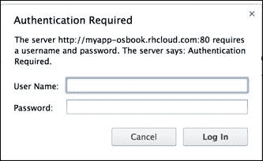

# 第八章：针对 Python 开发者的 OpenShift

本章提供了一些配方，帮助你开始在 OpenShift 上进行 Python Web 应用开发。本章包含以下配方：

+   创建你的第一个 Python 应用程序

+   管理 Python 应用程序的依赖关系

+   使用 Python 和 PostgreSQL 模块创建和部署 Flask 网络应用程序

+   启用 Python 应用程序的热部署

+   强制清除 Python 虚拟环境

+   访问应用程序的 Python 虚拟环境

+   在 Python 应用程序中使用 Gevent

+   安装自定义 Python 包

+   使用 .htaccess 文件配置 Apache

# 介绍

Python 是一种通用的高级编程语言，易于使用且非常流行。它是一种解释型语言，强调源代码的可读性，通过严格的缩进来确定代码块。Python 通常用作脚本语言，但它在 Web 应用开发和科学计算领域也非常受欢迎。Python 拥有许多强大的 Web 应用框架，如 Django、Flask、Bottle 和 Tornado，帮助开发者使用 Python 编程语言构建出色的 Web 应用程序。

OpenShift 为 Python Web 开发者提供了一个托管平台，用于部署他们的 Web 应用程序。在撰写本书时，OpenShift 支持三种版本的 Python——2.6、2.7 和 3.3。你可以通过运行以下命令查看所有可用的 Python 版本：

```
$ rhc cartridges |grep python
python-2.6          Python 2.6                              web
python-2.7          Python 2.7                              web
python-3.3          Python 3.3                              web

```

*创建你的第一个 Python 应用程序* 配方将帮助你迈出在 OpenShift 上开发 Python 应用程序的第一步。OpenShift 支持 Apache 和 `mode_wsgi` HTTP 服务器模块（[`code.google.com/p/modwsgi/`](https://code.google.com/p/modwsgi/)）来运行你的 Python Web 应用程序。Python 应用程序可以选择任何受支持的版本，并在虚拟环境工具（virtualenv）中运行。虚拟环境工具是你 Python 安装的隔离和私有副本，它只会用于该项目，而不会影响系统的全局 Python 安装。*访问应用程序的 Python 虚拟环境* 配方将教你如何通过 SSH 连接到应用程序的设备，访问虚拟环境。

我们还将介绍在 Python 应用程序中管理应用依赖关系的不同方法。你可以使用 `requirements.txt` 或 `setup.py` 或两者结合来管理应用的依赖关系。这将会在*管理 Python 应用程序依赖关系*配方中进行讲解。

本章中的示例应用程序将使用 Flask Web 框架和 PostgreSQL 数据库进行开发。我选择 Flask 是因为它的流行和易用性。你也可以使用其他任何 Web 框架，如 Bottle、web2py 和 Django。*使用 Python 和 PostgreSQL 插件创建和部署 Flask Web 应用程序* 这一部分将逐步讲解如何在 OpenShift 上编写 Flask Web 应用程序。所有源代码都可以在 OpenShift-Cookbook GitHub 组织中找到 ([`github.com/OpenShift-Cookbook`](https://github.com/OpenShift-Cookbook))。

使用独立的 WSGI 服务器，如 Gevent 或 Gunicorn，也可以与 OpenShift Python 应用程序一起使用。*在 Python 应用程序中使用 Gevent* 这一部分将详细讲解这一内容。

如果你想在本地机器上运行示例，请安装 Python、pip 和 virtualenv。pip 是一个用于安装和管理 Python 包的命令行工具。你可以在 [`docs.python-guide.org/en/latest/index.html`](http://docs.python-guide.org/en/latest/index.html) 查找为你的操作系统安装 Python 的说明。在 [`pip.readthedocs.org/en/latest/installing.html`](http://pip.readthedocs.org/en/latest/installing.html) 可以找到安装 pip 的说明。最后，你可以通过参考 [`docs.python-guide.org/en/latest/dev/virtualenvs/`](http://docs.python-guide.org/en/latest/dev/virtualenvs/) 中提到的说明，在你的机器上安装 virtualenv。

本章假设你已经熟悉 Python Web 开发基础、OpenShift 应用程序基础，以及如何使用 OpenShift 数据库插件。如果你对这些主题不太熟悉，建议你先阅读 第三章，*创建和管理应用程序*，以及 第六章，*在 OpenShift 应用程序中使用 MongoDB 和第三方数据库插件*，然后再继续阅读本章内容。

# 创建你的第一个 Python 应用程序

在本节中，你将学习如何使用 rhc 命令行工具创建一个 OpenShift Python 应用程序。我们将创建一个 Python 3.3 应用程序，然后了解 OpenShift 创建的模板应用程序。

## 准备工作

要完成本节的操作，你需要在你的机器上安装 rhc 命令行客户端。有关详细信息，请参考 第一章，*开始使用 OpenShift* 中的 *安装 OpenShift rhc 命令行客户端* 部分。

## 如何操作…

执行以下步骤，创建你的第一个 Python 应用程序：

1.  打开一个新的命令行终端，并将目录切换到你希望创建应用程序的方便位置。

1.  要创建一个新的 Python 3.3 应用程序，请运行以下命令：

    ```
    $ rhc create-app myapp python-3.3

    ```

1.  你可以用 Python 2.6 或 Python 2.7 替换 Python 3.3，来创建使用相应 Python 版本的应用程序。

1.  打开你最喜欢的网页浏览器，访问 `http://myapp-{domain-name}.rhcloud.com` 来查看应用程序。请将 `{domain-name}` 替换为你的 OpenShift 账户域名。你将看到如下所示的 OpenShift 模板应用程序：

## 它是如何工作的……

当你运行 `rhc create-app` 命令时，OpenShift 经纪人将接收请求并启动应用程序创建过程。应用程序创建过程在 第三章 *创建和管理应用程序* 的 *使用 rhc 命令行客户端创建 OpenShift 应用程序* 一节中有详细说明。要运行你的 Python 应用程序，OpenShift 需要知道你希望使用的 Python 版本。在步骤 2 中，你指定了 OpenShift 应该创建一个 Python 3.3 应用程序，并将 `myapp` 作为应用程序名称。OpenShift 将使用这些信息以及一些默认值来创建 `myapp` 应用程序。默认值包括小型机种、不可扩展的应用程序，并使用当前目录来克隆 Git 仓库。要运行基于 Python-3.3 的网络应用程序，OpenShift 将安装 Python 3.3 语言运行时，并配置 Apache 服务器与 `mod_wsgi` 模块。`mod_wsgi` 模块提供了 **Web 服务器网关接口**（**WSGI**）规范的实现，使 Apache 网络服务器能够托管支持 Python WSGI 接口的 Python 网络应用程序。WSGI 规范描述了 Web 服务器与 Web 应用程序或框架之间的简单接口，适用于 Python 编程语言。Python 社区中大多数流行的 Web 框架（[`wsgi.readthedocs.org/en/latest/frameworks.html`](http://wsgi.readthedocs.org/en/latest/frameworks.html)）都支持 WSGI 接口。这使得开发人员可以轻松地在 OpenShift 上运行他们选择的框架，因为它提供了 Apache `mod_wsgi` 部署环境。

### 注意

你也可以在其他 Python 网络服务器上运行 Python 网络应用程序，例如 Gevent。有关内容将在 *使用 Gevent 与 Python 应用程序* 这一食谱中介绍。

除了安装 Python 并使用 `mod_wsgi` 配置 Apache，每个 OpenShift 应用程序都使用 virtualenv 和 pip 来管理应用程序的依赖关系。virtualenv 工具是你 Python 安装的一个隔离和私有副本，仅用于该项目，不会影响系统的全局 Python 安装。你可以使用 pip 在 virtualenv 工具中安装包，virtualenv 将确保应用程序只访问它所需的包。虚拟环境的另一个优点是它们不需要管理员权限。

现在，让我们看看 OpenShift 创建的模板应用程序，如下所示：

```
$ cd myapp && ls -ap
$ .git/.openshift/ requirements.txt   wsgi.py  setup.py 

```

模板应用程序有三个文件——`requirements.txt`、`wsgi.py` 和 `setup.py`，此外还有 `.openshift` 和 `.git` 目录。我们在 第三章的 *使用 rhc 命令行客户端创建 OpenShift 应用程序* 章节中已经讨论过 `.openshift` 和 `.git`，所以这里就不再赘述。接下来，我们逐个讨论这三个应用程序文件：

+   `requirements.txt`：`requirements.txt` 文件用于指定应用程序依赖的库。pip 包管理器将安装 `requirements.txt` 中列出的所有应用程序依赖项。这是一个普通的文本文件，每行列出一个依赖项。格式为 `[package name]==[package version]`。下面是一个示例 `requirements.txt` 文件：

    ```
    Flask==0.10.1
    Jinja2==2.7.2
    MarkupSafe==0.21
    Werkzeug==0.9.4
    itsdangerous==0.24
    ```

+   `setup.py`：`setup.py` 文件使开发人员能够更轻松地构建和分发 Python 包，这些包将被其他项目作为依赖项导入。它允许你指定项目特定的元数据，如名称和描述，并指定依赖项。下面是一个示例 `setup.py` 文件：

    ```
    from setuptools import setup
    setup(name='MyAwesomeApp',
          version='1.0',
          description='My Awesome OpenShift Application',
          author='Shekhar Gulati',
          author_email='shekhargulati84@gmail.com',
          url='http://www.python.org/sigs/distutils-sig/',
          install_requires=['Flask>=0.7.2', 'MarkupSafe'],
          )
    ```

+   `wsgi.py`：`wsgi.py` 文件是由 OpenShift 创建的一个 WSGI 兼容的应用程序文件。如果你想使用 Apache `mod_wsgi` 服务器来托管 Python Web 应用程序，则该文件是必需的。这个文件包含了 `mod_wsgi` 模块的代码，启动时会执行该代码以获取应用程序对象。应用程序对象是一个可调用的对象，接受两个参数——`environ` 和 `start_response`。`environ` 参数是一个字典，包含了环境变量，而 `start_response` 是一个可调用对象，接受两个必需的参数：`status` 和 `response_headers`。

你可以通过运行以下命令来检查应用程序环境中运行的 Python 的确切版本：

```
$ rhc ssh --command 'python -V'
Python 3.3.2

```

## 还有更多内容...

默认情况下，Python 应用程序期望 `wsgi.py` 文件位于应用程序的根目录。如果你想更改目录结构并为 `wsgi.py` 设置不同的位置，可以通过设置 `OPENSHIFT_PYTHON_WSGI_APPLICATION` 环境变量来指定一个不同的位置，如下所示。你可以在 [`access.redhat.com/documentation/en-US/OpenShift_Online/2.0/html/User_Guide/Python_Environment_Variables.html`](https://access.redhat.com/documentation/en-US/OpenShift_Online/2.0/html/User_Guide/Python_Environment_Variables.html) 查看 Python 应用程序的环境变量列表。

```
$ rhc env-set OPENSHIFT_PYTHON_WSGI_APPLICATION=wsgi/wsgi.py

```

## 参见

+   *管理 Python 应用程序依赖* 章节

+   *启用 Python 应用程序的热部署* 章节

+   *使用 Python 和 PostgreSQL 套件创建和部署 Flask Web 应用程序* 章节

# 管理 Python 应用程序依赖

OpenShift 为 Python 开发者提供了两种指定应用程序依赖关系的方式。您可以在`setup.py`文件中的`install_requires`元素、`requirements.txt`文件中，或两者中指定应用程序依赖关系。当依赖关系在`setup.py`和`requirements.txt`文件中同时指定时，OpenShift 将安装这两个文件中列出的所有库。当您想将库作为包分发给他人使用时，`setup.py`文件是必需的。PyPi 上的所有包都需要在其根目录中包含`setup.py`脚本。由于您不打算将您的 Web 应用程序作为包分发，因此不需要使用`setup.py`文件。我建议您为 OpenShift 应用程序使用`requirements.txt`。`setup.py`之所以存在，是因为 OpenShift 最初仅支持`setup.py`，后来才添加了对`requirements.txt`文件的支持。因此，为了确保现有的应用程序在 OpenShift 上继续正常运行，我们需要支持这两种方式。在本食谱中，您将学习如何使用`requirements.txt`来指定应用程序依赖关系。此食谱中创建的应用程序源代码可以在 GitHub 上找到（[`github.com/OpenShift-Cookbook/chapter8-recipe2`](https://github.com/OpenShift-Cookbook/chapter8-recipe2)）。

## 准备工作

本食谱假设您已经阅读了*创建您的第一个 Python 应用程序*食谱。为了跟随本食谱，您需要在您的机器上安装 rhc 命令行客户端。请参考第一章中的*安装 OpenShift rhc 命令行客户端*食谱，了解详细信息。本食谱还要求您在机器上安装 virtualenv。您可以通过访问[`docs.python-guide.org/en/latest/dev/virtualenvs/`](http://docs.python-guide.org/en/latest/dev/virtualenvs/)中的说明来安装 virtualenv。

## 如何操作…

执行以下步骤来构建一个`Hello World` Flask Web 应用程序，演示如何处理应用程序依赖关系：

1.  打开一个新的命令行终端，并运行以下命令来创建一个新的 Python 应用程序：

    ```
    $ rhc create-app myapp python-3.3

    ```

    如果您想创建 Python 2.6 或 Python 2.7 应用程序，请使用`python-2.6`或`python-2.7`作为 Web cartridge 名称，而不是`python-3.3`。

1.  将目录切换到`myapp`，并按如下方式删除`setup.py`文件：

    ```
    $ cd myapp
    $ rm –f setup.py

    ```

1.  运行以下命令创建一个新的虚拟环境：

    ```
    $ virtualenv venv --python=python3.3

    ```

1.  在开始使用虚拟环境之前，您需要先激活它。要激活虚拟环境，请运行以下命令：

    ```
    $ . venv/bin/activate

    ```

1.  激活 virtualenv 后，您可以开始安装模块，而不会影响系统的默认 Python 解释器。通过运行以下命令安装 Flask 模块：

    ```
    $ pip install flask

    ```

1.  在 `myapp` 目录中创建一个名为 `hello.py` 的新 Python 文件，并在其中填入以下代码：

    ```
    from flask import Flask
    app = Flask(__name__)

    @app.route('/')
    def index():
      return 'Hello World!'

    if __name__ == '__main__':
      app.run()
    ```

1.  要在本地机器上运行此应用程序，请运行以下命令：

    ```
    $ python hello.py

    ```

1.  接下来，打开你喜欢的 Web 浏览器，访问 `http://127.0.0.1:5000`。你将看到浏览器中显示 **Hello World!**。

1.  要将此应用程序部署到 OpenShift，我们需要在 `requirements.txt` 中声明所有依赖项。以下命令将把所有应用程序的依赖项写入 `requirements.txt` 文件：

    ```
    $ pip freeze > requirements.txt

    ```

1.  上述命令会将所有应用程序依赖项添加到 `requirements.txt` 文件中。这也包括传递性依赖项。`requirements.txt` 文件将如下所示：

    ```
    Flask==0.10.1
    Jinja2==2.7.2
    MarkupSafe==0.23
    Werkzeug==0.9.4
    distribute==0.7.3
    itsdangerous==0.24

    ```

    ### 注意

    请确保 distribute 的版本是 0.7.3，因为早期版本与 Python 3.3 不兼容。如果使用早期版本的 distribute，你可能会遇到问题。

1.  此外，我们需要更新 `wsgi.py` 文件，以便加载 Flask 应用程序，而不是 OpenShift 默认创建的应用程序。在 `wsgi.py` 文件中删除所有内容，并用以下代码替换：

    ```
    #!/usr/bin/env python
    from hello import app as application
    ```

1.  在 `myapp` 目录中创建一个名为 `.gitignore` 的新文件，并将 `venv` 目录添加到忽略列表中。我们不希望将虚拟环境推送到 OpenShift；OpenShift 会根据 `requirements.txt` 文件中列出的依赖关系来创建虚拟环境。`.gitignore` 文件的内容如下：

    ```
    $ cat .gitignore 
    venv/

    ```

1.  现在将代码提交到本地仓库，然后将更改推送到应用程序 gear。OpenShift 会安装 `requirements.txt` 文件中指定的所有包，并通过虚拟环境将它们提供给应用程序，具体操作如下：

    ```
    $ git add .
    $ git commit -am "Hello World Flask application"
    $ git push

    ```

1.  现在，你可以在 `http://myapp-{domain-name}.rhcloud.com` 查看应用程序运行情况。请将 `{domain-name}` 替换为你的应用程序域名。你将在浏览器中看到 **Hello World**。

## 它是如何工作的……

在之前的步骤中，你创建了一个简单的 Flask 框架 Web 应用程序，该应用程序使用 `requirements.txt` 来指定应用程序的依赖项。Flask 是 Python 编程语言的一个微型 Web 框架。它是一个易于学习的框架，且文档齐全，文档可以在 [`flask.pocoo.org/docs`](http://flask.pocoo.org/docs) 找到。

在第 1 步中，你创建了一个名为 `myapp` 的 Python 3.3 应用程序。请阅读 *创建你的第一个 Python 应用程序* 配方，了解 OpenShift 创建的 Python 应用程序。由于你将使用 `requirement.txt` 来指定应用程序依赖项，因此在第 2 步中删除了 `setup.py` 文件。如果愿意，你可以保留 `setup.py` 文件，并在其中指定应用程序的元数据。应用程序元数据包括应用程序的名称、描述、版本等。我建议你仅在一个文件中指定应用程序依赖项，以避免出现依赖地狱 ([`en.wikipedia.org/wiki/Dependency_hell`](http://en.wikipedia.org/wiki/Dependency_hell))。

第 3 步使用 Python 3.3 解释器创建了一个新的虚拟环境。要使用虚拟环境，你必须首先使用第 4 步中显示的命令激活它。虚拟环境是处理 Python 应用程序的理想方式，因为它避免了污染系统全局的 Python 安装。

你在第 5 步使用 pip 安装了 Flask web 框架，因为我们将开发一个使用该框架的 web 应用程序。Flask 框架将被安装在虚拟环境中，并将可供你的应用程序使用。

在第 6 步，你创建了一个新的 Python 文件 `hello.py`，并添加了 `Hello World` 应用程序的源代码。第 6 步中显示的代码执行了以下操作：

+   在第 1 行，你从 `flask` 模块中导入了 `Flask` 类。

+   在第 2 行，你创建了一个 `Flask` 类的实例。这个实例将成为 WSGI 应用程序的实例。

+   然后，你为根目录（`/`）URL 定义了一个路由。该路由告诉 Flask 框架，当请求根 URL 时，应该调用 `index()` 函数。`index()` 函数将简单地在浏览器中渲染 **Hello World!**。

+   最后，如果应用程序模块的名称等于 `'__main__'`，开发服务器将启动。`__name__ == '__main__'` 表达式用于确保只有在直接使用 `python hello.py` 命令执行脚本时，开发服务器才会启动。

第 7 步通过执行 `hello.py` 脚本启动了开发 web 服务器。这将启动开发服务器并启动 Flask 应用程序。

在第 8 步，你使用 `pip freeze` 命令将所有依赖项添加到 `requirements.txt` 文件中。OpenShift 将下载该文件中提到的所有依赖项，并将它们填充到应用程序的虚拟环境中。OpenShift 使用 Apache 的 `mod_wsgi` 来运行你的 Python 应用程序。`mod_wsgi` 的入口点是 `wsgi.py` 文件。这个文件应该包含在启动时提供应用程序对象的代码。在第 9 步，你替换了 `wsgi.py` 文件的内容，使其使用 Flask 应用程序对象，而不是模板创建的应用程序对象。

最后，你将代码提交到本地 Git 仓库，并将代码推送到 OpenShift 应用程序环境中。OpenShift 首先会停止 Apache 服务器，下载 `requirements.txt` 文件中提到的所有依赖项并将它们安装到虚拟环境中，然后最终启动 Apache 服务器。`git push` 输出的一部分如下所示：

```
$ git push
Counting objects: 9, done.
Writing objects: 100% (6/6), 695 bytes, done.
Total 6 (delta 0), reused 0 (delta 0)
remote: Stopping Python 3.3 cartridge
remote: Building git ref 'master', commit 128311d
remote: Activating virtenv
remote: Checking for pip dependency listed in requirements.txt file..
remote: Downloading/unpacking Flask==0.10.1 (from -r /var/lib/openshift/536f59b3e0b8cd628600138b/app-root/runtime/repo/requirements.txt (line 1))
remote: Downloading/unpacking Jinja2==2.7.2 (from -r /var/lib/openshift/536f59b3e0b8cd628600138b/app-root/runtime/repo/requirements.txt (line 2))
…
remote: Successfully installed Flask Jinja2 MarkupSafe Werkzeug itsdangerous setuptools distribute
remote: Cleaning up...
remote: Starting Python 3.3 cartridge (Apache+mod_wsgi)
remote: Application directory "/" selected as DocumentRoot
remote: Application "wsgi.py" selected as default WSGI entry point
remote: Deployment completed with status: success 

```

## 还有更多内容...

如果你希望使用 `setup.py` 而不是 `requirements.txt`，可以删除 `requirements.txt` 文件，或者保持为空，并在 `install_requires` 元素下指定所有依赖项，如下所示。应用程序的完整源代码可以在 GitHub 上查看：[`github.com/OpenShift-Cookbook/chapter8-recipe2-setup.py`](https://github.com/OpenShift-Cookbook/chapter8-recipe2-setup.py)。

```
from setuptools import setup

setup(name='MyApp',
      version='1.0',
      description='My OpenShift App',
      author='Shekhar Gulati',
      author_email='shekhargulati84@gmail.com',
      url='http://www.python.org/sigs/distutils-sig/',
     install_requires=['Flask>=0.10.1'],
     )
```

## 另见

+   *创建你的第一个 Python 应用* 这个配方

+   *启用 Python 应用的热部署* 这个配方

+   *使用 Python 和 PostgreSQL 插件创建和部署 Flask 网络应用* 这个配方

# 使用 Python 和 PostgreSQL 插件创建和部署 Flask 网络应用

在本配方中，你将使用 Python Flask 网络框架（[`flask.pocoo.org/`](http://flask.pocoo.org/)）和 PostgreSQL 数据库开发一个简单的职位门户应用。我选择 Flask 是因为它是一个非常易于使用且流行的网络框架。你可以在 OpenShift 上运行任何网络框架，如 Django、Bottle、Zope 和 Tornado。示例应用将允许用户发布职位空缺并查看系统中所有已保存职位的列表。这两个功能将通过两个 REST 端点提供。此配方的源代码可在 GitHub 上找到：[`github.com/OpenShift-Cookbook/chapter8-jobstore-simple`](https://github.com/OpenShift-Cookbook/chapter8-jobstore-simple)。

## 准备工作

本配方假设你已经阅读了本章前面的配方。要执行此配方，你需要在计算机上安装 rhc 命令行客户端。有关详细信息，请参考 第一章 中的 *安装 OpenShift rhc 命令行客户端* 配方。此外，如果你想在本地机器上运行应用，你需要安装 Python、pip 和 virtualenv。请参考引言部分获取安装说明的链接。

## 如何操作…

要创建应用，执行以下步骤：

1.  打开一个新的命令行终端，并导航到你希望创建应用的便捷位置。创建一个新的 Python 2.7 和 PostgreSQL 9.2 OpenShift 应用，并输入以下命令：

    ```
    $ rhc create-app jobstore python-2.7 postgresql-9.2

    ```

1.  创建应用后，切换到 `jobstore` 目录，并删除 `setup.py` 文件：

    ```
    $ cd jobstore
    $ rm -f setup.py

    ```

1.  同时，创建一个 `.gitignore` 文件，并将以下内容添加到其中：

    ```
    venv/
    *.pyc

    ```

1.  为 `jobstore` 应用创建一个新的虚拟环境。运行以下命令创建虚拟环境，然后激活它：

    ```
    $ virtualenv venv --python=python2.7
    $ . venv/bin/activate

    ```

1.  现在虚拟环境已激活，你可以安装应用的依赖项。此应用使用 Flask 网络框架。要在虚拟环境中安装依赖项，运行以下命令：

    ```
    $ pip install flask

    ```

1.  创建一个名为 `jobstore.py` 的新文件，用于存放应用的源代码。以下代码是一个简单的 Flask 应用，当请求根 URL 时，它会渲染一个 `index.html` 文件：

    ```
    from flask import Flask, render_template,jsonify, request, Response

    app = Flask(__name__)
    app.config['PROPAGATE_EXCEPTIONS'] = True

    @app.route('/')
    def index():
      return render_template('index.html')

    if __name__ == '__main__':
      app.run(debug=True)
    ```

1.  在之前的代码中，索引路由将在请求根 URL 时渲染 `index.html`。默认情况下，Flask 会在应用程序文件夹内的 `templates` 目录中查找模板。Flask 框架提供的 `render_template()` 函数将 Jinja 2 模板引擎集成到应用程序中。为了确保此代码能正常工作，在应用程序源代码仓库中创建一个名为 `templates` 的新目录，如下所示：

    ```
    $ mkdir templates

    ```

1.  现在，在 `templates` 目录中创建一个新的 `index.html` 文件，并添加以下内容：

    ```
    <!DOCTYPE html>
    <html lang="en">
    <head>
    <meta charset="UTF-8">
    <title>JobStore</title>
    <link href="//cdnjs.cloudflare.com/ajax/libs/twitter-bootstrap/3.1.1/css/bootstrap.css" rel="stylesheet">
    </head>
    <body>
      <div class="container">
        <div class="row">
          <h2>JobStore application expose Two REST End Points</h2>
          <ul>
            <li>
              To create a Job, make a HTTP POST request to <code>/api/v1/jobs</code>
            </li>
            <li>
              To view all Jobs, make a HTTP GET request to <code>/api/v1/jobs</code>
            </li>
          </ul>
        </div>
      </div>

    </body>
    </html>
    ```

1.  你可以通过运行以下命令来启动 Python 服务器，测试应用程序：

    ```
    $ python jobstore.py

    ```

1.  要查看应用程序，打开你喜欢的浏览器，访问 `http://127.0.0.1:5000/`。你将看到浏览器中渲染的 `index.html`。

1.  该应用程序的主要职责是将工作数据存储到数据库中。Python 为多种数据库框架提供了支持功能，使得操作各种数据库变得非常容易。其中，SQLAlchemy 是最受欢迎且功能强大的关系型数据库框架，支持多种 RDBMS 后端。要在 Flask 应用程序中使用 SQLAlchemy，你首先需要安装 Flask SQLAlchemy 扩展。Flask SQLAlchemy 扩展简化了在 Flask 应用程序中使用 SQLAlchemy 的工作。要安装 Flask SQLAlchemy，可以运行以下 `pip` 命令：

    ```
    $ pip install flask-sqlalchemy

    ```

1.  现在你已经安装了 Flask SQLAlchemy 扩展，下一步是编写配置代码，以便 `jobstore` 应用程序能够连接到 PostgreSQL 数据库。将以下内容添加到 `jobstore.py` 中。你可以在 GitHub 上查看完整的源代码：[`github.com/OpenShift-Cookbook/chapter8-jobstore-simple/blob/master/jobstore.py`](https://github.com/OpenShift-Cookbook/chapter8-jobstore-simple/blob/master/jobstore.py)。

    ```
    from flask.ext.sqlalchemy import SQLAlchemy

    app.config['SQLALCHEMY_DATABASE_URI'] = os.environ['OPENSHIFT_POSTGRESQL_DB_URL']
    app.config['SQLALCHEMY_COMMIT_ON_TEARDOWN'] = True

    db = SQLAlchemy(app)
    ```

1.  在前面的代码中，你向 Flask 应用程序配置对象添加了两个配置选项。`SQLALCHEMY_DATABASE_URI` 指向数据库连接 URL。OpenShift 使用 `OPENSHIFT_POSTGRESQL_DB_URL` 环境变量公开 PostgreSQL 数据库连接 URL。`SQLALCHEMY_COMMIT_ON_TEARDOWN` 选项启用在每个请求结束时自动提交数据库更改。最后，你实例化了来自 `SQLAlchemy` 类的 `db` 对象，并将应用程序对象传递给它。这个 `db` 对象提供了所有与数据库相关的功能。

1.  接下来，你将编写一个模型类来表示 PostgreSQL 数据库中的 `Job` 表。模型表示存储在数据库中的持久化实体。我们在第 7 步中获得的 `db` 实例提供了一个可以扩展的基类。除此之外，`db` 对象还提供了帮助函数来定义模型类的结构。`Job` 模型如下所示：

    ```
    class Job(db.Model):
      __tablename__ = 'jobs'
      id = db.Column(db.Integer(), primary_key=True)
      title = db.Column(db.String(64), index=True, nullable=False)
      description = db.Column(db.Text())
      posted_at = db.Column(db.DateTime(), nullable=False, default=datetime.utcnow)
      company = db.Column(db.String(100), nullable=False)

      def __repr__(self):
        return 'Job %s' % self.title

      def to_json(self):
        job_json = {
          'id' : self.id,
          'title': self.title,
          'description' : self.description,
          'posted_at' : self.posted_at,
          'company':self.company
        }
        return job_json

      @staticmethod
      def from_json(job_json):
        title = job_json.get('title')
        description = job_json.get('description')
        company = job_json.get('company')
        return Job(title=title, description=description,company=company)
    ```

    `__tablename__` 变量用于定义数据库中表的名称。`db.Column()` 函数用于定义类变量，这些变量将映射到数据库表中的列。你还定义了几个帮助函数，帮助进行 JSON 转换。这些方法在我们构建 REST API 时将非常有用。

1.  现在，你将编写几个 REST 端点来暴露一些功能。第一个端点将允许用户列出数据库中的所有职位，第二个端点将允许用户创建一个新职位。REST 端点如下所示：

    ```
    @app.route('/api/v1/jobs')
    def all_jobs():
      jobs = Job.query.all()
      return jsonify({'jobs':[job.to_json() for job in jobs]})

    @app.route('/api/v1/jobs', methods=['POST'])
    def post_job():
      job = Job.from_json(request.json)
      db.session.add(job)
      db.session.commit()
      return jsonify(job.to_json()) , 201
    ```

    在前面的代码中，`all_jobs()` 函数从数据库中查询所有的 `Job` 行。数据库返回的结果被转换为 JSON 格式并返回给用户。`jsonify()` 函数是 Flask 提供的，它会创建一个带有 JSON 表示和 `application/json` MIME 类型的响应。

    `post_job()` 函数首先将 JSON 请求转换为 `Job` 对象，然后将其写入数据库。最后，它会将持久化的职位返回给用户。

1.  如在 *管理 Python 应用程序依赖项* 章节中讨论的，你必须更新 `wsgi.py` 文件，以加载 Flask 应用程序，而不是 OpenShift 默认创建的应用程序。删除 `wsgi.py` 文件中的所有内容，并用以下代码替换：

    ```
    #!/usr/bin/python
    import os
    virtenv = os.environ['OPENSHIFT_PYTHON_DIR'] + '/virtenv/'
    virtualenv = os.path.join(virtenv, 'bin/activate_this.py')
    try:
        execfile(virtualenv, dict(__file__=virtualenv))
    except IOError:
        pass
    from jobstore import app as application
    from jobstore import *
    db.create_all()
    ```

1.  在我们部署应用程序之前，最后一步是指定 `requirements.txt` 中的依赖项。运行以下命令来填充应用程序的 `requirements.txt` 文件：

    ```
    $ pip freeze > requirements.txt

    ```

1.  现在，提交代码并将应用程序更改推送到应用程序 gear，如下所示：

    ```
    $ git add .
    $ git commit -am "jobstore application created"
    $ git push

    ```

1.  应用程序将在 `http://jobstore-{domain-name}.rhcloud.com` 启动并运行。

1.  要测试 REST 端点，你可以使用 cURL。要创建一个新的 `Job` 实例，请运行以下 cURL 命令：

    ```
    $ curl -i -X POST -H "Content-Type: application/json" -H "Accept: application/json" -d '{"title":"OpenShift Evangelist","description":"OpenShift Evangelist","company":"Red Hat"}' http://jobstore-{domain-name}.rhcloud.com/api/v1/jobs

    ```

1.  要查看所有的职位，可以运行以下 cURL 命令：

    ```
    $ curl http://jobstore-osbook.rhcloud.com/api/v1/jobs

    ```

## 它是如何工作的……

在前面的步骤中，你创建了一个 Python Web 应用程序并将其部署到 OpenShift。从步骤 1 到 4，你首先创建了一个新的 Python 2.7 OpenShift 应用程序，为项目创建了一个虚拟环境，并最终激活了虚拟环境。该应用程序使用 Python Flask 框架，因此你在步骤 5 中通过 pip 安装了它。

在步骤 6 到 8 中，你创建了一个 Flask Web 应用程序，该应用程序渲染 `index.html` 文件。步骤 4 中显示的代码执行了以下操作：

+   你导入了所有必需的类和函数。

+   然后，你创建了一个 `Flask` 类的实例。唯一需要的参数是应用程序的主模块或包的名称。在大多数情况下，正确的值是 `__name__`。接着，你使用 `app.route` 装饰器为根 URL 定义了一个路由。路由允许你根据请求的 URL 将 HTTP 请求绑定到函数调用。`index` 函数将在浏览器中渲染 `index.html` 文件。

+   最后，如果应用模块的名称等于`'__main__'`，则启动开发服务器。`__name__ == '__main__'`表达式用于确保只有在通过`python jobstore.py`命令直接执行脚本时，才启动开发服务器。你在第 10 步中在本地机器上测试了该应用程序。

在第 11 至第 14 步中，你首先安装了 Flask SQLAlchemy 扩展，然后执行了以下操作：

+   首先，你从`Flask-SQLAlchemy`扩展中导入了`SQLAlchemy`类。

+   接着，你使用 Flask 配置对象中的`SQLALCHEMY_DATABASE_URI`配置了应用数据库的 URL。你还使用了另一个有用的选项`SQLALCHEMY_COMMIT_ON_TEARDOWN`，配置了在每个请求结束时自动提交数据库更改。

+   接下来，你创建了一个`SQLAlchemy`类的实例，该实例提供对所有 SQLAlchemy API 的访问。

+   接着，你使用 SQLAlchemy API 定义了`Job`模型类。`company`类继承了`db.Model`基类，并使用`db.Column`构造函数定义了模型类的结构。`__tablename__`变量用于定义数据库中表的名称。

+   最后，你定义了一些辅助函数，帮助在 JSON 与其他格式之间转换。这些方法在我们构建 REST API 时非常有用。

在第 15 步中，你为`Job`模型类定义了 REST 端点。第 15 步中的代码列表执行了以下操作：

+   当用户向`/api/v1/jobs`发送`GET`请求时，将调用`all_jobs()`函数。该函数通过 SQLAlchemy API 查找所有的工作记录，遍历结果集，然后将其转换为 JSON 格式。

+   当用户向`/api/v1/jobs`发送`POST`请求时，将创建一个新工作。JSON 数据作为`request.json` Python 字典暴露出来。然后，`request.json`字典通过`from_json`方法转换为`Job`对象。数据随后通过`db.session` API 持久化到数据库中。

在第 16 步中，你替换了`wsgi.py`文件的内容，使其使用 Flask 应用对象，而不是模板中创建的应用对象。最后，你将代码提交到本地 Git 仓库，然后将更改推送到 OpenShift 应用程序设备。一旦部署完成，你可以访问`http://jobstore-{domain-name}.rhcloud.com`并使用该应用程序。

## 还有更多

你可以通过一个命令完成之前执行的所有步骤。命令中提到的 Git 仓库包含此食谱的源代码，如下所示：

```
$ rhc create-app jobstore python-2.7 postgresql-9.2 --from-code https://github.com/OpenShift-Cookbook/chapter8-jobstore-simple.git 

```

## 另请参见

+   *创建你的第一个 Python 应用程序*食谱

+   *为 Python 应用程序启用热部署*食谱

# 为 Python 应用程序启用热部署

每次你修改应用程序源代码并将更改推送到 OpenShift 应用程序服务器的 Git 仓库时，OpenShift 首先会停止你的服务器（这会停止所有安装在服务器上的组件），然后将源代码从应用程序 Git 仓库复制到 `app-root/runtime/repo`，进行构建，准备工件，最后启动服务器（这会启动所有组件）。这个过程需要时间，不适合快速开发和部署。为了实现快速开发和更快速的部署，OpenShift 支持热部署。热部署意味着你可以在不需要重启所有应用程序组件的情况下部署你的更改。

在本教程中，你将学习如何为 Python 应用程序启用热部署。

### 注意

这个教程适用于所有三个支持的 Python 版本。

## 如何操作……

执行以下步骤为你的应用程序启用热部署：

1.  使用前面教程中开发的源代码，创建一个新的 Python 应用程序，方法如下：

    ```
    $ rhc create-app myapp python-3.3 --from-code=https://github.com/OpenShift-Cookbook/chapter8-recipe2.git

    ```

1.  打开 `hello.py` 文件，并将 `Hello World!` 更新为 `Hello from OpenShift`。

1.  要启用热部署，在 `.openshift/markers` 目录下创建一个名为 `hot_deploy` 的空文件。这个文件被称为标记文件，因为它不包含任何内容。在 *nix 系统中，你可以通过执行以下命令来创建一个新文件。在 Windows 系统中，你可以使用文件资源管理器创建一个新文件。

    ```
    $ touch .openshift/markers/hot_deploy

    ```

1.  将文件添加到 Git 仓库，然后提交并推送更改到应用程序服务器，如以下代码所示：

    ```
    $ git add –A .
    $ git commit -am "enabled hot deployment"
    $ git push

    ```

1.  在 `git push` 日志中，你会看到一条信息，说明因为启用了热部署，所以组件没有停止，如下所示：

    ```
    remote: Not stopping cartridge python because hot deploy is enabled

    ```

1.  现在，在你喜欢的网页浏览器中打开应用程序 URL，你会看到更改已部署而无需重启。

## 它是如何工作的……

`hot_deploy` 标记文件的存在告知 OpenShift 你想要进行热部署。在停止并重新启动应用程序组件之前，OpenShift 会检查 `hot_deploy` 标记文件是否存在。如果 `hot_deploy` 标记文件存在，OpenShift 将不会停止组件，且更改将无需重启组件就会部署。热部署非常适合开发过程，我建议你在开发过程中始终使用它。

### 注意

如果你启用了热部署并设置了新的环境变量或安装了新的组件，你需要重启应用程序，以便服务器能读取新的环境变量。

## 另请参见

+   *强制清理 Python 虚拟环境* 教程

+   *访问应用程序的 Python 虚拟环境* 教程

# 强制清理 Python 虚拟环境

第一次将更改推送到应用程序 gear 时，pip 会下载 `setup.py` 或 `requirements.txt` 中提到的所有依赖项，并用这些依赖项填充虚拟环境。在随后的每次推送中，OpenShift 会重用已有的依赖项，仅下载 `setup.py` 或 `requirements.txt` 中提到的新依赖项。这样可以加快应用程序的构建速度，因为它不必在每次 `git push` 时都下载依赖项。有些情况下，比如虚拟环境损坏，你可能希望重新创建虚拟环境并重新下载所有依赖项。在本配方中，你将学习如何强制 OpenShift 重新创建虚拟环境。

## 准备工作

本配方假设你已经阅读了本章中的前几个配方。要按步骤操作本配方，你需要在机器上安装 rhc 命令行客户端。有关详细信息，请参阅 第一章中的 *安装 OpenShift rhc 命令行客户端* 配方。

## 如何操作…

1.  通过运行以下命令，重新创建你在 *使用 Python 和 PostgreSQL 托管环境创建和部署 Flask Web 应用程序* 配方中开发的应用程序：

    ```
    $ rhc create-app jobstore python-2.7 postgresql-9.2 --from-code https://github.com/OpenShift-Cookbook/chapter8-jobstore-simple.git

    ```

1.  在应用程序的 `.openshift/markers` 目录中创建一个名为 `force_clean_build` 的标记文件。在 *nix 系统上，你可以使用 `touch` 命令，如下所示：

    ```
    $ cd jobstore
    $ touch .openshift/markers/force_clean_build

    ```

1.  提交该文件，并将更改推送到 OpenShift 应用程序的 gear。从现在开始，每次 `git push` 都会进行干净的部署。可以通过以下命令来演示：

    ```
    $ git add .
    $ git commit –am "enabled force_clean_build"
    $ git push

    ```

## 它是如何工作的…

`force_clean_build` 标记文件的存在通知 OpenShift 你希望进行干净的构建。当你执行 `git push` 时，OpenShift 会首先重新创建虚拟环境，激活环境，最后使用 pip 包管理器下载所有依赖项。你将在 `git push` 的日志中看到以下日志消息：

```
remote: Force clean build enabled - cleaning dependencies

```

## 另见

+   *启用 Python 应用程序的热部署* 配方

+   *强制清除 Python 虚拟环境* 配方

# 访问应用程序的 Python 虚拟环境

到现在为止，你应该已经意识到，每个 OpenShift Python 应用程序都有一个与之关联的虚拟环境。你的应用程序只能使用虚拟环境中可用的依赖项。在本配方中，你将学习如何访问 OpenShift Python 应用程序的虚拟环境。

## 准备工作

本配方假设你已经阅读了本章之前的配方。要按照此配方操作，你需要在机器上安装 rhc 命令行客户端。详情请参阅第一章中的*安装 OpenShift rhc 命令行客户端*配方，*OpenShift 入门*部分。此外，如果你想在本地机器上运行该应用，你需要在机器上安装 Python、pip 和 virtualenv。安装说明可以在引言部分找到相关链接。

## 如何操作…

执行以下步骤以访问 Python 应用的虚拟环境：

1.  通过运行以下命令，重新创建你在*使用 Python 和 PostgreSQL 托管 Flask Web 应用程序*配方中开发的应用：

    ```
    $ rhc create-app jobstore python-2.7 postgresql-9.2 --from-code https://github.com/OpenShift-Cookbook/chapter8-jobstore-simple.git

    ```

1.  切换到`jobstore`目录，然后通过执行`rhc ssh`命令 SSH 进入应用服务器。

1.  要访问虚拟环境，运行以下命令：

    ```
    [536fdb88e0b8cd76ee000262]\> . $VIRTUAL_ENV/bin/activate
    (virtenv)[536fdb88e0b8cd76ee000262]\>

    ```

1.  一旦进入虚拟环境，你可以使用 pip 手动下载新的依赖包。要安装名为**Yolk**的命令行工具，运行以下命令。Yolk 可以列出在环境中安装的包。

    ```
    (virtenv)[ 536fdb88e0b8cd76ee000262]\> pip install yolk

    ```

1.  要列出该虚拟环境中所有已安装的包，运行以下命令。为简洁起见，这里仅展示部分输出。

    ```
    (virtenv)[ 536fdb88e0b8cd76ee000262]\> yolk -l
    Babel           - 0.9.6        - active development (/opt/rh/python27/root/usr/lib/python2.7/site-packages)
    Extractor       - 0.6          - active development (/opt/rh/python27/root/usr/lib/python2.7/site-packages)
    Flask-SQLAlchemy - 1.0          - active development (/var/lib/openshift/536fdb88e0b8cd76ee000262/app-root/runtime/dependencies/python/virtenv/lib/python2.7/site-packages)

    ```

## 它是如何工作的…

你在第 1 步中创建了一个新的 Python 应用，并在第 2 步中使用 `rhc ssh` 命令通过 SSH 连接到应用服务器。虚拟环境的位置作为环境变量 `$VIRTUAL_ENV` 可用。在第 3 步中，你激活了虚拟环境以便使用它。最后，在第 4 步中，你手动使用 `pip` 命令安装了一个包。安装后，包就可以供应用使用了。

## 另见

+   *为 Python 应用启用热部署*配方

+   *强制清理 Python 虚拟环境*配方

# 使用 Gevent 运行 Python 应用程序

到目前为止，在本章中，你已经使用 Apache 配合`mod_wsgi`来运行你的 Python 应用程序。也可以使用 OpenShift 运行其他独立的 WSGI 服务器，如 Gevent 和 Gunicorn。在本配方中，你将学习如何使用 Gevent 来运行你的 Python 应用程序。Gevent 是一个基于协程的 Python 网络库，使用 greenlet 提供了一个基于 libevent 事件循环之上的高层同步 API。该仓库的源代码可以在 GitHub 上找到，地址是 [`github.com/OpenShift-Cookbook/chapter8-gevent-recipe`](https://github.com/OpenShift-Cookbook/chapter8-gevent-recipe)。

## 准备工作

本食谱假设你已经阅读了本章前面的食谱。要执行此食谱，你需要在你的机器上安装 rhc 命令行客户端。有关详细信息，请参阅第一章中*安装 OpenShift rhc 命令行客户端*的食谱，*开始使用 OpenShift*。此外，如果你想在本地机器上运行应用程序，你需要在机器上安装 Python、pip 和 virtualenv。有关这些软件安装说明的链接，请参考介绍部分。

## 如何操作…

执行以下步骤，使用 Gevent 的独立 WSGI 服务器运行 OpenShift Python 应用程序：

1.  打开一个新的命令行终端，并运行以下命令以创建一个新的 Python 2.7 应用程序：

    ```
    $ rhc app create myapp python-2.7

    ```

    如果你想创建 Python 2.6 或 Python 3.3 应用程序，请分别使用 Python 2.6 和 Python 3.3。

1.  切换到`myapp`目录，并删除`setup.py`和`wsgi.py`文件，如下所示：

    ```
    $ cd myapp
    $ rm –f setup.py
    $ rm –f wsgi.py

    ```

1.  通过运行以下命令创建一个新的虚拟环境：

    ```
    $ virtualenv venv --python=python2.7

    ```

1.  在你可以使用虚拟环境之前，必须先激活它。要激活虚拟环境，请运行以下命令：

    ```
    $ . venv/bin/activate

    ```

1.  一旦你激活了 virtualenv，就可以开始安装模块，而不会影响系统默认的 Python 解释器。通过运行以下命令来安装 Flask 模块：

    ```
    $ pip install flask

    ```

1.  在`myapp`目录中创建一个名为`hello.py`的新 Python 文件，并用以下代码填充它：

    ```
    from flask import Flask
    app = Flask(__name__)
    @app.route('/')
    def index():
      return 'Hello World!'

    if __name__ == '__main__':
      app.run()
    ```

1.  接下来，安装 Gevent 库，因为我们希望使用它来运行我们的应用程序，如下所示：

    ```
    $ pip install gevent

    ```

1.  创建一个名为`app.py`的新文件，并添加以下代码：

    ```
    import os
    virtenv = os.environ['OPENSHIFT_PYTHON_DIR'] + '/virtenv/'
    virtualenv = os.path.join(virtenv, 'bin/activate_this.py')
    try:
        execfile(virtualenv, dict(__file__=virtualenv))
    except IOError:
        pass

    from gevent.wsgi import WSGIServer
    from hello import app

    ip   = os.environ['OPENSHIFT_PYTHON_IP']
    port = int(os.environ['OPENSHIFT_PYTHON_PORT'])

    http_server = WSGIServer((ip, port), app)
    http_server.serve_forever()
    ```

1.  为了将此应用程序部署到 OpenShift，我们需要在`requirements.txt`中声明所有依赖项。以下命令会将所有应用程序依赖项写入`requirements.txt`文件：

    ```
    $ pip freeze > requirements.txt

    ```

1.  上一个命令会将所有应用程序的依赖项填充到`requirements.txt`文件中。这包括传递依赖项。`requirements.txt`文件如下所示：

    ```
    Flask==0.10.1
    Jinja2==2.7.2
    MarkupSafe==0.23
    Werkzeug==0.9.4
    gevent==1.0.1
    greenlet==0.4.2
    itsdangerous==0.24
    wsgiref==0.1.2

    ```

1.  在`myapp`目录中创建一个名为`.gitignore`的新文件，并将`venv`目录添加到忽略列表中。我们不希望将虚拟环境推送到 OpenShift，因为 OpenShift 会根据`requirements.txt`文件中提到的依赖项创建一个虚拟环境。`.gitignore`文件如下所示：

    ```
    $ cat .gitignore 
    venv/

    ```

1.  现在，将代码提交到本地仓库，然后将更改推送到应用程序 gear。OpenShift 将安装`requirements.txt`中指定的所有包，并通过虚拟环境使它们对应用程序可用，如下所示：

    ```
    $ git add .
    $ git commit -am "using Gevent standalone WSGI server"
    $ git push

    ```

1.  现在，打开你喜欢的浏览器，访问 Web 应用程序的 URL，查看应用程序的运行效果。你将在浏览器中看到**Hello World**文本。

## 它是如何工作的…

在第 1 到第 6 步中，你创建了一个简单的 Flask web 应用程序，如 *管理 Python 应用程序依赖项* 这道菜谱中所述。由于我们将使用 Gevent 来运行此应用程序，你在第 7 步安装了 Gevent 库。在第 8 步，你创建了一个新的 Python 文件 `app.py`。如果用户没有使用默认的 `wsgi.py` 文件或通过 `OPENSHIFT_PYTHON_WSGI_APPLICATION` 环境变量配置的 WSGI 端点，OpenShift 将使用 `app.py` 文件中配置的服务器来提供服务。此 Python 文件应命名为 `app` 并存在于 `app` 根目录下。`app.py` 文件中的代码首先激活虚拟环境，然后在 `$OPENSHIFT_PYTHON_IP` 和 `$OPENSHIFT_PYTHON_PORT` 启动 Gevent WSGI 服务器。

在第 9 步中，你使用 `pip freeze` 命令将所有依赖项添加到 `requirements.txt` 文件中。OpenShift 将下载此文件中提到的所有依赖项，并将它们填充到应用程序的虚拟环境中。

最后，你将代码提交到本地 Git 仓库，并将其推送到 OpenShift 应用程序的 gear 上。OpenShift 将使用 Gevent WSGI 服务器来运行你的应用程序。在 `git push` 的日志中，你将看到如下命令行输出的一行。以下这一行清楚地告诉你，OpenShift 正在使用 `app.py` 中配置的服务器：

```
remote: Starting Python 2.7 cartridge (app.py server)

```

## 还有更多...

同样，你也可以使用 Tornado web 服务器来提供 Python web 应用程序。卸载 Gevent 和 greenlet 库，然后安装 Tornado 库：

```
$ pip uninstall gevent greenlet
$ pip install tornado

```

通过运行 `pip freeze > requirements.txt` 命令，将依赖项更新到 `requirements.txt` 文件中。

在 `app.py` 文件中，将 Gevent 代码替换为以下代码：

```
from tornado.wsgi import WSGIContainer
from tornado.httpserver import HTTPServer
from tornado.ioloop import IOLoop
from hello import app

http_server = HTTPServer(WSGIContainer(app))
ip   = os.environ['OPENSHIFT_PYTHON_IP']
port = int(os.environ['OPENSHIFT_PYTHON_PORT'])

http_server.listen(port, ip)
IOLoop.instance().start()
```

现在你的应用程序将使用 Tornado web 服务器。

## 另见

+   *创建你的第一个 Python 应用程序* 这道菜谱

+   *使用 Python 和 PostgreSQL 托管 Flask web 应用程序的创建与部署* 这道菜谱

# 安装自定义 Python 包

大多数时候，你的应用程序依赖项可以通过 pip 从 PyPi 下载，但有时应用程序需要依赖于一些在 PyPi 索引中不存在的自定义库。在这道菜谱中，你将学习如何在 OpenShift Python 应用程序中使用自定义 Python 包。此菜谱的源代码可在 GitHub 上找到：[`github.com/OpenShift-Cookbook/chapter8-custom-package-recipe`](https://github.com/OpenShift-Cookbook/chapter8-custom-package-recipe)。

## 准备工作

本食谱基于假设你已经阅读了本章前面的食谱。要完成此食谱，你需要在机器上安装 rhc 命令行客户端。有关详细信息，请参见第一章中的*安装 OpenShift rhc 命令行客户端*食谱，*OpenShift 入门*。此外，如果你想在本地机器上运行应用程序，你需要安装 Python、pip 和 virtualenv。有关安装相应软件的链接，请参见介绍部分。

## 如何操作…

1.  打开一个新的命令行终端，并运行以下命令创建一个新的 Python 2.7 应用程序：

    ```
    $ rhc create-app myapp python-2.7

    ```

    如果你想创建 Python 2.6 或 Python 3.3 应用程序，分别使用 Python 2.6 和 Python 3.3。

1.  切换到`myapp`目录，并按如下方式删除`setup.py`文件：

    ```
    $ cd myapp
    $ rm –f setup.py

    ```

1.  同时，创建一个`.gitignore`文件，以忽略虚拟环境的产物和 Python 编译文件，如下所示：

    ```
    $ touch .gitignore

    ```

1.  向其中添加以下行：

    ```
    venv
    *.pyc

    ```

1.  创建一个新的虚拟环境并通过运行以下命令激活它：

    ```
    $ virtualenv venv --python=python2.7
    $ . venv/bin/activate

    ```

1.  一旦激活了虚拟环境，你就可以开始安装模块，而不会影响系统的默认 Python 解释器。通过运行以下命令安装 Flask 模块：

    ```
    $ pip install flask

    ```

1.  在应用程序根目录中创建一个名为`libs`的新目录，如下代码所示。`libs`目录将用于存储你的自定义包：

    ```
    $ mkdir libs

    ```

1.  现在，我们将在`libs`目录中创建一个名为`msgs`的自定义包。要创建自定义包，请执行以下步骤：

    1.  在`libs`目录中创建一个`msgs`目录。

    1.  在`msgs`目录中创建一个名为`__init__.py`的空文件。

    1.  在`msgs`目录中创建另一个名为`hello.py`的文件，并将以下代码放入其中：

        ```
        def hello():
          return 'Hello World'
        ```

1.  接下来，在`myapp`目录中创建一个名为`myapp.py`的新 Python 文件，并用以下代码填充它。这个简单的 Flask 应用程序将使用`msgs`包。看一下以下代码：

    ```
    from flask import Flask
    import msgs.hello as hello
    app = Flask(__name__)
    @app.route('/')
    def index():
      return hello.hello()
    if __name__ == '__main__':
      app.run(debug=True)
    ```

1.  现在，你需要更新`wsgi.py`文件，以加载 Flask 应用程序，而不是 OpenShift 默认创建的应用程序。删除`wsgi.py`文件中的所有内容，并用以下代码替换：

    ```
    #!/usr/bin/python
    import os
    virtenv = os.environ['OPENSHIFT_PYTHON_DIR'] + '/virtenv/'
    virtualenv = os.path.join(virtenv, 'bin/activate_this.py')
    try:
        execfile(virtualenv, dict(__file__=virtualenv))
    except IOError:
        pass

    from myapp import app as application 
    ```

1.  为了在 OpenShift 上部署此应用程序，我们必须在`requirements.txt`中声明所有依赖项。以下命令将把你的所有应用程序依赖项写入`requirements.txt`：

    ```
    $ pip freeze > requirements.txt

    ```

1.  现在，将代码提交到本地仓库，然后将更改推送到应用程序的 gear。OpenShift 将安装`requirements.txt`中指定的所有软件包，并通过虚拟环境使它们可用于应用程序：

    ```
    $ git add .
    $ git commit -am "application with custom package"
    $ git push

    ```

1.  现在，在你喜欢的浏览器中打开 Web 应用程序的 URL，查看应用程序的实际效果。你将看到浏览器中显示的**Hello World**文本。

## 它是如何工作的…

在前面的步骤中，你已经学习了如何使用 `libs` 目录来存储自定义包。`libs` 目录是 OpenShift 如何使用约定优于配置的一个示例。短语 *约定优于配置* 意味着，如果你遵循某些约定，就不需要编写配置代码。OpenShift 遵循一个约定，即所有在 `libs` 目录中的包应该放置在路径中，以便你的应用程序能够使用它们。在第 6 步中，你在 `libs` 目录中创建了一个名为 `msgs` 的自定义包，并且没有任何配置的情况下，你的应用程序可以访问这个包。

## 还有更多…

现在，假设你想使用 `mydeps` 目录来存储你的自定义包。为了使应用程序正常工作，你需要在应用程序中编写代码，将 `mydeps` 目录添加到系统路径中。在应用程序的 `wsgi.py` 文件中添加两行代码可以解决这个问题。完整的应用程序源代码可以在 GitHub 上找到，地址是 [`github.com/OpenShift-Cookbook/chapter8-custom-package-mydeps-recipe`](https://github.com/OpenShift-Cookbook/chapter8-custom-package-mydeps-recipe)。看看以下代码：

```
import os,sys
sys.path.append(os.path.join(os.getenv("OPENSHIFT_REPO_DIR"), "mydeps"))  
```

前两行将 `mydeps` 目录添加到应用程序的系统路径中。

## 另见

+   *创建你的第一个 Python 应用程序* 食谱

+   *使用 Python 和 PostgreSQL 套件创建和部署 Flask web 应用程序* 食谱

# 使用 .htaccess 文件配置 Apache

到目前为止，你应该已经意识到 OpenShift 使用 Apache 配合 `mod_wsgi` 来为你的 web 应用程序提供服务。在这个食谱中，你将学习如何使用 `.htaccess` 和 `.htpasswd` 文件来配置 Apache web 服务器以启用 HTTP 基本身份验证。此食谱的 GitHub 仓库是 [`github.com/OpenShift-Cookbook/chapter8-htaccess-recipe`](https://github.com/OpenShift-Cookbook/chapter8-htaccess-recipe)。

## 准备工作

本食谱假设你已经阅读了本章前面的食谱。为了执行本食谱，你需要在你的机器上安装 rhc 命令行客户端。有关详细信息，请参阅第一章中的 *安装 OpenShift rhc 命令行客户端* 食谱，*使用 OpenShift 入门*。

## 如何操作…

执行以下步骤以启用 HTTP 基本身份验证：

1.  使用 rhc 命令行工具创建一个新的 Python 2.7 应用程序：

    ```
    $ rhc create-app myapp python-2.7

    ```

1.  切换到 `myapp` 目录，并在该目录下创建两个文件，`.htaccess` 和 `.htpasswd`。如果你使用的是 *nix 系统，可以使用 `touch` 命令。在 Windows 系统上，你可以使用文件资源管理器来创建文件。以下是相关命令：

    ```
    $ cd myapp
    $ touch .htaccess
    $ touch .htpasswd

    ```

1.  在 `.htaccess` 文件中，复制并粘贴以下代码内容：

    ```
    AuthType Basic
    AuthName "Authentication Required"
    AuthUserFile "$OPENSHIFT_REPO_DIR/.htpasswd"
    Require valid-user
    ```

    将 `$OPENSHIFT_REPO_DIR` 替换为你的应用程序所在的 `$OPENSHIFT_REPO_DIR` 路径。要获取 `$OPENSHIFT_REPO_DIR` 的值，可以运行以下命令：

    ```
    $ rhc ssh --command 'echo $OPENSHIFT_REPO_DIR'

    ```

1.  `.htpasswd` 文件用于存储用户名和密码凭据。要生成新的用户名和密码，你可以使用在线生成器 [`www.htaccesstools.com/htpasswd-generator/`](http://www.htaccesstools.com/htpasswd-generator/)。在这个方案中，用户名和密码分别是`admin`和`password`。将在线工具生成的内容放入`.htpasswd`文件中。我的`.htpasswd`文件如下所示：

    ```
    admin:$apr1$EVxfKxv/$2BIOIAPHOZiyx4k52b5jT1ewdfg

    ```

1.  提交代码，并将更改推送到应用程序配件：

    ```
    $ git add .
    $ git commit -am "added .htaccess and .htpasswd"
    $ git push

    ```

1.  部署应用程序后，在你最喜欢的网页浏览器中打开应用程序的 URL。这时，你将看到一个弹出窗口，要求你输入用户名和密码，如下图所示：

1.  输入`admin`/`password`组合后，你将能够进入你的网页应用程序。

## 它是如何工作的…

这个方案是 OpenShift 提供给应用程序开发人员的灵活性的另一个例子。有几种方法可以配置 Apache Web 服务器。一种方法是更新主配置文件，通常名为`httpd.conf`。但是，OpenShift 不允许用户更新`httpd.conf`文件。OpenShift 允许用户通过 `.htaccess` 文件配置 Apache Web 服务器。`.htaccess` 文件提供了一种按目录进行配置更改的方法。此文件可以包含一个或多个配置指令。这些指令将应用于`.htaccess`文件所在的目录及其所有子目录。

在第 1 步中，你创建了一个名为`myapp`的 Python 2.7 应用程序。然后，在第 2 步中，你在`myapp`目录中创建了两个文件—`.htaccess`和`.htpasswd`。在第 3 步中，你更新了`.htaccess`文件的内容，添加了 HTTP 基本认证配置。你可以通过文档 [`httpd.apache.org/docs/2.2/howto/auth.html`](http://httpd.apache.org/docs/2.2/howto/auth.html) 了解更多内容。

接下来，在第 4 步中，你使用在线 `.htpasswd` 生成器生成了`.htpasswd`文件的内容。你将生成器生成的内容放入`.htpasswd`文件中，然后在第 5 步中提交了所有更改。成功部署后，在第 6 步中，你在浏览器中打开了应用程序 URL。系统要求你输入`admin`/`password`的用户名/密码凭据。输入有效的用户名/密码组合后，你就可以进入应用程序，在第 7 步中顺利登录。

## 另请参见

+   *创建你的第一个 Python 应用程序* 方案

+   *使用 Python 和 PostgreSQL 托盘创建和部署 Flask Web 应用程序* 方案
