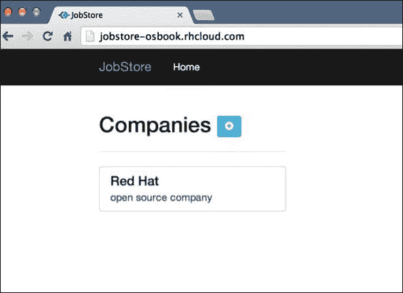
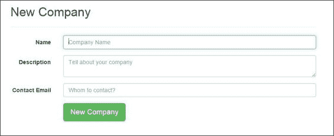
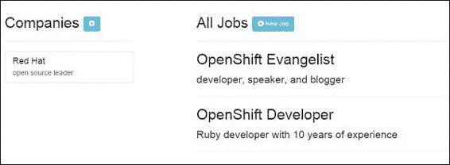

# 第九章：Node.js 开发者的 OpenShift

本章介绍了一些食谱，帮助你开始在 OpenShift 上进行 Node.js Web 应用程序开发。本章的具体食谱包括：

+   创建你的第一个 Node.js 应用程序

+   配置 Node 监控选项

+   管理 Node.js 应用程序的依赖

+   使用 `use_npm` 标记

+   为 Node.js 应用程序启用热部署

+   使用 Node.js 和 MongoDB Cartridge 创建和部署 Express Web 应用程序

+   使用 Web Socket

+   在 OpenShift Node.js 应用程序中使用 CoffeeScript

# 介绍

Node.js 是一个基于 Google Chrome V8 JavaScript 引擎的服务器端 JavaScript 平台，开发人员可以利用它编写应用程序。这些应用程序可以是 Web 应用程序、命令行工具或用于自动化任务的脚本。Node.js 是 Web 应用程序开发中的一个非常流行的选择，因为它允许 Web 开发人员在客户端和服务器端都使用相同的编程语言，例如 JavaScript。由于其异步、事件驱动、非阻塞的 I/O 特性，Node.js 非常适合构建高并发、数据密集型、实时的 Web 应用程序。Node.js 具有一个小巧的核心，提供基本的构建块 API，用于编写更高层次的框架。开发人员可以利用这些 Web 框架来构建他们的精彩 Web 应用程序。

有许多 Web 框架，如 Express（[`expressjs.com/`](http://expressjs.com/)）、Sails.js（[`sailsjs.org/`](http://sailsjs.org/)）、Restify（[`mcavage.me/node-restify/`](http://mcavage.me/node-restify/)）和 Geddy（[`geddyjs.org/`](http://geddyjs.org/)），这些框架是 Node 社区开发的，开发人员可以用它们来构建 Web 应用程序。许多大型科技公司，如 LinkedIn、Walmart（[`venturebeat.com/2012/01/24/why-walmart-is-using-node-js/`](http://venturebeat.com/2012/01/24/why-walmart-is-using-node-js/)）和 Yahoo，都在生产应用程序中使用 Node.js。

OpenShift 为 Web 开发人员提供了一个托管平台，用于部署他们的 Node.js Web 应用程序。你可以在 OpenShift 上运行使用任何 Node.js Web 框架（如 Express 或 Geddy）构建的应用程序。写这本书时，OpenShift 支持两个版本的 Node.js——0.6 和 0.10。以下命令显示当前支持的 Node.js 版本：

```
$ rhc cartridges | grep node
nodejs-0.10         Node.js 0.10                            web
nodejs-0.6          Node.js 0.6                             web

```

### 注意

Node 版本 0.6 的 Cartridge 将在未来被弃用，因此建议不要在 Web 应用程序中使用它。本书将仅覆盖版本 0.10。

*创建你的第一个 Node.js 应用程序* 这部分将引导你创建你的第一个 OpenShift Node.js Web 应用程序。我们将了解 OpenShift 创建的模板应用程序，然后使用 Node 的 HTTP 模块编写一个简单的 HTTP 服务器，并将其部署到 OpenShift。

Node.js Web 应用程序与你可能曾经编写过的传统 Web 应用程序有很大不同。Web 应用程序本身就是 Web 服务器，因此你不需要 Apache 或任何其他 Web 服务器来托管 Web 应用程序。有多种方法可以启动 Node 应用程序，例如使用命令 `node <app script file>` 和 `npm start`，`supervisor <app script file>`。OpenShift 使用一个名为 **node-supervisor** 的 Node 模块来运行你的应用程序。node-supervisor 模块（[`github.com/isaacs/node-supervisor`](https://github.com/isaacs/node-supervisor)）运行 Node 应用程序并监控任何更改。一旦检测到更改，它会重新启动应用程序。在*配置 Node 监督程序选项*的教程中，你将学习如何自定义一些监督程序选项，以利用热重载行为。使用监督程序的替代方法是使用 `npm start` 命令运行 Node 应用程序。你可以通过使用标记文件配置 OpenShift Node.js 应用程序，使用 `npm start` 而不是 `supervisor`。这一点将在*使用 use_npm 标记*的教程中讲解。

在*管理 Node.js 应用程序依赖*的教程中，你将学习 OpenShift 如何使用 `npm` 来安装和管理应用程序依赖。

本章中的示例应用程序将使用 Express Web 框架和 MongoDB 数据库进行开发。*使用 Node.js 和 MongoDB 卡片创建和部署 Express Web 应用程序*的教程将引导你完成在 OpenShift 上构建和部署 Express Web 应用程序所需的所有步骤。本章的所有源代码都可以在 OpenShift Cookbook GitHub 组织中找到（[`github.com/OpenShift-Cookbook`](https://github.com/OpenShift-Cookbook)）。

Node.js 在构建实时 Web 应用程序方面非常流行，特别是使用 Web Sockets。在*使用 Web Sockets*的教程中，你将使用 Node 的 Socket.IO 库构建一个简单的实时应用程序。

开发人员除了使用 JavaScript 编写 Node 应用程序外，还可以使用 CoffeeScript 编写 Node 应用程序。CoffeeScript 会编译成 JavaScript，且在不喜欢使用 JavaScript 的开发人员中非常流行。*在 OpenShift Node.js 应用程序中使用 CoffeeScript*的教程将详细介绍这一点。

要在本地机器上运行本章中开发的示例应用程序，你需要在操作系统上安装 Node。你可以从官方网页获取适用于你操作系统的最新 Node.js 安装程序，[`nodejs.org/download/`](http://nodejs.org/download/)。安装程序还会为你安装 npm。本章还将使用 MongoDB 数据库。你可以从其官方网站获取适用于你操作系统的最新 MongoDB 安装程序（[`www.mongodb.org/downloads`](http://www.mongodb.org/downloads)）。

本章假设你已经掌握了 Node Web 开发基础、OpenShift 应用程序基础以及如何使用 OpenShift 数据库 Cartridge。如果你不熟悉这些主题，我建议你先阅读第三章，*创建与管理应用程序*，以及第六章，*在 OpenShift 应用程序中使用 MongoDB 和第三方数据库 Cartridge*，然后再继续本章内容。

# 创建你的第一个 Node.js 应用程序

在这个配方中，你将学习如何使用 rhc 命令行工具创建你的第一个 OpenShift Node.js 应用程序。在了解了 OpenShift 创建的模板应用程序后，你将使用 Node 的 HTTP 模块编写一个 `Hello World` Node.js 应用程序。

## 准备工作

要完成这个配方，你需要在你的机器上安装 rhc 命令行客户端。详情请参考第一章中*安装 OpenShift rhc 命令行客户端*的配方，*OpenShift 入门*。此应用程序将消耗一个 gear，因此，如果你没有额外的 gear 可用于这个配方，请使用`rhc delete-app <app_name> --confirm`命令删除现有应用程序。要在本地机器上运行此应用程序，你需要在机器上安装 Node。你可以从官方网站获取适用于你操作系统的最新 Node.js 安装程序，网址是[`nodejs.org/download/`](http://nodejs.org/download/)。

## 如何执行…

执行以下步骤来创建你的第一个 OpenShift Node.js 应用程序：

1.  打开一个新的命令行终端，并将目录更改为你想创建应用程序的合适位置。要创建一个 Node.js 0.10 应用程序，请运行以下命令：

    ```
    $ rhc create-app myapp nodejs-0.10

    ```

1.  打开你最喜欢的 web 浏览器，访问 `http://myapp-{domain-name}.rhcloud.com` 查看应用程序。请将 `{domain-name}` 替换为你的 OpenShift 账户域名。

1.  OpenShift 创建的模板应用程序是一个 Express Web 框架应用程序。你可以通过使用 `--from-code` 选项指定自己的公共 Git 仓库来使用你自己的模板应用程序。这在第三章的*指定自己的模板 Git 仓库 URL*配方中已介绍，*创建与管理应用程序*。在这个配方中，你不需要 OpenShift 生成的模板代码，所以请删除 OpenShift 创建的所有文件和目录，除了 `.openshift` 目录。在 *nix 系统上，你可以使用 `rm` 命令删除文件，如下所示。Windows 系统上，你可以使用文件资源管理器或命令行等效命令删除这些文件。

    ```
    $ cd myapp
    $ rm -rf deplist.txt index.html node_modules/ package.json server.js

    ```

1.  在应用程序根目录中创建一个名为 `server.js` 的新空文件。 在 *nix 系统中，你可以使用 `touch` 命令创建一个新文件。 在 Windows 系统中，你可以使用文件资源管理器创建新文件。 运行以下命令：

    ```
    $ touch server.js

    ```

    在你喜欢的编辑器中打开文件，并使用以下代码填充它：

    ```
    var http = require('http');
    var ip = process.env.OPENSHIFT_NODEJS_IP || '127.0.0.1';
    var port = process.env.OPENSHIFT_NODEJS_PORT || 3000;
    var server = http.createServer(function(req,res){
       res.writeHead(200, {'Content-Type':'text/plain'});
       res.end('Hello World!!');
    });
    server.listen(port,ip);
    console.log('Server running at http://%s:%d',ip,port);
    ```

1.  要在本地计算机上运行应用程序，请运行以下命令：

    ```
    $ node server.js

    ```

    要查看应用程序的实际效果，请在你喜欢的浏览器中打开 `http://127.0.0.1:3000`。 你将在浏览器中看到呈现的 **Hello World!!** 消息。

1.  要将应用程序部署到 OpenShift，请将代码提交到本地 Git 仓库，然后将更改推送到应用程序齿轮：

    ```
    $ git add .
    $ git commit -am "Hello World Node.js application" 
    $ git push

    ```

1.  部署成功后，在你喜欢的浏览器中打开 `http://myapp-{domain-name}.rhcloud.com`。 浏览器将呈现 **Hello World!!**。

## 工作原理如下…

在前面的步骤中，你从头开始创建了一个 `Hello World` Node.js 应用程序，并将其部署到 OpenShift 上。 在上述步骤中编写的 `Hello World` 应用程序与如果要在本地计算机或其他地方运行此应用程序时将要编写的应用程序没有任何不同。 除了环境变量外，没有 OpenShift 特定的内容。

在第一步中，你使用了 `rhc` 命令行工具创建了一个 OpenShift Node.js 0.10 应用程序。 `rhc create-app` 命令将向 OpenShift 代理发送 HTTP POST 请求。 OpenShift 代理将接受请求，然后启动应用程序创建过程。 你指定 OpenShift 应该创建一个名为 `myapp` 的 Node.js 0.10 应用程序。 OpenShift 将使用这些细节以及一些默认设置来创建 `myapp` 应用程序。 默认设置包括小型齿轮大小，不可扩展应用程序，并使用当前目录克隆 Git 仓库。 在幕后，OpenShift 完成了以下操作：

+   OpenShift 创建了一个带有 Node.js 载体的新应用程序齿轮。

+   它为你的应用程序创建了一个私有 Git 仓库，并使用模板应用程序填充了它。 OpenShift 创建的模板应用程序是一个 Express Web 框架应用程序。

+   它安装了一个 Git 操作钩子，用于构建应用程序。 在应用程序构建阶段，它将使用 `npm install` 命令下载 `package.json` 中提到的所有依赖项。

+   它为你的应用程序创建了一个公共 DNS，以便从外部世界访问。

成功创建应用程序后，你将在当前目录中拥有 `myapp` 目录。 你可以按照第 2 步中提到的在浏览器中打开应用程序 URL 的方式查看应用程序。 应用程序创建过程在 第三章 的 *使用 rhc 命令行客户端创建 OpenShift 应用程序* 配方中详细说明了。

现在，让我们来看看 OpenShift 创建的模板应用程序：

```
$ cd myapp && ls -ap
.git/      README.md    index.html   package.json
.openshift/   deplist.txt   node_modules/   server.js

```

模板应用有五个文件——`README.md`、`index.html`、`package.json`、`deplist.txt` 和 `server.js`——以及 `node_modules` 目录，除此之外还有 `.openshift` 和 `.git` 目录。我们已经在 *使用 rhc 命令行客户端创建 OpenShift 应用* 这一食谱中讲解了 `.openshift` 和 `.git`，可以参考 第三章，*创建和管理应用*，所以这里不再赘述。接下来我们逐一讲解其他文件：

+   `README.md`：这是一个标准的 Git 仓库 Markdown 文件，用于总结你的项目。GitHub 使用 `README.md` 来生成项目的 HTML 概述。

+   `index.html`：此文件包含当你在浏览器中查看应用时看到的 HTML 标记。它是一个 HTML 5 文件，使用了 Twitter Bootstrap 样式。

+   `package.json`：这是你的 Node 应用描述文件。它是一个 JSON 文档，包含关于应用的所有信息，例如名称、描述、版本和应用所依赖的库。完整的文档可以在 [`www.npmjs.org/doc/json.html`](https://www.npmjs.org/doc/json.html) 查阅。

+   `deplists.txt`：这是 OpenShift Node.js 应用中用于指定应用依赖的过时方法。建议不要使用它，因为未来可能会删除此方法。该文件仅存在于向后兼容的情况下，以便使用它的应用继续运行。

+   `server.js`：此文件包含由 OpenShift 创建的模板 Express Web 框架应用。该应用暴露了两个路由，`/` 和 `/asciimo`。`/` 路由呈现 `index.html`，第二个路由呈现带有图像的 HTML 页面。Express 应用将在 *使用 Node.js 和 MongoDB 插件创建和部署 Express Web 应用* 这一食谱中详细介绍，因此我们在本食谱中不再讲解。

+   `node_modules`：此目录包含你在 `package.json` 中指定的所有应用依赖项。`npm install` 命令会将所有依赖项下载到 `node_modules` 目录中。

OpenShift 生成的模板应用是一个标准的 Express Web 应用。要在本地机器上运行此应用，你可以运行以下命令：

```
$ npm install
$ node server.js

```

该应用将在 `http://127.0.0.1:8080/` 运行。前两个命令执行了以下操作：

+   `npm install` 命令会下载 `package.json` 文件中列出的所有依赖项。模板应用提到将 `express` 作为其依赖项，因此 `npm install` 命令将下载 Express 及其所有传递性依赖项，并将其存放在 `node_modules` 目录中。

+   如介绍部分所述，在 Node 中，服务器和应用是同一个。因此，你使用 `node server.js` 命令启动了应用的服务器。这个命令启动了 HTTP 服务器，你可以开始发起请求。

`node server.js` 命令是一种启动应用程序的方式。启动应用程序的其他替代方式是 `npm start` 和 `supervisor server.js` 命令。如果提供了启动脚本，`npm start` 命令将运行该脚本。启动脚本可以在 `package.json` 文件中指定：

```
"scripts":{"start":"node server.js"}
```

如果 `package.json` 文件中没有包含启动脚本，`npm start` 命令将默认使用 `node server.js` 命令作为启动脚本。

默认情况下，OpenShift 不使用 `npm start` 或 `node <server script>` 命令来运行应用程序。它使用一个名为 node-supervisor 的模块来运行应用程序。你可以配置 OpenShift 的 Node 应用程序使用 `npm start` 命令，而不是 node-supervisor。这将在 *使用 use_npm 标记* 这一部分中进行讲解。使用 supervisor 的主要优势是，当应用程序崩溃时，它可以重启应用程序。此外，你还可以使用 supervisor 实现热重载功能。它可以监视一组目录和文件，并在代码发生变化时重新启动应用程序。

如果你想在本地机器上使用 node-supervisor，你可以使用以下命令安装 node-supervisor 模块：

```
$ npm install supervisor -g

```

现在你可以使用 `supervisor server.js` 命令启动应用程序。每当你对源代码进行更改时，这将重新启动应用程序。这在开发过程中非常有用，因为它节省了重新启动应用程序所需的时间。

在第 3 步中，你删除了 OpenShift 生成的模板源代码，以便从头开始编写一个简单的 HTTP 服务器。在第 4 步中，你创建了一个名为 `server.js` 的新文件，并用 `Hello World` 的 Node.js 代码填充了它。第 4 步中的代码执行以下操作：

+   你通过 `require()` 函数导入了 Node HTTP 模块。这个模块将用于编写服务器。

+   然后，你创建了两个变量来保存 IP 地址和端口。如果应用程序运行在本地机器上，OpenShift 特定的环境变量将不可用。因此，IP 和端口将分别设置为 `127.0.0.1` 和 3000。

+   接下来，你使用 HTTP 模块的 `createServer()` 函数创建了 HTTP 服务器。你传递了一个回调函数，该函数将在每次请求发生时被触发。回调函数接受两个参数——请求和响应，并将 `Hello World` 写入响应中。

+   最后，你指示服务器监听 IP 和端口变量。

在第 5 步中，你通过运行 `node server.js` 命令在本地机器上测试了 `Hello World` 应用程序。为了将应用程序部署到 OpenShift，你将代码提交到本地 Git 仓库，并在第 6 步中将更改推送到应用程序的 gear。

当你将源代码推送到 OpenShift Node.js 应用程序的 Git 仓库时，OpenShift 将执行以下操作：

+   首先，所有的代码都被推送到应用程序的 Git 仓库。

+   然后，如果 `package.json` 文件存在，并且这是你第一次推送源代码，OpenShift 会下载 `package.json` 中提到的所有依赖项。每次后续推送时，只有尚未存在的新增依赖项会被下载，所有现有的节点模块将被缓存。

+   OpenShift 将使用后续列表中提到的三种命令之一来运行应用。当 `use_npm` 标记文件存在时，运行方式会有所变化，具体内容将在 *使用 use_npm 标记* 方案中介绍。

    +   如果 `package.json` 不存在，OpenShift 将运行 `supervisor server.js` 命令。

    +   如果 `package.json` 存在且应用的主文件名是 `server.js`，OpenShift 将运行 `supervisor server.js` 命令。主文件名在 `package.json` 的 main 元素中指定。

    +   如果 `package.json` 存在且应用的主文件名不是 `server.js`（例如 app.js），OpenShift 将运行 `supervisor app.js` 命令。

由于你未包含 `package.json`，OpenShift 将使用 `supervisor server.js` 命令来运行应用。应用启动后，你可以在浏览器中打开应用的 URL，你将看到 **HelloWorld!!**，如第 7 步所示。

## 另见

+   *配置节点监督员选项* 方案

+   *为 Node.js 应用启用热部署* 方案

+   *管理 Node.js 应用依赖* 方案

# 配置节点监督员选项

如 *创建你的第一个 Node.js 应用* 方案中所述，OpenShift 使用 node-supervisor 模块来运行你的程序。在本方案中，你将学习如何配置 node-supervisor 选项。如果你在机器上已安装 node-supervisor 模块，可以通过运行以下命令查看所有支持的选项。你可以通过执行 `npm install supervisor -g` 命令来安装 node-supervisor。帮助选项可以通过以下命令查看：

```
$ supervisor --help

```

OpenShift 允许你配置 node-supervisor 的 watch 和 poll-interval 选项。watch 选项允许你指定一个以逗号分隔的文件夹或 JavaScript 文件列表，监督员将监视这些文件的变化。poll-interval 选项允许你指定监督员检查变化的频率。

## 准备工作

要完成此步骤，你需要在机器上安装 rhc 命令行客户端。请参考第一章，*OpenShift 入门*中的*安装 OpenShift rhc 命令行客户端*步骤获取详细信息。此应用程序将消耗一个 gear，因此如果你没有额外的 gear 可用，可以使用`rhc delete app <app_name> --confirm`命令删除现有应用程序。要在本地机器上运行此应用程序，你需要安装 Node。你可以从官方网站[`nodejs.org/download/`](http://nodejs.org/download/)获取适合你操作系统的最新 Node.js 安装程序。

## 如何操作……

执行以下步骤以配置监视器选项：

1.  如果你还没有运行 Node.js 应用程序，可以执行以下命令创建一个新应用程序。这将创建你在*创建你的第一个 Node.js 应用程序*步骤中创建的应用程序。

    ```
    $ rhc create-app myapp nodejs-0.10 --from-code https://github.com/OpenShift-Cookbook/chapter9-recipe1.git

    ```

1.  切换到`myapp`目录，并创建两个环境变量来配置监视器的轮询间隔和需要监视的目录。

    ```
    $ cd myapp
    $ rhc env-set OPENSHIFT_NODEJS_POLL_INTERVAL=60000 OPENSHIFT_NODEJS_WATCH=$OPENSHIFT_REPO_DIR --app myapp

    ```

    将`$OPENSHIFT_REPO_DIR`变量替换为你的应用程序的`$OPENSHIFT_REPO_DIR`环境变量的值。你可以通过运行以下命令获取`$OPENSHIFT_REPO_DIR`的值：

    ```
    $ rhc ssh --command "env |grep OPENSHIFT_REPO_DIR"

    ```

1.  重启应用程序，以便它能够识别新的环境变量：

    ```
    $ rhc restart-app --app myapp

    ```

## 工作原理……

node-supervisor 模块帮助 OpenShift 在 Node 应用程序崩溃时自动重启应用程序。这对开发人员非常有用，因为如果应用程序可以在重启后恢复，开发人员就不必手动重启应用程序。node-supervisor 的另一个有用特性是它支持热重载。你可以告诉 node-supervisor 监视某些目录或文件，当这些文件发生变化时，应用程序会被重启，从而实现热重载行为。

在步骤 2 中，你创建了两个环境变量，OpenShift 会暴露这些环境变量来配置热重载行为。`OPENSHIFT_NODEJS_WATCH`环境变量允许你指定一个用逗号分隔的文件夹或 JavaScript 文件列表，监视器应监视这些文件的变化。你告诉监视器监视`$OPENSHIFT_REPO_DIR`变量。`OPENSHIFT_NODEJS_POLL_INTERVAL`环境变量允许你指定以毫秒为单位的轮询频率，监视器应多长时间检查一次变化。轮询的默认值是 10 秒。你告诉监视器每 60 秒轮询一次`$OPENSHIFT_REPO_DIR`。

node-supervisor 热重载行为不适用于`git push`部署模型，但如果你使用 OpenShift 的 SFTP 支持（[`www.openshift.com/blogs/getting-started-with-sftp-and-openshift`](https://www.openshift.com/blogs/getting-started-with-sftp-and-openshift)），它会很有用。它不适用于`git push`部署模型的原因是，你已经将代码推送到应用程序环境中，这会更新`$OPENSHIFT_REPO_DIR`变量并重启应用程序。与`git push`一起使用热部署的首选方式是使用`hot_deploy`标记文件。这在*为 Node.js 应用程序启用热部署*食谱中有解释。为了看到热重载的实际效果，我们将通过 SSH 连接到应用程序环境并按如下方式修改源代码：

1.  使用`rhc ssh`命令 SSH 连接到 OpenShift 应用程序环境。除了 SSH，你还可以使用 SFTP 客户端连接到应用程序环境，如以下博客所述：[`www.openshift.com/blogs/using-filezilla-and-sftp-on-windows-with-openshift`](https://www.openshift.com/blogs/using-filezilla-and-sftp-on-windows-with-openshift)。

1.  一旦连接成功，切换到`app-root/repo`目录：

    ```
    $ cd app-root/repo

    ```

1.  使用`vim`打开`server.js`文件，将`"Hello World!!"`更改为`"Hello OpenShift User!!"`，然后保存文件。

1.  在下一个轮询周期中，supervisor 将检测到变化并重启应用程序。你可以通过在你喜欢的浏览器中打开应用程序 URL 来查看你的更改。

## 另见

+   *创建你的第一个 Node.js 应用程序*食谱

+   *为 Node.js 应用程序启用热部署*食谱

+   *管理 Node.js 应用程序依赖*食谱

# 管理 Node.js 应用程序依赖

到目前为止，在本章中，你不需要使用任何第三方库。你开发的应用程序是简单的`Hello World`应用程序，不需要任何第三方库就能完成工作。在实际应用中，你需要使用别人编写的库。Node.js 使得开发人员通过 npm 非常容易地使用第三方库。npm 是 Node.js 的包管理器，随 Node.js 一起捆绑提供。它是一个命令行工具，允许你发布新模块、从 npm 注册表中下载现有模块，并安装第三方模块。在这个食谱中，你将编写另一个简单的应用程序，但它将使用 Express 框架。这个食谱的目标是让你了解 Node.js 的依赖管理，而不被应用程序的细节所困扰。

## 准备就绪

要完成此配方，你需要在你的机器上安装 rhc 命令行客户端。有关详细信息，请参阅第一章中的 *安装 OpenShift rhc 命令行客户端* 配方， *开始使用 OpenShift*。此应用程序将消耗一个 gear，因此，如果你没有额外的 gear 可用于此配方，请使用 `rhc delete app <app_name> --confirm` 命令删除现有的应用程序。要在本地机器上运行此应用程序，你需要在机器上安装 Node。你可以从官方网页获取适用于你的操作系统的 Node.js 最新安装程序（[`nodejs.org/download/`](http://nodejs.org/download/)）。

## 如何实现……

在这个配方中，你将从零开始创建一个 `Hello World` Express 框架 Web 应用程序。请执行以下步骤来创建该应用程序：

1.  通过执行以下命令重新创建在 *创建你的第一个 Node.js 应用程序* 配方中创建的应用程序：

    ```
    $ rhc app create myapp nodejs-0.10 --from-code https://github.com/OpenShift-Cookbook/chapter9-recipe1.git

    ```

1.  在应用程序根目录下创建一个名为 `package.json` 的新文件。`package.json` 文件是一个应用程序描述文件，你可以用它来定义应用程序的元数据及其依赖项。

    ```
    {
      "name": "myapp",
      "description": "My OpenShift Node.js Application",
      "version": "0.0.1"
    }
    ```

1.  该应用程序将使用 Express Web 框架，因此使用以下命令安装 express 依赖项：

    ```
    $ npm install express --save

    ```

    这将下载 Express 框架模块及其依赖项到 `node_modules` 目录，并在 `package.json` 文件中添加 express 依赖项，如下所示的代码：

    ```
    {
      "name": "myapp",
      "description": "My OpenShift Node.js Application",
      "version": "0.0.1",
      "dependencies": {
        "express": "~4.3.1"
      }
    }
    ```

1.  将 `server.js` 中的代码替换为以下代码：

    ```
    var express = require('express');
    var ip = process.env.OPENSHIFT_NODEJS_IP || '127.0.0.1';
    var port = process.env.OPENSHIFT_NODEJS_PORT || 3000;
    var app = express();
    app.get('/',function(req,res){
       res.send('Hello World!!');
    });
    app.listen(port,ip);
    console.log('Server running at http://%s:%d',ip,port);
    ```

1.  将 `node_modules` 目录添加到 `.gitignore` 文件中。我们将 `node_modules` 目录添加到 `.gitignore` 中，以允许 OpenShift 使用 npm 下载所有依赖项。如果你不将 `node_modules` 添加到 `.gitignore`，OpenShift 将不会下载依赖项，而是使用你 `node_modules` 目录中的依赖项：

    ```
    $ echo "node_modules/" > .gitignore

    ```

1.  提交代码，并将更改推送到应用程序 gear：

    ```
    $ git add .
    $ git commit -am "used express"
    $ git push

    ```

    在应用程序成功构建并部署后，你将看到应用程序在 `http://myapp-{domain-name}.rhcloud.comhttp://myapp-{domain-name}.rhcloud.com` 上运行。

## 它是如何工作的……

```
server.js command:
```

```
remote: npm http GET https://registry.npmjs.org/express
remote: npm http 200 https://registry.npmjs.org/express
remote: npm info retry fetch attempt 1 at 12:45:38
remote: npm http GET https://registry.npmjs.org/express/-/express-4.3.1.tgz
remote: npm http 200 https://registry.npmjs.org/express/-/express-4.3.1.tgz
…

```

## 还有更多……

在*创建你的第一个 Node.js 应用程序*配方中，我提到过，当你将更改推送到 OpenShift 应用程序的 gear 时，OpenShift 会检查是否存在 `package.json` 文件。如果 `package.json` 文件存在，OpenShift 会使用 main 字段的值作为应用程序的主要入口点。由于你没有在 `package.json` 中定义 main 字段，OpenShift 将默认使用 `server.js` 作为入口点。假设你将 `server.js` 重命名为 `app.js`，那么为了在 OpenShift 上运行，你需要为 main 字段创建一个条目，如下所示的代码片段所示：

```
{
  "name": "myapp",
  "description": "My OpenShift Node.js Application",
  "version": "0.0.1",
  "dependencies": {
    "express": "~4.3.1"
  },
  "main":"app.js"
}
```

## 另见

+   *创建你的第一个 Node.js 应用程序* 配方

+   *使用 use_npm 标记* 配方

# 使用 use_npm 标记

OpenShift 使用 node-supervisor 模块来运行你的 Node 应用程序，但你也可以告诉 OpenShift 使用 `npm start` 命令来运行该应用程序。在本教程中，你将学习如何实现这一点。

## 准备工作

要完成本教程，你需要在你的计算机上安装 rhc 命令行客户端。有关详细信息，请参阅 第一章 中的 *安装 OpenShift rhc 命令行客户端* 部分，*OpenShift 入门*。此应用程序将消耗一个 gear，如果你没有额外的 gear 可以用于本教程，可以使用 `rhc delete app <app_name> --confirm` 命令删除现有的应用程序。为了在本地机器上运行此应用程序，你需要在你的计算机上安装 Node。你可以从 Node.js 官方网站（[`nodejs.org/download/`](http://nodejs.org/download/)）获取适合你操作系统的最新安装程序。

## 如何操作…

执行以下步骤，使用 `npm start` 命令来运行你的应用程序：

1.  打开一个新的命令行终端，重新创建你在 *管理 Node.js 应用程序依赖* 部分中创建的应用程序，操作如下：

    ```
    $ rhc create-app myapp nodejs-0.10 --from-code https://github.com/OpenShift-Cookbook/chapter9-recipe3.git

    ```

1.  在 `.openshift/markers` 目录中创建一个名为 `use_npm` 的标记文件。在 *nix 系统中，你可以使用如下代码的 `touch` 命令。在 Windows 系统中，你可以使用文件资源管理器创建一个空文件。

    ```
    $ cd myapp
    $ touch .openshift/markers/use_npm

    ```

1.  提交代码并推送更改到应用程序的 gear：

    ```
    $ git add .
    $ git commit -am "using use_npm marker"
    $ git push

    ```

1.  `git push` 的日志中会清楚地提到应用程序是通过 `npm start` 命令启动的：

    ```
    remote: *** NodeJS supervisor is disabled due to .openshift/markers/use_npm
    remote: *** Starting application using: npm start -d

    ```

## 工作原理…

在第 1 步中，你创建了一个 Express 框架的 Web 应用程序，这是我们在 *管理 Node.js 应用程序依赖* 部分中创建的应用程序。该应用程序只有两个文件——`server.js` 和 `package.json`。`server.js` 文件包含应用程序的源代码，`package.json` 包含应用程序的元数据和依赖项。

然后，在第 2 步中，你创建了一个标记文件 `use_npm`。`use_npm` 标记文件的存在告诉 OpenShift 你希望使用 `npm start` 命令来运行该应用程序，而不是使用 `node-supervisor` 模块。`npm start` 命令为开发者提供了更多的灵活性来运行他们的应用程序。它允许开发者在 `package.json` 中指定自己的启动脚本，OpenShift 会使用这个脚本来运行应用程序。`package.json` 如下所示：

```
{
  "name": "myapp",
  "description": "My OpenShift Node.js Application",
  "version": "0.0.1",
  "dependencies": {
    "express": "~4.3.1"
  }
}
```

正如你在上面的清单中所看到的，它没有提到任何启动脚本。当 `package.json` 文件中没有启动脚本时，OpenShift 会回退到使用 `node server.js` 作为启动脚本：

```
"scripts": {"start": "node server.js"}
```

这就是为什么在第 4 步中，执行 `git push` 后应用程序能够成功启动的原因。

现在假设你想将 `server.js` 重命名为 `app.js`。如果你现在提交源代码并推送更改，应用程序将无法启动。你将在 `git push` 的日志中看到以下信息：

```
remote: *** NodeJS supervisor is disabled due to .openshift/markers/use_npm
remote: *** Starting application using: npm start -d
remote: Application 'myapp' failed to start 1

```

要使此应用程序重新运行，你必须指定如下的启动脚本：

```
{
  "name": "myapp",
  "description": "My OpenShift Node.js Application",
  "version": "0.0.1",
  "dependencies": {
    "express": "~4.3.1"
  },
"scripts":{"start":"node app.js"}
}
```

## 另见

+   *使用 Node.js 和 MongoDB 模块创建并部署 Express Web 应用程序*教程

+   *管理 Node.js 应用依赖*教程

# 启用 Node.js 应用的热部署

在本教程中，你将学习如何为 Node.js 应用启用热部署。

## 如何做…

执行以下步骤以启用应用的热部署：

1.  使用前一个教程中开发的源代码创建一个新的 Node.js 应用程序：

    ```
    $ rhc app create myapp nodejs-0.10 --from-code https://github.com/OpenShift-Cookbook/chapter9-recipe3.git

    ```

1.  要启用热部署，请在 `.openshift/markers` 目录下创建一个名为 `hot_deploy` 的空文件。这个文件被称为标记文件，因为它不包含任何内容。在 *nix 系统中，你可以使用 `touch` 命令来创建该文件。在 Windows 中，你可以通过文件资源管理器创建一个新文件。如果你不在 `myapp` 目录下，首先切换到 `myapp` 目录。请查看以下命令：

    ```
    $ cd myapp
    $ touch .openshift/markers/hot_deploy

    ```

1.  将文件添加到 Git 索引，提交到本地 Git 仓库，然后通过输入如下命令将更改推送到应用环境：

    ```
    $ git commit -am "enabled hot deployment"
    $git push

    ```

1.  在 `git push` 日志中，你将看到一条消息，表明由于启用了热部署，模块未被停止：

    ```
    remote: Not stopping cartridge node.js because hot deploy is enabled

    ```

## 它是如何工作的…

每次你做出更改并推送到 OpenShift 应用环境时，OpenShift 首先会停止你的环境（即所有模块），将应用程序 Git 仓库中的源代码复制到`app-root/runtime/repo`，执行构建，准备好工件，最后启动环境（即所有模块）。这个过程需要一些时间，并不适合快速开发和部署。为了支持快速开发和更快的部署，OpenShift 支持热部署。热部署意味着你可以在不需要重启所有应用模块的情况下部署你的更改。

`hot_deploy` 标记文件的存在告知 OpenShift 你希望执行热部署。在停止并启动应用模块之前，OpenShift 会检查 `hot_deploy` 标记文件是否存在。如果该标记文件存在，OpenShift 将不会停止模块，并且更改会在不重启模块的情况下部署。热部署非常适合开发，我建议你在开发过程中始终使用它。

### 注意

如果你启用了热部署并设置了新的环境变量，或安装了新的模块，你必须重新启动应用程序以便服务器能够识别新的环境变量。

## 另见

+   *使用 Node.js 和 MongoDB 模块创建并部署 Express Web 应用程序*教程

+   *配置 Node supervisor 选项*教程

# 使用 Node.js 和 MongoDB 模块创建并部署 Express Web 应用程序

在这个教程中，你将从零开始构建一个 Node.js 应用程序，使用 Express Web 框架和 MongoDB。我选择了 Express，因为它非常易于使用，并且是 Node 社区中流行的 Web 框架。你也可以在 OpenShift 上运行其他任何 Web 框架，比如 Geddy。

你将开发一个职位存储应用程序，允许用户为公司发布职位空缺。该应用将是一个单页 Web 应用（[`en.wikipedia.org/wiki/Single-page_application`](http://en.wikipedia.org/wiki/Single-page_application)），使用 Backbone.js 前端（[`backbonejs.org/`](http://backbonejs.org/)）构建。该应用可以执行以下操作：

+   当用户访问应用的 `/` URL 时，用户将看到存储在 MongoDB 数据库中的公司列表。在后台，基于 Backbone.js 的前端将发起一个 REST HTTP GET 请求 (`'/api/v1/companies'`) 来获取所有的公司：

+   用户可以通过访问 `http://jobstore-{domain-name}.rhcloud.com/#companies/new` 或点击 **+** 图标来创建新公司。这将呈现一个表单，用户可以在其中输入新公司详细信息，如下图所示。当用户提交表单时，基于 Backbone.js 的前端将向 REST 后端发起一个 HTTP POST 请求，并将与公司相关的数据存储在 MongoDB 中：

+   当用户点击任何一家公司时，他们将看到该公司职位空缺的列表。在后台，基于 Backbone.js 的前端将发起一个 HTTP GET 请求 (`'/api/v1/companies/company_id/jobs'`) 来获取所选公司所有可用的职位，使用其 ID。请查看以下截图：

+   用户可以通过点击 **New Job** 链接来发布公司的新职位。这将呈现一个网页表单，用户可以在其中输入职位的详细信息。基于 Backbone.js 的前端将向 REST 后端发起一个 HTTP POST 请求，并将与职位相关的数据存储在 MongoDB 数据库中：

该应用的源代码可以在 GitHub 上找到，地址为 [`github.com/OpenShift-Cookbook/chapter9-jobstore-nodejs-express`](https://github.com/OpenShift-Cookbook/chapter9-jobstore-nodejs-express)。

## 准备工作

为了完成本指南，你需要在机器上安装 rhc 命令行客户端。有关详细信息，请参考第一章中的*安装 OpenShift rhc 命令行客户端*部分。此应用程序将消耗一个 gear，因此如果你没有额外的 gear 来进行此指南，请使用`rhc delete app <app_name> --confirm`命令删除现有应用程序。要在本地机器上运行此应用程序，你需要在机器上安装 Node 和 MongoDB。你可以从其官方网站获取适用于你操作系统的 Node.js 最新安装程序（[`nodejs.org/download/`](http://nodejs.org/download/)）。你可以从 MongoDB 官方网站获取适用于你操作系统的最新安装程序（[`www.mongodb.org/downloads`](http://www.mongodb.org/downloads)）。

## 如何进行操作…

1.  打开一个新的命令行终端，导航到你希望创建应用程序的合适位置。运行如下命令以创建 jobstore 应用程序：

    ```
    $ rhc create-app jobstore nodejs-0.10 mongodb-2.4

    ```

    此命令将创建一个名为`jobstore`的应用程序，该应用程序使用 Node.js 和 MongoDB 组件。

1.  由于该应用程序将从零开始构建，我们将删除 OpenShift 生成的模板源代码。将目录更改为`jobstore`，并使用`rm`命令删除以下文件和目录（适用于*nix 机器）。在 Windows 上，你可以使用文件资源管理器删除文件和目录。

    ```
    $ cd jobstore
    $ rm -rf deplist.txt index.html node_modules/ package.json server.js

    ```

    通过执行以下命令将`node_modules`目录添加到`.gitignore`文件中：

    ```
    $ echo "node_modules/" > .gitignore

    ```

1.  Express 团队提供了一个项目生成器，你可以用它来创建一个 Express 模板应用程序。该生成器将使用最新的 Express 版本（即 4.2.0）创建一个应用程序框架。它使开发者能够轻松开始 Express 应用程序的开发。你可以通过运行以下命令全局安装`express-generator`包：

    ```
    $ npm install -g express-generator

    ```

    ### 注意

    请确保安装 express-generator 4.2.0 或更高版本。此指南是基于 express-generator 4.2.0 编写的。你可以通过输入`express --version`命令来检查版本。

1.  一旦生成器全局安装完成，你可以使用`express`命令行工具在机器上的任何位置生成项目。请确保你位于`jobstore`目录，并通过运行以下命令创建项目：

    ```
    $ express --ejs . --force

    ```

1.  要在本地机器上运行此应用程序，首先需要使用 npm 安装所有依赖项：

    ```
    $ npm install

    ```

    现在，运行应用程序，请使用以下命令：

    ```
    $ DEBUG=jobstore ./bin/www

    ```

    你可以通过访问`http://127.0.0.1:3000/`在你喜欢的浏览器中查看应用程序。生成的应用程序公开了`app.js`中指定的两个路由：

    ```
    app.use('/', routes);
    app.use('/users', users);
    ```

    当用户发出对`/`的 GET 请求时，`routes`回调会被触发。`routes`回调定义在`routes/index.js`中。该回调渲染`index.ejs`视图。

    当用户向 `/users` 发起 HTTP GET 请求时，将调用 users 回调函数。默认实现只会在响应体中写入 `respond with a resource`。

1.  在我们的单页面 web 应用中，当用户向应用根 URL 发起 HTTP GET 请求时，将渲染基于 Backbone.js 的前端。将 `index.ejs` 的内容替换为项目 GitHub 仓库中的 `index.js`，链接为 [`github.com/OpenShift-Cookbook/chapter9-jobstore-nodejs-express/blob/master/views/index.ejs`](https://github.com/OpenShift-Cookbook/chapter9-jobstore-nodejs-express/blob/master/views/index.ejs)。此外，还需从应用的 GitHub 仓库 [`github.com/OpenShift-Cookbook/chapter9-jobstore-nodejs-express`](https://github.com/OpenShift-Cookbook/chapter9-jobstore-nodejs-express) 中复制 `css` ([`github.com/OpenShift-Cookbook/chapter9-jobstore-nodejs-express/tree/master/public/css`](https://github.com/OpenShift-Cookbook/chapter9-jobstore-nodejs-express/tree/master/public/css)) 和 `js` ([`github.com/OpenShift-Cookbook/chapter9-jobstore-nodejs-express/tree/master/public/js`](https://github.com/OpenShift-Cookbook/chapter9-jobstore-nodejs-express/tree/master/public/js)) 目录，并将它们放入公共目录中。

    重启应用程序后，你将看到索引路由正在运行。这一次，它将渲染应用程序的用户界面。

1.  该应用不再需要 `routes` 目录中的 `users.js` 文件，因此将其删除。删除 `routes/users.js` 后，还需在 `app.js` 文件中移除其引用。你需要从 `app.js` 文件中删除以下两行：

    ```
    var users = require('./routes/users');
    app.use('/users', users);
    ```

1.  在 `routes` 目录下创建一个名为 `api.js` 的新文件。该文件将包含我们应用的 REST 后端。在 *nix 系统中，你可以使用 `touch` 命令创建新文件。在 Windows 系统中，可以通过文件资源管理器创建该文件。

    ```
    $ touch routes/api.js

    ```

1.  该应用将使用 MongoDB 数据库存储数据。为了与 MongoDB 交互，你需要使用一个第三方库。对于这个应用，你将使用 `mongojs` 模块。使用以下 npm 命令安装该模块：

    ```
    $ npm install mongojs --save

    ```

1.  下一步是配置 MongoDB 数据库，以便我们的 REST API 可以与 MongoDB 进行交互。在 `api.js` 文件中放入以下代码：

    ```
    var db_name = process.env.OPENSHIFT_APP_NAME || "jobstore";
    var connection_string = '127.0.0.1:27017/' + db_name;
    // if OPENSHIFT env variables are present, use the available connection info:
    if (process.env.OPENSHIFT_MONGODB_DB_PASSWORD) {
        connection_string = process.env.OPENSHIFT_MONGODB_DB_USERNAME + ":" +
            process.env.OPENSHIFT_MONGODB_DB_PASSWORD + "@" +
            process.env.OPENSHIFT_MONGODB_DB_HOST + ':' +
            process.env.OPENSHIFT_MONGODB_DB_PORT + '/' +
            process.env.OPENSHIFT_APP_NAME;
    }
    var mongojs = require("mongojs");
    var db = mongojs(connection_string, ['jobstore']);
    var companies = db.collection("companies");
    ```

1.  正如本食谱介绍中提到的，有两个与公司相关的操作——获取所有公司和将公司存储到 MongoDB 数据库中。这些操作将作为两个路由暴露在 `app.js` 文件中，如下所示：

    ```
    var api = require('./routes/api');
    app.get('/api/v1/companies', api.companies);
    app.post('/api/v1/companies', api.saveCompany);
    ```

    当向 `/api/v1/companies` 发起 HTTP GET 请求时，将调用 `api.companies` 回调函数。`api.companies` 回调在 `api.js` 路由文件中定义。该回调将在 `companies` 集合上执行 `find` 操作，查找 MongoDB 数据库中所有公司并将其写入响应对象。请看以下命令：

    ```
    exports.companies = function (req, res, next) {
        companies.find().sort({registeredAt: -1}, function (err, companies) {
            if (err) {
                return next(err);
            }
            return res.json(companies);
        });
    };
    ```

    类似地，当 HTTP POST 请求发送到 `/api/v1/companies` URL 时，`api.saveCompany` 回调函数将被调用。`api.saveCompany` 回调在 `api.js` 路由文件中定义。该回调将从请求对象中创建一个 `company` 对象，并将其持久化到 MongoDB 数据库中：

    ```
    exports.saveCompany = function (req, res, next) {
        var company = {
            "name": req.body.name,
            "description": req.body.description,
            "registeredAt": new Date(),
            "contactEmail": req.body.contactEmail,
            "jobs": []
        };
        companies.save(company, function (err, saved) {
            if (err) {
                return next(err);
            }
            console.log(saved);
            res.json(saved);
        })
    };
    ```

1.  接下来，你将编写 REST 端点来存储和列出作业数据。有两个与作业相关的 REST 端点——列出某公司所有作业和保存某公司作业。这些将作为两个路由暴露在 `app.js` 中。请看下面的代码：

    ```
    app.get('/api/v1/companies/:companyId/jobs', api.jobsForCompany);
    app.post('/api/v1/companies/:companyId/jobs', api.postJobForCompany);
    ```

    当 HTTP GET 请求发送到 `/api/v1/companies/:companyId/jobs` 时，`jobsForCompany` 回调函数将被调用。此回调将查找与 `companyId` 对应的公司，然后返回嵌入在数组中的作业：

    ```
    exports.jobsForCompany = function (req, res, next) {
        var companyId = req.param('companyId');
        companies.findOne({"_id": mongojs.ObjectId(companyId)}, function (err, company) { 
            if (err) {
                return next(err);
            }
            return res.json(company.jobs);
        });

    };
    ```

    当用户向`/api/v1/companies/:companyId/jobs`发起 HTTP POST 请求时，`postJobForCompany` 回调函数将被调用。此回调将在 `api.js` 路由文件中定义。此路由将更新公司文档并嵌入作业文档。最后，它将返回更新后的公司文档：

    ```
    exports.postJobForCompany = function (req, res, next) {
        var companyId = req.param('companyId');
        var job = {
            "title": req.body.title,
            "description": req.body.description
        }

        companies.update({"_id": mongojs.ObjectId(companyId)}, {$push: {"jobs": job}}, function (err, result) {
            if (err) {
                return next(err);
            }
            return companies.findOne({"_id": mongojs.ObjectId(companyId)}, function (err, company) {
                if (err) {
                    return next(err);
                }

                return res.json(company);
            })
        })
    };
    ```

1.  要在本地机器上测试应用程序，启动 MongoDB 数据库服务器，然后重新启动 Node 应用程序。

1.  为了使该应用程序在 OpenShift 上运行，你必须更新 `bin/www` 脚本：

    ```
    #!/usr/bin/env node
    var debug = require('debug')('jobstore');
    var app = require('../app');
    var ipaddress = process.env.OPENSHIFT_NODEJS_IP || "127.0.0.1";
    var port = process.env.OPENSHIFT_NODEJS_PORT || 3000;
    app.set('port', port);
    app.set('ipaddress', ipaddress);
    var server = app.listen(app.get('port'), app.get('ipaddress'), function() {
      debug('JobStore application running at http://%s:%d ',app.get('ipaddress'), app.get('port'));
    });
    ```

    这段代码设置了正确的 IP 地址和端口值，以便应用程序可以在 OpenShift 上运行。

1.  将 `node_modules` 目录添加到 `.gitignore` 文件中，方法如下：

    ```
    $ echo "node_modules/" > .gitignore

    ```

1.  更新 `package.json` 中的 main 字段值。这是必要的，因为否则 OpenShift 会查找 `server.js` 文件。由于该应用程序没有 `server.js` 文件，应用程序将无法启动。这一点在 *创建你的第一个 Node.js 应用程序* 的教程中已做解释：

    ```
    "main":"./bin/www",
    ```

1.  将更改添加到 Git 索引，提交代码到本地 Git 仓库，然后最终将更改推送到应用程序服务器：

    ```
    $ git add .
    $ git commit -am "jobstore app"
    $ git push

    ```

1.  在成功构建后，更改将被部署，并且你的应用程序将可以通过 `http://jobstore-{domain-name}.rhcloud.com` 访问。

## 它是如何工作的……

现在让我们来理解一下我们在前面的步骤中做了什么。在第 3 步中，你安装了 **express-generator** 模块。在 Express 的早期版本中，express-generator 包是 Express 模块的一部分。现在，在最新版本中，你需要单独安装 express-generator。此教程使用的是 4.2.0 版本。该模块是通过 `-g` 选项全局安装的，以便能够从任何目录运行 Express 可执行文件。

接下来，在第 4 步中，你使用`express . --ejs --force`命令在`jobstore`目录下生成了项目。该命令指示 Express 在当前目录创建模板。`--ejs`选项告诉 Express 使用`ejs`模板引擎来配置应用。Express 支持几乎所有为 Node 构建的模板引擎，但 express-generator 仅支持`hogan`、`jade`和`ejs`。`--force`选项指示 Express 强制在非空目录中创建项目模板。如果不使用`--force`选项，生成器会要求你确认，如下所示：

```
destination is not empty, continue?

```

`express`命令生成了一个适合 Express Web 开发的文件夹结构，如下所示：

```
$ ls -p
app.js      bin/      package.json   public/      routes/      views/ 

```

`package.json`文件是基于 CommonJS 的应用描述文件 ([`wiki.commonjs.org/wiki/CommonJS`](http://wiki.commonjs.org/wiki/CommonJS))。它包含应用元数据及其依赖项。`npm install`命令解析`package.json`中提到的依赖项，并将它们安装到`node_modules`目录中。

`app.js`文件配置了 Express 框架以及 Connect 中间件组件。应用服务器启动的模板定义在`bin/www`脚本中。这是一个 Node 脚本，用于创建一个 Express Web 服务器并将其绑定到 3000 端口。要运行应用程序，你可以使用`./bin/www`或`npm start`命令。

Express 命令除了`bin`之外，还创建了另外三个子目录——`public`、`routes`和`views`。`public`目录存放了应用程序的所有静态资源。`app.js`文件配置 Express 应用以使用`public`目录中的静态文件：

```
app.use(express.static(path.join(__dirname, 'public')));
```

在第 6 步中，你从项目的 GitHub 仓库复制了`css`和`js`目录。

`routes`目录包含两个文件——`index.js`和`users.js`。这两个文件都被`app.js`使用。这些文件定义了当用户请求`http://jobstore-{domain-name}.rhcloud.com`和`http://jobstore-{domain-name}.rhcloud.com/users` URL 时将调用的回调函数。

`views`目录存放了将展示给用户的模板文件。在第 6 步中，你将`index.ejs`更新为来自项目 GitHub 仓库的版本。如前所述，应用程序的视图是使用 Backbone.js 构建的，关于视图部分的内容不在本书的讨论范围内。

从第 7 步到第 12 步，你定义了该应用程序的 REST 后台。该应用程序暴露了一个由 MongoDB 数据库支持的 REST 调用，供 Backbone.js 前端使用。你创建了一个名为`api.js`的新文件，用于定义所有的 API 回调。你安装了`mongojs`包，以便可以与 MongoDB 数据库进行交互。你在`api.js`中定义了四个方法——`companies`、`saveCompany`、`jobsForCompany`和`postJobForCompany`。所有方法都异步操作 MongoDB 数据库，并将数据库结果写入响应对象。

在`app.js`中，你定义了四个 REST 端点的路由。回调函数在`api.js`中定义，如下所示：

```
app.get('/api/v1/companies', api.companies);
app.post('/api/v1/companies', api.saveCompany)
app.get('/api/v1/companies/:companyId/jobs', api.jobsForCompany);
app.post('/api/v1/companies/:companyId/jobs', api.postJobForCompany);
```

在编写完后端逻辑后，你更新了`bin/www`脚本，以便在 OpenShift 上运行时能够绑定并监听正确的 IP 地址和端口。

最后，你提交了代码并将更改推送到应用的 gear。这将下载`node_modules`目录中提到的所有依赖项，并使用更新后的代码重新启动应用。

## 另见

+   *创建你的第一个 Node.js 应用*示例

+   *启用 Node.js 应用的热部署*示例

+   *使用 Web Sockets*示例

# 使用 Web Sockets

HTTP 被设计为半双工，这意味着它一次只允许一个方向的数据传输。这使得它不适用于构建需要始终保持打开的持久连接的实时应用程序。为了克服 HTTP 的这一局限性，开发者创建了一些解决方法或变通方法。这些变通方法包括轮询、长轮询和流式传输。

Web Sockets 提供了一个异步、双向、全双工的消息传递实现，所有通信都通过单一的 TCP 连接进行。在这个示例中，你将学习如何使用 Socket.IO 和 Express 来创建一个简单的回显应用。该应用简单地反转消息并将其回显到用户的浏览器。

## 准备工作

要完成这个示例，你需要在你的机器上安装 rhc 命令行客户端。详情请参考第一章中的*安装 OpenShift rhc 命令行客户端*示例，*OpenShift 入门*。此应用将消耗一个 gear，因此如果你没有额外的 gear 可用，请使用`rhc delete app <app_name> --confirm`命令删除一个现有应用。要在本地机器上运行此应用，你需要在机器上安装 Node。你可以从 Node.js 的官方网站（[`nodejs.org/download/`](http://nodejs.org/download/)）获取适合你操作系统的最新安装程序。

## 如何实现…

执行以下步骤来创建一个使用 Web Sockets 的应用：

1.  打开一个新的命令行终端，并导航到你希望创建应用的方便位置。运行以下命令以创建应用：

    ```
    $ rhc create-app reverseecho nodejs-0.10

    ```

1.  切换到`reverseecho`目录，并删除模板应用的源代码：

    ```
    $ cd reverseecho
    $ rm -rf deplist.txt index.html node_modules/ package.json server.js

    ```

    通过执行以下命令，将`node_modules`目录添加到`.gitignore`文件中：

    ```
    $ echo "node_modules/" > .gitignore

    ```

1.  创建一个`package.json`文件：

    ```
    {
      "name": "reverse-echo",
      "version": "0.0.1",
      "private": true,
      "main": "server.js"
    }
    ```

1.  按照以下方式安装`express`和`socket.io`模块：

    ```
    $ npm install express –save
    $ npm install socket.io --save

    ```

1.  在应用根目录创建一个名为`server.js`的新文件，并填充以下代码：

    ```
    var express = require("express");
    var app = express();
    var server = require('http').createServer(app);
    var ip = process.env.OPENSHIFT_NODEJS_IP || '127.0.0.1';
    var port = process.env.OPENSHIFT_NODEJS_PORT || 3000;
    server.listen(port,ip);
    var io = require('socket.io').listen(server);

    app.get('/',function(req,res){
       res.sendfile(__dirname+'/index.html');
    });
    console.log('App running at http://%s:%d',ip,port);
    io.sockets.on('connection', function (socket) {

       // when the client emits 'sendchat', this listens and executes
       socket.on('message', function (data) {
          io.sockets.emit('rev-message', data.split("").reverse().join(""));
       });
    });
    ```

    在这段代码中，首先创建了一个 Express 服务器应用实例。然后，导入了 Socket.IO 库并启动了 Socket.IO 服务器，提供已经创建的 Express 服务器，使其可以共享相同的 TCP/IP 地址和端口。你使用`io.sockets.on()`函数定义了一些事件监听器。`io.sockets.on()`函数接受两个参数——事件名称和回调函数。事件名称可以是任何字符串，例如`'connection'`和`'message'`。回调函数定义了在接收到事件时要执行的操作。

1.  在`app`根目录下创建`index.html`，并用以下代码填充它。此页面有一个文本框，用户可以在其中输入任何文本，并通过按下按钮将其提交到服务器。数据通过 Web Socket 传输到服务器。

    ```
    <html>
    <head>
       <title>ReverseEcho</title>
    application   <meta name="viewport" content="width=device-width, initial-scale=1.0">
       <link href="//cdnjs.cloudflare.com/ajax/libs/twitter-bootstrap/3.1.1/css/bootstrap.css" rel="stylesheet">
       <style type="text/css">
        body {
          padding-top:60px;
          padding-bottom: 60px;
        }
      </style>
    </head>
    <body>
    <div class="container">
       <div class="row">
          <div class="col-md-6">
             <input type="text" class="form-control" rows="3" id="message" placeholder="Write a message">
          <input type="button" id="echobutton" value="Reverse Echo" />
          </div>
          <div class="col-md-6">
             <p id="result"></p>
          </div>
       </div>
    </div>

    <script src="img/socket.io.js"></script>
    <script src="img/jquery.min.js"></script>
    <script>
            var wsUrl;
            if(window.location.host == '127.0.0.1:3000'){
              wsUrl = window.location.protocol + "//" + window.location.host;
            }else{
              if (window.location.protocol == 'http:') {
              wsUrl = 'ws://' + window.location.host + ':8000/';
            } else {
              wsUrl = 'wss://' + window.location.host + ':8443/';
              }  
            }
            console.log('WebSockets Url : ' + wsUrl);
            var socket = io.connect(wsUrl);
            socket.on('connect', function(){
              console.log('User connected');
            });
            socket.on('rev-message', function (data) {
                    $('#result').text(data);
            });
            $(function(){
                    $('#echobutton').click( function() {
                            var message = $('#message').val();
                            $('#message').val('');
                            socket.emit('message', message);
                    });
            });

    </script>
    </body>
    </html>
    ```

    `index.html`文件中的这段 JavaScript 代码打开了与部署在 OpenShift 上的后端 Node 服务器的 Web Socket 连接。在 OpenShift 中，由于官方 OpenShift 博客中提到的原因，[`www.openshift.com/blogs/paas-websockets`](https://www.openshift.com/blogs/paas-websockets)，Web Socket 不能通过标准的 80 和 443 端口使用，因此你需要使用端口号 8000 和 8443。

1.  将代码添加到 Git 索引，提交代码到本地 Git 仓库，然后通过执行以下命令将更改推送到应用程序环境：

    ```
    $ git add .
    $ git commit -am "OpenShift Node Web Socket application"
    $ git push

    ```

1.  部署代码后，你可以看到应用运行在`http://reverseecho-{domain-name}.rhcloud.com`。如果你输入`OpenShift`并点击**Reverse Echo**按钮，你将看到**tfihSnepO**作为结果。如下所示的屏幕截图：How to do it…

## 它是如何工作的…

在前面的步骤中，你构建了一个回显服务器，该服务器会反转用户发送的消息并将其发送回用户。为了构建这个应用，你安装了两个模块——Socket.IO 和 Express，正如第 3 步所讲的那样。Socket.IO 为 Node.js 和客户端 JavaScript 提供了 Web Socket 及其他传输的 API 抽象。如果 Web Socket 在浏览器中没有实现，它会透明地回退到其他替代方案，同时保持相同的 API。

第 4 步中显示的代码清单执行以下操作：

+   它首先使用`require()`函数导入 Express 库，然后使用 Express 应用对象创建服务器。

+   然后，它导入了 Socket.IO 库，并使用`listen()`函数启动 Socket.IO 服务器。

+   接下来，定义了根 URL 的路由，该路由将渲染`index.html`（在下一步中创建）。

+   最后，添加了连接和消息事件的事件处理程序。在连接事件中，你将在服务器日志中写入一条消息。在消息事件中，你将反转消息并触发`rev-message`事件。客户端将监听`rev-message`事件，并渲染用户界面。

在第 5 步所示的列表中，你创建了一个使用 Twitter Bootstrap 样式的 `index.html` 文件。该 script 标签的作用如下：

+   在页面加载时，你使用后端 Web Socket URL 连接到 Web Socket 后端。在 OpenShift 中，由于本文博客中所述的原因，Web Sockets 无法通过标准的 80 和 443 端口使用，因此你必须使用端口号 8000 和 8443。你构建了正确的 URL，然后与 Socket.IO 后端建立了连接。

+   你添加了 `connect` 和 `rev-message` 事件的监听器。

+   当接收到 `rev-message` 事件时，你会将消息写入 `results div` 中。

+   你添加了一个 jQuery 事件监听器，当按钮被按下时，它会触发消息事件。该消息将被 Socket.IO 服务器后端接收，然后触发 `rev-message` 事件。

在第 7 步中，你提交了代码并将更改推送到应用程序 gear。这将下载所有依赖项，并用更新的代码重启应用程序。最后，在第 8 步中，你在浏览器中测试了反向回显功能。

## 另见

+   *使用 Node.js 和 MongoDB 卡片创建和部署 Express Web 应用程序* 配方

+   *创建你的第一个 Node.js 应用程序* 配方

# 在 OpenShift Node.js 应用程序中使用 CoffeeScript

在本章的最后一个配方中，你将学习如何在 OpenShift Node.js 应用程序中使用 CoffeeScript。你将开发一个使用 CoffeeScript 编写的 Express Web 应用程序，并将其部署到 OpenShift。

## 准备工作

为完成此配方，你需要在你的机器上安装 rhc 命令行客户端。详细信息请参见 第一章中的 *安装 OpenShift rhc 命令行客户端* 配方，*OpenShift 入门*。此应用程序将消耗一个 gear，因此如果你没有额外的 gear 可用来完成此配方，请使用 `rhc delete app <app_name> --confirm` 命令删除现有应用程序。要在本地机器上运行此应用程序，你需要在机器上安装 Node。你可以从 Node.js 的官方网站获取适用于你的操作系统的最新安装程序（[`nodejs.org/download/`](http://nodejs.org/download/)）。

## 如何操作…

按照以下步骤创建一个 CoffeeScript Express 应用程序：

1.  打开一个新的命令行终端，导航到你希望创建应用程序的位置。运行以下命令来创建应用程序：

    ```
    $ rhc create-app myapp nodejs-0.10

    ```

1.  切换到 `myapp` 目录，并删除模板应用程序源代码。

    ```
    $ cd myapp
    $ rm -rf deplist.txt index.html node_modules/ package.json server.js

    ```

    通过执行以下命令将 `node_modules` 目录添加到 `.gitignore` 文件中：

    ```
    $ echo "node_modules/" > .gitignore

    ```

1.  创建一个 `package.json` 文件来存储你的应用程序元数据和依赖项，如下所示：

    ```
    {
      "name": "myapp",
      "version": "0.0.1"
    }
    ```

1.  使用 npm 安装 CoffeeScript 和 Express 模块，如下所示：

    ```
    $ npm install express coffee-script --save

    ```

1.  创建一个新文件 `app.coffee`，并在其中放入以下内容。这是使用 CoffeeScript 编写的 `Hello World` Express Web 应用程序：

    ```
    express = require('express')
    app = express()
    ip = process.env.OPENSHIFT_NODEJS_IP || '127.0.0.1'
    port = process.env.OPENSHIFT_NODEJS_PORT || 3000
    # App Routes
    app.get '/', (request, response) ->
      response.send 'Hello World!!'

    # Listen
    app.listen port,ip
    console.log "Express server listening on port http://%s:%d", ip,port
    ```

1.  创建`use_npm`标记文件，以告知 OpenShift 你希望使用`npm start`命令来运行应用程序：

    ```
    $ touch .openshift/markers/use_npm

    ```

1.  使用启动脚本更新`package.json`文件：

    ```
    {
      "name": "myapp",
      "description": "My OpenShift Node.js Application",
      "version": "0.0.1",
      "dependencies": {
        "express": "~4.3.1",
        "coffee-script": "~1.7.1"
      },
      "scripts":{"start":"~/app-root/runtime/repo/node_modules/.bin/coffee app.coffee"}
    }
    ```

    该启动脚本利用了`node_modules/.bin`目录中的`coffee`可执行文件。`node_modules`目录位于`$OPENSHIFT_REPO_DIR`目录内。

1.  将代码添加到 Git 索引中，将代码提交到本地 Git 仓库，然后通过执行以下命令将更改推送到应用程序设备：

    ```
    $ git add .
    $ git commit -am "OpenShift Node CoffeeScript application"
    $ git push

    ```

## 它是如何工作的…

CoffeeScript 是一种编程语言，它将代码转译成 JavaScript。CoffeeScript 的语法灵感来自于 Python 编程语言。因此，使用 CoffeeScript 编写的代码往往简洁易读。许多不喜欢 JavaScript 语法的开发者更倾向于使用 CoffeeScript 来构建他们的 Node 应用程序。从第 1 步到第 5 步，你使用 CoffeeScript 构建了一个`Hello World` Express Web 应用程序。要运行 CoffeeScript 代码，你需要来自`coffee-script`包的`coffee`可执行文件。`coffee`可执行文件位于`node_modules/.bin`目录中。

要在本地机器上运行 CoffeeScript 应用程序，你可以使用`npm install coffee-script -g`命令全局安装`coffee-script`模块。这将全局安装`coffee`可执行文件，使你能够在任何地方运行`coffee`命令。但这在 OpenShift 中不起作用。如果你在第 5 步后推送代码，管理进程将无法启动应用程序，因为它找不到`coffee`可执行文件。`use_npm`标记可以解决这个问题。正如*使用 use_npm 标记*中的说明，通过`use_npm`标记，你可以指定自己的启动脚本。OpenShift 将使用`package.json`中的启动脚本来运行应用程序。在第 7 步中，你定义了启动脚本，它将使用`$OPENSHIFT_REPO_DIR/node_modules/.bin`目录中的`coffee`可执行文件来运行应用程序。

## 另请参阅

+   *使用 Node.js 和 MongoDB 组件创建并部署 Express Web 应用程序*食谱

+   *创建你的第一个 Node.js 应用程序*食谱
