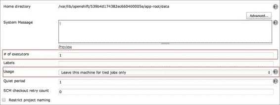
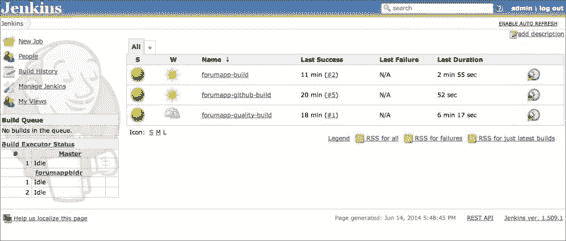

# 第十章：OpenShift 应用程序的持续集成

本章将帮助您使用 Jenkins 插件为您的 OpenShift 应用程序添加持续集成。具体内容如下：

+   将 Jenkins CI 添加到您的应用程序

+   增加从属机空闲超时

+   安装 Jenkins 插件

+   使用 Jenkins 构建托管在 GitHub 上的项目

+   为您的 OpenShift 应用程序创建 Jenkins 工作流

+   升级 Jenkins 到最新版本

# 介绍

在本章中，您将学习如何为您的 OpenShift 应用程序添加**持续集成**（**CI**）支持。CI 是**极限编程**（**XP**）的一项实践，它通过工具监控您的版本控制系统（如 Git 或 SVN）中的代码更改。每当检测到更改时，它会构建项目并运行测试用例。如果构建由于某种原因失败，工具会通过电子邮件或其他通讯渠道通知开发团队故障情况，以便他们能够立即修复构建失败。CI 工具不仅仅用于构建和测试应用程序。它们还可以跟踪代码质量、运行功能测试、执行自动部署、应用数据库迁移以及执行其他许多任务。这有助于我们在软件开发周期的早期发现缺陷，提高代码质量，并自动化部署。

OpenShift 将 Jenkins 作为其首选的 CI 工具。Jenkins ([`jenkins-ci.org/`](http://jenkins-ci.org/)) 是目前市场上最主流、最受欢迎的 CI 服务器。它是一个用 Java 编程语言编写的开源项目。Jenkins 功能丰富，并通过插件进行扩展。您可以使用来自活跃社区的超过 600 个 Jenkins 插件，这些插件能够涵盖版本控制系统、构建工具、代码质量度量、构建通知器等几乎所有功能。

*将 Jenkins CI 添加到您的应用程序* 这一方法将帮助您将 Jenkins 集成到现有的 OpenShift 应用程序中。我们将使用 Java 应用程序展示 OpenShift 和 Jenkins 的集成。本章主要讨论 Jenkins 与 Java 应用程序的结合。然而，即使您使用的是 OpenShift 支持的其他 Web 插件，本章也能帮助您充分理解如何为您的应用程序添加 OpenShift Jenkins CI 支持。

OpenShift 使用 Jenkins 主/从拓扑结构（[`wiki.jenkins-ci.org/display/JENKINS/Distributed+builds`](https://wiki.jenkins-ci.org/display/JENKINS/Distributed+builds)）来分配构建任务给不同的从节点。这确保你为 OpenShift 应用程序提供一个可扩展的 Jenkins 环境。此外，Jenkins 主节点将创建不同类型的从节点来构建不同类型的 OpenShift 应用程序。从节点的类型取决于应用程序的类型。例如，为了构建 JBoss EAP 应用程序，Jenkins 主节点将创建一个安装了 JBoss EAP 插件的从节点。默认情况下，从节点在 15 分钟无操作后会被销毁。*增加从节点空闲超时时间*的配方将讲解如何增加从节点的空闲超时时间。

插件使 Jenkins 可扩展，允许你扩展 Jenkins 以满足你的需求。在*安装 Jenkins 插件*的配方中，你将学习如何安装 Jenkins 插件。你可以在 [`wiki.jenkins-ci.org/display/JENKINS/Plugins`](https://wiki.jenkins-ci.org/display/JENKINS/Plugins) 查看 Jenkins 插件的完整列表。

你不仅可以使用 Jenkins 构建托管在 OpenShift 上的应用程序，还可以构建托管在其他地方的项目。*使用 Jenkins 构建托管在 GitHub 上的项目* 的配方将涵盖如何构建托管在 GitHub 上的项目。

*为你的 OpenShift 应用程序创建 Jenkins 工作流* 的配方将展示如何根据你的需求自定义 OpenShift 默认创建的构建。在这个配方中，你将创建一个 Jenkins 工作流，包括三个 Jenkins 任务。第一个 Jenkins 任务将轮询 Git 仓库以查找更改，第二个任务将对应用程序源代码进行代码覆盖率检查，第三个任务将把应用程序部署到 OpenShift。

OpenShift 支持的 Jenkins 版本并不是最新版本。在*将 Jenkins 升级到最新版本*的配方中，你将把 Jenkins 升级到最新版本。使用最新版本的优点在于，某些插件与 OpenShift 支持的 Jenkins 版本不兼容。

Jenkins 并不是你唯一可以用来构建和部署 OpenShift 应用程序的 CI 服务器。你也可以使用托管的 CI 服务器，如 Travis CI，来构建和部署 OpenShift 应用程序。OpenShift 和 Travis CI 的集成在本章中没有介绍，但你可以参考我的博客，了解更多相关信息，链接：[`www.openshift.com/blogs/how-to-build-and-deploy-openshift-java-projects-using-travis-ci`](https://www.openshift.com/blogs/how-to-build-and-deploy-openshift-java-projects-using-travis-ci)。

# 将 Jenkins CI 添加到你的应用程序中

将 Jenkins 添加到你的应用程序是一个两步过程。你需要先创建 Jenkins 服务器应用程序，然后将 Jenkins 客户端插件添加到你的应用程序中。在本教程中，你将学习如何将 Jenkins CI 添加到现有的 OpenShift 应用程序中。添加 Jenkins 到应用程序后，每次向 OpenShift 应用程序的 Git 仓库推送代码时，都会启动一个 Jenkins 作业，构建该项目并将其部署到 OpenShift。

## 准备工作

要完成本教程，你将需要三个可用的 Gear。一个 Gear 将由应用程序使用，Jenkins 将使用其余的两个 Gear。本章将使用 第七章 中创建的应用程序，*OpenShift for Java 开发者*。如果你没有运行该应用程序，可以使用以下命令重新创建应用程序：

```
$ rhc app create jobstore jbosseap postgresql-9.2 --from-code https://github.com/OpenShift-Cookbook/chapter7-jobstore-javaee6.git

```

## 如何操作…

执行以下步骤将 Jenkins 添加到你的应用程序中：

1.  在你将 Jenkins 插件添加到应用程序之前，必须先创建 Jenkins 服务器应用程序：

    ```
    $ rhc create-app jenkins jenkins

    ```

1.  执行上述命令后，Jenkins 服务器将在 `http://jenkins-{domain-name}.rhcloud.com` 上可用。请将 `{domain-name}` 替换为你的 OpenShift 账户域名。

1.  记下 OpenShift `rhc` 命令行客户端在应用程序创建日志中向你展示的用户名和密码。这些信息用于登录 Jenkins Web 控制台。以下是命令行输出的示例：

    ```
    Creating application 'jenkins' ... done
     Jenkins created successfully.  Please make note of these credentials:
     User: admin
     Password: xxxxxx
    Note:  You can change your password at: https://jenkins-{domain-name}.rhcloud.com/me/configure

    ```

1.  使用第 1 步中获得的凭据登录 Jenkins：`https://jenkins-{domain-name}.rhcloud.com/me/configure`。我建议你将 Jenkins 密码更改为容易记住的内容。要更改密码，请在 **密码** 部分输入新密码，并点击 **保存** 按钮：

1.  保存新密码后，登出并使用新密码重新登录。你将看到如下所示的 Jenkins 仪表板截图：

1.  现在你已经创建了 Jenkins 服务器应用程序，可以将 Jenkins 插件添加到 `jobstore` 应用程序中。要添加插件，请运行以下命令：

    ```
    $ rhc add-cartridge jenkins --app jobstore

    ```

1.  访问 Jenkins 仪表板 `https://jenkins-{domain-name}.rhcloud.com/`，你将看到为 `jobstore` 应用程序配置的新作业，如下图所示：

1.  点击 **jobstore-build** 链接（`https://jenkins-{domain-name}.rhcloud.com/job/jobstore-build/`）查看 Jenkins 作业详情。

1.  要启动一个新的构建，你可以点击左侧的**立即构建**链接，或者对项目源代码进行更改，提交并将更改推送到应用程序的 Git 仓库。让我们对应用程序源代码做一个小更改。将 `src/main/webapp/index.html` 文件中的标题从 `<title>JobStore</title>` 更改为 `<title>带有 Jenkins 的 JobStore</title>`：

    ```
    $ git commit -am "updated title"
    $ git push

    ```

1.  `git push` 日志会显示 Jenkins 正在构建项目，日志内容如下：

    ```
    remote: Executing Jenkins build.
    remote: You can track your build at https://jenkins-xxxx.rhcloud.com/job/jobstore-build
    remote: 
    remote: Waiting for build to schedule................................Done
    remote: Waiting for job to complete..............................

    ```

1.  你可以通过点击**控制台输出**选项，在 Jenkins 网络控制台查看构建日志，如下图所示：

1.  完成工作后，你可以在**构建历史**下查看构建状态。成功的构建会显示为蓝色，失败的构建会显示为红色。

1.  你可以通过在你喜欢的浏览器中打开应用程序的 URL (`http://jobstore-{domain-name}.rhcloud.com`) 来验证你的更改是否已应用。你会看到标题已更新为**带有 Jenkins 的 Jobstore**。

## 它是如何工作的……

Jenkins 的一个强大功能是它能够将构建分布到多个机器上。Jenkins 使用主/从架构来管理分布式构建。在主/从架构中，有一个 Jenkins 服务器，负责调度作业，将构建分派到从服务器进行实际执行，监控从服务器的健康状态，并记录和展示构建结果。从服务器执行实际的构建并将作业结果与主服务器共享。

OpenShift 使用 Jenkins 的主/从架构来构建你的应用程序。每个 OpenShift 域只能有一个 Jenkins 主服务器，且该域下的所有应用程序都将使用该 Jenkins 主服务器进行应用构建。根据该应用程序的 Jenkins 作业配置，Jenkins 主服务器会创建一个从服务器来构建该应用程序。每个 OpenShift Jenkins 安装都会安装 OpenShift Jenkins 插件。这个插件使得 Jenkins 能够与 OpenShift 账户进行通信，并代表你创建从服务器。Jenkins 从服务器不过是 OpenShift 的 gears。

在第 1 步中，你创建了 Jenkins 主应用程序。你可以使用主实例直接执行任务，但在主/从架构中，大多数情况下是使用从实例来构建项目。OpenShift 创建的 Jenkins 主实例被配置为不运行任何任务，方法是将执行器的数量配置为`0`。执行器数量允许你定义一个实例可以并发运行的任务数量。由于主实例的执行器数量被设置为`0`，你不能用它来构建任何项目。你可以通过更新 Jenkins 配置屏幕中的**执行器数量**系统配置值（`https://jenkins-{domain-name}.rhcloud.com/configure`）将执行器数量设置为大于`0`的数字，如下图所示。在*使用 Jenkins 构建托管在 GitHub 上的项目*食谱中，你将使用 Jenkins 主实例来构建项目。请看下图：


一旦你创建了 Jenkins 主应用程序，你就可以将 Jenkins 客户端添加到`jobstore`应用程序中。如果你在创建 Jenkins 主应用程序之前尝试将 Jenkins 客户端添加到应用程序中，你会在`rhc add-cartridge`命令日志中看到错误消息。

在第 5 步中，你将 Jenkins 客户端插件添加到`jobstore`应用程序中。Jenkins 客户端插件为`jobstore`项目创建了一个新的 Jenkins 任务。在 Jenkins 中，任务定义了需要完成的工作。你可以通过在浏览器中打开`https://jenkins-{domain}.rhcloud.com/job/jobstore-build/configure`来查看任务配置。

任务配置可以分为三个部分：构建器配置、源代码管理配置和构建配置。

+   **构建器配置**：下图所示的配置值将用于创建一个从实例。该配置表示需要一个类型为`redhat-jbosseap-6`的小型齿轮大小的从实例。这意味着该从实例将安装 JBoss EAP 6 插件。它还定义了 Jenkins 主实例等待从实例上线的超时时间。默认的构建器超时时间是`5`分钟或`300000`毫秒。**限制此项目可以运行的地方**配置定义了该项目将只在标有`jobstore-build`标签的从实例上构建。你可能已经注意到，标签的名称与任务的名称相同。OpenShift Jenkins 插件使用标签名称读取任务配置，并使用任务的构建器配置创建一个从实例。因此，如果你将标签名称从`jobstore-build`更改为`jobstore-os-build`，则 Jenkins 插件将无法找到关联的任务配置，任务也将无法执行。

+   **Git 配置**：下一个重要的配置是 Git 版本控制配置。此配置指定应用程序的 Git 仓库 URL。Jenkins 作业将使用指定的 Git 仓库 URL 克隆该 Git 仓库并构建此项目。以下截图显示了 Git 配置：

+   **构建配置**：这是我们作业配置中最重要的部分。它定义了需要做什么。作业配置如下截图所示。配置完成以下任务：

    1.  它通过 Git 和`rsync`从实际应用程序下载内容到构建器应用程序。

    1.  如果没有`force_clean_build`标记，它还会将实际应用程序中的`$OPENSHIFT_BUILD_DEPENDENCIES_DIR`和`$OPENSHIFT_DEPENDENCIES_DIR`目录的内容复制到构建器应用程序中。当存在`force_clean_build`标记时，依赖项将在构建器应用程序上重新下载，构建将花费更多时间才能完成。

    1.  然后，它使用任何与卡带相关的构建命令来构建应用程序。对于 Java 应用程序，它将使用`mvn clean install –Popenshift –DskipTests`命令。

    1.  构建成功完成后，它会停止应用程序的 gear。

    1.  然后，Jenkins 使用`rsync`将新内容从构建器应用程序复制到实际应用程序。

    1.  最后，它启动了应用程序。请查看以下截图：

    

如果你的应用程序中没有启用 Jenkins，那么代码将在应用程序运行的同一 gear 上构建。当你将更改推送到应用程序 gear 时，OpenShift 首先停止你的应用程序，构建应用程序，部署产物，最后启动应用程序。

在第 8 步中，添加 Jenkins 卡带到`jobstore`应用程序后，你对源代码进行了更改并将更改推送到应用程序 gear。这一次，Jenkins 服务器启动一个从节点并发起构建，而不是在应用程序 gear 上构建项目。以下步骤详细解释了这个过程：

1.  用户进行更改并通过`git push`命令将更改推送到应用程序 gear。

1.  在接收到数据后，调用 Git 动作钩子，通知 Jenkins 服务器。

1.  Jenkins 服务器创建一个专用的 Jenkins 从节点（构建器）来构建这个项目。你可以通过`rhc apps`命令查看 Jenkins 创建的新 gear：

    ```
    jobstorebldr @ http://jobstorebldr-xxxx.rhcloud.com/ (uuid: 539b660ce0b8cdeba00000e1)
    ----------------------------------------------------------------------------------------
    Domain:     xxxx
    Created:    2:28 AM
    Gears:      1 (defaults to small)
    Git URL:    ssh://539b660ce0b8cdeba00000e1@jobstorebldr-xxxx.rhcloud.com/~/git/jobstorebldr.git/
    SSH:        539b660ce0b8cdeba00000e1@jobstorebldr-xxxx.rhcloud.com
    Deployment: auto (on git push)

    jbosseap-6 (JBoss Enterprise Application Platform 6)
    ----------------------------------------------------
    Gears: 1 small

    ```

1.  Jenkins 使用构建配置部分中提到的步骤运行构建。在构建成功后，构建产物将通过`rsync`工具复制到应用程序 gear，如构建配置中所提到的。

1.  Jenkins 在构建成功后启动应用程序，然后归档构建产物，供以后使用。

1.  在 15 分钟的空闲时间后，Jenkins 构建器会被销毁，并且在`rhc apps`命令的输出中不再显示。然而，构建产物仍会保存在 Jenkins 中，可以在那里查看。

将 Jenkins 与 OpenShift 应用配合使用有以下优点：

+   **构建失败时不影响应用运行**：在没有 Jenkins 支持的情况下，OpenShift 会在与你的应用运行的同一设备上运行构建。它首先停止该设备上的所有插件，执行构建，并最终部署成功的构建产物。如果构建失败，构建产物将不会被部署，你的应用将会停机。启用了 CI 后，OpenShift 只会在构建成功完成后才停止应用。这样就能避免因构建失败而导致的停机。

+   **更多资源来构建你的项目**：由于 Jenkins 构建器运行在独立的设备上，它们具有额外的资源，如内存和存储，以便运行你的应用构建。

+   **存储以前的构建**：Jenkins 可以为你存储之前成功的构建产物。如果你希望回滚到先前的版本，可以使用这些构建产物。

+   **Jenkins 插件**：Jenkins 拥有一个强大而活跃的社区，开发了各种插件来执行常见任务。你可以使用这些插件来自动化应用的各种任务。在本章中，你将安装多个 Jenkins 插件来完成不同的任务。

你可以使用以下命令查看 Jenkins 服务器的日志：

```
$ rhc tail --app jenkins

```

## 更多内容…

你还可以在创建应用时使用`--enable-jenkins`选项启用 Jenkins 支持，如下命令所示：

```
$ rhc create-app jobstore jbosseap postgresql-9.2 --from-code https://github.com/OpenShift-Cookbook/chapter7-jobstore-javaee6.git --enable-jenkins

```

上述命令将创建 Jenkins 服务器应用，并将 Jenkins 客户端添加到应用中。如果 Jenkins 服务器应用已经存在，则仅会将`jenkins`客户端插件添加到应用中。

## 另见

+   *增加从属机空闲超时时间*的操作步骤

+   *安装 Jenkins 插件*的操作步骤

+   *为你的 OpenShift 应用创建 Jenkins 工作流*的操作步骤

# 增加从属机空闲超时时间

Jenkins 主服务器会创建从属机来构建项目。这些从属机在构建项目后只会存活 15 分钟，也就是说，只有在完成第一次构建后的 15 分钟内收到下一次构建请求时，从属机会被重用。如果在构建项目后 15 分钟内没有接收到构建请求，Jenkins 主服务器将会销毁从属实例。下一次构建请求将会重新创建一个新的从属机并在其上构建应用。创建从属机是一个耗时的过程，因此在开发周期中，当你需要快速反馈时，这并不是理想的做法。

在本操作步骤中，你将学习如何增加从属机空闲超时时间，以便你可以更长时间地重用从属机，并从 CI 服务器获得更快的反馈。

## 准备工作

本食谱假设你已经有一个启用了 Jenkins 的应用程序，正如*将 Jenkins CI 添加到你的应用程序*食谱中所讨论的那样。

## 操作步骤…

执行以下步骤：

1.  登录到你的 Jenkins 仪表板，然后前往 Jenkins 配置页面，地址为`https://jenkins-{domain-name}.rhcloud.com/configure`。

1.  在**Cloud**配置部分下，存在一个**Slave Idle Time to Live**配置，如下图所示。默认配置为 15 分钟。

1.  将**Slave Idle Time To Live**值更新为`60`分钟，并通过点击**Save**按钮保存配置。

## 工作原理…

OpenShift 创建的 Jenkins 主节点捆绑了一些 Jenkins 需要有效运行的插件。你可以通过导航到**Plugin Manager** | **Installed**查看所有已安装的插件，如下图所示：


使 Jenkins 能够与 OpenShift 帐户通信的插件是**OpenShift Origin Jenkins Cloud Plugin**。该插件负责管理构建应用程序的从机实例。

大多数 Jenkins 插件都有全局配置和作业级别配置。全局配置适用于所有 Jenkins 作业，而作业级配置仅适用于特定 Jenkins 作业。你可以通过访问`https://jenkins-{domain-name}.rhcloud.com/configure`的**Configure System**屏幕查看 Jenkins 的全局配置。你将安装的许多插件也需要在此进行配置。安装插件时，Jenkins 会动态添加新字段。

默认屏幕包含多个部分，用于配置一般的系统级参数或各种插件配置。OpenShift Jenkins 插件在**Cloud**部分下添加了**OpenShift Cloud**子部分。此配置用于与 OpenShift 帐户通信并创建构建应用程序所需的从机。

在前述步骤中，你将 OpenShift **Cloud**配置部分中的从机空闲超时增加到 60 分钟。这是你可以为从机设置的最大空闲超时时间。Jenkins 将创建的下一个从机将使用此配置，并在构建项目后保持 60 分钟的存活时间。

## 另见

+   *将 Jenkins CI 添加到你的应用程序*食谱

+   *安装 Jenkins 插件*食谱

+   *为你的 OpenShift 应用程序创建 Jenkins 工作流*食谱

# 安装 Jenkins 插件

Jenkins 的可扩展架构使其非常强大。通过第三方插件，你可以为 Jenkins 实例添加额外功能。这些功能让你可以与不同的 SCM 工具（如 Git）合作，生成代码质量和代码覆盖率报告，或自动化其他手动任务，如数据库模式迁移等。在本配方中，你将学习如何将 Green Balls 插件（[`wiki.jenkins-ci.org/display/JENKINS/Green+Balls`](https://wiki.jenkins-ci.org/display/JENKINS/Green+Balls)）安装到你的 OpenShift Jenkins 实例中。Green Balls 插件让 Jenkins 在成功构建时使用绿色球代替蓝色球。

## 准备工作

本配方假设你已经有一个启用了 Jenkins 的应用程序，如*将 Jenkins CI 添加到你的应用程序*配方中所述。

## 如何操作…

执行以下步骤以安装插件：

1.  登录到你的 OpenShift Jenkins 仪表板，进入`https://jenkins-{domain-name}.rhcloud.com/manage`的**管理 Jenkins**屏幕。**管理 Jenkins**屏幕是配置 Jenkins 系统所有方面的中心位置。

1.  接下来，点击**管理插件**来管理 Jenkins 插件。你可以通过**管理插件**屏幕安装、移除或更新插件。请查看以下截图：

1.  **管理插件**屏幕分为四个标签：**更新**、**可用**、**已安装**和**高级**，如下图所示：

    **更新**标签显示所有有更新的已安装插件，**可用**标签显示所有可以安装到 Jenkins 实例中的插件，**已安装**标签显示已经安装在 Jenkins 实例中的插件，**高级**标签允许你手动安装插件或强制 Jenkins 检查更新。

1.  Jenkins 插件注册表中所有可用的插件都显示在**可用**标签中。如果点击**可用**标签，你会发现列表是空的。为了让 Jenkins 在**可用**标签下显示插件，请前往**管理插件** | **高级**，然后点击**立即检查**按钮，如下图所示，强制检查是否有新更新：

1.  完成后，你将看到**可用**标签下的插件列表。

1.  要安装 Green Balls 插件，先过滤可用插件，然后点击**无需重启安装**。请查看以下截图：

1.  插件安装后，你将看到 Green Balls 插件在运行。如果你仍然看到蓝球，请清除浏览器缓存。

## 它是如何工作的…

在之前的步骤中，您已将 Green Balls 插件安装到 OpenShift Jenkins 实例中。Green Balls 插件顾名思义：它使成功的构建显示为绿色球，而不是默认的蓝色球。

有几种方法可以将插件安装到 Jenkins 实例中。您可以使用自动方法或手动方法。在之前的步骤中，您使用了自动方法安装插件。自动方法适用于在 Jenkins 中央插件注册表中列出的插件，您可以通过[`updates.jenkins-ci.org/download/plugins/`](http://updates.jenkins-ci.org/download/plugins/)访问该注册表。对于不在中央插件注册表中的插件，需要手动安装。要手动安装插件，请导航到**管理 Jenkins** | **管理插件** | **高级**。在**高级**选项卡中，有一个名为**上传插件**的部分，您可以用它来上传插件。点击**选择文件**按钮，选择本地机器中的插件，然后点击**上传**按钮上传插件：


手动安装的插件在重新启动 Jenkins 之前不会被安装。因此，一旦插件上传完成，您可以通过访问`https://jenkins-{domain-name}.rhcloud.com/safeRestart`来重新启动 Jenkins。这将在当前构建完成后重启 Jenkins，并安装您的插件。

## 另请参见

+   *将 Jenkins CI 添加到您的应用程序*指南

+   *使用 Jenkins 构建托管在 GitHub 上的项目*指南

+   *为您的 OpenShift 应用程序创建 Jenkins 工作流*指南

# 使用 Jenkins 构建托管在 GitHub 上的项目

您也可以使用 OpenShift Jenkins 实例来构建您的非 OpenShift 项目。本指南将使用一个基于 Maven 的公开托管在 GitHub 上的项目，地址为[`github.com/OpenShift-Cookbook/chapter10-demo-app`](https://github.com/OpenShift-Cookbook/chapter10-demo-app)。本指南的目标是在您向 GitHub 仓库推送代码时构建该项目，并在构建状态发生变化时发送电子邮件，即构建失败或从构建失败中恢复。这是组织尝试引入 CI 的第一步。

## 准备工作

本指南假设您已经有一个启用了 Jenkins 的应用程序，如*将 Jenkins CI 添加到您的应用程序*指南中所讨论的那样。

## 如何操作…

执行以下步骤以了解如何构建托管在 GitHub 上的项目：

1.  在这个步骤中，我们将使用 Jenkins 主服务器来构建项目。访问`https://jenkins-{domain-name}.rhcloud.com/configure`，并将**执行器数量**属性更新为`1`。任何大于`0`的数字都会允许主服务器运行构建任务。此外，将**使用情况**字段值更改为**仅为绑定任务保留此机器**。这个配置确保主实例只用于明确配置为在主服务器上运行的任务。稍后在任务配置中，你将配置一个仅在主服务器上运行的任务。点击**保存**按钮以保存新值：

1.  这个步骤的目标之一是在项目变得不稳定时发送电子邮件。为了允许 Jenkins 发送电子邮件，你需要在 Jenkins 的**配置系统**界面中的**电子邮件通知**部分提供电子邮件设置。点击**高级**标签查看所有配置选项。以下截图中显示的配置使用 Gmail 发送电子邮件。这里展示 Gmail 只是为了演示。谷歌可能会给你发送一封邮件，说明有人在入侵你的账户，因为你的账户被从一个与平常不同的位置访问。理想情况下，你应该使用你所在组织的 SMTP 服务器配置。

1.  你还可以发送测试电子邮件来检查配置。通过勾选**测试**配置并提供你想要发送电子邮件的电子邮件地址，来检查**测试电子邮件**配置。你将收到类似以下截图中所示的电子邮件：

1.  你可能会发现在前述截图中一个令人烦恼的地方是，电子邮件的发件人部分还没有配置地址。你可以通过将**系统管理员电子邮件地址**属性从**地址尚未配置**更新为某个用户友好的地址来进行配置，如以下截图所示。完成此更改后，Jenkins 的通知电子邮件将以此地址作为发件人发送：

1.  点击**Fork**按钮，Fork GitHub 仓库([`github.com/OpenShift-Cookbook/chapter10-demo-app`](https://github.com/OpenShift-Cookbook/chapter10-demo-app))。你需要使用有效的 GitHub 账户登录，才能 Fork 这个仓库。你必须 Fork 这个仓库，以便能够将你的更改推送到仓库中。

1.  访问你的 Jenkins 仪表板，点击**新建任务**。查看以下截图：

1.  选择**构建一个自由风格的软件项目**构建类型，并为它命名为`chapter10-github-recipe-build`，如下所示截图。点击**确定**来创建该任务：

1.  接下来，你将看到作业配置页面，在该页面你可以配置此作业。你将更新的第一个配置位于**源代码管理**部分。由于项目托管在 GitHub 上，输入你想要构建的 GitHub 仓库的 URL。GitHub 仓库的 URL 将是`https://github.com/<username>/chapter10-demo-app.git`。其中，`username`对应你的 GitHub 用户名。下图显示了**源代码管理**部分：

1.  接下来，你需要配置此构建何时触发。这个配置在**构建触发器**部分进行设置。在下图所示的配置中，你告诉 Jenkins 每分钟轮询一次 SCM。它使用的语法与 Unix/Linux 中的`crontab`相同。

1.  现在，Jenkins 作业已经知道从哪里以及多频繁地获取源代码，下一步是告诉作业如何处理这些源代码。这通过定义构建步骤来实现。一个作业可以有一个或多个构建步骤。要添加一个新的构建步骤，点击**添加构建步骤**下拉菜单，并选择**执行 Shell**，如下图所示：

1.  这将显示一个文本区域，你可以在其中输入想要运行的命令。在文本区域中输入`mvn clean install`命令。

1.  你可以选择在作业中配置的下一个选项是构建项目之后该做什么。这是通过创建一个或多个构建后操作来定义的。我们来添加一个操作，当构建变得不稳定时发送电子邮件通知。在**添加构建后操作**下拉菜单中选择**电子邮件通知**。在**收件人**文本框中，提供一个以空格分隔的电子邮件地址列表，当构建失败时，邮件将发送给这些地址，如下图所示：

1.  在你保存此作业之前，最后一个配置是将其配置为在主节点上运行。这通过勾选**限制此项目可以运行的节点**复选框，并为其指定用于构建项目的节点名称来完成，如下图所示：

1.  现在，点击**保存**按钮保存配置。

1.  为了测试新的 Jenkins 作业，首先在本地机器上克隆项目。克隆项目的命令如下所示。请将用户名替换为你的 GitHub 账户用户名。

    ```
    $ git clone git@github.com:<username>/chapter10-demo-app.git

    ```

1.  为了测试作业是否正常工作，让我们更改其中一个测试用例，使其失败。将`MessageRepositoryTest`中的断言从`assertEquals(1, messages.size());`更新为`assertEquals(2, messages.size());`。

1.  提交代码，并将更改推送到你的 GitHub 仓库：

    ```
    $ git commit -am "added test failure"
    $ git push

    ```

1.  Jenkins 将选择该更改并开始新的构建。构建将失败，你将收到包含作业日志的电子邮件。

1.  现在，我们通过将`assertEquals(2, messages.size());`更改为`assertEquals(1, messages.size());`来修复构建失败。然后运行以下命令：

    ```
    $ git commit -am "fixed test failure"
    $ git push

    ```

1.  再次，Jenkins 会检测到更改并启动新的构建。这一次，你将收到一封电子邮件，告知构建已恢复正常，如下图所示：

## 它是如何工作的……

你创建了一个自由风格的 Jenkins 任务，该任务每分钟轮询一次 Jenkins，如果检测到新的提交，它将构建项目。在第 1 步中，你更新了 Jenkins 主节点配置，以便它可以运行构建任务。默认情况下，Jenkins 主节点没有配置为运行任何构建任务。通过在 Jenkins 系统配置中将执行器数量设置为`1`，可以让 Jenkins 主节点运行构建任务。执行器数量允许你定义 Jenkins 实例可以执行多少并发构建。

电子邮件是最常用的沟通方式之一。在第 2 步中，你配置了 Jenkins 使用 Gmail 的 SMTP 设置来发送电子邮件。你可以通过 Gmail SMTP 服务器每天发送 99 封电子邮件，这对于大多数个人项目来说足够了，但对于你的组织项目，应该使用组织的 SMTP 服务器。

这个配方要求你拥有自己的 Git 仓库，Jenkins 会轮询该仓库。这样做是因为你必须将更改推送到自己的 Git 仓库，而无法将更改推送到其他人的 Git 仓库，除非你被添加为协作者。你在第 3 步中分叉了该仓库，因此你拥有了这个仓库的副本，可以在上面工作。

在第 4 步中，你创建了一个新的 Jenkins 任务，用于构建你在第 3 步中分叉的项目。你使用了一个自由风格的构建任务，因为它是最灵活的构建选项，可以用于构建任何类型的项目。

从第 5 步到第 9 步，你配置了任务，使得 Jenkins 每分钟轮询一次 Git 仓库，并使用 Jenkins 主节点来构建项目。在第 10 步保存任务后，你将看到你的新任务出现在 Jenkins 仪表盘上。Jenkins 将自动运行该任务进行第一次构建，因为该任务没有任何历史记录。在第一次运行任务后，Jenkins 将等待你 Git 仓库中的更改，然后开始另一次构建。

配置任务后，你在第 11 到第 15 步中通过更改本地仓库并将更改推送到 GitHub 来测试 Jenkins 任务。Jenkins 将在接下来的 1 分钟内轮询 Git 仓库，检测到更改并启动构建。

## 另见

+   *为你的 OpenShift 应用程序创建 Jenkins 工作流* 配方

# 为你的 OpenShift 应用程序创建 Jenkins 工作流

在这个配方中，你将创建一个 Jenkins 工作流，可以用来在 OpenShift 上构建和部署应用程序。

## 准备工作

本配方将涵盖从头开始的所有步骤，确保你拥有所有三个必要的齿轮。

## 如何操作…

执行以下步骤为您的 OpenShift 应用程序创建 Jenkins 工作流：

1.  通过运行以下命令创建一个新的 Jenkins 服务器应用程序。该内容在*将 Jenkins CI 添加到您的应用程序*这一章节中有详细介绍。

    ```
    $ rhc create-app jenkins jenkins

    ```

1.  创建一个 OpenShift Apache Tomcat 7 应用程序，用于部署项目。由于我们不想克隆仓库（因为代码将托管在 GitHub 上），因此该项目将使用`--no-git`选项创建。`--enable-jenkins`选项将创建一个新的 Jenkins 作业，该作业将构建并在 OpenShift 上部署应用程序：

    ```
    $ rhc create-app forumapp tomcat-7 postgresql-9 --enable-jenkins --no-git

    ```

1.  登录到 Jenkins 仪表板，您将看到**forumapp-build**作业列在仪表板上。

1.  按照*使用 Jenkins 构建托管在 GitHub 上的项目*这一章节中提到的步骤创建一个名为`forumapp-github-build`的新 Jenkins 作业。创建作业后，任何推送到 GitHub 仓库的更改都会导致 Jenkins 构建。

1.  接下来，按照*安装 Jenkins 插件*这一章节中的说明安装 Jenkins Cobertura 插件。

1.  插件安装完成后，创建另一个名为`forumapp-quality-build`的作业。但您可以使用`forumapp-github-build`作业作为模板，而不是从头开始创建作业。输入详细信息后，点击**确定**：

1.  您将被引导至`forumapp-quality-build`作业配置页面。更新以下配置值以适应此作业：

    1.  将**限制此项目可以运行**的值从`master`更改为`forumapp-build`。

    1.  在**构建触发器**部分取消选中**轮询 SCM**。

    1.  将**执行 Shell**命令从`mvn clean install`更改为`mvn clean package -Pquality`。

1.  现在，您需要向`forumapp-quality-build`添加两个构建后操作，首先启动`forumapp-build`作业，该作业将在 OpenShift 上部署应用程序；其次，发布 Cobertura 代码覆盖率报告。添加构建后操作，以便在构建成功时触发`forumapp-build`。要添加 Cobertura 代码覆盖报告构建后操作，点击**添加构建后操作钩子**选项，选择**发布 Cobertura 覆盖率报告**，并为**Cobertura xml 报告模式**字段提供`**/ target/site/cobertura/coverage.xml`。

1.  更新`forumapp-quality-build`作业配置后，点击**保存**按钮。

1.  `forumapp-github-build`的责任之一是在作业成功完成后启动`forumapp-quality-build`作业。通过添加构建后操作来更新`forumapp-github-build`作业配置。添加**构建其他项目**构建后操作，以在构建成功时构建`forumapp-github-build`。添加构建后操作后，点击**保存**按钮：

1.  现在你已配置了`forumapp-github-build`和`forumapp-quality-build`任务，你需要更新`forumapp-build`任务配置，从 GitHub 仓库拉取代码并将最新代码部署到 OpenShift。访问`https://jenkins-{domain-name}.rhcloud.com/job/forumapp-build/configure`，并添加一个新的**执行 Shell**构建步骤。该构建步骤将首先为 GitHub 仓库添加一个 Git 远程仓库，然后从 GitHub 仓库拉取代码。以下是相关命令：

    ```
    $ git remote add upstream -m master https://github.com/<username>/chapter10-demo-app.git
    $ git pull -s recursive -X theirs upstream master

    ```

1.  请将用户名替换为你的 GitHub 账户用户名。确保构建操作钩子的顺序与下图所示的顺序一致：

1.  点击**保存**按钮以保存配置。

1.  现在，为了测试所有任务是否正确配置，请进入 Jenkins 仪表盘，手动启动`forumapp-github-build`任务。你也可以不手动启动任务，而是修改应用源代码并将更改推送到 GitHub 仓库。Jenkins 将检测到更改并开始构建过程。

1.  所有构建成功完成后，你将在 Jenkins 仪表盘上看到所有构建处于健康状态，如下图所示：

1.  要查看项目的代码覆盖率，请访问**forumapp-quality-build**页面，并点击**Coverage Report**以查看项目的代码覆盖率：

## 它是如何工作的…

在前面的步骤中，你创建了一个简单的工作流，包含三个 Jenkins 任务，每个任务负责特定的工作。第一个任务按照指定的间隔轮询 GitHub 仓库的代码更改，并在发现更改时构建项目。该任务构建项目并运行单元测试。它使用 Jenkins 主节点来构建项目。使用 Jenkins 进行像这样的轻量级任务的好处是，你不需要等待从节点的创建。你应该只在任务较轻时使用主节点，否则 Jenkins 主节点可能会因任务过多而宕机。

第一个构建，如果成功，将启动质量任务，运行应用代码的代码覆盖率。这次构建使用 Cobertura（[`cobertura.github.io/cobertura/`](http://cobertura.github.io/cobertura/)）来识别 Java 应用程序中缺乏测试覆盖的部分。质量构建被配置为执行`mvn clean install -Pquality`命令。该命令将运行 Maven Cobertura 插件。Maven 插件将生成 HTML 和 XML 报告。XML 报告由 Jenkins 解析覆盖率结果。质量构建将使用 Jenkins 从节点而不是主节点，因为质量构建通常会消耗大量内存和 CPU 资源，你肯定不希望因一个任务让主节点宕机。

质量构建成功完成后，第三个 Jenkins 任务将把应用部署到 OpenShift。该任务也会使用 Jenkins 从节点。

## 另见

+   *将 Jenkins 升级到最新版本* 食谱

# 将 Jenkins 升级到最新版本

OpenShift 创建的 Jenkins 应用程序运行的是 Jenkins 的旧版本。写这篇文章时，OpenShift 创建的 Jenkins 应用程序运行的是 1.509.1 版本。这个版本已经很旧，某些 Jenkins 插件在此版本下无法正常工作。在本食谱中，您将学习如何将 Jenkins 升级到最新版本。写这篇文章时，Jenkins 的最新版本是 1.567。

### 注意

本食谱是实验性的，我不建议将其用于生产环境中的 Jenkins 实例。此食谱的目的是展示升级 Jenkins 版本是可行的。升级过程中可能会导致构建数据丢失或 Jenkins 实例损坏。因此，请先在您的测试环境中使用此食谱。

## 准备就绪

本食谱假设您已经有一个启用了 Jenkins 的应用程序，正如在 *将 Jenkins CI 添加到您的应用程序* 食谱中所讨论的那样。

## 如何操作…

执行以下步骤以升级 Jenkins 版本：

1.  打开一个新的命令行终端，使用以下命令通过 SSH 连接到您的 Jenkins 应用程序：

    ```
    $ rhc ssh --app jenkins

    ```

1.  在 `$OPENSHIFT_DATA_DIR` 中创建一个名为 `jenkins-latest-version` 的新目录，然后使用 `wget` 运行以下命令下载最新的 Jenkins WAR 文件：

    ```
    cd $OPENSHIFT_DATA_DIR && mkdir jenkins-latest-version && cd jenkins-latest-version && wget http://mirrors.jenkins-ci.org/war/latest/jenkins.war

    ```

1.  通过输入 `exit` 命令退出 SSH 会话。

1.  通过运行以下命令创建两个环境变量。请将 `$OPENSHIFT_DATA_DIR` 替换为您 Jenkins 应用程序的 `$OPENSHIFT_DATA_DIR` 环境变量值：

    ```
    rhc env-set JENKINS_WAR_PATH=$OPENSHIFT_DATA_DIR/jenkins-latest-version/jenkins.war JENKINS_JAR_CACHE_PATH="~/app-root/data/.jenkins/cache/jars" --app jenkins

    ```

1.  进入 Jenkins 插件管理器，卸载 OpenShift Jenkins 插件。卸载插件后，重新启动 Jenkins 以使更改生效。您可以通过访问 `https://jenkins-{domain-name}.rhcloud.com/safeRestart` URL 来重新启动 Jenkins。

1.  Jenkins 重启后，您将看到正在运行的最新版本 Jenkins，如下图所示：

1.  与 Jenkins 最新版本不兼容的默认 OpenShift 插件无法与此版本的 Jenkins 配合使用。您需要从源代码构建最新的 OpenShift Jenkins 插件。源代码可以在 GitHub 上找到，地址为 [`github.com/openshift/jenkins-cloud-plugin`](https://github.com/openshift/jenkins-cloud-plugin)。我已经将最新版本打包，并将其提供在 [`github.com/OpenShift-Cookbook/chapter10-openshift-jenkins-plugin`](https://github.com/OpenShift-Cookbook/chapter10-openshift-jenkins-plugin) 上。请从 [`github.com/OpenShift-Cookbook/chapter10-openshift-jenkins-plugin/raw/master/openshift.hpi`](https://github.com/OpenShift-Cookbook/chapter10-openshift-jenkins-plugin/raw/master/openshift.hpi) 下载最新插件，并将其保存到您机器上的便捷位置。

1.  通过进入插件管理器的 **高级** 选项卡并上传插件，手动安装插件。

1.  重启 Jenkins，以便插件能够安装。

1.  进入 Jenkins 系统配置，添加一个新的 OpenShift 云，点击 **保存**。请查看以下截图：

1.  进入 **插件管理器**（`https://jenkins-{domain-name}.rhcloud.com/pluginManager/`），并更新所有已安装的插件。

1.  最后，为了测试你现有的所有任务是否正常运行，手动启动一个现有任务。如果你按照上一个步骤操作，那么你应该能在 Jenkins 仪表盘上看到三个 Jenkins 任务。

## 它是如何工作的……

OpenShift Jenkins 插件允许用户通过定义一个名为 `JENKINS_WAR_PATH` 的环境变量来升级 Jenkins 版本。如果使用了这个环境变量，OpenShift Jenkins 插件将会使用该路径下的 Jenkins `war` 文件。在第 1 步到第 4 步中，你首先下载了最新版本的 Jenkins WAR 文件，然后创建了 `JENKINS_WAR_PATH` 环境变量。

你还创建了另一个环境变量，名为 `JENKINS_JAR_CACHE_PATH`。这个变量在 Jenkins 版本 1.540 或更高版本中是必需的。需要设置这个环境变量的原因是，如果不设置，Jenkins 会尝试将插件缓存到用户主目录的 `~/.jenkins/cache/jars` 路径下。而在 OpenShift 中，你只能向 `$OPENSHIFT_DATA_DIR` 目录写入数据。这个环境变量确保 JAR 文件被缓存到一个可写的目录，否则你的构建会失败。

在设置环境变量后，你重启了 Jenkins，以便让 Jenkins 识别新的环境变量。现在，你将看到运行的是最新版本的 Jenkins。

## 另见

+   *将 Jenkins CI 添加到你的应用程序*的步骤
