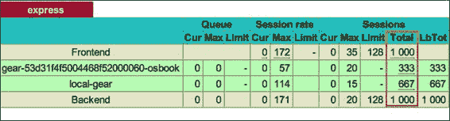
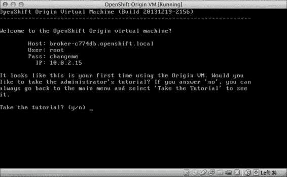
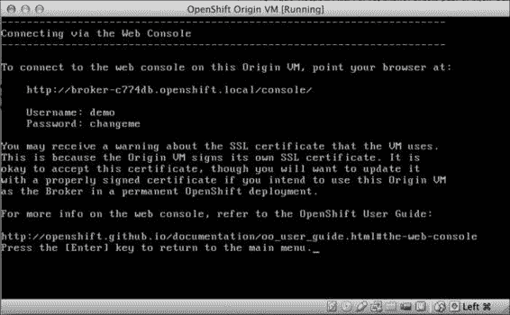

# 第十一章：日志记录与扩展 OpenShift 应用

本章的具体操作指南如下：

+   查看应用日志

+   处理 JBoss 应用日志

+   启用 JBoss 访问日志

+   处理 Tomcat 应用日志

+   处理 Python 应用日志

+   创建可扩展的应用

+   为 HAProxy 配置不同的健康检查 URL

+   配置 HAProxy 使用不同的负载均衡算法

+   从不可扩展应用创建可扩展应用

+   使用标记文件启用手动扩展

# 介绍

本章包含了一些操作指南，帮助你处理应用日志并创建可扩展的应用。这些日志操作指南将帮助你访问应用日志并调试在运行应用时可能遇到的任何问题。你将学习 OpenShift 如何使用一个名为`logshifter`的组件，将所有应用和硬件相关的日志存储在`OPENSHIFT_LOG_DIR`中。本章将详细介绍应用日志，并涵盖 JBoss、Tomcat 和 Python 应用的日志管理。所涵盖的日志概念将帮助你处理任何 Web 硬件日志。

*查看应用日志*的操作指南将为你提供应用日志的概述，以 PHP Web 硬件为例。你将学习如何使用 `rhc` 命令行工具访问应用日志，并理解 Apache 基础硬件使用的日志格式。接下来，你将学习如何在*处理 JBoss 应用日志*和*启用 JBoss 访问日志*的操作指南中访问 JBoss 应用日志。*处理 Python 应用日志*的操作指南将涵盖如何有效地处理 Python 应用日志。

本章的第二部分将详细讨论应用扩展。你将学习如何在*创建可扩展的应用*的操作指南中创建自动扩展的应用。自动扩展并不总是所需的，有时你需要手动控制应用扩展。在*使用标记文件启用手动扩展*的操作指南中，你将学习如何禁用自动扩展，并使用 `rhc` 命令行工具手动扩展 OpenShift 应用。

# 查看应用日志

日志是由应用生成的重要数据，能帮助你理解用户行为、监控应用性能并调试问题。当应用出现故障时，日志是你首先查看的地方。OpenShift 使用一个名为 `logshifter` 的服务，该服务收集应用各部分的日志并将它们汇聚在一个位置，供你访问。然后，这些日志可以被发送到你喜欢的日志管理解决方案中，如 Splunk，从中获取更多有价值的洞察。在本操作指南中，你将学习如何通过一个命令轻松查看应用的所有日志。本操作指南是以与硬件无关的方式进行日志管理，特定语言的日志管理会在本章后续部分进行介绍。

## 准备工作

为完成此操作，你需要在你的机器上安装 `rhc`。此外，我们将利用在 *使用 rhc 命令行客户端创建 OpenShift 应用程序* 一章中创建的 OpenShift 应用程序，第三章，*创建和管理应用程序*。

要重新创建应用程序，请运行以下命令：

```
$ rhc create-app myapp php-5.4

```

## 如何执行此操作…

要查看应用程序的日志文件，执行以下步骤：

1.  打开一个命令行终端，并运行以下命令，可以在应用程序目录内或通过使用 `--app` 选项传递应用程序名称来运行。请看以下命令：

    ```
    $ rhc tail

    ```

1.  你也可以使用应用程序名称，如下所示的命令：

    ```
    $ rhc tail --app myapp

    ```

1.  打开你喜欢的浏览器，访问 `http://myapp-{domain-name}.rhcloud.com`。你会注意到新的日志正在你的命令行终端上被实时跟踪。以下命令行输出显示了日志的一个小片段：

    ```
    117.212.42.145 - - [22/Jun/2014:15:28:03 -0400] "GET / HTTP/1.1" 200 39627 "-" "Mozilla/5.0 (Macintosh; Intel Mac OS X 10_8_5) AppleWebKit/537.36 (KHTML, like Gecko) Chrome/35.0.1916.153 Safari/537.36"

    ```

## 工作原理…

每个 OpenShift 应用程序都使用一个或多个 cartridge 来执行任务。每个 cartridge 都被配置为将消息记录到 `stdout` 或 `stderr`。一个名为 `logshifter` 的 OpenShift 服务会捕获所有发送到 `stdout` 和 `stderr` 的消息，并正确记录这些日志。在 OpenShift Online 中，`logshifter` 捕获的所有消息都会写入到 `$OPENSHIFT_LOGS_DIR` 目录。你可以使用 `rhc ssh` 命令通过 SSH 连接到应用程序 gear，并查看 `$OPENSHIFT_LOGS_DIR` 目录，示例如下：

```
[myapp-{domain-name}.rhcloud.com logs]\> cd $OPENSHIFT_LOG_DIR
[myapp-{domain-name}.rhcloud.com logs]\> ls
php.log

```

如你在前面的命令行中所见，`$OPENSHIFT_LOGS_DIR` 目录包含一个名为 `php.log` 的日志文件。所有应用程序日志和 Apache 日志（包括访问日志和错误日志）都会写入此日志文件。日志文件的名称取决于在 cartridge 启动时传递给 `logshifter` 的标签名称。例如，`php` cartridge 是使用 `nohup /usr/sbin/httpd $HTTPD_CMD_CONF -D FOREGROUND |& /usr/bin/logshifter -tag php &` 命令启动的。此命令确保 Apache 日志通过管道传输到 `logshifter` 服务，并使用 `php` 作为标签名称。标签名称有两个作用：首先，它标识了生成日志消息的程序；其次，它作为日志文件的名称。

在步骤 1 中，你运行了 `rhc tail` 命令；该命令在后台打开了一个 SSH 隧道，并在你的应用程序 gear 上运行了 `tail –f */log*/*` 命令。`-f` 选项使文件能够被持续监控。当新行被添加到日志文件时，`tail` 会更新显示。`rhc tail` 命令会跟踪你应用程序 gear 中 `$OPENSHIFT_LOG_DIR` 目录下的所有日志，如步骤 2 所示。以下命令显示了示例输出。所有基于 Apache 的 cartridge（如 PHP、Python、Perl 和 Ruby）都会在日志中显示类似的输出。请看以下命令输出：

```
117.212.42.145 - - [22/Jun/2014:15:28:03 -0400] "GET / HTTP/1.1" 200 39627 "-" "Mozilla/5.0 (Macintosh; Intel Mac OS X 10_8_5) AppleWebKit/537.36 (KHTML, like Gecko) Chrome/35.0.1916.153 Safari/537.36"

```

初看起来，输出可能看起来有些晦涩；但仔细检查后，它与大多数应用程序日志没有什么不同。该日志遵循 Apache 联合日志格式（[`httpd.apache.org/docs/trunk/logs.html#combined`](https://httpd.apache.org/docs/trunk/logs.html#combined)）。使用的格式是`"%{X-Forwarded-For}i %l %u %t \"%r\" %>s %b \"%{Referer}i\" \"%{User-Agent}i\""`. 让我们逐一看看这些选项：

+   `%{X-Forwarded-For}i`：这是 HTTP 请求的`X-Forwarded-For`头。它包含原始客户端的 IP 地址。在前面的命令中显示的日志行中，它对应的值是`117.212.42.145`。

+   `%l`：这是由`identd`确定的用户身份。如果该值不存在，则返回`-`。在前面的命令中显示的日志行中，值为`-`。

+   `%u`：这是通过 HTTP 认证确定的远程用户。如果该值不存在，则返回`-`。在前面的命令中显示的日志行中，值为`-`。

+   `%t`：这是接收到 HTTP 请求的时间。在前面的命令中显示的日志行中，值为`[22/Jun/2014:15:28:03 -0400]`。

+   `\"%r\"`：这是 HTTP 请求的第一行。在前面的命令中显示的日志行中，值为`GET / HTTP/1.1`。

+   `%>s`：这是 HTTP 状态码。在前面的命令中显示的日志行中，值为`200`，表示请求成功。

+   `%b`：这是服务器的响应字节数。在前面的日志行中，值为`39627`。

+   `\"%{Referer}i\"`：这是链接到该 URL 的引用 URL。在前面的日志行中，值为`-`，表示该值不存在。

+   `\"%{User-Agent}i\"`：这是从 HTTP 请求头中提取的用户代理。在前面的日志行中，值为`Mozilla/5.0 (Macintosh; Intel Mac OS X 10_8_5) AppleWebKit/537.36 (KHTML, like Gecko) Chrome/35.0.1916.153 Safari/537.36`。

如前所述，`logshifter`将为每个 cartridge 写一个日志文件。因此，如果你将 MySQL cartridge 添加到应用程序中，`logshifter`将创建另一个名为`mysql.log`的日志文件，并将所有 MySQL 特定的日志写入该文件。`rhc tail`命令将查看`$OPENSHIFT_LOG_DIR`内的所有文件。确保重新运行`tail`命令，以便它可以读取新的日志文件：

```
==> app-root/logs/php.log <==
117.212.42.145 - - [22/Jun/2014:17:18:09 -0400] "GET / HTTP/1.1" 200 39627 "-" "Mozilla/5.0 (Macintosh; Intel Mac OS X 10_8_5) AppleWebKit/537.36 (KHTML, like Gecko) Chrome/35.0.1916.153 Safari/537.36"
==> app-root/logs/mysql.log <==
140622 17:17:31 [Note] Event Scheduler: Loaded 0 events
140622 17:17:31 [Note] /opt/rh/mysql55/root/usr/libexec/mysqld: ready for connections.

```

`mysql.log`日志文件将包含所有 MySQL 日志。如果你只想查看特定的 cartridge 日志，可以使用`rhc tail`命令的`-f`或`--files`选项，如下所示。这将仅查看`mysql.log`文件。

```
$ rhc tail --files app-root/logs/mysql.log

```

你可以通过查看`rhc tail`命令的帮助来查看所有选项，如下所示：

```
$ rhc tail --help

```

另一个 `logshifter` 执行的任务是在日志文件达到可配置的阈值时，根据文件大小进行滚动。它还允许你在下一个滚动之前保留一定数量的滚动文件，并删除最旧的文件。你可以使用 `LOGSHIFTER_$TAG_MAX_FILESIZE` 和 `LOGSHIFTER_$TAG_MAX_FILES` 环境变量配置文件大小和滚动文件数量，其中 `$TAG` 是由 `-tag` 参数的值替换的大写字符串。`logshifter` 使用的默认值是 `10M`（`M` 代表兆字节）作为文件大小，`10` 作为滚动文件的数量。假设你希望将文件大小配置为 `20M`，滚动文件数量配置为 `5`。要配置这些新值，你必须首先使用 `rhc env` 命令设置新的环境变量，然后重启应用程序，如下命令所示：

```
$ rhc env-set LOGSHIFTER_PHP_MAX_FILES=5 LOGSHIFTER_PHP_MAX_FILESIZE=20M && rhc restart-app

```

你可以指定文件大小为千字节（例如 `100K`）、兆字节（例如 `20M`）、吉字节（例如 `10G`）或太字节（例如 `2T`）。文件大小的 `0` 值将有效地禁用文件滚动。

## 还有更多…

你还可以通过 `--opts` 或 `-o` 选项要求 `rhc tail` 命令输出最后 `n` 行。要输出最后 100 行，请运行以下命令：

```
$ rhc tail --opts "-n 100"

```

你也可以通过 `--opts` 选项传递其他 `tail` 命令选项。

## 另请参见

+   第三章 中的 *使用 rhc 命令行客户端创建 OpenShift 应用程序* 食谱，*创建与管理应用程序*

+   *与 JBoss 应用程序日志一起工作* 这篇食谱

+   *与 Tomcat 应用程序日志一起工作* 这篇食谱

+   *与 Python 应用程序日志一起工作* 这篇食谱

# 与 JBoss 应用程序日志一起工作

如同在 *查看应用程序日志* 食谱中提到的那样，日志是应用程序生成的重要数据。本食谱将详细介绍如何在 OpenShift 的 JBoss 卡带应用程序中处理日志。本食谱将从查看现有 JBoss 应用程序的日志开始，接着你将使用 `SLF4J` 库添加特定于应用程序的日志记录。本食谱假设你已经阅读过 *查看应用程序日志* 食谱。

## 准备工作

本食谱将使用 *使用 JBoss EAP 和 PostgreSQL 9.2 卡带创建和部署 Java EE 6 应用程序* 食谱中创建的应用程序，位于 第七章，*Java 开发人员的 OpenShift*。你可以使用以下命令重新创建应用程序：

```
$ rhc create-app jobstore jbosseap postgresql-9.2 --from-code https://github.com/OpenShift-Cookbook/chapter7-jobstore-javaee6.git

```

## 如何操作…

执行以下步骤：

1.  你可以通过运行以下命令来查看 JBoss 卡带日志：

    ```
    $ rhc tail --files */log*/jbosseap.log --app jobstore 

    ```

1.  你使用 `--files` 选项来限制 `rhc tail` 命令只显示 JBoss 特定的日志，否则它将显示 `$OPENSHIFT_LOG_DIR` 目录中的所有日志。这将输出日志，如以下命令所示：

    ```
    ==> app-root/logs/jbosseap.log <==
    2014/06/28 13:05:59,844 INFO  [org.jboss.web] (ServerService Thread Pool -- 65) JBAS018210: Register web context: 
    2014/06/28 13:06:00,153 INFO  [org.jboss.as.server] (ServerService Thread Pool -- 36) JBAS018559: Deployed "ROOT.war" (runtime-name : "ROOT.war")

    ```

1.  在浏览器中打开应用程序 URL`http://jobstore-{domain-name}.rhcloud.com`，你会在终端看到 Hibernate 特定的日志。当你访问应用程序根目录时，将发出一个 HTTP GET 请求以获取数据库中的所有公司。以下查询是 Hibernate 执行的 SQL 语句，用于从数据库中获取数据：

    ```
    2014/06/28 13:42:50,423 INFO [stdout] (http-127.13.169.1/127.13.169.1:8080-1) Hibernate: select company0_.id as col_0_0_, company0_.name as col_1_0_, company0_.description as col_2_0_ from Company company0_

    ```

1.  OpenShift 的 JBoss 插件被配置为将所有`INFO`及之前的消息记录到控制台。正如在*查看应用程序日志*小节中所提到的，任何写入`stdout`的消息都会被`logshifter`捕捉并写入日志文件。对于 JBoss EAP 插件，日志文件名为`jbosseap.log`，而对于 JBoss AS 7 插件，日志文件名为`jbossas.log`。你可以通过更新`.openshift/config`目录中的`standalone.xml`文件中的日志子系统来显示所有`DEBUG`及之前的消息，代码如下：

    ```
    <subsystem >
      <console-handler name="CONSOLE">
        <level name="DEBUG" />
        <formatter>
          <pattern-formatter
            pattern="%d{yyyy/MM/dd HH:mm:ss,SSS} %-5p [%c] (%t) %s%E%n" />
        </formatter>
      </console-handler>
      <logger category="com.arjuna">
        <level name="WARN" />
      </logger>
      <logger category="org.apache.tomcat.util.modeler">
        <level name="WARN" />
      </logger>
      <logger category="sun.rmi">
        <level name="WARN" />
      </logger>
      <logger category="jacorb">
        <level name="WARN" />
      </logger>
      <logger category="jacorb.config">
        <level name="ERROR" />
      </logger>
      <root-logger>
        <level name="DEBUG" />
        <handlers>
          <handler name="CONSOLE" />
        </handlers>
      </root-logger>
    </subsystem>
    ```

1.  提交你在本地 Git 仓库中的更改，然后将其推送到 OpenShift 应用程序设备。OpenShift 现在将使用更新后的`standalone.xml`文件，你将在`rhc tail`命令的输出中看到`DEBUG`日志。

1.  由于应用程序没有记录任何内容，`rhc tail`命令的输出显示的是应用程序服务器日志，或者是应用程序中使用的不同库的日志。你可以使用任何 Java 日志库来添加特定于应用程序的日志。在本节中，你将使用`SLF4J`和`java.util.logging`绑定来记录应用程序日志，但你也可以使用其他`SLF4J`绑定，如`log4j`或`logback`。打开 Maven 的`pom.xml`文件，并向其中添加以下依赖：

    ```
    <dependency>
      <groupId>org.slf4j</groupId>
      <artifactId>slf4j-api</artifactId>
      <version>1.7.7</version>
    </dependency>
    <dependency>
      <groupId>org.slf4j</groupId>
      <artifactId>slf4j-jdk14</artifactId>
      <version>1.7.7</version>
    </dependency>
    ```

1.  在编辑器中打开`CompanyResource.java`文件，位于`org.osbook.jobstore.rest`包中，并添加几条语句来导入`SLF4J`类，如下所示的代码：

    ```
    import org.slf4j.Logger;
    import org.slf4j.LoggerFactory;
    ```

1.  添加`import`语句后，按如下代码更新`CompanyResource.java`中的`createNewCompany()`和`showAll()`方法，添加日志消息：

    ```
    private Logger logger = LoggerFactory.getLogger(CompanyResource.class);
    @Inject
    private CompanyService companyService;

    @POST
    @Consumes(MediaType.APPLICATION_JSON)
    public Response createNewCompany(@Valid Company company) {
      logger.debug("inside createNewCompany().. creating new company {}" , company);
      Company existingCompanyWithName = companyService.findByName(company.getName());
      if (existingCompanyWithName != null) {
        logger.debug("Company with name {} already exists : {}" , company.getName(), existingCompanyWithName);
        return Response.status(Status.NOT_ACCEPTABLE)
                .entity(String.format("Company already exists with name: %s",company.getName())).build();
        }
      company = companyService.save(company);
      logger.info("Created new company {}" , company);
      return Response.status(Status.CREATED).entity(company).build();
    }

    @GET
    @Produces(MediaType.APPLICATION_JSON)
    public List<Company> showAll() {
      List<Company> companies = companyService.findAll();
      logger.info("Found {} companies" , companies.size());
      return companies;
    }
    ```

1.  撤销你在步骤 3 中对`standalone.xml`文件所做的更改，以便仅查看`INFO`级别的消息。将`root-logger`的级别更改为`INFO`，如下所示的代码：

    ```
    <root-logger>
      <level name="INFO" />
      <handlers>
        <handler name="CONSOLE" />
      </handlers>
    </root-logger>
    ```

1.  提交对本地 Git 仓库的更改，然后使用`git push`命令将其推送到应用程序设备。

1.  更改部署后，再次向 Web 应用程序发出请求，这时你将在`rhc tail`命令的输出中看到应用程序日志，如下所示：

    ```
    2014/06/28 14:24:50,959 INFO  [org.osbook.jobstore.rest.CompanyResource] (http-127.13.169.1/127.13.169.1:8080-1) Found 1 companies

    ```

1.  如果你尝试创建一个新公司，你会发现只有`INFO`级别的消息被记录。这是因为`standalone.xml`文件中的日志配置被设置为仅将`INFO`及之前的消息记录到控制台。

1.  要查看应用程序的调试消息，你需要按照如下代码更新`standalone.xml`日志子系统配置：

    ```
    <subsystem >
      <console-handler name="CONSOLE">
        <level name="DEBUG" />
        <formatter>
          <pattern-formatter
            pattern="%d{yyyy/MM/dd HH:mm:ss,SSS} %-5p [%c] (%t) %s%E%n" />
        </formatter>
      </console-handler>
      <logger category="com.arjuna">
        <level name="WARN" />
      </logger>
      <logger category="org.apache.tomcat.util.modeler">
        <level name="WARN" />
      </logger>
      <logger category="sun.rmi">
        <level name="WARN" />
      </logger>
      <logger category="jacorb">
        <level name="WARN" />
      </logger>
      <logger category="jacorb.config">
        <level name="ERROR" />
      </logger>
      <logger category="org.osbook.jobstore">
        <level name="DEBUG"></level>
      </logger>
      <root-logger>
        <level name="INFO" />
        <handlers>
          <handler name="CONSOLE" />
        </handlers>
      </root-logger>
    </subsystem> 
    ```

1.  现在，您还将在`rhc tail`命令的输出中看到特定于应用程序的`DEBUG`日志：

    ```
    2014/06/28 14:40:22,410 DEBUG [org.osbook.jobstore.rest.CompanyResource] (http-/127.13.169.1:8080-1) inside createNewCompany().. creating new company

    ```

## 它是如何工作的…

在前面的步骤中，您学习了如何查看 JBoss 应用程序的日志，并使用`SLF4J`库添加特定于应用程序的日志记录。在第 1 步中，您运行了`rhc tail`命令以查看所有 JBoss 特定的日志。所有 JBoss EAP 特定的日志都写入`jbosseap.log`文件。此文件包含 JBoss 的`server.log`和`boot.log`内容。如在*查看应用程序日志*一节中所述，`logshifter`将收集所有写入`stdout`或`stderr`的日志，并将它们写入特定于应用程序的日志文件。通过在`standalone.xml`配置文件中配置日志子系统，可以控制 JBoss 卡带中的日志记录。`standalone.xml`文件位于`.openshift/config`目录内，您可以覆盖该文件以满足您的需求。日志子系统由三部分组成：一个或多个处理程序配置，例如`console-handle`或`file-handler`，一个或多个日志记录器用于定义日志类别，例如下一个代码中所示的`com.arjuna`，以及一个`root-logger`声明。您可以在官方文档中了解更多关于 JBoss 日志配置的内容，网址为[`docs.jboss.org/author/display/AS71/Logging+Configuration`](https://docs.jboss.org/author/display/AS71/Logging+Configuration)。请看下面的代码：

```
<subsystem >
  <console-handler name="CONSOLE">
    <level name="DEBUG" />
    <formatter>
      <pattern-formatter
        pattern="%d{yyyy/MM/dd HH:mm:ss,SSS} %-5p [%c] (%t) %s%E%n" />
    </formatter>
  </console-handler>
  <logger category="com.arjuna">
    <level name="WARN" />
  </logger>
  <root-logger>
    <level name="DEBUG" />
    <handlers>
      <handler name="CONSOLE" />
    </handlers>
  </root-logger>
</subsystem>
```

在第 3 步中，您将`root-logger`级别更新为`DEBUG`。这使得 JBoss 服务器能够生成`DEBUG`及其之前级别的日志。

从第 5 步到第 11 步，您首先使用`SLF4J`库添加了应用程序日志，然后更新了`standalone.xml`的日志子系统配置，以便 JBoss 记录应用程序的`DEBUG`以及前面的消息。此操作是通过在`DEBUG`级别添加特定于应用程序的`logger category`来完成的。请看下面的代码：

```
  <logger category="org.osbook.jobstore">
    <level name="DEBUG"></level>
  </logger>
```

## 还有更多…

阅读完此部分内容后，您可能会想知道是否有办法在运行时更新日志配置。是的，您可以使用 JBoss 管理员控制台来做到这一点。要使用 JBoss 管理员控制台，首先运行`rhc port-forward`命令，如下所示：

```
$ rhc port-forward --app jobstore

```

然后，进入管理员控制台，网址为`http://127.0.0.1:9990/`。导航到**配置** | **核心** | **日志记录**，如下图所示：


现在，转到**日志类别**，您将看到一个`org.osbook.jobstore`的类别，如下图所示：


将**日志级别**的值更改为**INFO**，然后点击**保存**按钮：


现在，如果您尝试创建一个新公司，您将不会看到`DEBUG`消息。您只会看到`INFO`和前面的消息。

## 另见

+   *查看应用程序日志* 这部分内容

+   *启用 JBoss 访问日志* 这部分内容

# 启用 JBoss 访问日志

访问日志在你希望查看服务器处理的所有请求时非常有用。对于基于 Apache 的 Cartridges，默认情况下会启用访问日志，但在基于 JBoss 的 Cartridges 中，你需要手动启用它。在本配方中，你将学习如何为 JBoss Cartridges 启用访问日志。

## 准备工作

本配方将从我们在*使用 JBoss 应用程序日志*配方中所讲的内容继续。

## 如何操作…

执行以下步骤以启用访问日志：

1.  在你喜欢的编辑器中打开位于`.openshift/config`目录下的`standalone.xml`文件。

1.  使用以下代码更新`urn:jboss:domain:web:1.5`子系统：

    ```
    <subsystem 
      default-virtual-server="default-host" native="false">
      <connector name="http" protocol="HTTP/1.1" scheme="http"
        socket-binding="http" />
      <virtual-server name="default-host" enable-welcome-root="false">
        <alias name="localhost" />
        <access-log pattern="%a %t %H %p %U %s %S %T" rotate="true">
          <directory path="app-root/logs/" relative-to="user.home" />
        </access-log>
      </virtual-server>
      <valve name="remoteipvalve" module="org.jboss.as.web"
        class-name="org.apache.catalina.valves.RemoteIpValve">
        <param param-name="protocolHeader" param-value="x-forwarded-proto" />
      </valve>
    </subsystem>
    ```

1.  将更改提交到本地 Git 仓库，然后使用`git push`命令将更改推送到应用程序的 gear 中。

1.  再次运行`rhc tail`命令，你将在`tail`命令的输出中看到访问日志，如下所示：

    ```
    ==> app-root/logs/access_log.2014-06-28 <==
    106.211.32.170 [28/Jun/2014:15:43:28 -0400] HTTP/1.1 80 /api/v1/companies 200 - 5.409

    ```

## 它是如何工作的…

访问日志存储了所有用户请求的单独资源。这些请求包括获取 HTML 文件、JavaScript 文件、CSS 文件、REST 调用等。存储在该文件中的数据可以由其他应用程序进行分析，从中提取有意义的信息。访问日志可以帮助你：

+   它有助于计算你网站的独立访客数量。

+   它有助于计算成功请求和失败请求的数量。`2XX`代码的请求视为成功，`4xx`和`5xx`代码的请求视为错误。

+   它有助于进行基本的性能分析。每一行访问日志都包含了处理请求所花费的时间。

+   它有助于分析你的网站应用程序使用模式，如一天中的时间、星期几等。

在前面的步骤中，你更新了`urn:jboss:domain:web:1.5`子系统配置以启用访问日志。将以下两行添加到配置中可启用访问日志：

```
<access-log pattern="%a %t %H %p %U %s %S %T" rotate="true">
<directory path="app-root/logs/" relative-to="user.home" />
```

`access-log`元素启用访问日志，而`directory`元素用于指定生成日志的目录。前述的`directory`元素配置了 JBoss 将访问日志写入`$OPENSHIFT_LOG_DIR`，因为它查找相对于用户主目录的`app-root/logs`目录。`app-root/logs`目录相对于用户主目录为`$OPENSHIFT_LOG_DIR`。我们使用了这个值，以便`rhc tail`命令可以读取该文件以及其他 JBoss 日志。`access-log`元素需要一个名为`pattern`的必选属性。`pattern`元素定义日志的格式。以下是支持的模式代码：

+   `%a`：远程 IP 地址

+   `%A`：本地 IP 地址

+   `%b`：发送的字节数，不包括 HTTP 头部，如果为零，则显示`-`

+   `%B`：发送的字节数，不包括 HTTP 头部

+   `%h`：远程主机名（如果`resolveHosts`为`false`，则为 IP 地址）

+   `%H`：请求协议

+   `%l`：来自`identd`的远程逻辑用户名（始终返回`-`）

+   `%m`：请求方法（如 GET、POST 等）

+   `%p`：接收此请求的本地端口

+   `%q`：查询字符串（如果存在，前面加上`?`）

+   `%r`：请求的第一行（方法和请求 URI）

+   `%s`：响应的 HTTP 状态码

+   `%S`：用户会话 ID

+   `%t`：以通用日志格式显示的日期和时间

+   `%u`：经过身份验证的远程用户（如果有），否则为`-`

+   `%U`：请求的 URL 路径

+   `%v`：本地服务器名称

+   `%D`：处理请求所花费的时间（以毫秒为单位）

+   `%T`：处理请求所花费的时间（以秒为单位）

+   `%I`：当前请求线程的名称（可以稍后与堆栈跟踪进行比较）

## 另见

+   *处理 JBoss 应用程序日志*食谱

+   *查看应用程序日志*食谱

# 处理 Tomcat 应用程序日志

在此食谱中，你将学习如何处理 Tomcat 应用程序中的日志。你将首先学会跟踪现有 Tomcat 应用程序的日志，然后学习如何使用`SLF4J`库添加特定于应用程序的日志记录。

## 准备工作

本食谱将使用在第七章的*使用 Tomcat 7 启动和部署 Spring 应用程序*食谱中创建的应用程序。你可以使用以下命令重新创建该应用程序：

```
$ rhc create-app jobstore tomcat-7 mysql-5.5 --from-code https://github.com/OpenShift-Cookbook/chapter7-jobstore-spring.git --timeout 180

```

## 如何执行……

执行以下步骤：

1.  你可以使用`rhc tail`命令查看 Tomcat 应用程序的日志。Tomcat 日志写入名为`jbossews.log`的文件，该文件位于`$OPENSHIFT_LOG_DIR`目录下：

    ```
    $ rhc tail --files */log*/jbossews.log --app jobstore

    ```

1.  `jbossews.log`文件将包含 Tomcat 特定的日志和特定于应用程序的日志，如下所示：

    ```
    INFO: Starting ProtocolHandler ["http-bio-127.5.249.129-8080"]
    Jun 29, 2014 5:03:01 AM org.apache.catalina.startup.Catalina start
    INFO: Server startup in 22062 ms

    ```

1.  在添加特定于应用程序的日志记录之前，你需要在 Maven 的`pom.xml`文件中添加以下依赖项。在此食谱中，你将使用`SLF4J`与`logback`绑定来添加应用程序日志记录：

    ```
    <dependency>
      <groupId>org.slf4j</groupId>
      <artifactId>slf4j-api</artifactId>
      <version>1.7.7</version>
    </dependency>
    <dependency>
      <groupId>ch.qos.logback</groupId>
      <artifactId>logback-classic</artifactId>
      <version>1.0.13</version>
    </dependency>
    ```

1.  在编辑器中打开`org.osbook.jobstore.rest`包中的`CompanyResource.java`文件，并添加几行代码以导入`SLF4J`类，如下所示：

    ```
    import org.slf4j.Logger;
    import org.slf4j.LoggerFactory;
    ```

1.  现在，更新`org.jobstore.rest`包下的`CompanyResource` Java 类，以添加特定于应用程序的日志记录，如下所示：

    ```
    private Logger logger = LoggerFactory.getLogger(CompanyResource.class);

    @RequestMapping(method = RequestMethod.POST, consumes = MediaType.APPLICATION_JSON_VALUE, produces = MediaType.APPLICATION_JSON_VALUE)
    public ResponseEntity<Company> createNewCompany(@RequestBody Company company) {
      logger.debug("inside createNewCompany().. creating new company {}" , company);
      Company existingCompany = companyRepository.findByName(company.getName());
      if(existingCompany != null){
        logger.debug("Company with name {} already exists : {}" , company.getName(), existingCompany);
        return new ResponseEntity<>(HttpStatus.NOT_ACCEPTABLE);
      }
      company = companyRepository.save(company);
      logger.info("Created new company {}" , company);
      return new ResponseEntity<>(company,HttpStatus.CREATED);
    }

    @RequestMapping(method=RequestMethod.GET, produces = MediaType.APPLICATION_JSON_VALUE)
    public @ResponseBody List<Company> showAll(){
      List<Company> companies = companyRepository.findAll();
      logger.info("Found {} companies" , companies.size());
      return companies;
    }
    ```

1.  提交更改到本地 Git 仓库，然后使用`git push`命令将它们推送到应用程序服务器。

1.  应用程序重启后，你将开始看到各种日志消息。以下输出显示了一个简短的日志片段：

    ```
    05:43:00.182 [http-bio-127.5.249.129-8080-exec-6] INFO  org.jobstore.rest.CompanyResource - Created new company Company [id=1, name=Red Hat, description=open source company, contactEmail=contact@redhat.com]
    05:43:00.245 [http-bio-127.5.249.129-8080-exec-6] DEBUG o.s.w.s.m.m.a.HttpEntityMethodProcessor - Written [Company [id=1, name=Red Hat, description=open source company, contactEmail=contact@redhat.com]] as "application/json" using [org.springframework.http.converter.json.MappingJackson2HttpMessageConverter@1d300d2]

    ```

1.  你可以使用`logback`配置文件来启用特定包的日志记录。在`src/main/resources`目录下创建一个名为`logback.xml`的新文件，并添加以下内容：

    ```
    <?xml version="1.0" encoding="UTF-8"?>
    <configuration>
           <appender name="console" class="ch.qos.logback.core.ConsoleAppender">
    		<encoder>
    			<pattern>%d %5p %C:%4L - %m%n</pattern>
    		</encoder>
    	</appender>
    	<logger name="org.jobstore" level="debug" />
    	<root level="WARN">
    		<appender-ref ref="console" />
    	</root>
    </configuration>
    ```

1.  提交更改到本地 Git 仓库，并使用`git push`命令将它们推送到应用程序服务器。应用程序重启后，你将只看到特定于应用程序的`DEBUG`消息和前面的消息。请查看以下命令：

    ```
    INFO: Server startup in 49113 ms
    2014-06-29 06:07:27,817  INFO org.jobstore.rest.CompanyResource:  45 - Found 1 companies
    2014-06-29 06:07:38,513 DEBUG org.jobstore.rest.CompanyResource:  31 - inside createNewCompany().. creating new company Company [id=null, name=test, description=test, contactEmail=test@test.com]
    2014-06-29 06:07:38,752  INFO org.jobstore.rest.CompanyResource:  38 - Created new company Company [id=2, name=test, description=test, contactEmail=test@test.com]

    ```

## 它是如何工作的……

在上述步骤中，你学习了如何查看 Tomcat 应用程序的日志，并使用 `SLF4J` 库添加应用程序特定的日志记录。在第 1 步中，你运行了 `rhc tail` 命令以查看所有 Tomcat 特定的日志。所有 Tomcat 特定的日志都写入到 `jbossews.log` 文件中。如 *查看应用程序日志* 配方中所讨论的，`logshifter` 将收集所有写入到 `stdout` 或 `stderr` 的日志，并将它们写入到载体特定的日志文件中。

从第 2 步到第 5 步，你使用 `SLF4J` 库向 `CompanyResource.java` 文件添加了日志语句。 `SLF4J` 库底层使用具有默认日志级别 `DEBUG` 的 `Logback` 库。这意味着如果你没有指定任何 `Logback` 配置，那么所有的 `DEBUG` 及其前面的消息将被记录到 `jbossews.log`。

使用 `logback.xml` 文件可以配置 `Logback`。在第 6 步中，你创建了一个 `logback.xml` 文件，并仅添加了对日志应用程序 `DEBUG` 消息的配置。所有其他消息将以 `WARN` 级别记录。最后，在第 7 步中，你提交了更改并将它们推送到应用程序装置。

## 还有更多内容…

你可以通过执行以下步骤为 Tomcat 载体启用访问日志：

1.  打开位于 `.openshift/config` 目录中的 Tomcat `server.xml` 配置文件。

1.  将 `AccessLogValve` 配置添加到 `server.xml` 文件的 `Host` 元素中：

    ```
    <Valve className="org.apache.catalina.valves.AccessLogValve" directory="${user.home}/app-root/logs" prefix="localhost_access_log." suffix=".txt" pattern="%h %l %u %t &quot;%r&quot; %s %b"/>
    ```

1.  将更改提交到本地 Git 仓库，并使用 `git push` 命令将它们推送到应用程序装置。

1.  再次运行 `rhc tail` 命令，这次你将看到访问日志，如下所示：

    ```
    ==> app-root/logs/localhost_access_log.2014-06-29.txt <==
    127.5.249.129 - - [29/Jun/2014:07:18:57 -0400] "POST /api/v1/companies HTTP/1.1" 201 133
    127.5.249.129 - - [29/Jun/2014:07:18:58 -0400] "GET /api/v1/companies HTTP/1.1" 200 344

    ```

## 另请参阅

+   *查看应用程序日志* 配方

+   *使用 JBoss 应用程序日志* 配方

+   *启用 JBoss 访问日志* 配方

# 处理 Python 应用程序日志

在这个配方中，你将学习如何为你的 Python 应用程序添加视图和日志记录。如 第八章 讨论的，*OpenShift for Python Developers*，OpenShift Python 应用程序使用带有 `mod_wsgi` 的 Apache。

## 准备就绪

本配方将使用在 第八章 中创建并部署 Flask Web 应用程序使用 Python 和 PostgreSQL 载体配方中创建的应用程序。你可以使用以下命令重新创建应用程序：

```
$ rhc create-app jobstore python-2.7 postgresql-9.2 --from-code https://github.com/OpenShift-Cookbook/chapter8-jobstore-python-flask.git

```

## 如何操作…

执行以下步骤：

1.  打开新的命令行终端，并导航到创建 Python 应用程序的目录。

1.  要查看 Python 应用程序的日志，请运行以下命令：

    ```
    $ rhc tail --files */log*/python.log

    ```

1.  通过访问应用程序的 URL，当你向应用程序发出请求时，你将在 `rhc tail` 命令的输出中看到以下日志：

    ```
    117.207.184.93 - - [29/Jun/2014:14:50:09 -0400] "GET /api/v1/companies HTTP/1.1" 200 17 "http://jobstore-osbook.rhcloud.com/" "Mozilla/5.0 (Macintosh; Intel Mac OS X 10_8_5) AppleWebKit/537.36 (KHTML, like Gecko) Chrome/35.0.1916.153 Safari/537.36"

    ```

1.  打开应用程序目录中的`jobstore.py`文件，并在`index()`函数上方添加以下代码。以下代码导入了`logging`模块，然后创建了一个新的`logger`对象，日志级别为`INFO`。此`logger`将在下一步用于日志记录。

    ```
    import logging
    logging.basicConfig(level=logging.INFO)
    logger = logging.getLogger(__name__)
    ```

1.  接下来，更新`index()`函数，添加一个日志语句，如以下代码所示：

    ```
    @app.route('/')
    def index():
    logger.info('inside index()...')
    return render_template('index.html')
    ```

1.  提交更改到本地 Git 仓库，然后将更改推送到应用程序设备。应用程序成功启动后，访问应用程序 URL，你将看到你添加到`jobstore.py`中的日志消息，如下所示：

    ```
    [Sun Jun 29 14:56:08 2014] [error] INFO:jobstore:inside index()...

    ```

1.  有时，你可能更倾向于使用不同的文件来存储应用程序日志。这可以通过使用`TimedRotatingFileHandler`来完成。打开应用程序根目录中的`jobstore.py`文件，并用以下代码替换第 3 步中添加的日志行：

    ```
    import logging
    import logging.handlers
    logger = logging.getLogger(__name__)
    logger.setLevel(logging.DEBUG)
    formatter = logging.Formatter('%(asctime)s - %(name)s - %(levelname)s - %(message)s')
    log_location = os.environ.get('OPENSHIFT_LOG_DIR') if os.environ.get('OPENSHIFT_LOG_DIR') else '/tmp/'
    log_filename = log_location + 'jobstore.log'
    handler = logging.handlers.TimedRotatingFileHandler(log_filename,when='midnight',backupCount=5)
    handler.setFormatter(formatter)
    logger.addHandler(handler)
    ```

1.  提交更改并将更改推送到应用程序设备。应用程序重启后，你将看到一个新的文件`jobstore.log`，其中包含所有应用程序特定的日志，如以下命令所示。你必须运行`rhc tail`命令，以便`tail`命令能够找到新文件，具体如下：

    ```
    ==> app-root/logs/jobstore.log <==
    2014-06-29 15:25:34,158 - jobstore - INFO - inside index()...

    ```

## 它是如何工作的……

Python 应用程序日志记录在`$OPENSHIFT_LOG_DIR`中的`python.log`文件中。此文件将包含 Apache 访问日志和错误日志，以及任何应用程序特定的日志。日志遵循在*查看应用程序日志*一节中讨论的 Apache 联合日志格式。

为了添加应用程序级别的日志记录，你在第 3 步中使用了 Python 标准日志模块。在将这些更改推送到应用程序设备后，你将开始看到特定应用程序的日志消息。你只会看到`INFO`级别或更高级别的日志消息。这是因为你已将默认的日志级别配置为`logging.INFO`。

OpenShift 默认会将所有写入`stdout`或`stderr`的消息记录到`python.log`文件中。如果你想为特定应用使用不同的日志文件，可以使用`TimedRotaingFileHandler`将消息记录到`$OPENSHIFT_LOG_DIR`中的`jobstore.log`文件，如第 5 步所示。在第 6 步，你将更改推送到 OpenShift 应用程序的设备后，再次运行`rhc tail`命令，你将看到输出中开始显示写入`jobstore.log`的消息。

## 另见

+   *查看应用程序日志*一节

# 创建可扩展的应用程序

随着应用程序变得越来越流行，更多的用户开始使用它，你将需要扩展应用程序以满足日益增加的使用量。应用程序的扩展可以通过以下两种方式之一完成：垂直扩展（或向上扩展）和水平扩展（向外扩展）。垂直扩展是指向单台机器添加更多的计算能力，即更快的 CPU、更多的内存和 SSD 等等。垂直扩展有其限制，并且成本呈指数增长。另一方面，水平扩展则是通过增加更多机器来处理更多的请求和负载。

对于大多数 PaaS 解决方案，例如 OpenShift，你很快会遇到垂直扩展的限制。目前，在 OpenShift 中，你无法获得超过 2GB 内存（即大型 gear）的 gear 大小，因此建议你设计应用程序以支持水平扩展。有很多关于这个主题的好书，例如*Scalability Rules*、*Martin L. Abbott and Michael T. Fisher*、*Addison-Wesley Professional*，你可以参考这些书籍获取更多信息。我还写了一篇关于创建可扩展 Web 应用程序的最佳实践文章（[`www.openshift.com/blogs/best-practices-for-horizontal-application-scaling`](https://www.openshift.com/blogs/best-practices-for-horizontal-application-scaling)），你也可以参考。

在本配方中，你将学习如何在 OpenShift 中创建可扩展的应用程序。

## 准备工作

要完成此配方，你需要在机器上安装`rhc`。此配方将需要所有三个可用的 gear，因此请确保删除任何现有的应用程序。

## 如何做到…

要创建一个可扩展的应用程序，请执行以下步骤：

1.  打开命令行终端，并将目录更改为你希望创建应用程序的位置。

1.  接下来，执行以下命令以创建可扩展应用程序：

    ```
    $ rhc create-app jobstore jbosseap postgresql-9 --scaling --from-code https://github.com/OpenShift-Cookbook/chapter7-jobstore-javaee6.git

    ```

## 它是如何工作的…

前述步骤中使用的`rhc create-app`命令指示 OpenShift 创建一个名为`jobstore`的应用程序，并使用 JBoss EAP 和 PostgreSQL 9.2 的插件。`--scaling`选项告诉 OpenShift 创建一个可水平扩展的应用程序，而不是一个不可扩展的应用程序。`--from-code`选项告诉 OpenShift 使用指定的 Git 仓库作为参考应用程序。你也可以使用`-s`代替`--scaling`，`-s`选项是`--scaling`选项的简写。

此命令将创建两个 OpenShift gears。HAProxy 负载均衡器和 JBoss EAP 应用程序服务器将共享第一个 gear，PostgreSQL 数据库将使用第二个 gear。安装了 HAProxy 插件的 gear 称为`main` gear。所有针对 gear 的命令都将应用于此 gear。例如，当你运行`rhc ssh`命令时，你将登录到 HAProxy gear。同样，`rhc tail`命令将实时查看该 gear 中`app-root/logs`目录下的日志。

HAProxy 是一个基于软件的负载均衡器，它位于你的 Web 应用程序前端，接受所有传入请求。然后，它解析 HTTP 请求，并根据其配置，将传入请求路由到一个后端。这里的后端指的是一个或多个 JBoss EAP 实例。OpenShift 通过在并发 HTTP 连接数达到阈值时添加新的应用实例（在我们的例子中为 JBoss EAP 实例），来帮助你扩展应用程序。当前的阈值是 16 个并发 HTTP 连接。这种行为叫做自动扩展，因为 OpenShift 在无需用户干预的情况下管理应用程序扩展。你也可以配置应用程序使用手动扩展，这将让你对应用程序扩展有更多控制。具体内容将在 *通过标记文件启用手动扩展* 配方中讲解。

OpenShift 目前不支持数据库扩展。你可以使用 Amazon RDS 等服务（在第四章的 *使用 Amazon RDS MySQL 数据库实例与 OpenShift* 配方中有讲解，*使用 MySQL 与 OpenShift 应用程序*），Enterprise DB PostgreSQL 云数据库（在第五章的 *使用 EnterpriseDB PostgreSQL 云数据库与 OpenShift* 配方中有讲解，*使用 PostgreSQL 与 OpenShift 应用程序*），或者 MongoLab（在第六章的 *使用 MongoLab MongoDB 作为服务与 OpenShift* 配方中有讲解，*使用 MongoDB 和第三方数据库插件与 OpenShift 应用程序*）来实现数据库扩展。

每个 OpenShift 可扩展应用程序都有一个名为 `haproxy_ctld` 的守护进程在运行。该守护进程通过每五秒轮询 HAProxy Unix 套接字状态端口来收集基本的 HAProxy 统计信息，从而控制自动扩展行为。默认情况下，它配置为使用 HTTP 并发连接进行自动扩展，但用户可以自定义应用程序的自动扩展方式，基于其他因素，如 CPU 使用率等，进行扩展，详情请见([`www.openshift.com/blogs/customizing-autoscale-functionality-in-openshift`](https://www.openshift.com/blogs/customizing-autoscale-functionality-in-openshift))。

守护进程检查当前的并发 HTTP 连接，如果并发连接数超过分配数的 90%，即超过 16，它将触发扩展事件。当扩展事件发生时，守护进程将向 OpenShift 代理发送 HTTP 请求，以向应用程序添加新的 Gear。代理将启动一个与现有应用程序 Gear 配置相同的新 Gear，将新 Gear 与 HAProxy 关联，使用`rsync`命令将主 Gear 上 `~/app-root/repo` 目录的内容复制到新 Gear，然后启动新 Gear。从现在起，HAProxy 将根据配置的算法开始向两个 Gear 发送请求。默认情况下，OpenShift 使用粘性会话和最小连接平衡算法，确保来自同一用户的请求始终到达相同的 Gear，且最少连接的服务器将接收到来自新客户端的请求。用户可以根据需要覆盖默认的 HAProxy 配置。我们将在本章后面讲解这一部分。

当应用程序的 Web 流量降到分配的 HTTP 连接数的 50% 以下，并持续几分钟时，应用程序将缩减规模。然后，新 Gear 将被移除，并且它也会从 HAProxy 配置中移除。

OpenShift 应用程序开发者可以在 HAProxy 状态页面上查看 HAProxy 的统计信息。此页面位于 `http://jobstore-{domain-name}.rhcloud.com/haproxy-status`，如下图所示：


HAProxy 状态页面分为两部分：**统计**和**简易**。**统计**部分配置为监听所有访问 HAProxy 状态页面的请求。每次你刷新 `http://jobstore-domainname.rhcloud.com/haproxy-status` 页面时，**会话**选项卡下的会话总数将增加。这一数字显示在**总计**列下。**当前**列是当前正在访问状态页面的用户数量。**最大**列是最大并发用户数。所有这些数字是从 HAProxy 启动以来计算的；如果重新启动 HAProxy，统计数据将会重置。

**简易**部分从应用程序的角度来看更为有趣。**local-gear** 行对应 JBoss EAP 处理的请求。应用程序处理的会话总数显示在**总计**列下。**当前**列是当前正在访问应用程序的用户数。**最大**列是最大并发用户数。所有这些数据都与 HAProxy 启动后的时间段相关；如果重新启动 HAProxy，统计数据将会重置。在前面的截图中，我们可以看到**local-gear**已处理了七个请求，每次一个。当应用程序扩展时，会为新 Gear 添加更多的行。

## 还有更多…

您可以为应用程序的扩展定义最小值和最大值。默认情况下，可扩展应用程序至少会消耗一个组件，并且在流量峰值时，可以消耗您 OpenShift 帐户中的所有组件。您可以使用 `rhc scale-cartridge` 命令设置最小值和最大值，如以下命令所示：

```
$ rhc scale-cartridge <web cartridge> --app <app_name> --min <minimum gears> --max <maximum gear>

```

让我们看以下示例：

```
$ rhc scale-cartridge jbosseap --app jobstore --min 2 --max 4

```

前面的命令将确保 `jobstore` 应用程序至少有两个 JBoss EAP 插件实例，最多四个实例。

## 另请参见

+   *配置 HAProxy 使用不同的健康检查 URL* 食谱

+   *配置 HAProxy 使用不同的负载均衡算法* 食谱

+   *启用手动缩放和标记文件* 食谱

# 配置 HAProxy 使用不同的健康检查 URL

在本食谱中，您将学习如何更新 HAProxy 配置文件，以配置不同的健康检查 URL。

## 准备工作

要完成本食谱，您需要在您的计算机上安装 `rhc`。本食谱将使用 *创建可扩展应用程序* 食谱中创建的应用程序。

## 如何操作……

执行以下步骤：

1.  打开命令行终端，并导航到在*创建可扩展应用程序*食谱中创建的应用程序目录。

1.  使用 `rhc ssh` 命令 SSH 连接到主应用程序组件，如下所示：

    ```
    $ rhc ssh --app jobstore

    ```

1.  将目录更改为 `haproxy` 配置目录，如下所示：

    ```
    $ cd haproxy/conf

    ```

1.  现在，使用 VIM 打开 `haproxy.cfg` 文件，并删除以下内容：

    ```
    option httpchk GET /
    ```

    将以下内容插入其位置：

    ```
    option httpchk GET /api/v1/ping
    ```

1.  最后，使用 `rhc` 命令行客户端从本地计算机重新启动 HAProxy 插件：

    ```
    $ rhc restart-cartridge --cartridge haproxy --app jobstore

    ```

## 它是如何工作的……

HAProxy 执行定期健康检查，以确定应用程序组件的健康状况。默认配置每两秒钟对根 URL `/` 进行一次 ping 操作。如果 HAProxy 收到 `2xx` 或 `3xx` 以外的 HTTP 代码，则认为是服务器故障，您的应用程序将出现 `服务不可用` 错误。一个常见的场景是，当您使用 OpenShift 托管 REST 后端并使用非根 URL（例如 `/api/v1/`）时，您将看到这种行为。在前面的步骤中，您已更新了 `haproxy.cfg` 文件，以使用不同的健康检查 URL。

## 另请参见

+   *配置 HAProxy 使用不同的负载均衡算法* 食谱

+   *启用手动缩放和标记文件* 食谱

# 配置 HAProxy 使用不同的负载均衡算法

HAProxy 负载均衡器可以与多种负载均衡算法一起使用。OpenShift 应用程序中使用的 HAProxy 配置使用 **leastconn** 负载均衡算法。当您有长期连接时，这个算法非常有用，但对于短连接并不推荐。对于短连接，如我们的应用程序，使用 **roundrobin** 算法更为合适。

在本食谱中，您将学习如何配置 HAProxy 使用 **roundrobin 负载均衡** 算法，而不是 leastconn 算法。

## 准备工作

为了完成这个教程，你的机器上需要安装`rhc`。本教程将利用在*创建可扩展应用程序*教程中创建的应用程序。

## 如何操作…

执行以下步骤将 HAProxy 配置为使用轮询（roundrobin）负载均衡算法：

1.  打开命令行终端，并导航到在*创建可扩展应用程序*教程中创建的应用程序目录。

1.  通过运行以下命令，将 JBoss EAP cartridge 扩展为使用两个 JBoss EAP 实例：

    ```
    $ rhc scale-cartridge --min 2 --cartridge jbosseap-6

    ```

1.  使用`rhc ssh`命令通过 SSH 登录到主应用程序 gear，如下所示：

    ```
    $ rhc ssh --app jobstore

    ```

1.  进入应用程序 gear 后，切换到`haproxy/conf`目录，如下所示：

    ```
    $ cd haproxy/conf

    ```

1.  在对配置文件进行任何更改之前，备份配置文件总是一个好主意。使用`copy`命令在`$OPENSHIFT_DATA_DIR`中创建`haproxy.cfg`文件的副本，如下所示：

    ```
    $ cp haproxy.cfg $OPENSHIFT_DATA_DIR

    ```

1.  现在，使用 VIM 打开`haproxy.cfg`文件，并将`balance leastconn`下的部分更新为以下代码：

    ```
    balance roundrobin
        server gear-2 host2:port2 check fall 2 rise 3 inter 2000 weight 1
        server local-gear host1:port1 check fall 2 rise 3 inter 2000 weight 1
    ```

1.  将`gear-2`替换为你应用程序的第二个 gear 名称。同时，将`host1`和`host2`、`port1`和`port2`替换为 gear 1 和 gear 2 的主机名和端口值。你可以从第 5 步中保存的`haproxy.cfg`副本中获取这些值。

1.  你可以通过运行以下命令要求 HAProxy 重新加载配置：

    ```
    $ rhc reload-cartridge --cartridge haproxy

    ```

1.  运行 Apache Benchmark 以查看新配置的效果，如下所示：

    ```
    $ ab -n 1000 -c 20 http://jobstore-{domain-name}.rhcloud.com/api/v1/companies

    ```

1.  在前面的测试中，`ab`将总共发起`1000`个请求，每次`20`个并发请求。由于我们使用的是轮询算法，两个 gear 应该各自处理 500 个请求。你可以通过查看以下 HAProxy 状态页面（截图）来验证请求的数量：

## 如何运作…

HAProxy 支持多种负载均衡算法。你选择的算法将决定使用哪个后端服务器来处理请求。OpenShift 的可扩展应用程序使用的默认负载均衡算法是 leastconn。此算法选择连接数最少的服务器。HAProxy 还配置为使用持久性 cookie 来实现粘性会话行为。会话粘性确保用户的请求总是由第一个处理该请求的 gear 来处理。

在前面的步骤中，你覆盖了默认配置，使用了轮询算法。可以通过`balance`参数设置使用的负载均衡算法。轮询算法依次选择服务器，以确保请求公平地分配。你可以为服务器分配权重，以操控某个服务器相对于其他服务器被选择的频率。在第 6 步中，你将`roundrobin`作为负载均衡参数的值，并为两个服务器分配了`1`的权重。由于给两个服务器分配了相同的权重，两个服务器将处理相同数量的请求。然后，在第 7 步中，你使用`rhc reload-cartridge`命令要求 HAProxy 重新加载配置。

在步骤 8 中，你使用 Apache Benchmark 对应用程序进行了负载测试，以查看你的更改是否按预期工作。因为两个服务器的权重都是 `1`，它们各自处理了 500 个请求。

现在，让我们更新 HAProxy 配置，使用不同的权重分配给不同的服务器。通过以下代码更新 `haproxy.cfg` 的轮询部分：

```
balance roundrobin
    server gear-2 host2:port2 check fall 2 rise 3 inter 2000 weight 1
    server local-gear host1:port1 check fall 2 rise 3 inter 2000 weight 2  
```

再次通过运行 `rhc reload-cartridge` 命令重新加载配置，然后运行在步骤 8 中执行的 Apache Benchmark 测试。因为 `gear-2` 的权重是 `1`，而 `gear-1` 的权重是 `2`，所以 gear 1 将处理比 gear 2 多一倍的请求。你可以通过查看以下 HAProxy 状态页面（截图）来验证这一点：



## 另见

+   *为 HAProxy 配置不同的健康检查 URL* 配方

+   *使用标记文件启用手动扩展* 配方

# 从不可扩展应用程序创建可扩展应用程序

OpenShift 当前不支持将现有的不可扩展应用程序转换为可扩展应用程序。在这个配方中，你将学习如何使用现有的不可扩展应用程序创建一个新的可扩展应用程序。

## 准备工作

要完成这个配方，你需要在你的机器上安装 `rhc`。这个配方需要所有三个可用的设备，因此请确保删除任何现有的应用程序。

## 如何操作…

执行以下步骤将不可扩展的应用程序转换为可扩展应用程序：

1.  打开一个新的命令行终端，导航到你希望创建应用程序的便捷位置。

1.  使用以下命令创建一个不可扩展的应用程序，使用 JBoss EAP 6：

    ```
    $ rhc create-app jobstore jbosseap postgresql-9.2 --from-code https://github.com/OpenShift-Cookbook/chapter7-jobstore-javaee6.git

    ```

1.  要使用步骤 2 中创建的应用程序创建一个可扩展的应用程序，请运行以下命令：

    ```
    $ rhc create-app jobstorescalable --from-app jobstore --scaling

    ```

## 它是如何工作的…

使用另一个应用程序作为模板，你可以使用 `--from-app` 选项创建一个新的应用程序。当你指定 `--from-app` 选项时，OpenShift 将使用模板应用程序的配置来创建新应用程序。该配置包括现有的插件、存储配置、设备大小、扩展配置、部署配置等。

在之前的步骤中，你已经将一个不可扩展的应用程序转换为可扩展的应用程序。因为你想创建一个可扩展的应用程序，所以必须提供 `--scaling` 选项；否则，将会创建一个不可扩展的应用程序。你还可以使用 `--gear-size` 选项指定不同的设备大小：

```
$ rhc create-app jobstorescalable --from-app jobstore –-scaling --gear-size large

```

除了 `--scaling` 和 `--gear-size` 选项外，你还可以提供 `--env`、`--no-git` 和 `--enable-jenkins` 选项。

`--from-app` 选项利用应用程序快照来传输模板应用程序的数据和 Git 仓库。它首先获取 `jobstore` 应用程序的快照，将其传输到 `jobstorescalable` 应用程序，然后恢复该快照。在以下命令行中可以看到应用程序创建的日志：

```
Setting deployment configuration ... done
Pulling down a snapshot of application 'jobstore' to /var/folders/9s/kp39j6zj1wg90n4jwshtdykh0000gn/T/jobstore_temp_clone.tar.gz
...
done
Restoring from snapshot /var/folders/9s/kp39j6zj1wg90n4jwshtdykh0000gn/T/jobstore_temp_clone.tar.gz to application
'jobstorescalable' ...
done

```

### 注意

使用 `--from-app` 创建应用程序时，卡带数据不会被传输，但存储在 `$OPENSHIFT_DATA_DIR` 中的任何数据都会被传输到新应用程序。

## 另见

+   *创建可扩展应用程序* 配方

+   *使用标记文件启用手动扩展* 配方

# 使用标记文件启用手动扩展

在此配方中，你将学习如何使用 `rhc` 命令行工具禁用自动扩展并手动添加齿轮到可扩展应用程序。

## 准备就绪

要完成此配方，你的机器上需要安装 `rhc`。此配方将使用在 *创建可扩展应用程序* 配方中创建的应用程序。

## 如何做……

执行以下步骤以手动向可扩展应用程序添加新齿轮：

1.  打开命令行终端，导航到在 *创建可扩展应用程序* 配方中创建的应用程序目录。

1.  在你的应用程序目录中的 `.openshift/marker` 目录下创建一个名为 `disable_auto_scaling` 的新标记文件。在 Mac 和 Linux 机器上，你可以使用以下命令：

    ```
    $ touch .openshift/markers/disable_auto_scaling

    ```

1.  在 Windows 机器上，你可以通过 **文件** 菜单创建新文件。

1.  将文件提交到本地 Git 仓库，并使用以下命令将更改推送到 OpenShift 应用程序齿轮 Git 仓库：

    ```
    $ git add .
    $ git commit -am "disabled auto scaling"
    $ git push

    ```

1.  重启 HAProxy 卡带，使其不再运行 `haproxy_ctld` 进程。`haproxy_ctld` 进程负责发布扩展和缩减事件。请查看以下命令：

    ```
    $ rhc cartridge-restart haproxy

    ```

1.  现在，要向你的应用程序添加一个新的齿轮，可以使用以下命令：

    ```
    $ rhc scale-up-app --app jobstore

    ```

1.  要从应用程序中移除一个齿轮，可以使用以下命令：

    ```
    $ rhc scale-down-app --app jobstore

    ```

## 工作原理……

OpenShift 可扩展应用程序默认具有自动扩展功能，这意味着它们可以根据并发用户的数量添加或移除 web 卡带齿轮。虽然在大多数情况下自动扩展非常有用，但有时你可能更愿意自己控制扩展行为。你会在可以提前预见到应用程序的 web 流量时启用手动扩展。例如，在节假日或促销活动期间，你提前知道会有更多的访问者访问你的应用程序。在这种情况下，你可以启用手动扩展，确保有足够的齿轮来处理 web 流量。

OpenShift 允许用户使用 `rhc scale-up-app` 或 `rhc scale-down-app` 命令手动添加或移除齿轮。这些命令一次添加或移除一个齿轮。在后台，这些命令使用 OpenShift REST API 将扩展和缩减事件发布到代理。OpenShift 代理消费这些请求并据此采取行动。在第 5 步运行 `rhc scale-up-app` 命令后，你应该能看到 `jobstore` 应用程序正在使用三个齿轮。你还可以在 HAProxy 状态页面上看到新的齿轮：

```
$ rhc show-app --app jobstore
jobstore @ http://jobstore-osbook.rhcloud.com/ (uuid: 53d405dd4382ec661c001842)
-------------------------------------------------------------------------------
 Domain:          osbook
 Created:         1:17 AM
 Gears:           3 (defaults to small)

```

## 还有更多……

如前所述，`rhc scale-up-app` 或 `scale-down-app` 命令使用 REST API 添加或移除 gear。因此，如果你不想使用 OpenShift 工具来执行手动扩展操作，可以直接调用 REST API 来添加或移除应用程序中的 gear。

要使用 `curl` 扩展应用程序，你可以运行以下命令：

```
curl -k -X POST https://openshift.redhat.com/broker/rest/domains/{domain_name}/applications/{app_name}/events --user "openshift_login:openshift_login_password" --data "event=scale-up"

```

将 `domain_name`、`app_name`、`openshift_login` 和 `openshift_login_password` 替换为相应的值。

要使用 `curl` 缩减应用程序，你可以运行以下命令：

```
curl -k -X POST https://openshift.redhat.com/broker/rest/domains/{domain_name}/applications/{app_name}/events --user "openshift_login:openshift_login_password" --data "event=scale-down"

```

## 另见

+   *创建可扩展应用程序* 配方

+   *启用手动缩放与标记文件* 配方

# 附录 A. 在虚拟机上运行 OpenShift

OpenShift Origin 是 OpenShift PaaS 的免费开源版本。它是 OpenShift Online 和 Enterprise 的上游项目。你将学习如何在你机器上运行虚拟机中运行 **OpenShift Origin** (**VM**) 。这将帮助你即使在没有连接互联网时也能使用 OpenShift。你可以使用 OpenShift Origin 虚拟机作为开发环境来测试你的更改，然后，当你准备好进行部署时，可以将源代码推送到 OpenShift Online。要将 OpenShift Origin 虚拟机作为开发环境使用，请运行 `rhc setup --server` 命令。`--server` 选项应指向 OpenShift Origin 虚拟机代理。更多详情可以参考 第一章 中的 *指定不同的 OpenShift 服务器主机名* 配方，*OpenShift 入门*。

要准备好环境，你需要在机器上安装 VirtualBox。如果尚未安装，请从官方网站 [`www.virtualbox.org/`](https://www.virtualbox.org/) 下载。还需要为你的操作系统安装 7-Zip 软件，你可以从其官方网站 [`www.7-zip.org/download.html`](http://www.7-zip.org/download.html) 下载。

执行以下步骤以在虚拟机上运行 OpenShift：

1.  下载 OpenShift Origin 版本 3 虚拟机镜像。虚拟机文件超过 2 GB。你可以运行以下命令：

    ```
    $ wget https://mirror.openshift.com/pub/origin-server/release/3/images/openshift-origin.zip –secure-protocol=SSLv3

    ```

1.  Windows 用户可以通过浏览器下载，或者他们可以先在 Windows 上下载 `wget` 软件，下载地址是 [`gnuwin32.sourceforge.net/packages/wget.htm`](http://gnuwin32.sourceforge.net/packages/wget.htm)，然后使用该工具下载 OpenShift Origin 虚拟机。

1.  使用 `wget` 的优势在于你可以通过 `-c` 选项恢复部分下载。如果你处于网络连接不稳定的地方，这将非常有用，你可以通过以下命令恢复下载：

    ```
    $ wget -c  https://mirror.openshift.com/pub/origin-server/release/3/images/openshift-origin.zip --secure-protocol=SSLv3

    ```

1.  接下来，使用 7-Zip 文件压缩工具解压缩 zip 压缩包：

    ```
    $ 7z x openshift-origin.zip

    ```

1.  输入此命令将生成三个额外的文件，如下一个命令所示：

    ```
    $ ls -1t

    ```

    这些文件分别是 `OpenShift Origin Release 3.vmx`、`OpenShift Origin Release 3.vbox` 和 `origin-rel3.vmdk`。

1.  启动 VirtualBox 管理器，并点击**新建**按钮。请查看以下截图：

1.  修改 OpenShift Origin 虚拟机所需的详细信息。你可以使用任何你喜欢的名称，但必须将**类型**设置为**Linux**，**版本**设置为**Fedora（64 位）**。请查看以下截图：

1.  接下来，将内存大小设置为 1 GB，因为这样可以为虚拟机提供足够的内存，以便它能良好运行。请查看以下截图：

1.  接下来，你将为新机器添加一个虚拟硬盘。请选择**使用现有虚拟硬盘文件**选项，然后点击**选择虚拟硬盘文件上传**按钮。请查看以下截图：

1.  VirtualBox 将显示一个文件选择对话框。浏览并找到`origin-rel3.vmdk`文件，选择它。点击标有**打开**的按钮。请查看以下截图：

1.  选择文件后，点击**创建**来创建一个新的虚拟机。你将在虚拟管理器显示中看到新的虚拟机。请查看以下截图：

1.  接下来，你将设置一个桥接网络适配器，这将允许你从本地机器与 OpenShift Origin 虚拟机进行交互。选择虚拟机，右键点击它，然后点击**设置**图标：

1.  导航到**网络**设置，选择**适配器 2**。勾选**启用网络适配器**复选框，然后将**连接到**下拉菜单设置为**桥接适配器**。最后，设置你想桥接的网络适配器的名称。请查看以下截图：

    每个系统的物理网络适配器名称可能不同。完成上述更改后，点击**确定**。

1.  通过点击**启动**按钮来启动虚拟机。请查看以下截图：

1.  当虚拟机启动完成后，它将向你展示一个教程，帮助你了解如何使用 OpenShift Origin 虚拟机，如下图所示：

    输入`yes`后，教程将从管理员的角度带你了解 OpenShift Origin 虚拟机的功能。

1.  完成管理员教程后，系统会显示一个菜单，你可以选择与 OpenShift Origin 虚拟机交互的选项。选择第二个选项以连接到 Web 控制台。你将看到 Web 控制台的详细信息，如下图所示：

1.  复制 URL 并粘贴到浏览器中。默认的用户名/密码组合是`demo`/`changeme`。请查看以下截图：

    使用默认的用户名和密码登录到 Web 控制台。您将被引导到应用创建页面。您可以按照第一章中的*使用 Web 控制台创建 WordPress 应用*的步骤来创建 WordPress 应用，*开始使用 OpenShift*。
