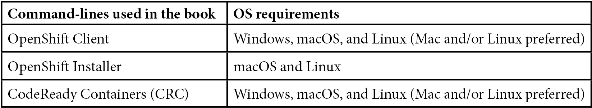

# 前言

我们生活在一个变化巨大且快速的世界中。在 IT 行业，**DevOps**、**云计算**、**数字化转型**、**容器**和**Kubernetes**等技术在过去几年中相继出现，并且极大地改变了我们开发、构建、测试和部署应用程序的方式。

在这一系列新技术中，只有少数几项成为了行业的*共识*，包括云计算、容器和 Kubernetes。在过去的几年里，本书的作者与许多客户一起工作，这些客户正在进行云计算和容器的采用之旅——*几乎所有客户都采用了某种 Kubernetes 发行版以及一个或多个云服务提供商*。他们中的大多数都在*体验这种采用带来的好处*，但同时也面临着*许多新挑战*，例如*维护标准环境、保持安全性和控制成本*。

这也是我们决定将本书的重点不仅仅放在 OpenShift 上的原因，OpenShift 是企业 Kubernetes 市场的领导者之一，同时我们也关注**多集群管理**。本书是*多年现场经验*的结晶，涉及架构设计、OpenShift 集群的部署和运营，我们将这些经验转化为文字、页面和章节！

本书将解答一些问题，例如，*使用 OpenShift 我有哪些不同的架构选择？我如何为我的情况设计合适的架构？与 OpenShift 相关的不同角色、他们的主要职责和面临的挑战是什么？* 我们还将讲解**OpenShift 的部署、故障排除、网络和安全**。**CI/CD**和**GitOps**也将在本书中通过一些*实践案例*进行讲解，帮助你了解它们如何帮助提高构建和部署过程的成熟度。最后，我们将介绍一些工具，如**高级集群管理**和**高级集群安全**，它们将帮助你*从中央视角管理和保护多个 OpenShift 集群*。

# 本书适用人群

本书旨在帮助所有与 Kubernetes 和 OpenShift 相关的专业人士。尤其适合软件工程师、基础设施运营人员、开发人员、站点可靠性工程师和安全工程师，但也应对企业架构师和 CXO 决策者具有一定的参考价值。你是否有兴趣了解更多关于 OpenShift 架构、部署、安全、GitOps、流水线、多集群管理和安全等内容？*如果是这样，这本书是为你精心编写的！*

# 本书内容

*第一章*，*混合云之旅与策略*，讨论了公共云采用的主要挑战，解释了什么是 OpenShift，以及它如何帮助应对这些挑战，从而在业务、文化和技术层面实现混合云的成功。

*第二章*，*架构概述与定义*，介绍了与 Kubernetes 和 OpenShift 架构相关的主要概念，帮助你决定最佳的路径。

*第三章*，*多租户考虑事项*，帮助你在 OpenShift 上处理多租户，为多个团队提供多个环境，并为每种情况提供适当的隔离。

*第四章*，*OpenShift 用户角色与技能集*，审视了在公司结构中可以做出的变化，帮助人们适应他们的角色和责任。

*第五章*，*OpenShift 部署*，是一个完整的动手指南，帮助你安装和使用 OpenShift。

*第六章*，*OpenShift 故障排除、性能与最佳实践*，展示了 OpenShift 使用中一些常见的问题。

*第七章*，*OpenShift 网络*，探讨了 OpenShift 的网络层，例如 Open vSwitch，以及南北向和东西向流量的概念，和 OpenShift 路由的不同 TLS 配置类型。

*第八章*，*OpenShift 安全性*，介绍了安全性的一些重要概念，例如容器安全性、身份验证与授权、身份提供者、**基于角色的访问控制**（**RBAC**）、证书、etcd 加密、容器与网络隔离、Red Hat 容器镜像目录以及漏洞保护等。

*第九章*，*OpenShift Pipelines – Tekton*，介绍了 OpenShift Pipelines，这是一个基于 Tekton 的 Kubernetes 原生 CI/CD 流水线工具。本章包含主要概念、安装过程，并通过实际操作实验室帮助你以实践方式学习。

*第十章*，*OpenShift GitOps – ArgoCD*，通过添加 GitOps 和 ArgoCD 扩展了部署能力。本章涵盖了 GitOps 概念、OpenShift GitOps 安装，以及一个动手实验室。

*第十一章*，*OpenShift 多集群 GitOps 与管理*，深入探讨了混合云/多云概念以及采用多个集群的主要问题。本章描述了什么是 Red Hat 高级集群管理、其安装过程，以及如何使用它从中央控制台管理多个 Kubernetes 集群。

*第十二章*，*OpenShift 多集群安全性*，扩展了 *第八章*，*OpenShift 安全性* 中的概念，重点关注多集群安全问题。本章介绍了 Red Hat 高级集群安全工具的功能，如风险管理、漏洞、违规、策略、合规性和配置管理，同时提供了安装、配置和使用说明。

*第十三章*，*OpenShift Plus —— 一个多集群企业级解决方案*，介绍了 Red Hat Quay 作为企业级镜像仓库选项，并讨论了 OpenShift Plus 作为一个适用于寻求在混合/多云环境中实现一致性和可移植性的企业的优秀选择的优势。

*第十四章*，*在混合云环境中构建云原生用例*，介绍了一个完整的实际示例。本章通过逐步动手指导，展示了如何使用本书中介绍的大部分功能（如 OpenShift 管道（Tekton）、OpenShift GitOps（ArgoCD）、高级集群管理、Quay 和高级集群安全）构建和部署应用程序。

*第十五章*，*接下来做什么*，提供了继续学习并通过培训和认证深入了解 OpenShift 的建议。

# 为了从本书中获得最大收益

在本书中，你将运行命令并使用命令行工具。我们建议你使用 Mac 或 Linux 工作站，例如 Fedora 或 Ubuntu——尽管一些 CLI 工具也有 Windows 版本，本书中使用的命令示例假设使用的是 Linux 工作站，Mac 也应该能够正常使用。

本书的某些部分需要一个 AWS 账户；不过，你应该可以轻松地将示例适应到其他云服务提供商。你可以在这里注册 AWS 的免费试用：[`aws.amazon.com/`](https://aws.amazon.com/)。



虽然我们尽力使本书尽可能具有教学性和包容性，但如果你已经具备基本的容器化和 Kubernetes 知识，你可能会从中获得更多——不过不需要高级知识。

# 下载彩色图像

我们还提供了一份包含本书中使用的截图/图表的彩色图像的 PDF 文件。你可以在这里下载：[`packt.link/C8KLC`](https://packt.link/C8KLC)。

# 下载示例代码文件

你可以从 GitHub 下载本书的示例代码文件，网址为：[`github.com/PacktPublishing/OpenShift-Multi-Cluster-Management-Handbook`](https://github.com/PacktPublishing/OpenShift-Multi-Cluster-Management-Handbook)。如果代码有更新，将会在现有的 GitHub 仓库中进行更新。

我们还提供了来自我们丰富书籍和视频目录的其他代码包，访问网址：[`github.com/PacktPublishing/`](https://github.com/PacktPublishing/)。快来看看吧！

# 使用的约定

本书中使用了多种文本约定。

`文本中的代码`：表示文本中的代码词语、数据库表名、文件夹名、文件名、文件扩展名、路径名、虚拟网址、用户输入和 Twitter 用户名。例如：“在这一步，我们将使用`quarkus-build`管道，您可以在`chapter14/Build/Pipeline/quarkus-build.yaml`文件中找到它。”

代码块设置如下：

```
SELECT
     COUNT(DISTINCT Column1) AS Count_column1,
     System.TIMESTAMP() AS Time
FROM Input TIMESTAMP BY TIME
GROUP BY
     TumblingWindow(second, 2)
```

代码输出或命令行输入如下设置：

```
npm install applicationinsights
```

**粗体**：表示一个新术语、重要词语，或屏幕上出现的词语。例如，菜单或对话框中的词语通常以这种方式出现在文本中。举个例子：“在创建 AWS 凭证后，访问**基础设施** | **集群**功能并点击**创建集群**按钮。”

提示或重要说明。

如此显示。

# 与我们取得联系。

我们始终欢迎读者的反馈。

`customercare@packtpub.com`。

**勘误表**：虽然我们已经尽力确保内容的准确性，但难免会出现错误。如果您在本书中发现错误，请向我们报告。请访问 [www.packtpub.com/support/errata](http://www.packtpub.com/support/errata)，选择您的书籍，点击勘误表提交表单链接并输入详细信息。

`copyright@packt.com`，并附上材料链接。

**如果您有兴趣成为作者**：如果您在某个领域有专业知识，并且有兴趣撰写或参与书籍创作，请访问 [authors.packtpub.com](http://authors.packtpub.com)。

# 分享您的想法。

阅读完*OpenShift 多集群管理手册*后，我们很想听听您的想法！请 点击这里直接访问亚马逊评论页面并分享您的反馈。

您的评价对我们和技术社区非常重要，它将帮助我们确保提供优质内容。

# 下载本书的免费 PDF 副本。

感谢购买本书！

您喜欢随时随地阅读，但无法携带纸质书籍吗？

您的电子书购买是否与您选择的设备不兼容？

别担心，现在每本 Packt 书籍，您都会免费获得该书的无 DRM 版 PDF。

可以在任何地方、任何设备上阅读。直接从您最喜欢的技术书籍中搜索、复制并粘贴代码到您的应用程序中。

特权不仅仅到此为止，您还可以每天在邮箱中获取独家折扣、时事通讯和极好的免费内容。

按照以下简单步骤获取福利：

1.  扫描二维码或访问以下链接。


[`packt.link/free-ebook/9781803235288`](https://packt.link/free-ebook/9781803235288)

1.  提交您的购买证明。

1.  就是这样！我们会直接把免费的 PDF 和其他福利发送到您的电子邮件。

# 第一部分 – 为 Red Hat OpenShift 设计架构。

本部分介绍了混合云之旅及其困境。深入了解在部署一个或多个 OpenShift 集群之前应该完成的最重要的架构概念和定义。

本书的这一部分包括以下章节：

+   *第一章*，*混合云之旅与战略*

+   *第二章*，*架构概述与定义*

+   *第三章*，*多租户考虑因素*

+   *第四章*，*OpenShift 角色与技能*
