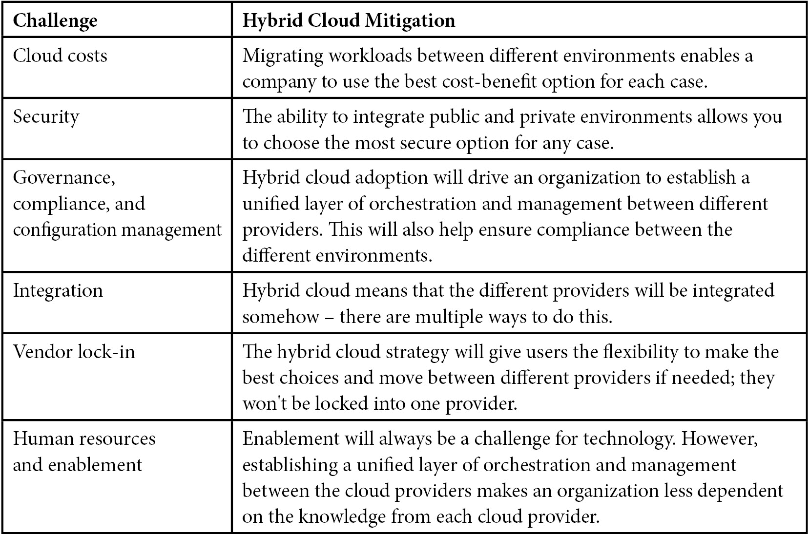
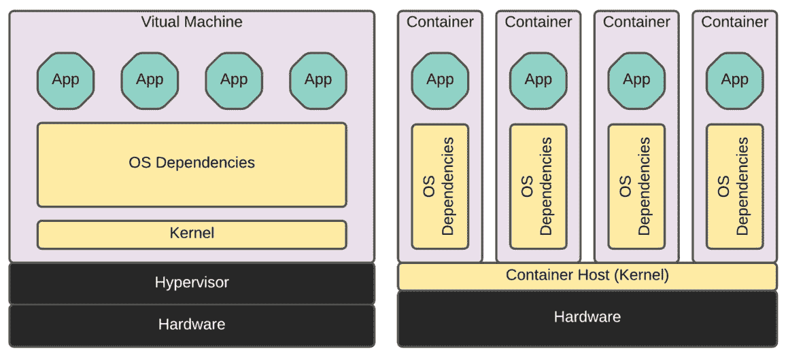
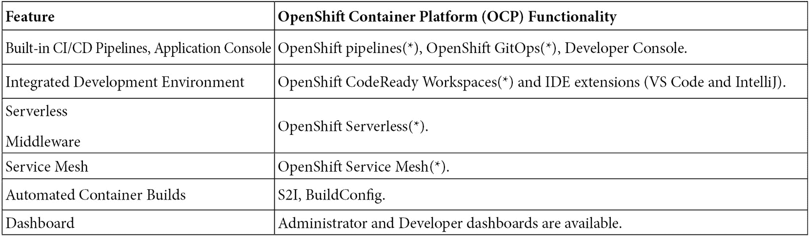
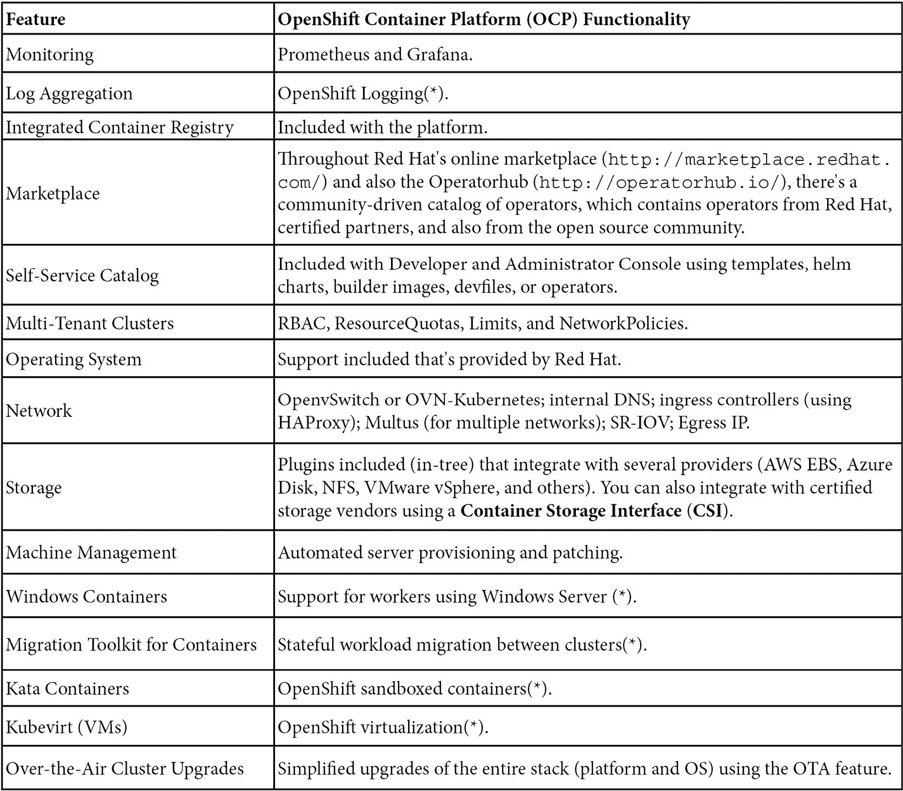
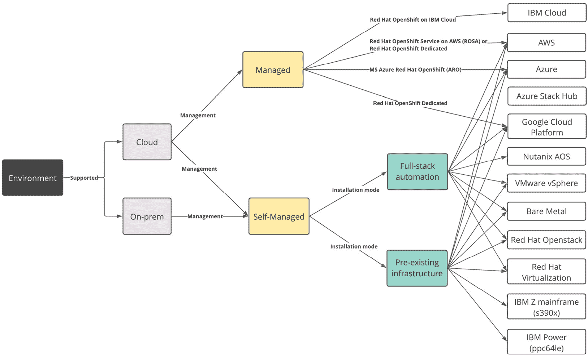
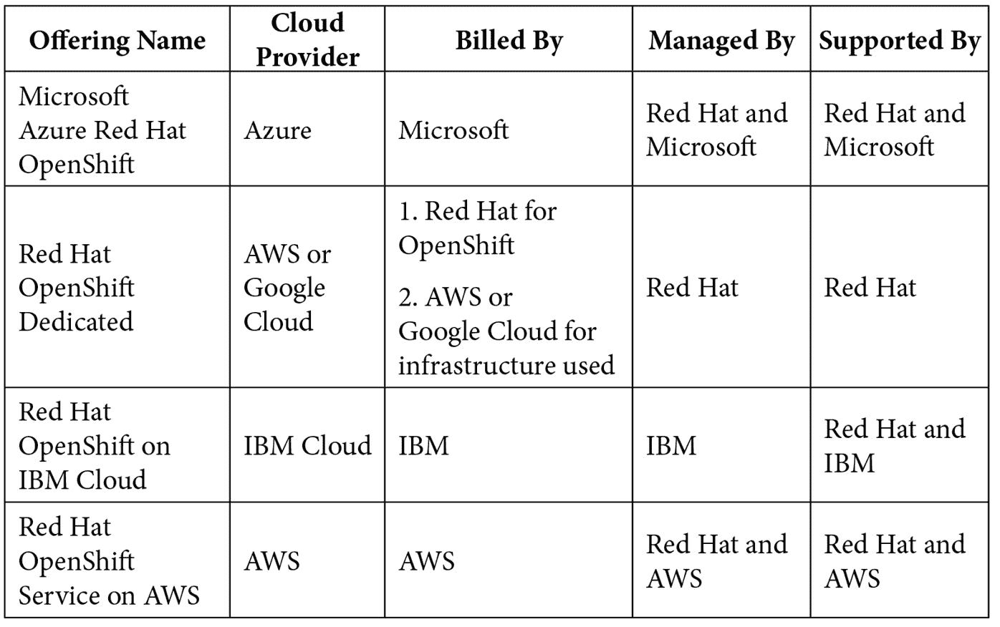
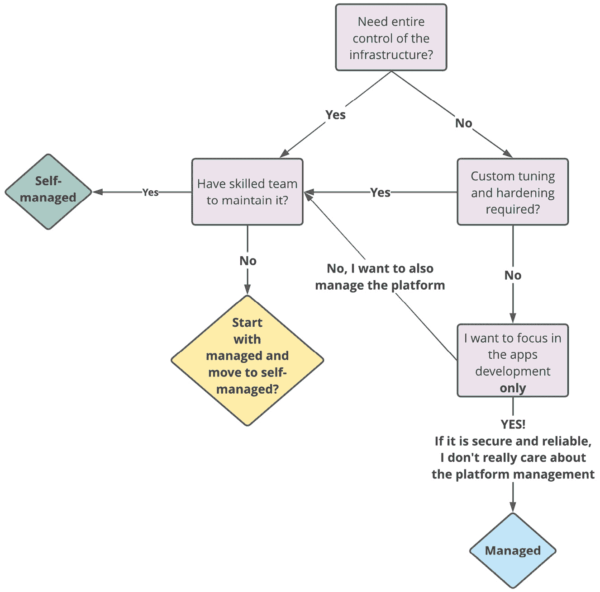

# 第一章：1

# 混合云之路与策略

你想在多个环境中学习和操作 OpenShift 吗？如果你正在阅读本书，我们假设你的答案是肯定的！但是，在深入技术细节之前，我们想先给你提个建议：任何房屋建设都从地基开始，对吧？在本书中，我们的方法也是如此。我们将从为你打下基础开始，帮助你理解并构建一个更强大的知识库——你将培养批判性思维，并能够为你的使用场景做出最佳决策。

这就是为什么我们决定从不直接讨论 OpenShift 本身开始，而是先揭示它所运作的最受欢迎（也是最重要！）的背景：**混合云基础设施**。因此，在本章中，你将被引导了解混合云的历程、挑战、困境，以及为什么许多组织在这方面遇到困难。从一开始就了解这些挑战是**混合云采用**的决定性**成功因素**。

如今，转型 IT 业务以实现敏捷、可扩展，同时保持稳定，已经成为必需，但这并非一件简单的事；相反，它是一个*从一颗星到另一颗星*的旅程，跨越我们目前所处的广袤 IT 宇宙。然而，为什么我们需要这些变化呢？为什么市场如此迅速地大规模采用云计算？我们将很快讨论这个问题！

*这是一个* *变化的世界！*

我们正生活在一个变化迅速的时代！十年前，大多数现如今的大型科技公司还不存在，或者只是一些小型初创企业；许多今天存在的技术当时也只是大学研究小组中知道的领域，例如 3D 打印、人工智能和机器学习、5G、边缘计算等——而且未来还有更多技术会出现！像前面提到的这些技术正在变得越来越普及，并将催生许多今天尚不存在的需求、新的职位，以及更多的变化。

在这个快速变化的世界中，一些新的需求变得尤为重要。大多数公司被迫做出改变，以便比以往更快地发布新软件和新版本，迅速扩展资源，并拥有全球覆盖和响应迅速的应用程序。

正是在这个背景下，公共云服务提供商取得了巨大的成功。然而，许多在云计算上投入巨资的组织正在面临一些挑战。在 *IDG* 于 2020 年进行的一项研究中，来自不同产业和地区的大型公司中，40% 的受访者表示，控制云成本是充分利用云计算时面临的最大挑战。这项研究还显示，数据隐私和安全是主要障碍。在本章中，我们将讨论这些挑战的一些方面。

在本章中，我们将涵盖以下主题：

+   公共云的主要挑战

+   混合云策略如何帮助缓解这些挑战

+   容器、Kubernetes 和 OpenShift 如何帮助实现混合云

+   OpenShift 选项

+   OpenShift 安装类型

+   支持混合云采用的附加工具

# 公共云的主要挑战

从小型企业到大型科技公司，它们在使用公共云服务时，都面临一些共同的挑战。以下是一些主要挑战：

+   **控制云成本**：估算和管理在公共云服务商上运行的应用程序成本并非易事——云服务商的计费模式是多面的，有数百种不同的选项和组合，每个选项都有定价因素。找到一个应用程序的最佳成本效益可能需要相当长的时间。更复杂的是，云成本通常是动态和灵活的——根据类型、合同期限、计算资源类型等因素，这些成本可能会时常发生显著变化。

+   **安全性**：根据*IDG*的研究，数据隐私和安全性是公共云面临的主要问题之一——几乎 40%的人将其列为最大的挑战。也就是说，确保一个由多个不同供应商组成的 IT 环境比以前的时代要困难得多，那时 IT 部门通常只需要管理几个本地环境。

+   **治理、合规性和配置管理**：多个供应商意味着不同的产品和标准，可能有不同的团队在处理每个供应商的产品，因此会出现异构的环境。

+   **集成**：对于那些拥有遗留服务并希望与其托管在云中的应用程序集成的组织来说，通常会面临如何进行这些集成的最佳方式的困境。尽管云服务提供商几乎没有限制，但当你将应用程序集成到遗留基础设施时，可能会创建一个**有害**的依赖关系，这将限制其可扩展性。然而，主要对于大型企业来说，这些集成是不可避免的，那么我们如何防止依赖性问题（或至少将其最小化）呢？

+   **供应商锁定**：采用云服务商时，一个常见的担忧通常与被单一供应商锁定以及相关的业务风险有关。我会说，在从云服务商那里获得最优价格与被锁定在其服务之间，存在一条微妙的界限。如果云服务商决定在下一次合同谈判中提高价格，业务会面临什么样的影响？这是你的企业能够承担的风险吗？我们如何减轻这种风险？在这里，*你得到的就是你支付的*这个说法很合适！

+   **人力资源和能力建设**：在 IT 领域招聘和留住人才一直是一个难题；云技术也不例外。云工程师、架构师、SRE、云原生应用开发人员——这些职位每天都有空缺，而且大多数公司都在为填补这些职位而努力。招聘、培训和维护一支有技能的团队来开发和运营云中的应用程序是一项真正的挑战。

参考资料

你可以查看完整的*IDG*研究报告，地址是 [`www.idg.com/tools-for-marketers/2020-cloud-computing-study/`](https://www.idg.com/tools-for-marketers/2020-cloud-computing-study/) [访问日期：2021 年 8 月 30 日]。

# 公有云的好处

到目前为止，我们已经看到了一些复杂的挑战。所以，你可能会想，*你不喜欢云服务提供商，想说服我避免使用* *它们，对吧？*

不，当然不是！我确信没有云服务提供商的出现，我们每天使用（并且喜爱！）的几家公司根本就不存在！那么让我们来看看其中的优点吧：

+   **可扩展性**：云服务提供商可以提供几乎无限且按需的计算资源。

+   **更低的资本支出（CAPEX）**：你无需购买任何硬件和设备就能开始操作——只需点击几下就可以完成。

+   **弹性和全球覆盖**：即使是小公司，也可以在不同的可用区和区域之间分发服务。

+   **现代技术**：公有云服务提供商总是在寻找新的现代化产品，这帮助企业始终处于技术的最前沿。

# 混合云是解决方案吗？

正如我们已经讨论过的，公有云虽然能解决一些挑战，但也带来了其他问题。在这种背景下，混合云应运而生：它旨在缓解一些挑战，并从每个提供商、从本地、私有或云服务提供商中取其精华。*HashiCorp 云战略状态调查*于 2021 年进行，涵盖了 3200 多名技术从业者，结果发现多云已经成为现实。76%的受访者表示他们正在使用多个云服务提供商，预计到 2023 年，这一比例将升至 86%。

参考资料

你可以查看完整的*HashiCorp*研究报告，地址是 [`www.hashicorp.com/state-of-the-cloud`](https://www.hashicorp.com/state-of-the-cloud) [访问日期：2021 年 8 月 31 日]。

那么，混合云有哪些特性能够帮助缓解公有云采用中的挑战呢？以下是其中的一些：

+   可以将不同供应商的顶级云服务进行结合，使公司能够为每个工作负载选择最佳的选项。

+   根据实际情况，在不同的公有云和私有云环境之间迁移工作负载的能力。

+   能够对所有提供商的所有环境进行单一、统一的编排和管理。

以下表格列出了部分挑战和混合云的缓解措施：

# 容器和 Kubernetes – 部分答案！

容器已成功成为推动应用程序与基础设施之间更好灵活性的最重要工具之一。容器可以将应用程序的依赖项封装在容器镜像中，从而帮助应用程序在不同环境之间轻松迁移。因此，容器是启用混合云的重要工具，尽管它们有其他许多应用。

下图展示了容器与传统虚拟机在这方面的不同：

Figure 1.1 – 容器提供灵活性

尽管容器有许多优点，但在没有编排层的情况下管理由数百个或数千个容器组成的大型环境几乎是不可能的。Kubernetes 成为常态，它是一个出色的编排工具。然而，它并不容易使用。根据 *CNCF 2020 年调查*，41% 的受访者认为复杂性是容器采用的最大障碍。当您决定选择原生 Kubernetes 实现时，以下内容（在大量选项中）需要由您来定义和管理：

+   安装和操作系统设置，包括配置管理

+   升级

+   安全访问和身份

+   监控和警报

+   存储和持久化

+   出口、入口和网络相关选项

+   镜像扫描和安全补丁

+   聚合日志工具

参考资料

您可以在这里查看完整的 *CNCF 调查*：[`www.cncf.io/blog/2020/11/17/cloud-native-survey-2020-containers-in-production-jump-300-from-our-first-survey/`](https://www.cncf.io/blog/2020/11/17/cloud-native-survey-2020-containers-in-production-jump-300-from-our-first-survey/) [访问日期：2021 年 9 月 1 日]。

# OpenShift - 一个完整的选项

OpenShift 是企业客户中最受欢迎的基于 Kubernetes 的平台之一。它于 2011 年首次发布，甚至在 Kubernetes 创建之前。可是，在 2015 年，随着 OpenShift 版本 3 的发布，Red Hat 决定将 Kubernetes 作为其容器编排层。从那时起，他们与 Kubernetes 社区积极合作——Red Hat 和 Google 是 Kubernetes 的主要贡献者。因此，OpenShift 成为基于 Kubernetes 构建的最成熟和完整的解决方案之一并不奇怪。

以下表格总结了 Red Hat **OpenShift 容器平台** (**OCP**)（或易于插拔）随附的部分功能：

*(*) 需要在* *第二天* 安装

这些功能对任何拥有有效 Red Hat OpenShift 订阅的客户均可用。但是，如果您没有 Red Hat 订阅，仍有一些替代方案（用于学习目的）：

+   你可以使用红帽提供的一些试用选项——查看详情 [`www.redhat.com/en/technologies/cloud-computing/openshift/try-it`](https://www.redhat.com/en/technologies/cloud-computing/openshift/try-it)。

+   使用 okd ([`okd.io/`](http://okd.io/))，它是由红帽支持的 OpenShift 社区发行版。

+   在桌面上的虚拟机中使用 Red Hat CodeReady 容器（需要一个 Red Hat 门户的账户）。更多信息请访问 [`developers.redhat.com/products/codeready-containers/overview`](https://developers.redhat.com/products/codeready-containers/overview)。

本书将详细展示这些出色的功能，并结合实际示例。

参考

关于 Kubernetes 项目贡献的最新统计数据，按公司分组，可以在 [`k8s.devstats.cncf.io/d/9/companies-table`](https://k8s.devstats.cncf.io/d/9/companies-table) 找到。

## OpenShift 产品 – 多种选择满足各种需求

OpenShift 的一个有趣特点是支持的广泛平台。使用 OpenShift 4.11 版本（本书撰写时的版本），你可以选择以下不同的组合：

图 1.2 – OpenShift 产品

本节中，我们将逐一介绍这些选项。

### OpenShift 托管云服务

以前，当我们谈论使用某种技术时，我们也会考虑如何部署和管理它。如今，这种情况不再总是成立——几乎所有东西现在都可以以软件即服务（SaaS）的形式找到，你可以快速轻松地开始使用，而不必担心部署和管理。

对 OpenShift 同样适用：多个托管云服务使组织能够专注于应用程序的开发和业务，而红帽及云服务提供商则管理其余部分。

以下表格显示了本书写作时现有的托管产品（请查看红帽网站获取最新选项）：

重要提示

请注意，红帽管理的是完整技术栈，而不仅仅是 Kubernetes 控制平面。红帽为整个集群提供管理和版本维护，包括主节点、基础设施和工作节点，当然也不仅限于此：它还支持 CI/CD、日志记录、监控等。

市场上还有其他托管 Kubernetes 选项。虽然这本书的重点不在于此，但请记住，一些提供商并不管理和支持整个技术栈——例如，仅管理控制平面。在考虑 Kubernetes 托管解决方案时，请查看它是完全托管的还是仅管理部分技术栈。

### 托管还是自管理——哪个更好？

答案是：这取决于！你需要考虑几个因素，才能找出最适合你情况的方案，但一般来说，托管解决方案*不是*那些需要控制服务器和基础设施的组织的最佳选择。对于那些更专注于应用开发且不关心平台的组织，只要平台安全可靠，那么托管解决方案可能是一个不错的选择。

托管解决方案对于那些想要接触平台、评估它，并了解它是否符合需求的组织也可能有帮助，但这些组织可能还没有足够的技术人员来维护它。

本书的大部分内容是以自托管集群为基础写的。然而，除了专门讲解平台部署和故障排除的章节，其他内容基本适用于任何类型的 OpenShift 集群。

以下图示展示了一个工作流，旨在帮助你决定选择哪种策略：

图 1.3 – 托管或自托管决策工作流

## OpenShift 安装方式

你可以使用以下三种安装方式，在任何支持的提供商环境中部署 OpenShift：

+   **全栈自动化**（*安装程序提供的基础设施*）：在此模式下，安装程序将自动启动所有所需的基础设施——安装程序将与底层虚拟化或云服务提供商进行集成，部署集群所需的所有机器。这是一个有主张的完全自动化解决方案，使部署过程变得更容易。

+   **预先存在的基础设施**（*用户提供的基础设施*）：在这种安装方式下，机器是通过遵循一些标准镜像和流程手动配置的，且配置在经过测试的虚拟化或云服务提供商之上。

+   **供应商无关**（也称为*裸金属安装方式*）：只要是 Red Hat Enterprise Linux (*) 支持的地方，OpenShift 都受支持，尽管这并不意味着安装程序和平台会在每种与 Red Hat Enterprise Linux 支持的基础设施层组合上进行测试（**）。在这种情况下，你可以使用供应商无关的安装方式，这是一种手动安装过程，安装程序和平台与虚拟化或云服务提供商之间没有集成。

(*) 你可以在[`access.redhat.com/certified-hypervisors`](https://access.redhat.com/certified-hypervisors)找到支持的 Red Hat Enterprise Linux 虚拟化程序列表。

（**）请参阅此链接，了解与 OpenShift 集成的经过测试的供应商和集成列表：[`access.redhat.com/articles/4128421`](https://access.redhat.com/articles/4128421)。

## OpenShift 多集群工具 – 超越预期

在支持混合云或多云战略时，其他优秀工具提供统一的管理、安全和编排层，覆盖所有环境和所有提供商。我们将本书的最后部分留给这些工具的深入讲解，但你需要从一开始就接触它们，才能理解它们在混合云/多云中的作用。

### Red Hat 高级集群管理 for Kubernetes – 统一管理

正如我们之前提到的，单一统一的管理层对于支持混合云/多云战略至关重要。Red Hat 高级集群管理使我们能够管理生命周期、使用策略确保合规性，并在多个 Kubernetes 集群上部署应用。以下是它的一些主要功能：

+   **统一管理**：在不同的云提供商之上创建、更新和删除 Kubernetes 集群。你还可以访问、查找并修改不同集群中的 Kubernetes 资源。

+   **治理、风险和合规性**：使用策略确保多个集群的合规性。快速查找策略违规并相应修复。

+   **应用生命周期管理**：一次性在多个集群中部署应用程序。通过将高级集群管理与 Red Hat Ansible 自动化平台集成，部署复杂应用，配置网络、负载均衡器和其他外部依赖。

+   **多集群可观测性**：通过现成的仪表盘和度量标准，从一个单一的视角检查多个集群的健康状态。

本书最后一部分我们将通过实际示例深入了解 Red Hat 高级集群管理。

### Red Hat 高级集群安全 for Kubernetes – 在任何地方都能保障应用安全

对 Kubernetes 用户来说，安全性变得越来越重要。当你有多个分布在不同提供商之间的 Kubernetes 集群时，确保安全并及时了解当前的漏洞是一项真正的挑战。Red Hat 高级集群安全旨在帮助解决这一问题——通过它，你可以轻松地*扫描容器镜像以查找已知漏洞，使用行业标准如 NIST、PCI 等审计工作负载和集群，分析网络流量，并相应地创建策略等多项强大功能*。你可以将这些功能应用于多个不同的集群，帮助你确保所有环境的安全，无论它们位于何处。

本书最后一部分我们将通过实际示例深入了解 Red Hat 高级集群安全。

### Red Hat Quay – 在中央仓库中存储和管理容器镜像

中央容器镜像仓库通常不是必需的工具。然而，在没有它的情况下，在多个集群上部署应用程序会使构建和部署工作变得有些挑战性。Red Hat Quay 是一个容器镜像仓库，它不仅提供了镜像仓库的常规功能（存储你的容器镜像），还提供镜像漏洞扫描、时间机器、复制、垃圾回收、自动构建、身份验证、授权等功能。

我们将在本书的最后部分学习如何使用 Red Hat Quay。

### OpenShift Plus – 完整套餐

Red Hat OpenShift、Advanced Cluster Management、Advanced Cluster Security 和 Quay 是不同的产品。然而，通过 OpenShift Plus 套餐，你可以只需一份订阅即可拥有所有这些产品，如果你计划采用混合云或多云 Kubernetes 策略，这可能是最好的选择。

我们将在本书的最后部分通过实际示例更详细地介绍 OpenShift Plus。

# 摘要

本章我们探讨了公共云使用的主要挑战，以及混合云如何帮助缓解其中一些挑战。你现在理解了容器、Kubernetes 和 OpenShift 如何帮助你实施成功的混合云策略。最后，我们学习了不同类型的 OpenShift 产品和支持混合云采用的附加工具。

在下一章中，你将学习 OpenShift 集群的架构方面内容。

# 进一步阅读

如果你想了解本章中涵盖的概念，可以查看以下参考资料：

+   以下是本章中提到的与混合云和容器采用相关的公开研究和调查：

    +   *IDG 2020 云计算研究报告:* [`www.idg.com/tools-for-marketers/2020-cloud-computing-study/`](https://www.idg.com/tools-for-marketers/2020-cloud-computing-study/)

    +   *HashiCorp 云策略* *调查报告:* [`www.hashicorp.com/state-of-the-cloud`](https://www.hashicorp.com/state-of-the-cloud)

    +   *云原生调查 2020：容器在生产环境中的使用比我们的第一次* *调查增加了 300%* : [`www.cncf.io/blog/2020/11/17/cloud-native-survey-2020-containers-in-production-jump-300-from-our-first-survey/`](https://www.cncf.io/blog/2020/11/17/cloud-native-survey-2020-containers-in-production-jump-300-from-our-first-survey/)

+   *Red Hat OpenShift 登陆* *页面:* [`www.redhat.com/en/technologies/cloud-computing/openshift`](https://www.redhat.com/en/technologies/cloud-computing/openshift)

+   *Red Hat 托管云服务登陆* *页面:* [`www.redhat.com/en/technologies/cloud-computing/openshift/managed-cloud-services`](https://www.redhat.com/en/technologies/cloud-computing/openshift/managed-cloud-services)

+   *红帽高级集群安全性 Kubernetes 登录* *页面:* [`www.redhat.com/en/technologies/cloud-computing/openshift/advanced-cluster-security-kubernetes`](https://www.redhat.com/en/technologies/cloud-computing/openshift/advanced-cluster-security-kubernetes)

+   *红帽高级集群管理 Kubernetes 登录* *页面:* [`www.redhat.com/en/technologies/management/advanced-cluster-management`](https://www.redhat.com/en/technologies/management/advanced-cluster-management)

+   *红帽 Quay 登录* *页面:* [`www.redhat.com/en/technologies/cloud-computing/quay`](https://www.redhat.com/en/technologies/cloud-computing/quay)

+   *红帽 OpenShift Platform Plus 登录* *页面:* [`www.redhat.com/en/technologies/cloud-computing/openshift/platform-plus`](https://www.redhat.com/en/technologies/cloud-computing/openshift/platform-plus)

+   *OpenShift 容器平台 4.x 测试集成与支持性* *矩阵:* [`access.redhat.com/articles/4128421`](https://access.redhat.com/articles/4128421)

+   *OpenShift 容器平台安装概览（来自官方* *文档）：* [`docs.openshift.com/container-platform/latest/installing/index.html`](https://docs.openshift.com/container-platform/latest/installing/index.html)

+   *不同平台的支持安装方法（来自官方* *文档）：* [`docs.openshift.com/container-platform/latest/installing/installing-preparing.html#supported-installation-methods-for-different-platforms`](https://docs.openshift.com/container-platform/latest/installing/installing-preparing.html#supported-installation-methods-for-different-platforms)

+   *Kubernetes 统计* *页面:* [`k8s.devstats.cncf.io/`](https://k8s.devstats.cncf.io/)

| 功能 | OpenShift 容器平台 (OCP) 功能 |
| --- | --- |
| 内置 CI/CD 管道，应用控制台 | OpenShift 管道(*)，OpenShift GitOps(*)，开发者控制台。 |
| 集成开发环境 | OpenShift CodeReady 工作区(*) 和 IDE 扩展（VS Code 和 IntelliJ）。 |
| 无服务器中间件 | OpenShift 无服务器(*)。 |
| 服务网格 | OpenShift 服务网格(*)。 |
| 自动化容器构建 | S2I，BuildConfig。 |
| 仪表盘 | 提供管理员和开发者仪表盘。 |
