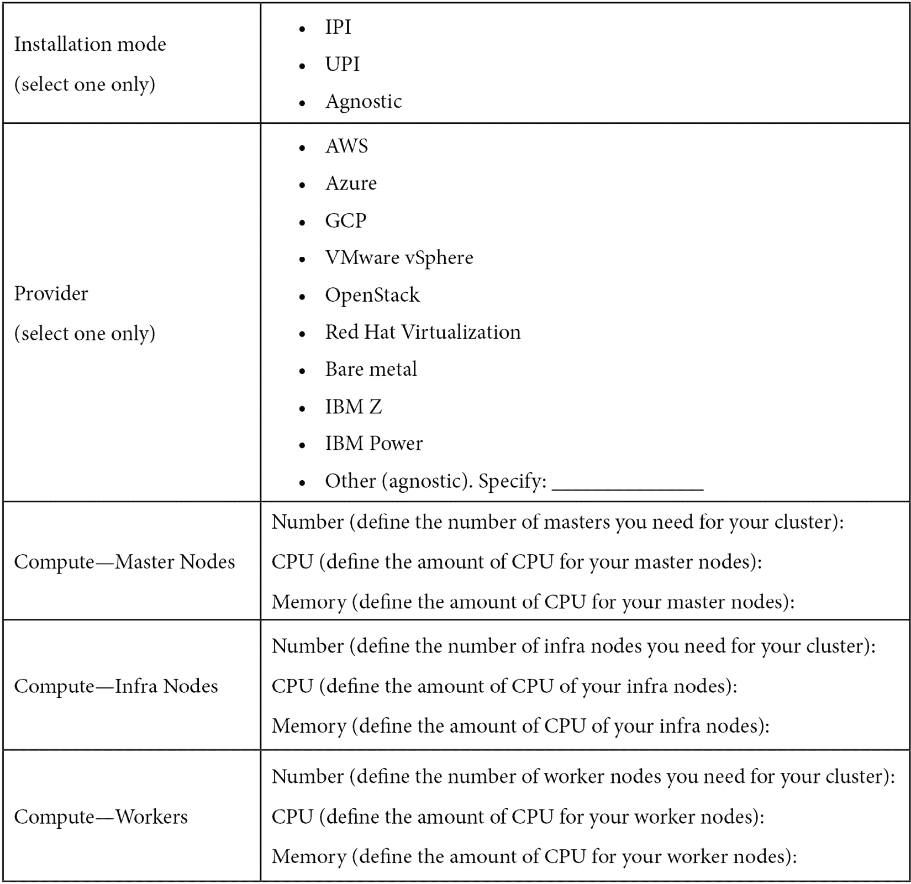

# 2

# 架构概述与定义

Kubernetes 是一项了不起的技术；然而，正如我们在上一章所看到的，它并不是一项简单的技术。我认为 Kubernetes 不仅仅是容器编排，除此之外，它还是一个具有标准接口的平台，用于将容器与更广泛的基础设施集成，包括存储、网络和虚拟化技术。因此，你必须考虑到 OpenShift 自管理集群中的所有先决条件和相关方面。

本章将介绍与 Kubernetes 和 OpenShift 架构相关的主要概念。这里的主要目的是让你 *在行动之前思考* 并做出重要决策，避免后续的返工。

本章将涵盖以下主要内容：

+   理解基础概念

+   OpenShift 架构概念与最佳实践

+   基础设施/云提供商

+   网络考虑事项

+   其他考虑事项

+   OpenShift 架构检查清单

开始吧！

# 技术要求

由于本章涉及的是 OpenShift 的架构部分，因此在本章中，你并不需要访问任何特定的硬件或软件，但这在后面的章节中会有所要求。不过，为了能够从本章获得最佳结果，建议你具备一定的 OpenShift 和 Kubernetes 基础知识。

## 先决条件

本章面向那些已经具备一定 Kubernetes 或 OpenShift 使用基础知识的 **信息技术** (**IT**) 架构师。因此，本章不涉及诸如 Pod、Service 或 Persistent Volume 等基础概念的介绍。如果你还不了解这些基础概念，别担心！我们已经在本书最后一章准备了推荐的培训和参考资料。我们建议你在继续本章内容之前，先学习 Kubernetes 基础和 Kube by Example。

# 理解基础概念

让我们从理解 Kubernetes 和 OpenShift 组件与服务器的主要概念开始。首先，任何 OpenShift 集群都由两种类型的服务器组成：**主节点**和 **工作节点**。

## 主节点

该服务器包含 Kubernetes 集群的 **控制平面**。OpenShift 上的主服务器运行在 **Red Hat Enterprise Linux CoreOS** (**RHCOS**) 操作系统上，并由多个主要组件组成，例如以下内容：

+   `kube-apiserver`): 负责暴露所有的 Kubernetes API。所有在 Kubernetes 集群上执行的操作都是通过 API 调用进行的——无论是使用 **命令行接口** (**CLI**) 还是 **用户界面** (**UI**)，都会使用 API 调用。

+   `etcd`): 数据库存储所有集群数据。`etcd` 是一个高度可用的分布式键值数据库。有关 `etcd` 的详细信息，请参考其文档：[`etcd.io/docs/latest/`](https://etcd.io/docs/latest/)。

+   `kube-scheduler`): `kube-scheduler` 负责为 Pod 分配一个节点来运行。它使用复杂的算法，考虑大量因素来决定哪个节点最适合承载 Pod，比如可用的计算资源与所需节点选择器、亲和性和反亲和性规则等。

+   `kube-controller-manager`): 控制器是一个无尽的循环，负责确保某个对象始终处于期望的状态。例如，可以将其比作智能家居自动化设备：控制器负责协调设备，确保环境始终处于预定的状态——例如，定期开关空调以保持温度尽可能接近期望值。Kubernetes 控制器具有相同的功能——它们负责监控对象并根据情况做出响应，以保持其处于预期状态。Kubernetes 集群中使用了许多控制器，如副本控制器、端点控制器、命名空间控制器和服务帐户控制器。有关控制器的更多信息，请查看此页面：[`kubernetes.io/docs/concepts/architecture/controller/`](https://kubernetes.io/docs/concepts/architecture/controller/)

这些是运行在主节点上的 Kubernetes 控制平面组件；然而，OpenShift 还提供了一些额外的服务来扩展 Kubernetes 的功能，如下所述：

+   `openshift-apiserver`): 该服务负责验证和配置 OpenShift 独有资源的数据，如路由、模板和项目。

+   `openshift-controler-manager`): 该服务确保 OpenShift 独有资源达到预期状态。

+   `openshift-oauth-apiserver`): 负责验证并配置数据，用以认证用户、组和 OpenShift 的令牌。

下图展示了 Kubernetes 和 OpenShift 的主要控制平面组件：

图 2.1 – OpenShift 控制平面组件

这些组件可以在多个命名空间中找到，您可以在下表中看到：

什么是 Operators？

如果你从未听说过 Operators，你可能会想：*Operators 究竟是什么？* Operators 其实就是一种标准方法，用于打包、部署和维护 Kubernetes 应用和对象。它们通过 **自定义资源定义** (**CRDs**) 来扩展 Kubernetes API 功能，并且为应用的生命周期提供一些标准：部署、修补、保持期望状态，甚至自动化操作（如自动扩缩容、调优、故障检测等）。查看更多信息，请访问这个链接：[`kubernetes.io/docs/concepts/extend-kubernetes/operator/`](https://kubernetes.io/docs/concepts/extend-kubernetes/operator/)。

## 引导节点

引导节点是一个临时服务器——仅在集群部署期间使用——它负责将集群的组件注入到控制平面中。当引导过程成功完成时，安装程序会将其移除。由于它是一个只在部署过程中存在的临时服务器，通常不会被视为 OpenShift 架构的一部分。

## 工作节点

工作节点是承载工作负载的服务器。在 OpenShift 上，工作节点可以运行在 RHCOS 或 **Red Hat 企业 Linux**（**RHEL**）上。虽然 OpenShift 支持在 RHEL 上运行工作节点，但一般推荐使用 RHCOS，原因如下：

+   **不可变**：RHCOS 是一个精简的操作系统，旨在通过 OpenShift 容器平台远程管理。这增强了一致性，并使升级过程变得更加简单和安全，因为 OpenShift 始终能够了解并管理服务器的实际状态和期望状态。

+   `rpm-ostree`：RHCOS 使用 `rpm-ostree` 系统，它支持事务性升级并为基础设施增加一致性。有关更多信息，请查看此链接：[`coreos.github.io/rpm-ostree/`](https://coreos.github.io/rpm-ostree/)。

+   `podman` 和 `skopeo`。在正常运行过程中，通常不鼓励直接访问和在工作节点上运行命令（因为它们由 OpenShift 平台本身管理）；然而，这些工具在故障排除时非常有用——正如我们将在本书的 *第六章*《OpenShift 故障排除、性能和最佳实践》中详细讨论的那样。

+   `systemd`，它确保了你使用标准 RHEL 操作系统时同样的安全性和质量。

+   使用 `rpm-ostree` 系统进行原子升级，使得升级和回滚（如有需要）变得更加安全和简便。

在下图中，您可以查看这些对象和概念在 OpenShift 工作节点中的使用方式：

图 2.2 – RHCOS 工作节点

### 工作节点类型

有一些常见类型的工作节点，最常见的包括以下几种：

+   **应用程序工作节点**：负责托管工作负载——即应用程序容器运行的地方。

+   **基础设施工作节点**：这种类型的服务器通常用于托管平台基础设施工具，如入口（路由器）、内部注册表、监控堆栈（Prometheus 和 Grafana），以及日志工具（Elasticsearch 和 Kibana）。

+   **存储工作节点**：容器存储解决方案，如**Red Hat OpenShift 数据基础设施**，通常需要一些专用的工作节点来托管其 Pods。在这种情况下，最佳实践是为它们使用专用的节点组。

在下一节中，我们将看到如何使用不同类型的工作节点来设计一个高度可用且有弹性的 OpenShift 集群。

## 高可用集群

OpenShift 集群对企业来说变得至关重要并不罕见——有时它们从小规模开始，但很快就变得庞大。因此，你在设计 OpenShift 集群架构时，应从第一天开始考虑**非功能性需求**（**NFRs**），如**高可用性**（**HA**）。一个高可用集群包含以下方面：

+   `etcd` 使用了一种名为**Raft 协议**的分布式共识算法，它要求至少有*三个节点才能保持高可用性*。本书的重点不在于解释 Raft 协议，但如果你想更好地理解它，可以参考以下链接：

    +   Raft 描述：[`raft.github.io/`](https://raft.github.io/)

    +   说明示例：[`thesecretlivesofdata.com/raft/`](http://thesecretlivesofdata.com/raft/)

+   **基础设施工作节点**：至少需要两个节点才能确保入口的高可用性。我们将在本章稍后讨论你应该考虑的其他基础设施组件，如监控和日志记录。

+   **应用工作节点**：至少需要两个节点才能被视为高可用；然而，你可以根据预期的工作负载需要，增加足够数量的节点。在本章中，我们将探讨一些容量规划指导，以帮助你确定所需的工作节点数量，如果你已经有了预估的容量需求。

以下图展示了高可用集群架构的样子：

图 2.3 – OpenShift 高可用集群

现在我们已经掌握了 Kubernetes 和 OpenShift 的基础概念，让我们进一步深入，了解 OpenShift 的架构及一些最佳实践。

# OpenShift 架构概念和最佳实践

本节将讨论与 OpenShift 架构设计相关的主要概念以及一些你应考虑的最佳实践。一般来说，当我们为 OpenShift 集群设计架构时，以下表格中的方面需要相应地定义：

如何解决这些方面（如部署、配置等）的详细内容，将从*第五章**,* *OpenShift 部署*开始讨论。另一个关键点是，我们仍然专注于单一的 OpenShift 集群——这里的主要目标是帮助你定义一个最适合你情况的标准集群架构。在下一章中，我们将探讨在处理多个环境、集群和提供商时需要考虑的方面。

在接下来的章节中，我们将逐一介绍这些要点，重点讲解你需要涵盖的最重要项目。

## 安装模式

你在上一章中已经了解了 OpenShift 的三种安装模式，具体如下：

+   **安装程序提供的** **基础设施** (**IPI**)

+   **用户提供的基础设施**（**UPI**）

+   提供商无关（如果你还没看到，回顾一下上一章的*OpenShift 安装模式*部分）

在这里，我们将简要讨论你需要考虑的每个选项中的重要方面，以帮助你做出最佳决策。

### IPI

这种模式是一种简化的、具有指导意见的方法，用于集群的配置，同时也是一种完全自动化的安装和升级方法。使用这种模型，你可以降低操作开销；然而，它的灵活性不如 UPI。

你可以在这里看到一个 IPI 的示例：

图 2.4 – IPI

*图 2.4* 显示了安装程序在集群部署过程中自动化的所有层级。

### UPI

在这种模式下，你需要手动配置服务器——你也需要负责管理它们。因此，你在基础设施层面有更多的灵活性。在这种模式下，OpenShift 仍然与基础设施或云提供商有一定的集成，以提供平台的存储服务。

### 无关安装程序

这种模式与 UPI 类似；但是，OpenShift 与基础设施或云提供商之间没有集成。因此，在这种模式下，你不会在平台中安装任何存储插件——你需要在第二天部署一个内置的或**容器存储接口**（**CSI**）插件，以为你的工作负载提供持久卷（我们将在本章后面讲解与存储相关的内容）。

你可以在这里看到一个 UPI/无关安装程序的示例：

图 2.5 – UPI/无关安装程序

如你所见，*图 2.5* 中，在 UPI 或无关安装程序的情况下，你需要负责提供一些必备层级来部署集群（并在第二天进行维护），而与*图 2.4* 中完全自动化的 IPI 模式相反。

## 计算

从计算角度来看，以下是架构设计中必须考虑的重要属性：

+   **节点和集群规模**：定义工作节点的数量和大小，以承载平台预期的工作负载。在这里需要考虑一些重要因素，以确保集群的弹性——这一主题将在本章后面进行讲解。

+   **环境划分**：可能只需要一个集群，提供为特定目的而隔离的节点组。有时候，使用一个专门的节点组来为特定环境提供服务是有意义的——例如，一个集群中可能有为开发环境提供服务的节点组，为暂存环境提供服务的节点组，和为生产环境提供服务的节点组。因此，这是一个需要做出的关键决策——是为每个环境创建一个集群，还是使用一个集群来服务多个环境。我们将在下一章深入探讨这一点，并查看每种情况的利弊。

### 主节点的资源配置

为了定义主节点的大小，建议根据预期的集群负载和节点数量，遵循 Red Hat 的基准配置，具体如下：

### 基础设施节点的资源配置

同样，基础设施节点的大小也有一个基准，基于预期的集群大小，具体如下：

然而，前述表格并未考虑 OpenShift 日志记录。因此，如果你计划使用日志功能，请在托管 Elasticsearch 实例的节点上至少增加四个**虚拟 CPU**（**vCPU**）和 16GB 内存。

### 工作节点的资源配置

估算 OpenShift 集群大小并没有单一的算法。我们在这里列出的资源配置算法，基于我们多年来与 OpenShift 的实践经验，同时参考了我们所学到的优秀文章和资源——关于这个话题的一些优秀参考资料可在本章的*进一步阅读*部分找到。

#### 可分配资源

计算资源配置的估算依据需要考虑节点的可分配资源。可分配资源是指节点上实际可用于工作负载的资源量，考虑到操作系统和`kubelet`所保留的资源。可分配资源的计算公式如下：

OpenShift 默认值

OpenShift 工作节点的默认值如下（截至本文写作时）：

**CPU**：

- `system-reserved = 500m (*)`

- `kube-reserved =` `0m (*)`

- `hard-eviction =` `0m (*)`

**内存**：

- `system-reserved = 1Gi`

- `kube-reserved = 0Gi`

- `hard-eviction =` `100Mi`

(*) "`m`" 表示*毫核*，是 Kubernetes 的标准单位，表示一个 vCPU 被划分为 1000 个部分。

#### 推荐的可分配资源

除了上述标准的可分配资源外，作为最佳实践，还应考虑在节点中保留至少 25%的资源以增强容错性。我来解释一下：当一个节点发生故障时，Kubernetes 的原生容错机制将在一段时间后将 Pods 迁移到其他有可用资源的节点——这意味着如果你没有为节点预留额外容量，这个容错机制就会面临风险。你还应考虑在高峰时段的自动伸缩和未来的增长。因此，建议在计算工作节点的计算资源时，考虑这些额外容量，具体如下：

重要说明

通常，操作系统能较好地处理一定程度的 CPU 超额分配。也就是说，前面提到的额外容量并不总是适用于 CPU。然而，这是一个依赖于工作负载的特性：大多数容器应用程序更多依赖内存而非 CPU，这意味着 CPU 超额分配不会对整体应用性能产生很大影响，而内存则不同——但请根据你的应用需求进行检查以了解这一点。

让我们通过一个例子来更清楚地说明这个资源分配逻辑。

#### 示例

假设你使用 8 vCPU 和 32 GB 随机访问内存（RAM）的服务器作为默认规格。此规格的工作节点最终将具有以下推荐的可分配资源：

+   CPU

+   内存：

**图例**：

*ar =* *可分配资源*

*nc =* *节点容量*

*kr =* *Kube 保留*

*sr =* *系统保留*

*he =* *硬驱逐阈值*

因此，一个拥有 8 vCPU 和 32 GB RAM 的工作节点大约会有 **5 vCPU 和 23 GB RAM** 被视为可供应用使用的容量。假设某个应用 Pod 平均需要 200 毫核和 1 GB RAM，那么这样的工作节点大约可以承载 23 个 Pod（以内存为限制）。

## 聚合日志

你可以选择部署基于 **Elasticsearch**、**Kibana** 和 **Fluentd** 的 **OpenShift Logging** 工具。下图解释了该工具的工作原理：

图 2.6 – OpenShift 日志组件

你并不需要强制使用 OpenShift Logging，如果你已有日志解决方案并希望继续使用它，只需要配置 `ClusterLogForwarder`，正如本书后面章节（从 *第五章*，*OpenShift 部署*）所示。

## 监控

任何容器编排平台都必须配备一个监控工具，以便监控你的基础设施和应用程序。OpenShift 自带一个基于 **Prometheus**、**AlertManager** 和 **Grafana** 的监控解决方案。下图解释了监控组件：

图 2.7 – OpenShift 监控组件

OpenShift 监控并非可选项；许多内部平台组件都在使用它。然而，如果你打算使用其他监控工具而不是 OpenShift，你可以选择使用临时存储来保持其运行。另一方面，如果你计划使用 OpenShift 监控，我们建议你提供持久化存储以保存监控指标。

## 存储

容器本质上是无状态的，但这并不意味着在 OpenShift 上不可能有有状态的容器。有多种方法可以在容器内挂载存储卷并启用有状态的工作负载。在接下来的几节中，我们将详细介绍您在架构设计中应考虑的 OpenShift 集群的常见存储需求。

### 存储后端

存储实现有两种类型：*in-tree* 和 CSI 插件。

#### *in-tree* 卷插件

*in-tree* 插件是允许 Kubernetes 平台访问和使用外部存储后端的实现。*in-tree* 的名称源于这些实现是在主要 Kubernetes 仓库中开发和发布的，作为*in-tree*模块。以下是支持的几种*in-tree*插件类型：

(*) 本书编写时。请访问[`access.redhat.com/articles/4128421`](https://access.redhat.com/articles/4128421)查看当前支持的选项。

#### CSI 驱动程序

随着越来越多的存储提供商支持 Kubernetes，开发和维护*in-tree*插件变得困难，并且不再是最有效的模型。在这种背景下创建了 CSI：通过使用 API 接口提供一种标准方式来扩展 Kubernetes 存储能力—因此，您可以轻松地为不同的存储提供商添加新的 CSI 插件，并在 OpenShift 中使用它们。使用 CSI，还可以拥有诸如**快照、调整大小和卷克隆**等有趣的功能；然而，是否实现这些功能取决于存储提供商，因此请与他们核实是否有可用的 CSI 驱动程序实现以及支持哪些操作。

重要提示

Red Hat 支持来自 OpenShift 方面的 CSI API 和实现；然而，支持存储端是存储供应商的责任。如果有支持的 OpenShift CSI 选项，请与您的存储供应商联系。

### 存储需求

现在您已经了解了可用于 OpenShift 的存储插件类型，让我们来审查一下通常在 OpenShift 集群中具有的存储需求。

#### 服务器硬盘

默认情况下，OpenShift 服务器使用一块 120 GB 的硬盘。大型集群需要低延迟和高吞吐量的主节点，这些节点可以提供至少 500 个顺序**输入/输出操作每秒**（**IOPS**）（通常为**固态硬盘**（**SSD**）或**非易失性内存扩展**（**NVMe**）硬盘）。我们还将在*第五章*，*OpenShift 部署*中深入探讨这些细节。

#### OpenShift 内部注册表

这取决于要存储的应用程序镜像的数量和大小。如果你没有镜像的预估值，通常 200 GB 的初始大小足够支撑最初的几周。作为最佳实践，考虑设置镜像修剪策略，自动删除不再使用的镜像——我们将在*第五章*中通过示例讲解这些最佳实践，*OpenShift 部署*。

OpenShift 内部注册表使用的卷类型：**RWX**

#### OpenShift 日志

这取决于应用程序生成的日志数量。以下是一个示例，展示了每秒生成 10 行日志（每秒行数）的应用程序所需的卷大小；这些日志每行平均为 256 字节（每行字节数），假设日志的保留期为 7 天：

这意味着该应用程序的一个 Pod 在 7 天内将消耗接近 1.5 GB 的存储（这是日志存储在 Elasticsearch 上的时长）。另一个需要考虑的重要因素是 Elasticsearch 的复制因子，根据选择的复制因子，存储需求会有所不同。以下是可用的复制因子：

+   `FullRedundancy`：将每个索引的主分片复制到每个 Elasticsearch 节点

+   `MultipleRedundancy`：将每个索引的主分片复制到 50% 的 Elasticsearch 节点

+   `SingleRedundancy`：为每个索引的主分片创建一个副本

+   `ZeroRedundancy`：不创建主分片的副本

OpenShift 日志使用的卷类型：**RWO**

#### OpenShift 监控

OpenShift 监控默认情况下使用平台内的临时存储（也称为**emptyDir**），这意味着，如果由于某些原因，Prometheus Pod 被重新启动，所有的指标数据将丢失。为了避免丢失指标数据，考虑为 **Prometheus** 和 **AlertManager** Pods 配置持久卷。

Red Hat 基于执行的各种测试提供了基准，如图所示。这些经验数据是估算 Prometheus 所需存储的良好指南：

(*) 15 天是默认的保留期。

你还需要考虑 **AlertManager** 的卷：通常情况下，**20 GB** 的卷大小对大多数情况足够。

默认情况下，HA 配置由**两个 Prometheus 副本和三个** **AlertManager 副本**组成。

使用前述的参考数据，我们可以估算 OpenShift 监控所需的卷大小。例如，假设我们计划部署一个不超过 50 个节点和 1,800 个 Pods 的集群。在这种情况下，我们需要使用以下公式：

OpenShift 监控使用的卷类型：**RWO**

注意

前述要求基于经验数据。实际观察到的消耗可能更高，具体取决于工作负载和资源使用情况。有关更多信息，请参阅官方文档：[`docs.openshift.com/container-platform/latest/scalability_and_performance/scaling-cluster-monitoring-operator.html`](https://docs.openshift.com/container-platform/latest/scalability_and_performance/scaling-cluster-monitoring-operator.html)。

目前，你不需要深入了解 OpenShift 组件，如日志或监控，因为我们仅在此讨论所需的（或估算的）存储量。有关这些工具的详细信息将在本书后面讲解。

## 示例

由于我们已经讨论了 OpenShift 集群的大小规范，接下来我们使用一个示例来使其更清晰。假设我们正在设计一个 OpenShift 集群架构，计划托管一个三层 Node.js 应用，具有以下容量：

+   前端最多 20 个 Pods 在峰值负载时每个需要 300 毫核心和 1 GB RAM。每个 Pod 每秒生成 30 行日志（每行 256 字节）。无状态 Pods。

+   后端最多 4 个 Pods 在峰值负载时每个需要 500 毫核心和 1 GB RAM。每个 Pod 每秒生成 10 行日志（每行 256 字节）。无状态 Pods。

+   一个 MongoDB 数据库实例，具有 8 GB RAM 和 2 个 vCPU。它每秒生成 1 行日志（每行 256 字节）。需要一个**RWO**卷，容量为 500 GB。

我们的日志堆栈配置为`ZeroRedundancy`（没有数据复制）。

### 计算大小

首先，让我们看看所需的 CPU 和内存总量（仅针对工作负载），如下所示：

+   CPU

+     

+   内存

+      

+   卷

+   

我们默认假设节点具有 4 个 vCPU 和 16 GB RAM。如本章所示，我们需要应用以下公式来定义推荐的可分配资源：

+   CPU

+   

注意

我们在此假设某些程度的 CPU 过载是可以接受的，因此我们在此不考虑额外的 25%容量（推荐的可分配资源）。

+   内存

+   因此，需要三个节点来托管此工作负载：

这意味着我们需要**3 个节点，4 个 vCPU 和 16 GB RAM**，以提供此应用所需的容量。

### 存储大小

现在，让我们计算所需的卷数量，如下所示：

+   **虚拟机**（**VMs**）：3（节点） * 120 GB（每台服务器推荐） = **360** **GB 磁盘**

+   工作负载：**500** **GB RWO**

+   内部注册表：**200** **GB RWX**

+   日志：**106 GB RWO（**见下文）**

**前端**：

**后端**：

**MongoDB**：

**总计**：

+   **监控**：248 GB RWO（如我们在上一节中看到的，针对最多 50 个节点和 1,800 个 Pod 的监控尺寸要求）

### 总结

以下表格总结了这个集群所需的服务器，考虑到有三台额外的服务器专门用于托管 OpenShift 基础设施组件（**日志、监控、注册中心**和**Ingress**）。

在之前的表格中，bootstrap 节点没有被考虑在内，因为它是一个临时节点，集群安装后会被移除。

最后，持久化存储卷的要求在以下表格中进行了总结：

既然我们已经了解了一些在 OpenShift 集群中需要遵循的最佳实践，接下来让我们讨论在设计 OpenShift 架构时，还需要考虑的一些其他方面。

# 基础设施/云提供商

由于 OpenShift 平台与基础设施或云提供商集成，因此也需要一些先决条件，但目前在架构设计阶段，你只需要定义选择哪个提供商，并意识到它们有特定的先决条件。我们在这一章中不会涉及这些先决条件，因为它将在*第五章*中深入讲解，*OpenShift 部署*。

在这一章中，我们将实际操作部署过程，从准备基础设施或云端先决条件、设置安装程序参数、存储、网络、虚拟化/云层等开始。然而，在架构设计阶段，通常不需要深入这些细节，只需要选择一个提供商，并记住一些你需要满足的提供商要求。

# 网络考虑事项

一个 OpenShift 集群使用 SDN 层来允许工作负载与集群对象之间的通信。本书编写时 OpenShift 使用的默认插件是 **OpenvSwitch**（**OvS**），但 OpenShift 也兼容（并支持）**OVN-Kubernetes** 插件。查看此链接以更好地理解插件之间的差异：[`docs.openshift.com/container-platform/latest/networking/openshift_sdn/about-openshift-sdn.html#nw-ovn-kubernetes-matrix_about-openshift-sdn`](https://docs.openshift.com/container-platform/latest/networking/openshift_sdn/about-openshift-sdn.html#nw-ovn-kubernetes-matrix_about-openshift-sdn)。

在 SDN 中，有两个虚拟子网——第一个包含集群内部 Pod 使用的互联网协议（IP）地址，而第二个在创建服务对象时总是使用。以下表格列出了这些子网的默认值：

重要说明

以上范围仅在平台安装过程中可定制！安装后无法修改这些范围。

确保这两个范围与您物理基础设施中现有的范围不冲突。如果发生冲突，您可能会遇到 OpenShift 中的 Pods 与这些范围内具有真实 IP 的外部服务之间的路由问题。原因很简单：OpenShift SDN 始终认为任何在 Pods 范围内的 IP 都是集群内部的 pod——在这种情况下，SDN 永远不会将此数据包传递到外部网络（网络地址转换，NAT）。因此，OpenShift 上的 pod 永远无法与集群外部的真实服务进行通信，除非该服务的 IP 不在 Pods 或服务的范围内。所以，请小心定义这两个范围，确保它们*永远不会*在您的基础设施中被使用。

那么，让我们继续探讨从网络角度需要考虑的其他重要方面！

## VPC/VNet

如果您正在 **Amazon Web Services** (**AWS**)、Azure 或 **Google Cloud Platform** (**GCP**) 上部署 OpenShift，您可以选择在新的或现有的 VPC/**虚拟网络** (**VNet**) 中安装 OpenShift 集群。如果选择现有的 VPC/VNet 组件，例如子网、NAT、互联网网关、路由表等，安装程序将不再自动创建它们——您需要手动进行配置。

## DNS

根据安装方法和提供商的不同，DNS 的要求也不同。我们将在本书稍后详细讨论这一点，但请记住，DNS 的要求集取决于您选择的提供商和安装方法。

## 负载均衡器

在本地环境中，*IPI* 已经包含了一个嵌入式的高可用负载均衡器。在云环境中，OpenShift 使用云提供商提供的负载均衡器（例如，AWS 弹性负载均衡（ELB）、Azure 的网络负载均衡器（Network LB）、GCP 的云负载均衡（Cloud Load Balancing））。使用 *UPI* 时，您需要提供一个外部负载均衡器并在集群部署之前进行配置。

## DHCP/IPMI/PXE

如果您选择在裸金属上部署 OpenShift，请遵循此类环境下的其他要求。DHCP、IPMI 和 PXE 是可选的，但建议使用它们以提高自动化水平。因此，请在集群架构设计时考虑这一点。

## 网络访问

OpenShift 平台需要从一系列网站访问以下载所使用的镜像，包括 Red Hat 公共注册表，可以通过代理或直接访问。不过，也可以在受限网络上安装 OpenShift，但需要做额外的工作：您需要先建立一个内部注册表，并将所有所需镜像从 Red Hat 的注册表镜像到此。如果使用代理，请检查代理的性能，避免在 OpenShift 拉取镜像时发生超时错误。

到目前为止，我们已经涵盖了从基础概念到与安装模式、计算、网络和存储相关的最佳实践的大量内容。对于 OpenShift 集群架构的最重要方面，我们几乎完成了所有内容，但我们不能忽略与认证和安全相关的一些考虑。请查看本章后续部分，了解我们为此章节带来的一些最终考虑，以帮助您设计集群的架构。

# 其他考虑事项

最后，在设计您的 OpenShift 集群的过程中，还有一些您应考虑的事项。

## SSL 证书

OpenShift 使用 SSL 用于所有集群通信。在平台安装期间，会生成自签名证书；但是，可以替换 API 和入口证书。在这一点上，您只需要知道这是可能的；在本书的后面部分，您将看到如何操作。

## IdP

OpenShift 使用临时 `kubeadmin` 用户部署。强烈建议您配置新的 IdP 以允许用户使用便捷和安全的认证方法登录平台。OpenShift 支持多种 IdP；以下是本书撰写时支持的选项列表：

结束本章并为您提供快速参考指南，查看我们提供的 OpenShift 架构检查表。

# OpenShift 架构检查表

这些检查表将帮助您在 OpenShift 架构设计过程中确定可能需要采取的主要决策，并可用作本章节涵盖的概念总结。

这里是安装模式和计算的检查列表：

这里是附加工具的检查列表：

这里是存储的检查列表：

这里是网络的检查列表：

这里是其他一些一般考虑事项的检查列表：

# 总结

在本章中，我们讨论了在开始集群部署之前，在架构设计阶段需要考虑和定义的一些最重要的方面。您现在了解了在平台上的不同选择以及如何估算节点和存储的数量和大小。

查看下一章节—*第三章*，*多租户考虑*—获取有关 OpenShift 架构多租户方面更多知识。

# 进一步阅读

如果你想深入了解本章涵盖的主题，请查看以下参考资料：

+   *etcd* *文档:* [`etcd.io/docs/latest/`](https://etcd.io/docs/latest/)

+   *Kubernetes 官方* *文档:* [`kubernetes.io/docs/home/`](https://kubernetes.io/docs/home/)

+   *关于 Kubernetes* *操作符（Operators）：* [`kubernetes.io/docs/concepts/extend-kubernetes/operator/`](https://kubernetes.io/docs/concepts/extend-kubernetes/operator/)

+   *关于`rpm-ostree`的文档：* [`coreos.github.io/rpm-ostree/`](https://coreos.github.io/rpm-ostree/)

+   *Open Container Platform (OCP) 支持的 CSI 驱动程序*：[`docs.openshift.com/container-platform/4.8/storage/container_storage_interface/persistent-storage-csi.html#csi-drivers-supported_persistent-storage-csi`](https://docs.openshift.com/container-platform/4.8/storage/container_storage_interface/persistent-storage-csi.html#csi-drivers-supported_persistent-storage-csi)

+   *关于可分配资源的图形解释：* [`learnk8s.io/allocatable-resources`](https://learnk8s.io/allocatable-resources)

+   *如何根据应用程序* *需求规划您的环境：* [`docs.openshift.com/container-platform/latest/scalability_and_performance/planning-your-environment-according-to-object-maximums.html#how-to-plan-according-to-application-requirements_object-limits`](https://docs.openshift.com/container-platform/latest/scalability_and_performance/planning-your-environment-according-to-object-maximums.html#how-to-plan-according-to-application-requirements_object-limits)

+   *推荐的主机实践、大小调整及* *其他事项：* [`docs.openshift.com/container-platform/latest/scalability_and_performance/recommended-host-practices.html`](https://docs.openshift.com/container-platform/latest/scalability_and_performance/recommended-host-practices.html)
