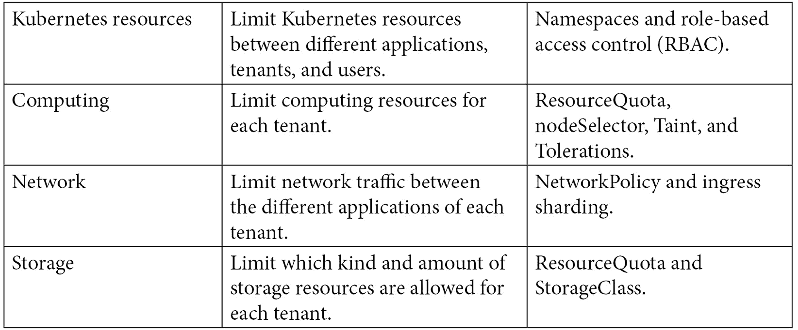

# 第三章：3

# 多租户注意事项

与几乎所有软件一样，随着数量和规模的扩展，事情会变得更加复杂。在上一章中，我们讨论了与 OpenShift 集群架构相关的最重要方面。在本章中，我们将讨论在一个或多个集群上处理多个环境时应了解的一些事项。

本章将讨论以下主题：

+   什么是多租户？

+   处理多个租户

+   OpenShift 上的多租户

+   多租户策略

# 什么是多租户？

**多租户**是指使用单一平台实例为多个用户或组（也称为**租户**）提供服务的能力。平台架构可以设计为单租户或多租户：

+   在单租户平台架构中，平台实例内没有隔离。这意味着实例内没有分隔，因此也无法隔离用户或组的对象。在这种情况下，要实现多租户，你需要为每个租户提供一个单独的平台实例。

+   在多租户平台架构中，可以在不同租户之间隔离对象和数据。因此，即使使用单一平台实例，也可以保护每个租户的数据和对象，从而提供足够的隐私和安全性。

根据架构设计和 OpenShift 的使用方式，你可以拥有两种类型的平台（单租户或多租户）。在本章中，你将学习如何在设计 OpenShift 集群时，考虑这一点的最佳方式。

# 处理多个租户

在 OpenShift 上处理多个租户有许多不同的方式，其中最明显的一种是为每个租户拥有一个单独的集群。然而，这并非总是可能的或最佳选择：为每个租户提供专用硬件和平台可能会很昂贵，维护起来也很困难，且效率不高。通过共享集群，不同租户的多个工作负载共享相同的计算资源，从而实现更高效的计算使用。

OpenShift 可以为每个租户提供对象、计算、网络和其他硬件资源的隔离，确保它们相互隔离。在下一节中，我们将探讨不同类型的隔离以及如何利用它们。

## OpenShift 中的多租户

当谈到 OpenShift 上的多租户时，会涉及到多个对象。下表展示了一些提供多租户功能的重要资源，我们将在本章中讨论这些内容：

下图说明了这些资源如何组合在一起提供隔离并启用多租户：

图 3.1 – 多租户和隔离

现在，让我们来看一下这些对象是如何在 OpenShift 上提供多租户功能的。在接下来的**第五章**《OpenShift 开发》示例中，我们将使用它们，所以现在不用担心如何使用它们。相反，专注于理解它们如何提供隔离功能，以实现多租户。

### 命名空间

命名空间提供了一定程度的隔离。使用命名空间，你可以为以下内容定义一个有限的空间：

+   **Kubernetes 工作负载**：**Pods**、**Secrets**、**ConfigMaps**、**Deployments**等。

+   **访问控制**：通过为用户或组分配适当的**角色**（权限），来隔离命名空间资源的访问。

+   **限制资源消耗**：可以通过**ResourceQuotas**限制命名空间所消耗的资源数量。

### 基于角色的访问控制

在 OpenShift 上对资源的权限控制是通过对资源（如**Pods**、**Services**、**Deployments**、**Jobs**等）使用`get`、`list`、`watch`、`create`、`upgrade`等权限进行的，同时**RoleBindings**（或**ClusterRoleBinding**）用于将角色绑定到主体（如组、用户或**ServiceAccounts**）。

你需要使用角色和 RoleBindings 根据租户和你希望实现的隔离逻辑，为用户提供正确命名空间的权限。

### 资源配额（ResourceQuotas）

**ResourceQuotas**允许集群管理员将命名空间的资源限制为有限的资源集。它可以限制计算资源和/或对象数量。当你使用共享集群时，考虑 ResourceQuotas 非常重要，它可以确保每个租户的容量是有限的。如果没有 ResourceQuotas 的限制，可能会导致一个命名空间占用整个工作节点的容量。

### nodeSelectors、污点（taints）和容忍度（tolerations）

通过**nodeSelectors**，你可以将工作节点专门分配给特定的用途或租户。使用 nodeSelectors，可以为每个租户隔离物理计算资源：例如，在一个 10 节点的集群中，你可以将五个节点分配给 QA，另外五个节点分配给开发。**Taints**和**tolerations**是实现这一目标的不同方式：使用 nodeSelectors 时，你指示 Pod 在包含特定标签的节点集合中调度，而使用 taints 时，你指示工作节点*拒绝*那些没有特定容忍度的 Pods 运行。

### 网络策略（NetworkPolicy）

**网络策略**提供了一种标准的方式来隔离 Pods 和命名空间之间的网络流量。它类似于防火墙，你可以定义入站和/或出站策略来接受/拒绝不同 Pods 和命名空间之间的流量。

### Ingress/router 分片

在 OpenShift 上，你可以创建多个 Ingress 控制器，这将允许你在不同租户之间隔离入站流量。

## 多租户策略

重要的是要理解，在使用前面提到的多租户对象时，并没有物理隔离——隔离是由软件定义并实现的。然而，通过使用不同的多租户策略，如您现在将看到的，仍然有可能提供物理级别的隔离。最佳策略取决于您公司中的需求；有些公司更关注计算资源的高效利用，而其他公司则不在乎额外的资源开销，只要能获得最安全的隔离策略。  

一些不同的策略如下：  

+   每个租户拥有专用集群  

+   没有物理资源隔离的共享集群  

+   带有专用工作节点的共享集群  

+   带有专用工作节点和入口控制器的共享集群  

### 专用集群  

正如我们之前提到的，最明显的策略是为每个租户提供不同的集群。下图展示了为两个租户（QA 和开发）提供服务的示例：  

  

图 3.2 – 专用集群  

下表总结了我们对这种策略的优缺点：  

  

这种架构通常推荐给那些对物理隔离环境有严格要求，并且不想依赖多租户软件和流程来提供隔离的公司。  

### 共享集群，无物理隔离  

另一方面，您可能决定使用一个共享集群为多个租户提供服务，同时使用 OpenShift 对象来实现多租户（如命名空间、RBAC、资源配额和网络策略）。您可以在下图中看到该策略的简单示意图：  

  

图 3.3 – 共享集群，无物理隔离  

下表展示了这种策略的一些优缺点：  

这种架构通常适用于非生产环境，在这些环境中，某些与性能下降相关的事件，例如，偶尔可以容忍。  

### 共享集群，专用工作节点  

如果您必须提供物理隔离的计算资源，这可能是正确的方向。在这种情况下，您将使用相同的对象来提供隔离，但为特定租户专用工作节点。以下是一个简单的示意图：

  

图 3.4 – 共享集群，专用工作节点  

这种策略有以下优缺点：  

  

这种架构通常适用于非生产环境，其中某些性能下降相关的事件（例如）有时是可以容忍的。该架构也适用于没有高 HTTP(S) 吞吐量和低延迟 HTTP(S) 要求的生产工作负载。以下链接提供了单个 OpenShift 入口控制器（**HAProxy**）的容量基准，供参考：[`docs.openshift.com/container-platform/latest/scalability_and_performance/routing-optimization.html`](https://docs.openshift.com/container-platform/latest/scalability_and_performance/routing-optimization.html)。

### 共享集群、专用工作节点和入口控制器

最后，采用这种策略，你可以通过提供更高的隔离级别，在不同租户之间共享集群。下图展示了该集群的架构：

图 3.5 – 共享集群、专用工作节点和入口控制器

这种策略有以下优缺点：

这种架构通常适用于生产环境和非生产环境。如果定义明确并正确使用，它的效果与专用集群相同。这种策略与专用集群之间的唯一区别是，在这种情况下，配置错误可能导致应用部署到错误的租户（例如，在命名空间中使用错误的**nodeSelector**）。

## OpenShift 多租户检查清单

为了总结本章，我们决定在前一章开始构建的检查清单中添加一些额外的项目，如下所示：

在下一章中，你将了解与 OpenShift 通常相关的各种角色，从 C 级高管到操作层级，以及每个角色所需的技能。你将能够理解应该期望每个角色的职责，并为自己和团队做好与 OpenShift 合作的准备。

# 总结

本章中，我们探讨了提供多租户服务的几种策略，适用于 OpenShift 集群。你现在应该理解，我们可以拥有专用或共享的 OpenShift 集群来托管租户。你还看到，对于共享集群，可以通过使用命名空间、资源配额（ResourceQuotas）、网络策略（NetworkPolicies）以及其他对象，提供一定程度的租户隔离，甚至实现工作节点和/或入口控制器的物理隔离；最适合你的用例的选择取决于组织的需求、工作负载和环境。

然而，我需要提醒你，在当前的混合云环境中，你可能需要与不同提供商和地区的集群进行协作，这可能导致集群数量的不断增加。但不用担心——正如我们在*第一章*中看到的，*混合云之旅与策略*，许多优秀的工具可以帮助我们管理多个集群，比如 Red Hat 高级集群管理、先进集群安全和 Quay；我们将在本书最后一部分深入探讨这些工具，并通过实际示例进行讲解，这一部分专门讲解这些工具。

在下一章中，我们将学习与 OpenShift 相关的角色和技能组合，它们的主要职责和任务，以及其他重要因素。

# 进一步阅读

如果你想了解更多关于本章所涉及的概念，请查阅以下参考资料：

+   *什么是* *多租户？* [`www.redhat.com/en/topics/cloud-computing/what-is-multitenancy`](https://www.redhat.com/en/topics/cloud-computing/what-is-multitenancy)

+   *多租户网络隔离（OpenShift* *文档）:* [`docs.openshift.com/container-platform/4.8/networking/network_policy/multitenant-network-policy.html`](https://docs.openshift.com/container-platform/4.8/networking/network_policy/multitenant-network-policy.html)
