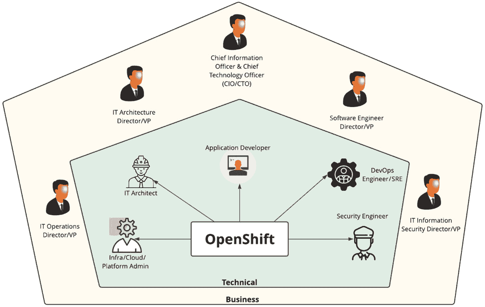
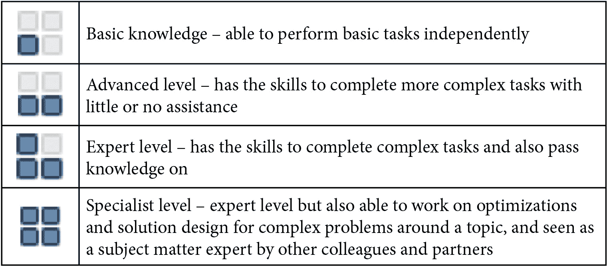
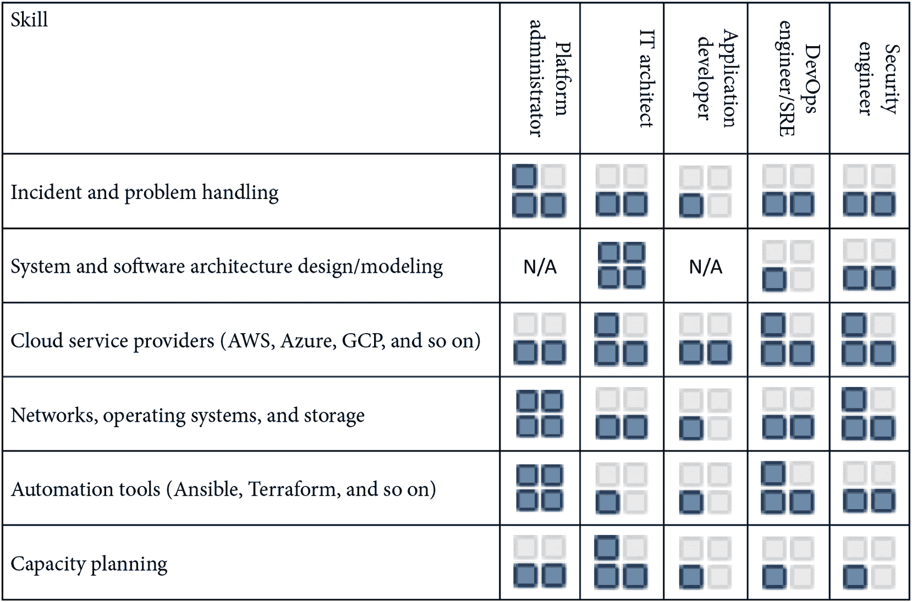
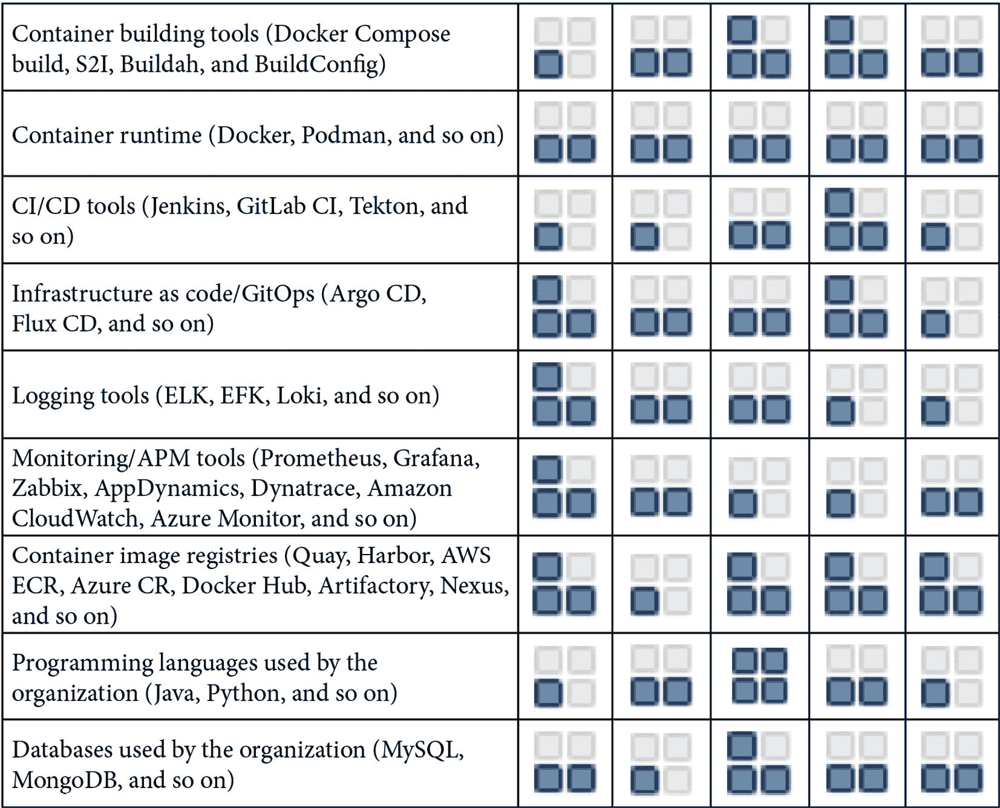
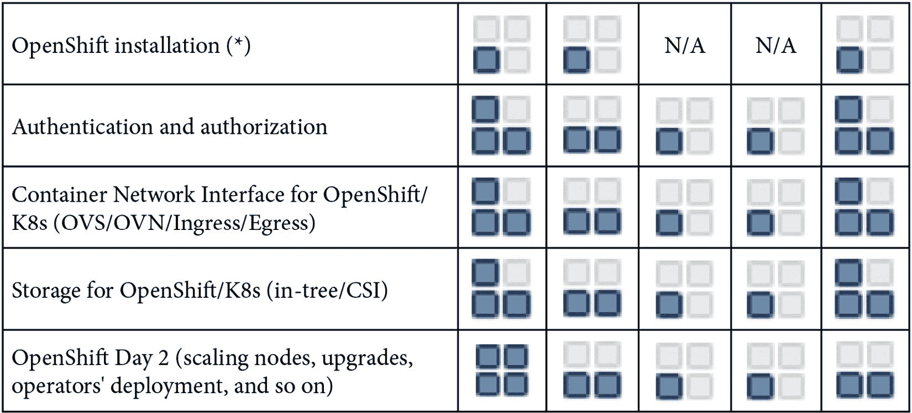

# 4

# OpenShift 人物角色与技能集

现在你已经了解了 OpenShift 集群架构的样子，那么如何理解与之合作的人们呢？在我的职业生涯中，我见证了许多不同软件、平台和流程的采用，其中一些进展顺利，而另一些则面临挑战。它们之间的区别是什么，决定了好的还是坏的采用？主要的区别就是人——也就是说，处理人们的方式在很大程度上决定了采用是否成功。

我们坚信，你需要像关心平台本身一样关心人们。因此，我们决定在本书中留出一些页面，讨论执行任务所需的主要人物角色和技能。

因此，在本章中，你将找到以下内容：

+   一些与 OpenShift 相关的人物角色

+   通常这些人物角色需要的主要职责和任务

+   他们通常面临的挑战

+   他们通常期望在容器平台中看到什么

+   一个包含资源所需主要能力的技能矩阵

本章涵盖的主要内容如下：

+   人物角色

+   技能矩阵

让我们深入了解！

# 人物角色

在这一部分，我们将讨论在职业生涯中通常与 OpenShift 打交道的专业角色（**人物角色**），这些角色通常都与 OpenShift 有某种程度的关系。

在下图中，你将看到 IT 部门的一些典型角色：

图 4.1 – 人物角色与 OpenShift

让我们回顾一下主要的技术角色，并学习有用的信息，以便更好地为组织准备 OpenShift 的采用。如果你从事协调角色，利用这个机会了解你应该期待你的技术团队做什么；如果你是个人贡献者，学习你每天可能需要处理的活动和技能。

## 一个系统/云/平台管理员

一个系统、云或平台管理员是一个个人贡献者，负责维护 OpenShift 集群的基础设施以及集群本身。根据组织的规模，这个角色可以有多个专业化领域，例如网络、操作系统和存储管理。

让我们看看他们需要执行的一些职责，以及在执行过程中面临的挑战。

### 关键职责和任务

+   支持网络、存储、虚拟化层和基础设施。

+   OpenShift 集群管理操作，如扩展节点、升级，以及授予用户和组权限。

+   配置 OpenShift 命名空间、网络策略、资源配额、节点选择器等。

+   平台容量管理。

+   云成本估算和报告。

+   向供应商提交支持票据以获得帮助，处理与集群底层基础设施和/或 OpenShift 相关的问题。

+   监控平台性能和稳定性。

+   主动分析和报告事件，尤其是在发现可能的问题时。

+   对用户的事件进行响应。

+   收集日志以调查问题。

+   报告运营指标，如事件数量、**平均恢复时间**（**MTTR**）和**平均故障间隔时间**（**MTBF**）。

### 他们通常面临的挑战

+   **标准**：随着集群规模的增长，管理变得越来越困难，主要是因为缺乏可以使用的标准。

+   **可观测性**：组织在建立全面且高效的应用程序和基础设施监控时常常遇到困难，这并不罕见。不高效的监控工具和实践使得做出正确决策变得更加困难。管理员在建立正确的工具和实践以适当监控环境方面遇到困难。

+   **容量规划和管理**：集群管理员通常面临正确管理集群容量的挑战。由于缺乏监控和容量规划，集群资源耗尽的情况并不少见。

+   **云成本**：随着云使用量的增加，控制成本也变得更加困难。

+   **支持多个云环境**：管理员通常需要处理和支持多个云环境，这使得管理和操作变得更加具有挑战性。

+   **日志管理**：一些公司在定义和维护高效的容器日志平台方面遇到困难，这影响了问题分析、问题根源检测等。

+   **支持票据**：管理供应商的支持票据通常会遇到困难，有时是因为缺乏收集日志等信息的知识，或者信息不足，无法让供应商进行审查，或者供应商的响应延迟。

### 用户希望在容器平台上看到什么？

+   一个成熟的企业级容器编排平台，用于托管开发团队开发的应用程序。

+   能提供出色支持体验并建立自己作为可信顾问合作伙伴的供应商。

+   与不同基础设施和/或云供应商兼容的平台。

+   如果已有监控和/或日志工具，平台需要能够与之集成。如果没有，平台需要提供开箱即用的日志和监控工具。

+   提供 GitOps 工具的平台，例如 Argo CD。

+   监控工具和仪表板可以协助集群的容量规划和管理。

+   提供高水平自动化的平台，或者能够使用像 Ansible 或 Terraform 这样的工具轻松实现自动化。

+   提供完整的产品文档和知识库。

+   来自供应商或合作伙伴的优质培训。

下一个通常与 OpenShift 有紧密关系的角色是 IT 架构师。让我们现在仔细看看它。

## IT 架构师

在 OpenShift 的背景下，IT 架构师是负责为一个或多个集群设计高级架构和定义的个人贡献者。架构师收集业务需求，了解问题、难题以及其他参考，以定义最佳解决方案来解决这些问题。不同公司有不同的架构师角色，以下是一些常见角色：

+   **应用架构师**：设计并监督应用程序及相关技术任务的开发和发布。

+   **解决方案架构师**：通常是具有较强技术背景但也具备管理知识的架构师，负责领导整个项目。

+   **企业架构师**：与业务部门合作，定义公司整体 IT 战略的架构师。

+   **基础设施/云架构师**：设计并监督云服务提供商或本地硬件和基础设施上的项目。

如下所述的架构师角色更接近基础设施/云架构师，一般会与 OpenShift 的合作更加紧密。

### 主要职责和任务

+   与业务部门合作，获取容器编排平台的需求。

+   规划和设计集群架构，考虑到业务需求和最佳实践，例如高可用性、安全性以及任何关键平台的其他重要方面。

+   估算处理初始所需容量的规模。

+   估算部署和支持平台的工作量。

+   估算平台的初始和持续成本。

+   协助主管和其他副总裁级别的人员做出平台采购决策。

+   设计平台的监控和日志解决方案。

+   定义平台的安全性要求。

+   定义持续的政策和流程要求，例如备份和灾难恢复。

+   协助 DevOps 工程师定义使用容器平台的**持续集成/持续部署**（**CI/CD**）流程和管道。

+   将决策和规格交给开发和运维团队。协助部署和平台使用。

### 他们面临的挑战（通常）

+   **知识**：我曾多次看到 IT 架构师被推到为 OpenShift 集群设计架构，甚至有时连最基本的概念都不清楚。他们习惯于为其他较简单系统中的应用程序设计架构，而不是为像 Kubernetes 或 OpenShift 这样的平台设计架构，在这些平台中，你需要处理虚拟化、存储、网络等各方面的问题。

+   **缺乏支持**：架构师通常需要获取信息并与组织内部不同团队的人沟通，以理解并定义架构的某些方面——例如，他们可以使用的存储选项、将使用的网络特性等。当他们没有适当的支持来接触正确的人时，架构设计通常会变得耗时且令人沮丧。

+   **需求定义**：在许多组织中，平台的需求定义并不明确。某些公司甚至不知道他们想通过平台实现什么，仅仅因为某些竞争对手在使用该技术或其他类似原因而决定采用它。这使得架构定义变得更加困难，因为在决策过程中很难做到果断和准确。

+   **供应商协助**：架构师在平台的架构设计过程中需要大量的供应商协助。与供应商的互动有时会遇到挑战，原因包括供应商可用性不足、回复信息延迟等。

### 容器平台上，他们想看到什么？

+   一个成熟的企业级容器编排平台，用于托管开发团队开发的应用程序

+   能够满足服务级协议（SLA）要求的供应商

+   可以提供信息、演示和概念验证的可信供应商

+   与业务定义的基础设施和/或云供应商兼容的平台

+   一个能够与现有工具集成的平台，如**应用性能管理**（**APM**）、监控和日志记录

+   一个全面的平台，包括监控、日志记录、CI/CD、服务网格和无服务器工具。

+   开箱即用的 GitOps 工具

+   一个包含 IDE 插件、示例和其他开发工具的生态系统

+   一个开箱即用具有高度自动化的平台，和/或可以轻松通过像 Ansible 或 Terraform 这样的工具进行自动化

+   一个多集群的集中管理解决方案

+   提供完整产品文档和知识库

+   来自供应商或合作伙伴的优质培训

这个难题中非常重要的一部分是应用程序开发人员；没有他们，就没有应用程序可以在任何平台上托管！让我们现在来看看他们的角色。

## 应用程序开发人员

开发人员是使用容器平台构建和部署应用程序代码的个人贡献者。在一些公司中，应用程序开发人员可以直接访问容器平台，执行基础操作，如在开发和/或**质量保证**（**QA**）环境中部署和配置应用程序；而在其他公司中，他们仅能访问 CI/CD 系统，通过流水线自动检查和部署代码。

### 主要职责和任务

+   理解功能需求、用例或用户故事，以开发和测试代码

+   使用最佳实践（如**测试驱动开发**（**TDD**）、CI、基础设施即代码和 GitOps）开发代码

+   经常提交代码

+   开发和运行单元测试

+   构建容器应用

+   支持 QA 团队测试应用

+   修复生产问题的缺陷

### 他们面临的挑战（通常是）

+   **知识**：通常，组织并未给予开发者平台知识应有的关注。他们在代码语言、框架、IDE 和相关学科方面受过良好的教育，但对于托管应用的平台——在此案例中是 OpenShift——却不太了解。这是导致重新工作的一个常见原因，因为代码需要适应特定平台的要求

+   **适当权限**：开发人员没有适当的容器平台权限以执行职责并不罕见。这会影响他们的工作表现并带来挫败感

+   **适当的流程和工具**：一些开发人员没有适当的工具和流程来独立执行活动。通常，他们需要依赖其他团队来安装适当的 IDE 和运行时，更新 CI/CD 管道以反映新的变更，等等

+   **日志管理**：在一些公司，开发人员无法直接访问日志；他们需要向其他团队请求，有时这会耗费很长时间，影响缺陷修复问题。

### 他们希望在容器平台中看到什么？

+   最流行 IDE 的插件

+   提供桌面开发环境，并具备构建和测试容器化应用的工具

+   提供广泛软件开发栈的全面示例

+   提供不同支持的运行时（如 Java、Spring Boot、Node.js 和 Quarkus）的容器基础镜像

+   与 CI/CD 工具的无缝集成

+   UI 开发控制台，可以查看应用日志、监控和配置

+   提供完整的产品文档和知识库

+   提供供应商或合作伙伴提供的优质培训

+   配置了适当权限的平台，允许他们执行职责

一些新的角色也与 OpenShift 密切相关，如 DevOps 工程师和**站点可靠性工程师**（**SRE**）。在以下部分中，您将了解更多关于这些角色的信息

## DevOps 工程师/SRE

DevOps 工程师通常是负责开发和维护 CI/CD 管道，以支持开发团队的个人贡献者。他们还分析应用构建和部署过程中可能出现的问题，使用 CI/CD 和容器平台工具。这个角色可能引发很多讨论，因为 DevOps 本身是一种文化和一套实践，旨在将基础设施和开发结合起来，使其更加灵活和高效，而不仅仅是一个职位角色

类似地，SRE 通常是将一些软件工程方面的知识引入基础设施，以自动化重复的操作任务，并使环境具有可扩展性和可靠性的人。

DevOps 和 SRE 紧密相关 —— SRE 可以看作是 DevOps 实践的一种具体实现，通常更关注基础设施和操作性问题与实现，而 DevOps 工程师通常更侧重于 CI/CD 过程，支持开发团队更高效地交付代码。

我们决定将这两个角色合并为一个身份，但要根据你的实际环境进行调整，并考虑以下信息，看看哪些最符合你在组织中的角色。

### 主要职责和义务

+   理解 CI/CD 流程并相应地开发管道。

+   持续改进支持开发团队的 CI/CD 管道。

+   定义、构建并部署容器和 CI/CD 管道的标准。

+   部署和支持与 CI/CD 过程相关的工具，如容器注册表和 Git 版本控制工具。

+   自动化与 CI/CD 相关的流程（如 DNS 和负载均衡器配置）。

+   支持开发团队解决关于 CI/CD 管道的问题和疑问。

+   自动化重复的操作任务，如服务器配置和网络配置。

+   定义和实施服务的可观测性。

+   容量规划。

+   计划并运行混沌测试。

### 他们面临的挑战（通常是）

+   **知识**：DevOps 工程师和 SRE 通常在自动化方面具有较好的教育背景，但不一定在容器平台及其底层基础设施方面具备相应的知识。

+   **适当的流程和工具**：开发所需的最佳 CI/CD、测试和自动化工具并不总是可以获得。在这些情况下，通常需要采用变通方法，付出更多的努力来开发等，这可能非常令人沮丧！

+   **平台限制**：这些专业人士通常需要在没有 API 的遗留系统上自动化流程，这使得自动化开发变得更加困难。

### 容器平台中他们希望看到什么？

+   与现有 CI/CD 工具的轻松集成

+   一个 UI 控制台，可以查看构建和部署日志，并检查部署对象

+   开箱即用的高水平自动化

+   一个帮助自动化手动步骤的 CLI 和 API

+   为 CI/CD 工具提供插件，促进管道开发

+   一个易于在多个集群上部署应用程序的方式

+   开箱即用的可观测性，或者是可以轻松接入现有工具的可观测性

+   一个帮助实现混沌测试扰动模型的平台

最后，我们有安全工程师，在任何过程中都非常重要，尤其是在如今的勒索软件和其他真正的安全问题时代。让我们检查接下来的部分，看看他们如何与 OpenShift 相关。

## 安全工程师

安全工程师是负责审查提供系统和数据安全的流程和工具的个人贡献者。他们始终在评估应用程序和系统，以控制来自已知威胁的环境，保护现有基础设施以最小化漏洞，最后，检测并响应攻击者。

### 主要职责和任务

+   评估平台可能存在的漏洞并制定缓解策略。

+   审查 CI/CD 流水线，并添加安全门控以最大化安全性。

+   建立容器镜像安全扫描工具，以检测镜像中的已知漏洞。

+   定义适用于所有集群的安全策略。

+   确保集群符合已定义的政策。

### 他们通常面临的挑战

+   **知识**：安全工程师与之前的角色没有区别。他们通常对 OpenShift 有真正的顾虑，主要是因为他们对此了解不够，因此不明白 OpenShift 中是如何实现安全性的。

+   **秘密管理**：密码和敏感数据的管理在 Kubernetes 上仍然是一个挑战。市场上已有多种保管库系统，但许多公司仍未建立成熟的实践和支持工具，这使得安全团队对此点产生了关注。

+   **权限管理**：定义正确的权限级别，以确保一个安全的、不会限制开发人员和其他团队的平衡平台，确实是一个挑战，这关乎生产力的影响。

+   **漏洞扫描**：容器和 Kubernetes 的安全工具相对较新，因此大多数公司没有任何可用的工具，这可能会给安全工程师带来真正的噩梦！

### 他们希望在容器平台中看到什么？

+   一个使用最安全的容器编排标准的平台，如 Linux 命名空间、`cgroups`、Linux 能力、`seccomp` 和 SELinux

+   一种允许他们轻松定义并强制执行多个集群之间的安全策略的工具

+   一个支持多租户并能够在不同工作负载之间进行网络隔离的安全平台

+   数据静态加密

+   一个安全的**基于角色的访问控制**（**RBAC**）平台可用

+   启用审计日志并进行日志记录

+   带有安全扫描的镜像注册表

我们已经覆盖了不同技术角色及其职责，这将帮助您和您的组织为 OpenShift 的采用做好准备。最后，我们将呈现一份技能矩阵，旨在帮助理解每个角色所需的主要技能。

# 技能矩阵

本节将提供一个建议的技能矩阵，适用于前面章节中列出的角色。这里列出的项目是我们根据经验观察到的、对专业人士来说重要的技术技能的子集。请注意，本书并未涉及软技能；这并不意味着我们不重视软技能——恰恰相反，我们非常重视！——但它们不是本书的重点。本技能矩阵按照以下标准分类：

查看下列技能表格，我们已将其拆分为多个部分，以提高可读性。

## 与架构、基础设施和自动化相关的技能

查阅下表，了解架构、基础设施和自动化任务所需的技能：

## 与开发、容器和 CI/CD 相关的技能

在下表中，您将找到与开发和 CI/CD 相关的技能：

## 与 OpenShift 相关的技能

最后，请参见下表，了解 OpenShift 所需的技能：

(*) 如果管理员在部署集群时得到咨询合作伙伴的帮助。如果他们需要部署新的集群，则应该至少具备高级的 OpenShift 安装技能。

# 总结

我们在本章中讨论了与 OpenShift 相关的主要角色、他们的关键职责、通常面临的挑战以及他们对容器平台的需求。现在，我们也对 OpenShift 专业人士需要具备的能力有了一定的了解。我们希望这能帮助您为自己将要执行的任务做好准备，或者如果您处于管理层职位，可以根据这些信息规划团队的能力建设和招聘政策。

本章总结了本书的第一部分，内容包括概念、架构和能力建设。现在，请继续阅读下一章，开始 OpenShift 集群部署之旅。在该章节中，我们将引导您完成准备安装、部署集群以及执行一些部署后任务的步骤。

# 进一步阅读

如果您想查看更多与本章内容相关的信息，请查阅以下参考资料：

+   *什么是技能矩阵，我应该在 2021 年使用它吗？*：[`www.skills-base.com/what-is-a-skills-matrix-and-should-i-use-one-in-2021`](https://www.skills-base.com/what-is-a-skills-matrix-and-should-i-use-one-in-2021)

+   *一切即代码*：[`openpracticelibrary.com/practice/everything-as-code/`](https://openpracticelibrary.com/practice/everything-as-code/)

+   *GitOps*：[`openpracticelibrary.com/practice/gitops/`](https://openpracticelibrary.com/practice/gitops/)

+   *我的集群有多满？容量管理与监控在* *OpenShift* 上的应用*: [`cloud.redhat.com/blog/full-cluster-capacity-management-monitoring-openshift`](https://cloud.redhat.com/blog/full-cluster-capacity-management-monitoring-openshift)

+   *容器和 Kubernetes 安全的分层方法*: [`www.redhat.com/en/resources/layered-approach-container-kubernetes-security-whitepaper`](https://www.redhat.com/en/resources/layered-approach-container-kubernetes-security-whitepaper)

+   *OpenShift 容器平台架构*: [`docs.openshift.com/container-platform/4.9/architecture/architecture.html`](https://docs.openshift.com/container-platform/4.9/architecture/architecture.html)

# 第二部分 – 利用 Red Hat OpenShift 的企业级产品

在这一部分，你将了解 OpenShift 的部署和 Day 2。你将学习如何构建一个 OpenShift 集群，并探索有助于执行管理任务的对象和 API。通过不同的场景，你将获得保护集群健康、授予适当的访问策略并避免常见错误的宝贵见解，这些错误常常导致过度承诺，进而影响集群的稳定性。

本书的这一部分包括以下章节：

+   *第五章*，*OpenShift 部署*

+   *第六章*，*OpenShift 故障排除、性能优化与最佳实践*

+   *第七章*，*OpenShift 网络*

+   *第八章*，*OpenShift 安全性*
