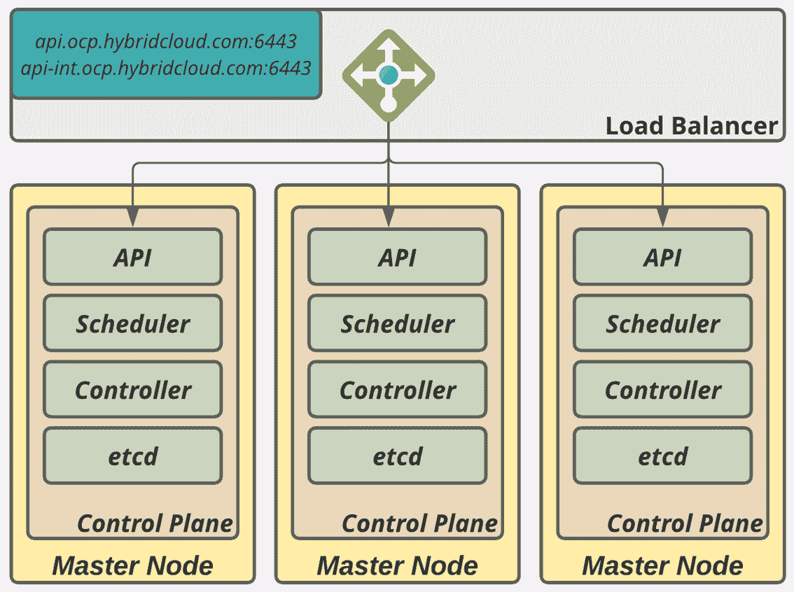
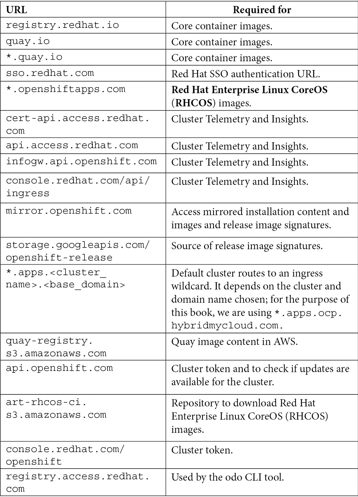
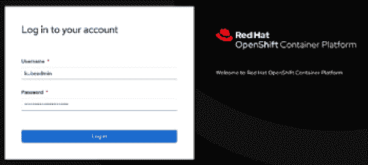

# 第五章：5

# OpenShift 部署

在本章中，我们将导航通过 Red Hat OpenShift 的部署过程。只有当您理解架构的需求、理解应用于基础架构的品牌技术，并了解您应该在 OpenShift 顶部拥有的工作负载时，才能实现成功的实施案例。

正如您在*第一章*，*混合云旅程和策略*中所见，这个多集群宇宙中有很多选择。那么，什么是最适合您的选择？您该如何选择？如果您开始准备部署的前提条件而没有妥善准备自己，可能会感到非常困惑。尽管如此，我们必须强调与所选择的架构保持一致的重要性，以确保预期的部署成功。运行时的更改和未计划的间隙可能会带来意外的结果，并导致平台充满缺陷，导致平台无法正常运行。与现实世界进行比较，这就像一艘不能顺利装载集装箱的船，因为它总是在维修，因此无法执行长途旅行甚至起航。

考虑本书第一部分的解释，现在有几种部署 OpenShift 集群的选择。接下来，我们将从问题清单开始，帮助您为自己的需求做出正确的决策。请记住，没有对与错的答案，但这将帮助您决定哪种方式最适合您。

本章涵盖以下内容：

+   需求

+   OpenShift 安装先决条件

+   准备安装

+   安装

+   接下来是什么？

那么，让我们开始吧！

# 需求

这是一个实用章节，您将使用我们认为是最复杂的部署程序之一部署 OpenShift 集群：**用户提供的安装程序**（**UPI**）/ 通用安装。

本章中使用的源代码可在 [`github.com/PacktPublishing/OpenShift-Multi-Cluster-Management-Handbook/tree/main/chapter05`](https://github.com/PacktPublishing/OpenShift-Multi-Cluster-Management-Handbook/tree/main/chapter05) 获取。

正如我们在本书中已经涵盖的，有许多不同类型的安装和支持的提供者，几乎不可能涵盖每一种组合 - 我们也没有这个意图，因为有大量的文档、教程和互联网上的优秀参考资料，可以指导您完成各种安装类型。

也就是说，我们理解到，能够为您带来最大价值的部署流程是 UPI/通用部署方式；当您掌握了这种方式后，您将能够理解并轻松执行其他类型的安装。原因很简单：在 UPI/通用安装中，您需要负责提供 OpenShift 部署所需的所有前提条件，而在 **安装程序提供的基础设施**（**IPI**）部署中，安装程序本身将自动为您提供所需的前提条件，直接由底层服务商提供。

## OpenShift 检查清单选择

您是否已经查看了我们在*第二章*，“*架构概述与定义*”，以及*第三章*，“*多租户考虑事项*”中提供的检查清单？如果您正在阅读本章以在企业中实现 OpenShift 集群，并且还没有阅读这些章节，我们强烈建议您回去阅读它们，因为它们包含了在部署集群之前您需要考虑和思考的重要方面。

## 实验室要求

要进行本章中的实验，您将需要以下资源：

+   一个可以启动实例的虚拟化平台或云提供商。如果您有条件，也可以使用裸金属服务器。

+   这是虚拟机的最低要求：

    +   用于引导节点的临时服务器

    +   三台用于主节点的服务器，每台配备 2 vCPU、8 GB RAM 和 50 GB 硬盘（最低要求）

    +   两台用于工作节点的服务器，每台配备 2 vCPU、8 GB RAM 和 50 GB 硬盘（最低要求）

    +   一台用于堡垒节点的服务器，配备 2 vCPU、4 GB RAM 和 20 GB 硬盘（最低要求）

如果您的环境中没有足够的资源，您还可以使用三节点集群，将主节点和工作节点共置于同一台服务器上。

重要提示

列出的要求仅适用于实验室环境。请参阅*第二章*，“*架构概述与定义*”，以获取适用于企业安装的可靠规格。

# OpenShift 安装前提条件

在开始 OpenShift 部署之旅之前，您必须观察一些前提条件。首先，我们将根据您在选择表格中做出的决定，探索可选项。

如*第一章*，“*混合云之旅与战略*”中所述，OpenShift 有三种安装模式：**安装程序提供的基础设施**（**IPI**）、**用户提供的基础设施**（**UPI**）和**通用**（即裸金属安装程序）。需要特别记住的是，没有一个选项适用于所有情况，尽管最好的选项是最适合您先前设计架构的选项。

本章专注于部署以及所有与自己启动集群相关的内容，所以在搭建自己的实验室时请牢记这一点，并享受我们 GitHub 仓库中的提示和资料，这将成为你的一把真正的瑞士军刀。

下表显示了根据所选提供商，你可以使用的安装方法（截至本书编写时）：


关于前表中的术语，我们对每个基础设施提供商的部分可选项进行了分类，以便为你提供当前可能的选择概述（截至本书编写时）。当我们说**推荐**时，我们不仅仅是表达我们的观点，我们是试图说明这是一个*常见且最佳选择*。**可能**表示有效的选项，但会有一些缺点，例如丧失产品开箱即用的一些优秀自动化功能。因此，我们将它们分类为**可能**，但不是最佳选择。**不可用**是不言自明的。

由于安装方法不同，前提条件也有所不同，我们准备了一个矩阵，帮助你开始为基础设施做好准备，以启动集群部署：


## UPI/无关安装程序

任何 OpenShift 安装都必须具有有效的 Red Hat 订阅、OpenShift 安装程序二进制文件、**拉取密钥**文件、公共**安全外壳**（**SSH**）**密钥**以及根据每个提供商可用的资源。

在本节中，我们将指导你完成一个可行且可靠的集群安装，无论你选择了哪个提供商。我们还将使用实际示例来设置所需的前提条件——随时可以根据需要多次使用这些配置。

请注意，本章中使用的文件也可以在我们的 GitHub 仓库中找到：[`github.com/PacktPublishing/OpenShift-Multi-Cluster-Management-Handbook/tree/main/chapter05`](https://github.com/PacktPublishing/OpenShift-Multi-Cluster-Management-Handbook/tree/main/chapter05)

那么，让我们从 OpenShift 本身之外，但在部署过程中不可或缺的前提系统开始。

### DNS

在本节中，我们将讨论为配置 OpenShift 集群所需的**域名系统**（**DNS**）要求。为了演示目的，我们将提供最小配置以确保一切正常工作；对于更深入的设置，请参考本书最后一章中提供的参考资料。

对于我们的实验环境，我们将使用在 Red Hat Enterprise Linux 8 虚拟机上运行的 **BIND** 工具；不过，你也可以在 Windows 或你偏好的 Linux 发行版上使用任何其他 DNS 服务器。从现在开始，我们将称这台 Linux 虚拟机为 **bastion**，这是 Red Hat 架构中的一种约定。如果你想严格遵循本章中的指示，建议你使用一个全新安装的 Red Hat Enterprise Linux 8，选择最小安装。

OpenShift 集群需要一个专用的子域名。为了帮助你理解，我们将使用一个假设的 *混合云公司*，它使用 `hybridmycloud.com` 作为其主要公共域名。OpenShift 集群的完整子域名将是 `ocp.hybridmycloud.com`。

要安装 BIND，请在你的堡垒虚拟机上运行以下命令：

```
$ sudo yum install bind bind-utils -y
$ sudo systemctl enable --now named
$ sudo firewall-cmd --permanent --add-port=53/tcp
$ sudo firewall-cmd --permanent --add-port=53/udp
$ sudo firewall-cmd --reload
```

现在，我们将配置 DNS 服务器以供 OpenShift 安装和应用程序使用。执行以下步骤来完成此操作：

1.  通过在 `named.conf` 文件中添加以下代码来创建一个子域名区域。你也可以在我们的 GitHub 仓库 `chapter05/named.conf` 中下载一个可用的文件：

    ```
    $ sudo cat << EOF >>  /etc/named.conf
    zone "ocp.hybridmycloud.com" IN {
    type master;
    file "/var/named/ocp.hybridmycloud.com.db";
    allow-query { any; };
    allow-transfer { none; };
    allow-update { none; };
    };
    zone "1.168.192.in-addr.arpa" IN {  
    type master;  
    file "/var/named/1.168.192.in-addr.arpa";
    allow-update { none; };
    };
    EOF
    ```

1.  在 `/var/named/ocp.hybridmycloud.com.db` 创建正向区域文件：

    ```
    $ sudo cat <<EOF > /var/named/ocp.hybridmycloud.com.db
    ;[1] Begin Common Header Definition
    \$TTL 86400
    @ IN SOA bastion.ocp.hybridmycloud.com. root.ocp.hybridmycloud.com. (
    202201010001 ;Serial
    21600 ;Refresh
    3600 ;Retry
    604800 ;Expire
    86400 ;Minimum TTL
    )
    ;End Common Header Definition
    ;Name Server Information [2]
       IN NS bastion.ocp.hybridmycloud.com.
    ;IP address of Name Server [3]
    bastion IN A 192.168.1.200
    ;api internal and external purposes [4]
    api        IN    A    192.168.1.200 
    api-int    IN    A    192.168.1.200 
    ;wildcard application [5]
    *.apps     IN    A    192.168.1.200
    ;bootstrap node to start cluster install only [6]
    bootstrap  IN    A    192.168.1.90 
    ;master nodes [7]
    master1    IN    A    192.168.1.91 
    master2    IN    A    192.168.1.92 
    master3    IN    A    192.168.1.93
    ;worker nodes [8]
    worker1    IN    A    192.168.1.101
    worker2    IN    A    192.168.1.102
    EOF
    ```

让我们更详细地查看这段代码：

**[1]**：常见的 DNS 区域头。

**[2]**：DNS 服务器将是其自己的堡垒服务器。

**[3]**：来自 DNS 服务器的 IP 地址（堡垒 IP）。

**[4]**：这些记录是强制性的，需要指向将用于 OpenShift API 功能的 VIP。在我们的案例中，我们使用堡垒服务器作为 VIP（仅适用于实验环境）。

**[5]**：用于运行 OpenShift 上的应用程序的通配符 VIP 记录。在我们的案例中，我们使用堡垒服务器作为 VIP（仅适用于实验环境）。

**[6]**：引导节点 IP 记录，仅用于集群安装，安装后可以删除。

**[7]**：主节点 IP 记录，控制平面对象将托管在此。

**[8]**：工作节点 IP 记录，工作负载将在此运行。如果你选择三节点集群，请忽略工作主机。

1.  在 `/var/named/1.168.192.in-addr.arpa` 创建反向区域文件：

    ```
    $ sudo cat <<EOF > /var/named/1.168.192.in-addr.arpa
    \$TTL 1W @    IN    SOA    bastion.ocp.hybridmycloud.com.root (     
    2019070700 ; serial 
    3H         ; refresh (3 hours) 
    30M        ; retry (30 minutes) 
    2W         ; expiry (2 weeks) 
    1W )       ; minimum (1 week) 
    5.1.168.192.in-addr.arpa. IN PTR 
    api.ocp.hybridmycloud.com.;
    5.1.168.192.in-addr.arpa. IN PTR 
    api-int.ocp.hybridmycloud.com.;
    90.1.168.192.in-addr.arpa. IN PTR 
    bootstrap.ocp.hybridmycloud.com.; 
    91.1.168.192.in-addr.arpa. IN PTR 
    master1.ocp.hybridmycloud.com.; 
    92.1.168.192.in-addr.arpa. IN PTR 
    master2.ocp.hybridmycloud.com.; 
    93.1.168.192.in-addr.arpa. IN PTR 
    master3.ocp.hybridmycloud.com.; 
    101.1.168.192.in-addr.arpa. IN PTR 
    worker1.ocp. hybridmycloud.com.; 
    102.1.168.192.in-addr.arpa. IN PTR 
    worker2.ocp. hybridmycloud.com.;
    EOF
    ```

重要提示

*不要*为应用程序的通配符 VIP 创建反向区域记录，因为这将导致错误的 DNS 解析。

如果你为三节点集群创建了它，请忽略工作 A 和 PTR 记录。

1.  重启 `named` 服务：

    ```
    sudo systemctl restart named
    ```

1.  验证 DNS，以确保所有 DNS 记录已正确设置，使用以下 `dig` 命令（将 `192.168.1.200` 替换为你的堡垒 IP）：

    1.  使用以下方式验证 OpenShift API：

    ```
    dig +short @192.168.1.200 api.ocp.hybridmycloud.com
    dig +short @192.168.1.200 api-int.ocp.hybridmycloud.com
    ```

    1.  对于我们在本节中描述的 BIND 示例，输出 *必须*如下：

    ```
    192.168.1.5
    192.168.1.5
    ```

    1.  使用以下方式验证应用程序的通配符：

    ```
    dig +short @192.168.1.200 joedoe.apps.ocp.hybridmycloud.com
    dig +short @192.168.1.200 whatever.apps.ocp.hybridmycloud.com
    ```

    1.  所有结果 *必须* 指向 ingress 应用程序的通配符 VIP，如下所示：

    ```
    192.168.1.6
    192.168.1.6
    ```

    1.  验证节点，步骤如下：

    ```
    dig +short @192.168.1.200 boostrap.ocp.hybridmycloud.com
    dig +short @192.168.1.200 master1.ocp.hybridmycloud.com
    dig +short @192.168.1.200 master2.ocp.hybridmycloud.com
    dig +short @192.168.1.200 master3.ocp.hybridmycloud.com
    dig +short @192.168.1.200 worker1.ocp.hybridmycloud.com
    dig +short @192.168.1.200 worker2.ocp.hybridmycloud.com
    ```

答案必须如下：

```
192.168.1.90
192.168.1.91
192.168.1.92
192.168.1.93
192.168.1.101
192.168.1.102
```

1.  最后，让我们验证反向记录，步骤如下：

```
dig +short @192.168.1.200 -x 192.168.1.90
dig +short @192.168.1.200 -x 192.168.1.91
dig +short @192.168.1.200 -x 192.168.1.92
dig +short @192.168.1.200 -x 192.168.1.93
dig +short @192.168.1.200 -x 192.168.1.101
dig +short @192.168.1.200 -x 192.168.1.102
```

结果大致如下：

```
bootstrap.ocp.hybridmycloud.com.
master1.ocp.hybridmycloud.com.
master2.ocp.hybridmycloud.com.
master3.ocp.hybridmycloud.com.
worker1.ocp.hybridmycloud.com.
worker2.ocp.hybridmycloud.com.
```

做得好！如果你的 DNS 服务器能够正确解析名称，你已经在准备前提条件方面迈出了重要的一步。现在，让我们继续探讨 OpenShift 安装过程中的另一个重要部分：**动态主机配置协议** (**DHCP**)。

### DHCP

DHCP 用于为 OpenShift 节点提供 IP 地址。在 UPI 或无关安装节点中，需要通过静态配置在 DHCP 中设置 IP 地址（使用 `fixed-address` 参数）。

确保 DNS 和 DHCP 中节点的 IP 地址和主机名匹配——DNS 和 DHCP 中的每个 IP 地址和主机名必须相同。在这个前提部分中，我们专注于创建一个简单的 DHCP 设置，以便后续学习和实验使用。如前所述，DHCP 将配置为在 `192.168.1.x` 子网下提供静态 IP 地址，因此，这个配置使用每个节点以太网接口的 **媒体访问控制** (**MAC**) 地址：

1.  在你的堡垒虚拟机上安装 DHCP：

    ```
    $ sudo yum install dhcp-server -y
    ```

1.  根据 DNS 使用的主机名和 IP 地址配置 `dhcpd.conf` 文件：

    ```
    cat <<EOF > /etc/dhcp/dhcpd.conf
    # DHCP Server Configuration file.
    #[1]
    ddns-update-style interim;
    ignore client-updates;
    authoritative;
    allow booting;
    allow bootp;
    allow unknown-clients;
    default-lease-time 3600;
    default-lease-time 900;
    max-lease-time 7200;
    #[2]
    subnet 192.168.1.0 netmask 255.255.255.0 {
    option routers 192.168.1.254;
    option domain-name-servers 192.168.1.200;
    option ntp-servers 192.168.1.200;
    next-server 192.168.1.200; #[2.1]
    #filename "pxelinux.0";#[2.2]
    #[3]
    group {
    host bootstrap {
    hardware ethernet 50:6b:8d:aa:aa:aa;
    fixed-address 192.168.1.90;
    option host-name "bootstrap.ocp.hybridmycloud.com";
    allow booting;
    }
    host master1 {
    hardware ethernet 50:6b:8d:bb:bb:bb;
    fixed-address 192.168.1.91;
    option host-name "master1.ocp.hybridmycloud.com";
    allow booting;
    }
    host master2 {
    hardware ethernet 50:6b:8d:cc:cc:cc;
    fixed-address 192.168.1.92 ;
    option host-name "master2.ocp.hybridmycloud.com";
    allow booting;
    }
    host master3 {
    hardware ethernet 50:6b:8d:dd:dd:dd;
    fixed-address 192.168.1.93 ;
    option host-name "master3.ocp.hybridmycloud.com";
    allow booting;
    }
    host worker1 {
    hardware ethernet 50:6b:8d:11:11:11;
    fixed-address 192.168.1.101;
    option host-name "worker1.ocp.hybridmycloud.com";
    allow booting;
    }
    host worker2 {
    hardware ethernet 50:6b:8d:22:22:22;
    fixed-address 192.168.1.102;
    option host-name "worker2.ocp.hybridmycloud.com";
    allow booting;
    }
    }
    } 
    EOF
    $ sudo systemctl enable --now dhcpd
    $ sudo firewall-cmd --add-service=dhcp --permanent
    $ sudo firewall-cmd --reload
    ```

让我们更详细地看一下这段代码：

**[1]**：常见的设置，定义 DHCP 在该子网中作为权威服务器，并设置 IP 租用时间。

**[2]**：作用域子网定义：

+   以 `#` 字符开头的行。

**[3]**：一个包含所有节点的组，用于租用 IP 地址。如果你选择三节点集群，忽略工作主机。

重要提示

在你的虚拟化管理程序中创建虚拟机后，使用从网络接口获取的 MAC 地址相应地更新 `dhcpd.conf` 文件；否则，这个子网将无法分配 IP 地址。

### Web 服务器

Web 服务器用于提供安装节点的操作系统镜像，同时也提供 Ignition 文件（Ignition 文件是编码为 `base64` 的清单文件）。在我们的场景中，我们将安装和配置 Apache Web 服务器，这是一种非常简单的方式，可以为集群安装提供所有必要的工具。

按照这份简短的步骤清单来完成这项任务：

1.  安装 **httpd** 服务器：

    ```
    $ sudo yum install httpd policycoreutils-python-utils –y
    ```

1.  配置 `/etc/httpd/conf/httpd.conf` 文件，修改 **Listen 指令**：

    ```
    $ sudo sed –i 's/80/81/g' /etc/httpd/conf/httpd.conf
    ```

1.  应用 `httpd` 端口：

    ```
    $ sudo semanage port -a -t http_port_t -p tcp 81
    ```

1.  在 `81` 上创建规则：

    ```
    $ sudo firewall-cmd --add-port 81/tcp --permanent
    $ sudo firewall-cmd --reload
    ```

1.  创建一个目录用于存放操作系统镜像和 Ignition 文件，并创建一个文件来测试连接性：

    ```
    $ sudo mkdir –p /var/www/html/images
    $ sudo mkdir –p /var/www/html/ignition
    $ sudo touch /var/www/html/images/imageFileToTest.txt
    $ sudo touch /var/www/html/ignition/ignitionFileToTest.txt
    ```

1.  设置文件的权限和所有者：

    ```
    $ sudo chown –R apache. /var/www/html/
    $ sudo chmod 744 –R /var/www/html/
    ```

1.  启动并启用 Apache Web 服务器：

    ```
    $ sudo systemctl enable --now httpd 
    ```

1.  使用 `curl` 命令测试连接性：

    ```
    $ curl –O http://192.168.1.200:81/images/imageFileToTest.txt
    $ curl –O http://192.168.1.200:81/ignition/ignitionFileToTest.txt
    ```

如果你能看到文件下载到当前文件夹，说明你已经正确配置了 Apache Web 服务器以提供 OpenShift 安装。

### 负载均衡器

负载均衡器是 OpenShift 集群架构中的另一个重要元素。它负责在一组节点中的池成员之间平衡连接。出于性能和弹性原因，建议在生产环境中使用专用的负载均衡硬件设备。

在我们的实验环境中，我们将使用 HAProxy 在堡垒机虚拟机中执行负载均衡功能，它是一款强大、轻量且易于使用的软件负载均衡器。

话虽如此，在我们开始配置之前，理解负载均衡方法的基本知识和与 OpenShift 平台匹配的最佳实践非常重要。

我认为负载均衡器就像是几杯水之间均匀分配的水滴，每一滴水都必须落入一只杯子，接着下一滴水必须落入下一只杯子，依此类推。然而，这些杯子会定期被清空，以避免浪费或超载。

因此，执行该任务有多种方法，这些方法被称为**负载均衡方法**。下表解释了 OpenShift 将会使用的场景：


一个典型的负载均衡器配置由四对前端和后端配置组成，这些配置将平衡不同类型的请求，并为平台提供可靠的容错能力。

第一个池成员是主节点；这些节点由三台服务器组成，应与“最少连接”方法一起使用，并且配置源地址。这个设置确保了在内部 API 调用负载均衡器时，请求会从发起调用请求的同一节点处理，从而保证正确的回调和异步功能。

你可以在这里找到 HAProxy 的前端和后端配置示例：（前端 `openshift-api-server` 和后端 `openshift-api-server`）。



图 5.1 – 主节点负载均衡器

第二组负载均衡器配置同样用于主节点的 OpenShift `machine-config-server` API。请参见前端 `machine-config-server` 和后端 `machine-config-server` 中的 HAProxy 配置。

第三组和第四组负载均衡器应该是至少由两台节点（工作节点）组成的池，这些节点将负责从外部到分布在集群工作节点上的应用的流量路由（一个用于 HTTP，另一个用于 HTTPS）。


图 5.2 – 入口负载均衡器

OpenShift 通常推荐在传输层（第 4 层）上运行最少连接与源地址的设置，这能为路由应用提供良好的性能。然而，当在负载均衡器中使用由公共**证书授权机构**（**CA**）签名的证书，而不是使用 OpenShift Ingress 控制器时，你必须最终将该池配置为在应用层（第 7 层）上工作。

重要提示

我们强烈建议禁用负载均衡器/防火墙层上的 SSL 检查，以避免数字证书问题和 OpenShift 集群故障。这是因为企业级负载均衡器/防火墙解决方案在启用 SSL 检查模式时，会解密每个 TCP 负载并用新的 SSL 头重新封装它们。OpenShift 将其视为证书错误，导致源/目标 TCP 数据包不正确，导致 TLS 终止时出现挂起。

总的来说，完整的 `haproxy.cfg` 将类似于以下内容：

```
$ sudo yum install haproxy -y
$ sudo cat <<EOF > /etc/haproxy/haproxy.cfg
# Global settings
global
  maxconn 20000
  log /dev/log local0 info
  chroot /var/lib/haproxy
  pidfile /var/run/haproxy.pid
  user haproxy
  group haproxy
  daemon
  # turn on stats unix socket
  stats socket /var/lib/haproxy/stats
defaults
  mode http
  log global
  option httplog
  option dontlognull
  option forwardfor except 127.0.0.0/8
  option redispatch
  retries 3
  timeout http-request 10s
  timeout queue 1m
  timeout connect 10s
  timeout client 300s
  timeout server 300s
  timeout http-keep-alive 10s
  timeout check 10s
  maxconn 20000
# Enable haproxy status endpoint
listen stats
  bind :9000
  mode http
  stats enable
  stats uri /
# OpenShift API (port 6443)
frontend openshift-api-server
  bind *:6443 
  default_backend openshift-api-server
  mode tcp
  option tcplog
backend openshift-api-server
  balance source
  mode tcp
# bootstrap line below can be removed after the cluster is deployed
  server bootstrap 192.168.1.90:6443 check
  server master1 192.168.1.91:6443 check
  server master2 192.168.1.92:6443 check
  server master3 192.168.1.93:6443 check
# machine-config-server API (port 22623)
frontend machine-config-server
  bind *:22623
  default_backend machine-config-server
  mode tcp
  option tcplog
backend machine-config-server
  balance source
  mode tcp
# bootstrap line below can be removed after the cluster is deployed
  server bootstrap 192.168.1.90:22623 check
  server master1 192.168.1.91:22623 check
  server master2 192.168.1.92:22623 check
  server master3 192.168.1.93:22623 check
# Applications HTTP (port 80)
frontend ingress-http
  bind *:80
  default_backend ingress-http
  mode tcp
  option tcplog
backend ingress-http
  balance source
  mode tcp
  server worker1 192.168.1.101:80 check # [1]
  server worker2 192.168.1.102:80 check # [1]
# Applications HTTPS (port 443)
frontend ingress-https
  bind *:443
  default_backend ingress-https
  mode tcp
  option tcplog
backend ingress-https
  balance source
  mode tcp
  server worker0 192.168.1.101:443 check # [1]
  server worker1 192.168.1.102:443 check # [1]
EOF
```

让我们更详细地看看这段代码：

**[1]**：如果您选择三节点集群，您还应指向这里的主节点。

之后，启动并启用服务以应用 HAProxy 配置，如下所示：

```
$ sudo setsebool -P haproxy_connect_any=1
$ sudo systemctl enable --now haproxy
$ sudo firewall-cmd --add-service=http --permanent
$ sudo firewall-cmd --add-service=https --permanent
$ sudo firewall-cmd --add-port=6443/tcp --permanent
$ sudo firewall-cmd --add-port=22623/tcp --permanent
$ sudo firewall-cmd --reload
```

启动后，您的负载均衡器可以接收传入连接并将其重定向到池中的某个成员。

注意

当 OpenShift 控制平面安装完成后，您将收到一条消息，提示可以安全地从负载均衡中移除 Bootstrap；然后，您可以打开 `haproxy.cfg` 文件，注释或删除引用 Bootstrap 服务器的行，并重启 HAProxy 服务器以应用配置。

### 防火墙

由于集群涉及到很多组件，因此在考虑 Red Hat OpenShift 与所有集成系统之间的安全性时非常重要。除非您正在处理一个与外界断开的环境（更多详细信息请参阅本章的 *进一步阅读* 部分），否则您需要从某些 URL 授予对端口 `80` 和 `443` 的访问权限。这些 URL 用于下载所需的容器镜像和其他资源。因此，在您的网络防火墙中将以下 URL 列入白名单：



参考

请参考此链接以获取最新的 URL 集合：`docs.openshift.com/container-platform/4.9/installing/install_config/configuring-firewall.html`。

### PXE 服务器

PXE 服务器是一个组件，它能够轻松地让引导过程寻找安装文件。在 PXE 配置期间，您可以创建一个简单的 **统一引导加载程序** (**GRUB**) 菜单，功能与操作系统安装程序完全相同，并包含所有必需的内核参数。

我们将部署一些包来安装 PXE 服务器，创建用于存储配置文件的目录，并开发一个简单而实用的启动菜单。现在，SSH 进入您的堡垒服务器并执行以下操作：

1.  安装这些 `syslinux` 包：

    ```
    $ sudo yum install –y syslinux-tftpboot syslinux-nonlinux syslinux tftp-server
    $ firewall-cmd --add-service=tftp --permanent
    $ firewall-cmd --reload
    $ sudo systemctl enable --now tftp
    ```

1.  创建以下目录：

    ```
    $ mkdir -p /var/lib/tftpboot/networkboot/coreOS
    $ mkdir -p /var/lib/tftpboot/pxelinux.cfg
    ```

1.  复制所需的 PXE 服务器文件，如下所示：

    ```
    $ cp /usr/share/syslinux/* /var/lib/tftpboot
    ```

1.  复制 Red Hat CoreOS 镜像文件，如下所示（文件可以通过以下链接下载：[`console.redhat.com/openshift/install/platform-agnostic/user-provisioned`](https://console.redhat.com/openshift/install/platform-agnostic/user-provisioned)）：

    ```
    ├── networkboot
    │    └── coreOS
    │          ├── rhcos-live-initramfs.x86_64.img
    │          ├── rhcos-live-kernel-x86_64
    │          └── rhcos-live-rootfs.x86_64.img
    ```

1.  最后，创建启动加载程序菜单，以帮助您完成安装：

    ```
    $ sudo cat <<EOF > /var/lib/tftpboot/pxelinux.cfg/default
    UI vesamenu.c32
    MENU COLOR sel 4 #ffffff std
    MENU COLOR title 0 #ffffff
    TIMEOUT 120
    PROMPT 0
    MENU TITLE OPENSHIFT 4.X AGNOSTIC PXE MENU
    LABEL BOOTSTRAP NODE
      KERNEL networkboot/coreOS/rhcos-live-kernel-x86_64 
      APPEND initrd=networkboot/coreOS/rhcos-live-initramfs.x86_64.img,networkboot/coreOS/rhcos-live-rootfs.x86_64.img coreos.inst.install_dev=/dev/sda coreos.inst.ignition_url=http://192.168.1.200:81/ignition/bootstrap.ign 
    LABEL MASTER NODE
      KERNEL networkboot/coreOS/rhcos-live-kernel-x86_64 
      APPEND initrd=networkboot/coreOS/rhcos-live-initramfs.x86_64.img,networkboot/coreOS/rhcos-live-rootfs.x86_64.img coreos.inst.install_dev=/dev/sdacoreos.inst.ignition_url=http://192.168.1.200:81/ignition/master.ign 
    LABEL  WORKER NODE  
      KERNEL networkboot/coreOS/rhcos-live-kernel-x86_64 
      APPEND initrd=networkboot/coreOS/rhcos-live-initramfs.x86_64.img,networkboot/coreOS/rhcos-live-rootfs.x86_64.img coreos.inst.install_dev=/dev/sdacoreos.inst.ignition_url=http://192.168.1.200:81/ignition/worker.ign 
    EOF
    ```

现在我们已经正确设置了所有先决组件，可以开始使用 UPI 或通用安装方法进行安装了！那么，开始你的引擎吧！

## IPI

尽管我们尽力给你展示了如何创建所有必要的系统和服务器，但这仍然看起来像是一个繁重的过程。需要强调的是，虽然独立准备时可能会很累，但在大型企业中，这些基础设施通常已经在运行，只需要进行一些小的设置调整，就能达到所需的状态。

完成了所有 UPI 安装器的步骤后，你应该已经筋疲力尽了。好消息是，IPI 安装器更容易跟随！你可能已经将 `install-config.yaml` 文件中的所有必要内容比较过了，然后运行 OpenShift 安装二进制文件来创建集群。

由于 OpenShift 在背后有高度自动化的处理，这一过程相对简单，它使用云 API 根据你在 `install-config.yaml` 中设置的参数为你创建所有先决条件。显然，不同云平台之间会有一些差异。下面的代码展示了当为 AWS、Azure 和 GCP 准备 `install-config.yaml` 文件时的两个不同片段：

这是一个 AWS `install-config` 示例文件：

```
apiVersion: v1
baseDomain: hybridmycloud.com 
credentialsMode: Mint 
controlPlane: 
  hyperthreading: Enabled 
  name: master
  platform:
    aws:
      zones:
      - us-west-2a
      - us-west-2b
      rootVolume:
        iops: 4000
        size: 500
        type: io1 
        type: m5.xlarge
    replicas: 3
compute: 
  - hyperthreading: Enabled 
  name: worker
  platform:
    aws: 
      rootVolume:
        iops: 2000
        size: 500
        type: io1 
      type: c5.4xlarge
      zones:
      - us-west-2c
    replicas: 3
metadata:
  name: test-cluster 
  networking:
    clusterNetwork:
    - cidr: 10.128.0.0/14
    hostPrefix: 23
    machineNetwork:
    - cidr: 10.0.0.0/16
    networkType: OpenShiftSDN
    serviceNetwork:
    - 172.30.0.0/16
  platform:
    aws:
      region: us-west-2 
      userTags:
      adminContact: jdoe
    costCenter: 7536
    amiID: ami-96c6f8f7 
    serviceEndpoints: 
      - name: ec2
        url: https://vpce-id.ec2.us-west-2.vpce.amazonaws.com
fips: false 
sshKey: ssh-ed25519 AAAA... 
pullSecret: '{"auths": ...}'
```

接下来，让我们来看一个 Azure `install-config` 文件的示例：

```
apiVersion: v1 
baseDomain: hybridmycloud.com 
controlPlane: 
  hyperthreading: Enabled 
  name: master 
  platform: 
    azure: 
      osDisk: 
        diskSizeGB: 1024 
        type: Standard_D8s_v3 
        replicas: 3 
    compute: 
  - hyperthreading: Enabled 
  name: worker 
  platform: 
    azure: 
      type: Standard_D2s_v3 
      osDisk: diskSizeGB: 512 
      zones: 
      - "1" 
      - "2" 
      - "3" 
  replicas: 5 
metadata: 
  name: test-cluster 
  networking: 
  clusterNetwork: 
  - cidr: 10.128.0.0/14 
  hostPrefix: 23 
  machineNetwork: 
  - cidr: 10.0.0.0/16 
  networkType: OpenShiftSDN 
  serviceNetwork:
  - 172.30.0.0/16
platform: 
  azure: 
    BaseDomainResourceGroupName: resource_group 
    region: centralus 
    resourceGroupName: existing_resource_group 
    outboundType: Loadbalancer 
    cloudName: AzurePublicCloud 
pullSecret: '{"auths": ...}'
```

这里是一个 GCP `install-config` 示例：

```
apiVersion: v1
baseDomain: hybridmycloud.com
controlPlane:
  hyperthreading: Enabled
  name: master
  platform:
  gcp:
    type: n2-standard-4
    zones:
    - us-central1-a
    - us-central1-c
  osDisk:
    diskType: pd-ssd
    diskSizeGB: 1024
    encryptionKey:
      kmsKey:
      name: worker-key
      keyRing: test-machine-keys
      location: global
      projectID: project-id
  replicas: 3
compute:
- hyperthreading: Enabled
  name: worker
  platform:
  gcp:
    type: n2-standard-4
    zones:
    - us-central1-a
    - us-central1-c
    osDisk:
    diskType: pd-standard
    diskSizeGB: 128
    encryptionKey:
    kmsKey:
      name: worker-key
      keyRing: test-machine-keys
      location: global
      projectID: project-id
  replicas: 3
metadata:
name: test-cluster
networking:
  clusterNetwork:
  - cidr: 10.128.0.0/14
    hostPrefix: 23
  machineNetwork:
  - cidr: 10.0.0.0/16
  networkType: OpenShiftSDN
  serviceNetwork:
  - 172.30.0.0/16
platform:
gcp:
  projectID: openshift-production
  region: us-central1
pullSecret: '{"auths": ...}'
fips: false
sshKey: ssh-ed25519 AAAA...
```

做得好！现在你已经拥有了正确的 `install-config.yaml` 文件，可以与你的云服务提供商一起使用。继续进行安装，使用你偏好的安装方法启动 OpenShift。

# 准备安装

正如你在前面的部分中看到的，先决条件非常重要，任何错误都可能成为 OpenShift 集群安装和运行的 *致命弱点*。如果先决条件没有正确准备，会导致集群部署时出现错误，这些错误往往不容易排除并找到根本原因。因此，我们要强调，在开始集群部署之前，正确准备和验证先决条件的重要性。

要使用 UPI 方法启动安装，你需要以下内容：

+   一个 SSH 密钥对

+   一个集群的拉取密钥，你可以通过访问 `console.redhat.com/openshift/install` 并使用有效的用户订阅来生成

+   OpenShift 安装程序二进制文件

+   OpenShift 命令行工具

+   安装配置文件（`install-config.yaml`）

在接下来的部分中，我们将详细说明所有这些步骤。

## 一个 SSH 密钥对

从 OpenShift 版本 4 开始，Red Hat 开始使用 Red Hat CoreOS 作为主要操作系统，原因是其容器化和不可变特性。Red Hat CoreOS 需要一些 Ignition 文件来根据配置提供操作系统。这个过程为 OpenShift 节点提供了一种安全可靠的配置方式，允许实现标准的 **零接触配置** (**ZTP**) 过程。

使用 SSH 直接访问节点，并且只能通过分配给用户名`coreos`的密钥对进行访问（无法使用简单的用户名/密码组合访问节点）。在集群部署过程中，务必保留一份使用的 SSH 密钥对，以便在集群出现问题时直接访问节点收集日志并进行故障排除。这是唯一能够直接访问节点的方式。此外，SSH 密钥对将成为 Ignition 文件的一部分，公钥对将分发到集群的所有节点上。

我们将使用我们的堡垒虚拟机来创建一个 SSH 密钥对，使用以下命令：

```
$ ssh-keygen -t ecdsa -N '' -f ~/.ssh/clusterOCP_key
```

在接下来的步骤中，我们将使用一个公钥，例如`clusterOCP_key.pub`。

重要提示

切勿暴露或共享 SSH 私钥；任何拥有私钥的恶意人员都可能获得节点的根权限，并且凭借一定的知识，能够提升权限为 OpenShift 的`cluster-admin`用户。

## 拉取密钥

拉取密钥是一个包含用户名和密码集合的文件，这些用户名和密码经过`Base64`编码，用于在镜像注册表中进行身份验证，例如`quay.io`和`registry.redhat.io`。你需要在`console.redhat.com`拥有有效的用户名才能下载或复制拉取密钥。

要做到这一点，请完成以下两步：

1.  访问 https://console.redhat.com/openshift/create 并在侧边菜单中访问**下载**，如下面的图所示：


图 5.3 – 拉取密钥，下载菜单

1.  向下滚动到**令牌**部分，并点击**复制**或**下载**按钮以获取拉取密钥，如下所示：


图 5.4 – 下载或复制拉取密钥

在此页面，你还可以找到命令行、开发工具和安装程序二进制文件下载链接。

## OpenShift 安装程序二进制文件

要安装集群，你应该下载安装程序二进制文件，该文件可以从 Red Hat 混合云控制台下载，如*图 5.3*所示，或者你也可以浏览此处找到的公共仓库：`mirror.openshift.com/pub/openshift-v4/x86_64/clients/ocp/latest/`。

## OpenShift 命令行工具

和安装程序二进制文件一样，你也可以在之前提到的相同公共仓库中下载命令行工具，或者通过你下载拉取密钥的 Red Hat 混合云控制台下载。

OpenShift 命令行工具包括`oc`和`kubectl` CLI，你将用它们来管理和运行集群上的命令，一旦集群启动。

## 安装配置文件（install-config.yaml）

安装的最后一步是创建一个名为`install-config.yaml`的清单文件。基本上，这个文件包括控制平面、工作节点和网络定义，以及一些元数据，如拉取密钥和公钥。

根据我们之前的配置，以下是可以与安装一起使用的`install-config`文件示例。你可以在我们的 GitHub 仓库中找到这个文件，路径为`chapter05/none-install-config.yaml`：

```
$ mkdir ~/ocp
$ cat <<EOF > ~/ocp/install-config.yaml
apiVersion: v1
baseDomain: hybridmycloud.com # [1]
compute:
- hyperthreading: Enabled 
  name: worker
  replicas: 2 # [2]
controlPlane:
  hyperthreading: Enabled 
  name: master 
  replicas: 3 # [3]
metadata:
  name: ocp # [4]
networking:
  clusterNetwork:
  - cidr: 10.148.0.0/14 # [5]
    hostPrefix: 23 
  networkType: OpenShiftSDN # [6]
  serviceNetwork: 
  - 10.153.0.0/16 # [7]
platform:
  none: {} # [8]
fips: false
pullSecret: '<YOUR-PULL-SECRET>' # [9]
sshKey: '<YOUR-SSH-KEY>' # [10]
EOF
```

让我们更详细地查看这段代码：

**[1]**：你的集群的基础域名。需要与前一部分中配置的 DNS 域名匹配。

**[2]**：你将与集群一起部署的初始工作节点数量。如果你选择的是三节点集群，则该值必须为零。

**[3]**：你将与集群一起部署的初始主节点数量。对于高可用集群，始终使用三个副本。

**[4]**：集群名称。它还需要与你在 DNS 中指定的名称匹配。

**[5]**：将用于 OpenShift SDN 内部 Pods 的 IP 地址块。我们在*第二章*中探讨了这个概念，*架构概述和定义*。

`OpenShiftSDN`或`OVNKubernetes`。

**[7]**：将用于 OpenShift SDN 内部网络服务的 IP 地址块。我们在*第二章*中探讨了这个概念，*架构概述和定义*。

`none`。

注意

你还可以使用`openshift-installer`二进制文件为你将要使用的提供商生成一个示例的`install-config.yaml`文件。使用以下命令即可：`./openshift-install create install-config`。

在此文件创建后，你可以继续进行下一个部分的安装步骤。

# 安装

现在，在部署集群之前需要执行一些进一步的步骤。安装的第一步是创建清单文件。我们强烈建议你在运行以下命令之前备份`install-config.yaml`文件，因为此命令会删除原始文件，如果你需要重新尝试安装，你将需要重新从头创建该文件：

```
$ ./openshift-install create manifests --dir=home/user/ocp/
```

在你喜欢的编辑器中打开`~/ocp/manifests/cluster-scheduler-02-config.yml`文件。如果你选择的是常规集群，请将`mastersSchedulable`参数设置为`false`；如果你决定配置一个三节点集群，则设置为`true`。

现在，你应该通过运行以下命令来生成 Ignition 文件：

```
$ ./openshift-install create ignition-configs --dir=home/user/ocp/
```

执行前面的命令后，你应该会得到三个新的 Ignition 文件：`bootstrap.ign`、`master.ign`和`worker.ign`。

将这三个文件复制到你在前一部分准备好的 HTTP 服务器中：

```
$ sudo cp ~/ocp/*.ign /var/www/html/ignition
$ sudo chown -R apache. /var/www/html
$ sudo chmod 744 /var/www/html
```

最后，你可以继续进行节点的配置。

## 阶段 1 – 配置服务器

首先，你需要配置服务器。具体过程会根据底层基础设施有所不同，但一般来说，虚拟化环境（例如 VMware、vSphere 和 RHV）的过程如下：

1.  将 Red Hat CoreOS 模板导入到虚拟化管理程序中。

1.  克隆该文件并根据提供商配置虚拟机参数。

另一方面，裸金属或无关安装的过程可以通过使用 Red Hat CoreOS ISO 或通过 PXE 启动来执行。

在我们的实验室中，我们将使用 Red Hat CoreOS ISO 启动。按照以下步骤进行：

1.  从`console.redhat.com`下载 ISO 文件，如前所述，或者直接通过此链接：[`mirror.openshift.com/pub/openshift-v4/dependencies/rhcos/latest/rhcos-live.x86_64.iso`](https://mirror.openshift.com/pub/openshift-v4/dependencies/rhcos/latest/rhcos-live.x86_64.iso)。

1.  在 Bastion 虚拟机中，运行以下命令以获取 Ignition 文件的`SHA512`摘要（这将在从 ISO 启动后用于验证文件的真实性）：

    ```
    $ sha512sum ~/ocp/bootstrap.ign
    $ sha512sum ~/ocp/master.ign
    $ sha512sum ~/ocp/worker.ign
    ```

这是输出的示例：

```
a5a2d43879223273c9b60af66b44202a1d1248fc01cf156c46d4a79f552b6bad47bc8cc78ddf0116e80c59d2ea9e32ba53bc807afbca581aa059311def2c3e3b installation_directory/bootstrap.ign
```

1.  使用 ISO 镜像启动，但在看到 shell 提示符之前，不要指定任何选项。

1.  运行以下`coreos-installer`命令以启动 Ignition 过程，从而进行操作系统的配置：

    ```
    $ sudo coreos-installer install --ignition-url= http://192.168.1.200:81/ignition/bootstrap.ign /dev/sda --ignition-hash=SHA512-
    a5a2d43879223273c9b60af66b44202a1d1248fc01cf156c46d4a79f552b6bad47bc8cc78ddf0116e80c59d2ea9e32ba53bc807afbca581aa059311def2c3e3b
    ```

1.  对每台服务器重复相同的过程，始终遵循`coreos-installer`命令的以下格式：

    ```
    $ sudo coreos-installer install --ignition-url=http://192.168.1.200:81/<node_type>.ign <device> --ignition-hash=SHA512-<digest>
    ```

其中，`<node_type>`可以是`bootstrap.ign`、`master.ign`或`worker.ign`，`<device>`是用于安装操作系统的磁盘（例如`/dev/sda`），`<digest>`是先前提到的`sha512sum`命令的结果。

使用此程序启动引导和主节点后，您可以继续下一步，监控安装进度。

## 第 2 阶段 – 启动引导和控制平面

在此阶段，Bootstrap 将下载容器镜像，以提供控制平面组件。每个主节点中的容器启动后，控制平面组件将开始自我配置，直到 OpenShift 的**etcd**集群、API 和控制器同步。

从 Bastion 虚拟机运行以下命令，监视引导和控制平面部署的进度：

```
./openshift-install wait-for bootstrap-complete --dir= /home/user/ocp/ --log-level=debug
```

在命令触发后，您将在控制台上看到一些日志消息，类似于以下示例：

```
INFO Waiting up to 30m0s for the Kubernetes API at https://api.ocp.hybridmycloud.com:6443... INFO API v1.22.1 up INFO Waiting up to 30m0s for bootstrapping to complete... INFO It is now safe to remove the bootstrap resources
```

之后，您必须从负载均衡器中移除 Bootstrap 并重新启动`haproxy`服务。

注意

请记住，Bootstrap 服务器只能使用一次；因此，您可以完全从基础设施提供商处销毁 Bootstrap 服务器，因为即使集群安装过程中发生错误，它也不会再被使用。

## 第 3 阶段 – 检查待签名的证书 – 仅适用于 UPI 和无关安装

当引导过程完成后，Red Hat OpenShift 容器平台会为每个节点创建一系列**证书签名请求**（**CSRs**）。在我们的规划中，我们尝试为两个工作节点提供服务，因此我们必须接受证书以将工作节点加入集群。

我们需要使用`oc`客户端来批准证书。为此，请运行以下命令来导出`kubeadmin`凭据并访问集群：

```
$ export KUBECONFIG=~/ocp/auth/kubeconfig
```

通过一个简单的命令，可以列出待批准的证书并批准它们，直到没有待批准证书为止：

```
$ oc get csr | grep –i Pending 
NAME      AGE   REQUESTOR                             CONDITION 
csr-bfd72 5m26s system:node:worker0.ocp.hybridmycloud.com   Pending 
csr-c57lv 5m26s system:node:worker1.ocp.hybridmycloud.com   Pending 
...
```

然后，为了批准证书，请运行以下命令：

```
$ oc get csr -o name | xargs oc adm certificate approve
certificatesigningrequest.certificates.k8s.io/csr-bfd72 approved
certificatesigningrequest.certificates.k8s.io/csr-c57lv approved
```

为确认一切正常，请运行以下命令，直到所有节点保持`Ready`状态：

```
$ oc get nodes
NAME                        STATUS   ROLES    AGE   VERSION
ocp-7m9wx-master-0       Ready    master   77d   v1.21.1+9807387
ocp-7m9wx-master-1       Ready    master   77d   v1.21.1+9807387
ocp-7m9wx-master-2       Ready    master   77d   v1.21.1+9807387
ocp-7m9wx-worker-jds5s   Ready    worker   77d   v1.21.1+9807387
ocp-7m9wx-worker-kfr4d   Ready    worker   77d   v1.21.1+9807387
```

## 第 4 阶段 – 完成安装

我们的 UPI/平台无关安装接近尾声！现在，我们必须检查集群操作员，确保它们都可用。

使用以下命令，你将能够监控集群操作员的部署进度：

```
./openshift-install wait-for install-complete --dir= /home/user/ocp/ --log-level=debug
INFO Waiting up to 30m0s for the cluster to initialize...
```

当安装完成时，你将收到 `kubeadmin` 密码，最终可以访问你的 OpenShift 集群。

重要提示

`kubeadmin` 是一个具有 `cluster-admin` 权限的临时用户。强烈建议你在设置新的身份提供者后尽快移除 `kubeadmin` 用户，并将适当的 `cluster-admin` 权限赋予集群管理员。

现在，你可以使用你喜欢的浏览器访问 OpenShift 控制台 GUI。为此，浏览至 `console-openshift-console.apps.ocp.hybridmycloud.com` 并输入 `kubeadmin` 凭证：



图 5.5 – 访问控制台 UI

然后，放松并享受：


图 5.6 – 控制台 UI

恭喜！你成功部署了一个 OpenShift 集群！庆祝你的巨大成功，但请记住，你的旅程才刚刚开始！

# 接下来是什么？

现在，OpenShift 已经具备基本功能，这意味着你有一个可以调度 pods、处理 API 调用和控制器的控制平面，以及一个 etcd 集群，它为集群中的对象提供键/值存储。你还拥有一些已完全功能化的工作节点，能够承载一些工作负载。

但这还不是全部！现在，开始进入需要配置的活动（也称为第 2 天，或安装后活动）。在接下来的几章中，我们将讨论 Ingress 配置、网络、注册表配置、本地卷视图和持久卷。

我们还将讨论污点和容忍度、安全性及最佳实践——一切你需要的知识，帮助你从零到英雄，开始进行更复杂的实现。

# 常见问题解答

在部署阶段，无论你进行什么样的安装，遇到无法按预期工作的情况是常见的。我们将看看你在部署过程中可能遇到的一些错误案例。

*为什么* `openshift-install` *执行时卡住，等待 API？*

将显示以下消息：

```
Message: "INFO Waiting up to 20m0s for the Kubernetes API at https://api.ocp.hybridmycloud.com:6443..."
```

有时候，`INFO`信息可能会造成大麻烦。在这种情况下，即使你增加消息的调试级别，也不会得到很多输出以供排查。此时，你应该查看以下一些选项：

+   查找 API URL，并检查 DNS 解析；查询必须返回 `install-config.yaml` 中的 API IP。

+   尝试分别 ping 测试三个主节点，以确保它们已启动。

+   UPI 安装：检查虚拟化程序 VM 终端是否所有主节点都已启动并运行，并且位于登录提示屏幕上。启动菜单上的主节点或登录提示屏幕的任何其他不同情况可能会导致 API 等待消息。

+   IPI 安装：检查与前提条件相关的云凭证和权限。你的凭证可能没有创建对象所需的所有权限。不要为集群服务用户分配管理员权限，因为安装过程中会查找特定的权限名称。你可以根据云服务提供商（例如 VMware vCenter）在 `docs.openshift.com/container-platform/4.9/installing/installing_vsphere/installing-vsphere-installer-provisioned.html` 查看角色和权限表。

*超时安装等待 Bootstrap 完成*

将显示以下消息：

```
Message: "INFO Waiting up to 30m0s for bootstrapping to complete..."
```

当 `openshift-install` 二进制文件在等待 Bootstrap 过程完成时冻结，意味着它正在等待某些集群操作符变为可用。在这种情况下，执行以下操作：

+   检查是否有足够的工作节点（至少两个），以使 Ingress 操作符可用。

+   使用 SSH 登录到工作节点，检查 `crictl` 进程是否仍在创建 pod。

+   使用 SSH 登录到工作节点，并使用 `journalctl` 守护进程搜索与 `kube-apiserver`、`kubelet`、`podman` 或 `crictl` 相关的错误。

*集群部署期间的 X509 消息*

将显示以下消息：

```
Message: "x509 certificate signed by unknown authority.."
```

在创建 Ignition 文件时，OpenShift 会自动创建一个自签名证书，该证书将在集群内的每个 API 调用中进行验证。然而，即使你已经正确完成了所有前提步骤，有时也会遇到类似 `x509` 的消息，导致安装过程失败并未达到预期结果。尝试检查以下选项：

+   **VSphere IPI 安装**：确保你已从将扩展 OpenShift 到机器并启动集群安装的集群中导入 VMware CA 证书。

+   `master.ign` 中没有与负载均衡器上配置的 CA 证书相同的证书，该负载均衡器必须在 `api-int` 中响应。此外，验证外部负载均衡器是否已配置为使用第 4 层/TCP/透传。

`openshift-install` 创建的证书存储在 `master.ign` 中，有效期为 24 小时，且无法更新。如果你在前一天尝试安装且未成功，请删除安装目录，并重新开始创建清单和 Ignition 文件。

# 概要

在本章中，我们已经研究了一些安装和配置 OpenShift 容器平台解决方案的选项。从公共云到本地部署，我们涵盖了 UPI、IPI 和无关平台的实现方法。

现在你已经了解了公共云提供的完全支持的实现和文档，帮助你启动集群。

我们邀请你深入了解如何让你的 OpenShift 集群更强大、更可靠，并尽可能安全。我们鼓励你继续阅读下一章，和我们一起学到更多。

# 进一步阅读

如果你想查看更多与本章中概念相关的信息，请参考以下资料：

+   *断开连接安装过程的安装指南:* `docs.openshift.com/container-platform/latest/installing/installing-mirroring-installation-images.html`

+   *OpenShift 容器平台 4.x:* 由 Red Hat 和合作伙伴测试的集成：`access.redhat.com/articles/4128421`

+   *OpenShift 容器平台 IPI: x509 证书由未知机构签名:* `access.redhat.com/solutions/5203431`

+   *OpenShift 容器平台裸金属:* x509 证书由未知机构签名：`access.redhat.com/solutions/4271572`
