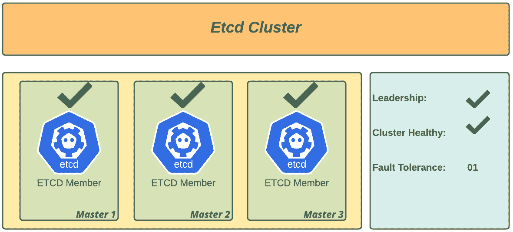
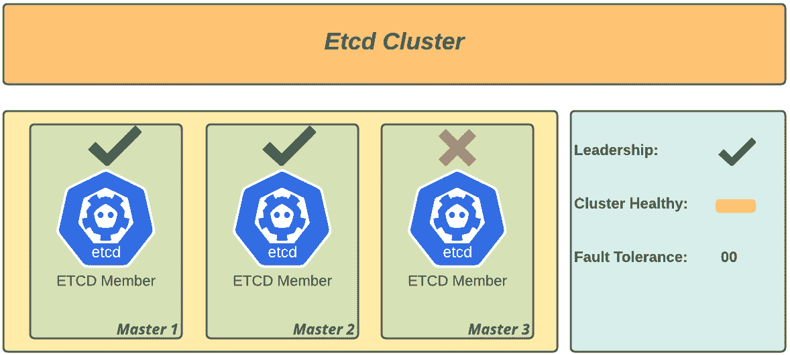
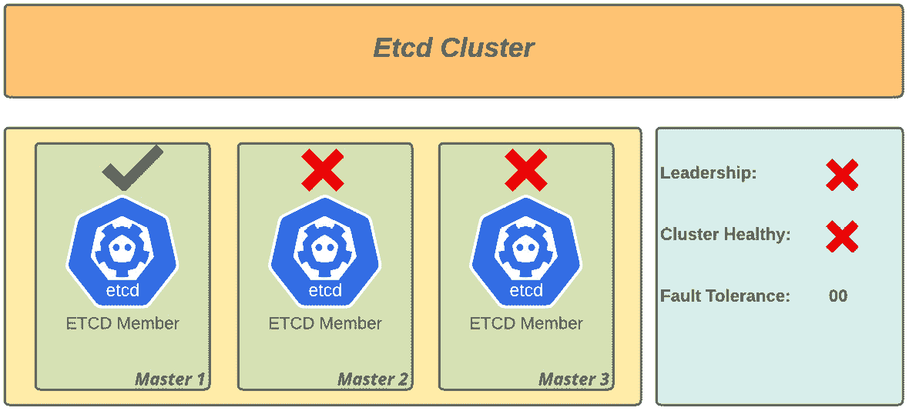
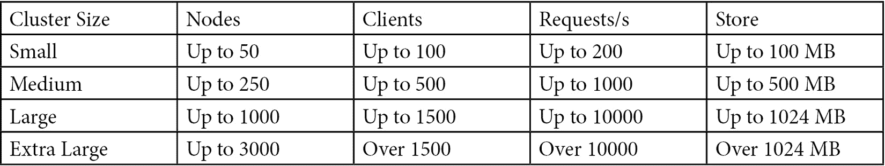
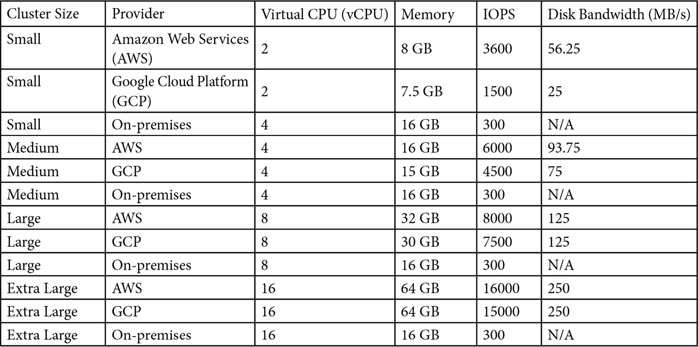
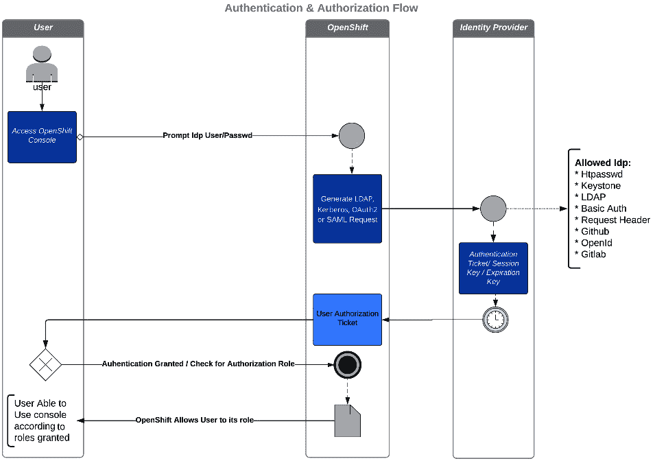
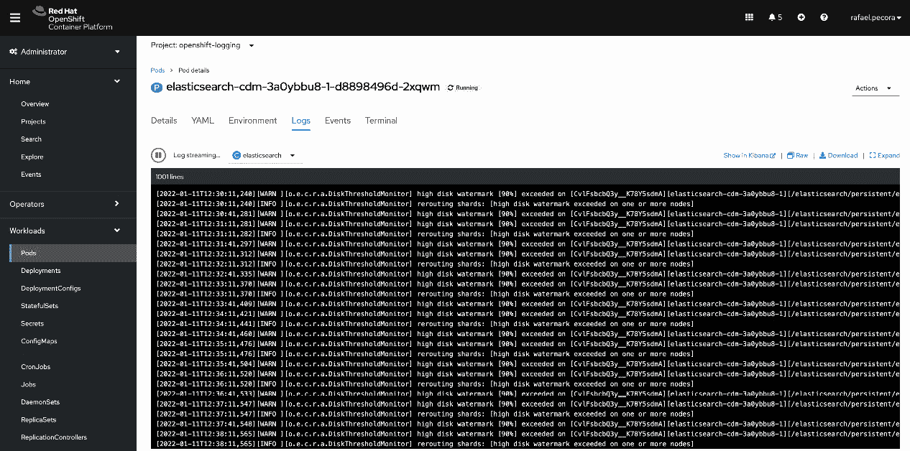

# 6

# OpenShift 故障排除、性能与最佳实践

*第五章*中解释的概念，*OpenShift 部署*，为你与 OpenShift 集群的首次接触提供了基础。在本章中，我们将给出一些如何执行集群健康检查的建议，深入分析一些**根本原因分析**（**RCA**），并提供一些让集群按照最佳实践运行的详细信息。我们在本章中的目的是为你提供一些关于故障排除的通用指导，但在进行任何更改之前，尤其是出于故障排除的目的，始终建议你向 Red Hat 提交支持票。

本章涵盖以下主题：

+   可能导致集群崩溃的因素

+   故障排除参考指南——如何开始

+   理解误导性的错误信息

注意

本章使用的源代码可以在[`github.com/PacktPublishing/OpenShift-Multi-Cluster-Management-Handbook/tree/main/chapter06`](https://github.com/PacktPublishing/OpenShift-Multi-Cluster-Management-Handbook/tree/main/chapter06)找到。

# 可能导致集群崩溃的因素

每当我们开始学习某项技术时，通常会特别小心安装、配置或调整，以尽可能做到全面。有时，为了实现这些与故障排除、性能和最佳实践相关的目标，读者可能会转向多篇专家文章，或者经历不断试错的痛苦，这需要付出大量的努力才能成功。

OpenShift 是一项伟大且颠覆性的技术，但你将会面对与存储、计算、网络等相关的各种复杂问题。显然，在官方文档中——或者甚至在快速的互联网搜索中——你会找到从零开始的命令，但在许多情况下，即使有了必要的命令和参数，仍然很难从故障排除到达解决方案。

目前，OpenShift 有一个自动恢复系统，但这通常不足以确保环境的稳定。为了让这种自我修复成功发生，必须首先检查集群中的许多前提条件。因此，在我们理解可能导致崩溃的因素之前，让我们先了解一下这种自我调整机制是如何工作的。

## 运维人员

在技术世界中，有许多角色，部分角色与基础设施的管理相关。这个角色有很多名称，最常见的仍然是**系统管理员**，或称**sysadmin**，他们负责操作**信息技术**（**IT**）基础设施中的服务器和服务。同样，OpenShift 也有*操作员*，他们其实就是**用于监控平台行为并维持操作的应用程序**。

操作员是如何工作的？操作员被指定来完成维护应用程序及其所有组件的单一任务，遵循一个标准。要理解的是，操作员对于所有应用程序并不相同——即，操作员是独特的，每个操作员都有其独特的参数定义、必需和可选配置等。

操作员参数的契约在**自定义资源定义**（**CRD**）中描述。CRD 是一种扩展 Kubernetes **应用程序编程接口**（**API**）功能的定义，它为集群提供了更多的灵活性，以便存储特定类型的对象集合。一旦定义了 CRD，你就可以创建一个**自定义资源**（**CR**），这将允许你将 Kubernetes 的自定义 API 添加到集群中。

操作员是保持集群或应用健康的工具，那么既然 OpenShift 可以自我修复，为什么我们还要关心 OpenShift 故障排除？的确，操作员是一个强大的工具，但正如我们之前提到的，OpenShift 是一个复杂的拼图，只有各个部分完美地拼接在一起，它才能正常工作。尽管它由准备好维护其完整性的操作员管理，但故障仍然可能发生，集群管理员的角色和他们解决问题的经验将有助于保持所有这些操作员的健康。

在接下来的章节中，我们将深入探讨 OpenShift 的主要组件以及需要关注的方面。

## etcd

在 OpenShift 集群中，etcd 是一个分布式键值服务，负责存储集群的状态。通过它，集群中包含的所有对象以键值格式展示，因此在这个服务中，作为控制平面操作核心的组件，有三个重要因素需要考虑。请注意以下几点：

+   etcd 对基础设施的**延迟**和**带宽***高度敏感*。

+   etcd 需要分布在所有主节点上——也就是说，要实现高可用，OpenShift 集群基础设施要求此服务分布在三个主节点上。

+   与许多**高可用**（**HA**）服务不同，在这些服务中你有一个主服务器和一个备用服务器，etcd 的概念是基于**法定人数**成员和**领导权**。

Red Hat 通过将主节点数量默认为`3`并使用一个管理 etcd 并报告其问题的集群操作员，使得 etcd 的复杂性变得更加简易；然而，若发生任何复杂问题，你仍然需要理解 etcd 的工作原理，以便进行故障排除。继续学习如何实现基于法定人数和领导者的 etcd 算法。

### 法定人数和基于领导者的方案是如何工作的？

Etcd 集群工作在**领导者**和**跟随者**的概念上，这被称为**Raft 分布式共识**协议。该协议实现了基于*领导者选举*的算法，以在整个 etcd 集群的所有成员之间建立分布式共识。一旦成员被添加到 etcd 集群并选出领导者，进程只需要定期发送心跳以确认领导者在合适的延迟时间内仍然响应。

如果在未答复的心跳时间范围内，成员开始新的选举以保证集群的弹性、自愈和服务的连续性。

建议 etcd 集群具有奇数节点数量，以便以下公式保证给定数量失败成员的容忍度。我们称之为**法定人数**：

*法定人数 = (n/2)+1，其中“n”表示成员数量。*

为了保持正常运行，集群必须始终至少具有*法定人数*的成员。为了明确起见，让我们查看一些场景，如下所示：

+   **场景 1**：三成员集群，全部运行中，如下图所示：



图 6.1 – 健康的 etcd 集群（三节点成员健康）

*分析*：法定人数是 OK 的，因为有大多数工作成员并确保领导权，所以集群是健康的。

+   **场景 2**：三成员集群中有两个成员工作，如下图所示：



图 6.2 – 健康的 etcd 集群（两节点成员健康；风险停机）

*分析*：法定人数是 OK 的，因为有大多数工作成员并确保领导权。如果再有一个节点中断，存在降级风险，但集群是健康的。

+   **场景 3**：三成员集群中有一个成员工作，如下图所示：



图 6.3 – 降级的 etcd 集群（一个节点成员健康；不健康的集群）

*分析*：由于大多数成员宕机，无法再选出新的领导者，集群降级。

### 故障排除 etcd

如前所述，OpenShift 由其运算符管理，这些运算符可以提供标准化、自愈和活动指标，但这并不总能保持集群完全功能。

由于与任何基础架构层相关的不同因素，可能会发生诸如场景 *2* 和 *3* 的情况。重要的是进行深入分析以将集群恢复到功能状态。以下是故障排除 etcd 的方法。

在故障排除时，重要的是考虑集群遇到的中断类型。如果我们仍然能够使用 OpenShift API 访问节点，则可以使用第一种方法。否则，如果 API 不可用，则必须参考第二种情境。

#### 情境 1 – etcd 成员降级

在仍然可以执行`oc`或`kubectl`命令的情况下，使用`rsh`命令进入 etcd pod，通过`etcdctl`执行以下步骤是最快的方式。

etcd 降级可能由多种原因引起，例如存储或网络故障、主节点的在线迁移，甚至是**操作系统**（**OS**）的操作，这些都可能导致集群的即时中断。

如前所述，运行以下命令打开 etcd pod 中的终端并识别故障：

```
$ oc project openshift-etcd
$ oc get pods -n openshift-etcd | grep -v etcd-quorum-guard | grep etcd
etcd-ocp-master-0 3/3 Pending 0 14m
etcd-ocp-master-1 3/3 CrashLoopBackOff 6 17m
etcd-ocp-master-3 2/3 Running 0 9m11s
```

注意，在之前的输出中，三台主节点中的两台出现了问题，所以我们需要`rsh`进入`master-3`，进行备份，并重新创建 etcd 节点，具体步骤如下：

```
oc rsh etcd-ocp-master-3
Defaulting container name to etcdctl.
Use 'oc describe pod/etcd-ocp-master-3 -n openshift-etcd' to see all of the containers in this pod.
sh-4.4# etcdctl member list -w table
+------+------+------+------+------+------+
| ID | STATUS | NAME | PEER ADDRS | CLIENT ADDRS | IS LEARNER +------+------+------+------+------+------+
| 5bdacda4e0f48d91 | failed | ocp-master-1 | https://192.168.200.235:2380 | https://192.168.200.235:2379 | false |
| b50b656cba1b0122 | started | ocp-master-3 | https://192.168.200.14:2380 | https://192.168.200.14:2379 | false |
| cdc9d2f71033600a | failed | ocp-master-0 | https://192.168.200.234:2380 | https://192.168.200.234:2379 | false |
+------+------+------+------+------+------+
sh-4.4# etcdctl endpoint status -w table
+------+------+------+------+------+------+
| ENDPOINT | ID | VERSION | DB SIZE | IS LEADER | IS LEARNER | RAFT TERM | RAFT INDEX | RAFT APPLIED INDEX | ERRORS |
+------+------+------+------+------+------+
| https://192.168.200.14:2379 | b50b656cba1b0122 | 3.4.9 | 136 MB | true | false | 281 | 133213554 | 133213554 | |
| https://192.168.200.234:2379 | cdc9d2f71033600a | 3.4.9 | 137 MB | false | false | 281 | 133213554 | 133213554 | |
| https://192.168.200.235:2379 | 5bdacda4e0f48d91 | 3.4.9 | 136 MB | false | false | 281 | 133213554 | 133213554 | |
+------+------+------+------+------+------+
```

一旦确定了故障成员的**标识符**（**IDs**），下一步是移除 etcd 成员，留下唯一运行并作为集群一部分的节点。为此，首先运行 etcd 的备份，如下所示：

```
/usr/local/bin/cluster-backup.sh /home/core/assets/backup
```

注意

etcd 备份将保存在与 etcd pod 所在节点相同的`core`用户的`home`目录中。强烈建议你将其复制到节点外的位置，以避免丢失访问节点的风险，从而丢失 etcd 备份文件并使集群恢复处于风险中。

现在你已经识别出 etcd 集群的问题，接下来查看建议的步骤来恢复你的集群。

#### 如何解决这个问题？

以前，在 OpenShift 3 版本中，解决这两种情况的常见方法是通过备份重新建立 etcd 集群。现在，在 OpenShift 4 中，您可以更轻松地在基础设施中配置新的主节点。也就是说，如果你的问题属于第一种情况（API 仍然可用）并且你的安装是**安装程序配置基础设施**（**IPI**）方法，我们建议你采取以下步骤，使用新的节点名称重新创建有问题的主节点：

1.  通过运行以下命令获取当前主节点的**YAML Ain’t Markup Language**（**YAML**）机器描述符：

    ```
    oc get machine <master-node> \
        -n openshift-machine-api \
        -o yaml \
        > new-master-machine.yaml
    ```

1.  YAML 文件应如下所示：

    ```
    new-master-machine.yaml
    apiVersion: machine.openshift.io/v1beta1
    kind: Machine
    metadata:
      finalizers:
      - machine.machine.openshift.io
      labels:
        machine.openshift.io/cluster-api-cluster: ocp-sgw5f
    (.. omitted ..)
      name: ocp-master-4
      namespace: openshift-machine-api
      selfLink: /apis/machine.openshift.io/v1beta1/namespaces/openshift-machine-api/machines/ocp-master-4
    spec:
      metadata: {}
      providerSpec:
        value:
          apiVersion: vsphereprovider.openshift.io/v1beta1
          credentialsSecret:
            name: vsphere-cloud-credentials
          diskGiB: 120
          kind: VSphereMachineProviderSpec
    (.. omitted ..)
    ```

1.  在 YAML 文件中进行必要的更改以配置新的主节点，如下所示：

    1.  移除以下部分或字段：

    1.  整个`status`、`metadata.annotations`和`metadata.generation`部分。

    1.  删除`metadata.resourceVersion`、`metadata.uid`和`spec.providerId`字段。

    II. 将`metadata.name`字段更改为新名称（例如，`<clustername>-<clusterid>-master-3`）。

    1.  还需要更新`metadata.selfLink`字段中的节点名称。

1.  使用以下命令删除有问题的主节点：

    ```
    $ oc delete machine <problematic-master-node-name> -n openshift-machine-api
    ```

1.  使用以下命令来监控删除过程并确认已删除：

    ```
    $ oc get machines -n openshift-machine-api -o wide
    ```

1.  一旦有问题的主节点被删除，你现在可以使用我们之前准备好的 YAML 文件配置一个新的主节点。为此，运行以下命令：

    ```
    oc apply –f new-master-machine.yaml
    ```

注意

如有必要，重复此过程，仅更改`metadata.name`和`metadata.selfLink`字段，以应对集群中每个有问题的主节点。

在新的主节点配置完成后，观察以下步骤以验证 etcd 集群是否健康：

1.  检查所有 etcd Pod 是否正在运行，具体如下。你必须看到三个 Pod 在运行：

    ```
    $ oc get pods -n openshift-etcd | grep -v etcd-quorum-guard | grep etcd
    ```

1.  有些情况下，etcd Pod 不会在主节点配置时自动部署。如果你没有看到三个 Pod 在运行，你可以运行以下命令强制 etcd 操作员在新节点中部署 etcd Pod：

    ```
    $ oc patch etcd cluster -p='{"spec": {"forceRedeploymentReason": "recovery-'"$( date --rfc-3339=ns )"'"}}' --type=merge
    ```

1.  现在，让我们从 etcd 集群内部检查它是否按预期工作。为此，运行以下命令在其中一个 etcd Pod 内打开终端：

    ```
    # Get the name of one etcd pod
    $ oc get pods -n openshift-etcd | grep -v etcd-quorum-guard | grep etcd
    $ oc rsh <etcd-pod-name> -n openshift-etcd
    ```

1.  现在，检查集群成员列表，如下所示：

    ```
    etcdctl member list -w table
    ```

1.  在某些情况下，你仍然会看到我们已经移除的有问题的 etcd 节点作为集群成员。因此，如果前一个命令显示成员超过三个，请使用以下命令移除不正常的 etcd 成员：

    ```
    $ etcdctl remove <member-id>
    ```

#### 场景 2 - 集群 API 故障

如果 OpenShift API 故障，执行任何操作时需要更加谨慎，以避免对集群造成不可逆的损失。在这种情况下，你无法使用`rsh`命令，无法通过`oc logs`获取日志，也无法使用任何`oc`或`kubectl`命令，因为这些命令都依赖于 OpenShift API，这使得故障排除和找到解决方案变得更加困难和复杂。

因此，必须在集群发生故障之前定期进行 etcd 备份。如果没有之前的备份，第一步是对正在运行的节点进行直接备份。为此，请按以下步骤操作：

+   运行以下命令：

    ```
    $ ssh -i ~/.ssh/id_rsa core@ocp-master-3
    ```

+   通过运行`crictl`命令检查 etcd 状态，如下所示：

    ```
    $ sudo crictl | grep –i etcd
    ```

+   获取 etcd Pod ID，运行`crictl exec`命令以识别集群节点的状态，具体如下：

    ```
    $ crictl exec bd077a3f1b211 etcdctl member list -w table
    +---+---+---+---+---+---+
    | ID | STATUS | NAME | PEER ADDRS | CLIENT ADDRS | IS LEARNER |
    +---+---+---+---+---+---+
    | 9e715067705c0f7c | unknown | ocp-master-4 | https://192.168.200.15:2380 | https://192.168.200.15:2379 | false |
    | b50b656cba1b0122 | started | ocp-master-3 | https://192.168.200.14:2380 | https://192.168.200.14:2379 | false |
    | cdc9d2f71033600a | failed  | ocp-master-0 | https://192.168.200.234:2380 | https://192.168.200.234:2379 | false |
    +---+---+---+---+---+---+
    ```

+   注意，etcd 成员不可达，除了一个处于启动状态的成员。通过前往该节点并运行备份命令，进行备份，具体如下：

    ```
    sudo /usr/local/bin/cluster-backup.sh /home/core/assets/backup
    ```

+   使用`crictl`获取 etcd 的 Pod ID，运行以下命令以识别集群节点及其状态：

    ```
    $ crictl exec bd077a3f1b211 etcdctl endpoint status -w table
    +-------+-------+-------+-------+-------+-------+
    | ENDPOINT | ID | VERSION | DB SIZE | IS LEADER | IS LEARNER | RAFT TERM | RAFT INDEX | RAFT APPLIED INDEX | ERRORS |
    +-------+-------+-------+-------+-------+-------+
    | https://192.168.200.14:2379 | b50b656cba1b0122 | 3.4.9 | 136 MB | true | false | 491 | 133275501 | 133275501 | |
    | https://192.168.200.15:2379 | 9e715067705c0f7c | 3.4.9 | 137 MB | false| false | 491 | 133275501 | 133275501 | |
    +-------+-------+-------+-------+-------+-------+
    ```

在此阶段，可以得出一些结论。我们理解保持集群运行不需要最低法定人数，因此 API 变得不可用。接下来，请继续查看如何在这种情况下进行操作的建议。

#### 如何解决？

一般来说，在这种情况下，要恢复集群，你将使用命令`etcdctl member remove`来移除所有有问题的 etcd 成员，然后按照我们在之前的*如何解决？*部分中描述的步骤移除有问题的主节点并配置新的节点。然而，故障排除集群在这种情况下要更具挑战性，建议与 Red Hat 支持团队合作，找到恢复的最佳方法。

既然我们已经讨论了 etcd 故障排除，现在让我们讨论它的另一个重要方面：性能分析。

### etcd 性能分析

Kubernetes 集群对延迟和吞吐量非常敏感。因此，必须采取一些预防措施，以确保集群稳定并提供优异的性能。OpenShift 是一个为高可用性（HA）设计的平台，因此，etcd 的使用和消耗是流量密集型的。因此，遵循一些最佳实践以保持集群的稳定非常重要。让我们来看一些推荐的配置。

#### 存储

etcd 的磁盘使用非常密集，因此建议使用**固态硬盘**（**SSD**）来实现快速的读/写响应时间。关于响应时间，我们可以说 50 次顺序**输入/输出操作每秒**（**IOPS**）是最低要求，但根据我们的经验，OpenShift 的使用会非常快速地增长，因此建议考虑能够提供至少 500 个并发 IOPS 的磁盘，以维持集群的健康和稳定。然而，请注意，某些提供商不发布顺序 IOPS 值，只发布共享 IOPS。在这种情况下，可以认为并发 IOPS 值等于顺序 IOPS 值的 10 倍。

这是一个如何使用定制版`fio`工具测量 etcd 磁盘性能的示例。在 OpenShift 集群中，运行`debug`命令来访问主节点，如下所示：

```
$ oc debug node/master1.ocp.hybridcloud.com
```

一旦命令执行完毕，以下信息将会显示。在 shell 之后执行`chroot`命令，以便在特权模式下执行命令：

```
Starting pod/ocp-master1hybridcloud-debug ...
 To use host binaries, run `chroot /host`
 chroot /host
Pod IP: 172.19.10.4
 If you don't see a command prompt, try pressing enter.
 sh-4.4# chroot /host
 sh-4.4#
```

创建一个容器，如下方代码片段所示。启动`etcd-perf`容器后，它将自动运行性能检查：

```
sh-4.4# podman run --volume /var/lib/etcd:/var/lib/etcd:Z quay.io/openshift-scale/etcd-perf Trying to pull quay.io/openshift-scale/etcd-perf:latest...
Getting image source signatures
(.. omitted ..)
------- Running fio ------{
"fio version" : "fio-3.7",
"timestamp" : 1631814461,
"timestamp_ms" : 1631814461780,
"time" : "Thu Sep 16 17:47:41 2021",
"global options" : {
"rw" : "write",
 "ioengine" : "sync",
"fdatasync" : "1",
 "directory" : "/var/lib/etcd",
"size" : "22m", [1]
"bs" : "2300" }, [2]
(.. omitted ..)
"write" : {
"io_bytes" : 23066700,
"io_kbytes" : 22526,
"bw_bytes" : 1319077,
"bw" : 1288, [3]
"iops" : 573.511752, [4]
(.. omitted ..)
"read_ticks" : 3309,
"write_ticks" : 29285,
"in_queue" : 32594,
"util" : 98.318751
} ]
}
---------
99th percentile of fsync is 5406720 ns
99th percentile of the fsync is within the recommended threshold - 10 ms, the disk can be used to host etcd [5]
```

在前面的代码片段中，我们使用了以下注释：

**[1]**: 22 **兆字节**（**MB**）的块大小通常足以分析性能结果。

**[2]**: 与使用 4k 块大小不同，etcd 使用小块的 2.3k 块大小，因此它能够保证性能，包括处理小的写入碎片。

**[3]**: 考虑到节点与底层存储之间的流量，所需的带宽。建议至少使用 1 **千兆字节**（**GB**）的网络接口。对于中型和大型集群，推荐使用 10 GB 的接口。

**[4]**: 推荐至少 500 个并发 IOPS，如前所述。

**[5]**：etcd IO 检查报告。在示例中，5.40 **毫秒**（**ms**）展示了可靠的性能——为了达到此标准，必须低于 10 毫秒。

除了使用`etcd-perf`检查磁盘性能外，您还可以根据需要完美地使用自定义参数，如块大小、块段大小等，使用`fio`二进制工具，该工具可通过标准的 Red Hat 包管理器获取（例如，执行 `yum/dnf install fio`）。

注释

出于教学目的，我们省略了一些结果，只保留了与我们分析相关的项。

#### etcd 规模化

为了避免与**中央处理单元**（**CPU**）相关的任何问题，您必须了解您的集群是否经过了良好的规模化。您需要考虑一些因素来检查集群规模化情况，如使用平台的客户数量、每秒请求的预期数量，以及为 etcd 提供的存储量。

首先，让我们为您的集群大小提供一些需要考虑的参数：



下表展示了根据集群大小关联的 CPU、内存、磁盘 IOPS 和带宽等参数，使用公共云和本地基础设施的一些用例：



总而言之，当您为集群进行规模化时，应该考虑这些阈值，因为这已由 etcd 社区进行了基准测试，如果遵循这些建议，它们的性能可能会是可接受的。关于 etcd 集群规模化的进一步信息，可以在本章的 *进一步阅读* 部分提供的链接中找到。

在这一部分，您已经看到了一些检查 etcd 性能和故障排除的方法，同时也获得了一些关于规模化最佳实践的重要信息。我们希望您喜欢这种方法，并且仔细查看接下来关于身份验证的部分，这将是另一个有趣的主题。

## 身份验证

OpenShift 集群的另一个重要方面是用户身份验证和授权流程。OpenShift 的灵活性和易用的身份验证插件是设置用户和组的智能方式。OpenShift 的身份验证服务可以通过多种方式验证用户——我们称之为**身份提供者**（**IdP**）。通过这种方式，OpenShift 负责信任 IdP，并根据提供者来允许或拒绝身份验证。在下图中，您可以看到验证用户的过程是如何工作的：



图 6.4 – 身份验证和授权流程

IdP 负责通知 OpenShift 用户名和密码是否有效，并将`成功`或`失败`的身份验证状态返回给 OpenShift。这个过程被称为**身份验证**（在一些文献中称为**AuthN**）。

我们提到过，身份验证过程使用 IdP 来验证用户与身份验证提供者的匹配，但更重要的是，你需要理解**授权**（也称为**AuthZ**）是如何发生的。最初，OpenShift 上的用户在任何项目中都没有任何权限；然而，他们可以登录。除非集群启用了自我创建者角色，否则他们无法执行任何任务，只能创建自己的新项目（自我创建者是一种允许任何已登录用户创建自己项目的角色）。要为用户添加权限，需要指派适当的角色。这可以通过将用户添加到用户组或直接分配给用户来实现。将角色分配给用户或组的过程被称为**RoleBindings**。

为了更好地了解哪个角色最适合某个用户或组，可以查看在 OpenShift 集群中已存在的默认角色，如下所示：

+   `admin`—这是一个项目管理员角色。它允许对所有项目范围内的资源进行修改，包括使用 ClusterRoles 创建 RoleBindings 的能力。它不允许修改配额、限制或集群资源。

+   `edit`—这是一个项目编辑器。它允许使用和操作所有项目范围内的资源，但不能更改授权对象。

+   `view`—这是一个项目查看器。它允许查看项目范围内的资源，类似于只读的 RoleBinding。禁止查看秘密信息。

+   `cluster-admin`—这是类 Unix 操作系统中的 root 用户的等价物。它允许对整个集群中的任何资源进行完全控制。

+   `cluster-reader`—这个角色对特别用户特别有用，尤其是那些负责集群监控的用户。该 RoleBinding 是只读的，不允许用户提升权限或操纵集群中的对象。

你还需要理解 RoleBinding 的作用范围，它可以是以下之一：

+   将`edit`角色分配给项目*Z*中的用户*X*。创建本地 RoleBindings 就像运行以下命令一样简单：

    ```
    $ oc adm policy add-role-to-user <role> <user> -n <project>
    ```

+   将`cluster-admin`角色分配给用户*X*。要创建一个集群 RoleBinding，可以运行以下命令：

    ```
    $ oc adm policy add-cluster-role-to-user <role> <user>
    ```

相似的命令也可以应用于组，只需将`user`替换为`group`（例如，`add-role-to-group`和`add-cluster-role-to-group`）。同样，要从用户或组中删除角色，使用`remove-role-from-user/group`，如下所示：

```
$ oc adm policy remove-role-from-user <role> <user> -n <project>
$ oc adm policy remove-role-from-group <role> <group> -n <project>
$ oc adm policy remove-cluster-role-from-user <role> <user>
$ oc adm policy remove-cluster-role-from-group <role> <group>
```

这些是与 OpenShift 一起使用的最常见的默认角色，但如果需要，你可以创建自定义角色。要创建自定义角色，你需要首先了解什么是**动词**和**资源**，以下是这些术语的定义：

+   `get`、`list`、`create`、`update`等。

+   `pod`、`deployment`、`service`、`secret`等。

也就是说，要定义自定义角色，你需要知道哪些动词可以让用户或组在哪些对象上执行。定义了动词和资源后，可以使用以下命令创建角色：

```
$ oc create role <role-name> --verb=<verbs-list> --resource=<resources-list>
```

看一下以下示例：

```
$ oc create role sample --verb=get,list,watch --resource=pods,pods/status
```

关于 OpenShift 的认证和授权，还有许多内容我们这里不打算详细介绍。我们尝试突出一些你需要了解的重要方面，并在本章的*进一步阅读*部分留下了一些链接，如果你希望更深入地了解这个话题，可以查阅。

通过这个步骤，我们已经稍微揭开了认证过程的神秘面纱，现在你可以执行**AuthN**和**AuthZ**的过程。前面的图表展示了认证过程步骤的一个简要视角。为每个用户或用户组授予适当的权限非常重要，而更重要的是要规划你需要为用户和用户组分配的角色，以便赋予他们执行工作所需的适当权限。在接下来的部分中，我们将讨论 OpenShift 运维人员需要了解的另一个重要方面：故障排除。

# 故障排除参考指南 – 如何开始

在本节中，你将看到一些故障排除 OpenShift 集群的方法，如果你遇到任何问题。由于`oc` **命令行界面**（**CLI**）的强大功能，你将有多种方式来解决几乎所有的 OpenShift 集群故障排除场景。通过培训，你将积累经验，进一步提高使用和故障排除 OpenShift/Kubernetes 集群的能力。

## 描述对象

正如我们提到的，`oc` CLI 是一个强大的工具，可以帮助 OpenShift 用户进行多种操作，并且进行故障排除。故障排除的第一步之一是获取对象的详细信息和描述。假设你遇到了一个与 Pod 相关的问题，原因是 Pod 未能启动。让我们通过检查 Pod 的详细信息来开始我们的故障排除，具体操作如下：

```
$ oc describe pod sso-10-qm2hc
```

检查对象的`Events`部分输出，看看是什么阻止了 Pod 启动，如下代码片段所示：

```
Events:
  Type     Reason          Age                From               Message
  ----     ------          ----               ----               -------
  Normal   Scheduled       90s                default-scheduler  Successfully assigned rhsso/sso-10-qm2hc to ocp-hml4.hybridcloud.com
  Normal   AddedInterface  89s                multus             Add eth0 [10.242.22.12/23] from openshift-sdn
  Normal   Pulling         39s (x3 over 89s)  kubelet            Pulling image "image-registry.openshift-image-registry.svc:5000/rhsso/sso74-custom"
  Warning  Failed          33s (x3 over 83s)  kubelet            Failed to pull image "image-registry.openshift-image-registry.svc:5000/rhsso/sso74-custom": rpc error: code = Unknown desc = pinging container registry image-registry.openshift-image-registry.svc:5000: Get "https://image-registry.openshift-image-registry.svc:5000/v2/": dial tcp 10.244.109.169:5000: connect: no route to host
  Warning  Failed          33s (x3 over 83s)  kubelet            Error: ErrImagePull
  Normal   BackOff         8s (x4 over 83s)   kubelet            Back-off pulling image "image-registry.openshift-image-registry.svc:5000/rhsso/sso74-custom"
  Warning  Failed          8s (x4 over 83s)   kubelet            Error: ImagePullBackOff
```

在这种情况下，你可以通过`oc describe`命令快速查看到错误与节点和镜像注册表之间的连接有关（`no route to host`）。你可以相应地采取行动来修复连接问题，使 Pod 顺利启动。你还可以使用`Events`日志查看其他有意义的信息，正如接下来你将看到的那样。

## 事件

`oc` CLI 中另一个帮助问题排查的参数是`oc get events`命令。这个命令非常有用，可以展示最近执行的任务日志，同时呈现*成功*或*错误*信息。事件可以在整个集群或项目范围内执行。查看以下事件日志示例：

```
$ oc get events -n openshift-image-registry
LAST SEEN   TYPE      REASON              OBJECT                                                  MESSAGE
35m         Normal    Scheduled           pod/cluster-image-registry-operator-7456697c64-88hxc    Successfully assigned openshift-image-registry/cluster-image-registry-operator-7456697c64-88hxc to ocp-master2.hybridcloud.com
35m         Normal    AddedInterface      pod/cluster-image-registry-operator-7456697c64-88hxc    Add eth0 [10.242.0.37/23] from openshift-sdn
35m         Normal    Pulled              pod/cluster-image-registry-operator-7456697c64-88hxc    Container image "quay.io/openshift-release-dev/ocp-v4.0-art-dev@sha256:6a78c524aab5bc95c671811b2c76d59a6c2d394c8f9ba3f2a92bc05a780c783a" already present on machine
(...omitted...)
```

如果 Pod 已启动并运行，但你在应用程序中仍然遇到问题，你也可以使用 OpenShift 检查应用程序日志，接下来你将看到如何操作。

## Pod 日志

通常，Pod 日志提供与调度程序、Pod 亲和性/反亲和性、容器镜像和持久卷相关的重要信息。这里列出了几种检查 Pod 日志的方法：

+   常见方式——在命名空间内——如下所示：

    ```
    $ oc project mynamespace
    $ oc logs mypod
    ```

+   这是如何从任何命名空间中检查它们的方法：

    ```
    $ oc –n mynamespace logs mypod
    ```

+   这是检查 Pod 中某个特定容器日志的方法：

    ```
    $ oc -n mynamespace logs mypod -c kube_proxy
    ```

+   你还可以使用 OpenShift 控制台的`Logs`选项卡检查日志，选择所需的命名空间和 Pod，示例如下截图：



图 6.5 – Pod 日志示例（OpenShift 控制台图形用户界面（GUI））

在应用程序部署过程中，你也可能遇到问题。接下来，请查看你可以检查哪些内容以发现部署问题的证据。

## 部署日志

在某些情况下，Pod 无法启动并持续处于崩溃状态，这使得获取日志变得困难。在这种情况下，你可以检查`deployment`或`deploymentconfig`日志，这有助于你识别部署配置错误。

与 Pod 日志类似，`deployment`日志可以通过运行`oc logs`命令访问。对于`deployment`日志，运行以下命令：

```
$ oc –n mynamespace logs deployment/mydeploypods
```

对于`deploymentconfigs`日志，请使用以下命令：

```
$ oc –n  mynamespace logs dc/mydeploypods
```

通常，你不会找到确切的问题或根本原因和解决方案，但它会给你一个关于失败原因的良好指示——例如，缺失的依赖组件，如不可用的镜像；具有不正确权限的安全上下文约束；缺失的 configmaps、secrets 和 serviceaccounts 等。

另一种有用的故障排除方法是使用带有临时根权限的`debug`命令。有关更多信息，请参阅以下部分。

## 调试 Pods

另一个有趣的工具，用于排查持续崩溃的 Pod，可以通过执行`oc debug deployment`或`oc debug deploymentconfig`命令来使用。通过这个命令，你可以指示 OpenShift 在 Pod 崩溃时不要失败并重启它。Pod 将继续运行，你可以检查日志、访问 Pod 并在容器内部进行故障排除。要使用这个工具，请运行以下命令：

```
$ oc debug deployment/<deployment-name>
```

注意

`oc debug`命令提供了一些有趣的选项，例如使用`--as-user`以指定用户身份运行 Pod。要查看允许的参数和示例的完整列表，请运行`oc debug -h`命令。

## 操作符日志

正如我们在本书中已经提到的，OpenShift 使用多个操作符来部署和监控平台的关键功能。也就是说，操作符会提供有用的日志，以帮助识别配置问题和平台不稳定性。这些日志存储在以`openshift-*`开头的命名空间中，这是 OpenShift 中大多数工具的标准做法。

维护多个运维者 pod 作为项目 pod 的一部分，原因与用户可以应用于集群的某些亲和性/反亲和性规则以及污点/容忍策略有关。运维者 pod 是监视器，负责维持命名空间的健康，观察 CRD 及其标准、存活性和就绪性，防止 OpenShift 的关键命名空间受到不良变化的影响。

运维者为集群稳定性带来的主要好处之一是能够维护运维者命名空间对象的期望状态。换句话说，如果直接对命名空间的对象做出任何不希望发生的更改，它们将被运维者本身恢复。运维者的对象的每次更改都必须通过运维者本身进行，方法是编辑 ConfigMaps 或 CR 对象，按照运维者的规范进行。这也意味着，在这些更改被实际应用之前，它们会被运维者检查并确认。

要检查集群运维者的功能，你必须执行以下操作：

1.  列出集群运维者，如下所示：

    ```
    $ oc get co
    ```

1.  描述集群运维者的详细信息，如下所示：

    ```
    $ oc describe co <clusteroperatorName>
    ```

这是一个示例：

```
$ oc describe co storage
```

1.  检查状态输出中的错误信息（如果存在），如下所示：

    ```
    (...omitted...)
    Status:
      Conditions:
        Last Transition Time:  2021-08-26T14:51:59Z
        Message:               All is well
        Reason:                AsExpected
        Status:                False
        Type:                  Degraded
        Last Transition Time:  2021-08-26T14:51:59Z
        Message:               All is well
        Reason:                AsExpected
        Status:                False
        Type:                  Progressing
        Last Transition Time:  2021-08-26T14:51:59Z
        Message:               DefaultStorageClassControllerAvailable: No default StorageClass for this platform
        Reason:                AsExpected
        Status:                True
        Type:                  Available
        Last Transition Time:  2021-08-26T14:52:00Z
        Message:               All is well
        Reason:                AsExpected
        Status:                True
        Type:                  Upgradeable
    (...ommitted...)
    ```

在之前的示例中，仅显示了关于为集群设置默认存储类的警告信息。存储方面没有发现严重问题。如有问题，请查看运维人员命名空间中的事件和 pod 日志。

## 其他 oc CLI 命令和选项：

`oc` CLI 还有一些其他强大的命令用于故障排除。以下是一些有用且强大的故障排除命令：

+   这是一个用于高详细日志的示例命令：

    ```
    $ oc –n <namespaceName> logs <podName> -v 8
    ```

+   这是一个用于集群事件的例子：

    ```
    $ oc get events
    ```

+   这里，你可以看到一个关于命名空间事件的示例命令：

    ```
    $ oc –n <namespaceName> get events
    ```

+   以下是在 pod 中执行单个命令的方式（需要双破折号）：

    ```
    $ oc exec mypod -- date
    ```

+   以下是在特定容器中执行单个命令的方式（需要双破折号）：

    ```
    $ oc exec mypod -c httpd-container -- date
    ```

+   创建迭代命令以生成伪终端，如下所示：

    ```
    $ oc exec mypod -i -t -- ls -t /usr
    ```

+   类似于`exec`命令，`rsh`—如这里所示—在 pod 内打开一个终端：

    ```
    $ oc -n <namespaceName> rsh  <podName>
    ```

所有前述命令都可以帮助你识别集群或甚至应用程序中的问题。此外，你还可以使用`oc debug`命令直接检查节点，如下所示：

```
$ oc debug node/<nodeName>
```

`oc debug`命令为你提供了非根用户权限访问，且在没有提升权限的情况下，你无法运行许多操作系统命令。为此，我们建议你运行`chroot`命令，如下所示。之后，你可以正常使用操作系统的 shell 命令：

```
$ chroot /host /bin/bash
```

正如你所看到的，OpenShift 有许多有用的调试命令，可以帮助你识别集群范围或特定范围的问题。虽然不推荐，但也可以直接通过`ssh`连接到节点。这种方式需要对*Red Hat CoreOS*操作系统、`podman`和`crio`有很好的了解，以避免节点中断。

在任何情况下，我们还建议你向 Red Hat 提交支持票，Red Hat 将为你提供指导，帮助你解决问题。Red Hat 支持团队通常会要求提供 `must-gather` 命令的结果，该命令会生成一个临时 pod，并将有意义的日志和配置串联起来，供 Red Hat 工程团队分析、关联事件，并找出问题或根本原因。

运行 `must-gather` 的最常见方法如下所示：

```
$ oc adm must-gather --dest-dir=/local/directory
```

这将在选定目录下创建一个 `tar` 文件，包含所有收集的日志，这对于识别问题非常有用。我们建议你在打开支持票时始终运行此命令并上传它，以加快问题分析的过程。

在本节中，你看到了不同的调试方法，它们肯定会在日常生活中对你有所帮助。在下一节中，你将看到 pod 启动时最常见的错误消息，通过这些信息，你将能够形成自己的推理方法，帮助你解决问题。

# 理解误导性错误信息

即使你已经学会了识别问题的不同方式，错误信息有时也不足以帮助你定位问题并修复它。考虑到这一点，我们决定在本节中突出一些非常常见的错误消息，并提供一些解决问题的建议。

## ImagePullBackOff

这是一个常见的与缺失容器镜像相关的错误。查看以下代码行，了解当你遇到这种问题时如何处理：

```
NAMESPACE   NAME READY STATUS RESTARTS AGE
namespace1  backend-tfmqm 0/1 ImagePullBackOff 0 17h
```

这是你在调查 pod 日志时可能出现的消息：

```
$ oc -n namespace1 logs backend-tfmqm
Error from server (BadRequest): container " backend" in pod " backend-tfmqm" is waiting to start: trying and failing to pull image
```

从错误消息来看，它通常与镜像在镜像库中缺失有关。这可能是由于一些问题导致的，例如镜像及其标签在镜像库中不可用，或者在**部署/部署配置**中指向不正确。另一种可能是 pod 运行的节点无法访问镜像库。

## CrashLoopBackOff

这是一个需要一定知识才能有效解决的错误。它发生是因为应用程序不断崩溃，因此根本原因可能有多个不同的原因。你可以在这里看到一个示例：

```
NAMESPACE NAME READY STATUS RESTARTS AGE
3scale backend-redis-1-9qs2q 0/1 CrashLoopBackOff 211 17h
```

这是你在调查 pod 日志时可能看到的消息：

```
$ oc logs backend-redis-1-9qs2q
1:M 11 Jan 13:02:19.042 # Bad file format reading the append only file: make a backup of your AOF file, then use ./redis-check-aof --fix <filename>
```

日志通常会给出一些有关问题根本原因的提示，但它也可能是一个陷阱，引导你得出错误的结论。需要考虑的是，当一个 pod 拥有持久卷，或者它有一个依赖于其他应用程序先启动并准备持久卷的优先顺序时，以及许多其他可能导致此错误的不同场景。

## Init:0/1

当您收到`Init:0/1`错误消息时，通常意味着 Pod 正在等待另一个 Pod 或尚未满足的条件。以下代码行演示了可能导致此消息的条件，并说明如何解决：

```
NAMESPACE NAME READY STATUS RESTARTS AGE
3scale backend-cron-1-zmnpj 0/1 Init:0/1 0 17h
```

这是您在调查 Pod 日志时可能看到的一条消息：

```
$ oc logs backend-cron-1-zmnpj
Error from server (BadRequest): container "backend-cron" in pod "backend-cron-1-zmnpj" is waiting to start: PodInitializing
```

这是一个可能会让您在故障排除错误消息时感到困惑的状态。显然，它可能是命名空间中的某些问题，因此错误消息仅显示`PodInitializing`。您可以将其解读为 Pod 正在等待启动的条件；然而，这条消息意味着某个条件未得到满足。

为了帮助您，我们在这里列出了一些必须检查的项，这些项可能会阻止 Pod 启动：

+   检查 Pod 中使用的服务帐户是否存在于命名空间中，因为某些容器需要特定的服务帐户名称和策略才能启动。

+   检查**安全上下文约束**（**SCCs**），确保这些设置符合 Pod 所需的权限。

+   检查命名空间中的其他容器和 Pod：根据构建策略，可以定义 Pod 之间的依赖关系。

如果您还不熟悉 SCC，请不要担心。我们将在*第八章*中深入讲解，*OpenShift 安全性*。

# 总结

本章重点介绍了 OpenShift 的重要组件，如操作员及其在维护集群韧性中的作用，我们还讨论了可能对集群造成损害的情况。

我们已经深入探讨了 OpenShift 的核心部分，即其分布式数据库（称为 etcd），了解了它在集群中的重要性，以及如何准备它以接收大量流量，还验证了其大小和性能，并了解了在某些情况下如何进行故障排除。

我们还讨论了 AuthN 和 AuthZ 过程的一些内容，现在您已经了解了 OpenShift IDP 的强大和灵活性。最后，我们看到了几个重要的故障排除技巧和工具，它们肯定会帮助您在日常工作中操作 OpenShift 集群和应用程序。

在下一章中，我们将介绍关于 OpenShift 网络的其他重要信息。我们将讨论并举例说明 Pod 网络和服务网络之间的主要区别，以及了解南北流量（North-South）和东西流量（East-West）的区别。请继续关注我们这篇有趣的文章，并在*第七章*中了解更多内容，*OpenShift 网络*。

# 进一步阅读

如果您想查看更多关于本章内容的信息，可以查阅以下参考资料：

+   *Red Hat 知识库——etcd 推荐*：[`access.redhat.com/solutions/4770281`](https://access.redhat.com/solutions/4770281)

+   *etcd 委员会模型*：[`etcd.io/docs/v3.5/faq/`](https://etcd.io/docs/v3.5/faq/)

+   *理解 etcd 的仲裁机制*: [`thesecretlivesofdata.com/raft/`](http://thesecretlivesofdata.com/raft/)

+   *etcd 硬件规格建议*: [`etcd.io/docs/v3.5/op-guide/hardware/`](https://etcd.io/docs/v3.5/op-guide/hardware/)

+   *etcd 调优选项*: [`etcd.io/docs/v3.5/tuning/`](https://etcd.io/docs/v3.5/tuning/)

+   *etcd 基准测试阈值*: [`etcd.io/docs/v3.5/benchmarks/`](https://etcd.io/docs/v3.5/benchmarks/)

+   *etcd 基准测试 CLI 工具*: [`etcd.io/docs/v3.5/op-guide/performance/#benchmarks`](https://etcd.io/docs/v3.5/op-guide/performance/#benchmarks)

+   *Kubernetes 身份验证流程*: [`kubernetes.io/docs/reference/access-authn-authz/authentication/`](https://kubernetes.io/docs/reference/access-authn-authz/authentication/)

+   *Openshift 身份提供者（IDP）*: [`docs.openshift.com/container-platform/4.7/authentication/understanding-identity-provider.html`](https://docs.openshift.com/container-platform/4.7/authentication/understanding-identity-provider.html)

+   *了解更多关于 SCC 的信息*: [`docs.openshift.com/container-platform/4.8/authentication/managing-security-context-constraints.html`](https://docs.openshift.com/container-platform/4.8/authentication/managing-security-context-constraints.html)

+   *更多关于故障排除的信息*: [`docs.openshift.com/container-platform/4.7/support/troubleshooting/investigating-pod-issues.html`](https://docs.openshift.com/container-platform/4.7/support/troubleshooting/investigating-pod-issues.html)

+   *推荐的 etcd 实践*: [`docs.openshift.com/container-platform/4.10/scalability_and_performance/recommended-host-practices.html#recommended-etcd-practices_recommended-host-practices`](https://docs.openshift.com/container-platform/4.10/scalability_and_performance/recommended-host-practices.html#recommended-etcd-practices_recommended-host-practices)

+   *如何计算存储阵列中的 IOPS（博客文章）*: [`www.techrepublic.com/article/calculate-iops-in-a-storage-array/`](https://www.techrepublic.com/article/calculate-iops-in-a-storage-array/)
