# 7

# OpenShift 网络

正如我们所知，如果网络设计不当，可能会引发大问题。从传统的角度来看，网络是每个基础设施的脊梁。路由器、调制解调器、交换机、防火墙、**Web 应用防火墙**（**WAFs**）、**入侵检测系统/入侵防御系统**（**IDSs/IPSs**）、代理和**虚拟专用网络**（**VPNs**）等网络设备需要通过最佳实践进行完全集成、部署和维护，以确保高性能和可靠的网络基础设施。本章将讨论与 OpenShift 网络相关的重要概念，您需要考虑这些概念，以便做出最适合您情况的决策。

本章涵盖以下主题：

+   OpenShift 网络

+   网络策略

+   什么是 Ingress 控制器？

+   路由类型

# OpenShift 网络

在本书中，我们将继续强调选择正确架构的重要性，因为它直接影响集群的工作方式。我们期望此时所有必要的网络决策都已经做出并实施——许多网络更改在集群部署后是无法进行的。

尽管我们已经在*第二章*《架构概览与定义》中讨论了网络，并且已部署了我们的集群，我们认为有必要进一步扩展此主题，并包括更多关于考虑网络使用时差异的细节。

Red Hat OpenShift 使用基于 Open vSwitch 的默认**软件定义网络**（**SDN**）（[`github.com/openvswitch/ovs`](https://github.com/openvswitch/ovs)），该网络创建了一个多层次的网络解决方案。这个额外的层次作为网络层之上的虚拟交换机，负责在虚拟局域网内创建、维护和隔离流量。

由于其多层网络能力，Open vSwitch 提供了一种控制进出集群流量的方式。请参阅以下图示以更好地理解网络层之间的流量：

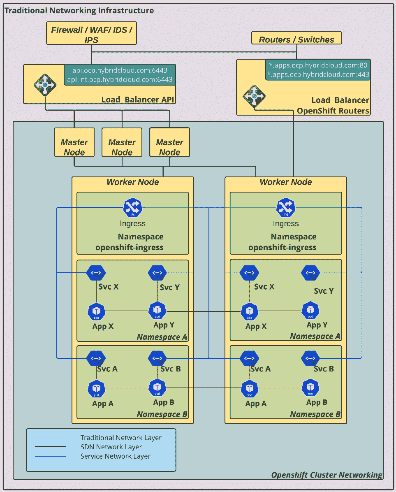

图 7.1 – 网络层概览

在 OpenShift 集群安装过程中，会创建一些与网络功能相关的命名空间；基本上，最重要的网络项目是 `openshift-sdn`，它包含每个节点的一些 pod，负责节点之间的流量。还需要指出的是，流量在由 Open vSwitch 操作的虚拟局域网内运行。还有其他网络项目涉及其中，如 `openshift-host-network` 和 `openshift-ingress`。

## Open vSwitch 上的流量是如何工作的？

为了回答这个问题，我们需要定义流量的起始点。让我们从内部流量开始，这意味着 OpenShift 集群内应用程序的 pod 之间的通信。

为了帮助理解，可以考虑在 OpenShift 上运行的两个应用程序；第一个名为 `app-frontend`，第二个名为 `app-backend`。顾名思义，`app-frontend` 通过 API 调用 `app-backend` 来处理用户请求。

因此，当 `app-frontend` 应用中的一个 pod 向 `app-backend` 应用发出请求时，该请求会被发送到内部服务，这里是 `app-backend` 服务。`app-backend` 服务负责将数据包传递给其中一个 `app-backend` pod。以同样的方式，应用程序处理请求并将结果数据包发送回服务网络，此时服务网络已经与 `app-frontend` 建立了连接。

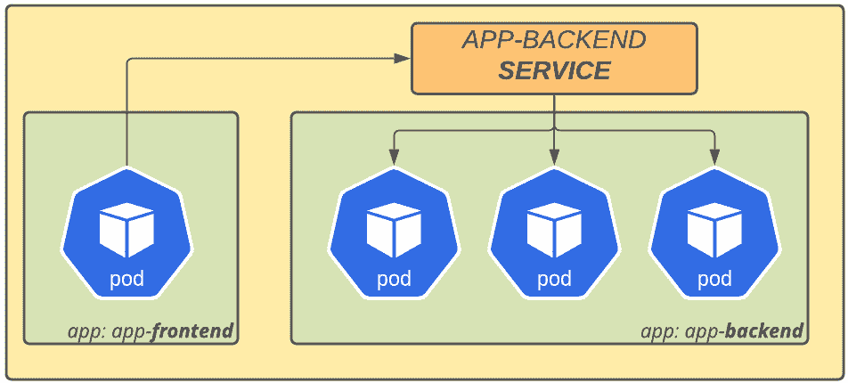

图 7.2 – 服务网络层

通过上述内容，我们简要解释了集群内应用之间的流量。现在，让我们来看看外部到内部流量是如何处理的。当请求来自集群外部时，首先会进入外部负载均衡器。当负载均衡器接收到连接时，它将请求路由到其中一个 *OpenShift Ingress* pod，然后将请求转发到目标应用程序的服务，服务随后将请求路由到正确的应用程序 pod。

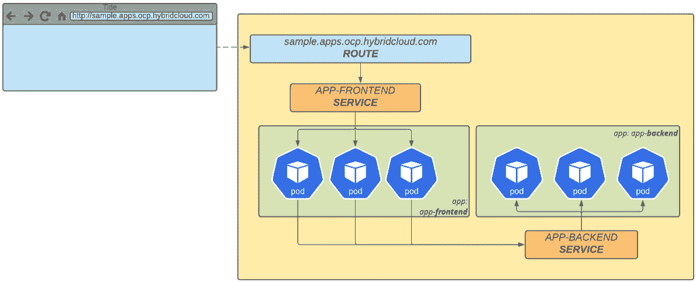

图 7.3 – 路由 SDN 网络

现在你已经了解了 OpenShift 集群中的流量是如何工作的，重要的是要强调，OpenShift 基本上有三个网络层：节点网络、服务网络和集群网络（也就是 pod 网络）。

**节点网络**是用于创建和维护机器的物理网络。**服务网络**是由 Open vSwitch 创建的虚拟层，负责在 pod 和服务之间路由流量。**集群网络**是另一个由 Open vSwitch 创建的虚拟层，负责为 pod 的通信创建子网 —— 它允许根据需要隔离项目之间的流量。

在接下来的章节中，我们将深入探讨 OpenShift 的主要网络插件。请记住，前面提到的插件之间存在细微的差异，因此在选择使用某一个插件时，必须根据其功能差异来做出决策，这些差异可能会影响集群的架构，同时也会影响应用程序可用的网络功能。这一决策需要与网络和软件架构团队共同商讨，以便了解当前的使用场景和未来计划的实施，旨在创建一个高效且功能齐全的集群。

## 网络类型 – OpenShift SDN 或 OVN-Kubernetes

OpenShift 是一个基于 Kubernetes 的完整 PaaS 解决方案，提供除了其默认组件之外的多种选项。例如，OpenShift 默认使用 Open vSwitch 网络插件（OpenShift SDN），但您也可以使用 **OVN-Kubernetes** 作为替代方案。

网络插件是一种功能，使用 Kubernetes **容器网络接口**（**CNI**）创建覆盖网络，隔离虚拟机网络与 OpenShift 节点之间的流量。

这两种受支持的选项提供了良好的可靠网络性能，但您可以根据 OpenShift 部署的场景使用其他类型的 CNI。请查看本章“进一步阅读”部分中的 *OpenShift 测试集成* 链接，以查看由 Red Hat 测试和支持的选项。

# 网络策略

如我们之前提到的，OpenShift 使用软件定义网络（SDN），并且最好通过集群自身提供的功能来控制网络流量。在我们的经验中，已经在许多组织中实施了 OpenShift，我们常常听到关于如何控制集群内网络流量的疑问，因为大多数客户习惯于使用常规的防火墙设备来控制流量。在本节中，我们将向您介绍如何控制网络流量，以便根据需要允许或拒绝网络流量。在为您提供一些选项之前，我们首先需要区分集群中不同的流量方向。

## 南北向流量

OpenShift 的设计旨在覆盖最常见的场景，甚至包括网络。在一个应用程序的传入连接来自集群外部时，可以使用外部防火墙和/或 **OpenShift Ingress** 解决方案来控制集群内部的网络流量。

## 东西向流量

起初，可能会觉得东西向流量这个说法有点奇怪，但东西向网络流量实际上只是指在同一 OpenShift 集群中不同命名空间之间的应用程序之间的流量。

以下图表说明了这些不同类型的流量是如何在集群中发生的：

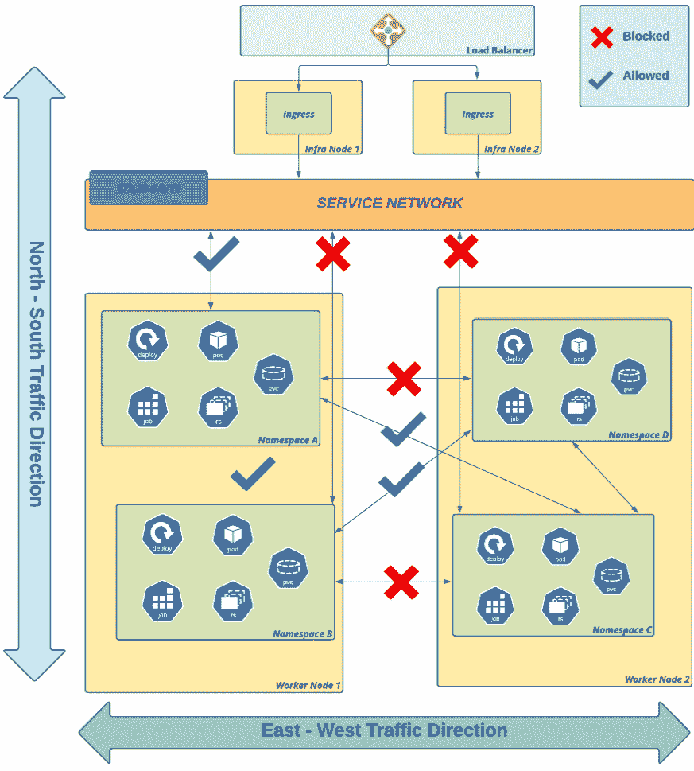

图 7.4 – 南北/东西向流量

您已经看到了可以控制网络流量的可能方向。在下一节中，您将看到如何控制集群内的网络流量。

## 控制网络流量

在 OpenShift 中控制流量有不同的选项：

+   对于南北向流量，您可以使用外部防火墙和负载均衡器在流量进入 OpenShift 集群之前控制流量，或者使用 OpenShift **路由**对象中的注释来控制速率限制、超时和负载均衡算法等方面。

+   使用合适的 **网络策略** 根据需要允许或拒绝流量流动。

+   使用 **ovs-multitenant** 网络隔离模式。此模式曾在 OpenShift 3 版本中广泛使用，但在 4 版本中不再推荐使用，因为网络策略插件已成为标准。

+   如果您打算在 OpenShift 上使用微服务，您还可以选择使用 **服务网格** 来控制东西向流量，它使用 **istio-proxy** sidecar 提供最低粒度的隔离模式。服务网格不是本书的重点，但如果您想了解更多信息，请查看本章的 *进一步阅读* 部分。

注意

如果您曾在 OpenShift 3.x 上使用过 **ovs-multitenant**，并希望在 4.x 版本上获得类似的功能，我们建议您自定义项目模板，默认添加网络策略以阻止不同项目之间的流量。实现这一目标的过程很简单，可以在这个链接中找到描述：[`docs.openshift.com/container-platform/latest/networking/network_policy/default-network-policy.html`](https://docs.openshift.com/container-platform/latest/networking/network_policy/default-network-policy.html)。

在本章中，我们将重点讨论网络策略，因为它是 OpenShift 4 中的标准网络插件。接下来看看如何创建一个网络策略来控制网络流量。

## 创建网络策略

正如我们之前提到的，借助网络策略，您可以定义规则来允许或阻止集群中的入口网络流量。使用网络策略，您可以例如允许同一命名空间内的 pod 之间的流量，但拒绝来自其他命名空间的流量。您还可以仅允许特定端口上的流量等等。因此，为了更好地理解网络策略以及流量允许和不允许流动的方向，我们将提供多个图表和场景来阐明命名空间隔离的重要性。

为了学习目的，我们将使用三个命名空间，分别为 `bluepets`、`greenpets` 和 `otherpets`。在下面的图示中，我们展示了默认的 **网络策略**，该策略默认允许命名空间之间以及来自集群入口的流量：

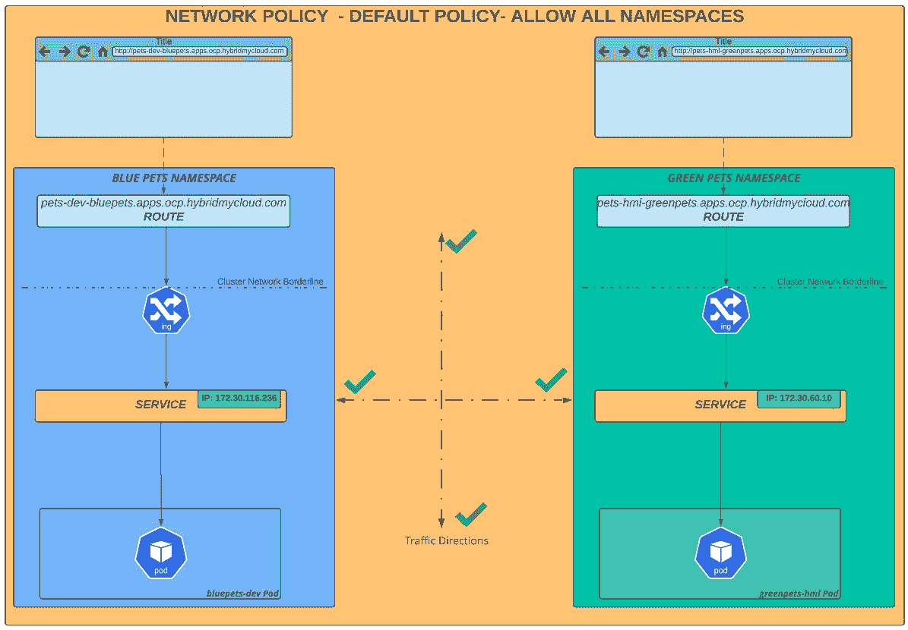

图 7.5 – 默认网络策略 – 允许所有

所以，让我们继续演示这两个命名空间之间允许的连接：`bluepets` 和 `greenpets`。为了便于理解，我们在一个没有直接通向`greenpets`命名空间上`rsh`的外部网络中进行测试，并尝试在我们之前讨论的实验室场景中访问`bluepets`命名空间的服务 IP。

在深入之前，我们必须获取两个命名空间的服务 IP，以便稍后在 pod 终端中使用，并相应地检查结果。

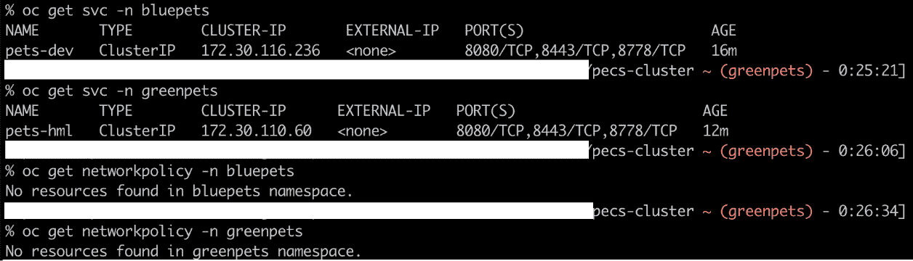

图 7.6 – 服务 IP – bluepets 和 greenpets 命名空间

看一下下面的截图。我们在 `greenpets` 命名空间下执行 `rsh` 命令并在以下端点上运行 `curl`：

+   `greenpets`（同一命名空间）中的服务 IP：检查同一命名空间中 Pod 与服务之间的连接性（在下图中用绿色方框突出显示）。

+   `bluepets`（不同命名空间）中的服务 IP：我们类似地调用 `bluepets` 命名空间的服务 IP，它也能正常工作（在下图中用蓝色方框突出显示）。

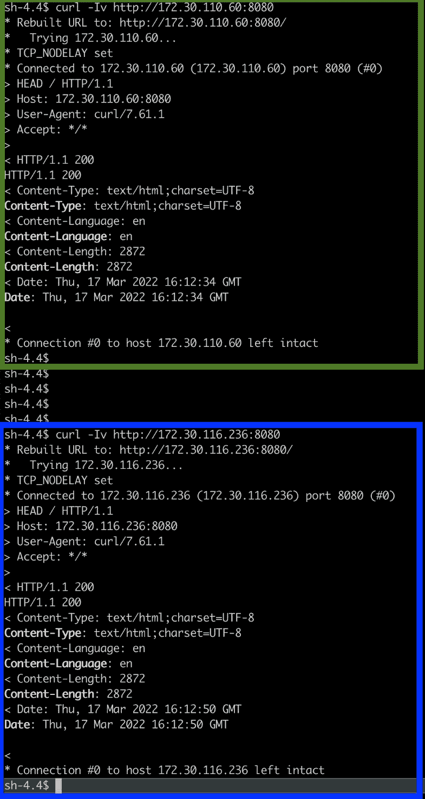

图 7.7 – 测试两个命名空间之间的连接性

在下一个场景中，我们将阻止 `greenpets` 命名空间中的所有流量，图示如下：

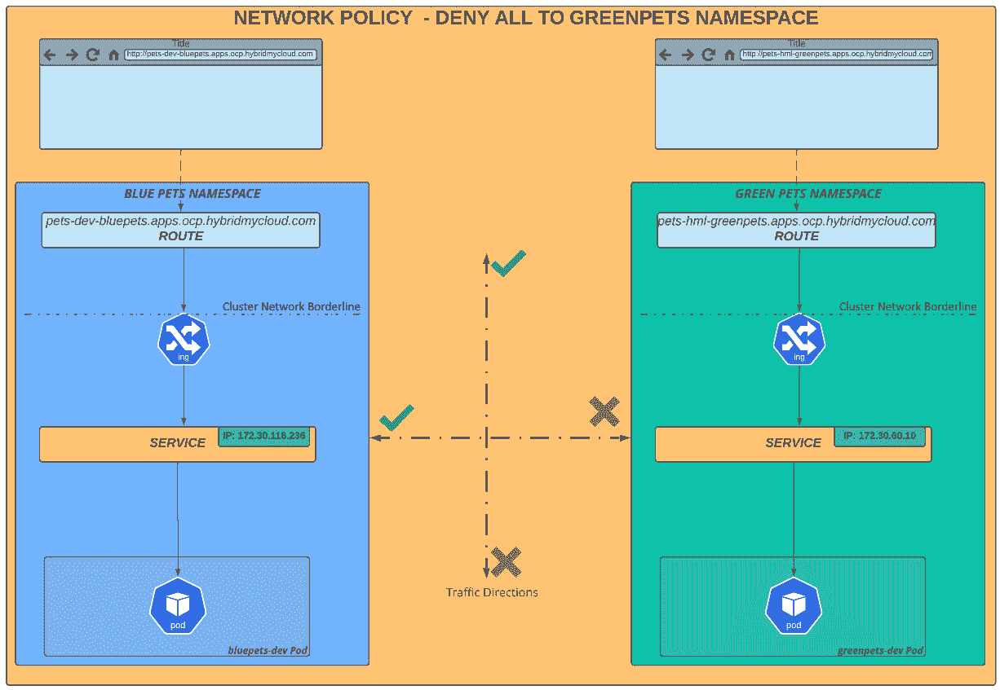

图 7.8 – greenpets 命名空间 – 拒绝所有流量

为了完成这个场景，我们将在 `greenpets` 命名空间应用一个网络策略清单：

```
$ cat << EOF >> block-everything-to-namespace.yaml
kind: NetworkPolicy
apiVersion: networking.k8s.io/v1
metadata:
  name: deny-by-default
spec:
  podSelector:
  ingress: []
EOF
$ oc –n greenpets apply –f block-everything-to-namespace.yaml
```

现在，让我们再次执行相同的测试，以演示 `greenpets` 中的所有网络流量（路由和服务）都被拒绝连接：

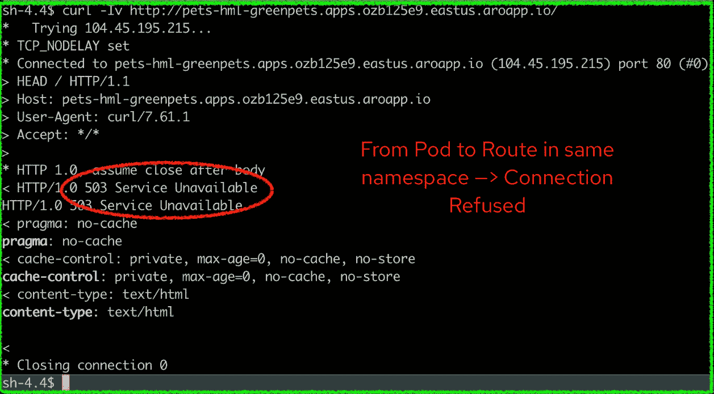

图 7.9 – 拒绝所有流量测试

现在，我们将深入探讨并应用一条规则，只允许来自入口的流量流向`greenpets`命名空间下的 Pods。为此，我们将应用以下 YAML 文件：

```
$ cat << EOF >>allow-ingress-to-namespace.yaml
apiVersion: networking.k8s.io/v1
kind: NetworkPolicy
metadata:
  name: allow-from-openshift-ingress
spec:
  ingress:
  - from:
    - namespaceSelector:
        matchLabels:
          network.openshift.io/policy-group: ingress
  podSelector: {}
  policyTypes:
  - Ingress
EOF
$ oc –n greenpets  apply –f allow-ingress-to-namespace.yaml
```

这个网络策略的作用是只允许入口命名空间中的 Pods 与 `greenpets` 命名空间中的 Pods 通信，所有其他流量将被阻止。请查看下图并注意，命名空间之间的*东西向*流量被拒绝，但*南北向*流量是允许的：

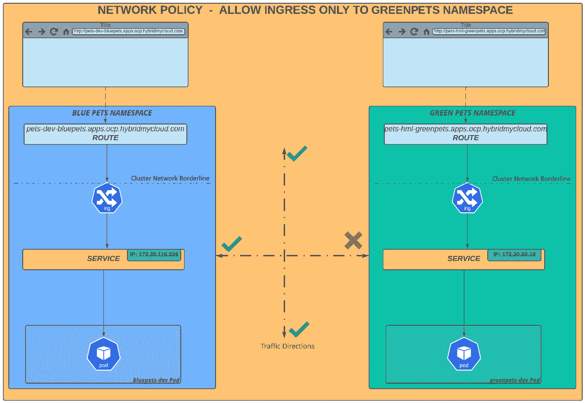

图 7.10 – 仅允许入口连接（外部路由）的 greenpets 命名空间流量

请注意，现在外部路由（入口）与服务之间的网络通信是正常的；然而，`bluepets` 与 `greenpets` 之间的流量被拒绝。

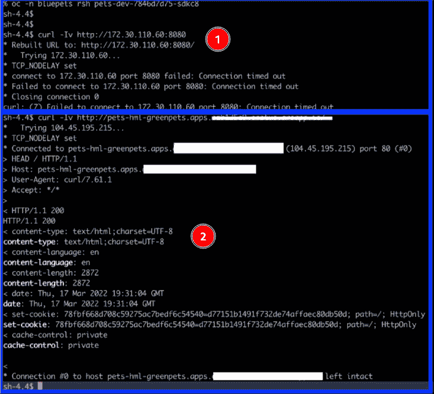

图 7.11 – 测试网络流量。1) 从 bluepets 命名空间到 greenpets 命名空间：连接被拒绝。2) 从外部路由（入口）到 greenpets 命名空间：连接被允许。

最后，我们将看看最常见的场景：最少隔离配置。这个网络策略场景基于一个命名空间标签，我们将在 `greenpets` 命名空间中应用该标签，并作为配置命名空间之间通信的关键。

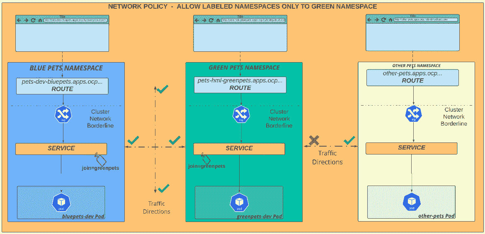

图 7.12 – 已标记的命名空间允许流量

从前面的图示中，你可以看到三个不同的命名空间：`bluepets`、`greenpets` 和 `otherpets`。一个网络策略将应用于 `greenpets` 命名空间，并使用带有 `join=greenpets` 值的标签。换句话说，这意味着只有标记为 `join=greenpets` 的命名空间中的元素才能与 `greenpets` 命名空间中的应用进行通信。为了实现这一点，我们将应用以下清单和命令：

```
$ cat << EOF >> allow-namespace-by-label.yaml
apiVersion: networking.k8s.io/v1
kind: NetworkPolicy
metadata:
  name: allow-from-namespace-label
spec:
  ingress:
  - from:
    - namespaceSelector:
        matchLabels:
          join: greenpets
  podSelector: {}
EOF
$ oc –n greenpets apply –f allow-namespace-by-label.yaml
$ oc label namespace bluepets join=greenpets
```

现在，通过运行以下测试检查 `bluepets` 和 `greenpets` 命名空间之间的连接性：

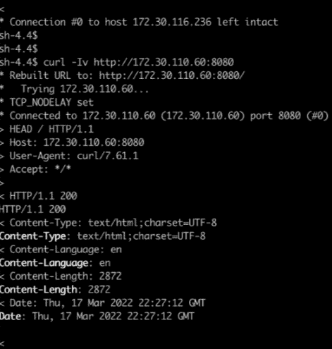

图 7.13 – 测试标记命名空间。连接到包含正确标签的命名空间 – 连接允许

在*图 7.13*中，你看到连接被允许，因为命名空间包含标签 `join=greenpets`。然而，在*图 7.14*中，你看到连接被拒绝，因为流量来自一个没有该标签的命名空间（`otherpets`）。

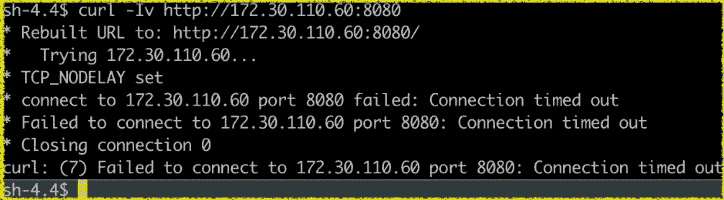

图 7.14 – 测试未标记命名空间拒绝流量

网络策略是隔离网络流量的重要工具。然而，你需要考虑某些类型的规则可能带来的挑战。如果没有设计好、标准化并采用，它们可能会让你头疼，既允许本应阻止的流量，又阻止本应允许的流量。

此外，你还需要考虑集群中将运行的工作负载类型。例如，对于面向微服务的应用，我们建议你查看**Istio 服务网格**，它通常更合适并且能提供更细粒度的网络访问控制。

到目前为止，你已经了解了 SDN 的定义和重要概念，比如通过使用标签应用策略来控制水平和垂直方向的流量。接下来，继续了解更多关于路由和 Ingress 控制器的内容，并学习如何在你的应用中使用它们。

# 什么是 Ingress 控制器？

**Ingress 控制器**是一个轻量级的自愈负载均衡器，将外部集群的网络流量分配到网络服务中。使用 Ingress 控制器是为容器化应用提供和管理入口流量的标准方法。OpenShift 中的默认 Ingress 控制器在后台使用成熟且稳定的**HAProxy**。在 OpenShift 中，当你部署一个集群时，Ingress 控制器会默认自动创建并托管在两个工作节点上。

## Ingress 操作员是如何工作的？

Ingress 操作员的作用类似于 OpenShift 中几乎所有集群操作员的作用：保护集群操作中的重要设置。该操作员监控在`openshift-ingress`命名空间中运行的 ingress pods，并保护`IngressController`对象免受错误和不兼容设置的影响，这些设置可能导致集群网络出现问题。

否则，您可以创建其他`IngressController`对象，除了默认的 IngressController 外，用于隔离特定应用组的流量，这就是所谓的**路由器分片**。

与传统的网络配置不同，后者需要复杂的路由表和防火墙配置，OpenShift 抽象了这一复杂的网络层配置，使任务变得更加简单。

## 创建新的 ingress 控制器

创建新的 ingress 控制器，您必须按照以下步骤进行操作：

1.  至少定义两个节点来托管新的 ingress 控制器。

1.  将新标签应用于节点。

1.  导出默认的`IngressController`对象。

1.  更改新创建的 YAML 清单文件的名称和所需设置。

1.  通过应用之前创建的 YAML 文件，部署新的`IngressController`对象。

在以下几行中，您可以看到之前提到的过程示例：

```
# Apply labels to nodes
$ oc label node <node1> <node2> .. <nodeN> new-ingress=true
$ oc get ingresscontroller default -n openshift-ingress-operator -o yaml > new-ingress.yaml
$ vi new-ingress.yaml
# Remove unnecessary fields to make the yaml looks like 
# the following one
apiVersion: operator.openshift.io/v1
kind: IngressController
metadata:
  name: new-ingress [1]
  namespace: openshift-ingress-operator
spec:
  domain: apps.env.hybridmycloud.com [2]
  replicas: 2
  nodePlacement:
    nodeSelector:
      matchLabels:
        new-ingress: "true" [3]
  routeSelector: [4]
    matchLabels:
      type: sharded [5]
```

在之前的代码中，我们用数字突出显示了某些部分。我们来看一下：

*[1]: 新的 IngressController 名称。*

*[2]: 新入站的 DNS 域名。*

*[3]: 定义 IngressController pods 将运行的位置的标签。*

*[4]: 实现分片。可以是 namespaceSelector 或 routeSelector。*

*[5]: 用于过滤由此 IngressController 提供的路由集。*

命名空间或路由选择器？

您看到的示例使用了`routeSelector`。配置 IngressController 的另一种方法是使用`namespaceSelector`。定义适合您情况的选择器可能看起来令人困惑，但其实并不复杂——`routeSelector`是一种更细粒度的选择，允许您将路由发布到同一命名空间中的不同 IngressController。主要的决策因素是，如果您需要能够将单个命名空间的路由发布到不同的 IngressController 中，您必须使用`routeSelectors`。否则，您很可能会使用`namespaceSelectors`。

例如，考虑一个名为`APP`的命名空间，该命名空间包含两个不同的路由：

路由器 1 中发布的 Route A，URL 为`app1.prod.hybridmycloud.com`

在路由器 2 中发布的 Route B，URL 为`app1.qa.hybridmycloud.com`

该场景只有在使用`routeSelector`时才可能。然而，这是一个不常见的场景；通常，单一命名空间中的路由始终会发布到相同的 IngressController 中，因此通常使用`namespaceSelector`。

如前所述，路由分片是一种技术，允许为隔离流量创建入口，无论是由于需要在环境之间隔离，还是为了将给定应用程序的流量完全定向到这个新的入口。

## 测试新的入口

创建了节点上的入口 pod 后，您可以测试新创建的入口。我们将使用名为 `hello-openshift` 的示例应用程序创建路由，并应用适当的路由选择器标签。按照以下步骤完成此任务：

```
$ oc new-project hello-openshift
$ oc create -f https://raw.githubusercontent.com/openshift/origin/master/examples/hello-openshift/hello-pod.json
$ oc expose pod/hello-openshift
$ oc expose svc hello-openshift
$ oc label route hello-openshift type=sharded
```

上一个命令块的最后一行明确设置了 `type=sharded` 标签，我们在示例中用于 `routeSelector`。当 OpenShift 看到此标签时，它将自动在新的入口中发布此路由。

继续前往下一节，全面了解如何使用 OpenShift 中所称的 **路由** 使用最近创建的入口。

# 路由类型

路由是为了将 Kubernetes 服务暴露给 DNS 名称（例如 `example.apps.env.hybridmycloud.com`）而在入口内部负载均衡器上配置的特定应用程序的配置表示。创建路由时，OpenShift 会自动在入口的 HAProxy pod 中配置前端和后端，以发布 URL 并使外部世界的流量可用。

路由可以使用 HTTP 或 HTTPS 协议发布。对于 HTTPS，三种不同类型的路由定义了 TLS 终止在用户和 pod 之间的 SSL 流中的工作方式。在以下小节中，我们将逐一介绍每一种。

## 透传路由

**透传路由**，顾名思义，是一种配置，其中包裹直接转发到网络服务，而不进行 TLS 终止，充当第四层负载均衡器。透传通常与在应用程序的 pod 内提供其自身的 TLS 终止的应用程序一起使用，无论是通过在源代码中实现还是使用中间件层（如 JBoss 或 WebSphere）。

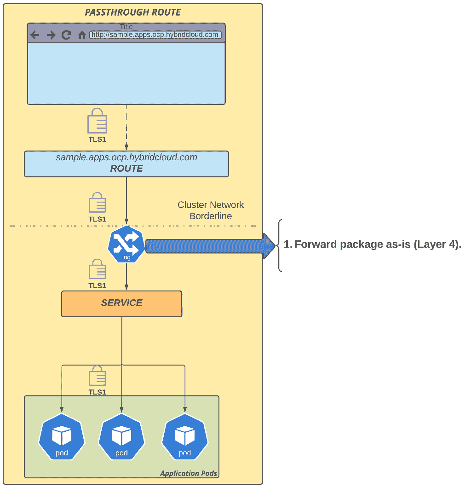

图 7.15 – 透传路由

接下来，您将看到您有的第二个选项：边缘路由。

## 边缘路由

在此路由中，TLS 终止由 OpenShift 入口处理，并作为明文转发到服务。这种类型的路由经常被使用，因为它易于使用：OpenShift 自动为入口生成的默认通配符域使用自签名证书，它签署所有使用默认自签名证书的路由 – 这是由 OpenShift 自动执行的；不需要额外的配置。但是，如果您不想使用默认自签名证书，您可以将其替换为自定义数字证书。

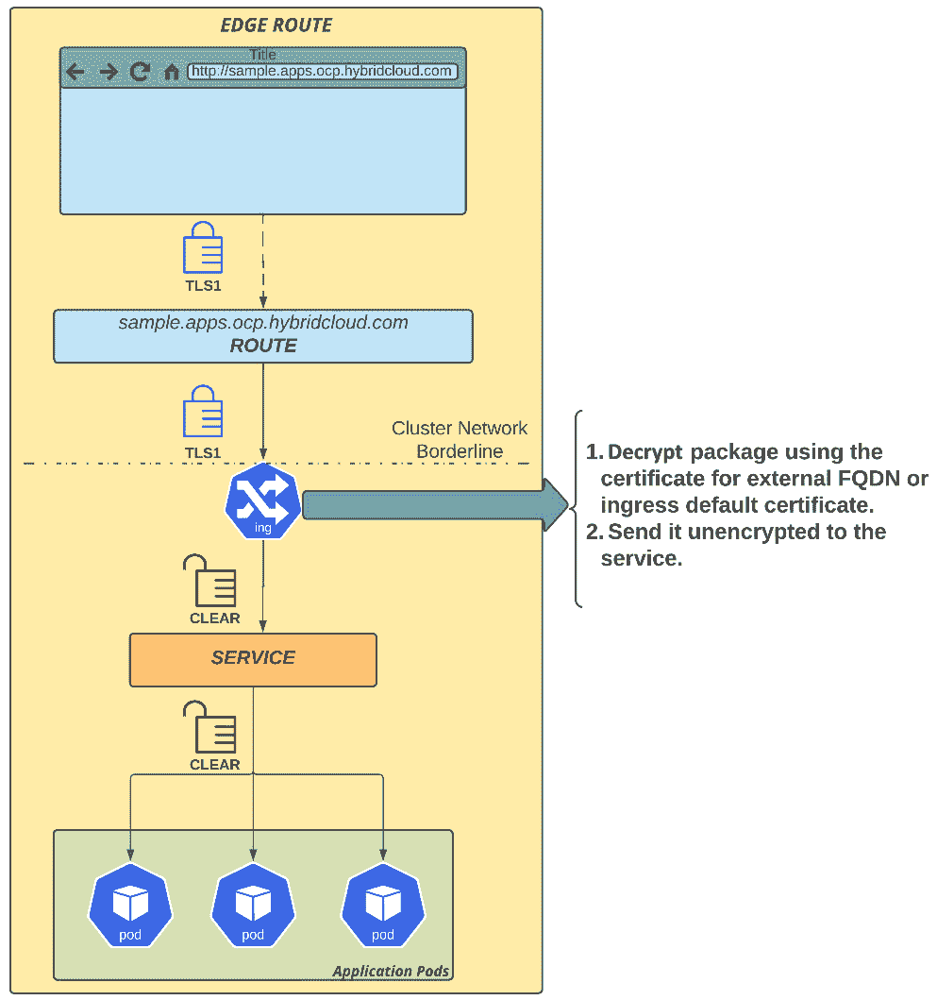

图 7.16 – 边缘路由

边缘路由是最常见且最容易实现的模型，因为证书链终止于 OpenShift 网络的边缘，即 ingress。需要强调的是，ingress 和应用程序 Pod 之间的流量没有加密，而是在 OpenShift SDN 内部进行传输，这意味着网络包是通过 OVS 封装的。最后一种方法是重新加密路由。接下来，你将看到它是如何工作的。

## 重新加密的路由

重新加密路由提供了两层 TLS 终止：流量首先使用外部 FQDN（例如 `example.apps.env.hybridmycloud.com`）的证书在集群边缘（OpenShift Ingress）解密，然后流量再次被重新加密，但这时使用的是不同的证书。虽然这是一种安全路由，但由于 ingress 执行终止和重新加密操作，它也带来了性能开销。

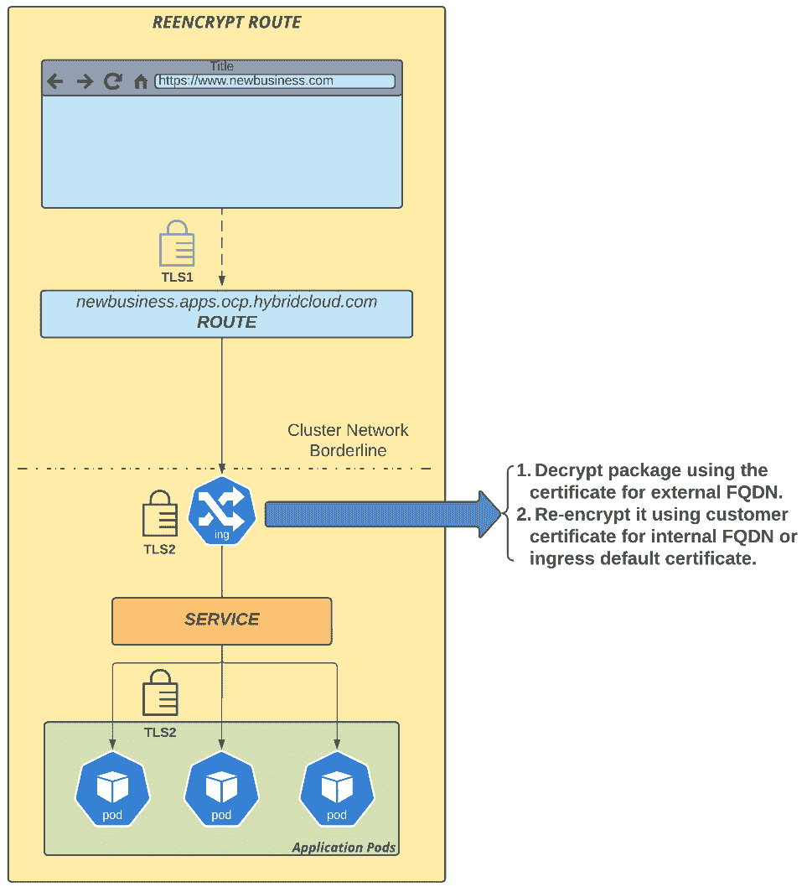

图 7.17 – 重新加密的路由

重新加密路由采用与边缘路由类似的方法，但它经过两层证书授权机构（CA）。第一层与外部公共域相关，例如 *hybridcloud.com*，然后第二层加密是内部的，由 OpenShift Ingress 和应用程序所知。

# 总结

在本章中，我们了解了与 OpenShift 网络相关的一些重要方面。现在，你已经熟悉了 OpenShift 支持的两种网络插件：OpenShift SDN 和 OVN-Kubernetes，以及在管理平台网络时需要关注的不同类型的流量。你还了解了 ingress 控制器的工作原理，如何创建一个新的控制器，以及你可能与应用程序一起使用的三种安全路由类型：透传路由、边缘路由和重新加密路由。

你通过网络策略了解了如何控制流量并提供网络隔离的一些知识。

如你所知，安全性在当今的数字化世界中是一个重要问题。在下一章中，我们将讨论你在 OpenShift 上需要考虑的安全方面。因此，继续阅读并查看吧！

# 进一步阅读

如果你想了解更多本章中涵盖的概念，可以查看以下参考资料：

+   *Kubernetes Ingress 控制器*: [`www.nginx.com/resources/glossary/kubernetes-ingress-controller`](https://www.nginx.com/resources/glossary/kubernetes-ingress-controller)

+   *HAProxy 文档*: [`www.haproxy.com/documentation/hapee/latest/onepage/`](https://www.haproxy.com/documentation/hapee/latest/onepage/)

+   *用于覆盖路由默认配置的注解*: [`docs.openshift.com/container-platform/4.10/networking/routes/route-configuration.html#nw-route-specific-annotations_route-configuration`](https://docs.openshift.com/container-platform/4.10/networking/routes/route-configuration.html#nw-route-specific-annotations_route-configuration)

+   *使用 Ingress 控制器配置入口集群流量*: [`docs.openshift.com/container-platform/4.10/networking/configuring_ingress_cluster_traffic/configuring-ingress-cluster-traffic-ingress-controller.html`](https://docs.openshift.com/container-platform/4.10/networking/configuring_ingress_cluster_traffic/configuring-ingress-cluster-traffic-ingress-controller.html)

+   *创建安全路由*: [`docs.openshift.com/container-platform/4.10/networking/routes/secured-routes.html`](https://docs.openshift.com/container-platform/4.10/networking/routes/secured-routes.html)

+   *OpenShift 测试过的集成*: [`access.redhat.com/articles/4128421`](https://access.redhat.com/articles/4128421)

+   *服务网格*: [`docs.openshift.com/container-platform/4.10/service_mesh/v2x/servicemesh-release-notes.html`](https://docs.openshift.com/container-platform/4.10/service_mesh/v2x/servicemesh-release-notes.html)
