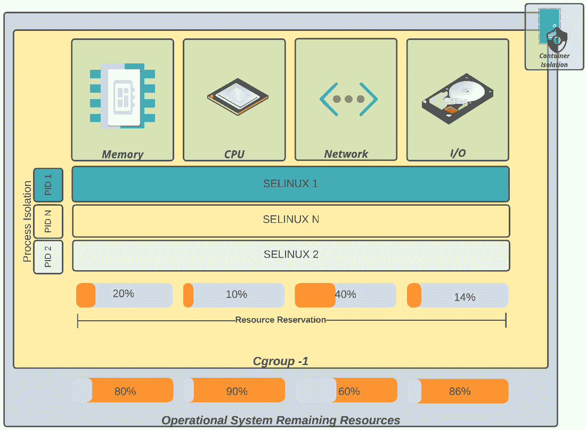

# 8

# OpenShift 安全

在本书中，您将能够跟随一些涉及流程、人员和所有技术的关键方面，以维护一个强大、具有韧性和容错能力的平台。如此大规模的产品，从其创建到保持其完全功能所需的定制，也需要在每个步骤中进行良好的责任和技能分工。

安全一直是任何企业最重要的关注点，尤其是在如今勒索病毒、恶意加密货币挖矿、恶意软件和其他类型的攻击层出不穷的情况下。根据*Gartner*的研究，到 2025 年，90%的未能妥善控制公共云使用的组织将无意中共享敏感数据。在 Kubernetes 安全方面，我们最近也看到了一些漏洞和攻击。在本章的*进一步阅读*部分，您可以查看一些近年来与 Kubernetes 相关的漏洞和安全事件。

基于此，我们决定专门用一章来讨论与 OpenShift 相关的安全方面。本章的主要目的是不是成为一份完整的安全指南，而是为您提供一系列最低限度的主题，供您考虑和审视，以确保拥有一个安全的容器战略。

本章将介绍以下主题：

+   容器安全

+   身份验证（AuthN）和授权（AuthZ）

+   OpenShift 中的证书

+   etcd 加密

+   容器隔离

+   网络隔离

+   Red Hat 容器目录

开始吧！

# 容器安全

容器的采用呈指数级增长，随之而来的是容器生态系统中各种漏洞和潜在攻击的增多。也就是说，安全是您在容器战略中需要考虑的重要方面。Red Hat 因其产品的高安全性而广受认可，这也是它们在行业中始终保持竞争力的特点之一，从坚实的**Red Hat Enterprise Linux**（**RHEL**）——公司发展的基础——到如 Red Hat OpenShift 这样的新兴技术。由于 Red Hat 在 OpenShift 中将许多安全特性设定为默认（且必需），这些特性在许多其他基于 Kubernetes 的平台中是可选的，这使得 OpenShift 在安全性方面优于其他选择。一个例子是**安全增强 Linux**（**SELinux**），它始终在任何 OpenShift 工作节点上启用，防止了许多漏洞和攻击。

您知道吗？

你知道吗？现在互联网上大约有 38 万个 Kubernetes **应用程序编程接口** (**APIs**) 对外开放，可能暴露于某种攻击或数据泄露的风险中？这就是*The Shadowserver Foundation*在其研究中发现的：[`www.shadowserver.org/news/over-380-000-open-kubernetes-api-servers/`](https://www.shadowserver.org/news/over-380-000-open-kubernetes-api-servers/)。

想了解更多吗？在这份*容器安全*报告中，你将找到一些与 Kubernetes 安全相关的重要研究：[`www.kuppingercole.com/reprints/b1e948f62d5394353f996e43a89cde4a#heading8.1`](https://www.kuppingercole.com/reprints/b1e948f62d5394353f996e43a89cde4a#heading8.1)。

在这里，你可以查看*Kubernetes 安全状态报告*：[`www.redhat.com/en/resources/kubernetes-adoption-security-market-trends-overview`](https://www.redhat.com/en/resources/kubernetes-adoption-security-market-trends-overview)。

你还可以参考以下链接中的*云安全性是否可靠？* *Gartner* 研究：[`www.gartner.com/smarterwithgartner/is-the-cloud-secure`](https://www.gartner.com/smarterwithgartner/is-the-cloud-secure)。

拥有安全环境和应用程序的关键在于公司能够做到以下几点：

+   **控制**：保护**应用程序生命周期管理** (**ALM**)，以在发布前检测并修复漏洞。

+   **保护**：评估和保护平台与基础设施的能力，以避免漏洞被利用。

+   **检测与响应**：通过限制系统和环境的影响，检测和缓解漏洞。

在下图中，你将看到我们提到的这三个因素的一些方面：


图 8.1 – 容器安全策略

在本章中，我们将详细讲解关于这些因素的一些重要考虑事项。

## 控制

为了确保容器软件供应链的安全，可以执行以下几个常见步骤：

+   **漏洞分析**：扫描容器镜像以发现已知漏洞。这个主题将在*第十二章* *OpenShift 多集群安全*中详细介绍。

+   **受信任的镜像和内容**：您知道容器和应用程序中运行的所有内容吗？如今每个应用程序都依赖于来自不同项目的许多依赖项，其中许多是开源的。使用受信任的来源至关重要，以避免运行被破坏的基础包和镜像。红帽提供了红帽 **通用基础镜像**（**UBI**），它是 RHEL 的强大、安全和稳定的版本，可以作为容器镜像的基础。红帽还通过其红帽容器目录提供了经过认证的容器镜像列表，这些镜像是安全可用的，并维护了一个容器健康指数，用于评估容器镜像的安全风险。

+   **ALM 和持续集成/持续部署（CI/CD）管道**：安全应成为开发工作流的一个重要组成部分。现代开发生命周期要求安全是所有团队之间的共同责任，从头到尾都要考虑到。**开发-安全-运维**（**DevSecOps**）已成为新常态，这意味着要自动化安全控制，确保将安全融入 **开发-运维**（**DevOps**）过程。诸如 **集成开发环境**（**IDE**）插件和 CI/CD 管道安全任务等工具是实现这一目标的必备条件。

当然，这些只是一个更大集合中的一部分。虽然本书的主要重点不是全面覆盖与安全相关的所有方面，但我们将突出一些您在容器策略中应该关注的重要因素。

## 保护

为了保护您的平台和基础设施，制定身份验证和授权、部署、证书管理、合规性评估以及政策执行等相关政策至关重要。在本章后续内容中，我们将深入探讨 OpenShift 集群的身份验证和授权方面。

## 检测与响应

即使采取了所有措施来控制和保护基础设施，您仍然需要能够检测和缓解安全风险。因此，制定监控措施以及其他可能限制漏洞或泄露影响的政策至关重要，例如容器和网络隔离。在本章中，您还将看到有关容器和网络隔离的更多信息。

让我们首先更详细地了解身份验证和授权。继续阅读以了解更多内容。

# AuthN 和 AuthZ

**AuthN** 和 **AuthZ** 是相关的概念，但其目标不同。**AuthN** 是 **身份验证**（authentication）的缩写，涉及确认用户身份并验证其凭据以授予平台访问权限的过程。在此过程中，我们将与 OpenShift 上的 **身份提供者**（**IdPs**）打交道，配置将检查用户凭据的身份验证提供者，我们将在稍后详细介绍。

反过来，**AuthZ**代表**授权**（authorization），它与在认证过程之后仅授予用户他们真正应有的访问权限直接相关。

从仅仅登录 OpenShift 的角度来看，这两个概念被认为是混淆或相似的。为了澄清这些概念，我们将讨论与认证和授权相关的不同对象和过程。

## 认证

OpenShift 在认证过程中使用以下一组对象：


这些是 OpenShift 中用于组合验证用户的对象。为了理解认证如何工作，您需要在 OpenShift 上定义 IdP——接下来会有更多关于它们的信息。

## IdP

IdP 是将 OpenShift 与认证提供者集成的实体，目的是创建一个追踪谁可以登录平台的链条。为了避免在管理用户时某个产品对另一个产品的特权，OpenShift 创建了一个非常灵活的选项，允许多个 IdP 同时与 OpenShift 集成。

以下表格列出了允许与 OpenShift 集成的受支持 IdP：


在 OpenShift 文档中，您将找到如何配置每个认证提供者的详细信息：[`docs.openshift.com/container-platform/latest/authentication/index.html`](https://docs.openshift.com/container-platform/latest/authentication/index.html)。

OpenShift 使用**基于角色的访问控制**（**RBAC**）模型来执行授权过程，并授予用户他们应拥有的适当权限集，正如您现在看到的那样。

## 授权 – RBAC

在 RBAC 系统中，您将拥有一组权限，表示为*角色*，用户和组将使用这些角色来获得这些权限。在 OpenShift 中，我们有以下对象来配置 RBAC 权限：


角色可以是集群范围或本地范围，这意味着它可以应用于所有项目或仅应用于特定项目。在以下示例中，您可以看到一个命令来创建一个*本地*角色，允许用户在命名空间 test 中获取并更新一个 pod：

```
$ oc create role podmgmt --verb=get,update --resource=pod -n test
```

您可以通过运行以下命令来检查创建的角色：

```
$ oc describe role.rbac.authorization.k8s.io/podmgmt -n test
Name:         podmgmt
Labels:       <none>
Annotations:  <none>
PolicyRule:
  Resources  Non-Resource URLs  Resource Names  Verbs
  ---------  -----------------  --------------  -----
  pods       []                 []              [get update]
```

同样，要创建一个*集群*角色，您需要使用`oc create role`命令，如下所示：

```
$ oc create role clusterpodmgmt --verb=get,update --resource=pod
```

要创建角色绑定并将此角色添加到用户或组，您可以使用以下命令：

```
# For local role bindings
$ oc adm policy add-role-to-user <role> <username> -n <project>
$ oc adm policy add-role-to-group <role> <group> -n <project>
# For cluster role bindings
$ oc adm policy add-cluster-role-to-user <role> <username>
$ oc adm policy add-cluster-role-to-group <role> <group>
```

您还可以使用以下命令从用户或组中删除角色：

```
# For local role bindings
$ oc adm policy remove-role-to-user <role> <username> -n <project>
$ oc adm policy remove-role-to-group <role> <group> -n <project>
# For cluster role bindings
$ oc adm policy remove-cluster-role-to-user <role> <username>
$ oc adm policy remove-cluster-role-to-group <role> <group>
```

继续阅读以获取关于访问控制功能的故障排除提示。

## 访问控制故障排除

请注意，在更改集群 OAuth 自定义资源后，认证操作员将应用更改；因此，您可能会观察到 OpenShift 认证的暂时不可用。请等待几分钟，直到操作员完成应用更改。

即使您在使用 OpenShift 认证时遇到问题，我们仍建议您查看这篇有用的文章：[`access.redhat.com/articles/5900841`](https://access.redhat.com/articles/5900841)。

# OpenShift 中的证书

OpenShift 使用多个不同的证书来确保平台安全。在本节中，我们将介绍 OpenShift 使用的主要证书链。这些证书如下所示：

+   `https://api.<cluster-name>.<domain>:6443/`。

+   `*.apps.<cluster-name>.<domain>`。

+   **节点证书**：由集群自动管理，无需用户干预。自动轮换。

+   **etcd 证书**：用于加密 etcd 集群成员之间的通信。由集群自动管理和轮换。

OpenShift 在平台安装时会创建自签名证书。大多数企业要求将这些证书替换为自定义证书。为此，请参考 OpenShift 文档，具体如下：

+   要替换入口证书，请参阅：[`docs.openshift.com/container-platform/latest/security/certificates/replacing-default-ingress-certificate.html`](https://docs.openshift.com/container-platform/latest/security/certificates/replacing-default-ingress-certificate.html)

+   要替换 API 服务器证书，请参阅：[`docs.openshift.com/container-platform/4.10/security/certificates/api-server.html`](https://docs.openshift.com/container-platform/4.10/security/certificates/api-server.html)

如果您替换证书，您可能还需要添加一个受信任的 **证书颁发机构** (**CA**)，如果您使用的是私有 CA。下一部分将描述如何操作。

## 受信任的 CA

您可能需要添加您在组织中使用的自定义 CA，以便在 OpenShift 组件与其他外部系统之间进行 API 调用。为此，您需要在 `openshift-config` 命名空间中创建一个带有证书链的配置映射，如下所示：

```
$ oc create configmap custom-ca \
     --from-file=ca-bundle.crt=</path/to/example-ca.crt> \
     -n openshift-config
```

然后，更新集群范围的代理，使用刚刚创建的配置映射，具体如下：

```
$ oc patch proxy/cluster \
     --type=merge \
     --patch='{"spec":{"trustedCA":{"name":"custom-ca"}}}'
```

Kubernetes 集群中的一个重要部分是 etcd 数据库。您可以决定加密它，以保持数据库中的机密和其他对象加密。接下来请查看如何操作。

# etcd 加密

默认情况下，etcd 数据库是未加密的。然而，您可以轻松启用 etcd 加密，在集群中增加一层数据安全性。当启用 etcd 加密时，诸如机密和配置映射等内容将以加密形式存储，这使您的集群更加安全。

要启用 etcd 加密，请按照以下步骤进行：

1.  编辑 `apiserver` 对象，如下所示：

    ```
    $ oc edit apiserver
    ```

1.  设置 `encryption` 字段，具体如下：

    ```
    spec:
      encryption:
        type: aescbc
    ```

1.  保存文件以应用更改。

请注意，应用更改后启用加密可能需要大约 15 分钟的时间。

# 容器隔离

我们已经讨论了用户认证、权限以及证书等方面，但如何确保容器仅能执行其应有的操作，而无法在主机上提升权限呢？

本节将讨论作为**操作系统**（**OS**）一部分实现的一些概念，以安全地运行容器，同时也会讨论 OpenShift 中与此相关的一些实现。

在下表中，你将看到一些与容器相关的概念：


在下图中，你可以看到这些概念的图示：



图 8.2 – 容器隔离

虽然理解这些概念很重要，但你不需要直接操作其中任何一个，因为 OpenShift 会为你抽象化这些配置。相反，你需要理解什么是**安全上下文约束**（**SCCs**）——这些是你在需要时为容器授予更广泛权限所需使用的对象。继续阅读，了解什么是 SCCs 以及如何配置它们。

## SCCs

SCCs 是 OpenShift 中的对象，用于控制 Pod 或容器与主机资源交互的权限。默认情况下，任何 Pod 使用**restricted** SCC，这是最受限制的权限，防止其作为 root 运行并提升主机上的权限。除了 restricted SCC，以下是常见的几种：

+   `anyuid`：具有与 restricted SCC 相同的权限，允许容器作为任何 `0` UID（root 用户）运行。

+   `hostaccess`：授予容器访问所有主机命名空间的权限。只应与可信来源一起使用，因为它在工作节点中赋予了非常广泛的权限——仅在真正必要时使用。

+   `hostnetwork`：允许容器直接访问底层工作节点的网络。请谨慎使用，以降低网络漏洞的风险。

+   `privileged`：最放宽的 SCC，赋予主机所有权限。应避免使用，只有在绝对必要时才使用。

除了我们已经讨论的所有与安全相关的功能外，还有一个非常重要的话题：网络策略。网络策略是确保你的 Pods 和项目只能与它们应当通信的对象进行通信的一个极好功能。在接下来的章节中，你将了解网络策略的作用以及它们在网络安全中的重要性。

# 网络隔离

防火墙是众所周知并且在各种基础设施中被广泛使用的技术。在 OpenShift 中，我们需要牢记，当前我们所使用的是一个软件定义的平台，因此，我们拥有一些软件功能来实现数据中心中长期存在的概念——防火墙也不例外。正如我们在前一章中所看到的，网络策略实际上就是您定义的规则，用于允许或阻止 OpenShift 中不同 pod 和项目之间的网络通信，这与物理网络中的防火墙提供的功能类似。

默认情况下，项目中的所有 pod 都可以从任何项目中的其他 pod 和网络端点进行访问。为了隔离 pod 和项目，您需要创建网络策略，如下所示：

```
kind: NetworkPolicy
apiVersion: networking.k8s.io/v1
metadata:
  name: deny-by-default
spec:
  podSelector: {}
  ingress: []
```

前述的网络策略禁止项目中所有 pod 的流量。为了使一个项目能够通过 OpenShift 的入口从集群外部访问，您需要允许来自入口项目的连接，如下片段所示：

```
apiVersion: networking.k8s.io/v1
kind: NetworkPolicy
metadata:
  name: allow-from-openshift-ingress
spec:
  ingress:
  - from:
    - namespaceSelector:
        matchLabels:
          network.openshift.io/policy-group: ingress
  podSelector: {}
  policyTypes:
  - Ingress
```

您还可以使用标签为特定的 pod 创建自定义网络策略。例如，以下 YAML Ain’t Markup Language (YAML) 代码可以用来限制只有带有 `app=web` 标签的 pod 只能通过 HTTPS 端口（`443`）进行访问：

```
kind: NetworkPolicy
apiVersion: networking.k8s.io/v1
metadata:
  name: allow-https
spec:
  podSelector:
    matchLabels:
      app: web
  ingress:
  - ports:
    - protocol: TCP
      port: 443
```

使用网络策略来为项目和 pod 设置适当的网络访问权限有着广阔的可能性。一个常见且推荐的做法是创建一套标准的网络策略，并配置 OpenShift 模板，使这些网络策略能够自动应用于任何新创建的项目。您可以在 OpenShift 文档中了解如何自定义 OpenShift 模板以添加这些网络策略：[`docs.openshift.com/container-platform/latest/networking/network_policy/default-network-policy.html`](https://docs.openshift.com/container-platform/latest/networking/network_policy/default-network-policy.html)。

另一件您可能会在安全策略中考虑的重要事项是使用安全的容器基础镜像。以下部分将介绍什么是 Red Hat 容器目录，以及它如何帮助您处理这个重要话题。

# Red Hat 容器目录

大多数企业在某个阶段都需要使用来自不同来源的容器，这些容器可能是现成的产品，也可能仅仅是工作负载的依赖项。Red Hat 提供了一款有趣的工具，旨在帮助您确保使用安全的容器。Red Hat 容器目录是一个容器镜像库，里面的镜像经过 Red Hat 和合作伙伴的测试与认证，因此是可信的镜像。

作为容器目录的一部分，Red Hat 提供了容器健康指数（Container Health Index）。容器健康指数是 Red Hat 容器目录中可用容器镜像的评分系统，评分从 A 到 F，其中 A 代表在关键错误修复方面最为最新的镜像。你可以通过以下链接查看所有可用评分及其定义：[`access.redhat.com/articles/2803031`](https://access.redhat.com/articles/2803031)。该功能有助于评估使用某个镜像版本时可能面临的安全风险。

在 Red Hat 容器目录中，你可以找到 Red Hat UBI，这可能是你容器策略中的一个重要方面。接下来你将了解更多内容。

## Red Hat UBI

为你的容器定义基础镜像是一个重要步骤，这是你需要考虑的内容，以确保具有便携性和安全性的容器交付过程。根据你做出的决定，你可能会被锁定在某些特定的 Linux 版本和发行版中，而这些版本和发行版正是该容器基础镜像所支持的。基础镜像对于保持工作负载的安全性也至关重要——每周都有许多 Linux 漏洞被发现，但它们通常会得到非常快速的修复，使用像 RHEL 这样成熟且稳健的基础镜像，对于确保工作负载更加安全至关重要。

Red Hat UBI 基于 RHEL，免费提供，并且占用最小空间（大小介于 10 **兆字节** (**MB**) 和 100 MB 之间，具体取决于镜像类型）。你可以根据需求从以下四种镜像类型中选择：


除了上述选项外，Red Hat 还提供了一些包含语言运行时的 UBI，例如 Node.js、.NET 和 Java。所有基础镜像都可以从 Red Hat 容器目录下载。

一旦你有了包含安全容器镜像的受信任源列表，我们建议你限制 OpenShift 仅运行来自这些受信任源的镜像。接下来你将看到如何操作。

## 限制镜像注册源

你可以通过以下程序轻松地阻止或允许 OpenShift 使用的镜像注册源：

1.  运行以下命令编辑 `image.config.openshift.io/cluster` 对象：

    ```
    $ oc edit image.config.openshift.io/cluster
    ```

1.  在对象的 YAML 文件中，设置 `allowedRegistriesForImport` 和 `registrySources` 字段，指定所需的镜像注册源。`AllowedRegistriesForImport` 定义了用户可以通过镜像流（`oc import-image` 命令）导入镜像的镜像注册源。在 `registrySources` 块中，你可以定义允许的注册源（`allowedRegistries`）或阻止的注册源（`blockedRegistries`），但不能同时定义两者。请查看以下示例：

    ```
    spec:
      allowedRegistriesForImport:
        - domainName: quay.io
          insecure: false
      additionalTrustedCA:
        name: myconfigmap
      registrySources:
        allowedRegistries:
        - quay.io
        - registry.redhat.io
        - image-registry.openshift-image-registry.svc:5000
        insecureRegistries:
        - insecure-reg.com
    ```

这总结了我们认为每个公司需要考虑的主要安全方面。我们鼓励你仔细审查我们在本章中讨论的内容，并定义/实施政策以确保你所有的集群都安全。

# 总结

我们在本章中已经看到了你可能考虑的一些使 OpenShift 集群安全的事项。虽然 OpenShift 被认为是基于 Kubernetes 的安全平台，但如何管理它当然至关重要。可以考虑为访问控制、证书、容器和网络隔离、开发及 CI/CD 流水线制定相关策略。

一个安全的平台始于适当的规划，以定义并实施高效的策略来控制平台中开发和部署的内容，保护其免受不必要的风险，并最终尽可能地隔离工作负载和网络，以减轻安全漏洞对环境造成的影响。在*第十一章*，*OpenShift 多集群 GitOps 和管理*，你将看到如何使用高级集群管理（ACM）对多个集群应用策略，并确保它们无论在哪个环境中运行，都符合安全要求。

在下一章中，我们将探索如何在 OpenShift 上使用 Tekton 项目与 Kubernetes 原生流水线进行协作，Tekton 项目不仅可以为你提供云原生 CI/CD 流程来构建和部署应用程序，还可以为你的应用程序供应链增加一层额外的安全防护。

# 进一步阅读

如果你想要更多与本章内容相关的信息，可以参考以下资源：

+   *云安全吗？*—*Gartner*研究：[`www.gartner.com/smarterwithgartner/is-the-cloud-secure`](https://www.gartner.com/smarterwithgartner/is-the-cloud-secure)

+   *Kubernetes 漏洞和报告的攻击*：

    +   [`thenewstack.io/unfixable-kubernetes-security-hole-means-potential-man-in-the-middle-attacks/`](https://thenewstack.io/unfixable-kubernetes-security-hole-means-potential-man-in-the-middle-attacks/)

    +   [`threatpost.com/kubernetes-cyberattacks-argo-workflows/167997/`](https://threatpost.com/kubernetes-cyberattacks-argo-workflows/167997/)

+   *最常见的 Kubernetes 安全问题和关注点*（博客文章）：[`cloud.redhat.com/blog/most-common-kubernetes-security-issues-and-concerns-to-address`](https://cloud.redhat.com/blog/most-common-kubernetes-security-issues-and-concerns-to-address)

+   *容器安全*报告：[`www.kuppingercole.com/reprints/b1e948f62d5394353f996e43a89cde4a#heading8.1`](https://www.kuppingercole.com/reprints/b1e948f62d5394353f996e43a89cde4a#heading8.1)

+   *Kubernetes 安全状态报告*：[`www.redhat.com/en/resources/kubernetes-adoption-security-market-trends-overview`](https://www.redhat.com/en/resources/kubernetes-adoption-security-market-trends-overview)

+   *OpenShift 身份验证指南*：[`docs.openshift.com/container-platform/latest/authentication/index.html`](https://docs.openshift.com/container-platform/latest/authentication/index.html)

+   *故障排除 OpenShift 身份验证*：[`access.redhat.com/articles/5900841`](https://access.redhat.com/articles/5900841)

+   *定义默认网络策略*：[`docs.openshift.com/container-platform/4.10/networking/network_policy/default-network-policy.html`](https://docs.openshift.com/container-platform/4.10/networking/network_policy/default-network-policy.html)

+   *Red Hat 通用基础镜像*：[`developers.redhat.com/products/rhel/ubi`](https://developers.redhat.com/products/rhel/ubi)

+   *容器健康指数等级*：[`access.redhat.com/articles/2803031`](https://access.redhat.com/articles/2803031)

+   *关于* `htpasswd`（Apache 项目）的详细信息：[`httpd.apache.org/docs/2.4/programs/htpasswd.html`](https://httpd.apache.org/docs/2.4/programs/htpasswd.html)

+   *OpenID Connect*：[`developers.google.com/identity/protocols/oauth2/openid-connect`](https://developers.google.com/identity/protocols/oauth2/openid-connect)

+   *容器隔离*：[`www.nginx.com/blog/what-are-namespaces-cgroups-how-do-they-work/`](https://www.nginx.com/blog/what-are-namespaces-cgroups-how-do-they-work/)

# 第三部分 – 使用 GitOps 在 OpenShift 上实现多集群 CI/CD

在这一部分，你将了解与 CI/CD 和 GitOps 相关的新概念和技术。你将学习如何构建与企业战略相匹配的 CI/CD 管道，并且这些管道设计为易于维护，使用 Tekton 和 ArgoCD。你还将看到如何同时使用 Argo CD 和高级集群管理（ACM）将应用部署到多个集群中。

本书的这一部分包括以下章节：

+   *第九章*，*OpenShift Pipelines – Tekton*

+   *第十章*，*OpenShift GitOps – Argo CD*

+   *第十一章*，*OpenShift 多集群 GitOps 与管理*
