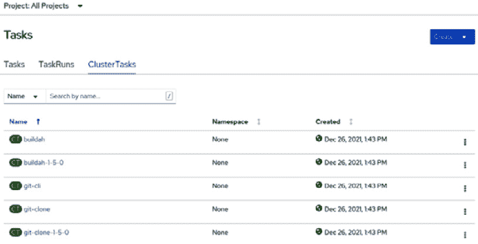
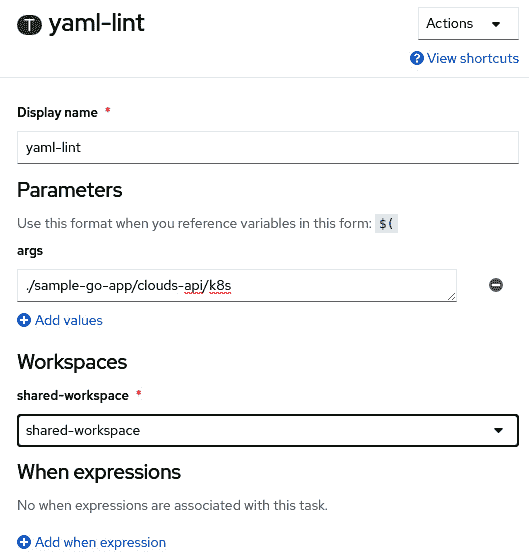

# 第九章：9

# OpenShift Pipelines – Tekton

到目前为止，我们已经讨论了与当前混合云世界相关的挑战，并介绍了 OpenShift 架构和部署的相关内容。现在，我们将转换话题，带来一个令人兴奋的 DevOps 相关功能：**OpenShift Pipelines**！

OpenShift Pipelines 是一个 Kubernetes 原生的 **持续集成与持续交付**（**CI/CD**）工具，基于 Tekton 开源项目，并且在 *Red Hat OpenShift 订阅中无需额外费用*。在本章中，我们将带你逐步了解如何安装和使用它。通过学习，你将明白它如何在 DevOps 流水线和自动化中发挥作用。

在 *第五章*，*OpenShift 部署* 后，你应该在环境中有一个正在运行的 OpenShift 集群。我们将在本章中使用该集群来实现一些练习。如果你没有可用的 OpenShift 集群，你可以使用 **CodeReady Containers**（**CRC**）作为实验室。在这里，你可以使用一个全功能的虚拟机快速本地运行 OpenShift 集群。

本章将涵盖以下主题：

+   什么是 OpenShift Pipelines？

+   安装 OpenShift Pipelines

+   从零开始创建 Tekton 流水线

+   使用 GitHub Webhook 触发器

+   修复由于 YAML 问题导致的 PipelineRun 失败

# 技术要求

如我们之前提到的，OpenShift Pipelines 是一个 Kubernetes 原生应用，因此它是一个轻量级工具，使用 **自定义资源定义**（**CRDs**）来扩展 OpenShift API 的功能。在接下来的章节中，你将看到安装过程非常简单，只需要安装一个 Operator——一种 *“下一步，下一步，完成”* 的体验。要能够安装并运行本章中的练习，你只需要一个具有以下可用资源的 OpenShift 集群：

+   2 vCPU

+   2 GB RAM

如果你没有可用的 OpenShift 集群，我们建议你尝试 CRC（CodeReady Containers），在你的机器上本地启动一个集群。要使用 CRC，你需要在工作站上满足以下系统要求：

+   4 个物理 CPU 核心（AMD64 或 Intel 64）

+   9 GB 可用内存

+   35 GB 存储空间

+   以下操作系统之一：

    +   Windows（Windows 10 Fall Creators 更新版或更高版本）

    +   macOS（10.14 Mojave 或更高版本）

    +   Linux（Red Hat Enterprise Linux/CentOS 7.5 或更高版本，以及最新两个稳定版 Fedora 发行版）

    +   Linux（Ubuntu 18.04 LTS 或更新版本以及 Debian 10 或更新版本 *未正式支持*，可能需要你手动设置主机）

本章使用的源代码可在 [`github.com/PacktPublishing/OpenShift-Multi-Cluster-Management-Handbook/tree/main/chapter09`](https://github.com/PacktPublishing/OpenShift-Multi-Cluster-Management-Handbook/tree/main/chapter09) 中获取。

在本节中，我们将演示如何使用 Linux（Fedora）工作站安装和使用 CRC。有关 Windows 或 macOS 上安装过程的更多信息，请参考以下网站：[`crc.dev/crc/`](https://crc.dev/crc/)。

什么是 CRD？

CRD（自定义资源定义）是一个 Kubernetes 资源，它允许你通过定义自定义实体来扩展 Kubernetes API。CRD 由一个名称和一个指定 API 属性的模式组成。

## 安装和使用 CRC

CRC 安装过程很简单——你需要在你的系统中安装以下软件包：

```
$ sudo yum install NetworkManager libvirt –y
```

安装 CRC，请按照以下步骤操作：

1.  在[`console.redhat.com/openshift/create/local`](https://console.redhat.com/openshift/create/local)下载适合你平台的 CRC 最新版本。

1.  提取存档文件的内容。

1.  在终端中，进入你提取存档文件的路径。

1.  运行以下命令以设置 CRC：

    ```
    $ ./crc setup
    ```

1.  如果你想设置一些参数，例如可供 CRC 使用的 CPU 和内存数量，请运行以下代码：

    ```
    $ ./crc config set cpus 4
    $ ./crc config set memory 20480
    ```

1.  通过运行以下命令启动 CRC：

    ```
    $ ./crc start
    ```

完全启动集群可能需要最多 20 分钟。完成后，你将看到类似以下的屏幕：


图 9.1 – CRC 启动

现在你已经启动了 CRC 或其他 OpenShift 集群，我们准备介绍 OpenShift Pipelines，并了解你可以用它做些什么。

# 什么是 OpenShift Pipelines？

现在你已经有了一个实验环境，让我们启动引擎，驶向 OpenShift Pipelines！正如我们之前提到的，OpenShift Pipelines 是 Red Hat 对 Tekton 开源项目的实现。让我们了解一下 Tekton 是什么，它与市场上其他 CI/CD 流水线工具有何不同。

## 什么是 Tekton？

Tekton 提供了一个框架，使得快速且轻松地创建 Kubernetes 原生的 CI/CD 流水线成为可能。它通过 CRD 扩展了 Kubernetes API 功能，并添加了一些自定义对象，用于实现 CI/CD 流水线。你还可以将 Tekton 与行业标准的 CI/CD 流水线工具（如 Jenkins、GitLab CI 等）集成，以便为每种情况选择最佳技术。

Tekton 是 **持续交付基金会** 的一部分，该基金会得到了 AWS、Red Hat、Google、Netflix 等大型公司的支持。这通常是一个项目有长期生命力和稳定性的好兆头——这是企业在做投资决策时的重要因素。

## 主要优点

使用 Tekton 可以为你带来许多好处，具体包括以下几点：

+   Tekton 可以看作是一个无服务器的 CI/CD 流水线系统，通过按需消耗资源并使用隔离的容器，从而可能减少与 CI/CD 工具相关的基础设施或云端成本。

+   它与 Kubernetes 紧密集成，作为 Kubernetes 的扩展通过 CRD（自定义资源定义）进行工作。这意味着你无需在 CI/CD 工具与 OpenShift 之间进行复杂的集成，节省时间和资源。

+   上述两个方面还意味着，你不需要额外的人力资源来部署、支持和维护 CI/CD 工具。

+   作为一个 Kubernetes 原生工具，你可以通过将一个简单的 YAML 文件应用于 Kubernetes 来定义和运行管道（这与创建 Pod、Service 或 Deployment 的方式相同）。这使得 Tekton 易于使用，并能与其他工具集成，以便构建由多个组件（传统虚拟机、容器、微服务等）组成的复杂管道。

+   通过将 Tekton 与 **Argo CD** 集成，你可以构建一个非常强大的技术栈，在这个栈中，Tekton 位于 *持续集成* 侧，而 Argo CD 负责 *持续交付* 侧。我们将在 *第十章* 中详细讨论 Argo CD，*OpenShift GitOps – Argo CD*。

+   它是一个真正的开源解决方案，背后有强大的基础支持，这是它将得到持续支持并在未来几年发展的有力证据。

## Tekton 组件

在本节中，我们将逐一介绍每个 Tekton 组件。简而言之，主要的 Tekton 组件如下：

+   **Tekton 管道**：它由多个 CRD 组成，这些 CRD 是开发和运行 CI/CD 管道的构建块。

+   **Tekton 触发器**：这些是监听事件并触发管道或任务的对象。它们通常用于在 GitHub 仓库中的拉取或推送请求后运行管道。

+   `tkn`) 与 Tekton 交互。

+   **Tekton 目录**：一个由社区驱动的任务仓库，任务可以直接在你的管道中使用。

+   **Tekton 操作员**：用于轻松地从 Kubernetes 集群中安装、管理和移除 Tekton。

## 概念

要学习 Tekton，你需要先理解一些概念：

+   **步骤**：一个包含输入集并产生输出集的操作。

+   **任务**：一组结构化的步骤，用于执行特定任务，例如克隆 GitHub 仓库或构建源代码。

+   **管道**：一组结构化任务，组成一个 CI/CD 管道。

+   **TaskRun**：这个对象代表任务的实例化。任务是其通用定义，而 TaskRun 则定义了输入参数及运行该任务所需的其他组件。

+   **PipelineRun**：这类似于 TaskRun，但用于管道。

为了深入理解这些概念，我们将通过一个示例，构建并运行一个有意义的管道。

# 安装 OpenShift Pipelines

安装过程非常简单，正如你将在以下步骤中看到的那样。

## 前提条件

1.  你必须具有集群管理员权限才能访问 OpenShift 集群。

## 安装

按照以下步骤操作：

1.  从管理员视角访问 **OpenShift Web 控制台**。

1.  导航至 **Operators** | **OperatorHub**：


图 9.2 – OperatorHub

1.  使用 *按关键词过滤* 框搜索 `OpenShift Pipelines`：


图 9.3 – Red Hat OpenShift Pipelines 在 OperatorHub 上

1.  点击**Red Hat OpenShift Pipelines**图标，然后点击**安装**按钮，进入**安装操作符**界面：


图 9.4 – 安装 OpenShift Pipelines

1.  现在，选择 `openshift-operators` 命名空间并允许操作符在任何目标命名空间中安装 OpenShift Pipelines 实例。

1.  选择**自动**或**手动**作为升级的**批准策略**。如果选择**自动**，升级将在**操作符生命周期管理器**（**OLM**）发布后自动执行；而如果选择**手动**，则需要在应用之前批准它。

1.  选择**更新频道选项**。推荐选择稳定频道，因为它包含最新的稳定且*受支持*版本的操作符。

1.  点击**安装**按钮：


图 9.5 – 安装操作符

1.  等待最多 5 分钟，直到看到以下消息：


图 9.6 – 操作符已安装

安装 OpenShift Pipelines 后，我们建议您安装 `tkn` CLI 来帮助完成常见任务。让我们学习如何安装 `tkn` CLI。

## 安装 tkn CLI

`tkn` 是一个 CLI 工具，它使得与 Tekton 的工作变得更加容易。通过它，您可以管理（列出、删除、描述、获取日志等）任务、流水线、触发器以及所有可用的 Tekton 对象。

要安装 `tkn` CLI，请按照以下步骤操作：

1.  下载 `tkn`，方法是点击 OpenShift Web 控制台中的*问号*图标后提供的 URL 链接，如下所示：


图 9.7 – 帮助菜单 | 命令行工具

1.  下载适用于您的工作站的客户端：


图 9.8 – tkn 下载链接

1.  下载到您的机器后，您需要解压并将其添加到路径中：

    ```
    $ tar -xvzf tkn-linux-amd64-0.17.2.tar.gz
    $ sudo cp tkn /usr/local/bin
    ```

1.  如果一切顺利，运行 `tkn version` 后将看到以下输出。忽略警告消息，它会提示流水线版本；这是预期中的消息，因为我们还没有登录任何 OpenShift 集群：

    ```
    $ tkn version
    Client version: 0.17.2
    Pipeline version: unknown, pipeline controller may be installed in another namespace please use tkn version -n {namespace}
    ```

现在您已经安装了 OpenShift Pipelines 和 `tkn`，让我们利用它们从零开始创建一个流水线。在接下来的章节中，我们将通过实际操作学习 Tekton 的主要概念。

# 从零开始创建 Tekton 流水线

在本节中，我们将从零开始创建一个 Tekton 流水线，以便我们从中学习。我们将使用我们 GitHub 仓库中的一个示例：[`github.com/PacktPublishing/OpenShift-Multi-Cluster-Management-Handbook`](https://github.com/PacktPublishing/OpenShift-Multi-Cluster-Management-Handbook)。为了实践我们将在此覆盖的概念，请将此仓库分叉到您的 GitHub 账户，并按照本章中的说明进行操作。

我们将要处理的流水线很简单，但很有帮助。它将由以下任务组成：


图 9.9 – 构建和部署流水线

在接下来的几个章节中，你将学习如何使用 Tasks、TaskRuns、Pipelines 和 PipelineRuns，这些是 Tekton 的主要对象。

## 任务

要创建这个流水线，你需要理解任务的基础概念。如前所述，任务提供了一组结构化的步骤来执行某个特定的操作，例如克隆 GitHub 仓库或构建源代码。现在，让我们更深入地了解它的一些重要方面。你需要理解的第一个重要方面是任务范围，它定义了你是否需要使用 Task 还是 ClusterTask：

+   **任务**：任务仅在特定的命名空间中可用。你通常会使用任务来执行特定于某个应用程序的操作。

+   **ClusterTask**：这与任务相同，但可以在任何命名空间中使用。它们通常用于可以应用于任何应用程序的通用操作。

在我们的示例中，我们将使用 Tasks 和 ClusterTasks 来理解它们是如何工作的以及它们之间的区别。一个任务包含以下元素，我们将在示例中使用它们：

+   **参数**：运行任务所需的参数。

+   **资源**：这包括由 **PipelineResources** 对象提供的输入或输出资源。我们建议你使用工作空间而不是 PipelineResources，因为后者更难以排查故障，使任务的重用性降低，限制更多。因此，我们在示例中不会使用 PipelineResources。

+   **步骤**：在这里你定义将在任务中执行的操作。你需要使用一个容器镜像来运行这些操作。

+   **工作空间**：这是一个用于定义流水线中不同任务之间共享存储卷的工件。工作空间可以用于不同的目的，例如在不同任务之间共享数据、配置的挂载点（使用 ConfigMaps）、凭证和敏感数据（使用 Secrets），以及存储在不同任务和流水线之间共享的可重用工件。工作空间对于缓存工件以加速构建和其他作业也非常有用。

+   **结果**：这些是字符串类型的结果变量，可以传递给流水线中的其他任务。

在我们的示例流水线中，我们将重用现有的任务来克隆 GitHub 仓库并构建源代码。最后两个任务我们将专门为流水线创建的自定义任务。

### 重用任务

首先，让我们学习如何搜索和重用任务来构建流水线。

第一个可以查看现有任务的地方是你的本地 OpenShift 集群。当你安装 OpenShift Pipelines 时，多个 `tkn` CLI 或 OpenShift UI 中会包含这些任务。

以下代码展示了如何使用 `tkn`：

```
# You need to login at the cluster first using "oc login"
$ oc login -u <user> https://<ocp-api-url>:6443
$ tkn clustertasks ls
```

以下是一些示例输出：

```
$ oc login -u kubeadmin https://api.crc.testing:6443
(.. omitted ..)
$ tkn clustertasks ls
NAME               DESCRIPTION              AGE
buildah            Buildah task builds...   2 days ago
buildah-1-5-0      Buildah task builds...   2 days ago
git-cli            This task can be us...   2 days ago
git-clone          These Tasks are Git...   2 days ago
(.. omitted ..)
```

要通过 OpenShift UI 执行相同操作，请转到 `tkn` CLI：



图 9.10 – 可重用的 ClusterTasks

另一个寻找并重用现有任务的好工具是 **Tekton Hub**。我们稍后将使用它来扩展我们的示例，并使用 **YAML Lint** 工具验证我们的 YAML 文件。

备注

**Tekton Hub** 是一个 Web 门户，您可以在其中获取 Tekton Catalog 中的可重用资产。可以通过 [`hub.tekton.dev/`](https://hub.tekton.dev/) 访问。

**YAML Lint** 是一个工具，用于验证 YAML 文件的语法，检查缩进、尾随空格以及其他许多可能的问题。了解更多信息，请访问 [`yamllint.readthedocs.io/en/stable/`](https://yamllint.readthedocs.io/en/stable/)。

使用 ClusterTasks，我们决定重用以下内容：

+   `git-clone`：从 GitHub 仓库克隆源代码

+   `buildah`：构建源代码并生成容器镜像。

现在，让我们学习如何为需要特定功能时创建一个自定义任务。

### 创建一个新的（自定义）任务

定义一个新任务和创建一个 Pod 或部署一样简单。对于我们的示例，我们需要创建三个新任务：

+   `apply-manifests`：该任务将负责应用一些 K8s manifest 文件，这些文件将部署应用程序。

+   `update-deployment`：该任务将更新部署，用构建任务中生成的容器镜像替换现有镜像。

+   `check-app-health`：该任务检查应用程序 Pod 的状态和 URL，验证应用程序是否可以访问。

让我们创建这些任务，查看它们的内容，并从中学习：

```
apiVersion: tekton.dev/v1beta1 
kind: Task #[1]
metadata:
  name: apply-manifests #[2]
spec:
  workspaces: #[3]
  - name: source
  params: #[4]
  - name: manifest_dir
    description: The directory in the source that contains yaml manifests
    type: string
    default: "k8s"
  steps: #[5]
    - name: apply
      image: image-registry.openshift-image-registry.svc:5000/openshift/cli:latest #[6]
      workingDir: /workspace/source
#[7]
      command: ["/bin/bash", "-c"]
      args:
        - |-
          echo Applying manifests in $(inputs.params.manifest_dir) directory
          oc apply -f $(inputs.params.manifest_dir)
          echo -----------------------------------
```

在前面的代码中，我们用数字标出了某些部分。让我们来看看：

+   **[1]**: 这种对象定义了一个新的 Tekton 任务。

+   **[2]**: 任务的名称。

+   `git-clone` 任务（第一个任务）。

+   **[4]**: 运行任务所需的参数。

+   **[5]**: 执行任务时所执行的步骤。

+   `step` 命令。

+   **[7]**: 执行所需操作的命令 —— 在本例中，应用 k8s manifest 文件。

现在我们已经了解了任务的结构，让我们在示例环境中创建它，并使用另一个对象 —— **TestRun** 来运行它：

1.  为我们的示例创建一个新项目：

    ```
    $ oc new-project pipelines-sample
    ```

1.  现在，检查管道的服务帐户是否已自动创建：

    ```
    $ oc get serviceaccount pipeline 
    NAME       SECRETS   AGE
    pipeline   2         33s
    ```

1.  在 `pipelines-sample` 命名空间中创建 `apply-manifest` 任务：

    ```
    $ oc apply -f  https://github.com/PacktPublishing/OpenShift-Multi-Cluster-Management-Handbook/blob/main/chapter09/Tasks/apply-manifests.yaml
    task.tekton.dev/apply-manifests created
    ```

1.  使用 `tkn` 确认任务已创建：

    ```
    $ tkn tasks ls
    NAME              DESCRIPTION   AGE
    apply-manifests                 17 seconds ago
    ```

1.  现在，让我们创建其他自定义任务（`update-image-version` 和 `check-route-health`）：

    ```
    $ oc apply -f  https://github.com/PacktPublishing/OpenShift-Multi-Cluster-Management-Handbook/blob/main/chapter09/Tasks/update-image-version.yaml
    $ oc apply -f  https://github.com/PacktPublishing/OpenShift-Multi-Cluster-Management-Handbook/blob/main/chapter09/Tasks/check-route-health.yaml
    $ tkn tasks ls
    NAME              DESCRIPTION   AGE
    apply-manifests                 17 seconds ago
    heck-app-health                     10 seconds ago
    update-deployment                 8 seconds ago
    ```

现在我们已经创建了自定义任务，让我们学习如何使用 `TaskRun` 对象来运行和测试它们。

## TaskRun

我们的任务需要一个持久卷来存储来自 GitHub 的源代码。因此，在运行 TaskRun 之前，我们需要创建一个**PersistentVolumeClaim**。请注意，你需要一个**StorageClass**来自动为你提供**PersistentVolume**。如果没有，PersistentVolumeClaim 将处于*待定*状态，等待手动创建 PersistentVolume。

运行以下命令以创建 PersistentVolumeClaim：

```
$ oc apply -f https://github.com/PacktPublishing/OpenShift-Multi-Cluster-Management-Handbook/blob/main/chapter09/PipelineRun/pvc.yaml
```

现在，我们必须创建两个 TaskRuns。在第一个中，我们将使用`git-clone`集群任务克隆 GitHub 仓库，并将其存储在使用持久卷的工作区中。在第二个中，我们将使用之前创建的自定义任务，通过应用一些清单（`apply-manifests`任务）来部署应用。

以下代码展示了一个 TaskRun 的结构：

```
apiVersion: tekton.dev/v1beta1 
kind: TaskRun 
metadata: 
  name: git-clone #[1]
spec: 
  taskRef: 
    name: git-clone #[2]
    kind: ClusterTask #[3]
  params: #[4]
  - name: url 
    value: "https://github.com/PacktPublishing/OpenShift-Multi-Cluster-Management-Handbook"
  - name: subdirectory 
    value: "" 
  - name: deleteExisting 
    value: "true" 
  - name: revision 
    value: "main" 
  workspaces: #[5]
  - name: output 
    persistentVolumeClaim: 
      claimName: source-pvc  
```

让我们更详细地看看这段代码：

+   `TaskRun`对象

+   **[2]**：将要运行的任务名称

+   `ClusterTask`，但对于常规任务可以省略

+   **[4]**：在任务执行过程中使用的参数值

+   **[5]**：要使用的工作区

运行以下命令以应用`TaskRun`对象：

```
$ oc apply -f https://github.com/PacktPublishing/OpenShift-Multi-Cluster-Management-Handbook/blob/main/chapter09/Tasks/git-clone-taskrun.yaml
```

一旦你创建了`git-clone`对象，就可以使用以下`tkn`命令查看日志：

```
$ tkn taskrun logs git-clone -f
[clone] + '[' false = true ']'
[clone] + '[' false = true ']'
[clone] + CHECKOUT_DIR=/workspace/output/
[clone] + '[' true = true ']'
[clone] + cleandir
[clone] + '[' -d /workspace/output/ ']'
(.. ommited ..)
```

最后，使用以下的 TaskRun 运行`apply-manifests`：

```
$ oc apply -f https://github.com/PacktPublishing/OpenShift-Multi-Cluster-Management-Handbook/blob/main/chapter09/Tasks/apply-manifests-taskrun.yaml
```

查看日志，如下所示：

```
$ tkn taskrun logs run-apply-manifests -f
[apply] Applying manifests in ./sample-go-app/articles-api/k8s directory
[apply] deployment.apps/clouds-api created
[apply] service/clouds-api created
[apply] route/clouds-api created
```

通过这个，你已经学会了如何使用`TaskRun`对象运行特定任务。你也知道如何重用并创建自定义任务。我们将利用这些知识来创建我们的第一个管道。

## 管道

在这一部分，我们将创建我们的第一个有意义的管道！我喜欢把管道的设计比作一个乐高®玩具套件，在组装之前，你需要手头有所有的零件。如果乐高套件太大，无法一次性组装完成，你需要将它分解成更小、更有意义的部分。在我们的管道中，*乐高零件*是我们已经构建的任务以及我们将要重用的任务。我们已经拥有所需的一切，那么*让我们组装我们的乐高套件*吧。

我们将通过我们的示例来理解如何定义一个管道对象。任何管道的第一部分是其元数据：

```
apiVersion: tekton.dev/v1beta1
kind: Pipeline
metadata:
  name: build-and-deploy
```

下一部分是它的规格（`spec`），包括以下项目：

+   **工作区**：这是一个共享工作区，用于存储源代码和需要在任务之间传递的其他管道工件：

    ```
    spec:
      workspaces:
      - name: shared-workspace
    ```

+   **参数**：这些是运行管道所需的输入参数：

    ```
      params:
      - name: deployment-name
        type: string
        description: name of the deployment to be patched
      - name: git-url
        type: string
        description: url of the git repo for the code of deployment
      - name: git-revision
        type: string
        description: revision to be used from repo of the code for deployment
        default: "master"
      - name: IMAGE
        type: string
        description: image to be built from the code
    ```

+   `taskRef`（将使用的任务的引用），如下所示：

    ```
    - name: apply-manifests
      taskRef:
        name: apply-manifests
      workspaces:
      - name: source
        workspace: shared-workspace
      runAfter:
      - build-image
    ```

+   对于`taskRef`组中的`kind`属性，如下所示：

    ```
    - name: fetch-repository
      taskRef:
        name: git-clone
        kind: ClusterTask
      workspaces:
      - name: output
        workspace: shared-workspace
      params:
      - name: url
        value: $(params.git-url)
      - name: subdirectory
        value: ""
      - name: deleteExisting
        value: "true"
      - name: revision
        value: $(params.git-revision)
    ```

你可以在[`github.com/PacktPublishing/OpenShift-Multi-Cluster-Management-Handbook/blob/main/chapter06`](https://github.com/PacktPublishing/OpenShift-Multi-Cluster-Management-Handbook/blob/main/chapter06)找到完整的管道。

现在，我们准备创建我们的管道。为此，运行以下命令：

```
$ oc apply -f https://github.com/PacktPublishing/OpenShift-Multi-Cluster-Management-Handbook/blob/main/chapter09/Pipeline/build-deploy.yaml
$ tkn pipelines ls
NAME               AGE            LAST RUN   STARTED   DURATION   STATUS
build-and-deploy   1 minute ago   ---        ---   
```

现在我们已经定义了我们的管道，让我们运行它吧！

## PipelineRun

有多种方法可以运行流水线：通过 OpenShift 控制台 UI、使用 `tkn`，或者手动创建并应用 PipelineRun 对象。归根结底，无论你使用哪种方式，都会创建一个 PipelineRun（唯一的区别是，当你使用 `tkn` 或 Web UI 时，PipelineRun 会自动为你创建）。为了教学目的，我们将通过使用 `PipelineRun` 对象来学习和理解它。

以下代码展示了我们的 `PipelineRun` 对象：

```
apiVersion: tekton.dev/v1beta1
kind: PipelineRun
metadata:
  name: build-deploy-api-pipelinerun #[1]
spec:
  pipelineRef:
    name: build-and-deploy #[2]
  params: #[3]
  - name: deployment-name
    value: clouds-api
  - name: git-url
    value: https://github.com/PacktPublishing/OpenShift-Multi-Cluster-Management-Handbook.git
  - name: IMAGE
    value:  image-registry.openshift-image-registry.svc:5000/pipelines-sample/clouds-api
  workspaces: #[4]
  - name: shared-workspace
    volumeClaimTemplate:
      spec:
        accessModes:
          - ReadWriteOnce
        resources:
          requests:
            storage: 500Mi
```

让我们更详细地看一下这段代码：

+   `PipelineRun` 对象

+   **[2]**：要运行的流水线

+   **[3]**：将与流水线一起使用的参数值

+   **[4]**：工作空间的定义

应用 `PipelineRun` 对象并检查日志，查看流水线的执行情况：

```
$ oc apply -f https://github.com/PacktPublishing/OpenShift-Multi-Cluster-Management-Handbook/blob/main/chapter09/PipelineRun/clouds-api-build-deploy.yaml
$ tkn pipelinerun logs build-deploy-api-pipelinerun -f
[fetch-repository : clone] + '[' false = true ']'
[fetch-repository : clone] + '[' false = true ']'
[fetch-repository : clone] + CHECKOUT_DIR=/workspace/output/
(.. omitted ..)
[check-app-health : apply] Waiting for application articles-api to be ready.
[check-app-health : apply] Checking if application is available at the route endpoint
[check-app-health : apply] Application is available at http://articles-api-pipelines-sample.apps.cluster-gf.gf.sandbox1171.opentlc.com/cloud
[check-app-health : apply] ----------------------------------
```

这样，你就有了自定义任务和已经经过测试并正常工作的流水线。现在，我们通过使用触发器，在仓库中发生 Git 推送时自动运行这个流水线，进一步提升它的效果。

# 使用 GitHub Webhook 触发器

在 CI/CD 工作流中，通常使用某个事件（如 Git 上的拉取或推送请求）来触发新的流水线运行。在 Tekton 中，你可以使用**EventListeners**来监听事件并运行一个或多个触发器。针对以下平台，提供了一些现成的事件处理器，称为**拦截器**：

+   **GitHub**：这允许你验证和筛选 GitHub Webhook。

+   **GitLab**：与之前提到的内容类似，不过是针对 GitLab 的设置。

+   **Bitbucket**：与之前提到的 Bitbucket 的设置相同。

+   **CEL**：这允许你使用 **通用表达式语言**（**CEL**）来筛选和修改有效负载。

+   **Webhook**：这允许你处理任何 Webhook 有效负载并应用任何业务逻辑。

在我们的示例中，我们将使用 GitHub 拦截器来处理 Webhook，筛选推送事件，并触发我们之前创建的流水线。你还可以通过实现一个名为 `ClusterInterceptors` 的对象来实现自定义拦截器。如果你需要创建 ClusterInterceptor 或使用除 GitHub 以外的任何拦截器，请查看“进一步阅读”部分中的链接。

请注意，GitHub Webhook 需要一个公开可访问的 URL 来发送 HTTP Webhook 请求。因此，你需要一个具有公网 IP 和域名的 OpenShift 集群，能够从互联网上访问。也就是说，在这种情况下，除非你将 CRC URL 路由公开到互联网上，否则无法使用 CRC 来测试 Tekton 触发器与 GitHub Webhook。

什么是 CEL？

CEL 是一种简单但快速且可移植的表达式评估语言。由一些谷歌工程师创建并维护，它是一个开源项目，已根据 Apache 许可证发布，并广泛应用于谷歌的许多项目和服务中。欲了解更多信息，请访问 [`opensource.google/projects/cel`](https://opensource.google/projects/cel)。

除了 **EventListener**，Tekton 触发器还由其他几个对象组成：

+   **Trigger**：这定义了在 EventListener 检测到新事件后将执行的操作。

+   **TriggerTemplate**：这指定了作为触发器结果应用的对象蓝图，通常使用 PipelineRun 对象，该对象将运行一个管道。

+   **TriggerBinding**：这定义了将从事件负载中提取的字段数据，用于与相关的 PipelineRun 一起使用。

+   **ClusterTriggerBinding**：这与 TriggerBinding 相同，但它是集群范围的。可以在不同命名空间之间重用。

以下对象将用于我们的示例：


图 9.11 – Tekton 触发器对象

现在，让我们将其付诸实践！你已经在实验室中创建了任务和管道，接下来让我们创建将使用现有管道的触发器对象。

## TriggerBinding

**TriggerBinding** 将解析从 GitHub 负载中提取的数据，如下所示：

```
apiVersion: triggers.tekton.dev/v1beta1
kind: TriggerBinding
metadata:
  name: clouds-api-tb #[1]
spec:
  params: #[2]
  - name: git-repo-url
    value: $(body.repository.url)
  - name: git-repo-name
    value: $(body.repository.name)
  - name: git-revision
    value: $(body.head_commit.id)
```

让我们更详细地看看这段代码：

+   `TriggerBinding` 对象

+   **[2]**：将根据负载数据字段分配的参数。

使用以下命令创建 TriggerBinding：

```
$ oc apply -f https://raw.githubusercontent.com/
```

我们需要创建的下一个对象是 `TriggerTemplate`。让我们来看看。

## TriggerTemplate

`TriggerTemplate` 将创建一个 PipelineRun 来执行我们的示例管道：

```
apiVersion: triggers.tekton.dev/v1beta1
kind: TriggerTemplate
metadata:
  name: clouds-api-tt #[1]
spec: 
  params: #[2]
  - name: git-repo-url
    description: The git repository url
  - name: git-revision
    description: The git revision
    default: master
  - name: git-repo-name
    description: The name of the deployment to be created / patched
  resourcetemplates: #[3]
  - apiVersion: tekton.dev/v1beta1
    kind: PipelineRun
    metadata:
      generateName: build-deploy-
    spec:
      serviceAccountName: pipeline
      pipelineRef:
        name: build-and-deploy
      params:
      - name: deployment-name
        value: clouds-api
      - name: git-url
        value: $(tt.params.git-repo-url)
      - name: git-revision
        value: $(tt.params.git-revision)
      - name: IMAGE
        value: image-registry.openshift-image-registry.svc:5000/pipelines-sample/clouds-api
      workspaces:
      - name: shared-workspace
        volumeClaimTemplate:
          spec:
            accessModes:
              - ReadWriteOnce
            resources:
              requests:
                storage: 500Mi
```

让我们更详细地看看这段代码：

+   `TriggerTemplate` 对象

+   `TriggerBinding` 对象

+   **[3]**：作为触发器结果将创建的对象。

使用以下命令创建 `TriggerTemplate` 对象：

```
$ oc apply -f https://github.com/PacktPublishing/OpenShift-Multi-Cluster-Management-Handbook/blob/main/chapter09/Trigger/clouds-api-tt.yaml
```

最后，我们可以创建 `Trigger` 对象，它将使用我们已经创建的所有对象。

## Trigger

`Trigger` 对象将作为 GitHub 拦截器、`TriggerBinding` 和 `TriggerTemplate` 之间的连接：

```
apiVersion: triggers.tekton.dev/v1beta1
kind: Trigger
metadata:
  name: clouds-api-trigger #[1]
spec:
  serviceAccountName: pipeline
  interceptors: #[2]
    - ref:
        name: "github" #[3]
      params:
        - name: "secretRef" #[4]
          value:
            secretName: github-secret
            secretKey: secretToken
        - name: "eventTypes"
          value: ["push"] #[5]
  bindings:
    - ref: clouds-api-tb #[6]
  template:
    ref: clouds-api-tt #[7]
```

让我们更详细地看看这段代码：

+   `Trigger` 对象。

+   **[2]**：将用于触发操作的事件拦截器列表。

+   **[3]**：来自 GitHub 的拦截器。

+   **[4]**：在 GitHub webhook 中配置的 secret。

+   **[5]**：Tekton 将响应的触发事件类型。在此情况下，它将是 GitHub 的“push”事件。

+   将与此触发器一起使用的 `TriggerBinding` 对象。

+   将与此触发器一起使用的 `TriggerTemplate` 对象。

以下代码展示了 GitHub secret 的示例 (**[4]**)：

```
apiVersion: v1
kind: Secret
metadata:
  name: github-secret
type: Opaque
stringData:
  secretToken: "tekton"
```

使用以下命令创建 secret 和触发器：

```
$ oc apply -f https://github.com/PacktPublishing/OpenShift-Multi-Cluster-Management-Handbook/blob/main/chapter09/Trigger/clouds-api-trigger.yaml
```

我们需要创建的最后一个对象是 `EventListener`，它将使触发器生效。让我们来看看。

## EventListener

最后，我们需要创建一个 **EventListener** 对象，它将监听 HTTP 请求并与 GitHub webhook 配置一起使用。我们很快就会学习如何配置 GitHub webhook：

```
apiVersion: triggers.tekton.dev/v1beta1
kind: EventListener
metadata:
  name: clouds-api-el #[1]
spec:
  serviceAccountName: pipeline
  triggers:
    - triggerRef: vote-trigger #[2]
```

让我们更详细地看看这段代码：

+   `EventListener` 对象

+   `EventListener` 对象已激活

运行以下命令来创建 `EventListener` 对象：

```
$ oc apply -f https://github.com/PacktPublishing/OpenShift-Multi-Cluster-Management-Handbook/blob/main/chapter09/Trigger/clouds-api-el.yaml
```

`EventListener` 会在 OpenShift 上创建一个服务，你需要将其暴露到外部。生成的路由 URL 将在 GitHub webhook 配置过程中使用：

```
$ oc expose svc el-clouds-api-el
```

现在，我们准备配置一个新的 GitHub webhook，它将使用我们刚刚创建的 `EventListener` 对象来触发 Tekton 的 trigger。

## 创建 GitHub webhook

为了创建 webhook，你需要 fork 我们的 GitHub 仓库。如果你还没有 fork，可以在你的个人 GitHub 账户中现在就进行：[`github.com/PacktPublishing/OpenShift-Multi-Cluster-Management-Handbook`](https://github.com/PacktPublishing/OpenShift-Multi-Cluster-Management-Handbook)。

打开 GitHub fork 的仓库并进入 **Settings** | **Webhook**。在接下来的页面上，点击 **Add webhook** 按钮：


图 9.12 – 在 GitHub 上添加 webhook

填写表单并提供以下信息：

+   **Payload URL**：我们在前一部分创建的路由 URL。你可以通过运行以下命令获取此 URL：

    ```
    $ echo "$(oc  get route el-clouds-api-el --template='http://{{.spec.host}}')"
    ```

+   `application/json`。

+   `tekton`):


图 9.13 – 在 GitHub 上添加 webhook

几秒钟后，你应该能看到我们创建的 webhook 旁边出现一个绿色的勾号：


图 9.14 – 已添加 webhook

现在，我们已经在 Tekton 侧配置了 `Trigger` 对象，并在 GitHub 上配置了 webhook，接下来进行测试！

## 测试 Tekton trigger

执行 `commit` 并将 trigger 推送到 webhook 事件，如下所示：

```
$ git commit -m "empty-commit" --allow-empty && git push origin main
```

访问已运行 `push` 命令：


图 9.15 – 在 Red Hat 上的 PipelineRun

恭喜你！你已经成功在 Tekton 上创建了一个 CI/CD 管道，并在 Git push 事件触发后自动运行了它！为了总结本章内容，我们将通过使用 YAML linter 工具添加一个 YAML 文件验证任务来增强我们的管道。

为此，我们将使用 Tekton Hub 查找一个可重用的任务。访问 [`hub.tekton.dev/`](https://hub.tekton.dev/)，并在屏幕右上角的搜索框中搜索 YAML：


图 9.16 – Tekton Hub

点击 **YAML linter** 任务以查看如何安装和使用它的说明：


图 9.17 – YAML linter

这一次，我们将使用 **Pipeline Builder** 页面来添加 YAML linter 任务。为此，访问 OpenShift UI 并选择 **Developer** 控制台：


图 9.18 – 开发者控制台

现在，执行以下步骤：

1.  访问 `build-and-deploy` 管道：


图 9.19 – Pipelines 菜单

1.  现在，点击 **Actions** 按钮，然后点击 **Edit Pipeline**：


图 9.20 – 构建和部署管道

1.  在接下来的屏幕上，点击 **fetch-repository** 框，然后点击它旁边的 **+** 按钮：


图 9.21 – 流水线构建器功能

1.  选择 `yaml lint`，然后点击 **安装并添加** 按钮：


图 9.22 – 使用流水线构建器功能添加新任务

1.  新任务应该已经添加。你应该能看到它旁边有一个感叹号：


图 9.23 – 使用流水线构建器功能添加新任务

1.  现在，点击它并输入 `./sample-go-app/clouds-api/k8s` 作为 **Workspaces** 组中的 `shared-workspace`：



图 9.24 – 设置 yaml-lint 任务的参数

1.  现在，点击 **保存**。

1.  此时，我们的流水线有了一个新步骤，用于验证 Kubernetes 清单文件的 YAML 内容。为了测试我们之前的更改，让我们从相同的 Web UI 中运行它。为此，请点击 **Pipeline details** 屏幕上的 **Actions** 菜单，并选择 **Start** 动作：


图 9.25 – 从开发者控制台运行流水线

1.  使用以下值填写表单并点击 `clouds-api`：

1.  **git-url**: <Your forked repository>

1.  `main`

1.  `image-registry.openshift-image-registry.svc:5000/pipelines-sample/clouds-api`

1.  `./sample-go-app/clouds-api/`

1.  `VolumeClaimTemplate`：


图 9.26 – PipelineRun 参数

1.  检查以下屏幕上的 `PipelineRun` 对象，你会看到关于我们添加的新 **yaml-lint** 任务的错误：


图 9.27 – 因 YAML linter 校验失败而导致的 PipelineRun 失败

1.  点击 **yaml-lint** 步骤并查看日志以找到问题：


图 9.28 – 因 YAML linter 校验失败而导致的 PipelineRun 失败

如你所见，YAML linter 检测到了一些 YAML 文件中的错误。这些错误是预期中的，特别为你准备，以模拟真实的 CI/CD 流水线。现在，运用你刚刚学到的技能，修复这些错误并重新让流水线工作起来（或者查看下一节的解决方案）！

# 修复由于 YAML 问题导致的 PipelineRun 失败

为了让你的流水线重新工作，按照以下步骤操作：

1.  在 `./sample-go-app/clouds-api/k8s` 文件夹中的所有 YAML 文件的第一行添加 `---`。

1.  修正 `kustomization.yaml` 文件的缩进，在 `resources` 后面的所有行前添加两个空格，如下所示：

    ```
    ---
    resources:
      - deployment.yaml #add two spaces at the begging of the line
      - service.yaml #add two spaces at the begging of the line
      - route.yaml #add two spaces at the begging of the line
    ```

1.  在 `service.yaml` 文件的末尾添加一行。

1.  提交并推送更改：

    ```
    $ git add *
    $ git commit -m "fixed yaml files"
    $ git push
    ```

一个新的 PipelineRun 应该自动触发并完成。

# 总结

本章中，我们深入了解了 Tekton，从在 OpenShift 上安装到使用它。你学习了如何创建自定义任务、重用现有任务、构建流水线并运行它。你还学习了如何设置触发器，在你的 GitHub 仓库中发生推送事件时运行流水线。本章中介绍的对象是你在创建大多数 Tekton 流水线时将使用的主要对象。

在下一章，我们将通过将**Argo CD**和**GitOps**添加到你的流水线中，进一步增强你的 CI/CD 流程。我们还将开始探索如何将应用程序一次性部署到多个集群中。让我们开始，并深入了解 OpenShift GitOps！

# 进一步阅读

如果你想了解更多关于本章内容的信息，可以查看以下参考资料：

+   *OpenShift Pipelines 官方文档:* [`docs.openshift.com/container-platform/4.9/cicd/pipelines/understanding-openshift-pipelines.html`](https://docs.openshift.com/container-platform/4.9/cicd/pipelines/understanding-openshift-pipelines.html)

+   *Tekton 官方文档:* [`tekton.dev/docs/`](https://tekton.dev/docs/)

+   *如何使用**ClusterInterceptor**创建自定义拦截器:* [`tekton.dev/docs/triggers/clusterinterceptors/`](https://tekton.dev/docs/triggers/clusterinterceptors/)

+   *Tekton Hub（可重用任务集合）:* [`hub.tekton.dev/`](https://hub.tekton.dev/)
