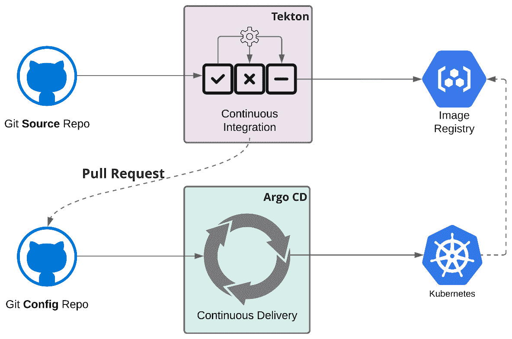
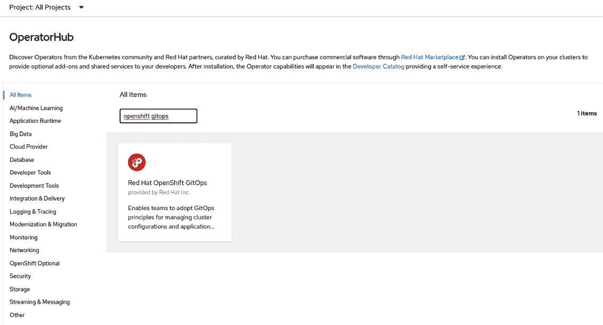

# 第十章：OpenShift GitOps – Argo CD

在上一章中，我们学习了如何使用 Tekton 创建和运行管道，以构建和部署应用程序。虽然 Tekton 很适合构建和执行通常与 **持续集成** (**CI**) 相关的其他操作，但 **GitOps** 正成为 **持续部署** (**CD**) 的标准，尤其是在 Kubernetes 原生应用程序方面。在本章中，我们将深入探讨 GitOps，并讨论其中一个最适合 CD 的工具：**Argo CD**。

在本章中，我们将讨论以下内容：

+   什么是 GitOps？

+   什么是 Argo CD？

+   应用交付模型

+   安装 OpenShift GitOps

+   配置 Argo CD 以支持多个集群

+   Argo CD 定义和挑战

+   Argo CD 主要对象

+   使用 GitOps 部署应用程序

+   部署到多个集群

让我们开始吧！

注意

本章使用的源代码可以在 [`github.com/PacktPublishing/OpenShift-Multi-Cluster-Management-Handbook/tree/main/chapter10`](https://github.com/PacktPublishing/OpenShift-Multi-Cluster-Management-Handbook/tree/main/chapter10) 获取。

# 什么是 GitOps？

GitOps 这一术语首次由 *Lexis Richardson*，*Weaveworks* 的 CEO，于 2017 年提出。当时，他提出了 GitOps 的四个原则，具体如下：

+   **整个系统是声明性描述的**：这意味着应用程序和基础设施的任何配置都需要作为代码来处理，而不是像脚本或自动化代码那样作为一组指令来处理。相反，您必须使用一组事实来描述系统的期望状态。这些声明文件在 Git 中进行版本控制，Git 是你唯一的真理源。这个原则的一个巨大好处是，你可以轻松地部署或回滚应用程序，更重要的是，如果发生灾难，你可以迅速恢复环境。

+   **标准的期望系统状态在 Git 中有版本控制**：Git 是你的真理源。它需要成为触发你系统中所有更改的唯一地方。理想情况下，不应直接对系统进行任何操作，而应通过 Git 上的配置更改来实现，这些更改将通过工具如 Argo CD 自动应用。

+   **批准的更改会自动应用到系统中**：由于你已经将系统的期望状态存储在 Git 中，任何更改都可以在推送到仓库时自动应用到系统中。

+   **软件代理确保正确性并在偏差时提醒您**：拥有确保系统处于所需状态的工具至关重要，这一状态在 Git 中有所描述。如果检测到任何漂移，工具需要能够自我修复应用程序，并将其恢复到所需状态。

GitOps 成为 Kubernetes 和云原生应用程序的标准，因其带来了以下好处：

+   **标准流程和工具**：Git 工作流允许团队以协作和可重现的方式工作，避免了与人类重复性任务相关的问题。

+   **强大且安全的过程**：通过在 Git 中使用**拉取请求**（**PRs**），所有更改都需要经过审查和批准。您还可以跟踪 Git 中的所有更改，并在需要时进行回退。

+   **可审计的更改**：所有更改都在 Git 历史中跟踪，并且可以轻松审计。

+   **一致性**：您可以在多个不同集群中一致地部署相同的应用程序：


图 10.1 – GitOps 工作流

现在您对 GitOps 有了更好的理解，接下来让我们学习如何将 GitOps 工作流付诸实践。

# 什么是 Argo CD？

理论上，采用 GitOps 不一定需要使用任何特定工具。您可以通过实现脚本和自动化来使用 Git 中描述系统的声明性文件部署和管理应用程序。然而，这样做会非常耗费成本和时间。幸运的是，目前有一些很棒的 Kubernetes 开源工具，它们稳定且效果良好。在本书撰写时，Kubernetes 的主要工具是**Argo CD** 和 **Flux CD**；这两者都是很棒的工具，但在本书中，我们将探索 Argo CD，它*无需额外费用，已包含在 Red Hat OpenShift 订阅中*。

简而言之，Argo CD 是一个工具，能够*读取*存储在 Git 仓库中的一组*Kubernetes 清单、Helm 图表或 Jsonnet 文件*，并将其*应用*到 Kubernetes 命名空间。虽然 Argo CD 不仅能够应用清单，还能自动化自愈、对象修剪等其他强大功能，正如我们在本章中将要探索的内容。

# 应用交付模型

现在，您可能会想知道 OpenShift Pipelines（**Tekton**）和 GitOps（**Argo CD**）之间有什么关系。Tekton 和 Argo CD 是相辅相成的工具，完美配合。虽然 Tekton 非常适合执行单元测试、构建和生成容器镜像的*CI* 流水线，但 Argo CD 更适合用于*持续交付*实践。下图总结了使用 Tekton 和 Argo CD 的 CI/CD 流水线的样子：



图 10.2 – 使用 Tekton 和 Argo CD 的应用交付模型

使用 GitOps 的 CD 意味着应该监控应用程序的实际状态，并且任何更改都需要恢复到应用程序在 Git 仓库中描述的期望状态：


图 10.3 – 使用 GitOps 进行持续交付

在本章中，我们将使用上一章的示例，利用 Argo CD 部署应用程序并实践这一应用交付模型。

# 安装 OpenShift GitOps

安装过程简单，类似于我们在上一章中讨论的 OpenShift Pipelines 安装过程。

## 先决条件

要安装 OpenShift GitOps，您需要一个具有集群管理员权限的 OpenShift 集群。

## 安装

按照以下步骤操作：

1.  使用管理员视角访问**OpenShift web 控制台**。

1.  导航至**操作符** | **OperatorHub**：


图 10.4 – OperatorHub

1.  使用*关键字筛选*框搜索 `OpenShift GitOps`：



图 10.5 – Red Hat OpenShift GitOps 在 OperatorHub 上

1.  点击**Red Hat OpenShift GitOps**图标，然后点击**安装**按钮，进入**安装**页面：


图 10.6 – 安装 OpenShift GitOps

1.  现在，选择 `openshift-operators` 命名空间，并允许操作符在任何目标命名空间中安装 OpenShift GitOps 实例。

1.  选择**自动**或**手动**作为升级的**审批策略**。如果选择**自动**，升级将在 Red Hat 发布后，由**操作符生命周期管理器**(**OLM**)自动执行；而选择**手动**时，你需要批准后才能应用升级。

1.  选择一个**更新频道**。推荐选择**稳定**频道，因为它包含了操作符的最新稳定和*受支持*版本。

1.  点击**安装**按钮：


图 10.7 – 安装操作符

1.  等待最多 5 分钟，直到你看到以下消息：


图 10.8 – 操作符已安装

OpenShift GitOps (Argo CD) 也有一个 CLI，帮助执行常见任务，如更新管理员密码、注册外部集群等。让我们来学习如何安装 `argocd` CLI。

## 安装 `argocd` CLI

`argocd` CLI 使得与 Argo CD 的工作更加便捷。通过它，你可以管理 Argo CD 项目、应用程序、集群凭据等。

要安装 `argocd` CLI，请按照以下步骤操作：

1.  从 [`github.com/argoproj/argo-cd/releases/latest`](https://github.com/argoproj/argo-cd/releases/latest) 下载最新的 Argo CD 二进制文件。

1.  如果你使用的是 Linux，下载 CLI 并将其添加到你的路径中：

    ```
    $ sudo curl -sSL -o /usr/local/bin/argocd https://github.com/argoproj/argo-cd/releases/latest/download/argocd-linux-amd64
    $ sudo chmod +x /usr/local/bin/argocd
    ```

1.  如果一切顺利，运行 `argocd version` 命令时你将看到如下输出。忽略最后一行的错误信息；它是预期中的消息，因为我们还没有登录到任何 OpenShift 集群：

    ```
    $ argocd version
    argocd: v2.2.1+122ecef
      BuildDate: 2021-12-17T01:31:40Z
      GitCommit: 122ecefc3abfe8b691a08d9f3cecf9a170cc8c37
      GitTreeState: clean
      GoVersion: go1.16.11
      Compiler: gc
      Platform: linux/amd64
    FATA[0000] Argo CD server address unspecified
    ```

现在，让我们学习如何配置 Argo CD，以便在多个集群中部署应用程序。

# 配置 Argo CD 用于多个集群

如果你计划使用 Argo CD 将应用程序部署到*外部集群*，你需要使用 `argocd` CLI 添加新集群的凭据。如果你只想在安装了 Argo CD 的同一集群中部署应用程序（`kubernetes.default.svc` 文件已存在，并且应该在这种情况下使用），则可以跳过此步骤。

要注册新集群，请使用你之前安装的 `argocd` CLI 执行以下步骤：

1.  登录到我们想要注册的新集群：

    ```
    $ oc login -u <user> https://<api-newcluster>:6443
    ```

1.  现在，使用 `oc login` 登录到安装了 Argo CD 的集群：

    ```
    $ oc login -u <user> https://<api-argocluster>:6443
    ```

1.  此时，您应该在 `kubeconfig` 文件中拥有两个集群：

    ```
    $ oc config get-contexts
    CURRENT NAME         CLUSTER    AUTHINFO NAMESPACE
            newcluster   newcluster admin
    *       argocluster  argocluster
    ```

1.  为新集群设置不同的上下文：

    ```
    $ oc config set-context prd-cluster --cluster=newcluster --user=admin
    Context "prd-cluster" created.
    ```

1.  从 `openshift-gitops` 命名空间获取 Argo CD 公共 URL：

    ```
    $ oc get route openshift-gitops-server -n openshift-gitops -o jsonpath='{.spec.host}'
    ```

1.  获取管理员密码：

    ```
    $ oc extract secret/openshift-gitops-cluster -n openshift-gitops --to=-
    ```

1.  使用 `argocd` 登录：

    ```
    $ argocd login --insecure openshift-gitops-server-openshift-gitops.apps.example.com
    Username: admin
    Password:
    'admin:login' logged in successfully
    Context ' openshift-gitops-server-openshift-gitops.apps.example.com' updated
    ```

1.  现在，将新集群添加到 Argo CD：

    ```
    argocd cluster add prd-cluster -y
    INFO[0000] ServiceAccount "argocd-manager" created in namespace "kube-system"
    INFO[0000] ClusterRole "argocd-manager-role" created
    INFO[0001] ClusterRoleBinding "argocd-manager-role-binding" created
    Cluster 'h https://<api-newcluster>:6443' added
    ```

有了这些，您就可以使用 Argo CD 将应用程序部署到本地或远程集群了！但在深入应用程序部署之前，我们先来看一下与 Argo CD 相关的一些重要方面。

# Argo CD 定义和挑战

在我们讲解应用程序部署过程之前，我们需要讨论一些与 GitOps、决策和标准相关的重要挑战。

## GitHub 仓库结构

GitOps 常见的第一个重要问题是关于 GitHub 仓库结构的。是否应该仅使用一个仓库来存放源代码和 Kubernetes 清单？如何处理不同环境（如开发、QA 和生产）的不同配置文件？

对这些问题没有标准的正确或错误答案，因为每种选项都有其优缺点。您需要找出最适合您的方法。我的建议是：尝试一下！没有什么比实际经验更好的了，所以请使用每个模型，找出最适合您应用程序和团队的方案。在接下来的部分中，我们将讨论一些 GitOps 定向应用程序中最流行的仓库结构。

### 单一仓库

在这种结构下，您将拥有一个仓库来存放所有 Kubernetes 清单和基础设施相关文件。尽管没有统一的标准来定义这种结构，但您可能会有一个类似以下的仓库：

```
├── config #[1]
├── environments #[2]
│   ├── dev #[3]
│   │   ├── apps #[4]
│   │   │   └── app-1
│   │   └── env #[5]
│   └── qa #[6]
│   │   ├── apps
│   │   │   └── app-1
│   │   └── env
(...)
```

让我们更详细地看看这些代码：

+   **#[1]**：此文件夹包含 CI/CD 流水线、Argo CD 以及其他相关的配置文件，这些文件对任何环境都是通用的

+   **#[2]**：此文件夹包含特定于每个环境的清单文件，如开发、QA 和生产

+   **#[3]**：这些是特定于开发环境的清单文件

+   **#[4]**：在这里，您可以找到部署应用程序的 Kubernetes 清单，这些应用程序在这个仓库中进行追踪和发布

+   `RoleBinding` 权限，`Namespace` 等等

+   **#[6]**：这些是特定于 QA 环境的清单文件

这种方法的主要好处是**简洁性**：在这种方法中，您只需管理一个仓库来存放一个或多个应用程序，这使得管理分支、标签、**PR** 以及与应用程序清单仓库相关的任何事务都变得更加容易。然而，这种策略的主要缺点是，所有贡献者都可以读取并更改生产清单。这意味着可能会*很难发现对生产环境的无意更改*，尤其是对于大型 PR 来说。

这引出了我们下一种方法，在这种方法中，每个环境都有一个不同的代码库。

### 每个环境一个代码库

使用这种策略，您将拥有多个代码库，每个环境一个。换句话说，您将为*开发*清单、*QA*清单等创建不同的代码库。在这种策略下，您可能会使用 PR（Pull Requests）在每个环境之间推广变更，并拥有一个精细的审查过程，从而减少错误的发生。在这种策略下，您还可以根据每个环境管理 Git 权限：


图 10.9 – 每个环境一个代码库

在本章中，我们将采用单一代码库策略，并使用 Git 推送请求和 PR 与多个分支，以减少无意更改的风险。

接下来，我们将讨论与 Kubernetes 上的 GitOps 相关的另一个重要方面：模板化 YAML 文件并避免重复。

## 模板化 Kubernetes 清单

无论您决定采用什么样的代码库结构，有一点是确定的：您将需要为每个您管理的环境创建单独的文件和文件夹。那么，如何避免到处重复 YAML 清单文件并将 GitOps 过程变成一场噩梦呢？

当前，最流行的做法如下：

+   **Helm**：依赖于 Helm Charts 和 Helm Templates 来打包和交付 Kubernetes 应用程序。通过 Helm Templates，您可以将值与模板结合，生成有效的 Kubernetes 清单文件。

+   **Kustomize**：使用 Kustomize，您可以通过补丁策略重用现有的清单文件。它采用层次结构，这样您可以灵活地重用共享配置，并创建只包含特定于环境的参数的配置层，这些参数将会覆盖基础参数。

虽然 Helm 是一个很好的打包工具，但由于以下原因，本章将重点讨论 Kustomize：

+   Kustomize 原生运行在 Kubernetes 和 OpenShift CLI（`kubectl`/`oc`）上

+   它是声明性的，这是 GitOps 的一个重要因素，正如我们之前提到的那样。

+   您可以使用远程基础代码库作为清单的起始集，并将覆盖存储在不同的代码库中。

让我们更详细地了解 Kustomize。

### Kustomize

Kustomize 由层次化的清单文件组成：

+   `Base`：这是一个包含始终作为基础清单文件重用的资源的目录。这些资源以声明性方式描述应用程序和对象。

+   `Overlays`：这是一个仅包含每个覆盖特定配置的目录。例如，通常会有一个用于开发环境的覆盖，一个用于 QA 的覆盖，等等。存储在`overlay`目录中的配置会替换`base`目录中的值。

你可以有多个基础和覆盖层——可以根据需要使用任意数量。然而，为了保持应用清单文件的可读性和可维护性，不建议使用多个清单层次结构。以下图示展示了一个基础和两个覆盖层的示例，可能会与 Kustomize 一起使用：


图 10.10 – Kustomize 层次结构

以下是你在使用 Kustomize 时通常会看到的文件夹结构：

```
├── base
│   ├── deployment.yaml
│   ├── kustomization.yaml
│   ├── route.yaml
│   └── service.yaml
└── overlays
    ├── dev
    │   ├── deployment-patch.yaml
    │   ├── kustomization.yaml
    │   └── namespace.yaml
    ├── prod
    │   ├── deployment-patch.yaml
    │   ├── kustomization.yaml
    │   └── namespace.yaml
    └── qa
        ├── deployment-patch.yaml
        ├── kustomization.yaml
        └── namespace.yaml
```

在本章中，我们将在部署示例时进一步练习使用 Kustomize。

## 管理秘密

最后但同样重要的是，Kubernetes 的真正挑战是使用秘密管理敏感数据。虽然秘密在一定程度上是安全的，但根据用户权限的设置，它们并没有加密。当我们考虑将这些秘密存储在 GitHub 仓库中时，这就成为一个真实的问题。那么，我们该如何安全地处理秘密呢？

处理密码有两种方法：

+   使用外部保险库安全地存储秘密，避免存储在 Git 和集群中

+   在将秘密保存在 Git 中之前，使用加密工具（如 Bitnami Sealed Secrets）对其进行加密

备注

1\. 密码以 Base64 编码呈现。例如，以下命令解密名为 `db-root-password` 的密码字段：

`oc get secret db-root-password –o jsonpath="{.data.password}" | base64 -d`

2\. Bitnami Sealed Secrets 允许你将秘密加密为 `SealedSecret` 对象，并安全存储，即使是在公共 GitHub 仓库中，因为它使用公钥/私钥证书进行加密。欲了解更多信息，请查看 *进一步阅读* 部分中的链接。

通过这些，我们已经讨论了你在 GitOps 中需要考虑的主要问题。在我们实际示例之前，这些都是我们决定向你介绍的重要话题，但别太担心——你会通过实践和学习，找到最适合你和你团队的方法。在接下来的部分，我们将介绍一些你将在 Argo CD 中使用的主要对象。

# Argo CD 主要对象

在本节中，我们将介绍一些你需要了解的主要 Argo CD 对象。Argo CD 相当简单，绝大多数操作可以归纳为两个对象：**AppProject** 和 **Application**。

在本节中，我们不会提及 Argo CD 的所有不同对象，因为这不是本书的主要焦点。请查阅 *进一步阅读* 部分了解更多。

## AppProject

项目允许你将应用程序分组，并根据你需要的任何逻辑结构进行组织。使用项目，你可以执行以下操作：

+   限制可以用来部署应用程序的 Git *源仓库*

+   限制应用程序可以部署到的 *集群和命名空间目标*

+   限制可以部署的对象类型（例如，Deployments、Secrets、DaemonSets 等）

+   设置角色以限制组和/或 JWTs 允许的权限

当安装 Argo CD 时，它会附带一个`默认`项目。如果在 Argo CD 应用程序中没有指定项目，则将使用`默认`选项。创建额外的项目是可选的，因为你可以选择使用 Argo CD 的`默认`项目。然而，建议创建额外的项目，以帮助你更好地组织 Argo CD 应用程序。

注意

Argo CD 的默认项目与 OpenShift 的默认命名空间之间没有关系。尽管它们的名称相同，但它们是没有关联的。

一个典型的`AppProject`规范如下：

```
apiVersion: argoproj.io/v1alpha1
kind: AppProject
metadata:
  name: clouds-api #[1]
  namespace: openshift-gitops
spec:
  sourceRepos: #[2]
    - '*'
  destinations: #[3]
    - namespace: '*'
      server: '*'
  clusterResourceWhitelist: #[4]
    - group: '*'
      kind: '*'
```

让我们更详细地查看这段代码：

+   **[1]**：项目的名称。

+   **[2]**：允许的 Git 源仓库。在这种情况下，允许任何源仓库。

+   **[3]**：允许的目标集群和命名空间。在这种情况下，允许任何集群和命名空间的组合。

+   **[4]**：可以部署的对象（例如 Deployments、Secrets、DaemonSets 等）。在这种情况下，没有任何限制。

正确调整代码，以实现清单文件。

## 应用程序

应用程序代表已由 Argo CD 部署和管理的应用程序实例。应用程序的规范由`source`和`destination`组成。`source`是存放指定应用程序期望状态的 Kubernetes 清单（Git 仓库）的地方，而`destination`则指定应用程序将要部署的集群和命名空间。此外，你还可以指定希望 Argo CD 应用的同步策略。

以下是一个`应用程序`规范的示例：

```
apiVersion: argoproj.io/v1alpha1
kind: Application
metadata:
  name: clouds-app-dev #[1]
  namespace: openshift-gitops #[2]
spec:
  project: clouds-api #[3]
  source: #[4]
    repoURL: `https://github.com/PacktPublishing/OpenShift-Multi-Cluster-Management-Handbook.git'
    path: chapter10/clouds-api-gitops/overlays/dev
    targetRevision: dev
  destination: #[5]
    server: 'https://kubernetes.default.svc'
    namespace: default
  syncPolicy: #[6]
    automated:
      selfHeal: true
```

让我们更详细地查看这段代码：

+   `应用程序`名称。

+   `openshift-gitops`。

+   `AppProject`对象。不要将其与 OpenShift 项目混淆，它们没有关系。

+   **[4]**：关于 Kubernetes 清单所在位置的 Git 源仓库信息。

+   **[5]**：应用程序将要部署的集群和命名空间。

+   **[6]**：Argo CD 将使用的同步策略。我们将在下一节中了解这些策略。

重要提示

Argo CD 的命名空间（`openshift-gitops`）在集群中具有执行所有必要活动的特殊权限。因此，你必须保护对该命名空间的访问，以避免不必要的部署或更改。

### 同步策略

你可以配置 Argo CD 在 Git 中的清单指定的期望状态与实际应用状态之间出现任何偏差时，自动同步应用程序。你可以使用 Argo CD 提供以下选项：

+   如果是`true`，Argo CD 会在检测到 Git 中的清单与实际状态之间的任何差异时自动同步。默认情况下，此标志为`false`。

+   将`prune`标志设置为`true`。

### 同步顺序

对于标准的 Kubernetes 清单，Argo CD 已经知道需要应用的正确顺序，以避免优先级问题。例如，考虑一个包含三个清单的应用，分别用于命名空间创建、部署和角色绑定。在这种情况下，Argo CD 将始终按照以下顺序应用这些对象：

1.  命名空间

1.  角色绑定

1.  部署

话虽如此，你不必为此担心，因为 Argo CD 足够智能，能够按照正确的顺序应用它们。

然而，在一些特定的情况下，你可能需要指定对象的优先级。例如，假设你想部署一个由一个 StatefulSet（用于部署数据库）和一个部署（用于使用数据库的应用）组成的应用。在这种情况下，你可以使用**资源钩子**来指定正确的应用顺序。

可以使用以下类型的资源钩子：

+   `PreSync`：标记为`PreSync`的对象将在任何其他清单之前执行。

+   `Sync`：此操作在`PreSync`完成后运行。你还可以使用`sync-wave`来设置在`Sync`阶段中对象的同步优先级。

+   `PostSync`：在所有`Sync`对象应用完并处于`健康`状态后运行。

+   `SyncFail`：带有此注释的清单仅在同步操作失败时执行。

以下是一个资源钩子规范的示例：

```
apiVersion: apps/v1
kind: Deployment
metadata:
  annotations:
    argocd.argoproj.io/hook: Sync
    argocd.argoproj.io/sync-wave: "1"
(.. omitted ..)
```

你可以在清单中包含不同类型的注释，以执行更复杂的任务。请查看*进一步阅读*部分了解更多信息。

到此为止，我们已经涵盖了 GitOps 和 Argo CD 背后最重要的概念和理论。现在，事不宜迟，让我们来看看我们的示例，并实践迄今为止所讨论的内容！

# 使用 GitOps 部署应用

在这个实际操作中，我们将在三个不同的命名空间中构建并部署我们的示例应用，以模拟由开发、QA 和生产环境组成的应用生命周期。下图展示了我们将在本次练习中使用的交付模型，以便实践 Argo CD 部署。你可以将其作为起点，根据自己的需求构建全面且复杂的 ALM 工作流：


图 10.11 – 使用 Tekton、Argo CD 和 Git 的应用交付模型

再次提醒，我们将使用本书 GitHub 仓库中准备的内容。为此，你必须*将此仓库 fork 到你的 GitHub 账号*：[`github.com/PacktPublishing/OpenShift-Multi-Cluster-Management-Handbook`](https://github.com/PacktPublishing/OpenShift-Multi-Cluster-Management-Handbook)。一旦你完成 fork，请按照本节中的说明操作，将此工作流付诸实践。

## 构建一个新的镜像版本

在本节中，我们将构建一个新的容器镜像版本 1.0，并将其推送到 OpenShift 内部注册表，如下图所示：


图 10.12 – 构建新镜像版本

为此，请执行以下步骤：

1.  在你的机器上克隆该仓库：

    ```
    $ GITHUB_USER=<your_user>
    $ git clone https://github.com/PacktPublishing/OpenShift-Multi-Cluster-Management-Handbook.git
    ```

1.  运行以下脚本并按照指示将引用从原始仓库（`PacktPublishing`）更改为你自己的分叉仓库：

    ```
    $ cd OpenShift-Multi-Cluster-Management-Handbook/chapter10
    $ ./change-repo-urls.sh
    # Go back to the root dir
    $ cd ..
    ```

1.  为开发创建一个新分支：

    ```
    $ git checkout -b dev
    ```

1.  使用你喜欢的文本编辑器打开`./sample-go-app/clouds-api/clouds.go`文件，并在第 147 行添加`version=1.0`：

    ```
    $ vim ./sample-go-app/clouds-api/clouds.go
    func homePage(w http.ResponseWriter, r *http.Request) {
    fmt.Fprintf(w, "Welcome to the HomePage! Version=1.0")
    fmt.Println("Endpoint Hit: homePage")
    }
    ```

1.  提交并推送更改到`dev`分支：

    ```
    $ git add ./sample-go-app/clouds-api/clouds.go
    $ git commit -m 'Version 1.0 changes'
    $ git push -u origin dev
    ```

1.  运行以下命令来部署所需的先决条件和构建版本为 1.0 的镜像管道，稍后我们将在开发命名空间中部署它。确保你已经登录到 OpenShift 集群（使用`oc login`命令）：

    ```
    $ oc apply -k ./chapter10/config/cicd
    ```

1.  现在，运行管道并查看日志：

    ```
    $ oc apply -f ./chapter10/config/cicd/pipelinerun/build-v1.yaml -n cicd
    $ tkn pipelinerun logs build-v1-pipelinerun -f -n cicd
    [fetch-repository : clone] + '[' false = true ']'
    [fetch-repository : clone] + '[' false = true ']'
    [fetch-repository : clone] + CHECKOUT_DIR=/workspace/output/
    [fetch-repository : clone] + '[' true = true ']'
    (.. omitted ..)
    [build-image : push] Writing manifest to image destination
    [build-image : push] Storing signatures
     [build-image : digest-to-results] + cat /workspace/source/image-digest
    [build-image : digest-to-results] + tee /tekton/results/IMAGE_DIGEST
    [build-image : digest-to-results] sha256:5cc65974414ff904f28f92a0deda96b08f4ec5a98a09c59d81eb59459038b547
    ```

这样，你就构建了`clouds-api:v1.0`容器镜像，并将其推送到 OpenShift 的内部注册表中。现在，让我们使用**Kustomize**和**Argo CD**来部署此镜像。

## 在开发环境中部署

在本节中，我们将使用 Kustomize 覆盖部署 YAML 文件中的镜像标签，使其使用我们在上一节中构建的`v1.0`。我们还将为开发分支创建一个名为`clouds-api-dev`的新命名空间。

以下图表显示了我们将执行的步骤：


图 10.13 – 在开发环境中部署

执行以下步骤：

1.  更改我们开发环境`kustomization.yaml`文件中的镜像版本。为此，将第 18 行的`changeme`改为`v1.0`：

    ```
    $ vim ./chapter10/clouds-api-gitops/overlays/dev/kustomization.yaml
    apiVersion: kustomize.config.k8s.io/v1beta1
    kind: Kustomization
    commonLabels:
      environment: dev
    namespace: clouds-api-dev
    bases:
      - ../../base
    resources:
      - namespace.yaml
    images:
    - name: quay.io/gfontana/clouds-api
      newName: image-registry.openshift-image-registry.svc:5000/cicd/clouds-api
      newTag: v1.0 # Change this line
    ```

1.  另外，你也可以使用`sed`命令来替换这一行：

    ```
    sed -i 's/changeme/v1.0/' ./chapter10/clouds-api-gitops/overlays/dev/kustomization.yaml
    ```

1.  现在，将此更改推送到`dev`分支：

    ```
    $ git add chapter10/clouds-api-gitops/overlays/dev/kustomization.yaml
    $ git commit -m 'updating kustomization file for v1.0'
    $ git push -u origin dev
    ```

1.  现在，我们来创建一个新的 Argo CD 项目：

    ```
    $ oc apply -f ./chapter10/config/argocd/argocd-project.yaml
    ```

1.  创建一个新的 Argo CD 应用程序，将应用部署到开发命名空间中：

    ```
    $ oc apply -f ./chapter10/config/argocd/argocd-app-dev.yaml
    ```

1.  使用以下命令获取 Argo CD 的 URL 和管理员密码：

    ```
    # Get the Argo CD url:
    $ echo "$(oc  get route openshift-gitops-server -n openshift-gitops --template='https://{{.spec.host}}')"
    # Get the Admin password
    $ oc extract secret/openshift-gitops-cluster -n openshift-gitops --to=-
    ```

1.  使用之前提供的 URL 和管理员用户访问 Argo CD UI。你应该能看到一个名为`clouds-app-dev`的新应用程序：


图 10.14 – 在开发中部署的 Argo CD 应用

1.  点击**clouds-app-dev**以了解更多关于该应用程序的信息：


图 10.15 – Argo CD 应用

1.  运行`curl`命令来检查版本 1.0 的应用程序是否正在运行，并已通过 Argo CD 成功部署：

    ```
    $ curl $(oc get route clouds-api -n clouds-api-dev --template='http://{{.spec.host}}')
    ```

你应该会看到以下响应：

```
Welcome to the HomePage! Version=1.0
```

这样，我们的示例应用程序就运行在开发命名空间中了。现在，让我们学习如何将这个应用程序提升到下一个阶段：QA。

## 提升到 QA

我们已经在开发环境中运行了 1.0 版本的应用程序。现在，让我们再次使用 Kustomize 和 Argo CD 将其部署到一个新的命名空间，该命名空间专用于 QA，如下图所示：


图 10.16 – 推送到 QA 环境

按照以下步骤操作：

1.  为 QA 创建一个新分支：

    ```
    $ git checkout -b qa
    ```

1.  通过复制 `dev` 覆盖层来为 QA 创建一个覆盖层：

    ```
    $ cp -r ./chapter10/clouds-api-gitops/overlays/dev/ ./chapter10/clouds-api-gitops/overlays/qa/
    ```

1.  将所有 `dev` 的引用替换为 `qa`：

    ```
    $ sed -i 's/dev/qa/' ./chapter10/clouds-api-gitops/overlays/qa/namespace.yaml ./chapter10/clouds-api-gitops/overlays/qa/kustomization.yaml
    ```

1.  将更改推送到 Git：

    ```
    $ git add ./chapter10/clouds-api-gitops/overlays/qa
    $ git commit -m 'Promoting v1.0 to QA'
    $ git push -u origin qa
    ```

1.  将清单文件部署到生产环境，以便使用 Argo CD 推送到环境：

    ```
    $ oc apply -f ./chapter10/config/argocd/argocd-app-qa.yaml
    ```

1.  再次访问 Argo CD UI。此时，你应该在 Argo CD 上看到两个应用程序：


图 10.17 – Argo CD 应用程序

1.  让我们访问正在 QA 命名空间中运行的应用程序：

    ```
    $ curl $(oc get route clouds-api -n clouds-api-qa --template='http://{{.spec.host}}')
    ```

你应该看到与之前相同的响应：

```
Welcome to the HomePage! Version=1.0
```

至此，我们已经将应用程序推送到 QA 环境！现在，让我们学习如何将它迁移到最后一个阶段，即生产环境。

## 推送到生产环境

对于生产环境，我们将使用不同的方法——我们将使用 PR 而不是简单的 Git 推送。我们将使用一个名为 `pre-prod` 的临时分支来提交将用于生产的覆盖清单，如下图所示：


图 10.18 – 推送到生产环境

按照这些步骤将我们的应用程序版本 1.0 推送到生产环境：

1.  创建一个新分支，为生产环境做准备：

    ```
    $ git checkout -b pre-prod
    ```

1.  为生产环境创建一个覆盖层，类似于你在 QA 环境中所做的：

    ```
    $ cp -r chapter10/clouds-api-gitops/overlays/dev/ chapter10/clouds-api-gitops/overlays/prod/
    $ sed -i 's/dev/prod/' ./chapter10/clouds-api-gitops/overlays/prod/namespace.yaml ./chapter10/clouds-api-gitops/overlays/prod/kustomization.yaml
    ```

1.  将更改推送到 `pre-prod` 分支：

    ```
    $ git add ./chapter10/clouds-api-gitops/overlays/prod
    $ git commit -m 'Promoting v1.0 to Prod'
    $ git push -u origin pre-prod
    ```

1.  现在，在 GitHub 上创建一个 PR 并将其与主分支合并。访问你 GitHub 仓库的 **Pull requests** 标签页并点击 **New pull request** 按钮：


图 10.19 – 创建 PR

1.  由于你正在使用分叉的代码库，GitHub 建议你为源代码库创建一个 PR（在本例中是从 `PacktPublishing`）。我们想要创建一个从我们的 `pre-prod` 分支到 `main` 分支的 PR，这两个分支都位于我们分叉的代码库中。因此，将基础代码库更改为我们的分叉代码库：


图 10.20 – 创建 PR

1.  然后，在 **compare** 字段中选择 `pre-prod`：


图 10.21 – 创建 PR

1.  现在，填写表单并点击 **Create pull request**：


图 10.22 – 创建 PR

1.  在实际场景中，这个 PR 会被审查、同事审批并合并。我们目前还在练习阶段，因此让我们点击 **Merge pull request** 按钮：


图 10.23 – 审批 PR

1.  生产环境版本 1.0 的覆盖清单已经存在于我们 Git 仓库的 `main` 分支中。这意味着我们可以使用 Argo CD 部署它：

    ```
    $ git checkout main
    $ oc apply -f ./chapter10/config/argocd/argocd-app-prod.yaml
    ```

1.  到此为止，你应该在 Argo CD 上有三个应用程序：


图 10.24 – Argo CD 应用程序

1.  让我们访问应用程序，查看运行在生产环境中的应用版本 1.0：

    ```
    $ curl $(oc get route clouds-api -n clouds-api-prod --template='http://{{.spec.host}}')
    ```

你应该看到和之前一样的响应：

```
Welcome to the HomePage! Version=1.0
```

恭喜！我们已经使用 Argo CD 将应用程序部署到三个不同的命名空间，每个命名空间代表一个不同的环境：开发、QA 和生产。由于本书旨在讲解*多集群*，我们必须学习如何执行相同的过程，但将应用部署到多个集群，而不是仅仅部署到一个集群。在下一节中，你将看到整个过程相同，唯一的不同是你必须在 Argo CD 的 `Application` 对象中更改一个参数。

# 部署到多个集群

我们在 *配置 Argo CD 以支持多集群* 章节中学习了如何注册外部集群。一旦你在 Argo CD 中注册了多个外部集群，部署应用到其中一个集群就变得简单——你只需要在 Argo CD 的 `Application` 中的 `destination` 字段引用你注册的外部集群。以下清单中展示了一个示例：

```
apiVersion: argoproj.io/v1alpha1
kind: Application
metadata:
  name: clouds-app-dev-external-cluster
  namespace: openshift-gitops
spec:
  project: clouds-api
  source:
    repoURL: `https://github.com/PacktPublishing/OpenShift-Multi-Cluster-Management-Handbook'
    path: chapter10/clouds-api-gitops/overlays/dev
    targetRevision: dev
  destination:
    server: 'https://api.<external-cluster>:6443'
    namespace: default
  syncPolicy:
    automated:
      selfHeal: true
```

你可以根据需要创建多个 `Application` 对象，将应用部署到本地集群或多个外部集群。如你所见，部署过程本身是相似的，无论你是将应用部署到本地集群还是外部集群。

重要说明

当你与多个集群一起工作时，你需要特别关注 **容器镜像注册表**。正如其名称所示，OpenShift 内部注册表应该只在单个集群内使用；它不适合用于多个集群。在这种情况下，建议使用企业级容器镜像注册表。市场上有多种选择，例如 Nexus、Quay、Harbor 等等。在本书中，我们将在 *第十三章* 中介绍 Quay，*OpenShift Plus - 一种多集群企业级解决方案*。

# 总结

在本章中，你学习了与 **GitOps** 相关的各种概念。你还学习了 **Argo CD** 以及如何在 OpenShift 上安装并使用它。你还构建并部署了一个示例应用程序到三个不同的命名空间，以模拟 *开发*、*QA* 和 *生产* 环境。最后，你了解到，无论是部署到本地集群还是外部集群，过程类似——你只需要更改目标服务器字段。

Argo CD 允许你使用 GitOps 建立高效且强大的应用交付模型，在这种模型中，无论你将应用部署到哪里，都能确保*一致性*、*可审计的变更*和*安全的过程*。而最棒的是，它的使用没有额外费用，因为它已经包含在 Red Hat OpenShift 的订阅中。也就是说，如果你在 OpenShift 上部署容器化应用，我强烈建议你尝试 OpenShift GitOps，并使用我们在本章中探讨的概念。

在下一章，我们将探讨一个极好的工具，它将帮助你通过单一统一界面部署和管理多个 OpenShift 集群 —— **Red Hat 高级集群管理**。这个工具可以让你监控、管理、定义和执行策略，并向多个集群部署应用。

让我们继续，深入了解 Red Hat 高级集群管理！

# 深入阅读

要了解本章所涵盖的主题，请查看以下资源：

+   *GitOps 的历史：* [`www.weave.works/blog/the-history-of-gitops`](https://www.weave.works/blog/the-history-of-gitops)

+   *Argo CD 官方文档：* [`argo-cd.readthedocs.io/`](https://argo-cd.readthedocs.io/)

+   *关于* **Kustomize** 的优秀教程：[`blog.stack-labs.com/code/kustomize-101/`](https://blog.stack-labs.com/code/kustomize-101/)

+   *Bitnami 的 Sealed Secrets 概述：* [`github.com/bitnami-labs/sealed-secret`](https://github.com/bitnami-labs/sealed-secrets)。
