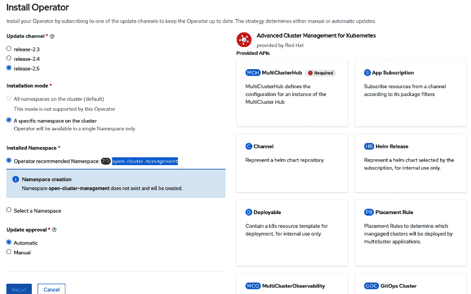
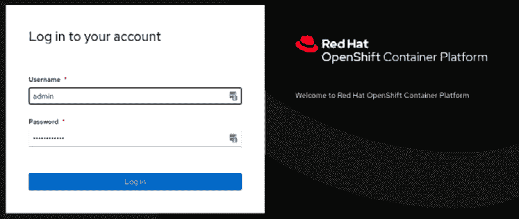
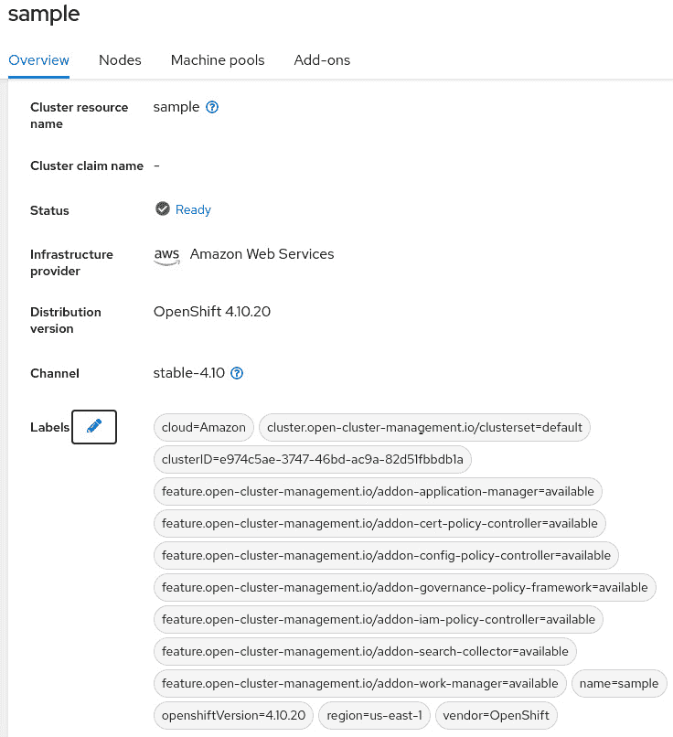

# 第十一章：OpenShift 多集群 GitOps 和管理

在本书的第一章中，我们讨论了大多数组织在多云或混合云环境中扩展 Kubernetes 基础设施时面临的主要挑战。当您在不同的提供商上部署多个集群时，会出现新的挑战，具体如下：

+   **不一致的安全策略**：具有不同访问规则、用户配置文件、允许/阻止的网络流、证书和其他安全方面配置的集群，会使组织更容易遭受数据泄露和其他安全事件的风险。

+   **高运营工作量以管理所有集群**：管理多个集群的配置、组件、合规性和政策是非常繁重的。

+   **应用程序的部署和管理**：当您需要跨多个集群进行部署时，部署过程变得更加复杂。监控和管理这些集群也非常复杂，并且需要大量人工努力。

在本章中，我们将介绍一个很好的工具，帮助您解决这些挑战，并减轻您和/或您的团队在管理多个集群时可能需要处理的工作量：Red Hat **高级集群管理**（**ACM**）。

因此，您将在本章中找到以下主题：

+   什么是 Red Hat ACM？

+   Red Hat ACM 安装

+   使用 Red Hat ACM 管理集群

+   使用 Red Hat ACM 管理应用程序

+   使用 Red Hat ACM 进行治理

+   使用 Red Hat ACM 进行多集群可观察性

注意

本章中使用的源代码可以在 [`github.com/PacktPublishing/OpenShift-Multi-Cluster-Management-Handbook/tree/main/chapter11`](https://github.com/PacktPublishing/OpenShift-Multi-Cluster-Management-Handbook/tree/main/chapter11) 获取。

# 什么是 Red Hat ACM？

Red Hat ACM 是一个完整的 Kubernetes 多集群管理解决方案，通过单一面板实现，包括一些其他出色的功能，使得复杂和耗时的任务变得更加容易。Red Hat ACM 提供了几个主要功能，列举如下：

+   **Kubernetes 多集群管理**：在本地和云端创建、更新和删除 Kubernetes 集群。

+   **多集群可观察性**：ACM 还可以从单一视角提供所有集群的可观察性，使管理员能够读取、汇总并接收集群的警报。

+   **通过策略进行治理**：通过 Red Hat ACM，您可以审核和强制执行政策，在集群中应用您想要的任何内容，从安全到基础设施以及与应用程序相关的内容。这包括角色和访问控制、必须安装的操作员和安全合规规则。

+   **应用程序管理**：从 Git 仓库或 Helm 同时部署应用程序到多个集群，并且可以从单一面板查看它们。

ACM 的一个重要特点是其多集群架构——它旨在从单一视角管理多个集群，正如下图所示。


图 11.1 – ACM 中心集群和受管集群

为此，它使用了中心集群和受管集群的概念，如下所示：

+   **中心集群**：运行 ACM 中央控制器的 OpenShift 集群，包含 Web 控制台、API 和其他构成产品功能的组件。在本章中，我们将多次使用“中心集群”一词来指代承载 ACM 的 OpenShift 集群。OpenShift 是唯一支持的中心集群选项。

+   **受管集群**：由 ACM 管理的集群。ACM 可以管理 OpenShift 以及其他基于 Kubernetes 的发行版。请查看本章末尾的*进一步阅读*部分，查找 ACM 支持的 Kubernetes 发行版的完整列表（支持矩阵）。

我们将在本章接下来的部分深入探讨所有这些功能。

# Red Hat ACM 安装

在本节中，我们将指导您安装和配置 ACM。

重要说明

需要注意的是，ACM 使用中心集群的计算、内存和存储资源，因此建议为 ACM 配备一个专用集群作为中心集群，避免并发工作负载和资源使用。这是推荐的做法，但不是必需的；您可以在任何具有足够容量的 OpenShift 集群中运行 ACM。

安装过程很简单，类似于我们在前几章中使用 OpenShift Pipelines 和 GitOps 时所遵循的过程，您可以在本节中看到。

## 前提条件

1.  需要访问具有集群管理员权限的 OpenShift 集群。

## 安装

按照以下步骤安装 Red Hat 高级集群管理：

1.  使用集群管理员用户访问 OpenShift Web 控制台。

1.  导航到**操作符** | **OperatorHub** 菜单项。


图 11.2 – OperatorHub

1.  使用**按关键字筛选...**框搜索`Kubernetes 的高级集群管理`。


图 11.3 – OperatorHub 上的 Kubernetes 高级集群管理

1.  点击**Kubernetes 的高级集群管理**图标，然后点击**安装**按钮，进入**安装操作符**屏幕。


图 11.4 – 安装 Kubernetes 的高级集群管理

1.  请勿更改默认命名空间（`open-cluster-management`）。

1.  选择**自动**或**手动**作为**更新批准**选项。如果选择**自动**，升级将在**操作符生命周期管理器**（**OLM**）发布后自动执行，而选择**手动**时，您需要在应用之前进行批准。

1.  选择正确的更新通道。推荐选择稳定通道，因为它包含最新的稳定版本和*受支持*版本的操作符。

1.  点击**安装**按钮。



图 11.5 – 安装操作员

1.  等待最多 5 分钟，直到你看到以下消息：


图 11.6 – 操作员已安装

现在我们已经安装了操作员，可以继续部署一个新的**MultiClusterHub**实例：

1.  点击**创建 MultiClusterHub**按钮。

1.  通常不需要更改任何设置；保持默认值并点击**创建**按钮。如果需要配置一些高级设置，可以查看本章*进一步阅读*部分中的链接，获取产品文档以获得更多信息。


图 11.7 – 创建 MultiClusterHub

1.  在安装过程中，你将看到状态`Phase: Installing`。


图 11.8 – 安装 MultiClusterHub

1.  等待一会儿，直到你看到`Phase: Running`状态。


图 11.9 – MultiClusterHub 运行中

1.  点击屏幕左上方的*组合框*，然后点击**高级集群管理**。


图 11.10 – 高级集群管理选项

1.  你应该看到 ACM 登录页面。使用与登录 OpenShift 相同的管理员凭据。



图 11.11 – Red Hat ACM 登录

现在你已经安装并准备使用 Red Hat ACM。


图 11.12 – Red Hat ACM 初始页面

继续到下一部分，了解更多关于 ACM 集群管理功能的信息。

# 使用 Red Hat ACM 管理集群

如前所述，ACM 提供的功能之一是集群管理。以下是使用 ACM 可以执行的一些操作：

+   集群配置

+   导入现有集群

+   销毁集群

+   升级集群

+   扩展或缩小集群节点

请查看本章的*进一步阅读*部分，了解链接到完整支持操作列表的信息。

本书不会涵盖你可以使用 ACM 执行的所有操作，但我们将指导你通过使用 ACM 在 AWS 上配置一个新的 OpenShift 集群的过程，帮助你了解使用该工具的简便性。

## 集群配置

当前，在版本 2.5 中，ACM 可以在 AWS、Azure、Google Cloud、VMware vSphere、裸机、Red Hat OpenStack 和 Red Hat Virtualization 上部署集群。为此，你需要先输入 ACM 在配置过程中使用的提供商凭据。以下步骤展示了如何添加将与我们的示例一起使用的 AWS 凭据：

1.  访问**凭据**菜单并点击**添加凭据**按钮。


图 11.13 – 添加提供商凭据

1.  点击 AWS 凭证。


图 11.14 – 选择凭证类型

1.  在下一页中，输入一个名称并选择存储凭证的命名空间以及用于部署集群的基础 DNS 域。点击**下一步**按钮。


图 11.15 – 基本凭证信息

推荐实践

提供商凭证存储在指定命名空间中的密钥中。因此，强烈建议为此创建一个专门的命名空间，并限制其访问。

1.  输入 AWS 访问密钥和密钥对，点击**下一步**。


图 11.16 – AWS 访问密钥和密钥对

1.  如果你使用代理，输入代理配置并点击**下一步**。


图 11.17 – 代理配置

1.  使用你的 Red Hat 凭证登录 [console.redhat.com](http://console.redhat.com) 门户，进入**OpenShift** | **下载**菜单。滚动到**令牌**部分，点击**复制**按钮，复制**拉取密钥**。


图 11.18 – 获取拉取密钥

1.  返回到 ACM，并将拉取密钥粘贴到相应字段。使用现有的 SSH 密钥或创建一个新的 SSH 密钥，并将其粘贴到**SSH 私钥**和**SSH 公钥**字段。


图 11.19 – 输入拉取密钥和 SSH 密钥

注意

如果需要，你可以在 Linux 工作站中使用以下命令生成新的 SSH 密钥：

`ssh-keygen -t ed25519 -N '' -f new-ssh-key`

1.  最后，点击**添加**按钮，查看你的新凭证。


图 11.20 – 添加凭证

现在，让我们使用这个凭证部署一个新集群。按照以下过程通过 ACM 部署集群：

1.  访问**基础设施** | **集群**菜单，然后点击**创建集群**按钮。


图 11.21 – 创建集群

1.  选择 AWS，选择我们刚才创建的凭证，然后点击**下一步**。


图 11.22 – 选择安装类型

1.  填写表单中的必填字段，然后点击**下一步**按钮。


图 11.23 – 填写集群详情

1.  输入 AWS 区域、机器数量和大小。


图 11.24 – 节点池

1.  如果你想自定义集群网络配置，可以在此页面进行配置。


图 11.25 – 网络配置

1.  如果需要，输入代理配置。


图 11.26 – 代理配置

1.  你还可以使用 Ansible 运行 playbook，自动化你在部署过程中可能遇到的基础设施需求。我们不会在本书中深入探讨 Ansible 集成，但你可以在本章的*进一步阅读*部分找到相关的参考资料。


图 11.27 – Ansible 自动化钩子

1.  审查提供的信息，如果一切正确，请点击**创建**按钮。


图 11.28 – 审查一个集群

1.  你将被重定向到概览页面，在那里你可以检查安装过程。部署过程通常需要 30 到 60 分钟，具体取决于提供商和区域。


图 11.29 – 集群概览

1.  建议你根据某些组织结构在集群中添加标签，稍后可以在此集群中使用`env=dev`标签，并在下一节中使用它，通过 ACM 将应用部署到远程集群中。为此，点击**标签**部分旁边的铅笔图标。



图 11.30 – 添加新标签

1.  然后，添加新的标签，`env=dev.`


图 11.31 – 在集群中添加标签

如你所见，OpenShift 集群部署过程非常简单！在下一节中，你将看到 ACM 如何帮助你通过其嵌入式部署机制，或结合 OpenShift GitOps（Argo CD）将应用部署到多个集群中。

# 使用 Red Hat ACM 管理应用

ACM 的最大优势之一是提供了一种简单统一的方式来查看部署在不同集群中的应用。你还可以使用两种不同的方法将应用部署到多个集群中：

+   使用嵌入式应用订阅部署模型

+   使用 OpenShift GitOps（Argo CD）和**ApplicationSets**

我们将在本节中逐一介绍每种方法的过程。

## 应用订阅模型

该模型嵌入在 ACM 中，不依赖于除 ACM 本身以外的任何其他组件。在应用订阅模型中，你将定义一个**应用**对象，该对象订阅（**订阅**）一个或多个 Kubernetes 资源（**通道**），这些资源包含描述如何部署应用的清单。应用将根据放置规则部署到指定的集群中。

以下是一个图示，解释该模型的工作原理：


图 11.32 – ACM 应用订阅模型

让我们回到上一章中使用的示例应用程序，创建 ACM 对象以查看应用程序部署模型的样子。

### 通道（部署内容）

定义用于部署应用程序的源代码库。它可以是 Git 代码库、Helm 发布或对象存储库。我们将使用以下 YAML 清单来指向我们的 Git 代码库：

```
apiVersion: apps.open-cluster-management.io/v1
kind: Channel
metadata:
  name: cloud-api-github
  namespace: clouds-api-dev
spec:
  pathname: https://github.com/PacktPublishing/OpenShift-Multi-Cluster-Management-Handbook.git #[1]
  type: Git
```

**#[1]** 突出显示了包含应用程序部署清单的 Git 代码库 URL。

在`Channel`对象之后，我们需要创建`PlacementRule`对象，它将与应用程序部署一起使用。

### 部署规则（部署位置）

部署规则定义了应用程序将部署到的目标集群。它们也与策略一起使用。记得我们之前为已配置的集群添加了`env=dev`标签。我们现在将使用它来定义我们的`PlacementRule`对象：

```
apiVersion: apps.open-cluster-management.io/v1
kind: PlacementRule
metadata:
  name: cloud-api-placement
  namespace: clouds-api-dev
  labels:
    app: cloud-api
spec:
  clusterSelector:
    matchLabels:
      env: dev #[1]
```

`env=dev`标签。

现在我们准备好创建`Subscription`对象了。

### 订阅

订阅用于将集群订阅到源代码库，并定义应用程序的部署位置。它们像粘合剂一样连接着部署清单（`Channel`）和目标集群（`PlacementRule`）。下面展示了我们的`Subscription`对象的样子：

```
apiVersion: apps.open-cluster-management.io/v1
kind: Subscription
metadata:
  name: cloud-api-subscription
  namespace: clouds-api-dev
  annotations:
    apps.open-cluster-management.io/git-path: sample-go-app/clouds-api/k8s/ #[1]
  labels:
    app: cloud-api #[2]
spec:
  channel: clouds-api-dev/cloud-api-github #[3]
  placement:
    placementRef: #[4]
      name: cloud-api-placement
      kind: PlacementRule
```

在前面的代码中，我们用数字突出显示了一些部分。让我们看一下：

+   **#[1]**：Git 上的部署清单路径。

+   `Application`对象。

+   **#[3]**：包含 Git 代码库、Helm 或对象存储的通道。

+   `PlacementRule`，描述应用程序将部署到何处。

最后，我们现在可以创建 ACM 的`Application`对象了。

### 应用程序

应用程序是用于描述一组 ACM 资源的对象，这些资源是部署应用程序所必需的。以下是我们示例中的`Application`对象：

```
apiVersion: app.k8s.io/v1beta1
kind: Application
metadata:
  name: cloud-api
  namespace: clouds-api-dev
spec:
  componentKinds:
    - group: apps.open-cluster-management.io
      kind: Subscription
  descriptor: {}
  selector:
    matchExpressions: #[1]
      - key: app
        operator: In
        values:
          - cloud-api
```

将使用`app=cloud-api`标签。

现在我们了解了应用程序部署过程中涉及的对象，接下来让我们在 ACM 上创建它们。

### 部署应用程序

部署对象就像从集群中心运行`oc apply`命令一样简单。从集群中心运行以下命令以部署应用程序：

```
$ git clone https://github.com/PacktPublishing/OpenShift-Multi-Cluster-Management-Handbook.git
$ cd OpenShift-Multi-Cluster-Management-Handbook/
$ oc apply -k chapter11/acm-model
namespace/clouds-api-dev created
application.app.k8s.io/cloud-api created
channel.apps.open-cluster-management.io/cloud-api-github created
placementrule.apps.open-cluster-management.io/cloud-api-placement created
subscription.apps.open-cluster-management.io/cloud-api-subscription created
```

你可以通过运行以下命令检查应用程序状态：

```
$ oc get application -n clouds-api-dev
NAME        TYPE   VERSION   OWNER   READY   AGE
cloud-api                                    5m48s
```

你也可以通过 ACM 网页控制台来部署应用程序。为此，请执行以下过程：

1.  访问**应用程序** | **创建应用程序** | **订阅**菜单选项。


图 11.33 – 使用 ACM 部署应用程序

1.  填写包含应用程序数据的表单，包括**名称**和**命名空间**，选择**Git**代码库，然后点击**创建**按钮。


图 11.34 – 填写应用数据

1.  输入以下部署配置，并点击创建按钮。


图 11.35 – Placement 配置详情

1.  点击**拓扑**选项卡查看已部署的应用程序概览。


图 11.36 – 应用程序拓扑

现在您已经了解了如何使用内嵌的 ACM 订阅部署应用程序，我们来看看如何使用 OpenShift GitOps（Argo CD）进行同样的操作。

## OpenShift GitOps（Argo CD）和 ApplicationSets

如前所述，您也可以通过与 OpenShift GitOps（Argo CD）集成的 ACM 来部署应用程序，通过名为`argocd`的命令行选项将托管集群添加到 Argo CD。当您使用 ACM 时，无需手动执行此操作，因为 ACM 会管理外部集群并为您将它们添加到 Argo CD 中。相反，在 ACM 中，您需要在集群中定义以下对象，以指示 ACM 配置 Argo CD 并为您添加托管集群：

+   `ManagedClusterSet`：共享一些公共配置的集群组，如用户访问控制和多集群网络。

+   `ManagedClusterSetBinding`：将`ManagedClusterSet`绑定到命名空间。在此特定情况下，我们需要将`ManagedClusterSet`绑定到`openshift-gitops`命名空间。

+   `Placement`：定义谓词以从`ManagedClusterSets`中选择`ManagedCluster`，并将其绑定到`GitOpsCluster`的资源。

+   `GitOpsCluster`：注册到 OpenShift GitOps 的托管集群组。

我们在 GitHub 仓库的`chapter11/argocd`文件夹中提供了所有之前列出的对象的示例 YAML。请继续使用以下命令将这些对象应用到您的集群中：

```
$ git clone https://github.com/PacktPublishing/OpenShift-Multi-Cluster-Management-Handbook.git
$ cd OpenShift-Multi-Cluster-Management-Handbook/
$ oc apply -k chapter11/argocd
gitopscluster.apps.open-cluster-management.io/argo-acm-clusters created
managedclusterset.cluster.open-cluster-management.io/all-clusters created
managedclustersetbinding.cluster.open-cluster-management.io/all-clusters created
placement.cluster.open-cluster-management.io/all-clusters created
```

现在，访问您的 ACM，进入**集群** | **集群集**（选项卡）| **所有集群** | **托管集群**（选项卡），然后点击**管理资源分配**按钮。在此页面上，选择所有集群，点击**查看**按钮，然后点击**保存**。


图 11.37 – 向集群集添加集群

最后，我们可以继续创建一个使用`Placement`对象的 ApplicationSet，将应用程序部署到所有具有`env=dev`标签的集群中：

```
$ oc apply -f chapter11/argocd/applicationset.yaml
applicationset.argoproj.io/cloud-api created
placement.cluster.open-cluster-management.io/cloud-api-placement created
```

几分钟后，您应该能够在应用程序的**概览**/**拓扑**视图中看到已部署的应用程序。


图 11.38 – ApplicationSet 拓扑

**拓扑**视图允许您从一个界面查看已部署到多个集群中的应用程序。这一功能对于部署在多个集群上的应用程序特别有用，因为您可以轻松查看应用程序在所有集群中的运行状况。

本节结束了我们对 Red Hat ACM 应用生命周期管理功能的概述。在这一部分，你已经看到 ACM 如何帮助你使用应用程序订阅模型或 OpenShift GitOps（Argo CD）将应用程序部署到多个托管集群中。接下来，你将看到如何在 ACM 上使用策略来确保集群符合你组织的业务和安全需求。

# 使用 Red Hat ACM 进行治理

本书中，我们已经多次讨论了大企业在保持不同环境一致性方面面临的挑战。ACM 治理功能在你的策略中可以发挥关键作用，帮助你维护安全且一致的环境，无论这些环境运行在哪个地方。ACM 治理功能允许你为一组集群定义策略，并在集群不符合规范时通知或执行强制措施。

要在 ACM 中定义策略，你需要创建三个对象：

+   **策略**：定义策略以及将要执行的修复操作（通知或强制执行）。

+   **PlacementBinding**：将策略绑定到 PlacementRule。

+   **PlacementRule**：定义该策略将应用于哪些集群的规则。

你可以在我们的 GitHub 上看到一个检查所有托管集群中 etcd 加密的策略示例。以下图示展示了 ACM 策略对象之间的交互方式：


图 11.39 – ACM 策略模型

运行以下命令来创建策略：

```
$ git clone https://github.com/PacktPublishing/OpenShift-Multi-Cluster-Management-Handbook.git
$ cd OpenShift-Multi-Cluster-Management-Handbook/
$ oc apply -k chapter11/governance
namespace/acm-policies-sample created
placementrule.apps.open-cluster-management.io/placement-policy-etcdencryption created
placementbinding.policy.open-cluster-management.io/binding-policy-etcdencryption created
policy.policy.open-cluster-management.io/policy-etcdencryption created
```

现在，访问 ACM Web 控制台中的**治理**功能，查看我们刚刚制定的策略。


图 11.40 – ACM 治理控制台

点击**策略**，然后访问**policy-etcdencryption**查看详细信息。


图 11.41 – ACM 治理 – 违规详情

在本章的*进一步阅读*部分，你将找到一个链接，指向一个包含多个可重用策略的仓库，你可以直接使用这些策略或作为样本创建你自己的策略。

正如你所看到的，ACM 治理功能简单易懂且易于使用。现在想一想你希望在集群中监控或执行哪些策略，并开始部署你自己的策略吧！

# 使用 Red Hat ACM 进行多集群可观察性

**多集群可观察性**是 ACM 的一项功能，旨在作为所有集群（无论是中心集群还是托管集群）度量、警报和监控系统的中心枢纽。

由于该工具处理大量数据，建议为其存储后端提供快速磁盘。Red Hat 已经过测试，并且完全支持在与 Red Hat OpenShift Data Foundation 配合使用的情况下采用该解决方案。

尽管 Red Hat 推荐这么做，但前提是需要一个提供**对象**/**S3 类型存储**的存储解决方案，例如大多数云服务提供商常见的存储方式（如 Amazon S3）。

## 先决条件

由于可观察性是 ACM 操作员的一个特性，因此没有太多前提条件。以下是所需的要求：

+   在连接的 Red Hat OpenShift 集群上启用可观察性功能。

+   从存储提供商配置对象存储。以下是一些支持的对象存储类型：

    +   Red Hat 容器存储

    +   AWS S3

    +   Red Hat Ceph（与 S3 兼容的 API）

    +   Google Cloud Storage

    +   Azure 存储

    +   IBM 云上的 Red Hat

重要提示

当你有敏感数据需要持久化时，配置加密非常重要。Thanos 文档中有对支持的对象存储的定义。请查看本章末尾的*进一步阅读*部分中的链接。

## 启用可观察性服务

由于可观察性运行在 ACM 之上，它的创建依赖于一个**自定义资源**（**CR**），它将触发**多集群可观察性**实例的创建。

下图展示了参与可观察性解决方案的对象的高级架构。这是启用可观察性服务时创建对象的参考：


图 11.42 – 创建 MultiClusterHub

按照以下指示启用多集群可观察性：

1.  对于此示例，我们使用了部署在 Microsoft Azure 上的 OpenShift Hub 集群，因此你需要在终端中设置一些变量，这些变量将帮助你配置 Azure 动态存储作为存储解决方案：

    ```
    $ LOCATION=eastus #[1]
    $ RESOURCEGROUP=aro-rg #[2]
    $ CLUSTER=MyHubCluster #[3]
    $ STORAGEBLOB=observsto #[4]
    $ az storage account create --name $STORAGEBLOB --resource-group $RESOURCEGROUP --location $LOCATION --sku Standard_ZRS --kind StorageV2 #[5]
    $ az ad signed-in-user show --query objectID –o tsv | az role assignment create --role "Storage Blob Data Contributor" --assignee @- --scope "subscriptions/11111111-2222-a1a1-d3d3-12mn12mn12mn/resourceGroups/$RESOURCEGROUP/providers/Microsoft.Storage/storageAccountes/$STORAGEBLOB" #[6]
    $ az storage container create --account-name $STORAGEBLOB --name container-observ --auth-mode login #[7]
         "created": true
    $ az storage account show-connection-string –name $STORAGEBLOB
    "connectionString": "DefaultEndpointsProtocol=https;EndpointSuffix=conre.windows.net;AccountName=observsto;AccountKey=sfsfoefoosdfojevntoaa/dsafojosjfsodfsafdsaf==" #[8]
    ```

让我们来看看这些高亮数字的含义：

+   **#[1]**：Microsoft Azure 的 Hub 集群区域

+   **#[2]**：Microsoft Azure 的资源组名称

+   **#[3]**：Hub 集群的集群名称

+   **#[4]**：存储账户名称

+   **#[5]**：在 Microsoft Azure 上创建存储的命令

+   **#[6]**：OpenShift 的属性存储角色，用于处理可观察性的存储操作

+   **#[7]**：此命令将在存储 Blob 账户中创建一个容器，用于存储 ACM 可观察性数据

+   **#[8]**：获取存储连接字符串的 Azure CLI 指令

1.  在 Hub 集群中创建一个命名空间以供可观察性使用。我们将通过终端创建该命名空间；否则，你也可以在 OpenShift Web 控制台 UI 中创建：

    ```
    $ oc create namespace open-cluster-management-observability
    ```

1.  现在，是时候创建一个包含我们在上一步中获得的连接字符串的密钥（指令 **#[8]**）。完整的 YAML 文件已上传到我们的 GitHub 仓库，供你参考和使用：

    ```
    $DOCKER_CONFIG_JSON='oc extract secret/pull-secret –n openshift-config --to=.' #[1]
    .dockerconfigjson
    $ oc create secret generic multiclusterhub-operator-pull-secret –n open-cluster-management-observability --from-literal=.dockerconfigjson="DOCKER_CONFIG_JSON" --type= kubernetes.io/dockerconfigjson #[2]
    (.. omitted ..)
      thanos.yaml: |
        type: AZURE
        config:
          storage_account: observsto  #[3]
          storage_account_key: sfsfoefoosdfojevntoaa/dsafojosjfsodfsafdsaf== #[3]
          container: container-observ #[3]
          endpoint: blob.core.windows.net
          max_retries: 0
    (.. omitted ..)
    ```

让我们来看看这些高亮数字的含义：

+   **#[1]**：当前 Docker 拉取密钥的环境变量。

+   将 `dockerconfigjson` 文件添加到 `multiclusterhub` 的密钥中

+   **#[3]**：来自前面命令的数据

配置文件可在 [`github.com/PacktPublishing/OpenShift-Multi-Cluster-Management-Handbook/blob/main/chapter11/acm-observability/thanos-object-storage.yaml`](https://github.com/PacktPublishing/OpenShift-Multi-Cluster-Management-Handbook/blob/main/chapter11/acm-observability/thanos-object-storage.yaml) 中找到。

1.  现在，您已经拥有了用于可观察性的必要存储，接下来是创建 `MulticlusterObservability` 对象。返回到我们在本章开头安装的 **Kubernetes 高级集群管理** 操作器，访问 **MultiClusterObservability** 标签页，然后点击 **创建 MultiClusterObservability** 按钮。


图 11.43 – 创建 MultiClusterObservability

1.  保持 CR 为默认设置，然后点击 **创建**。


图 11.44 – MultiClusterObservability

1.  等待直到可观察性实例的状态变为**准备就绪**。


图 11.45 – 为 MultiClusterObservability 配置实例

1.  现在，您可以在导航到 **主菜单** | **概览** 后看到 Grafana 可观察性仪表盘的路由。


图 11.46 – 为 MultiClusterObservability 配置实例

**#[1]**：请注意，现在可以在 Grafana 链接中看到可观察性选项。

1.  点击 **Grafana** 查看一些汇总来自多个集群的度量的精彩仪表盘。


图 11.47 – MultiClusterObservability 仪表盘视图示例

现在，您可以依赖这个令人惊叹的 ACM 功能，帮助您和您的组织通过一个中央面板监控所有 Kubernetes 管理的集群，无论它们运行在哪种基础设施或云提供商上。在接下来的小节中，我们将展示一个选项，让您对集群拥有更多控制权。

### 配置 AlertManager 以发送警报

正如我们到目前为止所见，可观察性可以是监控所有集群的强大盟友，通过中央视图管理它们，但接下来我们将更进一步，展示给您*锦上添花*的部分，这将是您管理集群的另一个有力帮助。

如*图 11.42*所示，**AlertManager** 是可观察性架构中的一个资源。我们将展示一个示例，您可以使用它启用此功能并从所有管理的集群接收警报。

AlertManager 是一款可以将警报发送到其他系统的工具，诸如电子邮件、PagerDuty、Opsgenie、微信、Telegram、Slack，甚至您的自定义 Webhook。在这个示例中，我们将使用 Slack 作为所有警报的接收工具，它是一个简短消息工具。

### 前提条件

首先，您需要安装 Slack 应用来设置警报，然后访问[`api.slack.com/messaging/webhooks`](https://api.slack.com/messaging/webhooks)，并按照说明创建并配置一个频道。配置完成后，您将获得一个类似以下的 webhook 端点：`https://hooks.slack.com/services/T03ECLDORAS04/B03DVP1Q91D/R4Oabcioek`。请将该 webhook 地址保存在安全的地方，因为接下来的步骤中将使用它。

### 配置 AlertManager

要配置 AlertManager，您需要创建一个名为`alertmanager.yaml`的新文件。此文件将包含您之前保存的 webhook。完整的 YAML 文件可以在我们的 GitHub 仓库中找到，供您参考和使用（GitHub 仓库：[`github.com/PacktPublishing/OpenShift-Multi-Cluster-Management-Handbook/blob/main/chapter11/acm-observability/alertmanager.yaml`](https://github.com/PacktPublishing/OpenShift-Multi-Cluster-Management-Handbook/blob/main/chapter11/acm-observability/alertmanager.yaml)）：

```
global:
  slack_api_url: 'https://hooks.slack.com/services/T03ECLDORAS04/B03DVP1Q91D/R4Oabcioek' #[1]
  resolve_timeout: 1m
route:
  receiver: 'slack-notifications'
(.. omitted ..)
  routes:
    - receiver: slack-notifications #[2]
      match:
        severity: critical|warning #[3]
receivers:
- name: 'slack-notifications'
  slack_configs:
  - channel: '#alertmanager-service' #[4]
    send_resolved: true
    icon_url: https://avatars3.githubusercontent.com/u/3380462
    title: |-
     [{{ .Status | toUpper }}{{ if eq .Status "firing" }}:{{ .Alerts.Firing | len }}{{ end }}] {{ .CommonLabels.alertname }} for {{ .CommonLabels.job }}
(.. omitted ..)
```

在前面的代码中，我们用数字标记了一些部分。让我们一起来看看：

+   **#[1]**：Webhook Slack API URL

+   **#[2]**：警报接收者的名称

+   **#[3]**：过滤关键或警告警报

+   **#[4]**：工作区中的 Slack 频道

下一步是将新的`alertmanager.yaml`文件应用到 ACM 可观察性命名空间：

```
$ oc -n open-cluster-management-observability create secret generic alertmanager-config --from-file=alertmanager.yaml --dry-run=client -o=yaml |  oc -n open-cluster-management-observability replace secret --filename=-
```

`alertmanager.yaml`文件必须位于相同的执行目录下。等到新的 AlertManager Pod 被创建后，您将在配置的频道上收到新的`[Firing]`或`[Resolved]`警报。以下是一个示例截图：


图 11.48 – AlertManager 多集群警报

好的，我们已经设置了 AlertManager 并将警报发送到 Slack 频道！因此，在本节中，您已了解可观察性功能，从安装到配置和使用。希望这能帮助您在多集群管理的旅程中，监控所有集群，无论它们运行在哪个提供商环境中。

# 总结

在本章中，您已经了解了 Red Hat ACM，并看到了其功能概述及如何帮助您管理多个集群。现在您明白了 Red Hat ACM 提供了多集群管理功能，能够确保它们符合您为其定义的策略，同时还能一次性部署工作负载到多个集群，并从一个中心面板监控所有集群。

我们还介绍了 ACM 的安装过程，在 AWS 上使用 ACM 配置了一个新集群，演示了如何通过嵌入的 ACM 应用订阅模型或与 Argo CD 集成来部署应用，简要概述了 ACM 的治理功能，最后启用了可观察性功能，以监控多个集群并聚合 ACM 上的指标。

在今天的世界中，管理多个集群跨多个提供商，无论是在本地还是在云端，已经成为大多数公司现实的一部分；因此，多集群管理工具是必不可少的。Red Hat ACM 可以为你提供所需的功能，从一个集中位置管理所有集群。我们鼓励你现在就开始使用 ACM，享受这个伟大工具带来的所有好处。

继续阅读下一章节，了解 Red Hat Advanced Cluster Security 如何帮助你保持 Kubernetes 和 OpenShift 集群的安全。

# 进一步阅读

想了解更多信息吗？查看以下参考资料，获取有关 Red Hat ACM 的更多信息：

+   *Red Hat Advanced Cluster Management 文档：* [`access.redhat.com/documentation/en-us/red_hat_advanced_cluster_management_for_kubernetes/2.5`](https://access.redhat.com/documentation/en-us/red_hat_advanced_cluster_management_for_kubernetes/2.5)

+   *Red Hat ACM 可支持性矩阵：* [`access.redhat.com/articles/6663461`](https://access.redhat.com/articles/6663461)

+   *Red Hat Advanced Cluster Management 可观察性先决条件：* [`access.redhat.com/documentation/en-us/red_hat_advanced_cluster_management_for_kubernetes/2.3/html-single/observability/index#prerequisites-observability`](https://access.redhat.com/documentation/en-us/red_hat_advanced_cluster_management_for_kubernetes/2.3/html-single/observability/index#prerequisites-observability)

+   *Thanos 支持的对象存储：* [`thanos.io/tip/thanos/storage.md/#supported-clients`](https://thanos.io/tip/thanos/storage.md/#supported-clients)

+   *Red Hat ACM 策略集合：* [`github.com/open-cluster-management/policy-collection`](https://github.com/open-cluster-management/policy-collection)

+   *将 Red Hat ACM 与 Ansible 集成进行集群部署和升级：* [`access.redhat.com/documentation/en-us/red_hat_advanced_cluster_management_for_kubernetes/2.5/html/clusters/managing-your-clusters#ansible-config-cluster`](https://access.redhat.com/documentation/en-us/red_hat_advanced_cluster_management_for_kubernetes/2.5/html/clusters/managing-your-clusters#ansible-config-cluster)

+   *将 Red Hat ACM 与 Ansible 集成进行应用程序管理：* [`access.redhat.com/documentation/en-us/red_hat_advanced_cluster_management_for_kubernetes/2.5/html/applications/managing-applications#setting-up-ansible`](https://access.redhat.com/documentation/en-us/red_hat_advanced_cluster_management_for_kubernetes/2.5/html/applications/managing-applications#setting-up-ansible)

+   *使用 Ansible 创建策略违规自动化：* [`access.redhat.com/documentation/en-us/red_hat_advanced_cluster_management_for_kubernetes/2.5/html/governance/governance#configuring-governance-ansible`](https://access.redhat.com/documentation/en-us/red_hat_advanced_cluster_management_for_kubernetes/2.5/html/governance/governance#configuring-governance-ansible)

# 第四部分 – 多集群实施和安全合规性的简介

在这一部分，你将深入了解一些用于管理多个集群的优秀工具，以及如何使一个组织在混合云环境中扩展其实施。

本书的这一部分包含以下章节：

+   *第十二章*，*OpenShift 多集群安全性*

+   *第十三章*，*OpenShift Plus – 一种面向企业的多集群解决方案*

+   *第十四章*，*在混合云环境中构建云原生用例*
