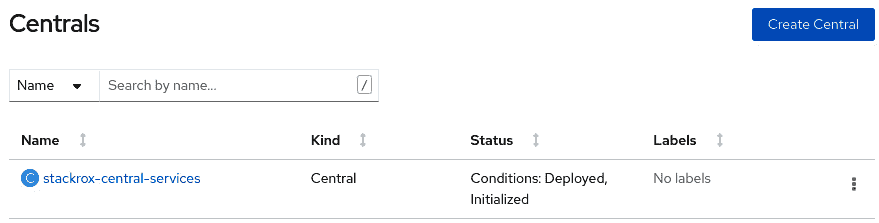
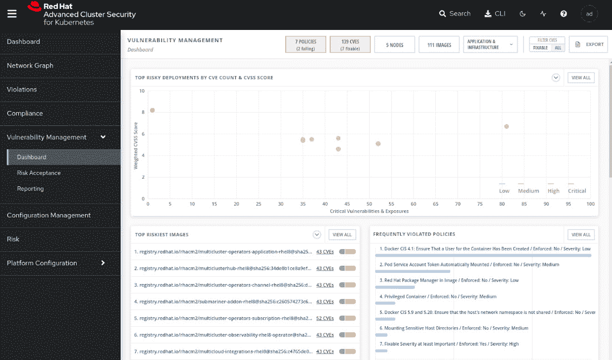
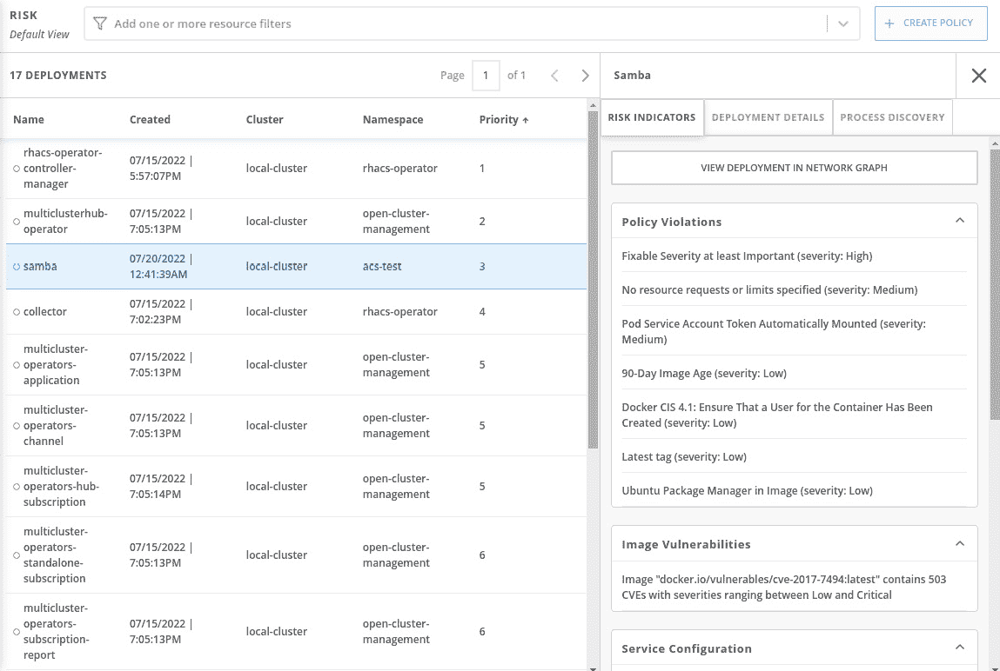
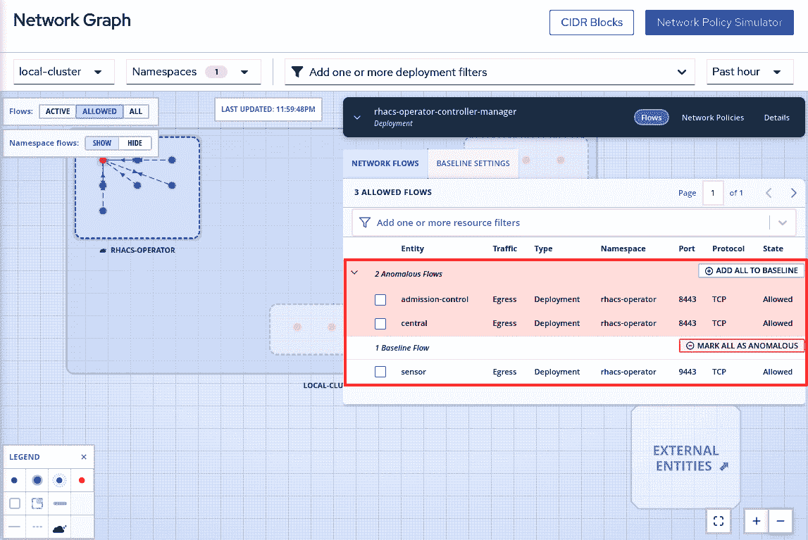
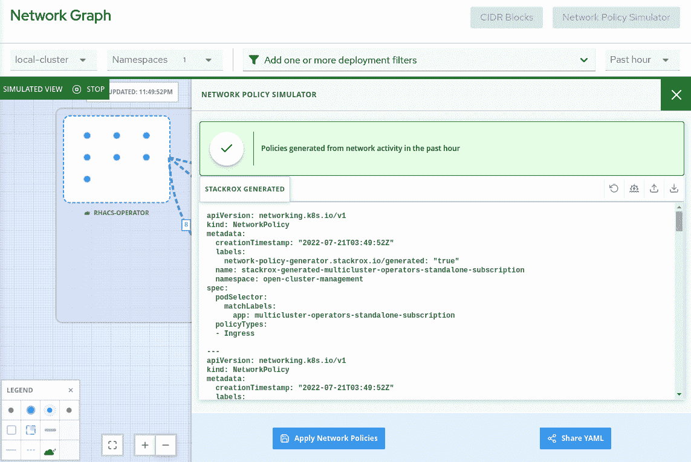

# 12

# OpenShift 多集群安全

在*第八章*《OpenShift 安全》一章中，我们讨论了在为您的 OpenShift 集群定义和实施安全策略时可能需要考虑的一些重要方面。我们涵盖了身份验证和授权、证书和加密、容器与网络隔离等方面。如果您还没有阅读该章节，建议在阅读本章之前先看一下。

在 OpenShift 上实施安全策略很重要，但一般来说并不复杂——大多数策略的配置是直接且有良好文档的。然而，当您将基础设施扩展到多个集群时，事情就变得更加复杂了。那么，如何确保在多个集群上运行的所有容器都使用安全且经过认证的基础镜像呢？您是否知道所有环境在行业和监管标准（如 PCI 和 HIPAA）下的合规性情况？为了帮助您监控和最大化 OpenShift 和 Kubernetes 集群的安全性，本章将介绍红帽**高级集群安全**（**ACS**）。

因此，本章将涵盖以下主题：

+   什么是红帽高级集群安全？

+   红帽高级集群安全安装

+   添加安全集群

+   策略和违规

+   漏洞管理

+   风险评估

+   配置管理

+   网络分段

让我们现在深入了解吧！

# 什么是红帽高级集群安全？

红帽高级集群安全，也称为 StackRox，是一款原生 Kubernetes 安全工具，提供以下功能：

+   **策略和违规**：定义安全策略，并实时报告所有违规事件。您可以定义自己的策略和/或使用内置的数十个策略。

+   **漏洞管理**：检测集群中的已知漏洞，提供修复和预防安全问题所需的工具。

+   **风险评估**：评估您的环境风险，并根据安全风险对应用程序进行分类。

+   **合规性**：根据一些行业标准的安全配置文件报告集群的合规性。

+   **配置管理**：帮助您确保部署符合安全最佳实践。

+   **网络分段**：查看不同命名空间之间的网络流量，并允许您创建网络策略以限制和隔离流量。

最近，*KuppingerCole*进行的研究将红帽高级集群安全评为 Kubernetes 安全领域的领导者。它确实是一款优秀的产品，并包含在**Red Hat OpenShift Plus**产品中，下一章我们将更详细地讨论这个产品。在本章的*进一步阅读*部分，您可以找到指向*KuppingerCole*研究的链接。

如果你有有效的 OpenShift Plus 订阅，或者可以联系覆盖你公司地区的 Red Hat 账户团队获取更多信息，我们鼓励你尝试使用 ACS。

# Red Hat 高级集群安全安装

ACS 的安装过程与上一章你在 ACM 中看到的类似：通过一个操作员。然而，你也可以使用**Helm charts**或**roxctl** CLI 进行安装。在本书中，我们将使用操作员安装；如果你想了解更多关于 Helm 或 roxctl 安装过程的信息，请参考官方文档。你可以在本章的*Further reading*部分找到官方文档的链接。

要使用操作员安装 ACS，请按以下步骤进行。

## 前提条件

1.  你需要访问具有集群管理员权限的 OpenShift 集群。

## 操作员安装

按照以下步骤准备 ACS 操作员：

1.  使用管理员视角访问 OpenShift Web 控制台。

1.  导航到**Operators** | **OperatorHub**菜单项。


图 12.1 – OperatorHub

1.  使用*Filter by keyword...*框搜索`Advanced Cluster Security for Kubernetes`。


图 12.2 – OperatorHub 上的高级集群安全

1.  点击**Advanced Cluster Security for Kubernetes**模块并点击**Install**按钮以查看**Install Operator**界面。


图 12.3 – 为 Kubernetes 安装高级集群安全

1.  不要更改默认命名空间（`rhacs-operator`）。

1.  选择**Automatic**或**Manual**作为升级**批准策略**。如果选择**Automatic**，升级将在 Red Hat 发布后由**Operator Lifecycle Manager**（**OLM**）自动执行，而选择**Manual**时，你需要在升级应用之前进行批准。

1.  选择正确的**更新通道**。建议选择最新通道，因为它包含操作员的最新稳定版和*支持的*版本。

1.  点击**Install**按钮。


图 12.4 – 安装操作员

1.  等待最多 5 分钟，直到你看到以下消息：


图 12.5 – 操作员已安装

现在我们已经安装了操作员，下一步是部署 ACS Central 自定义资源。请参见下一步如何操作。

## ACS Central 安装

我们现在可以继续部署一个新的 ACS*Central*实例：

1.  点击**View Operator**按钮，或导航到**Operators** | **Installed Operators**菜单，点击**Advanced Cluster Security for Kubernetes**。

1.  访问**Central**标签页并点击**Create Central**按钮。


图 12.6 – 创建新的 ACS 中央实例

1.  通常无需更改任何设置，因此保留默认值并点击 **Create** 按钮。如果您需要配置一些高级设置，请查看本章 **Further reading** 部分的链接，获取更多产品文档信息。


图 12.7 – 创建 ACS 中央

1.  等待几秒钟，直到您看到 **Conditions: Deployed, Initialized** 状态。



图 12.8 – ACS 中央已安装

1.  要访问最近创建的 ACS 中央门户，您首先需要获取管理员凭证。为此，请导航至 `rhacs-operator` 项目并点击 `central-htpasswd` 密钥。


图 12.9 – 管理员凭证密钥

1.  向下滚动并点击 **Reveal values**。复制 **password** 字段中的值。


图 12.10 – 复制管理员密码

1.  现在，转到 **Networking** | **Routes** 获取 ACS 中央 URL：


图 12.11 – ACS 中央 URL

1.  使用管理员用户名和从密钥中复制的密码。


图 12.12 – Red Hat ACS 登录页面

您现在已经安装了 Red Hat 高级集群安全。您会注意到，当前 ACS 下没有任何集群。我们将在接下来的步骤中添加一个受管理集群（也叫受保护集群）。


图 12.13 – Red Hat ACS 初始页面

继续阅读，了解如何在 ACS 上添加受保护集群。

# 添加受保护集群

**Secured cluster** 是指受 ACS 管理的集群。ACS 中央作为控制平面，您将在其中创建策略并可视化违规、合规性及本章后续将介绍的所有功能；而 ACS 受保护集群是一组在受管集群上运行的 ACS 进程（**AdmissionControl**、**Scanner**、**Sensor** 和 **Collector**），用于监控和执行策略。


图 12.14 – ACS 中央/受保护集群

在 ACS 中央添加受保护集群的过程包括以下步骤：

1.  在 ACS 中央生成 `init` 捆绑包。

1.  运行 `init` 捆绑包。

1.  在 ACS 操作员中创建 `SecuredCluster` 自定义资源。

要执行前面的步骤并添加受保护集群，请在 **ACS 中央** 中执行以下步骤：

1.  访问 **Platform Configuration** | **Integrations** 菜单：


图 12.15 – 生成初始化捆绑包

1.  向下滚动并点击 **Authentication Tokens** | **Cluster Init Bundle**。


图 12.16 – 生成初始化包

1.  点击 **生成包**，为其命名，并点击 **下载 Kubernetes 秘密文件** 按钮：


图 12.17 – 生成初始化包

现在，访问你想要添加为受保护集群的 OpenShift 集群（不是 ACS Central）。

1.  使用带有 `oc` CLI 的终端，运行以下命令。请注意，你需要在受保护集群中运行此命令，而不是在 ACS Central 上运行：

    ```
    $ oc create namespace rhacs-operator
    $ oc create –f <cluster-init-secrets>.yaml -n rhacs-operator
    secret/collector-tls created
    secret/sensor-tls created
    secret/admission-control-tls created
    ```

1.  按照本章 *操作员安装* 部分中我们执行的相同步骤，在受保护集群中安装 ACS 操作员。请注意，这次我们是在受保护集群中安装操作员。


图 12.18 – ACS 操作员安装在 ACS 受保护集群中

1.  仍然在 OpenShift 受保护集群中，导航至 **操作员** | **已安装操作员**，点击 **Kubernetes 高级集群安全**。在此页面上，访问 **受保护集群** 标签页：


图 12.19 – 创建一个新的受保护集群

1.  点击 **创建 SecuredCluster** 按钮。在此页面中，给集群命名，添加 ACS Central URL，并点击 **创建** 按钮：


图 12.20 – 添加受保护集群

重要提示

始终在 **Central Endpoint** 中添加 `port (:443)`。如果没有指定端口，受保护集群的传感器和扫描器可能会失败。

1.  等待最多 10 分钟，直到 **ACS Collector**、**Sensor** 和 **AdmissionControl** 在管理集群中启动。要检查 ACS 管理集群的状态，访问 ACS Central 并导航到 **平台配置** | **集群**。该集群应以绿色标记为 **Healthy**（健康状态）：


图 12.21 – 受保护集群健康状态

提示

在受保护集群部署期间，看到 **集群状态** 为 **Degraded**（降级）是正常的。等待最多 10 分钟，直到它变为 **Healthy**（健康）。刷新浏览器以检查最新状态。

现在我们拥有了开始使用 ACS 所需的所有内容：**ACS Central** 正在监控一个受保护的集群。继续阅读下一部分，了解更多关于 ACS 策略和违规功能的信息。

# 策略与违规

ACS 提供了多个开箱即用的安全策略，你可以直接使用，也可以为你的 Kubernetes 集群定义自定义安全策略。你还可以轻松检查哪些策略被违反，使用 **Violations** 功能。

在本节中，我们将学习如何查看和创建策略，并深入了解 Violations 功能。

## 安全策略

要访问安全策略，请导航至 **平台配置** | **策略**。所有开箱即用的策略将在此视图中列出：


图 12.22 – 安全策略

让我们使用一个简单的策略来了解安全策略如何在 ACS 上工作。输入`Policy`并按*Enter*，然后输入`admin secret`并再次按*Enter*，以查找`OpenShift: Advanced Cluster Security Central Admin Secret Accessed`策略：


图 12.23 – 最新标签策略

现在点击链接查看**策略详情**页面：


图 12.24 – 策略详情

在此页面上，您将找到策略详细信息，例如**描述**、**类型**等。让我们点击**操作** | **编辑策略**，查看我们可以作为策略一部分设置的内容。


图 12.25 – 编辑策略详情

我们看到的第一个屏幕是**策略详情**。在此页面上，您可以更改一般策略信息，如**名称**、**严重性**级别、**类别**和**描述**。

MITRE ATT&CK

MITRE ATT&CK® 是一个关于战术和技术的知识库，这些战术和技术常常在针对 Kubernetes 的网络攻击中被使用。该知识库于 2020 年 4 月由微软首次发布，是 Kubernetes 安全最佳实践的重要来源。ACS 允许您根据 MITRE ATT&CK® 矩阵对安全策略进行分类。如果你想了解更多关于该框架的信息，可以查看本章末尾的*进一步阅读*部分中的链接。

下一个屏幕是**策略行为**，它定义了策略应该如何应用：


图 12.26 – 策略行为

生命周期阶段定义了策略应用于哪个阶段：

1.  **构建**：在容器镜像构建过程中应用的策略。通常作为 CI 流水线的一部分，用于对 YAML Kubernetes 清单或 Dockerfile 指令进行静态分析。

1.  **部署**：此阶段的策略将在应用程序部署时触发，并根据您在**响应方法**中配置的内容，在策略违规时会通知或甚至阻止部署。

1.  **运行时**：在运行时应用的策略。对于运行时策略，您可以定义**事件来源**是来自**部署**还是**审计日志**。选择**部署**事件来源时，您可以通知并阻止违反策略的应用程序部署，而**审计日志**用于监控 Kubernetes API 调用与**机密**和**配置映射**，以查找可疑活动，如敏感密码被读取——这正是我们在本示例中使用的策略所执行的任务。

您还可以为以下之一设置**响应方法**：

1.  **通知**：仅通过将违规项添加到**违规**功能中来通知违规。

1.  **通知并强制执行**：除了将其添加到违规列表中外，还会根据生命周期阶段选择的内容强制执行以下行为：

    +   如果选择**构建**阶段，则会**失败 CI 构建**。

    +   **阻止**违反策略的应用部署，如果选择了**部署**阶段。

    +   **终止**违反策略的 pod，如果选择了**运行时**阶段。

下一步描述将定义该策略的标准：


图 12.27 – 编辑策略标准

**策略标准**根据**事件源**的不同而有所不同。当事件源为**部署**时，您可以根据与图像、容器配置、元数据、存储、网络、容器运行时进程和 Kubernetes 事件相关的大量实体创建布尔逻辑。我们鼓励您访问不同的策略，以检查现有策略中可用的不同类型的策略标准。

当事件源为**审计日志**时，标准根据 Kubernetes API 事件来定义。让我们检查一下我们作为示例使用的策略，以了解基于审计日志的策略标准是如何工作的。在我们的示例中，使用了以下标准：

+   `Kubernetes 资源`：**密钥**

+   `Kubernetes API 动词`：**GET**、**PATCH**或**UPDATE**

+   `Kubernetes 资源名称`：`central-htpasswd`

+   `Kubernetes 用户名不是`：`system:serviceaccount:openshift-authentication-operator:rhacs-operator-controller-manager`

这意味着当`central-htpasswd`密钥被*任何非*`rhacs-operator-controller-manager service account`的用户`GET`、`PATCH`或`UPDATE`时，将会触发违规。

如果需要，您还可以设置策略范围：

1.  将策略限制为特定的集群、命名空间或标签。

1.  或者，排除策略中的实体。

1.  在**构建**阶段排除需要检查的图像：


图 12.28 – 从策略中排除或限制实体和图像

这就是您在策略中会找到的配置。其实并不难，对吧？我们鼓励您创建一些自定义策略来练习并从中学习。

## 违规

**违规**功能列出了 ACS 监控的集群中所有违反的安全策略：


图 12.29 – 违规列表

请记住，我们在*ACS Central 安装*部分的*步骤 15*中读取了`central-htpasswd`，以获取 ACS Central 管理员密码。由于我们之前使用的策略（`GET` *API 的* `central-htpasswd` *密钥*），这引发了一个违规。在此页面上点击一些违规项，探索此功能并了解 ACS **违规**功能所捕获和显示的事件和数据：


图 12.30 – 违规示例

在本节中，我们学习了如何在 ACM 上定义安全策略，以及如何轻松查看集群中发生的违规行为。继续阅读以了解更多关于 ACS 的**漏洞管理**功能，以及如何使用它来识别、优先处理和修复漏洞。

# 漏洞管理

通常认为，任何系统都有漏洞；其中一些是已知的，而一些尚未被识别。漏洞管理是识别和管理已知漏洞的过程，这意味着有计划地修复或减轻漏洞的影响。导航到**漏洞管理** | **仪表板**查看此功能的界面：



图 12.31 – 漏洞管理

通过此功能，你可以浏览 ACS 检测到的所有漏洞，并决定采取哪些措施：

+   通过删除应用程序中易受攻击的软件包或更新到已修复该漏洞的较新版本来修复漏洞。

+   接受风险。

+   将其标记为误报。

漏洞按照以下方式进行检测和分组：

+   **组件**：容器使用的软件包。此组帮助你检测包含更多漏洞的软件包以及它们的使用位置，从而可以相应地升级应用程序以修复这些漏洞。

+   **镜像**：按镜像分组漏洞。类似地，你可以查看哪些镜像更容易受到攻击，检查是否有修复方案，并相应地进行规划。

+   **节点**：按节点分组的漏洞。

+   **部署**：按部署查看漏洞。更容易检查特定应用程序的漏洞。

+   **命名空间**：按命名空间分组的漏洞。

+   **集群**：按集群分组的所有漏洞。

这些组可以通过**漏洞管理**仪表板顶部的按钮访问；点击它们以探索你可以查看和筛选漏洞的不同方式：


图 12.32 – 按实体分组

我们现在将部署一个示例应用程序，以检查**漏洞管理**功能的实际效果。为此，请在 OpenShift 安全集群中运行以下命令：

```
$ oc new-project acs-test
$ oc run samba --labels=app=rce \
  --image=vulnerables/cve-2017-7494 -n acs-test
$ oc run shell --labels=app=shellshock,team=test-team \
  --image=vulnerables/cve-2014-6271 -n acs-test
```

现在，再次访问**漏洞管理**仪表板。你可能会注意到现在仪表板中有一些有趣的内容：


图 12.33 – 风险最高的镜像和部署

在上面的截图中，你可以看到以下内容：

+   我们刚刚部署的应用程序的容器镜像被列为风险最高的镜像。

+   在图表中，应用程序部署显示为 CVEs 数量和 CVSS 分数方面最为关键的。

点击**应用程序与基础设施** | **命名空间**，查看按命名空间分组的漏洞：


图 12.34 – 应用程序与基础设施菜单

现在你会注意到我们的`acs-test`命名空间列出了超过 400 个 CVE，其中 150 多个是可修复的：


图 12.35 – 按命名空间划分的漏洞

点击`acs-test`命名空间，深入查看详细信息。


图 12.36 – 命名空间摘要视图

探索`samba`部署、通过或未通过命名空间的策略、镜像及其漏洞列表，以及所有包含 CVE 的组件（软件包），最后是该命名空间中检测到的所有 CVE 列表。你可以通过探索该命名空间发现，它包含两个应用程序（部署），其中一个已知有 498 个 CVE，其中 169 个是可修复的：


图 12.37 – 检测到的 CVE

通过深入分析部署和组件，你可以检查正在使用的包版本以及在哪个版本中修复了 CVE：


图 12.38 – 组件与 CVE

这为你提供了大量有助于识别漏洞包和镜像并进行修复的信息。你也可以选择接受风险（延期）或将其标记为假阳性；为此，访问镜像，向下滚动并选择你想要延期的 CVE，然后点击**延期 CVE**或**标记为假阳性**：


图 12.39 – 接受 CVE 风险

你可以在**漏洞管理** | **风险接受**功能中查看和批准 CVE，也可以列出已批准的延期和假阳性：


图 12.40 – 风险接受

**漏洞管理**功能还包括报告功能，你可以设置安全报告，并每周或每月将其发送到一个分发列表。定期报告组织中的漏洞非常有帮助。我们在本书中不会覆盖此功能，但你可以在本章的*进一步阅读*部分找到一个链接，帮助你进行配置。

# 风险分析

**风险**视图是一个将所有运行中部署按安全风险分类的功能。进入**风险**菜单访问该功能并从中学习：


图 12.41 – 风险功能

点击`samba`部署，探索**风险指标**、**部署详情**和**进程发现**：



图 12.42 – 风险详情

我们不会逐一讲解其中的每个选项，而是会重点介绍**过程发现**标签页，它提供了一些有趣的见解，正如下所示：


图 12.43 – 过程发现

在此标签页中，你可以看到容器中正在运行的所有进程，包括详细信息，还有一张显示进程活动随时间变化的图表。点击**查看图表**链接以查看它：


图 12.44 – 过程图

这个**风险**功能对于你按安全风险对部署进行排序并根据优先级列表采取行动非常有帮助。

# 合规性

**合规性**功能扫描你的集群并根据一些现成的合规行业标准报告它们，例如 Docker 和 Kubernetes 的 CIS 基准、**健康保险携带与责任法案**（**HIPAA**）、**国家标准与技术研究所**（**NIST**）特别出版物 800-190 和 800-53，以及**支付卡行业数据安全标准**（**PCI DSS**）。

要运行合规扫描，导航到**合规性**功能并点击**扫描环境**按钮：


图 12.45 – 合规功能

几秒钟后，你将看到合规报告，如下所示：


图 12.46 – 合规报告

我们不会深入探讨这些行业标准，因为它们非常具体于不同的行业。我们鼓励你探索该功能，点击每个图表，深入分析，检查哪些控制是合规的，哪些不合规，并了解原因。如果你想了解更多关于该合规功能的信息，可以阅读我们在*进一步阅读*中留下的参考资料。

# 配置管理

**配置管理**功能是以另一种方式查看违反的政策，它将这些政策与构成集群配置和使用的各种对象相关联。使用此功能，你可以列出所有集群的失败政策，并深入检查所有命名空间、部署等。你可能会想，这些信息也可以在**违规**和**漏洞管理**中找到，没错！这些信息也在那里；不过，在这里，你会看到它按集群实体分组，并且展示每个实体的汇总数据，这有助于你关联不同实体，了解它们之间的关系。

要访问此功能，导航到**配置管理**菜单：


图 12.47 – 配置管理功能

你将首先看到一个仪表盘，汇总以下信息：

+   **按严重程度分类的策略违规**：按严重程度（关键、高、普通和低）对策略违规进行分组，并以饼图形式显示。你可以通过点击饼图右侧的链接深入查看并检查策略：


图 12.48 – 按严重程度分类的策略违规饼图

+   **CIS DOCKER/Kubernetes**：另一个按 CIS Docker 或 CIS Kubernetes 控制分组的饼图：


图 12.49 – CIS DOCKER/KUBERNETES 饼图

接下来是此饼图的描述：

1.  该饼图总结了考虑 CIS Docker 或 Kubernetes 标准下的控制合规性。

1.  点击这里在 CIS Docker 和 CIS Kubernetes 之间切换。

1.  点击**扫描**按钮，在环境中执行新的扫描。

1.  点击**查看标准**，获取所有 CIS 控制及其状态（**通过**、**失败**或**N/A**）的列表。

1.  深入查看已通过、失败或 N/A 的控制列表。

+   **拥有最多集群管理员角色的用户**：显而易见，你可以使用此列表查看用户的权限，并确保他们拥有适当的权限：


图 12.50 – 拥有最多集群管理员角色的用户

+   **在部署中最常用的机密**：同样是显而易见的。使用此列表查找敏感数据及其如何通过环境访问，并查找可疑活动：


图 12.51 – 在部署中最常用的机密

你还可以使用此页面顶部的条形图按集群、命名空间、节点、部署、镜像、机密、用户和组、服务账户及角色检查策略和控制：


图 12.52 – 按实体查看策略和控制

点击菜单选项，探索你从每个选项中获得的不同列表。还要注意，你可以从集群深入到部署、镜像等，前后导航分析实体：


图 12.53 – 从集群深入到命名空间

这总结了**配置管理**功能的概述。继续阅读，查看 ACS 带来的一个很棒功能，帮助你检查集群的网络通信。

# 网络分段

Kubernetes 集群中的一个重要安全方面是 Pod 之间的通信方式，以及进入和离开通信。目前，Kubernetes 中没有图形化视图来实时检查网络通信如何执行，也无法查看允许的或被阻止的流量。为了解决这个问题，ACS 提供了**网络图**功能，允许您实时查看活动通信，并定义和应用网络策略（NP）以允许或阻止网络流量。点击**网络图**菜单以访问该功能：


图 12.54 – 网络图功能

选择`rhacs-operator`命名空间查看网络图的样子：


图 12.55 – rhacs-operator 命名空间的网络图

您可以更改视图，仅查看活动连接、允许的连接或所有类型的连接流量。

## 网络流量

Red Hat 高级集群安全可以学习应用程序使用的网络流量，并应用所有网络流量的基线。检测到的任何与基线不同的网络流量都会被标记为异常，以供您审核。在查看网络流量和基线时，访问任何部署，您将看到异常流量以红色标记：



图 12.56 – 网络流量 – 异常和基线

点击**基线设置**标签页以查看当前基线：


图 12.57 – 配置基线

通过**基线设置**标签页，您可以执行以下操作：

1.  查看网络流量的基线。

1.  配置当 ACS 检测到异常流量时发送警报。

1.  模拟将基线作为网络策略在环境中的影响。

接下来将展示如何使用**网络图**功能生成仅允许应用程序所需通信的**网络策略**列表。

## 网络策略模拟器

您知道您的集群的网络策略配置是否仅允许必要的通信吗？带有宽松网络策略集的集群非常常见，ACS 网络策略模拟器可以帮助避免这种情况。ACS 监控集群中所有 Pod 和命名空间之间的网络流量，创建防火墙规则矩阵。您可以使用 ACS 基于它从环境中学到的信息生成一组仅允许所需通信的网络策略。要使用此功能，请点击**网络策略模拟器**按钮，然后点击**生成并模拟网络策略**：


图 12.58 – 生成并模拟网络策略

您将看到一个详尽的 NP 列表，这些 NP 仅允许 ACS 从正在使用的环境中学到的通信。您可以在环境中应用这些 NP，或者通过电子邮件分享它们。我们强烈建议您在生产环境中应用之前，先在开发或测试环境中审查和测试这些 NP。



图 12.59 – 应用或共享 NPs

很有帮助吧？现在再深入了解一下**网络图**功能，并设想这个功能如何帮助您和您的组织更好地了解网络流量，并仅允许您的应用程序真正需要的通信。

# 总结

在本章中，我们介绍了很多关于红帽高级集群安全（ACS）的内容。在本章中，我们概述了 ACS 的功能，帮助您了解 ACS 如何确保集群的安全性，识别已知漏洞，并制定行动计划。

我们了解了如何使用和定义安全策略，并使用**违规**功能列出所有政策违规情况。我们还看到，**漏洞管理**功能非常有助于列出所有已知漏洞，审查它们，并采取适当的行动：修复（修复易受攻击的包）、接受风险或将其标记为误报。

我们还了解到，**风险**分析功能帮助您评估应用部署的风险，并优先处理需要采取的补救措施和行动，以增强安全性。**合规性**根据行业标准（如 CIS Docker、HIPAA、NIST、PCI 等）报告集群、命名空间和部署情况。

最后，我们看到了通过**配置管理**功能按集群的实体汇总的策略和控制列表，帮助将不同的实体关联到集群中。**网络图**功能则为我们提供了网络流量的实时视图，并附加了一些有用的功能，帮助生成和模拟 NP，确保只允许必要的通信，而不会有多余的通信。

我们希望本章能帮助您理解红帽高级集群安全。我们鼓励您继续下一章，了解如何将 ACM、ACS 和其他组件结合起来，构建一个完整且全面的多云或混合云平台：**OpenShift Platform Plus**。

# 进一步阅读

寻找更多信息？请查看以下参考资料，获取更多关于红帽高级集群安全的信息：

+   *KuppingerCole 报告领导者指南：容器安全*：[`www.redhat.com/en/resources/kuppingercole-container-security-report-analyst-material`](https://www.redhat.com/en/resources/kuppingercole-container-security-report-analyst-material)

+   *使用 Operator 安装 ACM*：[`docs.openshift.com/acs/3.70/installing/install-ocp-operator.html`](https://docs.openshift.com/acs/3.70/installing/install-ocp-operator.html)

+   *使用 Helm 安装 ACM*: [`docs.openshift.com/acs/3.70/installing/installing_helm/install-helm-quick.html`](https://docs.openshift.com/acs/3.70/installing/installing_helm/install-helm-quick.html)

+   *使用 roxctl CLI 安装 ACM*: [`docs.openshift.com/acs/3.70/installing/install-quick-roxctl.html`](https://docs.openshift.com/acs/3.70/installing/install-quick-roxctl.html)

+   *Kubernetes 的威胁矩阵* – 微软关于 MITRE ATT&CK®的文章：[`www.microsoft.com/security/blog/2020/04/02/attack-matrix-kubernetes/`](https://www.microsoft.com/security/blog/2020/04/02/attack-matrix-kubernetes/)

+   *保护 Kubernetes 免受 MITRE ATT&CK：初始访问* – 一系列关于 MITRE ATT&CK®框架的文章之一：[`cloud.redhat.com/blog/protecting-kubernetes-against-mitre-attck-initial-access`](https://cloud.redhat.com/blog/protecting-kubernetes-against-mitre-attck-initial-access)

+   *MITRE ATT&CK®知识库*: [`attack.mitre.org/`](https://attack.mitre.org/)

+   *配置漏洞报告*: [`docs.openshift.com/acs/3.70/operating/manage-vulnerabilities.html#vulnerability-management-reporting_acs-operating-manage-vulnerabilities`](https://docs.openshift.com/acs/3.70/operating/manage-vulnerabilities.html#vulnerability-management-reporting_acs-operating-manage-vulnerabilities)

+   *管理合规性*: [`docs.openshift.com/acs/3.70/operating/manage-compliance.html`](https://docs.openshift.com/acs/3.70/operating/manage-compliance.html)
