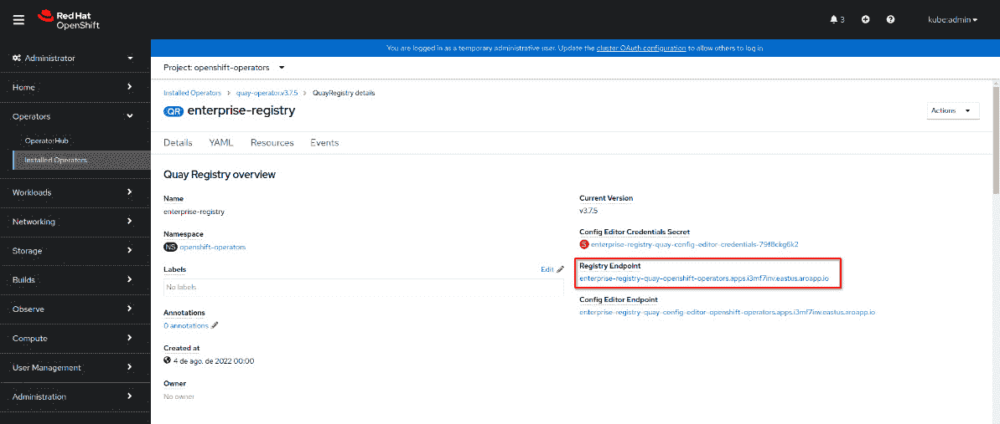
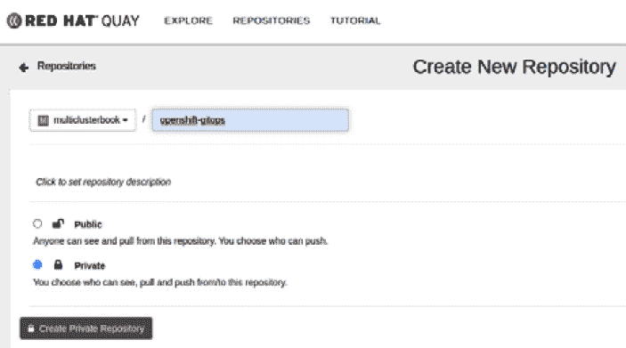

# 13

# OpenShift Plus – 一个多集群企业级解决方案

在本书中，我们在*第一章*，*混合云之旅与策略*，讨论了与公共云使用相关的主要挑战，例如如何控制云成本，以及无论使用哪个云服务提供商，都能够保持一致、安全和合规的平台。我们还介绍了一些有助于多集群工作的工具，并从技术角度帮助解决这些挑战。

在*第九章*，*OpenShift Pipelines – Tekton*，和*第十章*，*OpenShift GitOps – ArgoCD*，我们讨论了使用 OpenShift 的**CI/CD 管道**和**GitOps**，包括部署到多个集群中。

在*第十一章*，*OpenShift 多集群 GitOps 与管理*，我们看到了如何使用**Red Hat 高级集群管理**从单一视图管理和观察多个集群，同时将工作负载部署到多个集群，并使用策略确保所有集群符合合规要求。

最后，在上一章—*第十二章*，*OpenShift 多集群安全*—我们介绍了**Red Hat 高级集群安全**工具，它通过实施安全策略、管理已知漏洞、评估安全风险和合规性，以及管理网络流量，帮助增强所有集群的安全性。

现在，我们在这一章中有两个不同的重点，第一是介绍混合云策略中的最后一个重要部分：**Red Hat Quay**，它将所有容器镜像存储在一个中央镜像注册表中，并使您的 CI/CD 过程更简单、更稳健；第二是讨论**Red Hat OpenShift Plus**产品，它将所有这些部分捆绑在一起，为您提供一个全面且具竞争力的解决方案。

因此，您将在本章中找到以下内容：

+   介绍 Red Hat Quay

+   使用 Quay Operator 部署 Red Hat

+   使用 Red Hat Quay

+   什么是 OpenShift Plus？

+   OpenShift Plus: 一个实际用例

那我们现在开始吧！

# 介绍 Red Hat Quay

Red Hat Quay 是一个企业级容器注册表平台，可以在 Red Hat Enterprise Linux 或 OpenShift 上运行，无论是本地还是云端。Red Hat Quay 提供了许多出色的镜像注册表功能，如下所示：

+   **镜像漏洞扫描**：使用 Clair 项目在镜像推送到注册表后，扫描镜像以查找已知漏洞。有关 Clair 的更多信息，请参见本章的*进一步阅读*部分。

+   **地理复制**：在两个或多个 Quay 实例之间同步镜像注册表内容，允许多个地理分布的 Quay 部署看起来像一个单一的注册表。这对于分布在遥远地区且延迟较高的环境特别有帮助。Quay 处理不同实例之间的异步数据同步，使得镜像对最终用户透明可用。

+   **仓库镜像**：同步两个或多个仓库到两个 Quay 实例之间。

+   **访问控制**：精细的权限控制允许您定义谁能读取、写入和管理组和仓库。您还可以利用机器人账户通过 Quay API 允许组织和仓库的自动化访问。

**Red Hat Quay**可在[quay.io](http://quay.io)门户上作为托管服务使用，或者您可以选择自行管理，在这种情况下，您需要部署和维护它。

# 使用 Quay Operator 部署 Red Hat Quay

有多种部署 Quay 的方式，您可以在本章*进一步阅读*部分中找到产品的官方文档链接。出于教学目的，我们决定使用完全托管组件的 Quay Operator 来部署。

安装 Quay 作为企业容器注册表需要满足一些先决条件。

## 先决条件

使用 Operator 安装 Quay 的先决条件如下：

+   一个具有特权账户的 OpenShift 集群，用于部署和设置 Quay。

+   对象存储：支持的对象存储包括 Red Hat OpenShift Data Foundation、AWS S3、Google Cloud Storage、Azure Storage、Ceph/RadosGW Storage/Hitachi HCP Storage、Swift Storage 和 NooBaa。

+   集群容量可托管以下服务：

    +   PostgreSQL 或 MySQL 数据库。由于 Clair 安全扫描的增强功能，推荐使用 PostgreSQL。

    +   代理服务器。

    +   键值数据库。Redis 是存储非关键 Red Hat Quay 配置的默认选项。

    +   Quay，应用程序服务本身。

所有先决条件准备就绪后，我们可以安装 Quay Operator。请查看如何安装它的下一步骤。

## 操作员安装

部署 Quay Operator 的过程很简单。请按照下一步的说明操作：

1.  转到`Red Hat Quay`。


图 13.1 – 搜索 Red Hat Quay Operator

1.  点击磁贴，然后点击**安装**按钮。


图 13.2 – 安装 Red Hat Quay

1.  保留默认选项，然后点击**安装**按钮。


图 13.3 – 操作员安装

1.  安装操作员后，访问**Quay 注册表**选项卡，然后点击**创建实例**。


图 13.4 – 创建 Quay 注册表实例

1.  可选地，在适当的字段更改名称并保留所有默认选项。


图 13.5 – Quay 实例创建

1.  检查 **Quay 注册表** 选项卡。你将看到类似下面截图的 **状态** 列。


图 13.6 – Quay 实例已创建

1.  一旦完成，点击刚创建的注册表并检查 **注册表终端点** URL。



图 13.7 – Quay 终端点

点击注册表终端点地址。Quay 注册表应用程序将显示以配置你的多集群注册表。

## 配置 Quay

安装过程完成后，你将能够访问一些重要的终端点，这些终端点用于配置 Quay 操作员、Quay 注册表实例与 OpenShift 之间的集成。要使用它们，你需要按照以下步骤进行操作：

1.  在安装 Quay 的命名空间中（在我们的例子中是 `openshift-operators` 命名空间），导航到 `<objectInstanceName>-quay-config-editor-credentials-<randomPodId>`。


图 13.8 – 检查 Quay 配置凭证

1.  点击它并选择 **显示值**。


图 13.9 – Quay 凭证值

1.  记下凭证并返回到 Quay 注册表操作员实例中的 **配置编辑终端点**。


图 13.10 – Quay 配置终端点

1.  点击链接访问 **配置编辑工具**。使用你在上一步获得的凭证。


图 13.11 – Quay UI 配置工具

1.  在此页面上，你可以更改许多 Quay 配置，例如 SSL 证书等——在我们的例子中，我们更改了 **时间机器** 过期时间。完成更改后，点击 **验证配置更改**。


图 13.12 – Quay 设置配置工具

1.  配置验证完成后，选择 **重新配置 Quay**。


图 13.13 – Quay 配置工具验证

重要说明

此步骤将重启操作员 Pod，Quay 可能会在短时间内不可用。

1.  Quay 配置编辑工具将自动更新 `quay-config-bundle` 密钥，用于存储配置参数。要查看它，导航到 `quay-config-bundle` 密钥并点击 **显示值**。之前所做的更改应已反映在该密钥中。


图 13.14 – 配置工具更改后的 Quay 密钥

如果一切看起来正常，你将能够开始使用你的 Quay 实例。请继续下一部分查看如何使用 Quay 的说明。

# 使用 Red Hat Quay

Red Hat Quay 的使用非常简单。一个用户友好的界面将帮助你配置额外的全局和安全设置。我们建议你创建一个*组织*，以按部门、区域或任何其他你想要的方式来组织你的 Quay 注册表：

1.  在这个例子中，我们创建了一个名为**multiclusterbook**的组织。


图 13.15 – Quay 组织

1.  接下来，我们创建了一个私有仓库来上传我们的镜像。



图 13.16 – Quay 仓库

学习如何使用 Red Hat Quay 的一个非常有用的方法是通过教程。你将看到如何操作。

## 运行教程

在 Quay UI 中提到的运行教程不是必需的，但它可以作为理解 Red Hat Quay 作为企业容器注册表的一个良好起点。本教程的第一步是通过终端登录到 Quay 注册表端点。我们使用`docker login`而不是`podman login`，使用`docker run`而不是`podman run`，等等：

```
$ podman login enterprise-registry-quay-openshift-operators.apps.vqdlv2pu.eastus.aroapp.io
```

你应该已经成功登录，否则请检查所使用的凭据。然后，尝试运行一个**BusyBox**容器镜像。


图 13.17 – Quay 教程

现在，运行以下命令为该仓库创建一个示例容器镜像：

```
$ podman run busybox echo "fun" > newfile
$ podman ps -l
CONTAINER ID  IMAGE                             COMMAND     CREATED         STATUS                     PORTS       NAMES
fd3b51f4c383  docker.io/library/busybox:latest  echo fun    16 seconds ago  Exited (0) 17 seconds ago              zealous_pascal
$ podman commit fd3b51f4c383 enterprise-registry-quay-openshift-operators.apps.vqdlv2pu.eastus.aroapp.io/multiclusterbook/openshift-gitops
$ podman push enterprise-registry-quay-openshift-operators.apps.vqdlv2pu.eastus.aroapp.io/multiclusterbook/openshift-gitops
```

很简单吧？！现在你的 Quay 容器注册表实例已配置好、测试通过并准备使用。开始在你的 CI/CD 流水线中探索它，向其中推送镜像，并将其作为你 DevOps 和 DevSecOps 流水线的企业容器注册表。

既然我们已经讨论了 Quay，让我们再深入了解一下 OpenShift Plus。接下来，你将继续发现为什么在你的混合云或多云战略中，应该关注并考虑 OpenShift Plus。

# 什么是 OpenShift Plus？

OpenShift Plus 是 Red Hat 的一项服务，将 OpenShift 平台与以下图中所示的产品捆绑在一起：


图 13.18 – OpenShift Plus 产品服务

以下产品包含在此服务中（除了 OpenShift 本身）：

+   **高级集群管理**：提供管理多个 OpenShift 和 Kubernetes 集群的功能。这些功能包括集群管理、可观测性、策略和合规性以及工作负载部署。我们在*第十一章*中深入探讨了这个产品，*OpenShift 多集群 GitOps 与管理*。如果你还没有看过这一章，我们强烈建议你回去阅读并逐步学习。

+   **高级集群安全**：通过漏洞管理、网络管理等功能增强你的 Kubernetes 和 OpenShift 集群的安全性。本产品在*第十二章*中有详细介绍，*OpenShift 多集群安全*。如果你还没有阅读这一章，我们也建议你现在去看看。

+   **Quay 企业版注册中心**：全球企业版注册中心在本章开头已经介绍过。

+   `RWX` 持久卷) 使用 `RWO` 持久卷) 使用 **Ceph RBD** 和由名为 **Noobaa** 的解决方案提供的对象存储。该产品在本书中未作详细介绍。如果您想了解更多信息，请查看我们在本章的 *进一步阅读* 部分中留下的链接。

如果您从本书一开始就跟随阅读，这些信息对您来说并不新鲜。我们现在将重点提供更多的额外信息，帮助您理解 OpenShift Plus 背后的价值主张，并解释为什么您应该考虑 OpenShift Plus，而不仅仅是*仅仅*考虑 OpenShift 平台。

## 价值主张：优势

OpenShift Plus 为您的多集群战略增加了一些极好的优势：

+   **一致性**：ACM 提供了治理功能，帮助您在所有集群中保持一致的配置。在安全性方面，ACS 还实现了可以定义的安全策略，这些策略将有助于确保所有集群都遵循这些策略。

+   **可移植性**：Quay 提供了一个全球镜像注册中心，所有集群都从中拉取镜像。ACM 还可以帮助您同时在多个集群上部署应用，并检查和监控它们的状态。通过与 OpenShift GitOps 一起使用，您可以利用**ArgoCD**实现**GitOps**部署实践，并保持应用程序的期望状态，无论您在哪个 OpenShift 集群和云提供商上运行它们。当然，集群之间的可移植性也取决于应用程序，因为应用程序解耦越多，迁移到不同的 OpenShift 集群和提供商之间就越容易。需要理解的重要一点是，ACM 和 Quay 有助于使您的应用程序更容易实现可移植性。OpenShift 数据基础也有助于使有状态工作负载更容易迁移，通过提供一种标准的方式，让应用程序能够访问持久卷，无论集群运行在哪种基础设施或云提供商上。

+   **管理**：管理多个不同环境中的集群通常不是一项简单的任务。公司通常会有很多人专门从事这一工作。通过使用 ACM，您可以将这项任务变得稍微轻松一些，并且可能会降低与此相关的成本。集群管理、可观察性和治理（策略）等功能有助于通过一个面板管理多个集群。

+   **安全性**：正如我们在*第十二章*中讨论的，*OpenShift 多集群安全性*，使少数几个集群在一般情况下安全且符合规范并不是一项困难任务，然而，当我们扩展到多个集群时，问题变得更加复杂。ACS 增加了轻松强制执行安全策略、检测漏洞并规划修复措施的能力。

除了 OpenShift Plus，红帽还为任何 OpenShift 客户提供一些额外增值产品，可在红帽混合云门户（[cloud.redhat.com](http://cloud.redhat.com)）上找到：

+   **OpenShift 集群管理**：这允许您查看高级别的集群信息，使用辅助安装程序创建新的集群，配置红帽订阅，基本级别的监控等。

+   **成本管理**：成本管理是一个有趣的工具，用于跟踪 AWS、Google Cloud、Azure 云提供商和 OpenShift 集群的成本和使用情况。它帮助您综合查看与多个云帐户相关的成本，并查看混合云基础架构的成本趋势，甚至可以用作按部门或团队使用量计费的依据。有关此工具的更多信息，请参阅本章的 *Further reading* 部分链接。

在下一个屏幕截图中，您可以看到 **成本管理概述** 屏幕的示例。


图 13.19 – 成本管理功能

+   **开发者沙盒**：这是一个免费的 OpenShift 环境，位于共享的多租户 OpenShift 集群中，预先配置了一组开发工具。用它作为您的测试沙盒和学习如何为 OpenShift 开发的环境。您将在本章的 *Further reading* 部分找到其链接。

除了前面列出的项目，从订阅成本的角度来看，OpenShift Plus 也许更合理。任何套餐通常价格优于单独购买每个部分。话虽如此，如果您对本章提到的 *Plus* 堆栈中的任何软件感兴趣，购买 OpenShift Plus 而不是仅购买 OpenShift 和软件可能更合适。请咨询您的红帽客户团队，并要求 OpenShift Plus 的报价。

现在我们已经讨论了拥有 OpenShift Plus 堆栈的一些好处，以及其何时真正引人注目的考虑因素，让我们使用一个虚构的用例作为示例，使其更具体化。

# OpenShift Plus – 一个实际的用例

让我们考虑以下用例。尝试使用本书涵盖的概念，找出每个需求可以使用的工具。

**用例**：公司 *HybridMyCloud* 正在开发一个具有以下要求的 AI/ML 应用：

+   应用生命周期包括开发（Development）、质量保证（QA）、预生产（Pre-prod）和生产（Production）环境。

+   开发和 QA 可以共享相同的基础平台。由于监管需求，预生产和生产需要分开。生产应用需要在私有子网中，从互联网无法直接访问。

+   *HybridMyCloud*的 C 级管理层和采购部门与 AWS 签订了合同，因此希望将大多数资源托管在那里。然而，他们不希望被锁定在 AWS 上，并希望在需要时能够将应用程序迁移到 Azure。

+   这个 AI/ML 应用基于容器并且是无状态的，但它将图像存储在 S3 对象存储中。它接收 X 光图像，存储到 S3 对象存储中，并使用经过 ML 训练的模型对肺炎进行风险评估。

+   该应用程序处理**受保护健康信息**（**PHI**），因此*HybridMyCloud*希望符合**健康保险流通与问责法案**（**HIPAA**）。

+   这是一个关键任务应用程序，因此*HybridMyCloud*的企业架构师决定将该应用程序不仅部署在多个可用区，还要在 AWS 上使用多个区域。

+   *HybridMyCloud*定义的其他政策如下：

    +   所有容器都需要为 CPU 和内存设置资源请求和限制。

    +   切勿使用最新标签的镜像。

    +   所有使用的镜像必须来自企业注册中心。严格禁止从企业注册中心以外的任何其他来源拉取镜像，包括非 Red Hat 认证的镜像注册中心。

那么，如何满足所有这些要求呢？有许多不同的选项可以匹配这些要求；OpenShift Plus 无疑是一个可以符合所有要求的好选择。让我们讨论一下基础设施应该是什么样的，以及如何在这个用例中使用 OpenShift Plus 工具：

需要多个 OpenShift 集群来满足这些要求：

+   一个开发和 QA 用的集群

+   一个预生产集群

+   两个生产集群，每个集群位于不同的 AWS 区域

+   一个备用集群在 Azure 上，可以在任何时候托管应用程序

你可以首先使用**高级集群管理**的集群生命周期管理功能，在 AWS 和 Azure 上部署这些集群。对于 S3 存储，可以使用本地云服务提供商的服务，或者选择使用**OpenShift 数据基础设施**与*多云对象网关*，这将带来以下好处：

+   使用对象桶声明（Object Bucket Claims）创建 S3 卷。

+   使用*多云对象网关*在 AWS 和 Azure 之间镜像卷。

部署完集群后，**高级集群管理**也可以用于以下操作：

+   **高级集群管理**与**OpenShift GitOps**结合使用，可以同时在多个集群中部署应用程序。

+   可以创建策略，将`image.config.openshift.io/cluster`自定义资源的`allowedRegistries`字段设置为仅允许来自企业注册中心的镜像运行。

+   使用可观察性功能来监控应用程序和集群的健康状况。

Quay 可以作为企业注册表，而嵌入式图像漏洞扫描工具可以作为发现已知漏洞的来源之一。ACS 可用于检测所有集群中的已知漏洞，并使用 HIPAA 政策评估这些漏洞。它还可以用于 CI/CD 流水线，执行清单的静态安全分析，并找出反模式，例如使用最新标签的镜像。

这些只是一些例子。我们在本书中涵盖的其他工具也可以使用，例如 OpenShift Pipelines 来实现 CI/CD 流水线，Cost Management 来跟踪与云服务商的成本，Red Hat 容器目录提供最佳容器基础镜像，等等。

# 总结

本章简要概述了 Red Hat Quay，这是一个有趣的容器镜像注册表选项。我们讨论了 OpenShift Plus 的主要优势，并说明了为何至少在混合云或多云战略中考虑使用 OpenShift Plus 是有意义的。最后，我们通过一个虚构的使用案例，思考了 OpenShift Plus 堆栈在实际场景中的应用。

哇，到目前为止真是一次伟大的旅程！我们在本书中已经涵盖了很多内容，非常高兴你能和我们一起走到这里。我们的长途旅程即将结束，但最精彩的部分即将到来：在下个章节中，我们将通过一个实际的案例，练习书中学到的大部分内容。我们将通过一个示例对 OpenShift Pipelines、GitOps 以及本书中涵盖的所有工具进行全面回顾，动手实践这些概念和工具，从零开始，并最终在多个集群中部署一个真实的功能应用。

我们鼓励你继续前进，尝试我们在下个章节中提出的练习。

# 进一步阅读

想要获取更多信息？请查阅以下参考资料，了解更多关于 Red Hat Quay 的内容：

+   *Quay 产品文档:* [`access.redhat.com/documentation/en-us/red_hat_quay/3.7`](https://access.redhat.com/documentation/en-us/red_hat_quay/3.7)

+   *Quay 对象存储前提条件:* [`access.redhat.com/documentation/en-us/red_hat_quay/3.7/html/deploy_red_hat_quay_on_openshift_with_the_quay_operator/operator-preconfigure#operator-storage-preconfig`](https://access.redhat.com/documentation/en-us/red_hat_quay/3.7/html/deploy_red_hat_quay_on_openshift_with_the_quay_operator/operator-preconfigure#operator-storage-preconfig)

+   *Clair – 容器的漏洞静态分析:* [`github.com/quay/clair`](https://github.com/quay/clair )

查阅以下参考资料以获取更多关于 Red Hat OpenShift 数据基础的相关信息：

+   *OpenShift 数据基础智能页面:* [`www.redhat.com/en/technologies/cloud-computing/openshift-data-foundation`](https://www.redhat.com/en/technologies/cloud-computing/openshift-data-foundation)

+   *OpenShift 数据基础产品页面:* [`access.redhat.com/documentation/en-us/red_hat_openshift_data_foundation`](https://access.redhat.com/documentation/en-us/red_hat_openshift_data_foundation)

查阅以下参考资料以获取有关 Red Hat OpenShift Plus 的更多信息：

+   *OpenShift Plus 智能页面:* [`www.redhat.com/en/technologies/cloud-computing/openshift/platform-plus`](https://www.redhat.com/en/technologies/cloud-computing/openshift/platform-plus)

查阅以下参考资料以获取有关 Red Hat 成本管理的更多信息：

+   *官方文档:* [`access.redhat.com/documentation/en-us/cost_management_service/2022`](https://access.redhat.com/documentation/en-us/cost_management_service/2022)

+   *上游项目:* [`project-koku.github.io/`](https://project-koku.github.io/)

查阅以下参考资料以获取有关 OpenShift 开发者沙箱的更多信息：

+   *入门指南:* [`developers.redhat.com/developer-sandbox`](https://developers.redhat.com/developer-sandbox)
