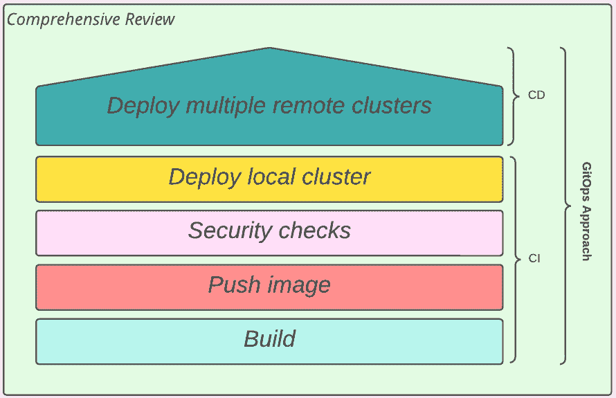
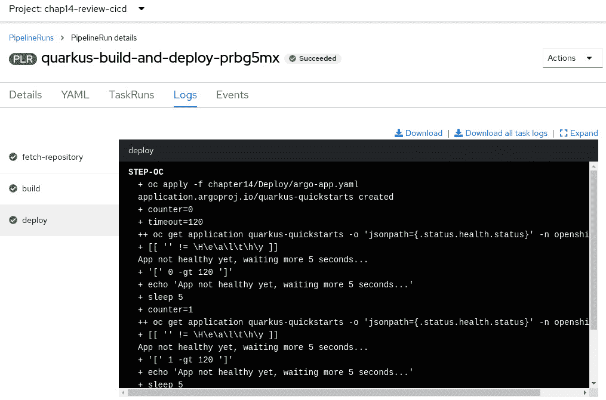
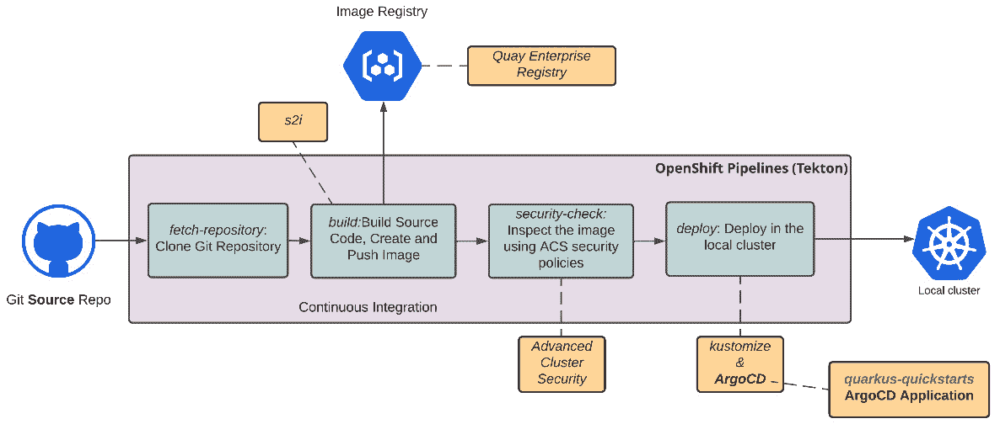
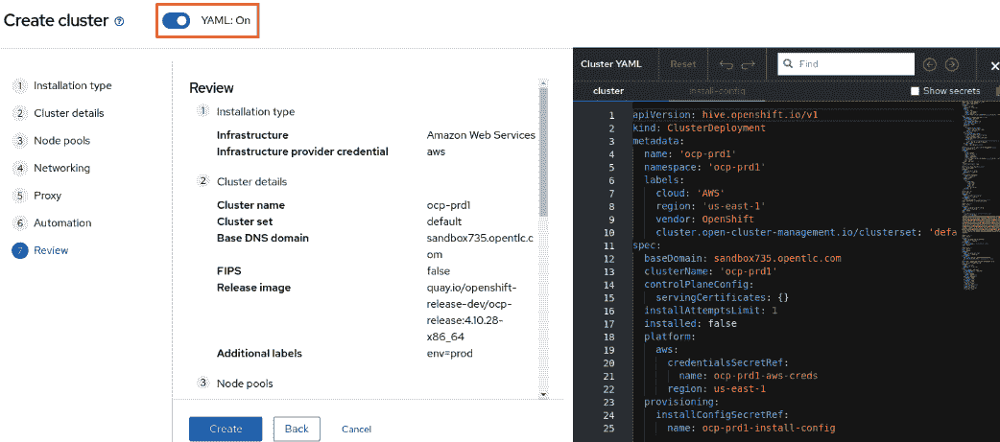

# 14

# 在混合云环境中构建云原生用例

到目前为止，这是一次美妙的旅程！我们已经通过这本书了解了很多内容，从 OpenShift 架构到 Pipelines、GitOps 和多云工具！现在我们即将达到本书的主要目标——帮助您做出最佳决策，并为您的 OpenShift 平台实施一个好的混合云/多云策略。为了以有用的内容总结本书，我们将采取一种实践的方法，全面回顾并构建和部署一个应用程序，涵盖本书中讨论的大部分功能：OpenShift Pipelines（Tekton）、OpenShift GitOps（ArgoCD）、高级集群管理、Quay 和高级集群安全。

因此，您将在本章中找到以下内容：

+   用例描述

+   使用 OpenShift Pipelines 和 S2I 构建应用程序

+   使用 OpenShift Pipelines 和 GitOps 进行应用程序部署

+   在构建和部署过程中添加安全检查

+   提供和管理多个集群

+   将应用程序部署到多个集群中

那么，我们在等待什么呢？现在就开始吧！

注意

本章中使用的源代码可以在[`github.com/PacktPublishing/OpenShift-Multi-Cluster-Management-Handbook/tree/main/chapter14`](https://github.com/PacktPublishing/OpenShift-Multi-Cluster-Management-Handbook/tree/main/chapter14)获取。

# 用例描述

为了更贴近实际情况，这次我们将使用 Java 应用程序，使用**Quarkus**，它是构建现代云原生 Java 应用程序的绝佳选择。有关**Quarkus**的更多信息，请参阅本章的*进一步阅读*部分中的参考资料。

我们的应用程序源代码来自*Quarkus 入门示例*；请参考本章的*进一步阅读*部分了解更多信息。在本章中，我们将创建一个 CI/CD 管道，执行以下操作：

1.  使用 s2i 构建应用程序，生成 Java 二进制文件。

1.  将容器镜像推送到 Quay。

1.  使用高级集群安全对镜像进行安全扫描。

1.  使用 ArgoCD 在本地集群上部署应用程序。

1.  使用 ArgoCD 和高级集群管理将应用程序部署到多个远程集群。

我们将使用高级集群管理来使所有 OpenShift 集群符合我们为它们定义的标准策略。为了便于学习和简化操作，我们将按顺序构建管道和其他对象，就像构建房屋时逐步添加构件一样。



图 14.1 – 综合回顾 - 构建块

我们假设您可以访问一个 OpenShift 集群，我们称之为 Hub 集群，该集群具有足够的资源，并且已经安装了以下工具：

+   OpenShift Pipelines

+   OpenShift GitOps

+   高级集群管理

+   高级集群安全

+   Quay

+   已安装并连接到 Hub 集群的`oc`命令行工具

我们还将在 AWS 上部署额外的单节点集群，作为托管的远程集群，进行多集群的应用程序部署。如果您还没有安装这些工具，请参考本书第*9*到*13*章中的安装过程。

本章中使用的源代码可以在我们的 GitHub 仓库中找到：[`github.com/PacktPublishing/OpenShift-Multi-Cluster-Management-Handbook/tree/main/chapter14`](https://github.com/PacktPublishing/OpenShift-Multi-Cluster-Management-Handbook/tree/main/chapter14)。

让我们从深入了解第一个构建模块开始：应用程序构建。

# 使用 OpenShift Pipelines 和 S2I 进行应用程序构建

对于此步骤，我们将使用`quarkus-build`管道，您可以在`chapter14/Build/Pipeline/quarkus-build.yaml`文件中找到该管道。这个管道非常简单，并在下面的图中进行了解释：


图 14.2 – 用于构建 Java Quarkus 应用程序的管道

在这个管道中，我们使用了现有的 ClusterTasks 来完成所有工作：

+   `git-clone`：用于克隆 Git 仓库。

+   `s2i-java`：使用 S2I 和 Buildah 构建 Java 源代码，生成镜像并推送到 Quay 注册表。S2I 是一种非常便捷的方式，用于从许多不同语言（如 Java、Python、Node.js 等）构建代码。有关 S2I 的更多信息，请参见本章的*进一步阅读*部分。

+   `openshift-client`：用于运行部署应用程序的清单。应用程序清单使用**Kustomize**来声明 Kubernetes 清单。我们在本书的*第十章*《OpenShift GitOps – ArgoCD》中介绍了**Kustomize**；如果您还没有阅读，强烈建议您先阅读该章节，然后再回来执行本章中的步骤。

现在让我们创建并运行这个管道。如果您还没有操作过，请将此仓库分叉到您的 GitHub 账户：[`github.com/PacktPublishing/OpenShift-Multi-Cluster-Management-Handbook`](https://github.com/PacktPublishing/OpenShift-Multi-Cluster-Management-Handbook)。分叉后，按照本节中的说明创建并运行此管道：

1.  在您的机器上克隆该仓库：

    ```
    $ GITHUB_USER=<your_user>
    $ git clone https://github.com/PacktPublishing/OpenShift-Multi-Cluster-Management-Handbook.git
    ```

1.  运行以下脚本并按照说明将原始仓库（`PacktPublishing`）的引用更改为您分叉的仓库：

    ```
    $ cd OpenShift-Multi-Cluster-Management-Handbook/chapter14
    $ ./change-repo-urls.sh
    # Go to the Build folder
    $ cd Build
    ```

1.  运行以下命令来创建命名空间和管道：

    ```
    $ oc apply -f Pipeline/namespace.yaml
    $ oc apply -f Pipeline/quarkus-build-pi.yaml
    ```

1.  您应该能够在 OpenShift 控制台中看到该管道，路径为**Pipelines** | **Pipelines** | **Project: chap14-review-cicd**，如以下截图所示：


图 14.3 – 创建的构建管道

1.  你现在可以通过 Web 界面或终端运行管道。要通过终端运行，请执行以下命令：

    ```
    $ oc create -f PipelineRun/quarkus-build-pr.yaml
    ```

关于镜像注册表的说明

该管道使用外部注册表来推送结果镜像。为了能够将镜像推送到注册表，你需要将包含注册表凭证的密钥与 `pipeline` ServiceAccount 链接。如果在运行管道之前没有这样做，你会发现它会在 `build` 任务中失败。在本章中我们使用的是 Quay，但你也可以使用任何外部镜像注册表，如 Nexus、Amazon Elastic Container Registry、Docker Hub 或其他。如果你决定使用 Quay，你需要创建一个机器人账户，给它在镜像仓库中的写权限，并将密钥导入到命名空间。接下来，你将了解如何操作。

接下来请查看如何配置你的 Quay 仓库，并将凭证与 `pipeline` ServiceAccount 链接。

## 配置镜像注册表

在 Quay 上创建新仓库后，按照以下步骤配置它：

1.  访问仓库的**设置**标签，并进入**用户和机器人权限**部分，点击**创建机器人账户**链接：


图 14.4 – 创建机器人账户

1.  给它任意名称并点击**创建机器人账户**按钮：


图 14.5 – 创建机器人账户

1.  然后，修改权限为**写**并点击**添加权限**：


图 14.6 – 设置写权限

1.  点击机器人账户链接，下载我们将用来与管道 ServiceAccount 链接的密钥：


图 14.7 – 机器人账户

1.  通过点击**下载 <robot-name>-secret.yml**链接，下载密钥文件，位置在**Kubernetes 密钥**标签中：


图 14.8 – 下载 Quay 凭证

拿到密钥的 YAML 文件后，你可以继续在 OpenShift 上创建它。接下来将展示如何操作。

## 链接镜像注册凭证

既然我们已经在工作区中拥有密钥文件，现在可以运行以下命令来创建密钥并将其链接到管道 ServiceAccount。或者，你也可以直接运行我们为你准备的 GitHub 仓库中的 `link-image-registry-secret.sh` 脚本，它会执行同样的操作：

```
$ SECRET_FILE=<secret-file-which-contains-image-registry-credentials>
$ SECRET_NAME=<secret-name>
$ oc create -f $SECRET_FILE --namespace=chap14-review-cicd
$ oc patch serviceaccount pipeline -p '{"secrets": [{"name": "$SECRET_NAME"}]}' --namespace=chap14-review-cicd
$ oc secrets link default $SECRET_NAME --for=pull -n chap14-review-cicd
```

如果你在管道的构建任务中遇到错误，现在可以通过运行以下命令再次运行它：

```
$ oc create -f PipelineRun/quarkus-build-pr.yaml
```

现在你应该能看到管道成功完成，如下截图所示：


图 14.9 – 构建管道成功运行

管道成功运行后，你可能想查看镜像在 Quay 上的样子。

## 查看 Quay 上的镜像

如果您使用的是 Quay，此时您应该能够在其中查看并检查镜像：


图 14.10 – Quay 上的镜像，已自动检测到已知漏洞

如我们所见，Quay 自动检测到此镜像存在一些已知的漏洞。我们将在本章中进一步修复这些漏洞，但现在重要的是，您要观察并理解推送镜像并自动检查已知漏洞是多么容易。

现在，我们已经让应用的构建管道正常工作，接下来让我们将其演变为使用 ArgoCD 作为部署工具，并利用 GitOps 实践。

# 使用 OpenShift 管道和 GitOps 进行应用部署

这次，我们将使用 ArgoCD 来部署应用，而不是直接运行 Kubernetes 清单。管道基本相同，但现在部署任务将运行一个 YAML 文件，创建一个 ArgoCD 应用，并等待应用变为健康状态。


图 14.11 – 用于构建 Java Quarkus 应用并使用 ArgoCD 部署的管道

运行以下命令以创建并运行管道：

```
$ cd OpenShift-Multi-Cluster-Management-Handbook/chapter14/Deploy
$ oc apply -f Rolebindings/ # Permission required for Tekton to create an ArgoCD application
$ oc apply -f Pipeline/quarkus-build-and-deploy-pi.yaml
$ oc create -f PipelineRun/quarkus-build-and-deploy-pr.yaml
```

将创建一个新的`PipelineRun`，用于构建容器镜像并创建 ArgoCD 应用程序来部署应用。只要一切正常，您将看到如下所示：



图 14.12 – 使用 ArgoCD 的任务部署

访问 ArgoCD 控制台，检查那里的应用部署；您应该能看到类似于下面的截图：


图 14.13 – ArgoCD 中的应用

您可以在*第十章*中找到关于如何访问 ArgoCD 控制台的说明，*OpenShift GitOps – ArgoCD*。提醒一下，以下是获取 ArgoCD URL 和管理员密码的命令：

```
# Get the ArgoCD URL:
$ echo "$(oc get route openshift-gitops-server -n openshift-gitops --template='https://{{.spec.host}}')"
# Get the Admin password
$ oc extract secret/openshift-gitops-cluster -n openshift-gitops --to=-
```

现在，我们的管道已经构建了应用，推送到了 Quay，并通过 ArgoCD 进行了部署。下一步是将高级集群安全引入，以便在管道中添加一个安全检查步骤。接下来看看如何操作。

# 在构建和部署过程中添加安全检查

这次，我们将在已经构建的镜像中添加一个新的步骤进行安全检查。我们将使用高级集群安全（Advanced Cluster Security）来实现这一点。要成功使用它，您应该已经安装了高级集群安全，并将本地集群配置为安全集群。请参考*第十二章*，*OpenShift 多集群安全*，查看如何操作。

接下来查看我们现在的管道是什么样的：



图 14.14 – 带有安全检查的管道

因此，以下任务已添加到管道中：

+   `security-check`：使用 ACS API 检查镜像是否符合 ACS 中定义的现有安全策略。

为了模拟安全问题，我们还将使用一个自定义的 `s2i-java` 任务，该任务使用一个旧版本的 `ubi-openjdk`，该版本包含许多已知漏洞。为了解决这些问题，我们将构建策略更改为使用一个 Dockerfile，该文件使用最新版本的 RHEL UBI 镜像并附加了安全修复。

按照本节中的说明创建并运行此流水线：

1.  在我们进入流水线之前，需要配置流水线与 ACS 之间的集成。为此，访问 **高级集群安全** 仪表盘，导航到 **平台配置** | **集成** | **身份验证令牌**，然后点击 **API 令牌**：


图 14.15 – 创建 ACS API 令牌

1.  点击 **生成令牌** 按钮：


图 14.16 – 生成令牌

1.  填写名称并在 **角色** 字段中选择 **持续集成**：


图 14.17 – 为 CI 生成令牌

1.  复制已生成的令牌。我们将在一个机密中使用它，该机密将被流水线任务用来在 ACS API 上进行身份验证：


图 14.18 – 复制 API 令牌

1.  现在让我们创建机密。使用上一步中的令牌和 ACS 中央端点运行以下命令。请 *不要* 在 `rox_central_endpoint` 主机中使用 `http(s)`：

    ```
    oc create secret generic acs-secret --from-literal=rox_api_token='<token from previous step>' --from-literal=rox_central_endpoint='<host-for-rhacs-central-server>:443' --namespace=chap14-review-cicd
    ```

1.  现在我们已经准备好创建并运行我们的流水线。运行以下命令：

    ```
    $ cd OpenShift-Multi-Cluster-Management-Handbook/chapter14/DevSecOps
    $ oc apply -f Task/ # Create the custom S2I and stackrox-image-check tasks
    $ oc apply -f Pipeline/quarkus-devsecops-v1-pi.yaml
    $ oc create -f PipelineRun/quarkus-devsecops-v1-pr.yaml
    ```

1.  你应该看到 `security-check` 任务失败，因为我们故意使用了包含许多已知漏洞的旧版基础镜像：


图 14.19 – 安全检查失败

让我们简要看一下由于此任务而产生的错误。失败的策略如下：

+   **至少重要的可修复严重性**：如预期的那样（记住我们现在使用的是旧版本的基础镜像），镜像中有多个组件存在重要和关键的已知 CVE。

+   `ubi-minimal`，其中包括 `microdnf` 作为包管理器。

现在我们将演示如何使用一个 Dockerfile 来修复这些安全问题，该文件解决了所有这些问题。

## 修复安全问题

为了解决这些问题，我们将修改流水线，使用 Dockerfile 而不是 S2I。为此，我们将 `build` 任务更改为使用 `buildah` 集群任务，而不是 `s2i-java`：

```
    - name: build
      params:
        - name: IMAGE
          value: $(params.IMAGE_NAME)
        - name: CONTEXT
          value: $(params.PATH_CONTEXT)
        - name: DOCKERFILE
          value: src/main/docker/Dockerfile.multistage #[1]
        - name: TLSVERIFY
          value: 'false'
      runAfter:
        - fetch-repository
      taskRef:
        kind: ClusterTask
        name: buildah #[2]
      workspaces:
        - name: source
          workspace: workspace
```

让我们看一下突出显示的数字表示的含义：

+   **[1]**：包含安全修复的 Dockerfile 的路径

+   `buildah` 集群任务将使用给定的 Dockerfile 构建应用程序

让我们还看一下 Dockerfile 以理解安全修复。这个文件位于 `quarkus-getting-started/src/main/docker/Dockerfile.multistage`，在我们的 GitHub 上：

```
## Stage 1: build with maven builder image with native capabilities
FROM quay.io/quarkus/ubi-quarkus-native-image:22.2-java17 AS build
(.. omitted ..)
RUN ./mvnw package -Pnative
FROM registry.access.redhat.com/ubi8/ubi-minimal #[1]
WORKDIR /work/
COPY --from=build /code/target/*-runner /work/application
RUN chmod 775 /work /work/application \
  && chown -R 1001 /work \
  && chmod -R "g+rwX" /work \
  && chown -R 1001:root /work \
  && microdnf update -y \ #[2]
  && rpm -e --nodeps $(rpm -qa '*rpm*' '*dnf*' '*libsolv*' '*hawkey*' 'yum*') #[3]
EXPOSE 8080
USER 1001
CMD ["./application", "-Dquarkus.http.host=0.0.0.0"]
```

让我们来看一下高亮的数字表示什么意思：

+   `ubi-minimal` 作为基础镜像。

+   **[2]**：将操作系统包更新到最新版本。

+   **[3]**：从镜像中移除包管理器。

高亮的行确保了使用的是最新的组件，这些组件包含了最新的安全修复，同时包管理器在打包前已经从镜像中移除。

现在，让我们创建这个新的管道版本并运行它，检查安全问题是否已解决。为此，运行以下命令：

```
$ oc apply -f Pipeline/quarkus-devsecops-v2-pi.yaml
$ oc create -f PipelineRun/quarkus-devsecops-v2-pr.yaml
```

这次，管道应该能够成功完成，因为我们的容器镜像中再也没有检测到安全问题：


图 14.20 – 安全问题已修复

现在，您可以选择检查 ACS，看看是否还有其他可以稍后修复的违规问题。如果您想这么做，请导航到 `Namespace: chap14-review-cicd` 和 `Deployment: quarkus-quickstarts`。您仍然应该看到一些小的违规问题，具体如下：


图 14.21 – ACS 违规

你还记得之前 Quay 报告过我们镜像中的一些漏洞吗？现在看看它，看看我们新版本的镜像：


图 14.22 – Quay 安全扫描

如您所见，较新的镜像没有检测到安全问题。在本节中，我们在管道中添加了安全检查，并修复了通过此管道检测到的一些漏洞。在下一节中，我们的管道将能够使用 ArgoCD 和高级集群管理来部署我们的应用程序到多个集群中。

# 创建和管理多个集群

到目前为止，我们还没有涉及混合集群或多集群方面的内容。接下来我们将要添加的是：*部署到多个远程集群*。为此，我们将使用高级集群管理来创建新集群，并帮助我们在这些集群中部署应用程序。

## 创建新集群

我们将使用 AWS 来托管两个新集群，这些集群将作为远程集群用于测试我们的管道。为了节省资源，我们将使用单节点集群，因此我们不需要为此练习购买多个服务器。如果您已经有可用的集群，可以选择导入现有的集群，而不是创建新的集群。您可以在本章的 *进一步阅读* 部分找到一个链接，里面包含了如何在高级集群管理中导入集群的说明。

要使用 ACM 创建单节点集群，您需要添加 AWS 凭证，进入 **凭证** 菜单，然后点击 **添加凭证** 按钮：


图 14.23 – 添加 AWS 凭证

跟随向导并填写所有必填字段。你需要提供拉取密钥，可以在[`console.redhat.com/openshift/downloads`](https://console.redhat.com/openshift/downloads)找到：


图 14.24 – 添加新凭证

创建 AWS 凭证后，访问 **基础设施** | **集群** 功能并点击 **创建集群** 按钮：


图 14.25 – 配置新集群

选择 AWS 作为基础设施提供者，并填写向导中的以下数据，但在最后一步不要点击**创建**按钮：

+   **基础设施**提供者：**Amazon Web Services**

+   **基础设施提供者凭证**：**aws**（你在上一步创建的凭证名称）

+   `ocp-prd1`

+   **集群组**：**默认**

+   **基础 DNS 域名**：你在 AWS 上的公共域名（例如，example.com）

+   **发布镜像**：选择最新的

+   `env=prod`

+   `m5.2xlarge`

+   **网络**：保持不变

+   **代理**：保持未选中

+   **自动化**：保持空白

在 **审核** 页面上，选择 **YAML：开启** 按钮：



图 14.26 – 编辑 YAML

在 YAML 文件中，编辑 `MachinePool` 并添加语句 `skipMachinePool: true`，如下所示：


图 14.27 – 编辑 MachinePool

点击 `install-config` 标签，并将主节点副本数更改为 `1`，计算节点副本数更改为 `0`：


图 14.28 – 编辑 install-config

现在使用之前相同的参数，点击`ocp-prd2`。最终，你应该能看到两个集群正在被配置，如下图所示：


图 14.29 – 集群创建中

配置过程大约需要 40 分钟。当你看到两个集群标记为**已就绪**时，继续下一步。

## 集群治理

ACM 提供的一个有用功能是使用策略进行集群治理。我们已经在*第十一章*《OpenShift 多集群 GitOps 和管理》中介绍了这个功能。如果你还没有阅读，强烈建议你查看那一章。我们将部署位于 GitHub 仓库中`Governance`文件夹下的策略，以便检查托管集群的 etcd 密钥存储是否加密。为此，请运行以下命令：

```
$ cd OpenShift-Multi-Cluster-Management-Handbook/chapter14/Governance
$ oc apply -k .
```

等待几秒钟，访问 ACM 上的 **治理** 功能，检查集群的合规性：


图 14.30 – 集群合规性

移动到下一部分，查看如何将我们的示例应用同时部署到多个远程集群中。

# 将应用部署到多个集群中

现在我们已经拥有多个远程集群，我们可以继续使用 ACM 和 ArgoCD 使我们的流水线能够同时部署到所有集群中。我们将修改部署任务，使用一个 `ApplicationSet` 对象，它将负责将我们的应用程序同时部署到两个 OpenShift 远程集群中。


图 14.31 – 支持多集群部署的流水线

为了让 ArgoCD 识别 ACM 管理的集群，我们首先需要创建一些对象，比如 `GitOpsCluster` 自定义资源。我们在*第十一章*，《OpenShift 多集群 GitOps 与管理》中详细讲解了这些对象。请运行以下命令来创建这些对象：

```
$ cd OpenShift-Multi-Cluster-Management-Handbook/chapter14/Multicluster-Deployment
$ oc apply -f GitOpsCluster/
```

现在，让我们创建并运行流水线，使用 `ApplicationSet` 对象将应用程序部署到具有 `env=prod` 标签的受管集群中。记住，我们在使用 ACM 配置集群时已经使用了这个标签。如果你是在 ACM 中导入的集群，请确保为这些集群添加 `env=prod` 标签：

```
$ oc apply -f Rolebindings/ # Permissions required for pipeline to be able to create an ApplicationSet
$ oc apply -f Pipeline/quarkus-multicluster-pi.yaml
$ oc create -f PipelineRun/quarkus-multicluster-pr.yaml
```

当流水线完成时，你应该已经有了两个新的 ArgoCD 应用程序，这些应用程序是通过 `ApplicationSet` 机制自动创建的：


图 14.32 – ArgoCD 和 ApplicationSet

就这样，我们成功了！我们从一个简单的构建流水线开始，现在它已经能够执行安全检查，并且能同时部署到多个远程集群！

# 总结

感谢你成为我们旅程中的伙伴！我们希望这本书的内容对你有所帮助，现在你应该对书中涉及的主题有了很好的理解。我们涵盖了架构、人员、部署、故障排除、多集群管理、使用和安全等内容。这么多内容，起初我们还以为无法写完！如果你还在这里，我们觉得自己这本书的使命已经完成！

有一句来自*约翰·沃尔夫冈·冯·歌德*的名言：“*知道是不够的，我们必须应用。愿意是不够的，我们必须做*。” 阅读完这本书后，我们希望你不仅学到了新知识，还能将其付诸实践。通过这段混合云之旅，你有机会通过生动的示例和我们倾注心血的内容，快速提升你的知识水平。

我们希望这本书能够成为你的一本手册，并对你在规划和执行适合企业的模型时有所帮助，提供多种可用选项、实现方案以及良好的洞察，助力你的知识积累和职业发展。

为了总结本章的内容，我们设计了以下图表，作为每一章核心主题的快捷方式，帮助你回顾我们一起走过的整个旅程：


图 14.33 – 本书旅程

本书已接近尾声，但我们还没有完全结束。我们为您准备了最后一章，提供了一些建议，帮助您在本书之后继续学习和提升您的 OpenShift 和 Kubernetes 技能。

我们鼓励您继续阅读下一章，查看我们在其中建议的培训和其他内容。

# 进一步阅读

想获取更多信息吗？请查看以下参考资料以获取更多信息：

+   *Quarkus*：

    +   *主页:* [`quarkus.io/`](https://quarkus.io/)

    +   *Quarkus 入门示例*: [`github.com/quarkusio/quarkus-quickstarts/tree/main/getting-started`](https://github.com/quarkusio/quarkus-quickstarts/tree/main/getting-started)

+   *S2i*：

    +   *GitHub* 页面：[`github.com/openshift/source-to-image`](https://github.com/openshift/source-to-image)

    +   *如何创建 S2I Builder 镜像*（博客文章）：[`cloud.redhat.com/blog/create-s2i-builder-image`](https://cloud.redhat.com/blog/create-s2i-builder-image)

    +   *在 Tekton 中使用 Source 2 Image 构建*（博客文章）：[`cloud.redhat.com/blog/guide-to-openshift-pipelines-part-2-using-source-2-image-build-in-tekton`](https://cloud.redhat.com/blog/guide-to-openshift-pipelines-part-2-using-source-2-image-build-in-tekton)

    +   *Tekton Hub - S2I*: [`hub.tekton.dev/tekton/task/s2i`](https://hub.tekton.dev/tekton/task/s2i)

+   *高级集群管理 – 导入集群*: [`access.redhat.com/documentation/en-us/red_hat_advanced_cluster_management_for_kubernetes/2.5/html/clusters/managing-your-clusters#importing-a-target-managed-cluster-to-the-hub-cluster`](https://access.redhat.com/documentation/en-us/red_hat_advanced_cluster_management_for_kubernetes/2.5/html/clusters/managing-your-clusters#importing-a-target-managed-cluster-to-the-hub-cluster)

+   *高级集群安全 – 来自 Tekton Hub 的镜像检查*: [`hub.tekton.dev/tekton/task/stackrox-image-check`](https://hub.tekton.dev/tekton/task/stackrox-image-check)

# 第五部分 – 持续学习

在这一部分中，您将获得一些额外的内容，继续您的 OpenShift 专家之路。在这里，您将看到市场上可用的培训总结，帮助您深入了解 OpenShift 的启用。

本书的这一部分包括以下章节：

+   *第十五章*，*接下来做什么？*
