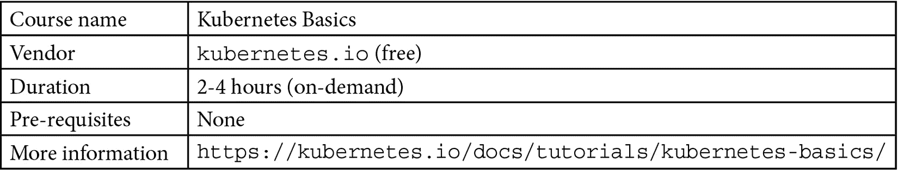
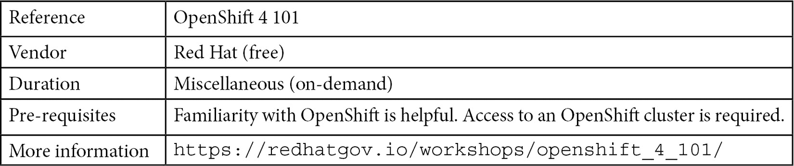

# 第十五章：下一步

*学习永远不会使大脑感到疲倦。*

– *列奥纳多·达·芬奇*

最后一章！在我们写这本书时，我们曾思考过什么样的最后一章会比较合适。我们坚信，学习永无止境！话虽如此，我们得出结论，好的最后一章应该涉及一些关于培训的建议，以及你可以采取的下一步行动，帮助你持续学习和深化知识——我们希望你喜欢我们在这里介绍的选项。

我们特别关注以下领域：

+   Red Hat 培训

+   在线学习平台

+   免费培训和参考资料

# Red Hat 培训

很明显，任何组织都能从培训和赋能中获益。简而言之，培训能够提高生产力、减少浪费、标准化流程，并激发内在动力。**国际数据公司**（**IDC**）2020 年在五个不同国家及拥有超过 11,000 名员工的公司所做的研究发现，接受 Red Hat 提供的培训的公司获得了以下益处：

+   **开发运维**（**DevOps**）团队的生产力提高了 44%。

+   接受培训的**信息技术**（**IT**）基础设施团队的效率比未接受培训的团队高出 34%。

+   团队部署新 IT 资源的速度比以前快 59%。

+   新员工能以比以前快 76%的速度实现完全生产力。

然而，市场上有大量不同的培训和资源可供选择，*适合每个预算*！因此，我们在这里提供了一些关于在哪里寻找赋能的建议，帮助你和你的团队了解 OpenShift。将本章中找到的参考资料与在*第四章*中看到的角色（OpenShift Personas and Skillset）结合，你们很可能会成功且顺利地实现 OpenShift 的采纳！

本章内容包括：

+   建议的培训资源列表

+   互联网上的参考资料，你可以在其中查找有关 OpenShift 的文档、教程和帖子

+   有助于你和你的团队成为 OpenShift 专家的认证列表

参考资料

请查看前文提到的完整 IDC 研究，网址：[`red.ht/IDCTraining`](https://red.ht/IDCTraining)。

## 培训和认证

本书旨在成为 OpenShift 的全面参考资料，我们涵盖了一些关于架构、部署、操作和多集群工具的重要话题。然而，我们可以自信地说，OpenShift 是一个充满不同文化的世界！因此，尽管本书将帮助你在学习旅程中取得进展，但我们强烈建议你通过培训进一步自我提升。在本节中，你将找到我们建议给那些想要深入了解 OpenShift 知识的专业人士的技能路径。

### 技能路径

我们在此为你提供了三种不同的建议技能路径：

+   **DevOps 转型**：针对希望在 OpenShift 上使用 DevOps 和敏捷实践及工具的 DevOps 和**站点可靠性工程**（**SRE**）工程师。正如我们在*第四章*中看到的，*OpenShift 角色与技能集*，这一角色通常涉及自动化和流程，因此在此技能路径中，您将找到涵盖 DevOps 相关人员、流程和技术的课程。

+   **Kubernetes**：这是一个针对那些想要深入了解 Kubernetes 本身的人的路径。由于 OpenShift 是基于 Kubernetes 运行的，因此本路径中的培训对 OpenShift 也很有价值；然而，它是独立于任何 Kubernetes 发行版的，不专注于如 OpenShift 等特定发行版。

+   **OpenShift**：涵盖 OpenShift 使用、开发和管理的培训。在本节中，您将看到为每个角色建议的培训和认证列表。

请查看以下各部分，了解每个技能路径的更多信息。

### DevOps 转型

在本节中，我们建议进行涉及人员、流程和技术相关方面的培训。

#### DevOps 文化和实践赋能

我们知道 DevOps 已经被广泛采用并且几乎在各个领域都有应用；然而，根据我们的个人经验，许多公司不幸没有意识到其实施的好处。这主要是因为这些公司常常忽视文化转变的实现：文化转变是 DevOps 中最具挑战性的部分——从我们的角度来看，远远超出了其他方面。如果您感觉自己和团队需要一次文化上的刷新，那么这门课程非常适合您。它采用实践性的方法，提供为期 5 天的沉浸式培训，我们建议您与您的团队一起参加，以便使用敏捷方法论和 DevOps 实践体验接近真实世界的交付。以下是课程概览：

#### 适用于 DevOps 旅程的开放实践

前一个培训专注于文化，而本次培训则专注于流程。它带领学员完成由 DevOps 实践驱动的项目的发现、规划和交付过程。以下是课程概览：

#### 红帽 DevOps 流水线和流程：使用 Jenkins、Git 和测试驱动开发进行 CI/CD

为了闭合人（文化）、流程和技术之间的循环，本培训将围绕**持续集成/持续交付**（**CI/CD**）技术，使用 Git、Jenkins 和**测试驱动开发**（**TDD**）来培养 DevOps 团队的技术技能。这是一个实践性强的培训课程，使用示例应用来学习如何使用这些列出的技术。可以在这里查看课程概览：

### Kubernetes

市面上有很多关于 Kubernetes 的培训课程，包括收费和免费的。我们在这里列出了一些好的参考资料，帮助你更深入地了解 Kubernetes。

#### Kubernetes 基础

我们首先要提到的是来自官方 `kubernetes.io` 门户的教程。在这个教程中，你将通过一些基本课程进行学习，例如使用 `minikube` 创建 Kubernetes 集群、应用部署、扩展和更新。它使用互动环境，让你可以一步一步地以实践的方式进行练习。以下是该课程的概览：

另一个很好的实践参考是名为 *Kube by Example* 的项目，接下来我们将详细介绍。

#### Kube by Example

这个项目包含了多个实践示例，帮助你更好地学习 Kubernetes。你可以学习关于基本概念的课程，例如什么是 pod、部署、服务、命名空间等，同时也有与应用开发相关的学习路径等。请看一下该课程的概览：

#### 认证

有三个官方 Kubernetes 认证，每个认证侧重于验证不同的技能集，具体可以参考下表：

### OpenShift

红帽公司提供了许多优秀的培训课程和认证，可以帮助你深入学习 OpenShift 的实用知识。以下图示展示了红帽推荐的培训和认证，能够全面深入地了解 Linux、容器以及 OpenShift 管理和开发：

图 15.1 – OpenShift 培训和认证

访问此网站，了解更多关于培训课程和认证的详细信息：[`www.redhat.com/en/services/training/all-courses-exams`](https://www.redhat.com/en/services/training/all-courses-exams)

#### 红帽学习订阅（7 天免费试用）

如果你有兴趣参加上述 OpenShift 技能路径，**红帽学习订阅**（**RHLS**）是一个不错的选择！通过这个订阅，你可以访问数百个在线课程和实践实验室。某些选项仅包含课程，而其他选项还包括认证。欲了解更多信息，请访问该网站：[`www.redhat.com/en/services/training/learning-subscription`](https://www.redhat.com/en/services/training/learning-subscription)。

你还可以参考在线学习平台，了解更多内容；更多建议请见下一部分。

# 在线学习平台

我们也不能忘记提到一些在线学习平台。如今，在线学习平台上有大量优质的学习资源，你可以在这里找到一些平台的列表：

+   *A Cloud Guru*: [`acloudguru.com/browse-training`](https://acloudguru.com/browse-training)

+   *Pluralsight*: [`www.pluralsight.com/`](https://www.pluralsight.com/)

+   *Cloud Academy*: [`cloudacademy.com/search/`](https://cloudacademy.com/search/)

+   *Whizlabs*: [`www.whizlabs.com/`](https://www.whizlabs.com/)

如果您正在寻找更多免费的培训内容，可以查看下面展示的几个选择。

# 免费培训和参考资料

如果我的钱包空空如也，负担不起培训费用怎么办？我们没有忘记你！接下来，我们将看到一些可以免费学习 OpenShift 的选项。

## OpenShift 容器平台演示与研讨会指南

一个很好的免费参考是*OpenShift 容器平台演示与研讨会指南*页面。在这里，您将找到一些演示视频记录，还可以找到实验文档的链接等。您将发现各种各样的演示内容，涵盖集群安装、**人工智能**（**AI**）/**机器学习**（**ML**）、应用开发、GitOps 和安全等内容。您可以在这里找到更多信息：

## OpenShift 4 101 研讨会

Red Hat 服务团队在记录关于 Red Hat 产品的精彩研讨会方面做得非常出色。其中之一是 OpenShift 4 101 研讨会，这是一个非常好的 OpenShift 培训，涵盖了应用开发、部署和管理、CI/CD 流水线等内容。更多信息如下：

## Open Demos

一个很好的技术信息来源是网络研讨会和演示。在*Open Demos*页面，您可以找到下一个免费网络研讨会的时间表，任何人都可以参加。更多信息请点击此处：

## Red Hat 开发者门户

Red Hat 开发者门户还包含大量的优秀免费参考资料，从免费教程到开发者沙箱都有。欲了解更多信息，请访问：

## YouTube 和 Twitch

您将在*YouTube*和*Twitch*上找到精彩的内容。例如，Red Hat 产品管理团队每个季度都会举办一次*OpenShift 新功能*的会议，详细介绍下一版本将引入的主要创新。这是了解产品未来发展方向的绝佳信息来源。欲了解更多信息，请访问：

## 博客

博客是保持更新并找到一些精彩演示和实验的绝佳参考。以下是一些关于 OpenShift 的优秀博客：

+   [`cloud.redhat.com/blog`](https://cloud.redhat.com/blog)

+   [`developers.redhat.com`](https://developers.redhat.com)

## 产品文档

始终参考 OpenShift 文档以了解其功能并解答任何疑问。官方文档可以在以下网站找到：[`docs.openshift.com`](https://docs.openshift.com)。

# 摘要

在本章中，我们已经列出了推荐的培训、技能路径和认证，以帮助你深入了解 OpenShift。我们还提供了一些免费的参考资料，如果你不想（或者不能！）支付培训费用。如果你有兴趣在此领域成为**主题专家**(**SME**)，我们鼓励你考虑这些资源。

# 结束语

恭喜你——你已经完成了本书的学习！我们做到了！我们真心希望你现在对在云端、本地甚至是从一个集群到多个集群的 OpenShift 工作感到更加准备充分和自信！感谢你在这本书中的陪伴，我们期待不久后能再见到你！

我们衷心感谢你，正如我们所说，学习是一个持续的过程，信息的来源是无穷无尽的。为了帮助你在无数机会的道路上不迷失方向，我们为你提供一些建议：

+   看一看如今可用的技术选项。

+   研究那些在易用性、学习、文档、就业和职业机会等方面被广泛采用和吸收的技术。

+   选择前进的道路，并保持专注。

+   新兴技术可以是一个不错的选择，但往往伴随着风险。如果你想采用新技术，别忘了考虑你制定的路径和计划，因为这将帮助你持续理解你所在的位置以及你想去的地方。

+   把你的发现记录下来——它们很快就会对你有所帮助。

+   在学习过程中，腾出时间与家人和朋友一起休闲。

+   定期锻炼——健康的身体也能孕育健康的心灵。

“*Mens sana in corpore sano.*” – *德基穆斯·尤努斯·尤文纳利斯*

随着 Kubernetes 和 OpenShift 生态系统每天都在不断发展，务必查看 OpenShift 官网和博客，了解最新的功能，并保持对更新和路线图的关注。如果你所在的公司有 Red Hat 账户团队提供支持，记得与他们保持频繁联系。Red Hat 拥有一支出色的团队来协助客户，他们始终致力于让客户在使用产品时感到舒适和满意，所以不要犹豫，利用他们作为你的盟友。

现在，是时候说再见了——或者更好地说：在外面见！如果你有任何问题或改进的建议，或者只是想打个招呼，可以通过我们的社交网络、GitHub，或者*Packt 社区*平台与我们联系。再次感谢你，我们希望你喜欢*《OpenShift 多集群管理手册》*！
