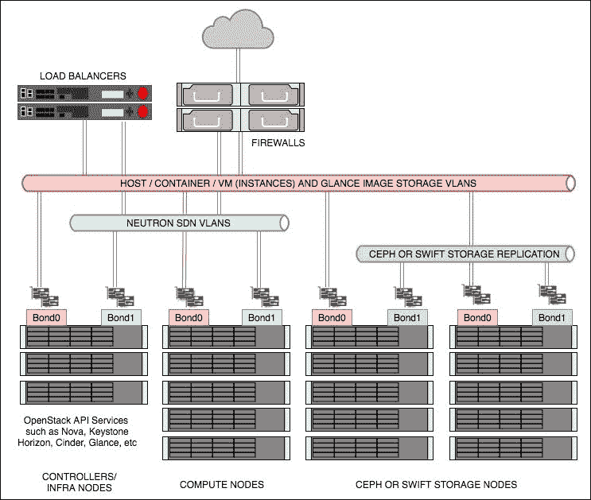
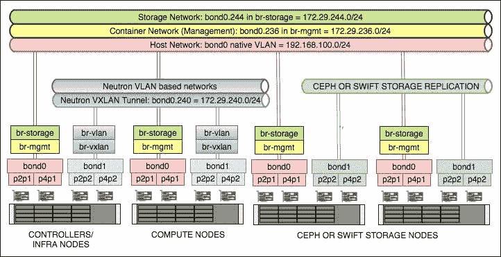
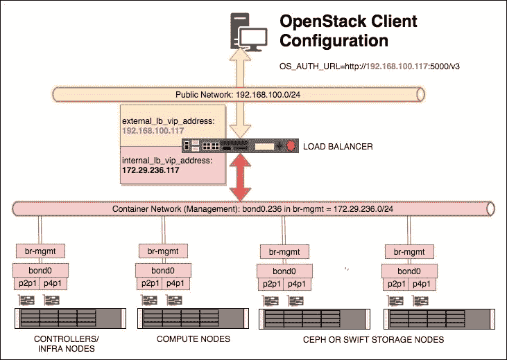
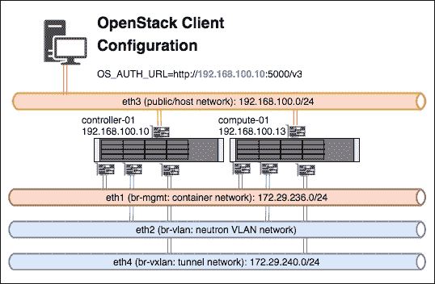

# 第一章. 使用 Ansible 安装 OpenStack

本章将涵盖以下主题：

+   介绍 – OpenStack 架构

+   主机网络配置

+   根 SSH 密钥配置

+   安装 Ansible、剧本和依赖项

+   配置安装

+   运行 OpenStack-Ansible 剧本

+   故障排除安装

+   手动测试安装

+   修改 OpenStack 配置

+   虚拟实验室 - vagrant up!

# 介绍 – OpenStack 架构

OpenStack 是一套项目集合，通过软件定义环境结合起来，用户可以通过云计算友好的工具和技术进行消费。这款流行的开源软件使得用户能够轻松地消费计算、网络和存储资源，这些资源传统上由不同的 IT 团队使用各种方法和工具来管理，不论是大型还是小型团队。尽管可以通过 OpenStack 版本之间 API 的一致性来实现兼容，管理员仍然可以自由选择安装 OpenStack 的哪些功能，因此没有单一的安装方法或架构来安装该软件。这种灵活性可能会导致在选择如何部署 OpenStack 时产生困惑。尽管如此，全球一致认为，最终用户交互的服务—即 OpenStack 服务、支持软件（如数据库）和 API—必须具备高可用性。

安装 OpenStack 的一种非常流行的方法是 OpenStack-Ansible 项目（[`github.com/openstack/openstack-ansible`](https://github.com/openstack/openstack-ansible)）。这种安装方法允许管理员定义高度可用的控制节点以及计算和存储阵列，并通过使用 Ansible，以非常一致的方式部署 OpenStack，且所需的依赖项较少。Ansible 是一种通过标准 SSH 连接进行系统配置和管理的工具。Ansible 本身依赖项很少，而且由于它使用 SSH 进行通信，大多数 Linux 发行版和网络都能够很好地支持这个工具。它在全球许多系统管理员中非常受欢迎，因此在他们已有的知识基础上安装 OpenStack，降低了为企业用户设置云环境的门槛。

OpenStack 可以以多种方式进行架构设计；OpenStack-Ansible 并不直接解决架构问题：用户可以自由定义任意数量的控制服务（如 Horizon、Neutron Server、Nova Server 和 MySQL）。通过 Rackspace 的经验和用户反馈，定义了一种流行的架构，示例如下：



图 1：本书推荐的 OpenStack 架构

如前图所示（*图 1*），首先需要了解一些概念。这些概念如下所述。

## 控制节点

*控制器*（也称为*基础设施节点*或*infra 节点*）运行 OpenStack 服务的核心部分，是唯一通过负载均衡池对外暴露的服务器（通过负载均衡池）供最终用户使用。*控制器*运行 API 服务，例如 Nova API、Keystone API 和 Neutron API，以及核心支持服务，如用于运行 OpenStack 所需数据库的**MariaDB**和用于消息传递的 RabbitMQ。正因为如此，在生产环境中，这些服务器必须按照需求配置为高可用性。这意味着这些服务器作为集群部署在（高可用）负载均衡器后面，集群中至少有 3 台服务器。使用从 3 开始的奇数集群，可以使集群在丧失一台服务器的情况下仍然保持服务不受影响，并且仍能保持法定人数（即需要的最小投票数）。这意味着，当不健康的服务器重新上线时，数据可以从剩余的 2 台服务器中复制（它们之间是一致的），从而确保数据的一致性。

网络建议具有高度的弹性，因此需要确保 Linux 已配置为绑定或聚合网络接口，以便在发生交换机端口故障或电缆损坏时，您的服务仍然可用。Ubuntu 的示例网络配置可以在*附录 A*中找到。

## 计算节点

这些是运行虚拟化管理程序或容器服务的服务器，当用户请求 Nova 资源（例如虚拟机）时，OpenStack 将工作负载调度到这些服务器上。它们与运行虚拟化管理程序的主机（如 ESXi 或 Hyper-V）没有太大区别，OpenStack 计算服务器的配置方式也非常相似，可以选择使用共享存储。然而，大多数 OpenStack 安装都会避免在架构中使用共享存储。这个不使用共享存储的小细节意味着虚拟机直接从计算主机的硬盘上运行，这对于讨论环境中应用的弹性时，会对 OpenStack 环境的用户产生较大影响。像这样设置的环境将大部分应用正常运行的责任交给开发者，这为长期云策略提供了最大的灵活性。当一个应用依赖于底层基础设施 100%可用时，基础设施所施加的重力会将应用绑定到特定的数据中心技术上以确保其运行。然而，OpenStack 可以配置为引入共享存储，例如 Ceph（[`ceph.com/`](http://ceph.com/)），以支持像实时迁移（在不中断的情况下将正在运行的实例从一个虚拟化管理程序迁移到另一个虚拟化管理程序）的操作特性，这样可以非常安全地将企业用户的应用迁移到云环境中。这些概念将在后续的计算和存储章节中详细讨论。因此，计算节点的参考架构是预期虚拟机将直接运行在服务器本身的硬盘上。

关于网络配置，像*控制器*一样，网络也必须配置为高可用性。一个没有可用网络的计算节点可能非常安全，但对于云环境来说同样毫无用处！请像配置控制器一样配置绑定接口。有关在 Ubuntu 下配置绑定接口的更多信息，请参见*附录 A*。

## 存储

OpenStack 中的存储指的是块存储和对象存储。块存储（为虚拟机提供 LUN 或 *硬盘*）由 Cinder 服务提供，而对象存储（由 API 驱动的对象或数据块存储）由 Swift 或 Ceph 提供。Swift 和 Ceph 管理服务器中每个被指定为对象存储节点的独立硬盘，就像 RAID 卡管理典型服务器中的硬盘一样。每个硬盘都是一个独立的实体，Swift 或 Ceph 用它来写入数据。例如，如果一个存储节点有 24 块 2.5 英寸的 SAS 硬盘，Swift 或 Ceph 会配置为写入这 24 块硬盘中的任何一块。然而，Cinder 可以使用多种后端来存储数据。例如，Cinder 可以配置为与第三方供应商（如 NetApp 或 Solidfire 存储阵列）通信，或者它可以配置为与 Sheepdog 或 Ceph 通信，还可以与像 LVM 这样的简单服务通信。事实上，OpenStack 可以配置为让 Cinder 使用多个后端，从而使用户能够选择适用于他们所需服务的存储。这为最终用户和操作员提供了极大的灵活性，因为这意味着工作负载可以针对特定的后端进行优化，适合该工作负载或存储需求。

本书简要介绍了 Ceph 作为 Cinder 的后台存储引擎。Ceph 是一个非常流行、高可用的开源存储服务。Ceph 有其自身的磁盘要求，以提供最佳的性能。在前面的图示中，每个 Ceph 存储节点被称为**Ceph OSD**（**Ceph 对象存储守护进程**）。我们建议从 5 个节点开始，尽管这不是硬性规定。Ceph 性能调优超出了本书的范围，但至少，我们强烈推荐使用 SSD 来进行 Ceph 日志存储，OSD（物理存储单元）则可以使用 SSD 或 SAS 驱动器。

在此架构中，Swift 节点和 Ceph 节点之间的区别非常小。两者都需要一个用于存储集群中数据复制的接口（为提高容错性，接口通常是绑定的），以及一个用于从客户端或服务读取和写入数据的接口（同样为了容错性，接口通常是绑定的）。

主要的区别在于建议使用 SSD（或 NVMe）作为日志磁盘。

## 负载均衡

OpenStack 环境的最终用户期望服务具有高度可用性，OpenStack 为其所有功能提供 REST API 服务。这使得 REST API 服务非常适合放置在负载均衡器后面。在大多数部署中，负载均衡器通常是高度可用的硬件设备，例如 F5。为了本书的目的，我们将使用 HAProxy。不过，背后的前提是相同的——确保服务在 *控制器* 节点故障的情况下仍然可用，以便最终用户可以继续工作。

## OpenStack-Ansible 安装要求

操作系统：Ubuntu 16.04 x86_64

### 最小的数据中心部署要求

对于物理安装，以下是所需的：

+   控制器服务器（也称为基础设施节点）

    +   至少 64 GB 内存

    +   至少 300 GB 硬盘（RAID）

    +   4 个网络接口卡（用于创建两组绑定接口；一组用于基础设施和所有 API 通信，包括客户端，另一组专用于 OpenStack 网络：Neutron）

    +   共享存储或对象存储服务，提供基础 OS 镜像的后端存储

+   计算服务器

    +   至少 64 GB 内存

    +   至少 600 GB 硬盘（RAID）

    +   4 个网络接口卡（用于创建两组绑定接口，和控制器服务器使用相同方式）

+   可选（如果使用 Ceph 作为 Cinder）5 台 Ceph 服务器（Ceph OSD 节点）

    +   至少 64 GB 内存

    +   2 个 400 GB SSD（RAID1）用于日志记录

    +   8 个 300 GB SAS 或 SSD（不使用 RAID）用于 OSD（根据需求调整大小）

    +   4 个网络接口卡（用于创建两组绑定接口；一组用于复制，另一组用于在 Ceph 中的数据进出传输）

+   可选（如果使用 Swift）5 台 Swift 服务器

    +   至少 64 GB 内存

    +   8 个 300 GB SAS（不使用 RAID）（根据需求调整大小）

    +   4 个网络接口卡（用于创建两组绑定接口；一组用于复制，另一组用于在 Swift 中的数据进出传输）

+   负载均衡器

    +   配置为一对的 2 台物理负载均衡器

    +   或者 2 台运行 HAProxy 和 Keepalived VIP 的服务器，作为 API 端点的 IP 地址：

        +   至少 16 GB 内存

        +   HAProxy + Keepalived

        +   2 个网络接口卡（绑定）

### 提示

**提示**：在设置物理实验室时，请确保你有一个管理型交换机，以便接口可以打上 VLAN 标签。

# 主机网络配置

使用如 Ansible 这样的编排和配置工具安装 OpenStack 可以自动化很多原本需要手动完成的任务。然而，我们只能在服务器以一致的方式配置并且已向 Ansible 描述时，使用编排工具。

以下部分将描述一种典型的服务器配置，使用两组活动/被动绑定接口供 OpenStack 使用。确保这些接口连接正确。

我们假设每台服务器都已安装以下物理网络卡；根据你的环境进行调整：

+   `p2p1` 和 `p2p2`

+   `p4p1` 和 `p4p2`

我们假设 *主机* 网络当前使用 `p2p1`。*主机* 网络是每台服务器当前所在的基础网络，允许你通过 SSH 访问每台服务器。假设该网络已经配置了默认网关，并且可以访问互联网。在这一阶段，应该不需要其他网络，因为服务器尚未配置，也未运行 OpenStack 服务。

在本节末尾，我们将创建以下绑定接口：

+   `bond0`：这由物理接口`p2p1`和`p4p1`组成。`bond0`接口将用于主机、OpenStack 管理和存储流量。

+   `bond1`：这由物理接口`p2p2`和`p4p2`组成。`bond1`接口将用于 OpenStack 中的 Neutron 网络。

我们将创建以下 VLAN 标记的接口：

+   `bond0.236`：该接口将用于*容器网络*。

+   `bond0.244`：该接口将用于*存储网络*。

+   `bond1.240`：该接口将用于*VXLAN 隧道网络*。

以及以下桥接：

+   `br-mgmt`：该桥接将使用`bond0.236` VLAN 接口，并将配置来自`172.29.236.0/24`范围内的 IP 地址。

+   `br-storage`：该桥接将使用`bond0.244` VLAN 接口，并将配置来自`172.29.244.0/24`范围内的 IP 地址。

+   `br-vxlan`：该桥接将使用`bond1.240 VLAN`接口，并将配置来自`172.29.240.0/24`范围内的 IP 地址。

+   `br-vlan`：该桥接将使用未标记的`bond1`接口，并且不会配置 IP 地址。

### 提示

**提示**：确保你的子网足够大，既能满足当前需求，也能支持未来的扩展！

以下图示展示了我们在开始安装 OpenStack 之前设置的网络、接口和桥接：



## 准备开始

我们假设每台服务器都已安装 Ubuntu 16.04。

以 root 身份登录到将安装 OpenStack 的每台服务器。

## 如何操作…

在 Ubuntu 系统上配置主机网络是通过编辑`/etc/network/interfaces`文件完成的。

1.  首先，确保每台服务器上已安装正确的网络包。由于我们使用 VLAN 和桥接，必须安装以下软件包：

    ```
     apt update
     apt install vlan bridge-utils

    ```

1.  现在使用你喜欢的编辑器编辑第一个服务器上的`/etc/network/interfaces`文件：

    ```
     vi /etc/network/interfaces

    ```

1.  我们将首先配置绑定接口。文件的第一部分将描述这一点。编辑此文件，使其开始时看起来像以下内容：

    ```
        # p2p1 + p4p1 = bond0 (used for host, container and storage)
        auto p2p1
        iface p2p1 inet manual
          bond-master bond0
          bond-primary p2p1
        auto p4p1
        iface p4p1 inet manual
          bond-master bond0
        # p2p2 + p4p2 = bond1 (used for Neutron and Storage Replication)
        auto p2p2
        iface p2p2 inet manual
          bond-master bond1
          bond-primary p2p2
        auto p4p2
        iface p4p2 inet manual
          bond-master bond1
    ```

1.  现在我们将配置与这些绑定接口相关联的 VLAN 接口。继续编辑文件，添加以下标记的接口。请注意，我们尚未为 OpenStack 的绑定接口分配 IP 地址：

    ```
        # We're using bond0 on a native VLAN for the 'host' network.
        # This bonded interface is likely to replace the address you
        # are currently using to connect to this host.
        auto bond0
        iface bond0 inet static
          address 192.168.100.11
          netmask 255.255.255.0
          gateway 192.168.100.1
          dns-nameserver 192.168.100.1 # Update to suit/ensure you can resolve DNS
        auto bond0.236  # Container VLAN
        iface bond0.236  inet manual
        auto bond1.240  # VXLAN Tunnel VLAN
        iface bond1.240  inet manual
        auto bond0.244  # Storage (Instance to Storage) VLAN
        iface bond0.244  inet manual
    ```

    ### 提示

    **提示**：根据你自己的环境，使用适当的 VLAN。这里使用的 VLAN 标签仅供参考。

    确保正确的 VLAN 标签配置在正确的绑定接口上。`bond0`用于主机类型的流量，`bond1`主要用于基于 Neutron 的流量，存储节点除外，在这种情况下它用于存储复制。

1.  现在我们将创建桥接，并根据需要在其上配置 IP 地址（请注意，`br-vlan`没有分配 IP 地址）。继续编辑相同的文件，添加以下行：

    ```
    # Container bridge (br-mgmt)
    auto br-mgmt
    iface br-mgmt inet static
      address 172.29.236.11
      netmask 255.255.255.0
      bridge_ports bond0.236        
      bridge_stp off
    # Neutron's VXLAN bridge (br-vxlan)
    auto br-vxlan
    iface br-vxlan inet static
      address 172.29.240.11
      netmask 255.255.255.0
      bridge_ports bond1.240       
      bridge_stp off
    # Neutron's VLAN bridge (br-vlan)
    auto br-vlan
    iface br-vlan inet manual
      bridge_ports bond1
      bridge_stp off
    # Storage Bridge (br-storage)
    auto br-storage
    iface br-storage inet static
      address 172.29.244.11
      netmask 255.255.255.0
      bridge_ports bond0.244
      bridge_stp off
    ```

    ### 提示

    这些桥接名称会在 OpenStack-Ansible 配置文件中被引用，因此确保你正确命名它们。

    小心确保正确的桥接被分配到正确的绑定接口。

1.  保存并退出文件，然后执行以下命令：

    ```
    restart networking

    ```

1.  由于我们正在配置 OpenStack 环境，使其尽可能具有高可用性，因此建议你此时重新启动服务器，以确保基本的服务器，带有冗余网络，能够按预期重新启动：

    ```
    reboot

    ```

1.  现在对你网络中的每台服务器执行相同操作。

1.  一旦所有服务器完成配置，确保你的服务器能够通过这些新创建的接口和子网互相通信。类似下面的测试可能会很方便：

    ```
    apt install fping
    fping -a -g 172.29.236.0/24
    fping -a -g 172.29.240.0/24
    fping -a -g 172.29.244.0/24

    ```

### 提示

**提示**：我们还建议你执行一个网络电缆拔除练习，以确保从一个活动接口切换到另一个接口的故障转移功能按预期工作。

## 它是如何工作的…

我们已经配置了主机的物理网络，以确保在运行 OpenStack 时有一个良好的已知状态和配置。这里配置的每个接口都是 OpenStack 特定的—要么由 OpenStack 直接管理（例如，`br-vlan`），要么用于服务间通信（例如，`br-mgmt`）。在前一种情况下，OpenStack 使用 `br-vlan` 桥接并直接在 `bond1` 上配置标记接口。

请注意，这里使用的约定，VLAN 标签 ID 使用子网的一部分，仅用于突出 VLAN 到特定子网的分离（例如，`bond0.236` 用于 `172.29.236.0/24` 子网）。此 VLAN 标签 ID 是任意的，但必须根据你的具体网络需求进行设置。

最后，我们进行了一个相当基础的网络测试。这可以让你确信，OpenStack 云生命周期中将使用的网络配置是合适的，并且在网络电缆或网卡发生故障时，能够提供保障。

# Root SSH 密钥配置

Ansible 旨在通过使用编排剧本配置和操作多台服务器，帮助系统管理员提高数据中心的效率。为了使 Ansible 能够履行其职责，它需要在其管理的 Linux 系统上建立 SSH 连接。此外，为了获得更大的自由度和灵活性，必须使用 SSH 公私钥对的无人值守方法。

由于 OpenStack 的安装预计以 root 身份运行，因此此阶段需要将部署主机的 root 公钥传播到所有服务器。

## 准备工作

确保你在部署主机上是`root`用户。在大多数情况下，这是我们为本书目的命名的第一个基础设施*控制器*节点，命名为`infra01`。我们将假设所有的 Ansible 命令都将在这个主机上运行，并且它预计能够通过 SSH 通过主机网络连接到网络上的其他服务器。

## 如何操作…

为了实现无需人工干预的自动化 OpenStack-Ansible 部署，请按照以下步骤创建并传播 `infra01` 的 root SSH 公钥至所有安装所需的服务器：

1.  作为 root，执行以下命令来创建 SSH 密钥对：

    ```
    ssh-keygen -t rsa -f ~/.ssh/id_rsa -N ""

    ```

    输出应类似于以下内容：

    ```
    Generating public/private rsa key pair.
    Your identification has been saved in /root/.ssh/id_rsa.
    Your public key has been saved in /root/.ssh/id_rsa.pub.
    The key fingerprint is:
    SHA256:q0mdqJI3TTFaiLrMaPABBboTsyr3pRnCaylLU5WEDCw root@infra01
    The key's randomart image is:
    +---[RSA 2048]----+
    |ooo ..           |
    |E..o. .          |
    |=. . +           |
    |.=. o +          |
    |+o . o oS        |
    |+oo . .o       |
    |B=++.o+ +        |
    |*=B+oB.o         |
    |o+.o=.o          |
    +----[SHA256]-----+

    ```

1.  这在 `/root/.ssh` 目录下创建了两个文件，分别叫做 `id_rsa` 和 `id_rsa.pub`。文件 `id_rsa` 是私钥，必须避免通过网络进行复制。它只需要存在于该服务器上。文件 `id_rsa.pub` 是公钥，可以共享到网络上的其他服务器。如果你有其他节点（例如名为 infra02），可以使用以下命令将此密钥复制到你环境中的该节点：

    ```
    ssh-copy-id root@infra02

    ```

    ### 提示

    **提示**：确保你能解析 `infra02` 和其他服务器，否则修改前面的命令，使用主机的 IP 地址代替。

1.  现在，对你网络上的所有服务器重复步骤 2。

1.  重要：最后，确保执行以下命令，以便能够进行自我 SSH 连接：

    ```
    ssh-copy-id root@infra01

    ```

1.  测试你能否作为 root 用户，从 `infra01` 使用 `ssh` 连接到网络上的其他服务器。如果成功，应该会显示一个终端，准备接受命令，而不会要求输入密码。如果此行为不正常，请查看远程服务器上的 `/var/log/auth.log`。

## 其工作原理…

我们首先生成了一个密钥对文件供 SSH 使用。`-t` 选项指定了 `rsa` 类型加密，`-f` 指定了私钥的输出路径，公钥部分将以 `.pub` 为文件名后缀，`-N ""` 表示不使用密码短语。若选项与贵公司要求不符，请参照贵公司安全标准。

# 安装 Ansible、剧本和依赖项

为了成功通过 Ansible 安装 OpenStack，我们需要确保在部署主机上安装了 Ansible 及所有预期的依赖项。OpenStack-Ansible 项目为我们提供了一个方便的脚本来完成这项工作，该脚本是我们将要部署的 OpenStack-Ansible 版本的一部分。

## 准备就绪

确保你在部署主机上以 `root` 身份登录。在大多数情况下，这将是第一个基础设施控制节点 `infra01`。

此时，我们将从 GitHub 检出 OpenStack-Ansible 的版本。

## 如何操作...

为了设置 Ansible 及其依赖项，请按照以下步骤操作：

1.  我们首先需要使用 `git` 从 GitHub 检出 OpenStack-Ansible 代码，因此确保安装了以下包（以及其他所需的依赖项）：

    ```
    apt update
    apt install git python-dev bridge-tools lsof lvm2 tcpdump build-   essential ntp ntpdate python-dev libyaml-dev libpython2.7-dev libffi-dev libssl-dev python-crypto python-yaml

    ```

1.  然后我们需要从 GitHub 获取 OpenStack-Ansible 代码。写作时，Pike 发布分支（16.X）描述如下，但在可预见的未来步骤将保持不变。建议访问 [`github.com/openstack/openstack-ansible/tags`](https://github.com/openstack/openstack-ansible/tags) 来使用最新的稳定标签。此处我们使用的是最新的 16（Pike）标签，即 `16.0.5`：

    ### 提示

    **提示**：要使用 Queens 发布的某个分支，请使用以下命令：`-b 17.0.0`。当 Rocky 发布可用时，请使用 `-b 18.0.0`。

    ```
    git clone -b 16.0.5 https://github.com/openstack/openstack-ansible.git /opt/openstack-ansible

    ```

1.  Ansible 和成功安装 OpenStack 所需的依赖项可以在 `/opt/openstack-ansible/scripts` 目录中找到。运行以下命令以引导环境：

    ```
    cd /opt/openstack-ansible
    scripts/boot
    strap-ansible.sh

    ```

## 工作原理…

OpenStack-Ansible 项目提供了一个便捷的脚本，以确保在部署主机上安装了 Ansible 和正确的依赖项。这个脚本（`bootstrap-ansible.sh`）位于检出的 OpenStack-Ansible 代码的 `scripts/` 目录中，因此此时我们需要使用 Git 获取我们想要部署的版本。一旦获得代码，我们可以执行脚本并等待其完成。

## 还有更多内容…

访问 [`docs.openstack.org/project-deploy-guide/openstack-ansible/latest`](https://docs.openstack.org/project-deploy-guide/openstack-ansible/latest) 获取更多信息。

# 配置安装

OpenStack-Ansible 是一组官方的 Ansible playbook 和角色，它以最小的先决条件部署 OpenStack。像任何编排工具一样，大部分工作是在配置阶段完成的，然后在 playbook 运行时实现免手动操作。最终的结果是一个经过多次验证的 OpenStack 安装，适用于任何规模的环境，从测试到生产环境。

当我们使用 OpenStack-Ansible 时，实际上是在将 playbooks 从 GitHub 下载到指定的 *部署服务器*。部署服务器是通过 SSH 访问环境中所有机器的主机（为了便利以及提供无缝的体验，通常通过密钥进行访问）。这个部署服务器可以是你指定的任何一台机器，因为一旦运行，Ansible 不会占用任何持续的资源。

### 提示

**提示**：在重新安装 Ubuntu 之前，记得备份与 OpenStack-Ansible 相关的配置目录！

## 准备工作

确保你是 *部署主机* 上的 `root` 用户。在大多数情况下，这将是第一个基础设施控制节点 `infra01`。

## 如何操作…

假设你使用的是第一个基础设施节点 `infra01` 作为部署服务器。

如果你没有按照前面的 *安装 Ansible、playbooks 和依赖项* 章节进行操作，请作为 `root` 执行以下操作（如有必要）：

```
git clone -b 16.05 https://github.com/openstack/openstack-ansible.git /opt/openstack-ansible

```

这将把 OpenStack-Ansible playbook 下载到 `/opt/openstack-ansible` 目录。

要配置 OpenStack 部署，请执行以下步骤：

1.  我们首先将 `etc/openstack_deploy` 文件夹从下载的仓库复制到 `/etc`：

    ```
    cd /opt/openstack-ansible
    cp -R /etc/openstack_deploy /etc

    ```

1.  现在，我们必须通过编辑 `/etc/openstack_deploy/openstack_user_config.yml` 文件，告诉 Ansible 哪些服务器将执行哪些 OpenStack 功能，如下所示：

    ```
    cp /etc/openstack_deploy/openstack_user_variables.yml.example /etc/openstack_deploy_openstack_user_variables.yml
    vi /etc/openstack_deploy/openstack_user_variables.yml

    ```

1.  第一部分，`cidr_networks`，描述了 OpenStack 在此安装中使用的子网。在这里，我们描述了 *容器* 网络（每个 OpenStack 服务都运行在一个容器中，并且每个服务有自己的网络，以便它们之间可以相互通信）。我们描述了隧道网络（当用户在 OpenStack 安装中创建租户网络时，这将创建一个在物理网络上隔离的 VXLAN 网络）。最后，我们描述了存储网络子网。编辑此文件，使其看起来如下所示：

    ```
      cidr_networks:
      container: 172.29.236.0/24
      tunnel: 172.29.240.0/24
      storage: 172.29.244.0/24
    ```

1.  继续编辑文件，包含已在 OpenStack 将要部署的环境中由现有物理主机使用的任何 IP 地址（并确保已包含用于物理扩展的任何保留 IP 地址）。包括我们在此章节前已经配置的地址。可以在此处添加单个 IP 地址或地址范围（起始和结束地址用 ',' 分隔）。编辑此部分，使其看起来如下所示，按你的环境和任何保留的 IP 进行调整：

    ```
    used_ips:
      - "172.29.236.20"
      - "172.29.240.20"
      - "172.29.244.20"
      - "172.29.236.101,172.29.236.117"
      - "172.29.240.101,172.29.240.117"
      - "172.29.244.101,172.29.244.117"
      - "172.29.248.101,172.29.248.117"
    ```

1.  `global_overrides` 部分描述了用于环境的桥接和其他接口的具体细节——特别是容器网络如何连接到物理网络接口。对于本书中使用的示例架构，可以使用以下输出。在大多数情况下，除了开始时的负载均衡器信息外，本节内容无需编辑，因此根据需要调整：

    ```
    global_overrides:
      internal_lb_vip_address: 172.29.236.117
      external_lb_vip_address: 192.168.100.117
      lb_name: haproxy
      tunnel_bridge: "br-vxlan"
      management_bridge: "br-mgmt"
      provider_networks:
        - network:
            group_binds:
              - all_containers
              - hosts
            type: "raw"
            container_bridge: "br-mgmt"
            container_interface: "eth1"
            container_type: "veth"
            ip_from_q: "management"
            is_container_address: true
            is_ssh_address: true
        - network:
            group_binds:
              - neutron_linuxbridge_agent
            container_bridge: "br-vxlan"
            container_type: "veth"
            container_interface: "eth10"
            ip_from_q: "tunnel"
            type: "vxlan"
            range: "1:1000"
            net_name: "vxlan"
        - network:
            group_binds:
              - neutron_linuxbridge_agent
            container_bridge: "br-vlan"
            container_type: "veth"
            container_interface: "eth11"
            type: "vlan"
            range: "1:1"
            net_name: "vlan"
    ```

1.  本文件的剩余部分描述了每个服务运行的服务器。大部分章节内容重复，仅在服务名称上有所不同。这是可以接受的，因为此处的目的是告诉 OpenStack-Ansible 每个服务（我们为它起一个名字，便于 Ansible 通过名称引用，并引用与其关联的 IP 地址）在哪个服务器上运行，例如 Nova API、RabbitMQ 或 Glance 服务等。由于这些示例服务运行在我们的控制节点上，而在生产环境中至少有三个控制节点，所以你可以很快明白为什么这些信息会重复。其他章节则专门提到其他服务，如 OpenStack 计算服务。为了简洁起见，这里展示了几个章节，继续编辑文件以适应你的网络配置：

    ```
    # Shared infrastructure parts
    shared-infra_hosts:
      controller-01:
        ip: 172.29.236.110
      controller-02:
        ip: 172.29.236.111
      controller-03:
        ip: 172.29.236.112
    # Compute Hosts
    compute_hosts:
      compute-01:
        ip: 172.29.236.113
      compute-02:
        ip: 172.29.236.114
    ```

1.  保存并退出文件。接下来，我们需要为 OpenStack 中运行的各个服务生成一些随机密码短语。在 OpenStack 中，每个服务——如 Nova、Glance 和 Neutron（本书中有描述）——都必须向 Keystone 进行身份验证，并授权它们作为服务进行操作。为此，它们自己的用户帐户需要生成密码短语。执行以下命令以生成所需的密码短语，这些密码短语将在稍后执行 OpenStack playbook 时使用：

    ```
    cd /opt/openstack-ansible/scripts
    python pw-token-gen.py --file /etc/openstack_deploy/user_secrets.yml

    ```

1.  最后，还有另一个文件允许你对 OpenStack 服务的参数进行微调，例如 Glance（OpenStack 镜像服务）将使用的后端存储，并在安装之前配置代理服务。这个文件叫做`/etc/openstack_deploy/user_variables.yml`。让我们查看并编辑这个文件：

    ```
    cd /etc/openstack_deploy
    vi user_variables.yml

    ```

1.  在一个典型的高可用部署中——即我们有三个控制节点的部署——我们需要配置 Glance 使用共享存储服务，这样三个控制节点就可以对文件系统有相同的视图，从而使启动实例时使用的镜像一致。Glance 可以使用的一些共享存储后端系统包括 NFS 和 Swift。我们甚至可以允许一个私有云环境通过公共网络连接并连接到像 Rackspace Cloud Files 这样的公共服务。如果你有可用的 Swift，可以将以下行添加到 `user_variables.yml` 文件中，配置 Glance 使用 Swift：

    ```
    glance_swift_store_auth_version: 3
    glance_default_store: swift
    glance_swift_store_auth_address: http://172.29.236.117:5000/v3
    glance_swift_store_container: glance_images
    glance_swift_store_endpoint_type: internalURL
    glance_swift_store_key: '{{ glance_service_password }}'
    glance_swift_store_region: RegionOne
    glance_swift_store_user: 'service:glance'
    ```

    ### 提示

    **提示**：OpenStack-Ansible 的最新版本足够智能，能够自动检测是否使用了 Swift，并会相应地更新其配置。

1.  查看文件中其他被注释掉的详细信息，看看是否需要根据你的环境进行编辑，然后保存并退出。现在你可以开始安装 OpenStack 了！

## 它是如何工作的……

Ansible 是一个非常流行的服务器配置工具，非常适合安装 OpenStack。Ansible 使用一组配置文件，*Playbooks*（一组在服务器上执行的步骤）用来控制它们的执行方式。对于 OpenStack-Ansible，配置分为两个领域：描述物理环境和描述如何配置 OpenStack。

第一个配置文件`/etc/openstack_deploy/openstack_user_config.yml`描述了物理环境。每个部分在这里都有描述：

```
cidr_networks:
  container: 172.29.236.0/24
  tunnel: 172.29.240.0/24
  storage: 172.29.244.0/24
```

本节描述了基于 OpenStack-Ansible 安装所需的网络。查看下面的图示，了解不同的网络和子网。

+   **容器**：每个部署的容器都会从这个子网中获取一个 IP 地址。负载均衡器也会从这个范围内获取一个 IP 地址。

+   **隧道**：这是形成 VXLAN 隧道网格的子网。每个参与 VXLAN 隧道的容器和计算主机都会从这个范围内获得一个 IP（当操作员创建一个指定 `vxlan` 类型的 Neutron 子网时，VXLAN 隧道会被使用，这在这个底层子网上创建了一个虚拟网络）。有关 OpenStack 网络的更多细节，请参阅 第四章，*Neutron – OpenStack Networking*。

+   **存储**：这是在 OpenStack 中启动客户端实例时使用的子网，要求 Cinder 块存储：

    ```
    used_ips:
      - "172.29.236.20"
      - "172.29.240.20"
      - "172.29.244.20"
      - "172.29.236.101,172.29.236.117"
      - "172.29.240.101,172.29.240.117"
      - "172.29.244.101,172.29.244.117"
      - "172.29.248.101,172.29.248.117"
    ```

`used_ips:` 部分指的是已经在该子网中使用的 IP 地址，或为静态设备保留的 IP 地址。此类设备包括负载均衡器或其他属于子网的主机，否则 OpenStack-Ansible 会将这些 IP 随机分配给容器：

```
global_overrides:
  internal_lb_vip_address: 172.29.236.117
  external_lb_vip_address: 192.168.1.117
  tunnel_bridge: "br-vxlan"
  management_bridge: "br-mgmt"
  storage_bridge: "br-storage"
```

`global_overrides:` 部分描述了容器与桥接网络的设置细节。OpenStack-Ansible 的默认文档假设使用 Linux Bridge；但是，也可以使用 Open vSwitch。有关更多细节，请参考第四章，*Neutron – OpenStack 网络*。

`internal_lb_vip_address:` 和 `external_lb_vip_address:` 部分指的是典型负载均衡器的 *私有* 和 *公共* 端口。私有端口（`internal_lb_vip_address`）由 OpenStack 内的服务使用（例如，Nova 调用与 Neutron API 的通信时会使用 `internal_lb_vip_address`，而用户在 OpenStack 环境安装后进行通信时则会使用 `external_lb_vip_address`）。请参见以下图示：



为某个 **虚拟 IP** (**VIP**) 地址将创建多个负载均衡池，描述与特定服务相关的 IP 地址和端口，对于每个池——一个将在公共/外部网络上创建（在示例中，已为此目的创建了 VIP 地址 `192.168.100.117`），另一个 VIP 将供 OpenStack 内部使用（在前面的示例中，已为此目的创建了 VIP 地址 `172.29.236.117`）。

`tunnel_bridge:` 部分是为连接参与 VXLAN 隧道网络的物理接口而设定的桥接名称。

`management_bridge:` 部分是为所有在容器网络上安装的 OpenStack 服务设定的桥接名称，容器网络如图所示。

`storage_bridge:` 部分是为与实例连接存储或 Swift 代理的流量而设定的桥接名称。

上述每个桥接名称必须与在每台服务器的 `/etc/network/interfaces` 文件中配置的名称匹配。

接下来的部分，`provider_networks`，相对静态且未更改，它描述了容器网络与物理环境之间的关系。请勿调整此部分。

`provider_networks` 部分后面是描述哪个服务器或服务器组运行特定服务的部分。每个块的语法如下：

```
service_name:
  ansible_inventory_name_for_server:
    IP_ADDRESS
  ansible_inventory_name_for_server:
    IP_ADDRESS
```

### 提示

**提示**：确保每个服务器名称（`ansible_inventory_name_for_server`）的拼写正确一致，以确保 Ansible playbook 的正确执行。

这里列出了若干部分及其用途：

+   `shared-infra_hosts`：这些支持共享基础设施软件，如 MariaDB/Galera 和 RabbitMQ。

+   `repo-infra_hosts`：这是指定的 OpenStack-Ansible 容器版本。

+   `haproxy_hosts`：在使用 HAProxy 进行负载均衡时，指示 playbook 安装和配置此服务的位置。

+   `os-infra_hosts`：这些包括 OpenStack API 服务，如 Nova API 和 Glance API。

+   `log_hosts`：这是运行 rsyslog 服务器的地方。

+   `identity_hosts`：这些是运行 Keystone（OpenStack Identity）服务的服务器。

+   `storage-infra_hosts`：这些是运行 Cinder API 服务的服务器。

+   `storage_hosts`：这是描述 Cinder LVM 节点的部分。

+   `swift-proxy_hosts`：这些是将托管 Swift Proxy 服务的主机。

+   `swift_hosts`：这些是 Swift 存储节点。

+   `compute_hosts`：这是组成虚拟化服务器的主机列表。

+   `image_hosts`：这些是运行 Glance（OpenStack Image）服务的服务器。

+   `orchestration_hosts`：这些是运行 Heat API（OpenStack Orchestration）服务的服务器。

+   `dashboard_hosts`：这些是运行 Horizon（OpenStack Dashboard）服务的服务器。

+   `network_hosts`：这些是运行 Neutron（OpenStack Networking）代理和服务的服务器。

+   `metering-infra_hosts`：这些是运行 Ceilometer（OpenStack Telemetry）服务的服务器。

+   `metering-alarm_hosts`：这些是运行与告警相关的 Ceilometer（OpenStack Telemetry）服务的服务器。

+   `metrics_hosts`：运行 Ceilometer 组件（Gnocchi）的服务器。

+   `metering-compute_hosts`：使用 Ceilometer 时，这些是需要安装计量代理的计算主机列表。

# 运行 OpenStack-Ansible playbook。

安装 OpenStack 时，我们只需运行相关的 playbook。总共有三个主要的 playbook，我们将依次使用：

+   `setup-hosts.yml`。

+   `setup-infrastructure.yml`。

+   `setup-openstack.yml`。

## 准备工作。

确保你是部署主机上的 `root` 用户。在大多数情况下，这将是第一个基础设施控制节点，`infra01`。

## 如何操作……

要使用 OpenStack-Ansible playbook 安装 OpenStack，首先导航到已克隆 Git 仓库的 `playbooks` 目录，然后依次执行每个 playbook：

1.  首先通过执行以下命令切换到 `playbooks` 目录：

    ```
    cd /opt/openstack-ansible/playbooks

    ```

1.  第一步是对你的脚本和配置进行语法检查。由于我们将执行三个 playbook，我们将针对每个 playbook 执行以下操作：

    ```
    openstack-ansible setup-hosts.yml --syntax-check
    openstack-ansible setup-infrastructure.yml --syntax-check
    openstack-ansible setup-openstack.yml --syntax-check

    ```

1.  现在我们将使用一个特殊的 OpenStack-Ansible 包装脚本来运行第一个 playbook，配置我们在 `/etc/openstack_deploy/openstack_user_config.yml` 文件中描述的每个主机：

    ```
    openstack-ansible setup-hosts.yml
    ```

1.  稍等片刻后，你应该看到一个完全绿色的 PLAY RECAP 输出（其中黄色/蓝色的行表示做出的任何更改），并且输出显示所有更改都成功。如果有问题，请通过滚动回输出内容来查看并留意任何红色输出的内容。请参考本章后面的*故障排除安装*部分。如果一切正常，我们可以继续运行下一个 Playbook 以设置负载均衡。在此阶段，配置负载均衡器非常重要。OpenStack-Ansible 将 OpenStack 服务安装在每台服务器的 LXC 容器中，到目前为止，我们还没有明确说明哪个容器网络的 IP 地址将安装哪个服务。这是因为我们让 Ansible 为我们管理这一切。因此，虽然在此阶段设置负载均衡似乎有些反直觉——因为我们还不知道每个服务会安装在哪个容器上——但 Ansible 已经在未来的工作之前生成了动态清单，所以它已经知道涉及多少个容器，并知道哪个容器会安装该服务。如果你使用的是 F5 LTM、Brocade 或类似的企业级负载均衡设备，建议你暂时使用 HAProxy，并查看生成的配置，以便手动转移到物理设备上。为了临时设置 HAProxy，使 OpenStack 的安装能够继续，修改你的 `openstack_user_config.yml` 文件，包含一个 HAProxy 主机，然后执行以下命令：

    ```
    openstack-ansible install-haproxy.yml

    ```

1.  如果一切正常，我们可以继续运行下一个 Playbook 来设置共享基础设施服务，如下所示：

    ```
    openstack-ansible setup-infrastructure.yml

    ```

1.  这个步骤比第一个 Playbook 花费的时间稍长。如同之前一样，检查输出是否有失败。在此阶段，我们应该在每个基础设施节点（也称为控制节点）上运行多个容器。在这些容器中，像 Galera 或 RabbitMQ 这样的容器上，我们应该看到服务在正常运行，等待 OpenStack 对其进行配置。现在，我们可以通过运行最大的 Playbook 来继续安装 OpenStack 本身。为此，请执行以下命令：

    ```
    openstack-ansible setup-openstack.yml

    ```

1.  这个过程可能需要一段时间——可能长达数小时——因此请确保你的 SSH 会话在长时间后不会中断，并通过像`tmux`或`screen`这样的工具来防止断开连接，做好准备。在 Playbook 执行结束时，如果一切正常，恭喜你，OpenStack 已经安装完成！

## 它是如何工作的……

使用 OpenStack-Ansible 安装 OpenStack 是通过多个 Playbooks 完成的。第一个 Playbook `setup-hosts.yml` 配置主机，设置容器配置。在此阶段，Ansible 已经知道将来会在哪些地方放置所有与 OpenStack 相关的服务，因此我们使用动态清单信息来安装 HAProxy，并将其配置为所有 OpenStack 服务（这些服务尚未安装）使用的代理服务。下一个 Playbook `setup-infrastructure.yml` 配置并安装 OpenStack 期望存在的基础设施服务容器，如 Galera。最后一个 Playbook 是主 Playbook——它安装我们在配置中指定的所有 OpenStack 服务。该过程会运行一段时间，但最终你会得到一个完整的 OpenStack 安装。

OpenStack-Ansible 项目提供了一个包装脚本，包装了通常用于执行 Playbooks 的 `ansible` 命令。这个脚本叫做 `openstack-ansible`。本质上，它确保将正确的清单和配置传递给 `ansible` 命令，以确保正确运行 OpenStack-Ansible 的 Playbooks。

# 安装故障排除

Ansible 是一款由人编写的工具，运行由人编写的 Playbooks，来配置通常需要人为手动操作的系统，因此错误是难免发生的。最终结果的质量取决于输入的质量。

常见的故障通常会很快出现，例如连接问题，这些问题会比较明显，或者在长时间运行的任务后出现，可能是由于负载或网络超时导致的。无论如何，OpenStack-Ansible 的 Playbooks 提供了一种高效的机制，可以在不重复已经完成的任务的情况下重新运行 Playbooks。

在失败时，Ansible 会在 `/root` 目录下生成一个文件（因为我们是以 `root` 身份运行这些 Playbooks），文件名为 *Playbook* 的名称，文件扩展名为 `.retry`。该文件简单列出了失败的主机，方便在重新运行 Playbook 时参考。这样可以仅针对少数几个失败的主机重新执行，而不是对已经成功完成的大型集群进行重复操作，这样更加高效。

## 如何操作...

我们将逐步解决导致其中一个 Playbook 失败的问题。

注意失败的 Playbook，然后按照以下步骤重新执行：

1.  确保你在 `playbooks` 目录下，如下所示：

    ```
    cd /opt/openstack-ansible/playbooks

    ```

1.  现在重新运行该 Playbook，但指定 `retry` 文件：

    ```
    ansible-openstack setup-openstack.yml --retry /root/setup-openstack.retry

    ```

1.  在大多数情况下，这足以解决问题，然而，OpenStack-Ansible 已经编写成幂等的——这意味着可以重新运行整个 Playbook，只修改需要的部分。因此，你可以在不指定 `retry` 文件的情况下再次运行 Playbook。

如果在第一阶段发生故障，请执行以下操作：

1.  首先删除生成的 `inventory` 文件：

    ```
    rm -f /etc/openstack_deploy/openstack_inventory.json
    rm -f /etc/openstack_deploy/openstack_hostnames_ips.yml

    ```

1.  现在重新运行 `setup-hosts.yml` Playbook：

    ```
    cd /opt/openstack-ansible/playbooks
    openstack-ansible setup-hosts.yml

    ```

在某些情况下，销毁安装并重新开始可能是适用的。由于每个服务都安装在 LXC 容器中，因此很容易擦除安装并从头开始。要执行此操作，请按照以下步骤操作：

1.  首先，我们销毁环境中的所有容器：

    ```
    cd /opt/openstack-ansible/playbooks
    openstack-ansible lxc-containers-destroy.yml

    ```

    您将被要求确认此操作。按照屏幕上的提示操作。

1.  我们建议您卸载以下软件包，以避免与将来运行 playbooks 时的任何冲突，并清理每个主机上的任何残留容器：

    ```
    ansible hosts -m shell -a "pip uninstall -y appdirs"

    ```

1.  最后，删除清单信息：

    ```
    rm -f /etc/openstack_deploy/openstack_inventory.json 
    /etc/openstack_deploy/openstack_hostnames_ips.yml

    ```

## 工作原理…

Ansible 并不完美，计算机也不是。有时由于 SSH 超时或其他瞬时故障，环境中会发生失败。此外，尽管 Ansible 尝试重新执行 playbook，但结果可能是失败。Ansible 失败非常明显——通常会在屏幕上以红色文本输出。在大多数情况下，重新运行有问题的 playbook 可能会解决一些瞬时问题。每个 playbook 运行一个特定的任务，Ansible 会说明哪个任务失败了。排除为何特定任务失败的故障将最终导致良好的结果。最坏的情况是，您可以从头开始重置安装。

# 手动测试安装

安装成功后的第一步是测试安装。测试 OpenStack 涉及自动化和手动检查。

手动测试验证用户旅程，这些旅程通常不会通过自动化测试检测到，例如确保 horizon 正确显示。

可以使用诸如 tempest 或 OpenStack 基准测试工具（rally）之类的测试框架调用自动化测试。

## 准备工作完成后

确保您是第一个基础架构控制器节点`infra01`上的`root`用户。

## 如何操作…

OpenStack-Ansible 的安装在每个基础架构节点上创建了几个`utility`容器。这些实用程序主机提供了所有必需的命令行工具，用于尝试 OpenStack，当然是使用命令行。按照以下步骤访问实用程序主机并手动验证 OpenStack 的安装：

1.  首先，通过执行以下命令查看正在运行的容器：

    ```
    lxc-ls -f

    ```

1.  正如您所看到的，这里列出了许多容器，因为 OpenStack-Ansible 安装使用隔离的 Linux 容器来运行每个服务。在每个容器旁边，将列出其 IP 地址和运行状态。您可以在这里看到本章中使用的容器网络为`172.29.236.0/24`，以及为什么这样命名。这里的一个容器是实用程序容器，采用以下格式命名：`nodename_utility_container_randomuuid`。要访问此容器，您可以通过 SSH 连接，或者可以执行以下命令：

    ```
    lxc-attach -n infra01_utility_container_34u477d

    ```

1.  现在，您将在这个容器内运行一个终端，只能访问属于该容器的工具和服务。在这种情况下，我们可以访问所需的 OpenStack 客户端。您需要做的第一件事是载入您的 OpenStack 凭证。OpenStack-Ansible 项目会生成一个 bash 环境文件，其中包含安装过程中设置的`admin`用户和项目。使用以下命令将其加载到 bash 环境中：

    ```
    source openrc

    ```

    ### 提示

    **提示**：您还可以在 Bash 中使用以下语法： . `openrc`

1.  现在，您可以使用 OpenStack CLI 查看服务和环境状态，创建网络并启动实例。以下是一些常用命令：

    ```
    openstack server list
    openstack network list
    openstack endpoint list
    openstack network agent list

    ```

## 它是如何工作的…

OpenStack-Ansible 安装 OpenStack 的方法会将 OpenStack 服务安装到我们 Linux 服务器上的隔离容器中。在每个控制节点（或基础设施节点）上大约有 12 个容器，每个容器运行一个单独的服务，如 nova-api 或 RabbitMQ。您可以通过以 root 身份登录任一服务器并执行`lxc-ls -f`命令来查看运行中的容器。`-f`参数将显示完整的列表，展示实例的状态，例如它是运行中还是已停止。

基础设施节点上的一个容器名称中包含`utility`，在 OpenStack-Ansible 术语中称之为*实用容器*。这个容器安装了 OpenStack 客户端工具，非常适合手动测试 OpenStack 的安装。在这个容器中，每个容器至少有一个 IP 地址，在本章使用的示例中，IP 地址属于`172.29.236.0/24`子网。您可以 SSH 连接到该容器的 IP 地址，或者使用另一个`lxc`命令附加到容器：`lxc-attach -n` `<name_of_container>`。一旦进入容器内部，您可以像使用其他系统一样使用它，前提是容器内可以使用相应的工具。但是，要使用 OpenStack 命令，您首先需要载入名为`openrc`的资源环境文件。这是一个标准的 bash 环境文件，在安装过程中已预先填充，并提供了使用 OpenStack 所需的所有凭证。

# 修改 OpenStack 配置

如果认为为了像将 CPU 争用比率从 4:1 更改为 8:1 这样的小改动而需要重新运行所有的 playbook，那简直是荒谬的。因此，playbook 已被开发并标记，以便可以运行与特定项目关联的 playbook，重新配置并重启相关服务，以便应用更改。

## 准备工作

确保您在*部署主机*上是`root`用户。在大多数情况下，这将是第一个基础设施控制节点`infra01`。

## 如何操作...

以下是常见的更改及其如何通过 Ansible 进行修改。在调整配置时，所有这些命令都将在你用于执行安装的同一主机上执行。

要调整 CPU 超分配/分配比率，请执行以下步骤：

1.  编辑`/etc/openstack_deploy/user_variables.yml`文件，并修改（或添加）以下行（根据需要调整数字）：

    ```
    nova_cpu_allocation_ratio: 8.0

    ```

1.  现在执行以下命令以对环境进行更改：

    ```
    cd /opt/openstack-ansible/playbooks
    openstack-ansible os-nova-install.yml --tags 'nova-config'

    ```

对于更复杂的更改，例如添加不是简单单行更改的配置，我们可以使用覆盖的替代方法。要更改默认的 Nova 配额，请按以下示例操作：

1.  编辑`/etc/openstack_deploy/user_variables.yml`文件，并修改（或添加）以下行（根据需要调整数字）：

    ```
    nova_nova_conf_overrides:  
      DEFAULT:
       quota_fixed_ips = -1
       quota_floating_ips = 20
       quota_instances = 20
    ```

1.  现在执行以下命令以对环境进行更改：

    ```
    cd /opt/openstack-ansible/playbooks
    openstack-ansible os-nova-install.yml --tag 'nova-config'

    ```

对 Neutron、Glance、Cinder 及所有其他服务的更改方式类似。只需在使用的语法中调整服务名称。例如，要更改`neutron.conf`文件中的配置项，可以使用以下语法：

```
neutron_neutron_conf_overrides:  
  DEFAULT:
   dhcp_lease_duration = -1
```

然后执行以下命令：

```
cd /opt/openstack-ansible/playbooks
openstack-ansible os-neutron-install.yml --tag 'neutron-config'

```

## 它是如何工作的…

我们修改了与*安装配置*章节相同的 OpenStack-Ansible 配置文件，并执行了`openstack-ansible playbook`命令，指定了与我们想要更改的服务相对应的 playbook。当我们进行配置更改时，通过`--tag`参数通知 Ansible。

有关每个服务的所有配置选项，请参考[`docs.openstack.org/`](https://docs.openstack.org/)。

# 虚拟实验室 - vagrant up!

在理想的世界里，我们每个人都会有物理服务器和网络设备，以便学习、测试和实验 OpenStack。然而，实际情况往往并非如此。通过使用 Vagrant 和 VirtualBox 创建的虚拟实验室，可以让你在自己的笔记本电脑上体验本章关于 OpenStack-Ansible 的内容。

以下 Vagrant 实验室可以在[`openstackbook.online/`](http://openstackbook.online/)找到。

这是基于 Vagrant 的 OpenStack 环境架构：



本质上，创建了三个虚拟机（一个控制节点，一个计算节点和一个客户端机器），每个主机有四个网络卡（加上 VirtualBox 本身使用的内部桥接接口）。这四个网络卡表示本章描述的网络：

+   **Eth1**：它包含在`br-mgmt`桥接中，并由容器网络使用。

+   **Eth2**：它包含在`br-vlan`桥接中，并在 OpenStack 启动并运行后，用于创建基于 VLAN 的 Neutron 网络。

+   **Eth3**：这是客户端或主机网络——我们用来与 OpenStack 服务交互的网络（例如，负载均衡器的公共/外部端）。

+   **Eth4**：该接口包含在 `br-vxlan` 桥接中，并在 OpenStack 启动并运行后用于创建基于 VXLAN 的 Neutron 覆盖网络。

请注意，在此实验中创建的虚拟机 `openstack-client` 为您提供所有命令行工具，方便您开始使用 OpenStack。

## 准备就绪

为了在笔记本或指定的主机上运行多节点的 OpenStack 环境作为虚拟环境，以下一组要求是必须的：

+   一台 Linux、Mac 或 Windows 桌面、笔记本电脑或服务器。本书的作者使用 macOS 和 Linux，Windows 作为主机桌面的配置测试较少。

+   至少 16GB 内存，推荐 24GB。

+   大约需要 50GB 的磁盘空间。提供基础设施和计算节点的虚拟机是薄配置的，因此这个要求仅作为参考，具体取决于你的使用情况。

+   需要一个互联网连接。连接速度越快越好，因为安装过程依赖于从互联网直接下载文件和软件包。

## 如何操作……

要在虚拟环境中运行 OpenStack 环境，我们需要安装几个程序，所有这些程序都可以免费下载安装：VirtualBox、Vagrant 和 Git。VirtualBox 提供虚拟服务器，代表正常 OpenStack 安装中的服务器；Vagrant 以完全自动化的方式描述安装过程；Git 允许我们检出本书中提供的所有脚本，轻松测试虚拟的 OpenStack 安装。以下说明描述了在 Ubuntu Linux 上安装这些工具的步骤。

如果还没有安装 VirtualBox，首先需要安装它。我们建议下载该软件的最新版本。在 Ubuntu Linux 上以 `root` 用户执行以下步骤：

1.  首先使用以下命令添加 `virtualbox.org` 仓库密钥：

    ```
    wget -q https://www.virtualbox.org/download/oracle_vbox_2016.asc -O- | sudo apt-key add –

    ```

1.  接下来，我们通过创建一个名为 `/etc/apt/sources.list.d/virtualbox.conf` 的文件，并包含以下内容，将仓库文件添加到 `apt` 配置中：

    ```
    deb http://download.virtualbox.org/virtualbox/debian xenial contrib

    ```

1.  现在执行 `apt update` 以刷新并更新 `apt` 缓存，使用以下命令：

    ```
    apt update

    ```

1.  现在使用以下命令安装 VirtualBox：

    ```
    apt install virtualbox-5.1

    ```

安装 VirtualBox 后，我们可以安装 Vagrant。请按照以下步骤安装 Vagrant：

1.  Vagrant 从 [`www.vagrantup.com/downloads.html`](https://www.vagrantup.com/downloads.html) 下载。我们需要的版本是 Debian 64 位版本。本文写作时，版本为 2.0.1。要在桌面上下载，执行以下命令：

    ```
    wget https://releases.hashicorp.com/vagrant/2.0.1/vagrant_2.0.1_x86_64.deb

    ```

1.  现在可以使用以下命令安装该文件：

    ```
    dpkg -i ./vagrant_2.0.1_x86_64.deb

    ```

该实验使用了两个 vagrant 插件：`vagrant-hostmanager` 和 `vagrant-triggers`。要安装这些插件，请执行以下步骤：

1.  使用 `vagrant` 工具安装 `vagrant-hostmanager`：

    ```
    vagrant plugin install vagrant-hostmanager

    ```

1.  使用 `vagrant` 工具安装 `vagrant-triggers`：

    ```
    vagrant plugin install vagrant-triggers

    ```

如果 Git 目前没有安装，可以通过以下命令在 Ubuntu 机器上安装 `git`：

```
apt update
apt install git

```

现在我们拥有了所需的工具，可以使用`OpenStackCookbook` Vagrant 实验环境在 VirtualBox 环境中执行一个完全协调的 OpenStack 安装：

1.  我们将首先通过`git`检出实验环境脚本和支持文件，使用以下命令：

    ```
    git clone https://github.com/OpenStackCookbook/vagrant-openstack

    ```

1.  我们将切换到刚刚创建的`vagrant-openstack`目录：

    ```
    cd vagrant-openstack

    ```

1.  我们现在可以使用一个简单的命令来协调虚拟机的创建和 OpenStack 的安装：

    ```
    vagrant up

    ```

### 提示

**提示**：这将需要一段时间，因为它将创建虚拟机并执行本章中描述的所有相同的剧本步骤。

## 它是如何工作的……

Vagrant 是一个很棒的工具，可以协调许多不同的虚拟和云环境。它允许我们描述需要创建的虚拟服务器，利用 Vagrant 的配置器，在虚拟机创建后运行脚本。

Vagrant 的环境文件名为**Vagrantfile**。你可以编辑这个文件来调整虚拟机的设置，例如增加内存或可用的 CPU 数量。

这使得我们可以通过一个命令描述一个完整的 OpenStack 环境：

```
vagrant up

```

该环境包含以下组件：

+   一个控制节点，`infra-01`

+   一个计算节点，`compute-01`

+   一个客户端虚拟机，`openstack-client`

一旦环境安装完成，你可以通过在浏览器中访问`http://192.168.100.10/`来使用该环境。要获取管理员密码，请按照此处给出的步骤，并查看名为`openrc`的文件。

这里有一个单独的控制节点，它配置了一个`utility`容器，供本环境使用。可以使用以下命令连接：

```
vagrant ssh controller-01
sudo -i
lxc-attach -n (lxc-ls | grep utility)
openrc

```

获取`openrc`详情后，将其复制到你的`openstack-client`虚拟机中。从这里，你可以像在桌面机器上操作一样，使用命令行访问并操作 OpenStack。

```
vagrant ssh openstack-client
openrc

```

现在你应该能够使用 OpenStack CLI 工具来操作该环境。
