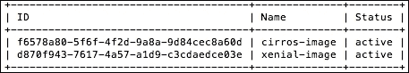

# 第二章：OpenStack 客户端

在本章中，我们将涵盖以下主题：

+   介绍——使用 OpenStack

+   在 Windows 上安装 Python

+   安装 OpenStack 客户端

+   配置您的 Linux 或 macOS 环境

+   配置您的 Windows 环境

+   常见的 OpenStack 网络任务

+   常见的 OpenStack 服务器（实例）任务

+   常见的 OpenStack 镜像任务

+   常见的 OpenStack 身份管理任务

+   常见的 OpenStack 存储任务

+   常见的 OpenStack 编排任务

# 介绍——使用 OpenStack

OpenStack 可以通过多种方式进行交互——从使用 Horizon（OpenStack 控制面板）Web 界面到命令行的强大功能，再到使用第三方软件，这些都与 OpenStack 透明集成。在本章中，我们将介绍 OpenStack **命令行接口**（**CLI**），并了解如何为您安装的 OpenStack 配置它。OpenStack 命令行工具和大多数 OpenStack 组件一样，都是用 Python 编写的。这意味着计算机上必须安装 Python，才能运行这些客户端。

当我们与 OpenStack 交互时，实际上是在向运行服务**API**（**应用程序编程接口**）的服务发起 REST API 调用。REST API 定义了一组函数，开发者可以通过 HTTP 协议（如 GET 和 POST）进行请求并接收响应。OpenStack 命令行客户端将您的直观命令转化为这些 HTTP 调用。在典型的 OpenStack 部署中，并且在第一章，*使用 Ansible 安装 OpenStack*中描述的那种部署中，通过 Ansible，我们的 OpenStack API 服务已经部署在三个 Controller 节点上。为了使我们能够与这三个 Controller 节点中的任意一个进行交互，以便每个节点可以独立响应，我们将这些服务放置在负载均衡器后面。作为 OpenStack 用户，我们关注的是负载均衡器的**VIP**（**虚拟 IP**），即我们为每个配置的池关联的 IP 地址。

在配置环境以便与 OpenStack 配合使用时，有一个特定的服务是用户感兴趣的，那就是 `Keystone` 服务。

`Keystone` 服务（OpenStack 身份服务）在 OpenStack 中本质上执行两个功能。它授权用户允许他们执行所请求的操作，并向用户提供服务目录。该目录是 OpenStack 服务地址端点的映射。因此，我们不需要配置客户端来知道如何找到每一个 OpenStack 服务。当用户配置环境以便从命令行使用 OpenStack 时，他们唯一需要知道的信息是 `Keystone` 所安装的 IP 地址和端口。请参阅以下图示，了解用户如何从概念上看到这一点：


### 提示

本章旨在作为一个快速参考指南，介绍本书中更详细解释的命令。

# 在 Windows 上安装 Python

为了能够在 Windows 上安装所需的 OpenStack 客户端工具，我们必须首先为 Windows 桌面计算机准备 Python。以下内容适用于 Windows 10。

## 准备工作

确保你已登录到桌面，并安装了以下内容：

+   PowerShell

+   从此处下载 Python 2.7：[`www.python.org/downloads/windows/`](https://www.python.org/downloads/windows/)

+   微软 Visual C++ 构建工具，包含 Windows 10 SDK 功能

## 如何操作…

配置你的 Windows 环境可以通过你 PC 的 **属性** 来实现。按照以下说明确保 Python 在你的系统路径中可用，并在 PowerShell 中设置适当的环境变量：

1.  转到桌面上的 **此电脑** 图标并选择 **属性**，如图所示：

1.  接下来，从左侧菜单中选择 **高级系统设置**：

1.  现在，从 **系统属性** 窗口的 **高级** 标签中选择 **环境变量**，如图所示：

1.  要设置 Python 的路径，双击 **Path** 条目，如下所示：

1.  现在，按如下所示向路径添加 **新** 行。我们假设你进行了 Python 2.7 的默认安装，并且安装在 `C:\Python27` 目录下：

1.  现在点击 **确定**。当你加载 PowerShell 会话时，你现在应该能够测试 Python 是否按预期工作，如下所示：

1.  现在，你应该能够按照接下来的步骤安装 OpenStack 客户端。

## 工作原理…

配置 Windows 环境比配置 Unix/Linux 环境稍微复杂一些。我们首先需要确保 Python 配置正确，并且可以在 Shell 中使用。接下来，我们需要一种机制将环境变量加载到 Shell 中，而这并不是 Windows 的本地功能。我们通过 PowerShell 脚本实现这一点。然而，由于 PowerShell 功能强大，我们需要移除一些限制以使其正常工作。一旦正确设置好这些内容，就可以在 Windows 桌面上使用 OpenStack 环境。

# 安装 OpenStack 客户端

有多个 OpenStack 客户端可用于从命令行与 OpenStack 交互。历史上，OpenStack 中的每个服务都有自己的客户端。例如，OpenStack 计算项目 Nova 有自己的 `nova` 客户端。同样，OpenStack 网络项目 Neutron 也有自己的名为 `neutron` 的客户端，依此类推。

官方上，OpenStack 客户端正在趋向统一使用一个客户端：OpenStack 客户端。然而，并非所有命令和功能都可以通过这个工具使用。此外，OpenStack 客户端仍然需要安装每个独立项目的命令行工具才能正常工作；但它提供了一个更一致的界面，而不需要记住每个单独项目的名称。

## 准备工作

由于我们正在为从命令行与 OpenStack 交互准备桌面，您会发现，针对您选择的桌面操作系统，有多种选择。本节将描述如何安装 OpenStack 客户端。

由于我们将使用 `pip` 安装 OpenStack 客户端，请确保按照以下步骤安装它：

1.  首先，打开终端并使用以下命令切换到 *root* 用户：

    ```
    sudo -i

    ```

1.  我们将使用 `pip` 安装客户端。如果 `pip` 未安装，请按照以下步骤操作：

    在 macOS 或其变种上使用以下命令：

    ```
    wget  https://bootstrap.pypa.io/get-pip.py
    python get-pip.py

    ```

1.  在流行的 Linux 系统上，使用您的包管理器安装这些软件包：

    **Ubuntu**：确保安装了 `python-dev` 和 `python-pip`

    **Red Hat**：确保安装了 `python-devel` 和 `python-pip`

### 注意

**Windows**：确保已安装 Python 并且它在 **PATH** 中，并已安装 Microsoft Visual C++ Build Tools。

## 如何操作…

在系统上安装了 `pip` 后，我们可以通过以下简单步骤安装客户端：

1.  要安装 OpenStack 客户端，请执行以下命令：

    ```
    pip install python-openstackclient

    ```

1.  要安装各个客户端，请执行以下命令：

    ```
    pip install python-novaclient
    pip install python-neutronclient
    pip install python-glanceclient
    pip install python-heatclient
    pip install python-keystoneclient
    pip install python-cinderclient
    pip install python-swiftclient

    ```

### 提示

每个项目都有自己的客户端，因此语法为：

```
pip install python-PROJECTclient

```

### 替代方法 – 使用预配置的 OpenStack 客户端虚拟机

有时客户端的开发进度与环境中已安装的项目不同，这可能导致版本不兼容。为了解决这个问题，可以使用 `virtualenv`（[`pypi.python.org/pypi/virtualenv`](https://pypi.python.org/pypi/virtualenv)）或者使用一个已经为访问 OpenStack 环境预配置的虚拟机（在 VirtualBox 中）。使用预构建的虚拟环境，请执行以下操作：

1.  克隆客户端 VirtualBox Vagrant 环境：

    ```
    git clone https://github.com/OpenStackCookbook/openstack-client.git

    ```

1.  启动客户端：

    ```
    cd openstack-client
    vagrant up

    ```

1.  访问虚拟机：

    ```
    vagrant ssh

    ```

## 它是如何工作的…

安装 OpenStack 客户端非常简单，只需要使用 `pip` 命令行工具，它用于安装 Python 包。用于在命令行中操作 OpenStack 的主要工具叫做 **OpenStack 客户端**。这个工具用于控制 OpenStack 的各个方面。然而，仍然有一些命令和选项没有加入到主流的 OpenStack 客户端中。为了解决这个问题，可以继续使用旧版的遗留项目工具。确保也使用以下语法安装这些工具：

```
pip install python-PROJECTclient

```

将 *PROJECT* 替换为 OpenStack 项目的具体名称，例如 *glance* 或 *neutron*。

或者，可以将这些工具创建在小型虚拟机中，这样工具始终可用。可以从 [`github.com/OpenStackCookbook/ope`](https://github.com/OpenStackCookbook/ope) 获取一个 Vagrant OpenStack 客户端环境。

# 配置你的 Linux 或 macOS 环境

OpenStack 工具通过在你的 shell 或桌面设置环境变量来进行配置。

## 准备工作

确保已按照本章中第一部分 *介绍 - 使用 OpenStack* 中的说明安装 OpenStack 客户端。

## 如何操作…

通过设置环境变量来配置你的命令行环境；然而，将这些变量放入一个文件中，以便以后加载到环境中，会更简单和方便。在安装过程中，OpenStack-Ansible 会创建一个名为 `openrc` 的纯文本文件，并将其放置在所有创建的容器的 `/root` 目录中。这个文件是配置环境的一个很好的起点，因为它包含了操作命令行环境所需的所有必需元素。

在你自己的客户端上，例如基于 Linux 或 Mac 的系统，选择一个工作目录，例如 `$HOME/openstack`，并创建一个名为 `openrc`（或你选择的具有意义的名称）的文件，内容如下：

```
export OS_USERNAME=admin
export OS_PASSWORD=secrete
export OS_TENANT_NAME=admin
export OS_AUTH_URL=http://192.168.100.117:5000/v3
export OS_NO_CACHE=1
export OS_USER_DOMAIN_NAME=Default
export OS_PROJECT_DOMAIN_NAME=Default

export OS_IDENTITY_API_VERSION=3
export OS_AUTH_VERSION=3
```

现在通过以下方式在你的 shell 中加载该文件：

```
source openrc

```

### 提示

在 Bash 中，你也可以使用以下语法：

```
 . openrc

```

该文件包含了访问你云环境的认证信息。请确保文件安全，并且权限设置不允许其他用户读取此文件。如果不确定，建议按以下方式设置权限：

```
chmod 0600 openrc

```

这将使文件仅对你（用户）可读写。

现在，您可以使用命令行工具了。如果在执行书中命令时出现任何问题，请检查文件中的凭证——确保您设置了正确的租户/项目、用户名和密码，并确保指定了正确的 OpenStack 认证 URL 端点。一旦对文件做出任何更改，请记得将其重新加载到 shell 中。

## 它是如何工作的…

本质上，我们只是在 shell 中设置一些环境变量，客户端工具用这些变量来进行 OpenStack 环境的身份验证。不过，为了简化操作，我们将这些环境变量存储在一个文件中。这样，我们只需要运行一个命令即可设置所有必需的凭证，方便访问环境。

# 配置 Windows 环境

配置 Windows 环境以使用 OpenStack 需要稍微多一点的工作，但基本前提依然不变：我们正在配置桌面，使其能够访问环境变量，并确保我们用 Python 编写的工具能够正确执行。

## 准备就绪

以下内容适用于 Windows 10。请确保您已按照步骤安装了 Python。

## 如何操作…

执行以下操作，将所需的环境变量加载到您的 Windows 会话中：

1.  为了能够像在 Unix/Linux 平台上一样加载所需的 OpenStack 环境功能，我们可以使用 PowerShell 实现类似的效果。在 PowerShell 终端中，获取以下 PowerShell 脚本并将其下载到您的工作客户端目录中（例如 `C:\Users\Username\OpenStack`）：

    ```
    mkdir OpenStack
    cd OpenStack
    wget https://raw.githubusercontent.com/OpenStackCookbook/vagrant-openstack/master/Source-OpenRC.ps1 -UseBasicParsing -OutFile Source-OpenRC.ps1

    ```

1.  使用与*配置您的 Linux 或 macOS 环境*部分中描述的相同 OpenStack 凭证，确保将其命名为 `openrc`，以与以下示例匹配，然后在 PowerShell 中执行以下操作：

    ```
    .\Source-OpenRC.ps1 .\openrc

    ```

    ### 注意

    **警告**：执行 PowerShell 脚本时，可能会遇到错误。大多数 Windows 10 桌面似乎默认有一个受限策略，这排除了运行未签名的 PowerShell 脚本——即使是您自己创建的脚本。要移除此限制，请执行以下操作并确认警告：

    ```
    Set-ExecutionPolicy –ExecutionPolicy RemoteSigned Unrestricted -Scope CurrentUser

    ```

1.  现在，您应该能够在 Windows 桌面的 PowerShell 终端中使用 OpenStack 客户端。

## 它是如何工作的…

配置 Windows 环境比配置 Unix/Linux 环境稍微复杂一些。我们需要一个机制来将环境变量加载到 shell 中，而这是 Windows 的原生功能所不具备的。我们通过 PowerShell 脚本来实现这一点。但为了使其工作，我们必须移除一个限制。一旦正确设置好所有内容，便能够从 Windows 桌面使用 OpenStack 环境。

# 常见的 OpenStack 网络任务

本节仅简要列出了常见的 OpenStack 网络任务，供快速参考。如需详细了解如何使用 Neutron 及其工作原理——包括浮动 IP 和路由器等特性的使用场景和细节，请参阅第四章，*Neutron – OpenStack 网络*。

## 准备工作

确保您已安装 OpenStack 客户端，具体安装方法请参考本章的第一部分。

## 如何操作…

执行以下步骤以在 OpenStack 中创建和修改网络：

### 创建网络

通常，创建网络有两个步骤：创建一个相当于 L2 网络的网络，接着为其分配子网（及相关详细信息）。

1.  首先，创建网络：

    ```
    openstack network create NETWORK_NAME

    ```

1.  现在在此网络上创建子网：

    ```
    openstack subnet create SUBNET_NAME
     --network NETWORK_NAME--subnet-range CIDR

    ```

#### 创建提供者网络（用于浮动 IP）

要创建一个浮动 IP 提供者网络，请执行以下命令。此命令假设我们的提供者接口（在 OpenStack 中查看并在 Neutron 中配置）正在使用“flat”接口。在数据中心的典型部署中，可能会使用“vlan”作为提供者类型和设备，因此请根据您的环境调整配置。

1.  首先，创建网络（在本示例中，我们指定了`flat`的提供者类型）：

    ```
    openstack network create 
     --share 
     --project admin 
     --external 
     --default 
     --provider-network-type flat 
     --provider-physical-network flat 
     GATEWAY_NET

    ```

1.  现在，我们指定一些子网选项，以使得该网络能够从 OpenStack 外部进行访问：

    ```
    openstack subnet create
     --project admin
     --subnet-range 192.168.100.0/24
     --dhcp
     --gateway 192.168.100.1
     --allocation-pool start=192.168.100.200,end=192.168.100.250
     --network GATEWAY_NET
     GATEWAY_SUBNET

    ```

#### 创建一个新的安全组

在`development`项目中创建一个新的安全组，例如`webserver`，可以通过以下方式实现：

```
openstack security group create 
 --project development 
 webserver

```

#### 向安全组添加规则

要向前面创建的名为`webserver`的安全组添加规则，例如允许来自任何地方的端口`80`的入站访问，请执行以下操作：

```
openstack security group rule create
 --remote-ip 0.0.0.0/0
 --dst-port 80:80
 --protocol tcp
 --ingress
 --project development
 webserver

```

#### 创建路由器

要在我们的项目中创建一个名为`myRouter`的路由器，请执行以下命令：

```
openstack router add myRouter

```

#### 向路由器添加子网

要向我们的路由器`myRouter`添加一个名为`private-subnet`的私有租户子网，请执行以下命令：

```
openstack router add subnet myRouter private-subnet

```

##### 设置路由器上的网关

要为我们的路由器添加网关，首先必须确保网关网络已创建，并使用`--external`标志，如本章“*创建提供者网络*”部分所述（用于浮动 IP）。然后，我们将执行以下命令，将外部网关网络设置为`GATEWAY_NET`，并应用到我们名为`myRouter`的路由器上：

```
openstack router set myRouter 
--external-gateway GATEWAY_NET

```

# 常见的 OpenStack 服务器（实例）任务

本节概述了一些常见命令，这些命令可以在操作实例（例如虚拟机）时执行。有关每个任务的详细信息和解释，请参阅第五章，*Nova – OpenStack 计算*。

## 准备工作

确保您已安装 OpenStack 客户端，具体安装方法请参考本章的第一部分。

## 如何操作…

执行以下操作以启动和操作正在运行的实例：

### 启动实例

要通过命令行启动实例，您需要以下信息：

+   一个镜像

+   一个网络

+   一个规格

+   一个可选的安全组（如果没有指定，默认使用）

+   一个可选的密钥（如果您打算访问该实例）

执行以下步骤以通过命令行启动实例：

1.  首先，列出可用的镜像：

    ```
    openstack image list

    ```

1.  现在，我们列出可用的网络（这将是我们将使用的网络的 UUID）：

    ```
    openstack network list

    ```

1.  我们需要一个规格，如果需要提醒，请使用以下命令列出它们：

    ```
    openstack flavor list

    ```

1.  如果您需要特定的安全组，请使用以下命令列出它们：

    ```
    openstack security group list

    ```

1.  如果您需要获取要使用的密钥对的名称，请使用以下命令：

    ```
    openstack keypair list

    ```

1.  现在，您可以使用以下命令启动实例：

    ```
    openstack server create
     --image IMAGE
     --flavor FLAVOR
     --security-group SECGROUP
     --nic net-id=NETWORK_UUID
     --key-name KEYPAIR_NAME
     INSTANCE_NAME

    ```

### 列出 OpenStack 实例

要列出已启动的 OpenStack 实例，请执行以下命令：

```
openstack server list

```

### 创建实例快照

要创建正在运行的实例的快照，请执行以下命令：

```
openstack server image create
 --name snapshotRunningWebserver1
 myRunningWebserver1

```

### 调整实例大小

要修改正在运行的实例的规格并使用新设置重新启动，请执行以下命令：

1.  首先，我们使用以下命令指定新的规格大小：

    ```
    openstack server resize --flavor m1.small myWebserver1

    ```

1.  接下来，列出正在运行的实例以确认状态。状态应为 `VERIFY_RESIZE`：

    ```
    openstack server list

    ```

    输出将显示如下内容：

    

1.  然后，我们使用以下命令确认操作：

    ```
    openstack server resize --confirm myWebserver1

    ```

### 创建规格

要创建一个规格，名为 `m1.tiny`，包含 512 MB 的 RAM、1 个 vCPU 和没有固定大小的磁盘，请执行以下命令：

```
openstack flavor create
 --ram 512
 --disk 0

 --vcpus 1
 --public
 m1.tiny

```

# 常见的 OpenStack 镜像任务

本节概述了一些步骤，作为快速概述，仅用于操作 OpenStack 镜像服务（称为 Glance）时的参考。如需更详细的信息和每个任务的解释，请参见 第六章，*Glance – OpenStack 镜像服务*。

## 准备工作

确保您已经安装了 OpenStack 客户端，安装方法请参考本章开头的配方。

## 如何做…

执行以下步骤以在 OpenStack 中创建和修改镜像：

### 上传镜像到 Glance

将镜像上传到 OpenStack 可通过以下命令完成。要上传一个 QCOW2 镜像（如 CirrOS 提供的用于测试的镜像），请执行以下命令：

```
openstack image create
 --container-type bare
 --disk-format qcow2
 --public
 --file
 /path/to/cirros-0.3.5-x86_64-disk.img

```

### 从 Glance 下载镜像或快照作为文件

要从 Glance 下载镜像，可能是为了复制到其他环境或作为异地备份存储，请执行以下命令：

```
openstack image save
 --file myImage.qcow2 myImage

```

### 在项目间共享镜像

在大多数情况下，镜像要么是公开的（对所有项目可用），要么是私有的（仅对上传该镜像的项目可用）。但是，您可以将一个私有镜像共享给您选择的隔离项目。要做到这一点，您需要以下内容：

+   您将要共享的镜像的 UUID

+   您将与之共享镜像的项目的 UUID

执行以下步骤以将镜像与另一个项目共享。在以下示例中，我们将共享当前仅在 `admin` 项目中可用的 `cirros-image`，并将其共享到 `anotherProject` 项目：

1.  首先，查询项目列表：

    ```
    openstack project list

    ```

    这将返回类似以下内容的输出：

    

1.  我们将设置要共享的镜像：

    ```
    openstack image set cirros-image --shared

    ```

1.  然后，我们将告诉 OpenStack 通过以下命令共享哪个项目：

    ```
    openstack image add project anotherProject

    ```

    这将返回类似以下内容的输出 —— 我们将在下一步中使用 **image_id**：

    

1.  重要提示：作为 **接收**（**anotherProject**）项目中的用户，执行以下操作：

    ```
    openstack image set --accept f6578a80-5f6f-4f2d-9a8a-9d84cec8a60d

    ```

1.  现在，作为该用户，您可以通过执行镜像列表命令来确认自己能看到这个共享的镜像：

    ```
    openstack image list

    ```

    这将返回类似以下内容的输出，显示可用的镜像：

    

# 常见的 OpenStack 身份任务

本节概述了使用 OpenStack 身份服务执行一些常见操作的常见步骤。此部分仅作为快速参考指南。如需更详细的信息和每个任务的解释，请参阅第三章，*Keystone – OpenStack 身份服务*。

## 准备工作

确保您已安装 OpenStack 客户端，如本章第一部分所述。

## 如何执行…

执行以下步骤以在 OpenStack 中创建和修改用户和项目：

### 创建新项目

在项目中创建新用户通过以下命令实现。例如，要创建名为 `development` 的项目，请执行以下命令：

```
openstack project create development

```

### 创建用户

要创建一个名为 `developer` 的用户，并设置密码为 `password123`，请执行以下命令：

```
openstack user create
 --domain default
 --password password123
 --enable
 developer

```

### 向项目中添加用户

要将具有 `_member_` 角色（普通用户）的用户添加到 `development` 项目中，请执行以下命令：

```
openstack role add
 --project development
 --user developer
 _member_

```

### 作为管理员更改用户密码

作为管理员，您有权更改他人的密码。要为 `developer` 用户更改密码，请执行以下命令：

```
openstack user set --password cookbook4 developer

```

### 更改自己的密码

要将自己的密码更改为其他内容，请执行以下命令：

```
openstack user password set --password cookbook4

```

# 常见的 OpenStack 存储任务

本节概述了使用 OpenStack 块存储和对象存储服务执行的一些常见任务。如需更多存储信息，请参阅第七章，*Cinder – OpenStack 块存储* 和 第八章，*Swift – OpenStack 对象存储*。

## 准备工作

确保您已安装 OpenStack 客户端，如本章第一部分所述。

## 如何执行…

执行以下步骤在 OpenStack 中创建和修改用户和项目：

### 创建一个新的 Cinder 卷

要创建一个新的 Cinder 块存储卷，请执行以下命令。大小以千兆字节为单位：

```
openstack volume create --size 5 my5GVolume

```

### 附加一个卷

要将卷附加到运行中的实例，请执行以下命令。使用运行中的 **实例 UUID**，并可以通过列出运行中的实例找到：

```
openstack server add volume my5GVolume 58ea640b-16ba-447c-85db-952174d70f7c

```

### 分离一个卷

要分离一个卷，首先像平常一样将其从运行中的实例中卸载，然后执行以下命令：

```
openstack server remove volume my5GVolume 58ea640b-16ba-447c-85db-952174d70f7c

```

### 创建一个卷快照

要创建卷的快照，请执行以下步骤。首先，您必须将卷从运行中的实例中分离，以确保数据一致性。该操作在前面的任务中已经描述。

现在，分离后，执行以下命令

```
openstack snapshot create --name myVolumeSnapshot myVolume

```

列出对象存储统计信息

要显示有关对象存储容器的信息，请执行以下命令：

```
openstack object store account show

```

### 列出对象存储容器及其内容

要列出对象存储的内容，请执行以下命令：

```
openstack object store list
openstack object store list myContainer

```

### 创建并上传文件到对象存储服务

要创建一个对象存储容器，请执行以下命令：

```
openstack object create myContainer

```

要将文件上传到对象存储容器，请执行以下命令：

```
openstack object create myContainer myFile 

```

### 从对象存储下载

要从对象存储容器下载文件，请使用此命令

```
openstack object save myContainer myFile

```

要从对象存储容器下载所有文件，请执行以下命令：

```
openstack object save myContainer

```

# 常见的 OpenStack 编排任务

本节概述了使用 OpenStack 编排（Heat）服务启动 *堆栈*（使用 Heat 编排的环境）的一些常见任务。有关 Heat 和编排的更多信息，请参考 第九章，*使用 Heat 和 Ansible 的 OpenStack 编排*。

## 准备工作

确保您已安装 OpenStack 客户端，安装方法请参考本章的前几个食谱。

## 如何操作…

执行以下步骤，在 OpenStack 中创建并使用 Heat 模板来创建编排环境：

### 从模板和环境文件启动堆栈

要从 Heat 编排模板（hot）启动堆栈，请执行以下命令：

```
openstack stack create
 --template myStack.yml
 --environment myStack-Env.yml
 myStack

```

### 列出堆栈

要列出运行中的堆栈，请执行以下命令：

```
openstack stack list

```

### 删除一个运行中的堆栈

要销毁名为 `myStack` 的运行中堆栈，请执行以下命令：

```
openstack stack delete myStack

```

### 列出堆栈中的资源

要列出运行中的堆栈中的资源，请执行以下命令：

```
openstack stack resource list

```

要列出特定资源的详细信息，例如名为 `myResource` 的资源，请执行以下命令：

```
openstack stack resource show myResource

```

### 查看运行中堆栈的输出

要查看堆栈生成的输出，请执行以下命令：

```
openstack stack output list

```

要查看特定输出的详细信息，请执行以下命令：

```
openstack stack output show myOutput

```
