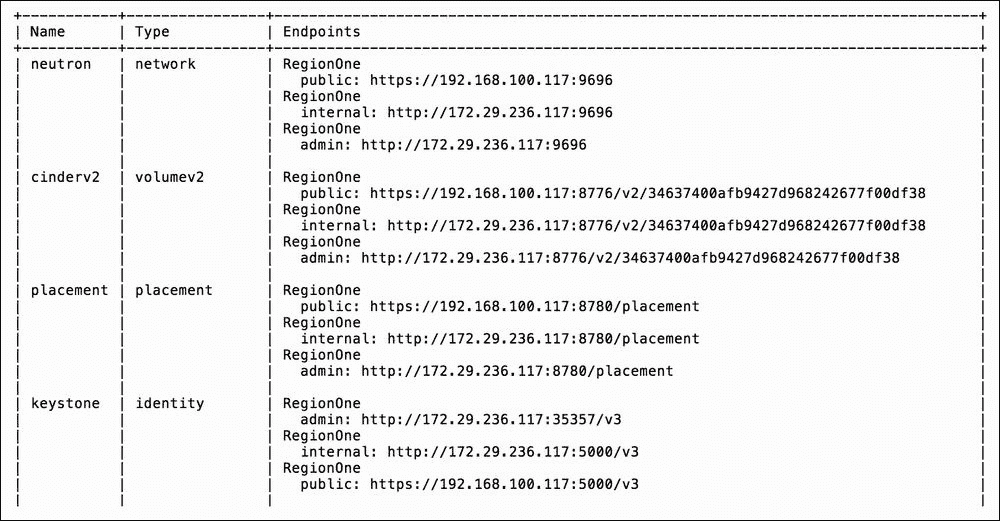

# 第三章. Keystone – OpenStack 身份服务

本章我们将讨论以下主题：

+   介绍 – OpenStack 身份

+   在 Keystone 中创建 OpenStack 域

+   在 OpenStack 仪表盘中启用域

+   在 Keystone 中创建 OpenStack 项目

+   配置 Keystone 中的角色

+   在 Keystone 中添加用户

+   配置 Keystone 中的组

+   删除项目

+   删除用户

+   删除角色

+   删除组

+   删除域

+   OpenStack 端点信息

# 介绍 – OpenStack 身份

OpenStack 身份服务，称为**Keystone**，提供身份验证和管理用户帐户及角色信息的服务，适用于我们的 OpenStack 云环境。

这是一个至关重要的服务，支撑着我们所有 OpenStack 云服务之间的认证与验证，是在 OpenStack 环境中需要首先安装的服务。OpenStack 身份服务通过在所有 OpenStack 服务之间传递一个经过验证的授权令牌来验证用户和项目。这个令牌会传递给其他服务，如存储和计算服务，以授予用户对特定功能的访问权限。因此，必须首先完成 OpenStack 身份服务的配置，才能使用其他任何服务。设置身份服务涉及为用户和服务、项目、用户帐户以及构成云基础设施的服务 API 端点创建适当的角色。由于我们使用 Ansible 来部署环境（更多细节请参见第一章，*使用 Ansible 安装 OpenStack*），所有基本配置都已经在 Ansible 剧本中为我们完成。

在 Keystone 中，我们有域、项目、角色、用户和用户组的概念。Keystone 域（不要与 DNS 域混淆）是一个高层次的 OpenStack 身份资源，其中包含项目、用户和组。一个项目有用户、镜像、实例等资源，并且其中的网络可以仅限于该项目，除非显式与其他项目共享。一个用户可以属于一个或多个项目，并能够在这些项目之间切换，以访问相应的资源。项目中的用户可以分配不同的角色。用户可以组织成用户组，并且组可以被分配角色。在最基本的场景下，用户可以被分配管理员角色或仅是成员。当一个用户在项目中拥有管理员权限时，管理员能够利用可以影响项目的功能（例如修改外部网络），而普通用户则被分配成员角色。这个成员角色通常用于执行与用户相关的任务，如启动实例、创建卷和创建隔离的项目专用网络。

### 注意

项目在早期版本的 OpenStack 中被称为**租户**。

# 在 Keystone 中创建 OpenStack 域

如果您希望在 OpenStack 部署中使用多个域名，请考虑使用单独的域。在大型组织中，域可以视为单独的账户或部门。在本节中，我们将为我们的项目创建一个名为 `bookstore` 的域。

## 准备工作

确保您已以具有管理员权限的用户身份登录到正确配置的 OpenStack 客户端，并能够访问 OpenStack 环境。

参考 第二章，*OpenStack 客户端*，以了解设置您的环境以使用 OpenStack 命令行客户端的详细信息。

## 如何做…

要在我们的 OpenStack 环境中创建一个域，请执行以下步骤：

1.  我们首先创建一个名为 `bookstore` 的域，如下所示：

    ```
    openstack domain create --description "Book domain" bookstore

    ```

    输出将类似于以下内容：

    

## 工作原理…

在 OpenStack 中，高级别的身份资源可以分组到不同的域下。如果您需要在 OpenStack 环境中管理不同的组织，为它们管理的资源使用单独的域可能非常有益。默认情况下，您的 OpenStack 环境很可能有一个名为 "Default" 的默认域。通过运行上述命令，我们刚刚创建了一个额外的域，用于管理与本书相关的资源。语法如下：

```
openstack domain create --description <description> <name>

```

`description` 参数也是可选的，但强烈推荐。域名必须与环境中的其他域名唯一。

### 注意

在我们的操作中，我们将使用 `--domain` 参数并指定域名。如果未指定域，则 OpenStack 命令行客户端将使用在 `openrc` 文件中指定的当前用户的域，最可能是 `default` 域。

# 在 OpenStack 仪表板中启用域

如果您在 OpenStack 环境中使用多个域，还需要在 OpenStack 仪表板（Horizon）中启用它们。为此，需要将 Horizon 设置中的 `OPENSTACK_KEYSTONE_MULTIDOMAIN_SUPPORT` 变量设置为 `True`。在此示例中，我们将展示如何使用 OpenStack Ansible playbook 完成此操作。

## 准备工作

我们将使用 Ansible 更新 Horizon 设置。确保您可以访问您的 `openstack-ansible` 部署主机。

## 如何做…

要在 OpenStack 仪表板中启用多域支持，我们将使用 `openstack-ansible` 部署工具更新 `local_settings.py` 中的一个 Horizon 变量 `OPENSTACK_KEYSTONE_MULTIDOMAIN_SUPPORT`。首先，您需要连接到您的 `openstack-ansible` 部署主机。连接后，执行以下步骤：

1.  编辑 `/etc/openstack_deploy/user_variables.yml` 文件，添加以下行：

    ```
    horizon_keystone_multidomain_support: True

    ```

1.  使用 `openstack-ansible` 命令部署 Horizon：

    ```
    openstack-ansible
     /opt/openstack-ansible/playbooks/os-horizon-install.yml

    ```

    `openstack-ansible` 命令会生成大量输出。为简洁起见，已省略其输出。

1.  启动 OpenStack 仪表盘，验证登录屏幕现在是否显示域字段：

## 它是如何工作的…

在 OpenStack 中，如果你正在利用多域功能，可以通过命令行工具完全控制。然而，如果你希望能够在 OpenStack 仪表盘上使用多个域，则需要启用 Horizon 的多域支持。为此，你需要更新 Horizon 设置文件。由于我们使用的是`openstack-ansible`工具，我们更新了`user_variables.yml`文件并运行了`openstack-ansible`命令。此命令更新了所需的变量，并重新启动了 Horizon 容器上的`apache2`（HTTP 服务器）服务。

# 在 Keystone 中创建 OpenStack 项目

用户在没有分配项目的情况下无法创建，因此必须先创建项目。对于本节内容，我们将为我们的用户创建一个名为`cookbook`的项目。

## 准备工作

确保你已登录到配置正确的 OpenStack 客户端，并且可以作为具有管理员权限的用户访问 OpenStack 环境。

请参阅第二章，*OpenStack 客户端*，了解如何设置环境以使用 OpenStack 命令行客户端。

## 如何操作…

要在我们的 OpenStack 环境中创建项目，请执行以下步骤：

1.  我们首先创建一个名为`cookbook`的项目，如下所示：

    ```
    openstack project create --domain bookstore
     --description "Cookbook Project" cookbook

    ```

    该命令应产生类似如下的输出：

    

## 它是如何工作的…

通过运行前面的命令，我们刚刚在`bookstore`域中创建了一个项目。语法如下：

```
openstack project create --domain <domain>
 --description <description> <name>

```

`domain`参数是可选的，用于确定项目将属于哪个域。如果省略，项目将在`default`域中创建。`description`参数也是可选的，但强烈建议填写。`name`参数必须在该安装中唯一。

# 在 Keystone 中配置角色

角色是分配给项目中用户的权限。角色还可以限定在特定的域中，这样可以限制特定用户在某个域和项目中的权限。如果你使用了 Ansible 安装 OpenStack 环境，它应该已经包含一些默认角色，例如`admin`和`_member_`。在这里，我们将配置一个角色，即`cloud_admin`角色，允许管理我们的示例`bookstore`域环境，以及一个`user`角色，授予`default`域中的普通用户，该用户将使用云环境。

## 准备工作

确保你已登录到配置正确的 OpenStack 客户端，并且可以作为具有管理员权限的用户访问 OpenStack 环境。

请参阅第二章，*OpenStack 客户端*，了解如何设置环境以使用 OpenStack 命令行客户端。

## 如何操作…

要在我们的 OpenStack 环境中创建所需的角色，请执行以下步骤：

1.  `cloud_admin`角色的创建如下所示：

    ```
    openstack role create --domain bookstore cloud_admin:

    ```

    

1.  要为`default`域配置`user`角色，请执行以下命令：

    ```
    openstack role create user

    ```

    

    该命令创建了一个名为`user`的新角色。由于我们未指定域，它是在`default`域下创建的。

1.  查看与`bookstore`域关联的角色：

    ```
    openstack role list --domain bookstore

    ```

    

1.  列出与当前管理员用户关联的角色：

    ```
    openstack role list

    ```

    

## 它是如何工作的…

角色的创建简单地通过 OpenStack 客户端完成，使用`role create`选项，语法如下：

```
openstack role create --domain <domain_name> <role_name>

```

`domain_name`属性是可选的，如果省略该属性，将为`default`域创建一个角色。

对于`role_name`属性，`admin`和`_member_`角色名称不能重复使用。`admin`角色是 OpenStack 代码中从 Pike 版本开始默认设置的，在 Pike 版本之前的版本中，它在`/etc/keystone/policy.json`文件中被设置为具有管理员权限：

```
{
    "admin_required": "role:admin or is_admin:1",
}
```

`_member_`角色在通过 Web 界面创建非管理员用户时，也会在仪表盘中默认配置。

创建角色时，会返回与角色关联的 ID，我们可以在分配角色给用户时使用它。要查看我们环境中角色及其关联 ID 的列表，可以执行以下命令：

```
openstack role list --domain <domain_name>

```

### 注意

如果未指定`domain`参数，则只会看到与当前用户域关联的角色。

# 在 Keystone 中添加用户

向 OpenStack 身份服务中添加用户需要用户属于某个域或该域中的项目，并且需要分配一个在该域或项目中定义的角色。在本节中，我们将创建两个用户。第一个用户命名为`cloud_admin`，并将在`cookbook`项目中为其分配`cloud_admin`角色。第二个用户命名为`reader`，并将在同一`cookbook`项目中为其分配默认的`_member_`角色。

## 准备就绪

确保你已登录到正确配置的 OpenStack 客户端，并且可以作为具有管理员权限的用户访问 OpenStack 环境。

参见第二章，*OpenStack 客户端*，了解如何设置你的环境以使用 OpenStack 命令行客户端。

## 如何操作…

为了在 OpenStack 中创建用户并为其分配角色，我们需要执行以下列出的命令。

1.  首先，获取`bookstore`域 ID 或域名：

1.  使用`bookstore`域名，创建一个新的`cloud_admin`用户：

    ```
    openstack user create --domain bookstore
     --password verysecret
     cloud_admin

    ```

    

1.  接下来，获取一个 cookbook 项目的 ID 或项目名：

    ```
    openstack project list

    ```

    

1.  在`bookstore`域的`cookbook`项目中创建`reader`用户：

    ```
    openstack user create --domain bookstore
     --project cookbook
     --password verysecret
     reader

    ```

    

1.  将`cloud_admin`用户分配给`admin`角色：

    ```
    openstack role add --domain bookstore
     --user cloud_admin
     --role-domain bookstore
     admin

    ```

    此命令没有输出。

1.  将`reader`用户分配给`_member_`角色：

    ```
    openstack role add --project cookbook
     --user reader _member_

    ```

    此命令没有输出。

1.  列出用户和角色分配：

    ```
    openstack role assignment list

    ```

    输出将是角色、用户、组、项目和域 ID 的矩阵。由于包含每个角色、用户、组、项目、域的 ID 矩阵及其是否继承角色的庞大表格，我们省略了示例输出。

## 工作原理……

在 OpenStack 身份服务中添加用户涉及多个步骤和依赖关系。首先，需要一个域和项目，用户必须属于其中一个。用户必须始终属于一个域。如果没有创建自定义域，则将使用`default`域。一旦项目存在，用户可以被添加。在此时，用户没有关联的角色，因此最后一步是将角色分配给该用户，例如`_member_`、`admin`或自定义角色。

使用`user create`选项创建用户时，语法如下：

```
openstack user create --domain <domain>
 --password <password> <user_name>

```

`user_name`属性是一个任意名称，但不能包含空格。必须存在`password`属性。在之前的示例中，这些设置为`verysecret`。如果未指定`domain`属性，则将设置为`default`域。

要使用`role add`选项将角色分配给用户，`default`域的语法如下：

```
openstack role add --project <project>
 --user <user>
 <role>

```

对于自定义域中的用户，使用以下语法分配角色：

```
openstack role add --domain <domain>
 --user <user>
 --role-domain <role_domain>
 <role>

```

`role_domain`参数是角色所属的域的名称（或 ID）。

我们还需要用户、角色和项目的名称或 ID，以便将角色分配给用户。这些名称或 ID 可以通过以下命令找到：

```
openstack project list
 openstack user list
 openstack role list

```

`--domain <domain>`选项仅在使用自定义域时需要。如果要获取域列表，请发出以下命令：

```
openstack domain list 

```

要获取域、项目、用户和角色分配的矩阵，请使用以下命令：

```
openstack 
role assignment list

```

# 配置 Keystone 中的组

如果您希望按角色组织用户，可以使用 Keystone 组创建一个用户组。组属于一个域。在此示例中，我们将创建一个组`reader_group`，并为其设置`cloud_admin`角色。我们还将向其中添加两个用户`reader`和`reader1`。我们还将验证这些用户是否属于该组，并在之后移除其中一个用户。

## 正在准备中

确保您已登录到正确配置的 OpenStack 客户端，并且能够以具有管理员权限的用户身份访问 OpenStack 环境。

请参阅第二章，*OpenStack 客户端*，以获取设置环境以使用 OpenStack 命令行客户端的详细信息。

## 如何执行…

为了创建组并将用户分配给它们，我们将需要执行以下步骤：

1.  首先创建一个组：

    ```
    openstack group create --domain bookstore
     --description "Bookstore reader group"
     reader_group

    ```

    

1.  列出现有组：

    ```
    openstack group list

    ```

    

1.  将组添加到角色：

    ```
    openstack role add --group reader_group
     --domain bookstore
     --role-domain bookstore
     cloud_admin

    ```

    `--domain` 和 `--role-domain` 参数是必需的。此命令没有输出。

1.  将 `reader` 用户添加到组中：

    ```
    openstack group add user --group-domain bookstore
     --user-domain bookstore
     reader_group
     reader

    ```

    这将产生类似以下的信息：

    ```
    reader added to group reader_group

    ```

1.  将 `reader1` 用户添加到组中：

    ```
    openstack group add user --group-domain bookstore
     --user-domain bookstore
     reader_group
     reader1

    ```

    这将输出以下信息：

    ```
    reader1 added to group reader_group

    ```

1.  检查 `reader` 是否在 `reader_group` 组中：

    ```
    openstack group contains user reader_group reader

    ```

    这将输出以下信息：

    ```
    reader in group reader_group

    ```

1.  检查 `reader1` 是否在 `reader_group` 组中：

    ```
    openstack group contains user readergroup reader1

    ```

    这将产生类似以下的信息：

    ```
    reader1 in group readergroup

    ```

1.  将 `reader1` 用户从 `reader_group` 组中移除：

    ```
    openstack group remove user reader_group reader1

    ```

    这将产生类似以下的信息：

    ```
    reader1 removed from group reader_group

    ```

1.  再次检查 `reader1` 是否在 `reader_group` 组中：

    ```
    openstack group contains user reader_group reader1

    ```

    这将产生类似以下的信息：

    ```
    reader1 not
     in group reader_group

    ```

## 它是如何工作的…

将用户添加到身份组是一种为他们授予特定角色集合的好方法，而无需单独为每个用户分配每个角色。如果您需要管理总是获得相同角色集合的用户，可以创建一个用户组，并根据需要添加或删除用户，而不是为每个用户设置单独的角色。角色的分配方式与将角色分配给用户类似。在我们的示例中，我们首先创建了一个自定义组 `reader_group`。创建组的命令如下：

```
openstack group create --domain <domain-name> 
 --description <group-description>
 <group-name>

```

由于我们在示例中使用了自定义域，因此需要 `<domain-name>`。但是，如果省略 `<domain-name>`，将使用当前用户的域。

### 将组添加到角色：

```
openstack role add --group <group>
 --domain <domain>
 --role-domain <role_domain>
 <role>

```

`role_domain` 参数是角色所属域的名称（或 ID）。

我们还需要知道组名、角色名和项目名，以便将角色分配给用户。这些名称可以使用以下命令查找：

```
openstack project list
 openstack group list
 openstack role list

```

如果你使用自定义域，请将 `--domain <domain>` 作为选项传递给前面的命令。要获取域的列表：

```
openstack domain list

```

要将用户添加到组中，请使用以下命令：

```
openstack group add user --group-domain <group_domain>
 --user-domain <user_domain>
 <group>
 <user>

```

要将用户从组中移除，请执行以下命令：

```
openstack group remove user <group> <user>

```

要验证用户是否属于该组，请使用此命令：

```
openstack group contains user <group> <user>

```

要获取域、项目、用户、组和角色分配的矩阵，请使用以下命令：

```
openstack role assignment list

```

你也可以在所有前面的命令中使用项目的 ID，而不是名称。

### 注意

组是在 Keystone v3 中引入的。

# 删除项目

即使项目中有用户与之关联，也可以删除项目，因此在删除项目之前，务必先删除用户和其他项目资源，否则可能会留下孤立的资源。在本示例中，我们将展示如何删除名为 `oldbook` 的项目。

## 准备就绪

确保你已登录到正确配置的 OpenStack 客户端，并且能够以具有管理员权限的用户身份访问 OpenStack 环境。

参阅第二章，*OpenStack 客户端*，了解如何设置环境以使用 OpenStack 命令行客户端。

## 如何操作…

要删除项目，请执行以下命令：

1.  从当前项目列表中获取项目名称：

    ```
    openstack project list

    ```

    

1.  删除项目：

    ```
    openstack project delete oldbook

    ```

    此命令将没有输出。

## 它是如何工作的…

使用 OpenStack 命令行工具删除不必要的项目非常简单。确保只删除空项目。首先使用命令获取现有的项目：

```
openstack project list

```

执行以下命令删除项目：

```
openstack project delete <project>

```

这里的 `<project>` 参数可以是项目 ID 或项目名称。

如果项目已分配用户，则这些用户不会被删除，但该项目将被删除。

# 删除用户

从 OpenStack 身份服务中删除用户是一个简单的单步过程。在本例中，我们将展示如何删除一个名为 `oldreader` 的用户。

## 准备工作

确保您已经登录到正确配置的 OpenStack 客户端，并且可以作为具有管理员权限的用户访问 OpenStack 环境。

详细信息请参见第二章，*OpenStack 客户端*，了解如何设置环境以使用 OpenStack 命令行客户端。

## 如何操作…

要删除用户，请执行以下命令：

1.  从当前域中的用户中获取用户的名字：

    ```
    openstack user list

    ```

    

1.  删除 `oldreader` 用户：

    ```
    openstack user delete oldreader

    ```

    此命令将没有输出。

## 它是如何工作的…

使用 OpenStack 命令行工具删除不必要的用户非常简单。首先使用命令获取现有的用户：

```
openstack user list

```

执行以下命令删除用户：

```
openstack user delete <user>

```

这里的 `<user>` 参数可以是用户 ID 或用户名。

# 删除角色

从 OpenStack 身份服务中删除角色是一个简单的单步过程。在本例中，我们将展示如何删除一个名为 `oldrole` 的角色。

## 准备工作

确保您已经登录到正确配置的 OpenStack 客户端，并且可以作为具有管理员权限的用户访问 OpenStack 环境。

详细信息请参见第二章，*OpenStack 客户端*，了解如何设置环境以使用 OpenStack 命令行客户端。

## 如何操作…

要删除角色，请执行以下命令：

1.  从当前角色列表中获取角色的名字：

    ```
    openstack role list

    ```

    

1.  删除 `oldrole` 角色：

    ```
    openstack role delete oldrole

    ```

    此命令将没有输出。

## 它是如何工作的…

使用 OpenStack 命令行工具删除不必要的角色非常简单。首先使用命令获取现有角色：

```
openstack role list

```

执行以下命令删除角色：

```
openstack role delete <role>

```

这里的 `<role>` 参数可以是角色 ID 或角色名称。

# 删除组

从 OpenStack 身份服务中删除用户组是一个简单的单步过程。在本例中，我们将展示如何删除一个名为 `oldgroup` 的组。请注意，当您删除一个组时，并不会删除分配给该组的用户。角色和组权限映射将消失，结果是，用户可能会丧失权限。

## 准备工作

确保您已经登录到正确配置的 OpenStack 客户端，并且可以作为具有管理员权限的用户访问 OpenStack 环境。

参见 第二章，*OpenStack 客户端*，了解如何配置环境以使用 OpenStack 命令行客户端。

## 如何操作…

要删除一个用户组，请执行以下命令：

1.  从当前的组列表中获取组名称：

    ```
    openstack group list

    ```

    

1.  删除`oldgroup`组：

    ```
    openstack group delete oldgroup

    ```

    此命令将没有输出。

## 它是如何工作的…

使用 OpenStack 命令行工具删除不必要的组非常简单。首先使用命令获取现有组：

```
openstack group list

```

执行以下命令删除组：

```
openstack group delete <group>

```

在此，`<group>` 参数可以是组 ID 或组名称。

# 删除域

如果域没有任何关联的用户，Keystone 域可以被删除。如果尝试删除时域中有用户，系统将显示错误。在此示例中，我们将展示如何删除一个不再使用的域，名为 `olddomain`。

## 准备工作

确保你已登录到正确配置的 OpenStack 客户端，并且可以作为具有管理员权限的用户访问 OpenStack 环境。

参见 第二章，*OpenStack 客户端*，了解如何配置环境以使用 OpenStack 命令行客户端。

## 如何操作…

要删除一个域，请执行以下命令：

1.  从当前域列表中获取域的名称：

1.  验证我们将要删除的 `olddomain` 域没有任何关联的用户：

    ```
    openstack user list --domain olddomain

    ```

    在继续之前，该列表应为空。如果不为空，请删除所有用户后再进行下一步。

1.  禁用该域：

    ```
    openstack domain set --disable  olddomain

    ```

    此命令将没有输出。

1.  删除域：

    ```
    openstack domain delete olddomain

    ```

    如果成功，该命令将没有输出。

## 它是如何工作的…

删除不必要的域需要确保域没有任何关联的用户。

验证该域没有任何关联的用户：

```
openstack user list --domain <domain>

```

删除域之前需要先禁用该域。即使域中有用户，也可以禁用该域：

```
openstack domain set --disable  <domain>

```

只有在禁用域并且该域没有任何关联的用户之后，才可以删除该域：

```
openstack domain delete <domain>

```

如果你需要删除用户，请参考本章前面提到的 *删除用户* 章节。

# OpenStack 端点信息

如果你需要查看不同 OpenStack 服务的端点信息，或者查看 OpenStack 安装上运行的服务，可以使用 OpenStack 服务目录。如果你需要自动化任何 OpenStack 任务，或者将其他工具与 OpenStack 集成，服务目录也会很有用。该目录列出了每个服务的服务和端点信息。每个部署的目录可能不同。

## 准备工作

确保你已登录到正确配置的 OpenStack 客户端，并且可以作为具有管理员权限的用户访问 OpenStack 环境。

请参考第二章，*OpenStack 客户端*，了解如何设置环境以使用 OpenStack 命令行客户端。

## 如何操作…

要列出 OpenStack 目录信息，请执行以下命令：

```
openstack catalog list

```

## 如何工作…

在 OpenStack 中，可以使用 OpenStack 目录查找不同的服务 API 端点。该目录将列出它所知道的所有 OpenStack 服务及其各自的内部、管理员和公共 URL。如果你尝试自动化任何 OpenStack 任务，目录也非常方便。在**命令行界面**（**CLI**）中，通过运行以下命令列出可用的端点：

```
openstack catalog list

```



我们的 `catalog` 命令的输出已为本示例进行了截断。完整的目录命令将列出所有已安装的服务。

### 注意

每个 OpenStack 安装的服务目录将有所不同。
