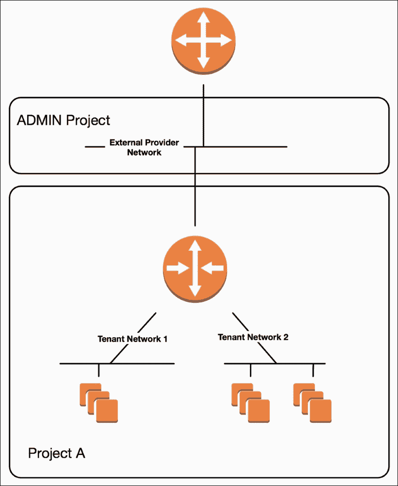

# 第四章 Neutron – OpenStack 网络

在本章中，我们将涵盖以下主题：

+   OpenStack 网络介绍

+   管理网络、子网和端口

+   创建提供商网络

+   创建租户网络

+   创建端口

+   更新网络属性

+   删除端口

+   删除网络

+   管理路由器和浮动 IP

+   将网络附加到路由器

+   创建和分配浮动 IP

+   删除路由器

+   管理安全组

+   管理负载均衡器

# OpenStack 网络介绍

OpenStack 中的网络由一个名为 Neutron 的项目提供。Neutron 是一个由 API 驱动的系统，用于管理 OpenStack 云中的物理和虚拟网络资源。操作员和用户可以利用 Neutron API 来构建适合其应用需求的丰富网络架构。

Neutron 利用一个可插拔和可扩展的架构，允许开发人员编写强大的驱动程序，以实现和配置虚拟和物理网络资源，包括交换机、路由器、防火墙和负载均衡器。Neutron 由一个 API 服务器和各种代理组成，这些代理负责实现用户架构的虚拟网络。以下图示展示了 Neutron API 服务器如何与各种插件和代理交互，构建云中的网络：


图 4.1

图示展示了 Neutron API 服务、Neutron 插件和驱动程序，以及如 L2 和 L3 代理等服务之间的交互。在通过 API 或代理执行网络操作时，Neutron 会发布消息到队列，代理会消费并实现这些消息。

本章将涵盖许多常见的网络相关任务，但不会深入探讨任何特定主题的细节。有关 Neutron 网络基础的介绍，请参阅 *OpenStack Networking Essentials*，*Packt Publishing*，2016 年。要深入了解 Neutron 特性，包括交换和路由的核心功能、负载均衡、VPN 等，请参阅 *Learning OpenStack Networking, Second Edition*，*Packt Publishing*，2015 年。

# 管理网络、子网和端口

网络、子网和端口构成了 Neutron 逻辑网络架构的基础。一个网络描述了一个二层段，通常用于定义一个边界，如 VLAN。子网是与网络相关联的 IPv4 或 IPv6 地址块。一个网络可以与一个或多个子网关联。最后，端口表示跨越整个云的逻辑交换机上的交换机端口。一个端口对象包含与其关联的设备的信息，包括其 MAC 地址、IP 地址和设备 ID。设备可以是虚拟机实例接口、虚拟路由器接口或将连接到虚拟网络的其他设备。

OpenStack 中的网络对象有许多属性，用于描述该网络如何连接物理和虚拟基础设施。以下表格描述了其中的一些细节：

| `属性` | `描述` |
| --- | --- |
| `provider:physical_network` | 这描述了用于此网络的物理接口。这里的标签是像 `eth0` 和 `bond1` 这样的接口的别名。这个别名被称为**提供者标签**，并在相应的插件和代理配置文件中进行配置。主要由 `flat` 和 `vlan` 类型的网络使用。 |
| `provider:segmentation_id` | 这描述了段 ID，如 VLAN ID 或 VXLAN VNI。并非所有网络类型都使用此项。 |
| `provider:network_type` | 这描述了网络类型，如 Flat、VLAN、VXLAN 和 GRE。 |
| `router:external` | 布尔值（真或假），用于确定网络是否有资格作为浮动 IP 池使用。 |

创建网络的用户角色决定了该用户在创建网络时可以指定哪些属性。管理员用户可以在创建网络时指定诸如物理网络或分段 ID 等详细信息。普通用户必须依赖 Neutron 自动配置网络，基于 Neutron 配置文件中设置的细节，包括为每个物理网络选择分段 ID 的池。专门用于将虚拟设备连接到物理网络基础设施的网络通常被称为**提供者网络**，因为它们的属性是根据其所在环境或数据中心故意设置的。提供者网络通常跨项目或租户共享，并且通常为上游设备提供连接，以便在环境中进行路由。普通用户创建的网络被称为**租户网络**，通常仅由创建它们的项目或租户使用。在大多数情况下，租户网络必须连接到虚拟路由器，而虚拟路由器又连接到提供者网络，并可以提供租户网络的进出连接。在接下来的章节中，我们将讨论涉及这些资源的常见任务。

# 创建提供者网络

在 OpenStack 中创建提供者网络时，必须提供描述网络如何连接到物理基础设施的属性。这些属性包括网络类型、服务器使用的网络接口和网络的分段 ID。通常，只有具有管理员级别权限的用户才能创建和管理提供者网络。提供者网络可以是共享的，也可以是私有的，当网络的 `router:external` 属性被设置为 `True` 时，它们还可以作为浮动 IP 网络连接到 Neutron 路由器。

## 准备就绪

创建提供者网络时，您必须以管理员身份进行身份验证。至少需要以下信息来配置该网络：

+   网络名称

+   提供者标签

+   网络类型

+   分段 ID

对于我们的示例，将使用以下内容：

+   网络名称：`COOKBOOK_PROVIDER_NET`

+   提供者标签：`vlan`

+   网络类型：`vlan`

+   分段 ID：`200`

至少需要以下信息来配置相应的子网：

+   子网名称

+   网络名称或 ID

+   子网范围（CIDR）

对于我们的示例，将使用以下内容：

+   子网名称：`COOKBOOK_PROVIDER_SUBNET`

+   网络名称或 ID：`COOKBOOK_PROVIDER_NET`

+   子网范围（CIDR）：`192.168.200.0/24`

## 如何操作…

在我们的系统上安装了 OpenStack 客户端后，我们可以通过以下步骤创建提供者网络：

1.  创建网络：

    ```
    openstack network create COOKBOOK_PROVIDER_NET \
    --provider-network-type vlan \
    --provider-physical-network vlan \
    --provider-segment 200

    ```

    输出将类似于以下内容：

    

1.  创建子网：

    ```
    openstack subnet create COOKBOOK_PROVIDER_SUBNET \
    --network COOKBOOK_PROVIDER_NET \
    --subnet-range 192.168.200.0/24

    ```

    输出将类似于以下内容：

    

## 它是如何工作的...

提供者网络使用以下语法创建：

```
openstack network create NETWORK_NAME \
--provider-network-type NETWORK_TYPE \
--provider-physical-network PROVIDER_LABEL \
--provider-segment SEGMENTATION_ID \
[--external | --internal]

```

创建网络会创建一个逻辑的二层段，其细节用于在云中构建虚拟网络连接，这些连接将虚拟机和其他虚拟网络对象与物理基础设施连接起来。

`provider-network-type` 参数定义了网络的类型。选项包括 `vlan`、`vxlan`、`gre`、`flat`、`geneve` 和 `local`，这些选项必须得到配置的网络驱动程序的支持。

`provider-physical-network` 参数定义了用于网络的接口。在 Neutron 中，接口不是直接引用的，而是映射到 **提供者标签**。在 OpenStack-Ansible 部署中，默认的提供者标签是 `vlan`，并映射到如 `bond1` 或 `eth1` 的物理接口。

`provider-segment` 参数定义了网络使用的二层分段 ID。对于 `vlan` 网络类型，分段 ID 是 VLAN ID。对于 `vxlan` 网络类型，分段 ID 是 VXLAN VNI。并非所有网络类型都使用分段 ID，如果没有指定，Neutron 可能会在需要时自动分配。

当指定时，`--external` 选项将网络标记为路由器的网关网络。该网络将作为附加实例的浮动 IP 网络。网络默认被认为是 *内部* 网络。

还有其他可选的网络参数，可以通过以下 `--help` 标志来发现：

```
openstack network create --help

```

### 提示

`--help` 标志可以附加到 OpenStack 命令行工具的大多数命令中，在本章节中构建命令时将非常有用。

子网使用以下语法创建：

```
openstack subnet create SUBNET_NAME \
--network NETWORK_NAME \
--subnet-range SUBNET_RANGE

```

创建子网会创建一个逻辑层 3 路由域，其详细信息用于向虚拟机和其他虚拟网络对象提供 IP 服务。`network` 参数将子网映射到 OpenStack 中定义的层 2 网络。`subnet-range` 参数定义了子网使用的 L3 地址范围，并以 CIDR 表示法编写。一个网络可以关联多个子网，这通常发生在特定子网中的所有地址都已被使用时。尽管在逻辑上是分离的，网络中的多个子网仍然是同一个层 2 广播域的一部分。

当在 OpenStack 中创建网络和子网并启用 DHCP 时，会在运行 DHCP 代理的一个或多个节点上创建一个相应的网络命名空间。可以使用以下 `ip netns` 命令识别该命名空间：

```
# ip netns list
...
qdhcp-c881ce20-1649-4f03-bea7-40da536e21b2
...

```

DHCP 命名空间的前缀为 `qdhcp-`，后缀对应于网络 ID。

### 注意

`ip netns` 命令必须由 `root` 用户或具有 `sudo` 权限的用户运行。

# 创建租户网络

当在 OpenStack 中创建租户网络时，描述网络如何连接到物理基础设施的提供者属性会根据配置文件中硬编码的设置由 Neutron 自动确定。通常，租户网络由特定项目中的用户创建和管理，并且不会与其他项目共享。

## 准备就绪

至少需要以下网络信息：

+   网络名称

在我们的示例中，将使用以下网络名称：

+   网络名称：`COOKBOOK_TENANT_NET_1`

至少需要以下信息来创建对应的子网：

+   子网名称

+   网络名称或 ID

+   子网范围（CIDR）

在我们的示例中，将使用以下内容：

+   子网名称：`COOKBOOK_TENANT_SUBNET_1`

+   网络名称或 ID：`COOKBOOK_TENANT_NET_1`

+   子网范围（CIDR）：`172.16.200.0/24`

## 如何操作…

在我们的系统上安装了 `openstack` 客户端后，我们可以通过以下步骤创建租户网络：

1.  创建网络：

    ```
    openstack network create COOKBOOK_TENANT_NET_1

    ```

    输出将类似于以下内容：

    

    ### 注意

    作为非管理员用户，某些网络属性可能不可见。

1.  创建子网：

    ```
    openstack subnet create COOKBOOK_TENANT_SUBNET_1 \
    --network COOKBOOK_TENANT_NET_1 \
    --subnet-range 172.16.200.0/24

    ```

    输出将类似于以下内容：

    

## 它是如何工作的...

租户网络的创建遵循以下语法：

```
openstack network create NETWORK_NAME

```

当作为非管理员用户创建时，网络的提供者属性会根据相应网络插件配置文件中定义的设置由 Neutron 自动确定。租户网络与创建它们的项目关联，默认情况下，其他项目无法看到或使用这些网络。

### 提示

Neutron **基于角色的访问控制** (**RBAC**) 可用于在需要时与其他项目共享网络。有关在 OpenStack Pike 版本中使用 RBAC 的更多信息，请访问以下网站：

[`docs.openstack.org/neutron/pike/admin/config-rbac.html`](https://docs.openstack.org/neutron/pike/admin/config-rbac.html)

# 创建端口

在 OpenStack 中可以使用 `openstack port create` 命令创建端口。OpenStack 在创建服务器时会自动创建端口，也可以在稍后创建并附加到实例上。用户还可以创建端口，以便预留 IP 地址供以后使用，或者避免 OpenStack 分配某些地址。

## 准备中

至少需要以下详细信息来创建端口：

+   网络名称或 ID

+   端口名称

对于我们的示例，将使用以下内容：

+   网络名称：`COOKBOOK_TENANT_NET_1`

+   端口名称：`COOKBOOK_TEST_PORT_1`

## 如何操作...

安装了 OpenStack 客户端后，我们现在可以使用以下命令创建端口：

```
openstack port create COOKBOOK_TEST_PORT_1 \
--network COOKBOOK_TENANT_NET_1

```

输出将类似于以下内容：


## 它是如何工作的...

当在 OpenStack 中创建端口并与实例或其他虚拟网络设备关联时，它会绑定到托管实例或设备的相应节点上的 Neutron 代理。使用端口提供的详细信息，OpenStack 服务可以在主机上构建 **虚拟机接口** (**vif**) 或 **虚拟以太网接口** (**veth**)，供虚拟机、网络命名空间或其他应用使用。

# 更新网络属性

网络属性可以通过 `openstack network set` 和 `openstack network unset` 命令进行更新。

## 准备中

更新网络时，确保你已认证为管理员或是网络的所有者。你将需要以下详细信息：

+   网络名称或 ID

+   更新的属性

对于我们的示例，将使用以下内容：

+   网络名称：`COOKBOOK_PROVIDER_NET`

+   更新的属性：`router:external`

## 如何操作...

安装了 OpenStack 客户端后，我们现在可以使用以下命令来更新网络：

```
openstack network set COOKBOOK_PROVIDER_NET --external

```

不会返回任何输出。

## 它是如何工作的...

网络更新的语法如下：

```
openstack network set NETWORK \
[--share | --no-share] \
[--description <description>] \
[--external | --internal] 

openstack network unset [--tag <tag> | --all-tag] NETWORK

```

`share` 和 `no-share` 参数决定网络是否可以在项目之间共享，或者仅限于网络的所有者使用。

`description` 参数允许用户提供网络的有用描述。

当指定时，`--external` 选项将网络标识为路由器的网关网络。该网络将作为附加实例的浮动 IP 网络。默认情况下，网络被视为内部网络。

### 注意

并非所有网络插件都支持更新现有网络的某些网络属性。如果需要更改，可能需要删除并重新创建网络。

# 删除端口

在 OpenStack 中可以使用 `openstack port delete` 命令删除端口。OpenStack 会自动删除它创建的端口，例如，当创建服务器或浮动 IP 时，但可能不会删除用户创建并与实例关联的端口。

### 注意

删除与活动实例关联的端口可能导致实例崩溃或造成实例中的意外行为。

## 准备工作

删除端口时，确保你已经通过管理员身份验证或是端口的所有者。你需要以下信息：

+   端口名称或 ID

对于我们的示例，将使用以下内容：

+   端口名称：COOKBOOK_TEST_PORT_1

## 如何操作…

安装了 OpenStack 客户端后，我们现在可以使用以下命令删除端口：

```
openstack port delete COOKBOOK_TEST_PORT_1

```

不会返回任何输出。

# 删除网络

在 OpenStack 中删除网络与调用 `openstack network delete` 命令一样简单。Neutron 会删除与该网络相关的所有自动创建的端口，如由 DHCP 或路由器命名空间创建的端口，并将任何自动分配的分段 ID 归还到相应的池中，以供分配给其他网络。

## 准备工作

在 OpenStack 中删除网络时，确保所有相关的用户创建端口已被删除。这可能需要删除实例、从实例中分离并删除端口，或从路由器中分离并删除端口。删除网络时，以下信息是必需的：

+   网络名称或 ID

## 如何操作…

安装了 OpenStack 客户端后，我们现在可以使用以下命令删除网络：

```
openstack network delete COOKBOOK_TENANT_NETWORK_3

```

不会返回任何输出。

## 工作原理…

当调用 `openstack network delete` 命令时，它会指示 Neutron 删除指定的网络以及所有相关的子网（子网），前提是所有用户管理的端口都已被删除。在参考架构中，第二层代理负责删除在主机上配置的相应虚拟桥接和接口，所有网络记录都会从 OpenStack 数据库中清除。

### 注意

一旦这些对象被删除，Neutron 不再在数据库中维护网络信息。虽然 OpenStack API 的请求可能会被记录，但如果需要审计跟踪，强烈建议使用第三方工具或代理。

# 管理路由器和浮动 IP

在 OpenStack 中，**路由器**代表一个虚拟路由设备，为直接连接的网络提供路由功能。为了为虚拟机提供端到端的连接，路由器必须连接到外部提供者网络以及实例所在的租户网络。通常，路由器由单独的项目创建和管理。默认情况下，外部提供者网络是共享的，所有项目都可以使用。以下图示表示一个由 `ADMIN` 项目拥有并被其他三个项目使用的外部提供者网络：


图 4.2

在*图 4.2*中，三个项目的路由器连接到外部提供商网络。外部提供商网络不仅提供路由器及其后方网络的连接，还提供一个可以派发浮动 IP 的网络。浮动 IP 提供 1 对 1 的地址转换，允许外部客户端直接连接到实例。

## 创建路由器

在 OpenStack 中，路由器可以使用`openstack router create`命令创建。默认情况下，路由器被认为是*内部的*，只能在直接连接的租户网络之间进行路由。另一方面，*外部*路由器能够路由到外部网关，并能为连接的网络提供**网络地址转换**（**NAT**）服务。

在 OpenStack 参考架构中，可以创建三种类型的路由器：

+   独立路由器

+   **高可用**（**HA**）

+   分布式（DVR）

独立路由器不提供任何级别的容错性，而高可用路由器通过实现 VRRP 来提供冗余，以应对一个或多个 Neutron 节点故障。分布式虚拟路由器驻留在计算节点上，而不是集中式网络节点上，提供比其同类更高的性能，特别是在东西向流量或不同网络中实例间的流量时，因为这类流量是通过计算节点转发的，无需经过网络节点。

对于非管理员用户，通过`openstack router create`命令创建的路由器类型由 Neutron 配置文件中定义的设置自动决定。只有拥有管理员权限的用户才能在创建路由器时指定路由器类型。

## 准备中

至少需要以下详细信息，用于路由器：

+   路由器名称

对于我们的示例，将使用以下内容：

+   路由器名称：`COOKBOOK_ROUTER_STANDALONE`

+   路由器名称：`COOKBOOK_ROUTER_HA`

+   路由器名称：`COOKBOOK_ROUTER_DVR`

至少需要以下详细信息，用于连接到路由器的网络：

+   外部提供商网络名称或 ID

+   租户子网名称或 ID

对于我们的示例，将使用以下内容：

+   外部提供商网络名称：`COOKBOOK_PROVIDER_NET`

+   租户子网名称：`COOKBOOK_TENANT_SUBNET`

## 如何操作...

在系统上安装了`openstack`客户端后，我们现在可以按照以下步骤创建一个路由器：

1.  创建独立路由器：

    ```
    openstack router create COOKBOOK_ROUTER_STANDALONE

    ```

    输出将类似于以下内容：

    

1.  创建一个 HA 路由器：

    ```
    openstack router create COOKBOOK_ROUTER_HA --ha

    ```

    输出将类似于以下内容：

    

1.  创建分布式路由器：

    ```
    openstack router create COOKBOOK_ROUTER_DVR --distributed

    ```

    输出将类似于以下内容：

    

## 它是如何工作的...

当在 OpenStack 中使用原生路由服务创建*任何*路由器时，会在运行`neutron-l3-agent`服务的一个或多个节点上创建一个相应的网络命名空间。可以使用以下`ip netns`命令来识别该命名空间：

```
# ip netns list
...
qrouter-058ea6a3-ca86-46f8-80c8-d63bbc195212
...

```

路由器的命名空间以`qrouter-`为前缀，并且后缀与路由器 ID 相对应。在配置了分布式虚拟路由器的环境中，可能还会有其他命名空间用于促进正确的网络配置，例如`fip-`和`snat-`命名空间。

默认情况下，非管理员用户无法指定正在创建的路由器类型。路由器类型由 Neutron 根据第 3 层代理配置文件自动确定。作者建议尽可能使用 HA 或分布式虚拟路由器，以限制虚拟路由器所在物理节点故障的影响。

### 注意

云操作员可以修改 Neutron 配置文件来更改默认行为。Neutron API 服务使用的`policy.json`文件可以被修改，以允许用户和角色执行通常仅限管理员的操作。有关修改`policy.json`文件的指南和注意事项，请参考社区文档。

# 将网络连接到路由器

在 OpenStack 中，路由器可以连接到单一的外部提供者网络和一个或多个租户网络，如下图所示：



图 4.3

在*图 4.3*中，外部提供者网络提供外部连接，而租户网络则为项目内的虚拟机和其他虚拟网络设备提供连接。路由器的任务是通过路由和有时通过浮动 IP 的 NAT 来促进端到端连接。

将网络连接到路由器所需的命令可能会根据网络和需求的不同而有所变化：

+   将路由器连接到外部网络：

    ```
    openstack router set --external-gateway <network> <router>

    ```

+   使用子网 ID 或名称将路由器连接到租户网络：

    ```
    openstack router add subnet <router> <subnet>

    ```

+   使用特定端口 ID 或名称将路由器连接到租户网络：

    ```
    openstack router add port <router> <port>

    ```

## 准备工作

在将路由器连接到网络时，以下信息是必需的：

+   路由器名称或 ID

+   网络名称或 ID，或子网名称或 ID，或端口名称或 ID

请记住，当将路由器连接到外部提供者网络时，网络的`router:external`属性必须设置为`External`或`True`。

## 如何操作……

在 OpenStack 中将网络连接到路由器，请按以下步骤操作：

1.  将路由器连接到外部提供者网络`COOKBOOK_PROVIDER_NET`：

    ```
    openstack router set --external-gateway COOKBOOK_PROVIDER_NET COOKBOOK_ROUTER_STANDALONE

    ```

    没有输出提供。

1.  使用子网名称将路由器连接到`COOKBOOK_TENANT_SUBNET`子网：

    ```
    openstack router add subnet COOKBOOK_ROUTER_STANDALONE COOKBOOK_TENANT_SUBNET_1

    ```

    没有输出提供。

## 它是如何工作的……

当路由器连接到外部提供者网络时，路由器将从网络中可分配的 IP 地址池中分配一个 IP 地址。路由器还会配置一个默认网关，该网关对应于各自提供者子网的指定网关。

当路由器连接到租户网络时，路由器就成为该网络及其所有实例的网关。它会被分配一个指定为各自租户子网网关的 IP 地址。

可以使用以下命令列出连接到路由器的端口：

```
openstack port list --router ROUTER_NAME_OR_ID

```

在本例中，以下端口和相应子网已附加到路由器：


使用 `ip netns exec` 命令，并结合相应路由器命名空间的名称，我们可以看到路由器有两个附加的接口，分别是 `qg-ed006ed1-b8` 和 `qr-c69005cb-aa`：


### 注意

路由器命名空间中的接口名称与相应端口 ID 的前 10 个字符相对应。外部或网关端接口以 `qg-` 为前缀，而内部或路由器端接口以 `qr-` 为前缀。这种命名方案可以追溯到 Neutron 项目被称为 Quantum 时。

# 创建并分配浮动 IP

OpenStack 中的浮动 IP 是静态 IPv4 地址，它们与 Neutron 路由器后面的实例进行映射，为这些实例提供直接的入站连接。浮动 IP 的使用方式与 Amazon Web Services 中的弹性 IP 类似，用户可以在实例故障时快速重新映射 IP 地址。这个功能的核心是网络地址转换（NAT）。浮动 IP 通常被视为*外部*地址，映射到实例上配置的*内部*地址。NAT 在连接到实例网络的 Neutron 路由器上实现。浮动 IP 提供了对那些通常会被隔离在 Neutron 路由器后非路由网络上的实例的连接。

## 准备工作

回想一下，实例通过端口连接到反映连接网络和关联 IP 地址的端口。当创建浮动 IP 时，需要以下信息：

+   外部网络名称或 ID

分配浮动 IP 到端口时，需进行以下操作：

+   浮动 IP ID

+   内部端口名称或 ID

在本例中，创建一个新的端口，命名为 `COOKBOOK_TEST_PORT_2`，并放置在现有的租户网络中：

```
openstack port create COOKBOOK_TEST_PORT_2 \
--network COOKBOOK_TENANT_NET_1

```

## 如何操作…

要在 OpenStack 中创建浮动 IP，请执行以下命令：

```
openstack floating ip create --port COOKBOOK_TEST_PORT_2 COOKBOOK_PROVIDER_NET

```

输出将类似于以下内容：


## 如何操作…

浮动 IP 的创建语法如下：

```
openstack floating ip create EXTERNAL_NETWORK_NAME_OR_ID \
[--port PORT_NAME_OR_ID]

```

浮动 IP 可以通过以下语法与端口关联：

```
openstack floating ip associate FLOATING_IP_NAME_OR_ID \
PORT_NAME_OR_ID

```

当浮动 IP 与端口关联时，Neutron 使用端口信息来确定要在哪个路由器上配置 NAT。一旦 NAT 配置完成，连接到浮动 IP 的请求将被转换为内部 IP 并转发到相应实例。实例的响应将被转发到路由器，从内部 IP 转换为浮动 IP，然后路由回原始地址。

在我们的例子中，实例的端口与 `COOKBOOK_TENANT_NET` 网络关联，而该网络又与 `COOKBOOK_ROUTER_STANDALONE` 路由器连接。在各自的 `qrouter` 网络命名空间中，我们可以看到通过 `iptables` 应用的源 NAT 和目标 NAT：


# 删除路由器

在 OpenStack 中，可以使用 `openstack router delete` 命令删除路由器。在删除路由器之前，必须先断开所有连接到该路由器的子网/端口。这会导致任何连接到路由器后面的网络的实例的流量中断。可以使用 `openstack router remove subnet` 或 `openstack router remove port` 命令来断开子网。

## 准备工作

删除路由器时，将需要以下信息：

+   路由器名称或 ID

## 如何操作……

要在 OpenStack 中删除路由器，请执行以下命令：

```
openstack router delete COOKBOOK_ROUTER_DVR

```

没有输出。然而，可以使用 `openstack router list` 命令来验证操作：


被删除的路由器将不再出现在列表中。

## 它是如何工作的……

当调用 `openstack router delete` 命令时，将指示 Neutron 删除指定的路由器及其关联的资源。在参考架构中，第三层代理负责删除主机上配置的相应网络命名空间和虚拟接口，且所有与路由器相关的记录都会从 OpenStack 数据库中清除。

# 管理安全组

在 OpenStack 中，安全组描述了具有相似安全要求的端口的组合。安全组规则与安全组关联，并为该组提供入站和出站过滤能力。安全组规则可以使用 CIDR 表示法引用其他组或远程网络。实际的过滤操作发生在计算节点的“端口”级别，并且可以通过 iptables 或作为 OpenFlow 规则来实现，具体取决于在特定节点上配置的防火墙驱动程序。每个新创建的项目都包含一个名为 `default` 的安全组，只允许出站通信。入站通信被拒绝。

## 创建安全组

可以使用 `openstack security group create` 命令在 OpenStack 中创建安全组。安全组是项目拥有的对象，不能被其他项目共享或引用。

## 准备工作

创建安全组时，与该组关联的每个端口将继承应用于该组的规则。至少需要以下详细信息来创建该组：

+   安全组名称

对于我们的示例，将使用以下内容：

+   安全组名称：`COOKBOOK_SG_WEB`

## 如何操作……

在我们的系统上安装了 OpenStack 客户端后，我们现在可以使用以下命令创建安全组：

```
openstack security group create COOKBOOK_SG_WEB

```

输出将类似于以下内容：


## 它是如何工作的……

安全组使用以下语法创建：

```
openstack security group create SECURITY_GROUP_NAME

```

当创建安全组时，OpenStack 会将一组默认规则应用于该组，这些规则允许端口通过 IPv4 和 IPv6 进行出站通信（egress）。默认情况下，所有入站流量会被拒绝。

创建安全组只是为实例提供过滤的第一步。接下来的步骤，即创建安全组规则并将安全组应用于端口，将在后续章节中讨论。

## 创建安全组规则

可以使用 `openstack security group rule create` 命令在 OpenStack 中创建安全组规则。安全组规则提供了在第 3 层和第 4 层的过滤信息，包括 IP 地址和目标端口。

## 准备工作

在创建安全组规则时，请记住，每个与该组关联的端口将继承应用于该组的规则。因此，重要的是仅限于所需的规则，以便为关联组提供所需的访问权限。至少，您需要以下详细信息来定义规则：

+   安全组名称

对于我们的示例，将使用以下内容：

+   安全组名称：`COOKBOOK_SG_WEB`

+   目标端口：`80`

+   协议：TCP

+   方向：入口

+   来源：所有地址

## 如何操作……

在我们的系统上安装了 OpenStack 客户端后，现在可以通过以下命令创建安全组规则：

```
openstack security group rule create COOKBOOK_SG_WEB \
--dst-port 80 \
--protocol tcp \
--ingress \
--remote-ip 0.0.0.0/0

```

输出将类似于以下内容：


## 它是如何工作的……

安全组是通过以下语法创建的：

```
openstack security group rule create SECURITY_GROUP_NAME \
[--remote-ip <ip-address> | --remote-group <group>] \
[--dst-port <port-range>] \
[--icmp-type <icmp-type>] \
[--icmp-code <icmp-code>] \
[--protocol <protocol>] \
[--ingress | --egress] \
[--ethertype <ethertype>]
```

安全组规则为 OpenStack 提供了 Neutron 代理用来在计算节点上单独端口上实现流量过滤的详细信息。在我们的环境中，这些规则作为 iptables 规则实现。

如果在创建安全组规则时未提供任何额外的过滤信息，可能会导致一个规则允许来自*所有*源地址的入口访问。当没有指定详细信息时，OpenStack 会假设某些默认值，因此验证提供的输出非常重要，以确保已实施适当的过滤。

## 将安全组应用于实例

安全组通常在启动时通过 `openstack server create` 命令应用于实例，但也可以通过 `openstack network port create` 或 `set` 命令应用于单个端口。在启动时应用时，每个列出的安全组都会应用于与实例关联的每个端口。因此，可能会在每个接口上应用不必要的规则，这可能导致安全风险或底层 Neutron 代理性能下降，该代理负责应用规则。当应用于单个端口时，用户可以确保如果实例是多宿主的，相应端口仅具有提供对该接口访问所需的规则。

### 注意

多宿主（multihomed）是指通过不同接口连接到多个网络的实例。

## 准备工作

在启动时将安全组应用于实例时，您需要以下信息：

+   安全组名称或 ID

在将安全组应用于单个端口时，您需要以下信息：

+   端口名称或 ID

+   安全组名称或 ID

对于我们的示例，将使用以下内容：

+   端口名称：`COOKBOOK_TEST_PORT_1`

+   安全组名称：`COOKBOOK_SG_WEB`

+   实例名称：`COOKBOOK_INSTANCE_WEB`

+   实例规格：`COOKBOOK_FLAVOR_TINY`

+   实例镜像：`COOKBOOK_IMAGE_CIRROS`

+   网络名称：`COOKBOOK_TENANT_NET_1`

## 操作步骤…

在我们的系统上安装了 `openstack` 客户端后，我们可以按照以下步骤应用安全组：

1.  创建实例并在启动时提供安全组：

    ```
    openstack server create COOKBOOK_INSTANCE_WEB \
    --flavor COOKBOOK_FLAVOR_TINY \
    --image COOKBOOK_IMAGE_CIRROS \
    --nic net-id=COOKBOOK_TENANT_NET_1 \
    --security-group COOKBOOK_SG_WEB

    ```

    ### 注意

    使用适合你环境的规格和镜像，或使用在第五章，*Nova – OpenStack 计算*和第六章，*Glance – OpenStack 镜像服务*中创建的规格和镜像。

    另外，安全组可以在端口创建时或应用于现有端口时进行配置。通过在系统上安装 OpenStack 客户端，我们可以按照以下步骤应用安全组。

1.  将安全组应用到新端口：

    ```
    openstack port create COOKBOOK_TEST_PORT_3 \
    --network COOKBOOK_TENANT_NET_1 \
    --security-group COOKBOOK_SG_WEB

    ```

    输出结果如下所示：

    

1.  将安全组应用于现有端口：

    ```
    openstack port set COOKBOOK_TEST_PORT_2 \
    --security-group COOKBOOK_SG_WEB

    ```

    不会返回输出。不过，可以通过使用 `openstack port show` 命令查询应用到端口的安全组来确认该更改：

    ```
    openstack port show COOKBOOK_TEST_PORT_2 -c security_group_ids

    ```

    输出结果如下所示：

    

## 工作原理…

安全组可以在启动时应用于实例，在创建端口时应用，或应用于现有端口。计算节点上的 Neutron 插件代理负责在主机上为端口应用相应的过滤规则。在所有场景中，可以将多个安全组应用于同一个端口。

安全组可以通过以下语法在启动时应用：

```
openstack server create INSTANCE_NAME \
...
--security-group SECURITY_GROUP_NAME

```

安全组也可以通过以下语法应用于新端口：

```
openstack port create PORT_NAME \
--network NETWORK_NAME \
--security-group SECURITY_GROUP_NAME 

```

最后，安全组可以通过以下语法应用于现有端口：

```
openstack port set PORT_NAME \
--security-group SECURITY_GROUP_NAME

```

端口绑定到位于环境中主机上的 Neutron 插件代理。例如，属于实例的端口会绑定到该实例所在的计算节点上的代理。该代理负责为端口设置虚拟网络。当安全组应用于端口时，端口绑定的 Neutron 代理在主机上实施过滤规则。环境中的其他代理会收到安全组已更改的通知，并相应地更新。

# 管理负载均衡器

Neutron 包含一个名为 **负载均衡即服务**（**LBaaS**）的服务，允许用户创建将流量负载均衡到云中多个实例上部署的应用程序的负载均衡器。在参考架构中，Neutron 依赖一个开源负载均衡软件包 HAProxy 来提供负载均衡功能。就像 Neutron L3 代理处理虚拟路由器、DHCP 代理处理虚拟 DHCP 服务器一样，Neutron LBaaS 代理负责在请求时构建和配置虚拟负载均衡器。

### 注意

**LBaaS** 不应与另一个名为 Octavia 的负载均衡项目混淆。两者都提供类似的负载均衡功能，但这里只涵盖 LBaaS。

在 OpenStack 中，负载均衡器包含三个主要组件：

+   池成员

+   池

+   监听器

**池成员** 描述一个第 4 层对象，由实例上服务的 IP 地址和端口组成。例如，池成员可能是一个 Web 服务器，地址配置为 `10.30.0.2`，并在 TCP 端口 `80` 上监听。

**池** 是一组提供相同内容的池成员。

**监听器** 是一个对象，表示负载均衡器本身正在监听的 **虚拟 IP**（**VIP**）和端口。流量将根据虚拟 IP 在关联池的成员之间进行负载均衡。

其他组件，如健康检查器和 L7 策略，有助于扩展负载均衡器的实用性和功能，但不是必需的。

创建功能性负载均衡器的工作流程如下：

+   创建负载均衡器对象

+   创建并关联监听器

+   创建并关联池

+   创建并关联池成员

+   创建并关联健康检查器（可选）

## 创建负载均衡器

从 OpenStack 的 Pike 版本开始，负载均衡器相关的命令不再在 OpenStack 客户端中提供。相反，应使用 `neutron` 客户端。可以通过 `neutron lbaas-loadbalancer-create` 命令在 OpenStack 中创建负载均衡器。

## 准备就绪

至少需要以下详细信息来创建负载均衡器：

+   VIP 子网

还推荐为其命名。对于我们的示例，以下内容将被使用：

+   名称：`COOKBOOK_LOADBALANCER_1`

+   VIP 子网：`COOKBOOK_TENANT_SUBNET_1`

## 如何操作…

在我们的系统上安装了 Neutron 客户端后，现在可以使用以下命令创建负载均衡器对象：

```
neutron lbaas-loadbalancer-create COOKBOOK_TENANT_SUBNET_1 \
--name COOKBOOK_LOADBALANCER_1

```

输出将类似于以下内容：


## 它是如何工作的…

负载均衡器通过以下语法创建：

```
neutron lbaas-loadbalancer-create VIP_SUBNET \
[--name NAME]

```

当负载均衡器创建时，OpenStack 会分配一个被称为虚拟 IP 的 IP 地址。客户端将使用 VIP 来访问负载均衡的应用程序。创建负载均衡器对象只是将流量负载均衡到实例的第一步。接下来的步骤，创建监听器、池和健康检查器，将在接下来的章节中讨论。

## 创建池

与负载均衡器关联的池是代表接收发送到 VIP 的流量的实例集合的对象。在 OpenStack 中，可以使用 `neutron lbaas-pool-create` 命令创建负载均衡池。

## 准备工作

至少需要以下详细信息来配置池：

+   平衡算法

+   协议

+   负载均衡器或监听器

也推荐指定一个名称。在我们的示例中，将使用以下名称：

+   名称：`COOKBOOK_POOL_1`

+   平衡算法：`ROUND_ROBIN`

+   协议：`HTTP`

+   负载均衡器：`COOKBOOK_LOADBALANCER_1`

负载均衡器可以与多个监听器关联，每个监听器可以与其各自的池关联。此类设置的常见场景是，一个负载均衡器上有一个监听器监听端口`80`，另一个监听器监听端口`443`，每个监听器都有其各自的后端池。

## 如何操作…

在系统上安装了 Neutron 客户端后，我们现在可以使用以下命令创建一个负载均衡器池：

```
neutron lbaas-pool-create --lb-algorithm ROUND_ROBIN \
--protocol HTTP \
--loadbalancer COOKBOOK_LOADBALANCER_1 \
--name COOKBOOK_POOL_1 

```

输出结果如下所示：


## 它是如何工作的…

负载均衡池的创建语法如下：

```
neutron lbaas-pool-create [--name NAME] \
--lb-algorithm {ROUND_ROBIN,LEAST_CONNECTIONS,SOURCE_IP} \
[--listener LISTENER | --loadbalancer LOADBALANCER] \
--protocol {HTTP,HTTPS,TCP}

```

其他负载均衡对象，如成员和监控器，引用池，并且必须在创建时应用到池中。

## 创建成员

成员与池关联，代表一个在特定 IP 和端口上监听的后端应用程序。在 OpenStack 中，池成员可以通过 `neutron lbaas-member-create` 命令创建。

## 准备工作

至少需要以下详细信息来配置成员：

+   子网名称

+   IP 地址

+   端口

+   池名称

也推荐指定一个名称。在我们的示例中，将使用以下名称：

+   名称：`COOKBOOK_MEMBER_1`

+   子网名称：`COOKBOOK_TENANT_SUBNET_1`

+   IP 地址：`172.16.200.11`（对应`COOKBOOK_TEST_PORT_2`）

+   端口：`80`

+   池名称：`COOKBOOK_POOL_1`

一个成员只能与一个池关联。但是，相同的 IP 地址和应用端口组合可以用于多个成员。

## 如何操作…

在系统上安装了 Neutron 客户端后，我们可以使用以下命令创建一个池成员：

```
neutron lbaas-member-create --name COOKBOOK_MEMBER_1 \
--subnet COOKBOOK_TENANT_SUBNET_1 \
--address 172.16.200.11 \
--protocol-port 80 \
COOKBOOK_POOL_1 

```

输出结果如下所示：


## 它是如何工作的…

池成员的创建语法如下：

```
neutron lbaas-member-create [--name NAME] \
--subnet SUBNET --address ADDRESS \
--protocol-port PROTOCOL_PORT \
POOL

```

## 创建监听器

监听器与负载均衡器对象关联，描述了负载均衡器 VIP 与服务监听的端口之间的关系。客户端将流量发送到监听器地址和端口，然后该流量被代理并发送到池中的一个成员。每个监听器可以配置为将流量发送到不同的池。在 OpenStack 中，监听器可以通过 `neutron lbaas-listener-create` 命令创建。

## 准备工作

至少需要以下详细信息来配置监听器：

+   负载均衡器名称

+   协议

+   端口

也推荐指定名称和默认池。在我们的示例中，将使用以下名称：

+   名称：`COOKBOOK_LISTENER_1`

+   负载均衡器名称：`COOKBOOK_LOADBALANCER_1`

+   协议：`HTTP`

+   端口：`80`

+   默认池：`COOKBOOK_POOL_1`

## 如何操作……

在我们的系统上安装了 Neutron 客户端后，现在可以使用以下命令创建一个监听器：

```
neutron lbaas-listener-create --name COOKBOOK_LISTENER_1 \
--loadbalancer COOKBOOK_LOADBALANCER_1 \
--protocol HTTP \
--protocol-port 80 \
--default-pool COOKBOOK_POOL_1

```

输出将类似于以下内容：


## 工作原理……

监听器是通过以下语法创建的：

```
neutron lbaas-listener-create [--name NAME] \
--loadbalancer LOADBALANCER \
--protocol {TCP,HTTP,HTTPS,TERMINATED_HTTPS} \
--protocol-port PORT \
[--default-pool DEFAULT_POOL]

```

### 提示

可以通过将安全组应用到负载均衡器地址的相应端口来限制对监听器的访问。使用本章前面描述的 `openstack port set` 命令来将安全组应用于监听器的端口。

## 验证连接性

一旦工作流完成并且池成员上的应用程序已启动，可以使用 Web 浏览器或从能够访问 VIP 的客户端的 `curl` 命令验证到负载均衡器 VIP 的连接。在本示例中，Web 服务器在前一节中配置的池成员上运行。我们将从与负载均衡器关联的 `qlbaas` 命名空间进行连接，但也可以从与 VIP 地址来源的网络关联的 `qdhcp` 命名空间进行连接。

## 准备就绪

至少需要以下详细信息来测试连接性

+   网络 ID 或负载均衡器 ID

+   VIP 地址和端口

对于我们的示例，将使用以下内容：

+   负载均衡器 ID：`aa599cee-b49f-44f1-a0fd-51fa69ebf6db`（`COOKBOOK_LOADBALANCER_1`）

+   VIP 地址和端口：`172.16.200.14:80`

## 如何操作……

在 Neutron 代理容器内，可以使用 `curl` 在 `qdhcp` 或 `qlbaas` 命名空间内确认与 VIP 的连接：

```
# ip netns exec qlbaas-aa599cee
-b49f-44f1-a0fd-51fa69ebf6db \
curl http://172.16.200.14:80

```

输出将类似于以下内容：

```
Hello Cookbook Readers!

```

### 注意

你可能需要安装 `curl` 工具才能使命令正常工作。在 Neutron 代理容器中，可以通过运行 `apt install curl` 来完成此操作。池成员上 Web 服务器的配置超出了本书的范围。

若要从外部网络访问负载均衡器虚拟 IP，可能需要将浮动 IP 映射到虚拟 IP。可以参考本章前面的说明来完成该任务。
