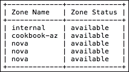
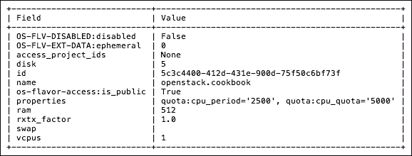
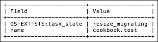
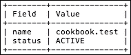

# 第五章：Nova – OpenStack 计算

在本章中，我们将涵盖以下主题：

+   OpenStack 计算简介

+   使用 OpenStack-Ansible 添加计算主机

+   暂停主机进行维护

+   配置 Nova 调度器以使用主机聚合

+   创建主机聚合

+   向主机聚合添加计算主机

+   从主机聚合中移除计算主机

+   向主机聚合添加元数据

+   删除主机聚合

+   创建可用区

+   将实例启动到可用区

+   删除可用区

+   创建 flavor

+   删除 flavor

+   为 flavor 设置 CPU 限制

+   为 flavor 设置 IOPS 限制

+   启动实例

+   停止实例

+   删除实例

+   实时迁移

+   快照实例

+   从快照启动实例

+   救援实例

+   搁置实例

+   查看控制台日志

# OpenStack 计算简介

OpenStack 中的计算服务由名为 Nova 的项目提供。Nova 是一个基于 API 的系统，管理 OpenStack 云中的物理和虚拟计算资源，提供**基础设施即服务**（**IaaS**）。OpenStack 的操作员、管理员和用户可以利用 Nova API 来管理计算资源的生命周期。

Nova 主要负责管理两种资源类型：**实例**，即用户请求的正在运行的虚拟机、应用程序容器，甚至是裸金属机器；和**主机**，即提供实例所需硬件资源的主机。在大多数情况下，实例就是虚拟机的同义词。

理解 Nova 的两个主要功能非常重要：Nova API 服务（以及相关服务，如`nova-scheduler`、`nova-conductor`和`nova-placement`）运行在我们三个控制节点的集群上，而`nova-compute`服务则运行在我们环境中的每个计算主机上。

在本章中，我们将首先介绍物理主机和 Nova 服务的管理，接下来，本章的其余部分将采用以任务为中心的方法来处理 Nova。这意味着，关于 Nova 功能和特性的深度与细节超出了本书的范围。

# 使用 OpenStack-Ansible 添加计算主机

为了运行实例，OpenStack 计算需要知道在哪些物理资源上运行实例。随着 OpenStack 的成长和成熟，添加主机的过程也随之发展。OpenStack-Ansible 提供了一种非常便捷且一致的方法来添加新的计算主机，这使得你可以在需求增长时扩展你的环境。计算主机运行`nova-compute`服务和启动适当实例类型的虚拟化程序。

## 准备工作

为了使用`openstack-ansible`将计算主机添加到 OpenStack 集群中，您需要以下信息：

+   主机的 IP 地址

+   访问主机的 SSH

+   部署主机的 SSH 密钥

+   访问部署主机

示例中使用的值如下：

+   计算主机：`172.29.236.15`

+   部署主机：`controller-01.cook.book`

我们假设您的环境已经使用 OpenStack-Ansible 安装，如 第一章 中所述，*使用 Ansible 安装 OpenStack*。

## 操作方法…

使用 `openstack-ansible` 安装和配置额外的计算主机，请执行以下步骤：

1.  从 *部署主机*，按以下示例将附加计算主机添加到 `/etc/openstack_deploy/openstack_user_config.yml` 文件中：

    ```
    compute_hosts:
      compute-01:
        ip: 172.29.236.13
      compute-02:
        ip: 172.29.236.14
      compute-03:
        ip: 172.29 236.15
    ```

1.  运行 `setup-hosts.yml`，将任务限制为仅限 `compute-03`：

    ```
    cd /opt/openstack-ansible/playbooks
    openstack-ansible setup-hosts.yml --limit compute-03

    ```

1.  让 Ansible 收集有关新主机的信息：

    ```
    ansible nova_all -m setup -a 'filter=ansible_local gather_subset="!all"'

    ```

1.  只需运行 `os-nova-install.yml` 在我们的新计算主机上安装和配置 `nova-compute`：

    ```
    openstack-ansible os-nova-install.yml --limit compute-03

    ```

    ### 提示

    如果 `openstack-ansible` 命令失败，可以使用 `-v` 标志增加详细信息以帮助进行故障排除。多次添加 `-v` 将提供额外的详细级别。

1.  在任何控制器服务器上运行以下命令以确认新的虚拟化主机（因为它们运行实用程序容器）：

    ```
    lxc-attach --name $(lxc-ls -1 | grep utility)
    source openrc
    openstack hypervisor list

    ```

    这应该返回如下输出：

    

## 工作原理…

`/etc/openstack_deploy/openstack_user_config` 文件提供了在我们的环境中将角色映射到主机的映射。向 `compute_hosts` 部分添加 `compute-03.cook.book` 的 IP 地址，告知 `openstack-ansible` 命令将包、设置等应用到新主机。它还向您的其余环境添加任何所需的配置。

### 提示

本书不涵盖 Openstack-Ansible playbooks 的详细讨论范围。有关 playbooks 及其操作方式的更多信息，请参阅此处的文档：[`docs.openstack.org/project-deploy-guide/openstack-ansible/pike/`](https://docs.openstack.org/project-deploy-guide/openstack-ansible/pike/)

# 暂停维护主机

经常需要将主机脱机以更换内存、升级操作系统或执行其他常规维护任务。为了确保运行中的实例不受不利影响，我们使用 `openstack compute service set` 命令。

## 准备工作

为了将主机置于维护模式，您将需要以下信息：

+   `openstack` 命令行实用程序

+   `nova` 命令行实用程序

+   带有管理员凭据的 `openrc` 文件

+   主机的 *名称*

我们将置于维护模式的主机如下：

+   计算主机：`compute-03`

## 操作方法…

要删除维护的虚拟化主机，请执行以下步骤：

1.  首先，我们将列出可用的主机：

    ```
    source ~/openrc
    openstack compute service list -c Binary -c Host -c Status -f table

    ```

    这将返回如下输出：

    

1.  接下来，我们将禁用称为 `nova-compute` 的服务以进行计算主机的操作，因此我们将指定：

    ```
    openstack compute service set --disable compute-03 nova-compute

    ```

    ### 提示

    当成功时，此命令不会产生任何输出。

1.  使用以下命令验证主机是否已禁用：

    ```
    openstack compute service list -c Binary -c Host -c Status -f table

    ```

    这将生成如下所示的输出：

    

1.  一旦计算主机被禁用（意味着它将不再接受请求运行新实例），我们就可以将正在运行的实例从这个禁用的计算主机迁移到我们环境中的其他计算主机上：

    ```
    nova host-evacuate-live --block-migrate compute-03

    ```

    这将生成如下所示的输出：

    

## 它是如何工作的…

为了将主机下线进行维护，Nova 必须首先停止在该主机上放置新实例。可以通过使用 `openstack service set --disable [host] [service]` 命令禁用计算主机上的 `nova-compute` 服务来完成此操作。一旦主机被标记为禁用，在将其关闭进行维护之前，运行中的实例需要迁移到其他主机。`nova host-evacuate-live [host]` 命令尝试将所有正在运行的实例实时迁移到指定主机上。它通过要求 Nova 将实例重新调度到具有可用性的主机来实现这一点。

### 提示

如果实例没有使用共享存储，可以使用 `--block-migrate` 标志尝试迁移存储。

# 配置 Nova Scheduler 以使用主机聚合

OpenStack 计算提供了创建名为 **主机聚合** 的逻辑分组的能力，这些分组允许用户和管理员控制哪些物理计算主机可以运行请求的工作负载。通常，主机聚合用于组织具有相似属性的主机，例如 SSD、性能或已通过 HITRUST 或 PCI 安全审计的主机。一个主机可以被分配到多个聚合中。也就是说，一个主机可以同时属于 PCI 和 SSD 分组。为了在 Nova Scheduler 中启用主机聚合调度，必须首先在 `nova.conf` 中启用主机聚合过滤。在 `openstack-ansible` 中，Ansible 管理此文件，我们将使用它来推送适当的更改。

## 准备工作

确保你在部署主机上拥有 `root` 权限。在大多数情况下，这是第一个基础设施控制节点 `infra01`。

## 如何操作…

要启用主机聚合的调度，可以使用以下步骤：

1.  在部署主机上，将以下行添加到 `/etc/openstack_deploy/user_variables.yml` 文件中：

    ```
    nova_scheduler_default_filters: "AggregateInstanceExtraSpecsFilter,RetryFilter,AvailabilityZoneFilter,RamFilter,ComputeFilter,ComputeCapabilitiesFilter,ImagePropertiesFilter,ServerGroupAntiAffinityFilter,ServerGroupAffinityFilter,AggregateCoreFilter,AggregateDiskFilter"
    ```

1.  然后我们可以使用 Ansible 来部署以下命令进行更改：

    ```
    cd /opt/openstack-ansible/playbooks
    openstack-ansible os-nova-install.yml

    ```

1.  登录到 `nova-scheduler` 容器并验证更改：

    ```
    lxc-attach --name controller-01_nova_scheduler_container-ed0f657d
    grep Aggregate /etc/nova/nova.conf

    ```

    ### 提示

    容器的名称中有唯一的 UUID。使用以下命令查看容器的名称：

    ```
    lxc-ls -f

    ```

    如果找到了 `Aggregate` 这个词，以下输出将被返回，表明更改已成功：

    ```
    enabled_filters = AggregateInstanceExtraSpecsFilter,RetryFilter,AvailabilityZoneFilter,RamFilter,ComputeFilter,ComputeCapabilitiesFilter,ImagePropertiesFilter,ServerGroupAntiAffinityFilter,ServerGroupAffinityFilter,AggregateCoreFilter,AggregateDiskFilter

    ```

## 它是如何工作的…

将`AggregateInstanceExtraSpecsFilter`添加到`enabled_filters`中，告知`nova-scheduler`将实例的*flavor 元数据*与*主机聚合元数据*匹配。然后使用`openstack-ansible`命令将此更改传播到 OpenStack 云环境中的`/etc/nova/nova.conf`文件。

一旦启用，当请求新的实例时，Nova 调度器会检查与请求相关的 flavor 元数据，并尝试将其与主机聚合的元数据匹配。

# 创建主机聚合

启用 OpenStack 以允许主机聚合过滤后，我们可以继续创建主机聚合。本食谱将向您展示如何创建主机聚合。

## 准备工作

要创建主机聚合，您将需要以下信息：

+   `openstack`命令行客户端

+   包含适当凭据的`openrc`文件

+   聚合的*名称*

对于我们的示例，主机聚合将命名为`cookbook-ssd-hosts`。

## 如何操作…

创建主机聚合，请执行以下步骤：

1.  首先，我们将列出当前的主机聚合：

    ```
    openstack aggregate list

    ```

    这将产生如下所示的输出：

    

1.  接下来，我们将创建聚合：

    ```
    openstack aggregate create cookbook-ssd-hosts

    ```

    这将返回如下所示的输出：

    

1.  列出主机聚合：

    ```
    openstack aggregate list

    ```

    这将产生如下所示的输出：

    

## 它是如何工作的…

在 Nova 中，**主机聚合**为 OpenStack 管理员和操作员提供了一种机制，可以根据任意属性将主机分组，稍后用于控制哪些计算主机处理用户的请求。创建主机聚合是通过`openstack aggregate create name`命令完成的。

# 将计算主机添加到主机聚合

在 OpenStack 计算节点可以使用主机聚合之前，必须首先将主机添加到创建的聚合组中。

## 准备工作

要将主机添加到聚合中，您将需要以下信息：

+   `openstack`命令行客户端

+   包含适当凭据的`openrc`文件

+   聚合的*名称*或*ID*

+   主机的*名称*或*ID*

对于以下示例，所需的值如下：

+   主机聚合：`cookbook-ssd-hosts`

+   计算主机：`compute-01`

## 如何操作…

以下过程用于将主机添加到主机聚合中：

1.  列出已经在聚合中的主机：

    ```
    openstack aggregate show cookbook-ssd-hosts

    ```

    这将返回如下所示的输出：

    

1.  现在按如下方式将指定的计算主机添加到该聚合中：

    ```
    openstack aggregate add host cookbook-ssd-hosts compute-01

    ```

    这将返回如下所示的输出：

    

## 它是如何工作的…

`openstack aggregate host add`命令将主机与 Nova 数据库中的主机聚合关联。然后，Nova 调度器将根据此信息做出决策，决定将实例放置在哪个主机上。如果主机聚合的元数据与 flavor 或用户所在项目的元数据匹配，则实例可以调度到该聚合内的主机上。

# 从主机聚合中移除计算主机

如果主机的属性发生变化，或者聚合的需求发生变化，主机可以从主机聚合中移除。

## 准备工作

要从主机聚合中移除主机，你需要以下信息：

+   `openstack`命令行客户端

+   包含适当凭证的`openrc`文件

+   聚合的*名称*或*ID*

+   主机的*名称*或*ID*

## 如何操作……

1.  使用以下命令列出已在聚合中的主机：

    ```
    openstack aggregate show cookbook-ssd-hosts

    ```

    这将返回如下输出。请注意，`hosts`字段显示的是当前与主机聚合相关联的计算主机：

    

1.  要从此主机聚合中移除计算主机，请发出以下命令：

    ```
    openstack aggregate remove host cookbook-ssd-hosts compute-01

    ```

    这将返回以下内容。请注意，在`hosts`字段中，`compute-01`现在已缺失：

    

## 它是如何工作的……

从主机聚合中移除主机会告知 OpenStack Compute，该额外的元数据过滤器不再适用，且该主机可以正常调度。

### 提示

当前，正在运行的实例不受此操作影响。主机聚合的操作仅影响新的实例请求。

# 向主机聚合添加元数据

主机聚合的强大之处在于能够基于主机的属性将其逻辑分组。这可以用于，例如，启用负载均衡、强制物理隔离，或者防止不安全的实例被调度到受保护的环境中。我们将通过将主机聚合的**元数据**与实例规格相匹配来展示这一点。

## 准备工作

要向主机聚合添加元数据，你需要以下信息：

+   `openstack`命令行客户端

+   包含适当凭证的`openrc`文件

+   聚合的*名称*或*ID*

+   要添加的*元数据*属性

在我们的示例中，这些值将如下所示：

+   主机聚合：`cookbook-ssd-hosts`

+   元数据：`ssd=true`

## 如何操作……

要向主机聚合添加元数据，请按照以下过程操作：

1.  显示与聚合相关联的现有元数据：

    ```
    openstack aggregate show cookbook-ssd-hosts

    ```

    这将返回如下输出。请注意，如果尚未关联任何元数据，`properties`字段将是空白的：

    

1.  使用以下命令添加元数据：

    ```
    openstack aggregate set --property ssd=true cookbook-ssd-hosts

    ```

    ### 提示

    这个命令在成功时不会显示任何输出。

1.  现在再次使用以下命令确认元数据的添加：

    ```
    openstack aggregate show cookbook-ssd-hosts

    ```

    你将看到`properties`字段已更新，包含以下信息：

    

1.  现在我们已经设置了主机聚合的元数据，我们可以将其与配置关联，这样当用户在启动过程中指定该配置时，Nova 将根据该属性仅匹配主机聚合组中的主机。例如，我们可能有一个名为`cookbook.ssd`的配置，它设定了预期，当用户选择时，该主机将提供 SSD。这就是主机聚合的强大之处。在此示例中，`compute-02`主机提供 SSD，因为我们在名为`cookbook-ssd-hosts`的主机聚合中指定了这一点。为了利用这一点，让我们创建一个新的配置，名为`cookbook.ssd`，并设置`ssd=true`属性：

    ```
    openstack flavor create
     --vcpus 1
     --ram 512
     --disk 5
     --public
     cookbook.ssd

    ```

    ### 提示

    创建配置的详细说明请参见*创建配置*示例。

1.  现在我们需要设置配置的**额外规格**，以便在选择配置时它与相关的主机聚合关联。为此，我们使用`nova`命令：

    ```
    nova flavor-key cookbook.ssd set ssd=true

    ```

    ### 提示

    您可能需要使用配置的 UUID，而不是名称。如果是这样，请使用以下命令列出配置，并使用`cookbook.ssd`配置的 UUID：

    ```
    openstack flavor list

    ```

1.  现在，当用户选择`cookbook.ssd`配置时，他们可能并不知道，该实例将仅限于具有此键值对的主机聚合组中的主机。

## 它是如何工作的…

元数据以键/值对的形式指定，然后与 Nova 数据库中的主机聚合关联。这些键/值对是任意的，可以定义以适应特定环境。一个主机聚合可以存储任意数量的键/值对；然而，这可能会对实例调度产生不利影响，因为可能存在冲突或混淆的键/值对。

# 删除主机聚合

当主机聚合在给定环境中不再适用时，可以删除它。删除主机聚合之前，必须先移除所有主机。

## 准备工作

要删除主机聚合，您需要以下信息：

+   `openstack`命令行客户端

+   包含适当凭证的`openrc`文件

+   聚合的*名称*或*ID*

在以下示例中，我们将删除`cookbook-threadripper-hosts`聚合。

## 如何操作…

以下命令用于删除主机聚合：

1.  首先，列出现有的聚合：

    ```
    openstack aggregate list

    ```

    这将返回以下输出：

    

1.  确认聚合中没有主机（如有必要，请参考*从主机聚合中移除计算主机*的示例）：

    ```
    openstack aggregate show cookbook-threadripper-hosts

    ```

    这将返回以下输出：

    

1.  现在我们可以使用以下命令删除聚合：

    ```
    openstack aggregate delete cookbook-threadripper-hosts

    ```

    ### 提示

    此命令在成功时不会产生输出。

1.  使用以下命令确认更改：

    ```
    openstack aggregate list

    ```

    这将返回以下输出，其中主机聚合已被删除：

    

## 它是如何工作的…

删除主机聚合会将其及其所有元数据从 Nova 数据库中移除，并且它将不再用于实例调度。

# 创建可用区

**可用区**（**AZ**）是主机聚合的特殊情况。在这里，主机聚合由 Nova 用于进行调度决策；通常它们只对 OpenStack 云的操作员和管理员可见。AZ 则是终端用户可见的组件。AZ 可以像主机聚合一样进行配置，以代表硬件的特性。

AZ 通常用于定义故障域，例如机柜、数据中心，甚至地理位置。在配置 AZ 时，需要注意的是，每个主机一次只能属于一个 AZ。

### 注意

由于 AZ 是主机聚合的特殊用例，很多操作（如添加和删除主机）与聚合相同。因此，这些操作不再重复说明。

创建 AZ 是一个两步过程。首先，我们使用`--zone`参数创建一个聚合，或者将其添加到现有的聚合中。其次，在实例可以调度到该区之前，必须将主机添加到聚合中。

## 准备就绪

创建 AZ 时，您需要以下信息：

+   `openstack`命令行客户端

+   包含适当凭证的`openrc`文件

+   聚合的*名称*或*ID*

+   AZ 的期望*名称*

+   要添加到 AZ 的*主机*或*主机* 

对于我们的示例，以下是这些值：

+   聚合名称：`cookbook-az`

+   可用区名称：`cookbook-az`

+   计算主机：`compute-01`

## 操作方法…

创建 AZ 时需要执行以下步骤：

1.  首先，我们将使用以下命令列出当前的 AZ：

    ```
    openstack availability zone list

    ```

    这将返回如下输出：

    

1.  使用`--zone`参数创建新的聚合：

    ```
    openstack aggregate create --zone cookbook-az cookbook-az

    ```

    这将返回如下输出：

    

1.  现在使用以下命令将主机添加到聚合中：

    ```
    openstack aggregate add host cookbook-az compute-01

    ```

    成功时，返回如下输出：

    

1.  现在列出我们可用的 AZ：

    ```
    openstack availability zone list

    ```

    这将显示以下内容：

    

    ### 提示

    列出所有可用的可用区（AZ），不论其中是否存在主机。要验证某个 AZ 中的主机，可以执行以下命令：

    ```
    openstack availability zone show nameofAZ

    ```

    这将返回如步骤 3 所示的输出。

## 工作原理…

第一个命令`openstack availability zone list`列出了所有 AZ。接下来，在创建新聚合时，传递特殊的`--zone cookbook-az`参数，告诉 OpenStack Nova 这个聚合也是一个 AZ，并指定其名称。最后，像将主机添加到聚合一样将主机添加到 AZ。

# 启动实例到可用区

可以通过在创建过程中传递`--availability-zone`参数，将实例创建到指定的 AZ。此外，AZ 也可以在 OpenStack Horizon 中的实例创建向导中选择。

## 准备就绪

启动实例到 AZ 时需要以下信息：

+   `openstack`命令行客户端

+   包含适当凭证的`openrc`文件

+   AZ 的*名称*或*ID* 

+   启动实例所需的附加信息

    ### 提示

    创建实例的详细步骤在*启动实例*的示例中有详细说明。因此，这个示例跳过了一些细节，专注于如何在特定的 AZ 中创建实例。

## 如何操作…

要将实例引导到特定的 AZ，需在运行`openstack server create`命令时指定`--availability-zone`参数：

```
openstack server create --flavor openstack.cookbook
 --image 08b822ba-be44-4639-b577-45e8dd37c06d
 --nic net-id=6cb5a4ce-1ea5-4817-9c34-a2212a66f394
 --security-group bd7d5e0f-538a-4d93-b123-98cc3207b3d2
 --key-name cookbook_key
 --availability-zone cookbook-az
 cookbook.test-03

```

这将带回如下输出，显示实例所在的 AZ（`OS-EXT-AZ:availability-zone`字段）：


## 工作原理…

如果指定了`--availability-zone`参数，Nova 调度程序会检查指定的 AZ，看看是否可以满足请求。

# 移除可用性区域

移除 AZ 是一个多步骤的过程，并且有一些注意事项。要移除 AZ，必须先从主机聚合中移除主机。

## 准备工作

删除 AZ 所需的以下信息：

+   `openstack`命令行客户端

+   包含适当凭据的`openrc`文件

+   AZ 的*名称*或*ID*

## 如何操作…

以下步骤可用于移除一个 AZ：

1.  首先，使用以下命令列出可用的 AZ：

    ```
    openstack availability zone list

    ```

    这将带回如下输出：

    

1.  现在列出我们要删除的 AZ 中的主机：

    ```
    openstack aggregate show cookbook-az

    ```

    这将带回如下输出：

    

1.  现在使用以下命令移除主机（根据需要重复每个主机的操作）：

    ```
    openstack aggregate remove host cookbook-az compute-01

    ```

    这将带回以下输出：

    

1.  使用`aggregate delete`命令移除 AZ：

    ```
    openstack aggregate delete cookbook-az

    ```

    ### 提示

    如果成功，该命令将不产生任何输出。

1.  使用以下命令确认 AZ 的移除：

    ```
    openstack availability zone list

    ```

    这将带回如下输出，显示我们的 AZ 已被移除：

    

## 工作原理…

要移除 AZ，首先必须确保没有活动主机。因为 AZ 是主机聚合的特例，用于识别和移除主机的命令相同。一旦移除了主机，使用`openstack aggregate delete [name]`命令完成 AZ 的移除。

# 创建一个 flavor

在 Nova 可以启动实例之前，首先需要知道应分配给这些实例的资源。Nova 处理资源分配的方式是定义**flavors**。一个 flavor 指定了分配给实例的 vCPU 数、RAM 和磁盘大小。

## 准备工作

要创建一个新的 flavor，您需要以下内容：

+   `openstack`命令行客户端

+   包含适当凭据的`openrc`文件

+   新 flavor 的*名称*、*vCPU*、*RAM*和*磁盘*值

在本示例中我们将创建的 flavor 将具有以下属性：

+   Flavor 名称：`openstack.cookbook`

+   vCPU：1

+   RAM：512 MB

+   磁盘：5 GB

+   可见性：公共

## 如何操作…

以下命令用于创建新的 flavor：

1.  首先，使用以下命令列出我们环境中已配置的可用 flavor：

    ```
    openstack flavor list

    ```

    这将返回如下所示的输出：

    

1.  使用我们提供的属性创建 flavor：

    ```
    openstack flavor create
     --vcpus 1
     --ram 512
     --disk 5
     --public
     openstack.cookbook

    ```

    这将返回如下所示的输出：

    

1.  再次列出 flavor，以查看新 flavor：

    ```
    openstack flavor list

    ```

    这将输出如下所示的内容：

    

## 如何操作…

`openstack flavor create --vcpus [vcpu_count] --ram [ram_MB] --disk [disk_GB] --public [name]`命令用于定义 flavor。`--public`选项用于指定该 flavor 是否应对所有 OpenStack 环境中的用户可用，或者是否应仅限于用户所属项目的范围和可见性。

# 删除 flavor

由于需求的变化，可能会有对更多性能的要求，或者业务需求发生变化。无论原因如何，现有的 flavor 可能无法满足使用云资源的需求。当某个 flavor 不再适用时，它需要被删除。

### 提示

与正在运行的实例相关联的 flavor 无法删除。

## 准备就绪

要更改 Nova 的 flavor 属性，您需要以下内容：

+   `openstack`命令行客户端

+   包含适当凭证的`openrc`文件

+   要删除 flavor 的*名称*

## 如何操作…

以下命令用于删除 flavor：

1.  首先，列出可用的 flavor：

    ```
    openstack flavor list

    ```

    这将返回如下所示的 flavor 列表：

    

1.  要删除 flavor，请执行以下命令：

    ```
    openstack flavor delete openstack.cookbook

    ```

    ### 提示

    该命令执行成功时不会显示任何输出。

1.  再次列出 flavor，以查看更新后的属性：

    ```
    openstack flavor list

    ```

    再次列出当前可用的 flavor：

    

## 如何操作…

删除 flavor 时使用`openstack flavor delete [name]`命令。如果需要删除多个 flavor，可以指定多个名称或 ID，每个名称或 ID 之间用空格分隔。

# 为 flavor 设置 CPU 限制

除了定义分配给实例的 vCPU 数量外，还可以进一步限制这些 CPU 周期的使用。Nova 依赖于底层的虚拟化管理程序来实现 CPU 限制，因此可用的值可能会有所不同。我们的示例基于 QEMU/KVM。

CPU 限制是您可能会遇到的 flavor 属性的特殊情况。

## 准备就绪

要为 flavor 添加 CPU 限制，您需要以下内容：

+   `openstack`命令行客户端

+   包含适当凭证的`openrc`文件

+   要更改 flavor 的*名称*

+   您希望设置的 CPU 限制值（分配的 CPU 每个周期可消耗的时间份额，以毫秒为单位）

我们示例中的这些值如下：

+   `cpu_quota` = 5000 ms

+   `cpu_period` = 2500 ms

## 如何操作…

以下命令用于为 flavor 添加 CPU 限制。

### 提示

CPU 限制不是实时应用的，而是在实例启动时应用。

在撰写本文时，`openstack` 命令行客户端是查看和更改此设置的唯一方式。默认情况下，查看实例属性时也不会显示此设置。

1.  首先，查看我们正在更改的 flavor 的当前属性，注意我们没有设置 `properties`：

    ```
    openstack flavor show openstack.cookbook

    ```

    这将给出如下输出：

    

1.  添加 CPU 限制：

    ```
    openstack flavor set
     --property quota:cpu_quota=5000
     --property quota:cpu_period=2500
     openstack.cookbook

    ```

    ### 提示

    此命令成功时不会显示任何输出

1.  通过再次查询 flavor 来查看 CPU 限制，注意 `properties` 字段：

    ```
    openstack flavor show openstack.cookbook

    ```

    这将给出类似以下的输出：

    

## 它是如何工作的…

为了帮助缓解 *吵闹邻居* 问题，或者进一步定义服务等级，OpenStack 支持 CPU 限制。在 OpenStack 中，这被称为 **实例资源配额**。CPU 限制是 flavor 定义的一部分。也就是说，给定 flavor 的所有实例都会有相同的 CPU 限制。

强加 CPU 限制是特定于虚拟化管理程序的。对于 KVM/libvirt 环境，CPU 限制是通过 cgroups 强制实施的，结合使用以下三个值：

+   `cpu_shares`

+   `cpu_quota`

+   `cpu_period`

对于这些值及其交互的完整讨论超出了本书的范围。不过，你可以在 OpenStack wiki 上找到详细的解释，网址如下：

[`wiki.openstack.org/wiki/InstanceResourceQuota`](https://wiki.openstack.org/wiki/InstanceResourceQuota)

# 为 flavor 设置 IOPS 限制

与 CPU 限制一样，IOPS 限制也可以被施加，以防止某个实例类型占用系统上所有可用的 IO。此处的 IOPS 指的是存储和网络 IO。同时，像 CPU 限制一样，IOPS 限制是 flavor 属性的一个特殊案例，你可能会经常遇到。

### 提示

在撰写本文时，`openstack` 命令行客户端是查看和更改此设置的唯一方式。默认情况下，查看实例属性时也不会显示此设置。

## 准备就绪

要向 flavor 添加 IOPS 限制，你需要以下内容：

+   `openstack` 命令行客户端

+   包含适当凭据的 `openrc` 文件

+   要更改的 flavor 的 *名称*

+   你希望设置的 IOPS 限制值。

+   在我们的示例中，这些值如下：

+   `disk_read_iops` = 100 IOPS

+   `disk_write_iops` = 100 IOPS

## 如何操作…

以下命令用于向 flavor 添加 IOPS 限制：

### 提示

与更改 flavor 属性一样，IOPS 限制不会应用于正在运行的实例。相反，它们是在实例启动时应用的。

1.  首先，查看正在更改的 flavor 的属性，注意 `properties` 字段为空：

    ```
    openstack flavor show openstack.cookbook

    ```

    这将给出类似以下的输出：

    

1.  现在我们可以使用以下命令添加 IOPS 限制：

    ```
    openstack flavor set
     --property quota:disk_read_iops=100
     --property quota:disk_write_iops=100
     openstack.cookbook

    ```

    ### 提示

    此命令成功时不会显示任何输出。

1.  我们可以通过查看 flavor 属性来验证 IOPS 限制：

    ```
    openstack flavor show openstack.cookbook

    ```

    这将返回类似以下的输出，注意我们现在已经设置属性以反映施加的 IOPS：

    

## 它是如何工作的……

与 CPU 限制一样，IO 限制也在 flavor 级别定义。然而，与 CPU 限制不同，IO 限制可以由虚拟机监控程序、存储层或两者的组合来应用。

要为给定的 flavor 设置 IOPS 限制值，请使用以下`openstack`命令：

```
openstack flavor set
 --property quota:disk_read_iops=[read_iops]
 --property quota:disk_write_iops=[write_iops]
 [name]

```

虽然为了完整性显示了读写 IOPS，但你不需要同时指定两者。

# 启动实例

使用实例可以执行的最基本任务是生命周期任务。在本示例中，我们将向你展示如何启动或引导实例。

## 准备就绪

要启动一个实例，你将需要以下内容：

+   `openstack`命令行客户端

+   包含适当凭据的`openrc`文件

+   实例的*名称*

+   用于实例的*镜像*

+   用于创建实例的*flavor*名称

+   要将实例附加到的*网络*的名称

+   用于允许访问实例的*密钥对*名称

+   与实例关联的任何*安全组*名称

## 它是如何工作的……

我们将启动的实例将具有以下属性：

+   实例名称：`cookbook.test`

+   Flavor 类型：`openstack.cookbook`

+   镜像名称：`Ubuntu 16.04 amd64` (UUID)

+   网络：`public` (UUID)

+   密钥对名称：`cookbook_key`

+   安全组：`ssh`

要启动一个实例，使用以下步骤：

1.  要列出当前正在运行的实例，我们执行以下命令：

    ```
    openstack server list

    ```

    ### 提示

    如果没有实例，这个命令将不会产生任何输出。

1.  列出可用的镜像：

    ```
    openstack image list

    ```

    这将返回一个可用镜像的列表：

    

1.  列出可用的网络：

    ```
    openstack network list

    ```

    这将列出我们可以将实例附加到的网络：

    

1.  创建一个密钥对（如果你还没有创建并可供使用）：

    ```
    ssh-keygen -q -N ""

    ```

    还可以使用以下命令上传：

    ```
    openstack keypair create --public-key ~/.ssh/id_rsa.pub cookbook_key

    ```

    这将返回一个输出，显示您的密钥指纹：

    

1.  现在我们可以使用以下命令启动实例：

    ```
    openstack server create
     --flavor openstack.cookbook
     --image 08b822ba-be44-4639-b577-45e8dd37c06d
     --nic net-id=6cb5a4ce-1ea5-4817-9c34-a2212a66f394
     --security-group ssh 
     --key-name cookbook_key
     cookbook.test

    ```

    这将产生一个输出表，显示实例正在引导（为了简洁起见，此处不显示）。

1.  要查看已启动实例的更多信息，请执行以下命令：

    ```
    openstack server show cookbook.test

    ```

    这将输出如下内容：

    

## 它是如何工作的……

在记录下需要输入的一些必需值后，例如我们要启动的镜像的 UUID 和要将实例附加到的网络的 UUID，我们然后调用了 OpenStack 客户端中的一个工具来启动我们的实例。该命令行的一部分指向要使用的密钥对。然后我们通过生成的密钥对中的私钥连接到实例。

云实例如何知道使用哪个密钥？作为该镜像启动脚本的一部分，它会回调到元服务器，这是 `nova-api` 和 `nova-api-metadata` 服务的一个功能。元服务器充当我们实例和外部世界之间的桥梁，云-init 启动过程可以调用它，在这种情况下，它下载一个脚本，将我们的私钥注入到 Ubuntu 用户的 `.ssh/authorized_keys` 文件中。

当云实例启动时，它会生成一些关于该实例的有用指标和详细信息。这些通过 `openstack server list` 和 `openstack server show` 命令呈现。`openstack server list` 命令显示一个简洁的版本，列出实例的 ID、名称、状态和 IP 地址。

# 停止实例

有时，实例需要停止，可能是出于多种原因，例如维护和离线迁移，但作为 OpenStack 管理员，您可能不想完全销毁实例及其相关数据。因此，您可能只想停止实例。

## 准备就绪

要停止实例，您需要以下内容：

+   `openstack` 命令行客户端

+   包含适当凭证的 `openrc` 文件

+   实例的 *名称*

## 如何操作…

在此示例中，我们将停止在 *启动实例* 方案中创建的 `cookbook.test` 实例。要停止实例，请按照以下步骤操作：

1.  首先，我们列出正在运行的实例：

    ```
    openstack server list

    ```

    这将返回一个正在运行的实例列表。考虑以下示例：

    

1.  要停止实例，只需执行以下命令：

    ```
    openstack server stop cookbook.test

    ```

    ### 提示

    该命令完成需要一些时间，如果成功，将不会显示输出。

1.  现在列出实例以确认实例的状态。在这里，我们正在寻找 `cookbook.test` 实例的 `SHUTOFF` 状态：

    ```
    openstack server list

    ```

    这将输出以下内容：

    

## 它是如何工作的…

要停止实例，我们使用 `openstack` 客户端的 `server stop` 命令：`openstack server stop [名称或 ID]`。这会告诉 Nova 关闭实例的电源。这相当于按住笔记本电脑的电源按钮或拔掉服务器的电源线。

# 删除实例

要完成实例的生命周期，您需要删除它。Nova 提供了这个功能，通过 `openstack` 命令行工具来实现。

## 准备就绪

要删除一个实例，您需要以下内容：

+   `openstack` 命令行客户端

+   包含适当凭证的 `openrc` 文件

+   实例的 *名称*

## 如何操作…

在这个示例中，我们将删除在 *启动实例* 方案中创建的 `cookbook.test` 实例。要删除实例，请按照以下步骤操作：

1.  首先，列出正在运行的实例：

    ```
    openstack server list

    ```

    

1.  要删除名为 `cookbook.test` 的实例，请执行以下命令：

    ```
    openstack server delete cookbook.test

    ```

    ### 提示

    如果命令成功执行，将不会有输出。

1.  现在再次列出实例以确认删除：

    ```
    openstack server list

    ```

    这将返回一个输出，显示我们删除的实例现在已不在：

    

## 它是如何工作的…

`openstack server delete`命令不同于暂停或挂起实例，它会删除实例及其中的所有数据。

# 实时迁移

云计算的一个关键理念是将硬件抽象化。然而，硬件确实需要定期维护，或者主机需要进行软件升级。无论是什么原因，主机可能需要下线进行维护，理想情况下，实例的停机时间应该尽可能少。为了适应这一需求，Nova 提供了两种实时迁移实例的方法：当环境中没有共享存储时使用块迁移，当实例从共享存储启动时使用实时迁移标志（在每个计算主机都能看到每个实例的启动卷时，实例将从共享存储启动）。

## 准备就绪

要进行实例的实时迁移，您需要以下信息：

+   `openstack`命令行客户端

+   包含适当管理员凭证的`openrc`文件

+   实例的*名称*

+   目标虚拟化管理程序的*名称*

### 提示

如果你的环境配置为实例从共享存储（例如 Ceph 提供的 RBD）启动，那么实时迁移几乎是瞬时完成的（这取决于实例的忙碌程度）。一个叫做**块迁移**的特性要慢得多。块迁移用于没有为实例提供共享存储的环境中。

迁移只能由具有管理员角色权限的用户执行。

## 如何操作…

1.  首先，我们列出可用的虚拟化管理程序。我们需要记录可以将正在运行的实例迁移到的地方：

    ```
    openstack hypervisor list

    ```

    这将返回如下所示的输出：

    

1.  接下来，查看实例属性以识别源主机：

    ```
    openstack server show cookbook.test
     -c name
     -c OS-EXT-SRV-ATTR:hypervisor_hostname

    ```

    这将返回我们感兴趣的字段（也称为列名，使用`-c`标志标识）。请注意，在这个例子中，名为`cookbook.test`的实例正在名为`compute-01.cook.book`的虚拟化管理程序上运行：

    

1.  要执行没有共享存储可用的实例*实时迁移*，请发出以下命令：

    ```
    openstack server migrate --block-migration cookbook.test

    ```

    ### 提示

    我们不使用`--block-migration`方法指定目标计算主机，而是让 Nova 调度器决定下一个可用的虚拟化管理程序。

    当成功时，此命令不会显示任何输出。

    要实时迁移实例，*使用共享存储（如 Ceph）*，请发出以下命令：

    ```
    openstack server migrate cookbook.test --live compute-02.cook.book

    ```

    ### 提示

    我们通过`--live`标志指定目标虚拟化管理程序。

    当成功时，此命令不会显示任何输出。

1.  检查迁移状态：

    ```
    openstack server show
     -c name
     -c OS-EXT-STS:task_state cookbook.test

    ```

    由于块迁移通常需要更长的时间，您可能会看到状态为`resize_migrating`，这表示迁移任务仍在进行中：

    

1.  使用以下命令验证迁移，确保实例现在运行在不同的虚拟化管理程序上：

    ```
    openstack server show cookbook.test
     -c name
     -c OS-EXT-SRV-ATTR:hypervisor_hostname

    ```

    这将返回如下所示的输出：

    

### 提示

任何类型的迁移通常最好在实例未被大量使用时进行。

## 它是如何工作的…

实时迁移是一个关键特性，使 OpenStack 操作员和管理员能够在不影响云服务消费者的情况下，对底层云基础设施进行维护。此外，OpenStack 管理员可以使用来自资源监控服务（如 Ceilometer）的遥测数据，并做出实时迁移决策，以平衡 OpenStack 云中的工作负载。

OpenStack 中的实时迁移由 libvirt 驱动程序处理。具体来说，当您发出`openstack server migrate`命令时，OpenStack Compute 会从一个计算主机上的 libvirtd 建立到远程主机上同一进程的连接。一旦建立了此连接，根据您指定的参数，实例的内存状态会同步，并且控制权会转移。在前面的示例中，我们首先指定了额外的`--block-migrate`参数，它在没有共享存储的情况下处理实例磁盘文件的移动，然后我们展示了如何在实例从共享存储启动时使用`--live`标志。

### 提示

**记住**：迁移只能由具有`admin`角色的用户执行。

# 对实例进行快照

对实例进行快照将创建实例在拍摄快照时的 Glance 镜像。然后，您可以使用该镜像部署给定应用程序的额外实例，或作为实例的可启动备份。

## 准备工作

为了创建实例的快照，您需要以下信息：

+   `openstack`命令行客户端

+   包含适当凭证的`openrc`文件

+   实例的*名称*

## 如何操作…

以下命令用于创建实例快照：

1.  首先，我们使用以下命令列出现有镜像：

    ```
    openstack image list -c Name -c Status

    ```

    这将返回如下所示的镜像列表：

    

1.  现在，使用以下命令列出正在运行的实例：

    ```
    openstack server list -c Name -c Status

    ```

    这将输出如下所示的内容：

    

1.  要创建快照，请执行以下命令（请注意我们使用的可选 shell 扩展命令，它会为快照名称添加时间戳）：

    ```
    openstack server image create
     --name cookbook.test_snapshot-$(date +"%FT%H%M%S")
     cookbook.test

    ```

    这将输出如下所示的内容：

    

1.  我们可以使用以下命令验证快照是否已创建。请注意，我们将屏幕截图限制为仅显示我们的快照镜像：

    ```
    openstack image list

    ```

    这将输出显示我们的快照镜像：

    

## 它是如何工作的…

实例快照会创建正在运行实例的 Glance 镜像。该快照可以用于备份、重新分发或作为持续部署管道中的构建工件。使用`openstack server image create --name [snapshot_name] [instance]`创建的镜像是可启动的。您可以灵活地使用这些镜像。

## 还有更多…

实例快照非常强大。虽然本书无法详细探讨其所有可能性，但以下示例展示了使用此功能可以实现的目标：一种轻松备份所有运行实例的方式。

要快照每个实例，请使用以下命令：

```
for instance in $(openstack server list -f value -c ID); do {
    openstack server image create \
      --name "${instance}"-$(date +"%FT%H%M%S") ${instance}
}; done
```

### 小贴士

**警告**：不推荐在较大的环境中对每个实例进行快照。除了耗时之外，它还可能消耗 Glance 使用的相当大一部分存储空间，因为快照不像您可能使用的原始 QCOW2 镜像那样稀疏创建

# 从快照启动实例

现在我们已经创建了一个实例快照，假设我们需要回滚并恢复文件，或将应用程序恢复到快照创建时的状态。由于快照作为 OpenStack 镜像存储，您可以直接从快照启动，因此启动实例所需的所有细节也适用于启动快照。

## 准备就绪

要从快照启动实例，您将需要以下内容：

+   `openstack`命令行客户端

+   包含适当凭证的`openrc`文件

+   实例的*名称*

+   用于实例的*快照*

+   用于创建实例的*规格*名称（此规格必须与原始实例使用的规格大小相等或更大）

+   要附加到实例的*网络*或网络名称

+   允许访问实例的*密钥对*名称

+   任何*安全组*的名称，用于与实例关联

## 如何操作…

我们将启动的实例将具有以下属性：

+   镜像名称：`cookbook.test_snapshot-2017-09-08T163619`

+   实例名称：`cookbook.test_restore`

+   规格类型：`openstack.cookbook`

+   网络：`public`（UUID）

+   密钥对名称：`cookbook_key`

+   安全组：`ssh`

要从实例快照启动，我们使用与启动实例相同的过程。以下命令是重复的：

1.  首先，我们可以使用以下命令列出现有的运行实例：

    ```
    openstack server list -c Name -c Status

    ```

    这将返回一个`ACTIVE`运行实例的列表：

    

1.  然后我们可以使用以下命令启动实例快照：

    ```
    openstack server create
     --flavor openstack.cookbook
     --image cookbook.test_snapshot-2017-09-08T163619
     --nic net-id=6cb5a4ce-1ea5-4817-9c34-a2212a66f394 
     --security-group bd7d5e0f-538a-4d93-b123-98cc3207b3d2 
     --key-name cookbook_key
     cookbook.test_restore

    ```

    这将返回熟悉的启动实例的输出，已在此省略。

1.  现在我们可以再次列出运行中的实例，以显示我们的`cookbook.test_restore`实例是`ACTIVE`的：

    ```
    openstack server list -c Name -c Status

    ```

    这显示我们的实例现在正在运行：

    

## 它是如何工作的…

由于实例快照存储为 OpenStack 镜像，从快照启动的过程与从现有镜像启动的过程相同。然而，存在一些注意事项。由于快照是在镜像运行时创建的，从它们启动的过程类似于在断电后启动服务器。您还必须确保使用的 flavor 与原始实例相同或更大。例如，如果一个实例最初创建为 m1.large，则必须使用 m1.large 或更大的 flavor 来启动快照。此外，如果实例是附加到 Active Directory 域的 Windows 镜像，可能会导致两个相同的实例同时运行时出现问题。为缓解此问题，请考虑将实例启动到单独的恢复网络上。

### 提示

有一些工具可用于暂停实例内的文件系统，并提供一个更一致的镜像，这超出了本书的范围。然而，作为指导，建议在拍摄快照之前，确保运行实例内的文件系统同步（以刷新任何磁盘写入）。

# 救援一个实例

OpenStack Compute 提供了一个方便的故障排除工具——救援模式。如果用户丢失了 SSH 密钥，或者无法启动并访问实例，例如，出现错误的 iptables 设置或失败的网络配置，救援模式会启动一个最小化实例并附加来自故障实例的磁盘以帮助恢复。这个过程适用于 Windows 和 Linux 实例，因为它本质上允许将故障实例的引导卷作为二级磁盘附加到救援实例上。

## 准备工作

要将实例置于救援模式，您需要以下信息：

+   `openstack`命令行客户端

+   包含适当凭证的`openrc`文件

+   实例的*名称*或*ID*

本示例中使用的实例是`cookbook.test`。

## 如何操作…

要将实例置于救援模式，请按照以下步骤操作：

1.  首先，我们将按以下方式将实例置于救援模式：

    ```
    openstack server rescue cookbook.test

    ```

    这将向我们展示一个临时密码，我们可以使用它来访问救援实例：

    

1.  要验证实例是否处于救援模式，请使用以下命令：

    ```
    openstack server show cookbook.test -c name -c status

    ```

    这将显示`status`值为`RESCUE`：

    

1.  此时，我们可以使用`root`用户名和我们获得的临时密码访问该实例，并在挂载的文件系统上执行操作系统救援命令（即原始故障实例的引导卷文件系统）。

    ### 提示

    在救援模式下，实例的磁盘将作为二级磁盘附加。为了访问磁盘上的数据，您需要将其挂载。由于操作系统和部署方式之间的文件系统差异，本书不涉及挂载过程。

1.  要退出救援模式，请使用以下命令：

    ```
    openstack server unrescue cookbook.test

    ```

    ### 提示

    如果命令成功执行，将不会产生任何输出。

## 它是如何工作的……

`openstack server rescue`命令提供一个救援环境，并将你的实例磁盘附加到该环境中。首先，它关闭指定的实例，然后启动救援环境并附加原始实例的磁盘。最后，它为你提供救援实例的登录凭证。

通过 SSH 访问救援实例。一旦登录到救援实例，你可以使用命令 `mount <path to disk> /mnt` 挂载磁盘。

一旦完成故障排除或恢复，`unrescue`命令会逆转此过程：首先停止救援环境并分离磁盘，然后按原样启动实例。

# 将实例置于架空状态

OpenStack Nova 中有一个稍微独特的功能，那就是能够*将实例置于架空状态*。实例架空允许你停止实例而不消耗资源。一个架空的实例将被保留为一个可启动的实例，并保留它所分配的资源（如 IP 地址），该实例将保持一定时间后被删除。这在实例生命周期过程中或节省资源时非常有用。

### 提示

**停止与架空有什么区别？**

停止实例并不会释放作为配额一部分仍然可用的资源，因为假设你将在短时间内重新启动该实例。如果你没有剩余的 CPU 或 RAM 配额，便无法启动已停止的实例。已停止实例的资源仍然被视为 OpenStack 计算调度程序的*已使用资源*。

然而，**将实例置于架空状态**可以释放这些资源，但仍然允许你在稍后的时间访问已架空的实例。解除架空时，配额规则和限制仍然适用，但将实例置于架空状态可以让你在保持实例数据的同时，在分配的资源配额内工作。

## 准备工作

要将实例置于架空状态，需提供以下信息：

+   `openstack`命令行客户端

+   包含适当凭证的`openrc`文件

+   实例的*名称*或*ID*

## 操作方法…

要将实例置于架空状态，使用以下命令：

1.  首先，我们检查实例的状态：

    ```
    openstack server show cookbook.test -c name -c status

    ```

    确保你的实例的`status`为`ACTIVE`：

    

1.  要将实例置于架空状态，执行以下命令：

    ```
    openstack server shelve cookbook.test

    ```

    ### 提示

    该命令执行成功时不会产生任何输出。将实例置于架空状态可能需要一些时间，具体取决于你的环境。

1.  要检查实例的状态，执行以下命令，注意新的状态：

    ```
    openstack server show cookbook.test -c name -c addresses -c status

    ```

    `status`值已更改为`SHELVED_OFFLOADED`：

    

    ### 提示

    一个架空的实例将保留它已分配的地址。

1.  要解除架空实例并将其恢复为`ACTIVE`状态，只需执行以下命令：

    ```
    openstack server unshelve cookbook.test

    ```

    ### 提示

    该命令执行成功时不会产生任何输出。与架空操作一样，实例可能需要几分钟才能变为活动状态，这取决于你的环境。

1.  我们可以通过检查状态来验证该状态：

    ```
    openstack server show cookbook.test -c name -c addresses -c status

    ```

    `status`值已返回`ACTIVE`：

    

## 它是如何工作的...

当被要求架空实例时，OpenStack Compute 会先停止该实例。然后，它会创建一个实例快照以保留该实例的状态。运行时的细节，例如 vCPU 数量、内存和 IP 地址，会被保留，以便可以在稍后的时间将实例恢复并重新调度。

这与关闭实例不同，因为关闭实例的资源仍然保留在其所在的主机上，以便可以快速重新启动。然而，已架空的实例仍会出现在`openstack server list`中，分配的资源将保持可用。此外，由于已架空的实例需要从镜像恢复，OpenStack Compute 将执行放置操作，就像该实例是全新的一样，启动时将需要一些时间。

# 审查控制台日志

控制台日志对于排查实例启动过程中的问题至关重要。这些日志在启动时生成，在控制台可用之前。通常，在使用云托管实例时，访问这些日志可能比较困难。OpenStack Compute 提供了一种访问控制台日志的机制。

## 准备工作

要访问实例的控制台日志，需要以下信息：

+   `openstack`命令行客户端

+   包含适当凭据的`openrc`文件

+   实例的*名称*或*ID*

在此示例中，我们将查看`cookbook.test`实例的最后五行。

## 如何操作...

要显示实例的控制台日志，请使用以下命令：

```
openstack console log show --lines 5 cookbook.test

```

这将连接到实例的串行控制台输出，模拟如同监视器直接连接到物理服务器的信息：

```
[[0;32m  OK  [0m] Started udev Coldplug all Devices.
[[0;32m  OK  [0m] Started Dispatch Password Requests to Console Directory Watch.
[[0;32m  OK  [0m] Started Set console font and keymap.
[[0;32m  OK  [0m] Created slice system-getty.slice.
[[0;32m  OK  [0m] Found device /dev/ttyS0.

```

## 它是如何工作的...

`openstack console log show`命令收集控制台日志，就像你通过串行端口连接到服务器或在启动时坐在键盘和显示器后面一样。默认情况下，该命令将返回所有生成的日志。要限制输出量，可以使用`--lines`参数返回日志末尾的特定行数。
