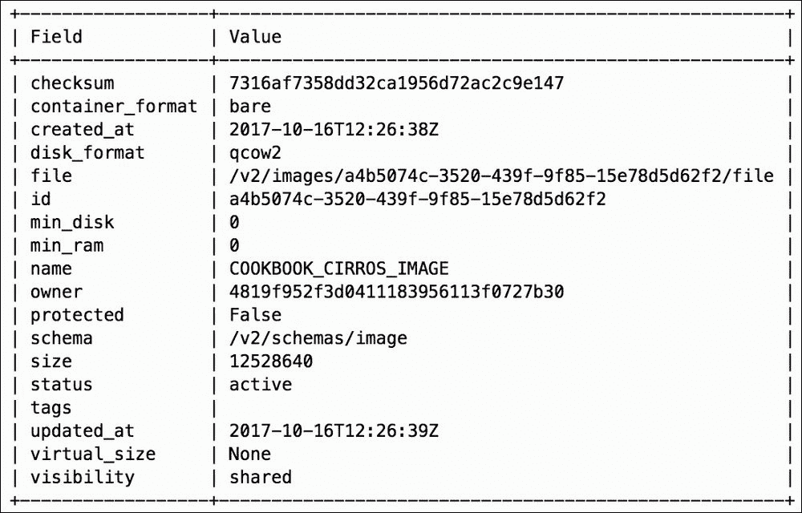

# 第六章：Glance – OpenStack 镜像服务

在本章中，我们将涵盖以下主题：

+   OpenStack 镜像服务介绍

+   管理镜像

+   使用镜像快照

+   使用镜像元数据

+   保护镜像

+   禁用镜像

+   创建自定义镜像

# OpenStack 镜像服务介绍

OpenStack 镜像服务，也称为 Glance，是一个允许用户注册、发现和获取虚拟机镜像，以便在 OpenStack 云中使用的服务。通过 OpenStack 镜像服务提供的镜像可以存储在多种格式和后端位置中，从本地文件系统存储到分布式文件系统，如 OpenStack 对象存储（Swift）和 Ceph。

OpenStack 镜像服务由两个主要组件组成：`glance-api`服务和`glance-registry`服务。用户在使用 OpenStack 客户端执行创建、列出、删除或管理镜像等命令时，间接与`glance-api`服务进行交互。`glance-registry`服务负责连接后端数据库，并存储或检索镜像。

# 管理镜像

在 OpenStack 环境中，可以使用`openstack`命令行工具、Horizon 仪表板或通过 Glance 基于 REST 的 API 直接进行镜像管理。镜像可以直接从互联网获取，或者使用`virsh`、`virt-manager`、`growpart`、`cloud-init`等工具创建和操作。自定义镜像创建将在本章后面进行介绍。

## 上传镜像

在 OpenStack 中创建镜像时，必须提供描述镜像的属性。这些属性包括镜像名称、磁盘格式和容器格式。镜像可以是公共的、私有的，或者在多个项目之间共享。

## 准备工作

以下示例所需的镜像可以从以下位置下载：

+   Ubuntu: [`cloud-images.ubuntu.com/xenial/current/xenial-server-cloudimg-amd64-disk1.img`](https://cloud-images.ubuntu.com/xenial/current/xenial-server-cloudimg-amd64-disk1.img)

+   CirrOS: [`download.cirros-cloud.net/0.3.5/cirros-0.3.5-i386-disk.img`](https://download.cirros-cloud.net/0.3.5/cirros-0.3.5-i386-disk.img)

### 注意

随着时间的推移，网络上的镜像位置可能会发生变化，本书中的 URL 可能不可用。您可以自由地将这些示例中的任何 URL 替换为已知且有效的 URL。

上传镜像时，确保您已经正确获取凭证或已通过其他方式正确认证。

上传镜像时，您至少需要以下信息：

+   镜像名称

+   磁盘格式

+   镜像位置

对于我们的第一个示例，将使用以下内容：

+   镜像名称: `COOKBOOK_CIRROS_IMAGE`

+   磁盘格式: `qcow2`

+   镜像位置: `/tmp/cirros-0.3.5-i386-disk.img`

对于我们的第二个示例，将使用以下内容：

+   镜像名称: `COOKBOOK_UBUNTU_IMAGE`

+   磁盘格式: `qcow2`

+   镜像位置: `/tmp/xenial-server-cloudimg-amd64-disk1.img`

## 如何操作……

在系统上安装 OpenStack 客户端后，我们现在可以通过以下步骤上传镜像：

1.  将 CirrOS 镜像下载到 `/tmp` 目录：

    ```
    wget 
    https://download.cirros-cloud.net/0.3.5/cirros-0.3.5-i386-disk.img -O /tmp/cirros-0.3.5-i386-disk.img

    ```

1.  上传 CirrOS 镜像：

    ```
    openstack image create COOKBOOK_CIRROS_IMAGE \
    --disk-format qcow2 \
    --file /tmp/cirros-0.3.5-i386-disk.img

    ```

    输出将类似于以下内容：

    

    对 Ubuntu 镜像重复执行上述步骤：

1.  将 Ubuntu 镜像下载到 `/tmp` 目录：

    ```
    wget https://cloud-images.ubuntu.com/xenial/current/xenial-server-cloudimg-amd64-disk1.img -O /tmp/xenial-server-cloudimg-amd64-disk1.img

    ```

1.  上传 Ubuntu 镜像：

    ```
    openstack image create COOKBOOK_UBUNTU_IMAGE \
    --disk-format qcow2 \
    --file /tmp/xenial-server-cloudimg-amd64-disk1.img

    ```

## 它是如何工作的...

创建镜像的语法如下：

```
openstack image create IMAGE_NAME \
--disk-format DISK_FORMAT \
--file FILE_LOCATION \
[--public | --private | --shared | --community]

```

使用 OpenStack 客户端创建镜像时，指定的文件将被上传到 OpenStack 镜像库。镜像库可以是 Glance 配置文件中指定的本地目录或卷，也可以是由 Swift、Ceph、Rackspace Cloud Files 等提供的对象存储。

`disk-format` 参数定义了镜像使用的虚拟磁盘格式。可选项包括 `ami`、`ari`、`aki`、`vhd`、`vmdk`、`raw`、`qcow2`、`vhdx`、`vdi`、`iso` 和 `ploop`。`qcow2` 格式在基于 OpenStack 的云环境中广泛使用，特别是在运行 QEMU/KVM 虚拟化的环境中，它支持较小的镜像文件大小、写时复制（copy-on-write）支持以及各种压缩和加密技术。默认格式为 `raw`。

当将镜像上传到由 Ceph 支持的 Glance 存储时，镜像必须为 `raw` 格式，否则无法正常工作。可以使用 `qemu-img` 命令识别镜像的格式，同时该命令也可以用来将镜像从一种格式转换为另一种格式。

下面是一个将 `qcow2` 格式的镜像转换为 `raw` 格式的示例：

```
qemu-img convert -f qcow2 -O raw image.qcow2 image.raw

```

### 提示

更多使用 `qemu-img` 命令的示例可以在 OpenStack 文档中找到：

[`docs.openstack.org/image-guide/convert-images.html`](https://docs.openstack.org/image-guide/convert-images.html)

`file` 参数定义了镜像文件相对于运行 OpenStack 客户端的位置。OpenStack 客户端将镜像上传到 OpenStack 镜像库，并根据 Glance 中的设置进行存储。

当指定时，`--public` 选项将镜像标记为所有云中的项目都可以访问。或者，`--private` 选项将镜像标记为仅创建它的项目可以访问。默认情况下，所有创建的镜像都标记为 `shared`，并且可以与另一个项目共享。然而，在创建时，镜像只能由创建它的项目看到。`--shared` 和 `--community` 选项将在本章后续的 *共享镜像* 章节中讨论。

## 列出镜像

要列出 OpenStack 镜像服务库中的镜像，请使用以下 OpenStack 客户端命令：

```
openstack image list

```

输出将类似于以下内容：


## 查看镜像详情

可以使用以下 OpenStack 客户端命令查询单个镜像的详细信息：

```
openstack image show IMAGE_NAME_OR_ID

```

输出将类似于以下内容：


## 删除镜像

图像可以随时从 OpenStack 图像仓库中删除。但请记住，根据安装的 OpenStack 版本，删除图像可能会对迁移实例的能力产生不利影响。

### 注意

新版本的 OpenStack（Kilo 之后）不应受到此问题的影响。

## 准备工作

删除图像时，需要以下信息：

+   图像名称或 ID

## 如何操作……

要在 OpenStack 中删除图像，请执行以下命令：

```
openstack image delete COOKBOOK_CIRROS_IMAGE

```

如果操作成功，则不会返回任何输出。要验证图像是否已不再可用，可以使用`openstack image list`或`openstack image show`命令。

## 下载图像

存在于 OpenStack 图像仓库中的图像可以在以后下载并传输到其他系统。

## 准备工作

要从 OpenStack 图像仓库下载图像，您必须拥有访问该图像的权限。下载图像时，至少需要以下详细信息：

+   图像名称或 ID

+   下载文件的目标位置

对于我们的示例，将使用以下内容：

+   图像名称：`COOKBOOK_UBUNTU_IMAGE`

+   下载位置：`/tmp/my_downloaded_ubuntu_image.qcow2`

## 如何操作……

在我们的系统上安装了 OpenStack 客户端后，我们现在可以使用以下命令从仓库中下载图像：

```
openstack image save COOKBOOK_UBUNTU_IMAGE \
--file /tmp/my_downloaded_ubuntu_image.qcow2

```

如果操作成功，则不会返回任何输出。使用`ls`命令列出已下载的文件：


## 分享图像

当图像为*私有*时，仅对创建或上传该图像的项目可用。另一方面，当图像为*公共*时，它对所有项目可用。OpenStack 图像服务提供了一种机制，允许这些私有图像在一部分项目之间共享。这使得在不向所有项目公开的情况下，更好地控制需要存在于不同项目中的图像。

在项目之间共享图像需要以下工作流程：

+   租户 A 更新图像的共享能力

+   租户 A 与租户 B 分享图像

+   租户 B 接受或拒绝共享请求

## 准备工作

共享图像时，请确保您已通过身份验证为管理员，或是该图像的所有者。共享图像至少需要以下详细信息：

+   图像名称或 ID

+   项目名称或 ID

对于我们的示例，`ADMIN` 项目将与 `FINANCE` 项目共享图像。将使用以下内容：

+   图像名称：`COOKBOOK_UBUNTU_IMAGE`

+   项目名称：`FINANCE`

### 注意

有关如何在 OpenStack 中创建项目的说明，请参见本书的第三章，*Keystone – OpenStack 身份服务*。

## 如何操作……

在我们的系统上安装了 OpenStack 客户端后，我们现在可以通过以下步骤共享图像：

1.  使用`FINANCE`项目中用户的凭证配置环境：

    ```
    source finance_openrc

    ```

1.  作为`FINANCE`项目中的用户，查看所有可用的图片：

    ```
    openstack image list

    ```

    如果没有可用的图片，输出将类似于以下内容：

    

    ### 注意

    在此环境中，`FINANCE`项目没有可用的图片。

1.  现在，使用 ADMIN 项目中用户的凭证配置环境：

    ```
    source openrc

    ```

1.  更新 Ubuntu 镜像并使其可共享：

    ```
    openstack image set COOKBOOK_UBUNTU_IMAGE --shared

    ```

    不会返回任何输出。

1.  与 FINANCE 项目共享 Ubuntu 镜像：

    ```
    openstack image add project COOKBOOK_UBUNTU_IMAGE FINANCE

    ```

    输出将类似于以下内容：

    

    ### 注意

    此时，用户应通知`FINANCE`项目共享尝试并提供图片 ID。在此示例中，图片 ID 为`d120a923-5246-4dca-8f52-51a951bffce5`。

1.  使用`FINANCE`项目中用户的凭证重新配置环境：

    ```
    source finance_openrc

    ```

1.  接受共享尝试：

    ```
    openstack image set d120a923-5246-4dca-8f52-51a951bffce5 --accept

    ```

    不会返回任何输出。

1.  查看所有可用的图片：

    ```
    openstack image list

    ```

    输出将类似于以下内容：

    

## 它是如何工作的...

共享图片需要生产者使用`openstack image add project`命令，消费者使用`openstack image set`命令。此过程涉及生产者与消费者之间的沟通，超出了 OpenStack API，因为图片 ID 必须在它们之间共享。

生产者使用以下命令启动共享过程：

```
openstack image add project <image> <project>

```

一旦共享，消费者可以使用以下方式接受或拒绝该尝试：

```
openstack image set <image> [--accept | --reject | --pending]

```

### 注意

将图片标记为`pending`使该图片在消费项目中不可用，但仍然保留稍后使其可用的可能性。

生产者可以使用以下命令撤销图片的共享：

```
openstack image remove project <image> <project>

```

标记图片为共享的替代方法是将其可见性标记为`community`，使用`--community`选项。这允许用户将图片共享给所有项目，但仍然需要消费项目在图片出现在图片列表之前接受该图片。这减少了共享图片用户的管理负担，同时不会无谓地使所有项目的图片列表变得凌乱。

有关共享图片的更多信息，请访问[`docs.openstack.org/image-guide/share-images.html`](https://docs.openstack.org/image-guide/share-images.html)。

# 使用图片快照

在 OpenStack 中，快照是反映实例在某个时间点状态的图片。快照通常用于备份实例或将实例从一个云迁移到另一个云，并且可以像普通图片一样与其他项目共享。

## 创建快照

可以使用`openstack server image create`命令在 OpenStack 中创建快照。

## 准备就绪

创建快照时，请确保您已作为管理员进行身份验证或是实例的所有者。您将需要以下详细信息：

+   实例名称或 ID

+   图片名称

对于我们的示例，将使用以下内容：

+   实例名称：`COOKBOOK_TEST_INSTANCE`

+   图片：`COOKBOOK_TEST_SNAPSHOT_20170824`

## 如何操作…

安装 OpenStack 客户端后，我们现在可以使用以下命令创建快照：

```
openstack server image create \
--name COOKBOOK_TEST_SNAPSHOT_20171016 \
COOKBOOK_TEST_INSTANCE

```

输出结果将类似于以下内容：


## 它是如何工作的…

图片快照使用以下语法创建：

```
openstack server image create [--name <image-name>] \
[--wait] \
<server>

```

快照的创建会导致系统将实例的磁盘写入计算节点上的临时文件，并将其上传到 OpenStack 镜像服务作为新的图片。当实例的磁盘位于 Ceph 后端时，快照发生在后端本身，计算节点文件系统不参与其中。生成的快照/图片随后可以用于在同一云中启动新的实例，或者可以下载并复制到离线存储系统或其他云中。

`name`参数定义了图片存储在镜像库中的名称。

`<server>`参数定义了从中拍摄快照的实例的名称或 ID。

如果指定了`--wait`选项，它会强制 OpenStack 在前台执行快照操作，这意味着在任务完成之前，CLI 将无法使用。

# 使用图片元数据

图片具有被称为**元数据**的属性，这些属性有助于描述图片及其与其他 OpenStack 组件的关系。应用于图片的元数据可以用于启用其他 OpenStack 服务中的特定功能，或根据 CPU 架构或特性等确定将实例调度到主机的方式，等等。

## 设置图片元数据

OpenStack 中的图片元数据可以通过`openstack image set`命令进行操作。`--property`参数可以用来通过`key=value`对设置其他属性。

## 准备工作

在设置图片元数据时，请确保您已认证为管理员或是该图片的所有者。至少需要以下信息：

+   图片名称或 ID

+   属性名称和值

在我们的示例中，将使用以下内容：

+   图片名称：`COOKBOOK_UBUNTU_IMAGE`

+   属性名称和值：`architecture=m68k, os_distro=ubuntu`

## 如何操作…

安装 OpenStack 客户端后，我们现在可以使用以下命令设置图片元数据：

```
openstack image set COOKBOOK_UBUNTU_IMAGE \
--property architecture=m68k \
--property os_distro=ubuntu

```

如果操作成功，则不会返回任何输出。然而，使用`openstack image show`将显示属性已被设置：


## 它是如何工作的...

在 OpenStack 中设置图片元数据时，属性会影响系统如何处理使用该图片的实例。属性如`hypervisor_type`和`architecture`影响实例如何调度到主机，而其他属性如`hw_disk_bus`和`hw_cdrom_bus`则影响虚拟设备如何连接到实例。

### 注意

要根据镜像元数据调度实例，请确保在`/etc/nova/nova.conf`中的`enabled_filters`列表中包含`'ImagePropertiesFilter'`过滤器。这是大多数 OpenStack 安装的默认设置，包括本书中构建的环境。

在这种环境中，使用要求架构为`m68k`（Motorola 68000）的修改后镜像引导实例应导致以下错误：

```
NoValidHost: No valid host was found. There are not enough hosts available.

```

修改镜像以要求`x86_64`或完全删除该属性应允许根据其他定义的元数据或环境默认值来安排实例的调度。

在撰写本文时，可以在以下位置找到当前的镜像元数据属性列表：

[`docs.openstack.org/python-glanceclient/latest/cli/property-keys.html`](https://docs.openstack.org/python-glanceclient/latest/cli/property-keys.html)

## 删除图像元数据

在 OpenStack 中，可以使用`openstack image unset`命令来删除图像元数据。`--property`参数可用于取消单个属性的设置。

## 准备工作

在删除图像元数据时，请确保您已经作为管理员进行了身份验证，或者是镜像的所有者。至少需要以下详细信息：

+   镜像名称或 ID

+   属性名称

对于我们的示例，将使用以下内容：

+   镜像名称：`COOKBOOK_UBUNTU_IMAGE`

+   属性名称：`architecture`

## 如何操作…

在我们的系统上安装了 OpenStack 客户端后，现在可以使用以下命令取消设置图像元数据：

```
openstack image unset COOKBOOK_UBUNTU_IMAGE \
--property architecture

```

如果操作成功，则不返回任何输出。要验证已删除属性，请使用`openstack image show`命令。

# 保护图像

与其他 OpenStack 对象类似，图像和快照容易被用户意外删除。默认情况下，图像是不受保护的，这意味着可以随时由项目中的用户删除。以下各节将解释如何保护图像以确保其存活。

## 保护图像

可以使用`openstack image set`命令并带有`--protected`参数来保护图像。

## 准备工作

在保护镜像时，请确保您已经作为管理员进行了身份验证，或者是镜像的所有者。至少需要以下详细信息：

+   镜像名称或 ID

对于我们的示例，将使用以下内容：

+   镜像名称：`COOKBOOK_UBUNTU_IMAGE`

## 如何操作…

在我们的系统上安装了 OpenStack 客户端后，现在可以使用以下命令保护图像：

```
openstack image set COOKBOOK_UBUNTU_IMAGE --protected

```

如果操作成功，则不返回任何输出。使用`openstack image show`命令来查看镜像的状态：


## 工作原理…

当在 OpenStack 中保护图像时，用户无法删除该图像。尝试删除受保护的图像将导致类似以下的错误：

```
Failed to delete image with name or ID 'COOKBOOK_UBUNTU_IMAGE': 403 Forbidden: Image d120a923-5246-4dca-8f52-51a951bffce5 is protected and cannot be deleted. (HTTP 403)
Failed to delete 1 of 1 images.

```

保护图像是确保由许多用户和项目共享的云中快照和其他特殊图像保持完好的有用步骤。

## 解除图像保护

可以使用 `openstack image set` 命令与 `--unprotected` 参数解除镜像的保护。

## 准备工作

当解除保护镜像时，确保你已认证为管理员或是镜像的所有者。你至少需要以下信息：

+   镜像名称或 ID

在我们的示例中，将使用以下内容：

+   镜像名称：`COOKBOOK_UBUNTU_IMAGE`

## 如何操作…

在我们的系统上安装了 OpenStack 客户端后，我们现在可以使用以下命令解除镜像保护：

```
openstack image set COOKBOOK_UBUNTU_IMAGE --unprotected

```

如果操作成功，将不返回任何输出。使用 `openstack image show` 命令查看镜像的状态。

# 停用镜像

默认情况下，镜像在上传过程完成后即可使用。有时，可能需要停用镜像，以防止用户使用该镜像启动实例，尤其是当镜像可能过时但必须保留用于归档时。

## 停用镜像

可以使用 `openstack image set` 命令与 `--deactivate` 参数停用镜像。

## 准备工作

停用镜像时，确保你已认证为管理员或是镜像的所有者。你至少需要以下信息：

+   镜像名称或 ID

在我们的示例中，将使用以下内容：

+   镜像名称：`COOKBOOK_UBUNTU_IMAGE`

## 如何操作…

在我们的系统上安装了 OpenStack 客户端后，我们现在可以使用以下命令停用镜像：

```
openstack image set COOKBOOK_UBUNTU_IMAGE --deactivate

```

如果操作成功，将不返回任何输出。使用 `openstack image show` 命令查看镜像的状态：


## 工作原理...

当镜像在 OpenStack 中被停用时，用户无法使用该镜像启动实例。尝试使用停用镜像启动实例时，将出现类似以下的错误：

```
Image d120a923-5246-4dca-8f52-51a951bffce5 is not active. (HTTP 400) (Request-ID: req-fb43f34c-982b-4eeb-abb1-76c93ebc2b5f)

```

停用镜像是确保镜像被保留但无法使用的一个有用步骤。现有的使用该镜像的实例不会受到影响。

## 激活镜像

停用的镜像可以通过 `openstack image set` 命令与 `--activate` 参数重新激活。

## 准备工作

激活镜像时，确保你已认证为管理员或是镜像的所有者。你至少需要以下信息：

+   镜像名称或 ID

在我们的示例中，将使用以下内容：

+   镜像名称：`COOKBOOK_UBUNTU_IMAGE`

## 如何操作…

在我们的系统上安装了 OpenStack 客户端后，我们现在可以使用以下命令激活镜像：

```
openstack image set COOKBOOK_UBUNTU_IMAGE --activate

```

如果操作成功，将不返回任何输出。使用 `openstack image show` 命令查看镜像的状态。

# 创建自定义镜像

用户可以创建各种操作系统的自定义镜像，这些镜像可以在 OpenStack 环境中使用。诸如 `cloud-init` 之类的工具可以安装在镜像中，以提供一种在实例部署后进行引导的方法。

### 注意

`cloud-init`的使用超出了本书的范围。更多信息请参见[`cloud-init.io`](https://cloud-init.io)。

## 准备就绪

首先，确保你使用的操作系统不是本书中所用的 OpenStack 环境。创建镜像所需的软件包和库可能与当前已安装的软件发生冲突，导致环境损坏。在本示例中，我们将使用配置为 Ubuntu 16.04 LTS 的虚拟机来创建自定义的 CentOS 7 镜像。

### 注意

配置 Ubuntu 16.04 LTS 操作系统的虚拟机超出了本书的范围。如果需要，也可以使用物理服务器代替虚拟机。

以下软件包是构建镜像所需的主机前置条件：

+   `qemu-kvm`

+   `libvirt-bin`

+   `virt-manager`

使用`apt`，通过以下命令安装软件包：

```
sudo apt update
sudo apt install qemu-kvm libvirt-bin virt-manager

```

## 如何操作…

在虚拟机内执行以下步骤以创建自定义镜像：

1.  切换到你的主目录，并创建一个名为`ks.cfg`的 kickstart 文件，内容如下：

    ```
    cd ~/ 
    install
    text
    url --url http://mirror.rackspace.com/CentOS/7/os/x86_64/
    lang en_US.UTF-8
    keyboard us
    network --onboot yes --bootproto dhcp --noipv6
    timezone --utc America/Chicago
    zerombr
    clearpart --all --initlabel
    bootloader --location=mbr --append="crashkernel=auto"
    part / --fstype=ext4 --size=1024 --grow
    authconfig --enableshadow --passalgo=sha512
    rootpw openstack
    firewall --disable
    selinux --disabled
    skipx
    shutdown
    %packages
    @core
    openssh-server
    openssh-clients
    wget
    curl
    git
    man
    vim
    ntp
    %end
    %post
    %end

    ```

1.  创建一个空的 10GB 虚拟磁盘供 CentOS 虚拟机使用：

    ```
    sudo qemu-img create -f qcow2 \
    /var/lib/libvirt/images/centos-7.qcow2 10G

    ```

1.  执行以下命令以启动 CentOS 操作系统的无人值守安装：

    ```
    sudo virt-install --virt-type qemu \
    --name centos-7 \
    --ram 2048 \
    --location="http://mirror.rackspace.com/CentOS/7/os/x86_64/" \
    --disk /var/lib/libvirt/images/centos-7.qcow2,format=qcow2 \
    --network network=default \
    --graphics vnc,listen=0.0.0.0 \
    --noautoconsole \
    --os-type=linux \
    --os-variant=centos7.0 \
    --initrd-inject ks.cfg \
    --rng /dev/random \
    --extra-args="inst.ks=file:/ks.cfg console=ttyS0,115200"

    ```

    ### 注意

    如果安装是在启用嵌套虚拟化的虚拟机内进行的，可能需要将`virt-type`从`kvm`更改为`qemu`，以便虚拟机正确启动。如果没有嵌套虚拟化，使用`kvm`能获得更好的性能。

    返回的输出应类似于以下内容：

    ```
    Starting install...
    Retrieving file vmlinuz...                  | 5.1 MB  00:00:01
    Retrieving file initrd.img...               |  41 MB  00:00:07
    Allocating 'centos-7.0-vm.img'              | 5.0 GB  00:00:00
    Creating domain...                          |    0 B  00:00:00
    Domain installation still in progress. You can reconnect to
    the console to complete the installation process.

    ```

    从主机登录到新创建的 CentOS 虚拟机，并使用`openstack`密码作为`root`用户登录。要退出控制台会话，请按**Ctrl** + **]**：

    ```
    virsh console centos-7

    ```

    要刷新控制台，请按**Enter**键。输出将类似于以下内容：

    

    客户机应正在启动，并且将显示实时控制台日志。安装过程是自动化的，可能会根据主机提供的资源而需要一段时间。

    安装完成时，输出将类似于以下内容：

    ```
    [  OK  ] Reached target Shutdown.
    dracut Warning: Killing all remaining processes
    Powering off.
    [ 3388.611074] Power down.

    ```

    控制台会话应结束，你将返回到主机的提示符。

1.  使用以下命令启动虚拟机：

    ```
    sudo virsh start centos-7

    ```

    从主机登录到 CentOS 虚拟机，并使用`openstack`密码作为`root`用户登录。要退出控制台会话，请按**Ctrl** + **]**：

    ```
    virsh console centos-7

    ```

    要刷新控制台，请按**Enter**键。输出将类似于以下内容：

    ```
    Connected to domain centos-7
    Escape character is ^]

    CentOS Linux 7 (Core)
    Kernel 3.10.0-693.el7.x86_64 on an x86_64

    localhost login: root
    Password:
    Last login: Wed Aug 30 09:02:14 on tty1
    [root@localhost ~]#
    ```

1.  在来宾中，通过以下命令安装`epel-release`和`cloud-init`软件包：

    ```
    yum -y install epel-release
    yum -y install cloud-init cloud-utils cloud-utils-growpart

    ```

1.  使用文本编辑器，将来宾的`cloud.cfg`文件（位于`/etc/cloud/cloud.cfg`）替换为以下内容：

    ```
    users:
    - default

    disable_root: 1
    ssh_pwauth:   0

    locale_configfile: /etc/sysconfig/i18n
    mount_default_fields: [~, ~, 'auto', 'defaults,nofail', '0', '2']
    resize_rootfs_tmp: /dev
    ssh_deletekeys:   0

    ssh_genkeytypes:  ~
    syslog_fix_perms: ~

    cloud_init_modules:
    - bootcmd
    - write-files
    - resizefs
    - set_hostname
    - update_hostname
    - update_etc_hosts
    - rsyslog
    - users-groups
    - ssh

    cloud_config_modules:
    - mounts
    - locale
    - set-passwords
    - timezone
    - puppet
    - chef
    - salt-minion
    - mcollective
    - disable-ec2-metadata
    - runcmd

    cloud_final_modules:
    - rightscale_userdata
    - scripts-per-once
    - scripts-per-boot
    - scripts-per-instance
    - scripts-user
    - ssh-authkey-fingerprints
    - keys-to-console
    - phone-home
    - final-message

    system_info:
     distro: rhel
     default_user:
       name: centos
       lock_passwd: True
       shell: /bin/bash
       sudo: ["ALL=(ALL) NOPASSWD: ALL"]
     paths:
       cloud_dir: /var/lib/cloud
       templates_dir: /etc/cloud/templates
     ssh_svcname: sshd
    ```

    ### 注意

    `cloud.cfg` 的内容是以 YAML 格式构建的，在启动时由 `cloud-init` 进行解析。在这个示例中，访问实例的默认用户名是 `centos`，并且没有设置密码。相反，必须使用 SSH 密钥，并将其通过 OpenStack 元数据服务推送到实例。更多信息请参见 第五章, *Nova – OpenStack 计算*。

1.  确保虚拟机能够通过以下命令与元数据服务进行通信：

    ```
    echo "NOZEROCONF=yes" >> /etc/sysconfig/network

    ```

1.  使用以下命令删除持久化规则：

    ```
    rm -rf /etc/udev/rules.d/70-persistent-net.rules

    ```

1.  删除特定机器的 MAC 地址和 UUID。编辑 `/etc/sysconfig/network-scripts/ifcfg-eth0` 文件并删除以 `HWADDR` 和 `UUID` 开头的行：

    ```
    sed -i '/HWADDR/d' /etc/sysconfig/network-scripts/ifcfg-eth0
    sed -i '/UUID/d' /etc/sysconfig/network-scripts/ifcfg-eth0

    ```

1.  做出更改后，确保接口配置文件类似于以下内容：

    ```
    NAME="eth0"
    ONBOOT="yes"
    NETBOOT="yes"
    IPV6INIT="no"
    BOOTPROTO="dhcp"
    TYPE="Ethernet"
    DEFROUTE="yes"
    PEERDNS="yes"
    PEERROUTES="yes"
    IPV4_FAILURE_FATAL="no"
    ```

    ### 注意

    如果您需要支持 IPv6，请相应地修改接口文件，确保使用该镜像的实例能够通过 DHCPv6 或 SLAAC 获取其 IPv6 地址。

1.  使用以下命令清理各种文件和目录：

    ```
    yum clean all
    rm -rf /var/log/*
    rm -rf /tmp/*
    history -c

    ```

1.  在虚拟机内部，使用以下命令干净地关闭虚拟机：

    ```
    shutdown -h now

    ```

    一旦虚拟机关闭，控制台会话应该结束，您将返回到主机上的提示符。在主机上将位于 `/var/lib/libvirt/images/centos-7.qcow2` 的磁盘文件传输到您的主目录，在那里它可以被传输出主机并转移到安装了 OpenStack 命令行工具的客户端。使用 OpenStack 客户端，将镜像上传到 OpenStack 镜像库：

    ```
    openstack image create MY_CENTOS_IMAGE \
    --disk-format qcow2 \
    --file ~/centos-7.qcow2

    ```

    输出应类似于以下内容：

    

    欲了解有关构建自定义镜像的更多信息，请访问 [`docs.openstack.org/image-guide/create-images-manually.html`](https://docs.openstack.org/image-guide/create-images-manually.html)。
