# 第七章：Cinder – OpenStack 块存储

在本章中，我们将涵盖以下主题：

+   配置 Cinder 卷服务

+   创建卷

+   将卷附加到实例

+   从实例中分离卷

+   删除卷

+   使用卷快照

+   配置卷类型

+   启用卷加密

+   配置卷的服务质量（QoS）

+   重置卷状态

# 介绍

当一个基础计算实例被启动时，该实例的数据会存储在计算主机的磁盘上，直到实例运行结束，写入的数据在实例终止后并不持久——这意味着用户请求销毁该实例时，保存在磁盘上的任何数据都会丢失。OpenStack 提供了解决方案。**卷**是持久存储，可以附加到你正在运行的 OpenStack 计算实例上；最好的类比是你可以将 USB 驱动器连接到实例。像 USB 驱动器一样，你一次只能将实例附加到一台计算机上。

### 提示

目前有一个实验性功能，可以将一个卷附加到多个实例。我们在此不予涉及，也不建议目前使用该功能。

OpenStack 块存储项目的代号 Cinder 提供了接口和自动化功能，允许将存储卷连接到 OpenStack 计算实例。OpenStack 块存储与 Amazon **弹性块存储** (**EBS**) 非常相似——主要区别在于如何将卷呈现给正在运行的实例。在 OpenStack 计算中，一种方法是专门为此目的分配一台服务器，使得可以通过 iSCSI 暴露 LVM 卷组，特别命名为 `cinder-volumes`。然后通过一个名为 `cinder-volume` 的 OpenStack 服务，通过 iSCSI 将其呈现给实例。OpenStack 用户通过 Cinder API 与此服务交互。在我们的环境中，Cinder API 服务运行在三个控制节点上，通常这些服务会暴露在负载均衡器后面。本章中的配方使用了这种方法，通过 LVM 和 iSCSI 提供 Cinder 卷。然而，Cinder 支持由商业供应商和**开源软件** (**OSS**) 社区提供的各种第三方存储提供商——例如，Cinder 的一个非常流行的后端提供商（而不是单独一台服务器运行 `cinder-volume` 服务）是 **Ceph**。

### 提示

在本章中，“OpenStack 块存储”和“Cinder”这两个术语将交替使用。

# 配置 Cinder 卷服务

在本配方中，我们将使用 Openstack-Ansible 部署 Cinder 服务。我们假设你的环境已经按照第一章，*使用 Ansible 安装 OpenStack*中描述的配方进行部署。

## 准备工作

要使用 LVM 和 iSCSI 的 Cinder 卷，您需要一台（或多台）运行 Ubuntu 16.04 的主机。此外，您还需要确保卷主机可以由您的 Openstack-Ansible 部署主机进行管理。

以下是所需的：

+   一个具有适当凭据的`openrc`文件

+   访问`openstack-ansible`部署主机

+   一个专用服务器，用于向实例提供 Cinder 卷：

    +   一个名为`cinder-volumes`的 LVM 卷组

    +   一个从部署主机可以访问的 IP 地址

如果您使用的是本书附带的实验环境，`cinder-volume`已部署到具有以下详细信息的主机：

+   `cinder-volume` API 服务主机 IP：`172.29.236.10`

+   `cinder-volume`服务主机 IP：OpenStack 管理调用通过`172.29.236.100`，存储流量通过`172.29.244.100`

## 如何做...

要部署`cinder-volume`服务，首先我们将创建一个 YAML 文件来描述如何部署 Cinder。然后我们将使用`openstack-ansible`来部署适当的服务。

要配置运行`cinder-volume`服务的 Cinder LVM 主机，请在部署主机上执行以下步骤：

1.  首先，编辑`/etc/openstack_deploy/openstack_user_config.yml`文件，添加以下行，注意我们同时使用了 API 和存储网络的地址：

    ```
    ---
    storage-infra_hosts:
      controller-01:
        ip: 172.29.236.10

    storage_hosts:
      cinder-volume:
        ip: 172.29.236.100
        container_vars:
          cinder_backends:
            limit_container_types: cinder_volume
            lvm:
              volume_group: cinder-volumes
              volume_driver: cinder.volume.drivers.lvm.LVMVolumeDriver
              volume_backend_name: LVM_iSCSI
              iscsi_ip_address: "172.29.244.100"
    ```

    ### 提示

    可以向`storage-infra_hosts`部分添加更多节点以匹配您的环境。请注意，我们引用了来自容器网络（`172.29.236`）的`storage_hosts`和`storage-infra_hosts` IP，并且我们将在存储网络（`172.29.244`）上将实际的 iSCSI 卷呈现给实例。

1.  现在编辑`/etc/openstack_deploy/user_variables.yml`文件，添加以下行。此处显示的是 OpenStack-Ansible 部署的默认值；如有必要，请根据您的环境进行编辑：

    ```
    ## Cinder iscsi
    cinder_iscsi_helper: tgtadm
    cinder_iscsi_iotype: fileio
    cinder_iscsi_num_targets: 100
    cinder_iscsi_port: 3260
    ```

1.  使用 LVM 时，如我们所做的那样，我们必须告诉 OpenStack-Ansible*不要*将服务部署到容器中（通过设置`is_metal: true`）。确保`/etc/openstack_deploy/env.d/cinder.yml`文件包含以下内容：

    ```
    ---
    container_skel:
      cinder_volumes_container:
        properties:
          is_metal: true
    ```

1.  由于我们在本示例中专门选择使用`LVMVolumeDriver`服务安装 Cinder，因此我们必须确保设置为运行`cinder-volume`服务的主机（或主机）在部署 Cinder 之前已创建了一个名为`cinder-volumes`的**卷组**。执行以下步骤以创建此重要的卷组。以下示例假设有一个额外的磁盘，在`/dev/sdb`，我们将用作此目的：

    ```
    pvcreate /dev/sdb
    vgcreate cinder-volumes /dev/sdb

    ```

    这将返回如下所示的输出：

    ```
    Physical volume "/dev/sdb1" successfully created
    Volume group "cinder-volumes" successfully created

    ```

    ### 提示

    **提示**：创建`cinder-volumes`逻辑**卷组**（**VG**）仅在我们选择`volume_driver`类型为`cinder.volume.drivers.lvm.LVMVolumeDriver`时才需要创建。Cinder 还提供其他后端，这些后端不需要执行此步骤。

1.  我们现在可以使用`openstack-ansible`命令部署 Cinder 服务：

    ```
    cd /opt/openstack-ansible/playbooks
    openstack-ansible os-cinder-install.yml

    ```

    请注意，Ansible 的输出在此已被省略。如果成功，Ansible 会报告安装成功，或者向您提供有关失败步骤的信息。

    ### 提示

    您是否使用了多个`storage-infra_hosts`？这些是 Cinder API 服务器。由于这些服务器位于负载均衡器后面，请确保您已将负载均衡器的 VIP 更新为这些新节点的 IP 地址。Cinder 服务运行在端口`8776`。如果您使用的是通过 OpenStack-Ansible 安装的 HAProxy，您还必须运行以下命令：

    ```
    openstack-ansible haproxy-install.yml

    ```

1.  通过以下检查从 OpenStack 客户端或控制节点上的任何一个实用容器中验证 Cinder 服务是否正在运行，如下所示：

    ```
    lxc-attach --name $(lxc-ls -1 | grep util)
    source openrc
    cinder service-list

    ```

    这将返回如下的输出：

    

## 它是如何工作的...

为了使用某个主机作为`cinder-volume`服务器，我们首先需要确保已创建名为`cinder-volumes`的逻辑卷组（LVM VG）。

### 提示

**提示**：您可以将卷组重命名为除`cinder-volumes`之外的其他名称；然而，重命名的理由非常少。如果确实需要这么做，请确保`/etc/openstack_deploy/openstack_user_config.yml`中的`volume_group:`参数与您创建的 LVM 卷组名称匹配。

完成此步骤后，我们将配置我们的 OpenStack-Ansible 部署，指定我们的`cinder-volume`服务器（如`storage_hosts`部分所示）以及运行 API 服务的服务器（如`storage-infra_hosts`部分所示）。然后，我们将使用`openstack-ansible`将软件包部署到控制节点和我们指定的 Cinder 卷服务器上。

请注意，如果您使用多个网络或 VLAN 段，请相应地配置您的 OpenStack-Ansible 部署。本书中介绍的存储网络应当用于 iSCSI 流量（也就是说，当一个卷附加到一个实例时），并且它与专用于 API 流量和服务间流量的容器网络是分开的。

在我们的示例中，`cinder-volume`使用 iSCSI 作为将卷附加到实例的机制；然后，`openstack-ansible`会安装运行 iSCSI 目标所需的软件包。

OpenStack-Ansible 提供了部署任何支持 Cinder 所需的更改的额外好处。这包括在 Keystone 中创建该服务并配置 Nova 以支持卷后端。

# 创建卷

现在我们已经创建了 Cinder 卷服务，我们可以为我们的实例创建卷。我们将在客户端环境中使用 Python-OpenStack 客户端和`python-cinderclient`库来执行此操作；因此，我们正在为我们的项目（租户）创建特定的卷。

### 提示

请参考第二章，*OpenStack 客户端*，了解更多关于安装和配置 OpenStack 客户端的信息。

## 准备工作

创建卷需要以下内容：

+   `openstack` 命令行客户端

+   一个包含适当凭证的 `openrc` 文件，适用于当前环境

+   期望的卷名称

+   期望的卷大小，以 GiB 为单位

对于我们的示例，以下是这些信息：

+   卷名称：`cookbook.volume`

+   大小：10 GiB

## 如何操作...

执行以下步骤以创建卷：

我们只需使用以下命令创建卷，然后将其附加到我们的实例：

```
openstack volume create
 --size 10
 --description "Cookbook Volume"
 cookbook.volume

```

完成后，命令会返回以下输出：

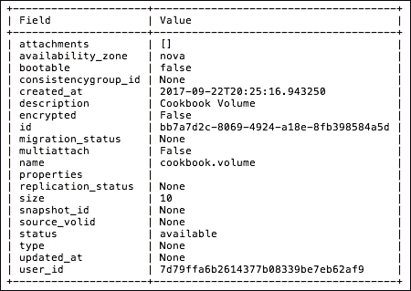

## 它是如何工作的...

创建卷非常简单。使用 `openstack` 客户端，我们提供 `volume` 上下文和 `create` 操作，语法如下：

```
openstack volume create
 --size size_GiB
 --description "meaningful description"
 volume_name

```

在这里，`volume_name` 可以是任何不包含空格的任意名称。

由于我们使用的服务器运行 `cinder-volume` 服务，我们可以使用常规的 LVM 工具查看 `cinder-volumes` 上的实际 LVM 卷，如下所示（确保你以 `root` 用户身份登录到我们指定的存储主机服务器）：

```
lvdisplay cinder-volumes

 --- Logical volume ---
 LV Path                /dev/cinder-volumes/volume-bb7a7d2c-8069-4924-a18e-8fb398584a5d
 LV Name                volume-bb7a7d2c-8069-4924-a18e-8fb398584a5d
 VG Name                cinder-volumes
 LV UUID                XqZY27-Ei32-EEdC-3UtE-MR6e-2EKw-XCvIGt
 LV Write Access        read/write
 LV Creation host, time cinder-volume, 2017-09-22 20:25:17 +0000
 LV Status              available
 # open                 0
 LV Size                10.00 GiB
 Current LE             2560
 Segments               1
 Allocation             inherit
 Read ahead sectors     auto
 - currently set to     256
 Block device 
 252:2

```

## 还有更多...

默认情况下，Cinder 卷像物理磁盘一样工作，即它们一次只能附加到一个实例。然而，对于需要磁盘在多个实例之间共享的工作负载，您可以在创建卷时传递 `--multi-attach` 标志，使得该卷可以附加到多个实例：

```
openstack volume create
 --multi-attach
 --description "description"
 --size size_GiB
 volume_name

```

### 提示

**提醒**

该功能相当新，并被视为生产环境中的实验性功能，它并不替代像 NFS 这样的共享存储服务。NFS 支持锁定，允许多个客户端读取和写入同一个挂载点。而多重附加块存储不支持锁定。因此，一个有效的使用场景可能是一个主/从服务的场景，其中数据应仅由一个实例在同一时间写入，但在故障转移时能立即访问数据是有益的。

# 将卷附加到实例

现在我们有了一个可用的磁盘卷，可以将其附加到任何实例。我们将使用 `openstack server volume add` 命令来执行此操作。

## 准备就绪

要将卷附加到实例，您将需要以下内容：

+   `openstack` 命令行客户端

+   一个包含适当凭证的 `openrc` 文件，适用于当前环境

+   要附加的卷的 *名称* 或 *ID*

+   要附加卷的实例的 *名称* 或 *ID*

对于我们的示例，这些值如下：

+   卷：`cookbook.volume`

+   实例：`cookbook.test`

## 如何操作...

执行以下步骤，将卷附加到实例上，使用 `openstack` 客户端：

1.  首先，列出正在运行的实例，以获取我们实例的 ID：

    ```
    openstack server list -c Name -c ID -f table

    ```

    下面是一个示例，展示了我们正在运行的实例 `cookbook.test`：

    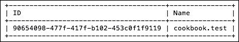

1.  现在列出可用卷，以获取我们卷的 ID：

    ```
    openstack volume list

    ```

    这展示了我们需要的卷信息：

    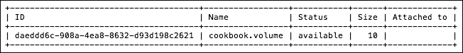

1.  使用*实例*和*卷*的名称或 ID，我们将按照以下方式将卷附加到实例：

    ```
    openstack server add volume
     cookbook.test
     cookbook.volume
     --device /dev/vdc

    ```

    当命令成功执行时，不会输出任何内容。

    请注意，`--device`选项并非始终有效，具体取决于操作系统和镜像类型。执行任何操作之前，始终检查目标实例操作系统为新卷分配了哪个设备。

    ### 提示

    **提示**：在 OpenStack 中，卷或服务器名称不需要唯一；如果卷和服务器名称不唯一，请使用分配的 ID 代替名称。在前面的示例中，这样也能实现相同的目标：

    ```
    openstack server add volume
     90654098-477f-417f-b102-453c0f1f9119
     daeddd6c-908a-4ea8-8632-d93d198c2621
     --device /dev/vdb

    ```

1.  现在我们将在运行中的实例内执行操作。登录到实例并验证卷是否已附加：

    ```
    lsblk

    ```

    这将列出可供我们实例使用的块设备。在这里，我们可以看到我们的卷作为`/dev/vdb`已附加，但尚未挂载：

    ```
    NAME   MAJ:MIN RM  SIZE RO TYPE MOUNTPOINT
    sr0     11:0    1  558K  0 rom
    vda    253:0    0  2.2G  0 disk
    `-vda1 253:1    0  2.2G  0 part /
    vdb    253:16    0  10G   0 disk

    ```

1.  我们应该看到`10G`的空间可供运行中的实例使用。由于这是一个新的卷，就像为系统添加一个全新的磁盘。我们需要先格式化它以供使用，然后将其挂载到文件系统中：

    ```
    sudo mkfs.ext4 /dev/vdb
    sudo mkdir /mnt1
    sudo mount /dev/vdb /mnt1

    ```

    ### 提示

    **提示**：使用 Cinder 创建的卷是持久存储卷；格式化卷（磁盘）只需要执行一次。如果将来需要将此数据卷重新附加到另一个实例，请不要重新格式化该磁盘！

1.  我们现在应该看到新附加的磁盘可用在`/mnt1`：

    ```
    df -h

    ```

    这将显示类似以下的输出：

    ```
    Filesystem Size Used Avail Use% Mounted on
    udev       238M 0    238M  0%   /dev
    tmpfs      49M  1.8M 48M   4%   /run
    /dev/vda1  2.1G 843M 1.3G  41%  /
    tmpfs      245M 0    245M  0%   /dev/shm
    tmpfs      5.0M 0    5.0M  0%   /run/lock
    tmpfs      245M 0    245M  0%   /sys/fs/cgroup
    tmpfs      49M  0    49M   0%   /run/user/1000
    /dev/vdb    9.8G 23M  9.2G   1%   /mnt1

    ```

## 它是如何工作的...

附加一个*新*的 Cinder 卷就像将一个未格式化的 USB 闪存盘插入计算机。当它第一次需要使用时，必须先格式化才能使用。

### 提示

在后续使用此磁盘（将来连接到其他实例时），您无需执行此格式化步骤。

在`openstack`客户端中，`server add volume`选项的语法如下：

```
openstack server add volume
 instance_ID
 volume_ID
 --device /dev/device_ID

```

`instance_ID` 是通过`openstack server list`返回的，我们希望将卷附加到的实例 ID。

`volume_ID` 是通过`openstack volume list`返回的卷 ID。

`device_ID` 是在实例上创建的设备，用于挂载卷。请记住，这个参数有时可以忽略；因此，可以将其视为仅供传递给正在运行的实例的提示。

# 从实例中卸载卷

通常，Cinder 卷一次只能附加到一个实例。因此，您需要先从一个实例卸载卷，再将其附加到另一个实例。要卸载卷，我们将使用另一个 OpenStack 客户端命令，叫做`openstack server remove volume`。

## 准备工作

要从实例中卸载卷，您需要以下内容：

+   `openstack`命令行客户端

+   带有适当凭据的`openrc`文件

+   要卸载的*卷*的名称或 ID

+   要从实例中卸载卷，需要指定*实例*的名称或 ID

对于我们的示例，值如下：

+   卷：`cookbook.volume`

+   实例：`cookbook.test`

+   挂载点：`/mnt1`

## 如何操作...

执行以下步骤以使用 `openstack` 客户端将卷从实例中分离：

1.  列出正在运行的实例，以获取我们实例的 ID：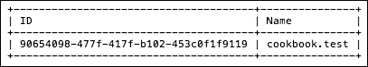

1.  列出我们环境中可用的和`in-use`的卷：

    ```
    openstack volume list

    ```

    这将返回类似以下的输出。请注意，提供的信息显示了卷是否正在使用以及它附加到哪个实例：

    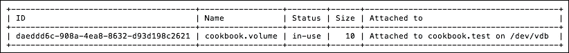

1.  现在我们需要在运行中的实例内部执行操作。连接到此实例并验证该卷是否已挂载：

    ```
    df -h

    ```

    这将显示类似以下的输出：

    ```
    Filesystem Size Used Avail Use% Mounted on
    udev       238M 0    238M  0%   /dev
    tmpfs      49M  1.8M 48M   4%   /run
    /dev/vda1  2.1G 843M 1.3G  41%  /
    tmpfs      245M 0    245M  0%   /dev/shm
    tmpfs      5.0M 0    5.0M  0%   /run/lock
    tmpfs      245M 0    245M  0%   /sys/fs/cgroup
    tmpfs      49M  0    49M   0%   /run/user/1000
    /dev/vdb    9.8G 23M  9.2G   1%   /mnt1

    ```

1.  现在卸载`/mnt1`卷：

    ```
    sudo umount /mnt1

    ```

    （通过再次运行`df -h`来验证是否已卸载）。

1.  退出访客系统后，在 OpenStack 客户端中，使用以下命令将卷从实例中分离：

    ```
    openstack server remove volume cookbook.test c
    ookbook.volume

    ```

1.  此命令在成功时不会产生任何输出，因此请再次查看卷列表以验证该卷已从`cookbook.test`实例中分离：

    ```
    openstack volume list

    ```

    这表明该卷可用且未附加到任何实例：

    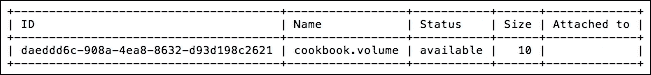

## 它是如何工作的…

从实例中分离 Cinder 卷的步骤类似于从计算机中拔出 USB 硬盘的步骤。首先，我们需要将其从实例中卸载，以便操作系统不会因存储的意外移除而报错。接下来，在`openstack`客户端中，`server remove volume`选项使用以下语法：

```
openstack server remove volume instance_name_or_id volume_name_or_id

```

# 删除卷

在某个时刻，您将不再需要您已创建的卷。为了永久将它们从系统中删除，使它们不再可用，我们只需从 OpenStack 客户端中调用另一个工具——`volume delete`选项。

## 准备工作

删除一个卷，您需要以下内容：

+   `openstack` 命令行客户端

+   一个包含适当凭据的 `openrc` 文件，用于该环境

+   要删除的*卷*的名称或 ID

对于我们的示例，以下是这些值：

+   卷：`cookbook.volume`

### 提示

**警告**：这将删除卷及其上存储的所有数据，请确保这是您希望执行的正确操作，然后再继续。

只能删除未附加到任何实例的卷。

## 它是如何工作的…

使用 OpenStack 客户端删除一个卷，请执行以下步骤：

1.  首先，我们列出可用的卷，以便识别要删除的卷，使用以下命令：

    ```
    openstack volume list

    ```

    这表明该卷可用且未附加到任何实例：

    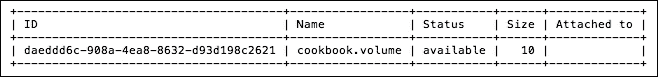

1.  我们现在将使用卷的名称或 ID 删除该卷，使用以下命令：

    ```
    openstack volume delete cookbook.volume

    ```

    ### 提示

    此命令在成功时不会产生输出。

    与附加和分离卷类似，可以使用 ID 或名称。最佳实践是使用 ID 以避免出现差异并删除错误的卷。

## 它是如何工作的…

实际删除卷的方式在很大程度上取决于 Cinder 卷驱动程序。在本章的 *配置 Cinder 卷服务* 配方中，我们使用了 `cinder.volume.drivers.lvm.LVMVolumeDriver`。在这种情况下，删除镜像会将 LVM 卷从我们的系统中移除。

## 还有更多…

OpenStack Cinder 卷可以拍摄快照，在这种情况下，`openstack volume delete` 命令会产生如下错误消息：

```
Invalid volume: Volume status must be available or error or error_restoring or error_extending or error_managing and must not be migrating, attached, belong to a group, have snapshots or be disassociated from snapshots after volume transfer. (HTTP 400) (Request-ID: req-2b82e7fc-0cb4-403f-8dd8-35d99a0f6c6c)

```

要删除一个卷及其所有快照，请在 `openstack volume delete` 命令中传递 `--purge` 标志。

### 提示

小心操作。这是一个单向操作，并且 `openstack volume delete` 命令不会要求确认。此外，命令成功时不会产生任何输出。

# 使用卷快照

Cinder 卷 **快照** 提供了一种非破坏性地复制卷的方法；允许进行原位卷备份。它还启用了更高级的备份功能，并提供了从指定快照或某个时间点启动实例的能力。

在本节中，我们将展示如何创建快照、基于快照挂载卷、刷新快照以及删除指定的快照。

## 准备工作

使用 Cinder 卷快照时，你将需要以下内容：

+   `openstack` 命令行客户端

+   一个带有适当凭据的 `openrc` 文件，用于当前环境

+   要删除的 *卷* 的名称或 ID

## 如何操作…

要创建快照，卷必须首先从实例中分离：

1.  首先，列出你当前的卷：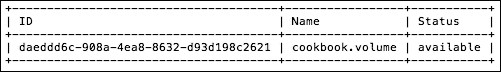

    ### 提示

    如果你希望拍摄快照的卷状态为 `in-use`，你需要使用本章前面 *从实例中分离卷* 的配方中的说明将其分离。

1.  由于我们的卷处于正确的 `available` 状态，我们将继续使用 `openstack volume snapshot create` 命令创建卷的快照：

    ```
    openstack volume snapshot create
     --volume cookbook.volume
     cookbook.snapshot

    ```

    这将产生类似如下的输出，显示 `creating` 状态：

    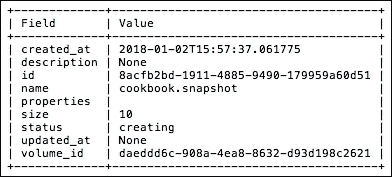

1.  快照完成后，你可以使用本章中的 *将卷附加到实例* 配方重新附加原始卷并继续操作。

1.  如果你将快照作为持续测试/验证过程的一部分，或作为备份方案的一部分，你可能希望使用最新数据更新快照。为此，我们使用 `cinder snapshot-reset-state`，如果成功，命令不会产生任何输出：

    ```
    openstack volume snapshot list -c ID -c Name -c Status -f table
    cinder snapshot-reset-state cookbook.snapshot

    ```

    ### 提示

    请注意使用 `cinder` 命令行工具，而不是 `openstack`。

1.  你不能直接使用快照；要将快照作为卷挂载到实例上，首先需要基于该快照创建一个新的卷。为此，执行以下操作：

    ```
    openstack volume create
     --snapshot cookbook.snapshot
     newcookbook.volume

    ```

    这将产生如下输出。请注意所使用的 `snapshot_id` 和我们未指定大小这一事实：

    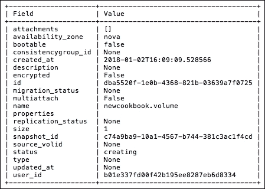

1.  我们可以通过再次查看卷列表来确认基于快照创建的新的食谱卷现在可用：

    ```
    openstack volume list –c Name –c ID –c Status –f table

    ```

    这将生成我们卷及其状态的列表：

    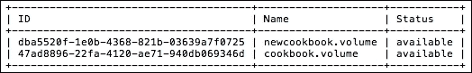

1.  最后，你希望在某个时候删除快照。为此，请使用 `openstack volume snapshot delete` 命令，如下所示：

    ```
    openstack volume snapshot delete cookbook.snapshot

    ```

    使用 `openstack volume snapshot list` 确认剩余的可用快照列表。

## 它是如何工作的…

Cinder 卷快照提供了一种灵活的方式来克隆卷进行快照类型备份、附加到其他实例等。我们在这里使用的 `cinder snapshot` 命令，具体包括 `openstack volume snapshot create`、`openstack volume snapshot list`、`cinder snapshot-reset-state` 和 `openstack volume snapshot delete`，指示 `cinder` 与存储驱动程序一起执行特定的快照操作——创建、列出、更新和删除。快照的具体实现取决于底层驱动程序。

还要注意，你不能直接将快照与实例一起使用。你必须先根据选择的快照创建一个新卷。其语法如下：

```
openstack volume create
 --snapshot snapshot_name_or_id
 new_volume_name

```

# 配置卷类型

Cinder 中的卷类型是一个标签或标识符，在创建卷时选择。通常，卷类型对应卷的某些属性，例如 `SSD`、`High IOPS` 和 `Encrypted`。我们将使用这个与下一个配方一起定义我们 Cinder 服务的更多功能。

## 准备工作

要创建一个卷类型，你需要以下内容：

+   一个具有适当凭证的 `openrc` 文件（你必须是管理员）

+   `openstack` 命令行客户端

+   要创建的卷类型名称。在我们的示例中，我们将创建 `"High IOPS"` 卷类型，作为一个虚构的示例类型，指的是专用于高 IOPS 的块存储设备。

## 如何操作…

我们将使用 `openstack volume type` 命令来操作 Cinder 卷类型。要创建一个卷类型，请按照以下步骤操作：

1.  首先，列出现有的卷类型：

    ```
    openstack volume type list

    ```

    这将返回类似如下的输出。这里我们有安装 LVM 服务时设置的默认值：

    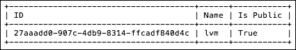

1.  创建新的卷类型：

    ```
    openstack volume type create
     --description "The High IOPS volume type is QOS applied to 500 IOPS"
     "High IOPS"

    ```

    这将返回类似如下的输出：

    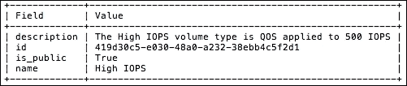

1.  通过显示卷类型列表，确认新卷类型是否可用：

    ```
    openstack volume type list

    ```

    这现在将返回我们额外的卷类型：

    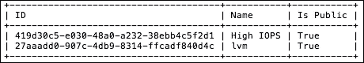

1.  在创建卷时使用这个新类型，我们将使用 `--type` 标志，如下所示：

    ```
    openstack volume create
     --size 10
     --type "High IOPS"
     --description "High IOPS Volume"
     highiops.volume

    ```

1.  我们将在输出中验证类型：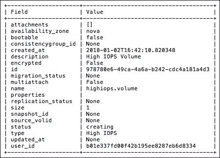

## 它是如何工作的…

`openstack volume type create` 命令只有一个必填参数，`name`。`name` 参数允许用户定义不同的卷类型或标识符。虽然通常基于存储的某些属性，如部门、存储后端或 QOS 水平，但由于这些只是标签，只要它们易于理解，名称可以是任意的。

此外，`--description` 标志可以用来提供有关卷类型的更多细节。`--private` 标志允许你限制公共访问。`--project` 标志允许选择性地与其他命名项目共享私有卷类型。

然后，我们将利用这些类型（通过进一步配置 Cinder 来指定与特定卷类型相关联的存储类型），通过在 `volume create` 命令中使用 `--type` 标志来实现：

```
openstack volume create
 --size size_GiB
 --description "meaningful description"
 --type "Type"
 volume_name

```

# 启用卷加密

Cinder 可以管理卷的 **加密**，并且加密对客户机是透明的。加密在 *卷类型* 级别启用。

## 准备工作

加密可以在创建新的卷类型时启用，也可以添加到没有卷正在使用的现有卷类型中。要启用卷加密，你将需要以下内容：

+   一个包含适当凭证的 `openrc` 文件

+   `openstack` 命令行客户端

+   *卷类型* 的名称

+   *加密提供者* 的名称

+   加密控制位置

+   加密密钥大小

+   加密算法

对于我们的示例，以下内容将是：

+   名称：`Cookbook Encrypted Volumes`

+   加密提供者：`nova.volume.encryptors.luks.LuksEncryptor`

+   加密控制位置：`front-end`

+   加密密钥大小：`256`

+   加密算法：`aes-xts-plain64`

### 注意

你选择的加密特定值将基于你所在环境中可用的内容。本书不讨论这些值的详细内容。

## 如何操作…

要启用卷加密作为新的卷类型，使用以下命令：

```
openstack volume type create
 --description "LUKS Encrypted volumes"
 --encryption-provider nova.volume.encryptors.luks.LuksEncryptor
 --encryption-control-location front-end
 --encryption-key-size 256
 --encryption-cipher aes-xts-plain64
 "Encrypted"

```

然后，我们将在创建卷时使用这个 `"Encrypted"` 卷类型，具体如下：

```
openstack volume create
 --size 1
 --type "Encrypted"
 --description "An encrypted volume"
 encrypted.volume

```

## 它是如何工作的…

卷通过卷类型进行配置，因此，额外的参数会传递给 `openstack volume type create`：

+   `--encryption-provider` 标志告诉 Cinder 哪个提供者将执行加密。与存储后端类似，提供者有多种可选项。请参阅 OpenStack 文档获取当前的提供者列表。

+   `--encryption-control-location` 参数告诉 Cinder 加密将在哪里处理。在我们的例子中，`front-end` 表示 Nova 将处理加密。

+   接下来，`--encryption-key-size` 参数指定所用密钥的大小。为了避免影响实验性能，示例中选择了 `256`。你选择的加密提供者和密码算法将提供具体的建议。

+   最后，`--encryption-cipher` 指定使用哪个加密算法。你可以使用 `cryptsetup benchmark` 来获取可用选项的列表，并了解它们的性能。

# 配置卷的服务质量 (QoS)

Cinder 提供的另一个功能是能够为卷定义和管理服务类别。与卷加密类似，Cinder 中的 **服务质量** (**QoS**) 是通过卷类型进行配置的。默认情况下，你可以定义最小、最大和突发 IOPS 值。

## 准备工作

要配置卷的 QoS，您需要以下信息：

+   一个包含适当凭据的 `openrc` 文件（您需要是管理员）

+   `openstack` 命令行客户端

+   *卷类型*的名称或 ID

+   QoS 策略的 *消费者*

+   以下值：

    +   最小 IOPS

    +   最大 IOPS

    +   突发 IOPS

    ### 注意

    要定义一个最小的 QoS 策略，只需提供三项中的一个（最小、最大和突发）。

对于我们的示例，值如下所示：

+   名称：`High IOPS`

+   消费者：`both`

+   最大 IOPS：`500`

## 如何操作…

为了使 Cinder 卷使用 QoS，管理员需要执行两个步骤：首先定义规范，其次将规范与卷类型关联。

要创建并分配 QoS 规范，请使用以下步骤：

1.  首先，列出现有的 QoS 规范：

    ```
    openstack volume qos list --print-empty

    ```

    目前我们没有定义任何 QoS：

    

1.  定义一个新的 QoS 规范，内容如下：

    ```
    openstack volume qos create
     --consumer both
     --property maxIOPS=500
     "High IOPS"

    ```

    这将返回以下输出：

    

1.  通过列出可用的 QoS 来确认我们创建的 QoS 规范：

    ```
    openstack volume qos list -c Name -c Consumer -c Properties -f table

    ```

    这将返回以下输出：

    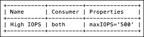

1.  我们现在将策略与卷类型关联，如下所示：

    ```
    openstack volume qos associate "High IOPS" "High IOPS"

    ```

    ### 注意

    成功时，此命令不会产生任何输出。

## 它是如何工作的…

QoS 规范在 Cinder 中使用 `openstack volume qos` 一组命令进行定义。创建 QoS 规范时，可以指定 QoS 应用的位置以及设置的值。目前，您可以指定一组静态的最小、最大和突发 IOPS，以及一个可伸缩的 IOPS 集合。

静态值分解如下：

+   **最小 IOPS**：这是保证分配给卷的 IOPS 数量

+   **最大值**：这是卷的 IOPS 上限

+   **突发 IOPS**：这是短时间内的最大 IOPS

伸缩 IOPS 时，定义每增加一个千兆字节的卷大小，静态值的变化量。

# 重置卷状态

在 OpenStack 云的持续运行过程中，您偶尔会遇到 Cinder 卷卡在某个奇怪状态的问题。在写这章内容时，作者遇到了多个卷在实例从它们启动失败后卡在 `attaching` 状态的情况。以下是该情况的表现：

```
openstack volume list -c Name -c Status -f table

```

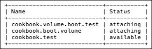

### 注意

这次错误是因为在创建从卷启动部分时，手误造成的！

## 准备就绪

要重置 Cinder 卷的状态，您需要以下内容：

+   一个包含适当凭据的 `openrc` 文件

+   `openstack` 命令行客户端

+   `cinder` 命令行客户端

+   卷的 *名称* 或 *ID*

对于以下示例，我们将重置以下卷为可用状态：

+   `cookbook.boot.volume`

+   `cookbook.volume.boot.test`

## 如何操作…

重置 Cinder 卷的状态是通过`cinder`命令完成的。这里的`openstack`命令集覆盖了大多数您常用的操作，而`cinder`命令则提供了额外的管理员功能，如`reset-state`。

### 提示

由于`reset-state`命令仅操作数据库，不考虑实际状态，因此在使用时应谨慎。

要重置 Cinder 卷的状态，请执行以下步骤：

1.  首先，列出你的 Cinder 卷及其状态

    ```
    openstack volume list -c Name -c Status -f table

    ```

    这将列出 OpenStack 所知道的卷：

    

1.  使用`cinder`客户端重置卷的状态：

    ```
    cinder reset-state 23e1e006-a753-403c
    -ad8f-27e98444f71e --state available
    cinder reset-state e934c45f-6e2f-431f-8457-7e84f6cee876 --state available

    ```

    ### 注意

    当成功时，此命令不会产生任何输出。

1.  确认新的状态：

    ```
    openstack volume list -c Name -c Status -f table

    ```

    这将显示状态已重置为`available`：

    

## 它是如何工作的…

`cinder reset-state`命令直接操作`cinder`数据库，而不考虑卷的实际状态。我们使用的`--state`标志允许我们更改可能卡在特定状态中的卷的状态。还有两个附加标志，分别允许您更改附件状态和迁移状态：

```
cinder help reset-state
usage: cinder reset-state
 [--type ]
 [--state ]
 [--attach-status ]
 [--reset-migration-status]
 [ ...]

```

该工具显式地更新`cinder`数据库中的实体状态。由于它仅涉及数据库更改，因此不会影响实体的真实状态，可能与实际状态不符。在更改为`available`状态时，这可能导致实体无法使用。
