# 第八章. Swift – OpenStack 对象存储

本章我们将覆盖以下主题：

+   介绍 – OpenStack 对象存储

+   创建对象容器

+   删除对象容器

+   上传对象

+   上传大对象

+   下载对象

+   删除对象

+   容器 ACL

# 介绍 – OpenStack 对象存储

OpenStack 对象存储，也称为 **Swift**，是一个允许在商品硬件上进行大规模可扩展和高度冗余存储的服务。该服务由 Rackspace 实现，名为 Cloud Files，也类似于 Amazon 的 S3 存储服务，并在 OpenStack 下以类似方式进行管理。通过 OpenStack 对象存储，我们可以存储许多几乎无限大小的对象—仅受限于可用硬件—并根据需要扩展环境以适应我们的存储需求。OpenStack 对象存储的高度冗余特性非常适合用于归档数据（例如日志和备份归档），同时也为 OpenStack Compute 提供了一个存储系统，可用于虚拟机实例镜像。

OpenStack 对象存储的架构是直接而简单的。API 服务运行在控制节点上。然后是 Swift 代理服务，这些服务可以部署到控制节点上，也可以根据需求分布到独立的服务器上，之后是实际存储数据的存储节点。这些存储节点是为随着存储需求增长而进行扩展而设计的服务器。

### 注意

扩展 Swift 的特性和设计超出了本书的范围。

这里展示了一个典型的简化架构视图：

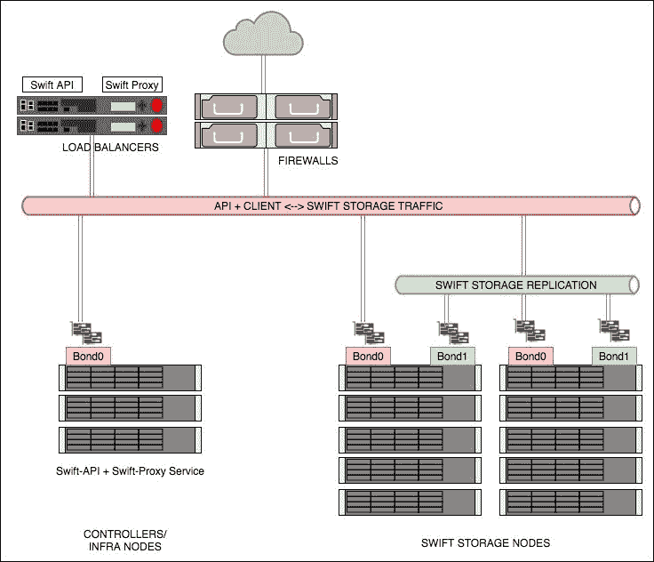

本质上，上传或下载对象等请求是通过负载均衡池发送到 API 的，然后数据通过 `Swift-Proxy` 服务传送到物理存储节点。`Swift-Proxy` 服务会从终端用户那里获取数据，并将其存储进出。

正如名称所示，OpenStack 对象存储基于所谓的对象操作。对象可以是任何东西，从文件到一个名为完整文件夹和文件名的对象——对 OpenStack 对象存储来说，不管是什么文件名，所有它看到的内容都只是一个单一的对象。对象被存储在 **容器** 中。一个很好的类比是桶。在桶里，你可以存放任何适合其中的东西，从沙粒到你放在棚子里的工具！

# 创建对象容器

要开始使用 OpenStack 对象存储，我们必须首先创建一个**容器**。在这里，容器类似于 Windows 或 Linux 文件目录中的文件夹。然而，容器不能嵌套，尽管在上传存储在这些容器中的对象时，我们可以通过容器和对象名称（伪文件夹）的组合方式创建类似嵌套文件夹结构的深层结构。我们分配给容器和对象的名称类似于标签，允许我们通过在这些标签中使用`/`字符来将其解释为文件夹结构。

## 准备就绪

请确保您已登录到正确配置的 OpenStack 客户端，如第二章，*OpenStack 客户端*，中所述，并且可以作为具有`swiftoperator`权限的用户访问 OpenStack 环境。

我们将使用在第二章，*OpenStack 客户端*中创建的`developer`用户，并使用`cookbook4`密码；我们还授予此用户`swiftoperator`权限。

### 提示

参考第二章，*OpenStack 客户端*，获取有关设置环境以使用 OpenStack 命令行客户端的详细信息。

## 如何操作…

要在我们的环境中创建一个 Swift `容器`，请按照以下步骤操作：

1.  要创建一个容器，请执行以下命令：

    ```
    openstack container create books

    ```

1.  创建容器后，您将看到以下输出：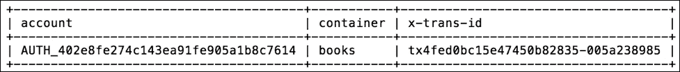

1.  要查看所有可用的容器，请输入以下命令：

    ```
    openstack container list

    ```

    这将返回类似以下的输出：

    

1.  一旦容器创建完成，我们可以通过执行以下命令设置附加的详细信息或**元数据**：

    ```
    openstack container set books --property title=cookbooks

    ```

1.  要查看容器详细信息，请输入以下命令：

    ```
    openstack container show books

    ```

    这将返回以下输出：

    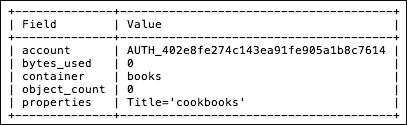

1.  如引言中所述，我们分配给容器和对象的名称很像标签；因此，要在容器中创建一个伪文件夹，请在容器名称中使用`/`分隔符：

    ```
    openstack container create books/chapter1

    ```

    这将返回类似以下的输出：

    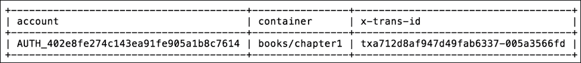

1.  要查看伪文件夹的详细信息，请通过包含完整的伪文件夹名称执行`container show`命令：

    ```
    openstack container show books/chapter1

    ```

    这将提供类似以下的信息：

    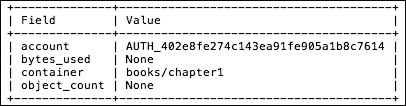

## 它是如何工作的…

在 OpenStack 对象存储中，具有`admin`或`swiftoperator`权限的用户可以使用对象存储服务。为此，我们首先必须创建**容器**，其中将存储对象。容器不能嵌套，但我们可以使用`/`分隔符在容器名称中创建伪文件夹。要创建容器，请遵循以下命令行语法：

```
openstack container create container_name

```

要列出可用容器，请使用以下命令：

```
openstack container list

```

我们还可以在每个容器上设置元数据。使用以下命令为容器设置附加信息：

```
openstack container set container_name
 --property key=value

```

可以在每个容器上设置多对元数据。

要查看容器详细信息，请执行以下命令：

```
openstack container show <container_name>

```

# 删除对象容器

删除 OpenStack 对象存储容器非常简单。只要它们为空，任何容器都可以被删除。

### 注意

在此情况下，OpenStack CLI 与 Swift CLI 工具的行为不同。Swift CLI 将删除包括所有内容在内的容器，而 OpenStack CLI 则不会。在本示例中，我们使用的是 OpenStack CLI。

## 准备就绪

确保您以正确配置的 OpenStack 客户端登录，并作为具有 `swiftoperator` 特权的用户访问 OpenStack 环境。我们将使用在 第二章 的 *Common OpenStack identity tasks* 配方中创建的 `developer` 用户，密码为 `cookbook4`。我们还为该用户授予了 `swiftoperator` 特权。

详细设置环境以使用 OpenStack 命令行客户端，请参阅 第二章 的 *OpenStack 客户端*。

## 如何操作…

要在我们的环境中删除 Swift 容器，请执行以下步骤：

1.  首先，列出可用容器：

    ```
    openstack container list

    ```

    这将显示如下输出：

    

1.  查看容器详细信息，确保它为空：

    ```
    openstack container show books

    ```

    这将显示如下输出：

    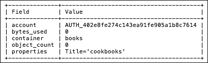

1.  现在使用以下命令删除容器：

    ```
    openstack container delete books

    ```

    ### 注意

    此命令不会输出任何内容。

## 工作原理…

在 OpenStack 对象存储中，用户可以删除空容器。首先，我们必须确保容器为空，方法是查看其详细信息：

```
openstack container show container_name

```

然后，使用以下命令删除容器：

```
openstack container delete container_name

```

验证容器是否已删除，方法是列出可用容器：

```
openstack container list

```

# 上传对象

一旦我们创建了一个或多个容器，就可以开始向其中上传对象。虽然 OpenStack 对象存储不支持嵌套容器，但我们可以通过对象名称模拟文件夹或文件目录。这与我们在容器名称中使用伪文件夹的类似结构，并且都能实现用户期望的对象存储使用树形结构的最终目标。

## 准备就绪

确保你已登录到配置正确的 OpenStack 客户端，并且作为具有 `swiftoperator` 权限的用户可以访问 OpenStack 环境。我们将使用在第二章，*OpenStack 客户端*，中创建的 `developer` 用户，密码为 `cookbook4`；我们也已经授予该用户 `swiftoperator` 权限。

请参阅第二章，*OpenStack 客户端*，了解如何设置环境以使用 OpenStack 命令行客户端。

## 如何操作…

要将对象上传到 OpenStack 对象存储容器，请按照以下步骤操作：

1.  我们将把 `intro.txt` 文件上传到 `books` 容器中：

    ```
    openstack object create books intro.txt

    ```

    这将产生以下输出：

    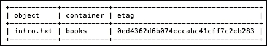

1.  通过提供容器名称来列出容器中的对象：

    ```
    openstack object list books

    ```

    这将产生如下输出：

    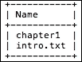

    ### 注意

    这里的 `chapter1` 是我们在 *创建对象容器* 章节中创建的*伪文件夹*，它显示为一个对象。

1.  我们可以通过以下方式将对象上传到名为 `books/chapter1` 的伪文件夹中：

    ```
    openstack object create books/chapter1 swift.txt

    ```

    这将产生如下输出：

    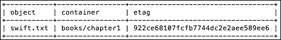

1.  要列出容器中的对象，请对容器名称执行以下操作：

    ```
    openstack object list books

    ```

    这将列出该容器下可用的对象：

    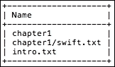

1.  要列出伪文件夹容器中的所有对象，请使用 `prefix` 标志：

    ```
    openstack object list books --prefix chapter1/

    ```

    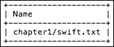

    ### 提示

    你可以使用 `--prefix` 来列出以指定前缀字母开头的任何对象。

1.  要列出容器中的所有顶级对象，请使用**分隔符**标志。在此示例中，分隔符为 `/`：

    ```
    openstack object list books --delimiter /

    ```

    

1.  要显示有关对象的信息，请执行以下命令：

    ```
    openstack object show books chapter1/swift.txt

    ```

    这将显示该对象的信息：

    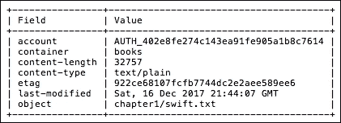

## 它是如何工作的…

为了将文件存储到 OpenStack 对象存储中，**对象**必须上传到一个**容器**中。容器不能嵌套；然而，可以使用 `/` 分隔符创建伪文件夹或伪目录。一旦容器创建完成，你可以使用以下命令上传文件：

```
openstack object create container_name object_1 [object_2 …]

```

### 提示

可以通过一条命令上传多个对象。

要列出上传到容器中的对象，请执行以下命令：

```
openstack object list container_name

```

列出容器中的对象时，启用 `--prefix` 和 `--delimiter` 标志进行过滤。

### 注意

默认情况下，将列出最多 10,000 个对象。使用分页或 `--all` 标志查看超过默认数量的对象。

要查看单个对象的详细信息，请使用以下命令：

```
openstack object show container_name object_name

```

### 注意

在 Swift 中，常规对象的大小有限制。默认情况下，只有 5 GB 或更小的对象可以通过 `openstack object create` 命令上传。有关如何上传大型对象的详细信息，请参考*上传大型对象*配方。

# 上传大型对象

每个 OpenStack 对象存储集群都有一个上传对象大小的限制。通常，该限制为 5 GB，尽管每个集群可以有自己的限制。然而，这并不意味着你只能上传 5 GB 或更小的对象到 OpenStack 对象存储。Swift 通过已经配置和部署的中间件提供大对象支持，通过将大对象拆分成较小的部分来实现。有两种类型的大对象支持：动态和静态。

## 准备就绪

确保你已经登录到正确配置的 OpenStack 客户端，并且可以作为具有 `swiftoperator` 权限的用户访问 OpenStack 环境。我们将使用在*公共 OpenStack 身份任务*配方中创建的 `developer` 用户，该用户的密码为 `cookbook4`，同时我们也授予该用户 `swiftoperator` 权限。

由于 OpenStack CLI 没有通过单独的 OpenStack 项目客户端提供所有必要的功能，我们需要使用 Swift CLI 来完成本配方。请确保你已安装 Swift 命令行客户端。如果没有，请安装：

```
pip install python-swiftclient

```

## 如何操作..

要将大型对象上传到 OpenStack 对象存储容器，请按照以下步骤操作：

1.  首先，我们可以使用以下命令列出可用的容器：

    ```
    swift list

    ```

    这会给出我们拥有的容器列表：

    ```
    books

    ```

1.  要上传一个大型文件，我们将使用 `–S` 标志指定对象的*分段大小*，单位为*字节*：

    ```
    swift upload -S 25000 books nova.txt

    ```

    这将显示对象被拆分为**分段**的输出：

    ```
    nova.txt segment 1
    nova.txt segment 0
    nova.txt segment 5
    nova.txt segment 2
    nova.txt segment 3
    nova.txt segment 4
    nova.txt

    ```

    在这个例子中，分段大小为 25000 字节，我们的 128 K `nova.txt` 文件在上传到 Swift 集群之前被拆分成了 6 个分段。

1.  通过列出容器中可用的对象，验证文件是否已上传：

    ```
    swift list books

    ```

    这显示了我们可用的 `nova.txt` 文件：

    ```
    nova.txt

    ```

    尽管文件被拆分成 6 个部分进行上传，但它在 Swift 的 `books` 容器中显示为一个文件。这些分段会在一个新的容器中单独列出。

1.  要查看可用的容器，请执行以下命令：

    ```
    swift list

    ```

    这会为我们提供容器，并自动创建一个新的容器：

    ```
    books
    books_segments

    ```

    你会注意到一个新的 `books_segments` 容器已经自动创建。

1.  列出 `books_segments` 容器中的对象，以查看单个对象：

    ```
    swift list books_segments

    ```

    这显示了我们分段的文件对象：

    ```
    nova.txt/1512361523.073429/131024/25000/00000000
    nova.txt/1512361523.073429/131024/25000/00000001
    nova.txt/1512361523.073429/131024/25000/00000002
    nova.txt/1512361523.073429/131024/25000/00000003
    nova.txt/1512361523.073429/131024/25000/00000004
    nova.txt/1512361523.073429/131024/25000/00000005

    ```

    ### 注意

    请勿单独修改或删除这些对象。

1.  使用 `stat` 命令查看 `books` 容器中已上传对象的详细信息：

    ```
    swift stat books nova.txt

    ```

    这提供了有关 `books` 容器中 `nova.txt` 文件的详细信息：

    ```
     Account: AUTH_402e8fe274c143ea91fe905a1b8c7614
     Container: books
     Object: nova.txt
     Content Type: text/plain
     Content Length: 131024
     Last Modified: Sun, 17 Dec 2017 06:36:32 GMT
     ETag: "cd0ef1b80a6261f0b6b7db9efa739938"
     Manifest: books_segments/nova.txt/1512361523.073429/131024/25000/Meta Mtime: 1512361523.073429
     Accept-Ranges: bytes
     X-Timestamp: 1513492591.13264
     X-Trans-Id: tx4fa6e7a4e53a459a86430-005a3611ad
    X-Openstack-Request-Id: tx4fa6e7a4e53a459a86430-005a3611ad

    ```

    查看提供的信息中的 `manifest` 字段。`manifest` 字段将包括为各个段创建的 `container` 详细信息、原始文件大小以及段的大小。

## 它是如何工作的

由于 OpenStack CLI 在编写本食谱时不支持大文件上传，我们将使用 Swift 命令行客户端。为了将大文件存储到 OpenStack 对象存储中，必须先将对象拆分或分段，然后再上传到容器中。这一分段过程通过在 `swift upload` 命令中指定 `-S` 标志来完成：

```
swift upload -S size_in_bytes container large_object

```

在上传大文件时，Swift 会自动为上传对象的各个段创建一个新的容器和伪文件夹。各个段可以像常规对象一样列出；但是，请勿直接操作它们。

# 下载对象

一旦对象上传到容器中，你可能还想下载它们。在本食谱中，我们将向你展示如何将对象下载到本地磁盘。

## 准备工作

确保你已经登录到正确配置的 OpenStack 客户端，并且能够以具有 `swiftoperator` 权限的用户身份访问 OpenStack 环境。我们将使用在第二章 *OpenStack 客户端* 任务中创建的 `developer` 用户，并使用 `cookbook4` 密码。我们还为该用户授予了 `swiftoperator` 权限。

参见第二章 *OpenStack 客户端*，了解如何设置你的环境以使用 OpenStack 命令行客户端。

## 如何操作…

要从 Swift 集群下载对象，请执行以下步骤：

1.  列出容器中的可用对象：

    ```
    openstack object list books

    ```

    这将列出我们在 `books` 容器中的对象：

    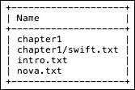

1.  要下载所需的文件，例如 `intro.txt`，请执行以下命令：

    ```
    openstack object save books intro.txt

    ```

    ### 注意

    此命令没有输出。文件将保存到当前目录。

1.  我们还可以下载文件并指定目标文件：

    ```
    openstack object save books nova.txt --file /tmp/nov
    a.txt

    ```

## 它是如何工作的…

为了从 OpenStack 对象存储中下载文件，请执行以下命令：

```
openstack object save container object --file file_name

```

`--file` 标志是可选的。如果未指定，将把对象保存到当前目录。

### 注意

下载大对象时不需要特别处理；同样的命令可以用于大对象和小对象。

# 删除对象

从 OpenStack 对象存储删除对象相当简单，无论是小文件还是大文件。

## 准备工作

确保你已经登录到正确配置的 OpenStack 客户端，并且能够以具有 `swiftoperator` 权限的用户身份访问 OpenStack 环境。我们将使用在第二章，*The OpenStack Client* 中的 *Common OpenStack identity tasks* 配方中创建的 `developer` 用户，密码为 `cookbook4`。我们也已授予该用户 `swiftoperator` 权限。

请参考第二章，*The OpenStack Client*，了解如何设置环境以使用 OpenStack 命令行客户端。

## 如何操作…

要从 Swift 集群中删除对象，请执行以下步骤：

1.  列出容器中可用的对象：

    ```
    openstack object list books

    ```

    这将列出我们 `books` 容器中的对象：

    

1.  从容器中删除对象：

    ```
    openstack object delete books intro.txt

    ```

    ### 注意

    此命令不会输出任何内容。

1.  删除对象后的 `books` 容器中的对象列表：

    ```
    openstack object list books

    ```

    容器列表将显示 `intro.txt` 不再存在：

    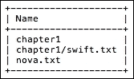

1.  要删除 *所有对象* 并 *随后删除容器*，请执行以下命令：

    ```
    openstack container delete -r books

    ```

    ### 注意

    此命令不会输出任何内容。

## 工作原理

为了从 OpenStack 对象存储集群中删除文件，请使用以下命令指定应删除的容器和对象：

```
openstack object delete container object

```

使用 `-r` 标志来删除容器及其所有内容。

# 容器 ACL

OpenStack 对象存储容器通常由创建它们的用户拥有。然而，通过 Swift 的 **ACLs**（**访问控制列表**），可以使容器对不同的 OpenStack 用户可访问，或者完全公开。容器的拥有者可以设置特定的读写规则。这些读写规则必须单独设置，并且必须在每个容器上明确启用。容器的拥有者可以将容器设置为完全公开，或根据项目、用户或规则集设置规则。

## 准备工作

确保你已经登录到正确配置的 OpenStack 客户端，并且能够以具有 `swiftoperator` 权限和 `admin` 权限的用户身份访问 OpenStack 环境。我们将使用在第二章，*The OpenStack Client* 中的 *Common OpenStack identity tasks* 配方中创建的 `developer` 用户，密码为 `cookbook4`。我们也已授予该用户 `swiftoperator` 权限。

由于 OpenStack CLI 并未提供所有通过各个 OpenStack 项目客户端可用的功能，因此我们需要使用 Swift CLI 来执行此配方。确保你已经安装了 Swift 命令行客户端。如果没有，请安装：

```
pip install python-swiftclient

```

## 如何操作…

要查看和修改容器上的 ACL，请按照以下步骤操作：

1.  首先，查看容器上的现有 ACL（如果有的话）：

    ```
    swift stat books

    ```

    这将提供关于我们名为 `books` 的容器的信息：

    ```
     Account: AUTH_402e8fe274c143ea91fe905a1b8c7614
     Container: books
     Objects: 3
     Bytes: 32764
     Read ACL:
     Write ACL:
     Sync To:
     Sync Key:
     Accept-Ranges: bytes
     X-Storage-Policy: default
     Last-Modified: Mon, 18 Dec 2017 06:09:45 GMT
     X-Timestamp: 1512278405.11522
     X-Trans-Id: tx484e741deb754fdb86f7a-005a375e4c
     Content-Type: text/plain; charset=utf-8
    X-Openstack-Request-Id: tx484e741deb754fdb86f7a-005a375e4c

    ```

1.  在我们的示例中，还没有设置读或写的 ACL。让我们设置一个 `read` ACL 使 `books` 容器 *公开*：

    ```
    swift post books --read-acl ".r:*,.rlistings"

    ```

    ### 注意

    此命令没有输出。

1.  要使 `books` 容器对所有人 *可写*，请执行以下操作：

    ```
    swift post books --write-acl "*:*"

    ```

    ### 注意

    此命令没有输出。

1.  现在再次使用 stat 命令检查 `books` 容器的详细信息：

    ```
    swift stat books

    ```

    我们可以看到 `Read ACL` 和 `Write ACL` 字段已经被填充：

    ```
     Account: AUTH_402e8fe274c143ea91fe905a1b8c7614
     Container: books
     Objects: 3
     Bytes: 32764
     Read ACL: .r:*,.rlistings
     Write ACL: *:*
     Sync To:
     Sync Key:
     Accept-Ranges: bytes
     X-Trans-Id: txc0d0d64ed54e48989f3f6-005a3760ba
     X-Storage-Policy: default
     Last-Modified: Mon, 18 Dec 2017 06:22:56 GMT
     X-Timestamp: 1512278405.11522
     Content-Type: text/plain; charset=utf-8
    X-Openstack-Request-Id: txc0d0d64ed54e48989f3f6-005a3760ba

    ```

1.  由于操作 *世界可写* 和 *可读* 容器并不是一个很好的安全做法，我们可以从容器中删除 ACL。要删除 *读* ACL，可以执行以下命令：

    ```
    swift post -r "" books

    ```

1.  要删除 *写* ACL，请使用此命令：

    ```
    swift post -w "" books

    ```

1.  如果你需要与 OpenStack 环境中的其他用户共享容器，可以基于 *项目* 和 *用户* 设置权限。在我们的示例中，我们将设置 `books` 容器的访问权限，使 `admin` 项目中的所有人都可以读取：

    ```
    swift post -r "admin:*" books

    ```

    `:` 后面的星号（`*`）表示 `admin` 项目中的所有用户都可以访问 `books` 容器。

1.  现在检查 `books` 容器的详细信息：

    ```
    swift stat -v books

    ```

    这将产生如下输出：

    ```
     URL: http://172.29.236.100:8080/v1/AUTH_402e8fe/books
     Auth Token: gAAAAABaODQ8R93x7kW46CW_u9ZS3 
     Account: AUTH_402e8fe274c143ea91fe905a1b8c7614
     Container: books
     Objects: 3
     Bytes: 32764
     Read ACL: admin:*
     Write ACL:
     Sync To:
     Sync Key:
     Accept-Ranges: bytes
     X-Trans-Id: tx20b0d0d8394b4b0a81cba-005a38343c
     X-Storage-Policy: default
     Last-Modified: Mon, 18 Dec 2017 21:24:27 GMT
     X-Timestamp: 1512278405.11522
     Content-Type: text/plain; charset=utf-8
    X-Openstack-Request-Id: tx20b0d0d8394b4b0a81cba-005a38343c

    ```

    注意容器详细信息中的 `URL`。任何希望访问此容器的人都需要将 `URL` 字段作为参数传递。

1.  作为 `admin` 用户，测试访问 `books` 容器：

    ```
    swift
     --os-storage-url http://172.29.236.100:8080/v1/AUTH_402e8fe/books list

    ```

    这将提供来自我们共享容器的对象，指定 URL 如下：

    ```
    chapter1
    chapter1/swift.txt
    intro.txt

    ```

    在我们的示例中，`admin` 用户属于 `admin` 项目，因此可以通过 `--os-storage-url` 标志访问 `books` 容器。

## 它是如何工作的…

可以通过设置 *读* 和 *写* **ACL** 来与其他用户共享容器。目前，OpenStack 客户端不支持 ACL 功能，因此我们在示例中使用了 Swift CLI。

容器可以设置两种类型的 ACL，*读* 和 *写*，并且它们需要单独设置。

使用以下命令设置读 ACL：

```
swift post -r "project:user" container

```

按如下方式设置写 ACL：

```
swift post -w "project:user" container

```

在这里，项目和用户都可以用通配符（`*`）来替代。

要使容器完全公开，可以使用以下命令：

```
swift post --read-acl ".r:*,.rlistings" container
swift post --write-acl "*:*" container

```

设置 `.r:*` 和 `.rlistings` 元素后，`books` 容器将公开可访问。`.r*` 元素允许访问容器中的对象，`.rlistings` 允许列出容器的内容。

### 注意

设置写 ACL 为 `"*:*"` 后，容器可以被任何人更新，因此请小心使用。

`-r` 和 `--read-acl` 命令，以及 `-w` 和 `--write-acl` 是相同标志的短形式和长形式。也就是说，`-r` 和 `--read-acl` 可以互换，`-w` 和 `--write-acl` 也可以互换。

一旦启用了其他用户对容器的访问，可以使用以下命令查找容器的 URL：

```
swift stat -v container | grep URL

```

启用访问后，要访问其他用户的容器，请使用此命令：

```
swift --os-storage-url URL list

```

### 提示

如果你始终访问相同的存储 URL，可以将其设置为 `OS_STORAGE_URL` 环境变量。
