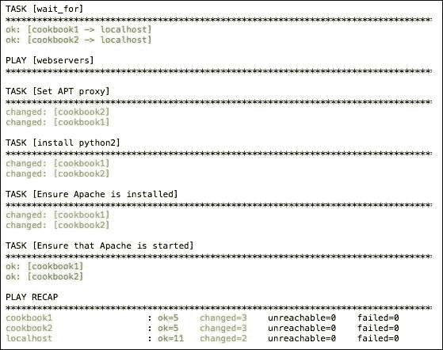

# 第九章：使用 Heat 和 Ansible 进行 OpenStack 编排

本章将涵盖以下主题：

+   介绍 – 使用 OpenStack 进行编排

+   使用 Heat 创建您的第一个堆栈

+   使用 Heat 启动您的堆栈

+   查看通过 Heat 创建的堆栈的资源和输出

+   删除 Heat 堆栈

+   更新 Heat 堆栈

+   安装和配置 Ansible 以用于 OpenStack

+   使用 Ansible 启动实例

+   使用 Ansible 编排软件安装

+   使用 Ansible 在多个实例之间编排软件安装

+   使用 Ansible 完全编排 Web 服务器和负载均衡器堆栈的创建

# 介绍 – 使用 OpenStack 进行编排

OpenStack 被选择作为平台有很多原因，但其中一个经常排在首位的是编排。如果您的 OpenStack 环境没有编排元素，那么您就拥有了一辆强大的涡轮增压赛车，却仅仅用于接送孩子上学。与任何云环境一样，帮助编排工作负载的工具有很多，但 OpenStack 自带 Heat——编排引擎。

使用 Heat，您可以在模板中定义丰富的环境，例如多层 Web 应用程序，这使得用户在启动这些相对复杂的部署时保持一致性。我将 Heat 编排模板（称为 **HOT**（**Heat Orchestration Template**）——明白了吗？）看作是用 **YAML**（**Yet Another Markup Language**）编写的食谱。您定义构成环境的配料。在烹饪食谱中，这将列出制作蛋糕所需的巧克力、面粉和糖的数量。在 HOT 文件中，这就是参数部分。您定义实例的规格、使用的镜像以及实例应该在哪些网络上启动。

像任何好的食谱一样，您可以覆盖这些默认值——所以如果您想尝试用果酱代替巧克力酱，或者调整所需糖分的量——您可以进行调整。此外，在 Heat 中，您是在环境文件中执行此操作。此文件的布局就像您正在为参数分配值。例如，HOT 文件中的输入参数可能是 `image_name`，而在环境文件中，您将 `image_name=ubuntu-image` 进行分配。

HOT 文件中的下一部分是最大的也是最复杂的，因为它是配方的“方法”部分——即“所有配料如何创造一个蛋糕”的部分。在 Heat 中，这是资源部分的开始。资源部分描述了实例之间如何相互作用。例如，在 Heat 运行期间，可能会创建一个包含三个 Web 服务器的负载均衡器。负载均衡器资源将有一个方法，将这三个未知的 Web 服务器附加到负载均衡池中，以便该资源完成。

最后一部分是输出部分。在烹饪食谱中，你会把蛋糕从烤箱中取出。在 OpenStack 中，这将是最终结果——你的多层 Web 应用程序。然而，由于 OpenStack 以及启动多个实例到可能尚未创建网络的环境中的特性，很难知道已经使用了哪些 IP 地址，而这些信息可能是访问已部署堆栈所需要的。因此，为此，我们有了输出部分，OpenStack 的用户可以查询堆栈并获得有用的信息，以便已启动的堆栈可用。

然而，在实例和应用程序生命周期管理方面，我们不仅限于使用 OpenStack 内的 Heat 编排引擎。如第一章 *《使用 Ansible 安装 OpenStack》* 中介绍的，Ansible 是一个平台无关的工具，我们可以利用它来帮助编排任务。通过使用特定于目标环境（如 OpenStack）的 Ansible 模块，我们可以以结构化的方式启动实例并执行软件安装，这种方式适用于 OpenStack 用户和其他云环境的用户。

Ansible 的基本结构非常简单。最基本的形式中，它包括剧本（playbooks）、剧本任务（plays）和任务（tasks）。如果你研究第一章 *《使用 Ansible 安装 OpenStack》* 中描述的 OpenStack-Ansible 剧本，你将获得一些本章未涉及的高级功能的见解，这些功能可以帮助你将基于 OpenStack 的云环境扩展为完全编排的杰作！

# 创建你的第一个堆栈

使用 Heat，我们可以创建各种各样的模板，从启动基本实例，到为应用程序创建完整的环境。在这一部分，我们将通过启动一个实例并将其附加到现有的 Neutron 网络，并为其分配浮动 IP，来展示 Heat 的基础知识。Heat 模板描述了所使用的资源、实例的类型和大小、实例将附加的网络，以及运行该环境所需的其他信息。

在这一部分，我们将展示如何使用 HOT 文件启动两个运行 Apache 的 Web 服务器，并将其连接到第三个运行 HAProxy 的实例上，后者充当负载均衡器。

## 准备工作

确保你已登录到正确配置的 OpenStack 客户端，并能够访问 OpenStack 环境。有关如何设置环境以使用 Heat 的详细信息，请参考第二章 *《OpenStack 客户端》*。

## 如何实现…

在这一部分，我们将下载一个名为 `cookbook.yaml` 的 HOT 文件，该文件将描述我们的实例及其要连接的网络：

1.  首先，我们从 Cookbook GitHub 仓库下载 HOT 文件：

    ```
    wget -O cookbook.yaml 
    https://raw.githubusercontent.com/OpenStackCookbook/OpenStackCookbook/master/cookbook.yaml

    ```

1.  Heat 从命令行或环境文件中获取输入参数，这些参数会传递给模板。这些参数出现在 HOT 文件的顶部，如下所示：

    ```
    parameters:
      key_name:
        type: string
        description: Name of keypair to assign to servers
      image:
        type: string
        description: Name of image to use for servers
      flavor:
        type: string
        description: Flavor to use for servers
      public_net_id:
        type: string
        description: >
          ID of public network for which floating IP addresses will be allocated
      private_net_id:
        type: string
        description: ID of private network into which servers get deployed
      private_subnet_id:
        type: string
        description: ID of private sub network into which servers get deployed
    ```

1.  如图所示，我们在启动这个模板时预计会传入多个参数。通过运行以下命令，确保我们拥有这些详细信息：

    ```
    openstack keypair list
    openstack image list
    openstack flavor list
    openstack network list

    ```

    `openstack network list` 的输出可能如下所示：

    

1.  有了手头的信息后，我们创建一个环境文件，用于存储将在启动堆栈时传递给 HOT 文件的参数。根据之前命令的输出，在与 `cookbook.yaml` 相同的目录下创建 `cookbook-env.yaml` 文件（根据你的环境进行调整）：

    ```
    parameters:
      key_name: demokey
      image: xenial-image
      flavor: m1.tiny
      public_net_id: 2da8979e-dcf8-4eb8-b207-f33bfce4a15a
      private_net_id: 78a5a119-c27a-41c4-8310-5c04d3a6bc31
      private_subnet_id: 3cee2bb9-5673-4a6e-bb1e-8cb66be066b2
    ```

## 它是如何工作的…

Heat Orchestration Templates (HOT) 是描述我们的环境的 YAML 文件，环境也称为“堆栈”（Stacks）。基本模板通常具有以下结构：

+   `description:`

+   `parameters:`

+   `resources:`

+   `outputs:`

`description:` 部分包含了一些词语，帮助用户理解使用模板时预期会发生什么。

`parameters:` 部分定义了输入变量，例如，要使用的镜像类型、要将实例附加到的网络、以及与实例关联的密钥对名称。参数是任意的，可以包含执行模板所需的任何信息。`parameters:` 部分与附带的环境文件中的信息直接配合（如 `--environment` 参数所指定）。每个参数必须要么有默认值，要么在环境文件中指定，以便堆栈能够成功启动。

`resources:` 部分通常是最大的一部分，因为它描述了环境。它可以描述将要使用的实例、实例的命名、需要附加的网络，以及所有元素如何相互关联以及环境是如何协调的。如何编写这些资源的最佳方法超出了本书的范围。

`outputs:` 部分指的是运行堆栈时的“返回”值。例如，用户需要知道如何访问刚刚创建的某个堆栈。随机的 IP 和主机名可以像正常运行堆栈一样被分配，因此，能够查询正确的信息以访问环境是必须的。

# 使用 Heat 启动堆栈

要启动一个 Heat 堆栈，我们需要三样东西：堆栈的 *名称*，描述部署的 *模板*（HOT），以及最后，填补输入参数空白的 *环境文件*。

## 准备就绪

确保您已登录到正确配置的 OpenStack 客户端，并且能够访问 OpenStack 环境。有关如何设置环境以使用 OpenStack 的详细信息，请参考第二章，*OpenStack 客户端*。

### 提示

如果收到`openstack: 'stack' 不是一个 openstack`命令，请参考`openstack --help`。

确保已安装`python-heatclient`包：

`sudo -H pip install python-heatclient`

还要确保您已下载示例`cookbook.yaml` Heat 模板，并根据前面的步骤创建了环境文件。

## 如何操作...

在本节中，我们将下载一个名为`cookbook.yaml`的 HOT 文件，该文件将描述我们的实例及其要连接的网络：

1.  我们将使用以下命令启动堆栈：

    ```
    openstack stack create myStack
     --template cookbook.yaml
     --environment cookbook-env.yaml

    ```

    ### 提示

    **提示**：您可以使用`-t`标志代替`--template`，使用`-e`代替`--environment`。

    这将生成如下输出：

    

1.  要查看堆栈列表，请执行以下命令：

    ```
    openstack stack list

    ```

    这将返回当前运行的堆栈列表：

    

注意**堆栈状态**。成功启动时，状态会标记为**CREATE_COMPLETE**。

## 它是如何工作的...

启动堆栈很简单。我们将使用`--template`参数指定 HOT 文件，然后使用`--environment`参数指定一个文件，该文件中描述了模板中的输入。

语法如下：

```
openstack stack create nameOfStack
 --template template.yaml
 --environment template-env.yaml

```

### 注意

请注意，堆栈名称在您的项目中必须是唯一的。

# 查看使用 Heat 创建的堆栈的资源和输出

堆栈是一个编排的服务集，启动堆栈的用户不需要过多关心分配了哪些 IP 地址。然而，应用堆栈的启动是为了某个目的，因此了解如何访问它非常有用！要访问该环境，用户需要查询堆栈的“输出”，这些输出是模板的一部分。在本示例中，我们关心的是如何访问在 HAProxy 服务器后面运行的网站。HAProxy 服务器已从 GATEWAY_NET 网络分配了一个浮动 IP 地址，假设这是访问该应用程序的方式。

## 准备工作

确保您已登录到正确配置的 OpenStack 客户端，并且能够访问 OpenStack 环境。有关如何设置环境以使用 Heat 的详细信息，请参考第二章，*OpenStack 客户端*。

## 如何操作...

要查看应用堆栈并获取有关如何访问它的信息，请执行以下步骤：

1.  您可以使用以下命令查看堆栈的更多详细信息：

    ```
    openstack stack show myStack

    ```

    这将返回关于创建的堆栈的多个详细信息：

    

1.  模板中的一部分引用了*输出*。输出使得用户可以查询这些值，从而访问正在运行的堆栈。如果没有这个功能，用户就需要深入研究运行中的系统，才能找出分配给堆栈组成实例的 IP 地址。要查看与我们正在运行的堆栈相关联的输出列表，请执行以下命令：

    ```
    openstack stack output list myStack

    ```

    这将返回以下输出：

    

1.  要查看特定的值，比如分配给 HAProxy 实例的公共 IP（*浮动 IP*），我们可以访问通过负载均衡器后面的私有地址运行的站点。要做到这一点，请执行以下命令：

    ```
    openstack stack output show myStack haproxy_public_ip

    ```

    这将返回我们用于访问该特定服务的 IP 地址，该服务设置为一个堆栈：

    

1.  在这个示例应用堆栈中，我们可以使用`http://192.168.100.108/`地址，它会将请求发送到任意正在运行的 Web 服务器，这些服务器是作为 HAProxy 负载均衡器演示的一部分进行配置的。

## 它是如何工作的…

一个堆栈被设计为接受多个输入，执行一些操作，并生成多个运行应用的实例，准备提供服务。然而，这种免操作的方式意味着许多决策都是由 OpenStack 自动决定的——主要是因为这些实例是从启用 DHCP 的子网中提供的。为了了解堆栈的状态以及如何访问堆栈的信息，用户需要查询模板中描述的**输出**。在示例模板中，输出部分如下所示：

```
outputs:
  webserver1_private_ip:
    description: IP address of webserver1 in private network
    value: { get_attr: [ webserver1, first_address ] }
  webserver2_private_ip:
    description: IP address of webserver2 in private network
    value: { get_attr: [ webserver2, first_address ] }
  haproxy_public_ip:
    description: Floating IP address of haproxy in public network
    value: { get_attr: [ haproxy_floating_ip, floating_ip_address ] }
```

包含更多信息的输出标注如下：

+   `webserver1_private_ip`

+   `webserver2_private_ip`

+   `haproxy_public_ip`

在这个教程中，我们特别针对`haproxy_public_ip`进行了设置，因为这是我们访问所创建的 Web 服务的方式。我们执行了以下命令来实现这一点：

```
openstack stack output show myStack haproxy_public_ip

```

# 删除 Heat 堆栈

要删除一个运行中的 Heat 堆栈，我们将按照此教程中的方式发出一个简单的调用。

## 准备就绪

确保您已经登录到正确配置的 OpenStack 客户端，并能够访问 OpenStack 环境。有关如何设置环境以使用 OpenStack，请参阅第二章，*OpenStack 客户端*，其中详细介绍了如何设置您的环境。

## 如何操作...

在本节中，我们将展示如何删除堆栈。

1.  要删除名为`myStack`的运行堆栈，请执行以下命令：

    ```
    openstack stack delete myStack

    ```

1.  系统会提示您确认是否删除，正如下面所示。输入`y`以继续销毁堆栈：

1.  您可以通过列出已创建的堆栈来检查删除状态：

    ```
    openstack stack list

    ```

    如果没有堆栈可显示，或者在删除期间出现以下情况，它将返回一个空列表：

    

## 它是如何工作的...

就像我们可以轻松启动堆栈一样，删除堆栈只需指定我们要销毁的堆栈，并使用`stack delete`命令即可。

如果您希望在不确认的情况下销毁堆栈，请使用以下语法：

```
openstack stack delete nameOfStack -y

```

# 更新 Heat 堆栈

我们的运行堆栈是基于模板的，这允许我们通过更改输入来修改应用程序堆栈。如果我们想更改 flavor 的大小或使用的密钥，可以通过更改输入并发出`stack update`命令来触发堆栈中实例的重建。

## 准备工作

确保您已登录到配置正确的 OpenStack 客户端，并能够访问 OpenStack 环境。有关设置环境以使用 OpenStack 的详细信息，请参阅第二章，*OpenStack 客户端*。

## 如何操作...

在本节中，我们将修改环境文件，将 flavor 从`m1.tiny`更改为`m1.large`。（在继续之前，请确保您有一个有效的 flavor 名称！）

1.  我们首先编辑名为`cookbook-env.yaml`的环境文件，展示我们希望对正在运行的堆栈进行的更改：

    ```
    parameters:
      key_name: demokey
      image: xenial-image
      flavor: m1.large
      public_net_id: 2da8979e-dcf8-4eb8-b207-f33bfce4a15a
      private_net_id: 78a5a119-c27a-41c4-8310-5c04d3a6bc31
      private_subnet_id: 3cee2bb9-5673-4a6e-bb1e-8cb66be066b2
    ```

1.  通过查看资源，确保堆栈正在正常运行：

    ```
    openstack stack show myStack

    ```

    这将返回类似以下的输出：

    

1.  现在，我们将使用更新后的环境文件来修改正在运行的堆栈：

    ```
    openstack stack update myStack --existing

    ```

    ### 提示

    提示：我们使用`--existing`参数，以避免再次指定模板和环境文件。

    这将返回类似以下的输出，显示更新已经开始：

    

1.  完成此操作后，我们还可以查看堆栈的状态，以显示反映的更改：

    ```
    openstack stack show myStack

    ```

    这将返回类似以下的输出（注意 flavor 已从`m1.tiny`更改为`m1.large`）。还请注意，IP 地址没有改变：

    

## 它是如何工作的...

OpenStack Orchestration 服务 Heat 旨在遵循模板为最终用户提供运行中的服务。从头到尾，所有操作都是自动化的。这个关键功能允许我们更新正在运行的堆栈，实际上是通过更新重新部署堆栈，运行完全自动化的流程来恢复服务，使用相同的 IP 地址，但做出所需的更改。

更新堆栈的语法如下：

```
openstack stack update nameOfStack
 --environment updatedEnvironmentFile.yaml
 --template originalStackTemplate.yml

```

在我们的示例中，我们省略了`--environment`和`--template`参数，因为我们直接在最初使用的环境文件中对堆栈进行了所需的更改。这使得语法更简单：

```
openstack stack update nameOfStack --existing

```

# 安装和配置 Ansible 以用于 OpenStack

Ansible 对大多数 Linux 和 macOS 系统的先决条件要求较少。然而，在我们能使用 Ansible 来管理 OpenStack 环境之前，仍有一些步骤需要遵循。

## 准备工作

确保您已登录到正确配置的 OpenStack 客户端，并且可以访问 OpenStack 环境。有关如何设置环境以使用 OpenStack 的详细信息，请参见第二章，*OpenStack 客户端*。

Ansible 2.x 版本需要 Python 2.6 或 2.7。大多数现代 Linux 发行版和 macOS/OS X 都已经安装了这些。如果您能成功执行第二章中描述的`openstack`命令，*OpenStack 客户端*，那么您就可以继续进行。

您可能需要安装 Shade。Shade 是一个与 OpenStack 云交互的简单客户端库。Red Hat 和 CentOS 环境默认未安装此库。可以通过以下命令进行安装：

```
sudo pip install shade

```

### 注意

请注意，Shade 可能会引入其他依赖项，这些依赖项可能会破坏您的环境。建议您使用**虚拟环境**（**venv**）来避免此问题。

## 如何做...

由于我们在客户端计算机上执行此操作，请确保您拥有安装软件的必要权限。准备好后，根据您选择的操作系统执行以下步骤。

### Ubuntu

对于 Ubuntu，我们可以按以下方式使用 Ansible PPA：

1.  首先，确保我们可以通过安装以下工具来添加**PPA**（**个人软件包档案**）：

    ```
    sudo apt-get install software-properties-common

    ```

1.  接下来，我们将添加 PPA：

    ```
    sudo apt-add-repository ppa:ansible/ansible

    ```

1.  最后，我们将运行安装：

    ```
    sudo apt-get update
    sudo apt-get install ansible

    ```

### macOS/OS X（以及那些想使用 pip 的人）

对于 macOS，我们可以按照以下方式使用 pip：

1.  确保`pip`可用：

    ```
    sudo easy_install pip

    ```

1.  接下来，使用`pip`安装 Ansible：

    ```
    sudo pip install ansible

    ```

### 验证安装

要验证安装，请发出以下命令：

```
ansible --version

```

这应该会产生如下输出：


## 它是如何工作的...

为了能够使用 Ansible 管理我们的 OpenStack 环境，我们必须确保已经正确设置了 Ansible。前面的步骤仅帮助我们使用该操作系统提供的工具将 Ansible 安装到我们的客户端上。

# 使用 Ansible 启动实例

使用 Ansible 启动实例是一种方便的平台无关方法。虽然我们需要为 OpenStack 指定如何执行此操作作为特定任务，但 Ansible playbook 可以扩展，使用户能够使用相同的 Ansible 命令在任何云上启动实例。本教程是将 Ansible 与 OpenStack 一起使用的一个非常基础的介绍。

## 准备就绪

确保您已登录到正确配置的 OpenStack 客户端，并且可以访问已安装 Ansible 的 OpenStack 环境。

## 如何做...

Ansible 通过称为 playbook 的任务执行文件来执行任务。在本例中，我们将创建一个简单的任务来启动名为`cookbook1`的特定实例：

1.  第一步是为我们的任务创建 Ansible playbook，该任务将启动我们的实例。在你的客户端创建一个名为`launch-instance.yml`的文件，放在你选择的目录中：

    ```
    - name: Launch instance on OpenStack
      hosts: localhost
      gather_facts: false
      tasks:
      - name: Deploy an instance
        os_server:
           state: present
           name: cookbook1
           image: xenial-image
           key_name: demokey
           timeout: 200
           flavor: m1.tiny
           network: private-net
           verify: false
    ```

1.  一旦描述了这些，我们只需使用`ansible-playbook`命令运行该特定任务，如下所示：

    ```
    source openrc
    ansible-playbook launch-instance.yml

    ```

    这将恢复熟悉的 Ansible 输出，如下所示：

    

    ### 注意

    这是一个`localhost`任务，因此可以忽略警告。

1.  我们可以通过查看服务器列表来验证是否在 OpenStack 中启动了实例，如下所示：

    ```
    openstack server list

    ```

    这将恢复如下所示的输出：

    

请注意，任务自动从`GATEWAY_NET`网络分配了一个公共浮动 IP 地址。这是一个重要细节，因为 Ansible 能做的不仅仅是启动实例。如果我们希望能够安装和配置实例，Ansible 必须能够从客户端通过 SSH 连接到正在运行的实例。私有租户网络通常无法访问；因此，Ansible 将使用公共路由网络来访问实例，就像你通过 SSH 连接到它一样。

## 工作原理...

使用 Ansible 启动实例使用的是`os_server` Ansible 模块。该模块从 Ansible 2.0 版本开始可用。`os_server`模块接受许多参数，这些参数描述了使用命令行启动实例时通常会遇到的参数。

请注意，我们在任务中没有指定任何认证细节。这是因为该模块会解释我们的 shell 环境变量，就像我们使用 OpenStack 客户端工具时一样。

你会注意到，任务中的一个条目标明了如下内容：

```
os_server:
  state: present
```

这在 Ansible 中有特定的意图，因为 Ansible 旨在确保任务的状态一致性，无论该任务执行多少次。这个简单的语句基本上表示该实例必须存在。如果不存在，它将启动该实例。一旦实例启动，它将满足该条件。在 Ansible 输出中，你会看到整体运行状态为**ok=1 changed=1**。这意味着它改变了这个环境的状态。换句话说，它启动了实例（这是一种状态变化）。

然而，如果我们再次运行该任务，输出中会出现以下微妙的变化，表明任务不需要执行，因为实例已经“存在”（即，正在运行）：


请注意，任务执行成功，但由于**changed=0**输出的原因，**PLAY RECAP**行中没有需要更改的内容。

## 另请参见

+   访问 [`docs.ansible.com/ansible/latest/os_server_module.html`](http://docs.ansible.com/ansible/latest/os_server_module.html) 获取更多信息

+   对于那些不想通过 `source openrc` 方法将环境变量导入到 playbook 中的用户，可以访问 [`docs.openstack.org/shade/latest/`](https://docs.openstack.org/shade/latest/) 来设置 `clouds.yaml` 云环境文件

# 使用 Ansible 来协调软件安装

使用 Ansible 启动实例并不会为用户提供太多，除了提供一致性，因为 playbook 描述了环境的最终状态：每次用户运行任务时，要么需要启动该特定实例以确保它存在，要么跳过该任务，因为该实例已经在运行。然而，我们可以通过 Ansible 实现更多的功能，而不仅仅是启动虚拟机。在这个食谱中，我们将启动另一个实例，该实例将安装并启动 Apache。

## 准备工作

确保你已经登录到正确配置的 OpenStack 客户端，并且可以访问安装了 Ansible 的 OpenStack 环境。

## 如何操作...

Ansible 执行任务的 playbook。在此示例中，我们将扩展启动特定实例的任务，允许 Ansible 连接到该实例并安装 Apache：

1.  我们通过扩展前面食谱中介绍的 Ansible playbook 来开始，增加了创建*安全组规则*（这是为了确保 Ansible 可以通过端口 `22` 访问实例，并且最终能够通过端口 `80` 访问运行的 Web 服务器）。创建一个名为 `orchestrate-instance.yml` 的文件，内容如下：

    ```
    - name: Launch instances on OpenStack
      hosts: localhost
      gather_facts: false

      tasks:
        - name: Create ansible security group
          os_security_group:
            state: present
            name: ansible
            verify: false
        - name: Create a rule to allow SSH connections
          os_security_group_rule:
            security_group: ansible
            protocol: tcp
            port_range_min: 22
            port_range_max: 22
            remote_ip_prefix: 0.0.0.0/0
            verify: false
        - name: Create webserver security group
          os_security_group:
            state: present
            name: webserver
            verify: false
        - name: Create rule to allow http connections
          os_security_group_rule:
            security_group: webserver
            protocol: tcp
            port_range_min: 80
            port_range_max: 80
            remote_ip_prefix: 0.0.0.0/0
            verify: false
    ```

1.  一旦我们配置了**安全组**，我们就可以确保这些安全组规则包含在**任务**中，该任务用于启动实例。我们还确保包括一个新的条目，名为`register`。这使我们能够设置与该实例关联的变量，然后可以在其他任务中引用该变量。继续编辑此文件并加入以下任务：

    ```
        - name: Deploy an instance
          os_server:
            state: present
            name: cookbook1
            image: xenial-image
            key_name: demokey
            timeout: 200
            flavor: m1.tiny
            network: private-net
            security_groups: default,ansible,webserver
            verify: false
          register: nova_cookbook
    ```

1.  接下来，我们将添加一个任务，将该特定实例添加到一个内部的内存库存中，我们可以在 playbook 后续部分访问该库存。作为这个库存的一部分，我们告诉 Ansible，当访问该库存项时，当 Ansible 想连接到它（通过 `ssh`）时，它将使用特定的 IP 地址（在我们的案例中是公共浮动 IP）。继续编辑文件并添加下一个条目，格式如下所示。由于我们使用的是 YAML，确保每个元素的缩进一致。例如，这个额外的 `- name: Add instance to Inventory` 块必须与前一个 `- name: Deploy an instance` 块在同一列对齐，因为它是同一个 play 的一部分：

    ```
      - name: Add instance to Inventory
        add_host: name=cookbook1 groups=webservers
                  ansible_ssh_host={{ nova_cookbook.server.accessIPv4 }}
    ```

1.  接下来，我们将添加一个新的任务，告诉 Ansible 等待该实例完成启动过程。由于 Ansible 使用 SSH 执行任务，因此合理的做法是仅在 SSH 守护进程运行并接受连接时继续。确保运行 Ansible 任务的私钥与 `key_name:` 中描述的公钥部分匹配。

    ### 提示

    请注意，这是一个新的剧本和任务，因此确保这一条目从行的起始列（列 0）开始。

    ```
    - name: Wait for port 22 to be ready
      hosts: webservers
      gather_facts: False
      tasks:
        - local_action: wait_for port=22 host="{{ ansible_ssh_host }}"  search_regex=OpenSSH delay=10
    ```

1.  这最后一组任务在运行中的实例内执行步骤；下一任务将在该运行中的实例上安装 Apache。Ansible 知道操作这个实例，因为这组任务是对`webservers`主机组执行的。我们在步骤 2 的任务中，在内存中的库存中注册了这个新组。

    ### 注意

    `pre_tasks:` 部分是*可选*的，在所有情况下可能不需要。本书中的示例是使用 Ubuntu 16.04 镜像创建的。Ubuntu 16.04 默认不安装 Python 2，然而这个特定的 Ansible `apt` 模块，最终将安装 Apache，需要执行 Python 2 代码才能正常工作。因此，我们执行一个初始的 `raw` 命令，这个命令不执行任何 Python，而是运行一些 shell 脚本来为我们设置一些东西。如果你正在使用随附的 Vagrant 环境，这个示例也会更加复杂，因为实例没有直接访问互联网的权限。所以，作为 `pre_tasks:` 部分的一部分，我们还配置了一个 APT 代理服务器。

    ```
    - hosts: webservers
      remote_user: ubuntu
      become: yes
      gather_facts: no
      pre_tasks:
        - name: Set APT proxy
          raw: echo "Acquire::http::Proxy \"http://192.168.1.20:3128\";" > /etc/apt/apt.conf
        - name: 'install python2'
          raw: sudo apt-get -y install python-simplejson
      tasks:
        - name: Ensure Apache is installed
          apt: name=apache2 state=latest
        - name: Ensure that Apache is started
          service: name=apache2 state=started
    ```

    ### 提示

    提示：这个剧本也可以在[`raw.githubusercontent.com/OpenStackCookbook/vagrant-openstack/master/orchestrate-instance.yml`](https://raw.githubusercontent.com/OpenStackCookbook/vagrant-openstack/master/orchestrate-instance.yml)找到。

创建此文件后，保存并退出。然后运行以下命令，这将启动一个实例并安装 Apache：

```
source openrc
ansible-playbook orchestrate-instance.yml

```

这将返回类似下面的熟悉的 Ansible 输出：


## 它是如何工作的...

我们在这里做的是扩展原本简单的*剧本*，该剧本启动了一个单一实例，并在实例完成启动过程后，添加了后续的*任务*，使我们能够在该实例上安装一些软件。如何实现这一点的关键细节在这里描述。

在第一个*剧本*中，名为 `Launch instance on OpenStack`，我们首先配置一些任务来设置我们的安全组规则。默认情况下，不允许任何传入连接，而 Ansible 使用 SSH 来执行任务，因此我们至少需要确保 TCP 端口 22 是开放的。我们还配置了适合我们正在安装的服务的规则。在这种情况下，我们运行 Apache，所以我们打开 TCP 端口 80。安全组配置好之后，我们有一个名为 `Deploy an instance` 的*任务*。我们确保这个实例启动时使用我们刚刚配置的安全组，并且我们还将该实例注册到名为 `nova_cookbook` 的变量中。

Ansible 使用**inventory**数据来允许后续的 play 和 task 访问 Ansible 在环境中执行过的详细信息，因此下一个名为`Add instance to Inventory`的*task*会将一个名为`cookbook1`的*host*放入一个名为`webservers`的**host group**中。对于这个特定的*host*（名为`cookbook1`，属于`webservers`组），我们设置了 Ansible 访问该实例时使用的变量，即分配的浮动 IP 地址：`(ansible_ssh_host={{ nova_cookbook.server.accessIPv4 }}`。如你所见，我们使用了已注册的变量`nova_cookbook`来访问 Ansible 存储的该实例的信息。使用浮动 IP 地址非常重要，因为私有租户网络无法从我们的客户端路由，因此 Ansible 无法连接以执行 Apache 安装。

下一个名为`Wait for port 22 to be ready`的*play*基本上是一个等待 SSH 启动的*task*。这表示实例已准备好使用，因此我们可以通过 SSH 进入该实例并执行进一步的 Ansible 命令。

最后一个*play*包含执行 Apache 安装的*tasks*。如前所述，我们在此部分加入了一组可选的`pre_tasks`，以解决 Ubuntu 16.04 没有提供 Ansible 运行所需的 Python 依赖包的问题。我们还在这里设置了一个可选的 APT 代理，因此可以根据所使用的镜像和环境自由删除和调整此部分。

这个*play*中的最后一组*tasks*基本上确保 Apache 已经安装并运行。在这里，你可以进一步添加*tasks*从 GitHub 拉取 Apache 配置数据，或者安装其他软件包，从而通过单个 Ansible 命令完成该实例的设置。

# 使用 Ansible 在多个实例上协调软件安装。

到目前为止，我们创建的 playbook 首先启动了一个实例，然后在前一个配方中扩展了该过程，接着在运行中的实例上安装了 Apache。本配方描述了一个 playbook，它可以启动任意数量的实例，并在每个实例上安装 Apache。

## 准备工作

确保你已登录到一个正确配置的 OpenStack 客户端，并能够访问安装了 Ansible 的 OpenStack 环境。

## 如何操作...

我们将扩展前一个配方中的 playbook，以增加灵活性，支持包括可变数量的实例。

1.  基本结构在前面的配方中已经提供，因此我们唯一需要调整的是第一个启动实例的**play**，名为`Launch instances on OpenStack`。这个完整的*play*如下所示，其中我们引入了一个名为`count`的变量，已设置为`2`，并且我们还引入了`with_sequence`部分，形成一个循环，该循环会执行指定次数的*task*。请注意，我们还将 count 值作为实例名称的一部分：

    ```
    - name: Launch instances on OpenStack
      hosts: localhost
      gather_facts: false

      vars:
        count: 2

      tasks:
        - name: Create ansible security group
          os_security_group:
            state: present
            name: ansible
            verify: false
        - name: Create a rule to allow SSH connections
          os_security_group_rule:
            security_group: ansible
            protocol: tcp
            port_range_min: 22
            port_range_max: 22
            remote_ip_prefix: 0.0.0.0/0
            verify: false
        - name: Create webserver security group
          os_security_group:
            state: present
            name: webserver
            verify: false
        - name: Create a rule to allow http connections
          os_security_group_rule:
            security_group: webserver
            protocol: tcp
            port_range_min: 80
            port_range_max: 80
            remote_ip_prefix: 0.0.0.0/0
            verify: false
        - name: Deploy an instance
          os_server:
            state: present
            name: cookbook{{ item }}
            image: xenial-image
            key_name: demokey
            timeout: 200
            flavor: m1.tiny
            network: private-net
            verify: false
        register: nova_cookbook
        with_sequence:
            count={{ count }}

        - name: Add instance to Inventory
          add_host: name="{{ item.server.name }}" groups=webservers
             	ansible_ssh_host="{{ item.server.accessIPv4 }}"
        with_items: "{{ nova_cookbook.results }}"
    ```

1.  下一组任务与前面的食谱中描述的内容相同，例如等待实例的 SSH 可用并随后安装 Apache，这里列出是为了完整性：

    ```
    - name: Wait for port 22 to be ready
      hosts: webservers
      gather_facts: False
      tasks:
        - local_action: wait_for port=22 host="{{ ansible_ssh_host }}"  search_regex=OpenSSH delay=10

    - hosts: webservers
      remote_user: ubuntu
      become: yes
      gather_facts: no
    ```

    ### 注意

    `pre_tasks:` 部分是可选的。您的使用方式将根据您所使用的镜像或环境所施加的任何隐性限制而有所不同。有关如何使用它的说明，请参见前面一篇食谱中的描述：

    ```
      pre_tasks:
        - name: Set APT proxy
          raw: echo "Acquire::http::Proxy \"http://192.168.1.20:3128\";" > /etc/apt/apt.conf
        - name: 'install python2'
          raw: sudo apt-get -y install python-simplejson

    tasks:
        - name: Ensure Apache is installed
          apt: name=apache2 state=latest
        - name: Ensure that Apache is started
          service: name=apache2 state=started
    ```

1.  假设您创建的文件名为 `multi-orchestrate-instances.yml`，您可以使用以下命令执行它：

    ```
    source openrc
    ansible-playbook multi-orchestrate-instances.yml

    ```

    这将返回如下输出。这产生的输出比到目前为止的其他任务要多，因此这里只显示了最后一部分：

    

## 它是如何工作的...

我们在这个剧本中添加了一些额外的内容，扩展了前一个用于将 Apache 安装到新启动实例的剧本。这里对这些内容进行了描述：

```
vars:
   count: 2
```

我们引入了一个名为 `count` 的变量，给它赋值为 `2`。这个变量的作用范围仅限于当前特定的任务（名为 `Launch instances on OpenStack`）。这个变量用于形成一个循环，正如下面这个分配给 `os_server` 调用的属性所示：

```
with_sequence:
          count={{ count }}
```

这基本上表示：当 `count = 1` 时运行 `os_server` 模块任务，`count = 2` 时也运行。在这个顺序中，我们可以访问 `count` 的值，并存储在一个名为 `item` 的变量中。我们利用这个值来追加到实例的 `name` 变量中，从而最终生成 `cookbook1` 和 `cookbook2`，其语法如下：

```
name: cookbook{{ item }}
```

# 使用 Ansible 完全编排创建 Web 服务器和负载均衡器堆栈

前面的食谱将实例启动到一个现有环境中，包括现有的网络、镜像和密钥等。例如，使用 Ansible 编排 OpenStack 环境提供了完整的模块集，可以用于操作不仅仅是 Nova。例如，我们可以使用 Ansible 来控制 Glance、Neutron、Cinder 等。

在这个食谱中，我们仅假设用户能够对一个项目进行身份验证。我们不假设任何网络存在，甚至假设没有镜像存在。我们可以获取 Ansible 的世界视图，以确保镜像和网络存在，如果不存在——就创建它们。

请注意，这个食谱旨在带您进入 Ansible 的美妙世界。这个示例展示了从头到尾创建堆栈的过程。优化 Ansible 剧本超出了本书的范围。

## 准备工作

确保您已登录到正确配置的 OpenStack 客户端，并且可以访问已安装 Ansible 的 OpenStack 环境。

## 如何操作...

执行以下步骤以启动一个环境，确保镜像可用，设置正确的安全组，创建新的网络和路由器，最后在两台 Web 服务器上安装 Apache：

1.  我们可以假设一个空白的 OpenStack 项目，但我们要确保有适当运行的实例和服务。我们首先将任务包含在 `Create OpenStack Cloud Environment` 的剧本中，该剧本首先下载 Ubuntu 16.04 镜像，并将其加载到 OpenStack 中。首先创建 `full-stack.yml` 文件，并添加以下内容：

    ```
    - name: Create OpenStack Cloud Environment
      hosts: localhost
      gather_facts: false

      vars:
        webserver_count: 2

      tasks:
        - name: Download Ubuntu 16.04 Xenial
          get_url:
            url: http://releases.ubuntu.com/16.04/ubuntu-16.04.3-server-amd64.img
            dest: /tmp/ubuntu-16.04.img

        - name: Ensure Ubuntu 16.04 Xenial Image Exists
          os_image:
            name: xenial-image
            container_format: bare
            disk_format: qcow2
            state: present
            filename: /tmp/ubuntu-16.04.img
            verify: false
    ```

1.  接下来，我们将创建 *私有租户网络和路由器*。我们假设已经存在一个共享的提供者网络。在此实例中，我们假设这个提供者网络（提供浮动 IP 地址）被称为 `GATEWAY_NET`。继续编辑文件，将以下 *任务* 添加到相同的 `Create OpenStack Cloud Environment` 剧本中：

    ```
        - name: Create the cookbook network
          os_network:
            state: present
            name: cookbook_network
            external: false
            shared: false
            verify: false
          register: cookbook_network

        - name: Create the test subnet
          os_subnet:
            state: present
            network_name: "{{ cookbook_network.id }}"
            name: cookbook_subnet
            ip_version: 4
            cidr: 192.168.0.0/24
            gateway_ip: 192.168.0.1
            enable_dhcp: yes
            dns_nameservers:
              - 192.168.1.20
            verify: false
          register: cookbook_subnet

        - name: Create the test router
          os_router:
            state: present
            name: cookbook_router
            network: GATEWAY_NET
            external_fixed_ips:
              - subnet: GATEWAY_SUBNET
            interfaces:
              - cookbook_subnet
            verify: false
    ```

    ### 注意

    *可选（如果使用 Vagrant 环境）*。当前，`os_router` 模块无法向路由器中插入静态路由，因此，如果您需要在 Ansible 控制的剧本中使用静态路由，可以通过执行 `openstack` 命令来实现，如下所示。如果您使用的是本书附带的 *Vagrant* 实验环境，您可能需要为路由器提供静态路由，以便流量从物理主机流向 VirtualBox/VMware 环境。如果需要此功能，请添加以下 *任务*（根据您的环境进行修改）。在此示例中，运行 Vagrant 环境的物理主机 IP 地址为 192.168.100.1，并允许流量从物理主机流向通过 `192.168.100.0/24` 提供商网络的实例，这里的提供商网络即为示例中的 `GATEWAY_NET`：

    ```
        - name: Insert routes into router
          command: openstack router set --route destination=192.168.1.0/24,gateway=192.168.100.1 cookbook_router
          register: cookbook_router_route
    ```

1.  接下来，我们配置安全组。记住，Ansible 使用 SSH 连接到服务器，而默认情况下，云镜像会阻止任何传入连接。因此，其中一条规则应该是允许传入的 SSH 连接。我们还需要配置安全组规则，以支持将在实例上运行的服务。在这种情况下，我们将在 TCP 端口 80 上运行 Apache 和 HAProxy，因此这里也需要进行配置：

    ```
        - name: Create ansible security group
          os_security_group:
            state: present
            name: ansible
            verify: false
        - name: Create rule to allow SSH connections
          os_security_group_rule:
            security_group: ansible
            protocol: tcp
            port_range_min: 22
            port_range_max: 22
            remote_ip_prefix: 0.0.0.0/0
            verify: false

        - name: Create webserver security group
          os_security_group:
            state: present
            name: webserver
            verify: false
        - name: Create rule to allow http connections
          os_security_group_rule:
            security_group: webserver
            protocol: tcp
            port_range_min: 80
            port_range_max: 80
            remote_ip_prefix: 0.0.0.0/0
            verify: false
    ```

    ### 注意

    由于我们是从一个特定的主机上运行 Ansible，因此可以通过限制来自单个 IP 地址的访问，而不是 0.0.0.0/0 的通用范围，进一步增强 Ansible SSH 安全组规则：

1.  我们现在可以启动实例。继续编辑此文件，以添加启动多个网页服务器和一个单独 HAProxy 实例的任务，如下所示。请注意，选择的网络、镜像和安全组应与前面任务中创建的设置相匹配：

    ```
        - name: Deploy Webserver Instances
          os_server:
            state: present
            name: webserver{{ item }}
            image: xenial-image
            key_name: demokey
            timeout: 200
            flavor: m1.tiny
            network: cookbook_network
            security_groups: default,ansible,webserver
            verify: false
          register: nova_webservers
          with_sequence:
            count={{ webserver_count }}

        - name: Add webservers to Inventory
          add_host: name="{{ item.server.name }}" groups=webservers
                 ansible_ssh_host="{{ item.server.accessIPv4 }}"
          with_items: "{{ nova_webservers.results }}"

        - name: Deploy HAProxy Instance
          os_server:
            state: present
            name: haproxy
            image: xenial-image
            key_name: demokey
            timeout: 200
            flavor: m1.tiny
            network: cookbook_network
            security_groups: default,ansible,webserver
            verify: false
          register: nova_haproxy
          with_sequence:
            count=1

        - name: Add HAProxy to Inventory
          add_host: name="{{ item.server.name }}" groups=haproxy
                 ansible_ssh_host="{{ item.server.accessIPv4 }}"
          with_items: "{{ nova_haproxy.results }}"
    ```

1.  正如我们所看到的，我们需要等到 SSH 可用后，Ansible 才能继续，因此我们添加一个 *wait*，直到满足此条件。请注意，我们将此剧本应用于 `webservers` 和 `haproxy` *hosts* 组：

    ```
    - name: Wait for port 22 to be ready
      hosts: webservers:haproxy
      gather_facts: False
      tasks:
        - local_action: wait_for port=22 host="{{ ansible_ssh_host }}"  search_regex=OpenSSH delay=10
    ```

1.  一旦实例启动并运行，最后的任务是安装和配置在实例上运行的服务。我们将首先在我们的网页服务器上安装 Apache。这个剧本应用于我们的 `webservers` 主机，因此这些任务将在每台主机上运行：

    ```
    - name: Configure Web Servers
      hosts: webservers
      remote_user: ubuntu
      become: yes
      gather_facts: False

    pre_tasks:
        - name: Set APT proxy
          raw: echo "Acquire::http::Proxy \"http://192.168.1.20:3128\";" > /etc/apt/apt.conf
        - name: 'install python2'
          raw: sudo apt-get -y install python-simplejson

    tasks:
        - name: Ensure Apache is installed
          apt: name=apache2 state=latest
        - name: Ensure that Apache is started
          service: name=apache2 state=started
    ```

1.  由于我们的 Plays 将`gather_facts`设置为`False`（因为我们使用的*镜像*没有预期的 Python 库来运行 Ansible，默认情况下 Ansible 任务会立即失败，这意味着我们将在新的 Play 中启动一个单独的任务来填充 Ansible 的事实清单，我们在前面的 Play 中安装了先决条件 Python 2 库）。我们需要这些信息以后来填充 HAProxy 配置文件：

    ```
    - name: Gathering facts about webservers
      hosts: webservers
      remote_user: ubuntu
      become: yes
      tasks:
        - name: Gathering facts
          setup:
    ```

1.  现在我们可以安装和配置 HAProxy。这将应用于我们*haproxy*主机组（只有一个名为*haproxy*的服务器）。作为这个 Play 的一部分，我们将引用一个 HAProxy 配置文件模板。我们将在下一步中创建这个模板。

    ### 注意

    Ansible 提供了预定义且经过广泛测试的角色，可用于软件安装。以下指南仅供示例目的。实际上，您将利用来自[`galaxy.ansible.com/`](https://galaxy.ansible.com/)的角色。

    继续构建此`full-stack.yml` playbook 文件，其中包含以下内容：

    ```
    - name: Configure HAProxy
      hosts: haproxy
      remote_user: ubuntu
      become: yes
      gather_facts: False

      pre_tasks:
        - name: Set APT proxy
          raw: echo "Acquire::http::Proxy \"http://192.168.1.20:3128\";" > /etc/apt/apt.conf
        - name: 'install python2'
          raw: sudo apt-get -y install python-simplejson

      tasks:
        - name: Update apt cache
          apt: update_cache=yes cache_valid_time=3600

        - name: Install haproxy
          apt: name=haproxy state=present

        - name: Enable init script
          replace: dest='/etc/default/haproxy'
                regexp='ENABLED=0'
                replace='ENABLED=1'

        - name: Update HAProxy config
          template: src=templates/haproxy.cfg.j2
                dest=/etc/haproxy/haproxy.cfg
          notify:
            - restart haproxy

      handlers:
        - name: restart haproxy
          service: name=haproxy state=restarted
    ```

1.  在我们继续执行 playbook 之前，我们需要根据前面步骤中指定的内容创建 HAProxy 配置模板文件。配置指向一个名为`haproxy.cfg.j2`的模板文件，位于`templates`目录中。在您正在编辑`full-stack.yml`文件的当前工作目录中创建此目录：

    ```
    mkdir templates/
    vi templates/haproxy.cfg.j2
    ```

1.  将`haproxy.cfg.j2`文件填充如下内容：

    ```
    global
        log 127.0.0.1 local0 notice
        maxconn 2000
        user haproxy
        group haproxy
        daemon

    defaults
        log  global
        mode  http
        option  httplog
        option  dontlognull
        retries 3
        option redispatch
        timeout connect  5000
        timeout client  10000
        timeout server  10000

    listen {{haproxy_app_name}}
        bind *:80
        mode {{haproxy_mode}}
        stats {{haproxy_enable_stats}}
        
        stats uri /haproxy?stats
        stats realm Strictly\ Private
       
        balance {{haproxy_algorithm}}
        option httpclose
        option forwardfor
        
        server {{ hostvars[host].inventory_hostname }} {{ hostvars[host]['ansible_all_ipv4_addresses'][0] }} check
        
    ```

    ### 注意

    `server {{ hostvars[host]...check`行都在一行上。

1.  `templates/haproxy.cfg.j2`文件还涉及到一些我们尚未向 Ansible 声明的变量，例如`haproxy_app_name`和`haproxy_algorithm`。这些变量位于特定于我们`haproxy`组的`group_var`文件中。要创建此组变量文件，我们需要创建一个名为`group_vars/haproxy`的目录，并在其中创建一个名为`main.yml`的文件。从与我们的`full-stack.yml`文件相同的目录中执行以下步骤：

    ```
    mkdir -p group_vars/haproxy
    vi group_vars/haproxy/main.yml
    ```

1.  将`group_vars/haproxy/main.yml`文件填充如下内容：

    ```
    ---
    haproxy_app_name: myapp
    haproxy_mode: http
    haproxy_enable_stats: enable
    haproxy_algorithm: roundrobin
    ```

1.  现在我们可以准备运行我们的`full-stack.yml` playbook，以创建类似于 Heat 示例描述的环境。执行以下命令：

    ```
    source openrc
    ansible-playbook full-stack.yml
    ```

    这将产生类似于以下内容的输出。由于这是一个较长的 playbook，只显示最后部分：

    

    我们还可以通过查看`openstack server list`的输出来验证这些实例正在运行并分配的地址：

    

1.  最后，我们可以通过访问 HAProxy 服务器的浮动 IP 地址来测试我们的设置，如下所示。在这里，我们可以查看 HAProxy 统计信息：

## 工作原理是这样的...

我们在这里做的是系统地构建一个名为`full-stack.yml`的 playbook，它执行以下步骤：

+   如有必要，请下载并安装 Ubuntu 16.04 镜像

+   创建我们的 Web 服务器和 Ansible SSH 安全组

+   创建一个私有租户网络、路由器并配置路由器

+   启动两个 Web 服务器实例和一个 HAProxy 实例

+   为每个 Web 服务器安装 Apache

+   对于 HAProxy 服务器，安装 HAProxy 并配置配置文件，自动填充 Ansible 从启动 Web 服务器中获取的信息（例如分配给每个 Web 服务器的 IP 地址）。

在这个示例中，我们介绍了几个显著的项：Ansible *事实*、*Jinja2*配置模板文件（`haproxy.cfg.j2`文件）和`group_vars`。

Ansible 的事实和 HAProxy 的`group_var`变量被用来填充 HAProxy 配置文件`templates/haproxy.cfg.j2`。这个文件大部分看起来像普通的`haproxy.cfg`文件，但包含适用于 Jinja2 的元素，Ansible 会解析这些元素。特别值得注意的是`haproxy.cfg`文件，它包含负载均衡池成员行，通常看起来像以下基本结构：

```
server webserver1 192.168.0.6 check
server webserver2 192.168.0.3 check

```

当我们将实例启动到 OpenStack 时，我们不知道它们会被分配什么 IP 地址，但 Ansible 通过其*事实收集*做到了这一点。如果我们看看模板中的同一行，我们得到以下内容：

```

server {{ hostvars[host].inventory_hostname }} {{ hostvars[host]['ansible_all_ipv4_addresses'][0] }} check

```

这一行在开头和结尾有一些静态文本，用`server`和`check`表示。它们是相同的`server`和`check`文本，正如我们在最终输出中看到的。

模板和 Ansible 的魔力在于我们可以通过循环来做的事情，这个循环包围了这一行和我们可以访问的`hostvars`。循环说明：

对于`webservers` *组*中的每个`hosts`（回顾一下，我们将 Web 服务器实例注册到这个特定的清单组中），获取`hostvars[host].inventory_hostname`和`hostvars[host]['ansible_all_ipv4_addresses'][0]`（来自**收集的事实**）的值。这个最后的变量取`ansible_all_ipv4_addresses`字典中的第一个条目，它是我们实例的内部 IP。

结果是上一页显示的输出，列出了 HAProxy 可以访问的负载均衡池中的 Web 服务器。

我们并不局限于 Ansible 收集到的变量。我们指定了一个`group_var`变量文件，内容如下：

```
---
haproxy_app_name: myapp
haproxy_mode: http
haproxy_enable_stats: enable
haproxy_algorithm: roundrobin
```

这在模板文件中的以下位置直接引用。这允许我们添加一些可配置的静态元素，同时保持灵活的、环境无关的 Playbook 集合。

```
listen {{haproxy_app_name}}
   bind *:80
   mode {{haproxy_mode}}
   stats {{haproxy_enable_stats}}
   
   stats uri /haproxy?stats
   stats realm Strictly\ Private
   
   balance {{haproxy_algorithm}}
```
