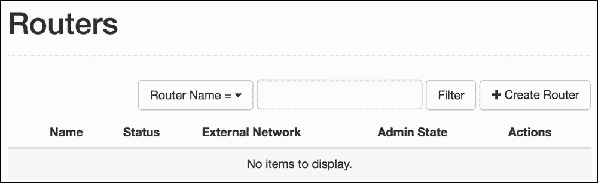
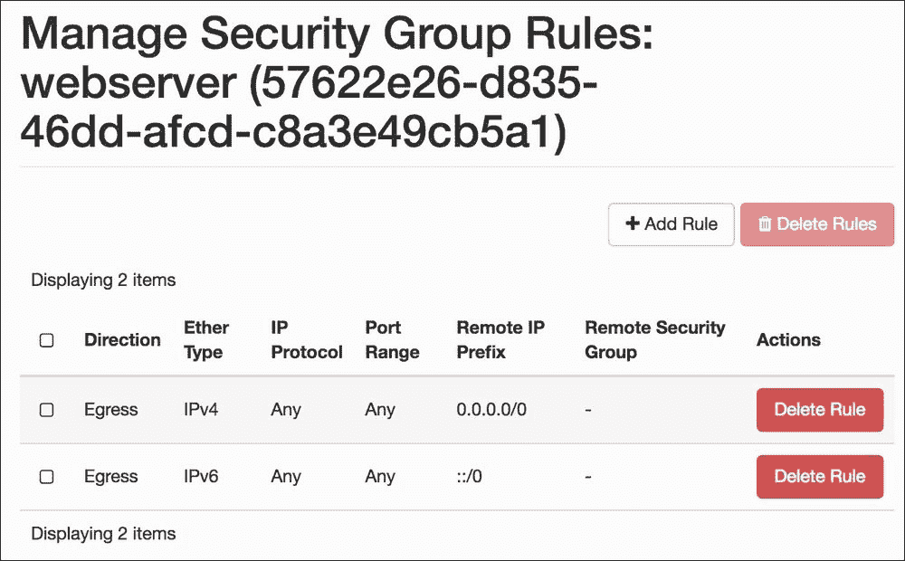
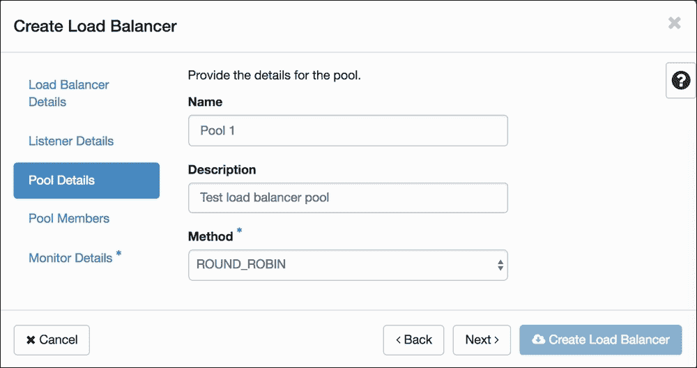
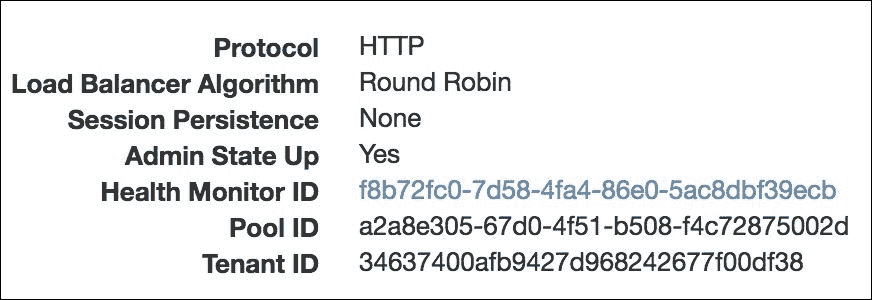
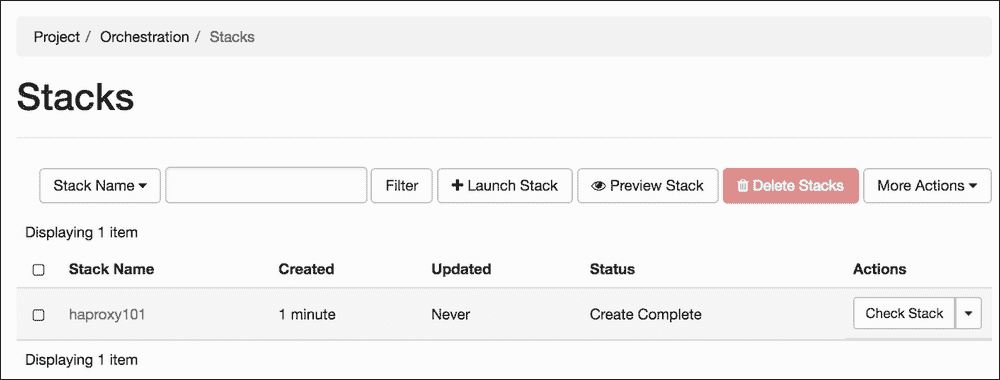

# 第十章 使用 OpenStack Dashboard

本章将涵盖以下主题：

+   介绍 – OpenStack Dashboard

+   使用 OpenStack Dashboard 进行密钥管理

+   使用 OpenStack Dashboard 管理 Neutron 网络和路由器

+   使用 OpenStack Dashboard 管理安全组

+   使用 OpenStack Dashboard 启动实例

+   使用 OpenStack Dashboard 删除实例

+   使用 OpenStack Dashboard 添加新项目

+   使用 OpenStack Dashboard 进行用户管理

+   使用 OpenStack Dashboard 配合 LBaaS

+   使用 OpenStack Dashboard 与 OpenStack Orchestration 配合使用

# 介绍 – OpenStack Dashboard

通过命令行接口管理我们的 OpenStack 环境使我们能够完全控制云环境，但提供一个基于 Web 的界面，供操作员和管理员用来管理他们的环境和实例，则使这个过程更加便捷。OpenStack Dashboard，称为 **Horizon**，提供了一个图形化的 Web 用户界面。Horizon 是一个 Web 服务，运行在 Apache 安装下，使用 Python 的 **Web Service Gateway Interface** (**WSGI**) 和 Django，一个快速开发的 Web 框架。

安装 OpenStack Dashboard 后，我们可以管理 OpenStack 环境的所有核心组件。如果你使用 OpenStack Ansible playbook，Horizon 会通过 `os-horizon-install.yml` playbook 安装。

# 使用 OpenStack Dashboard 进行密钥管理

SSH 密钥对允许用户在不需要密码的情况下连接到他们的 Linux 实例，它几乎是所有你将在 OpenStack 中使用的 Linux 镜像的默认访问机制。用户可以通过 OpenStack Dashboard 管理自己的密钥对。通常，这是新用户在获得访问 OpenStack 环境权限后要做的第一项任务。

## 准备工作

打开一个 Web 浏览器，访问我们的 OpenStack Dashboard 地址 `http://192.168.100.117/`，并以 `default` 域中的用户身份登录，例如在 第二章 *OpenStack 客户端* 配方中创建的 `developer` 用户，使用密码 `cookbook4`。我们的 Dashboard URL 与 第一章 *使用 Ansible 安装 OpenStack* 中讨论的公共负载均衡器 IP 相同。如果你需要查找 Horizon 的 URL，可以根据 第三章 *Keystone – OpenStack 身份服务* 中描述的方式，使用 OpenStack 目录列表中的公共 IP 地址。

## 如何操作…

登录用户的密钥对管理通过以下章节中讨论的步骤来实现：

### 添加密钥对

密钥对可以通过以下步骤添加：

1.  可以通过点击**项目** | **计算**部分中的**密钥对**选项卡，将新密钥对添加到我们的系统：

1.  我们现在会看到一个屏幕，允许密钥对管理。在屏幕的右上角有一个**创建密钥对**按钮。点击该按钮来创建新的密钥对：

1.  在**创建密钥对**屏幕上，输入一个有意义的名称（例如`developer`），确保名称中没有空格，然后点击**创建密钥对**按钮：

1.  新密钥对创建后，密钥对的私钥部分将自动下载。如果没有，请点击**重新生成并下载密钥对 "developer"**按钮：

    ### 注意

    私有 SSH 密钥无法重新创建，因此请妥善保管，并确保将其安全地存储在文件系统中。

1.  点击**密钥对**链接，返回到我们的密钥对列表。此时我们会看到新创建的密钥对已列出。在启动实例时，我们可以选择这个新密钥对，并仅使用我们本地存储的私钥访问它：

### 删除密钥对

可以通过执行以下步骤删除密钥对：

1.  当不再需要密钥对时，我们可以将其从 OpenStack 环境中删除。为此，请点击屏幕左侧的**密钥对**选项卡。

1.  然后我们将看到一个屏幕，允许访问密钥对管理。在**密钥对**下，会列出我们可以用来访问实例的密钥对。要从系统中删除一个密钥对，点击我们想要删除的密钥对旁边的**删除密钥对**按钮：

1.  我们将看到一个确认对话框：

一旦点击**删除密钥对**按钮，密钥对将被删除。

### 导入密钥对

如果你有用于访问其他系统的密钥对，这些密钥对可以导入到我们的 OpenStack 环境中，从而继续用于访问我们 OpenStack 计算环境中的实例。要导入密钥对，请执行以下步骤：

1.  我们可以将传统 Linux 环境中创建的密钥对导入到 OpenStack 设置中。如果你还没有密钥对，可以在 Linux 或其他 Unix 主机上运行以下命令：

    ```
    ssh-keygen -t rsa -f cookbook.key

    ```

1.  这将在我们的客户端上生成以下两个文件：

    `cookbook.key`

    `cookbook.key.pub`

1.  `cookbook.key`文件是我们的私钥，必须保护它，因为它是唯一与`cookbook.key.pub`密钥对的公钥部分匹配的密钥。

1.  我们可以导入这个公钥到 OpenStack 环境中，这样当实例启动时，公钥会被插入到正在运行的实例中。要导入公钥，确保你在**访问与安全**屏幕，然后在**密钥对**下，点击**导入密钥对**按钮：

1.  我们看到一个屏幕，要求我们命名密钥对并粘贴我们的公钥内容。所以请命名密钥对，然后将公钥的内容复制并粘贴到空白处——例如，`cookbook.key.pub`的内容。一旦输入完毕，点击**导入密钥对**按钮：

完成后，我们会看到该用户可用的密钥对列表，包括我们导入的密钥对：


## 工作原理…

密钥对管理很重要，因为它为访问我们的运行实例提供了一种一致且安全的方式。允许用户在其项目中创建、删除和导入密钥对，可以帮助他们创建更安全的系统。

OpenStack 仪表盘允许用户轻松创建密钥对。不过，用户必须确保下载的私钥保持安全。

虽然删除密钥对很简单，但用户必须记住，删除与正在运行的实例关联的私钥会导致无法访问正在运行的系统。从仪表盘删除密钥对不会删除已经运行的实例中的密钥。每个创建的密钥对都是唯一的，不管其名称是什么。名称只是标签，密钥的唯一指纹是必需的，且无法重新创建。

导入密钥对的优势在于，我们可以在 OpenStack 内部使用我们已经在外部使用的现有安全密钥对。这为在不同环境之间迁移提供了一致的用户体验。

# 使用 OpenStack 仪表盘管理 Neutron 网络和路由器

OpenStack 仪表盘具有查看、创建和编辑 Neutron 网络的功能，这使得管理复杂的软定义网络变得更加容易。某些功能，如创建共享网络和提供商路由器，要求用户以管理员权限登录 OpenStack 仪表盘，但任何用户都可以创建私有网络。为了帮助管理复杂的软定义网络，OpenStack 仪表盘提供了图形化查看和更新网络拓扑的功能。

## 准备工作

打开一个网页浏览器，访问我们的 OpenStack Dashboard 地址 `http://192.168.100.117/`，并以 `default` 域中的用户身份登录，例如在第二章 *OpenStack 客户端* 中创建的 `developer` 用户，密码为 `cookbook4`。我们的 Dashboard URL 与第一章 *使用 Ansible 安装 OpenStack* 中讨论的公共负载均衡器 IP 地址相同。如果你需要找出 Horizon 的 URL，请使用 OpenStack 目录列表中的公共 IP，方法如在第三章 *Keystone – OpenStack 身份服务* 中所述。

## 如何操作

本食谱将指导你通过 OpenStack Dashboard 创建和删除网络：

### 创建网络

要为已登录用户创建私有网络，请执行以下步骤：

1.  要管理 OpenStack Dashboard 中的网络，选择**网络**标签，如下图所示：

1.  选择该选项后，我们将看到一个可以分配给实例的网络列表：

1.  要创建一个新网络，点击**创建网络**按钮。

1.  我们将看到一个对话框，首先要求我们为网络命名：

1.  选择名称后，保持管理状态设置为启用（这意味着我们的网络将处于开启状态，并且实例可以连接到该网络），然后选择**子网**标签或点击**下一步**按钮为其分配一个子网：

1.  填写子网的详细信息后，选择**子网详情**标签，允许我们配置例如 DHCP 范围、DNS 和用户选择该网络时希望设置的任何其他路由：

1.  填写完所有详细信息后，点击**创建**按钮，这将使该网络对我们项目的用户可用，并将我们带回可用网络列表：

### 创建路由器

一旦添加了私有网络，它可能需要连接到外部网络。如果你有公共网络，只需在私有网络和公共网络之间创建一个路由器即可。

要管理路由器，请执行以下步骤：

1.  选择**路由器**标签，如下图所示：

    这将显示已登录用户可用的路由器：

    

1.  点击**创建路由器**按钮以添加新路由器：

1.  输入路由器名称并选择外部网络。在我们的例子中，我们将选择 **公共** 网络。点击 **创建路由器** 按钮。将显示可用路由器的列表，包括新创建的路由器：

1.  点击新创建的路由器名称查看详细信息：

1.  此路由器仍然缺少一个接口。要将私有网络作为可用接口添加，请选择 **接口** 标签：

1.  点击 **添加接口** 按钮以添加缺失的接口：

1.  选择需要通过路由器连接到公共网络的子网，并点击 **提交** 按钮。现在我们的路由器有了一个额外的接口：

### 查看网络

OpenStack 控制面板为用户和管理员提供查看环境拓扑的能力。要查看网络拓扑，请执行以下步骤：

1.  要在我们的 OpenStack 控制面板中管理网络，请选择 **网络拓扑** 标签，如下图所示：

1.  点击 **网络拓扑** 标签会显示一个丰富的界面，概览我们网络及附加在其上的实例，如下所示：

1.  在这个界面中，我们可以点击该界面的各个部分，如网络（带我们进入管理网络界面）、实例（带我们进入实例界面），以及创建新网络、路由器和启动新实例。

### 删除路由器

要删除登录用户的私有路由器，请执行以下步骤：

1.  要在我们的 OpenStack 控制面板中管理路由器，请选择 **路由器** 标签，如下图所示：

1.  选择此选项后，我们将看到所有登录用户的可用路由器：

1.  要删除路由器，请点击 **清除网关** 按钮旁边的下拉操作菜单项，然后点击 **删除路由器** 选项：

1.  一旦路由器被删除，您将看到可用剩余路由器的列表：

### 删除网络

要删除登录用户的私有网络，请执行以下步骤：

1.  要在我们的 OpenStack 控制面板中管理网络，请选择 **网络** 标签，如下图所示：

1.  选择此选项后，我们将看到一个可以分配给实例的网络列表：

1.  要删除网络，请选中我们想要删除的网络名称旁的复选框，然后点击 **删除网络** 按钮：

1.  我们将看到一个对话框，要求我们确认删除操作：

1.  点击 **删除网络** 按钮将删除该网络，并返回到可用网络的列表中。

### 注意

你只能删除没有实例附加的网络。如果该网络上仍然有实例，系统会警告你无法删除。

## 它是如何工作的…

查看和编辑 Neutron 网络的功能是 OpenStack 较早版本引入的一个便捷特性。管理 Neutron 网络和路由器可能相当复杂，但借助 OpenStack Dashboard 提供的可视化帮助，操作变得更加轻松。

作为管理员（具有管理员角色的用户），你可以创建共享网络。前面的配方中的相同过程也适用，但你会看到一个额外的选项，允许所有创建的网络被所有项目看到。

# 使用 OpenStack Dashboard 进行安全组管理

安全组是网络规则，允许一个项目中的实例与另一个项目中的实例相隔离。在 OpenStack Dashboard 中，管理安全组规则变得非常简单。

## 准备好

打开一个网页浏览器，访问我们的 OpenStack Dashboard 地址 `http://192.168.100.117/`，并以 `default` 域中的用户身份登录，例如在第二章 *OpenStack 客户端* 的 *常见 OpenStack 身份任务* 配方中创建的 `developer` 用户，使用 `cookbook4` 密码。我们的 Dashboard URL 与第一章 *使用 Ansible 安装 OpenStack* 中讨论的公共负载均衡器 IP 地址相同。如果你需要查找 Horizon 的 URL，请使用 OpenStack 目录列表中的公共 IP，如第三章 *Keystone – OpenStack 身份服务* 中所述。

## 操作步骤…

要在 OpenStack Dashboard 中管理安全组，请按照以下章节中的步骤进行操作：

### 创建安全组

创建安全组，请执行以下步骤：

1.  通过 **网络** 部分的 **安全组** 标签，我们可以将新的安全组添加到系统中，因此请点击它：

1.  接下来，我们将看到一个屏幕，允许访问安全设置并管理密钥对。在 **安全组** 中，将列出我们启动实例时可以使用的安全组。要创建一个新的安全组，请点击 **创建安全组** 按钮：

1.  我们需要为安全组命名并提供描述。名称不能包含空格：

1.  创建新安全组后，屏幕上将显示可用安全组的列表。在这里，我们可以向新的安全组添加新的网络安全规则：

### 编辑安全组以添加和删除规则

要添加和删除规则，可以通过执行以下步骤编辑安全组：

1.  当我们创建了一个新的安全组，或者希望修改现有安全组的规则时，可以点击该安全组的**管理规则**按钮：

1.  在点击**管理规则**按钮后，我们将进入一个列出所有现有规则的界面，允许我们向该安全组添加新规则：

    要向新的安全组添加规则，我们点击**添加规则**按钮。这将允许我们根据不同的协议类型创建规则：**ICMP**、**TCP**和**UDP**。还提供了常用服务的规则模板列表。举个例子，我们将添加一条允许来自任何地方的**HTTPS**访问的安全组规则。为此，我们选择以下选项：

    

1.  我们从下拉菜单中选择**HTTPS**选项。这会将我们带回到**添加规则**菜单，在这里我们可以指定网络流量的来源：

1.  当我们点击**添加**按钮时，我们会被重定向到与我们的安全组相关联的规则列表。重复前一步骤，直到配置完成与安全组相关的所有规则：

1.  我们还可以为没有内置规则模板的服务添加自定义安全规则。在点击**添加规则**按钮后，我们将从**规则**下拉列表中选择**自定义 TCP 规则**选项。然后，我们将从**开放端口**下拉列表中选择**端口范围**选项，这将展示**起始端口**和**结束端口**字段。我们输入端口范围后，点击**添加**按钮：

1.  请注意，我们也可以在这里删除规则。只需选择我们不再需要的规则，并点击**删除规则**按钮。系统将要求我们确认删除操作。

### 删除安全组

删除安全组的步骤如下：

1.  删除安全组的操作是选择我们要删除的安全组，并点击**删除安全组**按钮：

1.  您将被要求确认此操作。点击**删除安全组**将删除安全组及其关联的访问规则：

### 注意

如果有实例正在使用该安全组，您将无法删除该安全组。

## 它是如何工作的…

安全组对我们的 OpenStack 环境至关重要，因为它们为访问运行中的实例提供了一种一致且安全的方式。允许用户创建、删除和修改安全组以供其项目使用，使他们能够创建安全的环境。安全组中的规则是“默认拒绝”，意味着如果没有为特定协议定义规则，则该协议的流量无法访问分配给该安全组的运行实例。

安全组在创建时与实例关联；然而，它们也可以稍后添加到正在运行的实例中。例如，假设某个实例仅使用`default`安全组启动。我们设置的`default`安全组仅允许访问 TCP 端口`22`，并且能够 ping 实例。如果我们需要访问 TCP 端口`80`，则必须将此规则添加到`default`安全组中，或者将一个新的安全组添加到正在运行的实例中。

### 提示

对安全组的修改会立即生效，任何分配了该安全组的实例都将应用这些新规则。

# 使用 OpenStack Dashboard 启动实例

使用 OpenStack Dashboard 启动实例非常简单。我们只需选择所需的镜像，选择实例的大小，然后启动它。

## 准备工作

打开一个网页浏览器，访问我们的 OpenStack Dashboard 地址`http://192.168.100.117/`，并以`default`域中的用户（如在第二章的*Common OpenStack 身份任务*配方中创建的`developer`用户）身份登录，密码为`cookbook4`。我们的仪表板 URL 与在第一章的*使用 Ansible 安装 OpenStack*中讨论的公共负载均衡器 IP 相同。如果需要查找你的 Horizon 的 URL，请使用 OpenStack 目录列表中的公共 IP，方法请参考第三章的*Keystone – OpenStack 身份服务*。

## 如何操作…

要通过 OpenStack Dashboard 界面启动实例，请执行以下步骤：

1.  转到**计算**部分的**实例**标签页：

1.  到达此页面后，您将看到所有正在运行的实例：

1.  在**实例**屏幕上，点击**启动实例**按钮。这将显示实例创建的第一个标签页：

    输入实例名称，选择可用区和实例数量。然后，点击**下一步**按钮。

1.  选择实例启动时应使用的源。我们在示例中使用的是预加载的`ubuntu-xenial`镜像。如果需要 Cinder 卷，也可以在此标签中指定。设置好实例源信息后，点击**下一步**按钮：

1.  选择你的虚拟机（VM）规格。规格决定了虚拟机的大小。点击**下一步**按钮继续：

1.  选择在启动时应该附加到实例的网络。可以指定多个网络。选择网络后，点击左侧的**安全组**标签：

1.  选择应该附加到实例的安全组。安全组决定了新创建的虚拟机的网络访问权限。点击**下一步**按钮继续：

1.  在此屏幕上，我们需要选择一个密钥对，用于实例启动后访问该实例。选择密钥对后，你可以点击**启动实例**按钮，或者查看其余屏幕以获取可能会添加到实例中的额外信息：

1.  虚拟机启动后，将显示现有实例列表。如果新创建的虚拟机出现问题，它将在**状态**列中显示：

## 它是如何工作的……

从 Horizon——OpenStack 仪表板——启动实例是通过几个步骤完成的，所有这些都通过引导式的**启动实例**界面。以下是启动实例所需的属性：

+   **来源**：这可以是镜像、快照、卷或卷快照

+   **规格**或**大小**：这决定了实例的计算、**内存**和**存储**容量

+   **网络**：必须选择至少一个网络接口以启动实例

+   **安全组**：这些不是启动实例所必需的，但它们用于控制实例的网络访问

+   **密钥对**：这是可选的，但建议用于登录到实例

**实例**标签显示了我们开发项目中正在运行的实例。

### 提示

你还可以通过点击**概览**标签，查看我们环境中正在运行的概况。

# 使用 OpenStack 仪表板删除实例

使用 OpenStack 仪表板终止实例非常简单。

## 准备工作

打开一个网页浏览器，访问我们的 OpenStack Dashboard 地址 `http://192.168.100.117/`，并以 `default` 域中的用户身份登录，例如在 第二章 *OpenStack 客户端* 中创建的 `developer` 用户，密码为 `cookbook4`。我们 Dashboard 的 URL 与 第一章 *使用 Ansible 安装 OpenStack* 讨论的公共负载均衡器 IP 相同。如果你需要查找 Horizon 的 URL，可以使用 OpenStack 目录列表中的公共 IP，如 第三章 *Keystone – OpenStack 身份服务* 中所述。

## 如何操作……

使用 OpenStack Dashboard 删除实例，请执行以下步骤：

1.  选择 **实例** 标签页，勾选要终止的实例旁边的复选框，然后点击红色的 **删除实例** 按钮：

1.  我们将看到一个确认屏幕。点击 **删除实例** 按钮以终止选定的实例：

1.  现在我们会看到 **实例** 屏幕，并确认实例已成功删除。

## 它是如何工作的……

使用 OpenStack Dashboard 删除实例很简单。我们只需选择正在运行的实例，并点击 **删除实例** 按钮，该按钮在选择实例时会被高亮显示。点击 **删除实例** 按钮后，我们需要确认此操作，以最大程度地减少意外终止实例的风险。

# 使用 OpenStack Dashboard 添加新项目

OpenStack Dashboard 不仅仅是管理我们实例的界面。它还允许管理员配置环境、用户和项目。在 OpenStack Dashboard 中，添加用户可以加入的新项目非常简单。

## 准备就绪

打开一个 web 浏览器，指向我们的 OpenStack Dashboard 地址 `http://192.168.100.117/`，并以 `default` 域中的用户（例如在第二章中的*Common OpenStack identity tasks*食谱创建的 `developer` 用户）身份登录，使用 `cookbook4` 密码。我们的仪表盘网址与第一章中讨论的公共负载均衡器 IP 相同。如果你需要查找 Horizon 的 URL，可以使用 OpenStack 目录列表中的公共 IP，正如在第三章中描述的那样，*Keystone – OpenStack 身份服务*。

## 如何操作…

要将一个新项目添加到我们的 OpenStack 环境，执行以下步骤：

1.  在我们以具有管理员权限的用户身份登录后，我们将看到更多的菜单选项出现在**身份**选项卡下。其中一个选项是**项目**，如下图所示：

1.  要管理项目，我们点击**身份**选项卡下列出的**项目**选项。这将列出我们环境中可用的项目，如下图所示：

1.  要创建一个新项目，点击**创建项目**按钮。

1.  接下来，我们将看到一个表单，要求输入项目名称和描述。将`horizon`作为我们的项目名称，并输入描述：

1.  我们通过选择**启用**复选框来启用该项目，然后点击**创建项目**按钮。

1.  我们将看到一个当前可用的项目列表，并显示一条消息，说明`horizon`项目已成功创建。

## 它是如何工作的…

OpenStack Dashboard 是一个功能丰富的界面，补充了在管理 OpenStack 环境时可用的命令行选项。这意味着我们可以简单地创建一个项目，用户可以加入到该项目中，使用 OpenStack Dashboard。创建新项目时，我们需要以具有管理员权限的用户身份登录，以便访问完整的项目管理界面。

# 使用 OpenStack Dashboard 进行用户管理

OpenStack Dashboard 使我们能够通过 Web 界面管理用户。这允许管理员轻松地在 OpenStack 环境中创建和编辑用户。要管理用户，你必须使用管理员角色成员的帐户登录。

## 准备工作

打开一个网页浏览器，将其指向我们 OpenStack Dashboard 的地址 `http://192.168.100.117/`，并以 `default` 域中的用户身份登录，例如在第二章的*常见 OpenStack 身份任务*食谱中创建的 `developer` 用户，密码为 `cookbook4`。我们的仪表板的 URL 与第一章的*使用 Ansible 安装 OpenStack*中讨论的公共负载均衡器 IP 相同。如果你需要查找 Horizon 的 URL，请使用 OpenStack 目录列表中的公共 IP，如第三章的*Keystone – OpenStack 身份服务*中所述。

## 如何操作……

在 OpenStack Dashboard 中的用户管理通过执行以下章节讨论的步骤来实现。

### 添加用户

要添加用户，请执行以下步骤：

1.  在**身份**面板中，点击**用户**选项以显示系统上配置的用户列表：

    此截图为了清晰和节省空间，截断了可用的用户列表。

1.  要创建一个新用户，点击**创建用户**按钮。

1.  我们将看到一个表单，要求填写用户名的详细信息。请输入用户名、电子邮件和该用户的密码。在下面的截图示例中，我们创建了一个名为`test`的用户，设置了密码，并将该用户分配给`horizon`项目，角色为**管理员**。点击**创建用户**按钮以创建一个包含所有指定详细信息的新用户：

1.  我们将返回到列出我们 OpenStack 环境中的用户的屏幕，并显示一条消息，表示我们的用户创建成功。

### 删除用户

要删除用户，请执行以下步骤：

1.  在**身份**面板中，点击**用户**选项以显示系统上的用户列表。

1.  我们将看到我们 OpenStack 环境中的用户列表。要删除一个用户，点击**编辑**按钮，弹出一个下拉列表，其中包含**删除用户**选项：

1.  点击**删除用户**选项会弹出确认对话框。点击**删除用户**按钮确认，删除该用户：

### 更新用户的详细信息和密码

要更新用户的详细信息和密码，请执行以下步骤：

1.  在**身份**面板中，点击**用户**选项以显示系统上的用户列表。

1.  要更改用户的密码、电子邮件地址或主要项目，点击该用户的**编辑**按钮。

1.  这将弹出一个对话框，要求提供相关信息。当信息设置完成后，点击**更新用户**按钮：

### 将用户添加到项目中

要将用户添加到项目中，请执行以下步骤：

1.  在**身份**面板中，点击**项目**选项以显示系统中的项目列表：

1.  点击**管理成员**选项以显示与项目关联的用户列表以及我们可以将其添加到项目中的用户列表：

1.  要将新用户添加到列表中，只需点击该用户旁边的**+**（加号）按钮。

1.  要更改该项目中用户的角色，请选择用户名旁边的下拉菜单并选择新的角色（或多个角色）：

    在我们的示例中，我们已将`developer`用户添加到`demo`项目，并为`user`分配了`admin`和`_member_`角色。

1.  在点击对话框底部的**保存**按钮后，我们将看到一条消息，表示我们的项目已更新。此用户现在可以在不同的项目中启动实例。

### 从项目中移除用户

要从项目中移除用户，请执行以下步骤：

1.  在**身份**面板中，点击**项目**选项以显示系统中的项目列表。

1.  例如，要从`demo`项目中移除用户，请点击**管理成员**按钮：

1.  点击**管理成员**按钮后，您将看到一个弹出窗口，显示所有用户以及项目成员的列表，我们可以将其从项目中移除：

1.  要从此项目中移除用户，请点击项目成员下该特定用户旁边的**-**（减号）按钮。

1.  在点击对话框底部的**保存**按钮后，我们将看到一条消息，表示我们的项目已更新。

## 工作原理……

OpenStack 仪表板使得创建用户、修改其在项目中的成员身份、更新密码以及将其从系统中删除变得更加简便。

# 使用 OpenStack 仪表板与 LBaaS

OpenStack 仪表板具有查看、创建和编辑负载均衡器、添加**虚拟 IP**（**VIPs**）以及将节点添加到负载均衡器后的功能。仪表板还提供了创建 HA Proxy 服务器负载均衡服务的接口。我们首先通过创建负载均衡池来做，然后将正在运行的实例添加到这些池中。

在本节中，我们将使用两个运行 Apache 的实例。我们将创建一个 HTTP 负载均衡池，创建一个虚拟 IP（VIP），并将实例配置为池的一部分。结果是能够使用 HTTP 负载均衡池地址将流量发送到两个运行 Apache 的实例。

## 准备工作

打开一个网页浏览器，访问我们的 OpenStack 仪表盘地址 `http://192.168.100.117/`，并以 `default` 域中的用户登录，例如在第二章的*常见 OpenStack 身份任务*食谱中创建的 `developer` 用户，使用 `cookbook4` 密码登录。我们的仪表盘 URL 与在第一章的*使用 Ansible 安装 OpenStack*中讨论的公共负载均衡器 IP 相同。如果您需要查找 Horizon 的 URL，可以使用在第三章的*Keystone – OpenStack 身份服务*中描述的 OpenStack 目录列表中的公共 IP。

## 如何操作…

本食谱将指导您如何使用 OpenStack 仪表盘创建和删除负载均衡器：

### 创建负载均衡器

要为已登录用户创建负载均衡器池，请执行以下步骤：

1.  要在我们的 OpenStack 仪表盘中管理负载均衡器，请选择**负载均衡器**选项卡，如下图所示：

1.  这将显示可用的负载均衡池。由于我们当前没有任何已创建的负载均衡池，请点击右上角的**创建负载均衡器**按钮以添加负载均衡器。

1.  点击**创建负载均衡器**按钮后，我们将看到一个弹出窗口。填写详细信息以添加新的负载均衡器：

1.  IP 地址不是必需的；如果未提供，系统将选择所选子网中的下一个可用 IP。

1.  通过点击下拉菜单选择池的子网。我们的所有实例都连接到私有网络，因此我们选择**private-subnet**。

1.  点击**下一步**按钮后，提供负载均衡器监听器的详细信息：

1.  `HTTP`和`TCP`协议可供我们选择，因此我们将使用`HTTP`。`TERMINATED_HTTPS`仅在配置了密钥管理服务时可用。

1.  选择前端监听的端口。一个负载均衡器可以配置多个监听器，但每个监听器必须具有唯一的端口。

1.  点击**下一步**按钮后，提供池的详细信息。我们将使用`ROUND_ROBIN`负载均衡方法。其他算法包括`LEAST_CONNECTIONS`和`SOURCE_IP`：

1.  点击**下一步**按钮进入**池成员**页面。通过点击可用实例旁边的**添加**按钮，将成员添加到池中：

    ### 提示

    如果实例未列在**可用实例**中，请点击**添加外部成员**按钮。

1.  点击**下一步**按钮后，我们将进入**监控器详情**页面。在这里，我们为池成员配置健康检查。我们将使用`PING`作为监控器类型。其他可选类型包括`HTTP`和`TCP`。

1.  设置健康检查间隔时间（以秒为单位），然后设置重试次数和健康检查超时的时间：

    ### 注意

    每个池只能关联一个健康监控器。

1.  点击**创建负载均衡器**按钮，使用所有输入的详情创建负载均衡器。您将在所有可用负载均衡器的列表中看到新创建的负载均衡器。

### 删除负载均衡器

要删除负载均衡器，我们首先需要删除附加的健康监控器、监听器和池。在我们的示例中，我们将展示如何删除其中一个，但如果有多个池，您需要在删除负载均衡器之前删除所有池、监听器和健康监控器。

1.  从**负载均衡器**页面开始，点击您希望删除的负载均衡器名称。在我们的示例中，名称是`web-loadbalancer`：

1.  从负载均衡器详情页面，点击监听器名称。在我们的示例中，监听器名为`test-lb`：

1.  在监听器详情页面，点击**默认池 ID**：

    默认池 ID 位于管理员状态下方，它是显示的三个 ID 中的第一个：

    

1.  点击池 ID 会将我们带到池详情页面。点击**添加/移除池成员**按钮删除所有池成员：

1.  这将显示一个新的页面，用于移除池成员。通过点击每个成员旁边的**移除**按钮，删除所有池成员：

1.  点击**添加/移除池成员**按钮以保存更改：

1.  删除池成员后，我们将返回到池详情页面。我们需要删除所有健康监控器，才能删除池：

1.  点击**健康监控器 ID**以访问健康监控器详情：

1.  从健康监控器详情页面，点击**编辑**按钮旁边的下拉箭头，选择**删除健康监控器**选项。点击**删除健康监控器**选项以删除健康监控器：

1.  这将显示一个确认页面。点击**删除健康监控器**按钮进行确认：

1.  删除健康监控后，我们会回到池的页面。点击**编辑池**按钮旁边的操作箭头，展开**删除池**选项。点击**删除池**选项：

1.  系统会显示确认页面。点击**删除池**按钮以确认删除池：

1.  删除池后，我们会回到监听器详情页面。点击**编辑**按钮旁边的操作箭头，展开**删除监听器**选项。点击**删除监听器**选项以删除监听器：

1.  系统会显示确认页面；点击**删除监听器**按钮以确认删除监听器：

1.  删除监听器后，我们会回到负载均衡器详情页面。点击**编辑**按钮旁边的操作箭头，展开**删除负载均衡器**选项。点击**删除负载均衡器**选项以删除负载均衡器：

1.  系统会显示确认页面。点击**删除负载均衡器**按钮以删除负载均衡器：

## 工作原理……

我们创建了一个带有健康监控的负载均衡池，并向其中添加了两个实例。为此，我们执行了以下步骤：

1.  从负载均衡器页面创建负载均衡器。

1.  创建监听器时，选择所有节点所连接的子网。

1.  向监听器添加成员。

1.  添加健康监控。

创建负载均衡器后，所有负载均衡器的详细信息都可以编辑。删除负载均衡器时需要删除所有已创建的资源：池、监听器和健康监控。

# 使用 OpenStack 仪表盘与 OpenStack 编排

Heat 是 OpenStack 编排引擎，允许用户通过模板快速启动整个环境。Heat 模板，称为**HOT**（**Heat 编排模板**），是基于**YAML**（**另一种标记语言**）的文件。这些文件描述了所使用的资源、实例的类型和大小，以及实例将连接的网络等信息，这是运行该环境所需的其他信息。

在第九章中，*使用 Heat 和 Ansible 进行 OpenStack 编排*，我们向你展示了如何使用 Heat 命令行客户端。在本节中，我们将展示如何在 OpenStack 仪表盘中使用现有的 Heat 模板文件启动两个运行 Apache 的 Web 服务器，并将其连接到一个运行 HA Proxy 的第三个实例。

## 正在准备

打开一个网页浏览器，访问我们的 OpenStack 仪表板地址`http://192.168.100.117/`，并以`default`域中的用户身份登录，例如在第二章的*常见 OpenStack 身份任务*食谱中创建的`developer`用户，使用密码`cookbook4`。我们仪表板的 URL 与第一章的*使用 Ansible 安装 OpenStack*中讨论的公共负载均衡器 IP 相同。如果需要找出 Horizon 的 URL，请使用 OpenStack 目录列表中的公共 IP，如第三章的*Keystone – OpenStack 身份服务*中所述。

## 如何操作…

本教程将引导您使用 OpenStack 仪表板启动和删除编排堆栈。

### 启动堆栈

要为已登录用户启动 Heat 堆栈，请执行以下步骤：

1.  要查看我们 OpenStack 仪表板中可用的 Heat 堆栈，请从**编排**菜单中选择**堆栈**选项卡，如下所示：

1.  单击**堆栈**选项卡后，您将看到环境中所有运行的堆栈。在我们的例子中，列表是空的，如下所示：

1.  单击**启动堆栈**按钮以创建一个新的堆栈。您将看到以下窗口：

1.  有几种方式可以指定要在堆栈中使用的**模板源**：**文件**、**直接输入**或**URL**。选择对您来说最方便的选项。在我们的示例中，您可以直接使用 URL，也可以上传文件。模板文件可以从这里下载：[`raw.githubusercontent.com/OpenStackCookbook/OpenStackCookbook/master/cookbook.yaml`](https://raw.githubusercontent.com/OpenStackCookbook/OpenStackCookbook/master/cookbook.yaml)。我们将使用**URL**选项，直接在模板中使用链接。

1.  就像可以上传模板源文件一样，我们也可以上传**环境源**文件。在这种情况下，我们不一定非要使用环境源文件，但它使得过程更加便捷。环境文件存储了我们需要手动输入到浏览器中的值，而是会在**启动堆栈**屏幕上加载这些值，如第 8 步所示。在我们的示例中，我们使用的环境文件可以从这里下载：[`raw.githubusercontent.com/OpenStackCookbook/OpenStackCookbook/master/cookbook-env.yaml`](https://raw.githubusercontent.com/OpenStackCookbook/OpenStackCookbook/master/cookbook-env.yaml)。请更新`public_net_id`、`private_net_id`和`private_subnet_id`字段，以匹配您的环境。

    ### 提示

    如果您不确定在哪里找到网络信息，请参考*使用 OpenStack Dashboard 管理 Neutron 网络和路由器*一文。

1.  选择**模板源**和**环境源**文件后，点击**下一步**：

1.  我们的示例环境文件包含以下内容：

    ```
    parameters:
      key_name: web
      image: ubuntu-xenial
      flavor: small
      public_net_id: eacdcb30-9c41-4be5-8954-d8dfff793512
      private_net_id: 9db0448b-eb48-4cd0-ac01-676266c3463e
      private_subnet_id: 4485b7ba-d895-487a-83c7-a319e90549ba
    ```

1.  点击**下一步**将显示一个**启动堆栈**窗口，包含所有输入项：

1.  请注意，我们模板中的大部分输入项现在已经填写。如果您在前一步中没有指定环境源文件，您需要填写`key_name`、`image`、`flavor`、`public_net_id`、`private_net_id`和`private_subnet_id`字段。

    ### 注意

    这些字段是特定于每个模板的。您的模板可能有不同的字段。

1.  输入堆栈名称和您的用户密码。如果您以 admin 或 demo 身份登录，密码为`openstack`。

1.  点击**启动**开始堆栈创建。如果所有输入项都正确，您应该会看到堆栈正在创建，类似以下示例：

1.  在堆栈创建完成后，如果没有出现错误，您将看到堆栈的状态更新为**创建完成**：

### 查看堆栈详情

启动堆栈后，会有很多与每个堆栈相关的信息，包括输入、输出以及在出现错误时，堆栈创建失败的原因信息。

1.  要查看堆栈的详细信息，请点击堆栈列表中的堆栈名称。第一个可用视图是**拓扑**：

    点击节点可以浏览拓扑。如果图形不完全适合，或者您希望看到不同的视角，可以拖动图形到窗口中的其他位置。

1.  下一个标签页是**概览**，它将提供用于创建堆栈的所有信息：

    **概览**标签页中提供的堆栈信息如下：

    +   信息

    +   状态

    +   输出

    +   堆栈参数

    +   启动参数

1.  **资源**标签页将显示在堆栈启动过程中创建的所有 HEAT 资源：

    如果在堆栈启动过程中出现错误，请查看此页面，了解哪个组件的创建失败。

1.  **事件**标签页显示堆栈创建过程中发生的所有事件。此页面在排查 Heat 模板问题时也非常有帮助。

1.  **模板**标签页将显示用于创建堆栈的模板。

1.  在您的 Heat 堆栈运行时，您还可以在**计算**标签页的**实例**选项中查看它创建了多少实例。这是我们在**实例**页面上看到的实例：

### 删除堆栈

堆栈删除很简单，但请注意，在删除时，它会删除堆栈启动过程中创建的所有资源。

1.  要删除堆栈，首先在堆栈页面查看可用的堆栈：

1.  选择要删除的堆栈，然后点击 **删除堆栈** 按钮删除堆栈。系统会要求你确认删除：

1.  确认删除后，所有与堆栈相关的资源将被删除。

## 它是如何工作的……

我们使用 OpenStack 仪表板来启动、查看和删除编排堆栈。我们首先需要从 GitHub 下载一个示例 HAProxy **Heat 编排模板**（**HOT**）。由于我们使用了环境文件，我们还需要修改适当的输入。你自己的模板可能有不同的输入。

在启动 HAProxy 堆栈后，我们探索了其拓扑、资源和事件。在堆栈启动过程中创建的资源也会反映在环境的其他部分。如果你正在启动新的实例，所有实例也会在 **实例** 页面上显示。仅通过 OpenStack 仪表板的编排部分或命令行删除和修改在堆栈启动过程中创建的资源。通过仪表板删除堆栈将删除所有相关资源。

# 你可能喜欢的另一本书

如果你喜欢这本书，可能会对 Packt 的另一本书感兴趣：


**OpenStack 架构师指南**

Michael Solberg, Ben Silverman

ISBN: 978-1-78439-510-0

+   熟悉 OpenStack 的各个组件

+   构建一个日益复杂的 OpenStack 实验室部署

+   为你组织内的架构团队编写有说服力的文档

+   应用敏捷配置管理技术部署 OpenStack

+   将 OpenStack 与你组织的身份管理、供应和计费系统集成

+   为用户配置一个稳健的虚拟环境以进行互动

+   使用企业安全指南进行 OpenStack 部署

+   创建一个能够迅速为平台用户提供功能的产品路线图

# 留下评论——让其他读者知道你的想法

请通过在购买书籍的网站上留下评论与他人分享你对这本书的看法。如果你是通过亚马逊购买的书籍，请在本书的亚马逊页面上留下诚实的评论。这对其他潜在读者非常重要，他们可以通过你的公正意见做出购买决策，我们也可以了解客户对我们产品的看法，作者们则能看到你对他们与 Packt 合作创作的书籍的反馈。只需要几分钟时间，但对其他潜在客户、我们的作者和 Packt 都非常有价值。谢谢！
