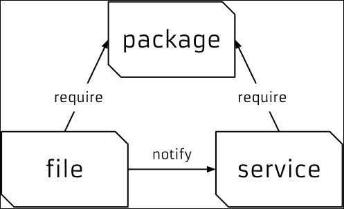

# 第一章 Puppet 语言与风格

|   | *"计算机语言设计就像在公园里散步，只不过是侏罗纪公园。"* |   |
| --- | --- | --- |
|   | --*Larry Wall* |

在本章中，我们将涵盖以下内容：

+   向节点添加资源

+   使用 **Facter** 描述节点

+   在启动服务之前安装包

+   安装、配置并启动服务

+   使用社区 **Puppet** 风格

+   创建清单

+   使用 Puppet-lint 检查你的清单

+   使用模块

+   使用标准命名约定

+   使用内联模板

+   遍历多个项

+   编写强大的条件语句

+   在 if 语句中使用正则表达式

+   使用选择器和案例语句

+   使用 `in` 操作符

+   使用正则表达式替换

+   使用未来解析器

# 介绍

在本章中，我们将从 Puppet 语法的基础开始，展示如何使用 Puppet 中的一些语法糖。接着我们将介绍 Puppet 如何处理依赖关系，以及如何让 Puppet 为你完成工作。

我们将探讨如何按照社区约定组织和结构化你的代码，将其分成模块，以便其他人能轻松阅读和维护你的代码。我还会展示一些 Puppet 语言的强大功能，这些功能可以让你编写简洁而富有表现力的清单。

# 向节点添加资源

本配方将介绍语言并展示如何编写 Puppet 代码的基础。初学者可能希望参考 *Puppet 3: 初学者指南*、*John Arundel*、*Packt Publishing*，以补充本节内容。Puppet 代码文件被称为清单；清单声明资源。Puppet 中的资源可以是类型、类或节点。类型类似于文件、包或任何在语言中声明过类型的事物。标准类型的当前列表可以在 Puppet Labs 网站上找到，地址是 [`docs.puppetlabs.com/references/latest/type.html`](https://docs.puppetlabs.com/references/latest/type.html)。我发现自己经常参考这个网站。你可以定义自己的类型，使用类似于子程序的机制，称为 **定义类型**，或者你可以使用自定义类型扩展语言。类型是语言的核心；它们描述了组成节点的事物（节点是 Puppet 用来表示客户端计算机/设备的词汇）。Puppet 使用资源来描述节点的状态；例如，我们将使用站点清单（`site.pp`）为节点声明以下包资源。

## 如何操作...

创建一个 `site.pp` 文件，并在其中放置以下代码：

```
  node default {
    package { 'httpd':
      ensure => 'installed'
    }
  }
```

### 提示

**下载示例代码**

你可以从你的账户中下载所有购买的 Packt 书籍的示例代码文件，地址是 [`www.packtpub.com`](http://www.packtpub.com)。如果你从其他地方购买了这本书，你可以访问 [`www.packtpub.com/support`](http://www.packtpub.com/support) 注册后，文件将直接通过电子邮件发送给你。

## 它是如何工作的...

这个清单将确保在应用该清单的任何节点上都会安装一个名为`'httpd'`的包。`default`关键字是 Puppet 的通配符；它将节点默认定义中的所有内容应用于任何节点。当 Puppet 将清单应用到一个节点时，它使用**资源抽象层**（**RAL**）将包类型转换为目标节点的包管理系统。这意味着我们可以使用相同的清单在任何为 Puppet 提供包类型**Provider**的系统上安装`httpd`包。Providers 是执行实际应用清单的代码部分。当将之前的代码应用到运行基于 YUM 的发行版的节点时，将使用 YUM 提供程序来安装`httpd`的 RPM 包。当相同的代码应用到运行基于**APT**的发行版的节点时，将使用 APT 提供程序来安装`httpd`的 DEB 包（该包可能不存在，大多数基于 Debian 的系统将该包称为`apache2`；我们稍后会处理这种命名问题）。

# 使用 Facter 描述节点

Facter 是一个独立的实用程序，Puppet 依赖于它。它是 Puppet 用于收集目标系统（节点）信息的系统；`facter`将这些信息片段称为事实。您可以从命令行运行`facter`以获取系统的实时信息。

## 如何做...

1.  使用`facter`来查找系统的当前运行时间，运行时间事实：

    ```
    t@cookbook ~$ facter uptime
    0:12 hours
    ```

1.  与 Linux 的 uptime 命令输出进行比较：

    ```
    t@cookbook ~$ uptime
     01:18:52 up 12 min,  1 user,  load average: 0.00, 0.00, 0.00
    ```

## 它是如何工作的...

当`facter`安装（作为 Puppet 的依赖项）时，默认会安装若干事实定义。您可以从命令行通过名称引用这些事实。

## 还有更多...

运行`facter`而不带任何参数会导致`facter`打印系统已知的所有事实。我们将在后面的章节中看到，`facter`可以通过自定义事实进行扩展。所有事实都可以作为变量供您使用；变量将在下一节中讨论。

### 变量

Puppet 中的变量用美元符号（$）标记。在清单中使用变量时，建议将变量放在大括号`"${myvariable}"`中，而不是`"$myvariable"`。所有来自`facter`的事实都可以作为顶级作用域变量引用（我们将在下一节讨论作用域）。例如，节点的**完全限定域名**（**FQDN**）可以通过`"${::fqdn}"`来引用。变量只能包含字母字符、数字和下划线字符（`_`）。作为一种风格，变量应以字母字符开头。永远不要在变量名中使用连字符。

### 作用域

在 *还有更多…* 部分中解释的变量示例中，完全限定的域名被引用为 `${::fqdn}`，而不是 `${fqdn}`；双冒号是 Puppet 区分作用域的方式。最高级别的作用域，即顶级作用域或全局作用域，通过变量标识符前面的两个冒号（`::`）来表示。为了减少命名空间冲突，请始终在清单中使用完全作用域的变量标识符。对于 Unix 用户来说，顶级作用域变量就像是 `/`（根）级别。你可以使用双冒号语法来引用变量，就像你通过完整路径引用目录一样。对于开发者而言，顶级作用域变量可以看作是全局变量；然而，不同于全局变量，你必须始终使用双冒号符号来引用它们，以确保局部变量不会遮蔽顶级作用域变量。

# 在启动服务之前安装一个包

为了展示排序是如何工作的，我们将创建一个清单，首先安装 `httpd`，然后确保 `httpd` 包服务正在运行。

## 如何做…

1.  我们从创建一个定义服务的清单开始：

    ```
      service {'httpd':
        ensure  => running,
        require => Package['httpd'],
      }
    ```

1.  服务定义引用了一个名为 `httpd` 的包资源；我们现在需要定义这个资源：

    ```
      package {'httpd':
        ensure => 'installed',
      }
    ```

## 它是如何工作的…

在这个例子中，包会在服务启动之前安装。通过在 `httpd` 服务的定义中使用 `require`，可以确保包首先安装，无论在清单文件中的顺序如何。

### 大小写

在 Puppet 中，大小写非常重要。在我们之前的示例中，我们创建了一个名为 `httpd` 的包。如果我们以后想要引用这个包，我们需要将它的类型（`package`）大写，像这样：

```
Package['httpd']
```

要引用一个类，例如已经在你的清单中包含/定义的 `something::somewhere` 类，你可以按照以下方式使用完整路径引用它：

```
Class['something::somewhere']
```

当你有一个定义类型时，例如以下定义的类型：

```
example::thing {'one':} 
```

上述资源稍后可以这样引用：

```
Example::Thing['one']
```

了解如何引用之前定义的资源对于下一节关于元参数和排序非常重要。

### 学习元参数和排序

所有用于定义节点的清单都会编译成一个目录。目录是将应用于配置节点的代码。需要记住的是，清单不会按顺序应用于节点。清单的应用没有固有的顺序。考虑到这一点，在之前的 `httpd` 示例中，如果我们想确保 `httpd` 进程在 `httpd` 包安装后启动，该怎么办？

我们不能依赖于 `httpd` 服务在清单中紧跟着 `httpd` 包。我们必须使用元参数来告诉 Puppet 我们希望资源应用到节点的顺序。元参数是可以应用于任何资源的参数，并且不特定于任何一种资源类型。它们用于目录编译，并作为 Puppet 的提示，但并不定义任何与其附加的资源相关的内容。在处理顺序时，有四个元参数可供使用：

+   `before`

+   `require`

+   `notify`

+   `subscribe`

`before` 和 `require` 元参数指定了直接的顺序；`notify` 隐含了 `before`，而 `subscribe` 隐含了 `require`。`notify` 元参数仅适用于服务；`notify` 的作用是告诉服务在通知资源应用到节点后重新启动（这通常是一个包或文件资源）。在文件的情况下，一旦文件在节点上创建，`notify` 参数会重新启动任何提到的服务。`subscribe` 元参数具有相同的效果，但它是在服务上定义的；服务会订阅该文件。

### 三重关系

前面提到的包与服务之间的关系是 Puppet 的一个重要且强大的范式。再加入一个资源类型文件，便形成了木偶师所说的 **三重关系**。几乎所有系统管理任务都围绕这三种资源类型展开。作为系统管理员，你安装一个包，使用文件配置该包，然后启动服务。



三重关系图（文件需要包来创建目录，服务需要文件和包）

### 幂等性

Puppet 的一个关键概念是，当目录被应用到节点时，系统的状态不能影响 Puppet 运行的结果。换句话说，在 Puppet 运行结束时（如果运行成功），系统将处于已知状态，且对目录的任何进一步应用将导致系统处于相同的状态。Puppet 的这一特性称为幂等性。**幂等性** 是指无论你做多少次某事，系统保持与第一次操作相同的状态。例如，如果你有一个灯开关，你指示将其打开，灯会亮。如果你再次给出同样的指令，灯依然保持亮着。

# 安装、配置并启动服务

网上有很多关于这种模式的例子。在我们简单的例子中，我们将在 `/etc/httpd/conf.d/cookbook.conf` 下创建一个 Apache 配置文件。 `/etc/httpd/conf.d` 目录在 `httpd` 包安装之前是不存在的。文件创建后，我们希望 `httpd` 重新启动以察觉到更改；我们可以通过 `notify` 参数实现这一点。

## 如何操作...

我们需要和上一个示例相同的定义；我们需要安装包和服务。现在我们需要两个新的要素。我们需要创建配置文件和索引页面（`index.html`）。为此，我们按照以下步骤进行：

1.  与之前的示例一样，我们确保服务正在运行，并指定该服务需要`httpd`包：

    ```
      service {'httpd':
        ensure => running,
        require => Package['httpd'],
      }
    ```

1.  然后我们按如下方式定义包：

    ```
      package {'httpd':
        ensure => installed,
      }
    ```

1.  现在，我们创建`/etc/httpd/conf.d/cookbook.conf`配置文件；`/etc/httpd/conf.d`目录在安装`httpd`包之前是不存在的。`require`元参数告诉 Puppet，这个文件需要先安装`httpd`包，才能创建：

    ```
      file {'/etc/httpd/conf.d/cookbook.conf':
        content => "<VirtualHost *:80>\nServernamecookbook\nDocumentRoot/var/www/cookbook\n</VirtualHost>\n",
        require => Package['httpd'],
        notify => Service['httpd'],
      }
    ```

1.  然后我们继续在`/var/www/cookbook`为我们的虚拟主机创建`index.html`文件。这个目录尚未存在，因此我们还需要创建它，使用以下代码：

    ```
      file {'/var/www/cookbook':
        ensure => directory,
      }
      file {'/var/www/cookbook/index.html':
        content => "<html><h1>Hello World!</h1></html>\n",
        require => File['/var/www/cookbook'],
      }
    ```

## 它是如何工作的…

文件资源的`require`属性告诉 Puppet，我们需要先创建`/var/www/cookbook`目录，然后才能创建`index.html`文件。要记住的重要概念是，我们不能假设目标系统（节点）有什么预设条件。我们需要定义目标依赖的所有内容。每当你在清单中创建文件时，你必须确保包含该文件的目录已经存在。每当你指定某个服务应当运行时，你必须确保提供该服务的包已被安装。

在这个示例中，使用元参数，我们可以确保无论节点在运行 Puppet 之前处于什么状态，Puppet 运行后，以下内容将会成立：

+   `httpd`将正在运行。

+   `VirtualHost`配置文件将存在

+   `httpd`将重新启动并且意识到`VirtualHost`文件。

+   `DocumentRoot`目录将存在。

+   `index.html`文件将存在于`DocumentRoot`目录中。

# 使用社区 Puppet 风格

如果其他人需要阅读或维护你的清单文件，或者你想与社区分享代码，最好尽可能遵循现有的风格约定。这些约定涵盖了代码的布局、空格、引用、对齐和变量引用等方面，Puppet 官方的风格推荐可以在[`docs.puppetlabs.com/guides/style_guide.html`](http://docs.puppetlabs.com/guides/style_guide.html)找到。

## 如何做…

在这一部分，我将展示一些更重要的示例，并确保你的代码符合风格要求。

### 缩进

使用两个空格（而不是制表符）缩进你的清单文件，如下所示：

```
service {'httpd':
  ensure  => running,
}
```

### 引用

始终引用资源名称，如下所示：

```
package { 'exim4':
```

然而，我们不能按以下方式进行：

```
package { exim4:
```

对于所有字符串，使用单引号，除非：

+   字符串包含像`"${::fqdn}"`这样的变量引用。

+   字符串包含像`"\n"`这样的字符转义序列。

请考虑以下代码：

```
file { '/etc/motd':
  content => "Welcome to ${::fqdn}\n"
}
```

Puppet 不会处理变量引用或转义序列，除非它们在双引号内。

始终为那些不是 Puppet 保留字的参数值加上引号。例如，以下值不是保留字：

```
name => 'Nucky Thompson',
mode => '0700',
owner => 'deploy',
```

然而，这些值是保留字，因此不需要加引号：

```
ensure => installed,
enable => true,
ensure => running,
```

### 假

在 Puppet 中，只有一件事情是假的，即没有引号的 `false`。字符串 `"false"` 评估为 `true`，而字符串 `"true"` 也评估为 `true`。实际上，除了字面上的 `false`，其他所有东西都会被评估为 `true`（当作为布尔值处理时）：

```
if "false" {
  notify { 'True': }
}
if 'false' {
  notify { 'Also true': }
}
if false {
  notify { 'Not true': }
}
```

当通过 `puppet apply` 执行此代码时，前两个通知会被触发。最后一个通知不会被触发；它是唯一一个评估为 `false` 的通知。

### 变量

引用变量名时，始终在字符串中使用大括号（`{}`），例如，按如下方式：

```
source => "puppet:///modules/webserver/${brand}.conf",
```

否则，Puppet 的解析器将不得不猜测哪些字符属于变量名，哪些字符属于周围的字符串。使用大括号可以使其明确。

### 参数

声明参数的行结尾始终加上逗号，即使是最后一个参数也不例外：

```
service { 'memcached':
  ensure => running,
  enable => true,
}
```

Puppet 允许使用符号链接，并且如果您以后想添加参数或重新排列现有参数，这样做会更方便。

当声明一个只有一个参数的资源时，将整个声明写在一行，并且不要加尾随逗号，如以下代码片段所示：

```
package { 'puppet': ensure => installed }
```

如果有多个参数，将每个参数放在单独一行：

```
package { 'rake':
  ensure   => installed,
  provider => gem,
  require  => Package['rubygems'],
}
```

为了使代码更易于阅读，将参数箭头与最长的参数对齐，如下所示：

```
file { "/var/www/${app}/shared/config/rvmrc":
  owner   => 'deploy',
  group   => 'deploy',
  content => template('rails/rvmrc.erb'),
  require => File["/var/www/${app}/shared/config"],
}
```

箭头应按资源对齐，而不是跨整个文件对齐，否则这会使您从一个文件复制并粘贴代码到另一个文件时变得困难。

### 符号链接

声明为符号链接的文件资源时，使用 `ensure => link` 并设置目标属性，如下所示：

```
file { '/etc/php5/cli/php.ini':
  ensure => link,
  target => '/etc/php.ini',
}
```

# 创建清单

如果您已经有一些 Puppet 代码（称为 Puppet 清单），可以跳过此部分并进入下一部分。如果没有，我们将看到如何创建和应用一个简单的清单。

## 如何操作...

创建并应用简单的清单，请按照以下步骤操作：

1.  首先，在您的计算机上本地安装 Puppet，或者创建一台虚拟机并在该机器上安装 Puppet。对于基于 YUM 的系统，请使用 [`yum.puppetlabs.com/`](https://yum.puppetlabs.com/)，对于基于 APT 的系统，请使用 [`apt.puppetlabs.com/`](https://apt.puppetlabs.com/)。您也可以使用 gem 安装 Puppet。对于我们的示例，我们将在 Debian Wheezy 系统（主机名：`cookbook`）上使用 gem 安装 Puppet。为了使用 gem，我们需要 `rubygems` 包，如下所示：

    ```
    t@cookbook:~$ sudo apt-get install rubygems
    Reading package lists... Done
    Building dependency tree 
    Reading state information... Done
    The following NEW packages will be installed:
     rubygems
    0 upgraded, 1 newly installed, 0 to remove and 0 not upgraded.
    Need to get 0 B/597 kB of archives.
    After this operation, 3,844 kB of additional disk space will be used.
    Selecting previously unselected package rubygems.
    (Reading database ... 30390 files and directories currently installed.)
    Unpacking rubygems (from .../rubygems_1.8.24-1_all.deb) ...
    Processing triggers for man-db ...
    Setting up rubygems (1.8.24-1) ...

    ```

1.  现在，使用 `gem` 安装 Puppet：

    ```
    t@cookbook $ sudo gem install puppet
    Successfully installed hiera-1.3.4
    Fetching: facter-2.3.0.gem (100%)
    Successfully installed facter-2.3.0
    Fetching: puppet-3.7.3.gem (100%)
    Successfully installed puppet-3.7.3
    Installing ri documentation for hiera-1.3.4
    Installing ri documentation for facter-2.3.0
    Installing ri documentation for puppet-3.7.3
    Done installing documentation for hiera, facter, puppet after 239 seconds

    ```

1.  安装了三个 gem。现在，Puppet 已安装，我们可以创建一个目录来存放我们的 Puppet 代码：

    ```
    t@cookbook:~$ mkdir -p .puppet/manifests
    t@cookbook:~$ cd .puppet/manifests
    t@cookbook:~/.puppet/manifests$

    ```

1.  在您的 `manifests` 目录中，创建 `site.pp` 文件，并填入以下内容：

    ```
      node default {
        file { '/tmp/hello':
          content => "Hello, world!\n",
        }
      }
    ```

1.  使用 `puppet apply` 命令测试您的清单。这将告诉 Puppet 读取清单，比较机器的当前状态，并对该状态进行必要的更改：

    ```
    t@cookbook:~/.puppet/manifests$ puppet apply site.pp
    Notice: Compiled catalog for cookbook in environment production in 0.14 seconds
    Notice: /Stage[main]/Main/Node[default]/File[/tmp/hello]/ensure: defined content as '{md5}746308829575e17c3331bbcb00c0898b'
    Notice: Finished catalog run in 0.04 seconds

    ```

1.  要查看 Puppet 是否按预期操作（创建`/tmp/hello`文件并包含`Hello, world`内容），运行以下命令：

    ```
    t@cookbook:~/puppet/manifests$ cat /tmp/hello
    Hello, world!
     t@cookbook:~/puppet/manifests$

    ```

### 注意

请注意，在`/tmp`目录下创建文件不需要特殊权限。我们没有通过`sudo`运行 Puppet。Puppet 不需要通过`sudo`运行；在某些情况下，通过非特权用户运行可能会很有用。

## 还有更多内容…

当多人共同开发一个代码库时，风格不一致的问题很容易出现。幸运的是，有一个工具可以自动检查你的代码是否符合风格指南：`puppet-lint`。我们将在下一节中了解如何使用这个工具。

# 使用 Puppet-lint 检查你的清单文件

puppetlabs 官方风格指南列出了多种 Puppet 代码的风格规范，其中一些我们在前面的小节中已经提到过。例如，根据风格指南，清单文件应该：

+   必须使用两个空格的软制表符

+   禁止使用字面制表符字符

+   禁止包含多余的空白字符

+   行宽不应超过 80 个字符

+   应该在代码块内对齐参数箭头（`=>`）

遵循风格指南将确保你的 Puppet 代码易于阅读和维护，如果你打算将代码发布给公众，遵循风格规范是至关重要的。

`puppet-lint`工具将自动检查你的代码是否符合风格指南。下一节将解释如何使用它。

## 准备工作

以下是安装 Puppet-lint 所需的步骤：

1.  我们将通过 gem 提供程序安装 Puppet-lint，因为 gem 版本比 APT 或 RPM 包更为更新。创建一个`puppet-lint.pp`清单，如下所示：

    ```
      package {'puppet-lint':
        ensure => 'installed',
        provider => 'gem',
      }
    ```

1.  在`puppet-lint.pp`清单上运行`puppet apply`命令，如下所示：

    ```
    t@cookbook ~$ puppet apply puppet-lint.pp Notice: Compiled catalog for node1.example.com in environment production in 0.42 seconds
    Notice: /Stage[main]/Main/Package[puppet-lint]/ensure: created
    Notice: Finished catalog run in 2.96 seconds
    t@cookbook ~$ gem list puppet-lint *** LOCAL GEMS *** puppet-lint (1.0.1)

    ```

## 如何操作…

按照以下步骤使用 Puppet-lint：

1.  选择一个你想用 Puppet-lint 检查的 Puppet 清单文件，然后运行以下命令：

    ```
    t@cookbook ~$ puppet-lint puppet-lint.pp 
    WARNING: indentation of => is not properly aligned on line 2
    ERROR: trailing whitespace found on line 4

    ```

1.  如你所见，Puppet-lint 发现了清单文件中的一些问题。修正错误，保存文件，然后重新运行 Puppet-lint 以确保一切正常。如果成功，你将看不到任何输出：

    ```
    t@cookbook ~$ puppet-lint puppet-lint.pp 
    t@cookbook ~$

    ```

## 还有更多内容...

你可以在[`github.com/rodjek/puppet-lint`](https://github.com/rodjek/puppet-lint)了解更多关于 Puppet-lint 的信息。

是否遵循 Puppet 风格指南，并保持你的代码符合风格规范？这由你决定，但有几点需要考虑：

+   使用一些风格规范是有意义的，特别是当你与他人合作编写代码时。如果你和同事无法就空格、制表符、引号、对齐等标准达成一致，代码将变得混乱，难以阅读或维护。

+   如果你选择了要遵循的一套风格规范，最合适的选择就是由 puppetlabs 发布并被社区采纳用于公共模块的风格规范。

话虽如此，如果你选择不在代码库中采纳某些检查，也可以告诉 Puppet-lint 忽略这些检查。例如，如果你不想让 Puppet-lint 警告你关于代码行超过 80 个字符的事情，你可以使用以下选项运行 Puppet-lint：

```
t@cookbook ~$ puppet-lint --no-80chars-check

```

运行 `puppet-lint --help` 查看完整的检查配置命令列表。

## 另见

+   第二章中的*使用 Git hooks 进行自动语法检查*食谱，*Puppet 基础设施*

+   第九章中的*使用 rspec-puppet 测试 Puppet 清单*食谱，*外部工具与 Puppet 生态系统*

# 使用模块

使 Puppet 清单更清晰、更易维护的最重要的事情之一就是将它们组织成模块。

模块是自包含的 Puppet 代码包，包含实现某个功能所需的所有文件。模块可以包含普通文件、模板、Puppet 清单、自定义事实声明、augeas 镜头以及自定义 Puppet 类型和提供程序。

将功能分离成模块使得代码更易于重用和共享；这也是组织清单的最合乎逻辑的方式。在这个例子中，我们将创建一个管理 memcached 的模块，memcached 是一个通常与 Web 应用程序一起使用的内存缓存系统。

## 如何操作…

以下是创建示例模块的步骤：

1.  我们将使用 Puppet 的模块子命令来为我们的新模块创建目录结构：

    ```
    t@cookbook:~$ mkdir -p .puppet/modules
    t@cookbook:~$ cd .puppet/modules
    t@cookbook:~/.puppet/modules$ puppet module generate thomas-memcached
    We need to create a metadata.json file for this module.  Please answer the following questions; if the question is not applicable to this module, feel free to leave it blank. Puppet uses Semantic Versioning (semver.org) to version modules.What version is this module?  [0.1.0]
    --> Who wrote this module?  [thomas]
    --> What license does this module code fall under?  [Apache 2.0]
    --> How would you describe this module in a single sentence?
    --> A module to install memcached Where is this module's source code repository?
    --> Where can others go to learn more about this module?
    --> Where can others go to file issues about this module?
    --> 
    ----------------------------------------
    {
     "name": "thomas-memcached",
     "version": "0.1.0",
     "author": "thomas",
     "summary": "A module to install memcached",
     "license": "Apache 2.0",
     "source": "",
     "issues_url": null,
     "project_page": null,
     "dependencies": [
     {
     "version_range": ">= 1.0.0",
     "name": "puppetlabs-stdlib"
     }
     ]
    }
    ----------------------------------------
    About to generate this metadata; continue? [n/Y]
    --> y
    Notice: Generating module at /home/thomas/.puppet/modules/thomas-memcached...
    Notice: Populating ERB templates...
    Finished; module generated in thomas-memcached.
    thomas-memcached/manifests
    thomas-memcached/manifests/init.pp
    thomas-memcached/spec
    thomas-memcached/spec/classes
    thomas-memcached/spec/classes/init_spec.rb
    thomas-memcached/spec/spec_helper.rb
    thomas-memcached/README.md
    thomas-memcached/metadata.json
    thomas-memcached/Rakefile
    thomas-memcached/tests
    thomas-memcached/tests/init.pp

    ```

    此命令创建模块目录并创建一些空文件作为起点。要使用该模块，我们将创建指向模块名称（memcached）的符号链接。

    ```
    t@cookbook:~/.puppet/modules$ ln –s thomas-memcached memcached

    ```

1.  现在，编辑 `memcached/manifests/init.pp` 并将文件末尾的类定义更改为以下内容。注意，`puppet module generate` 创建了许多注释行；在生产环境的模块中，你可能想要编辑这些默认的注释：

    ```
    class memcached {
      package { 'memcached':
        ensure => installed,
      }

      file { '/etc/memcached.conf':
        source  => 'puppet:///modules/memcached/memcached.conf',
        owner   => 'root',
        group   => 'root',
        mode    => '0644',
        require => Package['memcached'],
      }
      service { 'memcached':
        ensure  => running,
        enable  => true,
        require => [Package['memcached'],
                    File['/etc/memcached.conf']],
      }
    }
    ```

1.  创建 `modules/thomas-memcached/files` 目录，然后创建一个名为 `memcached.conf` 的文件，内容如下：

    ```
    -m 64
    -p 11211
    -u nobody
    -l 127.0.0.1
    ```

1.  将你的 `site.pp` 文件更改为以下内容：

    ```
    node default {
      include memcached
    }
    ```

1.  我们希望这个模块安装 memcached。我们需要以 root 权限运行 Puppet，为此我们将使用 sudo。我们需要确保 Puppet 能在我们的主目录中找到该模块；我们可以在运行 Puppet 时在命令行中指定这一点，代码片段如下所示：

    ```
    t@cookbook:~$ sudo puppet apply --modulepath=/home/thomas/.puppet/modules /home/thomas/.puppet/manifests/site.pp
    Notice: Compiled catalog for cookbook.example.com in environment production in 0.33 seconds
    Notice: /Stage[main]/Memcached/File[/etc/memcached.conf]/content: content changed '{md5}a977521922a151c959ac953712840803' to '{md5}9429eff3e3354c0be232a020bcf78f75'
    Notice: Finished catalog run in 0.11 seconds
    ```

1.  检查新服务是否正在运行：

    ```
    t@cookbook:~$ sudo service memcached status
    [ ok ] memcached is running.
    ```

## 它是如何工作的…

当我们使用 Puppet 的 `module generate` 命令创建模块时，我们使用了名称 `thomas-memcached`。连字符前的名称是你的用户名或你在 Puppet forge（一个在线模块库）上的用户名。由于我们希望 Puppet 能够通过名称 `memcached` 找到该模块，我们在 `thomas-memcached` 和 `memcached` 之间创建了一个符号链接。

模块有一个特定的目录结构。并不是所有这些目录都需要存在，但如果它们存在，它们应该按如下方式组织：

```
modules/
  └MODULE_NAME/  *never use a dash (-) in a module name*
     └examples/ *example usage of the module*
     └files/ *flat files used by the module*
     └lib/
        └facter/ *define new facts for facter*
        └puppet/
           └parser/
              └functions/ *define a new puppet function, like sort()* 
           └provider/ *define a provider for a new or existing type*
           └util/ *define helper functions (in ruby)*
           └type/ *define a new type in puppet*
     └manifests/
        └init.pp  *class MODULE_NAME { }*
     └spec/ rSpec *tests*
     └templates/ *erb template files used by the module*

```

所有清单文件（包含 Puppet 代码的文件）都位于 manifests 目录中。在我们的示例中，`memcached`类定义在`manifests/init.pp`文件中，该文件将自动导入。

在`memcached`类中，我们引用了`memcached.conf`文件：

```
file { '/etc/memcached.conf':
  source => 'puppet:///modules/memcached/memcached.conf',
}
```

上述`source`参数告诉 Puppet 在以下位置查找文件：

`MODULEPATH/ (/home/thomas/.puppet/modules)`

`└memcached/`

`└files/`

`└memcached.conf`

## 还有更多内容…

学会喜爱模块，因为它们会让你的 Puppet 使用体验更轻松。它们并不复杂，然而，实践和经验会帮助你判断何时应该将事物组织到模块中，以及如何最好地安排模块结构。正如我们在接下来的两节中所见，模块不仅可以包含清单和文件。

### 模板

如果你需要将模板作为模块的一部分使用，将其放在模块的 templates 目录中，并按如下方式引用它：

```
file { '/etc/memcached.conf':
  content => template('memcached/memcached.conf.erb'),
}
```

Puppet 会在以下位置查找文件：

```
MODULEPATH/memcached/templates/memcached.conf.erb
```

### 事实、函数、类型和提供者

模块还可以包含自定义事实、函数、类型和提供者。

有关这些内容的更多信息，请参见第九章，*外部工具与 Puppet 生态系统*。

## 第三方模块

你可以下载其他人提供的模块，并像使用自己创建的模块一样将其应用到自己的清单中。更多内容，请参见第七章中的《使用公共模块》食谱，*管理应用程序*。

### 模块组织

有关如何组织模块的更多细节，请参见 puppetlabs 网站：

[`docs.puppetlabs.com/puppet/3/reference/modules_fundamentals.html`](http://docs.puppetlabs.com/puppet/3/reference/modules_fundamentals.html)

## 另请参见

+   第九章中的*创建自定义事实*食谱，*外部工具与 Puppet 生态系统*

+   第七章中的*使用公共模块*食谱，*管理应用程序*

+   第九章中的*创建你自己的资源类型*食谱，*外部工具与 Puppet 生态系统*

+   第九章中的*创建你自己的提供者*食谱，*外部工具与 Puppet 生态系统*

# 使用标准命名约定

为模块和类选择适当且富有信息性的名称，在维护代码时会有很大帮助。如果其他人需要阅读并处理你的清单，这一点尤为重要。

## 如何做到这一点…

下面是一些关于如何命名清单中内容的建议：

1.  按照它们管理的软件或服务来命名模块，例如，`apache`或`haproxy`。

1.  在模块内（子类）根据它们为模块提供的功能或服务命名类，例如，`apache::vhosts`或`rails::dependencies`。

1.  如果模块中的类禁用了该模块提供的服务，则应将其命名为 `disabled`。例如，禁用 Apache 的类应命名为 `apache::disabled`。

1.  创建一个角色和配置文件的模块层次结构。每个节点应具有一个由一个或多个配置文件组成的角色。每个配置文件模块应配置一个单独的服务。

1.  管理用户的模块应命名为 `user`。

1.  在用户模块中，将虚拟用户声明在 `user::virtual` 类中（有关虚拟用户和其他资源的更多信息，请参见 第五章中的 *使用虚拟资源* 章节）。

1.  在用户模块中，特定用户组的子类应以该组的名称命名，例如 `user::sysadmins` 或 `user::contractors`。

1.  使用 Puppet 部署不同服务的配置文件时，应以服务名称命名文件，但要附加一个后缀，指示文件的类型，例如：

    +   Apache 初始化脚本：`apache.init`

    +   Rails 的 Logrotate 配置片段：`rails.logrotate`

    +   我的 mywizzoapp 的 Nginx 虚拟主机文件：`mywizzoapp.vhost.nginx`

    +   独立服务器的 MySQL 配置：`standalone.mysql`

1.  如果你需要根据操作系统版本部署不同版本的文件，例如，你可以使用如下的命名约定：

    ```
    memcached.lucid.conf
    memcached.precise.conf
    ```

1.  你可以通过以下方式让 Puppet 自动选择适当的版本：

    ```
    source = > "puppet:///modules/memcached
      /memcached.${::lsbdistrelease}.conf",
    ```

1.  如果你需要管理不同的 Ruby 版本，例如，按版本命名类，如 `ruby192` 或 `ruby186`。

## 还有更多…

Puppet 社区维护了一套关于 Puppet 基础设施的最佳实践指南，其中包括一些命名约定的提示：

[`docs.puppetlabs.com/guides/best_practices.html`](http://docs.puppetlabs.com/guides/best_practices.html)

有些人更喜欢通过使用逗号分隔的列表而不是单独的 `include` 语句将多个类包含到节点中，例如：

```
  node 'server014' inherits 'server' {
    include mail::server, repo::gem, repo::apt, zabbix
  }
```

这是一种风格问题，但我更喜欢使用单独的 `include` 语句，每行一个，因为这样可以更方便地在节点之间复制和移动类的包含，而无需每次整理逗号和缩进。

我在前面的几个示例中提到了继承；如果你不确定这是什么意思，别担心，我将在下一章详细解释。

# 使用内联模板

模板是使用 **嵌入式 Ruby** (**ERB**) 动态构建配置文件的一种强大方式。你也可以通过调用 `inline_template` 函数直接使用 ERB 语法，而无需使用单独的文件。ERB 允许你使用条件逻辑、遍历数组并包含变量。

## 如何操作…

下面是如何使用 `inline_template` 的示例：

将你的 Ruby 代码传递给 Puppet 清单中的 `inline_template`，如下所示：

```
cron { 'chkrootkit':
  command => '/usr/sbin/chkrootkit >
    /var/log/chkrootkit.log 2>&1',
  hour    => inline_template('<%= @hostname.sum % 24 %>'),
  minute  => '00',
}
```

## 它是如何工作的…

传递给 `inline_template` 的字符串中的任何内容都会像 ERB 模板一样执行。也就是说，位于 `<%=` 和 `%>` 分隔符之间的内容会作为 Ruby 代码执行，其余部分则作为字符串处理。

在这个示例中，我们使用 `inline_template` 为每台机器计算不同的小时数，以便相同的作业不会在所有机器上同时运行。有关此技术的更多信息，请参见第六章中的 *高效分发 cron 作业* 例子，*管理资源和文件*。

## 还有更多……

在 ERB 代码中，无论是在模板文件内还是 `inline_template` 字符串中，你都可以通过在名称前加 `@` 前缀直接访问 Puppet 变量（如果它们位于当前作用域或顶级作用域（事实）中）：

```
<%= @fqdn %>
```

要引用另一个作用域中的变量，请使用 `scope.lookupvar`，如下所示：

```
<%= "The value of something from otherclass is " + scope.lookupvar('otherclass::something') %>
```

你应该谨慎使用内联模板。如果你确实需要在清单中使用一些复杂的逻辑，考虑使用自定义函数（参见第九章中的 *创建自定义函数* 例子，*外部工具和 Puppet 生态系统*）。

## 另请参见

+   在第四章中的 *使用 ERB 模板* 例子，*与文件和包一起工作*

+   在第四章中的 *在模板中使用数组迭代* 例子，*与文件和包一起工作*

# 遍历多个项

数组是 Puppet 中的一个强大功能；任何时候你需要对一组事物执行相同操作时，数组都可能派上用场。你只需将内容放入方括号中即可创建一个数组：

```
$lunch = [ 'franks', 'beans', 'mustard' ]
```

## 如何做到…

这里有一个常见的数组使用示例：

1.  将以下代码添加到你的清单中：

    ```
    $packages = [ 'ruby1.8-dev',
      'ruby1.8',
      'ri1.8',
      'rdoc1.8',
      'irb1.8',
      'libreadline-ruby1.8',
      'libruby1.8',
      'libopenssl-ruby' ]

    package { $packages: ensure => installed }
    ```

1.  运行 Puppet，并注意到每个包现在应该已被安装。

## 它是如何工作的……

当 Puppet 遇到数组作为资源的名称时，它会为数组中的每个元素创建一个资源。在这个示例中，会为 `$packages` 数组中的每个包创建一个新的 package 资源，使用相同的参数（`ensure => installed`）。这是实例化多个相似资源的一种非常简洁的方式。

## 还有更多……

虽然数组在 Puppet 中可以帮你解决很多问题，但了解一种更灵活的数据结构：哈希，也是非常有用的。

### 使用哈希

哈希类似于数组，但每个元素都可以通过名称（称为键）存储并查找，例如（`hash.pp`）：

```
$interface = {
  'name' => 'eth0',
  'ip'   => '192.168.0.1',
  'mac'  => '52:54:00:4a:60:07' 
}
notify { "(${interface['ip']}) at ${interface['mac']} on ${interface['name']}": }
```

当我们在此运行 Puppet 时，输出中会显示以下通知：

```
t@cookbook:~/.puppet/manifests$ puppet apply hash.pp
Notice: (192.168.0.1) at 52:54:00:4a:60:07 on etho

```

哈希值可以是你能够赋值给变量、字符串、函数调用、表达式，甚至是其他哈希或数组的任何内容。哈希非常适合存储关于某一特定事物的大量信息，因为通过使用键来访问哈希的每个元素，我们可以迅速找到我们要寻找的信息。

### 使用 split 函数创建数组

你可以使用方括号声明字面数组，如下所示：

```
define lunchprint() {
  notify { "Lunch included ${name}":}": }
}

$lunch = ['egg', 'beans', 'chips']
lunchprint { $lunch: }
```

现在，当我们运行 Puppet 对前面的代码时，我们在输出中看到以下通知消息：

```
t@mylaptop ~ $ puppet apply lunchprint.pp 
...
Notice: Lunch included chips
Notice: Lunch included beans
Notice: Lunch included egg

```

然而，Puppet 也可以使用 `split` 函数从字符串中为你创建数组，如下所示：

```
$menu = 'egg beans chips'
$items = split($menu, ' ')
lunchprint { $items: }
```

在新的清单上运行 `puppet apply`，我们在输出中看到相同的消息：

```
t@mylaptop ~ $ puppet apply lunchprint2.pp 
...
Notice: Lunch included chips
Notice: Lunch included beans
Notice: Lunch included egg.

```

请注意，`split`函数接受两个参数：第一个参数是要分割的字符串。第二个参数是分割的字符；在此示例中是一个空格。当 Puppet 遍历字符串时，当它遇到空格时，会将其解释为一个项的结束和下一个项的开始。因此，给定字符串 '`egg beans chips`'，它将被分割成三个项。

用于分割的字符可以是任何字符或字符串：

```
$menu = 'egg and beans and chips'
$items = split($menu, ' and ')
```

该字符也可以是一个正则表达式，例如，一组由 `|`（管道符）分隔的替代项：

```
$lunch = 'egg:beans,chips'
$items = split($lunch, ':|,')
```

# 编写强大的条件语句

Puppet 的 `if` 语句允许你根据变量或表达式的值改变清单的行为。使用它，你可以根据节点的某些事实（例如操作系统或内存大小）应用不同的资源或参数值。

你还可以在清单中设置变量，这些变量可以改变包含类的行为。例如，数据中心 A 中的节点可能需要使用不同的 DNS 服务器，而不是数据中心 B 中的节点，或者你可能需要为 Ubuntu 系统包含一组类，为其他系统包含另一组类。

## 如何做……

这里有一个有用的条件语句示例。将以下代码添加到你的清单中：

```
  if $::timezone == 'UTC' {
    notify { 'Universal Time Coordinated':}
  } else {
    notify { "$::timezone is not UTC": }
  }
```

## 它是如何工作的……

Puppet 将 `if` 关键字后面的内容视为一个表达式并进行求值。如果该表达式求值为 true，Puppet 将执行大括号内的代码。

可选地，你可以添加一个 else 分支，当表达式求值为 false 时，它将被执行。

## 还有更多……

以下是一些使用 `if` 语句的额外技巧。

### Elseif 分支

你可以使用 `elseif` 关键字添加进一步的测试，如下所示：

```
if $::timezone == 'UTC' {
  notify { 'Universal Time Coordinated': }
} elseif $::timezone == 'GMT' {
  notify { 'Greenwich Mean Time': }
} else {
  notify { "$::timezone is not UTC": }
}
```

### 比较

你可以使用 `==` 语法检查两个值是否相等，正如我们示例中的那样：

```
if $::timezone == 'UTC' {

}
```

或者，你可以检查它们是否不相等，使用 `!=`：

```
if $::timezone != 'UTC' {
  …
}
```

你还可以使用 `<` 和 `>` 比较数值：

```
if $::uptime_days > 365 {
  notify { 'Time to upgrade your kernel!': }
}
```

要测试一个值是否大于（或小于）另一个值，使用 `<=` 或 `>=`：

```
if $::mtu_eth0 <= 1500 {
  notify {"Not Jumbo Frames": }
}
```

### 组合表达式

你可以将前面描述的简单表达式组合成更复杂的逻辑表达式，使用 `and`、`or` 和 `not`：

```
if ($::uptime_days > 365) and ($::kernel == 'Linux') {
  …
}

if ($role == 'webserver') and ( ($datacenter == 'A') or ($datacenter == 'B') ) {
  …
}
```

## 另见

+   本章中的 *使用 in 运算符* 配方

+   本章中的 *使用选择器和 case 语句* 配方

# 在 if 语句中使用正则表达式

你还可以在 `if` 语句和其他条件语句中测试正则表达式。正则表达式是一种强大的方式，通过模式匹配来比较字符串。

## 如何做……

这是在条件语句中使用正则表达式的一个示例。将以下内容添加到你的清单中：

```
if $::architecture =~ /64/ {
  notify { '64Bit OS Installed': }
} else {
  notify { 'Upgrade to 64Bit': }
  fail('Not 64 Bit')
}
```

## 它是如何工作的…

Puppet 将斜杠之间的文本视为正则表达式，指定要匹配的文本。如果匹配成功，`if`表达式将为真，因此第一个花括号之间的代码将被执行。在这个例子中，我们使用了正则表达式，因为不同的发行版对`64bit`的命名方式不同；有的使用`amd64`，而有的使用`x86_64`。我们唯一可以依赖的是事实中存在数字 64。一些包含版本号的事实会被 Puppet 视为字符串。例如，`$::facterversion`。在我的测试系统中，它是`2.0.1`，但当我尝试将它与`2`进行比较时，Puppet 无法完成比较：

```
Error: comparison of String with 2 failed at /home/thomas/.puppet/manifests/version.pp:1 on node cookbook.example.com

```

如果你想在文本不匹配时执行某些操作，使用`!~`而不是`=~`：

```
if $::kernel !~ /Linux/ {
  notify { 'Not Linux, could be Windows, MacOS X, AIX, or ?': }
}
```

## 还有更多…

正则表达式非常强大，但可能难以理解和调试。如果你发现自己使用的正则表达式过于复杂，以至于一眼看不出它的作用，可以考虑简化设计，使其更容易理解。然而，正则表达式的一个特别有用的功能是能够捕获模式。

### 捕获模式

你不仅可以使用正则表达式匹配文本，还可以捕获匹配的文本并将其存储在变量中：

```
$input = 'Puppet is better than manual configuration'
if $input =~ /(.*) is better than (.*)/ {
  notify { "You said '${0}'. Looks like you're comparing ${1}
    to ${2}!": }
}
```

上述代码会产生以下输出：

**你说过“Puppet 比手动配置更好”。看起来你正在将 Puppet 与手动配置进行比较！**

变量`$0`存储整个匹配的文本（假设整体匹配成功）。如果你在正则表达式的任何部分加上括号，它会创建一个组，任何匹配的组也会存储在变量中。第一个匹配的组将是`$1`，第二个是`$2`，以此类推，如前面的示例所示。

### 正则表达式语法

Puppet 的正则表达式语法与 Ruby 相同，因此解释 Ruby 正则表达式语法的资源也将帮助你理解 Puppet。你可以在这个网站找到 Ruby 正则表达式语法的一个很好的介绍：

[`www.tutorialspoint.com/ruby/ruby_regular_expressions.htm`](http://www.tutorialspoint.com/ruby/ruby_regular_expressions.htm)。

## 另请参见

+   请参考本章中的*使用正则表达式替换*小节

# 使用选择器和`case`语句

虽然你可以使用`if`编写任何条件语句，但 Puppet 提供了几种额外的形式，帮助你更容易地表达条件：选择器和`case`语句。

## 如何操作…

以下是一些选择器和`case`语句的示例：

1.  将以下代码添加到你的清单中：

    ```
    $systemtype = $::operatingsystem ? {
      'Ubuntu' => 'debianlike',
      'Debian' => 'debianlike',
      'RedHat' => 'redhatlike',
      'Fedora' => 'redhatlike',
      'CentOS' => 'redhatlike',
      default  => 'unknown',
    }

    notify { "You have a ${systemtype} system": }
    ```

1.  将以下代码添加到你的清单中：

    ```
    class debianlike {
      notify { 'Special manifest for Debian-like systems': }
    }

    class redhatlike {
      notify { 'Special manifest for RedHat-like systems': }
    }

    case $::operatingsystem {
      'Ubuntu',
      'Debian': {
        include debianlike
      }
      'RedHat',
      'Fedora',
      'CentOS',
      'Springdale': {
        include redhatlike
      }
      default: {
        notify { "I don't know what kind of system you have!":
        }
      }
    }
    ```

## 它是如何工作的…

我们的示例同时演示了选择器和`case`语句，接下来我们将详细了解它们是如何工作的。

### 选择器

在第一个示例中，我们使用了选择器（`?`操作符）来根据`$::operatingsystem`的值为`$systemtype`变量选择一个值。这类似于 C 或 Ruby 中的三元运算符，但你可以根据需要选择任意多个值，而不仅仅是两个可能的值。

Puppet 会将`$::operatingsystem`的值与我们提供的 Ubuntu、Debian 等可能的值进行比较。这些值可以是正则表达式（例如，用于部分字符串匹配或使用通配符），但在我们的示例中，我们只是使用了字面字符串。

一旦找到匹配项，选择器表达式将返回与匹配字符串相关联的任何值。如果`$::operatingsystem`的值是 Fedora，例如，选择器表达式将返回`redhatlike`字符串，并将其赋值给变量`$systemtype`。

### Case 语句

与选择器不同，`case`语句不返回值。当你想根据某个表达式的值执行不同的代码时，`case`语句非常有用。在我们的第二个示例中，我们使用`case`语句根据`$::operatingsystem`的值包含`debianlike`或`redhatlike`类。

再次，Puppet 将`$::operatingsystem`的值与一系列潜在的匹配项进行比较。这些匹配项可以是正则表达式或字符串，或者像我们的例子一样，可以是用逗号分隔的字符串列表。当找到匹配项时，大括号中的相关代码会被执行。所以，如果`$::operatingsystem`的值是`Ubuntu`，则包括`debianlike`的代码将会执行。

## 还有更多…

一旦你掌握了选择器和`case`语句的基本用法，你可能会发现以下提示很有用。

### 正则表达式

与`if`语句一样，你可以在选择器和`case`语句中使用正则表达式，并且你还可以捕获匹配组的值，并使用`$1`、`$2`等引用它们：

```
case $::lsbdistdescription {
  /Ubuntu (.+)/: {
    notify { "You have Ubuntu version ${1}": }
  }
  /CentOS (.+)/: {
    notify { "You have CentOS version ${1}": }
  }
  default: {}
}
```

### 默认值

选择器和`case`语句都允许你指定一个默认值，当其他选项都不匹配时，将选择默认值（样式指南建议你始终定义一个默认子句）：

```
$lunch = 'Filet mignon.'
$lunchtype =  $lunch ? {
  /fries/ => 'unhealthy',
  /salad/ => 'healthy',
  default => 'unknown',
}

notify { "Your lunch was ${lunchtype}": }
```

输出如下：

```
t@mylaptop ~ $ puppet apply lunchtype.pp
Notice: Your lunch was unknown
Notice: /Stage[main]/Main/Notify[Your lunch was unknown]/message: defined 'message' as 'Your lunch was unknown'

```

当默认操作通常不应发生时，可以使用`fail()`函数停止 Puppet 的运行。

# 使用`in`操作符

`in`操作符测试一个字符串是否包含另一个字符串。这里有一个例子：

```
if 'spring' in 'springfield'
```

如果`spring`字符串是`springfield`的子字符串，则前面的表达式为真，实际上它确实是。`in`操作符也可以测试数组的成员资格，如下所示：

```
if $crewmember in ['Frank', 'Dave', 'HAL' ]
```

当`in`与哈希一起使用时，它测试字符串是否为哈希的键：

```
$ifaces = { 'lo'   => '127.0.0.1', 
            'eth0' => '192.168.0.1' }
if 'eth0' in $ifaces {
  notify { "eth0 has address ${ifaces['eth0']}": }
}
```

## 如何操作…

以下步骤将展示如何使用`in`操作符：

1.  将以下代码添加到你的清单中：

    ```
    if $::operatingsystem in [ 'Ubuntu', 'Debian' ] {
      notify { 'Debian-type operating system detected': }
    } elseif $::operatingsystem in [ 'RedHat', 'Fedora', 'SuSE', 'CentOS' ] {
      notify { 'RedHat-type operating system detected': }
    } else {
      notify { 'Some other operating system detected': }
    }
    ```

1.  运行 Puppet：

    ```
    t@cookbook:~/.puppet/manifests$ puppet apply in.pp
    Notice: Compiled catalog for cookbook.example.com in environment production in 0.03 seconds
    Notice: Debian-type operating system detected
    Notice: /Stage[main]/Main/Notify[Debian-type operating system detected]/message: defined 'message' as 'Debian-type operating system detected'
    Notice: Finished catalog run in 0.02 seconds

    ```

## 还有更多…

`in`表达式的值是布尔值（真或假），因此你可以将其赋值给一个变量：

```
$debianlike = $::operatingsystem in [ 'Debian', 'Ubuntu' ]

if $debianlike {
  notify { 'You are in a maze of twisty little packages, all alike': }
}
```

# 使用正则表达式替换

Puppet 的`regsubst`函数提供了一种简便的方式来操作文本、在字符串中搜索和替换表达式，或者从字符串中提取模式。我们通常需要使用从事实中获取的数据，或者从外部程序中获取数据来执行这些操作。

在本例中，我们将看到如何使用`regsubst`提取 IPv4 地址的前三个八位字节（假设它是一个`/24`类 C 地址，即网络部分）。

## 如何执行……

按照以下步骤构建示例：

1.  将以下代码添加到你的清单中：

    ```
    $class_c = regsubst($::ipaddress, '(.*)\..*', '\1.0')
    notify { "The network part of ${::ipaddress} is ${class_c}": }
    ```

1.  运行 Puppet：

    ```
    t@cookbook:~/.puppet/manifests$ puppet apply ipaddress.pp 
    Notice: Compiled catalog for cookbook.example.com in environment production in 0.02 seconds
    Notice: The network part of 192.168.122.148 is
     192.168.122.0
    Notice: /Stage[main]/Main/Notify[The network part of 192.168.122.148 is
     192.168.122.0]/message: defined 'message' as 'The network part of 192.168.122.148 is
     192.168.122.0'
    Notice: Finished catalog run in 0.03 seconds

    ```

## 它是如何工作的……

`regsubst`函数至少需要三个参数：源、模式和替换。在我们的示例中，我们将源字符串指定为`$::ipaddress`，在这台机器上，它如下所示：

```
192.168.122.148
```

我们按如下方式指定`pattern`函数：

```
(.*)\..*
```

我们按如下方式指定`replacement`函数：

```
\1.0
```

模式捕获字符串中的所有内容，直到最后一个句点（`\.`），并将其存储在`\1`变量中。然后我们匹配`.*`，它匹配字符串的所有内容，直到结尾，因此当我们将字符串的结尾替换为`\1.0`时，最终得到的仅是 IP 地址的网络部分，其值为以下内容：

```
192.168.122.0
```

当然，我们也可以通过其他方式得到相同的结果，包括以下方式：

```
$class_c = regsubst($::ipaddress, '\.\d+$', '.0')
```

在这里，我们只匹配最后一个八位字节，并将其替换为`.0`，这样就可以在不捕获的情况下实现相同的结果。

## 还有更多……

`pattern`函数可以是任何正则表达式，使用与`if`语句中正则表达式相同的（Ruby）语法。

## 另请参见

+   第三章中的*导入动态信息*方法，*编写更好的清单*

+   第三章中的*获取环境信息*方法，*编写更好的清单*

+   本章中的*在 if 语句中使用正则表达式*方法

# 使用未来解析器

Puppet 语言目前正在发展中；许多预期将在下一个主要版本（4）中包含的功能，如果启用未来解析器，已经可以使用。

## 准备就绪

+   确保已安装`rgen` gem。

+   在`puppet.conf`的`[main]`部分中设置`parser = future`（对于开源 Puppet，请将其设置为`/etc/puppet/puppet.conf`，对于 Puppet Enterprise，请设置为`/etc/puppetlabs/puppet/puppet.conf`，对于以非 root 用户身份运行 Puppet 的用户，请设置为`~/.puppet/puppet.conf`）。

+   要临时使用未来解析器进行测试，请在命令行中使用`--parser=future`。

## 如何执行……

许多实验性功能处理代码的评估方式，例如，在一个早期示例中，我们将`$::facterversion`事实的值与一个数字进行比较，但由于值被视为字符串，代码无法编译。使用未来解析器时，值会被转换，并且没有报告错误，如以下命令行输出所示：

```
t@cookbook:~/.puppet/manifests$ puppet apply --parser=future version.pp 
Notice: Compiled catalog for cookbook.example.com in environment production in 0.36 seconds
Notice: Finished catalog run in 0.03 seconds

```

### 向数组添加元素并连接数组

你可以使用`+`运算符连接数组，或者使用`<<`运算符将它们附加到数组中。在以下示例中，我们使用三元运算符将特定的包名称分配给`$apache`变量。然后，我们使用`<<`运算符将该值附加到数组中：

```
$apache = $::osfamily ? {
  'Debian' => 'apache2',
  'RedHat' => 'httpd'
} 
$packages = ['memcached'] << $apache
package {$packages: ensure => installed}
```

如果我们有两个数组，我们可以使用`+`运算符将这两个数组连接起来。在这个示例中，我们定义了一个系统管理员数组（`$sysadmins`）和另一个应用程序所有者数组（`$appowners`）。然后，我们可以将这两个数组连接起来，并作为允许用户的参数：

```
$sysadmins = [ 'thomas','john','josko' ]
$appowners = [ 'mike', 'patty', 'erin' ]
$users = $sysadmins + $appowners
notice ($users)
```

当我们应用这个清单时，我们看到这两个数组已经合并，如下所示的命令行输出：

```
t@cookbook:~/.puppet/manifests$ puppet apply --parser=future concat.pp Notice: [thomas, john, josko, mike, patty, erin]
Notice: Compiled catalog for cookbook.example.com in environment production in 0.36 seconds
Notice: Finished catalog run in 0.03 seconds
Merging Hashes

```

如果我们有两个哈希表，我们可以使用与数组相同的`+`运算符将它们合并。考虑我们之前示例中的`$interfaces`哈希表，我们可以向哈希表中添加另一个接口：

```
$iface = {
  'name' => 'eth0',
  'ip'   => '192.168.0.1',
  'mac'  => '52:54:00:4a:60:07' 
}  + {'route' => '192.168.0.254'}
notice ($iface)
```

当我们应用这个清单时，我们看到路由属性已合并到哈希表中（您的结果可能不同，哈希表打印的顺序是不可预测的），如下所示：

```
t@cookbook:~/.puppet/manifests$ puppet apply --parser=future hash2.pp
Notice: {route => 192.168.0.254, name => eth0, ip => 192.168.0.1, mac => 52:54:00:4a:60:07}
Notice: Compiled catalog for cookbook.example.com in environment production in 0.36 seconds
Notice: Finished catalog run in 0.03 seconds

```

### Lambda 函数

Lambda 函数是应用于数组或哈希表的迭代器。你会遍历数组或哈希表，并对数组的每个元素或哈希表的每个键应用如`each`、`map`、`filter`、`reduce`、`slice`等迭代函数。一些 Lambda 函数会返回计算后的数组或值；而如`each`之类的函数只会返回输入的数组或哈希表。

像`map`和`reduce`这样的 Lambda 函数使用临时变量，这些变量在 Lambda 函数完成后会被丢弃。Lambda 函数的使用最好通过示例来展示。在接下来的几个章节中，我们将展示每个 Lambda 函数的示例用法。

#### 缩减

缩减用于将数组缩减为单一值。它可以用来计算数组的最大值或最小值，或者在这种情况下，计算数组元素的总和：

```
$count = [1,2,3,4,5]
$sum = reduce($count) | $total, $i | { $total + $i }
notice("Sum is $sum")
```

这段代码会计算`$count`数组的总和，并将其存储在`$sum`变量中，如下所示：

```
t@cookbook:~/.puppet/manifests$ puppet apply --parser future lambda.pp
Notice: Sum is 15
Notice: Compiled catalog for cookbook.example.com in environment production in 0.36 seconds
Notice: Finished catalog run in 0.03 seconds

```

#### 过滤器

过滤器用于基于 Lambda 函数中的测试来过滤数组或哈希表。例如，以下是如何过滤我们的`$count`数组：

```
$filter = filter ($count) | $i | { $i > 3 } notice("Filtered array is $filter")
```

当我们应用这个清单时，我们看到结果中只有第 4 和第 5 个元素：

```
Notice: Filtered array is [4, 5]

```

#### 映射

映射用于对数组的每个元素应用一个函数。例如，如果我们想（出于某些未知的原因）计算数组中所有元素的平方，我们会按如下方式使用`map`：

```
$map = map ($count) | $i | { $i * $i } notice("Square of array is $map")
```

应用这个清单的结果是一个新数组，其中原数组的每个元素都被平方（自乘），如下所示的命令行输出：

```
Notice: Square of array is [1, 4, 9, 16, 25]

```

#### 切片

当你有相关的值按顺序存储在同一个数组中时，切片非常有用。例如，如果我们有防火墙的目的地和端口信息存储在一个数组中，我们可以将它们拆分成一对对的值，并对这些对进行操作：

```
$firewall_rules = ['192.168.0.1','80','192.168.0.10','443']
slice ($firewall_rules,2) |$ip, $port| { notice("Allow $ip on $port") }
```

应用后，这个清单会生成以下通知：

```
Notice: Allow 192.168.0.1 on 80
Notice: Allow 192.168.0.10 on 443

```

为了使这个例子更具实用性，请在切片块内创建一个新的防火墙资源，而不是使用`notice`：

```
slice ($firewall_rules,2) |$ip, $port| { firewall {"$port from $ip": dport  => $port, source => "$ip", action => 'accept', }
}
```

#### Each

`Each`用于遍历数组的元素，但不像其他函数那样具有捕获结果的能力。`Each`是最简单的情况，通常用于对数组中的每个元素执行某些操作，如以下代码片段所示：

```
each ($count) |$c| { notice($c) }
```

如预期所示，它对`$count`数组中的每个元素执行`notice`，如下所示：

```
Notice: 1
Notice: 2
Notice: 3
Notice: 4
Notice: 5

```

#### 其他特性

在使用未来解析器时，Puppet 语言还有其他新特性。一些特性提高了代码的可读性或紧凑性。欲了解更多信息，请参考 Puppetlabs 网站上的文档：[`docs.puppetlabs.com/puppet/latest/reference/experiments_future.html`](http://docs.puppetlabs.com/puppet/latest/reference/experiments_future.html)。
