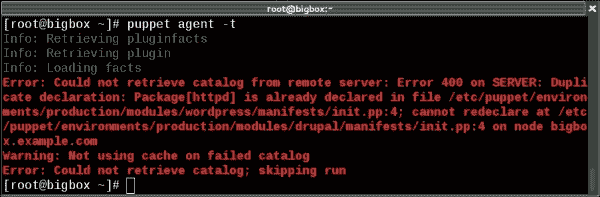

# 第五章：用户与虚拟资源

> *“没有问题，直到它成为问题。”*

本章我们将介绍以下配方：

+   使用虚拟资源

+   使用虚拟资源管理用户

+   管理用户的 SSH 访问

+   管理用户的自定义文件

+   使用导出的资源

# 引言

用户可能会非常麻烦。我不是说那些人，尽管这有时确实是事实。但如果没有某种集中的配置管理，保持 UNIX 用户账户和文件权限在一网络中同步，尤其是当网络中有些机器运行不同操作系统时，会非常具有挑战性。

每个新加入组织的开发者都需要在每台机器上拥有一个账户，且需要`sudo`权限和组成员资格，并且需要将他们的 SSH 密钥授权给多个不同的账户。需要手动处理这些事务的系统管理员将整天忙碌，而使用 Puppet 的系统管理员只需几分钟就能完成工作，并去享受早午餐。

本章将介绍一些管理用户及其相关资源的实用模式和技巧。用户也是虚拟资源的最常见应用之一，所以我们将详细探讨这些内容。在最后一节中，我们将介绍与虚拟资源相关的导出资源。

# 使用虚拟资源

Puppet 中的虚拟资源看起来可能复杂且令人困惑，但实际上它们非常简单。它们和普通资源完全一样，但在实现（"使其成为现实"的意义上）之前，它们并不会生效；而普通资源每个节点只能声明一次（例如，两个类不能声明相同的资源）。虚拟资源则可以被实现多次，任你所愿。

当你需要在机器之间迁移应用程序和服务时，这非常有用。如果两个使用相同资源的应用程序最终共享一台机器，除非你将该资源虚拟化，否则它们会导致冲突。

为了更清楚地说明这一点，让我们来看一个典型的场景，在这个场景中，虚拟资源可能会派上用场。

你负责两个流行的 Web 应用程序：WordPress 和 Drupal。它们都是运行在 Apache 上的 Web 应用程序，因此都需要安装 Apache 软件包。WordPress 的定义可能类似于以下内容：

```
class wordpress {
  package {'httpd':
    ensure => 'installed',
  }
  service {'httpd':
    ensure => 'running',
    enable => true,
  }
}
```

Drupal 的定义可能如下所示：

```
class drupal {
  package {'httpd':
    ensure => 'installed',
  }
  service {'httpd':
    ensure => 'running',
    enable => true,
  }
}
```

一切顺利，直到你需要将两个应用程序整合到同一台服务器上：

```
node 'bigbox' {
  include wordpress
  include drupal
}
```

现在，Puppet 会抱怨，因为你试图定义两个同名的资源：`httpd`。



你可以从其中一个类中删除重复的 Apache 包定义，但没有包含 Apache 的节点将会失败。你可以通过将 Apache 包放入它自己的类中，并在需要的地方使用`include apache`来避免这个问题；Puppet 不介意你多次包含同一个类。实际上，将 Apache 放入它自己的类中解决了大多数问题，但总的来说，这种方法的缺点是每个可能冲突的资源都必须有自己的类。

虚拟资源可以用来解决这个问题。虚拟资源就像一个普通的资源，只是它以`@`字符开头：

```
@package { 'httpd': ensure => installed }
```

你可以将它视为一个占位符资源；你想定义它，但不确定是否会使用它。Puppet 会读取并记住虚拟资源的定义，但直到你调用`realize`，它才会真正创建该资源。

要创建资源，使用`realize`函数：

```
realize(Package['httpd'])
```

你可以在资源上调用`realize`任意多次，它不会导致冲突。因此，当多个不同的类都需要相同的资源，并且它们可能需要在同一个节点上共存时，虚拟资源是一个不错的选择。

## 如何操作...

这是使用虚拟资源构建示例的方法：

1.  创建一个包含以下内容的虚拟模块：

    ```
    class virtual {
      @package {'httpd': ensure => installed }
      @service {'httpd': 
        ensure  => running,
        enable  => true,
        require => Package['httpd']
      }
    }
    ```

1.  创建一个包含以下内容的 Drupal 模块：

    ```
    class drupal {
      include virtual
      realize(Package['httpd'])
      realize(Service['httpd'])
    }

    ```

1.  创建一个包含以下内容的 WordPress 模块：

    ```
    class wordpress {
      include virtual
      realize(Package['httpd'])
      realize(Service['httpd'])
    }
    ```

1.  修改你的`site.pp`文件如下：

    ```
    node 'bigbox' {
      include drupal
      include wordpress
    }
    ```

1.  运行 Puppet：

    ```
    bigbox# puppet agent -t
    Info: Caching catalog for bigbox.example.com
    Info: Applying configuration version '1413179615'
    Notice: /Stage[main]/Virtual/Package[httpd]/ensure: created
    Notice: /Stage[main]/Virtual/Service[httpd]/ensure: ensure changed 'stopped' to 'running'
    Info: /Stage[main]/Virtual/Service[httpd]: Unscheduling refresh on Service[httpd]
    Notice: Finished catalog run in 6.67 seconds

    ```

## 它是如何工作的...

你将包和服务定义为虚拟资源，放在一个地方：`virtual`类。所有节点都可以包含这个类，你可以将所有虚拟服务和包放在其中。在你调用`realize`之前，任何包都不会真正安装在节点上，服务也不会启动：

```
class virtual {
  @package { 'httpd': ensure => installed }
}
```

每个需要 Apache 包的类都可以在此虚拟资源上调用`realize`：

```
class drupal {
  include virtual
  realize(Package['httpd'])
}
```

Puppet 知道，因为你将资源设为虚拟，它知道你打算多次引用相同的包，而不是无意中创建两个同名的资源。因此，它会做出正确的处理。

## 还有更多内容...

要实现虚拟资源，你也可以使用集合*spaceship*语法：

```
Package <| title = 'httpd' |>
```

这种语法的优势在于你不局限于资源名称；你也可以使用标签，例如：

```
Package <| tag = 'web' |>
```

或者，你也可以通过将查询部分留空，直接指定资源类型的所有实例：

```
Package <| |>
```

# 使用虚拟资源管理用户

用户是一个很好的例子，它可能需要被多个类实现。考虑以下情况。为了简化大量机器的管理，你为两类用户定义了类：`developers`（开发者）和`sysadmins`（系统管理员）。所有机器都需要包括`sysadmins`，但只有部分机器需要`developers`：

```
node 'server' { 
  include user::sysadmins 
}

node 'webserver' {
  include user::sysadmins 
  include user::developers 
}
```

然而，一些用户可能同时是多个组的成员。如果每个组只是将其成员声明为常规的`user`资源，这会在节点同时包含`developers`和`sysadmins`类时导致冲突，正如在`webserver`示例中所见。

为了避免这种冲突，一种常见的做法是将所有用户设为虚拟资源，并在一个单独的`user::virtual`类中定义，该类会被每台机器包含，然后根据需要在需要的地方实现这些用户。这样，如果一个用户是多个组的成员，就不会产生冲突。

## 如何实现……

按照以下步骤创建`user::virtual`类：

1.  创建文件`modules/user/manifests/virtual.pp`，并包含以下内容：

    ```
    class user::virtual {
      @user { 'thomas':  ensure => present }
      @user { 'theresa': ensure => present }
      @user { 'josko':   ensure => present }
      @user { 'nate':    ensure => present }
    }
    ```

1.  创建文件`modules/user/manifests/developers.pp`，并包含以下内容：

    ```
    class user::developers {
      realize(User['theresa'])
      realize(User['nate'])
    }
    ```

1.  创建文件`modules/user/manifests/sysadmins.pp`，并包含以下内容：

    ```
    class user::sysadmins {
      realize(User['thomas'])
      realize(User['theresa'])
      realize(User['josko'])
    }
    ```

1.  修改你的`nodes.pp`文件如下：

    ```
    node 'cookbook' {
      include user::virtual
      include user::sysadmins
      include user::developers
    }
    ```

1.  运行 Puppet：

    ```
    cookbook# puppet agent -t
    Info: Caching catalog for cookbook.example.com
    Info: Applying configuration version '1413180590'
    Notice: /Stage[main]/User::Virtual/User[theresa]/ensure: created
    Notice: /Stage[main]/User::Virtual/User[nate]/ensure: created
    Notice: /Stage[main]/User::Virtual/User[thomas]/ensure: created
    Notice: /Stage[main]/User::Virtual/User[josko]/ensure: created
    Notice: Finished catalog run in 0.47 seconds

    ```

## 它是如何工作的……

当我们包含`user::virtual`类时，所有用户都会被声明为虚拟资源（因为我们包括了`@`符号）：

```
  @user { 'thomas':  ensure => present }
  @user { 'theresa': ensure => present }
  @user { 'josko':   ensure => present }
  @user { 'nate':    ensure => present }
```

也就是说，这些资源存在于 Puppet 的目录中；它们可以被其他资源引用和链接，并且在各方面与常规资源完全相同，只是 Puppet 并不会实际在机器上创建相应的用户。

为了让这种情况发生，我们需要在虚拟资源上调用`realize`。当我们包含`user::sysadmins`类时，会得到以下代码：

```
  realize(User['thomas'])
  realize(User['theresa'])
  realize(User['josko'])
```

在虚拟资源上调用`realize`告诉 Puppet，“我现在想使用这个资源”。正如我们从运行输出中看到的那样，这正是它所做的：

```
Notice: /Stage[main]/User::Virtual/User[theresa]/ensure: created

```

然而，Theresa 同时属于`developers`和`sysadmins`两个类！这是不是意味着我们会在同一资源上调用`realize`两次？

```
realize(User['theresa'])
...
realize(User['theresa'])
```

是的，确实如此，而且没问题。你被明确允许多次实现资源，而且不会产生冲突。只要某个类的某处调用了`realize`，Theresa 的账户就会被创建。未实现的资源在目录编译时会被丢弃。

## 还有更多……

当你使用这种模式来管理自己的用户时，每个节点都应该包含`user::virtual`类，作为你基本配置的一部分。这个类会声明你组织或站点中的所有用户（作为虚拟资源）。这也应该包括那些仅用于运行应用程序或服务的用户（例如`Apache`、`www-data`或`deploy`等）。然后，你可以根据需要在各个节点或特定类中实现这些用户。

对于生产环境使用，你可能还需要为每个用户或组指定 UID 和 GID，以确保这些数字标识符在整个网络中同步。你可以通过`user`资源的`uid`和`gid`参数来实现这一点。

### 注意

如果你没有指定用户的 UID，例如，你将只获得给定机器上下一个可用的 ID 号码，因此同一个用户在不同机器上的 UID 会不同。这可能会导致在使用共享存储或在机器之间移动文件时出现权限问题。

在将用户定义为虚拟资源时，一种常见的做法是根据用户在组织中的角色为他们分配标签。然后，你可以使用 `collector` 语法代替 `realize` 来收集具有特定标签的用户。

例如，参见以下代码片段：

```
@user { 'thomas':  ensure => present, tag => 'sysadmin' }
@user { 'theresa': ensure => present, tag => 'sysadmin' }
@user { 'josko':   ensure => present, tag => 'dev' }
User <| tag == 'sysadmin' |>
```

在前面的示例中，只有用户 `thomas` 和 `theresa` 会被包括在内。

## 另请参阅

+   本章中的 *使用虚拟资源* 配方

+   本章中的 *管理用户自定义文件* 配方

# 管理用户的 SSH 访问

一种合理的服务器访问控制方法是使用带有密码保护的 SSH 密钥的命名用户帐户，而不是让用户共享一个具有广泛已知密码的帐户。Puppet 通过内置的 `ssh_authorized_key` 类型，使得管理变得非常简单。

如上一节所述，为了将其与虚拟用户结合使用，你可以创建一个 `define`，该定义包含 `user` 和 `ssh_authorized_key` 资源。这在为每个用户添加自定义文件和其他资源时也会非常有用。

## 如何操作...

按照以下步骤扩展你的虚拟用户类以包含 SSH 访问：

1.  创建一个新的模块 `ssh_user` 来包含我们的 `ssh_user` 定义。创建 `modules/ssh_user/manifests/init.pp` 文件如下：

    ```
    define ssh_user($key,$keytype) {
      user { $name:
        ensure     => present,
      }

      file { "/home/${name}":
        ensure => directory,
        mode   => '0700',
        owner  => $name,
        require => User["$name"]
      }
      file { "/home/${name}/.ssh":
        ensure => directory,
        mode   => '0700',
        owner  => "$name",
        require => File["/home/${name}"],
      }

      ssh_authorized_key { "${name}_key":
        key     => $key,
        type    => "$keytype",
        user    => $name,
        require => File["/home/${name}/.ssh"],
      }
    }
    ```

1.  修改你的 `modules/user/manifests/virtual.pp` 文件，注释掉之前为用户 `thomas` 定义的部分，并用以下内容替换：

    ```
    @ssh_user { 'thomas':
      key     => 'AAAAB3NzaC1yc2E...XaWM5sX0z',
      keytype => 'ssh-rsa'
    }
    ```

1.  修改你的 `modules/user/manifests/sysadmins.pp` 文件如下：

    ```
    class user::sysadmins {
        realize(Ssh_user['thomas'])
    }
    ```

1.  修改你的 `site.pp` 文件如下：

    ```
    node 'cookbook' {
      include user::virtual
      include user::sysadmins
    }
    ```

1.  运行 Puppet：

    ```
    cookbook# puppet agent -t
    Info: Caching catalog for cookbook.example.com
    Info: Applying configuration version '1413254461'
    Notice: /Stage[main]/User::Virtual/Ssh_user[thomas]/File[/home/thomas/.ssh]/ensure: created
    Notice: /Stage[main]/User::Virtual/Ssh_user[thomas]/Ssh_authorized_key[thomas_key]/ensure: created
    Notice: Finished catalog run in 0.11 seconds

    ```

## 它是如何工作的...

对于我们的 `user::virtual` 类中的每个用户，我们需要创建：

+   用户帐户本身

+   用户的主目录和 `.ssh` 目录

+   用户的 `.ssh/authorized_keys` 文件

我们可以为每个用户声明单独的资源来实现所有这些功能，但更简单的做法是创建一个定义，将它们包装成一个单独的资源。通过为我们的定义创建一个新模块，我们可以在任何地方（任何作用域内）引用 `ssh_user`：

```
define ssh_user ($key, $keytype) { 
  user { $name:
    ensure     => present,
  }
```

创建用户后，我们可以创建主目录；我们需要先有用户，这样在分配所有权时就可以使用用户名，`owner => $name`：

```
  file { "/home/${name}":
    ensure => directory,
    mode => '0700',
    owner => $name,
    require => User["$name"]
  }
```

### 提示

Puppet 可以通过向用户资源添加 `managehome` 属性来创建用户的主目录。依赖于此机制在实践中存在问题，因为它没有考虑到在 Puppet 之外创建的没有主目录的用户。

接下来，我们需要确保在用户的主目录中存在`.ssh`目录。我们需要主目录，`File["/home/${name}"]`，因为在创建该子目录之前，这个主目录需要先存在。这意味着用户已经存在，因为主目录需要用户：

```
  file { "/home/${name}/.ssh":
    ensure => directory,
    mode   => '0700',
    owner  => $name ,
    require => File["/home/${name}"],
  }
```

最后，我们创建了`ssh_authorized_key`资源，再次要求包含该文件夹（`File["/home/${name}/.ssh"]`）。我们使用`$key`和`$keytype`变量为`ssh_authorized_key`类型分配密钥和类型参数，如下所示：

```
  ssh_authorized_key { "${name}_key":
    key     => $key,
    type    => "$keytype",
    user    => $name,
    require => File["/home/${name}/.ssh"],
  }
}
```

当我们为`thomas`定义`ssh_user`资源时，我们传递了`$key`和`$keytype`变量：

```
@ssh_user { 'thomas':
  key => 'AAAAB3NzaC1yc2E...XaWM5sX0z',
  keytype => 'ssh-rsa'
}
```

### 提示

前面代码片段中的`key`值是 ssh 密钥的公钥值；它通常存储在`id_rsa.pub`文件中。

现在，一切都定义好了，我们只需要在`thomas`上调用`realize`，让所有这些资源生效：

```
realize(Ssh_user['thomas'])
```

注意，这次我们实现的虚拟资源不仅仅是像之前那样的`user`资源，而是我们创建的`ssh_user`定义类型，它包括了用户和设置 SSH 访问所需的相关资源：

```
Notice: /Stage[main]/User::Virtual/Ssh_user[thomas]/User[thomas]/ensure: created
Notice: /Stage[main]/User::Virtual/Ssh_user[thomas]/File[/home/thomas]/ensure: created
Notice: /Stage[main]/User::Virtual/Ssh_user[thomas]/File[/home/thomas/.ssh]/ensure: created
Notice: /Stage[main]/User::Virtual/Ssh_user[thomas]/Ssh_authorized_key[thomas_key]/ensure: created

```

## 还有更多内容...

当然，你可以向`ssh_user`定义中添加任何资源，让 Puppet 为新用户自动创建这些资源。在下一个例子中，我们会看到如何做，*管理用户的自定义文件*。

# 管理用户的自定义文件

用户倾向于定制他们的 shell 环境、终端颜色、别名等。这通常通过在他们的主目录中放置多个**dotfiles**来实现，例如`.bash_profile`或`.vimrc`。

你可以通过扩展我们在本章中开发的虚拟用户设置，使用 Puppet 来同步和更新每个用户的 dotfiles 到多台机器上。我们将启动一个新模块`admin_user`，并使用文件类型的`recurse`属性将文件复制到每个用户的主目录中。

## 如何做到这一点...

你需要做的事情如下：

1.  在`modules/admin_user/manifests/init.pp`文件中创建`admin_user`定义类型（`define admin_user`），如下所示：

    ```
    define admin_user ($key, $keytype, $dotfiles = false) { 
      $username = $name
      user { $username:
        ensure     => present,
      }
      file { "/home/${username}/.ssh":
        ensure  => directory,
        mode    => '0700',
        owner   => $username,
        group   => $username,
        require => File["/home/${username}"],
      }
      ssh_authorized_key { "${username}_key":
        key     => $key,
        type    => "$keytype",
        user    => $username,
        require => File["/home/${username}/.ssh"],
      }
      # dotfiles
      if $dotfiles == false {
        # just create the directory
        file { "/home/${username}":
          ensure  => 'directory',
          mode    => '0700',
          owner   => $username,
          group   => $username,
          require => User["$username"]
        }
      } else {
        # copy in all the files in the subdirectory
        file { "/home/${username}":
          recurse => true,
          mode    => '0700',
          owner   => $username,
          group   => $username,
          source  => "puppet:///modules/admin_user/${username}",
          require => User["$username"]
        }
      }
    }
    ```

1.  修改`modules/user/manifests/sysadmins.pp`文件，如下所示：

    ```
    class user::sysadmins {
      realize(Admin_user['thomas'])
    }
    ```

1.  修改`modules/user/manifests/virtual.pp`中的`thomas`定义，如下所示：

    ```
    @ssh_user { 'thomas':
      key => 'AAAAB3NzaC1yc2E...XaWM5sX0z',
      keytype => 'ssh-rsa',
      dotfiles => true
    }
    ```

1.  在`admin_user`模块中为用户`thomas`的文件创建一个子目录：

    ```
    $ mkdir -p modules/admin_user/files/thomas

    ```

1.  为用户`thomas`创建 dotfiles，放在你刚刚创建的目录中：

    ```
    $ echo "alias vi=vim" > modules/admin_user/files/thomas/.bashrc
    $ echo "set tabstop=2" > modules/admin_user/files/thomas/.vimrc

    ```

1.  确保你的`site.pp`文件如下所示：

    ```
    node 'cookbook' {
      include user::virtual
      include user::sysadmins
    }
    ```

1.  运行 Puppet：

    ```
    cookbook# puppet agent -t
    Info: Caching catalog for cookbook.example.com
    Info: Applying configuration version '1413266235'
    Notice: /Stage[main]/User::Virtual/Admin_user[thomas]/User[thomas]/ensure: created
    Notice: /Stage[main]/User::Virtual/Admin_user[thomas]/File[/home/thomas]/ensure: created
    Notice: /Stage[main]/User::Virtual/Admin_user[thomas]/File[/home/thomas/.vimrc]/ensure: defined content as '{md5}cb2af2d35b18b5ac2539057bd429d3ae'
    Notice: /Stage[main]/User::Virtual/Admin_user[thomas]/File[/home/thomas/.bashrc]/ensure: defined content as '{md5}033c3484e4b276e0641becc3aa268a3a'
    Notice: /Stage[main]/User::Virtual/Admin_user[thomas]/File[/home/thomas/.ssh]/ensure: created
    Notice: /Stage[main]/User::Virtual/Admin_user[thomas]/Ssh_authorized_key[thomas_key]/ensure: created
    Notice: Finished catalog run in 0.36 seconds

    ```

## 它是如何工作的...

我们创建了一个新的`admin_user`定义，它会递归地定义主目录，如果`$dotfiles`值不是`false`（默认值）的话：

```
  if $dotfiles == 'false' {
    # just create the directory
    file { "/home/${username}":
      ensure  => 'directory',
      mode    => '0700',
      owner   => $username,
      group   => $username,
      require => User["$username"]
    }
  } else {
    # copy in all the files in the subdirectory
    file { "/home/${username}":
      recurse => true,
      mode    => '0700',
      owner   => $username,
      group   => $username,
      source  => "puppet:///modules/admin_user/${username}",
      require => User["$username"]
    }
  }
```

我们在`admin_user`模块中创建了一个目录来存放用户的 dotfiles；该目录中的所有文件都会被复制到用户的主目录中，如下所示在 Puppet 运行输出中的命令行：

```
Notice: /Stage[main]/User::Virtual/Admin_user[thomas]/File[/home/thomas/.vimrc]/ensure: defined content as '{md5}cb2af2d35b18b5ac2539057bd429d3ae'
Notice: /Stage[main]/User::Virtual/Admin_user[thomas]/File[/home/thomas/.bashrc]/ensure: defined content as '{md5}033c3484e4b276e0641becc3aa268a3a'

```

使用`recurse`选项允许我们为每个用户添加任意多的 dotfiles，而不必修改用户的定义。

## 还有更多内容...

我们可以指定主目录的`source`属性为用户可以放置自己点文件（dotfiles）的目录。这样，每个用户可以修改自己的点文件，并将其传输到网络中所有节点，而无需我们参与其中。

## 另见

+   本章中的*管理虚拟资源的用户*配方

# 使用导出资源

到目前为止，我们的所有配方都处理的是单台机器。使用 Puppet，可以使一个节点的资源影响另一个节点。此交互由**导出资源**进行管理。导出资源就像您为节点定义的任何资源，但它们不是应用于创建它们的节点，而是导出供环境中所有节点使用。导出资源可以被看作是虚拟资源，超越了节点所在的范畴，存在于节点之外。

导出资源有两个操作。当一个导出资源被创建时，它被称为已定义。当所有导出资源被收集时，它们被称为已收集。定义导出资源类似于虚拟资源；相关资源的前面会加上两个`@`符号。例如，要将文件资源定义为外部资源，使用`@@file`。收集资源是通过飞船操作符`<<| |>>`来完成的；这被认为看起来像一艘飞船。要收集导出的文件资源（`@@file`），可以使用`File <<| |>>`。

有许多使用导出资源的示例；最常见的一个是涉及 SSH 主机密钥。使用导出资源，可以让所有运行 Puppet 的机器与其他连接的节点共享其 SSH 主机密钥。这里的想法是，每台机器导出自己的主机密钥，然后收集其他机器的所有密钥。在我们的示例中，我们将创建两个类；首先是一个从每个节点导出 SSH 主机密钥的类。我们将把这个类包含在我们的基类中。第二个类是一个收集类，它收集 SSH 主机密钥。我们将把这个类应用到我们的跳板机或 SSH 登录服务器上。

### 注意

跳板机（Jumpboxes）是具有特殊防火墙规则的机器，允许它们登录到不同的位置。

## 准备工作

要使用导出资源，您需要在 Puppet 主节点上启用 storeconfigs。可以在无主（去中心化）部署中使用导出资源；然而，我们假设您在本示例中使用的是集中式模型。在第二章，*Puppet 基础架构*中，我们使用 forge 中的 puppetdb 模块配置了 puppetdb。如果需要，也可以使用其他后端；但这些除 puppetdb 外都已被弃用。更多信息请访问以下链接：[`projects.puppetlabs.com/projects/puppet/wiki/Using_Stored_Configuration`](http://projects.puppetlabs.com/projects/puppet/wiki/Using_Stored_Configuration)。

确保您的 Puppet 主节点配置为使用 puppetdb 作为 storeconfigs 容器。

## 如何做...

我们将创建一个 `ssh_host` 类来导出主机的 `ssh` 密钥，并确保它包含在我们的基础类中。

1.  创建第一个类，`base::ssh_host`，我们将在我们的基础类中包含它：

    ```
    class base::ssh_host {
      @@sshkey{"$::fqdn":
        ensure       => 'present',
        host_aliases => ["$::hostname","$::ipaddress"],
        key          => $::sshdsakey,
        type         => 'dsa',
      }
    }
    ```

1.  记得从基础类定义内部包含这个类：

    ```
    class base {
      ...
      include ssh_host
    }
    ```

1.  为 `jumpbox` 创建一个定义，可以在类中或 `jumpbox` 的节点定义中：

    ```
    node 'jumpbox' {
      Sshkey <<| |>>
    }
    ```

1.  现在在几个节点上运行 Puppet，以创建导出的资源。在我的例子中，我在 Puppet 服务器和我的第二个示例节点（`node2`）上运行了 Puppet。最后，在 `jumpbox` 上运行 Puppet，验证其他节点的 SSH 主机密钥是否已收集：

    ```
    [root@jumpbox ~]# puppet agent -t 
    Info: Caching catalog for jumpbox.example.com
    Info: Applying configuration version '1413176635'
    Notice: /Stage[main]/Main/Node[jumpbox]/Sshkey[node2.example.com]/ensure: created
    Notice: /Stage[main]/Main/Node[jumpbox]/Sshkey[puppet]/ensure: created
    Notice: Finished catalog run in 0.08 seconds

    ```

## 它是如何工作的...

我们为节点创建了一个 `sshkey` 资源，使用了 facter 提供的 `fqdn`、`hostname`、`ipaddress` 和 `sshdsakey` 事实。我们使用 `fqdn` 作为导出资源的标题，因为每个导出资源必须有唯一的名称。我们可以假设一个节点的 `fqdn` 在我们的组织中是唯一的（尽管有时它们可能不是；Puppet 在最不经意时也能找到这种情况）。然后我们继续定义节点可能被识别的别名。我们使用主机名变量作为一个别名，机器的主 IP 地址作为另一个别名。如果您有其他节点命名约定，可以在这里添加其他别名。我们假设主机使用 DSA 密钥，因此我们在定义中使用了 `sshdsakey` 变量。在大型安装中，您会将此定义包装在测试中，以确保 DSA 密钥存在。如果存在 RSA 密钥，您也可以使用它们。

定义并导出 `sshkey` 资源后，我们接着创建了一个 `jumpbox` 节点定义。在这个定义中，我们使用了航天飞机语法 `Sshkey <<| |>>` 来收集所有定义的导出 `sshkey` 资源。

## 还有更多内容...

在定义导出资源时，您可以为资源添加标签属性，以创建导出资源的子集。例如，如果您的网络中有开发和生产区域，您可以为每个区域创建不同的 `sshkey` 资源组，如以下代码片段所示：

```
@@sshkey{"$::fqdn":
    host_aliases => ["$::hostname","$::ipaddress"],
    key          => $::sshdsakey,
    type         => 'dsa',
    tag          => "$::environment",
  }
```

然后，您可以修改 `jumpbox`，例如，只收集生产环境的资源，如下所示：

```
Sshkey <<| tag == 'production' |>>
```

处理导出资源时需要记住的两件重要事情：首先，每个资源在您的安装中必须有唯一的名称。在标题中使用 `fqdn` 域名通常足以保持定义的唯一性。其次，任何资源都可以是虚拟的。即使是您创建的定义类型也可以被导出。导出的资源可以用来实现一些复杂的配置，这些配置会在机器发生变化时自动调整。

### 注意

在处理大量节点（超过 5,000 个）时，需要特别注意的是，导出的资源可能需要很长时间才能收集和应用，尤其是当每个导出的资源都会创建一个文件时。
