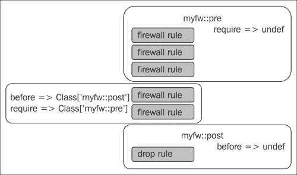

# 第八章：节点间协调

|   | *“休息不是懒散，有时在夏日的午后躺在树下，听着水流的潺潺声，或看着云朵飘过天空，绝不是浪费时间。”* |   |
| --- | --- | --- |
|   | --*约翰·拉博克* |

在本章中，我们将介绍以下内容：

+   使用 iptables 管理防火墙

+   使用 Heartbeat 构建高可用服务

+   管理 NFS 服务器和文件共享

+   使用 HAProxy 对多个 Web 服务器进行负载均衡

+   使用 Puppet 管理 Docker

# 介绍

Puppet 强大的功能可以管理单台服务器的配置，但当需要协调多台机器时，它的作用更加明显。在本章中，我们将探讨如何使用 Puppet 来帮助你创建高可用集群、在网络中共享文件、设置自动化防火墙，并通过负载均衡来最大化现有机器的效能。我们将使用导出的资源作为节点之间的通信手段。

# 使用 iptables 管理防火墙

在本章中，我们将开始配置需要通过网络进行主机间通信的服务。大多数 Linux 发行版默认会运行基于主机的防火墙 **iptables**。如果你希望主机之间可以互相通信，你有两个选择：关闭 iptables 或者配置 iptables 允许通信。

我倾向于保持 iptables 开启并配置访问控制。启用 iptables 就是为你的网络防线增加了一层保护。iptables 并不是一剂能够让系统变得绝对安全的“魔法药丸”，但它会阻止你无意间暴露给网络的服务。

正确配置 iptables 是一项复杂的任务，需要对网络有深入的了解。这里展示的示例是简化版。如果你不熟悉 iptables，建议在继续之前先研究一下 iptables。更多信息可以参考 [`wiki.centos.org/HowTos/Network/IPTables`](http://wiki.centos.org/HowTos/Network/IPTables) 或 [`help.ubuntu.com/community/IptablesHowTo`](https://help.ubuntu.com/community/IptablesHowTo)。

## 准备工作

在以下示例中，我们将使用 Puppet Labs 防火墙模块来配置 iptables。通过 `puppet module install` 将该模块安装到你的 Git 仓库中进行准备：

```
t@mylaptop ~ $ puppet module install -i ~/puppet/modules puppetlabs-firewall
Notice: Preparing to install into /home/thomas/puppet/modules ...
Notice: Downloading from https://forgeapi.puppetlabs.com ...
/home/thomas/puppet/modules
└── puppetlabs-firewall (v1.2.0)

```

## 如何实现...

为了配置防火墙模块，我们需要创建一组规则，这些规则会在所有其他规则之前应用。作为一个简单的例子，我们将创建以下规则：

+   允许所有流量通过回环 (lo) 接口

+   允许所有 ICMP 流量

+   允许所有属于已建立连接的流量（ESTABLISHED, RELATED）

+   允许所有 TCP 流量通过 22 端口（ssh）

我们将创建一个 `myfw`（我的防火墙）类来配置防火墙模块。然后，我们将在节点上应用 `myfw` 类，来配置该节点上的 iptables：

1.  创建一个类来包含这些规则，并将其命名为 `myfw::pre`：

    ```
    class myfw::pre {
      Firewall {
        require => undef,
      }
      firewall { '0000 Allow all traffic on loopback':
        proto => 'all',
        iniface => 'lo',
        action => 'accept',
      }
      firewall { '0001 Allow all ICMP':
        proto => 'icmp',
        action => 'accept',
      }
      firewall { '0002 Allow all established traffic':
        proto => 'all',
        state => ['RELATED', 'ESTABLISHED'],
        action => 'accept',
      }
      firewall { '0022 Allow all TCP on port 22 (ssh)':
        proto => 'tcp',
        port => '22',
        action => 'accept',
      }
    }
    ```

1.  当流量不匹配任何先前的规则时，我们希望有一条最终的规则来丢弃流量。创建`myfw::post`类来包含默认的丢弃规则：

    ```
    class myfw::post {
      firewall { '9999 Drop all other traffic':
        proto  => 'all',
        action => 'drop',
        before => undef,
      } 
    }
    ```

1.  创建一个`myfw`类，其中包括`myfw::pre`和`myfw::post`来配置防火墙：

    ```
    class myfw {
      include firewall
      # our rulesets
      include myfw::post
      include myfw::pre

      # clear all the rules
      resources { "firewall":
        purge => true
      }

      # resource defaults
      Firewall {
        before => Class['myfw::post'],
        require => Class['myfw::pre'],
      }
    }
    ```

1.  将`myfw`类附加到节点定义上；我将对我的食谱节点执行此操作：

    ```
    node cookbook {
      include myfw
    }
    ```

1.  在食谱上运行 Puppet，以查看防火墙规则是否已应用：

    ```
    [root@cookbook ~]# puppet agent -t 
    Info: Retrieving pluginfacts
    Info: Retrieving plugin
    Info: Loading facts
    Info: Caching catalog for cookbook.example.com
    Info: Applying configuration version '1415512948'
    Notice: /Stage[main]/Myfw::Pre/Firewall[000 Allow all traffic on loopback]/ensure: created
    Notice: /File[/etc/sysconfig/iptables]/seluser: seluser changed 'unconfined_u' to 'system_u'
    Notice: /Stage[main]/Myfw::Pre/Firewall[0001 Allow all ICMP]/ensure: created
    Notice: /Stage[main]/Myfw::Pre/Firewall[0022 Allow all TCP on port 22 (ssh)]/ensure: created
    Notice: /Stage[main]/Myfw::Pre/Firewall[0002 Allow all established traffic]/ensure: created
    Notice: /Stage[main]/Myfw::Post/Firewall[9999 Drop all other traffic]/ensure: created
    Notice: /Stage[main]/Myfw/Firewall[9003 49bcd611c61bdd18b235cea46ef04fae]/ensure: removed
    Notice: Finished catalog run in 15.65 seconds

    ```

1.  使用`iptables-save`验证新规则：

    ```
    # Generated by iptables-save v1.4.7 on Sun Nov  9 01:18:30 2014
    *filter
    :INPUT ACCEPT [0:0]
    :FORWARD ACCEPT [0:0]
    :OUTPUT ACCEPT [74:35767]
    -A INPUT -i lo -m comment --comment "0000 Allow all traffic on loopback" -j ACCEPT 
    -A INPUT -p icmp -m comment --comment "0001 Allow all ICMP" -j ACCEPT 
    -A INPUT -m comment --comment "0002 Allow all established traffic" -m state --state RELATED,ESTABLISHED -j ACCEPT 
    -A INPUT -p tcp -m multiport --ports 22 -m comment --comment "022 Allow all TCP on port 22 (ssh)" -j ACCEPT 
    -A INPUT -m comment --comment "9999 Drop all other traffic" -j DROP 
    COMMIT
    # Completed on Sun Nov  9 01:18:30 2014

    ```

## 它是如何工作的...

这是一个很好的例子，展示了如何使用元参数以较少的努力实现复杂的顺序。我们的`myfw`模块实现了以下配置：



`myfw::pre`类中的所有规则都确保在我们定义的任何其他防火墙规则之前执行。`myfw::post`中的规则则确保在任何其他防火墙规则之后执行。因此，我们首先执行`myfw::pre`中的规则，然后是其他规则，最后是`myfw::post`中的规则。

我们为`myfw`类的定义设置了这个依赖关系，使用资源默认值：

```
  # resource defaults
  Firewall {
    before => Class['myfw::post'],
    require => Class['myfw::pre'],
  }
```

这些默认设置首先告诉 Puppet，任何防火墙资源应该在`myfw::post`类中的任何内容之前执行。其次，它们告诉 Puppet，任何防火墙资源应该要求`myfw::pre`中的资源已经执行过。

当我们定义`myfw::pre`类时，我们在防火墙资源的资源默认值中移除了 require 语句。这样可以确保`myfw::pre`类中的资源在执行之前不会相互依赖（否则 Puppet 会抱怨我们创建了一个循环依赖）：

```
Firewall {
    require => undef,
  }
```

我们在`myfw::post`定义中使用了相同的技巧。在这种情况下，我们在 post 类中只有一条规则，因此我们简单地移除了`before`要求：

```
firewall { '9999 Drop all other traffic':
    proto  => 'all',
    action => 'drop',
    before => undef,
  }
```

最后，我们加入一条规则，用于清除系统上所有现有的 iptables 规则。这样做是为了确保我们拥有一套一致的规则；只有 Puppet 中定义的规则会被保留：

```
# clear all the rules
resources { "firewall":
  purge => true
}
```

## 还有更多...

正如我们所提示的，我们现在可以在我们的清单中定义防火墙资源，并在初始化规则（`myfw::pre`）之后应用到 iptables 配置中，但在最终的丢弃规则（`myfw::post`）之前。例如，要允许我们的食谱机器上 HTTP 流量，请按照以下方式修改节点定义：

```
  include myfw
  firewall {'0080 Allow HTTP':
    proto  => 'tcp',
    action => 'accept',
    port  => 80,
  }
```

在食谱上运行 Puppet：

```
[root@cookbook ~]# puppet agent -t
Info: Retrieving pluginfacts
Info: Retrieving plugin
Info: Loading facts
Info: Caching catalog for cookbook.example.com
Info: Applying configuration version '1415515392'
Notice: /File[/etc/sysconfig/iptables]/seluser: seluser changed 'unconfined_u' to 'system_u'
Notice: /Stage[main]/Main/Node[cookbook]/Firewall[0080 Allow HTTP]/ensure: created
Notice: Finished catalog run in 2.74 seconds

```

验证新规则是否已添加到最后一条`myfw::pre`规则之后（端口 22，ssh）：

```
[root@cookbook ~]# iptables-save
# Generated by iptables-save v1.4.7 on Sun Nov  9 01:46:38 2014
*filter
:INPUT ACCEPT [0:0]
:FORWARD ACCEPT [0:0]
:OUTPUT ACCEPT [41:26340]
-A INPUT -i lo -m comment --comment "0000 Allow all traffic on loopback" -j ACCEPT 
-A INPUT -p icmp -m comment --comment "0001 Allow all ICMP" -j ACCEPT 
-A INPUT -m comment --comment "0002 Allow all established traffic" -m state --state RELATED,ESTABLISHED -j ACCEPT 
-A INPUT -p tcp -m multiport --ports 22 -m comment --comment "0022 Allow all TCP on port 22 (ssh)" -j ACCEPT 
-A INPUT -p tcp -m multiport --ports 80 -m comment --comment "0080 Allow HTTP" -j ACCEPT 
-A INPUT -m comment --comment "9999 Drop all other traffic" -j DROP 
COMMIT
# Completed on Sun Nov  9 01:46:38 2014

```

### 提示

Puppet Labs 的防火墙模块有一个内建的顺序概念，我们的所有防火墙资源标题都以数字开头。这是一个要求。该模块会尝试根据标题来排序资源。在命名防火墙资源时，您应该牢记这一点。

在下一节中，我们将使用我们的防火墙模块确保两个节点可以按要求进行通信。

# 使用 Heartbeat 构建高可用性服务

高可用服务是那些能够在单台机器或网络连接故障的情况下仍能继续运行的服务。高可用性的主要技术是冗余，也就是通过增加硬件来解决问题。虽然单台服务器最终会发生故障是不可避免的，但两台服务器同时发生故障的可能性非常小，这为大多数应用提供了良好的冗余水平。

构建冗余服务器对的最简单方法之一是让它们共享一个 IP 地址，通过 Heartbeat 实现。Heartbeat 是一个在两台机器上运行的守护进程，它们之间会定期交换信息——心跳。一个服务器是主服务器，通常拥有资源；在这种情况下，是 IP 地址（称为虚拟 IP，或 VIP）。如果从主服务器未能接收到心跳，辅助服务器可以接管该地址，从而确保服务的连续性。在实际场景中，你可能希望更多的机器参与 VIP，但在这个示例中，使用两台机器已经足够。

在这个食谱中，我们将使用 Puppet 设置这两台机器，并解释如何使用它提供高可用服务。

## 准备工作

当然，你需要两台机器，以及一个额外的 IP 地址来作为 VIP。通常，你可以向 ISP 请求这个地址（如果需要的话）。在这个示例中，我将使用名为`cookbook`和`cookbook2`的两台机器，其中`cookbook`是主机。我们将把这些主机添加到 heartbeat 配置中。

## 如何做……

按照以下步骤构建示例：

1.  创建文件`modules/heartbeat/manifests/init.pp`，内容如下：

    ```
    # Manage Heartbeat
    class heartbeat {
      package { 'heartbeat':
        ensure => installed,
      }

      service { 'heartbeat':
        ensure  => running,
        enable  => true,
        require => Package['heartbeat'],
      }

      file { '/etc/ha.d/authkeys':
        content => "auth 1\n1 sha1 TopSecret",
        mode    => '0600',
        require => Package['heartbeat'],
        notify  => Service['heartbeat'],
      }
      include myfw
      firewall {'0694 Allow UDP ha-cluster':
        proto  => 'udp',
        port   => 694,
        action => 'accept',
      }
    }
    ```

1.  创建文件`modules/heartbeat/manifests/vip.pp`，内容如下：

    ```
    # Manage a specific VIP with Heartbeat
    class 
      heartbeat::vip($node1,$node2,$ip1,$ip2,$vip,$interface='eth0:1') {
      include heartbeat

      file { '/etc/ha.d/haresources':
        content => "${node1} IPaddr::${vip}/${interface}\n",
        require => Package['heartbeat'],
        notify  => Service['heartbeat'],
      }

      file { '/etc/ha.d/ha.cf':
        content => template('heartbeat/vip.ha.cf.erb'),
        require => Package['heartbeat'],
        notify  => Service['heartbeat'],
      }
    }
    ```

1.  创建文件`modules/heartbeat/templates/vip.ha.cf.erb`，内容如下：

    ```
    use_logd yes
    udpport 694
    autojoin none
    ucast eth0 <%= @ip1 %>
    ucast eth0 <%= @ip2 %>
    keepalive 1
    deadtime 10
    warntime 5
    auto_failback off
    node <%= @node1 %>
    node <%= @node2 %>
    ```

1.  按如下方式修改你的`site.pp`文件。将`ip1`和`ip2`地址替换为你两台节点的主 IP 地址，将`vip`替换为你将使用的虚拟 IP 地址，并将`node1`和`node2`替换为两台节点的主机名。（Heartbeat 使用节点的完全限定域名来确定它是否是集群的一部分，因此`node1`和`node2`的值应与每台机器上`facter fqdn`给出的值匹配。）

    ```
    node cookbook,cookbook2 {
      class { 'heartbeat::vip':
        ip1   => '192.168.122.132',
        ip2   => '192.168.122.133',
        node1 => 'cookbook.example.com',
        node2 => 'cookbook2.example.com',
        vip   => '192.168.122.200/24',
      }
    }
    ```

1.  在每台服务器上运行 Puppet：

    ```
    [root@cookbook2 ~]# puppet agent -t
    Info: Retrieving pluginfacts
    Info: Retrieving plugin
    Info: Loading facts
    Info: Caching catalog for cookbook2.example.com
    Info: Applying configuration version '1415517914'
    Notice: /Stage[main]/Heartbeat/Package[heartbeat]/ensure: created
    Notice: /Stage[main]/Myfw::Pre/Firewall[0000 Allow all traffic on loopback]/ensure: created
    Notice: /Stage[main]/Myfw::Pre/Firewall[0001 Allow all ICMP]/ensure: created
    Notice: /File[/etc/sysconfig/iptables]/seluser: seluser changed 'unconfined_u' to 'system_u'
    Notice: /Stage[main]/Myfw::Pre/Firewall[0022 Allow all TCP on port 22 (ssh)]/ensure: created
    Notice: /Stage[main]/Heartbeat::Vip/File[/etc/ha.d/haresources]/ensure: defined content as '{md5}fb9f5d9d2b26e3bddf681676d8b2129c'
    Info: /Stage[main]/Heartbeat::Vip/File[/etc/ha.d/haresources]: Scheduling refresh of Service[heartbeat]
    Notice: /Stage[main]/Heartbeat::Vip/File[/etc/ha.d/ha.cf]/ensure: defined content as '{md5}84da22f7ac1a3629f69dcf29ccfd8592'
    Info: /Stage[main]/Heartbeat::Vip/File[/etc/ha.d/ha.cf]: Scheduling refresh of Service[heartbeat]
    Notice: /Stage[main]/Heartbeat/Service[heartbeat]/ensure: ensure changed 'stopped' to 'running'
    Info: /Stage[main]/Heartbeat/Service[heartbeat]: Unscheduling refresh on Service[heartbeat]
    Notice: /Stage[main]/Myfw::Pre/Firewall[0002 Allow all established traffic]/ensure: created
    Notice: /Stage[main]/Myfw::Post/Firewall[9999 Drop all other traffic]/ensure: created
    Notice: /Stage[main]/Heartbeat/Firewall[0694 Allow UDP ha-cluster]/ensure: created
    Notice: Finished catalog run in 12.64 seconds

    ```

1.  验证 VIP 是否正在某个节点上运行（此时它应该在 cookbook 上；注意，你需要使用`ip`命令，`ifconfig`不会显示该地址）：

    ```
    [root@cookbook ~]# ip addr show dev eth0
    2: eth0: <BROADCAST,MULTICAST,UP,LOWER_UP> mtu 1500 qdisc pfifo_fast state UP qlen 1000
     link/ether 52:54:00:c9:d5:63 brd ff:ff:ff:ff:ff:ff
     inet 192.168.122.132/24 brd 192.168.122.255 scope global eth0
     inet 192.168.122.200/24 brd 192.168.122.255 scope global secondary eth0:1
     inet6 fe80::5054:ff:fec9:d563/64 scope link 
     valid_lft forever preferred_lft forever

    ```

1.  如我们所见，cookbook 上激活了`eth0:1`接口。如果你停止`cookbook`上的 heartbeat，`cookbook2`将创建`eth0:1`并接管：

    ```
    [root@cookbook2 ~]# ip a show dev eth0
    2: eth0: <BROADCAST,MULTICAST,UP,LOWER_UP> mtu 1500 qdisc pfifo_fast state UP qlen 1000
     link/ether 52:54:00:ee:9c:fa brd ff:ff:ff:ff:ff:ff
     inet 192.168.122.133/24 brd 192.168.122.255 scope global eth0
     inet 192.168.122.200/24 brd 192.168.122.255 scope global secondary eth0:1
     inet6 fe80::5054:ff:feee:9cfa/64 scope link 
     valid_lft forever preferred_lft forever

    ```

## 它是如何工作的……

我们首先需要安装 Heartbeat，使用`heartbeat`类：

```
# Manage Heartbeat
class heartbeat {
  package { 'heartbeat':
    ensure => installed,
  }
  ...
}
```

接下来，我们使用`heartbeat::vip`类来管理特定的虚拟 IP：

```
# Manage a specific VIP with Heartbeat
class 
  heartbeat::vip($node1,$node2,$ip1,$ip2,$vip,$interface='eth0:1') {
  include heartbeat
```

如你所见，该类包含一个`interface`参数；默认情况下，VIP 将配置在`eth0:1`上，但如果你需要使用不同的接口，可以通过此参数传入。

我们配置的每一对服务器都将使用相同参数的 `heartbeat::vip` 类，这些参数将用于构建 `haresources` 文件：

```
file { '/etc/ha.d/haresources':
  content => "${node1} IPaddr::${vip}/${interface}\n",
  notify  => Service['heartbeat'],
  require => Package['heartbeat'],
}
```

这告诉 Heartbeat 该管理的资源（这是一个 Heartbeat 资源，例如 IP 地址或服务，而不是 Puppet 资源）。生成的 `haresources` 文件可能如下所示：

```
cookbook.example.com IPaddr::192.168.122.200/24/eth0:1
```

该文件由 Heartbeat 按如下方式解释：

+   `cookbook.example.com`：这是主节点的名称，应该是资源的默认所有者

+   `IPaddr`：这是要管理的资源类型；在这种情况下，是一个 IP 地址

+   `192.168.122.200/24`：这是 IP 地址的值

+   `eth0:1`：这是要配置的虚拟接口，带有管理的 IP 地址

欲了解更多关于如何配置 Heartbeat 的信息，请访问高可用性网站 [`linux-ha.org/wiki/Heartbeat`](http://linux-ha.org/wiki/Heartbeat)。

我们还将构建 `ha.cf` 文件，以告诉 Heartbeat 如何在集群节点之间通信：

```
file { '/etc/ha.d/ha.cf':
  content => template('heartbeat/vip.ha.cf.erb'),
  notify  => Service['heartbeat'],
  require => Package['heartbeat'],
}
```

为此，我们使用模板文件：

```
use_logd yes
udpport 694
autojoin none
ucast eth0 <%= @ip1 %>
ucast eth0 <%= @ip2 %>
keepalive 1
deadtime 10
warntime 5
auto_failback off
node <%= @node1 %>
node <%= @node2 %>
```

这里的关键值是两个节点的 IP 地址（`ip1` 和 `ip2`）以及两个节点的名称（`node1` 和 `node2`）。

最后，我们在两台机器上创建 `heartbeat::vip` 实例，并传递相同的参数集，如下所示：

```
class { 'heartbeat::vip':
  ip1   => '192.168.122.132',
  ip2   => '192.168.122.133',
  node1 => 'cookbook.example.com',
  node2 => 'cookbook2.example.com',
  vip   => '192.168.122.200/24',
}
```

## 还有更多内容...

按照示例中所描述的设置 Heartbeat，虚拟 IP 地址默认将配置在 `cookbook` 上。如果发生干扰（例如，如果你停止或重启 `cookbook`，或者停止 `heartbeat` 服务，或机器失去网络连接），`cookbook2` 将立即接管虚拟 IP。

`ha.cf` 中的 `auto_failback` 设置决定了接下来的行为。如果 `auto_failback` 设置为 `on`，当 `cookbook` 恢复可用时，它将自动接管 IP 地址。如果没有设置 `auto_failback`，IP 地址将保持当前位置，直到你手动使其故障（例如，通过停止 `cookbook2` 上的 `heartbeat`）。

Heartbeat 管理的虚拟 IP 的一个常见用途是提供高度可用的网站或服务。为此，您需要将服务的 DNS 名称（例如 `cat-pictures.com`）指向虚拟 IP。对该服务的请求将被路由到当前拥有虚拟 IP 的服务器。如果该服务器出现故障，请求将转发到另一台服务器，用户不会察觉到服务中断。

Heartbeat 在之前的示例中效果很好，但这种形式并不广泛使用。Heartbeat 仅在两节点集群中有效；对于 n 节点集群，应使用更新的 pacemaker 项目。有关 Heartbeat、pacemaker、corosync 及其他集群软件包的更多信息，请访问 [`www.linux-ha.org/wiki/Main_Page`](http://www.linux-ha.org/wiki/Main_Page)。

管理集群配置是导出资源有用的一方面。集群中的每个节点将导出有关自身的信息，然后其他集群成员可以收集这些信息。使用 puppetlabs-concat 模块，您可以使用来自集群中所有节点的导出 concat 碎片构建配置文件。

在开始自己的模块之前，记得查看 Forge。如果没有其他用途，你至少可以获得一些可以在自己模块中使用的想法。Corosync 可以通过 Puppet labs 模块进行管理，网址为 [`forge.puppetlabs.com/puppetlabs/corosync`](https://forge.puppetlabs.com/puppetlabs/corosync)。

# 管理 NFS 服务器和文件共享

**NFS**（**网络文件系统**）是一种从远程服务器挂载共享目录的协议。例如，一组 Web 服务器可能会挂载相同的 NFS 共享，用于提供静态资源，如图片和样式表。尽管 NFS 通常比本地存储或集群文件系统更慢且不太安全，但它的易用性使其在数据中心中成为常见的选择。我们将使用之前的 `myfw` 模块来确保本地防火墙允许 `nfs` 通信。我们还将使用 Puppet 的 labs-concat 模块来编辑 `nfs` 服务器上导出的文件系统列表。

## 如何操作...

在这个例子中，我们将配置一个 `nfs` 服务器，通过 NFS 共享（导出）某些文件系统。

1.  创建一个 `nfs` 模块，包含以下 `nfs::exports` 类，它定义了一个 concat 资源：

    ```
    class nfs::exports {
      exec {'nfs::exportfs':
        command     => 'exportfs -a',
        refreshonly => true,
        path        => '/usr/bin:/bin:/sbin:/usr/sbin',
      }
      concat {'/etc/exports':
        notify => Exec['nfs::exportfs'],
      }
    }
    ```

1.  创建 `nfs::export` 定义类型，我们将使用这个定义来创建任何 `nfs` 导出：

    ```
    define nfs::export (
      $where = $title,
      $who = '*',
      $options = 'async,ro',
      $mount_options = 'defaults',
      $tag     = 'nfs'
    ) {
      # make sure the directory exists
      # export the entry locally, then export a resource to be picked up later.
      file {"$where":
        ensure => 'directory',
      }
      include nfs::exports
      concat::fragment { "nfs::export::$where":
        content => "${where} ${who}(${options})\n",
        target  => '/etc/exports'
      }
      @@mount { "nfs::export::${where}::${::ipaddress}":
        name    => "$where",
        ensure  => 'mounted',
        fstype  => 'nfs',
        options => "$mount_options",
        device  => "${::ipaddress}:${where}",
        tag     => "$tag",
      }
    }
    ```

1.  现在创建 `nfs::server` 类，其中将包括服务器的操作系统特定配置：

    ```
    class nfs::server {
      # ensure nfs server is running
      # firewall should allow nfs communication
      include nfs::exports
      case $::osfamily {
        'RedHat': { include nfs::server::redhat }
        'Debian': { include nfs::server::debian }
      }
      include myfw
      firewall {'2049 NFS TCP communication':
        proto  => 'tcp',
        port   => '2049',
        action => 'accept',
      }
      firewall {'2049 UDP NFS communication':
        proto  => 'udp',
        port   => '2049',
        action => 'accept',
      }
      firewall {'0111 TCP PORTMAP':
        proto  => 'tcp',
        port   => '111',
        action => 'accept',
      }
      firewall {'0111 UDP PORTMAP':
        proto  => 'udp',
        port   => '111',
        action => 'accept',
      }
      firewall {'4000 TCP STAT':
        proto  => 'tcp',
        port   => '4000-4010',
        action => 'accept',
      }
      firewall {'4000 UDP STAT':
        proto  => 'udp',
        port   => '4000-4010',
        action => 'accept',
      }
    }
    ```

1.  接下来，创建 `nfs::server::redhat` 类：

    ```
    class nfs::server::redhat {
      package {'nfs-utils':
        ensure => 'installed',
      }
      service {'nfs':
        ensure => 'running',
        enable => true
      }
      file {'/etc/sysconfig/nfs':
        source => 'puppet:///modules/nfs/nfs',
        mode   => 0644,
        notify => Service['nfs'],
      }
    }
    ```

1.  在我们的 `nfs` 仓库的文件目录中为 RedHat 系统创建 `/etc/sysconfig/nfs` 支持文件（`modules/nfs/files/nfs`）：

    ```
    STATD_PORT=4000
    STATD_OUTGOING_PORT=4001
    RQUOTAD_PORT=4002
    LOCKD_TCPPORT=4003
    LOCKD_UDPPORT=4003
    MOUNTD_PORT=4004
    ```

1.  现在为 Debian 系统创建支持类 `nfs::server::debian`：

    ```
    class nfs::server::debian {
      # install the package
      package {'nfs':
        name   => 'nfs-kernel-server',
        ensure => 'installed',
      }
      # config
      file {'/etc/default/nfs-common':
        source => 'puppet:///modules/nfs/nfs-common',
        mode   => 0644,
        notify => Service['nfs-common']
      }
      # services
      service {'nfs-common':
        ensure => 'running',
        enable => true,
      }
      service {'nfs':
        name   => 'nfs-kernel-server',
        ensure => 'running',
        enable => true,
        require => Package['nfs-kernel-server']
      }
    }
    ```

1.  创建 Debian 的 nfs-common 配置（将放置在 `modules/nfs/files/nfs-common` 中）：

    ```
    STATDOPTS="--port 4000 --outgoing-port 4001"
    ```

1.  将 `nfs::server` 类应用到一个节点，然后在该节点上创建一个导出：

    ```
    node debian {
      include nfs::server
      nfs::export {'/srv/home': 
        tag => "srv_home" }
    }
    ```

1.  为前面代码片段中创建的 `nfs::server` 类导出的资源创建一个收集器：

    ```
    node cookbook {
      Mount <<| tag == "srv_home" |>> {
        name   => '/mnt',
      }
    }
    ```

1.  最后，在 Debian 节点上运行 Puppet 来创建导出的资源。然后，在 cookbook 节点上运行 Puppet 来挂载该资源：

    ```
    root@debian:~# puppet agent -t
    Info: Caching catalog for debian.example.com
    Info: Applying configuration version '1415602532'
    Notice: Finished catalog run in 0.78 seconds
    [root@cookbook ~]# puppet agent -t
    Info: Caching catalog for cookbook.example.com
    Info: Applying configuration version '1415603580'
    Notice: /Stage[main]/Main/Node[cookbook]/Mount[nfs::export::/srv/home::192.168.122.148]/ensure: ensure changed 'ghost' to 'mounted'
    Info: Computing checksum on file /etc/fstab
    Info: /Stage[main]/Main/Node[cookbook]/Mount[nfs::export::/srv/home::192.168.122.148]: Scheduling refresh of Mount[nfs::export::/srv/home::192.168.122.148]
    Info: Mountnfs::export::/srv/home::192.168.122.148: Remounting
    Notice: /Stage[main]/Main/Node[cookbook]/Mount[nfs::export::/srv/home::192.168.122.148]: Triggered 'refresh' from 1 events
    Info: /Stage[main]/Main/Node[cookbook]/Mount[nfs::export::/srv/home::192.168.122.148]: Scheduling refresh of Mount[nfs::export::/srv/home::192.168.122.148]
    Notice: Finished catalog run in 0.34 seconds

    ```

1.  使用 `mount` 验证挂载：

    ```
    [root@cookbook ~]# mount -t nfs
    192.168.122.148:/srv/home on /mnt type nfs (rw)

    ```

## 它是如何工作的...

`nfs::exports` 类定义了一个 exec，它运行 `'exportfs -a'`，以导出 `/etc/exports` 中定义的所有文件系统。接下来，我们定义一个 concat 资源来包含 `concat::fragments`，我们将在接下来的 `nfs::export` 类中定义它。Concat 资源指定碎片要放置的文件；在这个例子中是 `/etc/exports`。我们的 `concat` 资源有一个通知，用于执行上一个 exec。这样，每次更新 `/etc/exports` 时，我们都会重新运行 `'exportfs -a'` 来导出新的条目：

```
class nfs::exports {
  exec {'nfs::exportfs':
    command     => 'exportfs -a',
    refreshonly => true,
    path        => '/usr/bin:/bin:/sbin:/usr/sbin',
  }
  concat {'/etc/exports':
    notify => Exec['nfs::exportfs'],
  }
}
```

然后我们创建了一个`nfs::export`定义类型，完成所有工作。该定义类型通过`concat::fragment`资源向`/etc/exports`添加了一条条目：

```
define nfs::export (
  $where = $title,
  $who = '*',
  $options = 'async,ro',
  $mount_options = 'defaults',
  $tag     = 'nfs'
) {
  # make sure the directory exists
  # export the entry locally, then export a resource to be picked up later.
  file {"$where":
    ensure => 'directory',
  }
  include nfs::exports
  concat::fragment { "nfs::export::$where":
    content => "${where} ${who}(${options})\n",
    target  => '/etc/exports'
  }
```

在定义中，我们使用`$where`属性来定义我们要导出的文件系统。我们使用`$who`来指定谁可以挂载该文件系统。`$options`属性包含导出选项，例如**rw**（**读写**）、**ro**（**只读**）。接下来，我们有将要放入客户端机器的`/etc/fstab`中的选项，挂载选项存储在`$mount_options`中。这里包括了`nfs::exports`类，以便`concat::fragment`有一个定义的拼接目标。

接下来，创建了导出的挂载资源；这是在服务器上完成的，因此`${::ipaddress}`变量保存了服务器的 IP 地址。我们用这个定义挂载的设备。设备由服务器的 IP 地址、一个冒号，然后是被导出的文件系统组成。在这个例子中，它是`'192.168.122.148:/srv/home'`：

```
@@mount { "nfs::export::${where}::${::ipaddress}":
    name    => "$where",
    ensure  => 'mounted',
    fstype  => 'nfs',
    options => "$mount_options",
    device  => "${::ipaddress}:${where}",
    tag     => "$tag",
  }
```

我们重用了`myfw`模块并将其包含在`nfs::server`类中。这个类说明了编写模块时需要考虑的一个问题。并非所有 Linux 发行版都是相同的。Debian 和 RedHat 在处理 NFS 服务器配置时有很大的不同。`nfs::server`模块通过包含特定操作系统的子类来处理这个问题：

```
class nfs::server {
  # ensure nfs server is running
  # firewall should allow nfs communication
  include nfs::exports
  case $::osfamily {
    'RedHat': { include nfs::server::redhat }
    'Debian': { include nfs::server::debian }
  }
  include myfw
  firewall {'2049 NFS TCP communication':
    proto  => 'tcp',
    port   => '2049',
    action => 'accept',
  }
  firewall {'2049 UDP NFS communication':
    proto  => 'udp',
    port   => '2049',
    action => 'accept',
  }
  firewall {'0111 TCP PORTMAP':
    proto  => 'tcp',
    port   => '111',
    action => 'accept',
  }
  firewall {'0111 UDP PORTMAP':
    proto  => 'udp',
    port   => '111',
    action => 'accept',
  }
  firewall {'4000 TCP STAT':
    proto  => 'tcp',
    port   => '4000-4010',
    action => 'accept',
  }
  firewall {'4000 UDP STAT':
    proto  => 'udp',
    port   => '4000-4010',
    action => 'accept',
  }
}
```

`nfs::server`模块为 NFS 通信打开了多个防火墙端口。NFS 流量始终通过端口 2049 传输，但辅助系统，如锁定、配额和文件状态守护进程，默认情况下使用由端口映射器选择的临时端口。端口映射器本身使用端口 111。所以我们的模块需要允许 2049、111 和其他几个端口。我们尝试将辅助服务配置为使用 4000 到 4010 之间的端口。

在`nfs::server::redhat`类中，我们修改了`/etc/sysconfig/nfs`以使用指定的端口。我们还安装了 nfs-utils 包并启动了 nfs 服务：

```
class nfs::server::redhat {
  package {'nfs-utils':
    ensure => 'installed',
  }
  service {'nfs':
    ensure => 'running',
    enable => true
  }
  file {'/etc/sysconfig/nfs':
    source => 'puppet:///modules/nfs/nfs',
    mode   => 0644,
    notify => Service['nfs'],
  }
}
```

我们在`nfs::server::debian`类中对 Debian 系统做了相同的操作。包和服务的名称不同，但总体过程类似：

```
class nfs::server::debian {
  # install the package
  package {'nfs':
    name   => 'nfs-kernel-server',
    ensure => 'installed',
  }
  # config
  file {'/etc/default/nfs-common':
    source => 'puppet:///modules/nfs/nfs-common',
    mode   => 0644,
    notify => Service['nfs-common']
  }
  # services
  service {'nfs-common':
    ensure => 'running',
    enable => true,
  }
  service {'nfs':
    name   => 'nfs-kernel-server',
    ensure => 'running',
    enable => true,
  }
}
```

一切就绪后，我们包括了服务器类来配置 NFS 服务器，然后定义一个导出：

```
  include nfs::server
  nfs::export {'/srv/home': 
    tag => "srv_home" }
```

这里重要的是我们定义了`tag`属性，该属性将在我们在以下代码片段中收集的导出资源中使用：

```
Mount <<| tag == "srv_home" |>> {
  name   => '/mnt',
}
```

我们使用飞船语法（`<<| |>>`）收集所有具有我们先前定义的标签（`srv_home`）的导出挂载资源。然后，我们使用一种叫做“收集时覆盖”的语法来修改挂载的名称属性，指定挂载文件系统的位置。

使用这种带有导出资源的设计模式，我们可以更改导出文件系统的服务器，并且任何挂载该资源的节点会自动更新。我们可以有多个不同的节点收集导出的挂载资源。

# 使用 HAProxy 对多个 Web 服务器进行负载均衡

负载均衡器用于在多个服务器之间分配负载。硬件负载均衡器仍然相对昂贵，而软件负载均衡器可以实现大部分硬件解决方案的优点。

**HAProxy**是大多数人首选的软件负载均衡器：快速、强大且高度可配置。

## 如何操作…

在本示例中，我将向你展示如何构建一个 HAProxy 服务器，用于在多个 Web 服务器之间负载均衡 Web 请求。我们将使用导出的资源来构建`haproxy`配置文件，就像我们为 NFS 示例所做的那样。

1.  创建文件`modules/haproxy/manifests/master.pp`，并将以下内容写入其中：

    ```
    class haproxy::master ($app = 'myapp') {
      # The HAProxy master server
      # will collect haproxy::slave resources and add to its balancer
      package { 'haproxy': ensure => installed }
      service { 'haproxy':
        ensure  => running,
        enable  => true,
        require => Package['haproxy'],
      }

      include haproxy::config

      concat::fragment { 'haproxy.cfg header':
        target  => 'haproxy.cfg',
        source  => 'puppet:///modules/haproxy/haproxy.cfg',
        order   => '001',
        require => Package['haproxy'],
        notify  => Service['haproxy'],
      }

      # pull in the exported entries
      Concat::Fragment <<| tag == "$app" |>> {
        target => 'haproxy.cfg',
        notify => Service['haproxy'],
      }
    }
    ```

1.  创建文件`modules/haproxy/files/haproxy.cfg`，并将以下内容写入其中：

    ```
    global
            daemon
            user haproxy
            group haproxy
            pidfile /var/run/haproxy.pid

    defaults
            log     global
            stats   enable
            mode    http
            option  httplog
            option  dontlognull
            option  dontlog-normal
            retries 3
            option  redispatch
            timeout connect 4000
            timeout client 60000
            timeout server 30000

    listen  stats :8080
            mode http
            stats uri /
            stats auth haproxy:topsecret

    listen  myapp 0.0.0.0:80
            balance leastconn
    ```

1.  修改你的`manifests/nodes.pp`文件，内容如下：

    ```
    node 'cookbook' {
      include haproxy
    }
    ```

1.  在`haproxy::slave`类中创建从服务器配置：

    ```
    class haproxy::slave ($app = "myapp", $localport = 8000) {
      # haproxy slave, export haproxy.cfg fragment
      # configure simple web server on different port
      @@concat::fragment { "haproxy.cfg $::fqdn":
        content => "\t\tserver ${::hostname} ${::ipaddress}:${localport}   check maxconn 100\n",
        order   => '0010',
        tag     => "$app",
      }
      include myfw
      firewall {"${localport} Allow HTTP to haproxy::slave":
        proto  => 'tcp',
        port   => $localport,
        action => 'accept',
      }

      class {'apache': }
      apache::vhost { 'haproxy.example.com':
        port          => '8000',
        docroot => '/var/www/haproxy',
      }
      file {'/var/www/haproxy':
        ensure  => 'directory',
        mode    => 0755,
        require => Class['apache'],
      }
      file {'/var/www/haproxy/index.html':
        mode    => '0644',
        content => "<html><body><h1>${::fqdn} haproxy::slave\n</body></html>\n",
        require => File['/var/www/haproxy'],
      }
    }
    ```

1.  在`haproxy::config`类中创建`concat`容器资源，如下所示：

    ```
    class haproxy::config {
      concat {'haproxy.cfg':
        path  => '/etc/haproxy/haproxy.cfg',
        order => 'numeric',
        mode  => '0644',
      }
    }
    ```

1.  修改`site.pp`以定义主节点和从节点：

    ```
    node master {
      class {'haproxy::master':
        app => 'cookbook'
      }
    }
    node slave1,slave2 {
      class {'haproxy::slave':
        app => 'cookbook'
      }
    }
    ```

1.  在每个从节点上运行 Puppet：

    ```
    root@slave1:~# puppet agent -t
    Info: Caching catalog for slave1
    Info: Applying configuration version '1415646194'
    Notice: /Stage[main]/Haproxy::Slave/Apache::Vhost[haproxy.example.com]/File[25-haproxy.example.com.conf]/ensure: created
    Info: /Stage[main]/Haproxy::Slave/Apache::Vhost[haproxy.example.com]/File[25-haproxy.example.com.conf]: Scheduling refresh of Service[httpd]
    Notice: /Stage[main]/Haproxy::Slave/Apache::Vhost[haproxy.example.com]/File[25-haproxy.example.com.conf symlink]/ensure: created
    Info: /Stage[main]/Haproxy::Slave/Apache::Vhost[haproxy.example.com]/File[25-haproxy.example.com.conf symlink]: Scheduling refresh of Service[httpd]
    Notice: /Stage[main]/Apache::Service/Service[httpd]/ensure: ensure changed 'stopped' to 'running'
    Info: /Stage[main]/Apache::Service/Service[httpd]: Unscheduling refresh on Service[httpd]
    Notice: Finished catalog run in 1.71 seconds

    ```

1.  在主节点上运行 Puppet 来配置并运行`haproxy`：

    ```
    [root@master ~]# puppet agent -t
    Info: Caching catalog for master.example.com
    Info: Applying configuration version '1415647075'
    Notice: /Stage[main]/Haproxy::Master/Package[haproxy]/ensure: created
    Notice: /Stage[main]/Myfw::Pre/Firewall[0000 Allow all traffic on loopback]/ensure: created
    Notice: /Stage[main]/Myfw::Pre/Firewall[0001 Allow all ICMP]/ensure: created
    Notice: /Stage[main]/Haproxy::Master/Firewall[8080 haproxy statistics]/ensure: created
    Notice: /File[/etc/sysconfig/iptables]/seluser: seluser changed 'unconfined_u' to 'system_u'
    Notice: /Stage[main]/Myfw::Pre/Firewall[0022 Allow all TCP on port 22 (ssh)]/ensure: created
    Notice: /Stage[main]/Haproxy::Master/Firewall[0080 http haproxy]/ensure: created
    Notice: /Stage[main]/Myfw::Pre/Firewall[0002 Allow all established traffic]/ensure: created
    Notice: /Stage[main]/Myfw::Post/Firewall[9999 Drop all other traffic]/ensure: created
    Notice: /Stage[main]/Haproxy::Config/Concat[haproxy.cfg]/File[haproxy.cfg]/content: 
    ...
    +listen  myapp 0.0.0.0:80
    +        balance leastconn
    +    server slave1 192.168.122.148:8000   check maxconn 100
    +    server slave2 192.168.122.133:8000   check maxconn 100

    Info: Computing checksum on file /etc/haproxy/haproxy.cfg
    Info: /Stage[main]/Haproxy::Config/Concat[haproxy.cfg]/File[haproxy.cfg]: Filebucketed /etc/haproxy/haproxy.cfg to puppet with sum 1f337186b0e1ba5ee82760cb437fb810
    Notice: /Stage[main]/Haproxy::Config/Concat[haproxy.cfg]/File[haproxy.cfg]/content: content changed '{md5}1f337186b0e1ba5ee82760cb437fb810' to '{md5}b070f076e1e691e053d6853f7d966394'
    Notice: /Stage[main]/Haproxy::Master/Service[haproxy]/ensure: ensure changed 'stopped' to 'running'
    Info: /Stage[main]/Haproxy::Master/Service[haproxy]: Unscheduling refresh on Service[haproxy]
    Notice: Finished catalog run in 33.48 seconds

    ```

1.  在 Web 浏览器中检查主服务器端口`8080`上的 HAProxy 统计界面（`http://master.example.com:8080`），确保一切正常（用户名和密码分别为`haproxy.cfg`、`haproxy`和`topsecret`）。还可以尝试访问被代理的服务。请注意，每次重新加载页面时，页面内容会发生变化，因为服务会从 slave1 被重定向到 slave2（`http://master.example.com`）。

## 它是如何工作的…

我们从前面几个部分的各种组件构建了一个复杂的配置。做得越多，这种类型的部署就越容易。总体而言，我们配置了主节点来收集从节点导出的资源。从节点将其配置信息导出，以便`haproxy`可以在负载均衡器中使用它们。随着从节点的增加，它们可以导出资源并自动添加到负载均衡器中。

我们使用`myfw`模块配置了从节点和主节点上的防火墙，以允许通信。

我们使用了 Forge Apache 模块来配置从服务器上的 Web 服务器监听。我们只用五行代码就生成了一个完全功能的网站（再加上 10 行代码将`index.html`放到网站上）。

这里涉及几个方面。除了`haproxy`配置外，我们还进行了防火墙配置和 Apache 配置。我们将重点关注导出资源和`haproxy`配置是如何结合在一起的。

在`haproxy::config`类中，我们为`haproxy`配置创建了`concat`容器：

```
class haproxy::config {
  concat {'haproxy.cfg':
    path  => '/etc/haproxy/haproxy.cfg',
    order => 'numeric',
    mode  => 0644,
  }
}
```

我们在`haproxy::slave`中引用了这个：

```
class haproxy::slave ($app = "myapp", $localport = 8000) {
  # haproxy slave, export haproxy.cfg fragment
  # configure simple web server on different port
  @@concat::fragment { "haproxy.cfg $::fqdn":
    content => "\t\tserver ${::hostname} ${::ipaddress}:${localport}   check maxconn 100\n",
    order   => '0010',
    tag     => "$app",
  }
```

我们在这里使用了一个小技巧，使用`concat`时没有在导出资源中定义目标。如果我们定义了，所有从节点都会尝试创建一个`/etc/haproxy/haproxy.cfg`文件，但从节点没有安装`haproxy`，因此会导致目录失败。我们做的是在`haproxy::master`中收集资源时修改它：

```
# pull in the exported entries
  Concat::Fragment <<| tag == "$app" |>> {
    target => 'haproxy.cfg',
    notify => Service['haproxy'],
  }
```

除了在收集资源时添加目标外，我们还添加了一个通知，确保在将新主机添加到配置时重新启动 `haproxy` 服务。另一个重要点是，我们将从属配置的顺序属性设置为 0010，当我们定义 `haproxy.cfg` 文件的头部时，我们使用顺序值 0001 来确保头部位于文件的开头：

```
concat::fragment { 'haproxy.cfg header':
    target  => 'haproxy.cfg',
    source  => 'puppet:///modules/haproxy/haproxy.cfg',
    order   => '001',
    require => Package['haproxy'],
    notify  => Service['haproxy'],
  }
```

剩下的 `haproxy::master` 类负责配置防火墙，方法与之前的示例相同。

## 还有更多内容...

HAProxy 有非常广泛的配置参数，你可以探索这些参数；请查看 HAProxy 网站 [`haproxy.1wt.eu/#docs`](http://haproxy.1wt.eu/#docs)。

尽管 HAProxy 最常用于 Web 服务器，但它不仅可以代理 HTTP，还能代理更多类型的流量。它可以处理任何类型的 TCP 流量，因此你可以用它来平衡 MySQL 服务器、SMTP、视频服务器或任何你想要的服务负载。

我们可以使用我们展示的设计来解决多个服务器之间服务协调的问题。这类交互非常常见；你可以将它应用于负载均衡或分布式系统的许多配置。你可以使用之前描述的相同工作流程，让节点导出防火墙资源（`@@firewall`）以允许其自身访问。

# 使用 Puppet 管理 Docker

**Docker** 是一个用于快速部署容器的平台。容器类似于轻量级的虚拟机，可能只运行一个进程。Docker 中的容器称为 Dock，并且通过称为 Dockerfile 的文件来配置。Puppet 可以用于配置一个节点，不仅使其运行 Docker，还可以配置和启动多个 Dock。然后，你可以使用 Puppet 来确保你的 Dock 正在运行并且配置一致。

## 准备工作

从 Forge 下载并安装 Puppet Docker 模块（[`forge.puppetlabs.com/garethr/docker`](https://forge.puppetlabs.com/garethr/docker)）：

```
t@mylaptop ~ $ cd puppet
t@mylaptop ~/puppet $ puppet module install -i modules garethr-docker
Notice: Preparing to install into /home/thomas/puppet/modules ...
Notice: Downloading from https://forgeapi.puppetlabs.com ...
Notice: Installing -- do not interrupt ...
/home/thomas/puppet/modules
└─┬ garethr-docker (v3.3.0)
 ├── puppetlabs-apt (v1.7.0)
 ├── puppetlabs-stdlib (v4.3.2)
 └── stahnma-epel (v1.0.2)

```

将这些模块添加到你的 Puppet 仓库中。`stahnma-epel` 模块是企业版 Linux 发行版所必需的，它包含了企业版 Linux YUM 仓库中的额外包。

## 如何操作...

执行以下步骤来使用 Puppet 管理 Docker：

1.  要在节点上安装 Docker，我们只需包含 `docker` 类。我们做的不仅仅是安装 Docker，还会下载一个镜像并在我们的测试节点上启动一个应用程序。在本示例中，我们将创建一个名为 `shipyard` 的新机器。将以下节点定义添加到 `site.pp`：

    ```
     node shipyard {
     class {'docker': }
     docker::image {'phusion/baseimage': }
     docker::run {'cookbook':
     image   => 'phusion/baseimage',
     expose  => '8080',
     ports   => '8080',
     command => 'nc -k -l 8080',
     }
    }

    ```

1.  在你的 Shipyard 节点上运行 Puppet 来安装 Docker。这也会下载 `phusion/baseimage docker` 镜像：

    ```
    [root@shipyard ~]# puppet agent -t
    Info: Retrieving pluginfacts
    Info: Retrieving plugin
    Info: Loading facts
    Info: Caching catalog for shipyard
    Info: Applying configuration version '1421049252'
    Notice: /Stage[main]/Epel/File[/etc/pki/rpm-gpg/RPM-GPG-KEY-EPEL-6]/ensure: defined content as '{md5}d865e6b948a74cb03bc3401c0b01b785'
    Notice: /Stage[main]/Epel/Epel::Rpm_gpg_key[EPEL-6]/Exec[import-EPEL-6]/returns: executed successfully
    ...
    Notice: /Stage[main]/Docker::Install/Package[docker]/ensure: created
    ...
    Notice: /Stage[main]/Main/Node[shipyard]/Docker::Run[cookbook]/File[/etc/init.d/docker-cookbook]/ensure: created
    Info: /Stage[main]/Main/Node[shipyard]/Docker::Run[cookbook]/File[/etc/init.d/docker-cookbook]: Scheduling refresh of Service[docker-cookbook]
    Notice: /Stage[main]/Main/Node[shipyard]/Docker::Run[cookbook]/Service[docker-cookbook]: Triggered 'refresh' from 1 events

    ```

1.  使用 `docker ps` 验证容器是否在 Shipyard 上运行：

    ```
    [root@shipyard ~]# docker ps
    CONTAINER ID        IMAGE                      COMMAND             CREATED              STATUS              PORTS                     NAMES
    f6f5b799a598        phusion/baseimage:0.9.15   "/bin/nc -l 8080"   About a minute ago   Up About a minute   0.0.0.0:49157->8080/tcp   suspicious_hawking 

    ```

1.  使用 `docker ps` 验证 Dock 是否在 8080 端口上运行 netcat，通过连接之前列出的端口（`49157`）：

    ```
    [root@shipyard ~]# nc -v localhost 49157
    Connection to localhost 49157 port [tcp/*] succeeded!

    ```

## 它是如何工作的...

我们首先通过 Forge 安装了 docker 模块。这个模块会在我们的节点上安装 `docker-io` 包，并处理所有必要的依赖关系。

然后，我们定义了一个 `docker::image` 资源。这指示 Puppet 确保指定的镜像已被下载并且可以供 Docker 使用。在第一次运行时，Puppet 会让 Docker 下载该镜像。我们使用了 `phusion/baseimage` 作为示例，因为它非常小巧、知名，并且包含了我们在示例中使用的 netcat 守护进程。关于 `baseimage` 的更多信息，请访问 [`phusion.github.io/baseimage-docker/`](http://phusion.github.io/baseimage-docker/)。

接着，我们定义了一个 `docker::run` 资源。这个示例并不是特别有用，它只是简单地在 8080 端口启动了 netcat 的监听模式。我们需要将该端口暴露到我们的机器上，因此我们定义了 `docker::run` 资源的 expose 属性。`docker::run` 资源有很多其他可用选项，更多详情请参考源代码。

接着，我们使用 docker ps 命令列出了我们船厂机器上运行的容器。我们提取了本地机器上监听的端口，并验证了 netcat 是否在监听。

## 还有更多内容...

Docker 是一个非常适合快速部署和开发的工具。即使在最简单的硬件上，你也可以启动任意数量的容器。Docker 的一个很好的用途是让容器作为你模块的测试节点。你可以创建一个包含 Puppet 的 Docker 镜像，然后让 Puppet 在容器内运行。欲了解更多关于 Docker 的信息，请访问 [`www.docker.com/`](http://www.docker.com/)。
