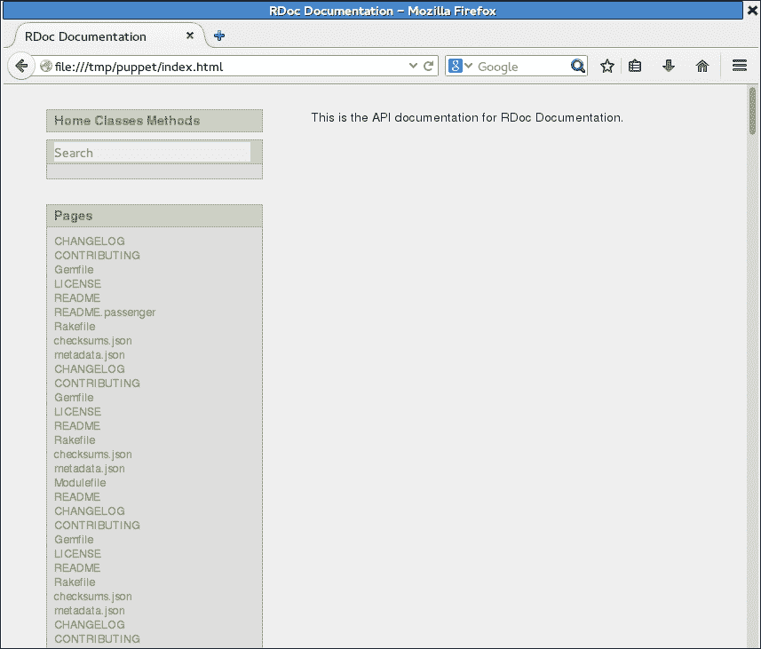
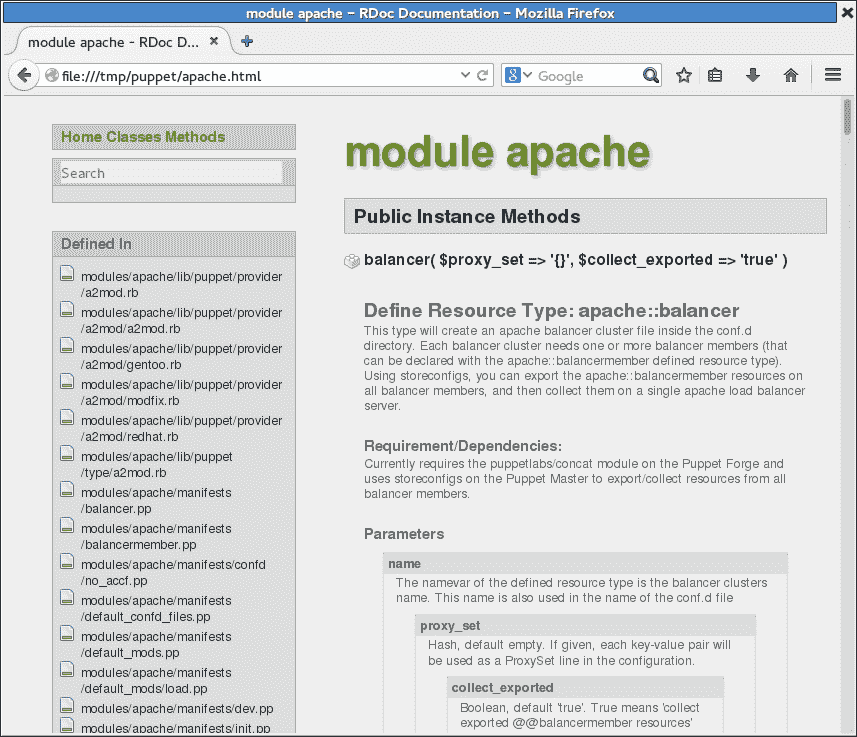
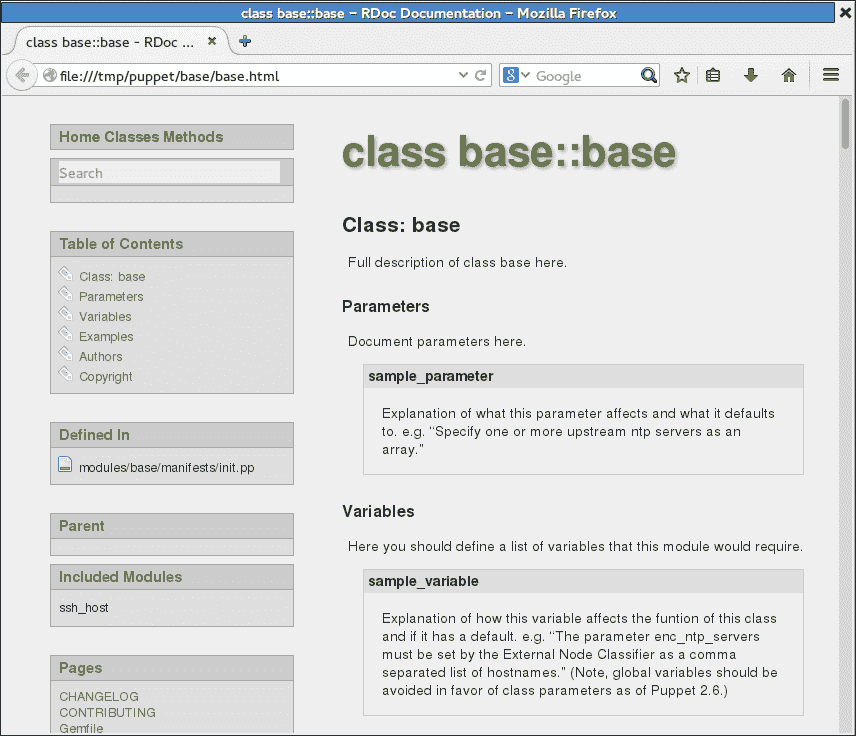
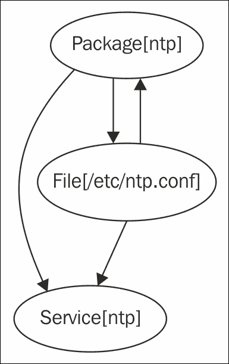
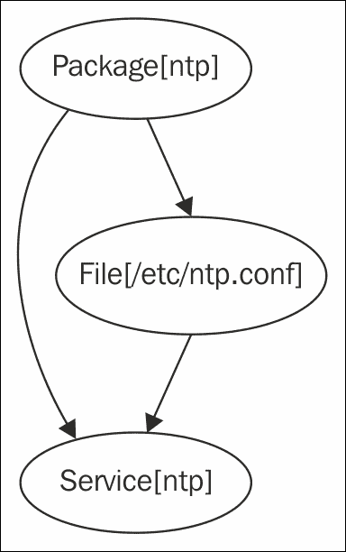

# 第十章 监控、报告和故障排除

|   | *"展示一个完全顺利的操作，我就能向你展示一个掩盖错误的人。真正的船总是会摇晃的。"* |   |
| --- | --- | --- |
|   | --*弗兰克·赫伯特，《沙丘救世主》* |

在本章中，我们将覆盖以下内容：

+   Noop: 不做任何更改的选项

+   记录命令输出

+   记录调试信息

+   生成报告

+   生成自动 HTML 文档

+   绘制依赖关系图

+   理解 Puppet 错误

+   检查配置设置

# 介绍

我们都曾有过这样的经历：坐在一个令人兴奋的关于新技术的演讲中，迫不及待地回家玩它。当然，一旦你开始尝试它，你立刻会遇到问题。出了什么问题？为什么不行？我怎么知道底层发生了什么？本章将帮助你回答一些问题，并为你提供解决常见 Puppet 问题的工具。

我们还将看到如何生成有用的报告，了解你的 Puppet 基础设施，以及 Puppet 如何帮助你监控和排查整个网络的问题。

# Noop – 不做任何更改的选项

有时你的 Puppet 清单没有完全按预期工作，或者可能是别人提交了你不知道的更改。无论如何，提前知道 Puppet 将要做什么总是好的。

当你将 Puppet 集成到现有的基础设施中时，你可能不知道 Puppet 是否会更新`config`文件或重启生产服务。任何此类变更都可能导致计划外的停机时间。此外，有时会在服务器上手动进行配置更改，而这些更改可能会被 Puppet 覆盖。

为了避免这些问题，你可以使用 Puppet 的 noop 模式，它意味着不操作或什么都不做。运行带有 noop 选项时，Puppet 只会报告它本来会做什么，但实际上什么也不做。这里有一个注意点，即即使在 noop 运行期间，pluginsync 仍会运行，模块中的任何`lib`目录都会同步到节点。这将更新外部事实定义，并可能更新 Puppet 的类型和提供者。

## 如何操作...

你可以通过在运行`puppet agent`或`puppet apply`时添加`--noop`开关来运行 noop 模式。你也可以在`puppet.conf`文件的`[agent]`或`[main]`部分创建一行`noop=true`。

1.  创建一个`noop.pp`清单，生成一个如下的文件：

    ```
    file {'/tmp/noop':
      content => 'nothing',
      mode    => 0644,
    }
    ```

1.  现在运行带有`noop`开关的 puppet agent：

    ```
    t@mylaptop ~/puppet/manifests $ puppet apply noop.pp --noop
    Notice: Compiled catalog for mylaptop in environment production in 0.41 seconds
    Notice: /Stage[main]/Main/File[/tmp/noop]/ensure: current_value absent, should be file (noop)
    Notice: Class[Main]: Would have triggered 'refresh' from 1 events
    Notice: Stage[main]: Would have triggered 'refresh' from 1 events
    Notice: Finished catalog run in 0.02 seconds

    ```

1.  现在运行不带`noop`选项，以查看文件是否已创建：

    ```
    t@mylaptop ~/puppet/manifests $ puppet apply noop.pp
    Notice: Compiled catalog for mylaptop in environment production in 0.37 seconds
    Notice: /Stage[main]/Main/File[/tmp/noop]/ensure: defined content as '{md5}3e47b75000b0924b6c9ba5759a7cf15d'

    ```

## 它是如何工作的...

在`noop`模式下，Puppet 会做它通常会做的所有事情，除了实际对机器进行任何更改（例如，`exec`资源不会运行）。它会告诉你本来会做什么，你可以将其与预期的结果进行比较。如果存在任何差异，仔细检查清单或机器的当前状态。

### 注意

请注意，当我们使用`--noop`运行时，Puppet 警告我们将创建`/tmp/noop`文件。 这可能是我们想要的，也可能不是，但预先知道这一点很有用。 如果您正在更改应用于生产服务器的代码，建议使用`--noop`选项运行 puppet agent，以确保您的更改不会影响生产服务。

## 还有更多...

你还可以使用 noop 模式作为简单的审计工具。 它会告诉你自 Puppet 上次应用其清单以来是否对机器进行了任何更改。 一些组织要求所有配置更改都必须使用 Puppet 进行，这是实施变更控制流程的一种方式。 可以使用 noop 模式检测到 Puppet 管理的资源的未经授权的更改，然后您可以决定是否将更改合并回 Puppet 清单或撤销它们。

运行 puppet agent 时，您还可以使用`--debug`开关查看 Puppet 在代理运行期间进行的每个更改的详细信息。 当试图弄清楚 Puppet 如何应用某些 exec 资源或查看事情发生的顺序时，这可能会很有帮助。

如果您正在运行主控，可以使用`--trace`选项编译节点的目录以及`--debug`。 如果目录编译失败，则此方法也将无法编译目录（如果您的 cookbook 节点的旧定义失败，请尝试在运行此测试之前将其注释掉）。 这将生成大量的调试输出。 例如，为了为我们的 cookbook 主机在主控上编译目录并将结果放入`/tmp/cookbook.log`：

```
root@puppet: ~#puppet master --compile cookbook.example.com --debug --trace --logdest /tmp/cookbook.log
Debug: Executing '/etc/puppet/cookbook.sh cookbook.example.com'
Debug: Using cached facts for cookbook.example.com
Info: Caching node for cookbook.example.com
Debug: importing '/etc/puppet/environments/production/modules/enc/manifests/init.pp' in environment production
Debug: Automatically imported enc from enc into production
Notice: Compiled catalog for cookbook.example.com in environment production in 0.09 seconds
Info: Caching catalog for cookbook.example.com
Debug: Configuring PuppetDB terminuses with config file /etc/puppet/puppetdb.conf
Debug: Using cached certificate for ca
Debug: Using cached certificate for puppet
Debug: Using cached certificate_revocation_list for ca
Info: 'replace catalog' command for cookbook.example.com submitted to PuppetDB with UUIDe2a655ca-bd81-4428-b70a-a3a76c5f15d1
{
 "metadata": {
 "api_version": 1
 },
 "data": {
 "edges": [
 {
 "target": "Class[main]",
 "source": "Stage[main]"
...

```

### 注意

编译目录后，Puppet 将在命令行上打印目录。 日志文件（`/tmp/cookbook.log`）将包含有关如何编译目录的大量信息。

## 另请参阅

+   在第六章中的*审计资源*食谱，*管理资源和文件*

+   在第二章中的*使用 Git 挂钩进行自动语法检查*食谱，*Puppet 基础设施*

+   本章节中的*生成报告*食谱

+   在第九章中的*使用 rspec-puppet 测试您的 Puppet 清单*食谱，*外部工具和 Puppet 生态系统*

# 记录命令输出

当您使用`exec`资源在节点上运行命令时，如果命令返回非零退出状态，Puppet 将会给出如下错误消息：

```
Notice: /Stage[main]/Main/Exec[/bin/cat /tmp/missing]/returns: /bin/cat: /tmp/missing: No such file or directory
Error: /bin/cat /tmp/missing returned 1 instead of one of [0]
Error: /Stage[main]/Main/Exec[/bin/cat /tmp/missing]/returns: change from notrun to 0 failed: /bin/cat /tmp/missing returned 1 instead of one of [0]

```

如您所见，Puppet 不仅报告命令失败，还显示其输出：

```
/bin/cat: /tmp/missing: No such file or directory

```

这对于弄清楚命令为何无法正常工作很有用，但有时命令实际上是成功的（即返回零退出状态），但仍未达到我们的预期。 在这种情况下，您如何查看命令输出？ 您可以使用`logoutput`属性。

## 如何做...

按顺序执行以下步骤以记录命令输出：

1.  定义一个带有 `logoutput` 参数的 `exec` 资源，如下代码片段所示：

    ```
    exec { 'exec with output':
      command   => '/bin/cat /etc/hostname',
    logoutput => true,
    }
    ```

1.  运行 Puppet：

    ```
    t@mylaptop ~/puppet/manifests $ puppet apply exec.pp
    Notice: Compiled catalog for mylaptop in environment production in 0.46 seconds
    Notice: /Stage[main]/Main/Exec[exec with outout]/returns: mylaptop
    Notice: /Stage[main]/Main/Exec[exec with outout]/returns: executed successfully
    Notice: Finished catalog run in 0.06 seconds

    ```

1.  正如你所看到的，即使命令成功，Puppet 仍然会打印输出：

    ```
    mylaptop

    ```

## 它是如何工作的……

`logoutput` 属性有三种可能的设置：

+   `false`：这个选项永远不会打印命令输出。

+   `on_failure`：只有在命令失败时才打印输出（默认设置）

+   `true`：无论命令是否成功，这个选项总是会打印输出。

## 还有更多……

你可以通过在 `site.pp` 文件中定义以下内容，设置 `logoutput` 的默认值，使所有 `exec` 资源都显示命令输出：

```
Exec {
logoutput => true,
```

### 注意

**资源默认值**：这是什么 `Exec` 语法？它看起来像是一个 `exec` 资源，但其实不是。当你使用大写的 `Exec` 时，你是在设置 `exec` 的资源默认值。你可以通过将资源类型的首字母大写来设置任何资源的默认值。只要 Puppet 在当前作用域或嵌套子作用域中看到该资源，它就会应用你定义的默认值。

如果你不希望看到命令输出，无论命令成功还是失败，请使用：

```
logoutput => false,
```

更多信息请参见 [`docs.puppetlabs.com/references/latest/type.html#exec`](https://docs.puppetlabs.com/references/latest/type.html#exec)。

# 日志调试信息

当调试问题时，如果你能够在清单中的某个点打印出信息，那将非常有帮助。这是一种很好的方式，举个例子，可以用来检查一个变量是否未定义或有意外的值。有时候，仅仅知道某段代码已经被执行也是有用的。Puppet 的 `notify` 资源让你能够打印出这样的消息。

## 它是如何做的……

在你想要调试的地方，在清单中定义一个 `notify` 资源：

```
notify { 'Got this far!': }

```

## 它是如何工作的……

当这个资源应用时，Puppet 会打印出消息：

```
notice: Got this far!

```

## 还有更多……

除了简单的消息外，我们还可以在 `notify` 语句中输出变量。此外，我们可以将 `notify` 调用当作其他资源来处理，使它们依赖于其他资源或被其他资源依赖。

### 打印变量值

你可以在消息中引用变量：

```
notify { "operatingsystem is ${::operatingsystem}": }
```

Puppet 会在输出中插入值：

```
Notice: operatingsystem is Fedora

```

在事实名称前的双冒号 (`::`) 告诉 Puppet 这是一个在顶级作用域中的变量（所有类都能访问），而不是局部变量。关于 Puppet 如何处理变量作用域的更多信息，请参见 Puppet Labs 文章：

[`docs.puppetlabs.com/guides/scope_and_puppet.html`](http://docs.puppetlabs.com/guides/scope_and_puppet.html)

### 资源顺序

Puppet 会将你的清单编译成一个目录；资源在客户端（节点）上执行的顺序可能与源文件中的资源顺序不同。当你使用 `notify` 资源进行调试时，你应该使用资源链式调用，确保 `notify` 资源在你的失败资源之前或之后执行。

例如，如果 `failing exec` 执行失败，你可以将一个 `notify resource` 链接到失败的 exec 资源之前，正如下面所示：

```
notify{"failed exec on ${hostname}": }->
exec {'failing exec':
  command   => "/bin/grep ${hostname} /etc/hosts",
logoutput => true,
}
```

如果你没有将资源链接起来，或者没有使用像 `before` 或 `require` 这样的元参数，那么不能保证你的 `notify` 语句会在你关注的其他资源附近执行。关于资源排序的更多信息可以在 [`docs.puppetlabs.com/puppet/latest/reference/lang_relationships.html`](https://docs.puppetlabs.com/puppet/latest/reference/lang_relationships.html) 找到。

例如，要让你的 `notify resource` 在前面的代码片段中 `'failing exec'` 后运行，使用：

```
notify { 'Resource X has been applied':
  require => Exec['failing exec'],
}
```

然而，请注意，在这种情况下，由于 exec 失败，`notify resource` 将无法执行。当一个资源失败时，所有依赖于该资源的其他资源将被跳过：

```
notify {'failed exec failed': 
  require => Exec['failing exec']
}
```

当我们运行 Puppet 时，我们看到 `notify resource` 被跳过：

```
t@mylaptop ~/puppet/manifests $ puppet apply fail.pp
...
Error: /bin/grepmylaptop /etc/hosts returned 1 instead of one of [0]
Error: /Stage[main]/Main/Exec[failing exec]/returns: change from notrun to 0 failed: /bin/grepmylaptop /etc/hosts returned 1 instead of one of [0]
Notice: /Stage[main]/Main/Notify[failed exec failed]: Dependency Exec[failing exec] has failures: true
Warning: /Stage[main]/Main/Notify[failed exec failed]: Skipping because of failed dependencies
Notice: Finished catalog run in 0.06 seconds

```

# 生成报告

如果你管理着大量机器，Puppet 的报告功能可以为你提供一些关于实际发生情况的有价值信息。

## 如何操作...

要启用报告，只需在客户端的 `puppet.conf` 中的 `[main]` 或 `[agent]` 部分添加以下内容：

```
report = true
```

### 小提示

在 Puppet 的最新版本（大于 3.0）中，`report = true` 是默认设置。

## 它是如何工作的...

启用报告后，Puppet 会生成一个报告文件，其中包含以下数据：

+   运行的日期和时间

+   运行的总时间

+   在运行期间输出的日志消息

+   客户端清单中所有资源的列表

+   Puppet 是否更改了任何资源，以及更改了多少

+   运行是否成功或失败

默认情况下，这些报告会保存在节点的 `/var/lib/puppet/reports` 目录中，并以主机名命名，你也可以使用 `reportdir` 选项指定不同的目标位置。你可以创建自己的脚本来处理这些报告（它们是标准的 YAML 格式）。当我们在 `cookbook.example.com` 上运行 Puppet agent 时，以下文件会在主服务器上创建：

```
/var/lib/puppet/reports/cookbook.example.com/201411230717.yaml
```

## 还有更多内容...

如果你有多个主服务器，可以通过在 `puppet.conf` 的 `[agent]` 部分指定 `report_server`，将所有报告发送到同一服务器。

如果你只想要一个报告，或者你不想始终启用报告功能，你可以在手动运行 Puppet agent 时，向命令行添加 `--report` 开关：

```
[root@cookbook ~]# puppet agent -t --report
Notice: Finished catalog run in 0.34 seconds

```

你不会看到任何额外的输出，但报告文件会在 `report` 目录中生成。

你还可以通过提供 `--summarize` 开关来查看 Puppet 运行的一些总体统计信息：

```
[root@cookbook ~]# puppet agent -t --report --summarize
Notice: Finished catalog run in 0.35 seconds
Changes:
 Total: 2
Events:
 Total: 2
 Success: 2
Resources:
 Total: 10
 Changed: 2
 Out of sync: 2
Time:
Filebucket: 0.00
 Schedule: 0.00
 Notify: 0.00
Config retrieval: 0.94
 Total: 0.95
 Last run: 1416727357
Version:
Config: 1416727291
 Puppet: 3.7.3

```

### 其他报告类型

Puppet 可以使用`puppet.conf`中的`[main]`或`[master]`部分的`reports`选项，在你的 Puppet 主服务器上生成不同类型的报告。内置报告类型可以在[`docs.puppetlabs.com/references/latest/report.html`](https://docs.puppetlabs.com/references/latest/report.html)中找到。除了内置报告类型外，还有一些社区开发的报告非常有用。例如，Foreman（[`theforeman.org`](http://theforeman.org)）提供了一种 Foreman 报告类型，可以启用并将节点报告转发到 Foreman。

## 另请参见

+   第六章中的*审计资源*配方，*管理资源和文件*

# 生成自动 HTML 文档

随着清单变得越来越大和复杂，使用 Puppet 的自动文档工具`puppet doc`为节点和类生成 HTML 文档是非常有帮助的。

## 如何执行...

按照以下步骤为清单生成 HTML 文档：

1.  运行以下命令：

    ```
    t@mylaptop ~/puppet $ puppet doc --all --outputdir=/tmp/puppet --mode rdoc --modulepath=modules/

    ```

1.  这将生成一组 HTML 文件到`/tmp/puppet`。用浏览器打开顶级`index.html`文件（`file:///tmp/puppet/index.html`），你将看到类似以下截图的内容：

1.  点击左侧的类链接并选择 Apache 模块，类似如下内容将被显示：

## 它是如何工作的...

`puppet doc`命令创建一个结构化的 HTML 文档树，类似于**RDoc**（流行的 Ruby 文档生成器）生成的文档。这使得理解清单的不同部分之间的关系变得更加容易。

## 还有更多...

`puppet doc`命令将生成当前清单的基础文档，但你可以通过在清单文件中添加注释，使用标准的 RDoc 语法来包括更多有用的信息。当我们使用`puppet module generate`创建基础类时，这些注释是自动为我们创建的：

```
# == Class: base
#
# Full description of class base here.
#
# === Parameters
#
# Document parameters here.
#
# [*sample_parameter*]
#   Explanation of what this parameter affects and what it defaults to.
#   e.g. "Specify one or more upstream ntp servers as an array."
#
# === Variables
#
# Here you should define a list of variables that this module would require.
#
# [*sample_variable*]
#   Explanation of how this variable affects the funtion of this class and if
#   it has a default. e.g. "The parameter enc_ntp_servers must be set by the
#   External Node Classifier as a comma separated list of hostnames." (Note,
#   global variables should be avoided in favor of class parameters as
#   of Puppet 2.6.)
#
# === Examples
#
#  class { base:
#    servers => [ 'pool.ntp.org', 'ntp.local.company.com' ],
#  }
#
# === Authors
#
# Author Name <author@domain.com>
#
# === Copyright
#
# Copyright 2014 Your name here, unless otherwise noted.
#
class base {
```

生成 HTML 文档后，我们可以看到基础模块的结果，如下图所示：



# 绘制依赖关系图

依赖关系可能会迅速变得复杂，容易陷入循环依赖（例如 A 依赖 B，而 B 又依赖 A），这会导致 Puppet 报错并停止工作。幸运的是，Puppet 的`--graph`选项可以轻松生成资源及其依赖关系的图表，这对于解决此类问题非常有帮助。

## 准备工作

安装`graphviz`包以查看图表文件：

```
t@mylaptop ~ $ sudo puppet resource package graphviz ensure=installed
Notice: /Package[graphviz]/ensure: created
package { 'graphviz':
 ensure => '2.34.0-9.fc20',
}

```

## 如何执行...

按照以下步骤为清单生成依赖关系图：

1.  为新的`trifecta`模块创建目录：

    ```
    ubuntu@cookbook:~/puppet$ mkdir modules/trifecta
    ubuntu@cookbook:~/puppet$ mkdir modules/trifecta/manifests
    ubuntu@cookbook:~/puppet$ mkdir modules/trifecta/files

    ```

1.  创建文件`modules/trifecta/manifests/init.pp`，并包含以下代码，代码中有一个故意的循环依赖（你能发现吗？）：

    ```
    class trifecta {
      package { 'ntp':
        ensure  => installed,
        require => File['/etc/ntp.conf'],
      }

      service { 'ntp':
        ensure  => running,
        require => Package['ntp'],
      }

      file { '/etc/ntp.conf':
        source  => 'puppet:///modules/trifecta/ntp.conf',
        notify  => Service['ntp'],
        require => Package['ntp'],
      }
    }
    ```

1.  创建一个简单的`ntp.conf`文件：

    ```
    t@mylaptop~/puppet $ cd modules/trifecta/files
    t@mylaptop~/puppet/modules/trifecta/files $ echo "server 127.0.0.1" >ntp.conf

    ```

1.  由于我们将本地处理此问题，创建一个`trifecta.pp`清单，其中包括已打破的三位一体类：

    ```
    include trifecta
    ```

1.  运行 Puppet：

    ```
    t@mylaptop ~/puppet/manifests $ puppet apply trifecta.pp
    Notice: Compiled catalog for mylaptop in environment production in 1.32 seconds
    Error: Could not apply complete catalog: Found 1 dependency cycle:
    (File[/etc/ntp.conf] => Package[ntp] => File[/etc/ntp.conf])
    Try the '--graph' option and opening the resulting '.dot' file in OmniGraffle or GraphViz

    ```

1.  按照建议使用`--graph`选项运行 Puppet：

    ```
    t@mylaptop ~/puppet/manifests $ puppet apply trifecta.pp --graph
    Notice: Compiled catalog for mylaptop in environment production in 1.26 seconds
    Error: Could not apply complete catalog: Found 1 dependency cycle:
    (File[/etc/ntp.conf] => Package[ntp] => File[/etc/ntp.conf])
    Cycle graph written to /home/tuphill/.puppet/var/state/graphs/cycles.dot.
    Notice: Finished catalog run in 0.03 seconds

    ```

1.  检查图形文件是否已创建：

    ```
    t@mylaptop ~/puppet/manifests $ cd ~/.puppet/var/state/graphs
    t@mylaptop ~/.puppet/var/state/graphs $ ls -l
    total 16
    -rw-rw-r--. 1 thomasthomas  121 Nov 23 23:11 cycles.dot
    -rw-rw-r--. 1 thomasthomas 2885 Nov 23 23:11 expanded_relationships.dot
    -rw-rw-r--. 1 thomasthomas 1557 Nov 23 23:11 relationships.dot
    -rw-rw-r--. 1 thomasthomas 1680 Nov 23 23:11 resources.dot

    ```

1.  使用以下方式创建图形：`dot`命令：

    ```
    ubuntu@cookbook:~/puppet$ dot -Tpng -o relationships.png /var/lib/puppet/state/graphs/relationships.dot

    ```

1.  图形看起来像这样：

## 它是如何工作的……

当您运行`puppet agent --graph`（或者在`puppet.conf`中启用`graph`选项）时，Puppet 将生成三张 DOT 格式的图（图形语言）：

+   `resources.dot`：此文件展示了您的类和资源的层级结构，但没有依赖关系。

+   `relationships.dot`：此文件展示了资源之间的依赖关系，用箭头表示，正如前面图像所示。

+   `expanded_relationships.dot`：这是一个更详细的关系图版本。

`dot`工具（`graphviz`包的一部分）将把这些转换为 PNG 等图像格式供查看。

在关系图中，清单中的每个资源都显示为气球（称为顶点），并通过箭头连接以指示依赖关系。您可以看到在我们的例子中，`File['/etc/ntp.conf']`和`Package['ntp']`之间的依赖关系是双向的。当 Puppet 尝试决定从哪里开始应用这些资源时，它可以从`File['/etc/ntp.conf']`开始，查找哪些依赖于`File['/etc/ntp.conf']`，最终回到`Package['ntp']`。当 Puppet 查找依赖关系时

对于`Package['ntp']`，最终会回到`File['/etc/ntp.conf']`，形成一个循环路径。此类问题被称为循环依赖问题；Puppet 无法决定从哪里开始，因为这两个资源相互依赖。

要解决循环依赖问题，您需要做的就是删除其中一行依赖关系并打破循环。以下代码解决了这个问题：

```
class trifecta {
  package { 'ntp':
    ensure  => installed,
  }

  service { 'ntp':
    ensure  => running,
    require => Package['ntp'],
  }

  file { '/etc/ntp.conf':
    source  => 'puppet:///modules/trifecta/ntp.conf',
    notify  => Service['ntp'],
    require => Package['ntp'],
  }
}
```

现在，当我们使用`--graph`选项运行`puppet apply`或`agent`时，生成的图形不再有任何循环路径（环）：



在这个图中，很容易看到**Package[ntp]**是第一个应用的资源，然后是**File[/etc/ntp.conf]**，最后是**Service[ntp]**。

### 提示

如前所示的图形被称为有向无环图（DAG）。将资源减少为 DAG 可以确保 Puppet 在线性时间内计算所有顶点（资源）的最短路径。有关 DAG 的更多信息，请查看[`en.wikipedia.org/wiki/Directed_acyclic_graph`](http://en.wikipedia.org/wiki/Directed_acyclic_graph)。

## 还有更多……

即使在没有 bug 需要排查的情况下，资源和关系图也是非常有用的。例如，如果你有一个非常复杂的类和资源网络，研究资源图可以帮助你看到哪里可以简化。同样，当依赖关系变得过于复杂，无法从阅读清单中理解时，图形可以成为有用的文档形式。例如，一个图形会清晰地显示出哪些资源有最多的依赖关系，哪些资源被最多的其他资源所依赖。被大量资源依赖的资源会有许多箭头指向它们。

## 另见

+   第三章中的*使用运行阶段*配方，*写更好的清单*

# 理解 Puppet 错误

Puppet 的错误信息有时会让人感到困惑。如果你使用的是 3.0 版本之前的任何版本，更新和越来越有帮助的错误信息是升级 Puppet 安装的一个理由。

以下是一些你可能遇到的最常见错误，以及如何处理它们。

## 如何解决...

通常，第一步就是搜索网络，查看错误信息文本，并找到可能的解释，以及一些修复建议。以下是一些最常见的难解错误及其可能的解释：

```
Could not retrieve file metadata for XXX: getaddrinfo: Name or service not known

```

在`XXX`是文件资源的情况下，你可能在文件源中不小心输入了`puppet://modules...`而不是`puppet:///modules...`（注意三斜杠）：

```
Could not evaluate: Could not retrieve information from environment production source(s) XXX

```

源文件可能不存在，或者在 Puppet 仓库中位置不正确：

```
Error: Could not set 'file' on ensure: No such file or directory XXX

```

文件路径可能指定了一个不存在的父目录（或多个目录）。你可以在 Puppet 中使用独立的文件资源来创建这些目录：

```
change from absent to file failed: Could not set 'file on ensure: No such file or directory

```

这通常是由于 Puppet 尝试将文件写入一个不存在的目录。检查该目录是否已存在，或者在 Puppet 中已定义，并确保文件资源要求该目录（以便目录始终先被创建）：

```
undefined method 'closed?' for nil:NilClass

```

这个不太有用的错误信息大致可以翻译为*出了点问题*。它往往是由许多不同问题引起的一个通用错误，但你可以通过资源、类或模块的名称来确定出问题的原因。一个技巧是添加`--debug`开关，以获取更有用的信息：

```
[root@cookbook ~]# puppet agent -t --debug

```

如果你查看 Git 历史记录，查看最近更改的内容，这可能是找出问题所在的另一种方法：

```
Could not parse for environment --- "--- production": Syntax error at end of file at line 1

```

这可能是由于命令行选项拼写错误造成的，例如，如果你输入了`puppet -verbose`而不是`puppet --verbose`。这种错误很难被发现：

```
Duplicate definition: X is already defined in [file] at line Y; cannot redefine at [file] line Y

```

这个问题曾让我困惑一阵子。Puppet 报告重复定义的错误，通常如果你有两个相同名称的资源，Puppet 会帮助你指出它们被定义的位置。但在这个例子中，它却显示了相同的文件和行号。那么，怎么可能有一个资源是它自己重复定义呢？

答案是，如果它是一个已定义的类型（通过`define`关键字创建的资源）。如果你创建了一个已定义类型的两个实例，你将拥有所有资源的两个实例，而这些资源需要有不同的名称。例如：

```
define check_process() {
  exec { 'is-process-running?':
    command => "/bin/ps ax |/bin/grep ${name} >/tmp/pslist.${name}.txt",
  }
}

check_process { 'exim': }
check_process { 'nagios': }
```

当我们运行 Puppet 时，出现了相同的错误两次：

```
t@mylaptop ~$ puppet apply duplicate.pp
Error: Duplicate declaration: Exec[is-process-running?] is already declared in file duplicate.pp:4; cannot redeclare at duplicate.pp:4 on node cookbook.example.com
Error: Duplicate declaration: Exec[is-process-running?] is already declared in file duplicate.pp:4; cannot redeclare at duplicate.pp:4 on node cookbook.example.com

```

由于`exec`资源被命名为`is-process-running?`，如果你尝试创建多个该定义的实例，Puppet 将拒绝，因为结果将是两个具有相同名称的`exec`资源。解决方案是在每个资源的标题中包含实例名称（或其他唯一值）：

```
exec { "is-process-${name}-running?":
  command => "/bin/ps ax |/bin/grep ${name} >/tmp/pslist.${name}.txt",
}
```

每个资源必须有一个唯一的名称，确保这一点的一个好方法是将`${name}`变量插入到标题中。注意，我们已经从单引号切换到双引号来定义资源标题：

```
"is-process-${name}-running?"
```

当你希望 Puppet 将变量的值插入字符串时，必须使用双引号。

## 另见

+   本章中的*生成报告*食谱

+   本章中的*Noop: 不做任何更改选项*食谱

+   本章中的*记录调试信息*食谱

# 检查配置设置

你可能知道 Puppet 的配置设置存储在`puppet.conf`中，但有很多参数，而那些没有在`puppet.conf`中列出的参数将采用默认值。那么，如何查看任何配置参数的值，无论它是否在`puppet.conf`中显式设置呢？答案是使用`puppet config print`命令。

## 如何做到这一点...

运行以下命令。这会产生大量输出（如果你希望浏览可用的配置设置，使用`less`进行分页可能会很有帮助）：

```
[root@cookbook ~]# puppet config print |head -25
report_serialization_format = pson
hostcsr = /var/lib/puppet/ssl/csr_cookbook.example.com.pem
filetimeout = 15
masterhttplog = /var/log/puppet/masterhttp.log
pluginsignore = .svn CVS .git
ldapclassattrs = puppetclass
certdir = /var/lib/puppet/ssl/certs
ignoreschedules = false
disable_per_environment_manifest = false
archive_files = false
hiera_config = /etc/puppet/hiera.yaml
req_bits = 4096
clientyamldir = /var/lib/puppet/client_yaml
evaltrace = false
module_working_dir = /var/lib/puppet/puppet-module
tags = 
cacrl = /var/lib/puppet/ssl/ca/ca_crl.pem
manifest = /etc/puppet/manifests/site.pp
inventory_port = 8140
ignoreimport = false
dbuser = puppet
postrun_command = 
document_all = false
splaylimit = 1800
certificate_expire_warning = 5184000

```

## 它是如何工作的...

运行`puppet config print`将输出每个配置参数及其当前值（并且它们非常多）。

要查看特定参数的值，可以将其作为参数添加到`puppet config print`命令：

```
[root@cookbook ~]# puppet config print modulepath
/etc/puppet/modules:/usr/share/puppet/modules

```

## 另见

+   本章中的*生成报告*食谱
