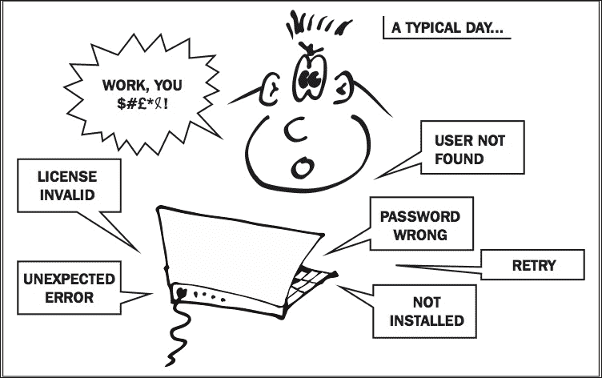

# 第一章. 使用 Puppet 入门

|   | *欲了解科技未能提升生活质量的所有方式，请按三号键。* |   |
| --- | --- | --- |
|   | --*爱丽丝·卡恩* |

在本章中，你将了解在服务器上管理配置的一些挑战，常见的解决方案，以及像 Puppet 这样的自动化工具如何提供帮助。你还将学习如何下载包含本书所有源代码和示例的 GitHub 仓库，如何设置你自己的 Vagrant 虚拟机来运行代码，以及如何下载和安装 Puppet。

无论你是系统管理员，还是偶尔需要操作服务器的开发人员，或者只是对部署新应用所需的时间感到烦恼的人，你都可能遇到 Puppet 旨在解决的那类问题。



# 为什么我们需要 Puppet？

在生产环境中管理应用程序和服务是一项艰苦的工作，涉及许多步骤。首先，你需要一些服务器来提供服务。幸运的是，这些服务器可以从本地云服务商那里轻松获得，价格非常低廉。所以你已经拥有一台服务器，里面安装了基础操作系统，你可以登录了。那么接下来呢？在你进行部署之前，你还需要做一些事情：

+   添加用户帐户和密码

+   配置安全设置和权限

+   安装运行应用所需的所有软件包

+   自定义这些软件包的配置文件

+   创建数据库和数据库用户帐户；加载一些初始数据

+   配置应该运行的服务

+   部署应用代码和静态资源

+   重启任何受影响的服务

+   配置机器以进行监控

这需要做很多事情——而且下一个你构建的服务器，你还得完全重复一遍相同的操作。这样似乎不太对劲。难道没有更简便的解决方案吗？

**如果你能写一个可执行的规范，定义服务器应该如何设置，并且能够将其应用到任意数量的机器上，岂不是很好吗？**

## 保持配置的同步

手动设置服务器非常繁琐。即使你是那种喜欢做繁琐事情的人，仍然有另一个问题需要考虑。下次你设置服务器时，几周或几个月后会发生什么呢？

你的细心笔记将不再与现实同步。在你度假期间，开发人员安装了几个应用现在依赖的新库——我猜你忘了告诉你！当然，他们面临着很大的进度压力。你可以发一封严厉的邮件，要求每个人在更改任何内容时都更新构建文档，大家也许会遵守。但即使他们更新了文档，实际上没有人会重新测试新构建过程，所以当你去做时，你会发现它不再有效。事实证明，如果只是升级现有数据库，一切正常，但如果在一台空白服务器上安装新版本，问题就出现了。

此外，由于构建文档已更新，上游发布了一个关键库的新版本。因为你总是在构建时安装最新版本，现在你新服务器的配置与旧服务器略有不同。这将导致一些微妙的问题，可能需要你三天时间，或者三瓶威士忌，才能调试出来。

当你拥有四五台服务器时，它们之间总会有一些差异。哪一台才是权威的？还是它们都稍微出错了？它们存在的时间越久，偏差就越大。你不会同时运行四五个不同版本的应用代码，那么为什么服务器配置可以这么混乱呢？

**如果能够定期检查并将所有机器的配置状态与中央标准版本进行同步，岂不是很好吗？**

## 在多台服务器上重复更改

人类并不擅长准确地反复执行复杂任务；这就是我们发明机器人的原因。我们容易出错、遗漏某些内容，或者被打断，导致忘记自己做过的事情。

变化随时发生，随着基础设施的增长，保持最新和同步变得越来越困难。同样地，当你更改应用代码时，你不会在每台服务器上使用文本编辑器手动修改这些更改。你只需修改一次，然后将其推广到所有地方。难道你的防火墙设置不像用户模型一样是你代码的一部分吗？

**如果你只需要在一个地方做出更改，并且这些更改能够自动地推广到整个网络，是不是很好呢？**

## 自我更新文档

在现实生活中，我们太忙，无法每五分钟停下来记录我们刚刚做的事情。正如我们所看到的，即使文档保持着极其更新，它的实用性也是有限的。

事实上，唯一可靠的文档就是服务器本身的状态。你可以查看一台服务器来了解它的配置，但这只适用于你仍然能访问那台机器的情况下。如果出现故障，你无法访问机器或其中的数据，你唯一的选择就是从头开始重建丢失的配置。

**如果你有一个清晰、可读的人类构建过程，独立于你的服务器，并且保证是最新的，因为服务器实际上是根据它构建的，岂不是很好吗？**

## 版本控制和历史

当你手动对系统进行临时更改时，你无法将它们恢复到某个时间点。很难撤销一系列的更改；你没有办法记录你做了什么以及事情是如何变化的。

当只有一个人时，这种情况已经很糟糕了。若是在团队中工作，情况会更糟，大家都在独立地做更改，互相干扰。

当你遇到问题时，你需要一种方式来知道是什么时候发生了变化，谁做的变化。你还需要能够将配置恢复到任何以前的稳定状态。

**如果你能回到过去，岂不是很好吗？**

## 为什么不直接写 shell 脚本？

许多人使用 shell 脚本来管理配置，这比手动做要好一些，但也没有好到哪里去。shell 脚本的一些问题包括：

+   脆弱且不可移植

+   难以维护

+   作为文档阅读起来不容易

+   非常依赖于特定环境

+   不是一种好的编程语言

+   很难对现有的服务器应用更改

## 为什么不直接使用容器？

容器！还有什么词能比这个更让人激动吗？许多人觉得容器能够让配置管理的问题迎刃而解。但这种感觉通常在试图容器化一个应用程序的最初几个小时之后就消失了。是的，容器让软件的部署和管理变得更容易，但容器到底是从哪里来的呢？事实证明，容器必须由人来构建和维护，这意味着需要管理 Dockerfile、数据卷、网络、集群、镜像仓库、依赖项等。换句话说，就是配置。计算机科学有一个我刚刚发明的公理，叫做*痛苦守恒定律*。如果你在一个地方避免了痛苦，它会在另一个地方重新出现。无论什么新技术诞生，都无法解决我们所有的问题；顶多，它会将这些问题替换成一些不同的、令人耳目一新的问题。

是的，容器很棒，但事实上，基于容器的系统需要更多的配置管理。你需要配置运行容器的节点，基于中央策略构建和更新容器镜像，创建和维护容器网络与集群等等。

## 为什么不直接使用无服务器架构（serverless）？

如果容器是由魔法小精灵驱动的，那么无服务器架构就是纯粹的仙尘。承诺是你只需将应用推送到云端，云端就会负责部署、扩展、负载均衡、监控等等。像大多数事情一样，现实并没有完全符合市场宣传。不幸的是，无服务器并不是真正的“无服务器”：它只是意味着你的业务运行在你无法直接控制的服务器上，并且你有更高的固定成本，因为你在为别人管理这些服务器付费。无服务器可以作为一个不错的起点，但它不是长期解决方案，因为最终你需要拥有自己的配置。

# 配置管理工具

**配置** **管理**（**CM**）工具是以代码形式管理基础设施的现代且合理的方式。有许多此类工具，它们的工作方式或多或少相同：你通过可编辑的文本文件和系统资源的模型指定所需的配置状态，工具会将每个**节点**（我们用来表示配置管理服务器的术语）的当前状态与所需状态进行比较，并进行必要的更改以使其保持一致。

正如大多数无关紧要的事情一样，互联网上有大量关于哪个 CM 工具最好讨论和争论。虽然不同工具在方法和功能上有显著差异，但不要被这些因素掩盖了一个事实：使用任何工具来管理配置，远比手动操作要好得多。

话虽如此，虽然有许多 CM 工具可用，但 Puppet 是一个出色的选择。没有任何工具比它更强大、更具可移植性或更广泛被采用。在本书中，我将向你展示是什么使 Puppet 如此优秀，以及只有 Puppet 才能做的事情。

# 什么是 Puppet？

Puppet 是两样东西：一种表达所需状态的语言（即如何配置你的节点），以及一个引擎，能够解释用 Puppet 语言编写的代码并将其应用到节点上，从而实现所需状态。

这个语言看起来像什么？它不像一系列指令，像是 shell 脚本或 Ruby 程序。更像是一组关于事物应该如何的声明。看一下下面的例子：

```
package { 'curl':
  ensure => installed,
}
```

用英文，这段代码表示：“应安装`curl`包。”当你应用这个清单（Puppet 程序称为清单）时，工具会执行以下操作：

1.  检查节点上已安装的包列表，查看是否已安装`curl`。

1.  如果是，什么也不做。

1.  如果没有，安装它。

这是另一个 Puppet 代码的例子：

```
user { 'bridget':
  ensure => present,
}
```

这是 Puppet 语言的声明，表示“`bridget` 用户应该存在。”（关键字 `ensure` 意味着“资源的期望状态是...”）。再次强调，这会导致 Puppet 检查 `bridget` 用户是否存在于节点上，并在必要时创建它。这也是一种文档，正式地以人类可读的方式表达系统的声明。代码表达了作者希望 `bridget` 用户始终存在的愿望。

因此，您可以看到 Puppet 程序——Puppet **清单**——是关于应该存在什么内容以及它们应该如何配置的一组声明。

您不会发出“做这个，然后做那个”这样的命令。相反，您描述事物应该如何，剩下的交给 Puppet 去实现。这是两种完全不同的编程方式。一种（所谓的过程式风格）是传统的模型，像 C、Python、shell 等语言都使用这种模型。Puppet 的风格被称为声明式风格，因为您声明最终结果应该是什么，而不是指定实现步骤。

这意味着您可以将相同的 Puppet 清单重复应用到一个节点上，无论应用多少次，最终的结果都会相同。更好地理解 Puppet 清单，它更像是一种规范或声明，而不是传统意义上的程序。

## 资源和属性

Puppet 允许您通过 **资源**（可以存在的事物类型，如用户、文件或软件包）及其 **属性**（资源类型的适当属性，如用户的主目录，或文件的所有者和权限）来描述配置。您不必深入了解资源在不同平台上是如何创建和配置的。Puppet 会为您处理这些事情。

这种方法的优势在于，给定的清单可以应用于不同的节点，这些节点可能运行不同的操作系统，结果在各处都会相同。

## Puppet 架构

值得注意的是，Puppet 有两种不同的使用方式。第一种方式被称为 **代理/主节点架构**，它使用一个专门的节点来运行 Puppet，所有其他节点都与这个节点联系以获取其配置。

另一种方式被称为 **独立 Puppet** 或 **无主模式**，不需要专门的 Puppet 主节点。Puppet 在每个独立的节点上运行，并不需要联系一个中央位置来获取其配置。相反，您可以使用 Git 或其他任何复制文件到节点的方式，如 SFTP 或 `rsync`，来更新每个节点上的 Puppet 清单。

无论是独立架构还是代理/主节点架构，都得到 Puppet 官方的支持。您可以根据自己的喜好选择使用哪种方式。在本书中，我将仅讨论独立架构，这对于大多数组织来说更简单、更易于操作，但无论您使用代理/主节点架构还是独立架构，本书中的几乎所有内容都将一样适用。

### 提示

若要设置带有代理/主控架构的 Puppet，请参考官方 Puppet 文档。

# 为 Puppet 做准备

虽然 Puppet 本身是跨平台的，且支持多种操作系统，但本书将重点讲解一个操作系统，即 **Ubuntu 16.04 LTS** 版的 Linux，以及 Puppet 的最新版本 Puppet 5。不过，本书中的所有示例应该在任何最新操作系统或 Puppet 版本上都能正常运行，只需做一些微小的调整。

你可能会发现，阅读本书的最佳方式是使用你自己的 Linux 机器，按照示例进行操作。无论这是一台物理服务器、桌面或笔记本电脑、云实例，还是虚拟机，都没关系。我将使用流行的 Vagrant 软件在自己的计算机上运行虚拟机，你也可以这样做。本书的 GitHub 公共仓库包含一个 Vagrantfile，你可以使用它仅需几步就能启动并运行 Puppet。

## 安装 Git 并下载仓库

若要获取本书随附的仓库副本，请按照以下步骤操作：

1.  浏览到 [`git-scm.com/downloads`](https://git-scm.com/downloads)

1.  下载并安装适合你操作系统的 Git 版本。

1.  运行以下命令：

    ```
    git clone https://github.com/bitfield/puppet-beginners-guide-3.git

    ```

## 安装 VirtualBox 和 Vagrant

如果你已经有一台 Linux 机器或云服务器，可以用来执行示例，请跳过本节并进入下一章。如果你希望使用 VirtualBox 和 Vagrant 在你的计算机上运行本地 **虚拟机**（**VM**）来配合示例使用，请按照以下说明操作：

1.  浏览到 [`www.virtualbox.org/`](https://www.virtualbox.org/)

1.  下载并安装适用于你操作系统的 VirtualBox 版本

1.  浏览到 [`www.vagrantup.com/downloads.html`](https://www.vagrantup.com/downloads.html)

1.  选择适合你操作系统的 Vagrant 版本：OS X、Windows 等

1.  按照提示安装软件

## 运行你的 Vagrant 虚拟机

安装完 Vagrant 后，你可以启动 Puppet 初学者指南虚拟机：

1.  运行以下命令：

    ```
    cd puppet-beginners-guide-3
    scripts/start_vagrant.sh

    ```

    Vagrant 将开始下载基础框。下载完成并启动后，它会安装 Puppet。这可能需要一些时间，但安装完成后，虚拟机就可以使用了。

1.  使用以下命令连接到虚拟机：

    ```
    vagrant ssh

    ```

1.  你现在已经在虚拟机上获得了命令行 Shell。通过运行以下命令检查 Puppet 是否已安装并正常工作（你可能会得到不同的版本号，这没问题）：

    ```
    puppet --version
    5.2.0

    ```

    ### 小贴士

    如果你使用的是 Windows，可能需要安装 PuTTY 软件才能连接到你的虚拟机。关于在 Windows 上使用 Vagrant 的一些有用建议可以在这里找到：

    [`tech.osteel.me/posts/2015/01/25/how-to-use-vagrant-on-windows.html`](http://tech.osteel.me/posts/2015/01/25/how-to-use-vagrant-on-windows.html)

## 故障排除 Vagrant

如果在运行虚拟机时遇到任何问题，可以访问 VirtualBox 或 Vagrant 的网站寻求帮助。特别是，如果你使用的是较旧的机器，可能会看到如下信息：

```
VT-x/AMD-V hardware acceleration is not available on your system. Your 64-bit guest will fail to detect a 64-bit CPU and will not be able to boot.
```

你的计算机可能有一个 BIOS 设置，用于启用 64 位硬件虚拟化（根据制造商的不同，这个功能的名称可能是**VT-x**或**AMD-V**）。启用此功能可能会解决问题。如果没有效果，你可以尝试使用 Vagrant 盒子的 32 位版本。编辑 Git 仓库中名为`Vagrantfile`的文件，并通过在前面加上`#`字符来注释掉以下行：

```
config.vm.box = "ubuntu/xenial64"
```

通过删除前导的`#`字符来取消注释以下行：

```
# config.vm.box = "ubuntu/xenial32"
```

现在重新运行`scripts/start_vagrant.sh`命令。

# 总结

在本章中，我们探讨了配置管理工具可以帮助解决的各种问题，特别是 Puppet 如何建模系统配置的各个方面。我们查看了本书示例代码的 Git 仓库，安装了 VirtualBox 和 Vagrant，启动了 Vagrant 虚拟机，并首次运行了 Puppet。

在下一章中，我们将编写我们的第一个 Puppet 清单，了解 Puppet 资源的结构以及如何应用它们，并学习`package`、`file`和`service`资源。
