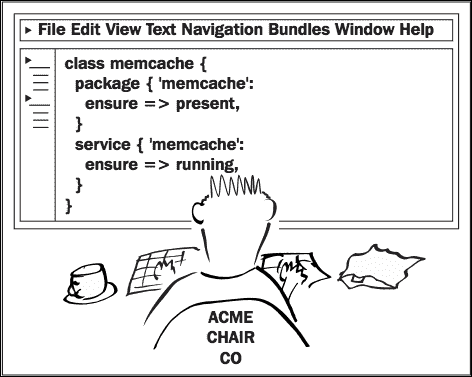
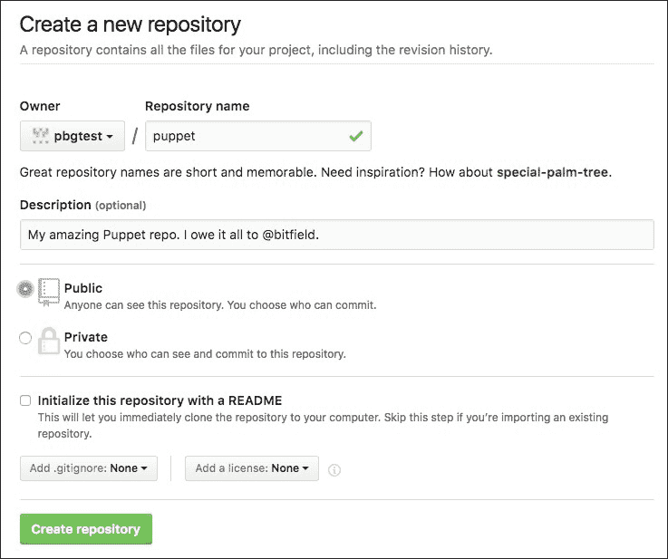
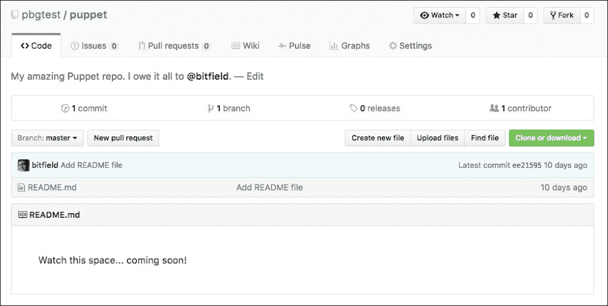

# 第三章 使用 Git 管理你的 Puppet 代码

|   | *我们通过行动来定义自己。每一个决定都在告诉自己和世界我们是谁。* |   |
| --- | --- | --- |
|   | --*比尔·沃特森* |

本章你将学习如何使用 Git 版本控制系统来管理你的 Puppet manifests。我还会向你展示如何使用 Git 将 manifests 分发到多个节点，以便你能使用 Puppet 开始管理整个网络。



# 什么是版本控制？

如果你已经熟悉 Git，你可以跳过本章，直接阅读 *创建 Git 仓库* 部分。否则，这里有一个温和的入门介绍。

即使你是唯一一个在源代码（例如 Puppet manifests）上工作的人，能够查看自己做过的更改以及更改的时间也是很有用的。例如，你可能会意识到在过去某个时候引入了一个 bug，你需要精确地检查某个文件在何时被修改，以及修改了什么。版本控制系统让你能够做到这一点，它通过保持你对一组文件所做更改的完整历史记录，帮助你追踪所有更改。

## 追踪更改

当你与他人共同工作时，你还需要一种方式与团队其他成员沟通你的更改。像 Git 这样的版本控制工具不仅能追踪每个人的更改，还能让你记录 **提交信息**，解释你做了什么以及为什么这么做。以下示例展示了一个良好提交信息的一些要素：

```
Summarize changes in around 50 characters or less

More detailed explanatory text, if necessary. Wrap it to about 72
characters or so. In some contexts, the first line is treated as
the subject of the commit and the rest of the text as the body.
The blank line separating the summary from the body is critical
(unless you omit the body entirely); various tools like `log`,
`shortlog`, and `rebase` can get confused if you run the two together.

Explain the problem that this commit is solving. Focus on why you
are making this change as opposed to how (the code explains that).
Are there side effects or other unintuitive consequences of this
change? Here's the place to explain them.

Further paragraphs come after blank lines.

 - Bullet points are okay, too

 - Typically a hyphen or asterisk is used for the bullet, preceded
   by a single space, with blank lines in between, but conventions
   vary here

If you use an issue tracker, put references to them at the bottom,
like this:

Resolves: #123
See also: #456, #789
```

### 注意

这个示例来自 Chris Beams 的一篇精彩博文 *如何编写 Git 提交信息*：

[`chris.beams.io/posts/git-commit/`](https://chris.beams.io/posts/git-commit/)

当然，你不需要经常写这么长且详细的信息；大多数时候，一行就足够了。然而，提供更多的信息总比少提供好。

Git 还记录了更改发生的时间、是谁做的更改、哪些文件被更改、添加或删除了，以及哪些行被添加、修改或删除。正如你所想象的那样，如果你正在追踪一个 bug，而你能够查看代码的完整历史记录，那会大有帮助。这也意味着，如果需要，你可以将代码的状态回滚到历史中的任何一个时间点，并加以检查。

你可能会认为这增加了很多额外的复杂性。事实上，它非常简单。Git 会在你需要时才介入，你所需要做的只是当你决定记录代码更改时，写一条提交信息。

## 共享代码

一组受 Git 版本控制的文件叫做 **仓库**，通常等同于一个项目。一个 Git 仓库（从现在开始简称为 **仓库**）也是一个很好的方式来分发你的代码，无论是私有的还是公开的，这样别人可以使用、修改、向你提交更改，或者根据他们自己的需求朝着不同的方向发展它。本书在第一章中提到的公开 GitHub 仓库，*Puppet 入门* 就是一个很好的例子。你将能够使用这个仓库来完成书中的示例，但你也可以在为自己的基础设施构建 Puppet 清单时，使用它来获得帮助和灵感。

因为 Git 对于管理 Puppet 代码非常重要，所以最好熟悉它，而唯一的办法就是实际使用它。那么我们就从创建一个新的 Git 仓库开始，用来做实验。

# 创建一个 Git 仓库

创建一个 Git 仓库非常容易。按照以下步骤操作：

1.  使用以下命令创建一个目录来保存你的版本化文件：

    ```
    cd
    mkdir puppet

    ```

1.  现在运行以下命令将该目录转换为 Git 仓库：

    ```
    cd puppet
    git init
    Initialized empty Git repository in /home/ubuntu/puppet/.git/
    ```

## 做你的第一次提交

你可以随意更改仓库中的文件，但 Git 直到你进行所谓的 **提交** 后，才会知道这些更改。你可以将提交看作是仓库在某个特定时刻的快照，它还存储了自上次提交以来仓库发生的变化。提交会永久存储，所以你总是可以将仓库回滚到某个提交时的状态，或者查看过去提交中更改了哪些文件，并与任何其他提交时仓库的状态进行比较。

让我们对这个新仓库做第一次提交：

1.  因为 Git 不仅记录代码的更改，还记录是谁做的更改，所以它需要知道你的身份。通过以下命令设置你的 Git 个人信息（除非你特别喜欢我的设置，使用你自己的姓名和邮箱地址）：

    ```
    git config --global user.name "John Arundel"
    git config --global user.email john@bitfieldconsulting.com

    ```

1.  Git 仓库通常会有一个 `README` 文件，用来说明仓库的内容及如何使用它。目前，让我们先创建这个文件，并放置一个占位符消息：

    ```
    echo "Watch this space... coming soon!" >README.md

    ```

1.  运行以下命令：

    ```
    git status
    On branch master
    Initial commit
    Untracked files:
      (use "git add <file>..." to include in what will be committed)
            README.md
    nothing added to commit but untracked files present (use "git add" to track)
    ```

1.  因为我们向仓库添加了一个新文件，在我们明确告诉 Git 之前，它不会追踪对这个文件的更改。我们通过使用 `git add` 命令来做到这一点，如下所示：

    ```
    git add README.md

    ```

1.  Git 现在知道了这个文件，并且对它的更改将包含在下一次提交中。我们可以通过再次运行 `git status` 来检查：

    ```
    git status
    On branch master
    Initial commit
    Changes to be committed:
      (use "git rm --cached <file>..." to unstage)
            new file:   README.md
    ```

1.  该文件列在 `Changes to be committed` 下，所以我们现在可以实际进行提交：

    ```
    git commit -m 'Add README file'
    [master (root-commit) ee21595] Add README file
     1 file changed, 1 insertion(+)
     create mode 100644 README.md
    ```

1.  你可以随时使用 `git log` 命令查看仓库的完整提交历史。现在试试看，查看你刚才做的提交：

    ```
    git log
    commit ee215951199158ef28dd78197d8fa9ff078b3579
    Author: John Arundel <john@bitfieldconsulting.com>
    Date:   Tue Aug 30 05:59:42 2016 -0700
        Add README file
    ```

## 我应该多频繁提交一次？

一种常见的做法是当代码处于一致且可工作状态时进行提交，并确保提交包含一组为某个特定目的所做的相关更改。例如，如果你正在修复问题追踪系统中的第 75 号错误，你可能会更改多个不同的文件，然后，在你确认工作完成后，做一个提交，提交信息可能是：

```
Make nginx restart more reliable (fixes issue #75)
```

另一方面，如果你正在进行大量复杂的更改，并且不确定什么时候完成，最好沿途做几个单独的提交，这样如果需要的话，你可以将代码回滚到先前的状态。提交是免费的，所以当你觉得需要提交时，尽管去做。

## 分支

Git 有一个强大的功能叫做**分支**，它允许你创建代码的并行副本（一个分支），并独立进行更改。你可以随时选择将这些更改合并回主分支。或者，如果主分支在此期间有更改，你可以将这些更改并入你的工作分支并继续工作。

在使用 Puppet 时，这一点非常有用，因为它意味着你可以在测试和修改时将单个节点切换到你的分支。你所做的更改不会对不在你分支上的其他节点可见，因此不会在你准备好之前意外地推出更改。

完成后，你可以将更改合并回主分支，并将它们推广到所有节点。

类似地，两个或更多的人可以独立地在自己的分支上工作，按照需要互相交换单个提交或与主分支交换。这是一种非常灵活且有用的工作方式。

### 注意

有关 Git 分支的更多信息，实际上是有关 Git 的更多信息，我推荐由*Scott Chacon*和*Ben Straub*编写、*Apress*出版的优秀书籍《*Pro Git*》。整本书可以在 [`git-scm.com/book/en/v2`](https://git-scm.com/book/en/v2) 免费获取。

# 分发 Puppet 清单

到目前为止，本书中我们仅将 Puppet 清单应用于一个节点，使用 `puppet apply` 和清单的本地副本。要同时管理多个节点，我们需要将 Puppet 清单分发到每个节点，以便它们可以应用。

有几种方法可以做到这一点，正如我们在第一章《Puppet 入门》中看到的那样，*Puppet 入门*，一种方法是使用**代理/主服务器**架构，其中一个中央 Puppet 主服务器编译你的清单并将**清单**（期望的节点状态）分发到所有节点。

另一种使用 Puppet 的方式是完全不依赖主服务器，而是使用 Git 将清单分发到客户端节点，客户端节点随后运行 `puppet apply` 来更新其配置。这种**独立式** Puppet 架构不需要专用的 Puppet 主服务器，并且没有单点故障。

Puppet 官方支持代理/主服务器架构和独立架构，并且如果你决定需要更改架构，可以从一种架构切换到另一种架构。本书中的示例是使用独立架构开发的，但如果你更喜欢代理/主服务器架构，它同样可以正常工作。Puppet 清单、语言或结构没有区别；唯一的不同是应用清单的方式。

对于一个独立的 Puppet 架构，你只需要一个 Git 服务器，所有节点都可以连接并克隆该仓库。如果你愿意，可以自己搭建 Git 服务器，或者使用像 GitHub 这样的公共 Git 托管服务。为了方便解释，我将在这个示例中使用 GitHub。

在接下来的章节中，我们将创建一个 GitHub 账户，推送我们的新 Puppet 仓库到 GitHub，然后设置虚拟机以自动拉取 GitHub 仓库中的任何更改并使用 Puppet 应用它们。

## 创建 GitHub 账户和项目

如果你已经有了 GitHub 账户，或者你正在使用其他 Git 服务器，可以跳过这一部分。

1.  浏览到 [`github.com/`](https://github.com/)

1.  输入你想使用的用户名、电子邮件地址和密码。

1.  选择 **无限制的公共仓库免费计划**。

1.  GitHub 会发送一封电子邮件以验证你的电子邮件地址。当你收到邮件时，点击验证链接。

1.  选择 **开始一个项目**。

1.  输入仓库名称（我建议使用 `puppet`，但其实没有关系）。

1.  免费的 GitHub 账户只能创建公共仓库，所以选择 **Public**。

    ### 提示

    小心不要将敏感信息放入公共 Git 仓库，因为任何人都可以读取它。除非加密，否则永远不要将密码、登录凭证、私钥或其他机密信息放入这样的仓库中。我们将在第六章，*使用 Hiera 管理数据*中看到如何加密 Puppet 仓库中的机密信息。

1.  点击 **创建仓库**。

1.  GitHub 会显示一页关于如何初始化或导入代码到你的新仓库的说明。寻找那个 `https` URL，它标识了你的仓库；它应该像这样（`https://github.com/pbgtest/puppet.git`）：

## 将你的仓库推送到 GitHub

现在你已经准备好将之前在本章本地创建的 Git 仓库推送到 GitHub，这样你就可以与其他节点共享它。

1.  在你的仓库目录中，运行以下命令。在 `git remote add origin` 后，指定你的 GitHub 仓库的 URL：

    ```
    git remote add origin YOUR_REPO_URL
    git push -u origin master

    ```

1.  GitHub 会提示你输入用户名和密码：

    ```
    Username for 'https://github.com': pbgtest
    Password for 'https://pbgtest@github.com':
    Counting objects: 3, done.
    Writing objects: 100% (3/3), 262 bytes | 0 bytes/s, done.
    Total 3 (delta 0), reused 0 (delta 0)
    To https://github.com/pbgtest/puppet.git
     * [new branch]      master -> master
    Branch master set up to track remote branch master from origin.
    ```

1.  你可以通过在浏览器中访问仓库的 URL 来检查是否一切正常。它应该看起来像这样：

## 克隆仓库

为了使用 Puppet 管理多个节点，您需要在每个节点上复制存储库。如果您想要使用 Puppet 管理的节点，您可以在此示例中使用它。否则，请使用我们之前章节中使用的 Vagrant 虚拟机。

运行以下命令（用您自己 GitHub 存储库的 URL 替换`git clone`的参数，但不要丢失末尾的`production`）：

```
cd /etc/puppetlabs/code/environments
sudo mv production production.sample
sudo git clone YOUR_REPO_URL production
Cloning into 'production'...
remote: Counting objects: 3, done.
remote: Total 3 (delta 0), reused 3 (delta 0), pack-reused 0
Unpacking objects: 100% (3/3), done.
Checking connectivity... done.
```

这是如何工作的？在生产环境中，Puppet 清单的标准位置是`/etc/puppetlabs/code/environments/production/`目录，因此我们的克隆存储库需要结束在那里。然而，Puppet 软件包在该目录中安装了一些示例清单，并且 Git 将拒绝克隆到已经存在的目录，因此我们使用`mv production production.sample`命令将该目录移出路径。然后，`git clone`命令重新创建该目录，但这次包含来自存储库的我们的清单。

# 自动提取并应用更改

在独立的 Puppet 架构中，每个节点需要定期从 Git 存储库中自动获取任何更改，并使用 Puppet 应用这些更改。我们可以使用一个简单的 shell 脚本来实现这一点，在示例存储库中有一个（`/examples/files/run-puppet.sh`）：

```
#!/bin/bash
cd /etc/puppetlabs/code/environments/production && git pull
/opt/puppetlabs/bin/puppet apply manifests/
```

我们需要在由 Puppet 管理的节点上安装此脚本，并创建一个 cron 作业定期运行它（我建议每 15 分钟）。当然，我们可以手动完成这项工作，但这本书部分内容不正是关于自动化的优势吗？好的，那么让我们实践我们所说的话。

## 编写一个清单以设置定期运行 Puppet

在本节中，我们将创建必要的 Puppet 清单，以在节点上安装`run-puppet`脚本，并定期从 cron 运行它：

1.  运行以下命令以在您的 Puppet 存储库中创建所需的目录：

    ```
    cd /home/ubuntu/puppet
    mkdir manifests files

    ```

1.  运行以下命令从`examples/`目录复制`run-puppet`脚本：

    ```
    cp /examples/files/run-puppet.sh files/

    ```

1.  运行以下命令从`examples/`目录复制`run-puppet`清单：

    ```
    cp /ubuntu/examples/run-puppet.pp manifests/

    ```

1.  使用以下命令将文件添加并提交到 Git 中：

    ```
    git add manifests files
    git commit -m 'Add run-puppet script and cron job'
    git push origin master

    ```

您的 Git 存储库现在包含了自动拉取和应用管理节点上的更改所需的一切。在下一节中，我们将看到如何在节点上设置此过程。

### 注意

您可能已经注意到，每次将文件推送到 GitHub 存储库时，Git 会提示您输入用户名和密码。如果您想避免这种情况，您可以将 SSH 密钥关联到您的 GitHub 帐户。完成此操作后，您就可以在无需每次重新输入凭据的情况下进行推送。有关在 GitHub 帐户中使用 SSH 密钥的更多信息，请参阅此文章：

[`help.github.com/articles/adding-a-new-ssh-key-to-your-github-account/`](https://help.github.com/articles/adding-a-new-ssh-key-to-your-github-account/)

## 应用 run-puppet 清单

已创建并推送了设置自动运行 Puppet 所需的清单，现在我们需要在目标节点上拉取并应用它。

在 `/etc/puppetlabs/code/environments/production` 中克隆您的仓库的副本后，运行以下命令：

```
sudo git pull
sudo puppet apply manifests/
Notice: Compiled catalog for localhost in environment production in 0.08 seconds
Notice: /Stage[main]/Main/File[/usr/local/bin/run-puppet]/ensure: defined content as '{md5}83a6903e69564bcecc8fd1a83b1a7beb'
Notice: /Stage[main]/Main/Cron[run-puppet]/ensure: created
Notice: Applied catalog in 0.07 seconds
```

从 Puppet 的输出中可以看到，它创建了 `/usr/local/bin/run-puppet` 脚本和 `run-puppet` 定时任务。这将每 15 分钟自动运行一次，拉取 Git 仓库中的任何新变更，并应用更新后的清单文件。

## run-puppet 脚本

`run-puppet` 脚本按顺序执行以下两个操作，以自动更新目标节点：

1.  从 Git 服务器拉取任何更改 (`git pull`)。

1.  应用清单文件 (`puppet apply`)。

我们的 Puppet 清单文件 `run-puppet.pp` 使用 `file` 资源将此脚本部署到目标节点，然后使用 `cron` 资源设置一个每 15 分钟运行一次的定时任务。我们之前还没有接触过 `cron` 资源，但我们将在 第四章 中更详细地介绍它。

目前，只需注意 `cron` 资源有一个名称 (`run-puppet`)，这仅仅是为了让我们人类记得它的作用，它还有一个 `command` 来运行和 `hour` 和 `minute` 属性来控制运行时间。值 `*/15` 告诉 `cron` 每 15 分钟运行一次任务。

## 测试自动 Puppet 运行

为了证明自动 Puppet 运行的有效性，请更改您的清单文件以创建一个文件（例如 `/tmp/hello.txt`）。提交并推送此更改到 Git。等待 15 分钟，然后检查您的目标节点。该文件应该存在。如果不存在，则说明出现了问题。要排除问题，请尝试手动运行 `sudo run-puppet`。如果这样可以工作，请检查 `sudo crontab -l` 是否正确安装了定时任务。它应该看起来像以下内容：

```
# HEADER: This file was autogenerated at 2017-04-05 01:46:03 -0700 by puppet.
# HEADER: While it can still be managed manually, it is definitely not recommended.
# HEADER: Note particularly that the comments starting with 'Puppet Name' should
# HEADER: not be deleted, as doing so could cause duplicate cron jobs.
# Puppet Name: run-puppet
*/15 * * * * /usr/local/bin/run-puppet
```

## 管理多个节点

您现在拥有一个完全自动化的独立 Puppet 基础设施。您在 Git 仓库中提交的任何更改都将自动应用到 Puppet 管理的所有节点上。要添加更多节点到您的基础设施，请按照以下步骤为每个新节点执行：

1.  安装 Puppet（如果使用 Vagrant 箱，则不需要）。

1.  克隆您的 Git 仓库（如 *克隆仓库* 部分所述）。

1.  应用清单文件（如 *应用 run-puppet 清单* 部分所述）。

您可能想知道如何告诉 Puppet 如何将不同的清单文件应用到不同的节点上。例如，您可能正在管理两个节点，一个是 Web 服务器，另一个是数据库服务器。显然，它们将需要不同的资源。

我们将在 第八章 中详细了解节点及如何控制资源应用到不同节点上。但首先，我们需要学习 Puppet 的资源及如何使用它们。我们将在下一章介绍这些内容。

# 概要

在本章中，我们介绍了版本控制的概念，特别是 Git 的基本内容。我们创建了一个新的 Git 仓库，注册了一个 GitHub 账户，将代码推送到 GitHub，并在一个节点上克隆了它。我们编写了一个 shell 脚本，用于自动从 GitHub 仓库拉取并应用更改，并编写了一个 Puppet 清单，安装这个脚本并通过 `cron` 定期运行它。

在下一章中，我们将探索 Puppet 资源的强大功能，深入了解我们已经接触过的 Puppet `file`、`package` 和 `service` 资源，并介绍另外三种重要的资源类型：`user`、`cron` 和 `exec`。
