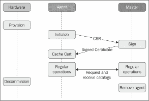

# 第二章：Puppet 服务器和代理

到目前为止，你处理了一些简明的 Puppet 清单，这些清单被构建来模拟一些非常具体的目标。通过 `puppet apply` 命令，你可以在基础设施中的任何机器上使用这些片段。然而，这并不是使用 Puppet 的最常见方式，本章将介绍流行的服务器/代理结构。不过，值得注意的是，应用与整体 Puppet 设计无关的独立清单仍然是很有用的。

在服务器/代理范式下，通常会在你管理的所有节点上安装 Puppet 代理软件，并使它们调用服务器，而服务器本身也是一个 Puppet 安装。服务器将编译适当的清单，并有效地远程控制代理。代理和服务器都会使用受信任的 SSL 证书进行身份验证。

本章涵盖以下内容：

+   Puppet 服务器

+   设置 Puppet 代理

+   性能优化

+   使用 PuppetDB 完善堆栈

+   Puppet CA

# Puppet 服务器

许多基于 Puppet 的工作流集中在服务器上，服务器是配置数据和权限的中央源。服务器将指令发送到基础架构中的所有计算机系统（代理已安装的地方）。它在 Puppet 组件的分布式系统中起着多重作用。

服务器将执行以下任务：

+   存储清单并编译目录

+   作为 SSL 证书颁发机构

+   处理来自代理机器的报告

+   收集并存储有关代理的信息

因此，服务器机器的安全性至关重要。其加固要求与 Kerberos 密钥分发中心的要求类似。

在首次初始化时，Puppet 服务器会生成 CA 证书。这个自签名证书将被分发到你的基础设施中的所有组件，并被信任。因此，它的私钥必须非常小心地保护。新的代理机器请求个人证书，这些证书会使用 CA 证书进行签名。

在操作系统提供过程中包含 CA 证书的副本是个好主意，这样代理在请求其个人证书之前就能验证主服务器的真实性。

关于主服务器软件的术语可能有些令人困惑。因为**Puppet master**和**Puppet server**这两个术语都有出现，而且它们之间也有密切关系。为了帮助你更好地理解，我们来了解一些技术背景。

Puppet 的主服务主要由 RESTful HTTP API 组成。代理启动 HTTPS 事务，双方通过受信任的 SSL 证书相互识别。在 Puppet 3 及更早版本为最先进版本时，HTTPS 层通常由 Apache 处理。Puppet 的 Ruby 核心通过`Passenger`模块调用。这种方式提供了良好的稳定性和可扩展性。

Puppet Inc.通过名为`puppetserver`的专用软件改进了这一标准解决方案。主服务器的 Ruby 核心基本保持不变，尽管它现在运行在 JRuby 上，而不是 Ruby 的原生 MRI。HTTPS 层由 Jetty 运行，与主服务器共享同一个 Java 虚拟机。

通过去除一些中间层，`puppetserver`比 Passenger 解决方案更快且具有更好的可扩展性，而且配置起来也显著更简单。

# 设置服务器机器

将`puppetserver`软件安装到 Linux 机器上与安装代理包一样简单（正如您在第一章中所做的那样，*编写您的第一个清单*）。这些包适用于 Red Hat Enterprise Linux 及其衍生版、Debian 和 Ubuntu，以及任何支持运行 Puppet 服务器的操作系统。

到目前为止，Puppet 服务器必须运行在基于 Linux 的操作系统上，无法在 Windows 或其他 Unix 系统上运行。将 Puppet Inc.的软件包获取到任何平台的一个好方法是 Puppet 集合。在 Puppet 4 发布后不久，Puppet Inc.创建了这种新的软件供应方式。这可以视为一个独立的发行版。与 Linux 发行版不同，它不包含内核、系统工具或库，而是包含 Puppet 生态系统中的各种软件。从同一 Puppet 集合中提供的软件版本保证能够良好兼容。

使用以下命令在 Debian 8 机器上从第一个**Puppet 集合**（**PC1**）安装`puppetserver`（截至本文编写时，Debian 9 的集合尚未包含`puppetserver`包）：

```
root@puppetmaster# wget http://apt.puppetlabs.com/puppetlabs-release-pc1-jessie.deb
root@puppetmaster# dpkg -i puppetlabs-release-pc1-jessie.deb
root@puppetmaster# apt-get update
root@puppetmaster# apt-get install puppetserver 
```

`puppetserver`包仅包含 Jetty 服务器和 Clojure API，但所有功能合一的`puppet-agent`包作为依赖被拉取。

包名`puppet-agent`具有误导性。这个 AIO 包包含了 Puppet 的所有部分，包括主核心、一个定制的 Ruby 构建和几个附加软件组件。

具体来说，您可以在主节点上使用`puppet`命令。很快您将了解到这如何派上用场。然而，当使用 Puppet Labs 的包时，所有内容都会安装在`/opt/puppetlabs`目录下。建议确保您的`PATH`变量始终包括`/opt/puppetlabs/bin`目录，以便能够找到`puppet`命令。

尽管如此，一旦`puppetserver`包安装完成，您可以启动主服务：

```
root@puppetmaster# systemctl start puppetserver 
```

根据你的机器性能，启动过程可能需要几分钟。一旦初始化完成，服务器将非常流畅地运行。只要主控端端口`8140`开放，你的 Puppet 主控端就准备好服务请求。

如果服务未能启动，可能是证书生成出现问题（我们在某些软件版本中观察到过此类问题）。检查`/var/log/puppetlabs/puppetserver/puppetserver-daemon.log`日志文件。如果日志显示在查找证书文件时出现问题，你可以通过临时运行独立的主控端来规避问题，方法如下：

```
puppet master --no-daemonize
```

初始化后，你可以停止该进程。现在证书已可用，`puppetserver`应该也能够启动。

启动失败的另一个原因可能是内存不足。Puppet 服务器进程需要 2 GB 的内存。

# 创建主控端清单

当你在第一章《编写你的第一个清单》一节中本地使用 Puppet 时，你指定了一个清单文件，`puppet apply`应该编译该文件。主控端为多台机器编译清单，但代理无法选择使用哪个源文件；这完全由主控端决定。主控端任何编译的起点始终是站点清单，位于`/opt/puppetlabs/code/environments/production/manifests/`。

`environments/production`部分的重要性将在第五章《将类、配置文件和扩展整合为模块》一节中探讨。在 4.0 版本之前的 Puppet 中，站点清单位于另一个位置`/etc/puppet/manifests/site.pp`，并且只包含一个文件。

每个连接的代理将使用此处找到的所有清单。当然，你不希望在所有机器上只管理一套相同的资源。为了专门为某个特定代理定义一份清单，可以将其放入`node`区块中。此区块的内容只有在调用代理的 SSL 证书中有匹配的通用名称时才会被考虑。你可以为名为`agent`的机器专门定义一部分清单，例如：

```
node 'agent' {
  $packages = [ 'apache2',
    'libapache2-mod-php5',
    'libapache2-mod-passenger', ]
  package { $packages:
    ensure => 'installed',
    before => Service['apache2'],
  }
  service { 'apache2':
    ensure => 'running',
    enable => true,
  }
}
```

给出的示例并没有展示最佳的节点分类实践，仅作为示例使用。我们将在第九章《Puppet 角色与配置文件》一节中展示现代最佳的节点分类实践。

在设置并连接第一个代理到主控端之前，先退后一步，思考主控端应如何进行地址解析。默认情况下，代理会尝试解析未限定的`puppet`主机名，以获取主控端的地址。如果你的机器正在搜索默认域名，你可以将其用作默认域名，并为`puppet`添加一个记录作为子域名（例如`puppet.example.net`）。

否则，选择一个适合你的域名，比如`master.example.net`或`adm01.example.net`。关键点在于：

+   所有你的代理机器都能将名称解析为地址

+   主控进程正在监听该地址上的连接

+   主控使用选择的证书名称作为 CN 或 DNS Alt Names

解析模式取决于你的情况；每台机器上的`hosts`文件是一个常见的选择。Puppet 服务器默认会监听所有可用的地址。

这就剩下了创建合适证书的任务，这非常简单。配置主控端使用合适的证书名称并重启服务。如果证书尚不存在，Puppet 会采取必要的步骤来创建它。将以下设置放入主控机的`/etc/puppetlabs/puppet/puppet.conf`文件中：

```
[main] 
certname=puppetmaster.example.net 
```

在 Puppet 4.0 之前的版本中，配置文件的默认位置是`/etc/puppet/puppet.conf`。

在下次启动时，主控端将为所有 SSL 连接使用合适的证书。即使在现有设置下，SSL 数据的自动传播也不危险，唯一的例外是认证机构。如果主控端在任何时间生成新的 CA 证书，它将破坏所有现有代理的信任。

确保 CA 数据不会丢失或被泄露。每当 Puppet 需要创建新的认证机构时，所有先前签署的证书都会变得无效。Puppet 4.0 及更高版本的默认存储位置为`/etc/puppetlabs/puppet/ssl/ca`，较早版本的默认存储位置为`/var/lib/puppet/ssl/ca`。

# 检查配置设置

所有主控参数的自定义都可以在`puppet.conf`文件中进行。操作系统包带有一些由相应维护者认为合适的设置。除了这些显式设置外，Puppet 还依赖于内建的或从环境中派生的默认设置（关于如何运作的细节，请参见第三章，*Puppet 的 Ruby 部分探秘 - Facts、Types 和 Providers*）：

```
root@puppetmaster # puppet master --configprint manifest
/etc/puppetlabs/code/environments/production/manifests
```

大多数用户会希望尽可能依赖这些默认设置。这是可行的且没有任何缺点，因为 Puppet 通过`--configprint`参数使所有设置完全透明。例如，你可以找出主控端清单文件的位置。

要查看所有可用设置及其值，请使用以下命令：

```
root@puppetmaster# puppet master --configprint all | less 
```

虽然这个命令在主控端尤其有用，但相同的自省功能也适用于`puppet apply`和`puppet agent`。

可以使用`puppet config`命令设置特定的配置项：

```
root@puppetmaster # puppet config set –-section main certname puppetmaster.example.net
```

# 设置 Puppet 代理

如前所述，主节点主要通过从清单编译而来的目录为代理提供指令。你也已经为你的第一个代理在主节点清单中准备了一个 `node` 块。

安装代理软件很简单；你在第一章开始时就做过这件事，*编写你的第一个清单*。允许应用本地清单的普通 Puppet 包包含了操作正常代理所需的所有必要部分。

如果你使用的是 Puppet Labs 的包，按照本章前面部分的指示操作。在代理机器上，无需安装 `puppetserver` 包，只需安装 `puppet-agent` 即可。

在成功安装包之后，需要指定 puppet agent 可以找到 puppet server 的位置：

```
root@puppetmaster # puppet config set –-section agent server pup-petmaster.example.net 
```

然后，以下的调用就足以进行初步测试：

```
root@agent# puppet agent --test
Info: Creating a new SSL key for agent
Error: Could not request certificate: getaddrinfo: Name or service not known
Exiting; failed to retrieve certificate and waitforcert is disabled
```

Puppet 首先为自己创建了一个新的 SSL 证书密钥。它为自己的名字选择了 `agent`，这是机器的主机名。现在这样就可以了。发生错误是因为 `puppet` 名称当前无法解析。将此添加到 `/etc/hosts` 文件中，以便 Puppet 能够联系到主节点：

```
root@agent# puppet agent --test
Info: Caching certificate for ca
Info: csr_attributes file loading from /etc/puppetlabs/puppet/csr_attributes.yaml
Info: Creating a new SSL certificate request for agent
Info: Certificate Request fingerprint (SHA256): 52:65:AE:24:5E:2A:C6:17:E2:5D:0A:C9: 86:E3:52:44:A2:EC:55:AE:3D:40:A9:F6:E1:28:31:50:FC:8E:80:69
Exiting; failed to retrieve certificate and waitforcert is disabled
```

Puppet 如何方便地下载并缓存了 CA 证书。代理今后将基于此证书建立信任。

Puppet 创建了一个证书请求并将其发送到主节点。然后它立即尝试下载签名的证书。这预计会失败，因为主节点不会为它收到的任何请求签发证书。这种行为对于确保安全至关重要。

有一个配置设置可以启用这种自动签名，但通常不建议用户使用此设置，因为它允许任何具有网络访问权限的用户为任意数量的请求生成签名证书（因此被信任）。

要授权代理，使用 `puppet cert` 命令在主节点上查找 CSR：

```
root@puppetmaster# puppet cert --list
"agent" (SHA256) 52:65:AE:24:5E:2A:C6:17:E2:5D:0A:C9:86:E3:52:44:A2:EC:55:AE: 3D:40:A9:F6:E1:28:31:50:FC:8E:80:69 
```

这看起来没问题，现在你可以为代理签署一个新证书：

```
root@puppetmaster# puppet cert --sign agent
Notice: Signed certificate request for agent
Notice: Removing file Puppet::SSL::CertificateRequest agent at '/etc/puppetlabs/ puppet/ssl/ca/requests/agent.pem' 
```

在选择 `puppet cert` 的操作时，可以省略选项名前的连字符；你可以直接使用 `puppet cert list` 和 `puppet cert sign`。

现在，代理可以按如下方式接收其证书并运行目录：

```
root@agent# puppet agent --test
Info: Caching certificate for agent
Info: Caching certificate_revocation_list for ca
Info: Caching certificate for agent
Info: Retrieving pluginfacts
Info: Retrieving plugin
Info: Caching catalog for agent
Info: Applying configuration version '1437065761'
Notice: Applied catalog in 0.11 seconds
```

代理现在已完全正常工作。它接收了一个目录并应用了其中找到的所有资源。在继续阅读了解代理的常规操作之前，尤其是对于 Puppet 3 的用户来说，有一项注意事项非常重要。

请记住，你在本章前面已经配置了主节点，使用 `master.example.net` 作为主节点机器的名称，并通过设置主节点 `puppet.conf` 文件中的 `certname` 选项来指定。

由于这是主节点证书中的通用名称，因此之前的命令甚至在 Puppet 3.x 版本上也无法工作。它在 `puppetserver` 和 Puppet 4 上工作，因为默认的 `puppet` 名称现在已经默认包含在证书的主题备用名称（SAN）中。

然而，最好不要依赖这个别名。在生产环境中，您可能希望确保主节点有一个完全合格的名称，至少在您的网络内部可以解析。因此，您应在每台代理机器的 `puppet.conf` 文件的 `main` 部分中添加以下内容：

```
[agent] 
server=master.example.net 
```

如果没有 DNS 来解析此名称，您的代理将需要在其 hosts 文件中有适当的条目，或采用类似的地址解析方式。

这些步骤在 Puppet 3.x 设置中是必要的。如果您正在使用 Puppet 4 代理，您可能会注意到在此更改后，它会生成一个新的证书签名请求：

```
root@agent# puppet agent –test
Info: Creating a new SSL key for agent.example.net
Info: csr_attributes file loading from /etc/puppetlabs/puppet/csr_attributes.yaml
Info: Creating a new SSL certificate request for agent.example.net
Info: Certificate Request fingerprint (SHA256): 85:AC:3E:D7:6E:16:62:BD:28:15:B6:18: 12:8E:5D:1C:4E:DE:DF:C3:4E:8F:3E:20:78:1B:79:47:AE:36:98:FD
Exiting; no certificate found and waitforcert is disabled
```

如果发生这种情况，您需要再次在主节点上使用 `puppet cert sign`。然后，代理将获取一个新的证书。

# 代理的生命周期

在以 Puppet 为中心的工作流中，通常希望所有服务器（甚至工作站）的配置更改都从 Puppet 主节点发起，并自动传播到代理。每一台新机器都会与 Puppet 基础设施集成，主节点位于中心位置，并在退役时将其移除，如下图所示：



第一步，生成密钥和证书签名请求，如果本地尚未存在 SSL 数据，通常会在代理程序启动时隐式并自动执行。如果找不到相应的文件，Puppet 会创建所需的数据。稍后会在本节中简要描述如何手动触发此行为。

下一步通常是对代理证书进行签名，这在主节点上进行。最好通过在控制台上列出待处理的请求来监控它们：

```
root@puppetmaster# puppet cert list
root@puppetmaster# puppet cert sign '<agent fqdn>'
```

从此时起，代理将定期检查主节点以加载更新的目录。默认的检查间隔为 30 分钟。每次运行时，代理会执行一个目录，并检查所有资源的同步状态。即使目录没有变化，运行仍会执行，因为同步状态可能在运行间发生变化。

在您成功签署证书之前，代理进程会在短时间内定期查询主节点。这样可以避免代理启动时如果证书还没有准备好，而导致 30 分钟的延迟。

启动此后台进程可以通过一个简单的命令手动完成：

```
root@agent# puppet agent
```

然而，最好通过 `puppet` 系统服务来执行此操作。

当代理机器被移出活跃服务时，应该使其证书失效。与 SSL 的惯例一样，这通常是通过吊销和清除证书来完成的。主节点将证书的序列号添加到证书吊销列表中。这个列表也会与每台代理机器共享。吊销操作在主节点上通过 `puppet cert` 命令发起：

```
root@puppetmaster# puppet cert revoke agent
```

更新后的 CRL 直到主服务重启后才会生效。如果安全性是一个问题，这一步骤不能被延迟。

代理将无法再使用其旧证书：

```
root@agent# puppet agent --test
Warning: Unable to fetch my node definition, but the agent run will continue:
Warning: SSL_connect SYSCALL returned=5 errno=0 state=unknown state
[...]
Error: Could not retrieve catalog from remote server: SSL_connect SYSCALL returned=5 errno=0 state=unknown state
[...]
```

# 更新代理的证书。

有时，在代理机器的生命周期中，需要重新生成其证书及相关数据。可能的原因包括数据丢失、人为错误或证书过期等。重新生成的步骤如下：

1.  执行重新生成过程非常简单：所有相关文件都保存在代理机器上的 `/etc/puppetlabs/puppet/ssl`（对于 Puppet 3.x，这是 `/var/lib/puppet/ssl`）目录下。

1.  一旦这些文件（或者整个 `ssl/` 目录树）被移除，Puppet 将在下一次代理运行时重新生成所有内容。当然，新的证书必须被签名。这需要一些准备，仅仅从代理发起请求将会失败：

```
root@agent# puppet agent –test
Info: Creating a new SSL key for agent
Info: Caching certificate for ca
Info: Caching certificate for agent.example.net
Error: Could not request certificate: The certificate retrievedfrom the master does not match the agent's private key.
Certificate fingerprint: 6A:9F:12:C8:75:C0:B6:10:45:ED:C3:97:24:CC:98:F2:B6:1A:B5: 4C:E3:98:96:4F:DA:CD:5B:59:E0:7F:F5:E6
```

主服务仍然缓存着旧的证书。这是一个简单的防护措施，防止未经授权的实体伪装成你的代理。

1.  为了解决这个问题，从主服务和代理中删除证书，然后启动一次 Puppet 运行，这将自动重新生成证书：

    +   在主服务上，使用以下命令：

```
 puppet cert clean agent.example.net
```

1.  +   在代理上，使用以下命令：

    +   在大多数平台上，使用以下命令：

```
find /etc/puppetlabs/puppet/ssl -name agent.example.net.pem –delete
```

1.  +   在 Windows 上，使用以下命令：

```
del "/etc/puppetlabs/puppet/ssl/agent.example.net.pem" /f
puppet agent –t
Exiting; failed to retrieve certificate and waitforcert is disabled
```

1.  一旦你根据前述输出执行了主服务上的清理操作，并从代理机器上移除指示的文件，代理将能够成功地放置其新的 CSR：

```
root@puppetmaster# puppet cert clean agent
Notice: Revoked certificate with serial 18
Notice: Removing file Puppet::SSL::Certificate agent at '/etc/puppetlabs/ puppet/ssl/ca/signed/agent.pem'
Notice: Removing file Puppet::SSL::Certificate agent at '/etc/puppetlabs/ puppet/ssl/certs/agent.pem'
```

剩余的过程与原始证书创建完全相同。代理将其 CSR 上传到主服务，在主服务中通过 `puppet cert sign` 命令创建证书。

# 从 cron 运行代理。

还有一种替代方法来操作代理。我们之前提到过启动一个长时间运行的 `puppet agent` 进程，它按照设定的间隔工作，然后回到休眠状态。然而，也可以通过 cron 在相同的间隔启动一个独立的代理进程。这个代理将联系主服务一次，运行接收到的目录，然后终止。这有几个优点，具体如下：

+   代理操作系统节省资源。

+   间隔是精确的，不会受到偏差的影响（当运行后台代理时，偏差来自目录运行过程中消耗的时间），并且分布式间隔偏差可能导致“雷鸣效应”。

+   任何代理崩溃或意外终止都不会致命。

使用 cron 启动代理的 Puppet 设置也非常简单！你可以使用如下的清单：

```
service { 'puppet': enable => false, }
cron { 'puppet-agent-run':
  user    => 'root',
  command => 'puppet agent --no-daemonize --onetime --logdest=syslog',
  minute  => fqdn_rand(60),
  hour    => absent,
}
```

`fqdn_rand` 函数为每个代理计算一个独特的分钟。将 `hour` 属性设置为 `absent` 意味着该任务应该每小时运行一次。

# 性能优化。

操作 Puppet 主机相比于在所有机器上仅使用 `puppet apply` 为您带来了许多好处。当然，这也有代价。主机和代理之间形成了一个服务器/客户端关系，与大多数此类结构一样，服务器可能会成为瓶颈。

好消息是，Puppet 代理是一个胖客户端。文件内容检查、与软件包管理子系统、服务子系统的接口以及其他很多工作都由代理完成。主机只需要编译清单并从中构建目录。随着您将更多控制交给 Puppet，这一过程变得越来越复杂。

还有一项任务是由主机负责的。您的许多清单将包含依赖于已准备好内容的文件资源：

```
file { '/usr/local/etc/my_app.ini':
  ensure => file,
  owner  => 'root',
  group  => 'root',
  source =>  
  'puppet:///modules/my_app/usr/local/etc/my_app.ini',
}
```

带有 URL 值的 `source` 参数表示该文件已经预生成并放置在 Puppet 主机上的模块中（有关模块的更多内容，请参见 第五章，*将类、配置文件和扩展组合成模块*）。代理将通过校验和比较本地文件与主机的副本，并在需要时下载规范版本。大多数代理运行时会频繁进行比较；您会让 Puppet 管理大量文件。主机不需要大量资源来完成此操作，但如果主机出现拥塞，*将会*妨碍代理的流畅操作。

这可能是由于以下任意组合原因导致的：

+   代理的总数过多

+   代理检查频率过高

+   清单过于复杂

+   Puppet 服务器未得到充分调优

+   主机的硬件资源不足

有方法可以通过负载均衡来扩展您的主机操作，但这些内容本书未涉及。

Puppet Labs 在 [`docs.puppetlabs.com/guides/scaling_multiple_masters.html`](https://docs.puppetlabs.com/guides/scaling_multiple_masters.html) 上提供了一些关于几种高级方法的文档。

# 调优 puppetserver

puppetserver 是运行主机服务的绝佳方式。它的设置和维护非常简单，而且在操作期间性能也非常好。启动过程可能需要一些时间来初始化所有必要的内容。

只有少数可自定义的设置会影响性能。由于 puppetserver 运行在 JVM 中，最重要的调优方法是调整堆内存。较小的堆内存会增加垃圾回收的开销。因此，您应该使用 `-Xmx` 和 `-Xms` Java 选项，让 JVM 使用大量可用内存来分配上述堆内存。

在 Debian 系统中，这些设置位于 `/etc/default/puppetserver`。建议将相同的值传递给两者。动态堆内存几乎没有好处，因为您无法安全地使用任何节省下来的内存。

为了保证 puppetserver 的正常运行，建议您至少有 4 GB 的 RAM 可用。

# 完善 PuppetDB 堆栈

PuppetDB 是一个专门为与 Puppet 主节点交互而设计的数据库 REST API。它主要包括一个 PostgreSQL 后端和一个 API 包装器。后者是用 Clojure 编写的，并在另一个 JVM 中运行。

PuppetDB 协助主节点的次要任务——存储报告和其他代理数据。它对于某些特定的清单编译器功能也是必需的。相关内容将在 第六章， *Puppet 初学者进阶部分* 中介绍。

设置和配置 PuppetDB 的最佳方式实际上就是 Puppet 本身。由于必要的工具尚未介绍，我们将在 第六章， *Puppet 初学者进阶部分* 中讲解这一步骤。这样做没有问题，因为 PuppetDB 对于基础主节点操作并非必需。

然而，在完成本章内容后，你应该将 PuppetDB 集成到任何新的主节点设置中，因为它支持高级报告和自省功能。

# Puppet CA

对于新用户来说，最令人沮丧的问题之一是代理的 SSL 握手问题。这些错误特别麻烦，因为 Puppet 并不总是能在日志中提供有用的分析 —— 问题发生在 SSL 库函数中，而应用程序无法检查具体情况。

Puppet Labs 的在线文档中有一个故障排除部分，其中还提供了一些关于 SSL 相关问题的建议，详见 [`docs.puppetlabs.com/guides/troubleshooting.html`](https://docs.puppet.com/pe/latest/trouble_puppet.html)。

请参考以下 `--test` 命令的输出：

```
root@agent# puppet agent --test
Warning: Unable to fetch my node definition, but the agent run will continue:
Warning: SSL_connect returned=1 errno=0 state=unknown state: certificate verify failed: [CRL is not yet valid for /CN=Puppet CA: puppet.example.net] 
```

代理认为它从主节点接收到的 CRL 尚未生效。当代理的时钟被重置为非常早的时间时，或者由于轻微的时钟偏差（当主节点上进行吊销操作时，CRL 最近更新），就可能发生这种错误。如果代理机器的系统时钟返回的时间远在未来，它将认为证书已过期。

这些与时钟相关的问题最好通过在所有 Puppet 代理和主节点上运行 `ntp` 服务来避免。

如果代理的 `$ssldir` 中的数据不一致，通常会导致错误。比如，当代理与一个备用主节点（例如测试实例）交互时，就可能发生这种情况。当你向社区询问如何解决这类问题时，最常得到的建议通常是从头开始创建一个新的代理证书。这在 *代理的生命周期* 部分中有描述：

+   删除代理机器上的所有 SSL 数据

+   使用 `puppet cert clean` 撤销并移除主节点上的证书

+   请求并签署新的证书

在你开始恢复程序之前，请确保你登录的是受影响的代理机器，而不是主节点。丢失主节点的 SSL 数据将需要重新创建完整的 SSL 基础设施。

这种方法确实可以解决大部分问题。请小心不要在代理机的相关位置留下任何旧文件。如果问题仍然存在，则需要更复杂的解决方案。`openssl`命令行工具对分析证书及相关文件很有帮助。不过，关于这种分析的详细内容超出了本书的范围。

# 总结

现在，你可以使用先进的 puppetserver 解决方案来设置自己的 Puppet 主控。你已经成功为 Puppet 代理签署了证书，并且可以在需要时撤销证书。通过在主控清单中使用`node`块，你可以为每个独立的代理描述各自的清单。最后，你也学习了一些基于 SSL 的认证中可能出现的问题。

在第三章，《Puppet 的 Ruby 部分 - Facts, Types, and Providers》中，我们将深入探讨 Puppet 的内部工作原理，以便帮助你理解 Puppet 代理如何适应其环境。你还将了解代理如何向主控提供反馈，允许你创建适应不同需求的灵活清单。
