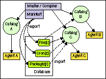

# 第六章：Puppet 初学者的进阶部分

在我们深入讨论了清单结构元素（class 和 define）以及整体结构（modules）之后，你已经处于一个很好的位置，可以为所有代理编写清单。确保你获得了可以帮助你工作的 Forge 模块。然后，继续添加根据你需求实现 Forge 模块的特定站点模块。最后，你将拥有用于 `node` 块的组合类，可以被使用或包含。

这些概念有些复杂。现在是时候稍微放慢一下节奏，靠后坐，处理一些更简单的代码结构和思路了。你即将学习一些不一定每天都用得上的技术，尽管如此，它们能让复杂的场景变得更简单。因此，在你实际工作一段时间后，再回过头来看这一章，可能会有帮助。你可能会发现，一些设计可以用这些工具简化。

具体来说，以下是将要介绍的技术：

+   构建动态配置文件

+   管理文件片段

+   使用虚拟资源

+   跨节点配置与导出资源

+   为资源参数设置默认值

+   避免反模式

# 构建动态配置文件

在介绍部分，我提到过，你现在正在学习的技术并不常常需要。这是对的，除了一个话题。模板实际上是 Puppet 配置管理的基石。

模板是管理配置文件或任何文件的另一种方式。你可以将主节点的文件同步到处理某些 Apache 配置设置的代理节点。严格来说，这些文件不是模板，它们只是已经准备好的静态文件，准备好进行复制粘贴。

这些静态文件在很多情况下已经足够了，但有时候你会希望主节点为每个代理管理非常具体的配置值。这些值可能非常个性化。例如，Apache 服务器通常需要一个 `MaxClients` 设置。适当的值取决于许多方面，包括硬件规格和运行的 Web 应用的特性。如果在模块中准备所有可能的选项作为独立文件是不可行的。

# 学习模板语法

模板可以轻松处理这种场景。在 Puppet 4 中，EPP（嵌入式 Puppet）模板被引入。旧版的 ERB（嵌入式 Ruby）模板仍然可用且功能完备。如果你熟悉 PHP 或 JSP，你很快就能掌握 EPP 或 ERB Puppet 模板。以下 EPP 模板将输出 `Hello,world!` 三次：

```
<% [1,2,3].each  |$p| { %> 
Hello, world! 
<% } %> 
```

以下 ERB 模板完成了相同的功能：

```
<% (1 .. 3).each  do %> 
Hello, world! 
<% end %> 
```

这个模板也会产生很多空行，因为 `<%` 和 `%>` 标签之间的文本会从输出中移除，但最终的换行符不会被移除。为了让 EPP 引擎做到这一点，只需要将结束标签改为 `-%>`：

```
<% [1,2,3].each |$p| { -%> 
Hello, world! 
<% } -%> 
```

这个示例当然对于配置文件不是很有帮助。要将动态值包含到输出中，请将 Ruby 表达式括在`<%=tag`对中：

```
<% [1,2,3].each  |$index|  { -%> 
Hello, world #<%= $index %> ! 
<% } -%> 
```

现在，迭代器的值是输出每一行的一部分。你还可以使用以`$`符号为前缀的成员变量，并使用变量的完整命名空间。

这些变量被填充了来自 Puppet 清单变量的值：

```
<IfModule mpm_worker_module> 
ServerLimit         <%= $apache::apache_server_limit %> 
StartServers        <%= $apache::apache_start_servers %> 
MaxClients          <%= $apache::apache_max_clients %> 
</IfModule> 
<% $apache::apache_ports.each  |$port| { -%> 
Listen <%= $port %> 
NameVirtualHost *:<%= $port %> 
<% } -%> 
```

在模板中使用的变量必须在使用模板的相同作用域或作用域中定义。下一部分将解释这是如何实现的。

在 Puppet 3.x 中，变量值大多是字符串、数组或哈希。为了编写高效的模板，偶尔浏览相应 Ruby 类的方法是很有帮助的。在 Puppet 4 中，变量的值更加多样化。

有几种方式可以在 ERB 模板中使用 Puppet 变量：

+   通过`@`符号前缀变量：这意味着该变量是全局的，或者它是在使用模板的同一类中定义的。这在 Puppet 2.7、Puppet 3 和 Puppet 4 中都适用。

+   使用`scope.lookupvar('variablewithscopename')`函数：这允许你引用模块中任何类中的任何变量。请不要在其他模块中查找变量；这样会在其他模块上建立一个隐性依赖关系。该语法适用于 Puppet 2、Puppet 3 和 Puppet 4。

+   使用`scope['variablewithscope']`：在 Puppet 3 中，可以直接使用作用域哈希。其行为类似于`scope.lookupvar`。这在 Puppet 3 和 Puppet 4 中都适用。

# 在实践中使用模板

模板在模块中有其自己的位置。你可以自由地将它们放置在模块的`templates/`子树中。`epp`函数通过一个简单的描述符来定位它们：`epp('cacti/apache/cacti.conf.epp')`

该表达式计算位于`modules/cacti/templates/apache/cacti.conf.epp`中的模板内容。第一个路径元素（没有前导斜杠）是模块名称。其余的路径将被转换为模块中的`templates/`树。此函数通常用于生成`file`资源的`content`属性值：

```
file { '/etc/apache2/conf.d/cacti.conf':  
  content => epp('cacti/apache/cacti.conf.epp'),  
}  
```

许多模板期望在它们的作用域中定义某些变量。确保这一点的最简单方法是将相应的`file`资源包装在一个参数化的容器中。那些具有已知名称的**单例**文件，如`/etc/ssh/sshd_config`，应该通过一个参数化类进行管理。可以包含多个文件的配置项，如`/etc/logrotate.d/*`或`/etc/apache2/conf.d/*`，非常适合通过定义的类型进行包装：

```
define logrotate::conf(
  String $pattern,
  Integer $max_days=7,
  Array $options=[]
) {
  file { "/etc/logrotate.d/$name": 
    ensure  => file,
    mode    => '0644', 
    content => epp('logrotate/config-snippet.epp',
      {
        'pattern'  => $pattern,
        'max_days' => $max_days,
        'options'  => $options,
      },) 
  }
}
```

类中的 EPP 模板与定义中的 EPP 模板之间有一个主要的区别。类中的 EPP 模板可以直接使用带命名空间的类变量。而定义的资源类型没有固定的命名空间。因此，需要向`epp`函数添加一个映射哈希，其中我们指定模板中的变量和定义中对应的变量。

之后，可以直接在模板中使用变量（`$pattern, $max_days, $options`）。

对于快速且简便的数据字符串转换，你还可以在清单中使用`inline_epp`函数。这个函数通常出现在变量赋值的右侧：

```
$comma_seperated_list = inline_epp('<%= $my_class::my_array * "," %>') 
```

这个示例假设`my_class`类中的`$my_array` Puppet 变量包含一个数组值。

# 避免模板中的性能瓶颈

在使用模板时，无论是通过`epp`还是`inline_epp`函数，都需要注意每次调用都会对 Puppet 主服务器带来性能损耗。在编译目录时，Puppet 必须为它遇到的每个模板初始化 EPP 引擎。EPP 评估发生在一个独立的环境中，该环境来自于`epp`函数调用的相应作用域。

因此，模板的复杂度并不重要。如果你的清单需要频繁扩展一个非常简短的模板，那么每次初始化都会产生巨大的开销。特别是在使用简单的`inline_epp`函数时，如前所述，值得投入更多的精力来创建一个解析函数，正如在第五章中所看到的，*将类、配置文件和扩展合并为模块*。函数可以在不增加累积性能损失的情况下执行变量值转换。

从积极的一面看，使用模板对于代理来说非常经济，因为代理可以直接在目录中接收到完整的文本文件内容。无需额外调用主服务器并检索文件元数据。在高延迟的网络环境下，这能带来明显的节省。

这里没有万能的解决方案。不要让性能影响阻止你将特定的配置文件转换为模板。基于模板的解决方案通常会使你的模块更具可维护性，通常可以抵消性能上的影响；毕竟，硬件价格一直在下降。只要避免频繁（且简单）的扩展，就不会浪费资源。

# 管理文件片段

我们接下来要讨论的技术帮助你解决清单中的冲突，并在特殊情况下构建一些优雅的解决方案。这主要指的是配置文件，其中一个文件可能无法完全管理，或者文件是由不同子类构建的。

Puppet 提供了几种方法来实现这一点：

+   单行

+   单个条目在一个部分中

+   从多个片段构建

+   其他资源类型

如何处理一个配置文件，用户可能会添加额外的内容？到目前为止，我们看到的是管理完整的配置文件，在这些文件中，所做的更改将被重置。但考虑一下用户的`.bashrc`文件，系统管理员希望确保用户使用特定的代理。

通常，可以在`/etc/profile.d/`的片段中全局指定这一点。这更多的是作为展示。

Puppet 有一个特定的资源类型，可以管理配置文件中的单行条目：`file_line`资源类型。这个资源类型不是核心资源类型，但由`stdlib`模块提供。

```
file_line { 'user admin proxy': 
  ensure   => present, 
  path     => '/home/admin/.bashrc', 
  line     => 'export 
  http_proxy=http://proxy.domain.com:3127', 
} 
```

在前面的示例中，如果该行缺失，它将被添加到文件的底部。如果该行已经存在，Puppet 将不会更改文件。

请记住，`file_line`资源类型要求文件已经存在于系统中。如果不确定这一点，最佳实践是管理文件的存在性，而不指定内容或源：

```
file { '/home/admin/.bashrc': 
  ensure => file, 
  owner  => 'admin', 
  group  => 'admin', 
  mode   => '0644', 
} 
```

# 部分中的单个条目

但是如果需要在包含多个部分的配置文件中配置一行怎么办？在这种情况下，最好不要将该行添加到文件的底部。

这就是`ini_setting`资源类型将发挥作用的地方。这个资源类型不是 Puppet 核心的一部分，但随`puppetlabs-inifile`模块一起提供。

```
ini_setting { 'puppet agent report': 
  ensure  => present, 
  path    => '/etc/puppetlabs/puppet/puppet.conf', 
  section => 'agent', 
  setting => 'report', 
  value   => 'true', 
} 
```

上述示例将检查代理部分是否有`report = true`的条目，如果缺少，则会添加该条目。如果整个部分还不存在，它也会添加该部分。如果整个文件缺失，`ini_setting`资源类型也会创建该文件。

通常，`ini_setting`假定节名称放在括号中，并且使用`=`符号作为设置值分隔符。

该资源类型允许采用`section_prefix`和`section_suffix`以及`key_value_separator`。

```
ini_setting { 'ssh config host default':
  ensure              => present,
  path                => '/etc/ssh/ssh_config',
  section             => 'Host *',
  section_prefix      => '',
  section_suffix      => '',
  key_value_separator => ' ',
  setting             => 'HashKnownHosts',
  value               => 'true',
}
```

这将产生以下输出：

```
Host * 
HashKnownHosts true 
```

但是管理`ssh_config`文件中的所有单个条目非常低效，因为必须在每个资源类型声明中提供所有单个条目。在这种特定情况下，从片段构建配置文件是可行的。

# 从多个片段构建

与通过`file_line`和`ini_setting`资源类型构建文件相比，构建文件时有一个主要区别。后两者仅管理文件中的单个条目，而通过文件片段管理文件则是管理整个配置文件。

如果事先不知道需要多少条目，这非常有用。例如，动态扩展 haproxy 后端，或为数据库服务器添加备份条目，其中数据库的数量尚不确定。

文件片段的最常见解决方案是`puppetlabs-concat`模块。`concat`模块需要至少一次`no-noop`运行，因为它必须在节点上管理`concat`脚本。此脚本用于构建最终的配置文件。

首先，需要向 `concat` 指明它即将管理的文件：

```
concat { 'ssh config':
  ensure => present,
  path   => '/etc/ssh/ssh_config',
}
```

这将使 `concat` 能够从 `concat_fragments` 构建文件。所有片段应按特定顺序排列：

```
concat::fragment { 'ssh_config header':
  target  => 'ssh config',
  content => "# Managed by Pupept\n",
  order   => '01',
}
concat::fragment { 'default host':
  target => 'ssh config',
   source => 
'puppet:///modules/<modulename>/ssh_config_default host',
   order => '10',
}
```

# 使用虚拟资源

接下来我们将讨论的技术可以帮助你解决清单中的冲突，并在特殊情况下构建一些优雅的解决方案。

记住在第一章中介绍的唯一性约束，*编写你的第一个清单*，任何资源在清单中最多只能声明一次。不能有两个类或定义类型实例声明相同的 `file`、`package` 或任何其他类型的资源。每个资源必须具有唯一的类型/名称组合。这适用于定义类型的实例以及原生资源。

当多个模块需要共享资源时，可能会出现问题，例如已安装的包，或者甚至是同一配置文件中的独立设置。像在第四章中介绍的那样，为此类资源创建组件类，*将资源组合到类和定义类型中*，将解决此类基本冲突。它可以在同一清单中任意次数地包含。

当共享资源的数量非常大时，这种方式可能不太实际。假设你遇到了一种情况，许多不同的 Puppet 节点需要来自大量`yum`仓库的软件。Puppet 会通过其 `yumrepo` 类型乐于在代理上管理仓库配置。然而，你并不希望所有这些仓库都在每一台机器上配置，因为这样会带来维护开销。相反，更理想的做法是，每个节点自动接收其所需仓库的配置，但不包含多余的仓库。

当使用组件类解决这个问题时，你需要将每个仓库封装在一个独立的类中。类名应该与各自仓库的名称紧密相关（并且很可能包含这些名称）：

```
class yumrepos::team_ninja_stable {
  yumrepo { 'team_ninja_stable': 
    ensure => present, 
    ... 
  }
}
```

依赖于一个或多个此类仓库的包资源需要附带适当的 `include` 语句：

```
include yumrepos::team_ninja_stable
include yumrepos::team_wizard_experimental
package { 'doombunnies': 
  ensure  => installed, 
  require => [
    Class['yumrepos::team_ninja_stable'], 
    Class['yumrepos::team_wizard_experimental']
  ],
}
```

这是可行的，但效果不理想。Puppet 提供了一种避免重复资源声明的替代方法，形式为虚拟资源。它允许你在清单中添加资源声明，而无需将该资源添加到实际目录中。虚拟资源必须被**实现**或**收集**才能达到此目的。与类包含类似，虚拟资源的实现可以在同一清单中任意发生。

因此，我们之前的示例可以使用一个更简单的结构，通过一个类声明所有 `yum` 仓库作为虚拟资源，并设置标签参数：

```
class yumrepos::all { 
  @yumrepo { 'tem_ninja_stable':
    ensure => present,
    tag    => 'stable',
  }
  @yumrepo { 'team_wizard_experimantel':
    ensure => present,
    tag    => 'experimental',
  }
} 
```

`@` 前缀将 `yumrepo` 资源标记为虚拟资源。这个类可以安全地包含在所有节点中，直到资源被实际化之前，不会影响目录：

```
realize(Yumrepo['team_ninja_stable'])
realize(Yumrepo['team_wizard_experimental'])
package { 'doombunnies': 
  ensure  => installed, 
  require => [ 
    Yumrepo['team_ninja_stable'], 
    Yumrepo['team_wizard_experimental'], 
  ], 
}  
```

`realize` 函数将引用的虚拟资源转换为真实资源，并将其添加到目录中。诚然，这比之前依赖组件类的代码并没有什么优势。虚拟资源至少使意图更加明确，实际化它们比一些 `include` 语句要更清晰；一个类可以包含许多资源，甚至更多的 `include` 语句。

这个 `define` 结构实际上也可以通过组件类来实现。类名可以作为参数传递，或者通过中央数据结构传递。`include` 函数将接受类名的变量值。

# 使用收集器更灵活地实现资源

你可以不调用 `realize` 函数，而是依赖一个不同的语法结构，即 `collector`：

```
Yumrepo<| title == 'team_ninja_stable' |>
```

这比函数调用更灵活，代价是稍微有一些性能损失。它可以在某些上下文中作为已实现资源的引用。例如，你可以使用链式操作符添加顺序约束：

```
Yumrepo<| title == 'team_ninja_stable' |> -> Class['...']
```

甚至可以在收集过程中更改资源属性的值。关于这种覆盖的内容将在本章后面的一个专门章节中讨论。

由于收集器基于表达式，你可以方便地实现一系列资源。有时这会非常动态，你会创建一些虚拟资源，这些资源已经被一个相当不加区分的收集器实现了。我们来看一个常见的例子：

```
User<| |>
```

如果没有表达式，集合将包括所有给定类型的虚拟资源。这使得你可以收集它们，而无需担心它们的显式标题或属性。这看起来可能是多余的，因为这会使得最初声明资源为虚拟资源没有意义。然而，请记住，收集器可能只出现在某些选定的清单中，而虚拟资源则可以安全地添加到所有节点中。

为了更具选择性，将虚拟资源根据其**标签**进行分组可能会很有用。我们还没有讨论标签。每个资源都被打上几个标识符标签。每个标签只是一个简单的字符串。你可以通过定义 `tag` 元参数手动为资源打标签：

```
file { '/etc/sysctl.conf': 
  ensure => file, 
  tag    => 'security', 
} 
```

然后，命名标签会被添加到资源中。Puppet 会隐式地为所有资源打上声明类的名称、包含模块的名称以及其他一系列有用的元信息标签。例如，如果你的用户模块将 `user` 资源划分为 `administrators`、`developers`、`qa` 和其他角色，你可以通过基于类名标签的集合，让特定的节点或类选择给定角色的所有用户：

```
User<| tag == 'developers' |>
```

注意，这些标签实际上形成了一个数组。`==` 比较将查找此上下文中 `tag` 数组中是否存在 `developers` 元素。看一下另一个例子，让这个概念更加清晰：

```
@user { 'felix':  
  ensure => present,  
  groups => [ 'power', 'sys' ],  
} 
User<| groups == 'sys' |> 
```

通过这种方式，你可以收集所有属于 `sys` 组的用户。

如果你更喜欢函数调用而非较为晦涩的收集器语法，你可以继续使用 `realize` 函数和收集器一起使用。这样不会有问题。记住，每个资源可以多次实现，甚至可以同时以两种方式实现。

如果你想知道，给定代理的清单只能实现该代理清单中声明的虚拟资源。虚拟资源不会泄漏到其他清单中。因此，资源不能从一个清单故意转移到另一个清单中。不过，还有另外一个概念可以实现这样的交换；它将在下一节中描述。

# 使用导出资源进行跨节点配置

Puppet 常用于配置整个服务器集群或 HPC 工作节点。与手动管理相比，任何配置管理系统都能使这项任务变得更加高效。相似节点之间可以共享清单。需要为每个节点单独定制的配置项会被单独建模。整个过程非常自然且直接。

另一方面，有一些配置任务不太适合所有状态的中央定义范式。例如，集群设置可能包括共享生成的密钥，或在对等节点变得可用时注册其 IP 地址。自动化设置应包括此类共享信息的交换。Puppet 也可以帮助处理这个问题。

这是一个非常合适的匹配。它节省了一个元层，因为你不需要在 Puppet 中实现信息交换系统的设置。共享是安全的，依赖于 Puppet 的身份验证和加密基础设施。还有日志记录和集中控制共享配置的部署。Puppet 保持其作为所有系统详细信息的中央源的角色；它充当了安全信息交换的中心。

# 导出和收集资源

Puppet 通过导出资源的方法来解决多个代理节点之间共享配置信息的问题。这个概念很简单。**节点 A** 的清单可以包含一个或多个纯虚拟资源，这些资源不在 **节点 A** 的清单中实现。其他节点，例如 **B** 和 **C**，可以导入其中的一部分或全部资源。然后，这些资源成为这些远程节点的目录的一部分。



导入和导出资源的语法与虚拟资源的语法非常相似。

资源。导出资源通过在资源类型前添加前缀来声明。

带有两个 `@` 字符的名称：

```
@@file { 'my-app-psk':  
  ensure  => file, 
  path    => '/etc/my-app/psk',  
  content => 'nwNFgzsn9n3sDfnFANfoinaAEF',  
  tag     => 'cluster02',  
}
```

导入清单使用表达式收集这些资源，这与收集虚拟资源类似，但使用了双角括号

括号，`<` 和 `>`：

```
File <<| tag == 'cluster02' |>>
```

标签是控制这种导出资源分发的非常常见的方式。

# 配置主节点以存储导出的资源

唯一推荐的启用导出资源支持的方式是 PuppetDB。它是一个 REST API，用于将 Puppet 主机在常规操作过程中处理的各种数据存储在 PostgreSQL 数据库中。这包括来自代理的清单请求（包括其重要的事实数据）、清单应用程序的报告和导出资源。

第二章，*Puppet 服务器和代理*，详细描述了手动安装主机的过程。现在通过 Puppet 以更优雅的方式添加 PuppetDB！在 Forge 上，你将找到一个便捷的模块来轻松实现这一点：

```
puppet module install puppetlabs-puppetdb  
```

在主节点上，设置现在变成了一个简单的命令行调用：

```
puppet apply -e 'include puppetdb, puppetdb::master::config'
```

由于我们的测试主机使用的是一个非标准的 SSL 证书，名为 `master.example.net`（而不是其完全限定域名 FQDN），因此也必须为 `puppetdb` 进行配置：

```
include puppetdb 
class { ‘puppetdb::master::config’: 
         puppetdb_server => 'master.example.net', 
      } 
```

随后的清单运行相当令人印象深刻。Puppet 安装了 PostgreSQL 后端、Jetty 服务器和实际的 PuppetDB 包，并一次性完成了所有配置和启动服务。在应用了这个简短的清单之后，你已经将一个复杂的基础设施组件添加到你的 Puppet 设置中。现在，你可以利用导出的资源来执行各种有用的任务。

# 导出 SSH 主机密钥

对于集群机器之间的自定义交互，SSH 可以是一个宝贵的工具。通过无处不在的 `sshd` 服务，文件传输和远程执行任意命令变得轻松可行。出于安全原因，每个主机都会生成一个唯一的密钥来识别自己。当然，这种公钥认证系统只有在信任网络中，或者预先共享公钥的情况下才能真正工作。

Puppet 可以很好地完成后者的工作：

```
@@sshkey { $::facts['networking']['fqdn']: 
  host_aliases => $::facts['networking']['hostname'], 
  key          => $::facts['sshecdsakey'], 
  tag          => 'san-nyc' 
}  
```

感兴趣的节点会收集带有已知模式的密钥：

```
Sshkey<<| tag == 'san-nyc' |>>
```

现在，SSH 服务器可以通过 Puppet 安全存储在其数据库中的相应密钥进行身份验证。像往常一样，Puppet 主机是安全的支点。

事实上，一些来自 Puppet Forge 的 `ssh` 模块会使用这种结构来为你完成这项工作。

# 本地管理主机文件

许多站点可以依赖本地的 DNS 基础设施。通过这种设置，解析名称为本地 IP 地址是很容易的。然而，小型网络，或者由许多独立集群组成且基础设施共享较少的站点，必须依赖 `/etc/hosts` 中的名称。

你可以为每个网络单元维护一个中心化的主机文件，或者你可以

Puppet 会分别维护每个主机文件中的每一项条目。后一种方法有一些优势：

+   更改会通过 Puppet 代理网络自动分发

+   Puppet 处理主机文件中未管理的行

手动维护的注册表容易过时，并且会覆盖代理机器上任何本地添加的 hosts 文件内容。

使用导出资源的优越方法的清单实现与前一节的`sshkey`示例非常相似：

```
@@host { $::facts['networking']['fqdn']:
  ip           => $::facts['networking']['ipaddress'],
  host_aliases => [ $::facts['networking']['hostname'] ],
  tag          => 'nyc-site',
}
```

这是同样的原理，只不过现在每个节点导出的是它的`$ipaddress`事实值，而不是公钥，导入也按同样的方式进行：

```
Host<<| tag == 'nyc-site' |>> 
```

# 自动化自定义配置项

你还记得在上一章创建的 Cacti 模块吗？它让你可以非常简单地在 Cacti 服务器的清单中配置所有被监控的设备。然而，既然已经可以这样做，难道不会更好，如果你网络中的每个节点都能自动注册到 Cacti 吗？这很简单：让设备导出它们各自的`cacti_device`资源供服务器收集：

```
@@cacti_device { $::facts['networking']['fqdn']: 
  ensure => present, 
  ip     => $::facts['networking']['ipaddress'], 
  tag    => 'nyc-site', 
} 
```

Cacti 服务器，除了包含`cacti`类外，现在只需要收集这些设备即可：

```
Cacti_device<<| tag == 'nyc-site' |>>
```

如果一个 Cacti 服务器处理所有的机器，你可以直接省略`tag`的比较：

```
Cacti_device<<| |>>
```

一旦模块支持其他 Cacti 资源，你可以用相同的方式来处理它们。我们来看一个来自另一个流行监控解决方案的例子。

# 简化 Nagios 的配置

Puppet 支持管理**Nagios**（以及兼容版本的**Icinga**）的完整配置。每个配置部分都可以通过不同的 Puppet 资源来表示，类型如`nagios_host`或`nagios_service`。

有人正在努力从核心 Puppet 中移除对这个功能的支持。然而，这并不意味着支持会被完全取消，它只是会转移到另一个优秀的 Puppet 模块中。

你的每一台机器都可以在导出它们各自的`nagios_host`资源的同时，也导出`host`和`cacti_device`资源。然而，得益于 Nagios 的广泛支持，你还能做得更好。

假设你有一个模块或类来封装 SSH 处理（当然，你是在使用 Forge 模块来进行实际管理），你可以从自己的 SSH 服务器类内部处理监控。通过在这个类中添加导出，你可以确保包括这个类的节点（只有这些节点）也会获得监控：

```
class site::ssh { 
  # ...actual SSH management... 
  @@nagios_service { "${::facts['networking']['fqdn']}-
  ssh": 
  use       => 'ssh_template', 
  host_name => $::facts['networking']['fqdn'], 
  } 
}  
```

你可能已经了解了这个流程，但让我们再重复一遍口号：

```
Nagios_service<<| |>> 
```

使用这个集合，Nagios 主机会根据所有代理清单创建的服务自动配置自己。

对于大型的 Nagios 配置，你可能希望自己重新实现 Nagios 类型，使用简单的定义，从模板构建配置。在这种情况下，原生类型可能比`file`资源更慢，因为它们需要在每次运行时解析整个 Nagios 配置。而`file`资源则会更便宜，因为它们依赖于内容无关的校验和。

# 维护你的中央防火墙

说到那些不属于 Puppet 核心功能但很有用的特性，你当然可以管理 `iptables` 防火墙的规则。你需要 `puppetlabs-firewall` 模块来提供适当的类型。然后，每台机器都可以（除其他有用功能外）将其所需的端口转发导出到防火墙机器上：

```
@@firewall { "150 forward port 443 to ${::facts['networking']['hostname']}": 
  proto       => 'tcp', 
  dport       => '443', 
  destination => $public_ip_address, 
  jump        => 'DNAT', 
  todest      => $::facts['networking']['ipaddress'], 
  tag         => 'segment03', 
}
```

`$public_ip_address` 的值当然不是一个 Facter facts。你的节点必须配置适当的信息。你可以参考 第七章，*来自 Puppet 4 和 5 的新功能*，了解一种不错的方法来实现这一点。

防火墙规则资源的标题通常以三位数字索引开头，以便进行排序。防火墙机器会自然地收集所有这些规则：

```
Firewall<<| tag == 'segment03' |>>
```

如你所见，通过导出的 Puppet 资源建模分布式系统的可能性是多种多样的。我们已经为几种资源类型总结的简单模式，足以应对广泛的使用场景。结合已定义的资源类型，它使得你能够灵活地启用清单，以便协同工作，从而形成复杂的集群配置，且所需的努力相对较少。集群越大，Puppet 通过导出和收集，从你身上分担的工作就越多。

# 移除过时的导出

当某个节点清单停止导出任何资源时，该资源的记录会在该节点的清单编译完成后从 PuppetDB 中移除。这通常发生在代理与主服务器连接时。

但是，如果你永久停用某个代理，这种情况就不会发生。因此，你需要手动从数据库中移除这些导出。否则，其他节点将继续导入旧资源。

要从 PuppetDB 中清除此类记录，请在主服务器上使用 `puppet node deactivate` 命令：

```
puppet node deactivate vax793.example.net
```

# 为资源参数设置默认值

导出资源和虚拟资源都只声明一次，然后在不同的上下文中收集。语法非常相似，概念也类似。

然而，有时，某些资源的中央定义无法在所有节点上安全实现；例如，考虑所有 `user` 资源的集合。你很可能希望管理分配给每个帐户的用户 ID，以便在你的网络中保持一致。

这通常通过 LDAP 或类似的目录解决，但有些站点无法实现这一点。

即使几乎所有机器上的所有账户都能够使用其指定的 ID，仍然可能会有一些例外。在一些较旧的机器上，某些 ID 可能已经被用作其他用途，且无法轻易更改。在这些机器上，使用这些 ID 创建用户将失败。

如果允许重复的 ID，可以创建账户，但这并不是解决问题的方法，因为通常不希望出现重复 ID。

幸运的是，Puppet 提供了一种方便的方式来表达这种例外。要给用户`felix`分配非标准的 UID `2066`，只需通过指定属性值来实现资源：

```
User<| title == 'felix' |> { 
  uid => '2066' 
} 
```

你可以传递任何适用的属性、参数或元参数给

相关资源类型。你以这种方式指定的值是最终的，不能再被重写。

这个语言特性比前面的示例所显示的要强大得多。这是因为重写不仅限于虚拟和导出的资源。你可以重写清单中的任何资源。这为一些了不起的构造和快捷方式提供了可能。

以你在上一章创建的 Cacti 模块为例。它声明了一个`package`资源，以确保软件被安装。为此，它指定了`ensure => installed`。然而，如果你的模块的任何用户需要 Puppet 保持其软件包最新，这就不够了。对此的解决方案是给模块的类添加一些参数，允许用户选择软件包和其他资源的`ensure`属性值。然而，这实际上并不实用。复杂的模块可能管理数百个属性，而通过参数暴露所有这些属性将形成一个令人困惑的界面。

重写语法在这里提供了一个简单而优雅的解决方法。实现所需结果的清单非常直接：

```
include cacti 
Package<| title == 'cacti' |> { ensure => 'latest' } 
```

尽管这个清单简单，但对于那些不熟悉收集器/重写语法的协作者来说，理解起来会很困难。这并不是重写的唯一问题。你不能多次重写同一个属性。这其实是件好事，因为任何解决此类冲突重写规则的方式都让人很难预测包含多个此类重写的清单的实际语义。

过度依赖这种重写语法会使你的清单容易产生冲突。组合错误的类会导致编译器停止创建目录。即使你设法避免了所有冲突，清单也会变得相当混乱。定位给定节点的所有活动重写可能会很困难。任何类或定义的最终行为变得难以预测。

总的来说，最安全的做法是非常谨慎地使用重写。

收集器在没有选择器表达式的情况下使用时特别危险：

```
Package<| |> { before => Exec['send-software-list'] }
```

它不仅会实现给定类型的所有虚拟资源。它还会强制给同一类型的虚拟和常规资源应用意外的属性值。

# 通过使用资源默认值来节省冗余

本章介绍的最终语言构造可以为你节省很多时间。

一些打字工作，或者更准确地说，它可以让你避免复制和粘贴。写一个冗长的、重复的清单当然不会花费你大量时间。然而，简洁的清单通常更具可读性，因此也更易于维护。你可以通过定义资源默认值来实现这一点；这些默认值是为那些没有自定义值的资源所使用的：

```
Mysql_grant { 
  options    => ['GRANT'], 
  privileges => ['ALL'], 
  tables     => '*.*', 
} 
mysql_grant { 'root': 
  ensure => 'present', 
  user   => 'root@localhost', 
}
mysql_grant { 'apache': 
  ensure => 'present', 
  user   => 'apache@10.0.1.%', 
  tables => 'application.*', 
}
mysql_grant { 'wordpress': 
  ensure => 'present', 
  user   => 'wordpress@10.0.5.1', 
  tables => 'wordpress.*', 
}
mysql_grant { 'backup':
  ensure     => 'present',
  user       => 'backup@localhost',
  privileges => [ 'SELECT', 'LOCK TABLE' ],
} 
```

默认情况下，每个授权应适用于所有数据库，并包括所有权限。这允许你相当简洁地定义每个实际的 `mysql_grant` 资源。否则，你将不得不为所有资源指定 `privileges` 属性。在这个例子中，`options` 属性尤其重复，因为它们对于所有授权都是相同的。

请注意，`ensure` 属性也具有重复性，但没有被包含在内。通常认为将这个属性从资源默认值中排除是一个好做法。

`mysql_grant` 资源类型在核心 Puppet 中不可用。它是 `puppetlabs-mysql` 模块的一部分，位于 Forge 上。

尽管这种方法带来了便利，但不应在每个看似适用的机会中使用。它也有一些缺点，值得你记住：

+   如果默认值适用于在与默认定义有词法距离的资源（例如在清单文件几屏之远的地方声明的资源），它可能会让人感到意外。

+   默认值超越了类的包含和定义的实例化。

这两个方面形成了一个危险的组合。来自复合类的默认值可能会影响到清单中非常遥远的部分：

```
class webserver {  
  File { owner => 'www-data' }  
  include apache, nginx, firewall, logging_client  
  file {  
    ...  
  } 
} 
```

在 `webserver` 类中声明的文件应该属于一个默认用户。然而，这个默认值在包含的类中也会递归生效。`owner` 属性是一个属性：一个没有定义值的资源，因为它会忽略当前的状态。清单中指定的值将会被代理执行强制执行。通常情况下，你不关心托管文件的所有者：

```
file { '/etc/motd': content => '...' } 
```

然而，由于默认的 `owner` 属性，Puppet 现在会强制要求该文件属于 `www-data`。为了避免这种情况，你必须通过用 `undef` 来覆盖默认值，从而取消设置默认值，`undef` 是 Puppet 中相当于 `nil` 的值：

```
File { owner => undef } 
```

这也可以在单独的资源中完成：

```
file { '/etc/motd': content => '...', owner => undef } 
```

然而，频繁地这样做几乎不可行。后者选项尤其不吸引人，因为它会导致清单代码的复杂度增加，而不是简化它。毕竟，在这里不定义默认的 `owner` 属性才是更简洁的方式。

使默认值在多个清单区域生效的语义被称为**动态作用域**。它曾经也适用于变量值，并且通常被认为是有害的。事实上，Puppet 3.0 中最决定性的变化之一就是移除了动态变量作用域。资源默认值仍然使用它，但预计这将在未来的版本中有所改变。

应谨慎使用资源默认值。对于某些属性，如`file mode`、`owner`和`group`，通常应避免使用。

# 避免反模式

说到需要避免的东西，有一个语言特性我们仅在此提及，以便提醒大家要格外小心。Puppet 附带一个叫做`defined`的函数，它允许你查询清单中已声明的资源：

```
if defined(File['/etc/motd']) { 
  notify { 'This machine has a MotD': } 
} 
```

这个概念的问题在于它永远无法可靠。即使资源出现在清单中，编译器也可能会在`if`条件之后才遇到它。这可能会引发严重问题，因为某些模块会尝试通过这种构造使自己变得可移植：

```
if ! defined(Package['apache2']) {  
  package { 'apache2':  
    ensure => 'installed'  
  }  
}  
```

模块作者假设如果

清单在其他地方声明了`Package['apache2']`。如前所述，这种方法仅在块在编译器运行时足够晚的时候才有效。如果编译器在此块之后遇到其他声明，冲突仍然可能发生。

如果清单中包含多个相同查询的出现，清单的行为会变得完全不可预测：

```
class cacti { 
  if !defined(Package['apache2']) { 
    package { 'apache2': ensure => 'present' } 
  }
}
class postfixadmin { 
  if !defined(Package['apache2'] { 
    package { 'apache2': ensure => 'latest' } 
  }
}
```

第一个看到的块会优先执行。如果清单的无关部分被重组，这种优先顺序可能会发生变化。你无法预测给定的清单是会对`apache2`包使用`ensure=>latest`，还是使用`installed`。如果某个块希望通过`ensure=>absent`移除资源，而另一个块没有如此要求，结果将变得更加不可预测。

`defined`函数长期以来被认为是有害的，但目前尚无合适的替代方法。`stdlib`模块中的`ensure_resource`函数试图减少这种场景的危害：

```
ensure_resource('package', 'apache2', { ensure => 'installed' }) 
```

通过依赖这个函数，而不是依赖基于`defined`函数的前述反模式，你可以避免冲突声明导致的不可预测行为。相反，这会导致编译器在将声明传递给`ensure_resource`时失败。不过，这仍然不是一种干净的做法。编译失败也并不是一个理想的替代方案。

应避免使用这两个函数，建议采用清晰的模块结构，并且避免模糊的资源声明。有关如何确保可重用、可组合和可堆叠的类的更多细节，请参见第九章，*Puppet 角色和配置文件*。

# 摘要

模板是 Puppet 中常见的现象，它是管理动态文件内容的最佳方式之一。每次评估模板都需要编译器付出额外的努力，但通常灵活性上的提升是值得的。模板中的变量必须使用 Puppet 变量语法，并带有完整的命名空间，或者在模板和类中通过操作哈希传递变量。

虚拟资源的概念并不如常见。虚拟资源允许你灵活地将某些实体添加到节点的目录中。用于此的收集器语法也可以用来覆盖属性值，这同样适用于非虚拟资源。

一旦安装并配置了 PuppetDB，你还可以导出资源，以便其他节点清单能够接收它们的配置信息。这使得你可以优雅地建模分布式系统。

资源默认值只是一个语法快捷方式，有助于保持清单的简洁。然而，它们需要小心使用。一些语言特性，如 `defined` 函数（以及它的模块化继任者，即 `ensure_resource` 函数），如果可能的话，应避免使用。

第七章，*Puppet 4 和 5 的新特性*，为你概述并介绍了角色和配置文件模式，这是将上游模块与平台实现结合的最佳实践。
