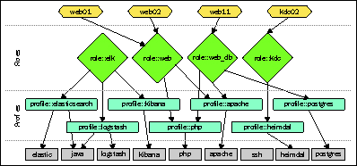

# 第八章：使用 Hiera 实现代码与数据的分离

在前七章的学习中，你已经在多个示例和场景中使用了 Puppet 的基本结构元素。你也对更高级的语言特性有了快速的了解，并应该对 Puppet 4 中的清单编写过程与早期版本之间的区别有了清晰的认识。

尽管清单文件具有强大的表达能力，但它们确实有一些局限性。一个按照目前所学原则设计的清单文件将逻辑与数据混合。逻辑不仅体现在控制结构中（如`if`和`else`），它还出现在类和定义的网络中，这些类和定义相互包含和实例化。

然而，仅仅包含一些通用类是无法配置一台机器的。给定系统的许多属性都是个别的，必须作为参数传递。这对于必须容纳大量节点的清单文件可能会带来维护上的问题。本章将教你如何在这种复杂的代码基础上恢复秩序。在本章中，我们将涵盖以下主题：

+   理解需要独立的数据存储

+   构建层次化数据结构

+   从类中获取数据

+   调试数据查找

+   从数据管理资源

+   模块和环境中的数据

# 理解需要独立的数据存储

回顾你在本书中迄今为止的实现，你已经创建了一些非常通用的代码，能够以自动化的方式完成非常有用的任务。你的节点可以在它们之间分发 `/etc/hosts` 的条目。它们为彼此注册公钥以进行身份验证。一个节点可以自动注册到中央 Cacti 服务器。

多亏了 Facter，Puppet 拥有能够轻松处理这些使用案例的信息。许多配置项对于每个节点都是唯一的，因为它们引用的是已经定义的细节（如 IP 地址或生成的密钥）。有时，所需的配置数据只能在远程机器上找到，而 Puppet 通过导出资源来处理此问题。这种可以依赖事实的清单设计非常经济。信息已经收集完成，一个类很可能能够正确地处理你的多个或所有节点，并且能够优雅地管理一个共同的任务。

然而，一些配置任务必须为每个节点单独执行，这些任务可能包含一些相当任意的设置，并非直接来自节点的现有属性：

+   在一个跨多个服务器的复杂 MySQL 复制设置中，每个参与者都需要一个唯一的服务器 ID。必须在任何情况下避免重复，因此随机生成 ID 号是不安全的

+   你的一些网络可能需要定期从`cron`运行维护任务。Puppet 应该为每台机器定义一个启动时间，以防止两个机器的运行时间重叠

+   在服务器操作中，你必须监控所有系统的磁盘空间使用情况。大多数磁盘应当生成早期警告，以便有时间作出反应。然而，其他磁盘大多数时间应该接近满载，并且应该有一个更高的警告阈值。

当通过 Puppet 管理定制的系统和软件时，它们也可能需要对每个实例进行这种微观管理。这里的示例仅代表 Puppet 必须显式和独立管理的事务中的一小部分。

# 在清单中定义数据的后果

Puppet 清单有多种方法来解决这种微观管理问题。最直接的方法是为每个单独的节点定义一整套类：

```
class site::mysql_server01 { 
  class { 'mysql': server_id => '1', ... } 
} 
class site::mysql_server02 { 
  class { 'mysql': server_id => '2', ... } 
} 
...  
class site::mysql_aux01 { 
  class { 'mysql': server_id => '101', ... } 
} 
# and so forth ... 
```

这是一个需要大量维护的解决方案，原因如下：

+   各个类可能会变得相当复杂，因为每个类中必须使用所有必需的 `mysql` 类参数。

+   参数之间存在大量冗余，实际上它们在所有节点中是相同的。

+   单独不同的值可能很难识别，必须小心保持它们在整个类集合中的唯一性。

+   这只有通过将这些类保持在一起才真正可行，这可能与代码库的其他组织原则相冲突。

简而言之，这是一种暴力解决方案，它带来了自身的成本。一个更经济的方法是将节点之间不同的值（仅限这些！）传递给一个包装类：

```
node 'xndp12-sql09.example.net' { 
  class { 'site::mysql_server': 
    mysql_server_id => '103', 
  } 
} 
```

这个包装类可以以通用方式声明 `mysql` 类，因为每个节点的参数值是独立的：

```
class site::mysql_server( 
  String $mysql_server_id 
) { 
  class { 'mysql':  
    server_id => $mysql_server_id,  
    ... 
  } 
} 
```

这样做要好得多，因为它消除了冗余及其对可维护性的影响。问题在于，`node` 块可能会变得相当杂乱，因为涉及到许多不同子系统的参数赋值。解释性注释进一步增加了每个 `node` 块可能成为的文字墙。

你可以进一步扩展，通过在哈希变量中定义查找表。

在任何 `node` 或 `class` 之外，在全局范围内：

```
$mysql_config_table = { 
  'xndp12-sql01.example.net' => { 
    server_id   => '1', 
    buffer_pool => '12G', 
  }, 
  ... 
} 
```

这减少了在 `node` 块中声明任何变量的需求。类直接从哈希中查找这些值：

```
class site::mysql_server( 
  $config = $mysql_config_table[$::certname] 
) { 
  class { 'mysql': 
    server_id => $config['server_id'],  
    ... 
  } 
} 
```

这相当复杂，实际上接近本章稍后你将学习的更好方法。请注意，这种方法仍然保留了冗余的可能性。某些配置值在属于同一组的所有节点之间可能是相同的，但对于每个组来说是唯一的（例如，各种类型的预共享密钥）。

这要求假设的 `xndp12` 集群中的所有服务器包含一些对于所有成员都是相同的键值对：

```
$crypt_key_xndp12 = 'xneFGl%23ndfAWLN34a0t9w30.zges4'
$config = {
'xndp12-stor01.example.net' => { $crypt_key =>
  $crypt_key_xndp12, … },
'xndp12-stor02.example.net' => { $crypt_key =>
  $crypt_key_xndp12, … },
 'xndp12-sql01.example.net' => { $crypt_key =>
  $crypt_key_xndp12, … },
...
}
```

这并不理想，但我们先停在这里。没有必要再担心更复杂的方式来将配置数据排序到递归的哈希结构中。这样的解决方案会迅速变得难以理解和维护。有效的解决方案是一个外部数据库，保存所有单独的和共享的值。在我详细介绍如何使用 Hiera 来实现这一目的之前，让我们先讨论一下层次数据存储的一般概念。

# 构建层次结构数据结构

在前一节中，我们将数据问题简化为对每个 Puppet 管理节点特定的键值对的需求。Puppet 及其清单作为引擎，根据这些简化的信息生成实际的配置。

解决这个问题的一种简化方法是使用`ini`风格的配置文件，它为每个节点提供一个设置所有可配置键值的部分。共享值将在一个或多个通用部分中声明：

```
[mysql]
buffer_pool=15G
log_file_size=500M
...
[xndp12-sql01.example.net]
psk=xneFGl%23ndfAWLN34a0t9w30.zges4
server_id=1
```

Rails 应用程序通常会做类似的事情，并将它们的配置存储在 YAML 格式中。用户可以定义不同的环境，如`生产`、`预发布`和`测试`。每个环境中定义的值会覆盖全局设置值。

这与 Puppet 通过 Hiera 绑定允许的层次结构配置非常相似。上述 Rails 应用程序和`ini`文件通过配置环境实现的层次结构相当简单，只有一个全局层和一个用于专业配置的覆盖层。而使用 Hiera 和 Puppet 时，一个配置数据库通常会处理整台机器群集和整个机器群集的网络。这就意味着需要一个更复杂的层次结构。

Hiera 允许你定义自己的层次结构层。有一些典型的、经过验证的示例，这些示例可以在许多配置中找到：

+   `公共`层保存所有代理的默认值

+   `位置`层可以根据托管每个节点的数据中心覆盖某些值

+   每台代理机器通常在你的基础设施中扮演一个不同的`角色`，例如`wordpress_appserver`或`puppetdb_server`

+   一些配置是特定于每台`机器`的

例如，考虑一个假设的报告客户端的配置。你的`公共`层将保存许多预设值，如默认的详细程度设置、传输压缩选项以及其他适用于大多数机器的选择。在`位置`层，你确保每台机器都检查到相应的本地服务器，报告时不应使用 WAN 资源。

每个角色的设置可能是最有趣的部分。它们允许针对特定服务器类别的精细设置。也许您的应用服务器应当以非常短的时间间隔监控其内存消耗。对于数据库服务器，您可能希望更密切地观察硬盘操作和性能。对于 Puppet 服务器，可能需要特殊插件来收集特定数据。

`machine` 层在声明规则的任何例外时非常有用。总有一些机器因某种原因需要特殊处理。通过一个顶层层次结构，它为每个代理存储数据，从而使您完全控制代理使用的所有数据。

这些概念仍然相当抽象，因此我们最后来看看 Hiera 的实际应用。

# 配置 Hiera

自 Puppet 3 版本起，已内置支持从 Hiera 中检索数据值。您需要做的就是在配置目录中放置一个 `hiera.yaml` 文件。

当然，配置的位置和名称是可定制的，几乎与配置相关的所有内容都可以定制。请查看 `hiera_config` 设置。

正如文件名扩展名所示，配置采用 YAML 格式，并包含一个哈希值，哈希中的键对应后端、层次结构和特定后端的设置。键使用 Ruby 符号表示，并以冒号开头：

```
# /etc/puppetlabs/puppet/hiera.yaml
:backends:
  - yaml
:hierarchy: 
  - node/%{::clientcert}
  - role/%{::role}
  - location/%{::datacenter}
  - common
:yaml: 
  :datadir: /etc/puppetlabs/code/environments/%{::environment}/hieradata
```

请注意，`:backends` 的值实际上是一个单元素数组。您可以选择多个后端。稍后会解释其意义。`:hierarchy` 的值包含先前描述的实际层次结构的列表。每个条目都是数据源的名称。当 Hiera 检索一个值时，它会依次搜索每个数据源。`%{}` 表达式允许您访问 Puppet 变量的值。这里只能使用事实或全局作用域变量；其他变量将使 Hiera 的行为变得非常混乱。

最后，您需要为每个后端包含配置。上述配置只使用了 YAML 后端，因此只有一个 `:yaml` 的哈希，里面包含一个支持的 `:datadir` 键。这是 Hiera 期望找到包含数据的 YAML 文件的位置。对于每个数据源，`datadir` 可以包含一个 `.yaml` 文件。由于源的名称是动态的，通常会创建四个或五个以上的数据源文件。在我们简短讨论多个后端的组合之前，让我们先创建一些示例。

Hiera 5 在 Puppet 4.9 中发布。Hiera 的新版本使用了另一种配置文件的布局，并提供了更多的灵活性。在解释 Hiera 5 的设置、迁移和额外功能之前，我们将首先介绍 Hiera 3，因为大多数基本概念是相同的。

# 存储 Hiera 数据

你的 Hiera 配置的后端决定了你如何存储配置值。对于 YAML 后端，你需要将 `datadir` 填充为包含每个值哈希的文件。让我们将一些报告引擎配置元素放入示例层次结构中：

```
# /etc/puppetlabs/code/environments/production/hieradata/common.yaml
reporting::server: stats01.example.net
reporting::server_port: 9033
```

`common.yaml` 中的值是适用于所有代理的默认值。它们位于层次结构的广泛基础处。特定于某个 `location` 或 `role` 的值适用于你的代理的小组。例如，`postgres` 角色的数据库服务器应该运行一些特殊的报告插件：

```
# /etc/puppetlabs/code/environments/production/hieradata/role/postgres.yaml 
reporting::plugins: 
  - iops 
  - cpuload 
```

在如此高的层次上，你还可以覆盖低层次的值。例如，特定于角色的数据源，如 `role/postgres.yaml`，也可以为 `reporting::server_port` 设置一个值。层次结构会从最具体到最不具体进行搜索，并使用第一个值。这就是为什么在层次结构的最上层有一个特定于节点的数据源是个好主意。在这一层，你可以为每个代理覆盖任何值。在这个例子中，报告节点可以使用回环接口访问自己：

```
#/etc/puppetlabs/.../hieradata/node/stats01.example.net.yaml 
reporting::server: localhost 
```

每个代理根据构成其特定层次结构的具体 YAML 文件接收一个配置值的拼贴。

如果这一切让你感到有些不知所措，不用担心；本章还有更多的示例。Hiera 也有一个迷人的特点，表面看起来似乎很复杂，但一旦你自己尝试使用，它会感觉非常自然且直观。

# 选择你的后端

有两个内置的后端：YAML 和 JSON。本章将重点介绍 YAML，因为它是一种非常方便且高效的数据表示形式。JSON 后端与 YAML 非常相似。它查找 `.json` 文件中的数据，而不是每个数据源的 `.yaml` 文件；这些文件使用不同的数据表示格式。

使用多个后端通常不是真正必要的。在大多数情况下，精心设计的层次结构足以满足你的需求。使用第二个后端时，数据查找将针对每个后端遍历一次你的层次结构。这意味着主后端的最低层将高于任何附加后端的层次。

在某些情况下，添加另一个后端可能是值得的，这样可以在不同的位置（比如分布式文件系统或具有不同提交权限的源代码控制库）定义更基础的默认值。

此外，请注意，你可以为 Hiera 添加自定义后端，因此这些也可能是二级甚至三级后端的合理选择。Hiera 后端是用 Ruby 编写的，就像 Puppet 插件一样。创建这种后端的详细过程超出了本书的范围。

一个特别受欢迎的后端插件是 `eyaml`，可以通过 `hiera-eyaml` Ruby gem 获得。这个后端允许你在 YAML 数据中加入加密字符串。Puppet 在检索时解密数据。

在 Puppet 5 中，eyaml 插件已经成为 Puppet 构建操作系统包的一部分。

你已经深入学习了在 Hiera 中存储数据的理论，现在终于到了看看如何在 Puppet 中使用它的时机。

# 从类中获取数据

在 Hiera 中查找键值是很简单的。Puppet 提供了一个非常直接的函数来实现这一点：

```
$plugins = hiera('reporting::plugins') 
```

每当编译器在当前代理节点的清单中遇到这样的调用时，它会触发层级结构中的搜索。具体的数据源由你的 `hiera.yaml` 文件中的层级结构决定。它几乎总是依赖于代理提供的事实值来进行灵活的数据源选择。

如果在代理的层级结构中找不到指定的键，主节点会中止目录编译并报告错误。为了防止这种情况，通常建议为查找提供一个默认值：

```
$plugins = hiera('reporting::plugins', []) 
```

在这种情况下，如果层级结构没有提到插件，Puppet 会使用一个空数组。

另一方面，你也可以故意省略默认值。就像 `class` 和 `define` 参数一样，这表示 Hiera 值是必需的。如果用户未提供该值，Puppet 将中止清单编译。

# 使用简单值

你已经看到如何调用 `hiera` 函数来检索值。实际上，除了一个可选参数外，除了你在前一节中看到的内容，没有更多的复杂性。这个可选参数允许你在层级结构的顶部增加一个额外的层次。如果在指定的数据源中找到该键，它将覆盖常规层级的结果：

```
$plugins = hiera('reporting::plugins', [], 'global-overrides') 
```

如果在 `global-overrides` 数据源中找到 `reporting::plugins` 键，则从该位置获取值。否则，会搜索常规层级结构。

通常，将检索到的值分配给清单变量是非常常见的。然而，你也可以在其他有用的上下文中调用 `hiera` 函数，如下所示：

```
@@cacti_device { $::fqdn: 
  ip => hiera('snmp_address', $::ipaddress), 
} 
```

查找结果可以直接作为参数值传递给资源。这是一个示例，展示了如何允许 Hiera 为每台机器定义一个特定的 IP 地址，用于某个特定服务。它作为一种简单的方式来手动覆盖 Facter 的假设。

通常，将 Hiera 查找结果先存储在一个变量中更为安全。这可以让你检查它们的数据类型。在 Puppet 3 中，你需要使用来自 `stdlib` 模块的 `assert` 函数。Puppet 4 有一个为此目的设计的操作符：

```
$max_threads = hiera('max_threads') 
if $max_threads !~ Integer { 
    fail "The max_threads value must be an integer number" 
}
```

另一个常见的情况是通过 Hiera 查找使参数默认值变得动态：

```
define logrotate::config( 
  Integer $rotations = hiera('logrotate::rotations', 7) 
) { 
  # regular define code here 
} 
```

对于声明了显式参数值的 `logrotate::config` 资源，Hiera 值会被忽略：

```
logrotate::config { '/var/log/cacti.log': rotations => 12 } 
```

这可能有点让人困惑。不过，这种模式带来了一些便利。大多数代理可以依赖于默认设置。层级结构允许你在多个粒度级别上调优这个默认值。

# 自动绑定类参数值

从目前为止的介绍来看，参数化类的概念可能已经有些不太好的声誉。它被认为使得在清单中包含来自多个地方的类变得困难，或者在变化的情况下默默地允许这种做法。虽然这是`正确的`，但你可以通过依赖 Hiera 来满足你的类参数化需求，从而避免这些问题。

从 Puppet 3.2 版本开始，用户可以选择任何值

类的参数可以直接在 Hiera 数据中定义。每当你包含一个有参数的类时，Puppet 会查询 Hiera 为每个参数找到一个值。键必须以类名和参数名命名，并用双冒号连接。记住我们在第五章中提到的 `cacti` 类，*将类、配置文件和扩展结合成模块*。它有一个 `$redirect` 参数。要在 Hiera 中定义其值，请添加 `cacti::redirect` 键：

```
# node/cacti01.example.net.yaml 
cacti::redirect: false 
```

有些类有非常复杂的接口，例如 Puppet Labs 的 Apache 模块中的 `apache` 类，在写本文时，它接受 70 个参数。如果你需要其中很多参数，可以将它们作为一个统一的键值块放入目标机器的专用 YAML 文件中。这会很容易阅读，因为 `apache::` 前缀对齐了。

相比于直接在清单中指定参数，你并不会节省任何行数，但至少在编写清单时，选项墙不会妨碍你，你将数据与代码分离。

或许类参数化最值得称赞的一点是，在你的层级结构中，每个键都是独立的。许多参数很可能可以为你的大部分或所有机器定义。应用服务器的集群可以共享一些设置（如果你的层级结构中包含了它们被分组在一起的层级），你也可以根据需要覆盖单台机器的参数：

```
# common.yaml 
apache::default_ssl_cert: /etc/puppetlabs/puppet/ssl/certs/%{::clientcert}.pem 
apache::default_ssl_key: /etc/puppetlabs/puppet/ssl/private_keys/%{::clientcert}.pem 
apache::purge_configs: false 
```

上述示例为你的网站准备了使用 Puppet 证书来支持 HTTPS。这对于内部服务是一个不错的选择，因为可以轻松建立对 Puppet CA 的信任，而且证书在所有代理机器上都可用。第三个参数`purge_configs`可以防止该模块摧毁任何不在 Puppet 管理下的现有 Apache 配置。

让我们来看一个更具体的层级示例，它会覆盖这个设置：

```
# role/httpsec.yaml 
apache::purge_configs: true 
apache::server_tokens: Minimal 
apache::server_signature: off 
apache::trace_enable: off 
```

在拥有 `httpsec` 角色的机器上，应该清除 Apache 配置，以确保它完全匹配受管理的配置。这些机器的层级结构还定义了一些在 `common` 层级中未定义的附加值。`common` 中的 SSL 设置保持不变。

如果需要，特定机器的 YAML 文件可以覆盖任意层级的键：

```
# node/sec02-sxf12.yaml 
apache::default_ssl_cert: /opt/ssl/custom.pem 
apache::default_ssl_key: /opt/ssl/custom.key 
apache::trace_enable: extended 
```

所有这些设置不需要额外的工作。只要包含了 `puppetlabs-apache` 模块中的 `apache` 类，它们就会自动生效。

对于某些用户而言，这可能是他们的主服务器上唯一使用 Hiera 的方式，这是完全有效的。你甚至可以专门设计清单，将所有可配置项作为类参数暴露出来。然而，记住 Hiera 的另一个优势是，可以从清单中的许多不同位置检索任何值。

例如，如果你的防火墙服务器可以通过专用的 NAT 端口访问，你将希望将这些端口添加到每台机器的 Hiera 数据中。清单不仅可以将该值导出到防火墙服务器本身，还可以导出到外部服务器，以便它们在脚本和配置中使用该值来访问导出机器：

```
$nat_port = hiera('site::net::nat_port') 
@@firewall { "650 forward port ${nat_port} to ${::fqdn}": 
  proto       => 'tcp', 
  dport       => $nat_port,  
  destination => hiera('site::net::nat_ip'), 
  jump        => 'DNAT', 
  todest      => $::ipaddress, 
  tag         => hiera('site::net::firewall_segment'), 
}
```

这些值很可能会在不同的层次结构中定义。`nat_port` 是特定于代理的，只能在 `%{::fqdn}`（或为了更好的安全性，可以使用 `%{::clientcert}`）派生的数据源中定义。`nat_ip` 可能对同一集群中的所有服务器都是相同的。它们可能共享相同的服务器角色。`firewall_segment` 可能对所有共享相同位置的服务器都是相同的：

```
# stor03.example.net.yaml 
site::net::nat_port: 12020 
... 
# role/storage.yaml 
site::net::nat_ip: 198.58.119.126 
... 
# location/portland.yaml 
site::net::firewall_segment: segment04 
... 
```

如前所述，部分数据在其他上下文中也会有所帮助。假设你通过定义的类型部署了一个脚本。该脚本会向远程机器发送消息。目标地址和端口作为参数传递给定义的类型。每个需要作为目标的节点可以导出该脚本资源：

```
@@site::maintenance_script {"/usr/local/bin/maint-${::fqdn}": 
  address => hiera('site::net::nat_ip'), 
  port    => hiera('site::net::nat_port'), 
}
```

将所有这些功能放在一个接收端口和地址作为参数的类中是不切实际的。你可能希望从不同的类甚至模块中检索相同的值，每个类或模块负责各自的导出。

# 处理哈希和数组

本章中的一些示例在 Hiera 中定义了数组值。好消息是，从 Hiera 中检索数组和哈希值与检索简单的字符串、数字或布尔值没有任何不同。`hiera` 函数会返回所有这些值，这些值已准备好在清单中使用。

还有两个函数提供了对这些值的特殊处理：`hiera_array` 和 `hiera_hash` 函数。

这些函数的存在可能会让人感到困惑。新用户可能会误以为在从层次结构中检索哈希或数组时，必须使用这些函数。在继承 Puppet 代码时，检查这些派生函数是否在特定上下文中正确使用是个好主意。

当调用 `hiera_array` 函数时，它会从整个层次结构中收集所有命名的值，并将它们合并成一个长数组，包含所有找到的元素。再以分布式防火墙配置为例。每个节点应该能够导出一个开放端口以供公共访问的规则列表。该清单完全由 Hiera 驱动：

```
if hiera('site::net::nat_ip', false) { 
  @@firewall { "200 NAT ports for ${::fqdn}": 
    port        => hiera_array('site::net::nat_ports'), 
    proto       => 'tcp', 
    destination => hiera('site::net::nat_ip'), 
    jump        => 'DNAT', 
    todest      => $::ipaddress, 
  } 
} 
```

请注意，标题`200 NAT 端口`并不是指端口的数量，而只是遵循了`firewall`资源的命名约定。数字前缀使得维护顺序变得更容易。此外，请注意`if`子句中`site::net::nat_ip`键的默认值`false`看似不合逻辑。虽然该资源只有在为相应节点定义了`public_ip`时才会导出，但这形成了一个有用的模式。

如果`false`或空字符串是该键可能的值，则必须小心。在这种情况下，`if`子句将忽略该值。在这种情况下，您应该使用明确的比较：

```
if hiera('feature_flag_A', undef) != undef { ... }
```

层次结构可以在多个层次上持有端口：

```
# common.yaml 
nat_ports: 22 
```

SSH 端口应该对所有获得公共地址的节点可用。请注意，这个值本身不是一个数组。没关系，Hiera 会将标量值包含在结果列表中而不发出任何警告：

```
# role-webserver.yaml 
nat_ports: [ 80, 443 ] 
```

独立的 Web 应用服务器会暴露它们的 HTTP 和 HTTPS 端口

公共：

```
# tbt-backend-test.example.net.yaml 
nat_ports:  
  - 5973 
  - 5974 
  - 5975 
  - 6630 
```

新的云服务的测试实例应该暴露一系列自定义服务的端口。如果它具有`webserver`角色（以某种方式），它将导致端口`22`、`80`和`443`的导出，以及它单独选择的端口列表。

在设计这种结构时，请记住，数组合并永远只是累积性的。无法从最终结果中排除在较低层次添加的值。在这个例子中，你将无法为任何给定的机器禁用 SSH 端口`22`。添加常见值时需要特别小心。

哈希值也有类似的查找函数。`hiera_hash`函数也会遍历整个层次结构，并通过合并它在所有层次上找到的所有哈希来构建一个哈希。较高层次的哈希键会覆盖较低层次的哈希键。在这种情况下，所有值必须是哈希。字符串、数组或其他数据类型在此情况下不允许：

```
# common.yaml 
haproxy_settings: 
  log_socket: /dev/log 
  log_level: info 
  user: haproxy 
  group: haproxy 
  daemon: true 
```

这些是`haproxy`在最低层次上的默认设置。在 Web 服务器上，守护进程应该作为通用的 Web 服务用户运行：

```
# role/webserver.yaml 
haproxy_settings: 
  user: www-data 
  group: www-data 
```

使用`hiera('haproxy_settings')`时，这将只评估为哈希值`{'user'=>'www-data','group'=>'www-data'}`。角色特定层次上的哈希完全覆盖了默认设置。

要获取所有值，请改用`hiera_hash('haproxy_settings')`创建一个合并器。结果可能更有用：

```
{ 'log_socket' =>'/dev/log', 'log_level' => 'info', 
'user' => 'www-data', 'group' => 'www-data', 'daemon' => true } 
```

限制与`hiera_array`类似。任何层次结构级别的键都无法删除；只能用不同的值覆盖它们。最终结果与将哈希替换为一组键非常相似：

```
# role/webserver.yaml 
haproxy::user: www-data 
haproxy::group: www-data 
```

如果你选择这样做，数据也可以很容易地适配到一个类中，该类可以自动将这些值绑定到参数上。因此，优先使用平面结构可能是有益的。正如下一节所解释的那样，在 Hiera 中定义哈希仍然是值得的。[`docs.puppetlabs.com/references/latest/function.html#createresources`](https://docs.puppetlabs.com/references/latest/function.html#createresources) 最初是为此设计的。Hiera 可以作为一个基础的 ENC。

# 在清单和 Hiera 设计之间进行选择

现在你可以将大多数具体配置转移到数据存储中。

类可以从清单中或通过 Hiera 包含。Puppet 在层级中查找参数值，你可以灵活地将配置值分配到那里，以便为每个节点实现所需的结果，最大限度地减少工作量和冗余。

这并不意味着你不再编写实际的清单代码。清单仍然是你设计的核心支柱。你将经常需要使用配置数据作为输入的逻辑。例如，可能会有一些类，只有从 Hiera 中检索到某个特定值时才应该包含：

```
if hiera('use_caching_proxy', false) { 
    include nginx 
} 
```

如果你仅仅依赖 Hiera，你将需要在所有设置 `use_caching_proxy` 标志为 `true` 的层级中，将 `nginx` 添加到 `classes` 数组。这很容易出错。更糟糕的是，这个标志可以在更具体的层级上被覆盖为 `false`，但是 `nginx` 元素不能从通过 `hiera_include` 检索的数组中移除。

重要的是要记住，清单和数据应当相辅相成。你应该主要构建清单，并在合适的位置添加查找函数调用。在 Hiera 中定义标志和值应当允许你（或模块的用户）更改清单的行为。数据不应当是目录编排的驱动因素，除非是在你用大量数据结构替换大量静态资源的地方。

# 调试数据查找

如你从前面的例子中看到的那样，贡献到任何模块的完整配置的数据可能会分散在你的数据源集合中。这使得确定每个代理节点从哪个位置检索相应的值变得具有挑战性。追踪数据源找出某些层级的更改为什么不会对某些代理生效，可能会让人感到沮丧。

为了帮助使这一过程更加透明，Hiera 附带了一个名为 `hiera` 的命令行工具。调用它很简单：

```
root@puppetmaster # hiera -c /etc/puppetlabs/code/hiera.yaml demo::atoms  
```

它使用 `hiera.yaml` 中指定的配置检索给定的键。确保你使用与 Puppet 相同的 Hiera 配置。

当然，只有当 Hiera 选择与编译器相同的数据源时，这才是合理的，编译器使用事实值来形成具体的层级。这些必需的事实可以作为最终参数直接在命令行上提供：

```
root@puppetmaster # hiera -c /etc/puppetlabs/code/hiera.yaml demo::atoms 
::clientcert=int01-web01.example.net ::role=webserver ::location=ny  
```

这会将指定服务器的 `demo::atoms` 值打印到控制台。事实值也可以从 YAML 文件或其他替代来源中获取。使用 `hiera --help` 以获取可用场景的信息。

确保添加 `-d`（或 `--debug`）标志，以便获取有关遍历层级结构的有用信息：

```
root@puppetmaster # hiera -d -c ...
```

Hiera 5 提供了另一种调试数据查找的方法。我们将在本章稍后介绍 Hiera 5。

# 从数据管理资源

现在，你可以将配置设置移到 Hiera 并将你的清单专注于逻辑部分。就类及其参数而言，这一过程非常顺畅，因为类参数会自动从 Hiera 获取其值。对于需要实例化资源的配置，你仍然需要编写完整的清单并添加手动查找函数调用。

例如，Apache 网络服务器需要一些全局设置，但其配置的有趣部分通常在虚拟主机配置文件中完成。Puppet 通过定义的资源类型来建模它们。如果你想配置 `iptables` 防火墙，你必须声明大量的 `firewall` 类型资源（通过 `puppetlabs-firewall` 模块提供）。

这类复杂的资源可能会使你的清单变得杂乱无章，但它们大多只是数据而已。许多防火墙规则没有内在的逻辑（尽管有时一组规则是从一个或多个关键值推导出来的）。虚拟主机通常也代表自己，与其他部分的配置细节关系较少或没有关系。

Puppet 还提供了另一个函数，允许你将整组此类资源移到 Hiera 数据中。模式很简单：同类型的资源通过哈希表示。键是资源标题，值是另一个包含属性键值对的哈希层：

```
services: 
  apache2: 
    enable: true 
    ensure: running 
  syslog-ng: 
    enable: false 
```

这些 YAML 数据表示两个 `service` 资源。要使 Puppet 将它们作为实际资源添加到目录中，请使用 Puppet 4 中的迭代器函数：

```
$resource_hash.each |$res_title,$attributes| { 
  service { $res_title: 
    ensure => $attributes['ensure'], 
    enable => $attributes['enable'], 
  } 
} 
```

在旧版 Puppet 代码中，你很可能会找到使用 `create_resources` 函数的情况：

```
$resource_hash = hiera('services', {}) 
create_resources('service', $resource_hash) 
```

第一个参数是资源类型的名称，第二个参数必须是实际资源的哈希。这个技术还有一些其他方面，但请注意，使用 Puppet 4 后，不再需要依赖 `create_resources` 函数。

无论如何，了解它的基本原理还是很有用的。它仍然在现有的清单中广泛使用，并且是将数据转换为资源的最简洁方式。欲了解更多信息，请参考在线文档 [`docs.puppetlabs.com/references/latest/function.html#createresources`](https://docs.puppetlabs.com/references/latest/function.html#createresources)。

Puppet 4 的迭代器相比 `create_resources` 方法有一些优势：

+   您可以执行数据转换，例如为字符串值添加前缀，或推导额外的属性值。

+   每次迭代不仅仅是创建一个资源，例如，还可以包括所需的类。

+   您可以设计一个偏离 `create_resources` 严格预期的数据结构。

+   清单更加清晰和直观，特别是对于没有经验的读者。

对于创建许多简单资源（例如前面示例中的服务），您可能希望避免在 Puppet 4 清单中使用 `create_resource`。请记住，如果不利用这一点，您仍然可以通过坚持使用 `create_resources` 来保持清单简洁。

Puppet 4 提供了一个有用的工具来生成适用于 `create_resources` 的 YAML 数据。使用以下命令，您可以让 Puppet 输出代表本地系统中可用服务及其当前属性值的服务类型资源：

```
puppet resource -y service 
```

`-y` 选项选择 YAML 输出，而不是 Puppet DSL。

从理论上讲，这些技术允许您将几乎所有代码移动到 Hiera 数据中（下一节将讨论这到底有多可取）。还有一个功能进一步推动了这一方向：

```
hiera_include('classes') 
```

这个调用从整个层级结构中收集值；就像`hiera_array`一样。结果数组被解释为类名的列表。所有这些命名的类都会被包含。这允许您在清单中进行一些额外的合并：

```
# common.yaml 
classes: 
  - ssh 
  - syslog 
... 
# role-webserver.yaml 
classes: 
  - apache 
  - logrotate 
  - syslog 
```

您甚至可以使用 `hiera_include` 在任何 `node` 块之外声明这些类。数据将影响所有节点。此外，您还可以通过 `hiera_include` 声明一些不同的类，其名称存储在不同的 Hiera 键下。

为每个节点列举要包含的类，正是 Puppet 的**外部节点分类器**（**ENCs**）最初的设计目的。得益于`hiera_include`函数，Hiera 可以作为一个基本的 ENC。与编写自定义 ENC 相比，这种方法通常更受欢迎。然而，需要注意的是，一些开源 ENC，如 Foreman，功能强大，并能带来更多的便利；因此，Hiera 并没有完全取代这一概念。

这些工具的组合为您提供了一些方法，可以将清单缩小到其核心部分，并通过 Hiera 优雅地配置您的机器。

# Hiera 版本 5

Hiera 5 是与 Puppet 4.9 一同发布的。早期的 Puppet 4 版本捆绑了 Hiera 4。旧版 Hiera 与 Hiera 5 之间的主要区别是多层次 Hiera 层级结构的概念：

+   第一层是模块层。Hiera 5 允许您通过在模块根目录中指定一个 Hiera 5 配置版本的 `hiera.yaml` 文件，在模块中使用 Hiera 数据。

+   第二层是环境层，您可以将 `hiera.yaml` 文件放置在环境根目录中。

最后一层是主层，其中 `hiera.yaml` 位于 `/etc/puppetlabs/puppet/hiera.yaml`。这是旧版 Hiera 中唯一的层。

主层不再被认为是最佳实践，存在的原因是为了兼容性。大家都被鼓励将数据从主层迁移到环境层。

在 Hiera 5 中，配置文件的内容完全不同。它仍然是 YAML 风格的文件，但后端不再全局配置，而是放入层级结构中。这允许你为不同的 Hiera 层级指定不同的后端。

让我们将 `hiera.yaml` 文件从 Hiera 3 转换为 Hiera 5：

```
# /etc/puppetlabs/puppet/hiera.yaml 
:backends: 
  - yaml 
:hierarchy:  
  - node/%{::clientcert} 
  - role/%{::role} 
  - location/%{::datacenter} 
  - common 
:yaml:  
  :datadir: /etc/puppetlabs/code/environments/%{::environment
     }/hieradata 
```

将此文件转换为 Hiera 5 `.yaml` 文件：

```
# /etc/puppetlabs/code/environments/production/hiera.yaml 
--- 
version: 5 
# specify the default datadir and yaml backend 
defaults: 
  datadir: hieradata 
  data_hash: yaml_data 
# build hierarchy. Note that paths need the file ending! 
hierarchy: 
  - name: "Per-node data" 
    path: "node/%{::clientcert}.yaml" 
  - name: "Per-role data" 
    path: "role/%{::role}.yaml" 
  - name: "Per-location data" 
    path: "location/%{::datacenter}.yaml" 
  - name: "Common data" 
    path: 'common.yaml' 

```

除此之外，还可以通过向 Hiera 数据中添加 `lookup_options` 键来配置 Hiera 查找行为。在每次数据查找时，Hiera 5 会首先检查 `lookup_options` 键，并使用此信息来查找所需的数据。但是，Hiera 应该如何知道使用哪一层呢？

在 Hiera 3 中，我们使用 `hiera`、`hiera_array` 或 `hiera_hash` 函数来检索数据。而在 Hiera 5 中，这些函数被单一的 lookup 函数替代。

+   `hiera`（键）转换为 lookup（键）

+   `hiera_array`（键）转换为 lookup（键，数组，唯一）

+   `hiera_hash`（键）转换为 lookup（键，哈希，哈希）

从类中自动查找数据无需进一步的更改。Hiera 5 的另一个变化是我们调试 Hiera 数据查找的方式。Puppet 现在具有 Puppet lookup 接口。记住 Hiera 的命令行工具：

```
root@puppetmaster # hiera -c /etc/puppetlabs/code/hiera.yaml demo::atoms 
::clientcert=int01-web01.example.net ::role=webserver ::location=ny  
```

现在我们可以使用 Puppet lookup 命令行工具：

```
root@puppetmaster
**# puppet lookup demo::atoms -node int01-web01.example.net**  
```

主要区别在于 Puppet lookup 使用存储在 Puppet 主机上的事实，而不是在命令行中添加每个使用的事实。除此之外，还有一个额外的选项 `--explain`，它取代了 Hiera 命令行工具中的调试选项。

使用 Puppet lookup 时，带 `--explain` 选项，输出还会显示合并行为的查找。

描述所有新特性，尤其是路径和通配符的可能性，以及如何在 Hiera 内部配置 Hiera 查找行为，超出了本书的范围：



[`www.craigdunn.org/2012/05/239/`](http://www.craigdunn.org/2012/05/239/)，该设计后来被许多用户采用。

# 总结

Hiera 是一个以层次结构方式存储和检索数据的工具。每次检索都会使用来自每个层级的不同数据源，并从最具体的层级遍历到最不具体的层级。层级由用户在 YAML 文件中作为数组定义。

Puppet 内置了 Hiera 支持，你可以用它来将数据与代码分离。在清单中，你主要通过 `hiera` 函数执行查找。在大多数情况下，相应的条目将依赖于事实值。

通过 Puppet 使用 Hiera 的另一种常见方式是以`<class-name>::<parameter-name>`格式命名 Hiera 键。当包含一个带参数的类时，Puppet 会在 Hiera 中查找这些键。如果清单未提供参数值，Puppet 会自动将 Hiera 中的值绑定到相应的参数。

拥有大量静态资源的清单可以通过将声明转换为哈希，并使用`create_resources`或`each`函数从数据中声明资源来进行清理。

Hiera 5 提供了一整套新的功能，包括模块中的数据和环境中的数据。本章向你提供了如何将数据迁移到 Hiera 5 的指导。

在第九章，《Puppet 角色和配置文件》中，我们将讨论模块和节点分类如何协同工作，以及如何自动构建和部署 Puppet 代码环境。
