# 第一章：设置 Salesforce CRM 和公司资料

应用程序安全性始终很重要，尤其是当应用程序通过公共网络（如互联网）提供时。[Salesforce.com](http://Salesforce.com)开发了各种机制来保护平台安全，并减少未经授权的人访问公司数据的机会。本章描述了如何控制系统的登录尝试，以及帮助你管理用户访问 Salesforce CRM 应用程序的功能。

本章还将介绍如何在 Salesforce 中建立公司资料，以及如何管理你的公司在首次注册[Salesforce.com](http://Salesforce.com)时提供的核心信息。你还将学习如何浏览 Salesforce 设置菜单，并将介绍用于组织范围内自定义应用程序用户界面的设置以及 Salesforce CRM 应用程序提供的搜索功能。

最后，你将看到一系列问题，涉及 Salesforce CRM 管理中与组织设置和全局用户界面相关的关键功能，这些内容将在本章中进行讲解。

本章中提供了笔记和提示，以便在给定的功能领域内提供进一步的指导；这些内容来自于 Salesforce CRM 系统管理的实际结果和经验。

在本章中，我们将介绍：

+   Salesforce 设置菜单

+   用户登录与授权

+   公司资料

+   用户界面

+   搜索概述与设置

+   测试你的知识的相关问题

首先，我们将看看 Salesforce 设置菜单的位置和功能。

# Salesforce 设置菜单

根据你组织的用户界面设置，你将通过你的名字下拉菜单或作为顶级设置链接访问**设置**菜单，如下方截图所示。

查看 Salesforce 页面顶部时，你应该看到**设置**链接，如下方截图所示：

如果在 Salesforce 页面顶部没有看到**设置**链接，请点击你的名字，然后你将看到设置选项，如下方截图所示：

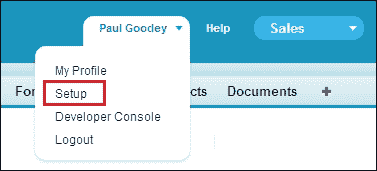

这个设置由**启用改进的设置用户界面**设置控制，后面章节中会详细说明。

### 注意

作为系统管理员，你将如此频繁地使用**设置**菜单，建议启用**改进的设置用户界面**。默认情况下，所有新实例都会激活**改进的设置用户界面**设置。现有的 Salesforce 实例管理员应注意，这一用户界面设置决定了你组织中的每个人如何访问**设置**菜单。

在本书中描述任何设置步骤时，我们将从**设置**开始导航路径。例如，要启用**改进的设置用户界面**，我们将以**设置** | **自定义** | **用户界面** | **启用改进的设置用户界面**的路径呈现。

**设置**菜单出现在页面的左侧。点击菜单项文本（或菜单项左侧的下拉图标）会展开菜单，在其中可以选择所需的菜单项链接；以下截图显示了**设置** | **管理用户** | **用户**设置页面：

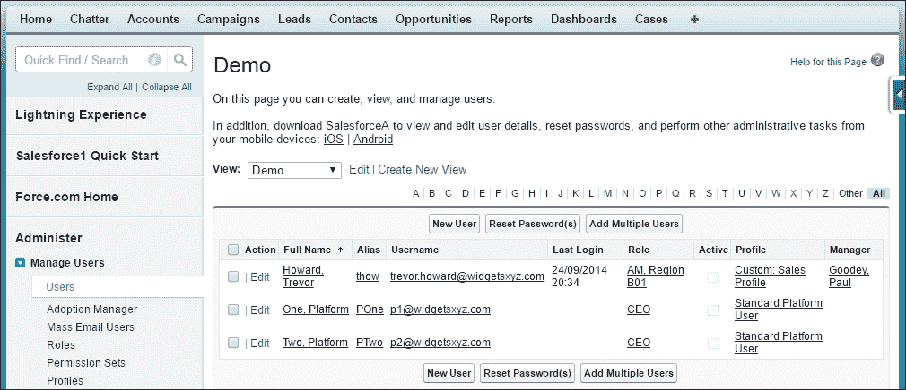

点击展开菜单选项左侧的下拉箭头图标会收起菜单选项。你也可以通过点击**展开全部**或**收起全部**链接来展开或收起所有菜单选项，如下图所示：

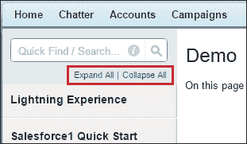

要快速找到某个**设置**菜单项，在**快速查找**搜索框中输入设置名称的前几个字符。当你输入时，任何与搜索词匹配的选项会出现在设置菜单中。例如，要查找“用户界面”页面，开始输入`user interface`，如以下截图所示：

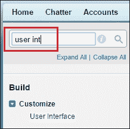

现在我们来看看 Salesforce CRM 应用程序如何验证和授权用户的登录请求。

# 用户登录与授权

组织有几种访问 Salesforce CRM 应用程序的方法。可以通过用户界面（使用网页浏览器）、API（例如，使用集成的客户端应用程序或 Apex 数据加载器）、桌面客户端（例如 Salesforce for Outlook）或移动客户端应用程序进行访问。

每当使用这些方法之一尝试登录 Salesforce 时，系统会按照以下顺序进行检查，以授权用户的登录请求：

+   用户的个人资料是否有任何登录限制？

+   用户的 IP 地址是否出现在组织的受信任 IP 地址列表中？

+   用户是否曾经从此 IP 地址激活过？

+   用户的网页浏览器是否存储了来自 Salesforce 的有效浏览器 cookie？

如果用户的登录既不是来自受信任的 IP 地址，也不是来自具有有效 Salesforce cookie 的浏览器，则登录将被拒绝。要访问 Salesforce，必须通过成功完成计算机激活过程来确认用户身份。

现在让我们更详细地看看这些登录检查。

## 用户的个人资料是否有任何登录限制？

可以为用户的个人资料设置登录时间和 IP 地址限制。如果设置了这些限制，并且有用户在指定时间之外或从未知 IP 地址尝试登录，则访问会被拒绝。

### 登录时间限制

如果用户个人资料设置了登录时间限制，那么在指定时间之外的任何登录尝试都会被拒绝。

1.  若要访问**个人资料**菜单，请导航到**设置** | **管理用户** | **个人资料**。现在选择一个个人资料，点击**登录时间**链接，然后点击**编辑**。

    设置用户可以登录 Salesforce.com 的日期和时间。

    ### 注意

    设置的登录时间是基于组织的默认时区，后面章节中将详细介绍。

1.  导航到**设置** | **公司资料** | **公司信息**，点击**编辑**按钮，从**默认时区**下拉菜单中选择所需的时区。

    设置的登录时间严格应用于该精确时间，即使用户有不同的个人时区，或者组织的默认时区发生变化。

1.  若要允许用户随时登录，请点击**清除时间**，如以下截图所示：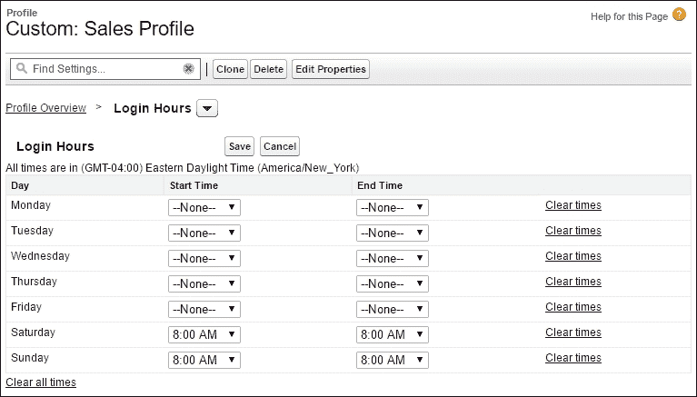

    ### 注意

    若要防止用户在特定日期访问系统（例如进行内部系统维护），请将开始时间和结束时间设置为相同的值。例如，您可以将开始时间设置为上午 8:00，将结束时间设置为上午 8:00（如上一个截图中的星期六和星期日示例设置）。

### IP 地址限制

如果为用户的个人资料定义了 IP 地址限制，则任何来自未知 IP 地址的登录尝试都会被拒绝。

要通过**个人资料**菜单限制有效的 IP 地址范围，请导航到**设置** | **管理用户** | **个人资料**。现在选择一个个人资料，点击**登录 IP 范围**链接，然后点击**添加 IP 范围**。

在**起始 IP 地址**字段中输入有效的 IP 地址，在**结束 IP 地址**字段中输入较高的 IP 地址。

起始和结束地址指定用户可以登录的 IP 地址范围。若要允许来自单个 IP 地址的登录，请在两个字段中输入相同的地址。

例如，为了只允许来自 `88.110.54.113` 的登录，输入 `88.110.54.113` 作为起始和结束 IP 地址，如下图所示：

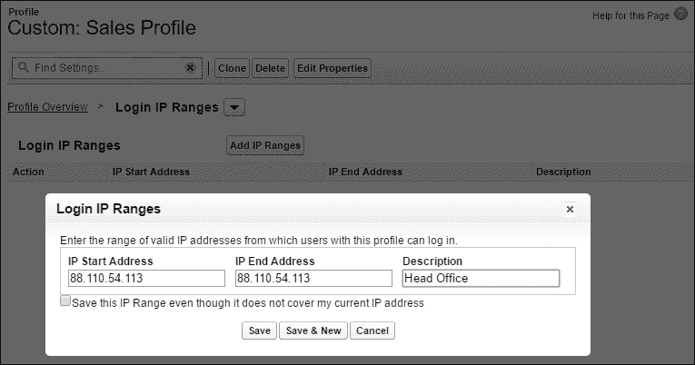

## 用户的 IP 地址是否出现在您组织的受信任 IP 地址列表中？

如果未设置基于个人资料的 IP 地址限制，将执行此检查。

如果用户的登录来自组织的受信任 IP 地址列表中的 IP 地址，则允许登录。

### 受信任的 IP 范围

若要访问受信任的 IP 范围设置，请导航到**设置** | **安全控制** | **网络访问**。

点击**新建**，在**起始 IP 地址**字段中输入有效的 IP 地址，在**结束 IP 地址**字段中输入较高的 IP 地址。

起始和结束地址指定用户可以登录的 IP 地址范围。若要允许来自单个 IP 地址的登录，请在两个字段中输入相同的地址。

例如，为了只允许来自 `88.110.54.100` 的登录，输入 `88.110.54.105` 作为起始和结束地址，如下图所示：

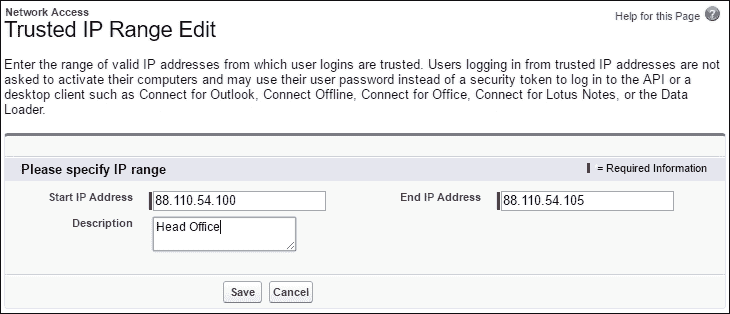

## 用户之前是否从该 IP 地址进行了激活？

每个用户都有一个激活过的 IP 地址列表。如果用户之前从该 IP 地址进行了激活，那么该 IP 地址将添加到用户的个人列表中。

要查看和移除已记录的用户登录 IP 地址，请转到**设置** | **安全控制** | **激活**。

要移除**已激活的登录 IP**，请选中该复选框，然后点击**移除**按钮，如下图所示：

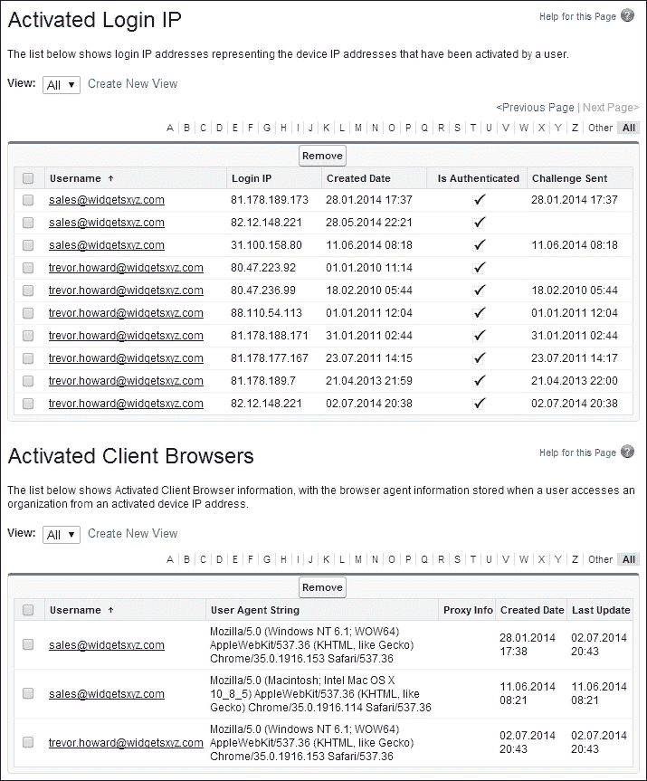

要移除已激活的登录 IP，选中复选框后点击移除按钮，如上图所示。

## 用户的网页浏览器是否存储了来自 Salesforce 的有效 cookie？

cookie 是一个包含字符字符串的小文件，当你访问网站时，该文件会发送到你的计算机。每次你再次访问该网站时，cookie 允许该网站识别你的网页浏览器。

如果用户之前使用该浏览器登录 Salesforce，并且没有清除浏览器 cookie，那么该浏览器会有 Salesforce cookie。

因此，如果用户的登录来自一个包含[Salesforce.com](http://Salesforce.com) cookie 的浏览器，则允许登录

## 计算机激活过程

如果用户的登录既不是来自受信任的 IP 地址，也不是来自带有 Salesforce cookie 的浏览器，则登录会被拒绝并被阻止，Salesforce 必须验证用户的身份。

一个受信任的真实用户可以通过以下方式访问 Salesforce CRM 应用程序：

+   用户界面（使用网页浏览器）

+   API（例如，使用集成客户端应用程序或 Apex 数据加载器）

+   桌面客户端（例如，Salesforce for Outlook）

### 用户界面

对于第一次通过用户界面访问的用户，系统会提示用户选择接收验证码的方式。根据公司是否启用了基于短信的身份确认，验证码可以通过短信或电子邮件接收。

### 注意

对于新组织，短信是计算机激活过程的默认方法，且只能通过请求 Salesforce 支持团队来禁用。对于现有组织，作为系统管理员，你可以启用短信激活功能，但启用后需要请求 Salesforce 支持团队来停用它。

#### 短信验证码

接收短信验证码需要启用**基于短信的身份确认**设置（自 2014 年春季起，该功能默认启用）。此功能使用户能够通过短信接收一次性 PIN。可以通过导航至**设置** | **安全控制** | **会话设置**，然后启用**启用基于短信的身份确认**来进行设置。

一旦启用，用户必须在使用此功能之前验证其手机号码，系统将显示以下截图：

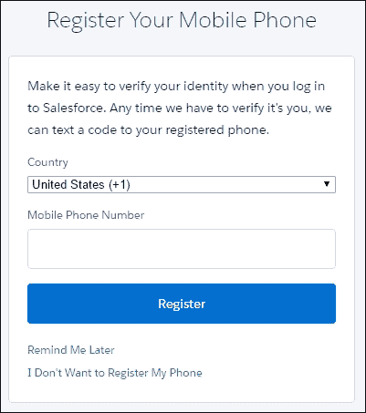

#### 电子邮件验证代码

要接收电子邮件验证代码，用户必须在其个人资料中启用**基于电子邮件的身份确认选项**，或将其包括为权限集的一部分。

### 注意

**基于电子邮件的身份确认**选项仅在启用了**基于短信的身份确认**选项时才可设置。

一旦启用，并且需要验证，用户将自动收到发送到其 Salesforce 用户记录中指定地址的激活邮件。用户会在 Salesforce 中收到通知，并可以输入如下截图所示的验证码：

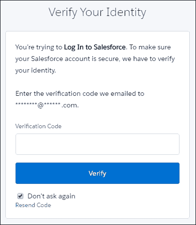

Salesforce 将验证代码邮件发送到与用户在 Salesforce 中的记录关联的电子邮件地址。以下截图展示了一个邮件示例：

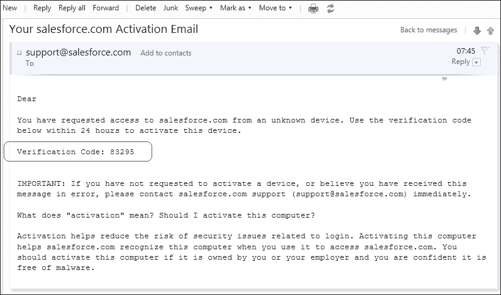

该邮件指示用户将验证码输入浏览器窗口，以激活设备以便进行 Salesforce CRM 平台的验证登录。

电子邮件中的激活代码自**“给我发送验证代码”**按钮点击之时起，最多有效 24 小时。24 小时后，激活链接将过期，用户必须重新执行激活过程。

如果您的公司有远程用户通过非公司网络连接 Salesforce，例如从家里或公共互联网连接，可能会发生混淆。远程用户通常会有动态分配的 IP 地址作为计算机身份。因此，每次他们尝试登录时，Salesforce 会将其识别为未知 IP 地址，提示进行验证，远程用户将必须重新验证设备。

远程用户随后需要访问与其 Salesforce 用户记录关联的电子邮件，以检索激活邮件，而此时可能会发生混淆。如果远程用户需要使用**虚拟私人网络**（**VPN**）连接访问公司网络电子邮件，点击激活链接可能无法正常工作，因为正在验证的 IP 地址可能不再是浏览器所使用的同一 IP 地址。这是因为 VPN 连接很可能正在使用 Web 代理。

### 注意

建议您建立一个策略，确保用户在连接 VPN 时进行登录验证，或者能够访问非 VPN 的 Web 邮件（如果公司允许），以确保验证的 IP 地址相同。

（在第二章的*会话设置*部分中对此有更详细的说明，*管理用户和控制系统访问*。）

### API 或桌面客户端

若使用 API 或桌面客户端（例如，使用 Apex 数据加载器）进行访问，用户必须将安全令牌添加到密码的末尾才能登录。安全令牌是 Salesforce 自动生成的密钥。例如，如果用户的密码是`pa$$word`，而其安全令牌是`XXXXXX`，则用户必须输入`pa$$wordXXXXXX`。

用户可以通过更改密码或通过[Salesforce.com](http://Salesforce.com)用户界面重置安全令牌，方法是导航到**您的名字** | **我的设置** | **个人** | **重置我的安全令牌**，然后点击**重置安全令牌**按钮。

当用户更改密码或重置安全令牌时，Salesforce 会将新的安全令牌发送到与用户 Salesforce 记录关联的电子邮件地址。安全令牌有效期至用户重置安全令牌、更改密码，或由系统管理员重置密码为止。

### 提示

在通过网页浏览器访问 Salesforce 时，请勿在密码中输入安全令牌。建议您在尝试从新 IP 地址访问之前，通过 Salesforce 用户界面从受信网络获取安全令牌。当用户的密码被更改时，用户的安全令牌会自动重置。用户在将安全令牌添加到密码末尾或在将其 IP 地址添加到组织的受信 IP 范围后，输入新密码之前，将无法登录。

# 在 Salesforce 中建立公司概况

公司概况包含 Salesforce 内组织的核心信息，其中部分信息在初次系统注册时获取，内容包括以下几点：

+   公司信息和主要联系详情

+   默认语言、地区和时区

+   许可信息

+   财政年度设置

+   货币与汇率

## 公司信息和主要联系详情

当您的公司注册 Salesforce 时，所提供的信息会显示在**公司信息**页面上。您可以通过导航到**设置** | **公司概况** | **公司信息**来访问此页面。

在**公司信息**页面，您可以编辑公司默认的本地化设置和主要联系详情，如以下截图所示：

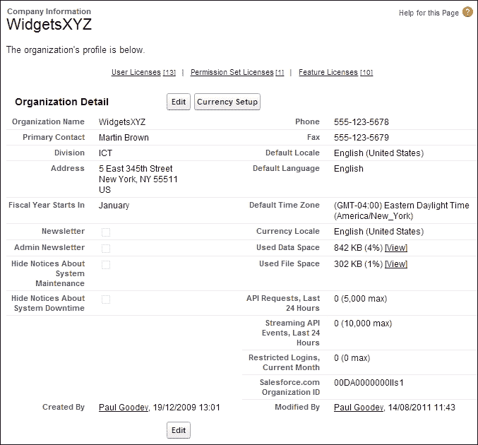

## 默认语言、地区和时区

公司的语言、地区和时区设置可能会影响组织关键数据的处理方式。

然而，个人用户可以通过导航到**您的名字** | **我的设置** | **个人** | **语言与时区**，并覆盖组织范围的设置，来设置自己的语言、地区和时区，如以下截图所示：

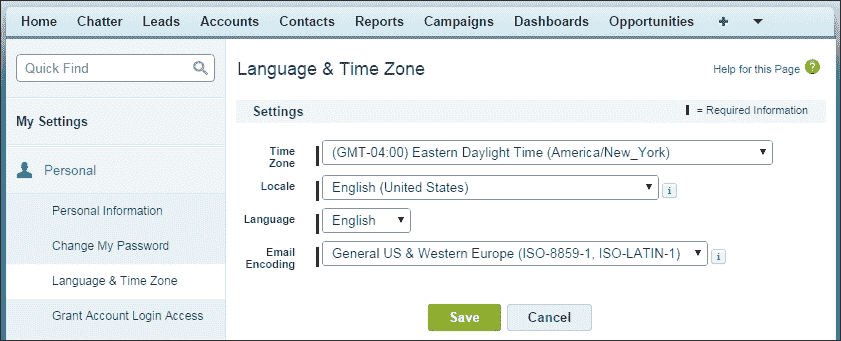

### 默认语言

这是组织的主要语言。所有界面文本和在线帮助将以此语言显示。但是，个别用户可以设置自己的语言，这将覆盖组织范围的设置。

### 提示

对于全球性组织，建议您考虑语言设置如何影响用户访问和共享信息的能力，并且是否应优先使用一种共同语言以帮助报告和系统管理。您可以使用**语言设置**功能（稍后描述）来限制用户在个人信息语言设置中可选择的语言。

### 默认区域

默认区域设置会影响日期、日期/时间和数字字段的格式。

例如，在**英语（美国）**区域，某个日期会显示为**07/27/2020**，而在**英语（英国）**区域则显示为**27/07/2020**。

在**英语（美国）**区域，时间显示使用 12 小时制并带有 AM 和 PM（例如，**3:00 PM**），而在**英语（英国）**区域，时间则以 24 小时制显示（例如，**15:00**）。

在**英语（美国）**区域，数字会显示为**1,000.00**，而在**德语**区域则显示为**1.000,00**。

然而，个别用户可以设置自己的区域，这将覆盖组织范围的设置。

### 默认时区

这是您的组织所在的主要时区，例如总部位置。但是，个别用户可以设置自己的时区，这将覆盖组织范围的设置。

**公司信息**页面还显示了您组织已购买的所有基础许可证、活跃用户和功能许可证。

## 许可证信息

有四种类型的许可证：

+   **用户许可证**：用户许可证赋予用户在 Salesforce 中不同的功能，并决定可供用户使用的配置文件。

+   **功能许可证**：功能许可证赋予用户使用 Salesforce 的附加功能，如营销或离线用户。

+   **权限集许可证**：权限集许可证用于向用户提供访问某些不属于其用户许可证的功能的权限。

+   **基于使用的授权**：基于使用的授权提供对有限资源的周期性使用。

### 注释

Salesforce 根据许可证总数而不是活跃用户数来向组织收费。

## 货币和汇率

货币设置在 Salesforce 中是组织范围的，可以通过使用**公司资料**中的**货币区域**设置，或作为多货币选项，添加货币并使用**公司资料**部分中的**管理货币**链接来设置汇率。

### 注释

多货币只能通过向 Salesforce 客户支持请求来启用。启用后，**货币地区**字段及其值将传递到一个新的字段，**公司货币**，也位于**公司资料**中。

公司货币反映了你的公司报告收入的货币，并作为所有其他货币汇率的基准汇率。这在 Salesforce 应用激活时由[Salesforce.com](http://Salesforce.com)初步设置。

所有组织，无论是使用单一货币还是多种货币，默认情况下在公司资料中仅设置一种货币。对于单一货币的实例，可以通过导航至**设置** | **公司资料** | **公司信息**，并设置**货币地区**字段来访问此设置。对于多种货币的实例，可以通过导航至**设置** | **公司资料** | **管理货币**，然后点击**更改公司货币**按钮来进行设置。

### 单一货币

在单一货币组织中，你为公司设置了全公司范围的货币地区，且 Salesforce 用户不能设置个人货币地区。

### 多货币

在多货币组织中，你设置的是公司货币，而不是货币地区，而且你的 Salesforce 用户也可以通过导航至**您的名字** | **我的设置** | **个人** | **个人信息**来设置他们的个人货币。

### 注意

多货币功能可以通过向 Salesforce 客户支持请求来启用。

你的 Salesforce 用户的个人货币将作为他们自己的报告、配额、预测以及包含货币金额的任何记录（例如机会）的默认货币。

### 注意

**货币**在记录中变为必填字段，尤其是在已经添加或原始定义了货币的地方，因此在启用**多货币**选项后，必须在导入数据或创建自定义对象时考虑到这一点。

用户还可以使用任何其他可用的活动货币来创建机会（以及包含货币金额的所有其他数据记录）。

### 注意

只有活动货币才能在货币金额字段中使用。

#### 活动货币

活动货币列表代表你的公司交易的国家或地区。只有活动货币可以由你作为系统管理员在组织资料中设置，或者由你的用户在其个人用户记录或数据记录中的货币字段中设置。

#### 管理货币

“管理货币”部分允许你维护一个活动货币及其与公司货币的汇率列表，可以通过导航至**设置** | **公司资料** | **管理货币**来访问。

### 注意

当你的组织启用**多货币**功能时，**管理货币**选项将出现，这项功能目前可以通过请求 Salesforce 客户支持获取。更改兑换率将更新所有现有记录的兑换率，包括已关闭的机会。因此，除非你已启用高级货币管理并存储了日期汇率，否则无法衡量由货币波动引起的财务变化。

如果启用了多货币功能，并且通过数据加载器更改了记录上的货币，则货币金额会被转换。

### 注意

可以通过更新标准字段**货币 ISO 代码**并将值设置为新货币的 ISO 代码，使用数据加载器更改记录的货币。在这里，ISO 代码是一个三字母的字母数字组合，如 USD 代表美元，EUR 代表欧元，GBP 代表英镑，依此类推。

如果启用了多货币功能，并且通过浏览器界面更改了记录上的货币，则货币金额不会被转换。

### 注意

可以通过更新货币查找来使用浏览器界面更改记录的货币，但货币金额不会被转换。因此，如果你将一个金额为 450 欧元的机会的货币更改为英镑，则金额仍然是 450，而不会转换为 384 英镑（假设当前汇率是 1 欧元=0.852 英镑）。

#### 日期汇率

日期汇率允许你在机会关闭时跟踪汇率，基于机会关闭日期时设定的汇率，准确报告机会转换金额。这是因为历史汇率被存储，且关闭日期之后的汇率变化可以被追踪；因此，报告可以包括基于关闭日期的汇率的机会金额，而不是报告运行时的汇率。

### 注意

更新货币兑换率不会改变原始机会金额，仅会更改已转换的金额。账户及其相关联系人必须使用相同的默认货币。账户和联系人记录可以使用激活或非激活的货币导入。但是，导入潜在客户记录时，必须使用激活的货币。

日期汇率通过启用**高级货币管理**选项来激活，并用于机会、机会产品、机会产品计划、活动机会字段以及与这些对象和字段相关的报告。

### 注意

日期汇率目前在预测中不被使用。

当**高级货币管理**首次启用时，现有的汇率会自动成为第一组日期汇率。

这些汇率将一直有效，直到你通过导航至**设置** | **公司配置文件** | **管理货币 | 管理日期汇率**来设置另一组汇率。

如果启用**高级货币管理**，则无法在机会对象上创建汇总字段来计算货币。任何现有的与货币相关的汇总字段将在机会对象上被禁用，并且其值将不再被计算。

## 财政年度设置

Salesforce 中的财政年度设置可以通过导航至**设置** | **公司资料** | **财政年度**进行设置。

### 标准财政年度

Salesforce 中的财政年度设置默认使用公历年份（十二个月结构），从 1 月 1 日开始，到 12 月 31 日结束。如果你的组织遵循十二个月结构，可以使用标准财政年度。标准财政年度可以从任何月份的第一天开始，并且可以指定财政年度是按开始年还是结束年来命名。例如，如果你的财政年度从 2020 年 4 月开始，到 2021 年 3 月结束，你的财政年度设置可以是 2020 或 2021。

### 自定义财政年度

财政年度比这更复杂，你可以使用自定义财政年度来定义这些期间。例如，作为自定义财政年度的一部分，你可以创建一个 13 周的季度，表示三个周期分别为 4、4 和 5 周，而不是按日历月来划分。

如果你使用财政年度结构，如 4-4-5 或 13 期结构，可以通过指定开始日期和包含的模板来定义财政年度。如果你的财政年度结构不在模板中，你可以修改模板。例如，如果你每年使用三个财政季度（即三期季度）而不是四个，可以删除或修改季度和期间以满足你的需求。这些自定义财政期间可以根据你的标准进行命名。例如，一个财政期间可以被称为**P12**或 12 月。

财政年度可以在需要更改其定义时随时修改。例如，可以在闰年中添加一周，以便将自定义财政年度与标准日历同步。对财政年度结构的更改在保存后立即生效。

### 语言设置

**语言设置**功能允许你指定可以在 Salesforce CRM 应用程序中使用的可接受语言。

此功能可以通过导航至**设置** | **公司资料** | **语言设置**进行设置。

然后，你可以通过从**可用语言**下拉列表中选择想要提供给用户的语言，并点击**添加**按钮来选择语言。

在以下示例中，我们添加了**西班牙语**和**法语**，并与**英语**一起显示，这些语言出现在**显示语言**列表中，如下图所示：

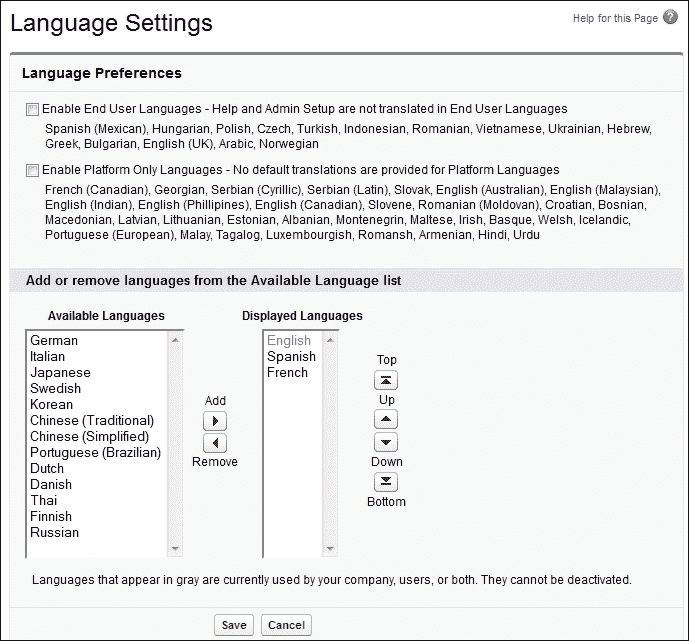

在**显示语言**列表中出现的语言现在作为可选项显示在用户**个人设置**页面的**语言**下拉列表部分，如下图所示：

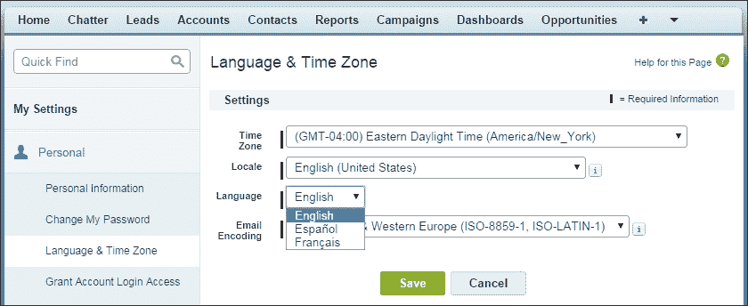

# 用户界面和支持的浏览器

在撰写本文时，共有三种用户界面主题。两种经典主题分别是**Classic 2005**和**Classic 2010**，还有一种新的主题叫做**Lightning Experience**。

浏览器的支持和功能因使用 Salesforce Classic 或 Lightning Experience 而有所不同，具体内容将在本节后面详细描述。

## 用户界面

本书中所有的截图和设置细节均显示 Classic 2010 用户界面主题。

在尝试从 Classic 2005 切换到 Classic 2010 时，可以在以下屏幕截图中看到经典主题的差异：

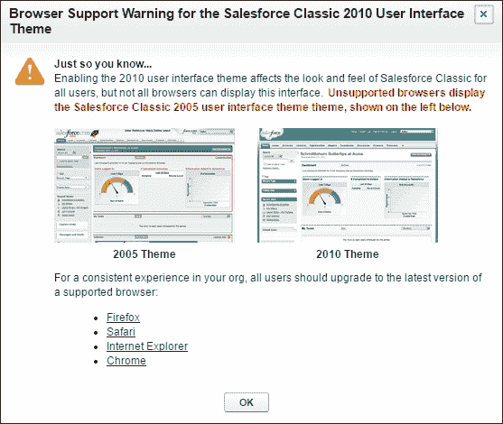

新的用户界面主题不仅改变了 Salesforce 的外观和感觉，还可能将一些关键链接，如**设置**和**登出**，定位在每个用户的用户名下。Classic 2010 用户界面主题仅适用于使用支持的浏览器的用户，具体支持的浏览器信息请参见后面的*支持的浏览器*部分。

### 注意

一些较新的功能区域，例如**Chatter**（一个协作应用套件），依赖于 Classic 2010 和 Lightning Experience 主题，无法在激活 Classic 2005 主题时提供。因此，为了启用 Chatter，您必须先激活 Classic 2010 主题。

## 支持的浏览器

在撰写本文时，有三种不同的用户界面主题：Salesforce Classic 2005、Salesforce Classic 2010 和 Lightning Experience。这些主题的浏览器支持情况如下：

### Salesforce Classic 2005

以下浏览器被 Salesforce 支持用于 Salesforce Classic 2005：

+   Google Chrome，最新的稳定版本

+   Microsoft Internet Explorer 9、10 和 11 版本

+   Mozilla Firefox，最新的稳定版本

+   Apple Safari 8.x 版本，适用于 Mac OS X

    ### 注意

    Salesforce 已在 Salesforce Classic 2005 中停止对 Microsoft Internet Explorer 7 和 8 版本的浏览器支持。

### Salesforce Classic 2010

以下浏览器被 Salesforce 支持用于 Salesforce Classic 2010：

+   Google Chrome，最新的稳定版本

+   Microsoft Internet Explorer 9、10 和 11 版本

+   Mozilla Firefox，最新的稳定版本

+   Apple Safari 8.x 版本，适用于 Mac OS X

    ### 注意

    Salesforce 已在 Salesforce Classic 2010 中停止对 Microsoft Internet Explorer 7 和 8 版本的浏览器支持。

### Lightning Experience

以下浏览器被 Salesforce 支持用于 Lightning Experience：

+   Google Chrome，最新的稳定版本

+   Microsoft Edge，适用于 Windows 10

+   Mozilla Firefox，最新的稳定版本

+   Apple Safari 8.x 和 9.x 版本，适用于 Mac OS X

    ### 注意

    当使用 Microsoft Internet Explorer 9-11 版本并在闪电体验中时，Salesforce 可能会将您重定向到 Salesforce Classic。然而，自 2016 年夏季版本发布以来，Salesforce 表示，现有组织的用户可以继续使用 Microsoft Internet Explorer 11（IE11）访问闪电体验，直到 2017 年 12 月 16 日，但 2016 年夏季版本后创建的新组织的用户将无法使用 IE11 访问闪电体验，并将自动被重定向到 Salesforce Classic。

除了用户界面主题外，Salesforce 中还有许多其他界面方面的设置，可以为您组织中的用户提供最佳的用户体验。

其他用户界面选项包括**用户界面设置**（如可折叠详细页面章节和内联字段编辑）、**侧边栏设置**（可折叠侧边栏设置和所有页面的自定义侧边栏组件）以及**日历设置**（如首页事件悬停链接和日历视图上的拖放编辑）。

还有一些管理员特定的设置可以改善用户在应用程序中的体验，这些设置位于**设置**设置下。它还包括**增强页面布局编辑器**和**增强型配置文件列表视图设置**。

选择**用户界面**选项可以通过导航到**设置** | **自定义** | **用户界面**来完成。

### 注意

**用户界面**选项是左侧设置边栏中**自定义**部分的最后一个选项。

用户界面屏幕如以下截图所示：

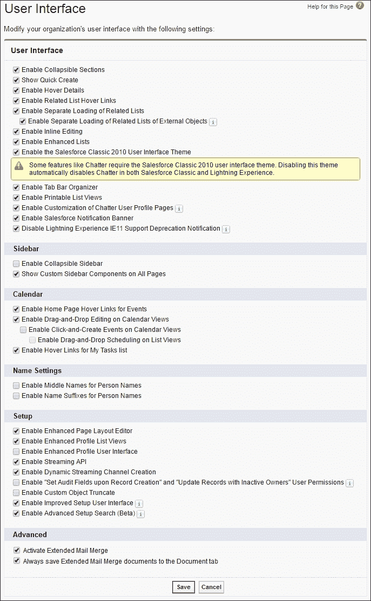

## 用户界面设置

在接下来的章节中，我们将逐一查看各种用户界面设置。

### 启用可折叠章节

可折叠章节使用户能够在记录详细页面上通过点击章节标题旁的箭头图标来折叠或展开章节。章节会保持折叠或展开状态，直到用户更改该章节的设置。如果记录类型已按照以下截图的方式设置，Salesforce 会为每个记录类型存储不同的设置：

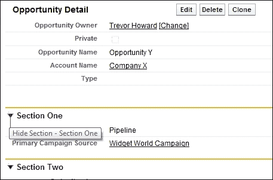

### 注意

启用可折叠章节时，需要确保页面布局中已输入章节标题。

点击三角图标可在显示和隐藏章节之间切换，如以下截图所示：

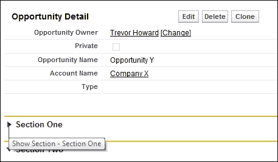

### 显示快速创建

**显示快速创建**选项将**快速创建**字段部分添加到**记录**标签页的侧边栏，以便用户使用最少的数据字段创建新记录，如以下截图所示：

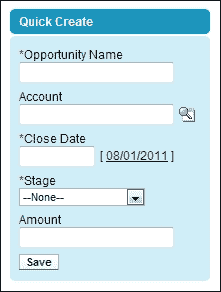

**显示快速创建**选项还控制用户是否可以在查找对话框中创建新记录。启用此设置后，用户将在查找对话框屏幕中看到一个**新建**按钮。以下示例显示了在处理商机记录时，在账户**查找**对话框中创建新账户：

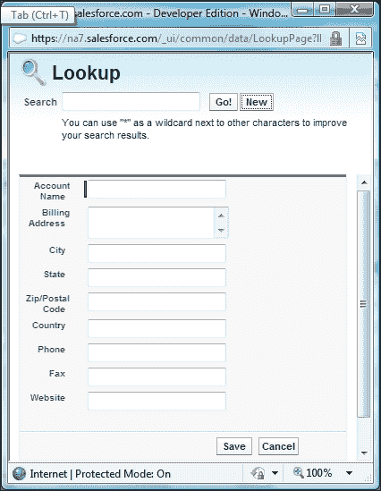

点击**新建**按钮可以显示用于创建新记录的可用字段。

创建新记录的选项和在**查找**对话框中显示**新建**按钮仅适用于账户和联系人。此外，用户仍然需要适当的**创建记录**权限，以便通过**快速创建**输入数据，无论是否显示输入字段。

### 提示

**禁用快速创建选项：**

**快速创建**选项不允许您配置数据输入屏幕，因此需要在此处填充的任何自定义字段将不包括在内。此外，使用**快速创建**选项保存记录时，记录的任何验证规则都不会被触发。这些功能允许创建不符合公司业务规则和数据完整性要求的记录，因此建议禁用**快速创建**选项。

### 启用悬浮详情

**启用悬浮详情**选项允许用户通过将鼠标指针悬停在侧边栏的**最近项目**列表中的记录链接或记录详细页面中的查找字段上来查看记录的交互信息。悬浮详情中显示的字段由记录的迷你页面布局决定，布局设置在页面布局编辑屏幕中。

### 注意

默认情况下，**启用悬浮详情**选项是选中的。

在以下截图中，我们正在将鼠标指针悬停在侧边栏的**最近项目**列表中的记录链接上：

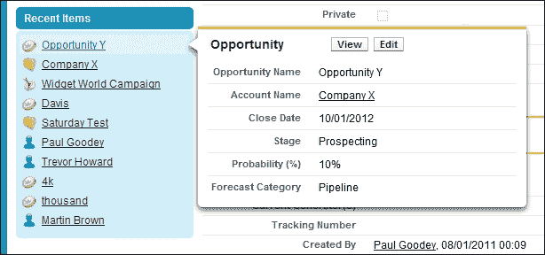

在以下截图中，我们正在将鼠标指针悬停在记录详细页面上的查找字段上：

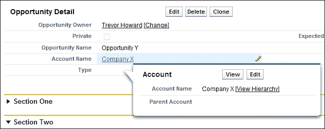

### 注意

要查看记录的悬浮详情，用户需要对该记录具有适当的共享访问权限，并且需要对字段具有字段级安全性，这些设置在页面布局编辑屏幕中设置（参见第三章，*配置对象和应用程序*）。

### 启用相关列表悬浮链接

此选项启用在标准和自定义对象记录详细页面顶部显示相关列表悬浮链接。用户可以通过将鼠标指针悬停在相关列表链接上来查看相关列表及其记录。用户还可以点击相关列表悬浮链接，直接跳转到**相关列表**部分，而无需滚动页面。

### 注意

默认情况下，**启用相关列表悬浮链接**选项是选中的。

### 启用相关列表的单独加载

此选项启用记录详情页面的独立加载。首先加载主记录详情数据，然后加载相关列表数据。此选项有助于提高记录详情页面上有大量相关列表的组织的显示性能。页面加载时，记录详情立即显示；之后，相关列表数据加载，此时用户会看到相关列表的进度指示器。

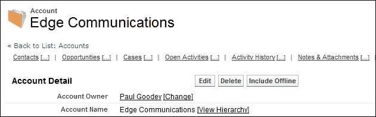

你会看到相关列表部分尚未加载。在主记录详情（例如账户示例）立即加载时，它们会以**[...]**的形式显示，如下图所示：

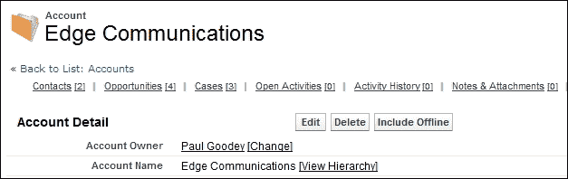

在主记录详情（账户页面）加载后，相关列表才会加载。你可以看到，**联系人**相关列表的记录数量现在显示为**[2]**。

此选项不适用于无法控制布局的页面（如用户页面或 Visualforce 页面）。

### 注意

**启用外部对象相关列表的独立加载**选项默认是禁用的。

### 启用外部对象相关列表的独立加载

此选项与**启用外部对象相关列表的独立加载**设置相关，能够单独加载标准和自定义对象的记录详情页面和相关列表。

### 注意

外部对象类似于自定义对象（在第三章，*配置对象和应用程序*中有描述），但是映射的数据并不存储在 Salesforce 中，因此加载时可能会因为外部数据源的可用性和网络延迟而有所延迟。**启用外部对象相关列表的独立加载**选项默认是启用的。

### 启用内联编辑

此选项允许用户直接在记录详情页面更改字段值，无需先加载记录编辑页面。通过在详情页面中双击要编辑的字段，该字段变为可编辑状态。然后可以输入新值并保存，或者使用**撤销**按钮撤销操作。

首先，通过鼠标悬停在字段上，字段会高亮显示，显示铅笔图标，表示该字段是可编辑的，具体如下：

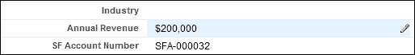

双击字段会使该字段从**查看**模式切换到**编辑**模式，以允许输入新值，具体如下：

在输入新值后，值会以橙色文字显示，用户可以选择使用**撤销**按钮撤销更改，具体如下：

更改的值和详情页面可以按照标准方式通过保存按钮保存，具体如下：

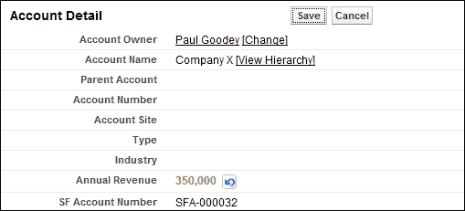

### 提示

要检查您的组织是否启用了内联编辑，并了解哪些值可以编辑，您可以将鼠标悬停在某个值上并查看结果。一个可编辑的字段，在鼠标悬停时会在值的右侧显示一个铅笔图标。而不可编辑的字段，在鼠标悬停时会在值的右侧显示一个锁形图标。

此选项默认启用。某些字段不能使用内联编辑进行更改，例如**系统字段**（创建者、最后修改者等）、**计算字段**（公式、自动编号、汇总等）、**只读字段**和**特殊字段**（如所有者和记录类型）。

### 注意

此外，文档和预测的详细页面上的字段当前不能使用内联编辑进行编辑。

### 启用增强型列表

该选项为用户提供了查看、自定义和编辑列表数据的功能，列表数据是从视图渲染出来的结果数据部分。当与**启用内联编辑**设置一起启用时，用户还可以在列表中直接编辑记录，而无需离开页面，如下截图所示：

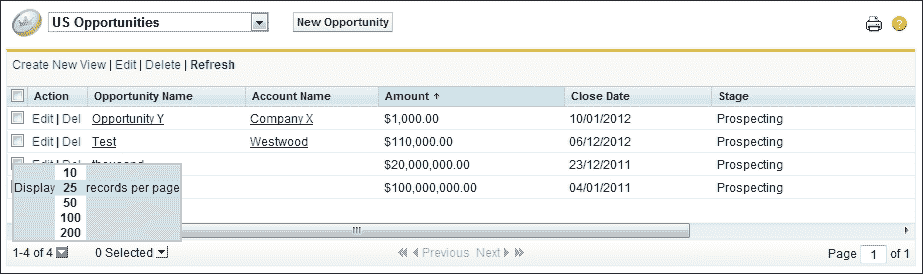

启用增强型列表后，用户可以执行以下操作：

+   创建新视图，或编辑、删除、刷新现有视图。

+   通过点击列表底部的第一页、上一页、下一页和最后一页链接，导航浏览列表结果。您还可以通过在右下角的文本框中输入数字，直接跳转到特定页面。您还可以通过拖动列标题右侧来改变列的宽度。对列宽所做的更改仅适用于该特定列表，并在每次查看该列表时被恢复。请注意，当列从列表中添加或删除时，该列表的任何列宽设置将被丢弃。

+   通过拖动整个列标题来更改列显示顺序，将其移动到所需位置。对于有权限编辑列表定义的用户，所做的更改将对所有查看该列表的用户生效。对于没有权限编辑列表定义的用户，他们的更改将在离开页面后被丢弃。

+   如果您的组织启用了内联编辑功能，用户可以通过双击单个字段值直接在列表中输入值。已经在个人资料中获得**批量编辑列表**选项的用户，可以一次编辑最多 200 条记录。

+   仅当启用内联编辑时，**批量编辑列表**选项才会出现在个人资料中。

批量编辑是通过首先使用复选框选择要编辑的记录，然后点击要编辑的字段来执行的。

点击字段后，会显示一个新的弹出窗口，询问是否将更改应用于仅选定的记录，还是应用于所有已选定的记录。在下图中，我们看到一个示例，其中选择了两个账户记录，并且点击了其中一个记录的账单街道字段。

此功能仅允许批量编辑；用户不能批量删除：

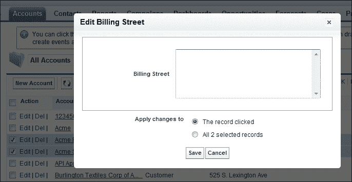

### 提示

**提醒用户他们不能批量删除记录：**

作为系统管理员，你可能需要提醒用户他们不能批量删除记录，因为有时用户可能会尝试使用唯一可见的**删除**链接进行批量删除，而该链接实际上是删除**视图**的链接，如下图所示。向用户说明这一点，希望能避免你因误删视图而需要重新创建视图。

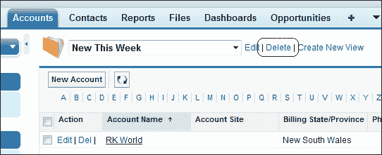

在**Account**（账户）、**Contact**（联系人）和**Lead List**（潜在客户列表）视图中，页面底部有一个**打开日历**链接，可以在列表下方显示一个周视图的日历。可以将记录从列表拖动到日历上的某个时间槽，创建与该记录相关联的事件。

### 注意

要在增强列表上进行内联编辑，必须在列表视图筛选条件中关闭**高级筛选**选项。一些标准字段不支持内联编辑。例如，**Case Status**（案例状态）、**Opportunity Stage**（机会阶段）以及一些**Task**（任务）和**Event**（事件）字段只能通过记录编辑页面进行编辑。

可以通过将视图设置为**10**、**25**、**50**、**100**或**200**条记录来更改每页显示的记录数。更改此设置时，导航将设置为列表结果的第一页，如下图所示：

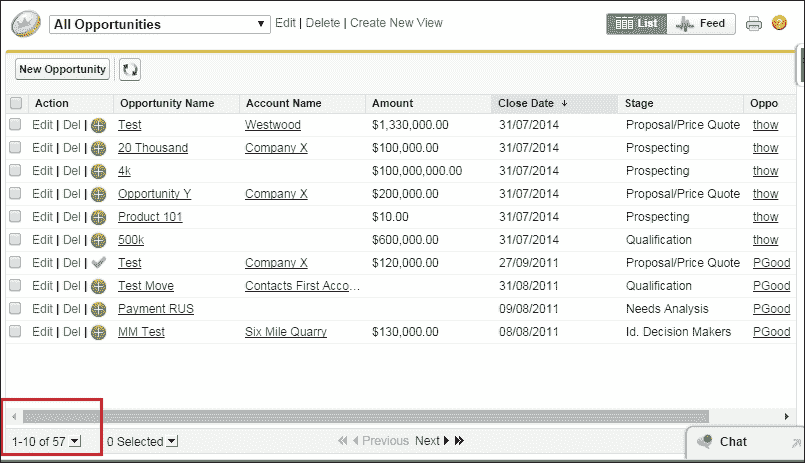

如果用户更改每页显示的记录数，该设置将应用于所有列表（不仅仅是当前列表）。

此外，如果选择显示 200 条记录的选项，将会出现警告消息，因为这可能会降低性能，如下图所示：

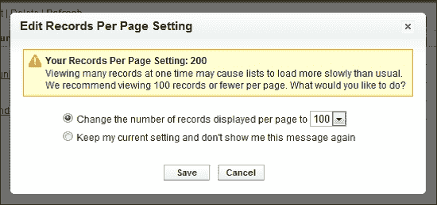

### 启用 Salesforce Classic 2010 用户界面主题

在撰写本文时，有三种不同的用户界面主题，分别是 Salesforce Classic 2005、Salesforce Classic 2010 和 Lightning Experience。

启用 Salesforce Classic 2010 用户界面主题会激活 Salesforce Classic 的最新版本，这是 Lightning Experience 之前的界面主题。禁用此选项将激活 Salesforce Classic 2005 用户界面主题。

### 注意

有一些功能，如 Chatter，要求使用 Salesforce Classic 2010 用户界面主题，禁用此选项将禁用 Salesforce Classic 中的 Chatter，同时也会禁用 Lightning Experience 中的 Chatter。

### 启用选项卡栏组织器

Tab Bar Organizer 自动排列用户的标签，以控制 CRM 应用页面的宽度并防止水平滚动。它动态地测量可以显示多少应用标签，并将超出浏览器当前宽度的标签放入右侧下拉列表中，如下图所示：

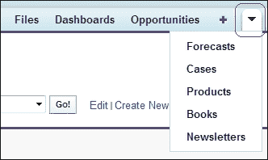

### 注意

只有在启用**新用户界面主题**时，此设置才会生效。如果您的组织没有使用新用户界面主题，您可以启用此功能，但在启用新主题之前，Tab Bar Organizer 不会为您的用户激活。

### 启用可打印的列表视图

此选项允许用户轻松打印列表视图。

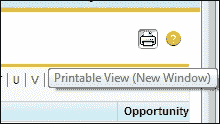

如果启用此功能，用户可以点击位于任何列表视图右上角的**打印视图**链接（打印机图标），以打开一个新的浏览器窗口。在新窗口中，当前列表视图以适合打印的格式显示，如以下截图所示：

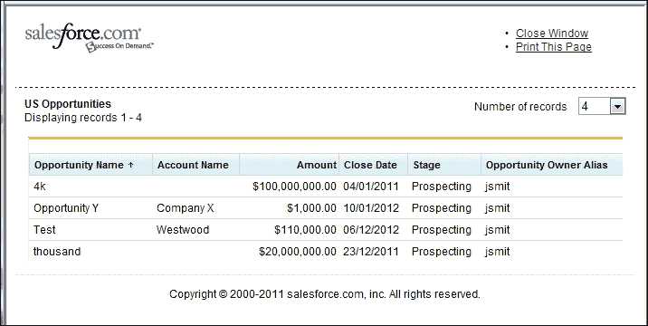

此选项允许用户从任何列表视图点击**打印视图**链接，打开一个新的浏览器窗口，显示当前列表视图的适合打印格式。

### 启用自定义 Chatter 用户个人资料页面

此选项允许您自定义 Chatter 用户个人资料页面上的标签。如何自定义 Chatter 用户个人资料页面将在第八章，*介绍 Sales Cloud、Service Cloud 和 Salesforce CRM 的协作功能*中详细描述。在以下示例截图中，我们已自定义了**Chatter**用户个人资料页面的标签，并添加了**Learning Zone**标签，修改后的页面如下所示：

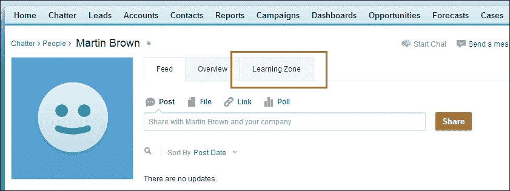

2014 年冬季发布时，此功能已自动启用。

这使您能够添加自定义标签页或删除默认标签页，如默认的**Feed**和**Overview**标签页。自定义标签页可以通过自定义子标签应用来实现，详细信息请参考第三章，*配置对象和应用*。如果此选项禁用，用户只会看到默认的**Feed**和**Overview**标签页。

### 启用 Salesforce 通知横幅

选中此选项时，会在某些页面上显示公告横幅。

### 注意

在 2014 年夏季发布中，Salesforce 通知横幅出现在您的组织的设置区域，以及帐户、联系人和仪表板页面中。

用户可以通过点击**关闭**按钮防止横幅在所有页面上出现，或者你可以通过禁用此选项来阻止 Salesforce 通知横幅在整个组织中出现。

## 禁用闪电体验 IE11 支持弃用通知

自 2016 年夏季发布以来，Salesforce 已声明，现有组织可以继续使用 Microsoft Internet Explorer 11（IE11）访问闪电体验，直到 2017 年 12 月 16 日（此日期之后，用户将自动重定向到 Salesforce Classic）。

**禁用闪电体验 IE11 支持弃用通知**选项使你能够防止在组织中的用户访问启用了闪电体验的 Salesforce 时出现屏幕通知，以便根据你的浏览器过渡策略避免使用 IE11。更多信息，请参见本章前面的“支持的浏览器”部分。

## 侧边栏

以下选项可帮助用户查看和编辑侧边栏中的信息，侧边栏位于屏幕的左侧垂直区域：

+   启用可折叠侧边栏

+   在所有页面上显示自定义侧边栏组件

现在我们将详细介绍侧边栏选项。

### 启用可折叠侧边栏

可折叠侧边栏使用户能够在包含侧边栏的每个 Salesforce 页面上显示或隐藏侧边栏。当选择此选项时，可折叠侧边栏将对组织中的所有用户可用。但是，每个用户可以设置自己的侧边栏显示偏好。用户可以设置侧边栏始终显示，或者在需要时将侧边栏折叠并仅在需要时显示。

### 在所有页面上显示自定义侧边栏组件

如果你有包含侧边栏组件的自定义主页布局，此选项将在 Salesforce 的所有页面和所有用户中显示侧边栏组件。如果只有某些配置文件被允许在所有页面上查看侧边栏组件，你可以为这些配置文件分配**在所有页面上显示自定义侧边栏**权限。

### 注意

如果启用了**在所有页面上显示自定义侧边栏组件**用户界面设置，则**在所有页面上显示自定义侧边栏**权限在配置文件权限中不可用。

## 日历设置

以下选项可帮助用户查看和编辑日历部分和视图中的信息：

+   启用主页事件悬停链接

+   在日历视图中启用拖放编辑

+   在日历视图中启用点击并创建事件

+   在列表视图中启用拖放调度

+   启用我的任务列表的悬停链接

让我们详细了解一下它们。

### 启用主页事件悬停链接

此选项启用主页标签中的日历部分的悬停链接，允许用户将鼠标悬停在事件主题上，以查看该事件的互动信息。

### 注意

此设置仅控制**首页**标签页，因为在其他日历视图中，悬停链接始终会显示。另外，此选项默认启用。

### 启用日历视图中的拖放编辑

此选项允许用户在日常和每周的日历视图中拖放现有事件，重新安排事件，而无需从页面导航到事件创建页面。启用此选项后，日历控制的加载性能可能会受到影响。拖放编辑不适用于跨天事件或控制台日历视图。此外，此选项默认启用。

### 启用日历视图中的点击并创建事件

此选项通过双击特定时间段并在交互式部分中输入事件详情，启用在日常和每周日历视图中创建事件。交互式部分中呈现的字段使用**事件**页面布局屏幕上的迷你页面布局进行设置。

### 注

无法通过**启用在日历视图中点击并创建事件**选项创建重复事件和多人事件。

### 启用列表视图中的拖放调度

此选项允许用户通过将待关联的记录从列表视图拖动到每周日历视图上来创建事件。放下后，将显示事件详情的交互式部分，其中的可用字段是通过迷你页面布局进行设置的。

### 注

此选项默认情况下是禁用的。

### 启用**我的任务**列表中的悬停链接

此选项启用**我的任务**部分和日历日视图中任务的悬停链接，并允许用户在交互式部分中将鼠标悬停在任务详情上。

## 姓名设置

姓名设置功能允许访问 Salesforce 中人员对象的附加字段，帮助避免当两个人员记录有相同的名字和姓氏时发生混淆。

### 启用人员姓名的中间名

此设置将中间名字段添加到诸如**联系人**、**潜在客户**、**个人账户**和**用户**对象等人员对象中。

### 启用人员姓名的后缀

此设置将姓名后缀字段添加到诸如**联系人**、**潜在客户**、**个人账户**和**用户**对象等人员对象中。

## 设置选项

有特定于管理员的用户界面设置，它们位于**设置**选项下，可以改善您与应用程序的使用体验。这些设置提供以下选项：

+   启用增强型页面布局编辑器

+   启用增强型个人资料列表视图

+   启用增强型个人资料用户界面

+   启用流式 API

+   启用动态流频道创建

+   启用在记录创建时设置审计字段，并更新具有非活动所有者用户权限的记录

+   启用自定义对象截断

+   启用改进的设置用户界面

+   启用高级设置搜索

让我们详细看看它们是什么。

### 启用增强型页面布局编辑器

该选项启用**增强型页面布局编辑器**，通过功能丰富的**所见即所得**（**What You See Is What You Get**）编辑器来编辑页面布局。

### 启用增强型配置文件列表视图

此选项启用配置文件列表页上的增强型列表视图和内联编辑功能，使您能够一次性管理多个配置文件。

要导航到**配置文件**菜单，请转到**设置** | **管理用户** | **配置文件**。然后选择一个配置文件并点击**创建新视图**，如下面的截图所示：

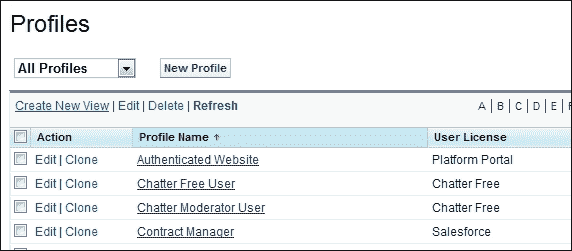

以下三个步骤会生成一个配置文件列表，您可以通过这些步骤一次性修改多个配置文件设置：

1.  输入视图名称。

1.  指定过滤标准。

1.  选择显示的列。

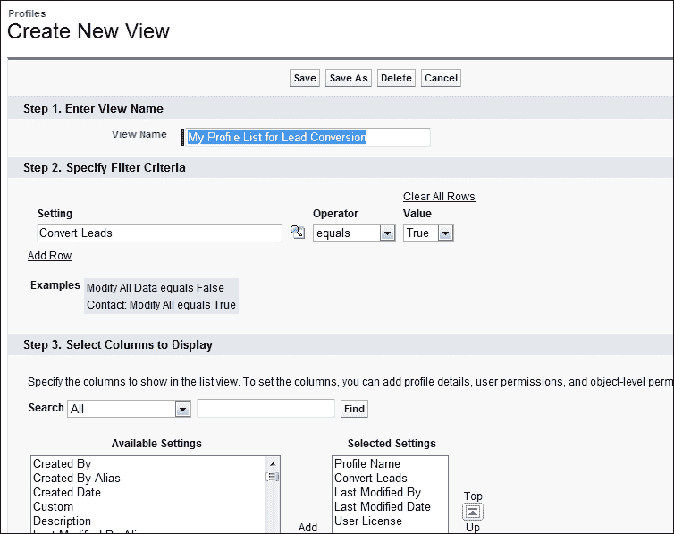

现在已经创建了配置文件视图，我们可以选择多个配置文件进行统一管理，如下图所示：

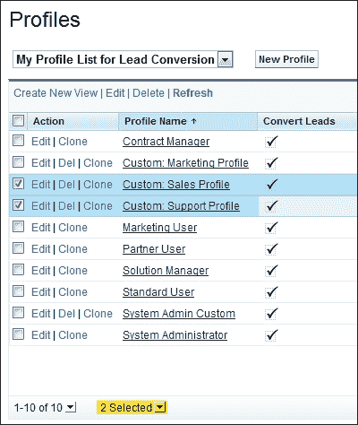

您可以显示多个配置文件列表，这些列表可以选择并进行操作，如下图所示：

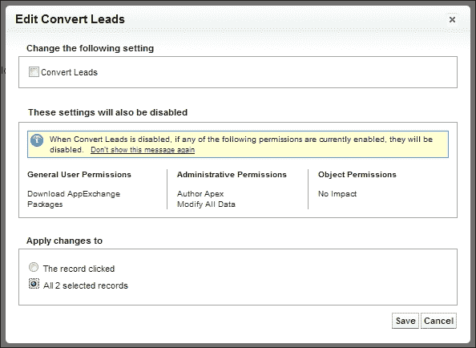

您还可以修改多个配置文件的选择，以便将设置应用于所有配置文件，如下图所示：

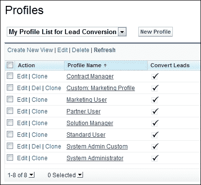

### 启用增强型配置文件用户界面选项

启用增强型配置文件用户界面选项允许您启用**增强型配置文件用户界面**，此界面提供以下功能，帮助您管理：

+   **查找权限和设置**：在“查找设置”框中输入特定的权限或设置名称，然后从匹配的结果列表中选择。

+   **编辑配置文件属性**：在这里，您可以更改配置文件的名称或描述。

+   **已分配用户**：通过点击**已分配用户**按钮，查看属于某个配置文件的用户列表。

+   **浏览权限和设置，适用于应用程序和系统属性**：在这里，应用程序相关的系统权限和设置被分组在单独的页面上，配置文件概览页面提供描述和链接。

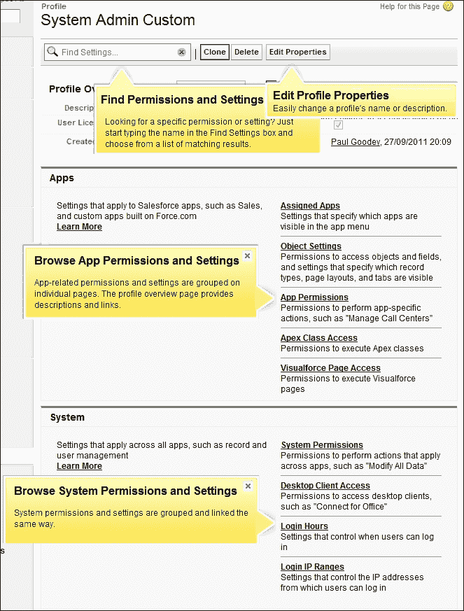

### 启用流媒体 API

此选项启用在您的组织中使用 Force.com Streaming API。流媒体 API 提供来自 Force.com 平台的近实时数据流。您可以创建主题，供应用程序订阅，并接收有关 Force.com 数据更改的异步通知。

### 注意

请参阅位于 developer.salesforce.com 的 Force.com Streaming API 开发者指南，以获取更多详情。

### 启用动态流媒体通道创建

此选项是流媒体 API 的功能；启用后，当客户端订阅时，如果通道尚未创建，它将动态创建流媒体通道。

### 注意

默认情况下，此设置是启用的。

### 启用记录创建时设置审计字段和更新具有非活动所有者的记录的用户权限

此选项允许你设置审计字段（如记录创建日期），这些字段在通过 Salesforce API 创建记录时默认是只读的。你可以通过使用如数据加载器等工具来创建记录，数据加载器是一个利用 Salesforce API 的客户端应用程序。此设置还允许你更新具有非活动所有者的记录。

### 注意

从 Winter '16 版本开始，这个设置使得将历史数据迁移到 Salesforce 和批量更新不属于活跃用户的记录变得更加容易。之前，你需要联系 Salesforce 支持才能暂时启用这些功能。当启用此选项时，会在配置文件和权限集中的系统权限中提供两个新权限，可以分配给用户。

### 启用自定义对象截断

选择 **启用自定义对象截断** 复选框，以激活自定义对象的截断功能，这将永久删除自定义对象的所有记录，同时保持该对象及其元数据，以备将来使用。

### 注意

当启用此选项时，在自定义对象设置页面的编辑按钮列表中将出现 **截断** 按钮。

截断自定义对象是一种快速的方式，可以永久删除自定义对象中的所有记录。以一个已创建并填充了测试记录的自定义对象为例。当测试完成且不再需要测试数据时，你可以截断该对象以移除测试记录，但保留对象准备好用于生产环境部署。这比批量删除记录并重新创建自定义对象要快得多。

### 注意

截断自定义对象会永久删除其所有记录，并且无法从 **回收站** 恢复这些记录。被截断的对象的副本会出现在 **已删除对象** 列表中 15 天，在此期间，该对象及其记录仍然计入组织的数据限制。副本对象及其记录将在 15 天后永久删除。

### 启用改进版设置用户界面

当组织启用 **改进版设置用户界面** 时，你可能会注意到与原始用户界面有几个不同之处。

设置菜单可以通过 Salesforce 页面右上角的设置链接进入。它被安排为以下基于目标的类别：

+   管理、构建、部署、监控和结算。

+   所有 Salesforce 用户都可以编辑的个人设置可以通过单独的 **我的设置** 菜单进行访问。

    ### 注意

    启用 **启用改进版设置用户界面** 选项后，该界面将在你组织中的每个用户处激活。

### 启用高级设置搜索

启用此选项后，可以在设置区域的侧边栏搜索框中搜索设置页面、用户自定义配置文件、权限集、公共组、角色和用户。当禁用此选项时，你只能搜索设置页面。

在侧边栏的**设置**搜索框中输入时，任何与搜索词匹配的选项都会出现在**设置**菜单中。当你按下**Enter**键时，页面将显示所有匹配的权限集、用户自定义配置文件、公共组、角色或用户。

## 高级设置

**高级设置**提供了两个功能的激活：激活**扩展邮件合并**和选择**始终将扩展邮件合并文档保存到文档选项卡**。

### 激活扩展邮件合并

此选项启用后，**批量邮件合并**链接将在账户、联系人和潜在客户的主页上的**工具**区域中可用。

启用后，此选项还将设置从记录上的活动历史相关列表请求的单个邮件合并，以`扩展邮件合并`功能创建。`扩展邮件合并`功能通过向导激活，向导包括以下步骤：

1.  在**工具**区域中，点击**批量邮件合并**开始批量邮件合并向导。从**查看**下拉列表中选择一个列表视图，并选择要包含在邮件合并中的记录。在列标题中的复选框选择后，将选择当前页面上显示的所有记录。

1.  选择要生成的 Word 文档类型，可以从文档、信封和标签的多项选择中进行选择。选择可选的**记录活动**复选框，以记录这些邮件合并文档的创建过程，并将完成的任务添加到每个记录中。

1.  选择合适的邮件合并模板。对于文档，选择是创建一个包含所有输出的 Word 文档，还是为每个记录创建一个单独的 Word 文档。点击可选的**预览模板**按钮，查看预加载的邮件合并模板。

虽然文档预览是可编辑的，但请勿在 Word 中编辑，因为更改不会保存到当前的邮件合并请求中。你需要创建一个新的邮件合并模板并首先上传该模板。

### 注意

使用**扩展邮件合并**时，邮件合并操作不能超过 1,000 条记录，选定的邮件合并模板总大小不能大于 1 MB，记录数乘以邮件合并模板的总大小不能大于 50 MB。此外，**扩展邮件合并**可通过 Salesforce 客户支持请求启用。

### 始终将扩展邮件合并文档保存到文档选项卡

此选项停止将邮件合并文档作为电子邮件附件发送，而是将它们存储在用户个人文档文件夹中，在**文档**选项卡下。用户仍会收到电子邮件确认其邮件合并请求已完成，并且这些电子邮件包含指向**文档**选项卡中文档的链接。

### 注意

这些文档会占用您组织的存储配额。

## 搜索概览和设置

[Salesforce.com](http://Salesforce.com)使用自定义算法，在搜索中考虑以下内容：

+   搜索词

+   搜索词中的忽略词（例如，“the”、“to”和“for”）

+   搜索词干（例如，搜索“speaking”将返回与“speak”相关的项目）

+   搜索词在记录中的接近度

+   记录所有权和最近访问的记录

因此，用户的搜索结果可能与执行相同搜索的其他用户不同，因为搜索是为执行搜索的用户配置的。例如，如果另一个用户最近查看了某个记录，该记录的相关性会增加，并且该记录会在其搜索结果列表中排名更高。由用户拥有的记录也会在搜索结果中排名更高。目前有三种类型的搜索，如下所示：

+   侧边栏搜索

+   高级搜索

+   全局搜索

让我们来看一下它们是什么，好吗？

## 侧边栏搜索

在**侧边栏搜索**框中，用户可以搜索记录类型和字段的子集。

### 注意

如果启用了**全局搜索**（将在本节后面描述），**侧边栏搜索**将被禁用。

可以使用通配符和过滤器来帮助优化搜索。

### 注意

通配符是一个特殊字符或标记，可以用来替代字符串中的任何其他字符或字符组合。例如，星号字符（*）用于替代零个或多个字符。有关通配符字符的更多信息，可以通过以下链接查找：[`en.wikipedia.org/wiki/Wildcard_character`](http://en.wikipedia.org/wiki/Wildcard_character)。

## 高级搜索

**侧边栏中的高级搜索**允许结合搜索记录类型的子集，并提供更多字段，包括自定义字段和长文本字段，如描述、备注、任务和事件评论。可以使用通配符和过滤器来帮助优化搜索。

### 注意

如果启用了**全局搜索**（将在本节后面描述），**高级搜索**将被禁用。

## 全局搜索

在**全局搜索**框中，用户可以搜索更多类型的记录，包括文章、文档、产品、解决方案、Chatter 动态和小组。用户还可以搜索更多字段，包括自定义字段和长文本字段，如描述、备注、任务和事件评论。可以使用通配符和过滤器来帮助优化搜索。

### 注意

要启用**全局搜索**，您必须启用 Chatter。如果启用了**全局搜索**，**侧边栏搜索**和**高级搜索**将被禁用。在**合作伙伴门户**或**客户门户**中不支持全局搜索。只有使用支持浏览器的用户才能使用全局搜索，因为它间接依赖于新主题用户界面。

### 在 Salesforce.com 中搜索

你的搜索词必须包含两个或更多字符。特殊字符，如`"`、`?`、`*`、`(`和`)`不计入字符数。例如，搜索`m*`将无法返回任何搜索结果。

搜索词不区分大小写。例如，搜索 martin 和`Martin`将返回相同的结果。

查找电话号码可以通过输入部分或全部号码来完成。例如，要查找`(512) 757-6000`，可以输入`5127576000`、`757`或`6000`。要搜索最后七位数字，必须输入标点符号，如`757-6000`。

在中文、日文和韩文中，你可以通过输入姓氏在前、名字在后的方式来查找人。例如，搜索`howard trevor`会返回名为 Trevor Howard 的人。

### 注意

如果你正在使用**高级搜索**或**全局搜索**，可以通过使用运算符如**AND**、**OR**和**AND NOT**来优化搜索。如果你正在使用**高级搜索**或**全局搜索**，可以通过勾选**精确短语**复选框，或在多个关键词周围加上引号来搜索精确短语；例如，`"phone martin brown"`会返回包含`"phone martin brown"`的结果，但不会返回“martin brown phoned”或“phone martina browning”的结果。

如果你正在使用**侧边栏搜索**，你的搜索词会自动作为短语搜索处理。你可以使用通配符进行部分匹配搜索，方法如下：

星号匹配搜索词中间或末尾的一个或多个字符（不能是开头）。例如，搜索`brown*`会找到以“brown”变体开头的项，如 browning 或 brownlow。搜索`ma*` brown 会找到包含 martin brown 或 mandy brown 的项。如果你正在使用侧边栏搜索，星号（*）会自动附加在搜索词的末尾。如果你正在使用全局搜索，问号仅匹配搜索词中间的一个字符（不能是开头或结尾）。例如，搜索`ti?a`会找到包含 tina 或 tika 的项，但不会找到 tia 或 tinas。自定义对象的字段只有在你为该对象添加了自定义标签时才会被搜索。

如果使用**侧边栏搜索**或**高级搜索**，问号仅匹配搜索词中间或末尾的一个字符（不能是开头）。

## 搜索设置

有多种搜索选项可以定制，以改变用户在 Salesforce 中搜索信息的方式。这些选项要么呈现增强的搜索功能，作为用户界面的一部分显示，要么是隐形的，用于优化后台搜索。**搜索设置**可以通过导航到**设置**|**自定义**|**搜索**|**搜索设置**来进行配置。

以下截图展示了在未启用**Chatter**时，在 Salesforce CRM 应用中可用的搜索设置：

启用**Chatter**后，**全局搜索**设置会自动启用，并提供以下简化的选项：

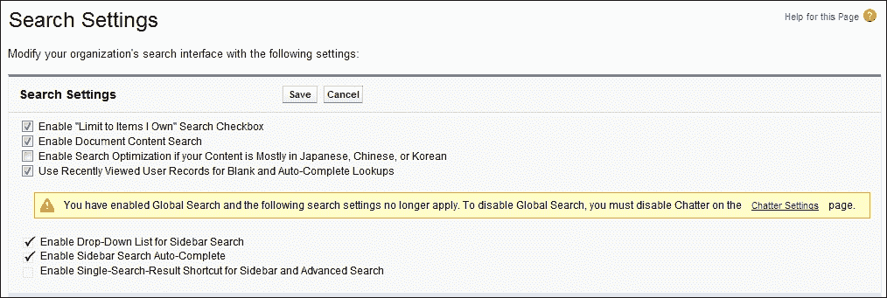

在接下来的部分中，您将看到如何使用各种搜索设置：

### 启用“仅限我拥有的项目”搜索复选框

**仅限我拥有的项目**选项允许用户在侧边栏搜索时将搜索结果限制为仅显示他们拥有的记录。

### 注意

对于**高级搜索**中可用的**仅限我拥有的项目**复选框，无论此选项的设置如何，都始终会显示。

### 启用文档内容搜索

此选项允许用户对文档进行全文搜索。当上传新文档或更新现有文档时，文档的内容将作为搜索词以便检索该文档。

### 如果您的内容主要为日语、中文或韩语，可以启用搜索优化

此选项优化了日语、中文和韩语语言集的搜索。它影响**侧边栏搜索**以及**侧边栏搜索**和**全局搜索**中**查找重复项**的账户搜索。

### 小贴士

如果预计内容和搜索主要使用其他语言，则不应选择此选项。

### 使用最近查看的用户记录进行空白和自动完成查找

此选项使得用户自动完成查找和空白用户查找返回的记录列表来自用户最近查看的记录。如果未启用此选项，则对话框将显示来自整个组织的最近访问用户记录列表。

### 启用侧边栏搜索下拉列表

此选项会在**搜索**部分创建一个下拉列表，用户可以通过该列表按记录类型限制搜索。

### 启用英文拼写校正功能（仅限知识搜索）

此选项与**文章**和**文章管理**标签一起使用，适用于**案例馈送**中的文章工具，以及 Salesforce 控制台中的**Salesforce 知识**侧边栏。

### 注意

此设置仅适用于通过 API 进行的文章搜索，不适用于使用全局搜索时的文章搜索。

启用后，任何搜索建议都会显示，且会搜索英文搜索词的替代拼写。

### 启用侧边栏搜索自动完成

此选项提供了以下功能：当用户开始输入搜索词时，侧边栏搜索会显示匹配的最近查看记录列表。

### 注意

全局搜索功能包括自动完成功能，这是标准功能，无需设置特定的自动完成选项。

### 启用单一搜索结果快捷方式

此选项允许用户跳过搜索结果页面，如果搜索结果只有一个，它将直接导航到**记录详情** **页面**。

### 每个对象显示的搜索结果数量

**每个对象显示的搜索结果数量**选项允许您配置每个对象在**搜索结果**页面中返回的项目数量。当前设置以括号形式显示在每个对象旁边，新值必须在 5 到 50 之间。

## 查找设置

**搜索设置**页面中的**查找设置**部分允许您为**帐户**、**联系人**、**用户**和**自定义**对象启用增强型查找和查找自动完成。

## 增强型查找

**增强型查找**为您的用户提供了一个增强的界面，允许他们按常规搜索结果中可用的任何字段对搜索结果进行排序和筛选，如下图所示：

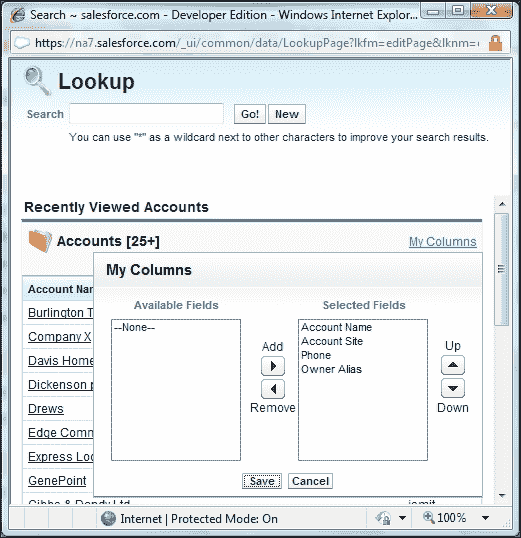

启用**增强型查找**后，用户可以隐藏和重新组织结果窗口中显示的列。**增强型查找**返回所有匹配搜索条件的记录，并允许您分页浏览大量搜索结果。

启用**增强型查找**后，您必须指定用户可以用来筛选查找搜索对话框结果的字段。这是通过访问搜索布局并从**查找对话框字段**布局中选择字段来设置的。

对于自定义对象，可以通过导航到**设置** | **创建** | **对象**来完成。选择要修改的对象，向下滚动到**搜索布局-**相关列表，并选择**查找对话框字段**中的字段。

对于**帐户**、**联系人**或**用户**，可以通过导航到**设置 | 自定义**，然后进入**帐户**、**联系人**或**用户**，接着选择**搜索布局**来完成。然后，从**查找对话框字段**中选择字段，如下图所示：

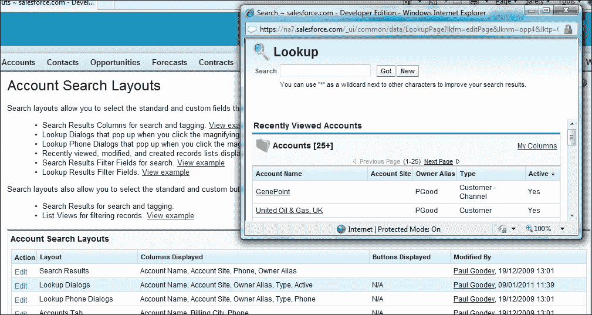

当前，仅**帐户**、**联系人**、**事件**、**用户**、**Chatter**对象和自定义对象可以使用增强型查找设置。

## 查找自动完成

当启用**查找自动完成**选项时，用户在编辑查找字段时将看到一个动态的匹配记录列表，显示最近使用过的记录。

### 注意

在撰写时，此功能仅适用于**帐户**、**联系人**、**事件**、**Chatter**、**用户**以及自定义对象查找。

# 测试您的知识的问题

现在，您将看到有关 Salesforce CRM 管理（组织设置和全局用户界面领域）关键功能的问题，这些功能已在本章中覆盖。答案可以在本章末尾找到。

## 问题

我们提出了四个问题来验证您对用户登录和身份验证机制、公司简介、财年以及用户界面的理解。

### 问题 1 - 用户登录和身份验证

一位新的基于字段的销售人员加入了`WidgetsXYZ`并首次使用 Salesforce。您是`WidgetsXYZ`的管理员，该销售人员告诉您，他们总是被要求激活其笔记本电脑，并且总是使用相同的浏览器。您将如何回应？（选择所有适用项）。

**a**) 验证 Salesforce 的受信 IP 范围是否已正确配置。

**b**) 验证 Salesforce 的登录时间限制是否已配置。

**c**) 验证销售人员的笔记本电脑是否正确存储浏览器 cookie。

**d**) 向销售人员解释这是正常行为，并且笔记本电脑的反应符合预期。

### 问题 2 - 公司概况

哪些设置可以为单个用户修改？（选择所有适用项）

**a**) 货币

**b**) 搜索设置

**c**) 语言

**d**) 区域

**e**) 用户界面

### 问题 3 - 财政年度

`WidgetsXYZ` 公司的财务季度为 13 周，分别由 4 周、4 周和 5 周组成，而不是按照日历月份。您可以采取什么措施使报告能够捕捉到正确的季度活动？（选择一项）

**a**) 修改报告以使用这些周期进行日期过滤。

**b**) 修改这些周期的**标准财政年度**。

**c**) 启用**自定义财政年度** 来捕捉这些周期，并在必要时恢复到**标准财政年度**。

**d**) 启用**自定义财政年度** 来捕捉这些周期，并请注意您无法恢复到**标准财政年度**。

### 问题 4 - 用户界面

在 Salesforce 用户界面中可以修改哪些设置？（选择所有适用项）

**a**) **语言设置**。

**b**) **悬停详细信息**。

**c**) **时区设置**。

**d**) **增强型列表视图**。

**e**) 启用**可打印列表视图**。

## 答案

这里是关于用户登录和认证机制、公司概况、财政年度和用户界面的四个问题的答案。

### 答案 1 - 用户登录和认证

答案是 **a**) 验证 Salesforce 的可信 IP 范围是否已正确配置。Salesforce 在浏览器中存储一个 cookie 并激活该设备，并防止用户在从不同 IP 地址登录时被提示激活码。如果用户已阻止 cookie 或在浏览器中删除 cookie，则会出现这种行为。

### 答案 2 - 公司概况

答案是 **a**) 货币，**c**) 语言，和 **d**) 区域**。** 它们可以被单个用户修改。

**b**) 用户界面和**e**) 搜索设置无法针对单个用户进行修改，因为它们是影响所有用户的全局设置。

默认的区域设置、语言和货币设置在公司概况上进行了设置，但是这些设置可以被用户用个人级别的值覆盖。

### 答案 3 - 财政年度

答案是 **d**) **启用自定义财政年度** 来捕捉这些周期，并且请注意您无法恢复到标准财政年度。

启用自定义财政年度是不可逆转的，您无法恢复到标准财政年度。但是，您可以将自定义财政年度设置为镜像标准财政年度。由于财政季度基于周周期而不是月份，标准财政年度无法满足报告需求，因此需要自定义财政年度。

### 答案 4 - 用户界面

答案是**c**) **悬停详情**，**d**) **增强的列表视图**，以及**e**) **启用可打印列表**视图。这些都是用户界面中的设置，并且在设置时会影响所有用户。

**a**) **语言设置**和**c**) **时区设置**在公司配置文件中指定，它们提供默认值；然而，用户可以覆盖这些设置并在个人设置中进行修改。

# 总结

本章讨论了帮助管理 Salesforce CRM 应用程序登录访问的机制，以及如何设置组织范围的设置以确定在[Salesforce.com](http://Salesforce.com)中的公司特定信息。

我们还讨论了设置和配置应用程序外观的选项，以及在 Salesforce 中搜索信息所使用的方法的详细信息。

从 Salesforce CRM 系统管理的经验中总结出的一些笔记和技巧，旨在帮助指导和改进这些功能的实施和理解。

最后，我们提出了一些问题，以帮助澄清 Salesforce CRM 管理中的一些关键特性，特别是在组织设置和全球用户界面方面。

在查看了这些核心自定义功能集之后，我们将探讨在 Salesforce CRM 中，个人档案和共享是如何管理用户在整个应用程序中的功能和访问权限的。
