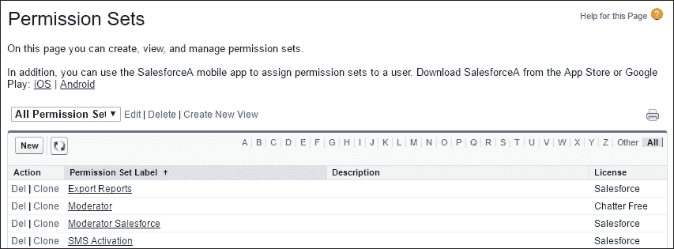

# 第二章：管理用户和控制系统访问

在上一章中，我们讨论了用户身份验证以及 Salesforce 应用程序如何授权用户登录访问。我们介绍了将配置文件分配给用户的概念，该配置文件可以设置以控制某些权限。我们看到的用户配置文件登录权限是对登录时间和 IP 地址的限制，这些限制可以让你控制用户何时以及从哪里登录 Salesforce 应用程序。

本章中，我们将更详细地查看如何管理用户，并理解 Salesforce CRM 应用程序中如何使用一些关键的配置文件设置。

我们将开始了解用户的配置文件如何控制访问对象，并管理该用户可以使用哪些功能。

本章除了配置文件外，还开始关注记录共享的概念，并提供对 Salesforce 中共享功能的高级概述。它还描述了这些功能如何控制用户对记录的访问。

最后，你将会遇到一些关于 Salesforce CRM 管理的关键特性的问题，特别是在用户设置方面，本章对此进行了覆盖。

我们现在将开始查看以下内容：

+   记录所有权、配置文件和共享的介绍

+   管理 Salesforce 中的用户

+   控制系统访问

+   以另一个用户身份登录

+   Salesforce.com 健康检查

+   测试你知识的问题

# 记录所有权、配置文件和共享的介绍

在查看管理用户的功能之前，我们先简要介绍 Salesforce CRM 中记录所有权、配置文件和共享的概念。

## 记录所有者

术语“记录所有者”在 Salesforce 中随处可见，对于每个数据记录，只有一个且唯一的记录所有者。

只有在 Salesforce 中处于活动状态的用户才能被分配记录。

当用户在 Salesforce CRM 中被标记为非活动时，他/她将无法再访问应用程序。然而，该非活动用户拥有的任何记录仍会保留在应用程序中，并继续显示该非活动用户为记录的所有者。

记录所有者设置通常决定该记录是否可以被组织内的其他用户访问，并通过配置文件或共享设置启用。

## 配置文件和共享

配置文件、共享和可选的角色层次结构设置共同作用，在为用户设置记录所有权和数据访问时，应作为一个整体考虑。用户、配置文件和共享设置之间关系的概览如下图所示：

Salesforce 中的所有用户必须分配一个配置文件。配置文件是一种控制机制，用于确定用户可以执行哪些操作、可以访问哪些数据以及可以对这些数据执行哪些操作。

所有用户都与 Salesforce 中的共享机制相关联，这些机制决定了用户可以访问的实际记录。控制记录访问级别可以通过多种选项来实现，从组织级别设置的默认共享，到角色层级，再到使用高级共享机制。用户不必在 Salesforce 中分配角色。

共享规则简要概述如下，稍后本书将详细介绍。

### 配置文件

配置文件的一些关键控制项包括确定为用户指定的许可类型、任何登录时间或 IP 地址限制，并控制对对象的访问。如果用户的配置文件没有设置适当的对象级权限，该用户将无法在应用程序中访问该对象类型的记录。

配置文件永远不会覆盖您组织的共享模型或角色层级。例如，可以将配置文件设置为允许用户创建、编辑和删除潜在客户。但是，如果您的组织的潜在客户共享模型是只读的，则具有此配置文件的用户将无法编辑或删除其他用户的潜在客户。

在第三章，*配置对象和应用*，我们将详细了解配置文件控制的功能，包括标签、对象级安全性、字段级安全性、Apex/Visualforce 页面可访问性、控制台布局、应用选择以及管理和普通用户权限。

Salesforce 中有两种类型的配置文件：标准配置文件和自定义配置文件，每个标准或自定义配置文件都严格对应一种用户许可类型。

标准配置文件和自定义配置文件在本质上相似，不同之处在于，标准配置文件无法应用以下类型的设置：管理权限、普通用户权限和对象级权限，尤其是 **密码永不过期** 设置，这意味着用户在一段时间后无需更改密码（这是密码策略的一部分，稍后会描述）。因此，如果您希望启用这些功能，必须创建自定义配置文件或使用权限集（稍后在本章中会介绍）。

有多种标准配置文件类型，例如：

+   合同经理

+   营销用户

+   解决方案经理

+   标准用户

+   系统管理员

#### 合同经理

合同经理配置文件通常用于管理合同并覆盖预测。

#### 营销用户

营销用户配置文件通常用于管理活动、导入潜在客户和管理公共文档。拥有此配置文件的用户可访问与标准用户配置文件相同的功能。

#### 解决方案经理

解决方案经理配置文件通常用于发布和审查解决方案。拥有此配置文件的用户可访问与标准用户配置文件相同的功能。

#### 标准用户

标准用户配置文件用于创建和编辑主要类型的记录。该配置文件还允许用户运行报告并查看组织的设置。值得注意的是，该配置文件可以查看但不能管理活动。该配置文件可以创建但不能审查解决方案。

#### 系统管理员

系统管理员配置文件用于配置和自定义应用程序。拥有此配置文件的用户可以访问所有不需要额外许可证的功能。例如，系统管理员不能管理活动，除非他们也拥有市场营销用户许可证。

### 注意

标准配置文件有其用途，但明智的做法是限制克隆它们来创建自定义配置文件，因为在新版本发布时，Salesforce 已知会更改标准配置文件的设置，这可能会导致任何分配该配置文件的用户出现不希望的结果。

### 共享

共享设置控制整个组织中每个对象的默认访问权限。每个对象的共享规则可以授予超出默认共享设置的访问权限，但不能限制访问权限。默认共享设置如下：

+   **由父级控制**

+   **私有**

+   **公开只读**

+   **公开读/写**

+   **公开读/写/转移**

+   **公开完全访问**

+   **使用层级授权访问**

当启用**使用层级授权访问**设置时，记录所有者的角色决定整个组织的可见性。层级中较高角色的用户将对低级别角色用户拥有的所有记录具有完全访问权限（查看/编辑/删除）。

如果未启用“使用层级授权访问”，所有角色将被平等对待，无论层级如何。

### 注意

**使用层级授权访问**仅适用于自定义对象，因为标准对象无法禁用此功能。

#### 角色

角色是共享规则中的主要元素。用户可以根据他们对数据的访问需求，将其按角色层级分组。并不需要为每个用户的职位创建一个角色。

角色在整个应用程序中都可以访问，并且在报告中尤为重要。例如，如果你有两个部门，运营部和销售部，你可以对这两个角色进行比较报告。

角色通常会向另一个角色汇报，并用于维护角色层级。它是与层级相关的一对多层级关系，允许经理查看汇报给他们的用户的数据。任何角色级别的用户总是能够查看、编辑和报告所有由其下级用户拥有或共享的数据。

### 注意

你可以为你的组织创建最多 500 个角色。

角色层级不需要与组织图表完全匹配。相反，层级中的每个角色应代表用户所需的数据访问级别。

#### 权限集

权限集允许您进一步控制您组织中用户的系统访问权限。它们可以看作是一种微调选定个人权限的方式，并以类似设置个人资料的方式启用访问权限。

### 注意

**权限集**允许您授予进一步的访问权限，但不会限制或拒绝访问权限。

虽然一个用户只能有一个个人资料，但您可以为用户分配多个权限和权限集。例如，您可以创建一个叫做**转换潜在客户**的权限，该权限提供转换和转移潜在客户的功能，并将其分配给一个没有提供潜在客户转换的个人资料的用户。您还可以创建一个叫做**编辑联系人**的权限，并将其分配给一个没有提供联系人编辑权限的个人资料用户。您还可以将这些权限分组到一个权限集中，从而创建类似个人资料的权限，而无需创建或克隆完整的个人资料，这通常是不必要的。

### 注意

您可以为您的组织创建最多 1,000 个权限集。

**权限集**是为您的用户应用系统访问的理想机制，它不会影响所有具有相同个人资料的其他用户，也无需创建一次性的个人资料，这样可以减少维护量。

**权限集**的常见用途是向个人授予额外的权限，这些权限除了个人资料中列出的设置外，不会更改个人资料。例如，提供比当前个人资料允许的更多权限。

#### 创建权限集

要创建（或克隆）**权限集**，请导航到**设置** | **管理用户** | **权限集**。

### 注意

当您克隆一个现有的权限集时，新的权限集将拥有与其克隆来源相同的用户许可证和启用的权限。

要创建一个新的**权限集**，请点击**新建**，如下所示的截图：

现在输入**标签**、**API 名称**和**描述**。

### 注意

如果您计划将权限集分配给所有具有相同类型用户许可证的用户，最佳做法是将该用户许可证与权限集关联。然而，如果您计划将权限集分配给当前有不同许可证（或将来可能有不同许可证）的用户，最好创建一个组织范围的权限集。

要继续创建权限集（如前所述），请选择**用户许可证**，或者选择**无**选项（创建一个组织范围的权限集）。最后，点击**保存**，如下所示的截图：

### 注意

当您克隆一个现有的权限集时，新的权限集将拥有与其克隆来源相同的用户许可证和启用的权限。

# 个人资料和权限集摘要

通常，权限和访问设置可以在配置文件级别和个别用户权限集级别指定。尽管某些权限和访问设置只能在配置文件中指定。可以在下表中查看在**配置文件**和**权限集**中可用的权限和设置类型：

| **权限/设置类型** | **在配置文件中可用** | **在权限集中可用** |
| --- | --- | --- |
| 分配的应用程序 | 是 | 是 |
| 标签设置 | 是 | 是 |
| 记录类型分配 | 是 | 是 |
| 页面布局分配 | 是 | 否 |
| 对象权限 | 是 | 是 |
| 字段权限 | 是 | 是 |
| 用户权限（应用和系统） | 是 | 是 |
| Apex 类访问 | 是 | 是 |
| Visualforce 页面访问 | 是 | 是 |
| 外部数据源访问 | 是 | 是 |
| 服务提供商访问 | 是 | 是 |
| 自定义权限 | 是 | 是 |
| 桌面客户端访问 | 是 | 否 |
| 登录小时 | 是 | 否 |
| 登录 IP 范围 | 是 | 否 |

# 在 Salesforce CRM 中管理用户

您组织中所有具有访问 Salesforce CRM 权限的用户都需要一个用户名、电子邮件地址、密码、配置文件以及一个有效的用户许可证。

根据您的组织购买的功能，您可能会有诸如营销、服务云和移动等用户选项，这些选项为特定用户提供访问仅在特定用户许可证下可用的其他功能的权限。用户可以被分配到一个或多个这些选项。

您还可以通过应用适当的许可证，创建并管理您组织外部的其他类型用户，这些许可证提供对 Salesforce 组织的有限访问权限，详细内容将在本章后面介绍。

与用户许可证相关，您可以使用配置文件设置或共享功能中提供的选项来管理所有用户对数据的访问。

配置文件设置控制对应用程序和对象的访问，而共享功能控制对特定记录的访问。

要导航到用户详细信息页面，请转到**设置** | **管理用户** | **用户**。

用户详细信息页面显示您组织中所有用户的列表，以及任何门户用户：

要显示过滤后的用户列表，请从**查看**下拉列表中选择预定义的列表，或者点击**创建新视图**来定义您自己的自定义视图。

例如，您可以创建一个搜索条件为**最后登录**、**小于**、`过去 28 天`的视图，以显示过去 28 天未登录的所有用户，如下图所示：

作为 Salesforce CRM 的系统管理员，您可以执行各种用户管理操作，例如创建新用户、重置密码，甚至将用户管理任务委派给您组织中的其他用户。以下是将涉及的用户操作列表：

+   创建新用户

+   查看和编辑用户信息

+   密码管理

+   会话管理

+   以另一个用户身份登录

+   创建自定义用户字段

## 创建新用户记录

创建新用户的步骤如下：

1.  点击**新用户**。

1.  输入**基本信息**和**地区设置**部分的字段。

1.  勾选框，**生成新密码并立即通知用户**。

1.  保存新用户详细信息。

要为您的组织创建新用户，请导航至用户详细信息页面。此页面显示组织中所有用户的列表。要导航至**新用户**页面，请进入**设置** | **管理用户** | **用户**。然后点击**新用户**按钮。

查看页面的顶部部分，您将看到如以下截图所示的**基本信息**部分：

必填用户信息通过一个条形标识，要求输入用户的**姓氏**、**电子邮件**地址、**用户名**、**用户许可证**和**个人资料**。

### 注意

用户的密码长度不得超过 16,000 字节。

电子邮件地址自动成为用户名，但在保存之前，您可以根据需要更改它。

### 注意

您可以将用户电子邮件地址的域名限制为一个值列表，例如`xxx@WidgetsXYZ.com`、`yyy@CompanyXYZ.com`等。之后，尝试将用户电子邮件地址设置为未列出的域（例如`xxx@MyNonCompanyWebMail.com`）将导致错误。

用户电子邮件地址的域名限制功能只能通过向 Salesforce 客户支持请求启用。此外，选择用户许可证时，请注意，根据您选择的许可证类型，某些进一步的选项将变得不可用。例如，**营销用户**和**允许预测**选项对于[Force.com](http://Force.com)用户许可证不可用，因为对于该许可证的用户，**预测**和**营销活动**选项卡无法访问。

### 注意

您应考虑输入的用户名。用户名保存后，它将成为整个[Salesforce.com](http://Salesforce.com)宇宙中的唯一设置，因此您不能在任何其他 Salesforce CRM 组织中使用相同的用户名。

您可以选择不同的复选框，为用户提供额外的功能或选项。通过选择以下示例复选框中的一个或多个，您可以获得不同类型的附加功能：

+   **营销用户**

+   **离线用户**

+   **知识用户**

+   **Force.com 流程用户**

+   **服务云用户**

+   **Site.com 发布者用户**

+   **Salesforce CRM 内容用户**

如果您的用户许可证类型不支持这些功能，您将无法选择这些功能。此外，如果您没有剩余许可证，您将无法保存新用户记录。

在**新用户**编辑页面的底部，有其他部分，包括如以下截图所示的**地区设置**部分：

### 保存新用户记录

填写必填信息（以条形显示），然后勾选**立即生成新密码并通知用户**复选框，并通过点击**保存**按钮保存详细信息。保存后，用户的登录名和临时密码将通过[Salesforce.com](http://Salesforce.com)发送到新用户的电子邮箱。

### 提示

**垃圾邮件文件夹**

如果你已生成了要发送的新密码，但新用户无法在其收件箱中看到来自[Salesforce.com](http://Salesforce.com)的电子邮件通知，可能需要让用户检查他的垃圾邮件文件夹。

下表列出了主要标准用户字段，其中以粗体显示的是必填字段：

| **名字** | **姓氏** | **别名** | **电子邮件** | **用户名** |
| --- | --- | --- | --- | --- |
| 社区昵称 | 职位 | 公司 | 部门 | 部门 |
| 角色 | 用户许可 | 配置文件 | 活动 | 授予结账访问权限 |
| 营销用户 | 离线用户 | 知识用户 | 服务云用户 | 移动用户 |
| 移动配置 | 可访问模式 | 图表中的色盲调色板 | Salesforce CRM 内容用户 | 接收 Salesforce CRM 内容电子邮件警报 |
| 接收 Salesforce CRM 内容警报作为每日摘要 | 允许预测 | 呼叫中心 | 电话 | 分机 |
| 传真 | 手机 | 电子邮件编码 | 员工编号 | 邮寄地址字段 |
| **时区** | **区域设置** | **语言** | 委托审批者 | 经理 |
| **接收审批请求电子邮件** | 新闻通讯 | 管理员新闻通讯 | 开发模式 | 发送 Apex 警告电子邮件 |

### 查看新用户记录

保存**用户编辑**页面后，系统会展示该用户的详细页面，你可以查看所输入的信息，具体如以下截图所示：

### 提示

**不要用新用户数据覆盖活动或非活动用户记录：**

Salesforce 不推荐用新用户数据覆盖非活动用户记录。这样做会妨碍你跟踪过去用户的历史记录及其相关记录。

也有一些情况你可能觉得合适回收一个活动的用户记录，但当用户不再使用 Salesforce 时，最好是将用户禁用，并为每个新用户创建一个新的记录。

回收用户记录的一个典型现实世界示例，且应避免的是，销售团队有时会按销售区域组织。

Salesforce 中的销售团队用户记录上会标有区域指示符，任何位于他们特定区域内的账户记录会被分配给该用户记录（设置为记录所有者）。这样，用户记录仅作为该区域的容器。

以这种方式管理用户记录会导致审计和维护问题。例如，如果蒂娜·福克斯更改了销售领土，她的个人信息（用户名、密码、电子邮件地址、电话号码等）都必须转移到新的用户记录中，要求蒂娜重新激活新密码，重新输入她的个人信息以及所有个人偏好设置到 Salesforce 应用程序中。

如果蒂娜正在重新分配的用户记录（或领土）由比如说蒂莫西·利特尔持有，那么问题会加重，因为他也需要重置个人信息。

这种方法会导致领土重新分配变得技术复杂，同时也会给你的销售团队带来非常令人失望的用户体验。幸运的是，Salesforce 提供了基于标准的共享规则、销售团队和领土管理等功能，来更好地管理销售领土的组织。

## 添加多个用户

如果你有多个用户需要添加，可以一次性添加多个用户。

要添加多个用户，请导航到**设置** | **管理用户** | **用户**。然后点击**添加多个用户**按钮。

这是一个两步过程：首先选择用户许可类型，然后你将看到多个部分，用来添加新用户的详细信息。如以下截图所示，这可以是创建用户的快速方法，因为在这个过程中并不需要输入所有的必填字段：

然而，如果在首次保存多个用户记录后，你尝试通过用户编辑页面编辑某个用户记录，你将被提示填写所有必填字段。

## 用户管理的委托

如果你的组织拥有大量用户或复杂的角色层级结构，你可以将用户管理的某些方面委托给没有被分配系统管理员角色的用户。

这使你可以将注意力集中在公司在 Salesforce 中的每个部门或结构的管理任务之外。这对于遇到时区和文化差异的全球组织提供了额外的好处，因为它允许位于该地区、具有本地知识的用户来创建用户，从而节省时间并提供更好的用户体验。

例如，你可能希望允许亚太区运营团队的经理创建和编辑“亚太区运营团队负责人”角色及所有下属角色的用户。

目前有两种方式可以提供这种委托的用户管理权限：

+   创建一个具有“管理用户”权限的个人资料

+   使用委托管理

## 创建一个具有“管理用户”权限的个人资料

这个选项不推荐使用，应该非常谨慎地考虑，因为它允许用户执行更广泛的系统管理功能。

除了创建和管理用户外，**管理用户**权限还允许用户执行以下操作：

+   使所有密码过期

+   克隆、编辑或删除个人资料

+   编辑或删除共享设置

+   编辑用户登录时间

通过为用户提供**管理用户**权限，正如您所看到的，许多其他权限也被启用，这会引入安全风险。

## 使用委托管理

委托管理是一种更安全的提供委托用户管理访问的方法，因为它允许您将有限的管理权限分配给组织中选定的非管理员用户。

委托管理员可以执行以下任务：

+   创建和编辑用户，并为指定角色和所有下级角色的用户重置密码

+   将用户分配到指定的配置文件

+   以其他用户身份登录

要创建委托组，请导航到**设置** | **安全控制** | **委托管理**。现在点击**新建**按钮或选择现有委托管理组的名称。以下截图显示了**管理委托组**页面：

这是已命名为“用户管理”的现有组的截图：

**委托管理员**部分允许您选择并添加将被授予委托管理权限的用户。

**用户管理**部分允许您选择并添加角色，委托管理员可以将这些角色分配给他们创建和编辑的用户。他们可以为指定的角色及其所有下级角色分配用户。

**可分配的配置文件**部分允许您选择并添加委托管理员可以分配给他们创建和编辑的用户的配置文件。

**可分配的权限集**部分允许您选择并添加**权限集**，这些权限集可以由委托管理员分配给他们创建和编辑的用户。

**可分配的公共组**部分允许您选择并添加**公共组**，这些公共组可以由委托管理员分配给他们创建和编辑的用户。

为了加强安全性，具有“修改所有数据”权限的配置文件（如系统管理员配置文件）不能由委托管理员分配。请参见以下示例消息，当尝试允许委托管理员分配**系统管理员**配置文件时显示：

### 提示

如果一个用户是多个委托管理组的成员，请注意他/她可以将任何可分配的配置文件分配给他/她能够管理的角色中的任何用户。

如果您希望允许此组中的委托管理员以已授予登录权限的用户身份登录，并且该用户位于为委托管理员组选择的角色中，请选择**启用登录访问的组**选项。

要查看用户如何授予管理员登录权限，请参考本章末尾的*作为其他用户登录*部分。

### 提示

**委派用户管理员使用活动用户许可证的协议：**

如果您在组织中建立了委派的用户管理，您需要与委派的用户管理员达成协议，决定每个组织领域可以使用多少可用许可证。您无法自动限制具有这些权限的用户可以创建的活动用户数量。

# 查看和编辑用户信息

要查看或编辑用户信息，请导航到**设置** | **管理用户** | **用户**。然后，点击用户姓名旁边的**编辑**，更改必要的信息并点击**保存**。

用户也可以在登录后更改或添加自己的个人信息。

如果您更改了用户的电子邮件地址，并且没有选择**立即生成新密码并通知用户**选项，则会向您输入的新电子邮件地址发送确认消息，以验证电子邮件地址的更改。用户必须点击该消息中提供的链接，才能使新的电子邮件地址生效。

如果您在更改用户电子邮件并同时重置密码时，新的密码将自动发送到用户的新电子邮件地址，无需电子邮件验证。

点击**解锁**以解锁被 Salesforce 锁定的用户。

### 注意

**解锁**按钮仅在用户因超过最大错误密码登录尝试次数而被锁定时可用。

## 搜索用户

您可以使用搜索功能（在上一章中已描述）来搜索组织中的任何用户，无论该用户的状态如何。但是，在从记录中的字段使用查找对话框时，搜索结果仅返回活动用户。

### 禁用用户

您无法从系统中移除用户，但可以禁用他们的记录，使其无法再访问应用程序。

要禁用用户，请导航到**设置** | **管理用户** | **用户**。然后，点击用户姓名旁边的**编辑**，取消选中**活动**复选框，然后点击**保存**。

如果该用户是帐户、销售或案例团队的成员，系统会提示您将该用户从这些团队中移除：

在禁用用户时，应该考虑一些事项，例如：

+   如果禁用的用户在仪表板上设置了**以指定用户身份运行**的依赖关系，将导致这些仪表板停止显示。每个仪表板都有一个运行用户，其安全设置决定了仪表板中显示哪些数据。您需要将**以指定用户身份运行**重新分配给具有适当权限的活动用户。

+   如在第一章中提到的，*设置 Salesforce CRM 和公司概况*，在许可信息部分，Salesforce 按总许可证数量而不是活跃用户数量对组织进行计费。

+   如果启用了**Chatter**并且已将用户包含在**Following**或**Followers**列表中，并且用户被停用并从列表中删除，但如果用户重新激活，他/她将被恢复到列表中。

### 注意

停用作为批准流程的显式包含的用户，详情请参见第七章, *在 Salesforce CRM 中实施业务流程*, 这将导致批准步骤失败。

# 冻结用户帐户

此功能允许您冻结用户记录。通常有时您可能不希望立即停用用户（例如，当用户参与批准流程时），但在执行停用步骤时必须阻止他们登录到您的组织（例如，他们已离开公司），。

要冻结用户记录，请转到**设置** | **管理用户** | **用户**。现在，单击用户姓名以访问其用户详细信息页面。现在点击**冻结**按钮。

# 密码管理

您有以下选项来为 Salesforce CRM 中的用户重置密码：

+   重置密码

+   过期密码

## 重置密码

如果用户忘记了密码，他们可以单击 Salesforce CRM 登录页面上的**忘记密码？**链接，该页面会显示一个屏幕以输入他们的用户名，如下图所示：

然后，用户将收到一封来自 Salesforce 的电子邮件，其中包含一个新密码链接，要求他们回答先前设置的安全问题，例如**您出生在哪里？**，然后才能重置密码并登录到 Salesforce。

要重置用户的密码，请转到**设置** | **管理用户** | **用户**。现在选中用户姓名旁边的复选框。

可选择地，要更改当前显示用户的密码，请选中列头部的复选框以选择所有行。

单击**重置密码**以将新密码通过电子邮件发送给用户。

### 注意

重置用户密码后，某些用户可能需要重新激活他们的计算机才能成功登录 Salesforce（参见上一章节）。

## 过期密码

您可以随时为所有用户过期密码，以增强组织的额外安全性。在您过期密码后，用户可能需要激活他们的计算机才能成功登录 Salesforce（参见上一章节）。

### 注意

如果系统管理员的个人资料（或权限集）中没有设置**密码永不过期**，则也包括系统管理员。然而，标准的系统管理员个人资料默认启用了**密码永不过期**设置。

要使所有用户的密码过期，除了具有**密码永不过期**权限的用户外，请导航到**设置** | **安全控制** | **使所有密码过期**。然后，选中**使所有用户密码过期**复选框，并点击**保存**。

下次每个用户登录时，他们将被提示重置密码。

### 注释

在使密码过期之后，一些用户可能需要重新启动他们的计算机才能成功登录到 Salesforce（参见前一章节）。

# 控制系统访问

Salesforce 提供了几项功能，允许你控制用户访问你实例中的 Salesforce CRM。这里，我们将查看你可以设置的关键控制机制和访问策略。

## 密码策略

有多项密码和登录策略功能，可以帮助你提高组织的安全性。要设置这些密码策略，请导航到**设置** | **安全控制** | **密码策略**。选择所需的设置后，点击**保存**。

让我们来看看以下截图中显示的每个密码策略：

## 用户密码过期期限

你组织中所有用户的密码过期期限由选择项**用户密码过期时间为**来设置。

这设置了所有用户密码到期并需要更改的时间长度。具有**密码永不过期**权限的用户不受此设置的影响。

### 注释

可选项包括**30 天**、**60 天**、**90 天**、**180 天**、**一年**以及**永不过期**。

## 强制密码历史记录

此设置用于记住用户的历史密码，以确保他们必须始终输入一个未曾使用过的密码。密码历史记录在你设置此值之前不会被保存。除非你在**用户密码过期时间为**字段选择**永不过期**选项，否则无法选择**不记住密码**选项。

### 注释

可选项是**不记住密码**或记住 1 到 24 个密码之间的数字。

## 密码最小长度

这设置了密码所需的最小字符数。当你设置此值时，现有用户不会受到影响，直到他们下次更改密码。

### 注释

可以设置一个介于 5 到 50 个字符之间的数字值。

## 密码复杂度要求

这设置了密码中必须使用哪些类型字符的限制。以下是可用的选项：

+   **无限制**：此选项不对创建密码有任何要求

+   **必须混合字母和数字**：此选项要求至少有一个字母字符和一个数字

+   **必须混合字母、数字和特殊字符**：此选项要求至少包含一个字母字符、一个数字字符和以下任意一个特殊字符：! # $ % - _ = + < >

+   **必须混合数字和大小写字母**：此选项要求至少包含一个数字、一个大写字母和一个小写字母。

+   **必须混合数字、大小写字母和特殊字符**：此选项要求至少包含一个数字、一个大写字母和一个小写字母，以及以下任意一个特殊字符：! # $ % - _ = + < >

### 注释

**必须混合字母和数字**选项是默认选项。

## 密码问题要求

此设置要求用户在回答密码提示问题时，答案中不包含密码本身。

### 注释

可选项为**不得包含密码**，这意味着密码提示问题的答案不能包含实际密码；或**无**，这是默认设置，表示答案没有任何限制。

## 最大无效登录尝试次数

该设置决定用户在被锁定之前允许的无效登录尝试次数。可选项有**无限制**、**3 次**、**5 次**和**10 次**。

### 注释

默认的无效登录尝试次数为**10**次。

## 锁定有效期

该设置定义了登录锁定的持续时间。可选项为**15 分钟**、**30 分钟**、**60 分钟**和**永远**（必须由管理员重置）。

### 注释

默认的锁定有效期为**15 分钟**。

如果用户被锁定，他/她可以选择等待锁定有效期结束，或者你可以查看用户信息并点击**解锁**。只有在用户被锁定时，**解锁**按钮才会显示。

## 隐藏密码重置的答案

该选项隐藏用户在回答安全问题时输入的答案。默认选项未选中，会在用户回答安全问题时（例如重置密码时）以明文显示答案。

## 要求密码至少有一天的使用寿命

选中此选项后，用户每 24 小时内只能更改一次密码。默认选项未选中，允许用户随时更改密码。

## 忘记密码或账户锁定帮助

以下部分讨论可用选项：

### 消息

通过设置此消息，文本将在用户需要你重置密码时收到的锁定电子邮件中显示。用户还将在确认身份屏幕和密码重置后的电子邮件中看到该消息文本。此功能有助于添加你的联系方式和个人消息。

### 帮助链接

设置此链接后，选项上方的文本将作为网页 URL 显示，点击后用户将导航到一个独立的页面，如你提供的自定义帮助页面。

### 仅限 API 用户设置

以下部分讨论可用选项：

#### 替代主页

仅 API 用户在确认用户管理更改（例如重置密码）后将被重定向到此 URL。这是用来确认更改的一种方式，因为具有**仅 API 用户**配置文件或权限设置的用户无法通过用户界面访问 Salesforce，因此无法收到视觉确认。

# 会话管理

有多个会话安全功能帮助你提升组织的安全性。这些功能包括设置会话过期超时、将会话锁定到会话源 IP 地址，以及其他组织级的会话设置。要设置这些会话选项，请导航到**设置** | **安全控制** | **会话设置**。

按照以下截图选择所需的设置，然后点击**保存**。

让我们来看看每个会话安全功能。

# 会话超时

以下是设置会话超时的各种功能：

## 超时值

这设置了在不活动用户自动退出系统后的时间长度。

### 注意

选项范围在**15 分钟**到**12 小时**之间。作为系统管理员，你需要平衡用户满意度和安全控制的要求，但建议选择尽可能短的超时时间，以保护敏感信息并加强安全性。

最后一次活动会话的值在超时期间过半时才会更新。因此，如果你的超时设置为 2 小时，系统会在经过 1 小时后才会检查是否有活动。例如，如果你在 30 分钟后更新了一条记录，那么最后一次活动会话值不会更新，因为在 1 小时后没有活动，因此你仍将在再过 1 小时 30 分钟后被注销，因为最后一次活动会话没有被更新。

## 禁用会话超时警告弹窗

这设置了是否向不活动用户显示超时警告信息。用户会在会话超时前 30 秒收到警告，警告时间依据**超时**值设置。

## 会话超时强制登出

启用此选项会使不活动的用户在会话超时后刷新浏览器，并重定向到[Salesforce.com](http://Salesforce.com)登录页面。

### 注意

建议在启用**会话超时强制登出**功能时，不选择**禁用会话超时警告弹窗**，因为这可能会让用户在没有明显原因的情况下感到困惑，导致他们被注销。

## 会话设置

有多个功能用于按以下部分设置会话。

## 将会话锁定到来源 IP 地址

此选项用于指定是否将用户的会话锁定到他们登录时所使用的 IP 地址。

### 注意

启用此选项有助于防止未经授权的人员劫持有效的用户会话。

## 锁定会话到最初使用的域

此设置将用户的当前会话与特定域关联，以防止在另一个域中未经授权使用该会话 ID。

### 注意

此设置适用于用户通过用户界面登录，并且从 Spring '15 版本开始默认启用该设置。

## 需要安全连接（HTTPS）

这将设置是否需要使用 HTTPS（而不是不太安全的 HTTP 连接）来访问 Salesforce。

### 注意

默认情况下启用此选项，仅可通过向 [Salesforce.com](http://Salesforce.com) 支持请求禁用。

## 在“以用户身份登录”后强制重新登录

设置此选项后，当你从登录用户状态退出后，必须重新登录才能重新进入 Salesforce。如果未设置此选项，你将得到原始会话，并且不需要重新登录。

### 注意

默认情况下，从 Summer '14 版本开始，新组织启用此选项。

## 需要 HttpOnly 属性

设置此选项限制对会话 ID Cookie 的访问。这样做的效果是，具有 **HttpOnly** 属性的 Cookie 无法通过非 HTTP 调用（如自定义应用程序或封装应用程序中的 JavaScript 方法）访问。

### 注意

设置此选项会导致使用 JavaScript 调用会话 ID Cookie 的自定义或封装应用程序无法正常工作，因为它们无法访问会话 Cookie。

## 对跨域会话使用 POST 请求

此选项设置组织在跨域交换过程中使用 `POST` 请求发送会话信息，而不是使用 `GET` 请求，例如调用 Visualforce 页面时，Visualforce 页面位于与标准 Salesforce CRM 页面不同的 URL 上。

### 注意

`POST` 请求比 `GET` 请求更安全，因为在这种情况下，会话信息在请求的主体中。

## 在每次请求时强制执行登录 IP 范围

此设置影响具有登录 IP 限制的用户配置文件，这些配置文件仅允许在 **登录 IP 范围** 设置内的 IP 地址访问 Salesforce。

如果未设置此选项，则仅在用户登录 Salesforce 时验证登录 IP 范围。当启用此设置时，每个页面请求都会强制执行登录 IP 范围。

# 缓存

设置登录页面缓存和自动填充功能，将用户的登录信息（仅用户名列表，但不包含密码）存储在以下部分中。

## 启用登录页面的缓存和自动填充

设置此选项后，用户的浏览器会存储用户名文本，因此在他们首次登录后，用户名会自动填充到登录页面的**用户名**字段中。

### 注意

默认情况下启用此选项。

## 启用安全和持久的浏览器缓存以提高性能

此选项激活浏览器中的数据缓存，这是安全的，有助于提高页面重新加载性能（通过避免额外的服务器往返请求）。

### 注意

Salesforce 建议启用此选项，并且默认启用。

## 启用用户切换

用户切换器功能允许具有多个用户名的用户在同一或不同 Salesforce 实例之间切换用户名。通过选择他们的个人资料图片，可以查看所有可以切换到的用户名。

此选项控制用户选择个人资料图片时是否显示或隐藏用户切换器。取消选中此选项将隐藏用户切换器，并且也会隐藏 Salesforce 实例在其他实例中的用户切换器。

### 注意

此设置默认启用，但仅在 Lightning Experience 中可用。此外，必须启用**在登录页面启用缓存和自动完成功能**设置。

## 记住我，直到注销

如果用户选择了**记住我**复选框或会话处于活动状态，用户名会被缓存。然而，当使用**单点登录**（**SSO**）进行登录时，**记住我**复选框不可用。因此，当会话过期时，用户名将不再出现在登录界面或用户切换器中。

启用此选项后，缓存的用户名仅在用户特意注销时才会删除。如果会话超时，用户名仍会保留在用户切换器中，但会被设置为不活动状态。

### 注意

此选项默认禁用。Salesforce 建议启用此选项，因为它对用户有帮助。

# 身份验证

设置身份验证确认的功能，允许进一步机制扩展电子邮件确认的标准使用，如下所示

## 启用短信身份验证方法

此选项启用用户接收一次性 PIN，通过短信接收。一旦启用，用户必须验证其手机号码才能使用此功能。

### 注意

此选项默认启用，只有通过向[salesforce.com](http://Salesforce.com)支持请求才能禁用。

## 要求为来自调用（API 版本 31.0 及更早版本）的 API 登录提供安全令牌

在 API 版本 31.0 及更早版本中，来自调用（如 Apex 或 AJAX 代理调用）的 API 登录需要安全令牌。

### 注意

在 API 版本 32.0 及更高版本中，默认情况下需要来自 Apex 调用、AJAX 代理调用等的 API 登录安全令牌

## 允许使用 Salesforce Authenticator 进行基于位置的自动化验证

此选项允许您禁用使用*Salesforce Authenticator*移动应用进行的基于位置的自动化验证。当启用时，用户可以通过自动批准*Salesforce Authenticator*中的通知（在受信任的位置，如家中或办公室）来验证他们的身份。

### 注意

此来自所有位置的自动化验证选项默认启用

### 仅允许来自受信任的 IP 地址

此选项允许您指定，仅允许来自受信 IP 地址的位置使用 Salesforce Authenticator 移动应用进行自动验证。

## Lightning 登录

Lightning 登录是一种增强的安全机制，超越了使用密码的方式。该功能允许用户点击用户名，点击手机设备上的通知进行批准，并使用指纹或 PIN 进行身份验证。

### 允许 Lightning 登录

此选项启用或禁用 Lightning 登录功能，用于验证用户在 Salesforce CRM 中的身份。

### 注意

此选项默认启用，且该功能在 Salesforce Classic 和 Lightning 体验中都受到支持。

## 点击劫持保护

点击劫持（Clickjacking）是一种恶意技术，利用该技术诱使用户点击按钮或链接，从而跳转到不同于用户预期的页面，通常以嵌入式代码或脚本的形式存在，且在用户不知情的情况下执行。以下各节提供了不同的**点击劫持**保护设置功能。

## 为设置页面启用点击劫持保护

此选项增加了安全性，帮助防御 Salesforce 设置页面上的点击劫持攻击。

### 注意

此选项默认启用，且只能通过向[Salesforce.com](http://Salesforce.com)支持团队申请才能禁用。

## 为非设置 Salesforce 页面启用点击劫持保护

此选项增加了安全性，帮助防御非设置 Salesforce 页面上的点击劫持攻击。

### 注意

此选项默认启用，且只能通过向[Salesforce.com](http://Salesforce.com)支持团队申请才能禁用。

## 为启用标准头部的客户 Visualforce 页面启用点击劫持保护

此选项保护启用头部的 Visualforce 页面免受点击劫持攻击。

## 为禁用头部的客户 Visualforce 页面启用点击劫持保护

此选项保护启用头部的 Visualforce 页面免受点击劫持攻击（例如，页面标签中的`showHeader="false"`值）。

# 跨站请求伪造（CSRF）保护

**跨站请求伪造**（**CSRF**）是一种恶意技术，通过该技术构造未经授权的命令（例如通过脚本或页面上的链接）并将其发送给已通过身份验证的网站。

这些选项通过修改非设置页面，将一个随机字符串作为 URL 参数或隐藏的嵌入字段来防御**跨站请求伪造**（**CSRF**）攻击。系统随后会验证该字符串，并且只有当该值与预期值匹配时才会执行命令。以下各节提供了不同的 CSRF 攻击保护设置功能：

## 在非设置页面的 GET 请求上启用 CSRF 保护

**启用非设置页面 GET 请求的 CSRF 保护**选项保护非设置页面上的 GET 请求免受 CSRF 攻击。

此选项默认启用，且只能通过向 Salesforce.com 支持团队申请才能禁用。

## 启用非设置页面上的 POST 请求的 CSRF 保护

**启用非设置页面上的 POST 请求的 CSRF 保护**选项可防止非设置页面上的 POST 请求受到 CSRF 攻击。

默认情况下启用此选项，且只能通过向[Salesforce.com](http://Salesforce.com)支持团队请求来禁用。

# 内容安全策略保护

**内容** **安全** **策略**（**CSP**）是一种安全标准，旨在防止恶意内容在受信任的网页内容中执行。在此部分中设置选项会将此策略应用于 Salesforce 中的关联电子邮件模板。

# 会话安全级别

会话级安全设置用于连接的应用程序、报告和仪表板。在此处，您可以根据用户当前会话的身份验证（登录）方法的安全级别来限制对这些功能区域的访问。您可以通过设置与用户当前身份验证（登录）方法相关联的安全级别来限制对连接应用程序、报告和仪表板的访问；每种登录方法具有两种安全级别之一，分别为标准安全级别或高安全级别。不同的身份验证方法分配了以下安全级别：

+   用户名密码（标准）

+   委托身份验证（标准）

+   激活（标准）

+   两步验证（高安全性）

+   身份验证提供商（标准）

+   闪电登录（标准）

要更改与登录方法相关联的安全级别，请导航到**设置** | **安全控制** | **会话设置**。定位到**会话安全级别**，选择登录方法，然后点击**添加**或**移除**箭头，将其移动到所需的类别，如下图所示：

# 注销页面设置

注销 URL 设置允许您指定一个以`http://`或`https://`开头的 URL，用户在注销 Salesforce 后将被重定向到该 URL。如果未指定注销 URL，用户将被重定向到[`login.salesforce.com`](https://login.salesforce.com)。如果启用了我的域且未指定注销 URL，用户将被重定向到`https://"my-domain".my.salesforce.com`。

# 以另一个用户身份登录

为了帮助其他用户，您可以以另一个用户的身份登录 Salesforce。

要以另一个用户身份登录，请导航到**设置** | **管理用户** | **用户**。然后点击用户记录旁边的**登录**链接，如下图所示：

您还可以通过**用户详细信息**页面上的**登录**按钮以另一个用户身份登录，如下图所示：

以另一个用户身份登录后，您会注意到在所有 Salesforce 页面的右上角显示一条消息，内容为**您当前以以下身份登录**。

要返回到管理员帐户，请单击已登录用户的名称（本示例中为授予您访问权限的用户`Trevor Howard`）。然后点击**注销**选项：

### 注意

无论登录访问政策如何，每当管理员以其他用户身份登录时，登录和注销事件都会记录在设置审计跟踪中。

# 创建帮助用户授予登录访问权限的指南

在许多情况下，您需要以组织中的某个用户身份登录。这可能是为了检查该角色或配置文件的数据访问，或检查报表或仪表盘等。

如果**管理员可以以任何用户身份登录**功能被禁用，您可以通过准备一份操作指南来节省自己和组织中其他用户的时间，而不是一一指示他们如何授予您登录访问权限。以下是一个操作指南示例，列出了他们需要采取的步骤，以进行必要的设置，并显示在下方截图中：

当**管理员可以以任何用户身份登录**功能启用时，用户将不再有选项授予管理员登录访问权限，但仍然可以授予[Salesforce.com](http://Salesforce.com)支持登录访问权限。

如果安装了额外的应用程序，用户可以选择授予访问权限的实体列表可能会增加。例如，如果您的组织安装了 Salesforce.com 基金会发布的非营利入门包应用（见[`www.salesforcefoundation.org/nonprofitstarterpack`](http://www.salesforcefoundation.org/nonprofitstarterpack)），您将看到授予此组织支持团队访问权限的选项，如下图所示：

# 创建自定义用户字段

您可以为用户创建自定义字段，并设置在用户详细信息页面上显示的自定义链接。要访问用户字段页面，请前往**设置** | **自定义** | **用户** | **字段**，然后向下滚动到**用户自定义字段**部分：

`User`对象可以视为 Salesforce 中的一个特殊对象，因为对其可配置内容有一定的限制。例如，`User`对象只能有一个记录类型和页面布局。

# Salesforce.com 健康检查

健康检查功能使您能够查看组织中的关键安全设置，如登录访问政策、密码政策等，并将这些设置与 Salesforce 推荐的安全标准进行比较。

要访问健康检查设置，导航至**设置** | **安全控制** | **健康检查**，您将看到如下所示的页面：

**健康检查**页面显示以下安全控制的实际值和 Salesforce 推荐值：**登录访问策略**；**网络访问**；**密码策略**；远程**站点设置**；**会话设置**。

在页面内，高风险和中风险设置将显示与 Salesforce 推荐（标准）值的比较详情。页面提供链接，您可以在此屏幕内修改任何给定的安全设置，同时显示健康检查得分的摘要，展示您的实例与 Salesforce 推荐的标准基准相比的情况。

## 健康检查得分

如果您的设置组中的所有值都符合或超过标准，您的总得分将显示为 100%，并且符合标准的设置将列在页面底部。

如果您选择更改安全设置，您可以点击页面右上角的**刷新**按钮以更新您的得分。某些设置对您的得分影响较大。例如，**最小密码长度**的权重较重，因此与 Salesforce 推荐的标准基准不匹配的值会降低**健康检查得分**。

### 注意

**健康检查** **得分**是 Salesforce 专有的计算方法，用于衡量您的安全设置与 Salesforce 基准标准的对比情况。组织中被认为存在风险的设置会降低您的得分，而符合或超过标准的设置则会提高得分。

## Salesforce 基准标准

以下表格显示了符合 Salesforce 基准标准的设置和风险值。

| **组** | **设置** | **标准值** | **中风险值** | **高风险值** |
| --- | --- | --- | --- | --- |
| 登录访问策略 | 管理员可以以任何用户身份登录 | 取消选中复选框 | 选中复选框 | 不适用 |
| 网络访问 | 信任的 IP 范围 | 设置了一个或多个范围 | 未设置范围 | 不适用 |
| 密码策略 | 用户密码过期时间 | 90 天或更短 | 180 天 | 一年或永不过期 |
| 强制密码历史记录 | 记住 3 个或更多密码 | 记住 1 个或 2 个密码 | 不记住密码 |   |
| 最小密码长度 | 8 | 6 或 7 | 5 或更少 |   |
| 密码复杂度要求 | 必须混合字母、数字和特殊字符，或更复杂 | 必须混合字母和数字字符 | 无限制 |   |
| 密码问题要求 | 不能包含密码 | 无 | 不适用 |   |
| 最大无效登录尝试次数 | 3 | 5 | 10 或无限制 |   |
| 锁定生效时间 | 15 分钟或永久（必须由管理员重置） | 30 或 60 分钟 | 不适用 |   |
| 隐藏密码重置的密保答案 | 选中复选框 | 取消选中复选框 | 不适用 |   |
| 要求最短 1 天密码生命周期 | 选中复选框 | 取消选中复选框 | 不适用 |   |
| 会话设置 | 超时值 | 2 小时或更少 | 4、8 或 12 小时 | 不适用 |
| 禁用会话超时警告弹窗 | 已选复选框 | 已选复选框 | 不适用 |   |
| 会话超时后强制注销 | 已选复选框 | 取消选中复选框 | 不适用 |   |
| 锁定会话到其来源的 IP 地址 | 已选复选框 | 取消选中复选框 | 不适用 |   |
| 限制会话仅限于首次使用的域 | 已选复选框 | 不适用 | 取消选中复选框 |   |
| 登录后强制重新登录（登录为用户） | 已选复选框 | 不适用 | 取消选中复选框 |   |
| 强制每次请求时都必须进行登录 IP 范围验证 | 已选复选框 | 取消选中复选框 | 不适用 |   |
| 在登录页面启用缓存和自动完成 | 取消选中复选框 | 已选复选框 | 不适用 |   |
| 启用短信身份验证方法 | 已选复选框 | 不适用 | 取消选中复选框 |   |
| 为设置页面启用点击劫持保护 | 已选复选框 | 不适用 | 取消选中复选框 |   |
| 为非设置的 Salesforce 页面启用点击劫持保护 | 已选复选框 | 不适用 | 取消选中复选框 |   |
| 为客户 Visualforce 页面启用标准标题的点击劫持保护 | 已选复选框 | 不适用 | 取消选中复选框 |   |
| 为禁用标题的客户 Visualforce 页面启用点击劫持保护 | 已选复选框 | 不适用 | 取消选中复选框 |   |
| 在非设置页面的 GET 请求上启用 CSRF 保护 | 已选复选框 | 不适用 | 取消选中复选框 |   |
| 在非设置页面的 POST 请求上启用 CSRF 保护 | 已选复选框 | 不适用 | 取消选中复选框 |   |

# 测试您知识的问题

现在，您将面临有关 Salesforce CRM 管理中用户设置的关键功能的问题，这些内容已经在本章中讲解过。答案可以在本章结尾找到。

## 问题

我们提出四个问题来验证您对配置文件、权限集、用户记录和密码策略的理解。

### 问题 1 - 标准配置文件

以下哪项是标准配置文件？（选择所有适用项）：

**a**) 市场营销用户

**b**) 解决方案经理

**c**) 销售用户

**d**) 销售经理

**e**) 标准用户

### 问题 2 - 权限集

权限集控制以下哪些内容？（选择所有适用项）：

**a**) 标签设置

**b**) 字段权限

**c**) 页面布局分配

**d** )记录类型

**e**) 登录时间

### 问题 3 - 用户记录

在哪种情况下可以从 Salesforce 中删除用户记录？（选择一个）：

**a**) 仅当用户记录已被标记为“非活动”时

**b**) 仅当用户尚未登录时

**c**) 从不

**d**) 任何时间

### 问题 4 - 密码策略

以下哪些与密码相关的操作可以由系统管理员执行？（选择所有适用项）：

**a**) 强制要求用户输入包含字母和数字字符的密码

**b**) 设置密码在一定天数后过期。

**c**) 按配置文件类型将给定密码分配给多个用户。

**d**) 防止用户在密码过期后重新使用上一个密码。

**e**) 将密码锁定期设置为永久。

## 答案

以下是关于配置文件、权限集、用户记录和密码策略的四个问题的答案。

### 答案 1 - 标准配置文件

答案是**a**) 营销用户、**b**) 解决方案经理和**e**) 标准用户。

**c**) 销售用户和**d**) 销售经理不是 Salesforce 中的标准配置文件。

### 答案 2 - 权限集

答案是**a**) 标签设置、**b**) 字段权限和**d**) 记录类型分配。

可以通过配置文件设置**d**) 记录类型分配和**e**) 登录时间，但不能通过权限集设置。

### 答案 3 - 用户记录

答案是**c**) 从不。

用户记录可以被停用，但在 Salesforce 中不能被删除。

### 答案 4 - 密码策略

答案是**a**) 强制要求用户输入包含字母和数字字符的密码、**b**) 设置密码在一定天数后过期、**d**) 防止用户在密码过期后重新使用上一个密码、以及**e**) 将密码锁定期设置为永久。

没有功能允许选择**c**) 按配置文件类型将给定密码分配给多个用户。

# 总结

在本章中，我们描述了在 Salesforce CRM 中管理用户的功能。

我们介绍了记录所有权、配置文件和共享的概念，并深入讨论了这些概念如何用于控制用户在应用程序和记录中的权限。

我们查看了如何访问用户信息，管理用户密码的机制，以及设置会话安全性和 Salesforce **健康检查**中功能的选项。

我们讨论了其他帮助管理用户的功能，例如授予管理员登录访问权限和启用委派的用户管理。

最后，我们提出了一些问题，帮助澄清 Salesforce CRM 管理中关于用户设置的关键特点。

在下一章中，我们将详细查看控制数据访问的机制以及提供数据管理和记录共享的功能。
