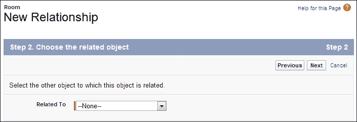
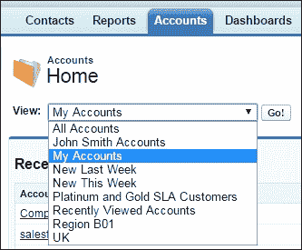

# 第三章：配置对象和应用

在第一章，*设置 Salesforce CRM 和公司配置文件*以及第二章，*管理用户和控制系统访问*中，我们介绍了 Salesforce 中的配置文件功能，它是一个控制机制。配置文件用于确定用户可以执行的功能、可以访问的数据类型以及他们可以在这些数据上执行的操作。

在本章中，我们将详细描述 Salesforce CRM 记录存储功能和可自定义的用户界面，如对象、字段和页面布局。此外，我们还将概述配置文件与这些可自定义功能之间的关系，以及配置文件如何控制这些功能。

本章将探讨配置和定制应用程序的方法，以适应公司信息在 Salesforce CRM 应用程序中最佳展示的方式。我们将通过查看应用、标签、页面布局、记录类型、相关列表和列表视图，了解如何将数据分组并在应用程序中展示。

最后，你将被问到一些关于 Salesforce CRM 管理中标准对象和自定义对象领域的关键特性，这些内容将在本章中讨论。

本章将涵盖以下主题：

+   对象

+   字段

+   对象关系

+   应用

+   标签

+   重命名标准标签、标准对象和标准字段

+   创建自定义对象

+   对象限制

+   创建自定义对象关系

+   创建自定义字段

+   依赖选项列表

+   构建关系字段

+   查找关系选项

+   主从关系选项

+   查找过滤器

+   构建公式

+   基本公式

+   高级公式

+   构建公式 - 最佳实践

+   构建公式文本和编译后的字符大小限制

+   自定义字段治理

+   页面布局

+   基于 Feed 的页面布局

+   记录类型

+   相关列表

# 配置文件与其控制的功能之间的关系

下图描述了配置文件与其控制的功能之间的关系：


配置文件用于：

+   控制对指定用户的许可类型的访问，以及设置的任何登录小时或 IP 地址限制。这在第一章，*设置 Salesforce CRM 和公司配置文件*中有详细介绍。

+   使用角色和共享模型来控制对象和记录的访问。如果用户配置文件中没有设置适当的对象级别权限，则该用户将无法在应用程序中访问该对象类型的记录。这个概念在第二章中介绍，*管理用户和控制系统访问*，并将在第四章中详细讲解，*保护数据访问和数据验证*。

在本章中，我们将介绍与配置文件一起设置的可配置元素。这些元素用于控制 Salesforce CRM 应用程序的结构和用户界面。

# 对象

对象是 Salesforce CRM 中的关键元素，因为它们提供了存储数据的结构，并且被集成到界面中，允许用户与数据进行交互。

与数据库表类似，对象具有以下属性：

+   字段，概念上类似于数据库列

+   记录，概念上类似于数据库行

+   与其他对象的关系

+   可选标签，作为用户界面组件用于显示对象数据

## 标准对象

Salesforce 默认提供标准对象，这些标准对象包括**账户**、**联系人**和**机会**。标准对象将在本章稍后更详细地介绍。

除了标准对象外，你还可以创建自定义对象和自定义标签。

## 自定义对象

自定义对象是你创建的用来存储数据的表格。你可以创建一个自定义对象来存储特定于你组织的数据。一旦你创建了自定义对象并为这些对象创建了记录，你还可以根据自定义对象中的记录数据创建报告和仪表板。

# 字段

Salesforce 中的字段概念上类似于数据库列；它们存储对象记录的数据。对象记录类似于数据库表中的一行。

## 标准字段

标准字段是 Salesforce CRM 应用程序中默认包含的预定义字段。标准字段无法删除，但不要求的标准字段可以在需要时从页面布局中移除。

使用标准字段时，你可以自定义与字段相关的可视元素，如字段标签和字段级帮助，以及某些数据定义，如选项列表值、自动编号字段的格式（自动编号字段用于作为记录的唯一标识符）以及字段历史追踪的设置。然而，有些方面如字段名称无法自定义，并且某些标准字段（如**机会概率**）不允许更改字段标签。

## 自定义字段

自定义字段是根据您的业务需求创建的，除了可以添加和修改，还可以删除。创建自定义字段可以让您存储对组织来说必要的信息。

标准字段和自定义字段都可以进行自定义，以包括自定义帮助文本，帮助用户理解如何使用该字段：


# 对象关系

可以在标准对象和自定义对象上设置对象关系，用于定义一个对象中的记录如何与另一个对象中的记录相关联。例如，**账户**可以与机会存在一对多关系；这些关系在应用程序中作为相关列表呈现。

# 应用程序

Salesforce 中的应用程序是一个容器，包含与业务功能相关的所有对象、标签页、流程和服务。

可以通过位于 Salesforce 页面右上角的**应用菜单**访问标准应用程序和自定义应用程序，具体如下所示：


当用户从**应用程序**菜单中选择一个应用程序时，他们的屏幕会切换为显示与该应用程序相关的对象。例如，当从一个包含**活动**标签的应用程序切换到一个不包含该标签的应用程序时，**活动**标签将不再出现。此功能适用于标准应用程序和自定义应用程序。

## 标准应用程序

Salesforce 提供了如 **呼叫中心**、**社区**、**内容**、**营销**、**销售**、**Salesforce Chatter** 和 **Site.com** 等标准应用程序。

## 自定义应用程序

自定义应用程序可以选择包括一个自定义的徽标。标准应用程序和自定义应用程序都包含一个名称、描述和按顺序排列的标签页列表。

## 子标签页应用程序

**子标签页**应用程序用于指定在**Chatter**个人资料页面上显示的标签页。**子标签页**应用程序可以包括默认标签页和自定义标签页。此部分在稍后的*Salesforce Chatter*部分中有更详细的说明，见第八章，*介绍销售云、服务云及 Salesforce CRM 的协作功能*。

# 标签页

标签页是一个用户界面元素，点击时显示数据或激活您可以配置的自定义功能。标准标签页作为包含功能提供，而自定义标签页则允许您扩展或构建新的应用程序功能。标准标签页和自定义标签页将在本章后面更详细地介绍。

## 隐藏和显示标签页

要自定义个人标签页设置，请导航到**设置** | **我的个人设置** | **更改我的显示** | **自定义我的标签页**。然后，通过在**可用标签页**和**已选择标签页**之间移动标签名称，选择在每个应用程序中显示的标签页。点击**保存**。下图显示了**销售**应用程序的标签页部分：


要自定义用户的选项卡设置，请导航到**设置** | **管理用户** | **配置文件**。现在，选择一个配置文件并点击**编辑**。向下滚动至页面的**选项卡设置**部分，并将选项卡设置为**默认启用**、**默认禁用**或**选项卡隐藏**，如下图所示：


当启用**增强型配置文件用户界面选项**时（如在第一章中所述，*设置 Salesforce CRM 和公司配置文件*），要自定义用户的选项卡设置，请导航到**设置** | **管理用户** | **配置文件**。选择一个配置文件并点击**编辑**。接着点击**对象设置**，如图所示：


访问配置文件的**对象设置**页面后，选择您希望配置选项卡设置的对象。在本例中，我们选择**账户**对象，如下图所示：


在对象配置文件设置页面中，点击**编辑**按钮，您可以配置包括**选项卡设置**、**记录类型**、**页面布局分配**、**对象权限**等设置，如下图所示：


在对象配置文件设置编辑页面中，将**选项卡设置**样式设置为**默认启用**、**默认禁用**或**选项卡隐藏**，然后点击**保存**按钮，如下图所示：


## 标准选项卡

Salesforce 提供了每个标准对象的选项卡，这些对象在您注册应用时会自动提供。例如，系统为**账户**、**联系人**、**商机**等提供了标准选项卡：


### 注意

选项卡的可见性取决于应用的**选项卡显示**设置。

## 自定义选项卡

您可以创建三种不同类型的自定义选项卡：自定义对象选项卡、Web 选项卡和 Visualforce 选项卡。

**自定义对象选项卡**允许您创建、读取、更新和删除自定义对象中的数据记录。**Web 选项卡**可以在 Salesforce 应用程序中以选项卡形式显示任何 Web URL。**Visualforce 选项卡**显示使用 Visualforce 创建的自定义用户界面页面。

创建自定义选项卡：

+   自定义选项卡上显示的文本是使用自定义对象的**复数标签**设置的，该标签在创建自定义对象时输入。如果需要更改选项卡文本，可以通过更改存储在自定义对象中的**复数标签**来实现。

+   [Salesforce.com](http://Salesforce.com) 建议选择**将选项卡附加到用户现有的个性化定制**复选框。这将使您的用户能够自动看到新选项卡，并可以立即访问相应的功能，而无需首先自行定制其个人设置。

+   建议您不要显示选项卡（通过设置适当的权限），以便您组织中的用户在准备好提供这些更改之前无法看到任何更改。

+   在企业版中，您可以创建最多 25 个自定义选项卡，在无限版中则可以根据需要创建任意数量的选项卡。

要为自定义对象创建自定义选项卡，请导航至**设置** | **创建** | **选项卡**。现在，从可用的选项中选择适当的选项卡类型和/或对象，如以下截图所示：


# 重命名标准选项卡、标准对象和标准字段

标签通常反映在 Salesforce 应用程序的用户界面和报告中向您的用户显示和呈现的文本。

您可以更改标准选项卡、对象、字段和其他相关用户界面标签的显示标签，以更好地反映您公司的术语和业务要求。例如，**Accounts** 选项卡和对象可以更改为`Clients`；类似地，**Opportunities** 可以更改为`Deals`，**Leads** 可以更改为`Prospects`。一旦更改完成，新标签将显示在所有用户页面上。

### 注意

**设置页面**和**设置菜单**部分无法修改，也不包括任何重命名的标签和继续。在这里，标准选项卡、对象和字段引用继续使用默认的原始标签。此外，标准报告名称和视图继续使用默认标签，不进行重命名。

要更改标准选项卡、对象和字段标签，请导航至**设置** | **定制** | **选项卡名称和标签** | **重命名选项卡和标签**。现在，选择一种语言，然后单击**编辑**以修改选项卡名称和标准字段标签：


单击**编辑**以选择要重命名的选项卡。

### 注意

尽管屏幕显示这是一个选项卡名称的更改，但此选择还允许您更改对象和字段的标签，除了选项卡名称。要更改字段标签，请按照步骤进行，并输入新的字段标签。

在这里，我们将把**Accounts**选项卡重命名为`Clients`。输入**单数**和**复数**名称，然后单击**Next**：


### 注意

仅以下标准标签和对象可以重命名：**账户**、**活动**、**文章**、**资产**、**营销活动**、**案例**、**联系人**、**合同**、**文档**、**事件**、**创意**、**潜在客户**、**资料库**、**商机**、**商机产品**、**合作伙伴**、**价格表**、**产品**、**报价行项目**、**报价**、**解决方案**和**任务**。如**首页动态**、**预测**、**报告**和**仪表板**等标签不能重命名。


Salesforce 会查找**账户**标签，并显示一个自动填充的屏幕，显示将“账户”文本替换为`Client`的位置。此自动填充操作适用于标准标签、标准对象和标准字段。检查替换后的文本，必要时进行修改，然后点击**保存**：


重命名后，新标签会自动显示在标签页、报告、仪表板等地方。

### 注意

一些标准字段，如**创建者**和**最后修改者**，无法重命名，因为它们是用于跟踪系统信息的审计字段。

然而，您还需要执行以下附加步骤，以确保系统中始终如一的重命名，因为这些可能需要手动更新：

+   检查所有列表视图名称，因为它们不会自动更新，直到您手动更改它们，否则它们会继续显示原始对象名称。

+   检查您已重命名的任何对象的标准报告名称和描述。

+   检查任何包含原始对象或字段名称的电子邮件模板的标题和描述，并根据需要进行更新。

+   检查您自定义的任何其他项，看看是否包含不再相关的原始标签或字段名称文本，例如自定义字段、页面布局和记录类型。

如果您已经重命名了标签、对象或字段，您还可以用不同的 URL 替换 Salesforce 在线帮助。您的用户在点击任何上下文相关的帮助链接时，都可以查看此替换的 URL，无论是在最终用户页面上还是在他们的个人设置选项中。

### 提示

**挑战重命名标签和字段的要求**。

在重命名标签和字段之前，请考虑其带来的好处。特别是重命名标签通常会导致复杂性增加和维护问题，因为 Salesforce 文档和行业讨论会引用默认名称标签。重命名标准标签应该有充分的理由和强有力的业务需求。

# 创建自定义对象

自定义对象是数据库表，允许您在[Salesforce.com](http://Salesforce.com)中存储与您组织特定的数据。您可以使用自定义对象来扩展 Salesforce 的功能或构建新的应用程序功能。

### 注意

在撰写时，您可以在企业版中创建最多 200 个自定义对象，在无限版中可以创建最多 2000 个自定义对象。

创建自定义对象后，您可以为用户创建自定义标签、相关列表、报告和仪表盘，以便与自定义对象数据进行交互。

要创建自定义对象，请导航到**设置** | **创建** | **对象**。然后点击**新建自定义对象**，或点击**编辑**以修改现有的自定义对象。以下截图显示了结果页面：


在**自定义对象信息**编辑页面上，您可以输入以下内容：

+   **标签**：这是在 Salesforce CRM 用户界面中为对象显示的可见名称，通常显示在页面、视图和报告中。

+   **复数标签**：这是为对象指定的复数名称，用于应用程序中的位置，如报告和标签（如果您为对象创建标签）。

+   **性别**（依赖语言）：如果您的组织默认语言要求性别，此字段将显示。此设置适用于默认语言为西班牙语、法语、意大利语、德语等语言的组织。您的个人语言偏好设置不会影响此字段是否显示。例如，如果您组织的默认语言是英语，而您的个人语言是法语，那么在创建自定义对象时将不会提示性别。

+   **以元音音素开头**：此设置的使用取决于您组织的默认语言，是一种语言学检查，用于确定标签前是使用“a”还是“an”；例如，确定是否应该称之为“Order”（订单）而不是“a Order”。

+   **对象名称**：用于引用对象的唯一名称。在此，**对象名称**字段必须唯一，并且只能包含下划线和字母数字字符。它还必须以字母开头，不能包含空格，不允许有连续的两个下划线，并且不能以下划线结尾。

+   **描述**：对象的可选描述。一个有意义的描述将帮助您在查看对象列表时解释自定义对象的目的。

+   **上下文敏感帮助设置**：定义当用户点击此页面的**帮助**链接时，显示的信息。该链接来自自定义对象记录主页（概览）、编辑和详细页面、以及列表视图和相关列表。页面顶部的**帮助与培训**链接不受此设置影响；它始终打开 Salesforce 的**帮助与培训**窗口。

+   **记录名称**：这是在页面布局、搜索结果、关键列表和相关列表等区域中使用的名称，如下所示。

+   **数据类型**：此字段设置记录名称的类型。数据类型可以是文本或自动编号。如果数据类型设置为**文本**，则创建记录时用户必须输入文本值，且该值不必唯一。如果数据类型设置为**自动编号**，则它变为只读字段，新记录将自动分配一个唯一编号：


+   **显示格式**：如前面的示例所示，此选项仅在**数据类型**字段设置为**自动编号**时显示。它允许您指定**自动编号**字段的结构和显示方式。例如：`{YYYY}{MM}-{000}`是一个显示格式，生成一个四位数字的年份，两位数字的月份前缀和填充到三位数字的零前导数字。例如数据输出可能为：`201203-001`；`201203-066`；`201203-999`；`201203-1234`。值得注意的是，尽管您可以指定三位数字，但如果创建的记录数超过 999，则记录仍然会保存，但自动递增的编号将变为 1000、1001，依此类推。

+   **起始编号**：如前所述，Salesforce CRM 中的自动编号字段会自动为每个新记录递增。在这里，您必须输入增量计数的起始编号（不一定要从 1 开始）。

+   **允许报告**：如果您希望将自定义对象的记录数据包含在任何报告或仪表板分析中，则需要启用此设置。当自定义对象与标准对象之间存在关系字段时，可能会在标准报告类别中出现新的**报告类型**。新的**报告类型**允许用户通过选择标准对象而不是自定义对象为**报告类型**类别创建报告，从而将标准对象与自定义对象相关联。

### 注意

如果自定义对象是标准对象的查找对象或自定义对象与标准对象之间有主详细关系，则会在标准报告类别中创建一个新的**报告类型**。查找关系和主详细关系字段将在本节后面详细说明。

+   **允许活动**：允许用户将与自定义对象记录相关的任务和事件包含在内，并以相关列表的形式显示在自定义对象页面上。

+   **跟踪字段历史**：启用此选项可以跟踪自定义对象记录中的数据字段变化，例如谁更改了字段的值以及何时更改。字段历史跟踪还会存储字段编辑前后的值。此功能对于审计和数据质量测量非常有用，也可以在报告工具中使用。字段历史数据会保留最长 18 个月，您可以为 Enterprise、Unlimited 和 Performance 版本设置最多 20 个字段的历史跟踪。

+   **允许在 Chatter 群组中使用**：此设置允许您的用户将此自定义对象类型的记录添加到**Chatter**群组中。启用时，使用群组发布器创建的该对象类型的记录将与群组关联，并且也会出现在群组记录列表中。禁用时，使用群组发布器创建的该对象类型的记录将不与群组关联。

+   **部署状态**：指示自定义对象当前是否对其他用户可见并可用。这很有用，因为您可以轻松地将状态设置为**开发中**，直到您准备好让用户开始使用新对象。

+   **添加备注和附件**：此设置允许您的用户在自定义对象记录中记录备注和附加文件。当指定此选项时，相关列表中的**新建备注**和**附加文件**按钮会自动出现在自定义对象记录页面，用户可以在其中输入备注并附加文档。

### 注释

**添加备注和附件**选项仅在您创建新对象时可用。

+   **启动新建自定义标签向导**：在保存自定义对象后启动自定义标签向导。**新建自定义标签向导**选项仅在您创建新对象时可用。

### 注释

如果您未选择**启动“新建自定义标签向导”**，您将无法在此步骤中创建标签，但您可以按照本章前面*自定义标签*部分中的说明稍后创建标签。创建自定义对象时，不会自动创建自定义标签。

# 对象限制

在规划如何自定义特定对象或监控当前使用情况和限制（如自定义字段或应用的规则数量）时，您可以访问**对象限制**页面。

## 标准对象的对象限制

要访问标准的**对象限制**页面，请导航到**设置** | **自定义**。点击所需标准对象的名称，然后点击限制，如以下截图所示（以`账户`对象为例）：


在此，您可以查看以下内容的使用详情：**自定义字段**、**汇总摘要字段**、**自定义关系字段**、**活动工作流规则**、**工作流规则总数**、**审批流程**、**活动查找过滤器**、**活动验证规则**、**VLOOKUP 函数**、**共享规则（基于所有者和条件的）**，以及**共享规则（仅基于条件的）**。

## 自定义对象的对象限制

要查看关于自定义对象上已创建的各种字段和规则的使用信息，可以访问在自定义对象定义页面底部的自定义对象定义相关列表中显示的**对象限制**窗口。

### 注释

当一个项目达到或超过对象允许的限制的 75％时，会出现一条警告消息，指明可以采取哪些措施来减少使用量。对象限制百分比显示的值是截断的，而不是四舍五入的。例如，如果您的组织达到了 79.55％的项目限制，限制百分比将显示为 79％。

# 创建自定义对象关系

创建对象关系时需要注意的事项如下：

+   创建对象关系作为第一步，然后再开始构建自定义字段、页面布局和任何相关列表。

+   一旦保存了对象关系，**相关对象**条目无法修改。

### 注意

每个自定义对象最多可以有两个主从关系和最多 25 个总关系。如果一个对象有多个主从关系，第一个创建的主从关系将成为主要的主从关系。因此，记录的所有者将从第一个创建的主从关系中派生。

+   在计划为一个对象创建主从关系时，必须注意，它只能在对象包含记录数据之前创建。

### 注意

可以通过首先创建一个查找关系字段、填充查找字段，并最终将查找关系转换为主从关系，来在包含记录数据的对象上创建主从关系。

+   点击**编辑列表布局**，可以选择关键视图和查找字段的列。

+   **标准名称**字段在所有自定义对象相关列表以及任何页面布局中都是必需的。

# 创建自定义字段

在开始创建自定义字段之前，值得花一些时间先进行规划，并选择最合适的字段类型进行创建。您可以在 Salesforce CRM 中创建许多不同类型的自定义字段，包括文本、数字、货币类型字段，以及启用查找、主从关系和层次关系的关系类型。

添加自定义字段可以通过导航到适当对象的字段区域来完成：

+   对于标准对象，导航到**设置** | **自定义**。现在，从**自定义**菜单中选择适当的对象，点击**字段**，然后点击对象页面中**自定义字段和关系**部分的**新建**。

+   对于自定义任务和事件字段，导航到**设置** | **自定义** | **活动** | **活动自定义字段**。现在，点击**新建**按钮。

+   对于自定义对象，导航到**设置** | **创建** | **对象**。现在，选择列表中的一个自定义对象。接下来，在**自定义**字段依赖关系和字段历史跟踪中点击**新建**。

在字段设置页面内，您可以为对象设置字段依赖关系和字段历史跟踪。字段历史跟踪捕获变更的日期、时间、变更性质以及是谁进行了更改。依赖字段是一个选择列表字段，其有效值依赖于另一个字段的值。

每当启用历史跟踪时，会为该对象创建一个单独的历史数据对象。此历史数据包含记录 ID 以及那些值已被更改的历史跟踪字段名。在此，旧的和新的记录值都会被记录。关于这一点将在本章的*自定义字段治理*部分详细讲解。

### 注意

任务和事件字段不支持字段依赖关系和字段历史跟踪，相关内容将在本章后面详细介绍。

为要创建的字段选择数据类型。以下截图显示了第一步（步骤 1），您可以选择完整的数据类型列表（这些类型将在后文详细描述）：


一些数据类型仅在特定配置下可用。例如，**主从关系**选项仅在自定义对象尚未包含一个或多个主从关系字段时可用。**汇总摘要**选项仅对在主从关系中定义为主对象的对象可用，用于记录子记录的汇总信息，使用的函数包括`SUM`、`MAX`和`MIN`（这些将在本章后面详细介绍）。

### 注意

如果您的组织安装了来自 AppExchange 的包，该包使用了那些未列在自定义字段类型中的字段类型，则这些字段类型可能会出现。

点击**下一步**并输入**字段标签**。**字段名称**是一个必填字段，并且在 Salesforce CRM 应用程序中必须唯一。输入时有一些限制条件。此处，只能输入字母数字字符和下划线。此外，文本必须以字母开头；不能包含空格，不能有连续两个下划线，且最后一个字符不能是下划线。


### 提示

确保自定义字段的名称和标签是唯一的，且与该对象现有的任何标准或自定义字段不同。如果创建相同的值，可能会导致在引用该名称的合并字段时出现意外行为。如果标准字段和自定义字段有相同的名称或标签，则合并字段会显示自定义字段的值。如果两个自定义字段有相同的名称或标签，则合并字段可能不会显示你期望的字段值。例如，如果你创建了一个名为`Phone`的字段标签，则字段名称会自动填充为`Phone__c`。如果你还有一个标准字段，其标签为`Phone`，则合并字段可能无法区分标准字段和自定义字段的名称。通过为每个字段添加后缀，如`Phone_Custom`和`Phone_Custom__c`，使自定义字段的名称和标签保持唯一。

对于关系字段，选择你希望与其关联的对象：



### 注意

每个对象允许的自定义字段数量在撰写本文时，Salesforce 的企业版和无限版均为 500 个。关系字段计入这些自定义字段的限制。

输入任何字段属性。在此示例中，一个新的复选框字段默认设置为**选中**：


对象关系字段允许你创建一个查找过滤器，可用于进一步控制返回的关联记录以及字段的查找对话框结果。

这些适用于查找、主从、层级关系字段。在此，你可以选择多个字段和选择标准以限制结果。这是字段创建过程中的一个附加步骤，并可在**查找过滤器**部分的底部找到，该部分从第 3 步开始提供。输入查找字段设置页面的标签和名称。

点击**下一步**继续，指定每个配置文件的字段访问设置，如下图所示：


要设置字段级别安全性，请启用以下设置：

| **可见复选框** | **只读复选框** | **结果** |
| --- | --- | --- |
| 已选中 | 未选中 | 用户可以查看和编辑该字段 |
| 已选中 | 已选中 | 用户可以查看但不能编辑该字段 |

点击**下一步**，并选择你希望将新字段添加到的页面布局，如下图所示：


新字段会自动放置在页面布局的第一列两个字段区域的最后一个字段。然而，**文本区域（长）**和**文本区域（富）**字段有一个例外。由于这些字段的双倍宽度，它们会被放置在页面布局的第一个单列区域的最后一个字段位置。

### 注意

对于用户自定义字段，字段会自动添加到用户详细信息页面的底部。对于全局必填字段，你无法将其从页面布局中移除或将其设为只读。

点击**保存**以完成，或点击**保存并新建**以创建更多自定义字段。

对于关系字段，选择是否创建一个相关列表，显示与关联记录相关的信息。你可以选择将该相关列表放在该对象的任何页面布局中。

若要更改自定义相关列表在关联对象的页面布局中显示的标签，请编辑**相关列表标签**字段。本章节后面会在*页面布局*和*相关列表*的部分进行详细说明。

若要将新的相关列表添加到用户已经自定义的页面布局中，勾选**将相关列表附加到用户现有的个人自定义设置**。

## 自定义字段数据类型

创建自定义字段时，第一步是选择字段的适当类型。Salesforce 提供了多种不同的字段类型，允许存储各种数据类型的记录，如数字、日期和百分比。以下章节描述了可用的数据类型：


### 自动编号

**自动编号**字段生成一个唯一的数字，并为每个保存的记录自动递增。因此，这是一个只读字段，最大长度为 30 个字符，其中 20 个字符预留给你可以指定的前缀或后缀文本。

### 复选框

复选框允许用户设置或取消设置值，将属性标记为**True**或**False**。

### 注意

在报告中使用复选框字段时，已选中的值使用**True**，未选中的值使用**False**。导入向导和每周导出工具使用**1**表示已选中，使用**0**表示未选中。

### 货币

Salesforce 提供了一个**货币**字段，专门用于捕获货币值。在此，Salesforce CRM 应用程序会应用与货币相关的代码，这些代码在处理该字段记录时被应用。

### 注意

值在小数点后超过 15 位时会失去精度。

### 日期

**日期**字段提供了一种方式，让用户可以从弹出日历中选择日期，或手动输入日期。用户还可以通过点击位于字段右侧的日期链接，快速输入当前日期。

### 日期/时间

**日期/时间**字段为用户提供了一个方式，可以从弹出日历中选择日期，或手动输入日期和时间。用户还可以通过点击位于字段右侧的日期和时间链接，输入当前的日期和时间。在这里，时间包括上午和下午的标注。

### 电子邮件

**电子邮件**字段使我们能够存储个人的电子邮件地址。Salesforce CRM 应用程序提供了一种非常强大的方法，在保存电子邮件地址之前验证其格式是否正确。如果该字段为联系人或潜在客户指定，用户在点击**发送电子邮件**时可以选择该地址。

### 注意

你不能使用自定义电子邮件字段进行群发邮件。群发邮件只能发送到标准电子邮件字段中的电子邮件地址。对于电子邮件字段，用户可以输入最多 80 个字符的长度。

### 公式

**公式**字段提供了一种方法，能够自动计算从其他字段或 Salesforce CRM 内存储的值获取的值。这些引用字段被称为合并字段。公式字段是非常强大且灵活的机制。然而，公式字段不能在公式中引用自身，无论是直接引用还是间接引用。有关公式的进一步信息将在本章的*构建公式*部分进行详细介绍。

### 注意

Salesforce 使用一种被称为 **四舍五入向上**、**平局拆分规则** 的机制来计算公式中的小数位数。例如，值 *2.345* 的计算结果为 *2.35*，而值 *-2.345* 的计算结果为 *-2.34*。

### 地理位置

地理位置自定义字段允许你通过纬度和经度来识别位置，并计算位置之间的距离。

### 注意

**地理位置**字段是一个复合字段，Salesforce 将其存储为三个独立的自定义字段：一个用于纬度，一个用于经度，一个用于内部使用。因此，在创建地理位置字段时，三个字段会计入自定义字段的限制计数。

你可以使用地理位置字段与 `DISTANCE` 和 `GEOLOCATION` 公式函数来计算位置之间的距离。例如，你可以计算两个地理位置字段之间的距离（例如仓库和账户的运输地址之间的距离），或者计算一个地理位置字段与任何固定的纬度-经度坐标之间的距离。

### 注意

地理位置字段目前处于 Beta 发布阶段，因此具有以下限制：

+   地理位置字段不支持历史追踪。

+   地理位置字段不能用于自定义设置。

+   地理位置字段不能包含在报告、仪表板、验证规则、可视化流程、工作流或审批中。

+   地理位置字段不能被搜索。

+   地理位置字段不能在模式构建器中访问。

`DISTANCE` 和 `GEOLOCATION` 公式函数仅在创建公式字段或在可视化工作流中使用时可用。

### 查找关系

查找关系字段用于将两条记录关联起来。可以在相同对象类型或不同对象类型的两条记录之间设置关系。例如，可以通过查找将机会关联起来，从而显示机会层级，或者案件与联系人之间有查找关系，可以将特定联系人与案件关联起来。

查找关系创建一个字段，允许用户点击查找图标，打开一个弹出窗口，用户可以选择记录以获取关系。在关联的记录上，你可以显示一个相关列表，展示所有与其相关联的记录，并且你可以创建指向以下内容的查找关系字段：用户、自定义对象或标准对象。有关更多选项，请参阅本章稍后讨论的*构建关系字段*部分。

### 主从关系

该字段在记录之间创建父子类型的关系，其中主记录控制从记录的某些行为，如安全性和记录删除。

主从关系字段只能在与标准对象关联的自定义对象上创建，而不能反过来。如果主记录被删除，则所有从记录也会被删除。每个自定义对象最多可以创建两个主从关系字段。子记录的所有权和访问权限由父记录控制，子记录上的父关系字段是必填项。

请参阅本章稍后讨论的*构建关系字段*部分以了解更多选项。

### 注意

最佳实践是，Salesforce.com 建议不要为主从关系中的子记录超过 10,000 个。

### 外部查找关系

外部查找字段创建一个关系，将对象与包含存储在 Salesforce CRM 组织外部的数据的外部对象链接。

由于通常需要设置一个非 Salesforce CRM 的外部数据源，因此关于这种关系的详细讨论超出了本书的范围。

### 层级关系

这种字段类型在相关对象之间形成层级查找关系。对于用户层级关系，用户可以使用查找字段将一个用户与另一个用户关联。例如，你可以创建一个自定义层级关系字段，用于存储每个用户的直接经理。有关进一步的选项，请参阅本章稍后讨论的*构建关系字段*部分。

### 注意

这种类型的查找关系仅适用于用户对象。

### 数字

**数字**字段可用于输入任何数字，可以包含小数点（小数位数可以指定），并将其保存为实数，去掉任何前导零。

### 百分比

**百分比**字段在 Salesforce CRM 中类似于输入的小数字段，输入值后会自动附加百分号。

### 注意

**百分比**字段的值在超过 15 位小数后会失去精度。如果用户尝试输入包含超过 15 位小数的值，将会生成运行时错误。

### 电话

**电话**字段允许你组织中的用户输入任何电话号码。在保存记录时，Salesforce CRM 应用程序会尝试将其格式化为已知的电话号码格式。

当用户在**电话**字段中输入电话号码时，Salesforce 会保持输入的电话号码格式。然而，如果**区域设置**字段设置为**英语（美国）**或**英语（加拿大）**，则十位数电话号码和以数字 1 开头的 11 位数电话号码在保存记录时会自动格式化为`(800) 555-1234`。如果你不希望这种格式化，可以在数字前输入`+`，例如`+44 117 123 4567`。

### 注意

对于电话号码，用户可以输入的最大字符数为 40 个字符。

### 下拉列表

**下拉列表**字段允许用户从一组预定义的文本值中选择一个值。文本值的最大长度为 255 个字符。

#### 下拉列表（多选）

**下拉列表（多选）**字段允许用户从一组预定义的文本值中选择多个选项。文本值的最大长度为 255 个字符。在保存和查看时，数据作为文本存储，并使用分号分隔各个下拉列表值。

### 汇总概述

**汇总概述**字段，有时在在线论坛或讨论组中缩写为**RUS**，用于自动显示相关记录的汇总值。这可以是相关记录的记录计数，或者是相关记录的和、最小值或最大值的计算。

### 注意

记录必须与所选记录直接相关，并且位于包含汇总概述字段的自定义主详细关系的详细信息侧。例如，一个名为**分支总数**的自定义账户字段显示自定义对象记录在**账户**的分支相关列表中的分支数量。

### 文本

**文本**字段允许用户输入任何字母数字字符或符号的组合。文本值的最大长度为 255 个字符。

#### 文本（加密）

**文本（加密）**字段允许用户输入任何字母数字字符或符号的组合。然后，文本以加密形式存储。例如，你可以创建一个名为`信用卡号码`的字段，使用`信用卡号码`作为掩码类型，并使用`X`作为掩码字符。当用户在此字段中输入数据时，它会被加密并存储在数据库中。没有**查看加密数据**权限的用户查看此字段时，Salesforce 会显示掩码（例如，`XXXX-XXXX-XXX-1234`），而不是原始输入的值。

### 注意

对于加密文本，你可以设置最大长度为 175 个字符。

加密字段使用 128 位主密钥进行加密，并采用**高级加密标准**（**AES**）算法。

### 注意

你的主加密密钥可以通过“主加密密钥管理”功能进行归档、删除和导入，该功能通过向 Salesforce 客户支持提交请求来启用。

### 文本区域

**文本区域**字段允许用户在不同的行上输入字母数字字符。文本值的最大长度为 255 个字符，当接近最大值时，会显示警告（如前所示）。

#### 文本区域（长文本）

**文本区域（长文本）**字段最多提供 131,072 个字符的存储，这些字符显示在不同的行上，类似于**文本区域**字段。但是，你可以为此字段类型指定较低的最大长度，介于 256 和 131,072 个字符之间。

### 注意

每次在长文本区域字段中按下***Enter***时，会向文本中添加换行符和回车符。这两个字符会计入 131,072 字符的限制。此数据类型不可用于活动或产品，在机会中使用。在报告中，长文本区域字段仅显示前 254 个字符。

#### 文本区域（富文本）

使用**文本区域**（**富文本**）数据类型时，用户将获得一个带有嵌入工具栏的文本字段。此工具栏允许对文本进行简单的格式化，并可以添加图片和 URL 网页链接。

### 注意

上传的图片最大大小为 1 MB，目前仅支持 GIF、JPEG 和 PNG 文件类型。

工具栏提供撤销、重做、加粗、斜体、下划线、删除线、修改文本对齐的功能。用户还可以嵌入超链接、上传或创建图片链接，并添加编号或非编号的列表。

### 注意

最大字段大小为 131,072 个字符，包括任何格式化或 HTML 标签，在报告中，富文本区域仅显示前 254 个字符。

### URL

**URL**字段允许用户输入网页链接。

### 注意

URL 字段最多可存储 255 个字符。但是，记录详细页面上仅显示前 50 个字符。

当点击网页链接时，Salesforce CRM 应用程序会打开一个新的浏览器窗口来显示网页。

### 注意

每当用户在货币金额或数字字段中输入值时，可以使用快捷键 k、m 或 b 来表示千、百万或十亿。例如，当输入`*7k*`时，它会显示为 7,000。

# 依赖的选择列表

依赖的选择列表是选择列表（包括多选选择列表），其中可用的值取决于另一个字段的值，这个字段被称为控制字段。

### 注意

控制字段可以是同一记录中的任何选择列表或复选框字段。

控制字段是至少有一个且少于 300 个值的选择列表字段。这些字段用于帮助高效、准确地输入数据，并帮助实现数据一致性。

+   要定义一个依赖选项列表，导航到适当对象的字段区域。

+   对于标准对象，可以通过导航到**设置** | **自定义** | （选择适当的标准对象）| **字段**来进行此操作。点击**字段依赖关系**。

+   对于自定义对象，导航到**设置** | **创建** | **对象** | （选择适当的自定义对象）。点击**字段依赖关系**。

现在点击**新建**，选择一个控制字段和一个依赖字段，然后点击**继续**。

使用字段依赖矩阵指定当用户选择每个控制字段值时可用的依赖选项列表值，如下图所示：


最后，点击**保存**。

### 注意

**请注意以下几点**：

+   复选框字段可以是控制字段，但不能是依赖字段。

+   你可以为控制字段设置默认值，但不能为依赖选项列表设置默认值。

+   多选选项列表可以是依赖选项列表，但不能是控制字段。

+   标准选项列表字段可以是控制字段，但不能是依赖字段。

+   自定义选项列表字段可以是控制字段，也可以是依赖字段。

+   控制字段中允许的最大值数量为 300。

# 构建关系字段

在构建查找和主从关系字段时，你可以设置多种选项和设置，以确保数据完整性。这些选项和设置将在下一部分中介绍。

# 查找关系选项

当你在对象上创建一个查找字段时，你可以选择是否要求该查找字段为必填。如果设置为可选，则可以选择以下三种操作之一，在查找记录被删除时发生：

+   **清除此字段的值：**

    这是一个默认选项，当字段不需要包含来自关联查找记录的值时，这是一个不错的选择。

+   **不允许删除作为查找关系一部分的查找记录**

    此选项防止查找记录被删除，如果你有依赖关系（如基于查找关系的工作流规则），这是限制删除的好选择。

+   **同时删除此记录**

    此选项类似于主从关系，当查找记录被删除时，它会删除记录。然而，在查找关系上进行的这种删除被称为级联删除，并绕过安全性和共享设置。因此，即使用户没有访问相关记录的权限，也可以在删除查找记录时删除记录。

    ### 注意

    默认情况下级联删除功能是禁用的，仅通过向 Salesforce 支持团队发送请求才能启用。

    当查找字段及其关联记录紧密耦合时，这个选项是个不错的选择，删除查找数据时你需要删除相关数据。

    ### 注意

    此选项仅在自定义对象中可用，不适用于标准对象。然而，查找字段对象可以是标准对象或自定义对象。

# 主详细关系选项

当你在一个对象上创建主详细字段时，你可以选择**允许重新设置父记录**选项。

## 允许重新设置父记录选项

默认情况下，主详细关系中的记录不能重新设置父记录。然而，你可以通过在主详细关系定义中选择**允许重新设置父记录**选项，允许主详细关系中的子记录重新设置为不同的父记录。

# 查找过滤器

查找过滤器用于限制查找、主详细和层级关系字段的值和查找对话框结果。

你可以通过配置过滤器条件来指定限制，这些条件基于以下内容进行字段和值的比较：

+   当前记录

+   相关对象（通过查找、主详细或层级字段）

+   当前用户的记录、权限和角色

+   与相关对象直接关联的记录

例如，你可以：

+   限制**联系人姓名**字段在账户记录中，仅允许那些自定义状态为活动的联系人，过滤掉非活动联系人。

+   限制**联系人姓名**字段在案例记录中，仅允许与案例记录中**账户名称**字段指定的账户记录相关联的联系人。

+   限制**账户名称**字段在机会记录中，仅允许拥有国际配置文件的用户创建或编辑机会记录，适用于美国以外的账户。

你可以选择点击**插入建议条件**，从 Salesforce CRM 系统根据你组织中对象之间定义的关系建议的查找过滤器条件列表中选择。

你可以将查找过滤器设置为必填或可选。

对于带有必填查找过滤器的字段，只有符合查找过滤器条件的值会出现在查找对话框中。对于手动输入的非有效值，你可以设置一个自定义错误信息，当记录保存时，系统会提示该信息。

对于带有可选查找过滤器的字段，初始情况下，只有符合查找过滤器条件的值会出现在查找对话框中。然而，用户可以点击查找对话框中的**显示所有结果**链接来移除过滤器，并查看所有查找字段的搜索结果值。可选查找过滤器还允许用户保存不符合查找过滤器条件的值。

# 构建公式

自定义公式字段需要按照 Salesforce CRM 应用程序指定的额外设置，通过以下操作和步骤完成：

1.  创建公式字段。

1.  根据计算的输出选择字段的数据类型。

1.  输入货币、数字或百分比数据类型的小数位数。

    ### 注意

    在多货币组织中，对于货币字段，小数位数的设置会被忽略。相反，适用您货币设置的小数位数。Salesforce 在公式字段中的数字使用四舍五入法（向上舍入，平局情况拆分规则）。例如，*12.345*变为*12.35*，而-*12.345*变为-*12.34*。

1.  点击**下一步**以显示公式创建页面。

# 基本公式

要创建一个传递特定 Salesforce 数据的基本公式，请选择**简单公式**标签页，在**选择字段类型**下拉列表中选择字段类型，并从**插入字段**下拉列表中选择其中一个字段。

要插入运算符，请从**插入运算符**下拉列表中选择适当的运算符图标。这里，您可以选择以下运算符：**+ 加法**、**- 减法**、*** 乘法**、**/ 除法**、**^ 乘方**、**(** **(左括号字符)、)** **(右括号字符)**、**& 拼接**、**= 等于**、**<> 不等于**、**< 小于**、**> 大于**、**<= 小于或等于**、**>= 大于或等于**、**&& 与**，以及**|| 或**。

# 高级公式

基本公式功能是相当有限的，您可能会希望创建更复杂的公式，这可以通过选择**高级公式**标签页来完成。

在此标签页中，点击**插入字段**，选择一个字段，然后点击**插入**。

现在，您可以将合并字段与高级运算符以及函数一起使用，函数是预构建的 Salesforce CRM 公式，您可以通过以下步骤调用并传递输入值：

### 提示

**函数描述和示例用法：**

选择一个函数并点击**帮助**查看使用该函数的公式描述和示例。

1.  点击**检查语法**检查您的公式是否有错误。

1.  在**描述**框中输入公式的描述（这是可选的）。

1.  对于结果为数字、货币或百分比字段的公式，您可以决定如何显示空白字段。要将空白字段显示为零值，请选择选项**将空白字段视为零**。要将这些字段显示为空白值，请选择**将空白字段视为空白**选项。

1.  点击**下一步**继续。

1.  要设置用户档案的字段可见性，请设置字段级别安全性，然后点击**下一步**。

1.  现在选择要显示该字段的页面布局。在此步骤中，字段将被添加到指定的页面布局，并作为第一个两列部分详细页中的最后一个字段显示。

    ### 注意

    公式字段是自动计算的。因此，它们在编辑页面上不可见，在记录详细页面上是只读的。公式字段不会更新最后修改日期字段。从技术上讲，公式字段在用户或系统查询记录并检索字段以查看时计算。因此，字段本身不会被修改，记录也不会因公式值计算的变化而更新，因此工作流规则、验证规则等也不会因公式字段计算的变化而触发。

1.  点击**保存**完成，或点击**保存并新建**创建更多自定义字段。

    ### 注意

    公式字段有字符和字节大小限制，不能包含超过 3,900 个字符。

# 构建公式 - 最佳实践

以下是改善公式字段创建和维护的一些最佳实践和方法：

+   使用换行符和空格进行格式化

+   注释

## 使用换行符和空格进行格式化

请考虑以下公式：

```
Sales Tax (Percent) =  
IF(TEXT(Account.Market__c) = "US", IF(TEXT(Account.State__c) = "California", 0.0925, IF(TEXT(Account.State__c) = "Nevada", 0.081, IF(TEXT(Account.State__c) = "Utah", 0.0835, 0) )) , 0) 

```

为了提高公式字段的可读性，您可以添加空格和换行符。通过在前面的公式中添加空格和换行符，可以使其更加易于理解，如以下代码片段所示：

```
Sales Tax (Percent) =  
IF( TEXT(Account.Market__c) = "US",  
IF(TEXT(Account.State__c) = "California", 0.0925,  
IF(TEXT(Account.State__c) = "Nevada", 0.081,  
IF(TEXT(Account.State__c) = "Utah", 0.0835, 0) ))  
, 0) 

```

## 注释

Salesforce CRM 允许在公式中加入注释。这些文本部分不会作为公式的一部分执行，通常用于记录公式代码的说明，特别是当代码非常复杂时。注释必须以斜杠后跟星号（`/*`）开始，以星号后跟斜杠（`*/`）结束。

注释对于向其他查看公式定义的系统管理员解释公式的特定部分非常有用。请查看以下代码块作为示例：

```
Sales Tax (Percent) =  
/* value only set for US opportunities */ 
IF( TEXT(Account.Market__c) = "US",  
/* Check for the US State of the Account record and set accordingly */ 
IF(TEXT(Account.State__c) = "California", 0.0925,  
IF(TEXT(Account.State__c) = "Nevada", 0.081,  
IF(TEXT(Account.State__c) = "Utah", 0.0835, 0) ))  
)  
, 0) 

```

小心使用注释防止公式的某些部分被激活，这样可以在构建公式并排除错误时测试和验证语法。然而，如果尝试将整个公式作为语法注释掉，会显示错误。此外，如果尝试在其他注释内放置注释，也会出现语法错误，因为在 Salesforce CRM 应用中不支持这种做法：

```
/* /* comment */ */ 

```

### 注意

包含注释和通过换行符及空格进行格式化，会增加使用的字符数，因此会影响字符和字节大小的限制。

# 构建公式文本和已编译字符大小限制

公式文本字符和字节大小的限制为 3,900 个字符，已编译字符的限制为 5,000 个字符。

达到此限制后，您将无法保存公式字段，并会显示以下错误：

```
Compiled formula is too big to execute (7,085 characters). Maximum size is 5,000 characters. 

```

在构建复杂的公式字段计算时，尤其是当构建引用其他公式字段的公式时，通常会遇到这些限制。虽然没有办法增加这个限制，但有一些方法可以帮助避免并解决这些限制，具体方法如下：

+   对于分支条件使用`CASE`函数

+   使用代数

对于使用多个分支条件来推导值的公式，如前面示例中的公式，检查市场是否为`US`，并且州是否为`California`、`Nevada`或`Utah`。你可以替换嵌套的`IF`语句，改用`CASE`语句。

嵌套的`IF`语句通常会导致编译大小变大，尤其是在`IF`函数被多次使用的情况下，如我们的示例所示：

```
IF(TEXT(Account.State__c) = "California", 0.0925,  
IF(TEXT(Account.State__c) = "Nevada", 0.081,  
IF(TEXT(Account.State__c) = "Utah", 0.0835, 0) ))  

```

使用`CASE`语句可以提供更好的逻辑，并且通常会导致公式的编译大小更小：

```
IF( TEXT(Account.Market__c) = "US",  
CASE(Account.State__c, 
"California", 0.0925,  
""Nevada", 0.0685,  
"Utah", 0.0475, 0) , 
0) 

```

## 使用代数

公式字段的编译大小随着引用字段数量的增加而增大。当引用的字段本身就是公式字段时，这种情况会更加严重。减少整体大小的一种方法是使用代数，在可能的情况下避免引用字段。以下示例展示了如何多次使用`Item_Price__c`和`Support_Price__c`字段：

```
Total Price =  
(Item_Price__c + (Item_Price__c * Sales_Tax__c)) +  
(Support_Price__c + (Support_Price__c * Sales_Tax__c)) 

```

为了减少编译大小，使用简单的代数来避免多次使用`Item_Price__c`和`Support_Price__c`字段，如以下示例所示：

```
Total Price =  
(Item_Price__c * (1 + Sales_Tax__c)) +  
(Support_Price__c * (1 + Sales_Tax__c)) 

```

## 公式字段大小限制的解决方法

可能会出现公式所需的逻辑对当前公式字段的大小限制来说过于复杂的情况。克服这一限制的有效方法是使用以下两种方式之一来实现解决方案：

+   工作流字段更新

+   Apex 触发器更新

+   过程构建器字段更新

工作流字段更新有两种方式可以帮助提供公式逻辑的解决方法。首先，可以通过工作流机制中的公式构建功能保存更大和更复杂的公式。其次，可以将大的公式逻辑分解为较小的数据结果函数。例如，可以创建简单的公式，从已经通过多个工作流字段更新更新的字段中获取数据。

工作流将在本书后续部分详细介绍。然而，实施工作流字段更新以解决公式字段限制的通用方法是：

+   在对象上创建一个非公式字段，例如货币或数字字段，代替所需的公式字段。管理员通常会为该字段添加后缀，以指示它是一个工作流字段——例如，**总价格（工作流）**。然后，该字段会在页面布局中设置为只读，因为它可以被视为系统字段（不应允许手动更新）。

+   创建一个始终触发的工作流规则。

+   创建一个带有适当公式的字段更新，以更新我们前面示例中的工作流字段**总价（工作流）**。

任何后续的公式都可以引用已填充的字段。这个变通方法的缺点是，创建许多工作流会增加应用程序的复杂性，最终可能引发性能问题。此外，当一个对象有多个复杂的工作流时，工作流的评估顺序并不总是能保证，如果没有正确维护，可能会导致微妙的数据不一致。

# 自定义字段治理。

控制字段的创建是必要的，以避免在 Salesforce 中添加不必要的新字段。如果没有适当的字段创建治理，可能会导致应用程序数据结构复杂，从而提供不佳的用户体验。

这个问题通常可以观察到，因为创建新自定义字段非常容易。然而，还有其他原因，例如：

+   在没有充分收集需求的情况下，配置对最终用户字段创建请求的即时响应。

+   对字段使用的报告需求缺乏规范或理解。

+   创建过于具体的字段以满足特定需求，从而导致需要创建更多的字段。

+   对现有可以使用的字段缺乏了解或意识，而不是创建新的字段。

随着不必要字段数量的增加，用户将越来越难以将正确的数据输入到正确的字段中。因此，输入的数据量减少，同时用户的满意度也降低，因为使用该应用程序所需的努力变少。用户很容易产生不满情绪，这可能导致整体使用率下降，从而由于用户参与度不足而导致数据质量差。

## 解决问题。

小心创建新字段，因为每添加一个新的自定义字段，应用程序的结构就会变得更加复杂。作为系统管理员，你有责任知道哪些字段正在使用，它们在页面布局中出现的位置，以及哪些字段是报告所必需的。

如果无法轻易理解新字段的好处和长期使用价值，那么它可能没有多大用处。帮助确定其用途的一种方法是考虑提议的新字段将在何处以及如何使用。如果它永远不会用于报告，可能需要质疑其目的和价值。创建新字段时可以考虑以下因素。

### 更通用的字段名称。

尽量让字段名称更具通用性，以便它们可以服务于多个用途。在某些情况下，不同的业务单元共享对象，但跟踪不同的信息。尽管它们可能有不同的需求，但通常可以共享字段。在这种情况下，你需要主动、前瞻性地与业务沟通，并提出可以跨多个业务单元使用的字段。

### 字段历史追踪。

通常会有一些不必要的日期字段用于跟踪里程碑或数据处理日期。通过本地字段历史跟踪，这些里程碑可以被跟踪和报告，而不需要总是创建新的字段。

字段历史跟踪可以应用于某些自定义字段和标准字段，适用于自定义对象以及以下核心标准对象：**账户**、**案例**、**联系人**、**合同**、**潜在客户**和**机会**，通过**设置历史跟踪**按钮进行设置，如下图所示：


点击**设置历史跟踪**按钮后，会显示一个页面，显示字段历史跟踪的激活情况，并选择要跟踪的字段，如下图所示：


对已设置字段历史跟踪的字段进行更改时，每当记录发生更改（修改该字段时），对象的历史相关列表中将会出现新的条目。所有条目包括日期、时间、更改细节以及进行更改的用户名称，如下所示。

### 注意

不是所有字段类型都可以进行历史跟踪。对于字符数超过 255 的字段，系统会将其更改记录为编辑过的；其旧值和新值不会被记录。

每个对象最多可以设置 20 个字段进行跟踪。

### 注意

字段历史数据不计入贵公司存储限额，但在发布时，[Salesforce.com](http://Salesforce.com)计划制定删除 18 个月以上字段历史数据的政策。在此情况下，建议制定自己的字段历史数据保留政策，例如从系统中提取数据。

### 用于存储日期信息的自定义对象

你可以创建自定义对象来存储带日期的信息和相关列表，以避免在记录中硬编码日期字段。例如，避免在对象中创建字段来跟踪历史财务信息的日期。这样，你可能需要为每一年创建冗余的字段。例如，2011 年预算、2012 年预算，依此类推。相反，创建一个`Financials`对象，设置一组字段和一个相应的日期字段，每年创建一个新记录。这可以减少字段数量，并且提供更好的显示和报告效果。

### Chatter

考虑使用**Chatter**来消除不必要的字段。通常，文本框用于跟踪对话流程，如支持评论和内部评审。这些文本消息通常可以通过使用**Chatter**帖子更好地进行管理。**Chatter**将在第八章中详细介绍，*介绍* *Sales Cloud、Service Cloud 以及 Salesforce CRM 的协作功能*。

# 页面布局

页面布局用于组织字段、按钮、自定义链接、内联 Visualforce 页面、报表图表和相关列表在对象详情或编辑页面上的显示。它们用于为不同的业务场景建立独特的布局。

相关列表中的显示字段由页面布局控制；相关列表的名称由相关对象上的查找/主详细关系确定。

页面布局由包含按钮、字段、相关列表和客户链接的部分组成，这些部分可以使用增强型页面布局编辑器进行编辑，如下图所示。在这里，我们展示了如何编辑**账户站点**字段的属性。


在字段部分中，用户界面可以将字段设置为**必填**或**只读**，如以下截图所示：


增强型页面布局编辑器显示只读设置，如下图所示，通过锁定图标指示：


在相应的**账户编辑**页面中，**账户站点**的必填字段显示带有*红色*条，如下所示：


你可以将页面布局和字段级安全性结合起来，设定最低的权限设置。例如，隐藏字段（字段级权限）无论页面布局如何，都不会显示。同样，被标记为**始终**需要在此字段中输入值以保存记录的字段，将始终在页面布局中作为必填项。

页面布局允许你创建和组织页面上的部分，并在部分内显示或隐藏字段。

### 注意

隐藏的字段在应用程序的其他地方可能仍然可以访问。请使用字段级安全性来限制访问字段的所有可能方式。

## 创建和修改页面布局

要创建或修改页面布局，请导航到**设置** | **自定义**。选择相应的对象并点击**页面布局**。在**页面布局**页面中，你可以点击**新建**按钮，或选择现有的页面布局进行修改并点击**编辑**，如下面的截图所示：


点击**新建**按钮时，你可以选择一个现有的布局进行复制。

### 提示

**基于现有页面布局创建页面布局**：

在增强型页面布局编辑器中，从页面布局列表中选择一个现有的页面布局，然后点击**另存为**以创建该布局的副本。在原始页面布局编辑器中，从页面布局列表中选择一个现有的页面布局，然后点击**克隆**按钮。

输入新页面布局的名称，最后点击**保存**。

你可以为不同的配置文件设置不同的页面布局，也可以为不同的记录类型设置不同的页面布局。

# 基于 Feed 的页面布局

基于动态消息的页面布局提供了一个双标签页面，允许用户在**Chatter**动态消息和记录详细信息页面之间切换。标签标记为**动态消息**和**详情**，如下图所示：


基于动态消息的布局的前提条件是启用所需对象的动态消息跟踪。**动态消息跟踪**允许用户关注记录，从而在字段发生更改时查看动态消息更新。

## 动态消息跟踪

要启用**动态消息跟踪**，导航至**设置** | **自定义** | **Chatter** | **动态消息跟踪**。在这里，你将看到一个包含两个窗格的屏幕。左侧窗格显示对象选择，右侧窗格显示字段选择，如下图所示：


要启用动态消息跟踪，请在左侧窗格中选择对象，在右侧窗格中启用**启用动态消息跟踪**复选框，选择所需字段，然后点击**保存**按钮。

### 注意

最多可以选择 20 个字段进行动态消息跟踪。

## 创建基于动态消息的页面布局

要创建基于动态消息的页面布局，必须首先将相关对象设置为启用动态消息跟踪（参见本章中的*动态消息跟踪*部分）。

要创建基于动态消息的页面布局，请导航至**设置** | **自定义**。选择相应的对象，点击**页面布局**，然后点击**新建**按钮。

在**创建新页面布局**页面中，可以选择一个现有布局进行克隆，输入**页面布局名称**，启用**基于动态消息的布局**复选框，最后点击**保存**按钮，如下图所示：


在主页面布局编辑器页面，你可以自定义**Salesforce 经典发布者中的快捷操作**，包括希望提供给用户的操作，并添加任何自定义按钮或链接，如下图所示：


要自定义动态消息页面的显示方式，请点击页面布局编辑器标题中的**动态消息视图**链接，如下图所示：


在**动态消息视图**设置页面中，提供了多个选项来控制点击记录时，**动态消息视图**页面在用户面前的展示方式。下图显示了这些选项：


### 动态消息视图选项

以下**动态消息视图**选项可以进行配置：

#### 在控制台中启用全宽动态消息视图

选择此选项后，动态消息将水平扩展，占据控制台标签或子标签中的整个可用宽度。

### 注意

要使用此选项，必须启用**发布者**中的**操作**。

#### 在控制台中启用紧凑型动态消息视图

选择此选项会显示紧凑视图的操作和动态项，为用户提供更简洁的动态视图，适用于控制台标签或子标签。

### 注意

要使用此选项，必须在**发布器**中启用**操作**。

#### 突出显示外部可见的动态项

选择此选项会使用灰色用户图标和橙色阴影标记对外部用户可见的动态项。

### 注意

要使用此选项，必须启用**紧凑动态视图**。

### 发布器选项 - 自动折叠发布器

选择此选项会在不使用时自动折叠发布器，允许用户查看其下方更多的页面内容。

### 其他工具和组件

在本节中，您可以配置页面以执行以下操作：

#### 自定义组件

使用**自定义组件**选项添加自定义组件。在此，您可以选择最多 10 个 Visualforce 页面作为自定义组件。这些 Visualforce 页面必须使用该对象的标准控制器。

#### 选择位置

此选项允许您选择在页面上显示在**其他工具和组件**中设置的项的位置。

#### 隐藏侧边栏

此选项允许您选择是否移除页面侧边栏来显示页面。

### 动态过滤器选项

这些选项组允许您选择哪些动态过滤器可用，以及它们出现的位置。在此，您可以将过滤器设置为在左侧列中以固定列表形式出现，或以浮动列表形式出现在左侧列中，或者以下拉列表形式出现在中间列中。

您还可以设置动态过滤器，在**紧凑动态视图**中作为内联链接显示在控制台中。当启用**紧凑动态视图**时，此选项会覆盖用于标准动态布局的列表选择。

### 注意

要配置基于动态的布局，您需要使用增强型页面布局编辑器；无法使用原始页面布局编辑器配置基于动态的布局。

选择了基于动态的页面布局选项后，您可以根据需要将页面布局分配给适当的用户配置文件。

### 注意

您无法将现有的标准页面布局更改为基于动态的布局。只能将新创建的页面布局设置为基于动态的布局。目前，基于动态的页面布局只能为账户、联系人、潜在客户、机会、案件、资产和自定义对象创建。

# 记录类型

记录类型是 Salesforce CRM 的一个功能，允许您根据用户的配置文件或分配的权限集，为特定用户提供不同的对象选择列表、不同的页面布局和自定义的业务流程。记录类型可以通过多种方式使用，例如：

+   为机会创建记录类型，以便区分您的内部销售交易和外部销售交易，并显示不同的字段和选择列表值。

+   为潜在客户创建记录类型，显示针对电话销售潜在客户和内部销售潜在客户的不同页面布局。

## 创建记录类型

`Master` 记录类型始终为每个对象设置，并包含所有下拉列表和过程选项。然而，它不会出现在记录类型列表中，且只有在它是唯一分配给该配置文件的记录类型时，才可以将其分配为配置文件的记录类型。

由于每个记录类型在每个配置文件下都分配一个页面布局类型，因此页面分配的数量可能会增加。这意味着，如果你有两个自定义记录类型和五个配置文件，那么你将有 15 个页面分配（每个自定义记录类型 5 个，`Master` 记录类型 5 个）。

可选择的记录类型是按配置文件分配的，并且每个记录类型的字段级别安全性是单独配置的。在创建记录类型时，请考虑以下事项：

+   当前配置文件关联了哪些记录类型？

+   如果当前配置文件关联了多个记录类型，提示用户选择记录类型。

+   如果只有一个，选择该记录类型而无需提示（这将被设置为默认值）。

+   根据记录类型和配置文件，分配适当的页面布局。

+   根据记录类型，分配适当的过程和下拉列表值。

+   通过将不同的记录类型与不同的页面布局、字段和下拉列表值关联，你可以制定一套特定于对象的流程。在 Salesforce CRM 中，以下内容是可用的：

    +   `Lead` 过程，使用 `Lead` 对象，由 `Status` 字段控制（可以设置为**打开**、**关闭**等）。

    +   `Sales` 过程，使用 `Opportunity` 对象和 `Stage` 字段（设置为**成功**、**失败**等），以及 `Amount` 和 `Probability` 字段。

    +   `Support` 过程，使用 `Case` 对象，并由 `CaseStatus` 字段控制（可以设置为**打开**、**关闭**等）。

    +   `Solutions` 过程，使用 `Solution` 对象和 `Status` 字段（设置为**草稿**、**已部署**等）。

例如，你的销售团队创建了一个代表销售交易的机会。然后，你的销售支持团队在此交易上进行追加销售。你可以创建两个销售过程，分别使用两个不同的记录类型和两个不同的页面布局：**销售和支持**。

你可能希望创建一个从机会到机会的查找关系，并仅对支持团队配置文件要求或显示此关系。

你还可以配置共享规则，以确保他们无法修改彼此的机会。有关详细信息，请参阅第四章，*数据访问安全与数据验证*。

### 注意

你可以在**权限集**和**配置文件**中分配自定义**记录类型**。

# 相关列表

相关列表显示在对象详细页面的下方，以展示相关记录的详细信息。相关列表显示与该记录关联的对象记录。

从相关列表中，你可以：

+   点击对象记录名称查看详细信息

+   点击**编辑**或**删除**来编辑或删除对象记录

+   点击**新建**来创建一个与您正在查看的记录相关联的新对象记录

要定义一个对象是否可以与另一类型的记录相关联，您需要使用主详细关系（master-detail）或查找关系（lookup relationship）。

在这里，我们展示了如何编辑帐户对象的页面布局，来启用任何相关列表的排列和配置：


以下截图展示了在导航到**帐户详细信息**页面时，页面布局编辑器屏幕中更改相关列表的结果：


# 列表视图

当您点击一个标签页，例如**帐户**标签页时，您将在该视图中看到**我的帐户**字段。这被称为列表视图，您可以在以下截图中看到：


可以从选择列表中选择其他列表视图：



您可以修改现有视图并定义哪些列和按钮（包括标准和自定义按钮）将被显示。您可以点击**新建**来创建新视图：


以下几点适用于列表视图：

+   在 Salesforce CRM 中，每个与标签相关联的对象自动拥有至少一个列表视图。如果没有为对象设置标签，则不会有相应的列表视图。

+   通过分配筛选条件来修改列表视图，从而控制返回的记录，以适应相关对象。

+   列表视图可以设置为仅您自己可见和访问，或者您可以设置为特定角色和群组的人员可访问。

+   列表视图具有打印功能，您和您的用户可以使用它。要从列表视图打印，请点击页面右上角的打印视图按钮，如下截图所示：


### 注意

可打印的列表视图需要在整个组织范围内启用，打印功能才可用。请参见第一章，*设置 Salesforce CRM 和公司配置*。

## Force.com 快速访问菜单

每当您想查看或配置与对象或应用程序相关的设置信息时，请使用 Force.com **快速访问**菜单，直接导航到相关的自定义选项。

Force.com **快速访问**菜单可以在对象列表视图页面和记录详细信息页面中访问，并提供快捷方式到 Salesforce CRM 中的配置功能。

您可以通过点击屏幕右侧边缘的箭头来访问该菜单，如下截图所示：


你可以使用链接直接导航到所需的设置页面，或者通过点击**关闭菜单**来移除菜单（这将从所有列表视图和记录页面中移除该选项），如下所示：


你可以通过导航到**设置** | **我的个人信息** | **个人信息**来恢复菜单。然后，点击用户详细信息页面上的**编辑**，选择**Force.com 快速访问菜单**，最后点击**保存**。

# 测试你知识的问题

现在你面临的是关于 Salesforce CRM 管理关键功能的问题，涵盖了**标准和自定义对象**这一章节的内容。答案可以在章节末尾找到。

## 问题

我们提出了七个问题，来验证你对应用程序、标签、对象和字段的理解。

### 问题 1 - 标准应用程序

以下哪些是标准的 Salesforce 应用程序？（选择所有适用项）

**a**) Site.com

**b**) 活动

**c**) 协作社区

**d**) 呼叫中心

**e**) 服务云

### 问题 2 - 自定义应用程序权限

系统管理员可以使用什么方法为一组用户提供自定义应用程序的访问权限？（选择所有适用项）

**a**) 公共组

**b**) 配置文件

**c**) 共享规则

**d**) 页面布局

### 问题 3 - 自定义标签

在以下哪种情况下，创建自定义对象时会创建自定义标签？（选择一个）

**a**) 总是（标签会自动创建）

**b**) 从不（在创建对象时无法创建标签）

**c**) 如果需要（可以在创建对象时选择性地创建标签）

### 问题 4 - 关系字段

在哪种关系字段已经存在的情况下，可以创建汇总字段？（选择一个）

**a**) 查找关系

**b**) 层级关系

**c**) 主从关系

**d**) 以上所有选项

### 问题 5 - 主从关系字段

以下关于自定义对象的主从关系字段哪项是正确的？（选择两个）

**a**) 子记录的所有权和访问权限由父记录决定

**b**) 当父记录被删除时，子记录可以选择性地被删除

**c**) 可以在自定义对象上创建最多两个主从关系字段

**d**) 子记录上的父关系字段是可选的

### 问题 6 - 依赖字段

以下哪种字段类型不能作为依赖字段的控制字段？（选择一个）

**a**) 自定义下拉列表

**b**) 标准复选框

**c**) 自定义多选下拉列表

**d**) 标准下拉列表

**e**) 自定义复选框

### 问题 7 - 公式字段

公式字段中的值何时重新计算？（选择一个）

**a**) 每 3 分钟

**b**) 在记录被保存后

**c**) 自动

**d**) 每天晚上 00:00，根据 Salesforce CRM 时区

## 答案

这里是关于应用程序、标签、对象和字段的七个问题的答案。

### 答案 1 - 标准应用

答案是 **a**) Site.com 和 **d**) 呼叫中心

选项 **b**) 活动，**c**) 协作社区 和 **e**) 服务云 不是标准的 Salesforce 应用。

### 答案 2 - 自定义应用权限

答案是 **b**) 配置文件

选项 **a**) 公共组，**c**) 共享规则 和 **d**) 页面布局 不能用来为一组用户提供访问自定义应用的权限。

### 答案 3 - 自定义标签

答案是 **c**) 如果需要，可以在创建对象时选择 **启动新的自定义标签向导** 复选框来选择性地创建自定义标签。

选项 **a**) 始终（标签自动创建） 和 **b**) 从不（在创建对象时无法创建标签）是不正确的。

### 答案 4 - 关系字段

答案是 **c**) 主从关系

选项 **a**) 查找关系 和 **b**) 层级关系 不允许创建汇总字段。

### 答案 5 - 主从关系字段

答案是 **a**) 子记录的所有权和访问权限由父记录决定 和 **c**) 每个自定义对象最多可以创建两个主从关系字段。

选项 **b**) 父记录删除时，子记录可以选择性删除 和 **d**) 子记录上的父关系字段是可选的 是错误的。

### 答案 6 - 依赖字段

答案是 **c**) 自定义多选选择列表

选项 **a**) 自定义选择列表，**b**) 标准复选框，**d**) 标准选择列表 和 **e**) 自定义复选框 不能作为依赖字段的控制字段。

### 答案 7 - 公式字段

答案是 **c**) 自动

选项 **a**) 每 3 分钟，**b**) 记录保存后 和 **d**) 每天午夜 00:00 基于 Salesforce CRM 时区 是重新计算公式字段的时机的错误选项。

# 概要

在本章中，我们描述了如何在 Salesforce CRM 中配置数据结构和用户界面功能。

我们查看了如何访问对象和记录信息。我们还查看了通过视图和页面布局管理用户查看这些信息的方法的机制。

我们展示了如何通过配置文件控制这些记录结构和用户界面，以及这些概念的配置如何应用于用户的更广泛视角。

我们讨论了一些有助于规范字段配置和创建过程的技术，以及一些常见的陷阱需要避免。

最后，我们提出了一些问题，帮助澄清 Salesforce CRM 管理中有关标准对象和自定义对象的一些关键特性。

在下一章中，我们将详细讨论控制数据记录访问的机制，以及提供数据管理和记录共享的功能。
