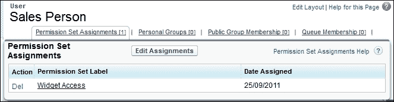
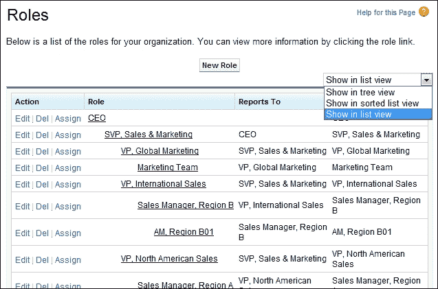

# 第四章 数据访问的安全性与数据验证

在前几章中，我们已介绍 Salesforce 如何通过用户配置文件机制来控制信息访问。我们看到，必须在用户配置文件上设置适当的对象级权限，例如创建、读取、更新和删除，以允许用户对该对象类型的记录拥有相应的权限。

本章将重点介绍组织范围的共享默认设置、角色以及其他共享设置，这些设置补充并扩展了在 Salesforce CRM 应用程序中分配访问权限给用户的方式。

本章还详细探讨了控制记录更新的一些机制，以及允许你管理和控制输入到 Salesforce CRM 中的数据质量的功能。

最后，你将遇到一些关于 Salesforce CRM 管理中的安全和访问关键功能的问题，这些内容在本章中已涵盖。

本章涵盖以下主题：

+   数据访问和安全的层级

+   数据访问安全模型

+   组织范围的默认设置

+   使用层级授予访问权限

+   授予用户额外的访问权限

+   权限集

+   角色层级

+   组织范围的默认设置和共享规则

+   共享规则

+   组

+   公共组

+   个人组

+   添加或修改共享规则的影响

+   基于标准的共享

+   手动共享

+   队列

# 数据访问和安全的层级

Salesforce CRM 中有多种功能提供数据访问和安全性，系统管理员可以配置这些功能，并且可以在平台的不同层级应用。接下来，我们将了解允许你在 Salesforce 组织中对信息应用数据访问和安全控制的多个层级。

## 组织

数据访问和安全的第一级也是最高级别是在组织层级。此层级允许对 Salesforce 进行受控访问，只有授权用户才能访问，并且你可以配置如密码策略和登录访问规则等规则。这些设置在第二章，*管理用户和控制系统访问*中有详细介绍。

## 对象和字段

数据访问和安全的第二层和第三层分别位于对象层级和字段层级。对象层级的数据访问和安全提供了最基本的控制用户可以访问哪些数据的类别。对象可以应用权限，以允许或防止用户创建、读取、更新或删除该特定对象的数据记录。第三层是字段层级。在这里，你可以使用字段级安全来控制对特定字段的访问。即使用户对相关对象有完全访问权限，你也可以限制他们访问某个特定字段。这些功能在第三章，*配置对象和应用程序*中有详细介绍。

## 记录

最低级别的数据访问和安全设置使您能够控制记录级别的访问。记录级别访问机制允许在最精确的级别进行控制，您可以允许特定用户查看对象和字段，但限制与该对象相关的实际记录。例如，可以将记录级别访问设置为允许用户查看和编辑自己的记录，而不将这些记录暴露给系统中的其他用户。这一访问级别通过 Salesforce CRM 内置的数据访问安全模型得以实现。

# 数据访问安全模型

有几种灵活的选项可以让您控制记录在组织内部的访问方式。

在上一章中，我们探讨了通过配置和分配个人资料，您可以通过设置对象的属性来控制用户能够查看、编辑和创建数据的最广泛方式。

我们还讨论了字段和字段级别安全的创建，这些安全设置是在个人资料级别设置的，并应用于数据库级别的记录。回到图表中，我们现在将查看以下图表右上角显示的安全模型：

数据访问安全模型是最低级别的数据访问和安全设置，它使您能够使用以下四个功能控制记录级别的访问：

+   组织范围默认设置（OWD）

+   角色层级

+   共享规则

+   手动共享

以下图表展示了随着每个额外功能的添加，提供的记录访问范围是如何逐步扩展的：

我们现在将探讨使用以下功能控制记录级别访问的机制：**组织范围默认设置**（**OWD**）；角色层级；共享规则；和手动共享。我们将首先描述 OWD。

# 组织范围默认设置

OWD 共享设置用于定义组织的默认共享设置。对于大多数对象，共享设置可以设置为**私有**、**仅读**或**公开读/写**。

OWD 共享设置指定了记录的默认访问级别，并且可以为 Salesforce 中的大多数对象（如帐户、联系人和活动）分别设置。

### 注意

在设置 OWD 时，您可以使用**默认内部访问**设置为内部用户设置访问级别，并使用**默认外部访问**设置为外部用户设置不同的默认访问级别。

在这里，外部用户是 Salesforce 提供的社区管理功能的一部分，该功能需要额外费用，并用于与与您公司生态系统相关的个人（如供应商、供应商或任何其他第三方企业）进行协作。

如前图所示，结合用户的个人资料，OWD 定义了用户没有所有权的数据记录的访问基准级别。图示表示了数据访问权限的可见性，随着其他功能的加入，提供更广泛的共享设置。

要自定义 OWD 设置，请导航到**设置** | **安全控制** | **共享设置**。然后点击组织范围默认设置区域的**编辑**，接着为每个对象选择所需的**默认内部访问**，如下图所示：

## OWD 访问级别操作

OWD 的访问级别允许对对象记录执行以下操作：

| **访问级别** | **操作** |
| --- | --- |
| **公共完全访问**（仅适用于设置**Campaign**对象） | 更改记录所有权 |
|  | 搜索记录 |
|  | 对记录进行报告 |
|  | 添加相关记录 |
|  | 编辑记录详情 |
|  | 删除记录 |
| **公共读取/写入/转移**（仅适用于设置潜在客户和案例对象） | 更改记录所有权 |
|  | 搜索记录 |
|  | 对记录进行报告 |
|  | 添加相关记录 |
|  | 编辑记录详情 |
| **公共读取/写入** | 搜索记录 |
|  | 对记录进行报告 |
|  | 添加相关记录 |
|  | 编辑记录详情 |
| **仅公共读取** | 搜索记录 |
|  | 对记录进行报告 |
|  | 添加相关记录 |
| **私有** | 无搜索 |
|  | 无报告 |

## 公共完全访问（仅限 Campaign）

Campaign 的 OWD 访问级别可以设置为**私有**、**仅公共读取**、**公共读取/写入**或**公共完全访问**。当**Campaign**设置为**公共完全访问**时，所有用户可以查看、编辑、转移、删除并报告所有 Campaign 记录。

例如，在 John 是一个 Campaign 的所有者的场景中，应用程序中的所有其他用户都可以查看、编辑、转移或删除该 Campaign。

### 注意

**公共完全访问**选项仅适用于**Campaign**对象。

## 公共读取/写入/转移（仅限案例或潜在客户）

**案例**或**潜在客户**的 OWD 访问级别可以设置为**私有**、**仅公共读取**、**公共读取/写入**或**公共读取/写入/转移**。当**案例**或**潜在客户**被设置为**公共读取/写入/转移**时，所有用户都可以查看、编辑、转移并报告所有案例或潜在客户记录。

例如，如果 Lucy 是 WidgetX 案例编号 101 的所有者，所有其他用户可以查看、编辑、转移所有权并报告该案例。但只有 Lucy 可以删除或更改案例编号 101 的共享设置（请参见本章后面的*手动共享规则*）。

### 注意

公共读取/写入/转移选项仅适用于案例或潜在客户。

## 公共读取/写入

所有用户都可以查看、编辑和报告所有记录。

例如，如果 Mike 是 Emerald Inc. 账户记录的所有者，其他所有用户都可以查看、编辑和报告 Emerald Inc. 账户。然而，只有 Mike 拥有删除 Emerald Inc. 账户记录或更改共享设置的权限。

## 公共只读

所有用户都可以查看和报告记录，但不能编辑记录。在这里，只有记录所有者，以及如果启用了“使用层级授予访问权限”复选框（参见之前的“组织范围共享默认设置编辑”屏幕截图），在角色层级中高于该用户角色的用户可以编辑记录。

### 注意

默认情况下，**使用层级授予访问权限** 复选框对于标准对象是启用的，并且不能禁用。对于自定义对象，可以启用或禁用 **使用层级授予访问权限** 复选框。

例如，Nicole 是 EuroCorp Inc. 账户记录的所有者，并且 Nicole 在国际销售部门工作，向 Julia 汇报，Julia 是国际销售副总裁。在这种情况下，Nicole 和 Julia 都可以对 EuroCorp Inc. 具有完全的读写访问权限。

现在，假设 Mike 也在国际销售部工作；然而，使用“公共只读”设置时，他可以查看和报告 EuroCorp Inc. 的账户记录，但不能编辑或删除该记录。

## 私有

只有记录所有者，以及如果启用了“使用层级授予访问权限”复选框（参见之前的“组织范围共享默认设置编辑”屏幕截图），在层级中高于该角色的用户可以查看、编辑和报告这些记录。例如，如果 Mike 是账户记录的所有者，并且他被分配到国际销售的角色，向 Julia 汇报，Julia 是国际销售的副总裁，那么 Julia 也可以查看、编辑和报告 Mike 的账户。

## 无访问权限、只读或使用（仅限价格表）

**价格表** OWD 的访问级别可以设置为 **无访问权限**、**只读** 或 **使用**。默认的访问级别是 **使用**，它允许所有用户访问价格表信息，并且可以在有产品的机会中使用价格表配置。**只读** 允许用户访问价格表信息，但不能在有产品的机会中使用该价格表详情。**无访问权限** 会限制用户访问价格表和价格的信息。

### 注意

**无访问权限**、**只读** 或 **使用** 选项仅适用于价格表，具体内容请参见 第八章，*介绍销售云、服务云和 Salesforce CRM 的协作功能。*

## 使用层级授予访问权限

默认情况下，Salesforce 使用层级结构，例如角色或领土层级，自动授予记录所有者以上层级的用户访问记录的权限。

这种自动授予用户数据访问权限给 Salesforce CRM 层级中较高用户的方式，可以通过取消勾选**使用层级授予访问权限**复选框来禁用。若未选择此复选框，则只有记录所有者和通过组织范围默认共享设置授予权限的用户才能访问这些记录。对于标准对象，**使用层级授予访问权限**复选框默认被选中且无法取消选中。

在这里，我们可以看到一个示例自定义对象的选项，对于自定义对象**Country**，我们将默认访问权限设置为**公开读/写**，并且勾选了**使用层级授予访问权限**设置，如下图所示：

## 由父级控制

当对象设置为**由父级控制**时，由于该对象是主从关系中的详细对象，用户可以根据是否可以对与之关联的父记录执行相同操作（如查看、编辑或删除）来执行对该记录的操作。例如，如果一个联系人记录与**由父级控制**的 WidgetX 帐户关联，那么用户只有在能够编辑 WidgetX 帐户记录的情况下才能编辑该联系人。

### 提示

**允许用户更新彼此的活动：**

**任务**和**事件**默认设置为私有（通过上图所示的**活动**设置）。为了允许用户更新彼此的活动（例如，允许用户将自己不拥有的任务设置为完成），您需要将**活动**设置为**由父级控制**，并确保与活动相关的对象对该用户也可访问。

当一个自定义对象位于与标准对象的主从关系中的详细面时，其 OWDs 会自动设置为**由父级控制**，并且无法编辑，如下图所示，展示了自定义对象**书籍**的情况：

### 注意

尽管可以取消选中**使用层级授予访问权限**来防止上级角色或区域层级的用户自动获取访问权限，但具有**查看所有**和**修改所有**对象权限以及**查看所有数据**和**修改所有数据**配置文件权限的用户，仍然可以访问他们不拥有的记录。

OWDs 需要为在 Salesforce CRM 应用程序中创建的任何自定义对象单独定义。

对于某些标准对象，您实际上无法更改**组织范围共享默认**设置。

例如，Salesforce 中 Solution 对象的 OWD（组织范围默认共享设置）预设为公开读/写，且无法更改。

您可以使用 OWDs 为以下标准对象设置默认的记录访问级别，默认的组织范围共享设置如下所示：

| **对象** | **默认访问权限** |
| --- | --- |
| **帐户** | **公开读/写** |
| **活动** | **私人** |
| **资产** | **公共读/写** |
| **日历** | **隐藏详情并添加事件** |
| **活动** | **公共完全访问** |
| **案例** | **公共读/写/转移** |
| **联系人** | **由父级控制** |
| **合同** | **公共读/写** |
| **自定义对象** | **公共读/写** |
| **潜在客户** | **公共读/写/转移** |
| **机会** | **公共只读** |
| **价格书** | **使用** |
| **服务合同** | **合同私人** |
| **用户** | **公共只读** **对外部用户私人** |

### 注意

活动的行为与其他对象不同，尽管**组织范围共享默认值**设置为私人，拥有父记录（活动所关联的记录）读取权限的用户仍然可以查看该活动，无论活动归谁所有。因此，如果你将一个帐户记录共享给一个用户或一组用户，所有该记录上的活动都会对这些用户或用户组可见。

## 外部 OWD 用于共享

在 Salesforce CRM 中，通常称为 OWD（组织范围默认值），指定了记录的默认访问级别，并且可以为 Salesforce 中的大多数对象（如帐户、联系人和活动）单独设置。

外部 OWD 允许为外部用户应用不同的默认访问级别，例如 Chatter 外部用户、社区用户、客户门户用户等。

使用外部 OWD 可以简化组织的共享模型。例如，若没有外部 OWD，如果你希望为内部用户设置**公共只读**或**公共读/写**访问权限，而为外部用户设置私人权限，你必须将默认访问权限设置为**私人**，并创建共享规则以将记录与所有内部用户共享。使用独立的 OWD，一个用于内部用户，一个用于外部用户，你可以通过将内部访问默认设置为**公共只读**或**公共读/写**，并将外部访问默认设置为**私人**来实现类似的行为。

### 注意

外部组织范围默认值可用于设置**帐户**（及其关联的合同和资产）、**案例**、**联系人**、**机会**、**用户**和**自定义对象**的共享。

拥有独立的 OWD，一个用于内部用户，一个用于外部用户，还可以加速报告、列表视图和搜索的性能。

### 注意

外部用户包括：认证的网页用户、Chatter 外部用户、社区用户、客户门户用户、访客用户、高容量门户用户、合作伙伴门户用户和服务云门户用户。

要激活外部 OWD 设置，请导航至**设置** | **安全控制** | **共享设置**。然后点击**启用外部共享模型**按钮，如下图所示：

## 修改默认访问类型的效果

当您更改默认访问类型，例如从**私有**更改为**公开读/写**时，该对象的组织记录共享会重新计算，您可能会看到一个警告确认对话框，如下截图所示，通知您在 OWDs 更新完成时将收到一封电子邮件：

## 授予用户额外访问权限

当某个对象的 OWDs 设置为**私有**或**公开只读**时，您可以使用权限集、角色层级和共享规则授予用户额外的访问权限。

### 注意

共享规则和权限集只能用于授予额外访问权限，不能用于限制访问记录，不能超过原始的 OWDs 设置。

## 权限集

权限集允许您进一步控制组织中用户对系统的访问权限。它们可以被视为一种方法，用于微调选定个人的权限，并且允许像设置配置文件一样进行访问。

虽然每个用户只能拥有一个配置文件，但您可以为用户分配多个权限和权限集。例如，您可以创建一个名为**转化潜在客户**的权限集，提供转化和转移**潜在客户**的功能，使用应用程序权限，并将其分配给一个没有潜在客户转化功能的用户配置文件。您还可以创建一个名为**导出报告**的权限集，使用系统权限“导出报告”来允许特定用户导出报告中的数据。您还可以创建一个名为**访问小部件**的权限集，使用**对象设置**权限，关联到一个名为“Widget”的自定义对象，该对象在 OWDs 中设置为**私有**。在这里，您可以将其分配给一个没有通过配置文件设置访问小部件权限的用户。

设置用户权限集是一个两步过程，包括：

1.  从**权限集**编辑页面创建权限集。

1.  从**用户**编辑页面将用户分配到权限集。

### 从权限集编辑页面创建权限集

要查看和管理您的组织的权限集，请导航到**设置** | **管理用户** | **权限集**。对于一个新的权限集，点击**新建**按钮，并完成权限集信息部分，选择将使用该权限集的用户类型。现在编辑**对象权限**和**字段权限**，选择所需的对象。

以下截图显示了创建一个允许用户访问小部件对象（该对象在组织默认访问模型中设置为私有）的权限集：

### 从用户编辑页面将用户分配到权限集

要查看和管理哪些用户已分配到权限集，请导航至**设置** | **管理用户** | **用户**。现在通过点击用户的**用户名**来选择用户。

点击**权限集分配**，然后点击**编辑分配**，以查看并从可用权限列表中选择。下方截图显示了相应部分：

### 注意

您可以为您的组织创建最多 1,000 个权限集。

您可以将多个权限组合到一个权限集中，以创建类似于配置文件的特定权限，而无需实际创建或克隆完整的配置文件，这通常既不必要也很费时。

# 角色层级

一旦组织范围的默认设置（OWD）被确定，您可以使用角色层级确保经理可以查看和编辑与其直接下属（或子级）相同的记录。处于任何角色级别的用户总是能够查看、编辑和报告所有由他们或共享给低于他们层级的用户拥有的数据，除非 OWD 设置指定忽略角色层级。

要查看和管理组织的角色层级，请导航至**设置** | **管理用户** | **角色**，如以下截图所示：

在这里，您可以选择以下其中一种方式来查看层级：

## 显示为树形视图

此视图显示角色之间的父子关系的可视化表示。点击**展开全部**以查看所有角色，或点击**收起全部**以仅查看顶级角色。要展开或收起某个单独的角色节点，可以点击如前所示的加号[**+**]或减号[**-**]图标。

## 显示为排序列表视图

此视图将角色显示为可以按角色名称、父角色（汇报对象）或报告显示名称字母顺序排序的列表。如果您的组织有大量角色，此视图提供了一种更容易浏览层级的方式，如下图所示：

要显示筛选后的角色列表，请从**视图**下拉列表中选择一个预定义的列表，或者点击**创建新视图**来定义您自己的角色视图。要编辑或删除您创建的任何视图，请从**视图**下拉列表中选择该视图并点击**编辑**链接。进入**编辑视图**页面后，您可以点击**删除**按钮删除该列表视图。

### 注意

在**显示为排序列表视图**屏幕中显示的列为**操作**、**角色**、**汇报对象**和**报告显示名称**，这些列可以排序

## 显示为列表视图

此视图将角色显示为带有缩进的角色列表及其子节点，按顶级角色名称的字母顺序分组，如下所示：

### 注意

在“以列表视图显示”屏幕中显示的列有角色、报告给谁、报告显示名称，这些列无法排序。

要创建一个角色，请点击**新建角色**或**添加角色**，具体取决于您查看角色的方式是使用列表视图还是树视图，然后根据需要填写角色字段。

### 注意

在撰写时，您最多可以为组织创建 500 个角色。

要编辑角色，请点击角色名称旁边的**编辑**，然后根据需要更新角色字段。您可以通过点击角色名称旁边的**删除**来删除角色。

要将其他用户分配给角色，请点击角色名称旁边的**分配**，并查看角色的详细信息，请点击角色名称。

### 注意

如果您的组织使用领土管理，预测将基于领土层级，而不是角色层级。

角色层级不需要表示公司组织结构图，而是每个角色应被视为 Salesforce 中用户或组所需的数据访问级别。

根据您的共享设置，角色可以控制用户对组织数据的可见性级别。在某个特定角色级别的用户可以查看、编辑和报告所有由他们或与他们层级下的用户共享的记录。前提是您的组织的共享机制对于该对象类型没有另行规定。

具体来说，在与组织范围默认设置相关的列表中，如果自定义对象的“使用层级授予访问权限”选项被禁用，那么只有记录所有者和通过组织范围默认设置授予访问权限的用户才能访问该自定义对象的记录。

尽管可以创建没有角色的用户记录，但用户需要分配角色，以便他们的记录出现在机会报告、预测汇总和任何基于角色的显示中。

### 注意

当账户所有者没有分配角色时，相关联系人的共享访问权限为**读取/写入**，前提是联系人组织范围默认设置不是**由父项控制**。相关机会和案件的共享访问权限为**无访问权限**。

需要访问 Salesforce CRM 中所有记录的用户应设置为角色层级的最顶层。

当您更改用户角色时，相关的共享规则会被重新评估，以根据需要添加或移除对记录的访问权限。

### 提示

并不需要为公司内的每个职位创建单独的角色。相反，建议定义一个角色层级结构，以帮助控制低级角色用户输入的信息访问权限。

要查看角色的详细信息，请导航至**设置** | **管理用户** | **角色**。点击角色名称将显示角色详细信息页面，如下图所示：

要查看父角色或同级角色的**角色详情**页面，请点击层级或同级列表中的**角色名称**。

要编辑角色详情，请点击**编辑**。

要从层级中移除角色，请点击**删除**。

在角色相关列表中的用户，你有以下选项：

+   通过点击**分配用户到角色**，将用户分配给该角色。

+   通过点击**新建用户**，向组织添加用户。

+   通过点击用户名字旁边的**编辑**，修改用户信息。

+   通过点击用户的**全名**、**别名**或**用户名**，查看用户的详细信息。

    ### 注意

    当你编辑角色时，共享规则通常会自动重新评估，以根据需要添加或移除记录访问权限。如果这些更改导致一次性更改的记录过多，则会出现一条警告消息，提示共享规则不会自动重新评估，并且你必须手动重新计算它们（如后续所示）。共享规则应在用户或用户组需要访问未通过角色层级设置或组织范围默认设置授权的记录时使用。当你修改角色中的用户时，任何共享规则也会重新评估，以根据需要添加或移除访问权限。

# 组织范围的默认设置和共享规则

用户对记录的访问级别通过共享规则设置时，永远不会比 OWDs 中选择的选项更严格。OWDs 是所有用户的最小访问级别。

# 共享规则

通过共享规则，实际上是在为特定用户组自动扩展**组织范围共享默认设置**。如以下屏幕截图所示，这可以视为为这些用户打开记录的可见性和访问权限。

共享规则适用于：

+   所有新建和现有的由指定角色或组成员拥有的记录

+   活跃用户和非活跃用户

共享规则扩展了 OWDs 和角色层级中指定的访问权限。

### 注意

共享规则永远不能比你的 OWDs 设置更严格，它们为包含的用户或用户组提供更广泛的数据访问权限。要定义共享规则，导航到**设置** | **安全控制** | **共享设置**。现在滚动到页面的下部，显示**共享规则**部分。

以下屏幕截图显示了**共享规则**页面，其中有部分内容用于设置应用程序中各种标准对象的共享规则，如**潜在客户**、**账户**和**联系人**，以及你组织中的任何自定义对象：

在**共享规则**设置部分，可以应用以下对象共享规则：

## 账户共享规则

这些规则基于帐户拥有者或其他标准，包括帐户记录类型或字段值，并设置帐户及其关联的**合同**、**资产**、**机会**、**案例**和（可选）**联系人**记录的默认共享访问权限。  

## 帐户区域共享规则  

这些规则基于区域分配，并设置**帐户**及其关联的**案例**、**联系人**、**合同**和**机会**记录的默认共享访问权限。  

## 活动共享规则  

这些规则基于活动拥有者，并设置单个活动记录的默认共享访问权限。  

## 案例共享规则  

这些规则基于案例拥有者或其他标准，包括案例记录类型或字段值，并设置单个案例及其关联帐户记录的默认共享访问权限。  

## 联系人共享规则  

这些规则基于联系人拥有者或其他标准，包括联系人记录类型或字段值，并设置单个联系人及其关联帐户记录的默认共享访问权限。  

## 潜在客户共享规则  

这些规则基于潜在客户拥有者，并设置单个潜在客户记录的默认共享访问权限。  

## 机会共享规则  

这些规则基于机会拥有者或其他标准，包括机会记录类型或字段值，并设置单个机会及其关联帐户记录的默认共享访问权限。  

## 用户共享规则  

这些规则基于用户组成员资格（本章后面会描述）或其他标准，并设置单个用户记录的默认共享访问权限。  

## 自定义对象共享规则  

这些规则基于自定义对象记录的拥有者或其他标准，包括自定义对象记录类型或字段值，并为单个自定义对象记录设置默认共享访问权限。  

## 组  

组允许通过共享规则简化设置 OWD 共享访问权限，可以为一组用户或单个用户选择性地共享他们的记录给其他用户。  

### 公共组  

公共组是只有管理员才允许创建和编辑的用户组。但创建后，公共组可以供组织中的所有人使用。

公共组可以包含单个用户、特定角色或区域的用户、指定角色的用户以及该角色层级以下的所有用户，或其他公共组。  

### 个人组  

个人组是每个人都可以为个人使用创建和编辑的一组用户。  

个人组可以包含单个用户、公共组、特定角色或区域的用户，或特定角色的用户以及该角色层级以下的所有用户。  

## 添加或修改共享规则的影响  

当您添加新的共享规则时，将计算共享规则的访问级别，并显示警告确认对话框消息，如下截图所示，指示此操作可能需要大量时间：

更改或删除共享规则的影响，以及用户之间的记录转移，会导致重新评估受影响用户的适当记录访问。

### 注意

如果这些更改一次影响了太多记录，会出现一条警告消息，提示共享规则不会自动重新评估，您必须手动重新计算它们。

以下列表概述了可以对**共享规则**进行的更改以及应用这些更改的后果：

+   当您更改共享规则的访问级别时，所有现有记录都会自动更新以反映新的访问级别。

+   当您删除共享规则时，由该规则创建的共享访问将自动移除。

+   当您将记录从一个用户转移至另一个用户时，将重新评估共享规则，根据需要添加或移除对转移记录的访问权限。

+   当您修改组或角色中的用户时，任何共享规则将重新评估，根据需要添加或移除对这些用户的访问权限。

+   在角色层次结构中较高的用户将自动被授予与层次结构中低于他们的用户从共享规则中获得的相同访问权限。

    ### 注意

    当您编辑组、角色和 Territory 时，共享规则通常会自动重新评估，根据需要添加或移除访问权限。可以随时手动重新计算共享规则。

要手动重新计算共享规则，请导航至**设置** | **安全控制** | **共享设置**。现在向下滚动到页面的底部以显示**共享规则**部分，在您想要的对象的**共享规则**相关列表中，点击**重新计算**，如下截图所示：

## 基于标准的共享

基于标准的共享规则用于控制哪些用户可以访问基于记录中指定字段值的记录。例如，账户对象有一个名为**市场**的自定义下拉列表字段。您可以创建一个基于标准的共享规则，将所有**市场**字段设置为**US**的账户与您组织中的**北美销售团队**共享，如下截图所示：

尽管基于标准的共享规则是基于记录中的值而不是记录所有者，但角色或领 Territory 层次结构仍允许层次结构较高的用户访问记录。

您可以为**账户**、**机会**、**案例**、**联系人**和**自定义**对象创建基于标准的共享规则。

例如，已为时事通讯创建了一个自定义对象。您可以创建一个基于条件的共享规则，将名称为**International**的所有时事通讯与您组织中的**国际销售**团队共享，方法如下：

文本和文本区域字段必须准确指定，因为它们对大小写敏感。例如，指定`International`的基于条件的共享规则将无法共享字段中包含`International`的记录。

### 提示

**基于条件的共享规则与文本字段**

要创建一个基于条件的共享规则，并匹配多个单词的情况，请输入由逗号分隔的每个值。例如，`International`、`international`，并使用**包含**运算符。

在基于条件的共享中，可以用于共享的字段类型有限制。除了记录类型外，以下字段可以作为共享的条件：

**自动编号**、**复选框**、**日期**、**日期/时间**、**电子邮件**、**数字**、**百分比**、**电话**、**下拉列表**、**文本**、**文本区域**、**URL** 和 **查找关系**（指向用户或队列）。

### 注意

每个对象最多可以创建 50 个基于条件的共享规则。

# 手动共享规则

用户可以手动共享某些类型的记录给 Salesforce CRM 应用中的其他用户。一些自动共享的对象包括对所有其他相关记录的访问。例如，如果一个用户共享他们的一个账户记录，那么被授权的用户将能够访问与该账户相关的所有机会和案件。

手动共享规则通常用于一次性共享记录，或者在难以确定一个一致的用户、组和相关规则集时，作为组织范围共享设置的一部分。要能够为记录授予共享访问权限，用户必须是记录所有者、系统管理员、角色层级中高于所有者的用户，或者是任何已被授予完全访问权限的用户；或者该对象的组织范围设置必须允许通过层级进行访问。

用户只需点击**记录详细信息**页面上的**共享**按钮即可授予访问权限，如以下截图所示：

### 注意

如果对象的**组织范围共享默认设置**已设置为**公开读取/写入**，则**共享**按钮不会显示。

## 用户记录的手动共享

您可以指定是否显示用于授予他人访问用户自己用户记录的**共享**按钮。

要隐藏或显示所有用户的**共享**按钮，请导航至**设置** | **安全控制** | **共享设置**。然后点击**组织范围默认设置**区域中的**编辑**，并滚动到页面底部。

要在用户详细信息页面上隐藏或显示**共享**按钮，请选中**手动用户记录共享**复选框，如下图所示，然后点击**保存**。

## 队列

队列允许用户组管理共享记录。

队列是一个可以将记录路由到等待由组成员处理的位置。记录将保留在队列中，直到用户接受它们进行处理，或者它们被转移到另一个队列。

在创建新队列时，必须指定存储的对象集。队列允许的对象包括潜在客户、案例、服务合同和自定义对象。还必须指定允许从队列中检索记录的用户集。

记录可以通过手动或自动的案例或潜在客户分配规则添加到队列，在这种情况下，记录的所有者将被更改为队列的所有者。

一旦记录被添加到队列，它们将保留在队列中，直到被分配给某个用户或被队列成员中的某个用户取回。然后，记录的所有者将更改为相应队列成员用户。在这里，任何队列成员或在角色层级结构中位于队列成员之上的用户都可以获得队列中记录的所有权。

## 共享访问图示

许多安全选项一起工作，以确定用户是否可以查看或编辑记录。首先，Salesforce 检查用户的配置文件是否具有访问该对象的对象级权限。然后，Salesforce 检查用户的配置文件是否具有任何管理权限，例如**查看所有数据**或**修改所有数据**。

### 注意

**查看所有数据**配置文件或权限集分配允许用户查看所有记录，**修改所有数据**配置文件或权限集分配允许用户更新和删除记录，无论该对象类型的数据访问安全模型如何。

最后，Salesforce 会检查记录的所有权。在这里，将检查 OWD（组织范围默认值）、角色级别访问权限以及任何共享规则，以确定是否存在授予用户访问该记录的规则。

以下流程图展示了不同的安全选项如何影响用户，涉及记录所有权、共享模型和可以设置的规则：

除了检查用户是否可以查看记录，如前述截图所示，用户的配置文件（或权限集）必须为相关对象设置查看权限。

除了检查用户是否可以编辑记录，如前述截图所示，用户的配置文件（或权限集）必须为相关对象设置编辑权限。

# 知识测试问题

现在，您将看到关于 Salesforce CRM 管理中的安全性和访问权限方面的关键特性的问题，这些内容已在本章中覆盖。答案可以在章节末尾找到。

## 问题

我们提出了五个问题，以验证你对数据访问级别、OWD（组织范围默认值）和数据访问安全模型例外的理解。

### 问题 1 - 字段级访问

以下哪些可以用来控制字段级访问，授予用户查看权限？（请选择一个）

**a**) 配置文件

**b**) 角色层级

**c**) 字段级安全

**d**) 权限集

### 问题 2 - 数据访问级别

以下哪些级别可以配置数据访问？（请选择所有适用项，除了：）

**a**) 组织级

**b**) 对象级别

**c**) 配置文件级别

**d**) 页面布局级别

**e**) 记录级

### 问题 3 - 记录级访问

以下哪些可以用来控制记录级访问？（请选择所有适用项）

**a**) 权限集

**b**) 角色层级

**c**) 配置文件

**d**) 共享规则

**e**) 组织范围默认值

### 问题 4 - 组织范围默认值

一个对象的组织范围默认值设置为“公共读取/写入”。可以使用哪些功能来限制对该对象的访问？（请选择所有适用项）

**a**) 页面布局

**b**) 记录类型

**c**) 角色层级

**d**) 配置文件

**e**) 以上都不正确

### 问题 5 - 角色层级

以下哪些陈述是关于 Salesforce CRM 中角色层级的正确说法？（请选择所有适用项）

**a**) 角色控制用户对组织数据的可见性级别

**b**) 角色层级下的用户可以查看所有由其下层用户拥有的数据

**c**) 用户可以分配多个角色

**d**) 用户必须关联一个角色

### 问题 6 - 数据访问安全模型例外

以下哪个配置文件权限允许用户更新该对象类型的任何记录，无论数据访问安全模型如何？（请选择一个）

**a**) 会话设置

**b**) 密码策略

**c**) 修改所有数据

**d**) 查看所有数据

**e**) 以上都不正确

## 答案

以下是关于 Salesforce CRM 管理功能中安全性和访问方面的六个问题的答案。

### 答案 1 - 字段级访问

答案是**c**) 字段级安全。

### 答案 2 - 数据访问级别

答案是**a**) 组织级，**b**) 对象级，以及**e**) 记录级。

### 答案 3 - 记录级访问

答案是**b**) 角色层级，**d**) 共享规则，以及**e**) 组织范围默认值

选项**a**) 权限集和**c**) 配置文件允许你在对象级别设置安全性，而不是在记录级别。

### 答案 4 - 组织范围默认值

答案是**d**) 配置文件。

### 答案 5 - 角色层级

答案是**a**) 角色控制用户对组织数据的可见性级别，**b**) 角色层级下的用户可以查看所有由其下层用户拥有的数据。

**c**) 用户可以分配多个角色，**d**) 用户必须关联一个角色，这两个说法不正确。用户可以选择性地分配角色。

### 答案 6 - 数据访问安全模型例外

答案是**c）** 修改所有数据。

# 总结

在本章中，我们描述了为系统管理员提供数据访问和安全配置的功能以及他们的数据访问级别。**组织范围共享默认设置**、**角色**和其他共享设置也进行了描述。

我们探讨了如何通过使用权限集、共享规则、基于条件的共享以及手动共享来进一步扩大对记录的访问。

最后，我们提出了一些问题，帮助澄清 Salesforce CRM 管理中安全性和访问控制方面的一些关键功能。

在下一章中，我们将探讨如何从 Salesforce CRM 加载和提取数据，我们将了解用于将数据导入和导出到 Salesforce 的工具。下一章中还包括对数据加载器和数据导入向导的介绍。
