# 第五章：管理 Salesforce CRM 中的数据

在上一章中，我们查看了提供数据访问和安全配置的功能，并讨论了数据访问和安全性可以应用的四个主要层级：组织级、对象级、字段级和记录级。

本章将讨论使用数据验证规则和依赖字段改善数据质量的选项。我们还将概述 Salesforce CRM 中可用的功能和工具，帮助您将数据导入和导出 Salesforce 系统。

最后，我们将回答关于 Salesforce CRM 管理中数据管理领域的一些关键功能的问题。

本章将涵盖以下主题：

+   数据质量

+   数据验证规则

+   依赖选择列表

+   数据导入与导出工具

+   数据导入向导

+   单独的导入向导

+   数据加载器

+   数据加载器与导入向导比较

+   批量数据更新的最佳实践

+   导出备份数据

+   回收站

+   数据存储利用率

现在，让我们首先看看可以帮助您控制用户输入 Salesforce CRM 系统的数据的关键功能。

# 数据质量

在第三章，*配置对象和应用程序* 中，我们查看了如何设置自定义字段的必填字段和自动编号字段属性，以帮助提高系统中记录的质量并维护数据完整性。

Salesforce 还提供了其他数据质量机制，例如：

+   数据验证规则

+   依赖选择列表

## 数据验证规则

数据验证规则可以应用于自定义字段和标准字段，并用于验证记录中输入的数据是否符合您指定的标准，只有符合条件的数据才能保存。

验证规则包含一个公式或表达式，该公式或表达式评估一个或多个字段中的数据，并返回 `true` 或 `false` 的值。

验证规则使用的逻辑是寻找错误条件，一旦公式或表达式返回 `true`，则向用户显示预先配置的错误消息。

当为某个字段或一组字段定义验证规则时，以下操作将在用户创建新记录或编辑现有记录并点击 **保存** 按钮时触发：

+   Salesforce 执行验证规则，如果所有数据有效，则记录将被保存。

+   对于任何无效数据，Salesforce 会显示相关的错误信息，并且不会保存记录。

你可以指定在验证规则触发时显示的错误信息，并可以选择将错误信息以内联方式显示在字段旁边或显示在页面顶部。例如，你的错误信息可以是“关闭日期必须晚于今天的日期”。如前所述，你可以选择将错误信息显示在页面顶部或字段附近，你可以选择该字段；通常，这个字段是触发验证规则的字段，或者你也可以选择不同的字段。像所有其他 Salesforce 错误信息一样，验证规则错误将以红色文本显示，并以`Error`一词开头。

验证规则适用于对象的所有新记录和更新记录。如果你的组织为创建验证规则的对象提供多个页面布局，你应该验证验证规则是否在每个布局中按预期工作。另外，如果你有任何影响该对象的数据集成，也应验证验证规则是否按预期操作。

### 注意

即使验证规则中引用的字段在页面布局中不可见，验证规则仍然适用，并将在规则条件满足时显示错误信息。

要开始使用验证规则，请导航到**设置 | 自定义**。对于标准对象，从菜单中转到相应的活动、标准对象或用户的链接，并点击**验证规则**。

对于自定义对象，导航到**设置 | 创建 | 对象**。然后转到自定义对象。

### 注意

验证规则列在**验证规则**列表中。

要开始添加新的验证规则，请点击**验证规则**部分中的**新建**按钮，如下图所示：

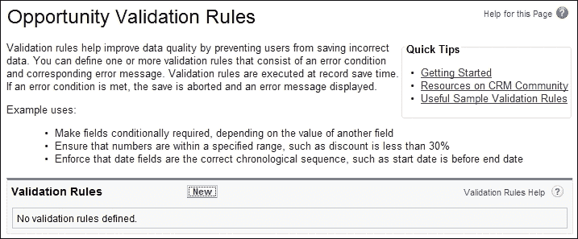

现在输入验证规则的属性，属性应包括以下部分详细说明的内容：

### 字段描述部分

添加一个**规则名称**，这是一个独特的标识符，最多可以包含 80 个字符，且不能包含空格或特殊字符（如扩展字符）。

**启用**复选框用于设置规则。

填写**描述字段**，这是一个可选的 255 字符（或更少）文本框，你可以用来描述验证规则的目的。

### 错误条件公式部分

在此输入的公式构成用于验证字段的表达式。

### 错误信息部分

**错误信息**字段是当记录更新未通过验证规则时显示给用户的文本。

**错误位置**用于确定错误将在页面上显示给用户的位置。可用的选项如下：

+   页面顶部

+   字段

**页面顶部**选项将错误信息设置为显示在页面顶部。要在字段旁边显示错误，请选择**字段**选项，然后选择适当的字段。

如果错误位置是某个字段，则该字段的**详细信息**页面也会列出验证规则。

你可以点击**检查语法**来检查公式是否有错误。最后，点击保存以完成，或点击**保存并新建**来创建额外的验证规则。

例如，以下公式文本显示了一个机会验证规则，以确保用户无法将过去的日期输入到**关闭日期**字段：

公式应为：`CloseDate < TODAY()`

### 注意

如果错误位置设置为后来被删除的字段，或为只读或在页面布局上不可见的字段，Salesforce 会自动将错误位置更改为**页面顶部**。

这个验证规则的示例错误信息是**关闭日期必须是未来的日期**，如下截图所示：

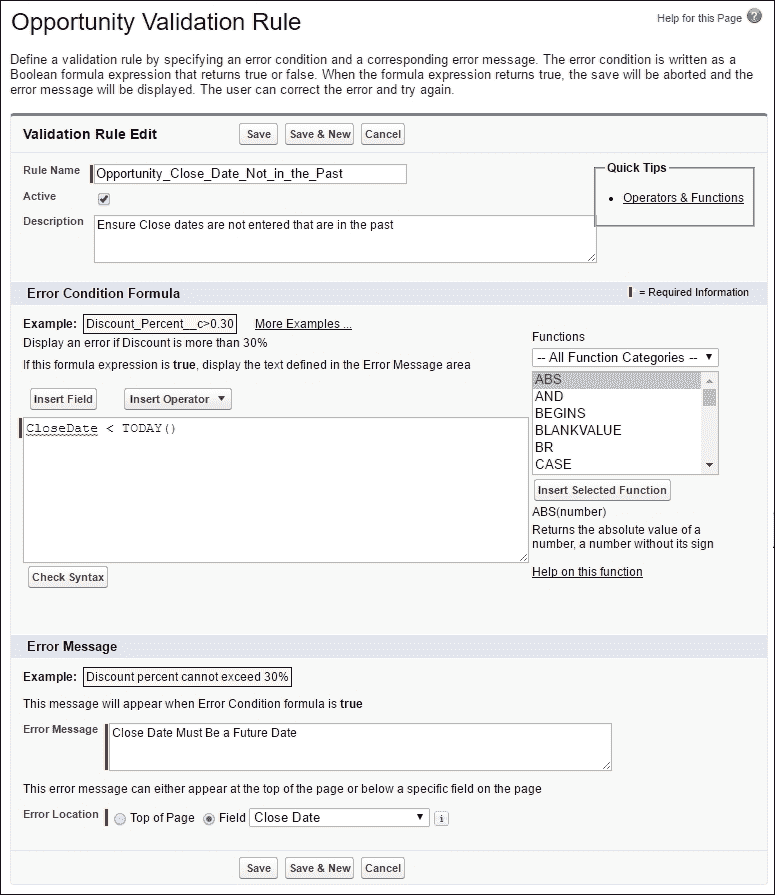

当前面的公式为真时，验证规则将被触发，并会显示与前面的示例一致的错误信息，如以下截图所示：

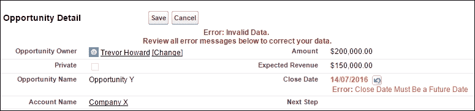

## 依赖下拉列表

依赖下拉列表通过应用筛选器帮助使数据更加准确和一致。

依赖字段与控制字段一起工作来筛选其值。控制字段中选择的值会影响依赖字段中的值。

在以下截图中，我们看到**扬声器状态**字段受**扬声器事件状态**字段的控制：

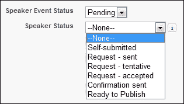

### 依赖和控制下拉列表

依赖和控制下拉列表是相互配合的，其中控制下拉列表中选择的值会动态改变依赖下拉列表中可用的值。

控制下拉列表和依赖下拉列表都在编辑页面上通过图标表示。通过将鼠标悬停在这些图标上，用户可以看到控制下拉列表或依赖下拉列表的名称。

要定义依赖下拉列表，请导航到适当对象的**字段**区域。

对于标准对象，请导航到**设置 | 自定义**。现在从**自定义**菜单中选择适当的对象，并点击**字段**。

对于自定义对象，请导航到**设置 | 创建 | 对象**。现在从列表中选择一个自定义对象。

对于自定义任务和事件字段，请导航到**设置 | 自定义 | 活动 | 活动自定义字段**。

现在点击**字段依赖关系**，位于**自定义字段与关系**部分，如以下截图所示：

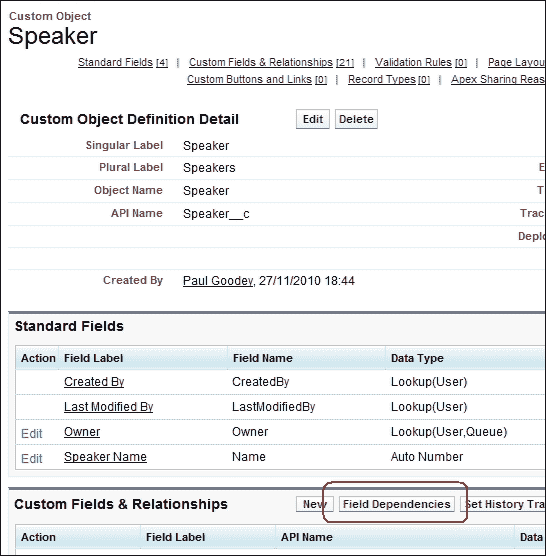

现在点击新建以导航到**新建字段依赖关系**屏幕，然后选择**控制字段**和**依赖字段**，如以下截图所示：

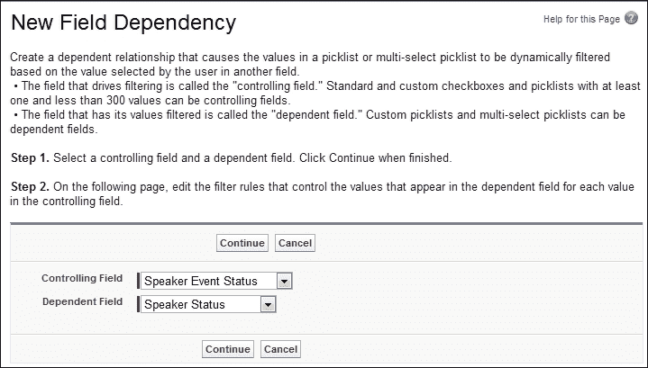

点击**继续**以显示下一个屏幕，在该屏幕上你会看到字段依赖矩阵，可以指定当用户选择每个控制字段值时，依赖下拉列表中可用的值。

字段依赖矩阵让你指定当用户选择每个控制字段值时，哪些依赖下拉列表值将可用。矩阵的顶行显示控制字段的值，而列显示依赖字段的值。

使用此矩阵，你可以包含或排除值。当选择控制字段中的值时，包含的值将在依赖下拉列表中显示，而排除的字段将不可用。

在这里，你可以通过以下步骤来包含或排除值：

1.  双击值以包含它们。被包含的值会被高亮显示（再次双击任何高亮显示的值将会排除它）。

1.  若要处理多个值，你应该按住***Shift***键并点击每个值来选择所需的值范围，如下截图所示：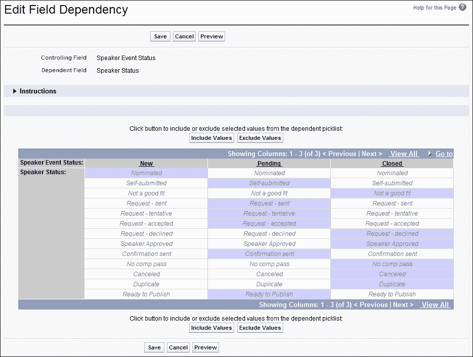

选择值后，点击**包含值**使这些值可用，或者点击**排除值**将它们从可用值列表中移除。

你也可以按住***Ctrl***键并点击各个值来选择多个值。同样，点击**包含值**会使这些值可用，而点击**排除值**会将它们从可用值列表中移除。点击列标题可以选择该列中的所有值，如下所示：

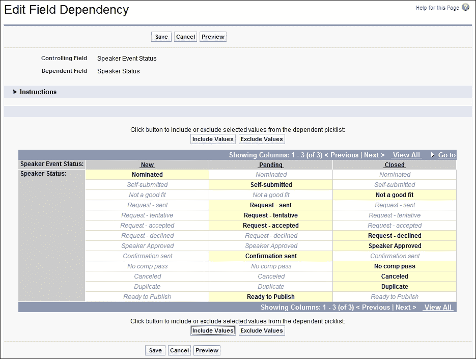

若要更改视图中的值，你可以执行以下操作：

+   点击**查看全部**一次查看所有可用值

+   点击**转到**并选择一个控制值，以查看该列中的所有依赖值

+   点击**上一页**或**下一页**可以查看上一页或下一页中的列值

+   点击****查看**每组 5 个**以一次查看五列

+   可选地，点击**预览**在点击**保存**前测试你的选择

### 控制下拉列表的限制和条件

创建和配置依赖字段与控制下拉列表字段时有各种限制和条件。

#### 控制字段的限制和条件

创建和配置依赖字段与控制字段时有各种细微差别。对于控制字段，存在以下限制和条件：

+   标准下拉列表字段可以作为控制字段

+   检查表字段可以作为控制字段

+   控制字段可以设置默认值

+   多选下拉列表字段不能作为控制字段

+   控制字段最多允许 300 个值

#### 依赖字段的限制和条件

依赖字段存在以下限制：

+   标准下拉列表字段不能作为依赖字段

+   复选框不能作为依赖字段

+   依赖字段不能设置默认值

+   多选下拉列表字段可以是依赖下拉列表

#### 转换字段

当将现有字段转换为依赖选择列表或控制字段时，这可以在不影响记录中现有值的情况下完成。仅对于未来的更改，依赖规则才会应用于现有记录或新记录的更新。

#### 页面布局

为了最佳实践和提高用户可见性，请确保依赖选择列表在页面布局中位于控制字段下方。

如果需要依赖选择列表并且基于控制字段值没有可用值，用户可以在不输入值的情况下保存记录。在这种情况下，记录将以该字段没有值的状态保存。

### 提示

确保将控制字段添加到包含其相关依赖选择列表的任何页面布局中。如果控制字段不在同一页面布局中，依赖选择列表将不会显示任何可用值。

#### 记录类型

控制字段中的值由预选记录类型确定，而依赖选择列表中的值则由记录类型和所选控制字段值共同决定。

因此，依赖选择列表中可用的值是预先选择的记录类型与随后的控制字段选择的交集。

#### 数据导入

数据导入工具不会考虑字段依赖关系，除非选择列表值启用了**严格执行选择列表值**选项。

因此，可以将任何值导入到依赖选择列表字段中，而不管导入的控制字段的值是什么。

### 注意

设置屏幕中**严格执行选择列表值**选项会防止字段允许不在选择列表选项中指定的值，即使该字段通过 API 进行更新。有关字段类型的更多详情，请参见第三章，*配置对象和应用程序*。

# 数据导入和导出工具概述

Salesforce 提供了数据工具，可用于将数据导入和导出到 Salesforce 及从 Salesforce 导出。还有多种第三方工具允许将数据导入到 Salesforce 并使用公开的 Salesforce API 提供数据集成。

第三方数据导入和导出工具不是 Salesforce 提供的，因此我们不会在本书中涵盖这些工具。然而，你可以通过 Salesforce 提供的 AppExchange 网站找到并获取有关这些工具的信息，AppExchange 允许组织选择额外的应用程序来扩展 Salesforce CRM。AppExchange 在第九章，*扩展和增强 Salesforce CRM*中有详细介绍，并可通过以下网址访问：[`appexchange.salesforce.com`](https://appexchange.salesforce.com)。

查看 Salesforce 提供的可用于导入和导出数据的工具，我们有以下特定选项：

+   数据导入向导

+   单个导入向导

+   导入帐户/联系人

+   导入潜在客户

+   导入解决方案

+   导入自定义对象

+   数据加载器

    ### 注意

    在写作时，Salesforce 已宣布将于 2017 年 2 月停用单个导入向导。Salesforce 建议用户改用**数据导入向导**，因为从 Spring '17 版本开始，单个导入向导将不再可用。

## 数据导入向导

**数据导入向导**会在完整的浏览器窗口中打开，并提供统一的界面，允许你导入多个标准 Salesforce 对象的数据，包括**帐户**、**联系人**、**潜在客户**、**自定义对象**和**解决方案**。

要访问**数据导入向导**，请导航到**设置 | 数据管理 | 数据导入向导**。然后点击**启动向导**按钮，如下图所示：

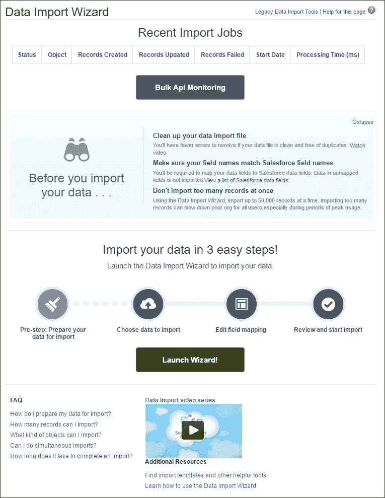

## 单个导入向导

Salesforce 单个导入向导会在一个小的弹出窗口中打开，并提供一个易于使用的多步骤向导，用于将新的**帐户（个人帐户和企业帐户）**、**联系人**、**潜在客户**、**自定义对象**或**解决方案**对象记录导入到 Salesforce 中。

### 注意

在写作时，Salesforce 已宣布将于 2017 年 2 月停用单个导入向导。Salesforce 建议用户改用**数据导入向导**，因为从 Spring '17 版本开始，单个导入向导将不再可用。

要访问单个导入向导，请点击所需对象的标签，然后在页面底部找到**工具**部分。举例来说，潜在客户导入向导的位置如下所示：

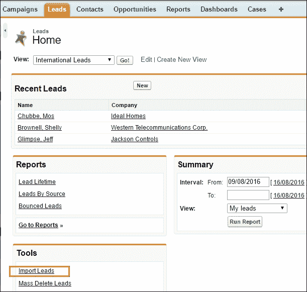

该向导还可以用于根据匹配标识符更新**帐户（个人帐户和企业帐户）**、**联系人**、**潜在客户**、**自定义对象**或**解决方案**。

### 注意

**联系人**和**潜在客户**可以通过匹配电子邮件地址进行更新，**自定义对象**或**解决方案**可以根据自定义对象名称、解决方案标题、Salesforce ID 或外部 ID 进行更新。

使用导入向导时需要使用**逗号分隔值**（**CSV**）文件格式，每次导入的记录限制为 50,000 条。

### 注意

**帐户**和**联系人**导入向导具有内置的去重功能。帐户可以通过帐户名称和帐户站点进行匹配。对于联系人，可以通过名字、姓氏或电子邮件地址进行去重匹配。

# 数据加载器

**数据加载器**是一个由 Salesforce 提供的客户端应用程序，提供批量导入和导出数据的功能。使用**数据加载器**，你可以为标准和自定义对象创建、编辑和删除 Salesforce 记录。**数据加载器**支持 Windows XP、Windows 7 和 Mac OS X。

**数据加载器**客户端应用程序必须先安装到您的本地计算机上。安装文件可以通过导航到**设置 | 数据管理 | 数据加载器**获取。

在**数据加载器**安装文件下载界面中，您可以选择适合您操作系统的安装下载链接，使用“下载适用于 Windows 的 **数据加载器**”或“下载适用于 Mac 的 **数据加载器**”，如下图所示：

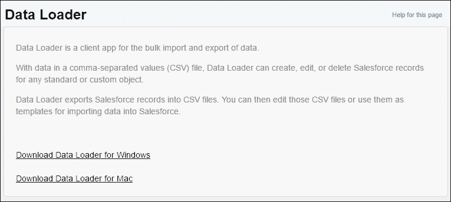

**数据加载器**可以创建、编辑或删除 Salesforce CRM 中的标准和自定义对象记录。在导入数据时，**数据加载器**从（CSV）文件（或数据库连接）加载数据。在导出数据时，**数据加载器**将记录导出到 CSV 文件中。然后，CSV 文件可以进行编辑或用作数据导入到 Salesforce 的键数据模板。

### 注意

逗号通常用于分隔字段值；然而，由于在某些地区，逗号用于格式化货币或数值，因此逗号分隔符可能不适用于所有地区。在这种情况下，用户可以指定分隔符，例如制表符、冒号或其他字符分隔符。

**数据加载器**客户端应用程序提供以下功能：

+   一个易于使用的交互式向导界面，提供源数据字段和目标数据字段之间的拖放字段映射

+   支持导入和导出大型数据文件，最多可达五百万条记录

+   支持所有 Salesforce 对象，包括标准对象和自定义对象

+   后处理日志文件以 CSV 格式显示错误和成功结果，并提供内置 CSV 文件读取器

+   仅适用于 Windows 操作系统，提供命令行界面以启用 Salesforce 数据的自动化导入和导出

### 注意

**数据加载器**不支持导出附件。相反，Salesforce 建议使用本章稍后描述的每周导出功能来导出附件。

## **数据加载器**与导入向导的比较

使用**数据加载器**，您可以执行诸如插入、删除、更新、提取或更新插入等操作。您可以将数据移入或移出任何 Salesforce 对象。添加数据时的验证较少。

导入向导的功能较为有限，因为它们仅支持**帐户**、**联系人**、**潜在客户**、**解决方案**和**自定义**对象。然而，它们具有内置的去重逻辑。

一般指导建议，在以下情况下使用**数据加载器**：

+   您需要加载 50,000 条或更多记录，最多支持五百万条记录

+   您需要加载到尚不支持的对象，且该对象不支持基于网页的导入向导

+   您希望安排定期的数据加载，例如夜间导入

+   您希望保存映射以供以后使用

+   您希望导出数据以备份

### 提示

**将您的 IP 地址添加到受信任的 IP 范围列表中：** 当您登录**数据加载器**时，必须按照第三章，*配置对象和应用*中的说明添加安全令牌。但是，通过将您的 IP 地址作为受信任 IP 范围列表中的一项，您可以仅使用 Salesforce 用户名和密码进行登录。

一般来说，当你使用基于网页的导入向导时，适用以下情况：

+   您加载的记录少于 50,000 条

+   您需要导入的对象是**帐户**、**联系人**、**潜在客户**、**解决方案**或**自定义对象**。

+   您希望通过根据帐户名称和站点、联系人电子邮件地址或潜在客户电子邮件地址上传记录来防止重复数据。

### 注意

如果您需要加载超过五百万条记录，Salesforce 建议您与 Salesforce 合作伙伴合作，无论是直接合作，还是访问 AppExchange（详见第九章，*扩展和增强 Salesforce CRM*），在这里您可以找到许多合适的产品。

# 批量数据更新的最佳实践

在 Salesforce CRM 中执行任何类型的批量数据更新或删除时，您应确保要更改的数据是正确的，同时也要考虑应用以下最佳实践。

## 备份数据

在执行批量更新之前，请备份您的数据，或者通过请求数据导出或导出自己的数据报告来删除数据。

## 测试批次

首先创建一个包含少量记录的测试文件，确保您的源数据已正确准备好。

### 提示

**批量删除数据：**

在批量删除时，考虑包括日期/时间戳和创建者别名标准，以确保您仅删除您的导入数据，而不会删除其他数据。

# 导出备份数据

您的组织可以注册接收数据的备份文件。在这里，您可以将组织的所有数据导出为一组 CSV 文件。

使用数据导出功能，您可以手动生成备份文件，每六天一次，或者按周或月的间隔自动生成备份文件。

### 注意

每周导出服务在企业版和无限版中可用。开发者版提供每月导出服务。当导出准备就绪时，您将收到一封带有链接的电子邮件；请转到提供的链接。

要安排每周或每月导出（根据您使用的 Salesforce CRM 版本的不同而有所不同），请转到**设置 | 数据管理 | 数据导出**。然后点击**立即导出**或**安排导出**按钮，如下图所示：

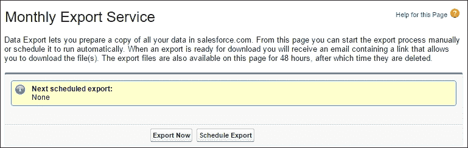

数据导出可以立即运行，也可以安排在未来某个时间运行，如以下小节所述。

## 立即导出

**立即导出**选项为您的文件准备即时导出。此选项仅在上次导出后已过去一周时可用，并显示以下截图中所示的选项：

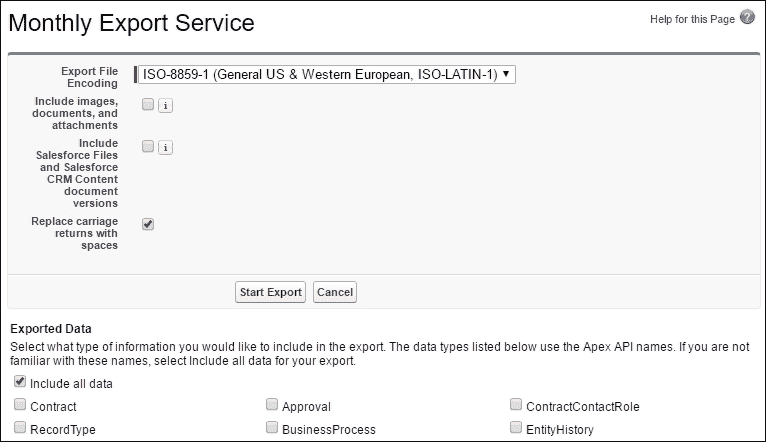

## 计划导出

**计划导出**选项允许您安排每周或每月的导出过程，并显示以下截图中所示的选项：

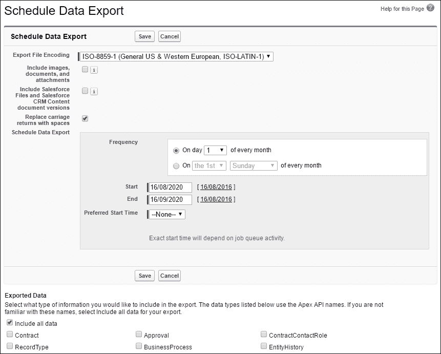

### 注意

如果在安排数据导出后，组织中创建了新对象，您必须重新安排数据导出，以便将新创建的对象包括在内，如果您希望它们包含在导出数据中。

# 回收站

**回收站**可以通过点击**主页**标签中的侧边栏链接来访问，如下图所示：

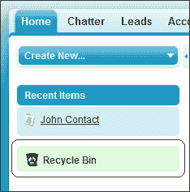

**回收站**是已删除数据存储的位置。它可以访问 15 天，之后数据将永久删除并且无法恢复。

点击**回收站**，可以查看您和您组织删除的项目，如下图所示：

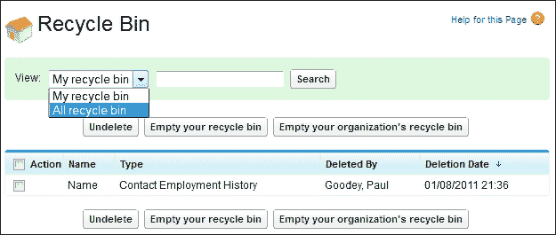

您可以使用**清空回收站**按钮，在 15 天到期前永久删除已删除的项目。

### 注意

**回收站**中的记录不计入您的组织存储限制。

为了计算**回收站**能够存储的记录数量，Salesforce 使用以下公式：25 乘以您存储中兆字节（MB）的数量。

例如，如果您的组织有 1 GB，即 1000 MB（这里使用 1000 MB 作为存储单位，而不是 1028 MB），那么您的限制是 25 乘以 1000 MB，等于 25,000 条记录。

当您的组织达到**回收站**限制时，Salesforce CRM 应用会自动删除最旧的记录（如果它们已在回收站中至少两小时）。

# 数据存储使用情况

Salesforce CRM 有两类存储，分别是用于存储记录（例如机会、帐户或自定义对象数据记录）的数据存储和用于存储文件附件（例如演示文稿、电子表格、图像、PDF 等）的文件存储。

Salesforce CRM（企业版）至少提供 1 GB 的数据存储和 11 GB 的文件存储。总共，这 12 GB 的存储量（1 GB 数据+11 GB 文件）是为 Salesforce CRM 组织分配的最小总存储。然而，随着更多活跃用户的增加，存储量会增加，因为每个用户的数据存储为 20 MB，文件存储为 2 GB。

举个例子，一个有 500 名活跃用户的组织，其数据存储量增加到 10 GB。这是通过 500（用户）乘以 20 MB 计算得出的，等于 10,000 MB 或 10 GB。文件存储量增加到 1,000 GB（500 用户乘以 2 GB）。

要查看你组织的已用数据空间和已用文件空间，请导航到**设置 | 数据管理 | 存储使用情况**。在这里，你可以查看数据和文件存储的限制及已使用的量，每种记录类型的使用量，以及当前的文件存储使用情况。你还可以查看数据和文件存储的顶级用户。若要查看某个列出的用户存储了什么，你可以点击该用户的名字。

# 测试你的知识问题

现在你将看到一些关于 Salesforce CRM 管理中数据管理关键功能的问题，这些内容已经在本章中介绍过。答案可以在本章末尾找到。

## 问题

我们提出了六个问题，以验证你对数据验证、依赖选择列表、数据导入和导出工具以及**回收站**存储的理解。

### 问题 1 - 数据验证规则

已创建一个验证规则，以确保用户不会将机会的关闭日期设置为过去的日期。如果用户尝试保存一个关闭日期为去年日期的机会记录，会发生什么？（请选择一个）：

**a**) 在记录保存后，验证规则中定义的错误消息会显示在记录上

**b**) 在记录保存后，验证规则中定义的错误消息会通过电子邮件发送给用户

**c**) 在记录上显示验证规则中定义的错误消息，且记录不会被保存

**d**) 在记录上显示验证规则中定义的错误消息，用户会看到一个确认屏幕，可以选择继续或取消保存记录

### 问题 2 - 依赖字段

以下哪些说法（如果有的话）关于依赖选择列表是正确的？（请选择所有适用项）：

**a**) 多选选择列表可以是依赖选择列表

**b**) 复选框可以是依赖字段

**c**) 标准选择列表字段可以是依赖字段

**d**) 自定义选择列表字段可以是依赖字段

### 问题 3 - 数据导入向导

以下哪种对象类型不能使用数据导入向导导入？（请选择一个）：

**a**) 帐户

**b**) 潜在客户

**c**) 机会

**d**) 解决方案

### 问题 4 - 数据导入向导功能

数据导入向导为将数据导入 Salesforce CRM 提供了哪些好处？（请选择两个）：

**a**) 能够导入所有标准和自定义对象的数据

**b**) 防止重复记录被导入

**c**) 能够导入超过 50,000 条记录

**d**) 防止工作流规则在记录加载到系统时触发

### 问题 5 - 数据加载器与导入向导的比较

以下哪种数据导入工具可以用于将 25,000 条案例记录导入 Salesforce？（请选择所有适用项）：

**a**) 数据导入向导

**b**) 数据加载器

**c**) 针对案例对象的单独导入向导

**d**) 以上都不是

### 问题 6 - 回收站

回收站会存储已删除的数据多少天？（请选择一个）：

**a**) 5

**b**) 10

**c**) 15

**d**) 30

## 答案

下面是关于数据验证、依赖下拉列表、数据导入导出工具以及**回收站**存储的六个问题的答案。

### 答案 1 - 数据验证规则

答案是**a）**数据验证规则允许你指定自己的业务特定标准，以防止用户在一个或多个字段中保存无效数据。在这种情况下，如果用户输入了无效的**关闭日期**（过去的日期），则会在记录中显示验证规则定义的错误消息，并且记录不会被保存。

### 答案 2 - 依赖字段

答案是**a）**多选下拉列表可以是依赖下拉列表，和**d）**自定义下拉列表字段可以是依赖字段。多选下拉列表可以是依赖下拉列表，但不能是控制字段。复选框字段可以是控制字段，但不能是依赖字段。标准下拉列表字段可以是控制字段，但不能是依赖字段。自定义下拉列表字段可以用作控制字段或依赖字段。

### 答案 3 - 数据导入向导

答案是**c）**在列表中，机会（Opportunity）是无法通过数据导入向导导入的对象类型。

### 答案 4 - 数据导入向导功能

答案是**b）**防止重复记录被导入，和**d）**防止工作流规则在记录加载到系统时触发。**数据导入向导**可以用于导入账户、联系人、潜在客户、解决方案和自定义对象记录；防止重复记录被导入；导入最多 50,000 条记录；选择是否在数据加载时允许工作流规则触发。

### 答案 5 - 数据加载器与导入向导对比

答案是**b）**数据加载器。**数据导入向导**和个人导入向导都不支持导入案例记录。

### 答案 6 - 回收站

答案是**c）**删除的数据存储在回收站中，可以在 15 天内访问，之后数据将被永久删除，无法恢复。

# 总结

在本章节中，我们描述了通过使用数据验证规则和依赖字段来提高数据质量的功能。

我们还看了 Salesforce CRM 中用于将数据导入和导出系统的选项和工具。我们简要概述了 Salesforce 中的数据存储功能，以及如何导出备份数据和**回收站**。

最后，我们提出了一些问题，以帮助澄清 Salesforce CRM 管理在数据管理方面的一些关键功能。

在下一章节中，我们将讨论数据分析，届时我们将看到如何在 Salesforce 中报告数据。

下一章节包括设置报告、仪表盘、自定义报告，以及如何使用报告构建器的讨论。
