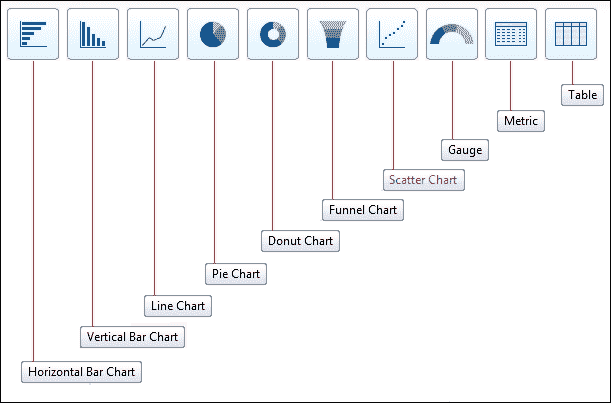

# 第六章：通过报告和仪表板生成数据分析

在上一章中，我们研究了 Salesforce CRM 中帮助管理数据质量和完整性的各种机制。上一章还概述了可以用于数据进出 Salesforce CRM 的导入和导出功能及工具。

本章将继续探讨数据的主题，但从报告的角度出发，我们将描述 Salesforce CRM 中的数据分析构建模块。

这些分析工具允许你和你的用户自定义和管理数据的报告与可视化展示。例如，销售团队可以生成显示销售管道的报告，营销团队可以报告活动的进展，而你可以创建显示 Salesforce 组织中活跃用户数量的报告。报告数据的功能描述得非常详细，包括如何创建、定制和导出专用报告数据的细节。报告也可用于提高数据质量。例如，你可以创建一个报告，列出所有缺少年度收入字段的账户。

我们还将详细讨论如何利用这些分析元素提供复杂的仪表板图表和图形。

Salesforce CRM 数据分析包括报告、仪表板和文件夹等基本机制：

+   **报告**：报告是 Salesforce CRM 中数据分析的核心构建模块，结果集的记录以行和列的形式展示，以匹配指定的标准。报告结果可以进一步筛选和分组，也可以以图形摘要的形式展示。

+   **仪表板**：仪表板是从报告中的数据生成的可视化组件。这些组件可以包括以下五种类型：图表、仪表、表格、指标和 Visualforce 页面。

+   **文件夹**：文件夹用于存储报告和仪表板，可以设置为只读或读写。要配置哪些用户可以访问某个文件夹，你可以将其设置为所有用户可访问、对所有用户隐藏，或仅供特定用户访问。在限制访问给特定用户时，可以选择通过公共组、角色以及角色和下属来进行限制。

# 报告

在 Salesforce CRM 中，报告可以通过**报告**标签访问（如下图所示）。当你的组织首次通过 Salesforce 设置时，系统会自动提供各种预定义的报告。这些预定义的报告被称为标准报告，并存放在称为标准报告文件夹的预准备报告文件夹中。例如，标准报告提供有关账户和联系人、机会、预测、产品和销售管道的信息；提供关于组织线索的详细信息；关于可定制预测的预测报告信息等。

在本节关于报告的内容中，我们将概述可用的标准报告，并特别描述一些针对系统管理员的关键报告。

预定义的报告适用于现有的对象和字段。它们不适用于任何你创建的新对象的报告。对此，我们将讨论如何扩展现有报告，以及如何创建全新的报告类型，这些在 Salesforce CRM 中被称为自定义报告类型。

预定义的报告适用于现有的对象和字段。它们不适用于任何你创建的新对象的报告。对此，我们将讨论如何扩展现有报告，以及如何创建全新的报告类型，这些在 Salesforce CRM 中被称为自定义报告类型。

在从标准或自定义报告类型构建报告时，Salesforce 提供了一个功能齐全的拖放编辑器，用于简化报告的设置和布局。

我们将首先看看如何使用报告文件夹，报告文件夹有助于组织并控制用户对 Salesforce CRM 中报告的访问。当我们点击**报告**标签时，**报告和仪表板**主页展示了以下功能：

1.  这表示**新建报告**和**新建仪表板**按钮。

1.  这表示**文件夹**搜索框，允许用户搜索特定的报告和仪表板文件夹。

1.  这表示**新建报告文件夹**和**创建新仪表板文件夹**选项。

1.  这表示**报告**搜索框，允许用户搜索特定的报告和仪表板。

1.  这表示**报告和仪表板文件夹**窗格，使用不同的图标显示文件夹是报告还是仪表板。

1.  这表示**主要报告和仪表板列表视图**部分。它允许过滤最近的报告标签，显示适当的报告，并允许创建新的报告。

这些功能可以通过各自的编号来识别，如下截图所示：

## 报告和仪表板文件夹

**报告和仪表板文件夹**部分允许你和你的用户选择存储在该特定文件夹中的报告和仪表板。

在 Salesforce CRM 中，你不能将报告保存到标准报告文件夹。你可以将报告保存到`我的个人自定义报告`文件夹、`未归档公共报告`文件夹，或者你有适当读/写权限的任何自定义报告文件夹。

### 注意

标准报告不能被删除或移除，但文件夹和标准报告类型（在本章后续部分会进一步描述）可以被隐藏。

## 创建新的报告和仪表板文件夹

使用创建文件夹图标和相关选项允许你为自定义报告和仪表板创建新的报告和仪表板文件夹，如下截图所示：

创建新文件夹的选项并非对所有用户都可用。访问**创建新文件夹**选项所需的用户权限是**管理公共报告**。

### 提示

建议为帮助管理组织中的报告结构创建新文件夹。

你不能将标准报告和自定义报告混合在同一个文件夹中。

## 将喜爱的报告文件夹保持在视野中

报告和仪表盘文件夹面板可能包含许多报告和仪表盘文件夹，这意味着用户需要上下滚动列表以找到所需的文件夹。为了帮助用户将喜爱的文件夹保持在列表顶部，他们可以将报告和仪表盘文件夹固定在文件夹列表的顶部。可以通过点击文件夹名称右侧并选择**固定到顶部**选项来实现，如下截图所示：

与许多 IT 系统不同，在 Salesforce CRM 中创建报告非常简单；用户可以自行创建报告。由于用户创建报告非常容易，如果没有仔细的控制和组织化的报告创建方式，报告数量很容易迅速增加并变得难以管理。例如，你应该创建只有特定用户可以访问的报告文件夹。这些文件夹可以限制为特定部门或地理区域。例如，报告可以仅限于全球营销或北美销售团队。

要创建新的报告文件夹，点击**新建报告文件夹**选项，在此页面中展示了**新建报告文件夹**页面，如下截图所示：

在这里，你需要提供报告文件夹的名称，并决定公共文件夹访问权限是设置为只读还是读写。你还可以选择将报告从未归档的`公共报告`文件夹中移动。你必须指定用户的访问权限。你可以选择所有用户可访问、所有用户不可见，或某些用户可访问的选项。这些选项可在以下选项中进行选择：**公共组**、**角色**以及**角色及下属**。

### 注意

只有拥有**管理公共报告**权限的用户才能从报告文件夹中删除报告。即使该用户具有读/写权限并且是自己创建的报告，依然如此。

## 报告和仪表盘的增强共享功能

此设置允许用户与其他用户、角色或公共用户组共享报告和仪表盘。当该功能启用时，Salesforce 会将之前描述的公共报告文件夹访问级别转换为基于文件夹访问权限和用户权限的组合方式来确定对文件夹的访问。

### 注意

增强的访问级别将所有用户默认作为**查看者**（默认）访问共享给他们的报告和仪表盘文件夹。

要启用报告和仪表板的增强型共享功能，请导航到**设置 | 报告和仪表板 | 自定义 | 文件夹共享**。勾选**启用报告和仪表板文件夹的访问级别共享**复选框，然后点击**保存**。

用户然后可以通过点击文件夹窗格中文件夹右侧的按钮，选择**共享**选项来共享报告和仪表板文件夹，如以下截图所示：

当用户点击**共享**选项时，系统会展示一个新屏幕，允许他们为其他用户设置共享访问权限。选项有**查看者**、**编辑者**或**管理员**，如以下截图所示：

### 查看者访问

查看者访问设置允许用户查看、刷新和运行报告和仪表板。

### 编辑者访问

编辑者访问设置提供与查看者相同的访问权限，并附加编辑、移动、保存和删除报告和仪表板的能力。

### 管理员访问

管理员访问设置提供与编辑者相同的访问权限，并附加共享和重命名文件夹的能力。

## 创建报告

创建新报告的基本步骤如下：

1.  从**报告**选项卡点击**新建报告**...按钮。

1.  选择报告类型并点击**创建按钮**。

1.  自定义报告，输入报告名称，然后保存或运行。

### 提示

**报告名称分两行：**

可以将报告名称格式化为分两行显示，从而使报告名称更易于显示。这可以通过输入冒号（:）字符来实现。只需输入带有冒号字符的报告名称，例如：A01 北美：四月销售，报告名称将在查看报告时显示为两行。

**注意：这是一个未文档化的功能，可能不被 Salesforce 支持。**

选择适当的报告类型是创建报告中最重要的步骤之一。报告类型设置了可以在报告中显示哪些记录的规则。它们允许根据主对象与任何相关对象之间的关系，在报告中使用预定义的记录和字段集合。

### 提示

**报告的最佳实践：**

建立报告命名规范，例如：A01 NA 四月销售、B02 INT 四月销售等，这可以通过编码方案使得报告的引用更加容易（最大字符数限制为 40 个字符）。使用描述字段准确描述报告的用途（最大字符数限制为 255 个字符）。考虑将只用于仪表板的报告放在单独的报告文件夹中，例如命名为仪表板报告销售。定期进行春季清理，删除不需要的报告。你还可以创建临时报告，这些报告对所有用户隐藏，并在你确定是否需要这些报告时保存在那里。

在 Salesforce CRM 应用程序中，有标准报告类型，作为系统管理员，您可以设置自定义报告类型。

### 注

**术语检查：**

自定义报告类型与 Salesforce CRM 中的自定义报告不同。当用户在**报告**主页上使用**新建报告**按钮创建新报告时，这通常被称为自定义报告。自定义报告类型是仅系统管理员可以创建的报告模板。它提供一组自定义的关联对象和字段，用于生成预定义的报告模板，任何用户都可以基于这些模板创建自定义报告。

### 标准报告类型

Salesforce 提供了大量预定义的标准报告类型，并且通过**报告**标签可以访问标准报告文件夹，如下表所示：

| **标准报告类型** | **标准报告文件夹** | **描述** |
| --- | --- | --- |
|  | 未归档公共报告 | 系统管理员创建的共享自定义报告，但未移入自定义报告文件夹 |
|  | 我的个人自定义报告 | 用户通过点击“另存为”或在报告中点击保存的自定义报告 |
| 账户与联系人 | 账户和联系人报告 | 账户和联系人信息 |
| 活动 | 活动报告 | 关于日历事件和任务的信息 |
| 行政报告 | 行政报告 | 关于您的 Salesforce 用户、文档和报告的信息 |
| 呼叫中心报告 | 呼叫中心报告 | 关于使用 Salesforce CRM 呼叫中心处理的电话的信息 |
| 活动 | 活动报告 | 关于营销活动的信息 |
| CRM 文件和内容报告 | 文件和内容报告 | 关于文件和 Salesforce CRM 内容的信息 |
| 预测 | 预测报告 | 关于可定制预测的预测报告详细信息 |
| 潜在客户 | 潜在客户报告 | 关于潜在客户的信息 |
| 机会 | 机会和预测报告 | 关于机会、预测、产品和销售管道的详细信息 |
| 价格书、产品和资产 | 价格书、产品和资产报告 | 关于产品、价格书和资产的信息 |

从**创建新报告**屏幕开始，在 Salesforce CRM 中创建标准报告时，首先需要选择一个合适的报告类型，如下图所示：

默认情况下，标准报告文件夹设置为只读，所有用户都可以访问。

### 行政报告

系统管理员最常用的标准报告之一是管理员报告，可以在`行政报告`文件夹中找到，用于分析您的 Salesforce 用户文档、报告和登录位置。例如，您可以运行关于活跃 Salesforce 用户的报告，查看哪些用户正在登录。以下是可用的行政报告：

| **报告** | **描述** |
| --- | --- |
| 所有活跃用户 | 列出组织中的活跃用户以及他们上次登录的时间 |
| 本周登录的用户 | 列出过去七天内登录 Salesforce 的所有用户 |
| 文档 | 列出每个文档文件夹中的文档 |
| 新登录位置 | 列出用户、IP 地址及登录日期 |

### 注意

**创建自定义报告以列出你组织中的报告**：

你可以创建一个自定义报告，列出你组织中的所有报告及每个报告的最后使用时间。选择**管理报告**，然后选择**报告**作为报告类型。

## 隐藏标准报告类型

Salesforce 提供了大量的标准报告类型，并在**创建新报告**页面中展示。一些报告类型可能在你的组织中没有任何价值，只是增加了无用的报告类型列表。你可以通过勾选“选择报告类型以隐藏”复选框来隐藏不需要的标准报告类型，这会在每个报告类型旁显示勾选或叉号标记。

报告类型旁边的绿色勾选标记表示该报告类型是可见的。点击勾选标记将其更改为叉号标记，表示该报告类型被隐藏，如下图所示：

### 注意

隐藏的报告类型在**创建新报告**页面的搜索框中不会显示，如果你隐藏了文件夹中的所有报告类型，那么该文件夹也会变为隐藏状态。

## 自定义报告类型

除了标准报告类型，你还可以创建自定义报告类型。自定义报告类型扩展了所有组织用户可以用来创建或更新自定义报告的报告类型。

### 创建自定义报告类型

自定义报告类型的设置步骤如下：

1.  按名称、描述、主对象、开发状态和存储报告的类别定义自定义报告类型。

1.  选择自定义报告类型的相关对象。

1.  指定使用自定义报告类型创建报告时，报告可以显示的标准和自定义字段的布局。

1.  从**自定义报告类型**模板创建报告，以验证所有对象和字段定义是否正确。

一旦创建了自定义报告类型，你可以根据需要随时更新或删除它。

### 注意

当**自定义报告类型**模板被删除时，基于该模板创建的任何报告也会被删除。此外，任何基于被删除的`自定义报告类型`模板所创建的报告中的仪表板组件在查看时将显示错误信息。

### 定义自定义报告类型

要访问**自定义报告类型**页面，导航到**设置** | **创建** | **报告类型**。然后点击**新建自定义报告类型**：

#### 步骤 1 - 定义自定义报告类型模板

从**主对象**下拉列表中选择你希望用于构建自定义报告类型的主对象。

你选择的主对象决定了用户在从你的自定义报告类型创建或运行报告时可用的视图。例如，如果你选择帐户作为自定义报告类型的主对象，用户可以通过报告构建器的**所有帐户**或**我的帐户**下拉列表查看报告结果。

如果你选择**机会**，当用户基于该报告类型创建报告时，他们可以通过**我的机会**、**我的团队机会**或**所有机会**查看报告结果，如下图所示：

当`自定义报告类型`模板被保存时，所关联的主对象不能更改。因此，如果以后想要更改主对象，就必须定义一个新的自定义报告类型。

现在输入**报告类型标签**和**报告类型名称**字段，并为自定义报告类型输入描述。该描述将对创建报告的用户可见，并用于帮助解释`自定义报告类型`模板的用途。

### 注意

**报告类型标签**字段最多可以输入 50 个字符，描述字段最多可以输入 255 个字符。

选择存储自定义报告类型的类别。然后，选择开发状态。这里，你可以在首次创建自定义报告类型时选择**开发中**，以便在定义过程中将其隐藏。这将隐藏**自定义报告类型**模板，并防止用户从该报告类型创建和运行报告。当你完成定义并希望允许用户使用该**自定义报告类型**模板创建和运行报告时，选择**已部署**。

现在点击**下一步**，选择在从自定义报告类型运行时，报告可以显示的对象关系。

#### 步骤 2 - 定义报告记录集

在**自定义报告类型**模板的初始定义之后，可以选择其对象关系。这些对象关系决定了报告中可显示的对象和字段。通过图示，它们帮助理解在**自定义报告类型**中形成的对象关系，当从**自定义报告类型**模板创建报告时，将显示数据字段：

在这个名为**有或没有会话的事件**的**自定义报告类型**示例中，我们有一个自定义主对象**事件**，它与**会话**和**讲师**有关系。

要将与另一个对象关联的对象添加到报告类型中，请点击矩形部分**(点击以关联另一个对象)**。然后，从下拉列表中选择该对象。

可供选择的对象基于主对象与其他对象的关系。

例如，我们的自定义对象`Event`被设置为**Custom Report Type**模板的主对象，因此只能选择与`Events`相关的标准和自定义对象，如`Sessions`。这也适用于添加到**Custom Report Type**模板中的附加对象。在我们的示例中，选择`Events`作为主对象，`Sessions`作为次级对象时，只有与`Sessions`相关联的对象才能作为第三个对象添加到**Custom Report Type**模板中，我们的自定义对象`Speakers`即是其中之一。

### 注意

尽管**Custom Report Type**模板最多可以设置四个对象级别，但某些对象组合可能无法达到这一限制。例如，如果你将联系人添加为主对象，机会添加为次级对象，活动添加为第三个对象，那么你不能再添加任何其他对象，因为活动没有任何子对象关系。

在图表中，你可以选择将第一个关系设置为主对象，并且可以选择**"A"记录可能有或可能没有相关的"B"记录**或**每个"A"记录必须至少有一个相关的"B"记录**。

以下段落描述了选择“可能有或可能没有”选项的影响。

所有后续对象会自动包含自定义报告类型上的“可能有或可能没有”关联。例如，如果帐户是主对象，机会是次级对象，并且你选择帐户可能有或可能没有机会，那么任何在`CustomReportType`模板中包含的第三层和第四层对象都会默认为“可能有或可能没有”的关联。

当对象 A 没有对象 B 时，空白字段将显示在对象 B 的报告结果中。例如，如果用户运行一个关于有或没有机会的帐户的报告，那么没有机会的帐户将显示空白的机会字段。

### 编辑布局

点击**保存**后，**Custom Report Type**定义和对象关系将设置为如下图所示：

现在可以编辑布局，以指定报告在从模板创建或运行时可以显示哪些标准字段和自定义字段。

点击**预览布局**可查看哪些字段将在基于此报告类型的报告的**选择列**页面中显示。

要开始配置布局，请从右侧框中选择字段并将其拖动到左侧的某个部分，如下图所示：

你可以通过从视图下拉列表中选择一个对象来查看特定对象的字段，并按需要将字段排列在各部分中，以便它们在用户端显示。

未拖动到部分上的字段在用户使用此报告类型创建报告时将不可见。

### 注意

每个`Custom Report Type`模板最多可以添加 1,000 个字段。

要重命名或设置哪些字段默认选中供用户使用，请选择一个或多个字段并点击**编辑属性**，如下图所示：

点击**默认选中**复选框，选择要默认选中的字段。更改要重命名的字段旁边的**显示为**字段中的文本。要重命名部分，请点击现有部分旁边的**编辑**，或者点击**创建新部分**来创建新部分。然后点击**保存**。

### 注意

在引用的对象上创建的任何新字段不会自动添加到自定义报告类型中。如果希望新字段在自定义报告类型中供用户选择，您必须编辑自定义报告类型并手动配置这些字段。

## 运行报告

**报告**标签呈现报告首页，用户可以在此搜索报告并为报告选择或创建文件夹：

文件夹列表（由文件夹图标表示）显示所有用户有权限访问的报告文件夹。在此部分中，您可以查看、编辑和管理您组织的所有公共报告文件夹。通过点击**重新排序文件夹**选项，您可以更改文件夹在子标签中显示的顺序。

右侧部分显示所选报告文件夹，并允许用户点击**操作**下拉菜单，该菜单出现在第一列。在此，选项包括**编辑**、**删除**和**导出**。

选择**删除**选项将会删除报告并将其移至回收站。在此，您将在执行删除操作之前收到警告提示。

在此之前，您需要检查报告是否不再需要，因为它将从所有用户中移除，但您可以在 15 天内从回收站恢复它（如果需要）。

### 注意

无法删除正在被仪表板使用的报告。要删除这些报告，您必须先删除调用的仪表板组件。

拥有适当权限的用户可以点击**导出**，将报告直接导出为 Excel 电子表格或 CSV 文件，具体内容将在下文中描述。

## 打印和导出报告

要打印报告，用户可以执行以下步骤：

1.  点击**打印视图**按钮以打开（或保存）报告为打印视图，如下图所示：

1.  点击打印图标。

要导出报告，具有**导出报告**系统权限的用户（无论是在其个人资料中还是通过权限集）可以执行以下步骤：

1.  点击**导出详情**。

1.  为语言设置适当的文件编码选项。默认选项为**ISO-8859-1（通用美国与西欧，ISO-LATIN-1）**，如下图所示：

1.  将**导出文件格式**字段设置为**Excel**或**CSV**。

1.  点击**导出**。

在浏览器的**文件下载对话框**中，用户可以选择将文件保存到本地磁盘或网络磁盘的指定位置。

### 注意

可以从报告中导出最多 256 列和 65,536 行的数据。

## 报告注意事项

在运行报告时，无论是在 Salesforce CRM 中还是在其他任何信息系统中，都需要考虑各种问题。处理的数据量通常有限制，或者对现有报告所做更改的类型也有一定的限制。接下来将描述如何控制 Salesforce 中返回的数据量，以及更改现有报告的影响。

### 运行大型报告

如果报告返回的记录超过 2,000 条，则只显示前 2,000 条记录。要查看报告结果的完整视图，请点击**导出详情**。

### 注意

报告如果超过十分钟才能完成，将会被 Salesforce 系统取消。

### 报告超时警告

报告超时警告分析从**运行报告**页面调用的报告。报告的标准超时时间是十分钟。如果报告被识别为非常复杂且可能会超时，将显示警告。

报告超时警告分析手动激活的报告，忽略通过仪表盘或定时报告运行的报告。

### 注意

你可以通过向 Salesforce 客服请求，将报告的超时周期从默认的十分钟延长。

如果你的组织已将限制延长到例如 20 分钟，报告超时警告出现的概率可能会降低。然而，请记住，复杂度较高的报告未来仍然可能会超时。

### 提示

Salesforce 建议你按照其在线帮助部分中的*改善报告性能技巧*来简化报告。

你可以通过导航到**设置 | 自定义 | 报告与仪表盘 | 用户界面**设置来禁用报告超时警告。取消勾选**启用报告超时警告**复选框，然后点击**保存**。

### 将报告导出到后台

将报告导出到后台使你可以在后台运行报告，这样你就可以在不等待报告结果显示的情况下继续在 Salesforce 中工作。将报告导出到后台在创建大型报告时非常有用，否则由于报告数据量大可能会导致超时。

当报告运行完成并准备好查看结果时，Salesforce 会发送一封电子邮件通知。该邮件包含一个链接，点击后可以查看报告信息。从此页面，你还可以下载 CSV 格式的报告结果。

### 注意

将报告导出到后台的功能只能通过向 Salesforce 客服发送请求来启用。

### 用户验证测试

出于安全考虑，可以设置用户验证，要求用户在从 Salesforce CRM 应用程序导出数据之前进行测试。此文本数据输入测试可以防止自动化程序试图访问 Salesforce 中的数据。此功能可通过 Salesforce 客户支持请求提供。

为通过测试，用户必须在文本框字段中输入显示的两个单词并提交。请注意，输入到文本框字段中的单词必须由空格分隔。

Salesforce 使用**CAPTCHA**技术，由**reCAPTCHA**提供，用于用户验证测试。

CAPTCHA 是**完全自动化的公共图灵测试**的缩写，用于区分计算机和人类。这是一个计算机数据输入验证，确保输入是由人类进行的。验证要求用户完成一个小测试，计算机首先创建该测试，并检查结果。因为只有人类才能解答这个测试，当正确答案返回时，计算机就会接受这是一个人类请求，而不是自动化的计算机程序。

### 批量删除报告

你可以单独删除报告，也可以使用**批量删除报告**页面来搜索并选择多个要删除的报告。这可以帮助清理报告标签中的报告列表，删除不再使用的多个报告。

要批量删除报告，请导航到**设置** | **数据管理** | **批量删除记录**，然后单击**批量删除报告**链接。指定所选报告必须匹配的标准，例如，**报告名称包含活动**，然后点击**搜索**。任何匹配的报告列表将显示出来。然后，你可以选择并点击**删除**，如下面的截图所示：

### 注意

你不能批量删除其他用户的个人报告、仪表板中的报告或分析快照。

### 报告生成器

Salesforce CRM 中的报告生成器是一个可视化编辑器，用于创建和修改报告。报告生成器界面采用拖放功能来配置报告，界面由以下三个部分组成，称为窗格：

+   **字段**窗格

+   **筛选器**窗格

+   **预览**窗格

以下截图显示了报告生成器页面，该页面以全屏窗口显示，以最大化显示**字段**、**筛选器**和**预览**窗格：

要退出报告生成器编辑页面，点击页面左上角的**关闭**按钮，此时你会被提示保存任何更改。

你也可以点击页面左上角的 Salesforce 徽标。然而，你不会被提示保存任何更改。我们现在将详细查看每个窗格，首先从**字段**窗格开始。

#### **字段**窗格

**字段**窗格显示在报表生成器页面的左侧，如名称所示，列出所选报表类型页面布局中设置的所有可访问字段。字段列表按照分区组织，这些分区设置在关联报表类型的页面布局中。在此，可以使用窗格顶部的**快速查找**搜索框轻松识别字段。还可以通过使用字段类型过滤器限制显示的字段数量。在此窗格中，可以将字段拖动到**预览**窗格中以将其添加到报表中。还可以为特定报表创建额外的计算字段。这些称为**自定义摘要公式和桶**。

#### 过滤器窗格

若要限制运行报表时返回的数据结果行数，可以通过单击报表顶部的**隐藏详情**按钮来限制报表结果，或者可以添加自定义过滤器。要恢复返回的完整数据集，请单击**显示详情**按钮。

对于表格报表（仅限），您可以通过单击报表生成器中从**添加**按钮访问的**过滤器**窗格中的**添加行限制**来设置要显示的最大记录数。

**过滤器**窗格显示在报表生成器页面的右上部，用于配置视图、时间段以及任何自定义过滤器，以限制实际显示在报表中的数据。

在过滤器窗格中，单击**添加**框以添加报表筛选器，如下所示：

报表筛选器根据以下条件设置报表中的数据标准：

| **报表筛选器** | **描述** | **备注** |
| --- | --- | --- |
| **字段筛选** | **字段筛选**允许您设置字段、操作符和数值。 | 例如，**账户名称等于 Acme**。 |
| **筛选逻辑** | **筛选逻辑**添加布尔条件以控制如何评估字段筛选。 | 例如，**筛选器 1 和（筛选器 2 或筛选器 3）**。在应用筛选逻辑之前，必须添加至少一个字段筛选器。 |
| **交叉筛选** | **交叉筛选**允许您使用带有或不带子筛选器的相关对象上的字段链接。 | 例如，对于**带有机会的账户**的交叉筛选，您可以仅显示具有已关闭赢取机会的账户。 |
| **行限制** | 使用**行限制**，您可以设置要显示的最大行数；选择一个字段进行排序以及排序顺序。 | 仅适用于表格报表。具有有限行数的表格报表可用于仪表板。 |

#### 预览窗格

**预览窗格**是可以自定义报告的地方。你和你的用户可以添加、重新排列或删除列、汇总字段、公式和字段分组。首次进入报告构建器时，**预览窗格**显示初步结果，提供一个起点，以便对报告结果进行后续的调整和优化。在**预览**窗格中，你还可以设置所需的报告格式，可以是**表格**、**汇总**或**矩阵**。

预览仅显示有限数量的结果记录。你需要实际运行报告才能查看所有结果。

你可以通过拖放报告列来更改它们显示的顺序。点击数据列标题，可以根据该列对报告进行排序。排序还可以通过点击**列**菜单，然后从下拉列表中选择**升序排序**或**降序排序**选项来执行。

当未选择**显示详情**时，**排序**功能将被禁用。

如果某个字段已添加到预览窗格，但不需要该字段，可以通过抓住其列标题并将其拖回**字段**窗格来将其删除。你也可以点击列菜单并选择**移除列**，或点击**移除所有列**以清除**预览**窗格中的所有字段。

当**显示详情**被禁用时，你只能添加汇总字段。

### 提示

**设置日期范围选项为所有时间：**

在首次创建涉及日期的报告时，日期范围可能最初未设置正确。因此，可能不会返回明显的结果。通过将日期范围设置为**所有时间**，你很可能会看到一些数据返回，这可以作为快速检查报告是否按预期工作的有效方法。

## 报告格式

Salesforce CRM 提供以下四种报告格式：**表格**、**汇总**、**矩阵**和**联接**。接下来将概述每种格式的功能和优点。

### 表格报告格式

表格报告是报告数据最简单、最快捷的方式。它们类似于电子表格，由按行列出的记录集和按列排序的字段组成。表格报告最适合创建记录列表或带有单一总计的列表，因为它们不能用于对数据进行分组。

### 注意

除非返回的行数被限制，否则表格报告不能在仪表板中使用。

### 汇总报告格式

汇总报告与表格报告类似，不同之处在于它们允许对数据行进行分组。它们可以用于显示基于某个字段值的子总和的报告。如果没有分组的汇总报告，实际上就是表格报告的显示形式。

### 注意

汇总报告可以作为仪表板组件的源报告。

### 矩阵报告格式

矩阵报告与汇总报告类似，但它还允许通过行和列对数据进行分组和汇总，并且可以用于比较相关的总计。

矩阵报告对于汇总大量数据非常有用，可以比较多个不同字段中的值，或按日期、产品、人员、地区等进行数据分析。

### 注意

矩阵报告可以作为仪表板组件的源报告。

### 联合报告格式

联合报告是可以存储和分组多个报告的报告，并允许你构建一个包含来自多个报告类型的数据的单一报告。

一个联合报告最多可以包含五个报告块，这些报告块可以来自标准报告或自定义报告类型，但只有在它们共享一个共同的对象关系时才能包含。例如，如果你有一个包含`机会`报告类型的联合报告，那么你可以添加`联系人`报告类型，因为`机会`和`联系人`对象都与`账户`对象有关系。

对于包含多种报告类型的联合报告，所有报告类型共享的字段称为公共字段。公共字段会出现在**公共字段**区域的**字段**窗格中，并可以用于将不同的报告块进行分组。

### 注意

如果联合报告包含一个**报告图表**，则可以将其作为仪表板组件的源报告，通过在仪表板组件中配置“使用源报告中的图表”设置来实现。以下功能在联合报告中不可用：**桶**字段、**交叉**筛选器、**显示的行数**筛选器和**条件高亮**。

# 分组

可以为汇总报告、矩阵报告和联合报告添加分组，以便将报告数据的各个部分进行分组。例如，你可能希望按照账户的员工数量对账户进行分组。

要添加汇总字段，请按照以下步骤操作：

1.  从**字段**窗格中拖动字段。

1.  将字段拖动到**预览**窗格的分组区域。

1.  等待加载对话框完成。

1.  观察字段在分组区域显示的内容：

这将生成一个报告，显示分组后的部分，如下图所示：

汇总报告最多可以有三个分组层级。

矩阵报告可以有两个行分组和两个列分组。你不能将相同的字段同时用于行和列的分组。

联合报告最多可以有三个分组层级。

## 汇总字段

汇总字段是对数字或货币字段进行的`SUM`、`AVERAGE`、`MIN`或`MAX`运算。汇总字段会在所有分组层级显示，包括使用汇总报告和矩阵报告格式创建的报告的总计层级。

要添加总结字段，请点击报告中字段的列下拉菜单（如下截图所示），然后选择**总结此字段**。你还可以通过选择**按此字段分组**来使用此方法添加分组，如下图所示：

点击**总结此字段**按钮可以为你提供以下选项：

这将生成如下所示的报告结果：

## 条件高亮显示

**条件高亮显示**是一种非常强大的方式，可以一目了然地显示报告中的值是否在可接受的范围内。通过设置**条件高亮显示**，你可以为报告中的不同值范围指定不同的颜色。该功能相对容易设置，并且提供了很好的视觉效果，然而，它在 Salesforce CRM 用户中似乎是一个未被充分利用的功能。

要启用**条件高亮显示**，报告必须至少包含一个总结字段或自定义总结公式，在撰写本文时，该功能仅适用于总结报告或矩阵报告。

要设置**条件高亮显示**，请点击**显示**，然后点击**条件高亮显示**，如报告构建页面的**预览**窗格所示：

你可以选择根据值是否低于低断点阈值、高于高断点阈值，或处于某个值范围内来设置颜色。下面的截图展示了如何设置这些阈值的示例：

以下表格旨在展示给定的设置，并帮助澄清这些阈值，并提到在上述设置下可以看到的颜色。

| **显示低于低断点值的数据颜色**。 | 低颜色和中颜色值之间的阈值。 | **显示低于高断点值和高断点值之间数据的颜色**。 | 中颜色和高颜色值之间的阈值。 | **显示高于高断点值的数据颜色**。 |
| --- | --- | --- | --- | --- |
| 在这个示例中：红色 | 在这个示例中，60,000 与低断点值完全相同的值显示为中间颜色。 | 在这个示例中：琥珀色 | 在这个示例中，95,000 与高断点值完全相同的值显示为高颜色。 | 在这个示例中：绿色 |

运行报告时，结果如下所示：

# 自定义总结公式

自定义总结公式允许你根据报告类型中可用的数字字段计算值。这意味着如果计算结果仅在报告中相关，你无需为其创建自定义公式字段。

公式必须少于 3,900 个字符。每个报告最多可以创建五个公式。自定义汇总公式可用的字段有**数字**、**百分比**和**货币**。要向汇总或矩阵报告中添加新公式，请导航至**字段**面板，顶部会显示公式文件夹图标。双击**添加公式**选项，您可以定义它，然后点击**确定**。在报告中定义新公式后，它会自动作为列添加到预览面板中，作为汇总报告的列以及矩阵报告的汇总字段。下图展示了名为**机会平均预期收入**的公式，它位于**字段**面板的左上方，并如何自动出现在预览面板的右侧（示例汇总报告中的列）：

定义公式字段，请按以下步骤操作：

1.  在**字段**面板中点击**添加公式**：

1.  输入公式的列名。该列名将在报告中显示。

1.  可选地，输入描述。

1.  从**格式**下拉列表中选择数据类型。

1.  从**小数位数**下拉列表中选择小数位数。

1.  设置此公式显示的位置。

1.  公式计算将在所选级别的报告中显示。

1.  通过选择**汇总字段**下拉列表中的某个字段，然后选择汇总类型来构建公式：

    | **汇总类型** | **描述** |
    | --- | --- |
    | 总和 | 字段或字段组中的数据总和 |
    | 最大值 | 字段或字段组中的数据最大值 |
    | 最小值 | 字段或字段组中的数据最小值 |
    | 平均值 | 字段或字段组中的数据平均值 |

1.  点击**运算符**以向公式中添加运算符。选择函数类别，选择要在公式中使用的函数，然后点击**插入**。

1.  点击**检查语法**以检查公式是否包含错误，然后点击**确定**。

    ### 提示

    **构建新报告时隐藏详情：**

    在构建新报告时，您可能无法预料返回多少记录。这可能正是报告创建的原因。您也许在尝试不同的报告格式，查看哪些数据被返回。在这些情况下，您应该设置**隐藏详情**选项，以防止返回详细数据，只显示报告的骨架，这样可以看到将返回的行数。限制行数对于表格报告非常有用，您可以将其用作仪表板表格和图表组件的源报告。然而，如果您更改报告格式，**行限制**设置将自动被移除。

# 桶字段

桶字段允许你根据报告类型中可用的字段对值进行分类。这意味着如果值仅在报告中相关，你不需要为类别或分段创建自定义公式字段。例如，销售经理可以根据金额将机会按大小进行分桶或分组，支持经理可以根据开票天数对案件进行分年龄，销售代表可以将账户分为战略账户。

### 注释

可作为桶字段的字段包括**数字**、**百分比**、**货币**、**选择列表**和**文本**字段。

# 更改报告格式

有时需要更改现有报告的报告格式。更改报告格式的影响如下：

| **报告格式更改** | **更改的影响** |
| --- | --- |
| 从表格报告更改为汇总或矩阵报告 | “显示的行”筛选器不适用于汇总或矩阵报告，因此会被移除。 |
| 从汇总、矩阵或联接报告更改为表格报告 | 表格报告不适用分组，因此分组会被从报告中移除。用于分组的字段会被移除，并且不会转换为表格报告中的列。 |
| 从汇总报告更改为矩阵报告 | 汇总报告的第一个分组用作第一个矩阵行分组。第二个汇总分组用作第一个列分组。第三个汇总分组用作第二个行分组。注意：使用报告向导时，第三个汇总分组会被自动移除。 |
| 从矩阵报告更改为汇总报告 | 矩阵报告的第一个行分组变为第一个汇总分组。第二个行分组变为第三个汇总分组。第一个列分组变为第二个汇总分组。矩阵报告的第二个列分组被移除。注意：使用报告向导时，第二个行分组和第二个列分组都会被移除。 |
| 从表格、汇总或矩阵报告更改为联接报告 | 矩阵报告的第一个行分组变为第一个汇总分组。第二个行分组变为第三个汇总分组。第一个列分组变为第二个汇总分组。矩阵报告的第二个列分组被移除。注意：使用报告向导时，第二个行分组和第二个列分组都会被移除。 |

# 仪表板

仪表板是从关联报告中的数据生成的可视化信息快照，并以图形元素的形式呈现。这些图形元素被称为仪表板组件，可以分为五种类型。

## 图表

图表组件类型可用于以图形方式显示数据，可以选择以下多种图表类型：水平和垂直条形图、折线图、饼图、甜甜圈图、漏斗图和散点图。

## 仪表盘

仪表盘组件类型可用于显示一个值，该值作为自定义设置范围的一部分进行显示。在这里，可以设置的范围可以表示低、中和高值，报告中的值会相应地绘制。

## 度量

度量组件类型可用于显示单个值。

## 表格

表格组件类型可用于以列的形式显示一组报告数据。

## Visualforce 页面

除了标准类型之外，Visualforce 页面组件类型可用于创建自定义组件类型，并以标准仪表板组件类型无法提供的方式展示信息。

仪表板最多可以包含 20 个组件，您可以通过将它们存储在具有适当权限的文件夹中来控制用户对仪表板的访问，文件夹可以是公开的、隐藏的，或仅限于特定的群组或角色。

仪表板还可以进一步配置为使用运行用户的概念运行，这意味着指定用户的安全设置决定了显示哪些数据。在这种情况下，所有仪表板查看者将根据设置为运行用户的用户的安全设置查看数据，而不考虑仪表板查看者自身的个人安全设置。

然而，更灵活和动态的方法允许您将运行用户设置为登录用户，这样每个用户都根据自己的数据访问级别查看仪表板。这被称为动态仪表板。

## 仪表板组件类型

在 Salesforce CRM 中，以下仪表板组件类型是可用的：

+   水平条形图

+   垂直条形图

+   折线图

+   饼图

+   圆环图

+   漏斗图

+   散点图

+   仪表盘

+   度量

+   表格

访问这些仪表板组件类型的标志在以下截图中显示：

### 创建仪表板

在创建仪表板之前，您需要准备好包含您希望显示的数据的源报告。

### 注意

这些源报告必须存储在您的目标仪表板查看者可以访问的文件夹中，否则他们将无法查看信息。

要创建仪表板，点击 **报告** 标签。这时会显示常见的报告和仪表板主页，标题为 **报告与仪表板**。在此页面中，点击 **新建仪表板** 按钮，如下图所示：

## 动态仪表板

动态仪表板根据查看仪表板的用户的安全设置运行。每个用户根据自己的访问级别查看仪表板。此方法帮助您将一个通用的仪表板组件集共享给不同访问级别的用户。一个单一的动态仪表板可以展示您组织各个层级的标准度量指标。

### 注意

在撰写本文时，Salesforce CRM 的限制允许企业版组织最多有 5 个动态仪表板，无限版最多有 10 个。

## 设置动态仪表板

在设置动态仪表板之前，你应该创建文件夹，确保所有仪表板查看者都能访问，并将动态仪表板和相应的组件源报告存储在其中。

要创建动态仪表板，请按照以下步骤操作：

1.  从**仪表板**标签中，按照本章中*仪表板*部分讨论的步骤创建一个新的仪表板。

1.  点击**视图仪表板为字段选项**右侧的下拉箭头按钮。

1.  选择**以登录用户身份运行**选项。

1.  可选地，勾选**允许授权用户更改运行用户**复选框，以便具有权限的用户可以在仪表板视图页面上更改运行用户。

1.  点击**确定**。

1.  最后，点击主仪表板上的**保存**。

## 自定义仪表板

Salesforce 仪表板构建器是一个拖放界面，用于创建和修改仪表板。要自定义现有仪表板，显示它并点击**编辑**。仪表板构建器的主页面提供了设置仪表板属性的选项，也可以通过选择适当的运行用户选项来更改仪表板的显示方式。

点击**仪表板属性**可以设置标题、唯一名称和仪表板文件夹：

### 设置运行用户

要查看或设置仪表板的运行用户，选择页面右上角的**以...身份查看仪表板**选项：

你可以通过点击仪表板顶部的文本**点击输入仪表板描述**来添加描述。

### 注意

如果在没有保存的情况下关闭或离开仪表板构建器，所做的更改将会丢失。

### 列级别控制

在主仪表板编辑页面中，你可以添加特定的仪表板组件：

+   点击**+**以添加新列。仪表板最多可以有三列。

+   点击列上的**x**以删除该列。删除列之前，如果你希望仪表板组件保持可见，请将其移动到另一列。

    ### 注意

    仪表板必须至少包含两列。

+   要设置列的宽度，你可以在列宽下拉列表中选择**窄**、**中等**或**宽**，如下截图所示：

    ### 注意

    如果组件是一个饼图或甜甜圈图，并且启用了**显示值**或**显示百分比**，并且**图例位置**设置为**右侧**，则仪表板列宽必须为**宽**，才能在仪表板上显示值和百分比。

### 组件级别控制

你可以通过将组件类型拖放到列上，然后再将数据源（即源报告）或**Visualforce**页面拖到组件上来添加组件。

您还可以先拖放数据源，再将组件类型拖放到其上。若要在创建后更改类型或来源，您可以将不同的组件拖放到现有组件上。每个组件必须有类型和数据源。

### 注意

每个文件夹最多可以显示 200 个数据源。但是，如果数据源超过 200 个，您可以使用**快速查找**选项或设置过滤器来减少显示的列表。

以下截图展示了使用**数据源**标签中的报告进行拖放的功能：

要从**组件**标签拖放一个折线图，您只需选择、按住并将图标拖动到源上，如下所示：

以下截图展示了我们拖放图标后显示的图表：

同样，使用拖放功能，您可以重新排列组件。首先，抓住组件的标题栏，然后将其拖动到仪表板的右侧。

如前所示的截图所示，您可以编辑或删除仪表板组件，并且还可以编辑头部、标题和页脚。

在这里，您还可以删除与仪表板组件相关的数据源。

### 注意

位于仪表板列上方和下方的仪表板指标组件将作为单一组件一起展示。

## 设置仪表板属性

要设置仪表板属性，请按照以下步骤操作：

1.  编辑仪表板并点击**仪表板属性**。

1.  输入仪表板的标题。

1.  选择一个文件夹来存储仪表板。

1.  在**组件设置**下，选择标题颜色和大小、文本颜色和背景渐变。如果您不希望有渐变，请选择相同的颜色作为**起始颜色**和**结束颜色**。

1.  点击**保存**。

## 删除仪表板

删除仪表板也会删除其中的组件，尽管组件使用的自定义报告不会被删除。删除的仪表板将被移动到`回收站`。

要删除一个仪表板，请按照以下步骤操作：

1.  点击**仪表板**标签。

1.  点击**前往仪表板列表**。

1.  选择仪表板存储的文件夹。

1.  点击仪表板名称旁边的**删除**。

## 打印仪表板

可以使用网页浏览器的**打印**选项打印仪表板。将纸张方向设置为横向打印，以便足够宽容显示仪表板组件的所有三列。

### 注意

由于浏览器问题，某些仪表板可能无法按预期打印。您可以尝试调整仪表板列的大小，并删除浏览器强制添加的页眉和页脚。另外，将纸张方向设置为横向打印可以帮助确保打印输出足够宽，以容纳所有包含仪表板组件的三列。

# 测试知识的问答

现在呈现给您的是关于本章中涵盖的**报告和仪表板**的 Salesforce CRM 管理的关键特性的问题，答案可以在本章末尾找到。

## 问题

我们呈现了五个关于报告格式、报告分组、条件高亮、仪表板组件和动态仪表板的问题，以验证您对报告和仪表板的理解。

### 问题 1 - 报告格式

您被要求生成一份联系人列表，作为营销邮件列表使用。哪种报告类型最适合此目的？（请选择一个）：

**a**) 自定义

**b**) 联合

**c**) 矩阵

**d**) 表格

**e**) 摘要

### 问题 2 - 分组

您被要求生成按账户拥有的员工数量分组的账户报告。哪种报告类型最适合此目的？（请选择一个）：

**a**) 表格

**b**) 联合

**c**) 摘要

**d**) 矩阵

### 问题 3 - 条件高亮

哪些报告类型可以包含条件高亮？（请选择所有适用项）：

**a**) 表格

**b**) 摘要

**c**) 矩阵

**d**) 联合

### 问题 4 - 仪表板组件

可以在仪表板上提供的最大组件数是多少？（请选择一个）：

**a**) 9

**b**) 12

**c**) 20

**d**) 30

### 问题 5 - 动态仪表板

在设置动态仪表板时，会呈现哪些功能或体验？（请选择所有适用项）：

**a**) 动态仪表板使用指定运行用户的安全设置运行。

**b**) 如果查看用户不是活跃用户，动态仪表板将显示空白图表。

**c**) 动态仪表板使用查看仪表板的用户的安全设置运行。

**d**) 动态仪表板在基础数据发生变化时会自动刷新。

## 答案

以下是关于报告格式、报告分组、条件高亮、仪表板组件和动态仪表板的五个问题的答案。

### 答案 1 - 报告格式

答案是**d**）。使用表格报告格式生成的报告是最快最简单的报告数据的方式，最适合用于创建记录列表。

### 答案 2 - 分组

答案是**c**）摘要。虽然**b**）联合和**d**）矩阵也可以用于创建分组报告，但最合适（且最简单）的报告类型是摘要。选项**a**）表格不允许对报告数据字段进行分组。

### 答案 3 - 条件高亮

答案是**b**）摘要和**c**）矩阵。条件高亮用于包含至少一个摘要字段的报告，因此表格报告不能使用。虽然联合报告可以进行分组，但不能使用条件高亮。

### 答案 4 - 仪表板组件

答案是**c**）。可以在仪表板上提供的最大组件数为 20。

### 答案 5 - 动态仪表板

答案是**c**）动态仪表板使用查看仪表板的用户的安全设置运行。

# 摘要

在本章中，我们研究了数据分析，展示了如何在 Salesforce CRM 中报告和呈现数据。我们讨论了如何设置报告和仪表盘，以及如何使用报告生成器。

我们介绍了从标准和自定义报告类型中生成报告的使用方法，并探讨了共享、隐藏和批量删除报告的机制。

最后，我们提出了一些问题，以帮助澄清 Salesforce 报告和仪表盘的一些关键功能。

在接下来的章节中，我们将探讨自动化业务任务和活动的方法，以使其与业务规则保持一致。还将详细讲解可用的机制，以帮助管理业务流程，我们将重点讨论如何配置审批流程。
