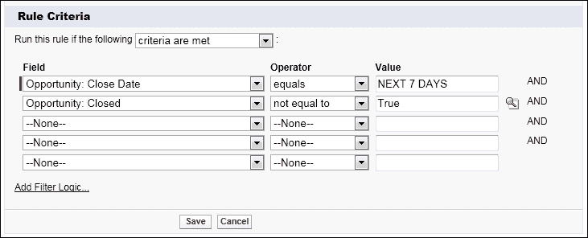
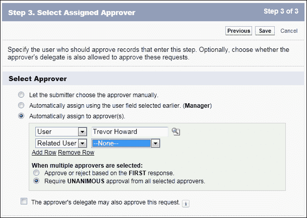

# 第七章：在 Salesforce CRM 中实施业务流程

在上一章中，我们讨论了数据分析，内容包括报告和仪表板。

本章将详细介绍如何通过使用 Salesforce CRM 应用中的工作流规则和审批流程功能，自动化并简化你组织的关键业务流程。

本章将重点介绍如何配置工作流规则和审批流程的动作，以自动化、提升质量并生成高价值的业务流程。

最后，你将看到一些关于本章所涵盖的 Salesforce CRM 工作流自动化领域中关键功能的相关问题。

以下主题将被涵盖：

+   工作流规则

+   审批流程

+   工作流动作

+   工作流队列

+   审批向导

+   Chatter 中的审批

+   流程可视化器

+   视觉化工作流

+   流程设计器

+   Lightning Process Builder 简介

+   工作流自动化工具比较

# 工作流规则和审批流程

Salesforce CRM 应用中的工作流规则和审批流程功能允许你自动化并简化你组织的关键业务流程。

工作流规则可以用来捕捉关键的业务流程和事件，从而生成自动化的操作。它们允许你根据记录的字段或字段，配置多种类型的操作，当满足预定义条件时触发。实际上，当工作流规则的预定义条件满足时，工作流动作就会启动。你可以配置工作流动作，让它在记录满足工作流规则中指定的条件时立即执行，或者你可以设置时间依赖特性，在特定日期执行工作流动作。

审批流程是一系列结构化的步骤，用于促进数据记录的正式批准。它们可以从简单的单一步骤，到复杂的精密路由，提供自动化处理，供你的组织用来在 Salesforce CRM 中批准记录。审批流程不仅指定必须采取哪些步骤，还指定哪些人必须批准这些步骤。审批步骤可以针对流程中包含的所有记录，或者仅限于具有特定属性的记录。审批流程还指定在记录首次提交、批准、拒绝或撤回时应采取的操作。

工作流规则和审批流程带来诸如提高数据质量和一致性、增加数据完整性、提升效率和生产力、降低成本及减少风险等诸多好处。

工作流规则和审批流程允许你自动化以下类型的操作：电子邮件提醒、任务、字段更新和外发消息。

电子邮件提醒可以发送给一个或多个收件人。例如，电子邮件提醒操作可用于在另一个用户对某个账户进行更新时，自动向账户所有者发送电子邮件。

任务可以分配给用户或记录所有者。例如，任务操作可用于在系统中输入新线索时，自动将跟进任务分配给营销执行人员。

字段更新可用于修改记录中某个字段的值。例如，可以使用字段更新操作在机会达到某个销售阶段时自动更新名为**下一步**的字段。

外部消息可用于发送安全的可配置 API 消息（XML 格式）到指定的监听器。例如，外部消息可以用于自动调用一个新账户创建流程。例如，每当在 Salesforce CRM 应用中输入一个新账户时，通过触发一个外部 API 消息到外部财务系统。

Salesforce CRM 中的工作流规则可以结合使用，以帮助管理整个流程。例如，当通过网站输入一个线索时（稍后介绍 Web to Lead），可以使用工作流规则自动向该线索联系人发送回应电子邮件，并且发送给你组织中的某个人。在这种情况下，可以设置工作流规则，创建一个任务给销售人员，要求他们打电话给该线索联系人，并且发送一个提醒电子邮件，提醒在输入线索记录后指定天数内进行操作。

如果销售人员更改了线索状态，则可以自动更新一个日期字段，记录与该线索联系的日期。

到目前为止，我们已经看过了工作流规则和审批过程的相似性。然而，它们之间也有一些关键的区别。工作流规则由单一步骤和单一结果组成，而审批过程则由多个步骤组成，结果取决于记录是否被批准或拒绝。工作流规则会自动触发，且在触发时对用户不可见。而审批过程包含多个步骤，每个步骤都需要指定的审批人采取**我批准**或**我拒绝**的具体操作。

在实际操作中，创建工作流规则和审批过程的第一步是定义并规划整个流程，对于每个流程步骤，详细列出所需的对象、标准、用户和动作。

## 工作流和审批操作

工作流和审批操作包括电子邮件提醒、任务、字段更新和外部消息，这些操作可以通过工作流规则或审批过程触发：

+   **电子邮件提醒**：电子邮件提醒是一种可以通过工作流和审批操作生成的动作，使用电子邮件模板发送给指定的收件人，收件人可以是 Salesforce CRM 应用程序的用户，也可以是外部电子邮件收件人。

+   **字段更新**：字段更新是一种可以通过工作流和审批操作激活的操作，指定要更新的字段及其新值。字段的更新操作取决于字段的数据类型，您可以选择应用特定值、清除字段或根据您指定的标准或衍生公式计算值。

+   **任务**：任务是由工作流规则或审批过程触发的工作流和审批操作，允许将任务分配给您可以指定的用户。您还需要指定任务的**主题**、**状态**、**优先级**和**到期日期**。任务会出现在用户的日历上，可以通过**首页**选项卡的**我的任务**部分或在用户日历的**日视图**部分的特定日期上访问。任务可以单独分配，但您也可以将它们与电子邮件提醒结合使用，以通知用户。

+   **外发消息**：Salesforce CRM 中的外发消息是一种可以通过工作流和审批激活的操作，将信息发送到 Web URL 端点，所有这些都可以指定。外发消息包含在指定字段中的数据，以 SOAP 消息的形式发送到端点。由于这需要开发接收 Web 服务，因此本书不涵盖此操作。

## 为工作流规则和审批过程配置电子邮件提醒

要配置电子邮件提醒，请按照路径 **设置** | **创建** | **工作流** | **电子邮件提醒**，然后点击**新建电子邮件提醒**按钮。

在**电子邮件提醒编辑**页面上，显示以下设置：

要设置电子邮件提醒的详细信息，请执行以下步骤：

1.  输入电子邮件提醒的描述。

1.  输入电子邮件提醒的唯一名称。

    ### 注意

    电子邮件提醒的唯一名称是必填项，并由 API 和托管包使用。输入前面的字段“描述”时，名称会自动填充。对允许的字符有一定限制，唯一名称必须以字母开头，并且只能使用字母数字字符和下划线。另外，唯一名称不能以下划线结尾，也不能有两个连续的下划线。

1.  选择一个电子邮件模板。

    ### 注意

    **受保护组件**复选框用于标记该提醒为受保护。这个选项可以忽略，因为它是开发人员在构建使用托管发布包功能的应用程序时使用的设置。如果您安装了托管包，则对非开发人员可以编辑的内容有限制。Salesforce 中的托管包在第九章中进行了讨论，*扩展和增强 Salesforce CRM*。

1.  现在从可用选项中选择应接收此电子邮件提醒的人员：

| **收件人** | **描述** |
| --- | --- |
| **账户所有者** | 如果选择了**账户所有者**，则电子邮件提醒将发送给 Salesforce CRM 中设置为账户记录或与该记录相关联的账户所有者的用户。由于此选项要求存在账户关系，因此仅在账户、机会、联系人和作为账户对象子项的自定义对象上有效。 |
| **账户团队** | 从分配了特定账户团队角色的用户列表中选择。请注意，电子邮件提醒仅在规则与账户对象或其直接子对象相关联时才会发送。 |
| **案例团队** | 从分配了特定案例团队角色的用户列表中选择。 |
| **创建者** | 这是被列为记录创建者的用户，并且是设置在**创建者**字段中的用户。 |
| **客户门户用户** | 从与客户门户相关联的用户列表中选择。 |
| **电子邮件字段** | 选定对象上的电子邮件地址字段，例如联系人记录中的**电子邮件字段**或自定义电子邮件字段。 |
| **所有者** | 记录所有者。 |
| **合作伙伴用户** | 从与合作伙伴门户相关联的用户列表中选择。 |
| **门户角色** | 从分配了特定门户角色的用户列表中选择。 |
| **门户角色及下属** | 从分配了特定门户角色的用户列表中选择，此外还包括该角色下方所有角色的用户。 |
| **公开组** | 从特定公开组的用户列表中选择。 |
| **相关联系人** | 记录上关联的联系人。例如，你可能在机会对象上创建了一个自定义联系人，称为**关键决策人**。 |
| **相关线索或联系人所有者** | 这是一个与设置在与记录相关的线索或联系人记录上的所有者字段关联的用户查找。例如，对于机会，该字段可以设置为联系角色字段，链接到联系人。 |
| **相关用户** | 相关用户是与记录关联的用户查找字段。例如，此字段可能设置为**最后修改者**字段。 |
| **角色** | 从分配了特定角色的用户列表中选择。 |
| **角色及内部下属** | 从特定角色的用户列表中选择，此外还包括该角色下方所有角色的用户，但不包括合作伙伴门户和客户门户用户。 |
| **角色及下属** | 从特定角色的用户列表中选择，此外还包括该角色下方所有角色的用户。 |
| **用户** | 从 Salesforce CRM 中可用用户的列表中选择。 |
| **机会团队** | 一旦你设置了销售机会团队，该选项允许你从与机会团队相关联的用户列表中进行选择。 |

在**可用收件人**列表中选择应接收此电子邮件提醒的收件人，然后点击**添加**。

### 注意

如果在选择收件人后更改对象，**已选择的收件人**列表将自动清空。

可选择性地输入收件人和发件人电子邮件地址，然后点击**保存**。

在这里，你可以执行以下操作：

+   输入最多五个额外的收件人电子邮件地址（这些地址可能是或不是 Salesforce 中的用户）。

+   将**发件人电子邮件地址**设置为当前用户的电子邮件地址或默认工作流用户的电子邮件地址。

+   最后，若要开始使用电子邮件提醒，将其与工作流规则或审批流程关联起来。

    ### 提示

    **设置发件人电子邮件地址：**

    设置**发件人电子邮件地址**还允许你为组织使用一个标准的全局电子邮件地址，例如`Customer_Services@WidgetXYZ.com`，而不是默认的**发件人**字段，即更新记录的用户的电子邮件地址。只有经过验证的组织范围电子邮件地址会出现在**发件人电子邮件地址**下拉列表中。

每个标准 Salesforce 许可证的工作流和审批流程每天限制发送 1,000 个电子邮件提醒。

你的整个组织每天有 200 万个电子邮件提醒的总限制，当达到每日限制时，Salesforce CRM 应用程序会向设置了默认工作流用户的地址发送警告电子邮件。如果没有设置默认工作流用户，则警告电子邮件会发送到系统管理员。

### 组织范围电子邮件地址

通过设置组织范围的电子邮件地址，你的用户可以共享一组公共电子邮件别名。在这里，你可以为每个用户配置文件定义一组组织范围的电子邮件地址。

当从 Salesforce 发送电子邮件时，具有这些配置文件的用户可以选择不同的发件人地址，而不是他们在用户记录中定义的电子邮件地址，任何电子邮件回复将返回到组织范围地址。

要设置组织范围电子邮件地址列表，请按照路径**设置** | **电子邮件管理** | **组织范围地址**进行操作。

在**组织范围地址**中，你可以设置显示名称、电子邮件地址以及允许使用该地址的配置文件，如下图所示：

当组织范围电子邮件地址被保存或更改时，Salesforce 将向电子邮件地址字段中指定的地址发送一封电子邮件，以验证该电子邮件地址是否有效，如下所示：

现在，经过验证的组织范围电子邮件地址将出现在配置电子邮件提醒时的**发件人电子邮件地址**下拉列表选项中，如下图所示：

## 配置工作流规则和审批流程的任务

要配置任务，请按照路径**设置** | **创建** | **工作流** | **任务**，然后点击**新建任务**按钮。

在**步骤 1：选择对象**页面中，从**选择对象**下拉列表中选择记录的对象类型，然后点击**下一步**。

### 注意

在为自定义对象创建任务时，只有已设置为具有活动的自定义对象才能在下拉列表中选择。

在**步骤 2：配置任务**页面中，提供了以下设置：

要设置任务的详细信息，请执行以下步骤：

1.  必须为要设置所需**分配给**字段的个人或多个个人进行选择。在此，当你点击查找对话框以设置**分配给**时，选项允许选择**用户**、**角色**或**记录所有者**。

    ### 注意

    如果工作流任务的受分配者是一个角色，并且该角色有多个用户，那么记录所有者将被分配任务。无论记录所有者的角色类型如何，都会这样做，这可能会引起一些混淆。因为任务不能分配给多个用户，因此最佳实践建议不要将任务分配给角色，尽管此选项是存在的。

1.  输入任务的主题和唯一名称。

    ### 注意

    任务的唯一名称是必需的，并且由 API 和任何托管包使用。当你从前一个字段（名为**主题**）移动时，名称会自动填充。唯一名称有字符限制，必须以字母开头，并且只能使用字母数字字符和下划线。此外，唯一名称不能以下划线结尾，也不能有两个连续的下划线。

1.  选择一个到期日期、状态和优先级，其中到期日期显示为受分配者所在时区的时间。

1.  设置**通知受分配者**复选框，以便在分配任务时发送电子邮件通知。

    ### 注意

    **受保护组件**复选框用于标记警报为受保护状态。这是供开发人员为 AppExchange 市场（AppExchange 在第九章中介绍，*扩展和增强 Salesforce CRM*）构建托管包应用时使用的。

1.  最后，为了使任务生效，将其与所需的工作流规则或审批流程关联起来。

1.  可选地，输入任何评论，以便将描述信息包含在任务中，然后点击**保存**。

    ### 注意

    当任务被分配时，它将包含一个**创建者**字段，其中包含保存触发规则并分配任务的记录的人的名称。

## 配置工作流规则和审批流程的字段更新

要配置字段更新，请按照路径**设置** | **创建** | **工作流** | **字段更新**，然后点击**新建字段更新**按钮。

在**字段更新编辑**页面中，执行以下操作：

1.  输入字段更新的名称和唯一名称。

    ### 注意

    字段更新的名称和唯一名称都是必需的。唯一名称由 API 和管理包使用。名称在你退出前面的**名称**字段时会自动填充。唯一名称的字符有规定，必须以字母开头，并且只能使用字母数字字符和下划线。此外，唯一名称不能以下划线结尾，也不能包含连续的两个下划线。

1.  现在，选择性地输入字段更新的描述，然后选择要更新的字段所对应的对象类型，如下所示为**机会**对象：

在选择对象和字段进行更新后，会出现一个名为**指定新字段值**的新部分，在这里你可以设置所需字段更新的逻辑。可用选项取决于你正在更新的字段类型，具体选项如下。

### 复选框

对于复选框，选择**True**以选中复选框，选择**False**以取消选中，如下图所示：

这对于在某个业务流程完成时，自动设置记录的状态标志非常有用。在前面的示例中，**发布到网页？**字段更新允许自动将复选框选项设置为**True**，以便记录可以发布。

### 记录所有者

对于记录所有者，选择记录应该分配给的用户，如下图所示：

这对于在某个业务流程完成时，自动更改记录所有者非常有用。例如，如果潜在客户符合某些条件，你可以自动将记录所有者从市场专员更改为客户经理。选择记录所有者字段更新的用户时，必须使用用户查找图标并选择一个特定的活跃用户。因此，不能根据任何给定的条件自动推导出新所有者。

### 提示

选择**通知被分配人**可以在字段更新触发时，自动向新记录所有者发送电子邮件。

### 下拉列表

对于下拉列表字段，你可以选择下拉列表中的特定值，或者选择当前值上方或下方的值，如下图所示。**当前值上方的值**和**当前值下方的值**选项是基于**下拉列表**字段定义中设置的排序顺序：

### 其他数据类型

对于所有其他数据类型，你可以设置如下的**文本选项**：

按照以下步骤完成字段更新配置：

1.  选择 **空值（null）** 如果你希望移除现有值并将字段留空。

    ### 注

    此选项不适用于必填字段、复选框和其他一些类型的字段。

1.  选择 **使用公式设置新值** 以根据公式逻辑计算值。

1.  现在点击 **保存** 完成字段更新的配置。

1.  最后，为了使字段更新生效，将其与所需的工作流规则或审批流程关联。

## 配置工作流规则和审批流程的外发消息通知

在 Salesforce CRM 中，外发消息是一种操作——可以通过工作流和审批激活——它将信息发送到你指定的 Web-URL 端点。

外发消息包含使用指定字段的数据，通过 SOAP 消息的方式发送到端点 URL。当端点接收消息数据后，它会从消息中提取信息并进行处理。

### 注

**简单对象访问协议**（**SOAP**）是一种行业标准协议，定义了以 XML 格式编码的数据传递的统一方式。**可扩展标记语言**（**XML**）是一种行业标准标记语言，支持结构化数据的共享和传输。

由于这需要开发接收的 Web 服务端点，因此设置此操作超出了本书的范围。

# 配置工作流规则

你可以通过创建工作流规则来配置你组织的工作流。每个工作流规则包括以下内容：

+   使 Salesforce CRM 应用程序触发工作流规则的条件

+   当记录匹配条件时立即执行的操作

+   当记录匹配条件时，Salesforce CRM 应用程序处理的时间依赖操作，并根据指定的时间触发器执行

下表概述了配置 Salesforce CRM 中工作流规则的关键方面：

| **规则** | **操作** | **用户** |   |   |
| --- | --- | --- | --- | --- |
| 对象 | 条件 | 电子邮件提醒 | 即时 | 人员 |
|  |  |  | 时间依赖 |  |
|  |  | 任务 | 即时 |  |
|  |  |  | 时间依赖 |  |
|  |  | 字段更新 | 即时 | 系统 |
|  |  |  | 时间依赖 |  |
|  |  | 外发消息 | 即时 |  |
|  |  |  | 时间依赖 |  |
| **示例工作流规则** |   |   |   |   |
| 商机 | 每当商机记录被更新时 | 电子邮件提醒 | 即时 | 账户所有者 |

### 提示

在工作流规则之前创建工作流操作。先创建操作及任何相关的电子邮件模板，然后再开始配置工作流规则。

以下概述了创建工作流规则所需的步骤：

1.  创建工作流规则并选择对象。

1.  配置工作流规则的设置和条件。

1.  指定工作流操作。

1.  激活工作流规则。

要创建工作流规则，请按照路径 **设置** | **创建** | **工作流和审批** | **工作流规则**。

**工作流规则**详细页面显示当前工作流规则的列表，以及各种属性，例如关联的对象和规则是否处于活动状态。在此页面上，您可以创建视图，以帮助筛选和管理规则列表，以应对规则数量的增加。以下屏幕显示了我们组织中所有工作流规则的列表，使用了**所有工作流规则**视图：

从**工作流规则列表**页面，您可以点击**新建规则**按钮，然后选择您希望应用新工作流规则的对象（可以是自定义对象或标准对象）。在如下所示的**步骤 1：选择对象**界面中，已选择标准对象**机会**：

现在，点击**下一步**，进入并显示**步骤 2：配置工作流规则**页面，以便指定规则设置和标准，如下图所示：

## 配置规则设置和标准

在**编辑规则**部分，您必须输入规则名称，并且可以选择性地为规则输入描述。

### 评估标准

在**评估标准**部分，选择合适的标准，使 Salesforce CRM 应用程序触发工作流规则。

可以从以下三个选项中选择标准：

+   **创建**：选择此选项以忽略对现有记录的任何后续更新，因为该规则只会在记录插入时触发一次。

+   **创建，并且每次编辑**：选择此选项以包含新记录插入和更新现有记录。这些操作会导致规则的重复触发，只要记录满足标准。

    ### 注意

    如果选择了“创建，并且每次编辑”选项，则无法向规则中添加时间依赖性操作。

+   **创建，并且每次编辑以符合标准**：选择此选项以包含新记录和更新现有记录。

    ### 注意

    如果记录更新不影响指定的规则标准，则该规则不会被重新触发。

例如，如果将机会记录的概率更新为 90%，导致规则运行，那么选择此选项后，只有当概率发生变化然后再次变回 90%时，规则才会再次触发，无论记录本身更新多少次。

### 规则标准

在**规则标准**部分，有两种方式来制定触发工作流规则的逻辑。它们如下：

+   如果满足以下标准，请运行此规则

+   如果以下公式计算为真，则运行此规则

#### 如果满足以下标准，请运行此规则

默认情况下显示此选项，允许您选择记录必须满足的过滤标准以触发规则。

作为示例，已将过滤器设置为以下选项之一：

+   **机会：关闭日期等于接下来的 7 天并且**

+   **机会：关闭不等于 True**

这些条件将允许我们构建一个工作流规则，通知销售人员他们有一个将在一周内到期的开放机会：

点击**添加筛选逻辑**链接，您将看到更多选项，用于添加行和高级筛选条件，如下图所示：

**添加行**链接允许您添加更多条件选项，最多可添加 25 条。

**筛选逻辑**部分允许您使用布尔表达式来设置条件。这些表达式被称为**高级筛选器**。

例如，**(1 AND 2)** 会产生一个需要前两个筛选条件都有效的表达式。

#### 如果以下公式为真，则运行此规则选项

此选项允许您输入一个返回`True`或`False`值的公式。如果公式返回`True`，Salesforce CRM 应用程序将触发该规则。

工作流公式可用于捕获复杂的逻辑，如以下使用案例示例所示。

每当机会被标记为已丢失，且销售阶段之前为**谈判/审查**，并且金额大于 $50,000 时，发送电子邮件或任务给销售管理部门进行跟进：

### 注意

某些功能在工作流规则公式中不可用；您无法创建自定义对象引用父对象字段的公式。

除了在**规则条件**部分右侧显示的功能外，您还可以在工作流规则公式中使用与直接相关对象的合并字段。**公式为真**规则在需要触发某些操作时非常有用，尤其是在某个特定字段的值发生变化时。对于所有允许您引用跨多个关系的相关对象字段的公式合并字段，字段名称由关系名称作为前缀。对于标准关系，关系名称是主对象。例如，您可以使用`Account.Name`引用机会中的帐户名称合并字段。

点击**检查语法**按钮，验证公式是否没有错误，然后继续下一步操作。

现在点击**保存并继续**，进入**步骤 3：指定工作流操作**页面，您可以在此配置工作流操作。

## 指定工作流操作

**指定工作流操作**页面允许您向工作流规则中添加即时和时间依赖的操作，如下图所示：

### 即时工作流操作

即时操作在满足评估标准时会立即触发。如前面的示例所示，如果一个商机在创建或编辑后仍然处于开放状态，且离指定的关闭日期还有七天，Salesforce CRM 应用程序可以立即向销售人员发送电子邮件。

### 时间依赖的工作流操作

时间依赖操作指定了 Salesforce CRM 执行工作流操作的时间。如前面的示例所示，如果一个商机在创建或编辑后仍然处于开放状态，且离指定的关闭日期还有七天，Salesforce CRM 应用程序可以在三天后自动向销售人员发送电子邮件提醒。

### 提示

时间依赖操作和时间触发器是复杂的功能，包含多个考量因素。具有时间依赖操作的工作流规则应指定一个默认的工作流用户，以确保它们能在未来的操作中触发。这是为了防止激活工作流的用户离开组织后被设为非活动用户的情况。

### 添加即时工作流操作

要添加即时工作流操作，请在 **即时工作流操作** 部分点击 **添加工作流操作** 下拉选择，并选择 **新建任务**、**新建电子邮件提醒**、**新建字段更新**、**新建外部消息** 或 **选择现有操作** 来选择一个现有操作与规则关联：

+   **新建任务** 用于创建一个与规则关联的任务

+   **新建电子邮件** 用于创建一个与规则关联的电子邮件提醒

+   **新建字段更新** 用于定义一个与规则关联的字段更新

+   **新建外部消息** 用于定义一个与规则关联的外部消息

+   **现有操作** 用于选择一个与规则关联的现有操作

### 添加时间依赖的工作流操作

要添加时间依赖的工作流操作，请在 **时间依赖工作流操作** 部分点击 **添加时间触发器**。然后，指定与记录相关的日期前后多少天或小时，例如记录的创建或修改日期，甚至是商机的关闭日期，如下图所示：

在以下工作流规则场景下，**添加时间触发器** 按钮不会显示，且创建时间触发器的选项不可用：

+   工作流规则标准已配置为使用选项触发：**创建时，且每次编辑后重新满足标准**

+   工作流规则已处于激活状态（在这里，您必须暂时停用它才能应用该操作）

+   工作流规则未激活，但在工作流队列中仍有待处理的操作

现在，可以配置附加的、即时的或时间依赖的操作。最后，点击屏幕右上角的 **完成** 按钮。

### 激活工作流规则

Salesforce CRM 应用程序不会触发工作流规则，直到您手动激活它。

要激活工作流规则，请点击工作流规则详情页面上的**激活**。点击**停用**可以停止规则触发（或者如果你想编辑与规则相关的时间依赖操作和时间触发器）：

### 工作流规则注意事项

配置工作流规则时，请考虑以下事项：

+   你可以随时停用工作流规则。然而，如果你停用了一个有待处理操作的规则，只要触发该规则的记录没有被更新，Salesforce.com 会完成这些操作。

+   你不能将时间依赖的工作流操作添加到活动的工作流规则中。你必须先停用工作流规则，添加时间依赖的工作流操作，然后再重新激活规则。

+   如果自定义对象被删除，基于自定义对象的工作流规则会自动删除。

+   你不能为活动记录创建工作流规则的电子邮件警报。

+   创建新记录或更新现有记录可以触发多个规则。

+   时间依赖的字段更新可以重新触发工作流规则的重新评估。

+   执行操作的顺序无法保证。字段更新操作最先执行，随后执行其他操作。

### 注意

对于自定义对象和一些标准对象，你可以创建工作流操作，其中细节记录的变化会更新相关主记录上的字段。

例如，在一个自定义出版应用中，你可能会创建一个工作流规则，当章节（细节对象）被编辑器审阅时，自动将书籍（主对象）的状态设置为**处理中 - 作者**。

跨对象字段更新适用于自定义到自定义的主从关系、自定义到标准的主从关系，以及一些标准到标准的主从关系。它们的显示方式如下：

### 注意

如果你需要对标准对象进行跨对象操作，比如在**商机产品**记录的某个字段变化时更新**商机**上的字段，或者进行更复杂的更新操作，如自动创建或删除记录等，你需要使用流程构建器、可视化工作流或开发**Apex 触发器**，而不是工作流规则。

### 监控工作流队列

你可以使用基于时间的工作流队列来监控任何具有时间依赖操作的待处理工作流规则。在这里，你可以查看待处理的操作，并在必要时取消它们。

要访问**基于时间的工作流**队列，请按照路径**设置** | **监控** | **基于时间的工作流**，会展示以下页面：

点击**搜索**以查看任何激活的基于时间的工作流规则的所有待处理操作，或者设置过滤条件并点击**搜索**以仅查看符合条件的待处理操作。选中您希望取消的任何列出的工作流规则，然后点击**删除**以终止选定的排队工作流规则。

总结来说，工作流规则允许在记录（或其父级）上的字段满足特定条件时触发一个或多个操作。工作流规则比验证规则稍微复杂一些，需要对 Salesforce.com 有一定的熟悉度才能正确执行。不过，它们可以提供强大的业务自动化，并且无需任何自定义代码或开发人员的工作即可实施。

# 审批流程

Salesforce CRM 中的审批流程是一个自动化机制，您可以设置它来处理组织内记录的审批。

与审批流程相关的工作包括创建一套结构化的步骤，以便批准必须批准的特定记录，并指定在每个步骤中必须由哪些用户进行审批。在这里，每个步骤可以应用于流程中的所有记录或具有特定字段值的指定记录。构建审批流程时，还需要设置在记录首次提交、批准、拒绝或被撤回审批后所需采取的行动。

审批流程与工作流规则相似，因为它们可以触发相同的关键操作；然而，工作流规则和审批流程之间有显著差异，例如：

+   工作流规则在记录保存时激活，而审批流程则是通过明确点击**提交审批**按钮手动触发的。

+   工作流规则由单一的步骤和单一的操作组成。审批流程由多个步骤组成，根据记录是否被批准或拒绝，采取不同的操作。

+   工作流可以被修改或删除。在审批中，某些属性无法修改，并且必须先停用审批流程，才能删除未完成的审批。

+   审批过程会自动跟踪审批历史，而这不适用于工作流规则。

+   当启动审批时，记录会被锁定，除非是审批者或系统管理员，否则其他人无法更改，直到记录完成审批过程。

审批流程需要对您的业务规则和流程有很好的理解，以确保成功实施。

因此，它们必须正确实施，以确保记录仅在必要时被锁定，避免阻碍 Salesforce 用户更新记录。

然而，审批流程可以成为控制必须完成的内部流程的强大机制，作为业务流程的一部分。

批准流程示例用途包括在将报价或合同发送给客户或潜在交易的某些交易之前，获得管理签字，或在设置 Salesforce CRM 应用程序中的用户之前获得授权。在此示例中，销售管理团队和其他部门（如财务部门）可以在获取用户许可证和创建用户记录之前批准用户激活请求。

与工作流操作类似，批准操作包括电子邮件提醒、任务、字段更新和由批准流程触发的出站消息。

以下概述了配置批准流程所需的工作项：

+   提供流程名称

+   指定记录的进入条件

+   指定谁将批准

+   指定电子邮件模板

+   确定批准页面上要显示的字段

+   指定谁将发送批准邮件

## 批准流程检查清单

仔细规划 Salesforce CRM 批准流程非常有帮助，可以确保成功和顺利的实施。以下检查清单列出了在开始配置批准流程之前所需的信息和先决条件：

+   确定流程的步骤和级别。通常建议使用诸如 Microsoft Visio 等制图工具绘制流程图。

+   决定用户是否可以通过电子邮件批准请求，并相应地设置此功能。

+   创建批准请求电子邮件模板。

+   确定批准请求的发件人。

+   确定分配的审批者。

+   如有必要，确定委托审批者。

+   决定您的批准流程是否需要过滤器。

+   设计初始提交操作。

+   确定用户是否可以编辑等待批准的记录。

+   确定记录是否应自动批准或拒绝。

+   确定批准请求被批准或拒绝时的操作。

### 提示

Salesforce 建议您向用户介绍每个批准流程及其进入条件。这是因为用户无法看到在按下**提交审批**按钮时触发了哪些批准流程。此外，如果用户不是批准流程的允许提交者，或记录不符合进入条件，Salesforce 将显示错误。

## Chatter 中的批准

如果您的组织同时启用了批准和 Chatter，您可以激活 Chatter 中的批准，使用户可以在其 Chatter 提要中接收批准请求。要启用**Chatter 中的批准**，请转到**设置** | **自定义** | **Chatter** | **Chatter 设置**。单击**编辑**按钮，并勾选**允许批准**复选框，如下截图所示：

批准请求将显示为 Chatter 帖子，您可以通过创建独特的帖子模板并将其与批准流程关联来自定义它。

## Chatter 中的批准检查清单

为确保你的用户能够将审批请求作为 Chatter 帖子看到并且一切正常工作，建议在准备激活**Chatter 中的审批**时按照以下检查表操作：

+   按照本章*配置审批流程*部分所述创建审批流程。

+   为你的审批流程所基于的对象启用**Chatter Feed**跟踪（这在第八章，*介绍 Sales Cloud、Service Cloud 和 Salesforce CRM 的协作功能*中有描述）。

+   为你的审批流程所基于的对象创建一个审批发布模板。如果你想将此模板设置为该对象上所有审批流程的默认模板，请确保在配置发布模板时选中**默认**复选框，如本章*配置审批流程*部分所述。

+   激活**在 Chatter 中启用审批**设置。

### 注意

在最后一步激活“启用 Chatter 中的审批”设置，确保所有审批流程已正确配置以使用此功能，并且一旦激活，所有现有的活动审批流程将开始生成 Chatter 审批帖子。

# 配置审批流程

要创建审批流程，请按照以下步骤操作：

1.  启动审批流程向导。

1.  指定**名称**、**唯一名称**和**描述**。

1.  指定**进入流程**的**标准**。

1.  指定**审批人字段**和**记录可编辑性**。

1.  选择**电子邮件通知模板**。

1.  配置**审批请求页面布局**。

1.  指定**初始提交者**。

1.  激活审批流程。

## 选择审批流程向导

当你点击**创建新审批流程**按钮以开始创建审批流程时，系统将呈现以下两种构建流程的选项：**使用 Jump Start 向导**或**使用标准设置向导**。以下部分概述了这两种机制的区别。

### Jump Start 向导

**Jump Start 向导**提供了一种快速创建具有单个步骤的简单审批流程的方法。为了简化设置，使用此选项时，Salesforce CRM 应用会自动为你确定一些默认选项。

### 标准设置向导

**标准设置向导**使得创建复杂的审批流程成为可能，适用于需要多个处理步骤的场景。此选项提供了定义流程的机制，并通过设置向导定义该流程中的每个步骤。

要创建审批流程，请按照路径**设置** | **创建** | **工作流与审批** | **审批流程**。

选择新的审批流程对象，点击它，然后选择**使用标准设置向导**，如下面的截图所示，我们已选择了**机会**：

要设置审批流程的详细信息，请执行以下操作：

在**步骤 1**。输入名称和描述页面（这是第 1 步，共 6 步）：输入**流程名称**、**唯一名称**，并可选地输入**描述**，然后点击**下一步**。

要指定进入标准，这是在**步骤 2：指定进入标准**页面上的可选步骤，用于确定哪些记录进入审批流程，您可以选择公式逻辑，或者选择某些字段、操作符和值，以在满足所需条件时进行指定。以下截图显示了这是第 2 步中的内容，共 6 步：

在**步骤 2**：**指定进入标准**中，输入要包括在此审批流程中的记录的筛选条件，或者将所有筛选条件留空，以便将所有记录提交到审批流程中。

### 提示

**限制特定用户的审批流程**：

如果此审批流程仅涉及特定用户，您可以在此指定。例如，如果只有销售团队提交机会审核，请输入以下筛选条件：**当前用户：部门等于销售**。如上图所示，在第四个输入条件行中，**字段**为**当前用户：部门**，**操作符**为**等于**，**值**为**销售**。

点击**下一步**以设置**指定审批人字段和记录可编辑性**选项。

在此步骤（第 3 步，共 6 步）中，您将指定 Salesforce CRM 中的审批步骤的用户。在这里，用户字段可以用于自动路由审批请求。此字段可以是个人用户记录中的**经理**字段，或者您可以在用户对象上创建一个自定义的层级（用户对用户）字段。

在**步骤 3：指定审批人字段和记录可编辑性属性**中，使用**下一步自动审批人由**选择列表，如果您希望 Salesforce CRM 应用程序根据用户字段中的值自动分配审批请求，请选择一个用户字段。例如，您可能希望将审批请求自动发送给用户的经理，正如在以下截图中所示，经理字段中指定了该用户的经理：

若要允许用户手动选择另一个用户来审批任何审批请求，请将**下一步自动审批人由**字段留空：

+   通过勾选**使用记录所有者的审批人字段**，您可以将审批流程设置为使用记录所有者的标准**经理**字段或自定义字段，而不是提交用户的记录。

    ### 注意

    如果您勾选了**使用记录所有者的审批人字段**（即使用记录所有者的经理，而不是提交用户的经理），此设置将应用于所有后续步骤。

+   选择适当的**记录可编辑性属性**，然后点击**下一步**。

    ### 注意

    当记录处于审批流程中时，它始终是锁定的，只有您作为系统管理员可以编辑它。然而，您可以指定当前分配的审批人也可以编辑该记录。

+   当审批流程将审批请求分配给用户时，Salesforce.com 会自动向该用户发送一封审批请求电子邮件。该电子邮件包含一个网页链接，用户可以点击该链接进入 Salesforce CRM 应用程序中的审批页面，用户可以在该页面上批准或拒绝请求，并且还可以输入评论。

    ### 提示

    通过启用电子邮件审批响应，用户可以通过在电子邮件正文的第一行输入 approve、approved、yes、reject、rejected 或 no 来替代性地回复电子邮件，然后在第二行添加评论。此选项使得审批或拒绝审批请求变得更加简单，尤其对于使用移动设备访问审批请求的用户特别有用。

+   在**步骤 4\. 选择通知模板**中，您可以选择一个自定义电子邮件模板，用于在审批请求分配给审批人时通知审批人，如下图所示的**审批请求**模板。或者，如果将此字段留空，则使用一个简单的默认电子邮件模板。此外，如果启用了**Chatter 中的审批**，您还可以选择一个**审批发布模板**，如下面的截图所示：

### 电子邮件审批响应

通过启用电子邮件审批响应，用户可以通过在电子邮件正文的第一行输入 approve、approved、yes、reject、rejected 或 no 来替代性地回复电子邮件。要启用**电子邮件审批响应**，请导航到**设置** | **自定义** | **工作流与审批** | **流程设置**。现在勾选**启用电子邮件审批响应**复选框，如下图所示：

### 注意

如果启用了电子邮件审批响应，且用户没有正确回复，可能是因为拼写错误（例如拼错了 *approve*）或将其输入到错误的行，Salesforce CRM 应用程序将不会处理用户的错误响应。

在**步骤 5\. 选择审批页面布局中要显示的字段**页面中，可以按照如下示例配置审批请求页面布局：

审批页面是审批人批准或拒绝请求的地方，它位于配置审批流程的**步骤 5\. 选择审批页面布局中要显示的字段**，在这里您可以进行如下操作：

1.  选择并排序您希望在审批请求页面上显示的字段。

1.  除了之前选择的字段外，还需要选择**显示审批历史信息**，以包括**审批历史**相关列表，该列表会在结果审批请求页面上显示**日期**、**状态**、**指派给**、**实际审批人**、**评论**和**整体状态**列，如下图所示：

1.  要指定审批人如何访问审批页面，选择**仅允许审批人从应用程序内部访问审批页面。（推荐）**、**允许审批人从 salesforce.com 应用程序内部访问审批页面**，或**允许从启用无线功能的移动设备外部访问**，然后点击**下一步**（如步骤 5 截图所示）。

1.  现在指定**初始提交者**，如下图所示：

1.  指定哪些用户被允许提交记录进行审批。

1.  可选地，选择**将审批历史相关列表添加到所有机会页面布局中**（如**机会**对象相关审批所示）。这将自动更新此对象的所有页面布局，并包含一个相关列表，允许用户查看和提交审批请求。

1.  可选地，选择允许提交者撤回审批请求，以便提交者可以撤回他们的审批请求。

当选择**允许提交者撤回审批请求**选项时，**审批历史**相关列表中的**撤回审批请求**按钮对于提交记录的用户以及您作为系统管理员都是可见的。

当用户点击**撤回审批请求**时，记录的待审批请求将被撤回，撤回操作将被执行。

此选项适用于在等待审批签署时记录发生更改的情况。例如，在提交审批后，机会可能会被标记为“丢失”，或者金额可能会降低到审批阈值以下，或者当前审批人可能正在休假，需要重新提交审批并发送给其他用户进行审批。

### 提示

确保撤回操作会重置记录的状态，并在必要时回滚初次提交时发生的任何字段更新。如果记录的状态没有恢复到初次提交前的状态，任何重新提交审批的尝试可能会失败，或者审批可能无法正常运作。

现在点击**保存**，然后点击**下一步**，最后点击流程旁边的**激活**按钮。

### 注意

在创建至少一个审批步骤之前，您将无法激活此流程。

## 创建审批步骤

Salesforce CRM 中的审批步骤设定了记录审批流程的流程，关联了每个审批环节的参与用户。对于每个审批步骤，我们设定了谁可以批准记录的请求，记录必须包含什么内容才能符合标准，以及为什么应该允许批准该记录（在委派审批人时）。

此外，流程中的第一个审批步骤还指定了当记录未能进入该步骤时所需的操作。后续步骤要求您设置当审批人拒绝请求时应采取的操作。

要创建审批步骤，请按路径**设置** | **创建** | **工作流与审批** | **审批流程**，选择审批流程的名称，然后执行以下操作：

+   点击**审批步骤**相关列表部分的**新审批步骤**按钮。

    ### 注意

    对于企业版和无限版，每个流程最多可以包含 30 个步骤。

+   输入审批步骤的**名称**、**唯一名称**和可选的**描述**。

+   输入步骤编号，以确定该步骤在审批流程中的位置，如以下截图所示，并点击**下一步**：

在此页面中，您可以指定所有记录是否都应进入此步骤，或者仅具有特定属性的记录应进入此步骤，如以下截图所示：

如果您指定了筛选条件或输入了公式，您可以选择当记录不符合条件或公式返回`False`时应采取的操作，选项如下：

+   **批准记录**以自动批准请求并执行所有最终批准操作。

+   **拒绝记录**以自动拒绝请求并执行所有最终拒绝操作。此选项仅适用于审批流程中的第一个步骤。

现在点击**下一步**，显示页面**步骤 3：选择分配的审批人**，在此页面中您指定应批准进入此步骤的记录的用户，并可选择是否允许该审批人的委派审批人也能批准这些请求，如以下截图所示：

选项如下：

+   **让提交者手动选择审批人**，此选项提示用户手动选择下一个审批人。

+   **使用先前选择的用户字段自动分配**，该字段将批准请求分配给显示在此选项旁边的自定义字段中的用户（此自定义字段在之前配置审批流程时选定，前面的截图中为**（经理）**）。

+   **自动分配给审批人**，此选项允许您将批准请求分配给一个或多个用户或相关用户，如以下截图所示：

如果你在**自动分配给审批人**选项中指定了多个审批人，选择以下选项之一：

+   **根据第一个响应批准或拒绝**，即审批请求的第一个响应决定记录是否批准或拒绝。

+   **要求所有选定审批人一致同意**，只有当所有审批人批准请求时，记录才会被批准。如果任何审批人拒绝请求，则审批请求会被拒绝。

    ### 注意

    对于自定义对象和大多数标准对象，你可以设置队列作为自动分配给审批人选项的一部分。在撰写本文时，**机会**、**解决方案**和**报价**的审批流程不能分配给队列。

在此页面上，还有一个选项可以指定**审批人的委托人也可以批准此请求**，委托人用户在分配的审批人用户页面的**委托审批人**字段中进行设置。

### 注意

委托审批人不能重新分配审批请求，他们仅被允许批准或拒绝审批请求。

如果这不是审批流程中的第一步，你必须指定如果审批人拒绝本步骤中的请求，将会发生什么，下面是一个示例，选项如下：

+   执行本步骤的所有拒绝操作及所有最终拒绝操作（最终拒绝）。

+   仅执行本步骤的拒绝操作，并将审批请求发送回最近的审批人（回退一步）。

    ### 注意

    对于企业版和无限版，每个审批步骤最多可以有 25 个审批人。

现在点击**保存**，并使用以下选项指定你希望在此步骤中设置的任何工作流操作：

+   是的，我现在想为此步骤创建一个新的审批操作

+   是的，我现在想为此步骤创建一个新的拒绝操作

+   不，我稍后再做。带我去审批流程详情页面查看我刚创建的内容。

最后，点击**开始！**以完成审批流程。

## 衡量与改进

尽管你需要规划审批流程的成功实施，但它们随着时间的推移可能需要更改。这可能是由于业务流程的变化，或 Salesforce CRM 应用中流程的改进。

因此，创建分析来帮助衡量和验证审批流程是否顺利进行是一个好主意。例如，你可以生成报告和仪表板，以衡量审批在流程中所花费的时间，并识别出流程中任何未按预期工作的地方，并相应地进行改进。有关如何生成报告和仪表板的详细信息，请参见第六章，*生成数据分析报告和仪表板*。

## 流程可视化工具

流程可视化工具提供了已保存的审批流程的只读表示。可以通过在已保存的审批流程中点击**查看图表**按钮来访问，如下图所示：

以下屏幕显示的是一个简单的两步审批流程，用于审查大于 100k 的机会交易：

使用流程可视化工具，你还可以打印审批流程的带注释版本，图表中出现的数字对应于表格中的详细信息，这些信息包含在可打印视图中。

将流程以图表形式呈现有助于理解以下内容：

+   记录获得批准所需的步骤

+   每个步骤的指定审批人

+   触发审批流程的标准

+   记录在被批准、拒绝、撤回或首次提交审批时采取的具体操作

总结来说，审批流程可以成为监控内部流程的强大工具，确保在继续业务活动之前完成特定流程。它们还为业务流程的及时性提供了很好的可见性。在这里，你可以使用审批来捕捉审批开支所需的时间，这可以帮助采取措施改善组织流程。

# Visual Workflow

Visual Workflow 允许你构建一组称为**流程**的屏幕，指导用户完成收集和更新数据的过程。

与流程相关的工作涉及创建一组结构化的步骤，以便用户完成指定的业务流程。这些业务流程可能是，例如，客户支持团队的呼叫脚本、客户或员工互动的问卷调查，或者处理组织内部销售询盘的流程。

流程的使用场景很多且多样，**Visual Workflow**选项允许你创建收集和展示信息的屏幕，创建和更新 Salesforce 记录，并根据用户输入执行逻辑，所有这些都可以在拖拽式**Visual Workflow**用户界面中完成。

## 配置 Visual Workflow

使用 Visual Workflow 涉及以下三个概念：流程设计、流程管理和运行时。流程设计和管理通过流程设计器完成，流程设计器是 Salesforce CRM 设置选项的一部分。一旦流程设计并创建完成，你就可以通过设置属性、激活、停用、删除或在 Salesforce CRM 应用程序中运行它来进行管理。最后，用户可以在 Salesforce 内运行已激活的流程。在这里，你可以配置流程通过自定义按钮、链接或标签从 Visualforce 页面或直接使用 Salesforce 流程 URL 来运行。

## 流程设计器

可通过以下路径访问 Visual Workflow 和 Flow Designer：**设置** | **创建** | **工作流** | **流程**。

要在 Cloud Flow Designer 中创建和管理流程，请点击**新建流程**或编辑现有流程。

Flow Designer 具有拖放式用户界面，允许您配置屏幕并定义分支逻辑，而无需编写任何代码，如下图所示：

Flow Designer 的用户界面具有以下功能和模块：

+   按钮栏中的按钮让您可以保存、关闭、撤销或重做、查看属性或运行流程。

+   位于条形图右侧的状态指示器显示流程是否处于活动状态、是否已保存，或是否存在警告或错误。

+   **调色板**选项卡列出了所有可用于流程的元素类型。在这里，您可以将元素从**调色板**拖放到**画布**上进行配置。

+   **资源**选项卡允许您为流程创建新的资源，例如变量、常量、公式等。一旦创建，新资源将在**资源管理器**选项卡中显示。

+   **资源管理器**选项卡是已为流程创建的所有元素和资源的库。

+   **描述**窗格用于显示当您在**调色板**、**资源**和**资源管理器**选项卡中单击时所选项目的详细信息。

+   **画布**是构建流程的地方。在这里，您可以从**调色板**添加元素，然后进行配置并连接这些元素，以创建流程的结构化步骤。

## Flow Designer 注意事项

在配置 Salesforce CRM 流程之前，了解流程的整体构建方式非常有用，这有助于确保成功和平稳的实施。在开始配置流程之前，请考虑以下因素：

+   如果您不确定在流程的某个点需要哪个元素，可以使用**步骤**元素作为占位符。这允许迭代式地构建流程，随着对流程的理解不断深化，进一步完善流程。

+   要选择多个元素，您可以使用鼠标左键单击并选择多个元素区域，或使用控制键点击以选择单个元素。然后，您可以按键盘上的***删除***按钮一次性删除它们。

+   要查看**调色板**、**资源**或**资源管理器**选项卡中某个项目的描述或详细信息，请单击该项目并查看**描述**窗格中的说明。

现在，让我们更详细地看看**调色板**、**资源**和**资源管理器**选项卡。

## 调色板选项卡

**调色板**选项卡列出了可用于流程的元素类型。在这里，您可以将元素从**调色板**选项卡拖放到主画布上。创建后，新元素会出现在**资源管理器**选项卡中。

元素是构建流程的关键部分。它们代表某个操作，如收集或显示用户信息，或查询、创建、更新和删除数据记录。元素可以连接在一起，创建一个结构化的步骤集，包含屏幕、输入、输出和分支逻辑，引导用户完成流程。

### 元素

以下元素可在 Cloud Flow Designer 中使用：

+   **步骤**：一个占位元素，可以用来快速勾画流程，然后转换为屏幕元素

+   **屏幕**：面向用户的屏幕，可以用来收集输入或显示输出

+   **决策**：使用条件来确定下一步用户的流向

+   **分配**：设置或更改变量的值

+   **记录创建**：创建一个新记录，并将资源值插入到其字段中

+   **记录更新**：使用资源值更新一个或多个记录的字段

+   **记录查找**：查找记录并将其字段赋值给变量

+   **记录删除**：删除符合特定条件的记录

+   **子流程**：嵌套流程

+   **Apex 插件**：通过 Apex 类或 AppExchange 包在 Apex 代码中构建的逻辑

#### 使用步骤元素

在 **草稿工具** 部分，可以使用 **步骤** 元素来绘制业务流程的流动。**步骤** 元素仅是一个占位符，不能在活跃流程中使用。它用来快速绘制正在构建的业务流程的步骤序列。一旦你放置好每个 **步骤**，并且想要激活流程，可以将鼠标悬停在 **步骤** 上，然后点击 **转换元素**（双箭头图标）选项。这样就可以将草稿 **步骤** 转换为 **屏幕** 元素，这是每个流程的构建模块。

#### 使用屏幕元素

**屏幕** 元素可以通过在 **步骤** 元素上使用 **转换元素** 选项来创建，或者可以在 **用户界面** 部分内创建。屏幕元素包含用户将看到的一系列窗口，以及内置的导航按钮（用于前进和后退）。

**屏幕** 元素提供了多种用户交互选项，并且可以在 **编辑** 页面中的 **添加字段** 标签下选择以下部分：**输入**、**选项**、**多选选项** 或 **输出**，如下面的截图所示：

#### 使用决策元素

在与 **屏幕** 元素交互后，用户可能需要根据其响应被引导沿特定路径前进。**决策** 元素位于 **逻辑** 部分，允许你通过设置每个决策结果的条件来配置用户如何在流程中移动。

**决策**元素用于导航流程，并根据用户在前一个**屏幕**元素中的回答将用户引导到下一个屏幕或交互。在**决策**元素中，你可以为每个回答创建一个**可编辑结果**，如下图所示：

## 资源标签

**资源**标签允许你为流程创建新的资源，如**变量**、**常量**、**公式**等，如下图所示：

在创建了新资源或从**调色板**标签中添加了项目到流程后，它们会出现在**资源管理器**标签中。

## 资源管理器标签

通过双击资源管理器标签中的项目，你可以进入该项目的编辑页面。你可以点击一个项目，在**描述**窗格中查看该项目的详细信息。在资源管理器标签中查看项目时，**描述**窗格包含两个子标签：

+   **属性**：显示关于你所选元素或资源的信息，例如标签、唯一名称、描述和数据类型。

+   **使用情况**：列出选定项目使用的元素。要查看列表中的元素在画布上的位置，将鼠标悬停在该元素上，然后点击放大图标，如下图所示：

## 保存流程

在 Flow Designer 中创建流程后，保存选项如下：

+   **初次保存**：首次保存时会出现一个对话框。输入流程名称、唯一名称和描述。流程保存后，唯一名称无法修改。

+   **快速保存**：保存流程后，**保存**按钮作为快速保存按钮，覆盖你之前的工作。请注意，编辑活动流程时，**保存**按钮不可用。在这种情况下，你必须使用**另存为**将更改保存为新流程或该流程的新版本。

+   **另存为**：保存流程后，此按钮会提供两个选项：**另存为新流程**，会打开一个对话框，你可以在其中输入新详情并将其保存为全新流程；或者**另存为新版本**，会将流程保存为当前流程的新版本（如下图所示）。如果你打算对流程进行更改并希望保留旧流程作为备份，以便稍后需要时恢复，这个选项非常有用：

    ### 注意

    **保存流程或流程版本时需要考虑以下事项**：

    如果您在一个浏览器标签页中打开了流程详细页面，然后在新浏览器标签页中打开了一个流程版本以编辑它，保存并关闭后，必须刷新第一个流程详细页面，才能成功运行您刚刚编辑的流程版本。如果您更改了流程属性，并且由于某些原因保存失败，流程属性不会恢复到先前的值。每个流程最多可以有 50 个版本。您可以在保存新版本时更新流程名称和描述，但不能更改唯一名称。

## 流程运行时的注意事项

流程可以直接通过流程网址或通过指向流程网址的自定义**Web**选项卡、链接或按钮运行。

根据您希望为用户设置流程的方式，您有以下具体选项：

+   将其作为自定义链接添加到详细页面中

+   将其作为自定义按钮添加到详细页面中

+   将其作为链接添加到首页

+   将其作为流程添加到 Visualforce 页面中

为了运行流程，用户需要设置以下权限之一：

+   **运行流程**配置权限

+   在用户详细页面上启用 Force.com **Flow User**字段

运行流程时请考虑以下事项：

+   请勿使用浏览器的后退或前进按钮来导航流程。这可能会导致流程和 Salesforce 之间的数据不一致。

+   单个流程最多可以有 50 个不同版本。当用户运行流程时，他们会看到活动版本，而该版本不一定是最新版本。

# Lightning 流程构建器简介

Lightning 流程构建器是一个工作流自动化工具，允许您自动化业务流程。在撰写时，Lightning 流程构建器的功能正在不断发展，但该工具允许您在开发和构建过程中生成流程的图形化表示。

Lightning 流程构建器允许您执行以下操作：

+   使用用户友好、可视化的界面布局并具有点击式功能来创建流程。

+   在一个位置设计一个完整的端到端流程，而不是多个依赖的工作流规则。

+   自动化一些以前需要 Apex 开发的简单操作，并采用**点击而非代码**的方法。

在撰写时，Lightning 流程构建器工具的有用性和功能处于 Workflows 和 Visual Workflows（在本章前面详细介绍）这两个其他工作流自动化工具之间，可能是 Salesforce 的未来工具。

由于当前的限制以及 Lightning 流程构建器不断发展的特性，本书提供了该工具的简介，并与其他工作流工具进行了比较。

### 注意

有关 Lightning 流程构建器当前功能的更多信息，请访问 Salesforce 提供的网址[`developer.salesforce.com/page/Cheat_Sheets`](https://developer.salesforce.com/page/Cheat_Sheets)，并参考可下载的*应用逻辑：流程自动化备忘单*文档。

闪电流程构建器提供了一个视觉界面，可以构建一个由 if/then 语句组成的流程，并且具有以下操作：

+   创建记录

+   更新任何相关记录

+   创建或更新记录，并使用快速操作记录电话

+   发送电子邮件提醒

+   发布到 Chatter

+   提交审批流程

+   从一个流程调用另一个流程

+   启动一个视觉工作流流程

+   调用 Apex 代码

+   向外部 Web 服务发送 SOAP 消息

操作可以立即运行或计划执行。然而，在写作时，闪电流程构建器的调度功能相比于工作流（本章前面描述的）来说有限。

一般来说，前面描述的闪电流程构建器的操作可以设置为通过 if/then 语句触发，并在以下情况下触发：

+   记录被创建

+   记录被创建或编辑

if/then 决策语句可以根据启动该流程的记录字段中的数据，通过公式，或者完全跳过（通过每次返回真）进行评估。此外，决策可以通过将标准数据、全局变量、当前记录中的数据或相关记录中的数据与标准进行比较，评估为真或假。

## 工作流自动化工具的比较

以下部分比较了 Salesforce CRM 中工作流自动化工具的功能和支持的操作。

### 工作流自动化工具的功能比较

以下表格显示了在写作时工作流、视觉工作流和闪电流程构建器的功能：

|  | **工作流** | **视觉工作流** | **闪电流程构建器** |
| --- | --- | --- | --- |
| 单步或多步 | 单步操作，单一结果集 | 多步操作，不同结果集 | 多步操作，不同结果集 |
| 能够使用视觉界面设计逻辑？ | 否 | 是 | 是 |
| 浏览器支持 | 所有 | 所有（不推荐使用 Safari） | 所有（推荐使用 Chrome） |
| 可以在记录更改时触发 | 是 | 否 | 是 |
| 当用户点击自定义标签、按钮或链接时可以触发 | 否 | 是 | 否 |
| 可以被另一个流程触发 | 否 | 否 | 是 |
| 可以在调用 Apex 时触发 | 否 | 是 | 否 |
| 支持基于时间的操作 | 是 | 是 | 是 |
| 支持用户交互 | 否 | 是 | 否 |

### 工作流自动化工具的支持操作比较

以下表格显示了在写作时工作流、视觉工作流和闪电流程构建器的支持操作：

|  | **工作流** | **视觉工作流** | **闪电流程构建器** |
| --- | --- | --- | --- |
| **调用 Apex 代码** | 否 | 是 | 是 |
| **创建记录** | 仅任务 | 是 | 是 |
| **调用流程** | 否 | 否 | 是 |
| **删除记录** | 否 | 是 | 否 |
| **启动流程** | 否 | 是 | 是 |
| **发布到 Chatter** | 否 | 是 | 是 |
| **发送电子邮件** | 是（仅电子邮件提醒） | 是（仅电子邮件提醒） | 是（仅电子邮件提醒） |
| **发送外部消息** | 是 | 否 | 否 |
| **提交审批** | 否 | 是 | 是 |
| **更新字段** | 是（记录或其父项） | 是 | 是（任何相关记录） |

# 测试你的知识的问题

现在，您将看到一些关于 Salesforce CRM 管理中的工作流自动化关键功能的问题，这些内容已在本章中涉及。答案可以在本章末尾找到。

## 问题

我们提出了六个关于工作流自动化、工作流流程、时间依赖工作流、启动审批流程、批准或拒绝审批流程及审批流程中的功能的问题，以验证你对工作流自动化和审批流程的理解。

### 问题 1 - 工作流自动化

Salesforce CRM 中工作流自动化的关键概念是什么？请选择一个：

**a**) 工作流规则和时间依赖功能。

**b**) 工作流规则和操作。

**c**) 工作流电子邮件提醒和任务操作。

**d**) 工作流字段更新和任务操作。

### 问题 2 - 工作流流程

以下哪些流程可以通过工作流规则来自动化？请选择所有适用的选项：

**a**) 每当账户被其他用户更新时，向账户所有者发送电子邮件提醒。

**b**) 每当新线索被录入系统时，给市场营销专员分配跟进任务。

**c**) 给一个新线索分配到一个队列。

**d**) 每当机会进入指定销售阶段时，自动更新机会字段。

### 问题 3 - 时间依赖工作流

哪些场景或条件设置会阻止您添加时间依赖工作流操作？请选择所有适用的选项：

**a**) 规则已经激活。

**b**) 规则标准设置为在记录创建时进行评估，并且每次编辑时都会评估，以后才能满足标准。

**c**) 规则已被停用，但在工作流队列中有待处理的操作。

**d**) 规则标准设置为在记录创建时进行评估，并且每次编辑时都会评估。

### 问题 4 - 启动审批流程

启动审批流程时，哪些陈述是正确的？请选择所有适用的选项：

**a**) 审批流程可以设置为自动筛选哪些用户最初参与审批过程。

**b**) 审批流程可以设置为允许用户选择一个用户将审批发送给他。

**c**) 审批流程可以设置为允许用户选择一个队列将审批发送给他。

**d**) 如果记录不符合录入条件，审批流程会显示一个错误信息。

**e**) 如果记录不符合录入条件，审批流程会显示一个警告信息，提示录入条件。

### 问题 5 - 批准或拒绝审批流程

在审批或拒绝审批请求时，哪些陈述是正确的？请选择所有适用的选项：

**a**) 如果启用，审批者可以通过电子邮件批准或拒绝审批请求。

**b**) 审批请求必须始终由指定用户批准或拒绝。

**c**) 如果启用，审批者可以通过 Chatter 批准或拒绝审批请求。

**d**) 如果启用并且设置了用户，则审批人的代理可以批准或拒绝审批请求。

### 问题 6 - 在审批流程中

在审批流程中，哪些陈述是正确的？请选择所有适用的选项：

**a**) 在审批流程中，记录始终对所有用户锁定。

**b**) 如果启用并且设置了用户，则审批人的代理可以重新分配审批请求。

**c**) 在审批流程中，审批人可以重新分配审批请求。

**d**) 审批人只能通过 Salesforce 应用程序访问审批页面。

**e**) 在审批流程中，审批人可以在其 Salesforce 主页上查看审批请求。

## 答案

以下是关于工作流自动化、工作流流程、基于时间的工作流、启动审批流程、批准或拒绝审批流程以及在审批流程中可用功能的六个问题的答案，以验证你对工作流自动化和审批流程的理解。

### 答案 1 - 工作流自动化

答案是，**a**) 工作流规则和操作。

### 答案 2 - 工作流流程

答案是，**a**) 每当其他用户对账户进行更新时，向账户所有者发送电子邮件提醒，**b**) 每当系统中录入新线索时，向营销执行人员分配跟进任务，**d**) 每当商机进入指定的销售阶段时，自动更新商机字段。

答案 **c**) 使用工作流规则不能将新线索分配到队列中，而是可以使用线索分配规则进行此操作（见 第八章，*介绍 Sales Cloud、Service Cloud 和 Salesforce CRM 的协作功能*）。

### 答案 3 - 基于时间的工作流

答案是，**a**) 规则已经处于激活状态（在这里，你必须首先停用该规则），**c**) 规则已被停用，但工作流队列中有待处理的操作（在这里，你必须允许待处理操作完成或使用基于时间的工作流队列删除待处理操作），**d**) 规则条件设置为记录创建时评估，并且每次编辑时都会评估。

### 答案 4 - 启动审批流程

答案是，**a**) 可以设置审批流程自动筛选最初参与审批流程的用户，**b**) 可以设置审批流程允许用户选择一个用户来发送审批，**d**) 如果记录不符合进入标准，审批流程会显示错误信息。

答案，**c**) 和 **e**) 不是正确的，原因分别是：审批流程可以设置为自动从队列中分配审批人，但不能允许用户选择一个队列来发送审批。审批流程仅显示错误信息，而不是当记录不符合进入标准时显示包含进入标准的警告信息。

### 答案 5 - 批准或拒绝审批流程

答案是，**a**) 如果启用，审批者可以通过电子邮件批准或拒绝审批请求，**c**) 如果启用，审批者可以通过 Chatter 批准或拒绝审批请求，**d**) 如果启用并且用户已设置，审批者的代理可以批准或拒绝审批请求。

答案 **b**) 不正确，因为审批请求可以设置为由队列中的个人批准或拒绝。

### 答案 6 - 在审批过程中

答案是，**c**) 在审批过程中，审批者可以重新分配审批请求，**d**) 在审批过程中，审批者可以在其 Salesforce 主页上查看审批请求。

答案 **a**)、**b**) 和 **c**) 不正确，原因分别是：在审批过程中，记录不会被管理员锁定，且审批者也可以编辑记录。审批者的代理可以批准请求，但不能重新分配审批请求。审批者不仅可以在 Salesforce 内部访问审批页面，也可以在外部访问。

# 总结

在本章中，我们通过使用工作流规则和审批流程，了解了 Salesforce CRM 应用中的工作流自动化功能。我们逐步配置了这些功能，并发现它们如何被用来自动化和简化组织的关键业务流程。

我们还了解了视觉工作流，并学习了如何使用流程和 Lightning 过程构建器来构建引导用户完成数据收集和更新过程的屏幕。通过利用工作流自动化，用户可以更好地控制常规活动并消除冗余任务。

最后，我们提出了一些问题，以帮助澄清 Salesforce 工作流自动化和审批流程的一些关键特性。

在接下来的章节中，我们将了解 Salesforce CRM 的功能领域，以及销售和营销自动化、服务与支持和企业社交网络的设施。
