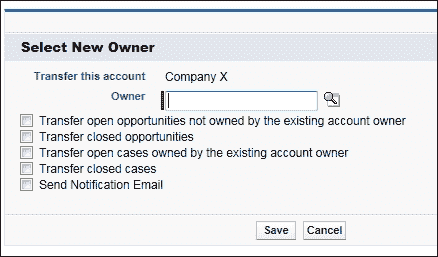

# 第八章：介绍 Salesforce CRM 的销售云、服务云和协作功能

在上一章中，我们介绍了如何通过自动化业务任务和活动以及审批流程，将业务规则与 Salesforce 中的流程自动化对齐。

本章将为您概述 Salesforce CRM 中的职能领域，我们将从营销活动到客户以及更远的范围来探讨这个过程。

在本章的职能领域中，我们将涉及到业务团队在营销、销售和客户服务方面需要就业务流程的各个方面达成一致的角色和职责。这些业务职能领域都可以在 Salesforce CRM 中进行管理，在本章中，我们将重点介绍 Salesforce 提供的销售云、服务云和协作云功能。

最后，您将看到一系列关于 Salesforce CRM 管理的关键特性的问题，这些特性涉及销售云、服务云和 Chatter 的职能领域，这些内容都在本章中有介绍。

现在，我们将查看以下每个核心的 Salesforce CRM 功能：

+   营销管理

+   销售自动化

+   客户服务与支持自动化

+   企业社交网络和 Salesforce Chatter 协作

# Salesforce CRM 的职能概述

Salesforce CRM 的各项功能相互关联，正如前面提到的，它们存在交叉区域，这些区域可以通过以下图示来表示：

## 营销管理

营销管理可以在 Salesforce CRM 中通过名为**营销云**的应用套件使用。

核心功能使组织能够与销售团队共同管理从营销活动的启动到潜在客户开发的整个过程。营销套件中的功能有助于通过分析特定营销活动生成的潜在客户和商机来衡量每个活动的效果。

## Salesforce 自动化

Salesforce 自动化是 Salesforce CRM 的核心功能集，用于管理销售过程和活动。它使销售人员能够自动化手动和重复的任务，并提供与现有客户和潜在客户相关的信息。在 Salesforce CRM 中，Salesforce 自动化被称为**销售云**，它帮助销售人员管理销售活动、潜在客户和联系人记录、商机、报价和预测。

## 客户服务与支持自动化

Salesforce CRM 中的客户服务与支持自动化被称为**服务云**，它允许支持团队自动化和管理现有客户的服务与支持请求。通过使用服务云功能，组织可以处理客户的请求，如退换有缺陷的商品或修理、投诉，或提供关于产品和服务的建议。

与前述功能区域相关的特性和机制有助于用户和客户进行协作与信息共享，这就是企业社交网络。

## 使用 Salesforce Chatter 进行企业社交网络互动

Salesforce CRM 中的企业社交网络功能使得组织能够与人连接，并实时安全地共享商业信息。企业社交网络可以连接员工与客户，促进业务协作。在 Salesforce CRM 中，企业社交网络套件被称为**Salesforce Chatter**。

## Salesforce CRM 记录生命周期

Salesforce CRM 的功能使得可以处理从营销活动到客户获取及其后续过程，以下图所示：

在流程开始时，市场营销团队的责任是开发适当的活动以生成潜在客户。活动管理通过营销管理工具进行，并与潜在客户及任何受到活动影响的机会相关联。

经验证的潜在客户将被转化为账户、联系人和机会。这可以由市场营销团队或销售团队负责，并需要达成一个适当的销售流程。在 Salesforce CRM 中，账户是公司或组织，联系人是与账户相关的个人。

机会可以通过潜在客户转化生成，也可以由销售团队直接录入。如本书前述，Salesforce 的结构要求确立账户所有权——从而继承机会的所有权。账户所有权通常由销售团队负责。

机会通过销售过程中的销售阶段进行推进，直到阶段推进到“已成交/已关闭”，此时表示最终销售。机会信息应记录在组织的财务系统中。

在财务团队接受交易后（并可能交付商品或服务），后续的客户获取过程就会启动，这时账户和联系人可以被认定为客户。在这里，关于事件和请求的客户关系是通过在客户服务和支持自动化套件中升级案例来管理的。

# 营销管理

Salesforce CRM 中的营销管理提供了闭环营销自动化，可以通过营销应用访问，营销应用可从 Salesforce CRM 屏幕右上角的**应用菜单**中找到。

营销管理使得集成的营销功能成为可能，例如活动管理、潜在客户管理、报告与分析、响应跟踪、以及活动效果分析，同时允许来自各个部门的用户集中访问营销活动。

默认情况下，营销管理功能为所有用户提供一定级别的只读访问权限。然而，要创建、编辑和删除营销活动，并执行高级营销活动和潜在客户管理功能，用户必须在其用户记录中设置“营销用户许可证”，如下所示：

### 注意

“营销用户许可证”作为标准功能适用于拥有企业版或无限版的组织，并可以应用于任何活跃用户。

在 Salesforce CRM 营销管理中，以下关键功能是可用的：

+   营销活动管理

+   潜在客户管理

## 营销活动管理

通过定向营销活动，公司可以建立市场认知、生成潜在客户，并通过分析活动结果来调整优惠，以适应不同的客户群体。

Salesforce CRM 中的营销活动管理功能允许用户管理和跟踪外部营销活动。这些活动可以是直邮、路演、在线或印刷广告、电子邮件或其他类型的营销举措。

一些 CRM 系统将销售和营销功能分开，要求营销和销售用户登录到两个独立的模块；然而，在 Salesforce CRM 中，提供了一个专用的**营销活动标签**，使得营销和销售用户可以在一个系统内共同工作。

在**营销活动标签**下，营销团队可以访问他们营销活动的销售信息，销售团队则可以深入了解影响他们账户、联系人和潜在客户的营销活动。营销活动还可以按层次结构进行组织，以便灵活分析相关的营销举措。

通过整合营销和销售工作以进行活动和潜在客户管理，能够实现更大的协作。

可以捕获营销活动的基本成功标准，并用于进一步完善营销目标的定义。这使得营销部门能够更具责任感，更好地展示他们的营销**投资回报率 (ROI)**。

在 Salesforce CRM 中管理和处理营销活动时需要考虑的步骤如下：

+   营销活动规划

+   营销活动设置

+   营销活动创建

+   营销活动执行

+   营销活动响应

+   营销活动效果

### 营销活动规划

在开始构建和运行营销活动之前，制定一个整体计划是非常有用的，包括活动的目标和宗旨，如核心流程和活动类型，例如大规模营销邮件、举办会议、发送直邮等。

活动的目标也需要被识别，并明确是现有客户、现有潜在客户，还是新潜在客户。对于现有潜在客户，您可以使用潜在客户评分和潜在客户状态来促进客户分层。例如，可以使用一系列归档状态定义，如无兴趣、未来兴趣、培养等。

考虑如何分析和报告营销活动。

在早期阶段考虑这一点很有意义，这样您可以着手创建自定义活动字段。您可以自定义活动，以便改善目标定位和客户细分，并帮助比较和分析哪些类型的活动对于您的销售和营销团队最有效。

您的营销团队可能还希望通过使用第三方列表来定位新线索。这些第三方的嫌疑人、潜在客户或线索可以在 Salesforce 中用特定的标识进行标记。通过使用不同的记录类型标记或分配到不同的队列，这些线索记录可以与现有潜在客户分开，以便在它们可用于活动之前进行任何预筛选或去重处理。

### 活动设置

在设置活动管理时，您应确定谁可以访问您的活动。

### 注意

要创建、编辑和删除活动并配置高级活动设置，用户必须在其用户记录上勾选**营销用户许可**。

默认情况下，所有用户对活动具有读取权限，但要创建、编辑或删除活动，用户必须在其个人资料上具有**创建**权限，如下所示：

在启动新类型的活动时，您的营销和销售团队应协作，达成一致，确定需要捕捉的客户信息。在此，您可以使用活动和活动成员对象的标准字段，或根据需要创建新的自定义字段。

#### 标准活动字段

以下是活动对象上可用的关键标准字段：

| **字段** | **类型** | **描述** |
| --- | --- | --- |
| **活动名称** | 文本 | 这是营销活动的名称。应选择一个相关的名称，既对营销团队有用，也对销售团队有用。例如，Webinar Widgets EMEA FY12Q1。 |
| **类型** | 下拉列表 | 此字段用于活动的类型。Salesforce 提供以下标准列表：会议、网络研讨会、展会、公关、合作伙伴、推荐计划、广告、横幅广告、直邮、电子邮件、电话营销和其他。 |
| **状态** | 下拉列表 | 此字段用于活动的当前状态。Salesforce 提供以下标准列表：计划中、进行中、已完成、已中止。 |
| **开始日期** | 日期 | 此字段用于活动开始的日期。 |
| **结束日期** | 日期 | 此字段用于活动结束的日期。 |
| **预期收入** | 货币 | 此字段用于设置活动预计产生的收入金额。 |
| **预算成本** | 货币 | 此字段用于设置为开展活动而预算的金额。 |
| **实际成本** | 货币 | 该字段用于设置活动实际花费的金额。此字段必须记录，以便计算投资回报率（ROI）。注意：投资回报率的计算方式为：**((已赢得机会总值 - 实际成本) / 实际成本)) * 100**。 |
| **预期响应率 (%)** | 百分比 | 该字段用于设置活动的预期响应率。 |
| **已发送数量** | 数字 | 该字段用于设置在活动中目标人群的数量。例如，如果一个网络研讨会活动涉及向 25,000 人发送邀请，则发送数量会输入 25000。 |
| **活动状态** | 复选框 | 该字段用于设置活动是否处于激活状态。注意：如果活动未激活，它将不会出现在报告或活动选择的下拉列表中（该列表可在潜在客户、联系人、机会的编辑页面及相关列表中找到）。 |
| **描述** | 文本（长文本区域） | 该字段允许输入最多 32,000 个字符，以添加活动的详细信息。 |
| **总潜在客户数** | 数字 | 该字段是所有与此活动关联的潜在客户总和。 |
| **总联系人数** | 数字 | 该字段是所有与此活动关联的联系人总和。 |
| **转化的潜在客户** | 数字 | 该字段是所有与此活动关联并已转化的潜在客户的总和。 |
| **总响应数** | 数字 | 该字段是所有与此活动关联并且成员状态设置为**已响应**的活动成员的总和。 |
| **总价值机会** | 货币 | 该字段是所有与此活动关联的机会的总金额。 |
| **已赢得机会总值** | 货币 | 该字段是所有已关闭/已赢得机会的总金额，这些机会与此活动关联。 |

完整的字段集如下图所示，其中的选择列表值可以根据您的组织需求进行调整。

通过以下路径访问：**设置** | **自定义** | **活动** | **字段**：

#### 标准活动成员字段

以下是活动成员对象上的关键标准字段：

| **字段** | **类型** | **描述** |
| --- | --- | --- |
| **活动** | 查找（活动） | 该字段是活动名称。通过链接到活动记录进行设置。 |
| **联系人** | 查找（联系人） | 该字段是联系人姓名。通过链接到联系人记录进行设置。注意：只能设置联系人或潜在客户（不能同时设置）。 |
| **潜在客户** | 查找（潜在客户） | 该字段是潜在客户姓名。通过链接到潜在客户记录进行设置。注意：只能设置联系人或潜在客户（不能同时设置）。 |
| **状态** | 选择列表 | 这是活动成员在关联活动中的状态。Salesforce 提供以下标准值：已计划、已发送、已接收和已响应。每个活动都有一个特定的结果，可以在成员状态和响应字段中捕获。通过明确定义的成员状态和响应值，报告将变得更容易进行。 |

完整的字段集显示在以下截图中，其中选择列表值可以根据您的组织进行调整。通过路径**设置** | **自定义** | **活动** | **活动成员** | **字段**访问它们：

您的营销团队和销售团队还应该帮助定义并达成一致，关于任何所需的自定义字段或选择列表值；例如，细分定义、状态和响应。

### 活动创建

要创建活动，用户必须在其用户记录中选中**营销用户**复选框，并且在其配置文件中拥有如前所述的**创建**权限。

要创建一个活动，请按照以下步骤操作：

1.  点击**活动**标签以查看活动的主页，或在侧边栏的**创建新建**下拉列表中选择**活动**。

1.  输入适用于活动的字段值，如下截图所示：

1.  现在点击**保存**，或点击**保存并新建**以保存活动，并添加另一个活动。

#### 成员状态值

新活动有两个默认的成员状态值：**已发送**和**已响应**。这些值来自我们之前查看的**活动成员状态**选择列表。

然而，非系统管理员用户可以通过点击**高级设置**按钮，在活动详细页面中覆盖状态值（仅限于特定活动记录），如下截图所示：

在这里，您的用户可以根据需要编辑、替换它们或创建新的值：

### 提示

**创建多个响应值：**

您可以拥有多个**响应**值。这些值将加总在一起，生成计算字段**总响应**。

#### 目标名单

目标名单是一个营销术语，用来描述要包含在营销活动中的个人或人群类型。

在某些情况下，例如在线广告活动中，人们不会被特别设置为个人目标。在这种情况下，活动通常会在 Salesforce 中设置为没有成员的活动。

如果您的活动是面向个人的，那么创建一个已根据能带来最高质量回报的标准进行细分的目标名单是很重要的。

定位现有潜在客户或联系人

要定位现有潜在客户或联系人，您可以在 Salesforce CRM 中使用以下方法：

| **方法** | **描述** |
| --- | --- |
| 使用**活动详情**页面 | 点击**管理成员**按钮以添加多个活动成员 |
| 创建**潜在客户**或**联系人**报告 | 点击**添加到活动**按钮以添加多个活动成员 |
| 使用**潜在客户**或**联系人列表**视图 | 点击**添加到活动**按钮以添加多个活动成员 |
| 使用**潜在客户**或**联系人详情**页面 | 点击**添加到活动**按钮以添加单个活动成员 |

#### 使用活动详情页面

若要从**活动详情**页面添加多个活动成员，用户应选择**管理成员**按钮，如下图所示：

你可以通过在**活动详情**页面的**管理成员**下拉按钮中选择**添加成员 - 搜索**来添加现有的联系人或潜在客户。

#### 创建潜在客户或联系人报告

若要从潜在客户或联系人报告中添加多个活动成员，请执行以下步骤：

1.  创建自定义潜在客户或联系人报告。

1.  在**选择标准**步骤中，输入最多三个标准来细分报告数据。

例如，要定位年收入超过一千万的电子产品或能源公司中的所有首席财务官（CFO），你可以设置以下条件：

+   职位为首席财务官（CFO）

+   行业为技术、通信（使用逗号表示 OR 布尔运算结果）

+   年收入超过 10,000,000

现在你可以运行报告并使用**添加到活动**按钮，如下图所示：

#### 使用潜在客户或联系人列表视图

在潜在客户或联系人列表视图中，你可以点击**添加到活动**按钮以添加多个活动成员。

#### 使用潜在客户或联系人详情页面

你可以在**潜在客户详情**和**联系人详情**页面中使用**添加到活动**按钮将该记录作为单个活动添加，如下图所示：

#### 定位新潜在客户或前景

当在 Salesforce 中使用外部购买的新潜在客户名单时，建议为记录标记一个特定的第三方标识（例如通过记录类型或自定义选项列表值）。这些记录可以在添加到任何活动或销售活动之前进行预先筛选。特别重要的是，对 Salesforce 数据库中的现有记录进行去重，以便你能够确定哪些是现有客户或潜在客户。

Salesforce 不建议批量导入租赁或购买的潜在客户名单，因为这些名单通常由名单供应商控制，可能有使用限制或政策限制。在这种情况下，你应该仅将名单中的姓名作为目标名单，只有在潜在客户对你的活动作出回应后，才应导入潜在客户记录。

### 活动执行

尽管在执行离线或在线活动时，活动执行活动发生在 Salesforce CRM 应用之外，但某些活动功能可以通过 Salesforce 中的导出功能帮助实现。

用户可以使用 Salesforce 生成账户和个人的列表，供邮寄公司或电子邮件专业合作伙伴使用，发送批量营销电子邮件，用于在线和离线活动（如贸易展览、广告、直邮等）。

有多种可用选项可以将 Salesforce 与其他解决方案集成，包括批量电子邮件发送的功能。本书后面会讲解集成解决方案，来源包括`AppExchange`目录（Salesforce.com 提供的认证产品和服务市场）。

Salesforce 可用于发送批量电子邮件，但该应用并非专门用于大规模批量电子邮件营销，并且存在发送邮件数量的限制。

对于每个 Salesforce 应用，每天最多可以向外部电子邮件地址发送 1,000 封邮件。使用企业版时，批量电子邮件中可以包括的外部地址（无论是唯一的还是非唯一的）最多为 500 个，而在无限版和性能版中，限制为 1000 个。

### 注意

批量电子邮件的限制不考虑唯一地址。例如，如果你在批量电子邮件中包含了`john.smith@widgetsXYZ.com` 500 次，则会被计为 500 次，计入任何限制。

你可以构建一个集成的网页表单，自动将个人捕获为 Salesforce 中的潜在客户。此内容将在本章**营销管理**部分的**潜在客户管理**章节中详细介绍。

### 活动响应

在活动执行后，公司通常需要跟踪响应，可能包括：

+   使用网站表单进行响应，可以设置**Web-to-Lead**表单，在目标页面创建响应表单。所有响应会作为潜在客户出现在 Salesforce 中，但可以与活动关联。此内容将在本章后面介绍。

+   使用活动成员导入向导批量更新或离线响应，以导入潜在客户或联系人及其响应。用户需要**营销用户**配置文件或**导入潜在客户**权限才能使用这些向导。

+   手动响应；例如，当潜在客户和客户通过电话或电子邮件回应时，用户可以在潜在客户或**联系人详细信息**页面的**活动历史**相关列表中手动记录这些响应。

#### 活动影响

为确保现有机会包含在活动结果中，你可以将活动添加到机会的**活动影响**相关列表中，如下所示。

### 注意

**Campaign Influence**相关列表默认不包含在**机会页面布局**的相关列表中，因此你可能需要将其添加到你选择的**机会页面布局**中。

通过设置**主要活动来源标志**（**Campaign Influence**记录上的一个复选框），机会金额将包含在活动统计和报告中，如下所示：

### 活动效果

可以通过使用活动记录的统计数据或运行活动报告来分析活动效果。

#### 活动统计

**活动详情**页面上的汇总字段，如下图所示，允许查看各种统计数据，如响应总数、从活动中产生的业务量等：

每次保存活动时，活动统计数据会自动重新计算。当潜在客户转换为机会时，最近与该潜在客户关联的活动将自动传递到该机会。

#### 活动报告

可以通过从**报告**标签选择**活动报告**文件夹来访问报告，如下图所示：

例如，**活动 ROI 分析报告**显示了性能指标，并为你提供了活动的投资回报率，如下截图所示：

### 注释

**ROI 计算：**

从活动 ROI 分析报告中提取的 ROI 百分比计算公式如下：((赢得的机会总值 - 实际成本) / 实际成本) * 100。在示例中，我们得到：((30,000 - 2500)/2500))*100 = 1100%。**注释**：所有与活动相关联的机会必须设置为“已关闭赢得”，并且该活动必须设置为它们的主要活动，才能将其包含在赢得机会总值金额中。

### 可自定义活动影响概览

Salesforce 改进了之前描述的活动影响机制，并提供了**可自定义活动影响**功能。

**可自定义活动影响**允许你选择如何将机会的收入归因于与其相关的多个活动。

在写作时，活动影响和可自定义活动影响的共有功能包括：

+   自动与机会关联

+   可以使用 Salesforce 默认模型，将 100%的收入归因于机会上的主要活动

+   按照指定模型在机会上应用活动影响

在写作时，只有在可自定义活动影响中可用的功能包括：

+   可以创建自定义活动归因模型

+   允许灵活的影响归因

+   允许锁定活动归因模型

+   允许在给定的营销活动归因模型下，应用营销活动影响于机会。

+   生成针对给定营销活动归因模型的营销活动结果

+   允许 API 访问

使用**可自定义的营销活动影响**，你可以配置多种方式来跟踪机会如何从一个或多个营销活动中受益并受到影响。每种跟踪方法都是通过创建自定义的营销活动归因模型来实现的。

默认的归因模型将 100%的收入归因于机会的主要营销活动，并将 0%的收入归因于用户为机会分配的其他营销活动，这是**可自定义的营销活动影响**的标准模型。

**可自定义的营销活动影响**的好处在于，它通过创建自定义归因模型，允许你在收入归因于营销活动时提供更大的灵活性。自定义归因模型的示例包括：

+   将 100%的收入归因于最初与机会关联的营销活动。

+   将 100%的收入归因于最近与机会关联的营销活动。

+   将收入均匀分配给所有与机会关联的营销活动。

使用**可自定义的营销活动影响**，你可以通过锁定归因模型，防止用户手动创建或更新与机会相关的营销活动影响记录。在此情况下，属于锁定归因模型的记录只能通过 Salesforce API 进行更新。

### 注意

使用**可自定义的营销活动影响**时，默认的 Salesforce 模型始终是锁定状态。

## 潜在客户管理

合理管理潜在客户常常在公司内部引发问题。潜在客户数据的状态和质量可能会在尝试通过销售流程自动处理时造成障碍。潜在客户数据通常来自不同来源，如果不加以控制，可能会使其难以准确处理。

如果没有统一的系统和约定的处理方式，可能会导致市场营销团队与销售团队之间的冲突，市场营销团队通常无法追踪潜在客户在分配给销售后发生了什么，而销售团队则无法验证数据的质量。Salesforce CRM 帮助弥合销售与市场营销之间的差距，并通过使用潜在客户管理机制提供了一种改善从潜在客户到最终销售交易流程的管理和自动化的方法。

潜在客户是潜在机会，可以通过 Salesforce CRM 中的**潜在客户**选项卡访问。它们是潜在交易的来源，通常需要更多的资格验证，可能是请求更多信息的网站访客、市场营销活动的响应者、展会访客等。潜在客户与账户、联系人和机会记录分别存储和管理，这些内容将在本章后面详细介绍。

### 标准潜在客户字段

在潜在客户对象上可以使用以下关键标准字段：

| **Field** | **Type** | **Description** |
| --- | --- | --- |
| **Lead Owner** | 查找（指向潜在客户或队列） | 此字段为潜在客户的所有者，可以是用户或队列。潜在客户可以由个人拥有或存储在队列中。在此，您可以允许指定的用户从队列中接受（并返回）潜在客户。稍后我们将在本节中详细介绍此内容。 |
| **Last Name** | 文本 | 此字段为姓氏，且为必填字段。姓氏会在潜在客户转化过程中复制到联系人记录中的姓氏字段。 |
| **Company** | 文本 | 此字段为公司名称，且为必填字段。公司名称会在潜在客户转化过程中复制到账户记录中的公司名称字段。 |
| **Lead Status** | 选择列表 | 此字段为状态，且为必填字段。Salesforce 提供以下标准值：未联系 - 未联系、正在处理 - 已联系、已关闭 - 已转化、已关闭 - 未转化。Lead Status 是在潜在客户流程设置中使用的重要字段，稍后我们会在本节中进一步探讨。 |
| **Lead Source** | 选择列表 | 此字段用于设置潜在客户出现的来源。Salesforce 提供以下标准值：Web、电话咨询、合作伙伴推荐、购买列表和其他。 |

完整的字段集如下图所示，选择列表值可以根据您的组织需求进行调整。您可以通过以下路径访问这些字段：**设置 | 自定义 | 潜在客户 | 字段：**

### 潜在客户业务流程

在潜在客户管理功能中创建业务流程涉及达成一致并实施销售和营销团队在潜在客户生命周期中记录的步骤和字段值。

潜在客户流程可以通过以下路径访问：**设置 | 潜在客户 | 潜在客户流程**，您可以在此创建或编辑流程，如以下截图所示：

现在，您可以为潜在客户分配状态值，如以下截图所示：

最后，通过将潜在客户的业务流程与一个或多个记录类型关联起来，这将使其根据用户的个人资料对他们可用。

### 在 Salesforce CRM 中创建潜在客户

在 Salesforce CRM 应用程序中，有几种创建潜在客户记录的方式。这包括用户手动输入单个潜在客户，潜在客户自己手动输入潜在客户（使用面向公众的网页表单，称为**Web-to-Lead**），或者您或您的用户在应用程序中手动导入多个潜在客户。

#### 在应用程序中创建潜在客户记录

潜在客户可以通过点击**Leads**标签中的**New**按钮，或者从左侧栏中的**Create New**选择创建，方法如以下截图所示：

#### 手动创建潜在客户（使用 Web-to-Lead）

在 Salesforce CRM 中，借助 Web-to-Lead 功能，线索可以直接从面向公众的网站输入到 Salesforce 应用程序中。这意味着潜在的客户信息可以直接从个人那里收集。该功能用于生成**超文本标记语言**（**HTML**）代码，然后将其嵌入到所需的网页中。

**线索设置**

要启用**Web-to-Lead**功能，首先需要通过路径**设置 | 自定义 | 线索 | 设置**来配置适当的线索设置。然后点击**编辑**按钮以显示页面，如下图所示：

现在选择一个**默认线索所有者**并勾选**通知默认线索所有者**复选框，以便每当有线索分配给他们时，自动通知默认线索所有者。

### 注意

默认线索所有者将成为任何未通过线索分配规则自动分配的线索的所有者。

**Web-to-Lead 设置**

要启用 Web-to-Lead 功能，首先需要通过路径**设置** | **自定义** | **线索** | **Web-to-Lead 设置**来配置**Web-to-Lead** **设置**。然后点击**编辑**按钮以显示页面，如下图所示：

现在勾选**启用 Web-to-Lead**复选框，选择在从在线网页表单录入线索时将设为创建者的用户，最后创建**Web-to-Lead**电子邮件自动响应规则，以确定在潜在客户在线提交信息时发送哪些电子邮件。然后，点击**保存**。

**生成 Web-to-Lead HTML 代码**

要生成**Web-to-Lead** HTML 代码，请按照路径**设置 | 自定义 | 线索 | Web-to-Lead**。然后点击**创建 Web-to-Lead 表单**按钮以显示页面，如下图所示：

现在选择表单中要包含的字段，并指定用户提交表单后将跳转到的 URL。最后，点击**生成**按钮，然后复制生成的 HTML 代码并发送给负责贵公司网站的团队。

页面样式可以根据您的网站进行自定义，但生成的 HTML 代码中的核心表单元素不应更改。

通过**Web-to-Lead**功能，您可以每天最多捕获 500 个线索。

### 提示

**要增加每日 500 条线索的限制：**

该功能可以通过向 Salesforce 客户支持发送请求来增加，尽管增加可能会产生额外费用。

**Web-to-Lead 自动响应规则**

自动响应规则提供了一种方法，用于定制在个人填写完网页线索表单后自动发送的任何通信。这些自动响应规则可以包含逻辑，以确定发送哪些电子邮件模板以及发送什么内容给使用**Web-to-Lead**生成的线索。

要启用自动响应规则，请按照路径**设置 | 线索 | 自动响应规则**进行操作。然后，点击**新建**或**编辑**按钮，如下图所示：

在这里，首先创建规则详细信息、命名并激活规则。然后，添加包含逻辑的规则条目，并且可以创建多个规则条目。规则条目需要以下内容：

+   执行顺序

+   触发规则的条件

+   发送者电子邮件地址详细信息

+   用于发送给响应者的电子邮件模板

### 注意

所有发送的电子邮件都包括在组织每日 1,000 封群发电子邮件的限制内。

#### 手动导入多个线索

要导入线索，请按照路径**设置 | 数据管理 | 导入线索**进行操作。然后根据屏幕上的提示，将数据从当前来源导出，并在文件中的每一列标注正确的字段名称，如下图所示：

### 注意

只有在其配置文件中拥有**导入线索**权限的用户（在一般用户权限部分）才能访问导入线索功能，可以导入最多 50,000 个线索的文件。

线索分配规则可以根据线索字段中的值自动将线索分配给用户或队列。或者，导入文件中的**记录所有者**字段可以确定每个导入线索的所有权。

如果没有线索分配规则或**记录所有者**字段，导入的线索将自动分配给执行导入的用户。

**导入队列**显示导入的状态。当导入完成时，您将通过电子邮件收到通知（此通知可能需要最多 24 小时）。

### 注意

拥有**市场营销用户**配置文件的用户也可以通过在**营销活动详情**页面的**管理成员**下拉按钮中选择**添加成员 - 导入文件**来导入新线索。

#### 线索队列

队列可以看作是一个存储位置，用于将线索按照通常是地理区域或业务功能分组。**线索**会一直保留在队列中，直到被用户分配或接受。已被包含在队列中的用户可以通过点击**接受**按钮来访问并接受记录，如下图所示：

### 注意

每当创建线索队列时，Salesforce 会自动生成一个线索列表视图，使用户能够访问队列中的记录。

#### 创建并将用户添加到线索队列

要创建并为用户提供访问潜在客户队列的权限，请按照以下路径操作：**设置** | **管理用户** | **队列** | **新建**。

在这里，你可以执行以下操作：命名队列，选择支持的对象（选择是潜在客户还是案件），并分配队列成员（选择是用户、公共组、角色，还是角色和下属）。

你还可以设置队列，以便每当一个案件被分配到队列时，电子邮件会发送给队列成员（使用队列的默认电子邮件地址）。

#### 潜在客户分配规则

潜在客户分配规则决定了潜在客户如何自动分配给用户或队列。它们包含规则条目，这些预定义的业务规则决定了潜在客户的路由方式。

潜在客户分配规则可以通过以下路径访问：**设置** | **自定义** | **潜在客户** | **分配规则**。

在任何给定时间只能有一个潜在客户分配规则处于活动状态，但每个规则可以有多个标准，如下所示：

标准按照它们在列表中出现的顺序进行评估。当有多个规则可以应用时，你可以通过将最具体的标准设置为第一位，然后添加更多更通用的标准来设置优先级。以下截图展示了一个简单的多个标准规则的示例和用例，使用**国家**字段根据地理标志分配潜在客户：

#### 潜在客户转化

潜在客户的资格评定取决于你的业务流程，并应与市场营销和销售团队共同制定。

作为潜在客户转化过程的一部分，潜在客户记录中的某些关键信息会映射到 Salesforce CRM 对象的账户、联系人，并可选择映射到机会记录。在潜在客户转化过程中，会为这些对象创建新记录，其中账户记录的名称字段将包含来自潜在客户的**公司名称**字段值，联系人记录的名称字段将从潜在客户记录中的**姓名**字段中填充。

### 注意

在潜在客户转化之前，任何现有的账户或联系人记录都会自动进行检查，以避免记录重复。

在潜在客户转化后创建的机会包含必填字段的默认值，其中**关闭日期**默认为当前季度的最后一天，**销售阶段**设置为阶段选择列表中的第一个值。

### 注意

在潜在客户转化过程中，结果机会上不会设置机会金额值。

要转化潜在客户，选择要转化的潜在客户，可以通过点击**潜在客户**标签并从列表视图中选择，或通过搜索后点击**潜在客户详细信息**页面上的**转化**，如以下截图所示：

转换后的线索屏幕将显示，您可以在此检查新记录的所有者。在这里，您可以选择发送自动通知电子邮件给记录所有者。您还可以设置转换后线索的状态，并指定为记录所有者创建一个新任务作为后续任务，如下面的截图所示：

在创建任何新的账户或联系人记录之前，Salesforce CRM 应用程序会尝试匹配现有的账户、联系人名称和线索名称。如果存在匹配项，则可以选择现有记录，如下面的截图所示：

单击**Convert**按钮完成线索转换过程并导致以下结果：

+   来自线索的公司名称成为账户名称

+   来自线索的线索名称成为联系人名称

+   机会和联系人与账户相关联

+   与线索相关的任何活动都将与机会相关联

    ### 注意

    转换后的线索不再可以在**Leads**标签中查看，查看记录的唯一方式是创建一个线索报告。在自定义报告时，输入一个筛选选项**Converted equals True**以查看转换后的线索。

**线索转换字段映射**

Salesforce 为线索转换过程提供了线索与账户、联系人和机会记录之间的标准字段映射；然而，您可以扩展这些映射。要扩展映射，请按照路径**Setup | Customize | Leads | Fields**。现在转到页面底部的**Lead Custom Fields & Relationships**部分，如下面的截图所示：

当您在账户、联系人或机会记录上添加必填的自定义字段，并且希望从线索记录填充这些字段时，可能需要扩展字段映射。如下面的截图所示完成此操作：

### 注意

当您的账户、联系人或机会有特定的必填字段或规则时，确保字段映射是正确的非常重要，这样可以保证数据的质量。您可以在“Lead 设置”部分中显示的截图中启用设置**Require Validation for Converted Leads**来在线索转换过程中执行验证逻辑。通过禁用设置**Require Validation for Converted Leads**，在线索转换过程中不会执行必需的自定义字段和工作流程或验证规则的验证逻辑。

# Salesforce 自动化

Salesforce 自动化允许在**客户关系管理**（**CRM**）系统中管理和控制销售过程中所需的各个阶段。启用和自动化这些阶段有助于提高质量，同时减少销售代表在每个阶段花费的时间。

在 Salesforce.com 中的 Salesforce 自动化是在**销售应用**内执行的，可以通过 Salesforce CRM 屏幕右上角的**应用菜单**访问。

在 Salesforce CRM 中的**销售应用**的核心是账户、联系人和机会管理功能，用于跟踪和记录新客户和现有客户在销售过程中每个阶段的信息。

账户可以通过标准视图或自定义视图进行排序，用户可以添加新账户并编辑现有账户。相关的联系人和活动也会列在同一页面上，用户可以根据需要执行其他操作，如查看、添加和编辑。

## 账户管理

在 Salesforce CRM 中，账户管理是通过**账户**标签中的功能进行的，通常客户信息就存储在这里。

账户记录用于存储从已转化线索中获得的公司信息，也可以用于存储合作伙伴、供应商甚至竞争对手的公司信息。

从商业对商业（B2B）的角度来看，账户可以被视为商业账户，通常是存储在应用程序中的公司记录。然而，Salesforce 还提供了另一种类型的账户——个人账户（Person Account），该账户允许采用商业对消费者（B2C）商业模式的组织管理与个人的关系。`商业账户`和`个人账户`记录提供非常相似的功能和字段；然而，个人账户没有某些字段或功能，例如**汇报字段**、**父账户字段**或账户层级功能。

### 注意

个人账户在 Salesforce CRM 应用中默认没有启用，只有通过请求 Salesforce 客户支持才能启用。

商业账户信息包括公司名称、类型、公司网站、行业、年收入、账单和送货地址、账户记录所有者、创建和修改日期等。

### 提示

**账户命名规范：**

保持一致的账户名称对于确保账户数据的清洁和准确至关重要。采用合适的账户命名政策，供 Salesforce 中的所有用户使用，会非常有用。实现这一点的一种方式是确保尽可能使用账户的完整法定名称来命名账户。

如本书前面所述，账户也是组织记录的主要机制。

它们用于记录共享和所有权层级，并且是标准对象（如联系人、机会等）的父对象。在更改账户记录的所有权时，您可以选择重新分配这些子记录，如下截图所示：

## 联系人管理

联系人管理通过**联系人**标签下的功能进行。**联系人**是用户希望保持联系的个人。对于销售团队来说，这通常是采购员和关键决策者等人；对于市场团队来说，可能包括首席执行官（CEO）、首席财务官（CFO）及其他有影响力的人物；对于支持团队来说，联系人可以是使用您公司提供的产品或服务的任何用户。

Salesforce CRM 提供了一个功能，允许用户存储、查看、排序、筛选、删除、编辑和查找联系人信息，这些联系人可能与账户相关，也可能无关。每个联系人都会记录详细信息，如职称、联系方式（地址、手机、工作电话、传真和电子邮件地址）、创建和修改日期，以及联系人记录的所有者。

## 活动管理

Salesforce 中的活动由任务和事件组成。与其他功能区不同，活动不能通过标签访问；相反，它们是在其他类型记录的相关列表中创建和查看的，例如账户、联系人、案例等。用户可以在相关项目的上下文中查看活动（例如，查看它们是否与某个账户相关），也可以从 Salesforce CRM 主页的日历和任务列表中查看它们，作为独立的机制。

记录的活动历史相关列表显示了所有已完成的任务、已记录的电话和已过期的事件，如会议、外发电子邮件等，涵盖该记录和任何关联记录。

## 云调度

创建和安排与客户的约会是大多数面向客户的业务的核心活动。市场、销售和客户支持团队会花时间与潜在的客户和顾客联系，并使用各种方式商定会面的时间和地点。

为了改善这一活动，Salesforce 提供了**云调度**功能，这是一个自动化系统，通过 Web 界面向个人管理调度并展示合适的预约时间。

### 注意

Salesforce 在撰写时宣布了计划停用云调度功能。从 Winter '17 版本开始，云调度不再对新组织可用，并将在 Winter '18 版本中被禁用，之后所有现有组织也无法再使用。

然后，Salesforce 会跟踪所有受邀者的回复，并根据每个人的时间安排选择一个合适的日期和时间，作为会议的确认时间。

### 注意

作为**Cloud Scheduler**功能的一部分，Salesforce 为会议创建了一个独特的网页，显示建议的会议时间。当受邀者访问该网页时，他们可以选择适合他们的时间，然后发送回复。Cloud Scheduler 设置。

可通过路径**设置 | 自定义 | 活动 | Cloud Scheduler**配置 Cloud Scheduler 的设置。Cloud Scheduler 的**新会议请求**按钮可以添加到包含**Open Activities**相关列表的页面布局中，例如联系人、潜在客户或**个人账户**（如果已启用）。

若要用户与个人账户请求会议，可能还需要按照路径**设置 | 自定义 | 账户 | 个人账户 | 页面布局**将**电子邮件**字段添加到页面布局中。

您还可以在用户的主页上包含**新会议请求**按钮。这显示在以下**预定会议**和**请求会议**选项卡之上，如下面的截图所示：

如果主页上未显示此部分，则需按照路径**设置 | 自定义 | 活动 | 活动设置**选择**主页选项卡上的日历部分中显示请求的会议**，如下面的截图所示：

### Cloud Scheduler 请求会议

以下是您的组织中用户如何使用 Cloud Scheduler 与同事和客户请求会议的概述。

#### 请求会议

用户可以通过**Open Activities**相关列表导航到他们想要与之请求会议的个人的联系人或**潜在客户详细信息**页面，或导航到主页上的日历部分。然后点击**New Meeting Request**按钮，显示**Meeting Request**页面。在这里，用户可以点击邀请其他 Salesforce 用户、潜在客户、联系人或**个人账户**参加会议，并在日历中提议最多五个会议时间，或者选择让 Salesforce 应用程序自动提议时间，如下面的截图所示：

#### 邀请者回应

Salesforce 向受邀者发送电子邮件的会议请求，以便他们选择自己可用的时间。在电子邮件中包含一个链接，受邀者点击链接**Respond to This Request**，打开会议的网页。在网页中，受邀者可以选择适合自己的建议时间并发送回复，如下面的截图所示：

#### 会议确认

Salesforce 跟踪所有响应，用户可以查看每位受邀者的可用时间，然后选择最佳会议时间并确认会议，如下面的截图所示：

## 机会管理

机会管理通过**Opportunities**标签中的功能进行。

Salesforce CRM 中的机会是由组织的销售团队创建和更新的销售交易。通过添加新的机会，销售团队正在建立销售管道，这将用于生成个人销售预测以及公司整体销售预测的数据。

机会记录对于组织中的其他用户也非常重要，例如市场营销团队，他们可能希望跟踪营销活动的效果，或者客户支持团队，他们可能需要在谈判支持合同时查看客户的最新消费情况。

## 产品、价格书和价格书条目

Salesforce CRM 中的产品是组织为客户提供报价并最终销售的项目。这些产品可以是商品或服务，销售用户可以将其添加到报价和机会中。作为管理员，你可以创建产品并将其与价格书中的价格关联。

价格书包含产品及其相关价格。一个产品可以列出在多个价格书中，以允许在不同的销售类别中以不同的价格销售商品和服务（这可能取决于产品销售给哪个客户、销售的地理位置或产品的总数量）。

产品与价格书中价格的变种和组合通过 Salesforce CRM 中的一个名为价格书条目的连接对象来管理。

# 服务云

Salesforce CRM 服务云的核心功能是案例管理功能，用于跟踪和记录与客户、服务和支持自动化相关的活动。Salesforce 中的案例记录与联系人和/或账户相关联。

案例是客户反馈、问题或疑问的详细描述。你的组织可以使用案例来跟踪和解决客户的问题。案例可以由支持团队或销售团队在**Cases**标签中手动录入，例如在电话或电子邮件交流后。但是，你也可以设置更复杂的**Web-to-Case**和**Email-to-Case 对象**，以便从公司网站和客户电子邮件中获取客户反馈。

## 案例管理

录入 Salesforce CRM 应用程序中的案例记录有多种方式，其中可能包括记录电话或电子邮件通信。用户可以通过访问**Cases**标签手动录入案例记录，但还有其他方法供你选择，包括：

+   通过**Email-to-Case**自动创建，客户发送的电子邮件触发。

+   通过**Web-to-Case**自动创建，客户通过网页表单提交信息

### Email-to-Case

**Email-to-Case**提供了通过预配置的电子邮件地址发送电子邮件时自动创建案例的功能。

### Web-to-Case

**Web-to-Case**提供了一种方式，客户可以在线提交支持案件。

### 注意

**Web-to-Case**功能可以每天生成最多 500 个新案件。

在设置**Web-to-Case**时，可以创建自动响应规则，使用电子邮件模板向通过网页表单创建案件的客户发送确认邮件。

### 案件队列

队列可以被看作是一个存储位置，用于将案件按地理区域或业务功能分组。案件会一直待在队列中，直到它们被分配给用户或被用户接受。

每当你创建一个案件队列时，Salesforce 会自动生成一个案件列表视图，以便用户访问队列中的记录。

案件记录可以通过手动或自动分配规则分配到队列。案件队列和分配规则与用于潜在客户的队列和分配规则非常相似。

### 分配规则

每次只能有一个案件分配规则处于活动状态，每个规则可以包含最多 25 个标准。

### 升级规则

升级规则用于在特定时间内自动升级未解决的案件。此升级基于**过期时间**设置（当**年龄**字段超期时触发）。

如果规则设置为在字段首次修改后禁用，或者根据案件的最后修改时间来禁用，修改案件字段是唯一能够停止升级规则计时的操作。

### 注意

对于每个升级规则，你可以指定最多五个操作，在增加的时间段内升级案件。**过期时间**字段指定如果案件未关闭，应该在多少小时后升级案件。此时间是从**指定如何设置升级时间**字段中设置的日期字段开始计算的。两个升级操作不能有相同的时间设置。

从案件记录向客户发送电子邮件不会重置案件升级。只有当记录本身（而非相关列表）发生更改时，案件升级时间才会被重置。

升级规则使用工作时间来确定何时升级案件。案件功能可以包括多个时区的工作时间，并且可以将案件关联到不同的时区。

每个升级规则可以有多个标准设置，每个条目最多可以有五个升级操作。以下截图显示了其中一个操作的示例：

### 早期触发器

早期触发器机制使得案件升级可以迅速跳到前一个季度小时。此设置对整个组织启用，旨在确保满足客户的**服务水平协议**（**SLA**）。

升级框上的早期触发器允许你指定案件是否应在指定的**过期时间**之前更早地升级。

举个例子，我们可以考虑当前升级逻辑每小时运行一次，升级触发器每`15`分钟触发一次。

现在，假设在`16:16`创建了一个案件，并且升级规则设置为一小时后触发。该案件将不会在`17:30`之前升级，因为它错过了`17:15`的升级触发器，仅差一分钟。当需要精确升级时，这可能会成为一个问题，因此启用早期触发器可以消除这个问题。

要在升级框中启用早期触发器，请按以下路径操作：**设置 | 自定义 | 案例 | 支持设置**。然后点击**编辑**，设置**启用早期触发器**复选框，如下图所示，然后点击**保存**按钮：

# Salesforce Chatter

Salesforce **Chatter**是一个企业社交网络应用，帮助用户与他人连接并共享业务信息。可以通过 Salesforce CRM 屏幕右上角的**应用程序**菜单访问**Chatter**，**Chatter**动态也可以从 Salesforce CRM 记录页面中访问。所有拥有 Salesforce 许可证的用户都可以访问**Chatter**，你还可以创建没有 Salesforce 许可证但希望访问**Chatter**的新用户。这些用户许可证可以访问**Chatter**的用户、个人资料、群组和文件，但不能访问任何 Salesforce 对象数据。

**Chatter** **Only**用户许可证可以为公司内部的用户创建，称为**Chatter** **Free**，以及为公司外部的员工创建，如客户，称为**Chatter** **External**。这些在以下截图中显示。

另一个**Chatter**许可（在之前的用户许可证选择截图中未显示）是**Chatter** **Only**许可。该许可也称为**Chatter Plus**，适用于没有 Salesforce 许可证但需要访问一些 Salesforce 对象的用户，除了**Chatter**外。它提供了对**Chatter**用户、个人资料、群组和文件的访问权限，以及查看 Salesforce 账户和联系人，并可以修改最多十个自定义对象的权限。

### 注意

你可以随时将用户的**Chatter Free**许可证升级为标准 Salesforce 许可证；然而，无法将标准 Salesforce 许可证或 Chatter Only 许可证的用户更改为 Chatter Free 许可证。

如前所述，Salesforce **Chatter**可以通过选择 Salesforce **Chatter**选项从**应用程序**菜单中访问，其中提供以下标签：**Chatter**、**Profile**、**People**、**Groups** 和 **Files**，如以下截图所示：

这些标签在**Chatter**应用中默认可用，但如果需要，你也可以将这些标签添加到其他应用中。

## Chatter 的主要功能

Salesforce **Chatter**中存在以下主要功能。

### Feed

**Chatter**动态是显示在 Salesforce 中的近期活动列表：

+   **Chatter**标签和**主页**标签。用户可以在这里查看他们的帖子、他们关注的人发布的帖子、他们关注的记录的更新，以及他们所加入的群组中的帖子。

+   配置文件，用户可以查看他们所查看的配置文件中发布的帖子。

+   记录，用户可以查看他们正在查看的记录的更新。

+   **Chatter**群组，用户可以查看他们正在查看的群组中的帖子。

### 帖子

**Chatter**帖子是**Chatter**动态中的顶级评论。

### 邀请

顾名思义，**Chatter**邀请通过电子邮件向同事（无论是否拥有 Salesforce 许可证）或公司外部的人（如客户）发送邀请。

## Chatter 设置

**Chatter**设置提供了用于动态、帖子和邀请的选项。我们将首先查看启用**Chatter**的设置，然后在接下来的部分中了解您可以在 Salesforce **Chatter**中应用的各种设置。

## 启用 Chatter

启用**Chatter**还会启用 Classic 2010 界面主题，这会更新 Salesforce 的外观和感觉。

### 注意

对于 2010 年 6 月 22 日之后创建的组织，**Chatter**默认启用。对于现有的组织，您必须启用**Chatter**，如稍后所示。

当启用**Chatter**时，全局搜索功能将被激活，允许跨 Salesforce 进行搜索，包括**Chatter**动态、文件、群组和人员。

### 注意

如果用户数为 15 人或更少，当启用**Chatter**时，所有用户会自动互相关注。

可以按照以下路径选择 Salesforce Chatter 选项：**设置 | 自定义 | Chatter | Chatter 设置**，如以下截图所示：

让我们逐一了解 Salesforce Chatter 设置选项。

### Chatter 设置 - 启用 Chatter

勾选**启用**复选框以开启**Chatter**和**全局搜索**功能。

### 群组

此选项允许您修改**Chatter**群组设置。通过勾选**允许群组归档**，您将启用群组的自动和手动归档功能。

### 注意

即使未启用此功能，群组也可以被激活。

### 动态中的丰富链接预览

勾选**允许丰富链接预览**复选框，在**Chatter**动态中显示丰富内容。启用此选项后，帖子中的链接将转换为嵌入的视频、图片和文章预览。

### 注意

丰富内容由[Embed.ly](http://Embed.ly)提供，Embed.ly 是一个第三方网站托管服务，预览仅适用于指向支持网站的链接。Salesforce 不会与[Embed.ly](http://Embed.ly)共享任何私人内容，只会共享 URL。

### 审批帖子

勾选**允许审批**复选框，允许用户在 Salesforce 工作流审批处理中使用**Chatter**帖子。启用此选项后，用户可以在**Chatter**动态中批准任何业务流程。

### 同事邀请

勾选**允许同事邀请**复选框，以使公司所有员工都能访问**Chatter**。这样即使没有 Salesforce 许可证的同事也能使用 Salesforce **Chatter**进行协作。

被邀请的用户可以访问**Chatter**用户、个人资料、群组和文件，但除非拥有 Salesforce 许可证，否则无法访问 Salesforce 记录。为了让公司同事使用**Chatter**，您可以手动添加**Chatter**用户或使用**邀请**选项。

新组织的邀请功能默认开启，**公司电子邮件域名**字段会根据第一个用户的电子邮件地址自动填充。

### 注意

Salesforce 建议您不要输入公共电子邮件域名，如[hotmail.com](http://hotmail.com)或[gmail.com](http://gmail.com)。这些域名下的任何电子邮件地址都能加入并访问您组织内的 Chatter 功能和数据。

您必须提供至少一个电子邮件域名。最多可以添加 200 个域名。您输入的域名应是公司内部电子邮件地址所使用的域名。

### 注意

出于安全考虑，**允许同事邀请**复选框将在域名为免费电子邮件提供商（如[yahoo.com](http://yahoo.com)、[gmail.com](http://gmail.com)等）时不会启用。

### 客户邀请

勾选**允许客户邀请**复选框，以允许用户邀请公司网络外的人。

### 文件同步

此选项允许用户通过**Chatter**中的“已同步”筛选器以及 Salesforce1 Mobile 访问保存在其 Salesforce 文件夹中的文件（这在第十章中有详细说明，*管理 Salesforce CRM 的移动功能*）。

用户需要安装一个名为 Salesforce 文件的桌面客户端。然后，他们可以安全地存储、同步和共享**Chatter**、桌面和移动设备之间的文件。

### 注意

在使用 Salesforce 文件客户端时，适用以下限制：个人用户可以在 Salesforce 文件夹中同步的最大数据量为 10GB。如果文件夹达到此限制，新的文件将无法同步，直到文件夹中的其他文件被删除。上传的文件最大大小为 500MB。

### 发布者操作

发布者操作（或简称操作）允许您创建操作并将其添加到主页上的**Chatter**发布器、**Chatter**标签页、**Chatter**群组以及记录详细页面中。操作也会出现在 Salesforce1 中的操作托盘中。

可以设置操作，允许用户通过**Chatter**动态或从用户的移动设备上直接创建或更新记录并记录通话。操作可以是常规操作，如创建和更新，或者根据公司需求配置和开发自定义操作。

以下是各种类型操作的列表：

+   启用**Chatter**时自动包含的标准操作，如**发布**、**文件**、**链接**和**投票**。在这里，您可以自定义这些操作的显示顺序，但不能编辑其属性。

+   **创建操作**允许用户创建记录。您可以选择在**创建操作**中使用的字段，并且当记录保存时，任何验证规则或必填字段都会被触发。

+   **记录通话操作**允许用户输入电话通话的详细信息，这些通话记录将作为已完成的任务保存。

+   **发送电子邮件操作**（仅在案例记录中可用）提供了 Salesforce1 移动端上的案例动态电子邮件操作（尽管在撰写时，这是**案例动态电子邮件**功能的简化版）。

+   **更新操作**允许用户修改与记录关联的动态中的记录。

+   **问题操作**允许用户提出和查询与记录相关的问题。

+   **自定义操作**是通过**Visualforce 页面**、**Canvas**应用程序或 Lightning 组件开发的扩展功能。

## 动态追踪

启用动态追踪后，用户将在其**Chatter**动态中看到他们所关注的对象和记录的更新。许多对象和字段是默认追踪的，但您可以进一步自定义动态追踪，以包括或排除特定对象和字段。

您可以为用户、**Chatter**群组以及以下标准对象设置动态追踪：帐户、资产、活动、案例、联系人、合同、仪表盘、事件、潜在客户、商机、产品、报告、解决方案和任务。您还可以为自定义对象配置动态追踪。

可以通过以下路径选择**Salesforce 动态追踪**选项：**设置** | **自定义** | **Chatter** | **动态追踪**，如下图所示。

## 聊天设置

该功能允许用户在**Chatter**中与他们关注的人进行聊天，无需使用外部聊天客户端。

### 注意

从 2016 年春季发布开始，新的组织无法再使用聊天功能，并且该功能将在 2017 年春季版本中不再支持现有组织。

可以通过以下路径选择 Salesforce 动态追踪选项：**设置 | 自定义 | Chatter | Chatter 设置**，如下图所示。

在**聊天设置**部分，选中**启用聊天**复选框，允许用户直接在 Salesforce CRM 中使用聊天功能。

在**Visualforce**设置部分，选中**允许**复选框，允许开发人员和管理员将**聊天**小部件嵌入到自定义的**Visualforce**页面中。

## 影响力

该设置允许您控制用户必须具备多少活动才能被纳入影响力级别的计算。

可以通过以下路径选择**Salesforce 动态追踪**选项：**设置 | 自定义 | Chatter | 影响力**，如下图所示。

## Chatter 电子邮件设置

此设置允许您为**Chatter**电子邮件应用自定义品牌，并控制您的用户是否能够接收电子邮件，以及通过电子邮件发送帖子。

**Chatter** **电子邮件设置**的选项可以通过以下路径进行设置：**设置 | 自定义 | Chatter | 电子邮件设置**，如下图所示：

### 电子邮件通知

以下是授予用户接收和回复电子邮件权限所需的步骤：

+   勾选**允许电子邮件**复选框，允许用户接收个人**Chatter**电子邮件通知。

+   勾选**允许电子邮件回复**复选框，允许用户通过电子邮件回复**Chatter**帖子。

# 测试您知识的问题

现在您将看到关于 Salesforce CRM 管理中工作流自动化区域的关键功能的问题，这些功能已经在本章中讲解。答案可以在本章末尾找到。

## 问题

我们提出了关于 Sales Cloud、Service Cloud 和**Chatter**的十个问题，这些问题在本章中已经概述。

### 问题 1 - 潜在客户自动化

您应该使用哪个功能将潜在客户记录路由到特定的潜在客户队列？（请选择一项）

**a）** 工作流规则。

**b）** 升级规则。

**c）** 分配规则。

**d）** 早期触发器。

### 问题 2 - 潜在客户转换

潜在客户会转换为以下哪个对象？（请选择一项）

**a）** 联系人、机会，并可选地包括一个账户。

**b）** 账户、机会，并可选地包括一个活动或联系人。

**c）** 账户、联系人，并可选地包括一个机会。

**d）** 账户，并可选地包括一个联系人或机会。

### 问题 3 - 已转换的潜在客户

已转换的潜在客户可以通过执行以下哪项操作在 Salesforce CRM 中访问？（请选择所有适用项）

**a）** 在联系人标签中创建已转换潜在客户视图。

**b）** 在潜在客户标签中创建已转换潜在客户视图。

**c）** 创建一个已转换的潜在客户报告。

**d）** 在账户标签中创建已转换潜在客户视图。

### 问题 4 - 添加到活动

您将在 Salesforce CRM 的哪个位置找到**添加到活动**按钮？（请选择所有适用项）

**a）** 在潜在客户记录的详细信息页面上。

**b）** 在联系人报告的结果页面上。

**c）** 在机会记录的详细信息页面上。

**d）** 在联系人记录的详细信息页面上。

**e）** 在潜在客户报告的结果页面上。

### 问题 5 - 活动潜在客户

您应该如何跟踪参与活动的潜在客户？

**a）** 使用自定义潜在客户查找字段将潜在客户链接到活动。

**b）** 将潜在客户转换为联系人，并使用自定义联系人查找字段将联系人链接到活动。

**c）** 将潜在客户作为活动成员关联到活动中。

**d）** 创建一个与潜在客户相同详情的联系人，然后将该联系人作为活动成员关联到活动中。

### 问题 6 - 活动投资回报率计算

要在机会中设置哪些内容才能将其值包含在活动的 ROI 计算中？（选择所有适用项）

**a**) 所有与活动相关联的机会必须在机会的实际成本字段中设置一个值。

**b**) 所有与活动相关联的机会必须是关闭/赢得的。

**c**) 所有与活动相关联的机会必须在机会的赢得机会总值字段中设置一个值。

**d**) 所有与活动相关联的机会必须设置为该活动的主活动。

### 问题 7 - 案例自动化

应该使用什么功能将案例记录路由到指定的案例队列？（选择一个）

**a**) 工作流规则。

**b**) 升级规则。

**c**) 分配规则。

**d**) 早期触发器。

### 问题 8 - 未解决的案例

哪个功能可以在一定时间内自动升级未解决的案例？（选择一个）

**a**) 工作流规则。

**b**) 升级规则。

**c**) 分配规则。

**d**) 早期触发器。

### 问题 9 - 活动

在 Salesforce CRM 中，找到的两种活动类型是什么？（选择一个）

**a**) 任务和日历。

**b**) 事件和日历。

**c**) 记录电话和事件。

**d**) 任务和事件。

### 问题 10 - Chatter

选择可以在记录字段更新时自动生成 **Chatter** 帖子的功能。（选择一个）

**a**) 发布者操作。

**b**) 客户邀请。

**c**) 进 Feed 跟踪。

**d**) 同事邀请。

## 答案

下面是关于销售云、服务云和 **Chatter** 的六个问题的答案。

### 答案 1 - 线索自动化

应该使用的功能来将线索记录路由到特定的线索队列是 **c**) 分配规则。

### 答案 2 - 线索转换

线索转换后的对象是 **c**) 账户、联系人，并且可选的机会。

### 答案 3 - 转换后的线索

转换后的线索可以通过执行 **c**） 创建转换后的线索报告，在 Salesforce CRM 中访问。

### 答案 4 - 添加到活动

**Add to Campaign** 按钮可以在 Salesforce CRM 中找到：**a**) 在线索记录的详细页面上，**b**) 在联系人报告的结果页面上，**d**) 在联系人记录的详细页面上，以及 **e**) 在线索报告的结果页面上。

### 答案 5 - 活动线索

你应该通过执行 **c**) 将线索与活动成员关联到活动中，来追踪参与活动的线索。

### 答案 6 - 活动 ROI 计算

以下内容必须在机会中设置，以将其值包含在活动的 ROI 计算中：**b**) 所有与活动相关联的机会必须是关闭/赢得的，且 **d**) 所有与活动相关联的机会必须设置为该活动的主活动。

### 答案 7 - 案例自动化

应该使用的功能来将案例记录路由到指定的案例队列是 **c**) 分配规则。

### 答案 8 - 未解决的案件

可以在一定时间内自动提升未解决的案件的功能是**b）** 升级规则。

### 答案 9 - 活动

Salesforce CRM 中找到的两种活动类型是**d）** 任务和事件。

### 答案 10 - Chatter

可以在记录字段更新时自动生成**Chatter**帖子的是**c）** 信息流跟踪。

# 总结

在本章中，我们探讨了 Salesforce CRM 中的功能领域，描述了从营销活动到客户及其后续过程。我们展示了 Salesforce CRM 中的潜在客户是如何转化为账户、联系人和机会记录的，这些记录随后将通过销售周期处理形成客户记录，我们还展示了如何通过案例管理功能，客户服务和支持团队为这些客户提供支持。

在功能领域内，我们讨论了营销、销售和客户服务相关的业务团队如何就业务流程的各个方面达成角色和责任的共识。我们还探讨了 Salesforce **Chatter**，一种协作应用，帮助通过连接人们和共享商业信息来支持这一过程。

最后，我们提出了一些问题，以帮助澄清 Salesforce 的 Sales Cloud、Service Cloud 和 Chatter 的一些关键功能**。**

在下一章，我们将探讨如何通过使用定制技术（如 Visualforce）进一步扩展 Salesforce CRM 平台，在不需要昂贵的 IT 开发资源的情况下，利用这些技术为组织带来更多的收益并增强系统。
