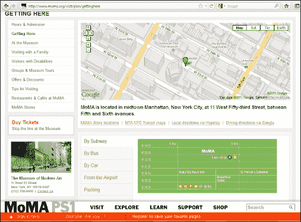

# 第九章 扩展和增强 Salesforce CRM

在本章中，我们将探讨如何扩展和增强 Salesforce CRM 应用程序中的功能，以及如何超越我们迄今为止所了解的标准 Salesforce 应用程序和功能。

我们将探讨如何通过使用来自 **AppExchange Marketplace** 的外部应用程序，向你的 Salesforce 环境中添加额外功能，扩展 Salesforce CRM 平台的能力。

本章将介绍允许高级定制的技术和技巧，帮助你了解创建 Salesforce CRM 应用程序中的 Web Mashup 所需的功能和注意事项。

你将发现，借助如 Visualforce 等平台和技术，你可以扩展应用程序的核心功能，并为你的组织带来显著的好处，同时无需昂贵的 IT 开发资源，就能增强系统。

本章将涵盖以下主题：

+   Salesforce AppExchange Marketplace

+   企业级 Web 应用中的 Mashup

+   Salesforce CRM 中的 Mashup

+   Visualforce 简介

+   使用 Visualforce 创建示例 Mashup

+   Visualforce 控制器概述

+   Apex 代码和触发器简介

+   变更管理概述

+   用户采纳

# Salesforce AppExchange Marketplace

Salesforce **AppExchange Marketplace** 是由 Salesforce.com 提供的网站，使组织能够选择额外的应用程序（称为 **Apps**），以为其 Salesforce CRM 应用程序添加新功能。

Salesforce CRM 应用程序和 AppExchange 都提供了基于网络的应用平台，用于使用和构建应用程序。这种集成的网络交付方式允许将 AppExchange 中的应用程序和新功能安装到 Salesforce 中，这通常比传统的软件更新机制要简单且成本更低。AppExchange 的好处在于，系统管理员可以轻松地根据公司业务需求的变化，扩展 Salesforce CRM 应用程序。

有大量的解决方案可供选择，以帮助实现大多数需求，你可以从 Salesforce **AppExchange Marketplace** 访问这些解决方案。在这一部分，我们将描述并引导你完成安装示例应用程序的过程。

列在 AppExchange 上的应用程序和服务由 Salesforce 社区的第三方开发者和系统集成商提供。许多应用程序也由 Salesforce 自身通过他们的团队 **Force.com Labs** 提供。这些应用程序可以从高度复杂的多屏幕解决方案到简单的仪表板或报告集不等。

应用程序有时会产生额外费用，但也有许多是免费的或仅需少量费用。一般来说，由 Salesforce.com Force.com Labs 团队提供的应用程序通常是免费的。要访问 AppExchange，请转到**设置 |** **AppExchange 市场**，如以下截图所示：


您还可以通过直接访问**AppExchange 市场**网站[`www.appexchange.com/`](http://www.appexchange.com/)来访问 AppExchange，如以下截图所示：


作为一个目录，Salesforce AppExchange 类似于消费者网站，如苹果的 App Store，它通过提供一个开放的、基于社区的渠道，用于应用程序的分发、获取和安装。

然而，AppExchange 有所不同，它不仅为第三方应用程序的分发提供平台，还提供系统集成商的服务列表。这使 Salesforce 社区能够从一个中心网站搜索和查看应用程序及服务。

## 托管包和非托管包

Salesforce 将通过 AppExchange 分发的组件和应用程序集合称为**包**。包主要有两种类型，分别是托管包和非托管包。

托管包与非托管包的区别在于使用受保护的组件，允许托管包由开发者进行升级，从而使他们能够添加新功能或在 Salesforce 环境中进行重构。通过保护诸如`Apex 代码`等组件，托管包还可以保护开发者组织的知识产权。

非托管包则不同，它们不保护组件，因此在您的组织内是静态的，因为无法由发布开发者进行升级。它们允许您访问所有已实现的自定义功能或代码，如果您想自己更改或扩展功能，它们会很有用。

### 注意

启用了**下载 AppExchange 包**权限的用户可以从 AppExchange 网站安装或卸载 AppExchange 包。

有时，应用程序是由**独立软件供应商**（**ISVs**）分发的，它们使用 AppExchange 包作为宣传自己的渠道，并展示其产品系列。

## 外部和第三方工具

通过在**AppExchange 市场**网站展示，ISVs 通常提供免费的应用程序，这有助于吸引流量和引起对其与 Salesforce CRM 互补的核心产品的兴趣，这些应用通常以与 Salesforce 相同的基于 Web 的解决方案形式提供。

这些补充应用通常与 Salesforce CRM 一起部署，用于支持特定的业务流程或功能。例如，**激励和佣金管理**、**项目管理**、**产品配置**、**费用管理**、**地址检查**等，都是从 AppExchange 获取的 Salesforce 应用示例。

## 应用安全

Salesforce 会检查所有注册的应用，确保它们没有明显的安全风险。然而，值得注意的是，由于这些应用是由第三方提供商开发的，您还应该进行广泛的测试，并进行尽职调查，以消除在将应用安装到生产实例之前的任何风险。

在应用通过 Salesforce 检查后，核心功能和代码将无法再更改。然而，允许修改自定义链接和网页标签，因为它们在安装后可能需要更改，例如，简单的目标 URL 可能需要从一个组织更改为另一个组织。

在决定是否信任应用来源并安装到生产环境之前，您需要意识到这些链接可能带来的风险。下面的章节将更详细地描述这一点。

## 在安装应用之前

以下步骤建议帮助您更多地了解该应用，并在实际将其安装到生产实例之前，确定其风险或是否需要进一步的配置：

1.  阅读规格说明和评论。

1.  审查截图和定制指南。

1.  进行试用。

### 阅读规格说明和评论

在安装之前，阅读与应用相关的规格说明，您将在其中看到以下细节：支持的 Salesforce 版本，支持的语言，组件摘要和包的详细信息。

通常也值得查看那些已经尝试安装该应用的其他用户留下的评论。尽管无法保证评论 100% 准确，且评论可能带有主观性，但它可以为您提供有关应用使用复杂性和其他系统管理员成功安装的指示。

### 审查截图和定制指南

大多数已在 AppExchange 网站上列出的应用程序提供了截图和可能需要的任何安装后定制的指南。这些内容非常有用，能够快速指示该应用是否对您和您的组织有用。

### 进行试用

应用程序通常提供试用选项（特别是那些更复杂的应用），您将被引导到一个外部的 Salesforce 应用程序，在安装之前，您可以作为只读用户使用该应用。试用为您提供了一种更好的方式，以确定该应用是否适合您的组织。

在试用过程中，您可以检查应用程序及其组件，以确保它们适用且没有安全风险。例如，诸如自定义链接、公式字段和网页标签等组件可能会将 Salesforce 会话 ID 发送到外部 Web 服务。

### 注意

会话 ID 是允许用户在无需重新输入登录名和密码的情况下访问 Salesforce CRM 的令牌。

Salesforce.com 推荐检查所有包含 `会话 ID 合并` 字段的外部服务链接，因为如果这些 `会话 ID` 被共享给外部服务，它们可能会泄露您的数据，从而带来重大的安全风险，这是我们需要警惕的。

## 安装应用程序

以下步骤描述了如何从**AppExchange 市场**将应用程序安装到您的 Salesforce CRM 应用程序中的过程：

1.  点击**立即获取**按钮。

1.  检查包信息。

1.  审查安全性。

1.  安装应用程序。

1.  执行安装后的配置。

引导您使用新技术的最佳方式是通过示例演示。

在这里，我们将安装名为**批量删除**的应用程序，该应用程序由 Salesforce.com 的 Force.com Labs 团队开发并发布。这是一个免费应用，提供一组自定义按钮，允许用户选择任意数量的记录，并通过单击删除它们。

### 注意

Salesforce.com 的 Force.com Labs 提供的 `批量删除` 应用可以直接通过以下网址从 **AppExchange 市场**获取：[`appexchange.salesforce.com/listingDetail?listingId=a0N300000016YuDEAU`](http://appexchange.salesforce.com/listingDetail?listingId=a0N300000016YuDEAU)

**批量删除应用**页面如下所示：


### 立即获取

点击**立即获取**按钮后，您将开始安装应用程序的过程，在此过程中系统会提示您使用 Salesforce 凭证登录 AppExchange，如下图所示：


然后，您将被要求选择安装位置，选项包括**在生产环境中安装**或**在沙盒中安装**，如下图所示：


然后，您将看到将要安装的应用程序的详细信息（列在*您正在安装的内容*部分）和应用程序将要安装的 Salesforce 组织信息（列在*您正在安装的位置*部分），如下图所示：


此页面显示有关**包**和**版本**的信息，以及属于应用包的一部分的**订阅**、**持续时间**和**订阅人数**等信息。

点击标有**我已阅读并同意条款和条件**的复选框，以确认您同意继续安装，然后点击**确认**和**安装**！以继续到 Salesforce 登录界面，如下图所示：


此界面允许您登录 Salesforce 应用。如果您希望将应用安装到您的生产组织中，您需要使用您的生产登录信息以及 Salesforce 生产 URL，可能是[`login.salesforce.com`](https://login.salesforce.com)。如果您想将其安装到沙盒组织中，必须将登录 URL 更改为沙盒的 URL，即[`test.salesforce.com`](https://test.salesforce.com)，并使用您的沙盒登录信息。

现在输入您的**用户名**和**密码**，然后点击**登录**继续到下一个界面：


在此界面中，您将看到如何处理现有组件名称与正在安装的组件发生冲突的选项。在这里，提供的选项是**不安装并重命名冲突组件**。您还将看到关于在安装应用程序时将应用的用户配置文件权限选项。

现在点击**安装**按钮以继续安装，安装完成后将显示以下确认界面：


在此最后界面，您将看到有关**应用名称**、**发布者、版本名称**以及构成应用程序包的其他详细信息。

此界面确认应用程序包已成功安装。

对于大型和复杂的应用程序，您可能不会立即看到**安装完成确认**界面。相反，有时会显示一条消息，表示安装已安排，之后您将收到电子邮件通知，告知部署完成。

### 安装后配置

在此**批量删除**应用的包组件中，包括一份 PDF 指南，描述了在使用该功能之前必须应用到应用程序中的安装后配置。该指南可以通过**文档**选项卡访问（该选项卡可通过主**文档**选项卡访问），如下图所示：


该指南描述了如何完成应用程序的安装和定制：


使用该指南，我们将**自定义列表**按钮添加到**账户详细信息**页面中的联系人相关列表，如下图所示：


最后，为了验证安装和自定义，我们可以导航到 **账户详细信息** 页面并访问 **联系人相关列表** 部分，在此处我们可以访问 **批量删除** 自定义按钮及其相关功能：


### 注

在 Salesforce CRM Unlimited Edition 中，您可以安装无限数量的应用程序。在 Enterprise Edition 中，最多只能安装十个应用程序。

## 卸载应用程序

您可以卸载从 AppExchange 安装的应用程序；但是，有一些注意事项。如果您卸载一个包含自定义对象的包，与该自定义对象相关的所有组件都会被删除，例如自定义字段、验证规则、工作流规则、审批流程、自定义按钮和链接等。

### 注

如果包中的任何组件被其他未包含在卸载中的组件引用，或者包添加的字段正被计划作业（例如基于时间的工作流字段更新）更新，则无法卸载该包（此时，您必须等待后台作业完成并重试）

卸载后，Salesforce 会自动创建一个包含包数据的导出文件。卸载完成后，Salesforce 会向执行卸载的管理员用户发送包含链接的电子邮件。

导出文件（以及相关的备注和附件）列在已安装包列表下方

### 提示

Salesforce 建议备份并将导出文件存储在其他地方，因为它将在卸载后仅在有限的时间内可用。要卸载 AppExchange 应用程序，请导航到 **设置** **| 已安装的包**，如下所示截图：


现在选择已安装的包，然后点击 **卸载**，或者点击包名称查看包的详细信息，勾选卸载确认框，最后点击 **卸载** 按钮，如下所示截图：


### AppExchange 最佳实践

在从 **AppExchange Marketplace** 网站安装应用时，应遵循以下最佳实践：

+   澄清应用的规范是否符合要求，并评估任何评审和评论

+   如果可用，可以进行试用

+   审查包中包含的所有组件，并注意与链接和会话 ID 相关的任何安全问题

+   在将应用部署到生产环境之前，在沙箱中进行测试

+   尝试获得业务支持，确保在部署到生产环境之前先验证和拥有该应用

+   如果该应用特别复杂，可以考虑为选定用户进行试点部署

+   在部署和激活到生产环境之前，提前将该应用通知业务部门

+   如果该应用特别复杂，为所有受影响的用户准备培训材料

# 企业级 Web 应用程序中的 mashup

**混搭**是一个常用的术语，用来描述来自多个来源的功能和内容的合并。它通常用于描述 web 应用的合并，这些源通常使用不同的技术来提供服务或应用程序。作为 web 应用混搭的一个特征，它有一个共同的特点——提供连接性，即互联网。

不同来源之间的连接可能需要不同层次和复杂度的集成，这取决于相关信息或内容是否仅仅需要查看，或者是否需要修改，因此是否需要将数据分发到各个系统。当混搭技术首次出现在网上时，它们是为了在互联网浏览器内查看来自其他网页源的内容而创建的，并没有在源系统之间传输任何数据或功能。

这种混搭的一个例子是一个网站，在其某个网页（如联系方式页面）中显示类似“如何找到我们”的页面。在 HTML 代码中，可能嵌入了一段功能，显示静态的 Google 地图或类似的网页控件，如下图所示：



这种类型的混搭是一个简单的客户端混搭示例，连接发生在网页浏览器内。网页中的这种编码方式提供了一种将来自多个互联网源的静态信息结合起来，并生成优雅的视觉展示的方法。

随着混搭技术的发展，现在可以实现更为复杂的功能。现在，web 应用之间可以实现高度复杂的集成，信息和功能可以无缝共享。正如你所预期的那样，这需要更复杂的编码来实现，可能还需要使用服务器端的基础设施。我们稍后将讨论客户端和服务器端混搭的区别。

# Salesforce CRM 中的混搭

一开始可能看起来很有挑战性，尤其是如果你不太熟悉 HTML 等互联网脚本技术，但某些类型的混搭可以由大多数人完成，不需要专业的软件开发人员或 IT 团队。

### 注意

HTML 是用于创建网页及其他可以在网页浏览器中显示的信息的主要标记语言 ([`en.wikipedia.org/wiki/HTML`](https://en.wikipedia.org/wiki/HTML))。

在开始之前，首先评估混搭需要如何以及在哪里进行是非常有用的，特别是要混合的数据和服务类型。一旦理解了这些，你就可以开始考虑编码的工作量，并规划实现它们所需的资源。

为了理解与 Salesforce CRM 相关的 mashups 风格，并如前所述，从高级层次来看，mashup 开发大致分为两类，分别是服务器端和客户端，如下图所示：


看看前面的图示，我们可以看到服务器端 mashup 经过以下高级步骤：

1.  用户使用网页浏览器向 Salesforce CRM 发起页面请求。

1.  网页浏览器调用 Salesforce CRM 服务器，后者会调用自定义 Apex 代码。

1.  Salesforce CRM 中的自定义 Apex 代码调用外部应用程序服务器上的一个函数。

1.  外部应用程序将响应返回给 Salesforce CRM。

1.  Salesforce CRM 处理响应，并将详细信息返回给用户的网页浏览器。

1.  用户的网页浏览器最终将整体响应呈现给用户。

客户端 mashups 要简单得多，因为它们使用浏览器来链接所需的请求和响应，以下是可以考虑的典型高级步骤：

1.  用户使用网页浏览器向 Salesforce CRM 发起页面请求。

1.  用户的网页浏览器向 Salesforce CRM 请求详细信息。

1.  Salesforce CRM 将响应返回给用户的网页浏览器。

1.  用户的网页浏览器向外部应用程序请求详细信息。

1.  外部应用程序将响应返回给用户的网页浏览器。

1.  用户的网页浏览器最终将整体响应呈现给用户。

如前所述，服务器端 mashups 通常需要复杂的编码，并且需要外部基础设施，这通常由 IT 资源提供。由于本书并不旨在为开发人员提供资源，我们将以较高层次来看待服务器端技术，但不会深入细节。

然而，我们将涵盖用例并提供一些逐步指导，介绍如何构建客户端 mashups，以及在 Salesforce CRM 应用程序中可以使用的工具。

## 服务器端 mashups

作为引言，并为完整性起见，以下部分描述了外部服务器端 mashups 的核心功能。我们将简要地看一下与使用服务器端 mashups 相关的能力、功能和影响。

服务器端 mashup 是外部服务 mashup 的一个具体示例。在这种情况下，外部系统可能作为客户端请求 Salesforce 的数据，或者使用 Salesforce 提供的数据，并在外部系统中将这些合成数据进行 mashup。

这些 mashups 通常使用 Web 服务，并且最常由使用 Web API 的组织提供，这些 Web API 描述了如何通过互联网访问服务的客户端应用程序，并在托管服务的远程系统上执行。

**万维网联盟**（**W3C**）提供了对 Web 服务的更正式定义，正如他们网页上所详细描述的 ([`www.w3.org`](http://www.w3.org))，这是一个国际社区，成员组织、全职员工和公众共同努力制定 Web 标准。

W3C 对 Web 服务的定义如下 ([`www.w3.org/TR/ws-gloss/`](http://www.w3.org/TR/ws-gloss/))：

*Web 服务是一种软件系统，旨在支持通过网络进行可互操作的机器对机器交互。它具有以机器可处理的格式（特别是 WSDL）描述的接口。其他系统通过按照描述中规定的方式使用 SOAP 消息与 Web 服务进行交互，通常通过 HTTP 传输，并与其他 Web 相关标准结合使用，采用 XML 序列化格式*。

尽管 W3C 对机器对机器交互的 Web 服务定义涉及使用 **简单对象访问协议**（**SOAP**），但今天有另一种越来越流行的协议，称为 **表述性状态转移**（**REST**）。这里只是提供一些信息，我们在本书中不会进一步讨论 Web 服务的细节。

## 客户端服务聚合

在 Salesforce CRM 中，通常有两种类型的客户端聚合，分别是客户端服务聚合和客户端展示聚合。

### 客户端服务聚合

类似于服务器端聚合，客户端服务聚合也可以用来调用 Web 服务或消费网站和数据源。它们可以用来从浏览器中调用 Salesforce CRM 的 Web 服务 API。客户端服务聚合比客户端展示聚合需要更复杂的编程，通常依赖与 Web 服务相关的技术。

客户端服务聚合和外部服务聚合对于需要从多个系统获取信息的组织非常有用，这些系统通常为业务数据处理提供服务并进行实时交互。指定和开发这些类型的聚合需要仔细评估，以确定所需的努力和资源。

### 客户端展示聚合

客户端展示聚合是最不复杂的聚合，且可以相对快速地组成。在这里，来自多个来源的实时数据和功能被嵌入到一个 Web 页面中，该页面需要来自 Salesforce 平台的数据，并与非 Salesforce 数据和功能进行聚合。

在 Salesforce 中，客户端展示聚合可以使用 Visualforce、HTML 和 JavaScript 组成，通常可以被非技术用户复制并粘贴，从而立即为 Web 应用程序增值。

在简要概述了客户端 mashups 的性质后，我们现在将看一下如何在 Salesforce CRM 中实际创建它们。如前所示，启用技术是通过 Salesforce 平台提供的 Web 页面框架 Visualforce。

引导你使用新技术的最佳方式是通过示范如何用示例来使用它。在这里，我们将展示一个客户端演示，展示一个 Google 地图小部件，显示 Salesforce 中某个公司记录的 Google 地图位置信息。

用户在 Salesforce CRM 中选择合适的账户记录后，Google 地图将展示给用户，并且可以直接在相关账户详情页面内显示实时的 Google 地图信息。该 mashup 是通过创建一个新的 Visualforce 页面来包含所需的 Google 地图小部件，并在账户详情页面中新增一个部分以展示该 Visualforce 页面。

# Visualforce 介绍

Visualforce 是 Salesforce CRM 中的框架，允许你进一步自定义组织的用户界面，超越我们之前讲解的标准功能。

如前所述，使用 Visualforce，您可以将多个对象的数据结合起来，创建与外部 Web 服务数据的 mashup，甚至覆盖标准 Salesforce CRM 应用功能中的一些逻辑和行为。Visualforce 由以下三个元素组成：

+   Visualforce 页面：这些用于定义用户界面。

+   Visualforce 组件：这些可以被视为标准或自定义构建的 Visualforce 代码段的库。

+   Visualforce 页面控制器：这些用于控制 Visualforce 页面的行为，可以由标准逻辑控制，或者您可以创建自定义逻辑来更改或扩展标准 Salesforce CRM 行为。

## Visualforce 页面

Visualforce 框架允许创建 Visualforce 页面。这些页面有点像存储在 Salesforce 中的文档，由指定页面外观和功能的指令组成。与 HTML 类似，Visualforce 页面采用基于标签的标记语言，每个 Visualforce 标签类型对应一个特定的用户界面组件。

### 注意

Visualforce 页面的最大大小不能超过 15 MB。

对于技术读者而言，Visualforce 的功能类似于 Java Server Pages 或 Active Server Pages，它用于管理从 Salesforce 平台检索数据以及通过互联网浏览器用户界面渲染结果。

### 创建 Visualforce 页面

现在，您已经了解了 Visualforce 提供的基本构建块，我们将描述如何创建 Visualforce 页面。本节将介绍创建和修改页面的方式，并展示以下两种方法：

+   使用 Visualforce 页面设置页面

+   使用开发模式

### Visualforce 页面设置页面

要进入 Visualforce 页面创建的设置页面，请前往 **设置 | 开发 | 页面**。然后点击 **新建** 按钮来创建一个新的 Visualforce 页面。选择现有条目查看页面，或点击 **编辑** 以修改该页面，如下图所示：


### Visualforce 开发模式

我们还可以使用名为 Visualforce 开发模式的功能来初步创建和编辑 Visualforce 页面。这可能是一个更好的选择，因为它提供了几个有用的功能，使得构建 **Visualforce 页面** 更加容易。

要开始使用开发模式，需要通过导航到 **您的姓名** | **设置** | **我的个人信息** | **个人信息** 来在你的用户记录上激活它。然后点击 **编辑** 按钮，选中 **开发模式** 复选框（如下面的截图所示），最后点击 **保存**：


在 Visualforce 开发模式下，你只需在浏览器的地址栏中输入一个唯一的 URL，即可创建一个新页面。

通过在浏览器的地址栏中输入一个唯一的 URL（即一个不存在的 Visualforce 页面 URL），可以自动创建新的 Visualforce 页面。例如，输入 URL [`na10.salesforce.com/apex/GoogleMap`](https://na10.salesforce.com/apex/GoogleMap) 会创建一个名为 Google Map 的新页面。

你需要小心确保输入正确的 URL 文本，因为在前面的示例中，正是 `/apex/GoogleMap` 部分提示 Salesforce CRM 检查并创建一个新页面（如果该页面尚不存在）。同样，确保 URL 的开头部分输入正确也很重要。[`na10.salesforce.com`](https://na10.salesforce.com) 部分指的是你的 Salesforce CRM 应用的 Salesforce 实例。

正确输入后，将显示以下界面，你可以在此创建 Visualforce 页面：


正如你所理解的，这样可以节省大量时间，因为你不需要不断导航到设置部分，从而节省了很多鼠标点击。

当你点击 **创建页面 Google Map** 链接时，结果编辑页面与通过设置路径访问的编辑页面是一样的，如下图所示：


启用开发模式后，在你创建或编辑的 Visualforce 页面下方会自动显示一个开发区域，里面包含了编辑器部分。要显示或隐藏开发区域，请点击以下图标：


编辑器允许你直接在浏览器窗口中编写 Visualforce 组件标签，并提供以下功能：


如所示，提供七个菜单功能用于：

+   保存页面

+   搜索文本

+   导航到代码中的指定行

+   撤销更改

+   重做更改

+   增加文本的字体大小

+   减小文本的字体大小

点击**组件参考**链接将带你到在线文档，提供所有 Visualforce 组件的描述以及示例代码，如下图所示：


此外，页面编辑器还提供高亮显示和自动补全功能，自动显示可用的组件标记标签，如下图所示：


在使用 Salesforce CRM 平台构建 Visualforce 页面时，启用开发模式的最大好处是，当你添加组件标签并在页面中构建代码时，你可以点击保存图标并立即查看所做的更改。

### 注意

Visualforce 页面必须没有错误，才能保存页面。

### Visualforce 组件

我们在前一部分中看到，Salesforce 提供了一组标准的预构建组件，如`<apex:actionFunction>`和`<apex:actionStatus>`，这些组件可以添加到 Visualforce 页面中，用于构建功能页面。此外，你还可以构建自己的自定义组件，以增强这个组件库。

类似于编程语言中函数的工作方式，自定义 Visualforce 组件允许你构建公共代码，然后在一个或多个 Visualforce 页面中重用这些代码。

自定义组件允许你定义可传递给每个组件的属性。属性的值可以改变标记在最终页面上的显示方式，以及为该组件实例执行的基于控制器的逻辑。

Visualforce 自定义组件由使用标准`<apex:component>`标签的 Visualforce 标记组成，因此，与其在每个需要公共代码的页面上重复 Visualforce 标记，不如定义一个具有特定属性的自定义组件，然后使用这些属性在页面上显示功能。定义完成后，组织中的每个 Visualforce 页面都可以像使用标准组件（如`<apex:dataTable>`或`<apex:actionStatus>`）一样使用自定义组件。

### 使用 Visualforce 创建示例混合应用

构建我们的示例混合应用时，我们将按照以下步骤操作：

1.  删除默认的新 Visualforce 标记内容。

1.  更改 Visualforce 控制器以指定一个帐户标准控制器。

复制并粘贴 Google 地图代码，并添加 Salesforce 特定的合并字段。

### 删除默认的新 Visualforce 标记内容

删除现有的 Visualforce 页面文本（如下图所示的第 2 至第 5 行），只保留起始和结束标签`<apex:page>`和`</apex:page>`，如下图所示：


### 更改 Visualforce 控制器以指定账户标准控制器

我们还需要更改 Visualforce 页面控制器，以便读取存储在账户记录中的字段值。控制器将在本章后面详细讲解，但目前我们将更改起始标签`<apex:page>`并添加`standard Controller`属性，该属性允许调用**账户**记录，如代码`<apex:page standard Controller="account">`所示：


复制并粘贴 Google Map 代码，并添加 Salesforce 特定的合并字段。

我们将复制并粘贴以下代码，其中包含 Salesforce 合并字段，用于在账户记录上渲染 Google Map：

```
    <script type="text/javascript" src="https://maps.google.com 
    /maps/api/js?sensor=false"></script> 
    <script type="text/javascript"> 
    function initialize() 
    { 
      var map; 
      var mapOptions = 
      { 
        zoom: 13, 
        mapTypeId: google.maps.MapTypeId.ROADMAP, 
        mapTypeControl: false 
      } 
      var mapMarker; 
      var geocoder = new google.maps.Geocoder(); 
      var address =  
       "{!SUBSTITUTE(JSENCODE(Account.BillingStreet),'\r\n',' 
       ')}, " + "{!Account.BillingCity}, " + 
       "{!Account.BillingPostalCode}, " + 
       "{!Account.BillingCountry}";geocoder.geocode( {address: 
       address}, function(results, status) 
       { if(status ==
         google.maps.GeocoderStatus.OK && results.length) 
         { if(status !=
         google.maps.GeocoderStatus.ZERO_RESULTS)          
           { 
              map = new  
              google.maps.Map(document.getElementById("map"), 
              mapOptions); 
              map.setCenter(results[0].geometry.location); 
              mapMarker = new google.maps.Marker({ 
                position: results[0].geometry.location, 
                map: map, 
                title: "{!Account.Name} " + address 
              }); 
            } 
          } else {      
            document.getElementById("map").innerHTML = "Unable to find or display a map
            for {!Account.Name}'s billing address : " + address; 
          } 
       }); 
     } 
</script> 
  <div id="map" style="width:100%;height:300px"></div> 
<script> 
  initialize(); 
</script> 

```

我们使用 Salesforce 合并字段从**账户**记录中传递**账单地址**数据给 Google Map API，如以下代码片段所示：

```
var address = "{!SUBSTITUTE(JSENCODE(Account.BillingStreet),'\r\n',' ')}, " + "{!Account.BillingCity}, " + "{!Account.BillingPostalCode}, " + "{!Account.BillingCountry}"; 

```

最终的代码将出现在 Visualforce 页面中，如下图所示：


在保存 Visualforce 页面时，页面会立即渲染。然而，此时无法传递账单地址数据给 Google Map 小部件（在我们将 Visualforce 页面添加到账户页面布局后，这部分会正确渲染），因此最初会出现错误，如下图所示：


### 注

请注意，使用`<apex:page standardController="account">`标签后，**账户**标签现在会自动高亮显示。

### 将 Visualforce 页面添加到账户页面布局

现在我们已经完成并保存了 Visualforce 页面，可以将**Google Map**页面添加到账户页面布局中。要将 Visualforce 页面添加到账户中，请导航至**设置 |** **自定义** | **账户** | **页面布局**。然后选择合适的页面布局。这里，我们将按照下面的步骤将其添加到名为“账户布局”的页面布局中。

### 向账户页面布局添加新部分

新的部分已被命名为**Google Map**，并设置为**1 列**宽度，通过拖放方式放置在**账户系统和描述信息**部分下方，如下图所示：


### 将 Visualforce 页面添加到新页面布局部分

现在，将**Google Map Visualforce**页面拖放到页面布局中的**Google Map**部分，如下所示的屏幕截图：


现在点击**保存**；我们准备好通过导航到一个账户页面来进行测试。

### 运行完成的 Visualforce 页面

转到**账户**标签，选择一个现有账户，以验证 mashup 是否按预期工作。

### 注意

你需要确保账户记录填写了账单地址。**账单地址**复合字段是 Salesforce CRM 中的一个标准**账户**字段。

这里我们有一个现有的 Salesforce.com 账户，**账单地址**已填充，并且在加载账户详情页面时显示一个**Google 地图**，如下所示的屏幕截图：


*如何在 Internet Explorer 中抑制浏览器安全警告？*

### 提示

默认情况下，当页面包含安全（HTTPS）和不安全（HTTP）内容的混合时，Internet Explorer 会显示以下安全警告消息：**此页面包含安全和不安全的项目。您是否要显示不安全的项目？** 当你创建一个包含不安全 URL 的 mashup 时，用户可能会根据其浏览器的安全设置看到此警告消息。要在 Internet Explorer 中抑制此警告，请按照以下步骤操作：从 Internet Explorer 工具菜单中选择**Internet 选项**，点击**安全**标签，点击**自定义级别**按钮，最后在杂项部分，将**显示混合内容**设置为**启用**，如下所示的屏幕截图：


## Visualforce 页面控制器

如本章前面所述，有四种类型的控制器可以用于控制 Visualforce 页面背后的功能。

### 标准控制器

标准控制器提供对标准 Salesforce CRM 行为的访问权限，正如我们示例中的客户端 mashup 所示，可以使用以下标签和属性作为 Visualforce 页面中的第一行来指定：

```
<apex:page standardController="Account"> 

```

标准控制器适用于标准对象，例如账户、联系人、商机等，也适用于自定义对象，提供对 Salesforce CRM 数据操作和行为的访问权限，支持保存、编辑和删除等操作。

### 自定义控制器

自定义控制器用于完全自定义的行为，并通过以下 Visualforce 标签和属性实现：

```
<apex:page controller="CustomAccount"> 

```

### 控制器扩展

控制器扩展用于扩展标准控制器的行为，并允许添加自定义功能。控制器扩展通过以下 Visualforce 标签和属性提供：

```
<apex:page standardController="Account"
extensions="CustomAccountExtension"> 

```

## 标准列表控制器

Salesforce 记录页面允许用户使用列表视图（在第三章中介绍，《配置对象和应用程序》）来筛选页面上显示的记录。例如，在账户主页上，用户可以通过从列表视图下拉菜单中选择**我的账户**来查看仅属于他们自己的账户列表。

标准列表控制器提供相同的列表视图选择列表，并且在 Visualforce 页面的第一行使用以下标签和属性实现：

```
<apex:page standardController="Account" recordSetVar="accounts"> 

```

## Apex 代码

Salesforce CRM 中的 Apex 代码语言基于 Java，这是用于互联网和基于 Web 的应用程序中最流行的编程语言之一，并在 Salesforce 平台服务器上执行。

虽然基于 Java，但 Apex 代码和 Salesforce CRM 平台不是可以用来运行开发人员选择运行的任何类型程序的通用计算平台。相反，Apex 被有意地控制和限制，并因此根据业务和平台的需求进行了设计。

### 注意

Salesforce 中的 Apex 代码并非旨在解决每个编程问题，而是主要关注帮助开发人员在开发时间、代码简洁性和维护成本上获得优势。

Apex 在 Salesforce CRM 中用于开发自定义控制器和控制器扩展的代码，以及我们稍后将要查看的 Apex 触发器。

Apex 特别设计用于构建管理数据和服务的业务应用程序，语言提供了高效的创建应用程序和业务逻辑的方法。开发人员可以专注于解决业务问题和领域需求所需的功能，而不必担心构建诸如数据库连接、错误处理等基础设施，这些都由平台管理。

应注意，由于 Salesforce CRM 平台是多租户平台，因此在某些操作中存在某些处理和执行限制。这些限制被称为**管理限制**，并且有一些限制和要求 - 例如，Apex 代码必须在开发者或沙箱组织中开发，并且必须有测试方法来验证每行代码。只有这样才允许部署到生产环境。

### 注意

要成功部署到生产环境，Apex 代码必须具有相关的单元测试方法，这些方法提供至少 75%的成功代码覆盖率。

### Apex 触发器

Apex 触发器是在 Salesforce CRM 应用程序中创建、更新或删除记录等任何记录操作之前和/或之后执行的 Apex 代码块。

触发器非常强大，可以包含控制流程的复杂代码。它们用于复杂的业务逻辑自动化，并且在使用验证规则或工作流规则（如字段更新）实现功能时，功能过于复杂，无法通过其他方式实现。Apex 触发器的开发通常需要软件开发人员的资源，因为它们对整个系统有一定的限制和影响。

在使用多个触发器时，并且与现有的工作流字段更新一起使用时，需要彻底了解任何依赖关系，以避免在创建或更新记录时产生连锁反应。由于触发器代码可以在自己的操作中更改正在更新的记录，因此需要理解并避免可能的递归效应。

### 注意

Apex 触发器为组织提供了许多好处，但也带来了一些风险，因为需要注意底层平台施加的某些模式和限制（如触发器批量处理、限制器等）。尤其重要的是理解组织内各种规则和触发器的执行时机、执行顺序以及相互依赖关系。

# 变更管理概述

如在**AppExchange 市场**应用安装部分中所述，您应当正确评估在 Salesforce CRM 组织中部署应用的功能和结果。这个概念属于更广泛的关注点，涉及到对 Salesforce CRM 应用程序的变更应用方式。

通过使用 Salesforce 沙箱，您可以在决定将新 Salesforce 功能推广到生产系统中的用户之前，适当地评估和执行尽职调查。如果是 AppExchange 应用，如果该应用未能成功，您无需卸载它。

## Salesforce 沙箱

沙箱是独立的 Salesforce CRM 环境，与您的 Salesforce 生产组织隔离，因此您在沙箱中执行的操作不会影响您的 Salesforce 生产环境，反之亦然。

要查看和管理现有沙箱或在 Salesforce CRM 中创建新的沙箱，请导航到 **设置 | 沙箱**。

您可以查看已创建的沙箱列表，单击沙箱名称即可查看有关沙箱的详细信息，例如创建时间。

在沙箱列表中，您可以看到 **名称**、**类型**、**状态**、**位置**、**当前组织 ID**、**完成时间** 和 **描述**，沙箱包括以下几种类型：**开发者**、**开发者专业版**、**部分数据** 和 **完整数据**，如下截图所示：


### 注意

沙箱的可用性取决于您的 Salesforce CRM 版本。某些类型是标准提供的，而其他类型则需要额外付费。

### 开发者沙箱

开发者沙盒用于编码和测试，并包含生产系统中所有配置设置的副本。然而，它不包含任何数据。最大数据存储量为 200 MB，文件存储为 200 MB。开发者沙盒可以每天刷新一次。

### 开发者专业沙盒

开发者专业沙盒用于编码、测试和用户培训，包含生产系统中所有配置设置的副本。然而，它不包含任何数据。最大数据存储为 1 GB，文件存储为 1 GB。**开发者专业**沙盒可以每天刷新一次。

### 部分复制沙盒

部分复制沙盒用于作为测试环境，并包含生产组织的配置设置副本。与**开发者**和**开发者专业**沙盒不同，部分复制沙盒允许你通过使用沙盒模板定义一个生产组织数据的样本。

要创建部分复制沙盒，必须在创建时应用沙盒模板，尽管最大数据存储量为 5 GB，文件存储量为 5 GB。对于沙盒模板中每个选择的对象，最多将从生产环境中复制 10,000 条记录。例如，如果你有一个仅包含账户的模板来创建部分复制沙盒，那么最多会复制 10,000 条账户记录到新沙盒中——不会复制其他记录。与开发者沙盒和开发者专业沙盒不同，部分复制沙盒只能每五天刷新一次。

### 完全复制沙盒

**完全复制沙盒**包含整个生产设置的副本，包括所有数据。由于数据也会在刷新期间被复制，因此刷新完全复制沙盒的次数限制为每 29 天一次。完全复制沙盒的存储限制与生产组织相同。

### 注意

**完全复制** **沙盒**通常用于**用户验收测试**（**UAT**）。

点击**新建沙盒**按钮可以创建一个新的沙盒。

**沙盒模板**选项卡用于**部分复制**沙盒，并决定从生产环境中复制哪些记录和数据类型。

**沙盒历史**选项卡让你查看沙盒的刷新历史，显示沙盒何时创建以及由谁创建。

**刷新**链接允许你用新副本替换现有的沙盒。现有的沙盒副本在刷新完成之前和直到你激活新副本之前仍然可用。

在创建或刷新**完全复制**沙盒时，你可以通过减少复制的数据量来缩短刷新时间。以下选项可以帮助你减少复制的数据量：

+   **案例历史**选项允许您选择将来自生产组织的案例历史数据复制到沙箱中的天数。您可以选择从 0 到 180 天的数据，以 30 天为增量。默认值为 30 天。

+   **机会历史**选项允许您选择将来自生产组织的机会历史数据复制到沙箱中的天数。这里，您可以选择从 0 到 180 天的数据，以 30 天为增量。默认值为 0 天。

    ### 注意

    默认情况下，**Chatter** 数据不会复制到沙箱中。**Chatter** 数据包括动态、消息和发现主题。如果希望复制这些数据，请选中**复制 Chatter 数据**复选框。Salesforce 不建议增加默认选择项，因为过多的数据可能会导致复制或刷新沙箱所需的时间延迟。**刷新**选项仅在每个可刷新沙箱上显示。

+   **激活**链接允许您激活已刷新沙箱，必须在开始使用新沙箱之前执行此操作。

    ### 注意

    **激活**选项仅在尚未激活的已刷新沙箱中显示。

    激活已刷新沙箱将用刷新版本替换现有沙箱，并永久删除旧版本及其中的数据。

+   **登录**选项允许您登录到沙箱。

    ### 注意

    **登录**按钮仅显示给系统管理员，并且可能并非总是可用。用户可以通过以下 URL 登录到一个激活的沙箱：[`test.salesforce.com`](https://test.salesforce.com)，并输入一个修改过的用户名，格式为 `<username>`，并附加沙箱名称后缀。例如，对于名为 **Test** 的沙箱，用户名应为 `martin.brown@widgetsXYZ.com.test`。

180 天内没有人登录的沙箱将被删除。创建或最近刷新过贵组织任何沙箱的用户将收到沙箱即将删除的通知。这些用户将在删除前的 30 天内至少收到三次电子邮件通知。

### 注意

Salesforce 建议通过定期登录保持沙箱处于激活状态，以避免电子邮件通知。

通过使用沙箱，您可以确保变更以结构化和受控的方式部署，且任何变更都可以轻松撤销。这被称为变更管理。

有效的变更管理可以减少在引入新功能领域和对现有功能进行更改时的风险。显然，这取决于计划变更的数量和复杂性，但为了在 Salesforce CRM 中实现无风险且成功的变更实施，必须有一个变更管理策略，该策略通常包括以下步骤：

1.  变更请求。

1.  配置、开发和部署。

## 变更请求

在组织中使用变更管理过程时，变更请求通常来自管理层和应用用户的想法与请求。

### 注意

**变更请求的案件管理**

收集和存储变更请求的一种方法是利用 Salesforce CRM 内的案件管理功能。可以设置该功能，允许用户直接输入他们需要的变更。你甚至可以考虑建立一个审批流程，以便在变更被纳入任何发布周期之前，由用户的经理批准。

然而，在捕捉变更请求之前，你需要有一个过程来分析和优先处理请求列表，并评估所需的工作范围。将变更分类为即时、小版本或大版本发布可能会很有用。

### 即时发布

适合即时发布的变更项是非常小的变更，可以快速实施；这些变更没有风险，可以直接在生产环境中进行。诸如新仪表板或报告，或现有仪表板和报告的修改，以及页面布局和相关列表中的字段位置调整，都被视为小变更。这个发布类别还包括简单的数据变更，如数据导入和导出。

变更可以在最小影响下进行配置、测试和部署，因此这些变更通常不需要经过变更控制流程。

### 注意

然而，值得考虑的是，如何将这些变更应用到任何其他沙盒环境中，如开发者、用户验收或测试环境，以确保所有沙盒环境保持同步。

### 小版本发布

小版本发布适用于较大的变更，这些变更可以分组并计划每 30 或 60 天发布一次。这类变更通常包括新的字段、新的页面布局、新的自定义对象等，比即时发布的变更项更为复杂。

小版本变更项是中等级别的变更，可以在对生产环境影响较小的情况下实现，通常需要不到一天的用户培训，并且总体定制或代码变更时间少于一周。

### 注意

然而，值得考虑的是，如何将这些变更应用到任何其他沙盒环境中，如**开发者**、**用户验收**或**测试环境**，以确保所有沙盒环境保持同步。

### 大版本发布

大版本发布是指较大的变更，这些变更会带来风险，并对业务或环境产生重大影响。这些变更通常需要修改用户界面、更新数据的方式、数据迁移以及任何集成项目。这类变更包括新的或修改的角色层级、配置文件、页面布局、记录类型、销售和支持流程、工作流和审批，以及自定义代码。这些变更可以通过引入新的 AppExchange 应用程序、影响流程的配置变更、数据迁移和集成来实施。

### 注意

重大版本的变更项目风险较高，显然比小版本变更更为复杂。这些变更可能需要额外的时间来培训用户，并且通常需要超过一周的定制或代码修改。

## 配置、开发和部署

变更管理的典型合规要求是，变更需要经过适当的测试和验证，且只有获得批准的变更才能部署到生产环境中。

配置、开发和测试通常应该在沙箱环境中进行，并且应该保持记录以记录任何变更的成功测试、验证和批准，确保变更在部署或进入生产环境之前符合要求。根据变更请求的范围和规模，如前所述，你可能需要考虑使用不同的环境来进行开发和测试。

复杂的变更通常需要开发者沙箱和独立的测试沙箱。当开发者沙箱中的变更完成后，它们会被迁移到测试沙箱，只有在经过批准后才会部署到生产环境中。

只有在审批权限机构进行适当审核并同意后，变更才能部署到生产环境中。

# 用户采纳

在第八章中，*介绍 Sales Cloud、Service Cloud 和 Salesforce CRM 的协作功能*，我们探讨了 Salesforce CRM 提供的核心功能，并且分析了如何捕捉完整的销售流程，从营销活动和潜在客户的捕获，一直到客户服务和支持。在这里，我们详细研究了 Salesforce 如何提供设施，以便获取客户在我们组织中的过去、现在和未来关系的完整 360 度视图。

我们探讨了这些信息如何帮助营销部门衡量营销活动的投资回报，帮助销售团队优化销售渠道并对每个客户销售更多产品，支持团队跟踪客户支持事件，以及确保每个请求都能得到适当且及时的解决。

拥有这个过程是一回事，但确保捕获信息以支持该过程又是完全不同的问题。毕竟，流程和技术的好坏取决于使用它们的人。因此，定期登录、创建和更新 Salesforce CRM 信息的用户至关重要。

因此，CRM 技术必须易于使用、可访问且具有可扩展性，以确保使用该系统的努力能显著提高生产力、效率和信息可访问性。一旦确定了业务目标并能够衡量，组织通常需要采取措施来确保或提高用户采纳率。在此过程中，您可以培养公司内部的积极产品倡导者或传播者，支持业务中相关领域的某些举措。

成功采纳的一个重要因素是通过提供能改善工作方式的功能，以及提供组织内其他地方无法获得的有价值信息和工具，来激励用户使用系统。

另一个重要的考虑因素是鼓励来自用户社区的反馈。通过鼓励反馈并培养协作意识，可以获得集体对 Salesforce CRM 的认同感，从而建立信任。对好的建议做出回应，定制化以及沟通应用程序的改进，可以促使更好的变化接受度，并使人们更愿意花时间使用该应用程序。

尽管有提到的积极因素，但用户采纳不能被假设或理所当然，贵公司可能需要考虑通过规则和奖励来加强用户采纳。

用户采纳旨在确保前述的业务社区有效使用 Salesforce CRM，并且已经实现的功能得到了恰当利用，且能够持续成功地解决业务挑战。

为了能够监控用户采纳情况，需要有有效的报告和仪表盘来捕捉采纳指标，构建用户采纳指标时可以考虑以下几个方面：

+   使用情况

+   数据质量

+   商业表现

## 使用情况

确保 Salesforce CRM 被适当使用的第一个关键要求是衡量用户登录系统的数量和频率。您还需要确保用户积极且持续地更新数据，创建新的**潜在客户**、**联系人**、**机会**和/或**案件**，具体取决于他们在组织中的角色。

拥有一个良好实施的商业应用程序应能帮助简化业务流程并隐藏复杂性；这一切都有助于提高用户采纳率。然而，要使计算机应用程序看起来简单，通常需要经过深思熟虑的方法，有时比将其保持在复杂状态下还要付出更多努力。去除障碍和不必要的功能需要时间和精力，但这是值得投入的时间和精力，并且会产生效果，最终有可能带来更高的采纳率。

### 简洁性

作为一个平台，自 Salesforce CRM 自十年前诞生以来，已证明其高度成功，使用该服务的组织和订阅数量逐年增长。这一成功的主要原因可归功于该平台的简单性、易用性以及对用户生产力的关注。

虽然你可能觉得有理由引入新的强制性字段并强制执行数据捕获要求，但有时这会使系统变得不那么用户友好。有时候，提供简单解决方案的应用程序，更有可能获得 Salesforce 社区的接受和采用。

### 连接性

使用户能够将来自其他工具（如 Microsoft Outlook）的信息连接起来，并将 Salesforce CRM 与其他业务系统完全整合，提供了一种访问所有所需信息的机制。

### Salesforce 移动端

过去，能够访问软件应用程序的移动设备非常昂贵。这些设备通常被管理层视为一种*可有可无*的配件，并被视为外勤团队的公司福利。如今，移动设备在商业环境中更加普及，组织也越来越认识到使用移动电话和设备访问业务应用程序的好处。

Salesforce.com 提供了多个移动应用程序和解决方案，使用户在使用移动设备时能够保持连接并提高生产力。这些解决方案将在下一章详细介绍，第十章，*管理 Salesforce CRM 的移动功能*。

### 沟通

当用户知道他们的同行和同事通过使用 Salesforce CRM 获得了成果时，他们更有可能采纳该系统。例如，通过传达公司销售增长以及销售团队获得的销售佣金等业务和个人成果，能够鼓励其他人也采纳该系统。

## 数据质量

数据质量是衡量采用情况的重要指标。虽然之前已有提及，但建议不要通过不必要的验证过度复杂化信息的录入；重要的是，任何关键字段都应该填写完整。

当某些字段持续填写时，用户的接受度会提高，因为这提供了良好的数据完整性和可靠性，从而转化为更高的用户信任度和更高的采用率。

## 业务绩效

使用情况还应反映业务绩效和合规性指标，这些指标用于确保用户不仅在使用应用程序，还能以提升业务效益的方式使用它。在此，能够构建出揭示模式和趋势的指标，以跟踪绩效水平，并进一步识别需要改进的领域。

这是对可以用来生成你可以追踪的指标的快速概述，并且可以生成大量的指标。

然而，在获取准确视图的同时，避免过度复杂化和生成过多指标之间存在平衡。在这里，通常最好创建最少数量的指标，以充分捕捉和跟踪业务绩效目标的成功。

可以建立一些绩效指标来识别业务销售收入，具体如下：

+   比较当前财年与去年的销售数据，按月进行，例如，用来衡量周期性变化。

+   比较现有客户与新客户的销售情况，衡量客户类型的收入来源，并相应地增强 CRM 活动。

+   比较赢得和失去的销售比率，以衡量交易关闭的有效性，查看交易丢失的原因，并从中学习。

+   按销售阶段衡量销售管道，以识别新机会出现的地方。

+   衡量销售管道中的关键机会，以识别当前的关键机会，确保它们获得适当的关注。

+   衡量已关闭销售的实际数据与配额。这里，你可以引入已关闭销售排行榜，识别出谁是你的顶尖成交者。有时，这可能被视为一种羞辱表现不佳者的方式，但销售管理层可以利用这些信息积极地促使顶尖表现者分享知识和最佳实践，以帮助组织。

对于营销特定指标，可以执行以下示例：

+   按**投资回报率**（**ROI**）、实际 ROI、按活动类型和每个活动的平均机会金额来衡量营销活动。

+   衡量潜在客户转化率

你可以从 AppExchange 安装许多仪表盘，这些仪表盘提供有关 Salesforce 使用情况的指标。以下是名为 **Salesforce Adoption Dashboards** 的示例，来自 [labs.force.com](http://labs.force.com)：


### 注意

**Salesforce Adoption Dashboards** 应用程序来自 **Salesforce.com**，可以通过以下网址直接从 **AppExchange Marketplace** 获取：[`appexchange.salesforce.com/listingDetail?listingId=a0N30000004gHhLEAU`](http://appexchange.salesforce.com/listingDetail?listingId=a0N30000004gHhLEAU)。

# 测试你知识的问题

现在，你将看到关于 Salesforce AppExchange 的问题，这些内容已在本章中覆盖。答案可以在本章末尾找到。

## 问题

我们提出了两个问题以验证你对 Salesforce **AppExchange Marketplace** 的理解。

### 问题 1 - Salesforce AppExchange 市场

Salesforce **AppExchange Marketplace** 的目的是什么？（选择所有适用项）：

**a)** 管理员可以下载并自定义预构建的报告和仪表盘。

**b**) 销售用户可以安装插件，将他们桌面邮件应用中的联系人和日历条目与 Salesforce 同步。

**c**) 合作伙伴可以共享和链接机会，以便在销售交易中进行合作。

**d**) Salesforce 客户可以共享并安装由第三方开发者和系统集成商发布的应用程序。

### 问题 2 - Salesforce AppExchange 包类型

Salesforce **AppExchange 市场**中包含哪些软件包类型？（选择所有适用项）：

**a**) 批量删除。

**b**) 管理包。

**c**) 销售。

**d**) 非管理包。

**e**) 市场营销。

## 答案

这是关于 Salesforce **AppExchange 市场**的两个问题的答案。

### 答案 1 - Salesforce AppExchange 市场

答案是 **a**) 管理员可以下载并自定义预构建的报告和仪表盘，**d**) Salesforce 客户可以共享并安装由第三方开发者和系统集成商发布的应用程序。

### 答案 2 - Salesforce AppExchange 包类型

答案是 **b**) 管理包和 **d**) 非管理包。管理包是指由发布开发者继续管理的包，且包的内容不可见或不可编辑。非管理包则不由发布开发者管理，且包的内容是可见和可编辑的。

# 总结

在本章中，我们探讨了 Salesforce CRM 的核心功能，通过从 **AppExchange 市场**引入外部应用程序，可以增强这些功能。

我们发现，在 Salesforce CRM 中使用 Visualforce 技术构建 mashup 是多么容易，并且我们还探讨了通过使用 Visualforce 页面，如何扩展 Salesforce CRM 标准页面的功能。

我们从 Web 技术的客户端和服务器端的角度探讨了 Web mashup 的概念。我们还描述了展示型 mashup（在互联网浏览器中渲染）和需要更复杂功能的服务（如 Web 服务）之间的区别。

我们介绍了如何控制 Visualforce 页面，在这过程中，我们探讨了 Apex 代码的使用，它可以扩展 Salesforce CRM 平台内的功能。我们简要讨论了 Apex 触发器，并考虑了在实现时需要小心，以确保正确观察工作流规则和触发器的执行顺序，避免引入不必要的连锁反应。

我们探讨了计划和安排将变更发布到 Salesforce 应用程序中的重要性，并提供了一些与变更管理相关的最佳实践。

我们还探讨了如何通过提供能够改善用户工作方式的功能，并提供组织内部其他地方无法获得的有价值的信息和工具，来提高用户的接受度。

最后，我们提出了一些问题，帮助澄清 Salesforce **AppExchange 市场**的一些关键功能。

在下一章中，我们将探讨在 Salesforce CRM 中移动功能的管理。
