# 第十章：Salesforce CRM 的移动功能管理

在上一章中，我们探讨了如何在 Salesforce 中使用外部第三方 Web 功能，我们介绍了 Visualforce 并提供了详细指南，介绍了如何使用 Salesforce AppExchange，后者提供了扩展和增强 Salesforce CRM 核心功能的能力。

在本章中，我们将探讨 Salesforce 移动解决方案的管理，这些解决方案可以显著提高移动办公用户在外出时访问数据和应用功能的生产力和用户满意度。

过去，能够访问软件应用程序的移动设备非常昂贵。通常这些设备被管理层视为一种不错的配件，且被基于外勤工作的团队看作是公司的福利。

如今，移动设备几乎在商业环境中无处不在，各种规模的组织都意识到使用手机和设备访问商业应用程序的好处。

Salesforce 在认识到移动设备已成为人们个人和职业生活中保持连接的新标准方面走在了前列。越来越多的应用用户不仅仅是在办公桌前，他们的生活已经与互联网紧密相连，而是他们在会议间隙、路上、飞机上、火车上、出租车里，甚至是在排队等午餐的过程中。因此，Salesforce 开发了创新的移动解决方案，帮助你和你的用户在 Salesforce CRM 中拥抱这个移动优先的世界。

本章将涵盖以下主题：

+   访问 Salesforce 移动解决方案

+   Salesforce 移动产品概览

+   SalesforceA

+   Salesforce Touch

+   Salesforce 经典版

+   移动管理控制台

+   Salesforce1

+   移动仪表板

+   Salesforce 采用管理器

# 访问 Salesforce 移动解决方案

Salesforce 提供两种类型的移动解决方案，分别是移动浏览器应用和可下载应用。顾名思义，移动浏览器应用是通过移动设备上的 Web 浏览器访问的。可下载应用则是通过从 Apple App Store 或 Google Play 等商店下载客户端软件并安装到移动设备上来访问的。移动浏览器应用和可下载应用提供了不同的功能和优势，正如本章所述，它们适用于不同的 Salesforce 移动产品和设备组合。

如今大多数移动设备都具有一定程度的 Web 浏览器功能，可以用来访问 Salesforce CRM，但某些 Salesforce 移动产品已针对特定设备进行了优化。通过访问 Salesforce 的移动浏览器应用，用户无需安装任何东西。支持的移动浏览器通常适用于 Android、Apple、BlackBerry 和 Microsoft Windows 8.1 设备。

另一方面，可下载的应用程序需要先从 Apple 设备的 App Store 或 Android 设备的 Google Play 下载，并安装到移动设备上。

# Salesforce 移动产品概述

Salesforce 提供了一些移动产品作为可下载的应用程序，其他则既提供可下载版本，也提供基于移动浏览器的版本。以下列表概述了用于在移动设备上访问 Salesforce CRM 的各种移动应用产品、功能和能力：

+   SalesforceA

+   Salesforce Touch

+   Salesforce Classic

+   Salesforce1

    ### 注意

    Salesforce Touch 不再可用，现已并入 Salesforce1 产品，这里提到它是为提供信息而列出的。

## SalesforceA

****SalesforceA****是一个可下载的系统管理应用，允许你通过移动设备管理组织用户并查看 Salesforce 组织中的某些信息。**SalesforceA**旨在供系统管理员使用，因为它仅限于具有`管理用户`权限的用户。

**SalesforceA**应用提供了执行用户任务的功能，如停用或冻结用户、重置密码、解锁用户、编辑用户详细信息、拨打电话和发送邮件给用户，以及分配权限集。

这些用户任务按钮以操作图标的形式显示，如下图所示：

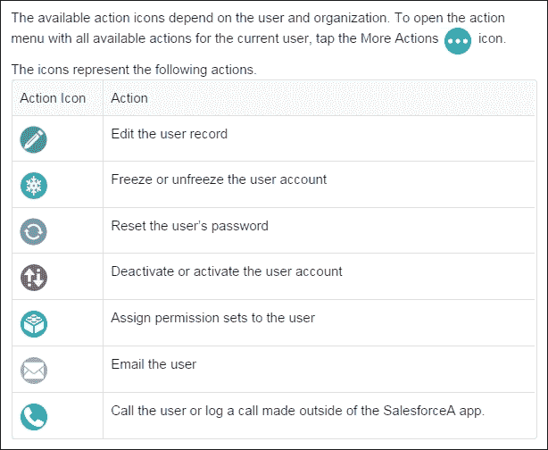

这些图标呈现在移动设备屏幕底部的操作栏中，如下图所示：

除了用户任务外，你还可以查看系统状态，并在多个组织间切换用户帐户。这样，你可以在不退出和重新登录每个用户帐户的情况下，访问不同的组织和社区。通过保持在多个组织中登录，你可以轻松切换到需要访问的特定组织的用户帐户，从而节省时间。

## SalesforceA 支持的设备

在撰写本文时，以下设备支持 Salesforce 用于**SalesforceA**可下载应用程序：

+   Android 手机

+   Apple iPhone

+   Apple iPod Touch

**SalesforceA**可以从 Android 手机的 Google Play 或 Apple 设备的 App Store 下载安装。

## Salesforce Touch

Salesforce Touch 是早期的 Salesforce 移动产品，现已不再提供。在 Spring '14 版本中，Salesforce Touch 已并入 Salesforce1 应用程序，因此 Salesforce Touch 移动浏览器和 Salesforce Touch 可下载应用程序都不再提供，但它们曾提供的功能已在 Salesforce1 中提供，后续章节会涉及这些内容。

## Salesforce Classic

Salesforce Classic 是 Salesforce 提供的移动解决方案中的一个更成熟的产品，提供对 Salesforce CRM 数据、任务和日历的移动访问，并将这些数据与用户的电子邮件和移动设备进行集成。

Salesforce Classic 有两个版本，即完整版和免费版。Salesforce Classic 应用的完整版需要移动许可，这可能是你标准 Salesforce CRM 许可的一部分。还有一个免费的、功能有限的 Salesforce Classic 版本，允许没有移动许可的 Salesforce CRM 用户下载免费的、受限版本的 Salesforce Classic。

### 注意

从 Summer '16 起，Salesforce Classic 移动版的免费版本不再对新组织或以前没有启用它的现有组织提供。对于已经在 Summer '16 之前启用了免费版本的组织，情况没有变化。

### Salesforce Classic 支持的操作系统

在撰写时，Salesforce Classic 可下载应用支持的操作系统如下：

+   安卓

+   苹果 iOS

+   黑莓

用户可以从 App Store、Google Play 和 Blackberry World 安装可下载的应用。不过，最近发布的移动设备可能不被支持，因为每个设备必须通过 Salesforce 官方认证流程。

### Salesforce Classic 数据可用性

大多数标准销售对象和一些服务对象也可用；如果你使用完整版，支持自定义对象和配置。免费版允许用户查看、创建、编辑和删除账户、资产、联系人、潜在客户、商机、事件、任务、案例和解决方案。用户还可以访问他们的仪表板。

在 Salesforce Classic 的免费版本中，只有用户最近在 Salesforce CRM 浏览器应用中访问的记录才会自动同步到他们的移动设备。然而，用户可以搜索并下载任何未自动传送到其移动设备的记录。

### 注意

除了最近访问的记录外，默认配置还会同步过去五天内关闭的活动和接下来 30 天内到期的未完成活动。

对于 Salesforce Classic 的完整版和免费版，从 Salesforce 下载的任何项目都将成为用户移动数据集的永久部分。

### Salesforce Classic 管理

你可以管理组织对 Salesforce Classic 应用的访问权限，根据你是设置完整版还是免费版，有不同的功能来控制访问。

#### Salesforce Classic 完整版本访问

**Mobile User** 复选框在用户记录中分配移动许可给用户，从而启用 Salesforce Classic 的完整版。这一选项已经设置并显示在下图所示：

### 注意

**Salesforce Classic 移动应用将在 2017 年 12 月 1 日停用。**

在撰写本文时，Salesforce 已宣布 Salesforce Classic 移动应用将在 2017 年 12 月 1 日停用，并且从该日期起将无法使用。此日期起，任何当前安装了 Salesforce Classic 移动应用的组织和用户将看到其应用被禁用。此外，2017 年 12 月 1 日，Salesforce Classic 移动应用将从 Google Play 和 App Store 下架。

#### Salesforce Classic 免费版本访问

其他没有分配移动许可证的 Salesforce 用户，可能根据 Salesforce 组织创建的时间和是否启用了 Salesforce Classic Lite，能够访问 Salesforce Classic 免费版本。

### 注意

Salesforce Classic Lite 不适用于新组织，且任何没有启用它的组织，或者在 2016 年夏季发布后禁用它的组织，均无法使用此功能。

启用 Salesforce Classic Lite 的选项可以通过以下路径找到：

**如果您希望用户继续访问 Salesforce Classic 移动应用的免费版本，请不要禁用“启用 Salesforce Classic Lite”复选框，即使是暂时禁用。** 如果您禁用此选项，复选框将立即从 Salesforce Classic 移动设置页面中移除，且没有许可证的用户将无法使用 Salesforce Classic 移动应用。此外，如果您在用户运行该应用时取消此选项，下次设备与 Salesforce 同步时，设备上的 Salesforce 数据将被删除。

如果您错误地禁用了 Salesforce Classic 移动应用的免费版本，请联系 Salesforce 客户支持以帮助恢复无许可证用户的访问权限。

Salesforce Classic Lite 访问是一个组织范围的设置。它为所有活动用户启用访问权限，无法为单个用户启用。

现在点击 **编辑**，然后取消选中下图所示的 **启用 Salesforce Classic Lite** 选项：

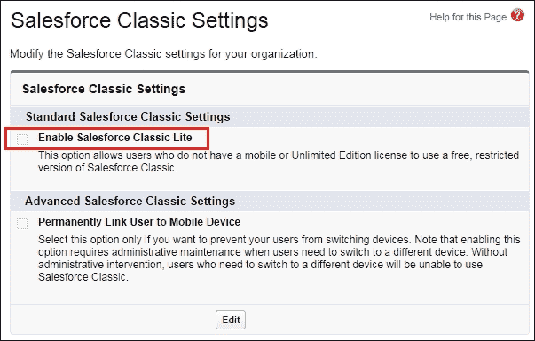

### 注意

如果在用户运行 Salesforce Classic 应用时取消此选项，下次该设备与 Salesforce 同步时，设备上的 Salesforce 数据将被删除。

#### 移动管理控制台

移动管理控制台可用于设置和管理移动配置，并提供以下五个步骤来设置 Salesforce Classic：

1.  **创建移动配置**：此步骤将创建一个移动配置，并允许选择与该配置关联的用户和/或配置文件。

1.  **定义数据集**：在此步骤中，您将指定将同步到移动设备的数据集，并选择这些对象的记录和筛选器。

1.  **设置移动数据集大小**：在此步骤中，指定移动数据集的大小，并可以测试数据大小与用户帐户的匹配情况。为了进行此测试，你应该测试分配给特定用户帐户的移动配置。

1.  **排除字段**：在此可选步骤中，你可以修改任何对象的移动页面布局并排除字段。这通常是必需的，因为不必要的字段会占用内存，导致在移动设备上滚动页面变慢。

1.  **发送群发邮件**：这是移动管理控制台的最后一步，允许你向移动用户发送群发邮件，通知他们移动客户端应用程序的可用性。

要访问设置 Salesforce Classic 的演示和在移动管理控制台中的设置步骤概述，请导航至 **设置 | 移动管理 | Salesforce Classic | 配置**，如以下截图所示：

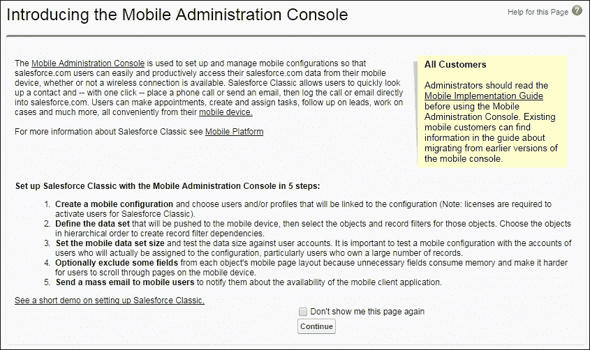

## Salesforce1

Salesforce1 是 Salesforce 的下一代移动 CRM 平台，旨在帮助 Salesforce 的客户、开发人员和 **ISV**（**独立软件供应商**）连接移动应用、浏览器应用和第三方应用服务。Salesforce1 已为移动优先环境开发，展示了 Salesforce 作为平台提供商的重点，旨在通过 API 连接企业系统，并支持营销、销售和客户服务所需的移动应用和服务。

有两种方式可以使用 Salesforce1；一种是通过移动浏览器应用，用户通过支持的移动浏览器登录 Salesforce 访问，另一种是通过从 App Store 或 Google Play 安装的可下载应用。无论哪种方式，Salesforce1 使用户能够从优化过的界面中访问和更新 Salesforce 数据，界面专为在触摸屏移动设备上进行导航和工作而设计。

使用 Salesforce1，记录可以查看、编辑和创建。用户可以管理他们的活动，查看仪表板，并使用 **Chatter**。Salesforce1 还支持许多标准对象和列表视图，所有自定义对象，此外还支持集成其他移动应用程序，以及你组织的 Salesforce 自定义设置，包括 Visualforce 标签和页面。

### Salesforce1 支持的设备

在撰写本文时，Salesforce 支持以下设备用于 Salesforce1 移动浏览器应用：

+   安卓手机

+   苹果 iPad

+   苹果 iPhone

+   黑莓 Z10

+   Windows 8.1 手机（测试版支持）

在撰写本文时，Salesforce 指定以下设备为支持 Salesforce1 可下载应用程序的设备：

+   安卓手机

+   苹果 iPad

+   苹果 iPhone

### Salesforce1 数据可用性

组织版本、用户许可类型、用户配置文件以及任何权限集决定了用户在 Salesforce1 中可用的数据。

通常，用户在访问完整的 Salesforce 浏览器应用时所拥有的对象、记录类型、字段和页面布局的可见性相同。然而，在写作时，并非所有数据都在当前版本的 Salesforce1 应用中可用。

在 Winter'17 版本中，以下关键对象将可以通过 Salesforce1 导航菜单完全访问：**账户**、**活动**、**案件**、**联系人**、**合同**、**潜在客户、机会**、**任务**、**用户**、**仪表板**和**事件**，但只能在 Salesforce1 导航菜单中查看，无法进行其他操作。

### 注意

如果自定义对象具有用户可以访问的标签，则可以完全访问该对象。

对于尚未建立最近对象历史的新增用户，他们最初会在 Salesforce1 导航菜单中的**最近**部分看到一组默认对象。

大多数标准和自定义字段以及大多数受支持对象的相关列表在这些记录上都可用，然而在写作时，公式字段上的链接不受支持，这是 Salesforce1 中富文本区域字段支持的一个例外。

#### Salesforce1 中的富文本区域字段例外

Salesforce1 将富文本区域字段视为长文本区域字段。因此，这些字段不支持 HTML 内容或图片，并且在 1,000 个字符（包括任何 HTML 内容）时被截断。

### 提示

考虑从 Salesforce1 移动页面布局中移除富文本区域字段。

如果一个富文本区域字段包含超过 1,000 个字符的现有文本值，并且在 Salesforce1 中进行编辑，则该字段的内容将被截断。

#### Salesforce1 管理

您可以管理您的组织对 Salesforce1 应用的访问权限；有两个管理区域：用户通过支持的移动浏览器登录 Salesforce 来访问的移动浏览器应用，以及用户从 App Store 或 Google Play 安装的可下载应用。以下部分描述了控制每个这些移动应用的用户访问权限的方法。

#### Salesforce1 移动浏览器应用访问

您可以控制用户在通过移动浏览器登录 Salesforce 时是否可以访问 Salesforce1 移动浏览器应用。要选择或取消选择此功能，请导航到 **设置** | **移动管理** | **Salesforce1** | **设置**，如下图所示：

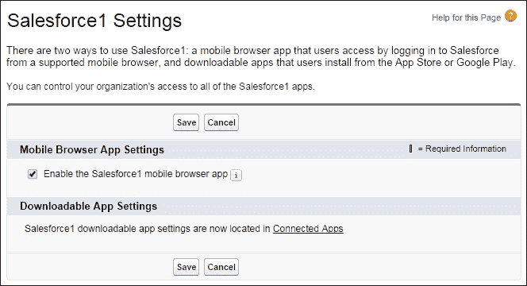

通过勾选**启用 Salesforce1 移动浏览器应用**复选框，所有用户都可以通过移动浏览器访问 Salesforce1。取消选择此选项将关闭移动浏览器应用，这意味着用户将自动通过移动浏览器访问完整的 Salesforce 网站。

### 注意

默认情况下，所有 Salesforce 组织的移动浏览器应用都是启用的。

#### Salesforce1 桌面浏览器访问

勾选**启用 Salesforce1 移动浏览器**应用复选框，如上一节所述，也允许已激活的用户通过桌面浏览器访问 Salesforce1。

用户可以通过将 `/one/one.app` 添加到 Salesforce URL 的末尾，来通过桌面浏览器访问 Salesforce1 应用。例如，对于从 `server na10` 访问的以下 Salesforce URL，您需要在桌面浏览器中输入 [`na10.salesforce.com/one/one.app`](https://na10.salesforce.com/one/one.app)。

#### Salesforce1 可下载应用访问

Salesforce1 应用作为托管包进行分发，并在 Salesforce 中实现为已连接的应用。您可能已经在已安装应用列表中看到 Salesforce1 连接应用，因为它可能已在您的组织中自动安装。

### 注意

随着每次 Salesforce 发布，所包含的应用列表可能会发生变化，但为了简化管理，每个包会在任何组织中的第一个用户首次访问 Salesforce1 时异步安装。然而，若要手动安装或重新安装 Salesforce1 连接应用包，您可以使用 AppExchange。

要查看已连接应用设置中的 Salesforce1 应用详情，请导航至**设置** | **管理应用** | **已连接的应用**。连接到您 Salesforce 组织的应用将按如下截图显示：

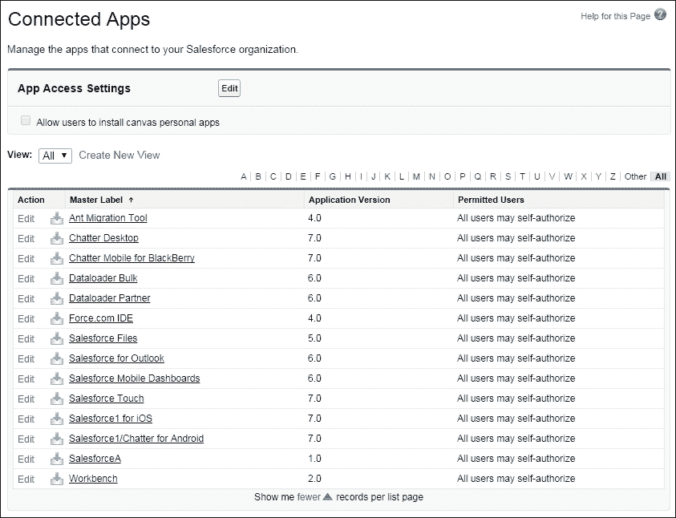

在**已连接的应用**列表中，您可以控制 Salesforce1 移动应用的各种功能，如 IP 限制、会话超时等。

#### Salesforce1 通知

通知允许您组织中的所有用户在 Salesforce1 中接收移动通知，例如，当他们在**Chatter**中被提及时，或当他们收到审批请求时。

要激活移动通知，请导航至**设置** | **移动管理** | **通知** | **设置**，如以下截图所示：

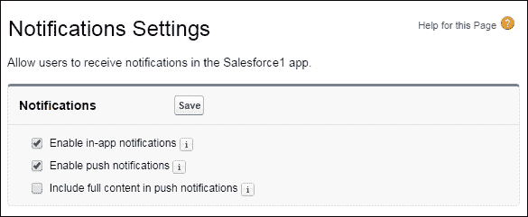

以下通知设置可以按如下方式进行配置：

+   **启用应用内通知**：设置此选项以便在用户使用 Salesforce1 时，保持用户接收到相关的 Salesforce 活动通知。

+   **启用推送通知**：设置此选项以便在用户未使用可下载的 Salesforce1 应用时，保持用户接收到相关的 Salesforce 活动通知。

+   **在推送通知中包含完整内容**：如果您不希望用户在推送通知中接收到完整内容，请保持此复选框未选中。这可以防止用户接收到可能包含评论中的敏感数据等内容。如果您设置了此选项，系统将弹出一个显示条款和条件的对话框，您必须点击**确定**或**取消**。

#### Salesforce1 品牌

此选项允许您自定义 Salesforce1 应用的外观，以使其符合公司可能存在的品牌要求。

### 注意

Salesforce1 品牌标识在可下载应用版本 5.2 或更高版本以及移动浏览器应用中得到支持。

要指定 Salesforce1 品牌标识，请导航至 **设置** | **移动管理** | **Salesforce1** | **品牌标识**，如下图所示：

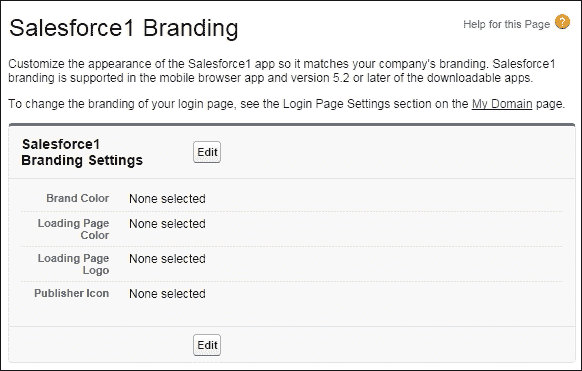

#### Salesforce1 紧凑布局

在 Salesforce1 中，紧凑布局用于显示记录中的关键信息字段，专门为在触摸屏移动设备上查看记录而设计。由于移动设备的空间有限且快速识别记录很重要，因此您分配给紧凑布局的前四个字段将被显示。

### 注意

如果移动用户没有访问分配给紧凑布局的前四个字段的权限，则将使用下一个字段（如果布局中设置了超过四个字段）。

如果尚未创建自定义紧凑布局，则记录将使用只读的预定义系统默认紧凑布局进行显示，创建自定义紧凑布局后，您可以将其设置为该对象的主紧凑布局。

与完整的 Salesforce CRM 网站一样，如果您为对象关联了记录类型，您可以更改主紧凑布局的分配，并为不同的记录类型分配特定的紧凑布局。您还可以从其详细页面克隆紧凑布局。

以下字段类型不能包含在紧凑布局中：文本区域、长文本区域、富文本区域和多选列表。

#### Salesforce1 离线访问

在 Salesforce1 中，离线访问的处理机制由用户最近使用的记录决定。这些最近使用的记录会缓存以便离线访问，并且在撰写时是只读的。

### 注意

缓存数据通过 Salesforce1 可下载应用的持久存储进行加密和安全保护。离线访问功能可在 Salesforce1 可下载应用版本 6.0 及更高版本中使用，并首次在 2014 年夏季发布。

默认情况下，当安装 Salesforce1 可下载应用时，离线访问功能会启用。要管理这些设置，请导航至 **设置** | **移动管理** | **离线**。现在，勾选或取消勾选 **启用 Salesforce1 离线同步**，如下图所示：

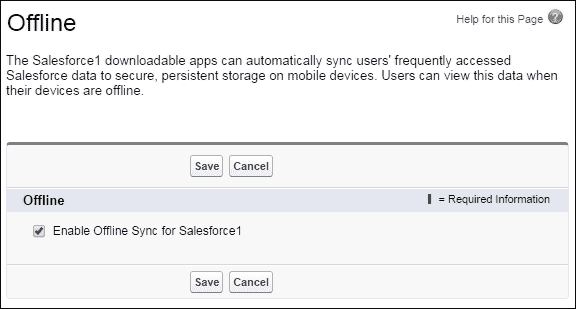

启用离线访问后，基于对象的数据将下载到每个用户的移动设备，并显示在 Salesforce1 导航菜单的 **最近** 部分，以及用户最近查看的记录中。这些数据会加密并存储在移动设备的安全持久缓存中。

#### 使用 Salesforce1 向导进行 Salesforce1 设置

Salesforce1 向导简化了 Salesforce1 移动应用的设置。向导提供了关键设置步骤的可视化展示，如果您是 Salesforce1 新手或需要快速设置核心的 Salesforce1 设置，它非常有用。

Salesforce1 向导将引导您完成以下 Salesforce1 配置步骤：

+   选择哪些项目出现在导航菜单中

+   配置全局操作

+   创建联系人自定义紧凑布局

+   可选地邀请用户开始使用 Salesforce1 应用

要访问 Salesforce1 向导，请导航到 **设置** | **Salesforce1 快速入门**。然后点击 **启动快速入门向导**，在 Salesforce1 设置页面中，如下图所示：

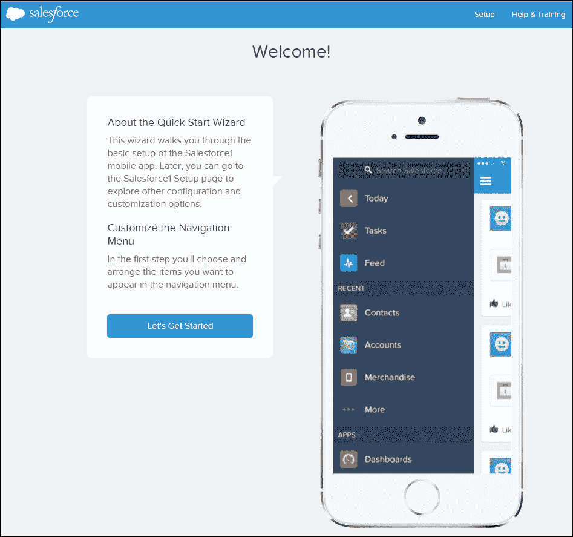

点击 **开始使用** 部分的链接后，您将看到 **Salesforce1 设置** 的视觉导览，如下图所示：

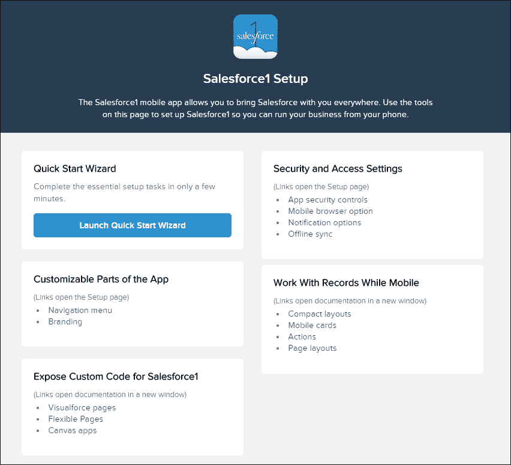

**快速入门向导**

**快速入门向导**将引导您完成设置 Salesforce1 的最低配置步骤。通过点击 **启动快速入门向导** 按钮，启动完成 Salesforce1 基本设置任务的过程，并提供一个五步向导。五个步骤如下：

1.  **自定义导航菜单**：此步骤会为您组织中的所有用户设置导航菜单。要重新排序项目，请上下拖动它们。要移除项目，请将它们拖动到 **可用项目** 列表中，如下图所示：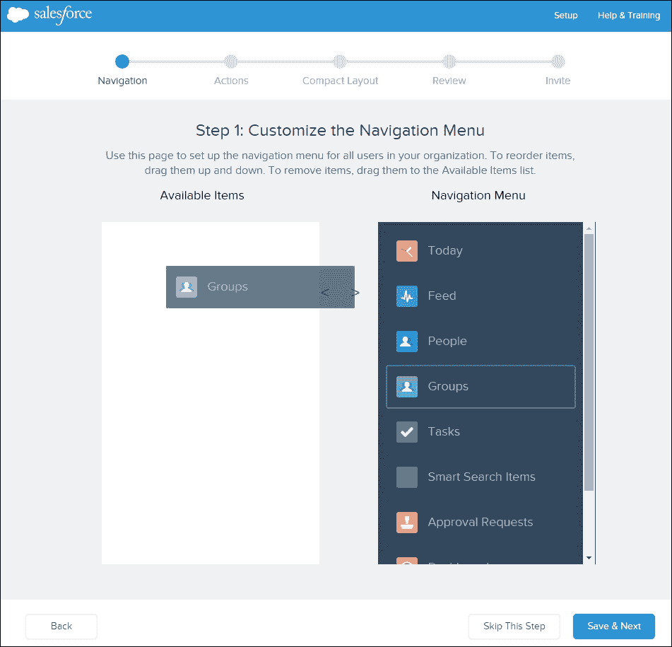

1.  **安排全局操作**：全局操作为用户提供快速访问 Salesforce 功能的途径，在此步骤中，您将选择并安排 Salesforce1 全局操作，如下图所示：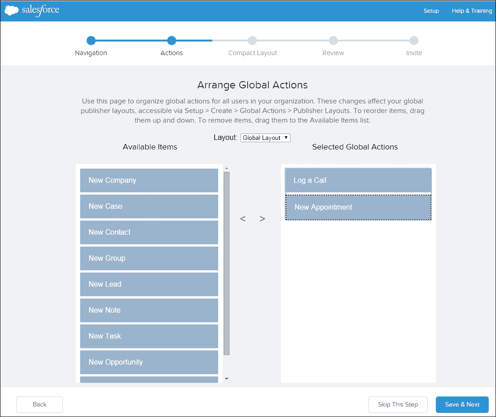

    操作可能会因您使用的 Salesforce1 版本而有所不同。

1.  **为联系人创建自定义紧凑布局**：紧凑布局用于在记录详细信息的顶部突出区域显示记录的关键信息。在此步骤中，您可以为联系人创建自定义紧凑布局，例如联系人姓名、电子邮件和电话号码，如下图所示：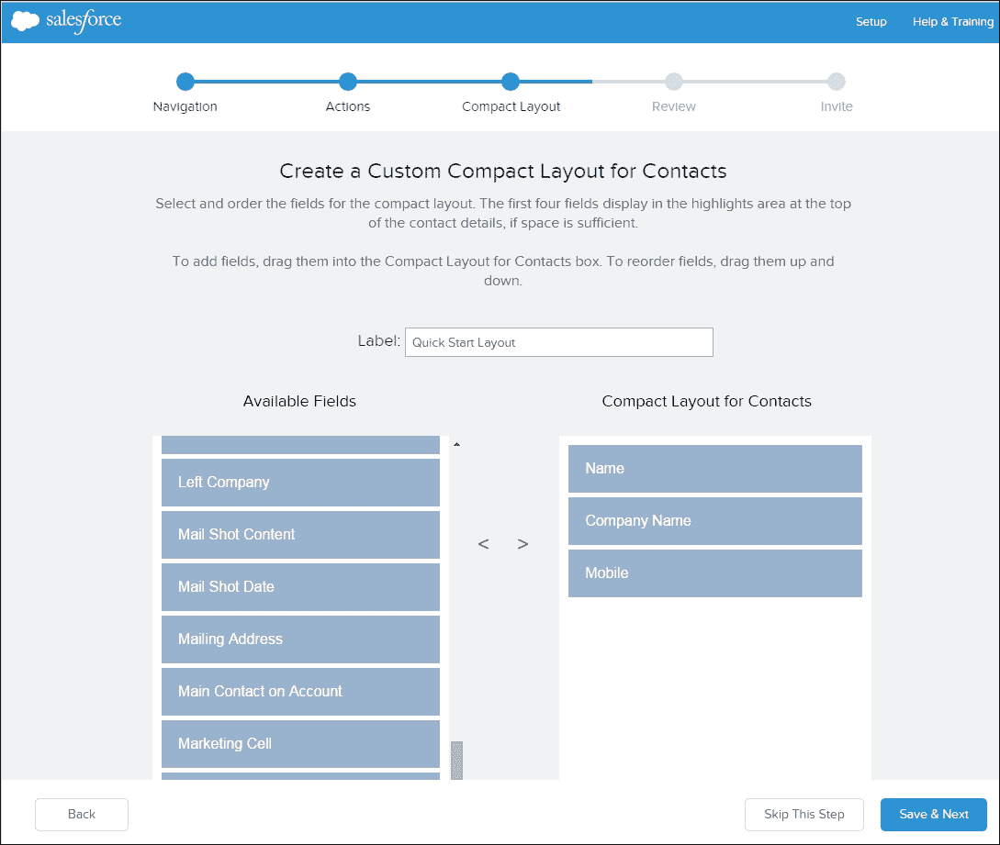

    然而，在完成快速入门向导后，您可以根据需要为其他对象创建紧凑布局。

1.  **审查**：在此步骤中，您有机会预览更改，以验证更改的结果，如下图所示：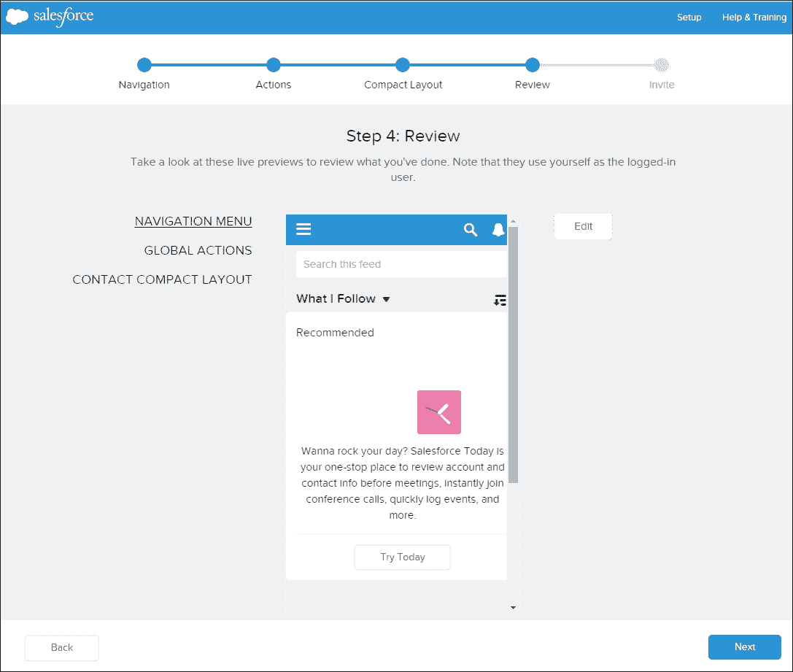

    **审查** 步骤屏幕提供实时预览，使用您当前的登录用户访问权限。

1.  **发送邀请**：这是快速入门向导的最后一步，它将为你提供 Salesforce1 的基本设置，并允许你获取对已实施功能的反馈。在这一步中，你可以邀请用户开始使用 Salesforce1 应用，如下图所示：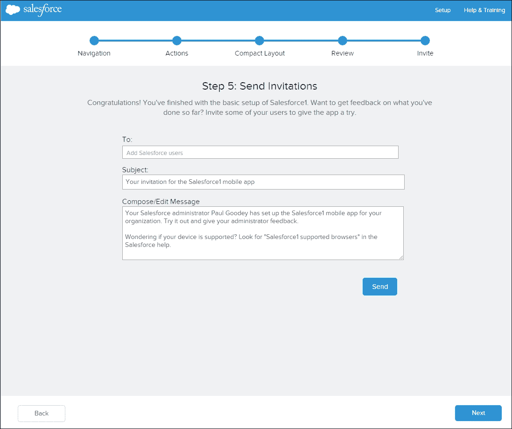

    这一步可以跳过，你始终可以稍后从 Salesforce1 设置页面发送邀请，并进行其他定制应用程序的选项，比如加入自己的品牌。

#### Salesforce1 与完整 Salesforce CRM 浏览器应用的差异

在 2017 年冬季发布版本中，并且在撰写本文时，Salesforce1 并不具备完整 Salesforce CRM 网站的所有功能，某些区域包括一些不提供或与完整 Salesforce 网站不同的功能。

举例来说，在完整的 Salesforce CRM 网站中，紧凑布局决定了哪些字段会出现在**Chatter 动态**项中，该项在用户通过发布者操作创建记录后出现。然而，在 Salesforce1 中，紧凑布局用于显示记录上的关键字段。

有关当前 Salesforce CRM 网站与 Salesforce1 之间差异的详细信息，请参阅 Salesforce 帮助菜单中的**Salesforce1 限制与差异**部分。

# 移动仪表板

**移动仪表板**解决方案是专为 Apple iPad 设备开发的应用程序。允许用户安装该应用的设置已自动为所有 Salesforce 组织启用。这允许用户在没有任何管理员配置或支持的情况下，直接在其 Apple iPad 上访问并安装该应用。

### 注意

自 2015 年夏季以来，iPad 版移动仪表板应用不再受到支持。在撰写本文时，尽管该应用仍可继续使用，但 Salesforce 不再提供该应用的支持或更新。

Salesforce 推荐将用户的移动仪表板体验和需求迁移到 Salesforce1 应用程序中。

要启用或禁用**iPad 版移动仪表板应用**，请导航到**设置 | 移动** **管理** | **移动仪表板**，如下图所示：

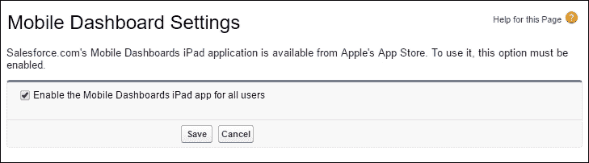

现在选择或取消选择**为所有用户启用 iPad 移动仪表板应用**，然后点击**保存**。

# Salesforce 采纳经理

**Salesforce 采纳经理**是由 Salesforce 提供的 Salesforce1 培训和参与工具，它会向移动用户发送智能电子邮件通知。该工具的目标是推动新 Salesforce1 用户采纳 Salesforce1 移动应用。它还与那些一段时间没有使用 Salesforce1 的现有用户互动，鼓励他们重新使用该应用。

### 注意

**Salesforce 采纳经理**在撰写本文时仅在以下国家/地区提供：美国、英国和澳大利亚。

要启用**Salesforce Adoption Manager**，请导航至**设置 | 用户管理 | Adoption Manager**并选择**启用 Salesforce Adoption Manager**，如以下截图所示：

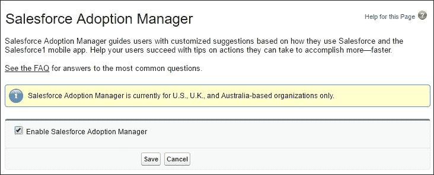

一旦启用该功能，系统会向用户发送个性化的邀请邮件，邀请他们下载 Salesforce1 移动应用。一旦用户下载了 Salesforce1，他们将收到一封包含自定义链接的邮件，用于安装 Salesforce1 可下载应用。随后的邮件将根据用户实际使用 Salesforce1 移动应用的情况发送。这些邮件经过优化，以便在移动设备上查看，并包括在移动中查看记录或其他 CRM 详细信息的技巧，以及如何进行有用操作的最佳实践，如记录通话、创建任务等。

# 测试您的知识问题

以下部分是与本章内容相关的问答。

## 问题

我们提出两个问题来验证您对 Salesforce1 应用解决方案的理解。

### 问题 1 - Salesforce1 应用访问。

Salesforce1 可以通过哪些应用访问？（选择所有适用项）。

**a**) 使用移动浏览器应用

**b**) 使用桌面浏览器应用

**c**) 使用可下载应用

**d**) 使用 Salesforce CRM 应用

### 问题 2 - Salesforce1 可下载应用。

Salesforce1 可下载应用在 Salesforce 中设置为连接的应用。什么时候可以为 Salesforce1 可下载应用创建或修改连接的应用？（选择所有适用项）。

**a**) 当用户卸载 Salesforce1 可下载应用时。

**b**) 当用户在移动设备上安装 Salesforce1 可下载应用，并通过该移动应用登录到 Salesforce 组织时。

**c**) 当管理员手动从 AppExchange 安装 Salesforce1 连接的应用到 Salesforce 组织时。

**d**) 当 Salesforce 应用新版本到 Salesforce 组织时。

## 答案

以下是关于 Salesforce AppExchange 市场的两个问题的答案。

### 答案 1 - Salesforce1 应用访问。

答案是**a**）使用移动浏览器应用，**b**）使用桌面浏览器应用，以及**c**）使用可下载应用。

使用 Salesforce1 有三种方式；用户可以通过支持的移动浏览器登录 Salesforce 来访问移动浏览器应用，用户还可以从 App Store 或 Google Play 安装可下载应用，或者用户可以通过在 Salesforce URL 末尾附加`/one/one.app`来在桌面浏览器中访问 Salesforce1 应用。

### 答案 2 - Salesforce1 可下载应用。

答案是**b**）当用户在移动设备上安装 Salesforce1 可下载应用，并通过移动应用登录到 Salesforce 组织时，**c**）当管理员手动从 AppExchange 安装 Salesforce1 连接的应用到 Salesforce 组织时，和**d**）当 Salesforce 应用新版本到 Salesforce 组织时。

# 概述

本章中，我们探讨了移动设备如何成为保持个人和职业生活中连接的新常态。

Salesforce 已认识到，个人越来越多的时间是在连接到云端并使用基于云的商业应用程序，而这些商业应用程序越来越多地在移动环境中使用，而非在办公室的桌面上使用。

为了帮助客户在这个移动优先的世界中成为成功的企业，Salesforce 推出了各种移动解决方案，帮助用户无论身处何地、在做什么，都能高效完成工作。

本章中，我们介绍了**SalesforceA**的功能，这是一个移动管理员应用，可以帮助您在移动过程中管理用户并监控 Salesforce 的状态。

我们描述了 Salesforce1 的功能和优势，Salesforce1 可作为可下载的应用程序和浏览器应用程序提供。在这里，我们详细介绍了该解决方案的设置和管理，以及在撰写本文时 Salesforce1 的当前能力。

我们还回顾了历史上的 Salesforce 移动解决方案，例如 Salesforce Touch，它已被 Salesforce1 和 Salesforce Classic 替代。

最后，我们提出了一些问题，以帮助澄清 Salesforce1 移动解决方案的一些关键特性。

在下一章中，我们将讨论 Salesforce 提供的 Salesforce 认证管理员考试，评估考生在销售云、服务云和协作云中的系统管理和配置知识，并概述帮助通过认证管理员考试的资源和策略。
