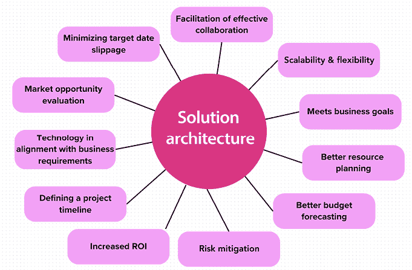
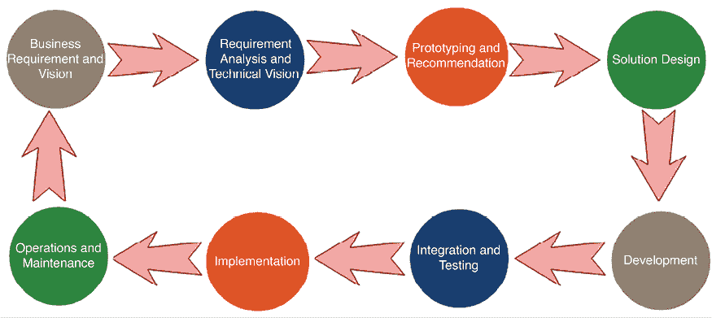
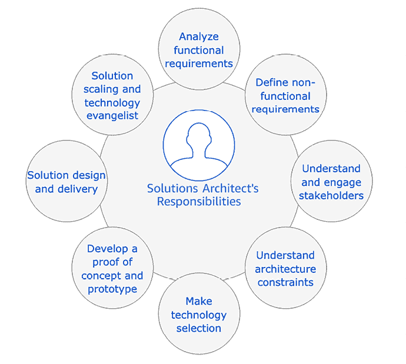
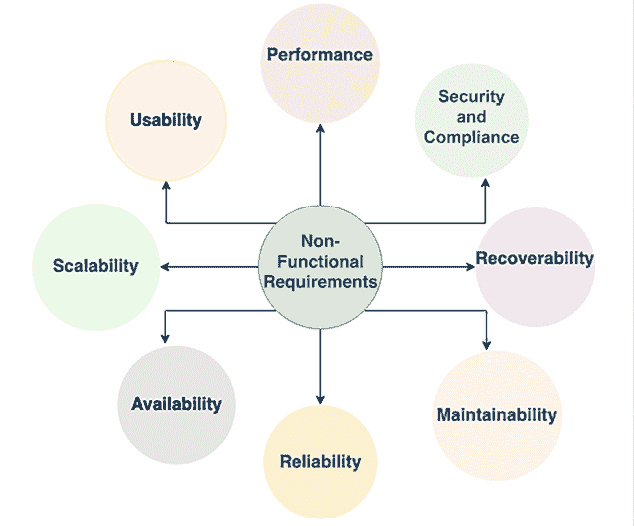
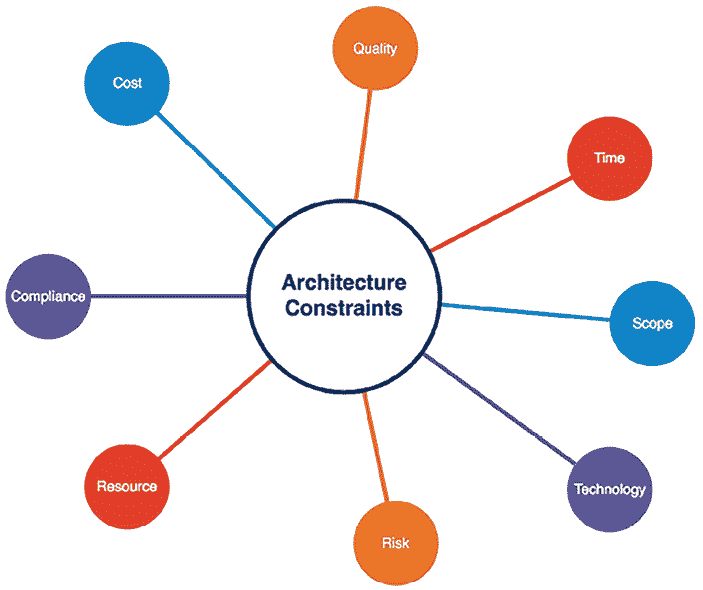

# 1

# 组织中的解决方案架构师

本书是你成为解决方案架构师的终极指南，旨在帮助你掌握解决方案架构的技能。在本章中，你将了解解决方案架构的含义及其作为组织中解决方案开发基础的重要性。解决方案架构涉及设计一个坚实的框架，涵盖 IT 基础设施、应用安全性、可靠性和运营等重要领域。

解决方案架构师与利益相关者紧密合作，分析需求并考虑诸如成本、预算、时间表和法规等约束条件，以创建一个全面的解决方案。

解决方案架构师还积极参与上线后的工作，确保可扩展性、可用性和可维护性。此外，他们与销售团队合作，推广产品及其技术优势。

在本章中，你将学习以下主题：

+   什么是解决方案架构？

+   解决方案架构师的角色

+   理解解决方案架构师的职责

+   敏捷组织中的解决方案架构师

+   解决方案架构师角色中的常见挑战

+   解决方案架构师的职业发展路径和技能提升

在本章结束时，你将深入了解解决方案架构师的角色和他们所面临的挑战。你将发现解决方案架构师如何处理约束条件，并为组织的技术愿景和整体成功做出贡献。

# 什么是解决方案架构？

解决方案架构的概念可能因不同的专业人士和组织的角度而有所不同。然而，本质上，解决方案架构涉及定义和构思商业解决方案的各个方面，同时考虑战略性和事务性的因素。

从战略角度来看，解决方案架构师负责为软件应用程序制定长期愿景。这个愿景确保解决方案在未来变革中保持相关性和适应性，并能够扩展以满足不断变化的用户需求和工作负载。

另一方面，从战术角度来看，解决方案架构关注业务的即时需求。它涉及设计一个能够处理当前工作负载并有效应对组织日常挑战的应用程序。

然而，解决方案架构不仅仅局限于软件。它涵盖整个系统，包括系统基础设施、网络、安全性、合规要求、系统操作、成本考虑和可靠性等方面。

通过考虑这些不同的因素，解决方案架构师创建了一个全面的蓝图，指导解决方案的开发和实施。这个蓝图不仅确保解决方案满足业务当前的需求，还为其未来的增长和成功奠定基础。

## 解决方案架构的好处

解决方案架构至关重要，原因有多方面。首先，它为企业软件解决方案的开发提供了坚实的基础。随着项目规模的扩大和团队地理分布的增加，拥有明确定义的解决方案架构可确保长期的可持续性和高效的协作。

解决方案架构解决了多样化的解决方案需求，同时保持与整体业务背景的一致性。它包含了技术平台、应用组件、数据需求、资源需求以及关键的**非功能需求**（**NFRs**）等要素。这些非功能需求包括可扩展性、可靠性、性能、可用性、安全性和可维护性。通过考虑这些方面，解决方案架构确保所开发的解决方案符合必要的标准和期望。

*图 1.1* 展示了当在业务中采用解决方案架构师角色时，组织可能获得的潜在益处。

图 1.1：解决方案架构的有益属性

上述图表突出了良好解决方案架构的以下特征：

+   **技术与业务需求对齐**：解决方案架构师评估组织或项目应采用哪些技术，以满足业务需求并实现长期可持续性、可维护性以及团队技能匹配。

+   **市场机会** **评估**：解决方案架构涉及分析和持续评估市场中最新趋势的过程，确保所开发的解决方案满足客户需求以及业务需求。它还帮助构建和推广新产品。

+   **最小化目标日期滑移**：解决方案架构师与所有利益相关者持续合作，包括业务团队、客户和开发团队。他们确保整体解决方案与业务目标和上线时间表保持一致，从而确保最小化目标日期滑移的可能性。

+   **促进有效协作**：解决方案架构作为项目中各利益相关者的共同参考点和沟通工具，促进了业务团队、开发人员、设计师和其他利益相关者之间的有效协作。解决方案架构的清晰文档和可视化有助于团队成员之间的更好理解、对齐和决策，确保每个人在同一页面上，并朝着共同目标努力。

+   **可扩展性和灵活性**：一个设计良好的解决方案架构将可扩展性和灵活性视为关键因素。它使解决方案能够随着业务的演变和用户工作负载的增加，平滑地适应和增长。通过预测未来增长并纳入可扩展性措施，解决方案架构确保系统能够在不出现重大中断或高昂返工的情况下应对日益增长的需求。

+   **实现业务目标**：解决方案架构设计的主要责任是满足利益相关者的需求，并将其调整为他们的要求。解决方案架构通过分析市场趋势和实施最佳实践，将业务目标转化为技术愿景。解决方案架构需要足够灵活，以应对新的、具有挑战性的、苛刻的和快速变化的业务需求。

+   **更好的资源规划**：通过明确的解决方案架构，组织可以精确确定所需的资源类型和数量。这有助于人力资源的战略规划，确保适当的财务资源和时间，确保项目人员配备充足，资源得到最佳利用，从而使项目执行更顺利，并遵守时间表。

+   **更好的预算预测**：投资于准确的估算对于有效的预算预测至关重要。一个明确定义的解决方案架构为项目完成所需的资源提供了清晰的洞察。详细了解项目的范围和需求使组织能够更准确地预测成本，并减少预算超支的风险。

+   **风险缓解**：一个好的解决方案架构包括风险评估和缓解策略。通过及早识别潜在风险，解决方案架构师可以采取措施来减轻这些风险。通过这种积极的方式，有助于最小化风险对项目时间表、预算和整体成功的影响。风险缓解策略可以包括备份计划、冗余措施、安全性考虑和灾难恢复计划。

+   **提高投资回报率**：解决方案架构决定了投资回报率（ROI），并有助于衡量项目的成功。它促使企业思考如何通过应用自动化来降低成本和消除过程浪费，从而提高整体投资回报率。

+   **定义项目时间表**：定义准确的项目时间表对于解决方案实施至关重要。解决方案架构师确定设计阶段所需的资源和努力，这应有助于定义解决方案开发的时间安排。

现在，您已经对解决方案架构及其好处有了一个高层次的概述，接下来让我们了解解决方案架构师的角色以及它如何帮助构建一个良好的解决方案架构。

# 解决方案架构师的角色

如果你想了解一个解决方案应该如何组织和交付，那么解决方案架构师在这个过程中扮演着至关重要的角色。解决方案架构师设计整体系统以及不同系统如何在各个小组之间进行集成。解决方案架构师通过与业务利益相关者合作，定义预期结果，并向技术团队清晰地传达交付目标。

*图 1.2* 包含一个流程图，展示了解决方案交付生命周期。解决方案架构师参与了解决方案设计和交付的所有阶段。

图 1.2：解决方案交付生命周期

如图所示，解决方案交付生命周期包括以下几个阶段，且解决方案架构师在其中的参与方式：

+   **业务需求与愿景**：解决方案架构师与业务利益相关者合作，理解他们的愿景。

+   **需求分析与技术愿景**：分析需求，定义技术愿景，以执行业务战略。

+   **原型设计与推荐**：解决方案架构师通过开发概念验证（POC）并展示原型，做出技术选择。

+   **解决方案设计**：解决方案架构师根据组织的标准并与其他相关小组合作，开发解决方案设计。

+   **开发**：他们与开发团队一起开发解决方案，并充当业务团队与技术团队之间的桥梁。

+   **集成与测试**：他们确保最终解决方案按照预期工作，并满足所有功能需求和非功能需求（NFR）。

+   **实施**：他们与开发和部署团队紧密合作，确保顺利实施，并在遇到问题时给予指导。

+   **运营与维护**：他们确保日志记录和监控到位，并根据需要指导团队进行扩展和灾难恢复。

整个生命周期是一个迭代过程。一旦应用程序投入生产并开始被客户使用，可能会通过客户反馈发现更多需求，从而推动产品愿景的未来增强。

解决方案架构师在解决方案设计中具有主要的责任，他们会执行以下任务：

+   记录解决方案标准

+   定义高层设计

+   定义跨系统集成

+   定义不同的解决方案阶段

+   定义实施方法

+   定义监控和警报方法

+   记录设计选择的优缺点

+   记录审计和合规要求

解决方案架构师不仅负责方案设计；他们还协助项目经理进行资源和成本估算，定义项目的时间表和里程碑，项目的发布以及支持计划。解决方案架构师贯穿解决方案生命周期的不同阶段，从设计到交付和上线。解决方案架构师通过提供专业知识和广泛的理解，帮助开发团队克服障碍和难题。

根据项目的规模和复杂性，团队内可能需要多名解决方案架构师。一般来说，本书将通用地探讨解决方案架构师的角色，但你经常会看到不同职称的解决方案架构师，这取决于组织的结构；例如，企业解决方案架构师、软件架构师或技术架构师。在这一部分，你将找到与各种职称相关的一些独特属性。然而，解决方案架构师的职责可能会有所重叠，具体取决于组织的结构。

解决方案架构师可以分为通才型和专家型。通才解决方案架构师在多个技术领域拥有广泛的知识。他们全面理解解决方案架构的各个方面，能够提供整体性的指导。另一方面，**专家型解决方案架构师**（**SSAs**）在大数据、安全、网络或行业领域等特定领域具有深厚的专业知识。他们拥有专门的知识，能够在各自领域提供深入的指导。

在许多情况下，一名通才解决方案架构师与 SSAs 合作，以对齐项目的需求和复杂性。这种合作可以充分利用专家的专业知识，同时确保整体解决方案架构保持一致和良好集成。

组织中同时存在通才解决方案架构师和 SSAs，能够实现解决方案架构的平衡和全面性。这确保了架构决策和建议与项目需求相符，涵盖了知识的广度和深度。

通过结合不同类型解决方案架构师的技能和专业知识，组织可以有效应对项目的独特挑战和需求，从而成功设计和实施稳健的解决方案。

## 通才解决方案架构师角色

通才解决方案架构师在解决方案架构中扮演着至关重要的角色，他们对多个技术领域有广泛的理解。他们拥有全面的知识库，能够在解决方案设计和实施的各个方面提供指导并做出明智的决策。以下是不同类型的通才解决方案架构师角色。

### 企业解决方案架构师

你是否曾经想过信息技术行业中的产品是如何推出的？这正是企业解决方案角色发挥作用的地方——他们定义最佳实践、文化和合适的技术。企业架构师与利益相关者、领域专家和管理层密切合作，识别信息技术的组织战略，并确保他们的知识与公司业务规则对齐。

企业架构师负责整个组织的解决方案设计；他们与利益相关者和领导层共同制定长期规划和解决方案。最重要的一方面是最终确定公司应该使用哪些技术，并确保公司在使用这些技术时保持一致性和完整性。

企业架构师角色的另一个重要方面是定义业务架构。在一些组织中，可能会看到*业务架构师*这一职位名称。业务架构填补了组织战略与成功执行之间的空白。它帮助将战略蓝图转化为可执行的行动项，并将这些行动项带到战术层面进行实施。

解决方案架构师和企业解决方案架构师之间的主要区别在于他们的工作范围和关注点。解决方案架构师专注于特定的项目或解决方案，设计并指导应用程序或系统的实施，以符合业务和技术要求。他们的角色通常是以项目为中心，专注于特定的技术或职能领域。相反，企业解决方案架构师则处于更战略的层面，负责监督组织的整体 IT 基础设施和战略。他们确保 IT 战略与业务目标的一致性，跨部门整合各种解决方案架构。这个角色涵盖了更广泛的技术和业务流程，专注于组织的整体技术格局和战略方向。

总体而言，企业架构师在定义整个组织的标准以成功实现业务愿景时，更加贴合公司的愿景和责任。

### 应用架构师

应用架构师，有时也称为软件架构师，在软件设计和开发中扮演着至关重要的角色。他们与组织合作，定义软件开发项目的技术细节。应用架构师专注于确保软件符合行业最佳实践并遵循组织的标准。他们与不同团队合作，了解如何与其他软件模块进行集成。

例如，一个医疗机构可能会确保新的病人管理系统能够与现有的电子健康记录系统无缝集成，同时遵守医疗规定和内部协议；或者在金融机构中，他们可能会监督一个新的银行应用程序的开发，确保它能安全地与现有的交易处理系统集成，并符合金融行业标准。在这两种情况下，应用架构师确保软件不仅满足功能需求，还符合关键的行业和组织标准。

应用架构师的关键职责之一是管理软件开发的技术方面。他们负责 API 设计，确保其设计良好并且性能最优。同时，他们还会考虑可扩展性要求，确保软件能够应对不断增加的工作负载。此外，应用架构师还确保与其他软件组件的无缝集成，确保它们能够轻松互相互动。

应用架构师是工程团队技术咨询的联络点。他们解决问题并提供指导，确保系统的平稳运行。

虽然较小的软件开发项目可能没有专门的应用架构师，但高级工程师通常会承担这一责任，并参与软件架构设计。

除了技术专长外，应用架构师还扮演着导师的角色。他们支持并指导软件工程团队，解决跨团队集成或因业务需求变化而产生的障碍。他们与团队的密切合作确保了软件开发过程的协调与成功。

总的来说，应用架构师通过提供技术领导、确保遵循最佳实践并在整个开发生命周期中支持工程团队，为软件项目的成功做出了重要贡献。

### 云架构师

云架构师这一角色在过去十年才出现，但随着企业对云技术的采用日益增加，这一角色的需求也在不断增长。云架构师的出现是为应对企业对云技术采纳的增加。随着组织向云计算转型，规划、设计和管理云环境的专业人才需求激增。

云架构师负责制定和实施公司的云计算战略。他们对各种云服务有深入的了解，能够设计出充分发挥云原生能力的解决方案。

云计算的使用现在已经非常普遍，许多组织已将其转移到公共云平台上。随着像**亚马逊云服务**（**AWS**）、微软 Azure 和**谷歌云平台**（**GCP**）等公共云平台的流行，云架构师在引导组织进行云迁移的过程中发挥着关键作用。你将会在*第三章*中学习更多关于云架构的内容，*云迁移与混合云架构设计*。

云架构师的关键任务之一是协助组织将现有的工作负载迁移到云端。他们制定全面的云迁移策略，并设计将本地应用程序与云资源无缝集成的混合云架构。这使得组织能够利用云所提供的可扩展性、成本效益和管理便捷性。

对于那些刚刚开始使用云的初创公司和企业，云架构师可以设计优化云环境的云原生架构。这些架构利用按需付费模式来优化成本，并充分利用云平台提供的自动化功能。

在当今的商业环境中，云计算已经成为企业战略的一个重要组成部分。为了在这个现代时代蓬勃发展，并跟上创新和自动化的快速步伐，拥有一位熟练的云架构师至关重要。他们在帮助公司通过利用云计算的力量，释放其在可扩展性、效率和业务增长方面的潜力方面发挥着至关重要的作用。

### 架构师布道者

架构师布道者，也被称为技术布道者，已经成为市场营销中的一个改变游戏规则的角色，特别是在复杂解决方案平台的背景下。在竞争激烈的环境中，人们寻求专家的指导，这些专家拥有深厚的知识，能够解答他们的疑问，从而帮助他们做出明智的决策。这正是架构师布道者凭借其在特定领域的专业知识发挥作用的地方。

架构师布道者在设计满足客户需求并解决其痛点的架构方面发挥着至关重要的作用。通过成为客户和合作伙伴的可信顾问，他们深刻理解架构概念、问题和市场趋势。这种专业知识有助于确保平台的采纳，并通过增加市场份额促进收入增长。

为了推动目标受众对平台的采用，架构推广者创建公共内容，如博客、白皮书和文章。他们还积极参与公共平台，包括行业峰会、技术演讲和会议。进行技术研讨会和发布教程也是他们的工作内容之一，使他们能够传播意识并激发对其产品的兴趣。架构推广者需要具备优秀的书面和口头沟通能力，解决方案架构师也常常将技术传播作为附加职责。

总体而言，架构推广者是通过其专业知识和沟通技巧，利用影响力将产品和解决方案推广到更广泛的受众。他们与客户、合作伙伴和社区互动，最终推动产品的采用、增长和市场成功。

## 专业解决方案架构师角色

除了通用解决方案架构师外，解决方案架构领域内还有一些专业化的角色，具体取决于组织的结构和项目的复杂性。这些 SSAs 专注于特定领域的专业知识，以应对独特的挑战和需求。

SSAs 的具体角色和职称在不同组织中可能会有所不同。根据项目和组织的复杂性，解决方案架构师可能会承担多个角色，或者不同的解决方案架构师可能会有重叠的职责。关键在于确保组织在每个专业领域具备必要的专业知识和技能，以有效应对项目的独特挑战和需求。让我们来了解一些常见的专业架构师角色。

### 基础设施架构师

基础设施架构师是一个专注于企业 IT 基础设施设计、安全性和数据中心运营的专业架构师角色。他们与解决方案架构师密切合作，确保组织的基础设施战略与整体业务需求保持一致，并通过分析系统需求和现有环境来分配适当的资源容量，以满足这一需求。他们帮助减少资本支出，将资金用于运营支出，以提高组织效率和投资回报率。

基础设施架构师在定义和规划组织的 IT 资源方面发挥着关键作用，涵盖从存储服务器到个人工作空间的各个方面。他们制定详细的计划来采购和搭建 IT 基础设施，确立软件标准，并协调组织内的系统更新和补丁管理。安全性是他们职责的关键方面，因为他们确保所有环境都能防范潜在的病毒攻击。灾难恢复规划和系统备份也是他们的重点，确保业务持续运营。

例如，在大多数电子商务企业中，规划需求高峰期的基础设施是一个挑战，像美国的感恩节、加拿大和英国的圣诞节后购物日（Boxing Day）或印度的排灯节（Diwali），这时候大多数消费者开始购物，基础设施架构师需要为此做好准备。他们需要为高峰期准备足够的服务器和存储容量，通常高峰期的工作负载可能是正常时期的十倍，从而增加了 IT 基础设施的成本。而且在大部分时间里，这些系统在高峰期之外大多是闲置的。

他们需要规划成本优化和更好的用户体验，这也是他们可能使用云来满足额外容量需求并按需扩展以降低成本的原因之一。他们需要确保系统在支持新功能增长的同时保持活跃。

在云计算的背景下，**云基础设施架构师**是基础设施架构领域中的一个专业角色，专注于设计和管理基于云的 IT 基础设施。他们深入了解云平台以及主要云服务提供商如 AWS、Microsoft Azure 和 GCP 提供的服务。

云基础设施架构师与组织紧密合作，确定符合其特定需求的最佳云架构，考虑可扩展性、成本效益、安全性和性能等因素。他们设计并实施基于云的解决方案，确保与现有系统和应用程序的无缝集成。

云基础设施架构师负责规划资源分配、管理云安全措施，并优化云环境以实现最佳的性能和成本效益。他们在云技术方面的专业知识使得组织能够利用云计算的优势，同时确保一个可靠且可扩展的基础设施。

总体而言，基础设施架构师需要深入了解数据中心的运营以及相关的组件，如供暖、冷却、安全性、架设和堆叠、服务器、存储、备份、软件安装和修补、负载均衡器和虚拟化等。

### 网络架构师

你是否曾经想过，拥有多个办公室或商店的大型企业是如何实现无缝连接与沟通的？这正是网络架构师的工作所在，他们负责策划组织的网络通信策略，并使 IT 基础设施发挥作用。

网络架构师负责设计计算机网络、**局域网**（**LAN**）、**广域网**（**WAN**）、互联网、内联网和其他通信系统。他们管理组织的信息和网络系统，确保用户能够享受低网络延迟和高网络性能，以提高工作效率。他们通过使用**虚拟专用网络**（**VPN**）连接，建立用户工作空间与内部网络之间的安全连接。

网络架构师与基础设施架构师密切合作；有时你会看到这两个角色有所重叠，以确保所有 IT 基础设施都连接在一起。他们与安全团队合作，设计组织的防火墙，以防止不道德的攻击。他们负责通过数据包监控、端口扫描，以及实施**入侵检测系统**（**IDS**）和**入侵防御系统**（**IPS**）来监控和保护网络。你将在*第七章*，*安全考虑*中了解更多关于 IDS/IPS 系统的内容。

网络架构师必须与时俱进，了解最新的网络策略、操作和使用 VPN 的安全连接技术。他们配置负载均衡器，微调**域名系统**（**DNS**）路由，并精通 IT 基础设施连接的艺术。这就像构建一个复杂的连接网络，确保数据在组织内顺畅高效地流动。

### 数据架构师

在数据爆炸的时代，数据架构师的角色变得越来越重要。想一想——每一个解决方案设计都围绕数据展开，无论是客户信息、产品细节，还是从复杂数据集中提取的洞察。随着数据的爆炸性增长，从千兆字节到太字节甚至更大，数据管理和架构的有效性需求变得至关重要。数据架构师可能有不同的职称，包括分析架构师或大数据架构师。（我没有包括数据库架构师这个职称，因为他们的工作范围仅限于关系型数据库中像 Oracle 和亚马逊**关系型数据库系统**（**RDS**）这样的结构化数据。）

传统上，数据存储在结构化的关系型数据库中。然而，随着来自社交媒体、**物联网**（**IoT**）和应用程序日志等来源的非结构化数据的崛起，数据环境发生了变化。于是，数据架构师应运而生，他们是组织数据战略背后的远见者。数据架构师的角色是定义规则、政策、标准和模型，管理组织数据库中收集和使用的数据类型。他们设计、创建并管理数据架构，确保一致的性能和质量。

数据架构师与各方利益相关者合作，包括业务高管、分析师、数据工程师、数据科学家和开发团队。他们的客户从使用**商业智能**（**BI**）工具进行数据可视化的高管，到利用**机器学习**（**ML**）技术的数据科学家。数据架构师的目标是满足组织的数据需求，并为用户提供有价值的洞察。

为了满足这些需求，数据架构师承担了广泛的责任。他们选择合适的数据库技术，确定结构化和非结构化数据的存储选项，管理流数据和批处理数据的处理，设计数据湖作为集中式数据存储。他们还确保数据安全、合规性和加密，以保护敏感信息。数据仓库、数据集市设计和数据转换是他们专长的其他领域。

随着 ML 在企业中日益重要，专职的 ML 架构师角色也在涌现。这些专家与数据架构师密切合作，设计和实施 ML 算法和模型，将数据驱动的洞察推向更高层次。

在不断变化的技术环境中，数据架构师必须紧跟最新的数据库技术、商业智能工具和安全措施。他们在数据工程和架构方面的专业知识为有效的数据利用铺平道路，使组织能够释放其数据资产的全部潜力。

### ML 架构师

在**人工智能**（**AI**）和 ML 的时代，ML 架构师的角色变得尤为重要。随着组织越来越多地在其解决方案中采用 ML，能够设计和实施强大 ML 架构的专家需求变得至关重要。

ML 架构师负责运用系统思维将 ML 技术应用到企业软件栈中。他们根据组织的需求分析并确定最适合 ML 和 AI 实施的工具和技术。他们构建信息架构和数据架构，以支持 ML，确保高效的数据摄取、处理和存储，用于训练和推理。

ML 架构师的一项关键职责是修改现有的软件栈和基础设施，以便无缝集成 ML 能力。这涉及将 ML 框架、库和 API 融入现有生态系统，促进高效的数据预处理、模型训练和部署。

将 ML 解决方案投入生产是 ML 架构师角色中的另一个关键环节。他们建立持续监控和改进 ML 模型的机制，确保模型在时间推移中的最佳性能、准确性和可靠性。他们与数据科学家、数据工程师和软件开发人员密切合作，推动 ML 模型在生产环境中的无缝部署和扩展。

ML 架构师必须深刻理解架构最佳实践、性能优化技术、安全考虑、合规要求、成本优化策略以及在 AI 和 ML 解决方案背景下的运营卓越。他们设计的架构在遵循这些原则的同时，还要考虑现代 ML 技术栈中的云原生特点。

在本书的*第十三章*中，你将深入了解 ML 架构的世界，探索设计支柱、高级设计模式、反模式以及现代 AI 和 ML 技术堆栈的云原生方面。这将为你提供设计和部署稳健可扩展 ML 解决方案所需的知识和技能。

ML 正在改变各个行业，并推动跨多个领域的创新。随着组织继续利用 ML 的力量，ML 架构师在帮助组织充分利用 AI 和 ML 以实现业务成功方面的角色变得不可或缺。

### GenAI 架构师

除了 ML 之外，另一个备受关注的新兴领域是**生成人工智能**（**GenAI**）。GenAI 专注于创建具有类人认知能力的智能系统，并能够跨多个领域执行各种任务。

GenAI 架构师负责设计和开发超越特定用例的高级 AI 系统，能够展示普通智能。他们探索尖端技术，如深度学习、强化学习、自然语言处理和计算机视觉，以构建能够实时推理、学习和适应的智能系统。

GenAI 架构师利用他们在神经网络、认知科学和计算模型方面的专业知识创建架构，使机器能够理解复杂数据、做出决策并以模拟人类智能的方式解决问题。他们与跨学科团队密切合作，包括数据科学家、计算机科学家和领域专家，以塑造整体的 GenAI 解决方案。

设计一个 GenAI 架构涉及解决诸如伦理考量、处理不确定性和模糊性的挑战。GenAI 架构师专注于构建能够从有限数据中学习、跨领域传递知识，并在动态和不可预测环境中表现出强大性能的系统。

在本书的*第十四章*中，你将深入探讨 GenAI 架构的迷人世界，探索与构建能够实现 GenAI 的智能系统相关的原则、技术和挑战。你将深入了解最新的进展、架构范式和 GenAI 中的伦理考虑，从而能够设计和开发推动 AI 能力边界的智能系统。

随着 AI 领域的不断发展，GenAI 为转变行业、革新自动化并使机器执行复杂任务提供了巨大潜力，这些任务以前被认为是人类智能的专属领域。GenAI 架构师在推动这一转变和塑造智能系统未来方面发挥着关键作用。

机器学习（ML）和生成型人工智能（GenAI）与解决方案架构的结合为智能自动化、个性化体验和各行业的突破性创新带来了令人兴奋的可能性。

### 安全架构师

在今天的数字化环境中，确保组织数据和系统的安全性至关重要。安全架构师的角色在设计和实施强大的安全措施以防范潜在威胁和漏洞方面变得至关重要。

安全架构师与各个团队和外部供应商合作，优先考虑整个组织的安全性。他们负责设计和部署网络和计算机安全解决方案，保护信息系统，并确保公司网络和网站的安全。他们还在漏洞测试、风险分析和安全审计中扮演重要角色，识别潜在弱点并制定缓解策略。

作为职责的一部分，安全架构师审查并批准防火墙、虚拟专用网（VPN）、路由器及其他安全措施的安装。他们对安全流程进行全面测试，确保其有效性，并为安全团队提供技术指导。遵守行业标准和法规是他们职责的重要方面，确保应用程序遵守必要的安全协议，并确保数据得到适当的加密和访问。

安全架构师具备深厚的安全技术、工具和方法的理解，擅长设计涵盖数据、网络、基础设施和应用的全面安全架构。他们的专业知识在保护组织免受网络威胁、确保敏感信息的机密性、完整性和可用性方面发挥着至关重要的作用。

在本书的*第七章*中，你将深入探讨安全架构的相关考虑因素，探索安全架构的原则、最佳实践和新兴趋势。你将获得评估风险、实施安全控制措施以及在组织内建立安全文化的方法论。通过理解安全架构师的角色和安全设计的复杂性，你将能够创建强大的安全架构，保护组织免受潜在威胁，保障其宝贵资产。

### DevOps 架构师

在今天快节奏且高度竞争的环境中，组织正在寻求简化开发和运营流程的方法，以更快、更高效、更高质量地交付应用程序。这时，DevOps 架构师的角色变得至关重要。

DevOps 是一种协作方法，弥合开发和运维团队之间的差距，使它们能够无缝协作。DevOps 架构师在推动这种协作以及实施自动化软件交付生命周期各个方面的实践和工具中发挥着至关重要的作用。

DevOps 架构师的关键职责之一是建立并优化**持续集成和** **持续部署**（**CI/CD**）流水线。他们自动化构建、测试和部署过程，确保代码变更经过充分测试并无缝部署到生产环境中。通过自动化这些过程，组织可以减少错误，加速发布周期，并更可靠地交付软件。

**基础设施即代码**（**IaC**）是 DevOps 架构师角色中的另一个重要方面。他们利用 Chef、Puppet、Ansible 和 Terraform 等工具来定义和自动化基础设施资源的配置和供应。这使得开发和运维团队能够轻松创建、复制和管理环境，提供更大的灵活性和可扩展性。

监控和告警是强大 DevOps 架构的核心组件。DevOps 架构师规划并实施监控解决方案，持续监控应用程序、基础设施和安全事件。自动化告警被设置，以便在出现任何问题或重大变化时及时通知相关团队，从而实现快速响应和解决问题。

灾难恢复也是 DevOps 架构师的关键考虑因素。他们设计并实施部署策略，确保组织能够在最小数据丢失（**恢复点目标**（**RPO**））和停机时间（**恢复时间目标**（**RTO**））的情况下从故障或灾难中恢复。通过提前规划灾难恢复，组织可以最小化潜在干扰的影响，保持业务连续性。

在本书的*第十一章*中，您将深入探索 DevOps 在解决方案架构框架方面的世界。您将了解 DevOps 中使用的原则、方法论和工具，并理解如何将 DevOps 实践整合到您的解决方案架构中。在一位熟练的 DevOps 架构师的指导下，组织可以增强协作，加速交付，并在当今动态的技术环境中实现更大的敏捷性。

### 行业架构师

行业架构师是一个专门角色，专注于为特定行业或垂直领域设计量身定制的解决方案。他们具备深厚的特定领域知识和专业技能，了解该行业特有的挑战、需求和法规。

行业架构师的角色是与利益相关者密切合作，包括商业高管、主题专家和技术团队，以理解行业的特定需求和目标。他们分析行业趋势、创新技术和最佳实践，制定与行业目标一致的架构策略。

行业架构师负责将业务需求转化为技术解决方案，解决行业特定的挑战。他们设计和开发行业特定的软件应用、系统和平台，满足行业的特定需求。这包括考虑合规性、数据隐私、安全性、可扩展性和互操作性等因素。

此外，行业架构师在保持与行业最新创新和发展同步方面发挥着至关重要的作用。他们持续评估新技术、工具和框架，这些技术能够提升行业运营并推动竞争优势。

协作和沟通技巧对于行业架构师至关重要，因为他们需要与包括业务领导、开发人员、数据分析师和监管机构在内的多方利益相关者密切合作。他们充当值得信赖的顾问，提供关于技术采用、架构决策和行业数字化转型举措的指导和建议。

通过利用他们的行业专业知识和架构知识，行业架构师为特定行业运营组织的增长、效率和数字化转型做出贡献。他们的角色在确保技术解决方案与行业标准、法规和最佳实践一致方面至关重要，最终推动行业内的创新和成功。

以下是特定行业架构师的一些例子：

+   **金融行业架构师**：他们专注于金融机构的技术解决方案，理解复杂的法规和安全需求。他们开发风险管理、欺诈检测和金融合规的解决方案。

+   **制造行业架构师**：他们为汽车和消费品等制造行业设计解决方案，专注于供应链优化、生产规划和工业物联网，以提高效率和生产力。

+   **零售行业架构师**：他们为零售行业开发技术解决方案，包括 POS 系统、CRM 和全渠道体验。他们处理数据安全问题，并整合实体和数字零售渠道。

+   **医疗行业架构师**：他们专注于医疗解决方案，设计用于电子健康记录（EHR）、患者管理和远程医疗的系统。他们处理隐私、安全性以及与医疗法规的合规性问题。

这些只是行业架构师及其专注领域的一些例子。每个行业都有其独特的挑战、需求和技术环境，而行业架构师在设计量身定制的解决方案、满足该行业特定需求方面扮演着至关重要的角色。

SSA 角色不仅涵盖行业和技术领域，还包括特定的 SaaS 供应商，如 Salesforce、ServiceNow、Databricks 和 Snowflake，以及来自 SAP、VMware、Microsoft、Oracle 等企业工作负载和云平台如 AWS、GCP 和 Azure。由于很难在一个部分中涵盖所有 SSA 角色的变体，因此本节专注于 SSA 角色的通用概念，强调其多样性和领域内的专业化广度。

在你了解了各种解决方案架构师的角色后，我们现在深入探讨他们的职责。

# 理解解决方案架构师的职责

现在我们已经拆解了解决方案架构师的各种角色，接下来我们将深入了解解决方案架构师的职责细节。解决方案架构师是客户对接角色中的技术领导者，肩负着许多责任。解决方案架构师的主要责任是将组织的商业愿景转化为技术解决方案，并在业务和技术利益相关者之间充当桥梁。解决方案架构师利用广泛的技术专长和商业经验，确保解决方案交付的成功。

解决方案架构师的职责可能会根据组织的性质略有不同。通常，在咨询组织中，解决方案架构师可能专注于特定项目和客户，而在以产品为基础的组织中，解决方案架构师可能需要与多个客户合作，向他们介绍产品并审查他们的解决方案设计。

解决方案架构师在应用开发周期的不同阶段承担着多种责任，甚至在项目启动之前。在项目孵化阶段，解决方案架构师与业务利益相关者合作，准备并评估**响应请求**（**RFR**）文档。

项目启动后，解决方案架构师分析需求，以决定技术实现的可行性，同时定义 NFR，如可扩展性、高可用性、性能和安全性。解决方案架构师了解各种项目约束，并通过开发 POC（概念验证）来做出技术选择。

一旦开发开始，解决方案架构师会指导开发团队，并调整技术和业务需求。

应用上线后，解决方案架构师确保应用按照定义的 NFR（非功能需求）进行性能表现，并根据用户反馈确定下一步迭代。

在本节中，您将深入了解解决方案架构师在产品开发生命周期各个阶段的角色。总体而言，解决方案架构师承担以下主要职责，详见*图 1.3*。

图 1.3：解决方案架构师的职责模型

如图所示，解决方案架构师有许多重要职责。在接下来的章节中，您将了解解决方案架构师职责的各个方面。

## 分析功能需求（FRs）

在任何项目的开始，定义业务需求是解决方案设计的基础。这些需求最初以基本形式呈现，要求从一开始就需要一个多样化的团队参与，其中包括具有技术专长的人，以准确识别和理解这些需求。最初由业务利益相关者设定这些需求，但随着项目的技术演进，通常需要进行频繁调整。这时，解决方案架构师的角色至关重要，不仅仅是在设计应用程序方面，还在于塑造整体的业务结果。

解决方案架构师不仅具备技术专长，还融合了深刻的商业洞察力，将技术与商业目标对接。他们与产品经理和利益相关者紧密合作，将功能需求（FRs）与技术解决方案连接起来，成为值得信赖的顾问。这个角色对于可视化最终产品及其实现至关重要，指导项目不仅满足技术规范，还能够实现战略商业目标，并符合用户期望。

本质上，解决方案架构师的角色超越了传统的技术专长界限。他们在弥合技术可能性与商业现实之间的差距方面发挥着关键作用，确保最终解决方案不仅符合技术规范，还能提供真正的商业价值。他们能够与各类利益相关者合作，理解业务需求的细微差别，并预见潜在的挑战，使他们在从概念化到项目实现的过程中不可或缺。项目的成功往往取决于他们能否将复杂的需求转化为一致、可行且高效的解决方案架构。

功能需求（FRs）指定系统应执行的功能，详细描述应用程序必须支持的行为、功能和特性。它们与用户交互和应用程序执行的任务直接相关。而非功能需求（NFRs）则定义系统执行某些功能的方式，概述系统的质量属性，例如性能、可用性、可靠性和安全性。这些需求描述了系统的操作条件和限制，影响用户体验，但不涉及具体行为。让我们进一步了解非功能需求（NFRs），以及解决方案架构师如何帮助挖掘它们。

## 定义非功能需求（NFRs）

NFR 可能不会直接显现给用户和客户，但其缺失可能会以负面方式影响整体用户体验，并阻碍业务发展。NFR 包括系统的关键方面，如性能、延迟、可扩展性、高可用性和灾难恢复。最常见的 NFR 如*图 1.4*所示：

图 1.4：解决方案设计中的 NFR

在涉及 NFR 时，解决方案架构师会问自己以下问题：

+   **性能**：

    +   用户的应用加载时间将是多少？

    +   我们如何处理网络延迟？

+   **安全性和合规性**：

    +   我们如何保护应用程序免受未经授权的访问？

    +   我们如何保护应用程序免受恶意攻击？

    +   我们如何遵守当地法律和审计要求？

+   **恢复能力**：

    +   我们如何从停机中恢复应用程序？

    +   我们如何在停机事件中最小化恢复时间？

    +   我们如何恢复丢失的数据？

+   **可维护性**：

    +   我们如何确保应用程序的监控和警报？

    +   我们如何确保应用程序的支持？

+   **可靠性**：

    +   我们如何确保应用程序的一致性能？

    +   我们如何检查和修复故障？

+   **可得性**：

    +   我们如何确保应用程序的高可用性？

    +   我们如何使应用程序具备容错能力？

+   **可扩展性**：

    +   我们如何应对日益增长的资源需求？

    +   我们如何应对突发的使用量激增进行扩展？

+   **可用性**：

    +   我们如何简化应用程序的使用？

    +   我们如何实现无缝的用户体验？

    +   我们如何使应用程序对不同用户群体可访问？

然而，根据项目的性质，可能会有一些 NFR 仅适用于特定项目（例如，呼叫中心解决方案的语音清晰度）。

你将在*第二章*，《解决方案架构设计原则》中进一步了解这些属性。

解决方案架构师从项目的早期阶段就开始参与，这意味着他们需要通过评估组织内各方的需求来设计解决方案。解决方案架构师需要确保在系统组件和需求之间的一致性。他们负责定义跨不同组件和不同小组的 NFR（非功能需求），确保解决方案在各方面都能实现期望的可用性。

NFR 是解决方案设计中不可或缺的核心方面，当团队过于关注业务需求时，NFR 常常会被忽视，这可能影响用户体验。一位优秀的解决方案架构师的主要责任是传达 NFR 的重要性，并确保它们在解决方案交付中得到实现。

## 了解并参与利益相关者

利益相关者是任何对项目有兴趣的人，无论是直接的还是间接的。除了客户和用户，利益相关者还可以是开发团队、销售团队、市场团队、基础设施团队、网络团队或支持团队，或者是项目资助方。利益相关者还可以是项目内部或外部的。内部利益相关者包括项目团队、赞助商、员工和高层管理人员；外部利益相关者包括客户、供应商、供应商、合作伙伴、股东、审计员以及某个国家的政府部门。

利益相关者往往会根据他们所处的环境对同一个业务问题有不同的理解；例如，开发人员可能从编码角度来看待业务需求，而审计员则可能从合规性和安全性角度来审视。

解决方案架构师的角色涉及与技术和非技术利益相关者的合作，以确保项目的成功。他们需要从多个角度理解项目需求，这需要与各种利益相关者进行沟通。这包括为非技术利益相关者翻译复杂的技术概念，并确保技术团队理解业务目标。通过与所有相关方的合作，解决方案架构师确保技术解决方案与更广泛的业务目标对齐。这种广泛的合作对于制定全面有效的解决方案至关重要，以满足各方的需求。

解决方案架构师具备出色的沟通技巧和谈判技巧，这帮助他们在确保每个人都在同一阵线的同时，确定解决方案的最佳路径。解决方案架构师充当技术和非技术资源之间的联络人，填补沟通空白。通常，业务人员和技术团队之间的沟通差距成为失败的原因。业务人员通常从功能和特性角度来看待问题，而开发团队则努力构建一个更加技术兼容的解决方案，这可能有时偏向于项目的非功能性方面。

解决方案架构师需要确保两个团队在同一页面上，并且建议的功能在技术上是兼容的。根据需要，他们指导和辅导技术团队，并将他们的观点以简单易懂的语言表达出来，让每个人都能理解。

## 理解架构限制

架构约束是解决方案设计中最具挑战性的因素之一。架构约束对解决方案设计构成了重大挑战，因为它们限制了灵活性和创新。在这些约束下确保新解决方案与现有系统技术兼容需要大量的努力和资源。此外，预算、资源和时间表等相关约束会影响解决方案的质量和范围。遵守行业标准和法规要求的同时满足功能需求是一个微妙的平衡。

解决方案架构师需要谨慎管理架构约束，并能够在它们之间进行谈判，以找到最佳解决方案。通常，这些约束是相互依赖的，强调一个限制可能会导致其他限制的加剧。最常见的约束呈现于*图 1.5*。

图 1.5：解决方案设计中的架构约束

解决方案设计应考虑以下约束：

+   **成本**：

    +   解决方案实施可用的资金是多少？

    +   预期的投资回报率（ROI）是多少？

+   **质量**：

    +   结果应与功能需求（FRs）和非功能需求（NFRs）匹配的程度如何？

    +   我们如何确保并跟踪解决方案的质量？

+   **时间**：

    +   输出应何时交付？

    +   交付时间是否有灵活性？

+   **范围**：

    +   来自业务和客户的确切期望是什么？

    +   如何处理和适应需求差距？

+   **技术**：

    +   可以使用哪些技术？

    +   使用传统技术与新技术之间提供的灵活性如何？

    +   我们是应该内部开发还是从供应商处采购？

+   **风险**：

    +   什么可能出错，我们如何减轻风险？

    +   利益相关者的风险容忍度是多少？

+   **资源**：

    +   完成解决方案交付需要哪些要求？

    +   谁将参与解决方案的实施？

+   **合规性**：

    +   可能影响解决方案的当地法律要求是什么？

    +   审计和认证的要求是什么？

解决方案架构师需要平衡约束并分析每个约束的权衡；例如，通过减少资源来节省成本可能会影响交付时间。

在资源有限的情况下完成计划可能会影响质量，从而由于不必要的缺陷修复而增加成本。因此，在成本、质量、时间和范围之间找到平衡至关重要。**范围蔓延**是解决方案架构师可能面临的最具挑战性的情况之一，因为它可能对所有其他约束产生负面影响，并增加解决方案交付的风险。

范围蔓延是指项目目标和交付物逐渐扩展，通常没有相应的资源、时间或预算增加。

解决方案架构师必须理解每个限制的各个方面，并能够识别由此产生的任何风险。他们必须制定风险缓解计划，并在风险之间找到平衡。有效处理范围蔓延有助于按时交付项目。

## 做出技术选择

技术选择是解决方案架构师角色中的关键方面，可能涉及最大的复杂性。技术的种类繁多，解决方案架构师需要识别适合解决方案的技术。

解决方案架构师需要在技术知识上具备广度和深度，以便做出最佳决策，因为选择的技术栈可能会影响产品的整体交付。

每个问题可能有多种解决方案和一系列可用的技术。为了做出正确选择，解决方案架构师需要牢记功能性需求（FRs）和非功能性需求（NFRs），并在做出技术决策时定义选择标准。所选技术需要从不同角度考虑，无论目标是与其他框架和 API 的集成能力，还是满足性能需求和安全需求。

解决方案架构师应能够选择不仅满足当前需求，而且能够扩展以适应未来需求的技术。

## 开发 POC 和原型

创建原型可能是作为解决方案架构师工作中最有趣的部分。为了选择一种成熟的技术，解决方案架构师需要在各种技术栈中开发 POC，以分析它们是否适合解决方案的功能性需求（FRs）和非功能性需求（NFRs）。解决方案设计 POC 是解决方案架构师试图搞清楚解决方案构建块的过程。

开发 POC（概念验证）的目的是通过实现关键功能子集来评估技术，这可以帮助我们根据技术能力选择技术栈。POC 生命周期较短，仅限于团队或组织内部专家评审。

在使用 POC 评估多个平台后，解决方案架构师可以继续进行技术栈的原型开发。原型是为了演示目的开发的，并交给客户，以便用于获得资金支持。POC 和原型开发距离生产就绪还很远；解决方案架构师构建的原型功能有限，这可能会成为解决方案开发中的一个挑战。

## 解决方案设计与交付

解决方案架构师在理解功能性需求（FRs）、非功能性需求（NFRs）、解决方案约束和技术选择等各个方面后，开始进行解决方案设计。在敏捷环境中，这是一种迭代方法，需求可能随着时间变化而发生变化，需要适应解决方案设计。

解决方案架构师需要设计一个具有未来适应性的解决方案，该解决方案应该具备坚实的构建模块，并足够灵活，以应对因用户需求或技术进步而可能发生的变化。例如，如果用户需求增加十倍，则应用程序应能够扩展并容纳用户需求，而无需对架构进行重大修改。同样，如果新技术，如机器学习（ML）或区块链被引入来解决某个问题，架构应该能够适应这些新技术；例如，使用人工智能在现有数据上构建推荐系统，用于电子商务应用。

解决方案架构师需要小心对需求的剧烈变化，并应用风险缓解计划。

为了确保设计具有未来适应性，可以参考基于 RESTful API 的松耦合微服务架构。这些架构可以扩展以应对新需求，并具有易于集成的能力。你将在*第四章*，*解决方案架构设计模式*，和*第五章*，*云原生架构设计模式*中了解更多关于不同架构设计的内容。

### 确保发布后的可操作性和维护

解决方案架构师在解决方案发布后，对于产品的可操作性起着至关重要的作用。为了应对不断增长的用户基数和产品使用量，解决方案架构师需要了解如何扩展产品以满足需求，并确保高可用性，同时不影响用户体验。

在突发事件如故障发生时，解决方案架构师会指导基础设施、IT 支持和软件部署团队执行灾难恢复计划，以确保业务流程的持续进行。解决方案架构师需要满足组织的 RPO（恢复点目标）和 RTO（恢复时间目标）。RPO 定义了组织在中断期间可以容忍的最大数据丢失量——例如，15 分钟的数据丢失。RTO 定义了系统恢复正常运行所需的时间。你将在*第十一章*，*DevOps 与解决方案架构框架*中了解更多关于 RTO 和 RPO 的内容。

如果由于需求增加导致性能问题，解决方案架构师会帮助水平扩展系统，以缓解应用程序瓶颈，或垂直扩展以缓解数据库瓶颈。你将在*第八章*，*架构可靠性考虑*中了解更多关于不同扩展机制和自我修复的内容。

解决方案架构师计划在现有产品中处理因使用模式或其他原因而产生的任何新需求。他们可以根据用户行为监控对 NFR（非功能需求）进行调整；例如，如果页面加载超过三秒钟，用户可能会离开。解决方案架构师会处理这些问题，并指导团队解决可能在发布后出现的问题。

## 解决方案扩展和技术传播

成为一名推广者是解决方案架构师角色中最激动人心的部分。解决方案架构师通过在公共论坛上传播信息，推动产品和平台的采用。他们撰写关于解决方案实施的博客，并举办研讨会，展示技术平台的潜在好处和应用。

他们为技术建立广泛的支持，并帮助建立标准。解决方案架构师应该对技术充满热情。他们应当是优秀的演讲者，并具备出色的写作能力，以履行技术推广者的角色。

# 敏捷组织中的解决方案架构师

敏捷模型正在变得非常流行，它代表了传统项目管理方法的重大转变。与遵循线性和顺序方法的传统瀑布模型不同，敏捷强调灵活性、协作和适应性。它涉及迭代开发，将项目分解为小而易管理的单元，从而允许频繁的重新评估和调整。这种方法鼓励在整个项目生命周期中持续收集反馈并让客户参与，与传统模型在特定阶段才收集反馈的僵化结构形成对比。敏捷的动态特性使其特别适用于需求可能发生变化或在项目开始时并不完全定义的项目。

提到敏捷模型中的解决方案架构师，你首先想到的是什么？有很多误解，比如认为解决方案架构是一项非常复杂的活动，而且在敏捷环境中，你会被要求立即或在下一个冲刺周期内提交设计。另一个误解是认为敏捷架构无法应对这种架构设计和开发，或者认为无法进行测试。

在敏捷环境中，解决方案架构师需要遵循一种迭代重构的概念，通过检查和调整方法来不断改进。这意味着要为企业选择合适的解决方案，进行有效沟通，持续收集反馈，并以敏捷的方式进行建模。开发团队需要一个坚实的架构基础，并具备适应变化需求的能力；他们需要解决方案架构师的指导和辅导。

敏捷架构的基础应该包括降低变更成本，通过质疑不必要的需求来减少它们，并创建一个框架，以便快速逆转错误的需求。敏捷架构师通过构建原型来最小化风险，并通过理解变更来规划应对措施。他们在设计原型时平衡各方需求，创建一个松耦合的架构，便于与其他模块轻松集成。

敏捷架构提倡设计解耦且可扩展的接口、自动化、快速部署和监控。解决方案架构师可以利用微服务架构来构建解耦设计，并通过测试框架自动化与持续部署管道实现快速部署。你将在*第四章*，*解决方案架构设计模式*中学习到更多松耦合架构模式。

# 解决方案架构师常见的挑战

虽然这个职位充满了激动人心和动态的挑战，但作为解决方案架构师的角色也有其难度。理解并应对这些挑战对角色的成功至关重要。

以下是解决方案架构师角色中常见的一些挑战：

+   **平衡业务与技术需求**：解决方案架构师需要在满足业务目标和确保解决方案技术可行性之间找到平衡。这要求他们理解业务需求和技术能力，并找到一个既满足业务目标又确保技术可行的最佳方案。

+   **管理复杂性**：解决方案架构师经常与复杂的系统和技术打交道，这可能会让人难以理解和集成。他们需要在错综复杂的技术环境中导航，整合不同的组件，确保无缝的互操作性。

+   **跟上技术进展**：技术领域不断发展，新的工具、框架和方法论定期涌现。解决方案架构师必须保持对最新进展和行业趋势的关注，以提供创新和有效的解决方案。

+   **利益相关者管理**：解决方案架构师需要与多方利益相关者合作，包括业务领导者、开发人员、项目经理和最终用户。管理不同的期望、需求和优先级可能会很有挑战性。有效的沟通、协作和谈判技巧是应对多样化利益相关者需求的关键。

+   **解决可扩展性和性能问题**：解决方案架构师必须设计能够应对日益增加的数据量、用户负载和不断变化的业务需求的解决方案。确保可扩展性、性能和可靠性是关键挑战，因为解决方案需要在不牺牲效率的前提下适应未来的增长。

+   **安全性与合规性**：数据安全和监管合规性是当今数字化环境中的重要关注点。解决方案架构师必须在设计中融入强大的安全措施、加密技术和合规框架，以保护敏感数据，并确保符合行业标准。

+   **解决冲突的需求**：不同的利益相关者经常会有冲突的需求或优先级。解决方案架构师必须应对这些冲突，识别权衡，并找到最佳的折中方案，满足解决方案的整体目标。

+   **管理项目限制**：解决方案架构师需要在预算、时间表和资源的限制下工作。他们必须做出明智的决策，优化资源分配，并适应不断变化的项目动态，以确保成功交付解决方案。

+   **云技术的采用**：随着云计算日益流行，解决方案架构师常常面临如何有效利用云平台和服务的挑战。他们需要理解云架构的复杂性、部署模型以及供应商特定工具，以设计可扩展和成本效益高的基于云的解决方案。

+   **持续学习和技能发展**：鉴于技术的快速发展，解决方案架构师必须投入持续学习和技能提升。他们需要获取新知识，增强技术专长，并保持对行业最佳实践的更新，以便在角色中保持有效性。

通过认识到这些挑战并主动解决，解决方案架构师可以应对角色中的复杂性，交付既符合业务目标又满足技术要求的成功解决方案。

# 解决方案架构师的职业发展路径和技能提升

解决方案架构师的职业发展路径因组织、行业和个人抱负的不同而有所差异。以下是解决方案架构师职业路径和技能发展的一个大致概述。

**职业发展路径**

解决方案架构师的职业发展路径通常包括一系列渐进的角色，起始于教育基础：

+   **教育基础**：通常需要计算机科学、软件工程或相关领域的本科学位，才能开始成为一名解决方案架构师的职业生涯。在软件开发、系统设计和 IT 概念方面打下坚实的基础至关重要。

+   **专业经验**：解决方案架构师通常从软件开发人员、系统分析师或技术顾问开始他们的职业生涯。通过亲身参与设计和实施软件解决方案，帮助他们深入理解实际应用开发和 IT 基础设施。

+   **解决方案设计和架构**：随着职业生涯的进展，解决方案架构师将转向解决方案设计和架构角色。他们与利益相关者密切合作，分析业务需求，并设计可扩展、可靠且成本效益高的解决方案。掌握解决方案架构框架和方法论（如**The Open Group Architecture Framework**（**TOGAF**）或扎克曼框架）是有益的。

**技能发展**

为了提升职业前景，解决方案架构师应专注于以下领域的技能发展：

+   **技术专长**：解决方案架构师需要具备广泛的技术技能，涵盖不同领域，如应用程序开发、数据库管理、网络、云计算和安全。他们应持续提升自己的技术知识，以跟上最新的技术和行业趋势。

+   **沟通与协作**：有效的沟通和协作技能对于解决方案架构师至关重要。他们必须能够将技术概念转化为非技术利益相关者能理解的术语，促进讨论并达成共识。发展强大的人际关系和领导能力对于有效地与跨职能团队合作至关重要。

+   **商业敏锐度**：解决方案架构师需要将技术解决方案与商业目标对齐。培养商业敏锐度有助于他们理解组织战略、行业动态和客户需求。他们应能够分析技术决策对整体业务的影响，并据此提出建议。

+   **领导力与管理**：随着解决方案架构师职业生涯的进展，他们可能会承担领导和管理角色，监督架构师团队或管理解决方案交付项目。在项目管理、团队领导和战略规划方面的技能发展，将增强他们推动成功结果的能力。

+   **持续学习**：技术领域不断发展，解决方案架构师需要积极主动地进行学习。保持对新兴技术、行业最佳实践和新架构模式的更新至关重要。追求认证、参加行业会议和研讨会有助于持续的职业发展。

在今天的数字化环境中，云计算已成为解决方案架构的核心组成部分。云平台提供可扩展性、灵活性和成本效益，使得应用程序能够迅速部署和扩展。它们还提供对先进技术的访问，如人工智能、大数据分析和物联网，这些技术对于数字化转型战略至关重要。因此，解决方案架构师必须精通云解决方案，以设计有效、面向未来且具有竞争力的技术解决方案。

以下是关于解决方案架构师云知识与认证的一些关键点：

+   **云平台**：解决方案架构师应该熟悉主要的云平台，如**亚马逊云服务**（**AWS**）、微软 Azure 和**谷歌云平台**（**GCP**）。他们应了解这些平台提供的核心服务、架构模式、可扩展性选项和安全特性。

+   **云架构**：解决方案架构师需要精通设计基于云的架构，充分利用云平台的能力。这包括设计高可用性和可扩展的解决方案，实施容错系统，并优化云环境中的成本和性能。

+   **云安全**：安全性是云计算中的关键方面。解决方案架构师应具备云安全最佳实践、加密机制、身份与访问管理以及适用于云环境的合规标准的知识。了解如何设计和实施安全的云架构至关重要。

+   **云存储和数据库**：解决方案架构师应具备对云存储选项（如对象存储、块存储和文件存储）的良好理解，并能够根据特定需求选择合适的存储解决方案。此外，了解云端数据库服务，如 Amazon RDS、Azure SQL 数据库和 Google Cloud Spanner，也会有所帮助。

+   **云认证**：云认证验证个人在云技术方面的专业知识，并为行业提供可信度。解决方案架构师常见的云认证包括 AWS 认证解决方案架构师、Microsoft 认证：Azure 解决方案架构师专家以及 Google Cloud 认证 – 专业云架构师。这些认证展示了设计和实施云基础解决方案的能力。

拥有云计算知识和认证不仅能够增强解决方案架构师的技能，还能展示他们设计和实施可扩展、可靠、安全的云基础解决方案的能力。这增强了他们的职业信誉，并提高了他们在日益以云为中心的行业中的市场竞争力。你可以通过参考《*AWS for Solutions Architects*》一书（[`www.amazon.com/gp/product/180323895X/`](https://www.amazon.com/gp/product/180323895X/)）来了解更多关于如何发展成为一名 AWS 专注的云解决方案架构师的职业路径。

# 总结

在本章中，我们探讨了组织中解决方案架构师的角色，全面概述了他们的职责、技能和挑战。本章首先定义了解决方案架构，并回顾了其演变过程，强调了它在推动成功项目结果和将技术解决方案与业务目标对齐方面的重要性。

本章介绍了解决方案架构师领域内的各种角色，包括通才和专家角色。每个角色都进行了描述，阐明了他们独特的责任和专业知识。

本章深入探讨了解决方案架构师的职责，涵盖了分析用户需求、定义非功能性需求（NFRs）、与利益相关者沟通、管理架构约束、选择合适的技术、开发 POC（概念验证）、设计与交付解决方案、确保上线后的可操作性和维护以及担任技术布道者等重要方面。

本章还提到了解决方案架构师在敏捷团队中的角色，强调了在敏捷开发过程中，协作、适应性和持续改进的重要性。

本章讨论了解决方案架构师面临的常见挑战，并提供了有效克服这些难题的见解。章节还强调了持续职业发展和技能提升的重要性，以跟上不断变化的技术和行业趋势。

通过深入探讨解决方案架构师角色的核心方面，本章为有志之士和在职专业人员提供了全面的指南。所提供的概述为深入探索解决方案架构奠定了基础。

后续章节深入探讨了设计可扩展、具有弹性和高性能架构的原则。内容包括应用安全措施、应对架构约束，并通过测试和自动化实施变更等关键方面。

# 留下评论！

享受本书吗？通过留下亚马逊评论帮助像你一样的读者。扫描下面的二维码，获取你选择的免费电子书。

